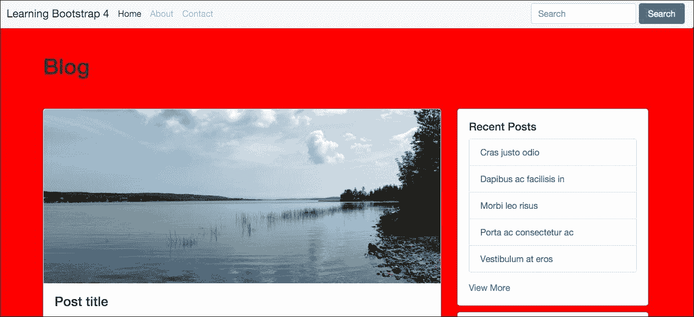
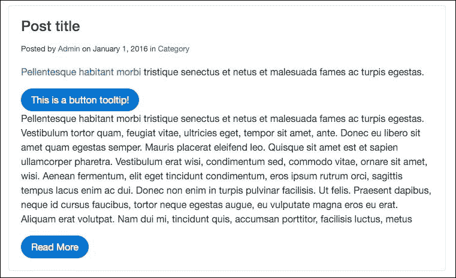
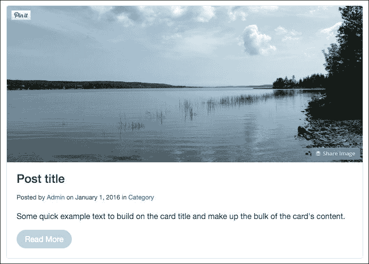
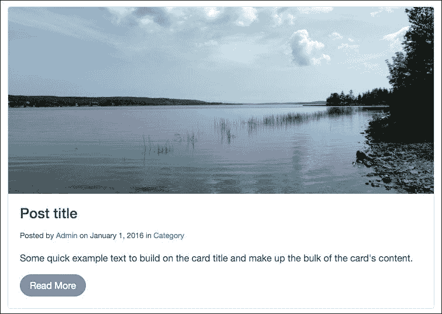
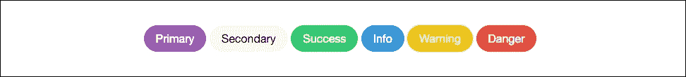
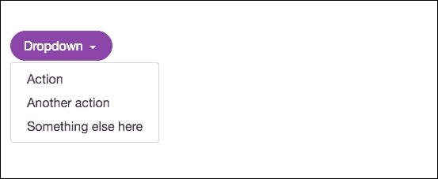
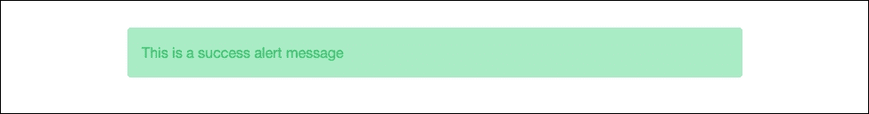
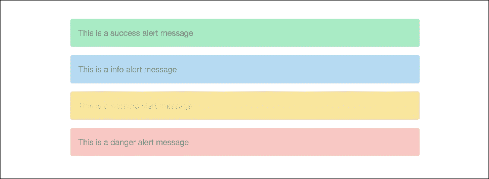

# 第七章：加入一些 Sass

到目前为止，我们已经介绍了很多不同的 Bootstrap 组件及其使用方法。在本章中，我们将转换方向，学习 Sass，这将允许你自定义组件的外观和感觉。我将首先介绍一些你需要了解的 Sass 基础知识，然后继续编写一些基本代码，最后展示使用变量在组件中节省宝贵时间的强大功能，当你创建你的 Web 应用或项目时。

# 学习 Sass 的基础知识

Sass 代表 **Syntactically Awesome Style Sheets**。如果你之前从未使用过或听说过 Sass，它是一个 CSS 预处理器。预处理器通过允许在 CSS 中使用变量、运算符和混入等功能来扩展常规 CSS。Sass 在项目的开发阶段编写，并且在将项目部署到生产环境之前需要将其编译成常规 CSS。我将在下一节中更详细地介绍这一点，但请放心，Harp.js 使得这一过程变得非常简单。

在 Bootstrap 的第 4 版本之前，所使用的 CSS 预处理器实际上是 Less。在一段时间内，Sass 和 Less 都在前端设计领域很受欢迎。然而，在过去的几年里，虽然 Sass 已经成为开发者的最佳选择，但 Bootstrap 团队决定在第 4 版本中进行更改。如果你熟悉 Less 但从未使用过 Sass，不用担心，因为它们的使用方式非常相似，所以你很快就能上手。

# 在博客项目中使用 Sass

如前文所述，Sass 是开发流程的一部分，浏览器无法直接读取其原生格式。在你能够部署项目之前，你需要将 Sass 文件转换或编译成常规的 CSS 文件。通常这需要你安装一个 Ruby gem，并且你必须手动编译你的代码才能进行测试。幸运的是，Harp.js 实际上内置了一个 Sass 编译器。所以当你运行 `harp compile` 命令来构建你的模板时，它也会将你的 Sass 文件编译成常规的 CSS。我相信在了解到这一点后，你开始更加喜欢 Harp 了。

## 更新博客项目

在我们继续之前，我们需要对我们的博客项目进行一些更新，以便为 Sass 准备。前往你的项目目录，导航到 CSS 目录。在这个目录中，创建一个名为 `custom.scss` 的新文件。

### 注意

Sass 文件的扩展名是 `.scss`。

我们在这里做的是创建一个自定义样式表，我们将用它来覆盖一些默认的 Bootstrap 视觉效果的 CSS。为此，我们需要在布局文件中在 Bootstrap 框架 CSS 文件之后加载这个自定义文件。打开项目目录根目录下的 `_layout.ejs`，在 `bootstrap.min.css` 之后插入以下代码行。这两行代码放在一起应该看起来像这样：

```js
<link rel="stylesheet" href="css/bootstrap.min.css"> 
<link rel="stylesheet" type="text/css" href="css/custom.css"> 

```

注意这里我使用的是`.css`文件扩展名来命名`custom.css`。这是因为，在文件编译之后，模板将寻找实际的 CSS 文件，而不是 Sass 文件。关键部分只是确保实际的文件名匹配，并且在布局文件中使用`.css`。在我们继续之前，让我们测试一下我们的 Sass 文件，以确保它已正确设置。在你的文本编辑器中打开`custom.scss`并添加以下代码：

```js
body { 
   background: red; 
} 

```

这只是一个简单的方法来确保 Sass 正在编译为 CSS，并且被插入到我们的布局中。编译你的项目并启动服务器。如果你一切都做对了，你主页的背景应该是红色，看起来像这样：



希望你看到的是这个，并且你可以确认你已经正确设置了文件。一旦你成功完成这个，删除 Sass 文件中我们输入的 CSS。

### 注意

在 Sass 文件中编写常规 CSS 是完全可接受的。理想情况下，你希望将常规 CSS 代码与 Sass 语法结合使用，以充分利用预处理器。

现在你已经完成了文件的设置，让我们开始学习更多关于在项目中使用 Sass 的知识。

## 使用变量

在 Sass 中，变量通过使用`$`符号字符来调用。如果你熟悉 Less，则使用`@`符号作为变量。所以在这种情况下，你只需要用`$`代替`@`。要编写一个变量，以`$`符号开始，然后插入一个描述性的关键字，可以是任何你喜欢的。以下是一些通用的变量名示例：

```js
$background-color 
$text-size 
$font-face 
$margin 

```

我将这些命名得很通用地，它们实际上与一些 CSS 属性名相匹配。这是一个好主意，如果多个开发者正在同一个项目上工作，它们很容易重用和理解。然而，正如我所说的，你可以随意命名你的变量。如果你想更有创意，你可以这样命名变量：

```js
$matts-best-color 
$awesome-background-color 
$fantastic-font-face 

```

这些是极端的例子，建议不要以这种方式命名变量。对你来说`$awesome-background-color`可能意味着红色，但对另一个人来说它可能意味着任何东西。总是以描述性的方式命名变量，使其有意义是一个好主意。

我已经向你展示了如何编写变量名，但等式的另一边是变量的实际值。让我们为我们的第一组变量名添加一些示例值：

```js
$background-color: #fff; 
$text-size: 16px; 
$font-face: helvetica, sans-serif; 
$margin: 1em; 

```

你编写 Sass 变量的方式与编写 CSS 属性的方式相同。也值得注意，你应该在样式表的顶部输入你的变量，这样它们就可以在你之后的 CSS 中使用。

## 在 CSS 中使用变量

现在我们已经定义了一些变量，接下来让我们将这些变量实际插入到一些 CSS 中。在`custom.scss`中的变量之后，输入以下代码：

```js
body { 
   background: $background-color; 
   font-size: $text-size; 
   font-family: $font-face; 
   margin: $margin; 
} 

```

因此，我们不是使用 CSS 属性的实际值，而是使用我们设置的变量名称。随着我们添加更多的 CSS，这开始变得更有力量。让我们重用一些这些变量：

```js
body { 
   background: $background-color; 
   font-size: $text-size; 
   font-family: $font-face; 
   margin: $margin; 
} 

h1 { 
   font-size: 36px; 
   font-family: georgia, serif; 
} 

h2 { 
   font-size: $text-size; 
   font-family: $font-face; 
} 

```

在这个例子中，你可以看到一些我应该解释的事情：

+   对于 `<h1>` 标签，我没有使用任何变量。我使用的是常规 CSS 属性值。

+   对于 `<h2>` 标签，我正在重用相同的变量来插入 `font-size` 和 `font-family` 的值。

随着你的样式表变得越来越长，我相信你会看到这种策略的价值。例如，如果我想将我的 `font-size` 改为 `24px`，我只需要将 `$text-size` 变量的值更改为 `24px`。我不需要在我的整个样式表中逐个更改所有值。这些只是你可以使用变量的基本操作。让我们看看更高级的使用案例。

## 使用其他变量作为变量值

这可能听起来有点复杂，但实际上你可以将一个变量作为另一个变量的默认值。一个很好的例子是在定义调色板时你可能想要这样做。你可以将十六进制值转换为可读的名称，然后用于其他变量。当你调试代码时，这会更容易扫描和理解。以下是我想要说明的例子：

```js
$black: #000; 
$white: #fff; 
$red: #c00; 

$background-color: $white; 
$text-color: $black; 
$link-color: $red; 

```

让我为你分解这里发生的事情：

+   首先，我为 `black`、`white` 和 `red` 创建了三个颜色变量

+   接下来，我为 `background-color`、`text-color` 和 `link-color` 创建了三个 CSS 属性变量；这些 CSS 属性变量的值是颜色变量

与使用十六进制数值作为 CSS 属性变量的值相比，我使用了颜色关键字变量，这更容易阅读和理解。这标志着 Sass 中变量介绍的结束。接下来，我们将学习如何将不同的文件导入 `custom.css` 并使用部分。

# 在 Sass 中导入部分

```js
@import directive to bring them all into a single master theme, which is then included in your project. Let's go over an example of how you could do this for a single component. In your project, go to the /css directory and create a new sub-folder called /components. The the full path should be:
```

```js
/css/components 

```

在 `/components` 目录中，创建一个新的 Sass 文件，并将其命名为 `_buttons.scss`。确保你始终在文件名开头插入一个下划线。编译器将忽略这些文件，因为下划线意味着它被插入到另一个文件中。在文件顶部输入以下内容作为标记：

```js
/* buttons */ 

```

保存按钮文件，然后打开 `custom.scss` 并在文件中添加以下行代码：

```js
@import "components/_buttons.scss"; 

```

这行代码使用了 `@import` 规则，这将允许我们将 `_buttons.scss` 文件导入我们称为 `custom.scss` 的主主题文件。正如我提到的，你需要这样做的原因是为了可维护性。这使得代码更容易阅读，并添加/删除组件，这也就是我们所说的使其更具模块化。

在我们测试以确保其工作之前，我们需要在我们的 `_buttons.scss` 文件中添加一些代码。以更改主按钮为例，让我们添加一些简单的 CSS：

```js
.btn-primary { 
  background-color: green; 
} 

```

添加此代码后，保存文件并执行 `harp compile`。然后启动服务器并查看主页；按钮将像这样变绿：


测试完之后，你可能想要移除那个自定义代码，除非你希望按钮保持绿色。这只是如何使用部分来使你的 Bootstrap 组件更加模块化的一个简单例子。我将在未来的章节中更深入地探讨这个话题，但现在我们将专注于使用 Sass 混合器。

## 使用混合器

在 CSS 中编写某些内容，例如浏览器供应商前缀，可能非常繁琐。混合器允许你将 CSS 声明分组在一起，这样你就可以在整个项目中重用它们。这很好，因为你可以使用一行代码而不是为每个浏览器编写多行代码来包含 `border-radius` 的代码。首先，打开 `custom.scss` 并在文件顶部插入以下代码：

```js
@mixin border-radius($radius) { 
  -webkit-border-radius: $radius; 
     -moz-border-radius: $radius; 
      -ms-border-radius: $radius; 
          border-radius: $radius; 
} 

```

让我们回顾一下这里发生的一些事情：

+   混合器总是以 Sass 中的 `@mixin` 关键字开始

+   随后，你想要包含要针对的属性名称以及设置一个变量，在这个例子中是 `$radius`

+   然后我们将 `$radius` 变量应用于每个浏览器前缀实例

我们已经设置了混合器来处理 `border-radius` 属性，但我们还需要将角落值添加到元素中。让我们更改默认 Bootstrap 按钮的 `border-radius` 值。打开 `_buttons.scss` 并插入以下代码：

```js
.btn { 
  @include border-radius(20px); 
 } 

```

让我来解释这里发生了什么：

+   我通过插入 `.btn` 类来针对所有 Bootstrap 按钮

+   插入 `@include` 关键字将获取 `border-radius` 混合器

+   最后，我提供了一个 `20px` 的值，这将使我们的按钮在每个端点看起来非常圆润

保存你的文件，运行 `harp compile` 命令，然后，当你用浏览器查看项目时，它应该看起来像这样：



这就结束了 Bootstrap 4 中使用混合器的相当简单的例子。你可以出于许多其他原因使用它们，但替换 CSS3 供应商前缀是最常见和最有用的之一。接下来，我们将覆盖 Sass 中一个稍微复杂的话题，即运算符的使用。

## 如何使用运算符

Sass 允许你在 CSS 中执行基本的数学运算，这有几个原因很有用。首先，你可以使用以下运算符 `+`, `-`, `*`, `/`, 和 `%`。为了让你了解如何在 CSS 中使用运算符，让我们学习如何将基于像素的网格转换为百分比。我们将创建两个像素列，然后使用一些 Sass 将它们转换为百分比。打开 `custom.scss` 并插入以下代码：

```js
.left-column { 
  width: 700px / 1000px * 100%; 
} 

.right-column { 
  width: 300px / 1000px * 100%; 
} 

```

现在，我已经在这里创建了两个列。在编译这个 Sass 运算符之后，`.left-column`类将具有 70%的宽度。`.right-column`类将具有 30%的宽度。所以如果我们把它们加起来，我们将得到大约四分之三的布局，左侧有一个较大的列，右侧有一个较小的列。运行`harp compile`命令来构建这段代码，然后打开`/www/css`文件夹中的`custom.css`文件。在那里你应该找到以下代码：

```js
.left-column { 
  width:70%; 
} 

.right-column { 
  width:30%; 
} 

```

如你所见，我们的 Sass 运算符已经被转换成了常规的百分比值。这只是你可以在 Sass 中使用运算符的一种方式；我鼓励你更多地尝试它们。接下来，我们将学习如何设置一个 Sass 变量库，你可以使用它来创建一个 Bootstrap 主题。

# 创建变量集合

当你在 Bootstrap 中使用 Sass 时，你想要做的最主要的事情之一是创建一个全局变量库，这样你就可以在整个主题中使用它。想想颜色、背景、字体、链接、边框、边距和填充等事情。最好只定义这些常用属性一次，然后你可以在不同的组件中重复使用它们。在我们走得太远之前，我们需要创建一个新的`.scss`文件。打开你的文本编辑器，创建一个新文件，并将其命名为`_variables.scss`。将此文件保存到`/css/components`目录中。目前，你可以让它保持空白。

## 将变量导入到自定义样式表中

现在我们已经创建了变量 Sass 文件，我们需要将其导入到我们的自定义样式表中。在你的文本编辑器中打开`custom.css`文件，并在文件顶部粘贴以下代码行：

```js
@import "components/_variables.scss"; 

```

重要的是要注意，此文件必须位于你的自定义样式表文件顶部。变量将级联通过它们之后的所有代码，因此它们必须首先加载。让我们开始用调色板填充我们的变量文件。

## 添加调色板

保存自定义样式表，然后返回变量文件。让我们首先将一个调色板插入到变量文件中，如下所示：

```js
$red: #e74c3c; 
$red2: #c0392b; 
$blue: #3498db; 
$blue2: #2980b9; 
$green: #2ecc71; 
$green2: #27ae60; 
$yellow: #f1c40f; 
$yellow2: #f39c12; 
$purple: #9b59b6; 
$purple2: #8e44ad; 
$white: #fff; 
$off-white: #f5f5f5; 
$grey: #ccc; 
$dark-grey: #333; 
$black: #000; 

```

如你所见，我已经设置了一个颜色调色板，我将在我的组件和后来的主题中使用这些颜色。以下是一些需要注意的关键点：

+   对于你的关键颜色，有两个变体是很好的。这对于像按钮这样的组件很有用，其中`$red`将是静态颜色，而`$red2`将是按钮的悬停或活动颜色。

+   我猜你已经能看出，使用像`$purple`这样的变量名比在长样式表中使用十六进制值更易读。

## 添加一些背景颜色

你应该添加到你的变量集合中的下一件事是背景颜色。随着我们通过这个变量文件前进，我们将为在样式表中反复使用的所有属性创建一个变量。

将以下背景颜色变量添加到文件中：

```js
$primary-background: $white; 
$secondary-background: $off-white; 
$inverse-background: $black; 

```

让我解释一下，作为最佳实践，我是如何设置这个的：

+   首先，我正在使用我们刚刚设置的色彩变量作为我们新的背景颜色变量的值。这使事情变得简单，同时也允许你更改颜色，并使其通过所有其他变量传递。这是一个节省时间的好技巧。

+   至少，定义一个`primary`、`secondary`和`inverse`背景颜色变量是个好主意。注意我这里使用了与 Bootstrap 相同的语言。这是一个值得遵循的好习惯。如果你认为你的项目中需要更多的背景颜色，可以自由定义。

设置背景颜色变量相当简单。接下来，让我们设置我们的基础排版变量。

## 设置排版变量

我们将要设置的下一个变量部分是基础排版样式。在背景颜色之后插入以下代码：

```js
$body-copy: helvetica, arial, verdana, sans-serif; 
$heading-copy: helvetica, arial, verdana, sans-serif; 
$base-font-size: 16px; 
$font-size: 1em; 
$base-line-height: 1.75; 

```

让我解释一下为什么我要设置以下排版变量：

+   为了保持一致性，有一个正文和标题字体样式是好的。在这种情况下，我正在使用相同的字体堆栈，但你也可以轻松地将标题变量更改为其他内容。当你编写 CSS 时，与尝试记住每个的整个字体堆栈相比，考虑正文或标题版本的`font-family`要容易得多。

+   对于`$base-font-size`变量，我们将使用像素值。这是唯一一个你会看到像素的地方，它被设置为所有其他内容的基础 em 大小。记住，ems 是一个相对尺寸单位，所以如果你想要使所有组件稍微大一点或小一点，你只需调整这个像素值即可。

+   我们还需要一个`$font-size`变量，它将被设置为`1em`。这是一个基础单位，并且可以通过 Sass 运算符轻松地在其他选择器中更改。我们将其设置为`1em`的原因是它使数学计算变得简单。

+   最后，我将`$base-line-height`设置为`1.75`，因为我喜欢我的文本中有一点额外的行间距。如果你对 Bootstrap 默认值满意，可以选择省略这一点，Bootstrap 的默认值更接近`1.5`。

现在我们已经设置了我们的排版变量，让我们继续编码我们的文本颜色。

## 编码文本颜色变量

与背景颜色一样，我们需要设置一些常见的文本颜色样式，以及定义一些基础 HTML 标签如`<pre>`和`<code>`的颜色。在文件中的排版变量之后插入以下标记：

```js
$primary-text: $black; 
$light-text: $grey; 
$loud-text: $black; 
$inverse-text: $white; 
$code-text: $red; 
$pre-text: $blue; 

```

让我分解一下每个变量是如何设置的：

+   与背景颜色变量一样，我们正在使用变量名作为我们的文本颜色变量的值。我包含了一个名为`$primary-text`的变量，并将其设置为黑色，遵循之前建立的相同命名约定。

+   我添加了`$light-text`和`$loud-text`变量，这样我们就可以轻松地在组件中应用更亮或更暗的文本。

+   我还包含了一个`$inverse-text`变量，用于与相应的背景颜色一起使用。

+   最后，我已经为`<pre>`和`<code>`标签设置了默认颜色，我们将使用这些颜色来覆盖默认颜色，使它们与我们的主题和调色板相匹配。

这就完成了我推荐的设置的所有颜色变量。如果你有其他需要覆盖的用途，请随时添加。接下来，我们将通过添加链接来继续设置一些文本颜色。

## 为链接编码变量

在我们的项目中，基本文本颜色之外，还需要为链接设置颜色。请在文件中的文本颜色之后添加以下代码：

```js
$primary-link-color: $purple; 
$primary-link-color-hover: $purple2; 
$primary-link-color-active: $purple2; 

```

在这个例子中，我决定只定义一个主要链接颜色以保持简单。在你的项目中，你可能还想设计出更多变体。

+   对于静态链接颜色，我使用的是`$purple`颜色变量。

+   对于主要链接的悬停和活动状态，我使用的是`$purple2`。正如我之前提到的，这是为什么在调色板中为每种颜色提供两种变体是个好主意的一个例子。

正如我说的，我保持了链接变量的简单性。尽量保持你的变量集尽可能紧凑是个不错的选择。如果你有太多变量，那么使用它们的目的就会受到影响，因为这将使你在代码中记住它们变得更难。接下来，让我们来看看我们应该为边框设置的变量。

## 设置边框变量

另一个经常使用的 CSS 属性是边框。这使得它成为 Sass 变量的优秀候选者。请在文件中的链接颜色之后插入以下代码：

```js
$border-color: $grey; 
$border-size: 1px; 
$border-type: solid; 
$border-focus: $purple; 

```

让我解释一下为什么我以这种方式设置边框变量：

+   当你决定`$border-color`的值时，你应该选择一个你认为在你的组件中最常使用的颜色。例如，在大多数设计中，`$grey`总是一个安全的选择。

+   与颜色值一样，你应该将`$border-size`设置为最常用的边框大小。将此设置为`1px`也是个好主意，因为如果你想要更细或更粗的边框，可以轻松地进行计算以应用 Sass 运算符。

+   对于`$border-type`，将其设置为最常用的值，这很可能是实线。

+   最后，设置一个常见的`$border-focus`颜色。这主要用于一旦激活的表单输入。选择一个与该变量形成对比的颜色是个好主意，这样当输入处于焦点时，它就会非常突出。

这就结束了所有我推荐的边框变量。接下来，让我们包括一些基本的布局变量。

## 添加边距和填充的变量

为了在整个设计中保持一致的间距，使用变量来设置`margin`和`padding`是个好主意，这样你就可以在尺寸上实现标准化。这些属性也经常被使用，因此将它们设置为可重用的变量是个明智的选择。请在边框标记之后添加以下代码：

```js
$margin: 1em; 
$padding: 1em; 

```

我在这里所做的只是设置一个基本尺寸（对于`padding`和`margin`都是）`1em`。再次强调，将这两个都设置为`1em`是一个好主意，因为如果你想要使用 Sass 运算符来增加或减少特定组件的值，这样做数学运算会更加容易。那些是我会推荐添加到你的变量文件中的最后一个变量。然而，在我们完成之前，我们应该至少在文件中添加一个混入。

## 将混入添加到变量文件中

由于混入（mixins）将在你的许多组件中使用，你应该在变量文件中定义它们。这样，它们就会在自定义主题文件中跟随它们的 CSS 代码中可用。至少，我建议设置一个用于`border-radius`的混入，我将在接下来的演示中展示如何做。你可能还想包括其他 CSS3 特性的额外混入。

## 编写`border-radius`混入

我们之前稍微讨论过混入，但现在我们已经实际将它们应用到我们的项目中，让我们再次回顾一下。在你的文件中布局变量之后插入以下代码：

```js
@mixin border-radius($radius) { 
  -webkit-border-radius: $radius; 
     -moz-border-radius: $radius; 
      -ms-border-radius: $radius; 
          border-radius: $radius; 
} 

```

在 Less 中，你可以在混入中为所有的`border-radius`设置一个全局值。然而，在使用 Sass 时，你必须设置上述公式，然后在实际的后续选择器中设置实际的`border-radius`值。一个例子可能看起来像这样：

```js
.my-component { 
  @include border-radius(5px); 
 } 

```

在这个例子中，我已经将`border-radius`混入添加到了一个名为`.my-component`的 CSS 类中。该组件将应用一个`border-radius`为`5px`。你需要在任何你想要应用`border-radius`混入的 CSS 类或组件上重复此步骤。这就完成了我们的变量 Sass 文件。我们在那里讨论了很多代码，所以让我们看看它们一起看起来是什么样子。我还在下面的代码中包含了一些 CSS 注释，以帮助提醒你每个部分的作用：

```js
/* variables */ 

/* color palette */ 
$red: #e74c3c; 
$red2: #c0392b; 
$blue: #3498db; 
$blue2: #2980b9; 
$green: #2ecc71; 
$green2: #27ae60; 
$yellow: #f1c40f; 
$yellow2: #f39c12; 
$purple: #9b59b6; 
$purple2: #8e44ad; 
$white: #fff; 
$off-white: #f5f5f5; 
$grey: #ccc; 
$dark-grey: #333; 
$black: #000; 

/* background colors */ 
$primary-background: $white; 
$secondary-background: $off-white; 
$inverse-background: $black; 

/* typography */ 
$body-copy: helvetica, arial, verdana, sans-serif; 
$heading-copy: helvetica, arial, verdana, sans-serif; 
$base-font-size: 16px; 
$font-size: 1em; 
$base-line-height: 1.75; 

/* text colors */ 
$primary-text: $black; 
$light-text: $grey; 
$loud-text: $black; 
$inverse-text: $white; 
$code-text: $red; 
$pre-text: $blue; 

/* links */ 
$primary-link-color: $purple; 
$primary-link-color-hover: $purple2; 
$primary-link-color-active: $purple2; 

/* border */ 
$border-color: $grey; 
$border-size: 1px; 
$border-type: solid; 
$border-focus: $purple; 

/* layout */ 
$margin: 1em; 
$padding: 1em; 

/* border-radius mixin */ 
@mixin border-radius($radius) { 
  -webkit-border-radius: $radius; 
     -moz-border-radius: $radius; 
      -ms-border-radius: $radius; 
          border-radius: $radius; 
} 

```

现在我们已经设置了所有的变量和混入，让我们继续学习如何应用它们。我们将继续构建我们之前开始的按钮示例，通过扩展它来创建一个自定义的外观和感觉。

# 自定义组件

让我们首先从自定义单个组件开始；稍后我会谈到创建一个主题，在那里你可以自定义 Bootstrap 中的所有组件。为了开始，我们将基于我们之前开始工作的按钮组件进行构建。在这个下一步中，我们将扩展我们添加的 CSS，以完全自定义组件。你想要做的是覆盖所有你想要更改的 CSS 类和属性。在某些情况下，这可能只是几件事情，但在其他情况下，你可能想要更改很多。

## 自定义按钮组件

首先，打开位于项目目录`/css/components`中的`_buttons.scss`。我们需要定制的第一件事是基础`.btn`CSS 类。一旦我们在那里应用了一些更改，我们将添加更多的 CSS 来控制不同按钮变体的外观和感觉。在文件顶部插入以下 CSS 以用于基础按钮类：

```js
.btn { 
  background-color: $grey; 
  border-color: $grey; 

  @include border-radius(20px); 
} 

```

为了保持简单，我只将覆盖几个属性。你可以完全自由地发挥创意，更改更多属性，使你的按钮看起来与 Bootstrap 默认链接不同。让我们分析一下我所做的：

+   首先，我将`background-color`和`border-color`设置为使用我们的调色板中的`$grey`。这是一个指出，如果你想做一个完整的主题，你需要覆盖所有组件上的所有 Bootstrap 默认颜色以匹配你的调色板的好时机。

+   接下来，我插入了`border-radius`混合并给它赋值为`20px`。这将使按钮变得非常圆滑。我追求这种外观，这样你可以清楚地看到按钮已经被定制。

保存这些更改后，转到终端并从项目目录的根目录运行`harp compile`命令。然后启动服务器并打开项目的主页，主页上有一堆按钮。你的按钮现在应该看起来像这样：



现在可能看起来不太有用，但重要的是我们首先定制基础`.btn`类；现在我们将继续构建组件，通过将我们的调色板应用于所有不同的按钮变体。

## 将按钮组件扩展以使用我们的调色板

在下一节中，我们将通过将我们的调色板应用于所有不同的 Bootstrap 按钮变体来进一步扩展按钮组件。在我们到达所有不同的按钮类型之前，让我们首先定制`.btn-primary`变体。在`_buttons.scss`文件中，在基础`.btn`样式之后输入以下代码：

```js
.btn-primary { 
   background-color: $purple; 
   border-color: $purple; 
} 

.btn-primary:hover, 
.btn-primary:active { 
   background-color: $purple2; 
   border-color: $purple2; 
} 

```

发生了几个不同的事情，让我们逐一回顾：

+   每个按钮变体都有两个 CSS 部分。第一个是按钮的静态状态。第二个是按钮的悬停和激活状态。

+   对于静态状态，我们使用`.btn-primary`类并插入`background-color`和`border-color`属性。我想让我的主按钮变成紫色，所以我插入了`$purple`Sass 变量来覆盖 Bootstrap 默认颜色。

+   对于其他状态，我们有`.btn-primary:hover`和`.btn-primary:active`。在这种情况下，我使用的是第二种紫色颜色变量，即`$purple2`。在悬停或激活按钮上会有稍微深一点的紫色阴影。

保存文件，在终端中运行`harp compile`命令，然后在浏览器中打开主页。如果一切代码都编写正确，你的按钮现在应该看起来像这样：



如您所见，主按钮现在变成了紫色！就这么简单；您现在可以开始为按钮组件应用自定义的外观和感觉。让我们通过在`_buttons.scss`文件中输入以下代码来构建按钮颜色的其他变体：

```js
.btn-secondary { 
   background-color: $off-white; 
   border-color: $off-white; 
} 

.btn-secondary:hover, 
.btn-secondary:active { 
   background-color: $grey; 
   border-color: $grey; 
} 

.btn-success { 
   background-color: $green; 
   border-color: $green; 
} 

.btn-success:hover, 
.btn-success:active { 
   background-color: $green2; 
   border-color: $green2; 
} 

.btn-info { 
   background-color: $blue; 
   border-color: $blue; 
} 

.btn-info:hover, 
.btn-info:active { 
   background-color: $blue2; 
   border-color: $blue2; 
} 

.btn-warning { 
   background-color: $yellow; 
   border-color: $yellow; 
} 

.btn-warning:hover, 
.btn-warning:active { 
   background-color: $yellow2; 
   border-color: $yellow2; 
} 

.btn-danger { 
   background-color: $red; 
   border-color: $red; 
} 

.btn-danger:hover, 
.btn-danger:active { 
   background-color: $red2; 
   border-color: $red2; 
} 

```

这段代码有很多，但应该相当容易理解。我只是为每个按钮变体重复了为主按钮完成相同的步骤。在这个过程中，我将默认的 Bootstrap 颜色值替换成了我们的自定义调色板。完成之后，您所有的按钮现在应该看起来像这样：



我们现在已经成功自定义了整个按钮组件。正如我之前提到的，您可能还想对按钮做一些其他的事情。然而，至少我们已经做了足够的事情来展示您如何使组件成为自己的。这个过程的下一步是逐个通过每个 Bootstrap 组件并应用相同的自定义过程。我们称之为编写您自己的 Bootstrap 主题。

# 编写主题

创建自己的 Bootstrap 主题是一项相当大的任务。好消息是，一旦您完成了它，您就可以为未来的主题重用大量的代码。这就是使您的代码模块化的真正力量所在。您不必每次都从头开始，可以重用旧代码并对其进行扩展。在上一个部分中，我们学习了如何自定义按钮组件，这是我们自己的主题的开始。让我们首先看看一些常见的 Bootstrap 组件，您可能想要为您的主题进行自定义。

## 需要自定义的通用组件

您可以通过多种方式为主题 Bootstrap。在某些情况下，您可能只需要自定义几个组件来获得独特的外观和感觉。然而，您可能希望进行更彻底的主题化过程，以便您的主题完全不像是默认的 Bootstrap 外观。在本节中，让我们首先列出一些您最可能想要自定义的通用组件。

接下来，我们将通过编写代码来自定义一些组件，以便您了解其工作原理。以下是我推荐自定义的组件列表：

+   按钮

+   下拉菜单

+   警报

+   导航栏

+   字体

+   表格

这个列表只是一个起点。如果您想要创建一个独特的主题，您真的应该尝试自定义所有 Bootstrap 组件。至少，您应该将它们更改为使用您的自定义调色板、字体和布局样式。我们已经涵盖了按钮，让我们跳到自定义下拉菜单组件，它是按钮的扩展。

## 主题化下拉菜单组件

下拉组件需要中等程度的定制，因此这是一个很好的起点，可以了解这个过程中涉及的内容。它还基于我们为按钮编写的代码，所以是自然的第二步。需要注意的是，某些组件可能需要大量的 CSS 来定制，而其他组件可能只需要一点。让我们先为下拉创建一个新的 Sass 文件。从你的项目文件夹中，在`css/components`目录下创建一个名为`_dropdown.scss`的新文件。现在你可以先留空，只需保存它。

一旦为下拉组件创建了新的 Sass 文件，我们需要将其导入到我们的主主题文件`custom.scss`中。在你的文本编辑器中打开自定义样式表，并在按钮组件的`@import`之后插入以下代码行：

```js
@import "components/_dropdown.scss"; 

```

现在我们已经准备好开始编写自定义的下拉样式。在你的文本编辑器中打开`_dropdown.scss`，并插入以下 CSS 的第一部分：

```js
.dropdown-menu { 
   color: $primary-text; 
} 

```

与上一节中的按钮一样，我只会更改最基本的属性来演示你可以如何自定义组件。你可以自由地自定义其他属性以获得更独特的外观和感觉。

让我们分析一下这里发生的事情。下拉组件由基础`.dropdown-menu` CSS 类组成。这控制了菜单的外观。在这里，我简单地更改了文本颜色，以使用`$primary-text`变量。

我们还需要对出现在下拉菜单中的链接列表做一些工作。在你刚刚输入的第一部分之后插入以下 CSS：

```js
.dropdown-item:focus, 
.dropdown-item:hover { 
   color: $primary-text; 
   background-color: $secondary-background; 
} 

```

让我分析一下这里发生的事情：

+   这些 CSS 类控制下拉菜单中每个列表项的悬停和焦点状态。同样，我已经将其设置为使用我们的`$primary-text`字体颜色。

+   当你悬停在列表项上时，背景颜色会改变。我已经将那个背景颜色更改为使用我们的`$secondary-background`颜色变量。在这种情况下，你应该使用背景颜色变量，而不是自定义颜色变量。这样做的原因是，随着你编写代码的进展，更容易跟踪你正在使用的背景颜色。

我们需要做的最后一件事是使用一些额外的代码更新实际的下拉按钮触发器。将 CSS 的最后部分输入到文件中：

```js
.open > .btn-primary.dropdown-toggle:focus { 
   background-color: $purple2; 
   border-color: $purple2; 
} 

```

当点击下拉按钮触发器时，`.open` CSS 类将动态地插入到 HTML 代码中。这启动了按钮类的一个独特变体，下拉切换焦点。这可能听起来很复杂，但你需要知道的是，你需要将这个选择器设置为我们的`$purple2`颜色，以便与按钮的其余部分匹配。

我已经覆盖了`background-color`和`border-color`属性，使用我们的调色板中的`$purple2`。

就这样，下拉组件现在已经被主题化，以匹配我们的外观和感觉。如果你在浏览器中预览它，当菜单打开时应该看起来像这样：



现在我们已经完成了下拉组件，让我们继续学习如何为主题警报组件。

## 自定义警报组件

Bootstrap 中的警报组件主题化相当简单。与按钮组件一样，它有几个变体。让我们首先编写默认颜色方法的 CSS。创建一个名为 `_alerts.scss` 的新文件，并将其保存到 `css/components` 目录中。别忘了使用以下代码行将其导入到 `custom.scss` 文件中：

```js
@import "components/_alerts.scss"; 

```

一旦你设置了文件，让我们开始编写成功警报组件的代码：

```js
.alert-success { 
   color: $green; 
   background-color: lighten( $green, 30% ); 
   border-color: lighten( $green, 30% ); 
} 

```

你现在看到的应该开始变得熟悉。然而，我介绍了一些新内容，我需要解释：

+   这是一个成功警报，所以它应该是绿色的。我首先做的事情是将文本颜色更改为使用我们调色板中的绿色 `$green` 变量。

+   对于 `background-color` 和 `border-color` 属性，我使用了一个新的东西，Sass 函数。在这种情况下，我想得到一个比我的文本稍微浅一点的绿色。而不是引入另一个绿色颜色变量，我可以使用 Sass 函数来加亮基 `$green` 变量颜色。

+   要创建函数，你使用 `lighten` 关键字。在括号内，你需要包含你想要的目标变量名，在这个例子中是 `$green`，最后包含一个百分比值来指定加亮的程度。这是一个节省你创建更多变量的好方法。

一旦你将这段代码编写完成，在浏览器中应该看起来是这样的：



如你所见，我们正在使用我们调色板中的绿色值。让我们继续，并为剩余的警报栏变体自定义颜色。将以下代码输入到 `_alerts.scss` 文件中：

```js
.alert-info { 
   color: $blue; 
   background-color: lighten( $blue, 30% ); 
   border-color: lighten( $blue, 30% ); 
} 

.alert-warning { 
   color: $yellow; 
   background-color: lighten( $yellow, 30% ); 
   border-color: lighten( $yellow, 30% ); 
} 

.alert-danger { 
   color: $red; 
   background-color: lighten( $red, 30% ); 
   border-color: lighten( $red, 30% ); 
} 

```

其他警报遵循与成功版本相同的模式。当你完成时，在浏览器中它们应该看起来像这样：



如你所见，警报现在正在使用我们的调色板。让我们继续到最后一个组件，我将向你展示如何自定义，那就是排版。

## 自定义排版组件

排版组件并不难自定义。我们将基于我们设置的基变量来应用它们到适当的 HTML 标签。就像我们处理其他组件一样，首先创建一个名为 `_typography.scss` 的新文件，并将其保存到 `css/components` 目录中。一旦完成，使用以下代码行将其导入到 `custom.scss` 文件中：

```js
@import "components/_typography.scss"; 

```

让我们从通过应用一些样式到基本标题标签开始自定义类型：

```js
h1, h2, h3, h4, h5, h6 { 
   font-family: $heading-copy; 
   color: $primary-text; 
} 

```

在这里，我简单地使用了`$heading-copy`变量并将其应用于所有的 HTML 标题标签。这将允许我们自定义标题字体在所有标题中使用。我还添加了`$primary-text`变量，以便我们的标题使用正确的文本颜色。接下来，让我们看看一些你可能想要覆盖的杂项文本样式：

```js
small { 
   color: $light-text; 
} 

pre { 
   color: $pre-text; 
} 

code { 
   color: $code-text; 
} 

```

正如我们处理基本变量一样，我现在将这些变量应用到实际的选择器上。让我们分解一下：

+   对于`<small>`HTML 标签，我想让它看起来更微妙，所以我将文本颜色设置为使用`$light-text`变量。

+   我故意为 HTML 的`<pre>`和`<code>`标签设置了颜色文本变量。现在我已经将这些变量`$pre-text`和`$code-text`应用到这些标签上。

这涵盖了您想要定制的部分基本排版样式。您还可以添加更多，但我将让您自己探索这些。这也适用于所有的 Bootstrap 组件。我们只是触及了您可以为 Bootstrap 主题进行的自定义程度的表面。然而，我认为我已经为您提供了关于您需要做什么来编写自己的 Bootstrap 主题的良好介绍。

# 摘要

这节课到此结束。我们在这节课中涵盖了大量新内容，包括：Sass 的基础知识、如何在 Bootstrap 中使用 Sass、如何创建 Sass 变量库、如何将这些变量应用到自定义 Bootstrap 组件，以及最后如何开始编写自己的 Bootstrap 主题。

现在是时候尝试一些动手项目了。在跳到下一节课之前，我建议您阅读《构建过程手册》（代码包）中提到的步骤。

# 评估

1.  以下哪个是正确的 CSS 代码？

    1.  `.test { background: "red"; }`

    1.  `class test { background: red; }`

    1.  `body { background: red; }`

    1.  `.test { "background": "red"; }`

1.  以下哪个是正确声明 CSS 变量的符号？

    1.  `var`

    1.  `$`

    1.  `%`

    1.  `.`

1.  在 Sass 中导入`test.scss`文件的正确语法是什么？

    1.  `@import "components/_test.scss";`

    1.  `#import "components/test.scss";`

    1.  `#import "components/_test.scss";`

    1.  `@import "components/test.scss";`

1.  以下哪个代码向文件添加了`背景颜色`变量？

    1.  `$primary-background: $white;`

    1.  `background-color: $white;`

    1.  `$background-color: white;`

    1.  `background-color: white;`

1.  以下哪个选择器在`鼠标悬停`时选择链接？

    1.  `:link`

    1.  `:hover`

    1.  `:focus`

    1.  `:selection`
