# 第十章. 启动电子商务

在构建了我们的业务主页后，是时候设计我们的在线商店了。

我们将在上一章的设计基础上进行构建，添加一个包含以下元素的页面：

+   一系列的产品缩略图、标题和描述的网格

+   一个左侧边栏，包含按类别、品牌等过滤产品的选项

+   面包屑和分页以简化对库存的导航

花几分钟时间访问 Zappos([`www.zappos.com`](http://www.zappos.com))和 Amazon([`www.amazon.com`](http://www.amazon.com))等网站。搜索或浏览产品，你将看到具有与我们本章将要创建的类似功能的产品网格。

完成后，我们希望我们的产品页面在中等、大和超大屏幕上看起来如下截图所示：

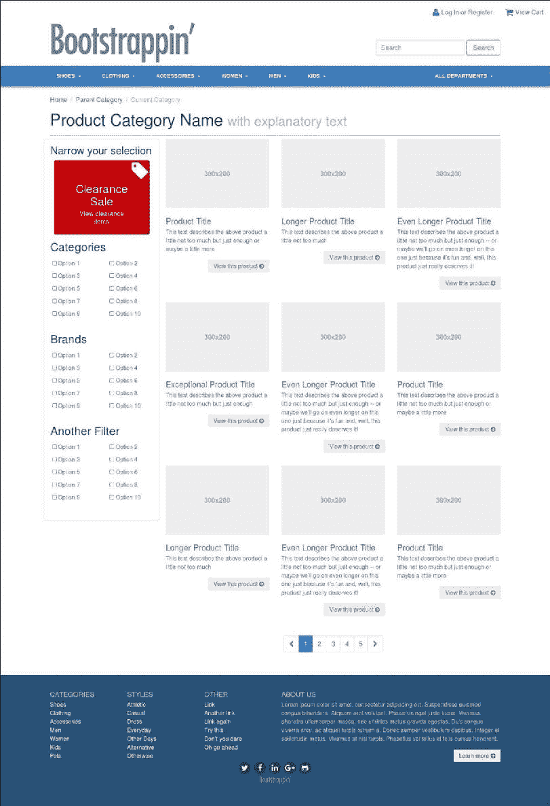

中等大小和超大屏幕的布局

在小屏幕上，我们希望我们的产品页面调整到以下单列布局：

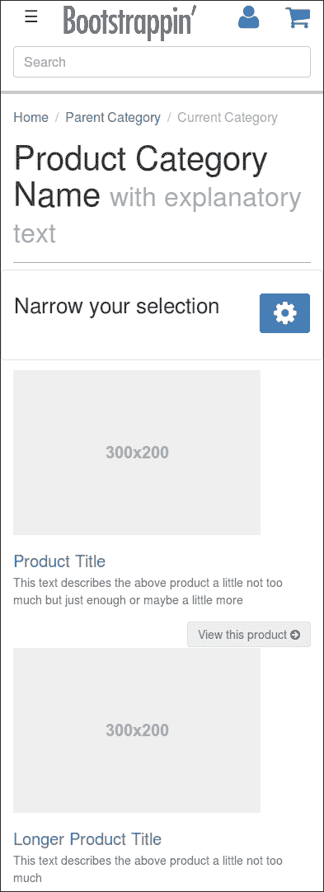

Bootstrap 为我们完成这个设计提供了很大的帮助，之后我们可以使用 Sass 的力量来完善细节。

# 检查我们的产品页面标记

你会在这个文件夹`Lesson 10/start`中找到准备好的本章文件。该项目直接基于 Lesson 9 的完成设计，*启动业务*。如果这些文件中的任何内容看起来很奇怪，你可能需要在继续之前回顾 Lesson 9，*启动业务*。

### 小贴士

如果你还没有下载练习文件，你可以在[`packtpub.com/support`](http://packtpub.com/support)找到它们。

在进行下一步之前，请在您的控制台中运行`bower install`和`npm install`命令！对于本章，`html/pages`目录中有一个新文件，`products.html`。

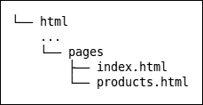

在您的编辑器中打开`products.html`以查看标记。让我们检查其内容。

在`main role="main"`元素内部是我们将找到新内容的地方。在这里，你可以按照它们出现的顺序找到以下元素：

+   标记为有序列表的面包屑链接

+   在`h1`标题内的页面标题

+   一系列用于过滤产品的选项

+   九个带有缩略图、标题、描述和按钮的产品

+   在产品下方和之前的不带序列号的分页链接列表

您可以运行 `bootstrap watch` 命令，并将浏览器指向 `http://localhost:8080/products.html` 来在浏览器中查看文件。您会看到还有很多工作要做。面包屑还没有看起来像面包屑，过滤选项看起来像一系列长列表，我们的产品项布局不均匀（并且在某些地方破损），等等。

不要让这些当前的不完美让您担心。这些是我们将在以下步骤中解决的问题。以下是即将发生的事情：

+   我们将应用 Bootstrap 的内置样式到面包屑、页面标题和分页，然后进一步自定义它们。

+   我们将改进九个产品项的布局，创新 Bootstrap 网格系统，以在断点处保持视觉上井然有序的网格。

+   我们将通过增强布局并使用 Font Awesome 图标来提供复选框来设置过滤选项的样式。

在您的控制台中运行 `bootstrap watch` 或 `gulp` 命令，并将浏览器指向 `http://localhost:8080/products.html`。保存 Sass 或 HTML 模板后，浏览器将自动重新加载。

现在我们有了计划，让我们开始吧！

# 设置面包屑、页面标题和分页的样式

在以下步骤中，我们将应用 Bootstrap 样式到我们的面包屑、页面标题和分页，然后根据我们的设计进行自定义：

1.  在您的编辑器中打开 `products.html`。

1.  在 `h1` 页面标题正上方的有序列表中找到，将 `"breadcrumb"` 类添加到 `ol` 标签中，然后将 `"active"` 类添加到最后一个列表项中，如下所示：

    ```js
        <ol class="breadcrumb"> 
          <li class="breadcrumb-item"><a href="/">Home</a></li> 
          <li class="breadcrumb-item"><a href="#">Parent Category</a></li> 
          <li class="breadcrumb-item active">Current Category</li> 
        </ol> 

    ```

    这些类与 Bootstrap 面包屑样式相对应，您可以在 [`v4-alpha.getbootstrap.com/components/breadcrumb/`](http://v4-alpha.getbootstrap.com/components/breadcrumb/) 找到相关文档。

    保存并刷新您的浏览器。您应该会看到以下截图所示的结果：

    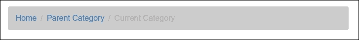

1.  为了自定义此设计的面包屑，让我们移除浅灰色背景和额外的填充。

    +   让我们将 `padding` 设置为 `0` 并完全移除 `background-color`。

    +   在 `scss/_includes` 目录中创建一个新的 Sass 部分文件，命名为 `_breadcrumb.scss`，并向其中添加以下 SCSS：

        ```js
        .breadcrumb {
        padding: 0;
        background-color: initial;
        }
        ```

1.  不要忘记按照以下方式将 `new _breadcrumb.scss` 部分文件导入到您的 `app.scss` 文件中：

    ```js
    // Components 
    @import "includes/breadcrumb"; 

    ```

1.  现在是页面标题。页面标题是通过在 `page-header` 类的 `div` 标签中嵌套顶级页面标题来工作的。`page-header` 类的 SCSS 代码可以在新的 `scss/includes/_page-header.scss` 部分文件中进行编辑，可能看起来如下所示：

    ```js
    // Page header 
    // ------------------------- 
    .page-header { 
      padding-bottom: ($spacer / 2); 
      margin: $spacer 0 ($spacer / 2); 
      border-bottom: 1px solid $page-header-border-color; 
    } 

    ```

    注意，您必须在 `scss/includes/_varaibels.scss` 文件中声明 `$page-header-border-color;` 变量，当然也必须在主 `app.scss` 文件中导入 `scss/includes/_page-header.scss` 部分文件。

1.  让我们相应地调整我们的标记。对于标题，我们将使用带有 Bootstrap 的`display-*`类的`h1`标签。我们还在一个带有 Bootstrap 的`text-muted`类的`small`标签内添加了一些文本，以利用 Bootstrap 的样式为我们的标题添加解释性注释：

    ```js
        <div class="page-header"> 
          <h1 class="display-5">Product Category Name <small class="text-muted">with explanatory text</small></h1> 
        </div> 

    ```

    这将产生以下结果：

    

1.  你可以在以下 URL 了解更多关于 Bootstrap 的排版和标题类：[v4-alpha.getbootstrap.com/content/typography/#headings](http://v4-alpha.getbootstrap.com/content/typography/#headings)。

1.  最后，是分页。我们为此的标记位于关闭`main`标签（`</main>`）的几行之上。在那关闭标签之上，你会看到`.container`、`.row`和`.products-grid`的注释关闭`div`标签：

    ```js
              </div><!-- /.products-grid --> 
            </div><!-- /.row --> 
          </div><!-- /.container --> 
        </main> 

    ```

    Bootstrap 的分页样式文档可以在[v4-alpha.getbootstrap.com/components/pagination](http://v4-alpha.getbootstrap.com/components/pagination)找到。

    要应用这些样式，我们只需要在位于关闭`.products-grid`标签几行之上的`ul`标签中添加`class="pagination"`：

    ```js
      <ul class="pagination"> 
        <li class="page-item"> 
          <a class="page-link" href="#" aria-label="Previous"> 
            <span aria-hidden="true" class="fa fa-chevron-left"></span> 
            <span class="sr-only">Previous</span> 
          </a> 
        </li> 
        <li class="page-item active"> 
          <a class="page-link" href="#">1 <span class="sr-only">(current)</span></a> 
        </li> 
        <li class="page-item"><a class="page-link" href="#">2</a></li> 
        <li class="page-item"><a class="page-link" href="#">3</a></li> 
        <li class="page-item"><a class="page-link" href="#">4</a></li> 
        <li class="page-item"><a class="page-link" href="#">5</a></li> 
        <li class="page-item"> 
          <a class="page-link" href="#" aria-label="Next"> 
            <span aria-hidden="true" class="fa fa-chevron-right"></span> 
            <span class="sr-only">Next</span> 
          </a> 
        </li> 
      </ul> 

    ```

    导航链接的标记可能包含不同的类来设置链接的状态。活动 CSS 类清楚地表明链接处于活动状态，而禁用 CSS 类则允许你给一些链接设置禁用状态。

    禁用项的 HTML 代码可能看起来像以下这样：

    ```js
     <li class="page-item disabled"> 
       <a class="page-link" href="#" tabindex="-1" aria-label="Previous"> 
         <span aria-hidden="true">&laquo;</span> 
         <span class="sr-only">Previous</span> 
       </a> 
     </li> 

    ```

    禁用项和活动项均不可点击。你可以添加`pagination-lg`或`pagination-sm`CSS 类来设置更大的或更小的分页，如下所示：

    ```js
    <ul class="pagination pagination-lg"> 
      ... 
    </ul> 

    ```

    还要注意，Bootstrap 考虑了无障碍性。导航包含各种`aria-*`属性。**可访问的富互联网应用**（**ARIA**）是一组特殊的无障碍属性，可以添加到任何标记中，但特别适合 HTML。你可以在**万维网联盟**（**W3C**）的网站上了解更多关于 ARIA 在 HTML 中的信息，见[`www.w3.org/TR/html-aria/`](https://www.w3.org/TR/html-aria/)。具有 Bootstrap 的 sr-only 类的元素为屏幕阅读器提供了额外的信息。

    ### 小贴士

    对于“下一页”和“上一页”项，我已经提供了 Font Awesome 图标的`span`标签，分别是`fa-chevron-left`和`-right`。这给我们带来了以下截图所示的结果：

    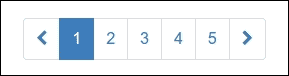

1.  让我们在网格下方居中对齐分页。首先，将其包裹在一个父`div`标签中。我们将在这个标签上放置`row`类以确保清除其上方的内联内容，然后我们将添加一个适当命名的 Bootstrap 类`text-xs-center`。命名中的`xs`表示对于超小网格及以上：

    ```js
    <nav class="text-xs-center">
    <ul class="pagination">
    <li> ...
    </ul>
    </nav>
    ```

# 调整产品网格

在您开始之前，您应该注意到由 holder.js 图像占位符提供的产品图像，如第 9 课“启动业务”中所述，不是响应式的。让我们通过向我们的`app.scss`文件添加以下 SCSS 代码，使所有图像默认为响应式：

```js
// make images responsive by default 
img { 
  @extend .img-fluid;     
} 

```

默认使图像响应式的过程。它影响所有图像。在`scss/includes/_header.scss`文件中设置的宽度现在也被忽略的 logo 也变得响应式了。您可以通过在`app.scss`文件中在导入`_header.scss`文件之前放置响应式图像的 SCSS 代码来解决此问题。

您还应该检查在默认情况下使图像响应式后页脚徽标。您会发现徽标不再居中。`img-fluid`类将您的图像转换为块级元素。块级元素不能通过 text-align: center;声明居中。您可以在文件中使用以下 CSS 代码再次居中徽标：

```js
  .social-logo { 
    img { 
      margin 0 auto; 
    } 
  } 

```

现在，让我们使我们的产品网格看起来应该是的样子。在我们开始之前，我们将产品网格移动到自己的 HTML 模板文件中。创建一个新的 HTML 部分，称为`html/includes/products-grid.html`。

在`html/includes/products.html`文件中，使用以下代码包含产品网格：

```js
      <div class="products-grid col-md-9">   
        {{> products-grid }} 
      </div> 

```

如果您检查产品项的标记，您会看到每个项都被分配了一个`col-sm-4`类：

```js
<div class="product-item col-sm-4"> 

html/pages/products.html file:
```

```js
<!-- Add the extra clearfix for only the required viewport --> 

<div class="clearfix hidden-sm-down"></div> 

```

然后，我们希望我们的网格在中等屏幕上每行减少到两个产品，而大型和超大型视口将每行有三个项目。为了实现这一点，我们需要在每个产品项中找到并替换类，使其如下所示：

```js
<div class="product-item col-md-6 col-lg-4"> 

```

这些类将使每个产品项在超小和小的视口中设置为半宽度，然后过渡到中等和大型视口的三分之一宽度。

前面的更改还意味着我们必须替换和扩展我们的响应式列重置如下：

1.  在每三个项目之后，HTML 代码应如下所示：

    ```js
    <!-- Add the extra clearfix for only the required viewport --> 
    <div class="clearfix hidden-md-down"></div> 

    ```

1.  前面的代码中的`hidden-sm-down`类已被替换为`hidden-sm-down`类。然后，在每个第二个项目之后添加以下 HTML 代码：

    ```js
    <!-- Add the extra clearfix for only the required viewport --> 
    <div class="clearfix hidden-sm-down hidden-lg-up"></div> 

    ```

1.  在第六个项目之后，现在您将得到以下 HTML 代码：

    ```js
    <!-- Add the extra clearfix for only the required viewport --> 
    <div class="clearfix hidden-md-down"></div> 
    <!-- Add the extra clearfix for only the required viewport --> 
    <div class="clearfix hidden-sm-down hidden-lg-up"></div> 

    ```

1.  上面的第六个项目之后的 HTML 代码应替换为以下内容：

    ```js
    <!-- Add the extra clearfix for only the required viewport --> 
    <div class="clearfix hidden-sm-down"> 

    ```

1.  产品项现在将在中等视口中以两列布局：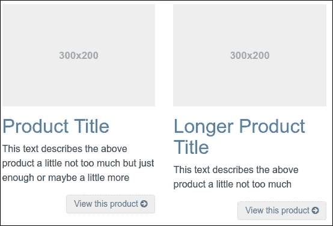

1.  然后，我们的网格将在大型和超大型视口中转换为三列布局：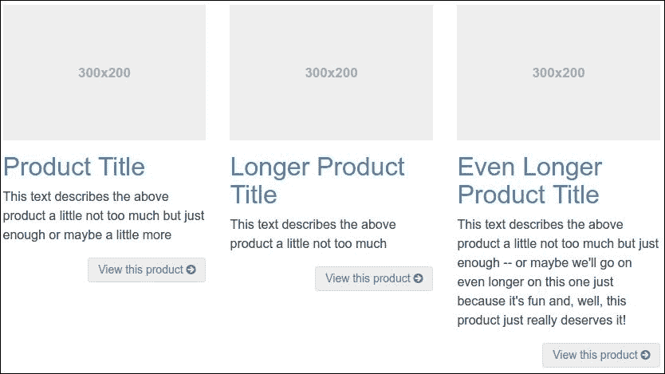

1.  让我们调整网格项的样式，以增强其视觉呈现。完成此操作后，我们可以修复这个布局问题。

1.  由于我们将编写自定义样式，请在您的编辑器中创建并打开`sccs/includes/_products-grid.scss`文件，并将其导入到主`app.scss`文件中。

1.  让我们编写一些样式来调整图像宽度、字体大小、填充和边距，如下面的代码行所示：

    ```js
    .product-item { 
      padding-bottom: ($spacer-y * 2); 

      h2 { 
        font-size: $font-size-lg; 
        line-height: $line-height-lg; 
        padding: 0; 
        margin-top: ($spacer-y / 7); 
        margin-bottom: ($spacer-y / 8); 
      }   
      p { 
        font-size: $font-size-sm; 
        line-height: $line-height-sm; 
        color: $gray; 
      } 
    } 

    ```

1.  这些样式将实现以下效果：

    1.  为每个产品项添加底部填充。

    1.  将 `h2` 标题的字体大小减少到我们的 `$font-size-lg` 的大小。

    1.  将 `p` 字体的尺寸减少到我们的 `$font-size-sm` 值。

    1.  通过添加 `!important` 来减少 `h2` 的填充，以覆盖我们在标准页面中应用的任何冲突规则。

    1.  将 `p` 字体的颜色设置为 `$gray`。

保存这些新样式，并运行 `bootstrap watch` 或 `gulp` 命令。尽管布局在某些地方仍然会损坏，但你应该会在产品项的样式上看到显著的改进，如下面的截图所示：

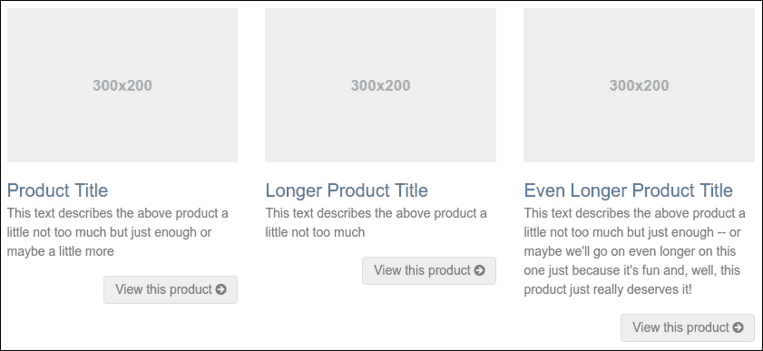

这是一件令人赏心悦目的事情。

## 不要忘记 Card 模块

在前面的部分中，你使用了 Bootstrap Grid 来构建产品网格。你也可以使用 Bootstrap 的新卡片模块来构建产品网格。卡片包括标题、页脚、顶部和底部图像盖子。

首先，创建一个新的 HTML 部分文件名为 `html/includes/product-grid-cards.html`，使用 Cards 模块重新构建产品网格。每个卡片的 HTML 代码应如下所示：

```js
    <div class="card"> 
      <a href="#"></a> 
      <div class="card-block"> 
        <h4 class="card-title"><a href="#">Product Title</a></h4> 
        <p class="card-text">This text describes the above product a
        little not too much but just enough or maybe a little more</p> 
        <a class="btn btn-secondary btn-sm pull-sm-right" href="#">View
        this product <i class="fa fa-arrow-circle-right"></i></a> 
      </div> 
    </div> 

```

Bootstrap 允许你将卡片组织成组或 Deck。在这个例子中，你将使用 Deck。Deck 包含一组等宽等高的卡片，这些卡片彼此不相连。Card Deck 的 HTML 结构将如下所示：

```js
<div class="card-deck-wrapper"> 
  <div class="card-deck"> 
    <div class="card product-item"> 
   --- 
    </div> 
    <div class="card product-item"> 
   --- 

```

你必须将每块三个卡片的块包裹在其自己的 card-deck 包装器中。

卡片和 Deck 组在 576 像素之间的额外小网格和小网格处有一个断点。在断点以下，卡片将堆叠。对于 576 到 768 像素之间的中小网格，每行也有三个卡片。这些卡片非常小，所以你必须使用以下 SCSS 代码来减小中小网格中按钮的大小：

```js
.product-item { 
  .btn-sm { 
    @include media-breakpoint-only(sm) { 
       font-size: $font-size-sm * 0.8; 
    } 
  } 
} 

```

在前面的代码中，我们已经减小了小视图中按钮的大小。现在让我们为较大视口的卡片之间添加一些空间。

在 `scss/includes/_product-grid.scss` 文件中，你可以添加以下 SCSS 代码来在卡片之间创建一些空间：

```js
@include media-breakpoint-up(sm) { 
  .card-deck { 
      padding-bottom: ($spacer-y * 2); 
  } 
} 

```

使用 Card Deck，你的产品网格可能看起来如下面的截图所示：

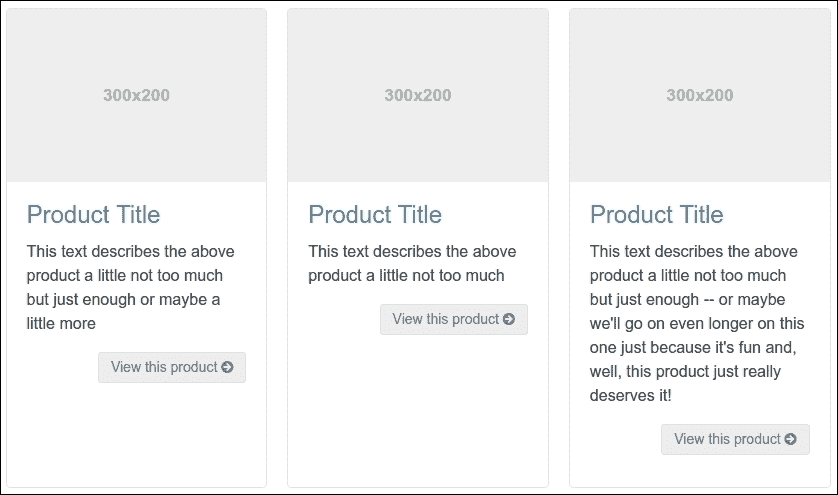

### 使用 CSS3 Flexbox 布局模块的卡片

Bootstrap 内置了 flexbox 支持选项。你可以通过将 `$enable-flex` Sass 变量设置为 true 来启用 flexbox 支持。

创建一个新的 HTML 部分文件名为 `html/includes/product-grid-cards-flexbox.html` 以测试 flexbox 布局。别忘了按照以下方式替换 `html/product.html` 文件中的包含语句：

```js
{{> products-grid-cards-flexbox}} 

```

在 `scss/includes/_variables.scss` 文件中，添加以下 SCSS 代码行：

```js
// Options 
// 
// Quickly modify global styling by enabling or disabling optional features. 
$enable-flex:           true; 

```

`html/includes/product-grid-cards-flexbox.html`文件可能包含与`html/includes/product-grid-cards-flexbox.html`文件中使用的 HTML 代码类似的代码。当启用 flexbox 支持时，不需要 card-deck-wrapper 包装器。你可以将所有卡片包装到一个单独的 card-deck 包装器中。断点仍然设置为 576 像素。对于比断点更宽的视口，flexbox 默认是响应式的。空间越大，每行上的卡片就越多。在大型和超大型视口中，默认情况下每行有四个卡片。使用 flex-basis 属性来获取每行三个卡片。flex-basis 属性指定了灵活项的初始长度。你可以使用以下 SCSS 代码来设置 flex-basis 属性：

```js
.card-deck .card { 
  flex-basis: 30%; 
} 

```

在中等网格中，每行将有两个卡片。最后一行只有一个卡片，因为我们有奇数个卡片。最后一个卡片将占据 100%的可用空间，其外观如下所示：

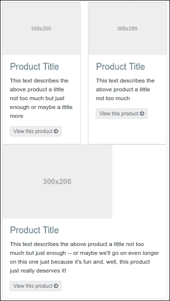

你可以通过设置每个卡片的 max-width 来尝试修复这个问题：

```js
@include media-breakpoint-up(sm) { 
  .card-deck .card { 
    max-width: 46%; 
  } 
} 

```

或者，你可以通过使用 Bootstrap 的响应式实用工具类来添加一个仅在中等网格中可见的空卡片：

```js
<div class="card hidden-xs-down hidden-lg-up"> 
   <!-- empty card --> 
</div> 

```

如果你还没有移除卡片的边框和圆角，你应该为空卡片移除它们。你可以使用 Sass 移除边框和/或圆角。使用以下 SCSS 代码从空卡片中移除边框：

```js
@include media-breakpoint-up(sm) { 
  .card-deck .card { 
    &:last-child { 
      border: initial; // 0       
    } 
  } 
} 

```

在前面的代码中，`:last-child`是一个 CSS 伪类。CSS 伪类可以添加到选择器中，指定要选择元素的特定状态。`:last-child`伪类选择任何是其父元素的最后一个子元素的元素。你可以在以下网址了解更多关于`:last-child`伪类的信息：[`developer.mozilla.org/nl/docs/Web/CSS/:last-child`](https://developer.mozilla.org/nl/docs/Web/CSS/:last-child).

### 注意

注意，带有`&`父引用的 SCSS 代码在最后子伪类之前编译成以下 CSS 代码：

`.card-deck .card:last-child order: initial; }`

现在，中等网格上的最后几个卡片应该看起来如下：

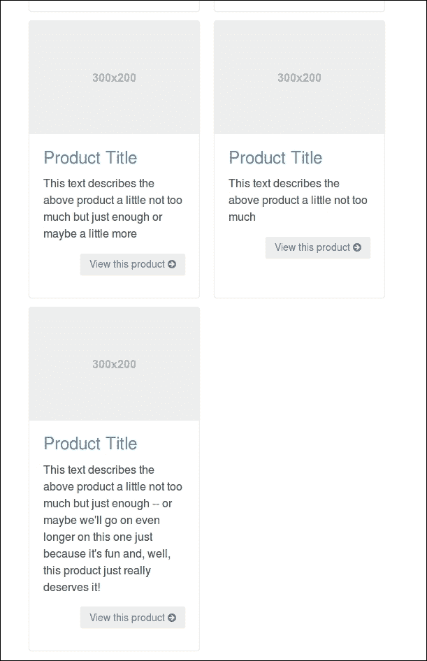

当然，你也可以通过以下 SCSS 代码仅移除圆角：

```js
.card-deck .card { 
    border-radius: initial; 
} 

```

### 注意

你可以在以下网址了解更多关于 CSS3 flexbox 布局模块的信息：[`developer.mozilla.org/en-US/docs/Web/CSS/CSS_Flexible_Box_Layout/Using_CSS_flexible_boxes`](https://developer.mozilla.org/en-US/docs/Web/CSS/CSS_Flexible_Box_Layout/Using_CSS_flexible_boxes)。Internet Explorer 9 及更早版本不支持 flexbox。

接下来，我们将为过滤选项侧边栏设置样式。

# 设置选项侧边栏的样式

现在，让我们为我们的过滤选项设置样式。这些选项出现在我们的产品项目标记之前。在小、中和大视口中，它们显示为左侧边栏。

目前，它们看起来如下面的截图所示：

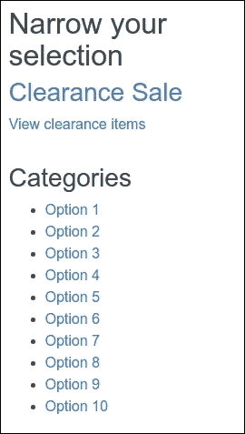

对于我们的最终设计，我们希望将**清仓大甩卖**链接转换成一个吸引人的超大按钮，并将过滤选项排列成两列，而不是使用项目符号，如下面的截图所示：

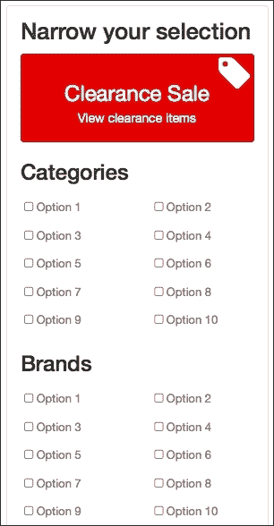

让我们从设置一些基本样式开始，为基本工作打下基础。

## 设置基本样式

我们将从调整字体、颜色、边距和填充开始。

让我们将这些规则添加到一个名为`_grid-options.scss`的新 Sass 部分中：

```js
.grid-options { 
  @extend .card; 
  padding-top: 12px; 
  padding-bottom: 24px; 
  > h2 { 
    margin-top: 0; 
    font-size: 1.3 * ($font-size-lg); 
    line-height: 1.2; 
    color: $gray-dark;   
  } 
} 

```

上述代码执行以下操作：

+   将 Bootstrap 卡片样式添加到我们的侧边栏中（有关 Bootstrap 文档，请参阅[v4-alpha.getbootstrap.com/components/card/](http://v4-alpha.getbootstrap.com/components/card/)）

+   向侧边栏添加顶部和底部填充，以便我们的新背景延伸到侧边栏内容之外

+   调整`h2`标题的字体大小、行高和颜色

注意，您不应忘记将`_grid-options.scss`文件导入到您的`app.scss`文件中。

接下来，我们将对**清仓大甩卖**链接进行样式化。

## 样式化清仓大甩卖链接

我们希望将我们的**清仓大甩卖**链接转换成一个超大吸引人的按钮。

让我们调整标记以执行以下操作：

+   将链接标题和段落转换为按钮。

+   添加自定义按钮 `btn-feature` 类，这是我们之前在第 9 课中创建的，在《自我启动业务》中，以给按钮赋予我们特殊的功能颜色——红色。

+   为销售标签添加 Font Awesome 图标。我们将使用 Font Awesome 内置的`icon-3x`类将其大小增加到正常大小的三倍。

### 注意

有关 Font Awesome 特殊尺寸类的更多信息，请参阅[`fontawesome.io/examples/#larger`](http://fontawesome.io/examples/#larger)的文档。

生成的 HTML 标记如下：

```js
<a class="btn btn-feature choose-clearance" href="#"> 
  <span class="icon fa fa-tag fa-3x"></span> 
  <h3>Clearance Sale</h3> 
  <p>View clearance items</p> 
</a> 

```

这立即为我们朝着期望的结果迈出了良好的一步，如下面的截图所示：

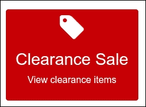

现在来润色一下，执行以下步骤：

1.  通过设置`display`属性为`block`并使用`by extending` Bootstrap 的`m-x-auto`类来居中显示**清仓大甩卖**按钮。`m-x-auto`类是 Bootstrap 的实用类之一，通过设置水平边距为自动来居中固定宽度的块级内容。

1.  强制其宽度填充其包含列的 92.5%。

1.  添加顶部和底部填充。

1.  覆盖 Bootstrap 的`white-space: nowrap`规则，以便我们的文本可以像预期的那样换行（有关 Bootstrap 的`white-space`规则，请参阅`/bootstrap/scss/_buttons.scss`。您可以在[`css-tricks.com/almanac/properties/w/whitespace/`](http://css-tricks.com/almanac/properties/w/whitespace/)了解更多关于`white-space`属性的信息。）

1.  将其定位为相对位置，以便我们可以对标签图标应用绝对定位。

1.  调整标题和段落上的字体、颜色、字体大小和边距。

1.  将标签图标定位在右上角。

我们可以通过添加以下样式规则来实现这些目标：

```js
.choose-clearance { 
  @extend .m-x-auto;  
  display: block; 
  width: 92.5%; 
  padding-top: $spacer-y * 2; 
  padding-bottom: $spacer-y; 
  font-size: 90%; 
  white-space: normal; 
  position: relative; 
  h3 { 
    font-weight: normal; 
    color: #fff; 
    padding-top: $spacer-y / 2; 
    margin: $spacer / 3; 
  } 
  p { 
    margin: $spacer / 3 $spacer * 2; 
    line-height: 1.2; 
  } 
  .icon { 
    position: absolute; 
    top: 0; 
    right: 2px; 
  } 
} 

```

注意，**清仓销售**按钮的背景颜色是由`html/pages/products.html`文件中的 HTML 代码中的类设置的。`btn-feature`类是通过`scss/includes/_buttons.scss`部分文件中的以下 SCSS 代码生成的：

```js
.btn-feature { 
  @include button-variant($btn-feature-color, $btn-feature-bg,
  $btn-feature-border); 
} 

```

最后，这给我们带来了令人愉悦的结果，如下面的截图所示：


作为额外的好处，这些样式在视口大小上表现良好。花几分钟时间测试一下。当然，就像往常一样，你可以自由地使用我们开始的工作并进一步美化它。

同时，让我们转到筛选我们产品的选项。

## 样式化选项列表

在本节中，我们将转换我们的产品筛选选项列表。

如果你花点时间检查亚马逊（[`www.amazon.com`](http://www.amazon.com)）或 Zappos（[`www.zappos.com`](http://www.zappos.com)）等商店的产品筛选选项的标记，你会发现它们是由链接组成的列表，这些链接被特别样式化，看起来像复选框。我们将样式化我们的链接，使其看起来像复选框，一旦选中就会显示为选中状态，并且我们将调整它们以在平板电脑和手机等设备上良好工作。

### 小贴士

在像亚马逊和 Zappos 这样的电子商务网站上，筛选选项与内容管理系统相连，它会根据选定的选项动态更新显示的产品网格。Bootstrap 是一个前端设计框架，而不是内容管理系统。因此，我们不会在这个项目中动态筛选我们的产品。相反，我们将准备一个设计，以便在完整的内容管理系统环境中使用。

在接下来的部分，我们将使用来自`html/pages/products.html`文件的 HTML 代码。一个选项列表的 HTML 代码可能看起来如下所示：

```js
<h3>Brands</h3> 
  <ul class="options-list options-brands"> 
    <li><a href="#">Option 1</a></li> 
    <li><a href="#">Option 2</a></li> 
    <li><a href="#">Option 3</a></li> 
    <li><a href="#">Option 4</a></li> 
    <li><a href="#">Option 5</a></li> 
    <li><a href="#">Option 6</a></li> 
    <li><a href="#">Option 7</a></li> 
    <li><a href="#">Option 8</a></li> 
    <li><a href="#">Option 9</a></li> 
    <li><a href="#">Option 10</a></li> 
  </ul> 

```

在`scss/includes/_grid-options.scss`部分文件中编辑你的 SCSS 代码。我们将从列表的`h3`标题开始，调整它们的大小、行高、边距和颜色：

```js
.grid-options { 
  > h3 { 
    font-size: $font-size-lg; 
    line-height: 1.2; 
    margin-top: $spacer-y / 2; 
    color: $gray-dark; 
  } 
} 

```

### 小贴士

我们需要使用`>h3`子选择器，因为我们不希望这些规则应用于其他`h3`标签，特别是我们**清仓销售**按钮内的那个。

现在，让我们把注意力转向无序列表。这些列表有一个特殊的`options-list`类，我们将使用它作为选择器，以确保我们只针对这些特殊列表。

首先，让我们移除项目符号和填充：

```js
.options-list { 
  list-style-type: none; 
  padding-left: 0; 
} 

```

现在，我们将对链接进行样式设计。很快，我们也将对列表项进行样式设计，所以我们将它们包含在嵌套选择器的顺序中。

```js
.options-list { 
  list-style-type: none; 
  padding-left: 0; 
  li { 
    a { 
       @extend .btn; 
       @extend .btn-sm; 
       padding-left: 0; 
       padding-right: 0; 
       color: $gray; 
       @include hover-focus-active { 
         color: $link-color; 
       }     
     } 
   } 
} 

```

我们刚刚设定的规则实现了以下功能：

+   我们将使用 Sass 的扩展功能来引入与 `btn` 类相关的根本按钮样式，该样式包括显示 `inline-block` 链接和添加填充。

+   由于我们没有添加其他按钮类，因此没有背景颜色

+   从这些基本的按钮样式中获得的好处是，我们有一个方便的方式来使我们的链接成为用户友好的点击目标——包括触摸设备上的手指

+   我们随后扩展与 `btn-sm` 类相关的样式，以减少填充并使字体大小略小于标准按钮（如需刷新 Bootstrap 按钮类，请访问 [v4-alpha.getbootstrap.com/components/buttons/](http://v4-alpha.getbootstrap.com/components/buttons/))

+   我们随后移除不必要的左右填充

+   我们将链接文本的颜色更改为 `$gray`

+   最后，我们将悬停、聚焦和活动链接的颜色设置为我们的 `$link-color` 值

你可能想要保存、编译并测试结果。以下截图展示了我们得到的结果：

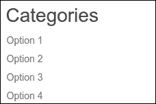

我们的选项链接获得了改进的填充和字体大小，并采用了我们想要的颜色。

### 小贴士

你可能想知道为什么我选择在 Sass 文件中使用 `.btn` 和 `.btn-sm` 类来扩展按钮样式，而不是直接在标记中添加类。我们可以这样做，但考虑到选项链接的数量，我认为你也会同意通过 CSS 应用样式（就像我们之前做的那样）要高效得多。在接下来的部分，我将继续这种模式，并通过 Sass 引入 Font Awesome 图标而不是通过添加标记来扩展它。

现在我们将在选项链接中添加复选框。

## 将 Font Awesome 复选框添加到我们的选项链接中

在本节中，我们将使用 Font Awesome 图标在选项链接的左侧添加一个空白的复选框。我们不会在标记中添加图标，而是在这里通过 Sass 来做，这将更加高效。然后我们将更进一步，为悬停、聚焦和活动的选项链接添加样式以引入一个备选的 Font Awesome 图标——用于勾选的复选框。

通过 Sass 添加图标需要扩展 Font Awesome 样式。首先，我们将从 fa 基础类中获取这些基本样式，这些样式可以在 `bower_components/font-awesome` 文件夹中的 `_core.scss` 文件中找到。在这个文件中，你会找到以下关键样式：

```js
.#{$fa-css-prefix} { 
  display: inline-block; 
  font: normal normal normal #{$fa-font-size-base}/#{$fa-line-height-base} 
  FontAwesome; // shortening font declaration 
  font-size: inherit; // can't have font-size inherit on line above,
  so need to override 
  text-rendering: auto; // optimizelegibility throws things off #1094 
  -webkit-font-smoothing: antialiased; 
  -moz-osx-font-smoothing: grayscale; 
} 

```

### 小贴士

在前面的代码中，我们使用了 `.#{$fa-css-prefix}` 选择器，这是基于 Sass 的变量插值。Sass 编译器使用 #{} 插值语法将变量编译成选择器和属性名称。有关 Sass 中变量插值的更多信息，请参阅以下网址：[`sass-lang.com/documentation/file.SASS_REFERENCE.html#interpolation_`](http://sass-lang.com/documentation/file.SASS_REFERENCE.html#interpolation_)

这些样式为所有 Font Awesome 图标建立了基本规则，包括字体家族的 Font Awesome 图标，然后细化其展示细节。

对于我们的当前目的，我们不需要选择器或大括号，只需要规则。我们将使用这些规则并将其应用于我们的链接。主要，我们将使用 `:before` 伪元素，因为它确保了最佳结果。

### 小贴士

关于 CSS2.1 `:before` 伪元素的更多信息，请访问 [`coding.smashingmagazine.com/2011/07/13/learning-to-use-the-before-and-after-pseudo-elements-in-css/`](http://coding.smashingmagazine.com/2011/07/13/learning-to-use-the-before-and-after-pseudo-elements-in-css/)。

因此，请在以下规则中编辑 `_grid-options.scss` 文件，嵌套如下：

```js
.options-list { 
  li { 
    a { 
      &:before { 
        @extend .#{$fa-css-prefix}; 
      } 
    }   
  } 
} 

```

这些规则建立了基础。接下来，我们需要指定要使用哪个 Font Awesome 图标。浏览 [`fontawesome.io/icons/`](http://fontawesome.io/icons/) 上的选项，我们发现以下开放的复选框图标：

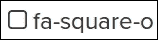

此图标的 Sass 规则位于 `font-awesome` 文件夹中的 `_icons.scss` 文件内。通过打开该文件并搜索 `}-square-o` 字符串（包括 `-square-o` 前面的闭合大括号以缩小搜索结果），我们可以找到以下相关行：

```js
.#{$fa-css-prefix}-square-o:before { content: $fa-var-square-o; } 

```

从上一行中，我们只需要 `content: $fa-var-square-o`，我们可以直接在 `_grid-options.scss` 文件中复制并粘贴，位于先前的规则之后，这些规则应用于我们的 `a:before` 选择器，或者也可以扩展 `.fa-square-o:before` 选择器：

```js
.options-list { 
  li { 
    a { 
      &:before { 
        @extend .#{$fa-css-prefix}; 
           @extend .#{$fa-css-prefix}-square-o:before; 
      } 
    }   
  } 
} 

```

最后，我们想要获取 Font Awesome 样式，以给我们的图标一个固定宽度，并避免图标变为选中版本时发生任何偏移。这些样式位于 `font-awesome` 文件夹中的 `_fixed-width.scss` 文件内。按照以下方式扩展 `.fa-fw` 类：

```js
.options-list { 
  li { 
    a { 
      &:before { 
        @extend .#{$fa-css-prefix}; 
        @extend .#{$fa-css-prefix}-square-o:before; 
        @extend .#{$fa-css-prefix}-fw;         
      } 
    }   
  } 
} 

```

添加这些规则后，运行 bootstrap watch 命令并在浏览器中检查结果。你应该会看到复选框如以下截图所示出现：

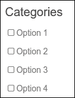

现在，按照相同的方法，我们将添加以下选择器和规则，将 Font Awesome 图标的选中版本应用于我们链接的悬停、聚焦和活动状态：

```js
.options-list { 
  li { 
    a { 
      &:before { 
        @extend .#{$fa-css-prefix}; 
        @extend .#{$fa-css-prefix}-square-o:before; 
        @extend .#{$fa-css-prefix}-fw;         
      } 
       @include hover-focus-active { 
         color: $link-color; 
         &:before { 
           content: $fa-var-check-square-o; 
         } 
      } 
    }   
  } 
} 

```

Bootstrap 的 `hover-focus-active` 混合可以在 `bower_components/bootstrap/scss/mixins/_hover.sccs` 部分找到。您可以使用此混合来设置一次活动、悬停和聚焦状态。

保存文件，并在浏览器中检查结果。你会发现当你在链接上悬停时，正方形的选中版本会出现，如以下截图所示：

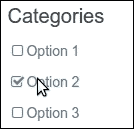

### 小贴士

作为提醒，目前无法强制其中一个链接保持活动状态，因为我们没有设置内容管理系统。我们拥有的只是一套准备就绪的样式，等待在内容管理系统的上下文中发挥作用。

就这样！我们已经成功给我们的链接添加了复选框的外观，以提供所需的用户反馈。

接下来，让我们通过将选项并排浮动来更有效地利用我们的空间。

## 使用 Sass 混合来排列选项链接的列

在上一节中，我们使用了自定义 Sass 规则来完成可能通过添加标记来完成的任务。考虑到我们需要管理的选项链接数量，这已经证明效率显著更高。当我们想要将选项链接排列成列时，同样的动态也适用。

我们可能通过使用 Bootstrap 行和列类，调整我们的标记，使用以下模式来实现我们想要的结果：

```js
<ul class="options-list options-categories row"> 
     <li class="col-xs-6"><a href="#">Option 1</a></li> 
     <li class="col-xs-6"><a href="#">Option 2</a></li> 
     ... 

```

### 注意

在 第 9 课, *创业* 中，你看到 Panini 模板引擎支持循环和迭代。在模板中使用循环也是避免重复代码和 DRY 编码的替代方案。

一个例子可以在 `html/pages/products.html` 文件中找到。第一个列表的代码如下所示：

```js
{{#each numbers-10}}
<li><a href="#">Option {{this}}</a></li>
{{/each}} 
```

从文件中读取的变量是 numbers-10，该文件包含以 YAML 格式从 1 到 10 的数字。使用迭代索引看起来更有意义，但不幸的是，Panini 不支持 Handlebars 的这个特性。也请参阅[`github.com/zurb/panini/issues/67`](https://github.com/zurb/panini/issues/67)。

多亏了 Bootstrap 混合的强大功能，我们可以用几行 Sass 完成相同的结果，如下面的步骤所示：

1.  首先，我们将 `make-row()` 混合应用到 `options-list` 选择器，如下所示：

    ```js
            .options-list { 
              @include make-row(); 
            } 

    ```

1.  这个混合将与我们通过在标记中应用 `row` 类所获得的相同样式应用到我们的选项列表上。在这种情况下，在这里做更有效率。

1.  接下来，我们可以使用 `make-col(6)` 混合并将列数设置为六，以将列规则应用到我们的列表项上，如下所示：

    ```js
             .grid-options { 
               @include make-row(); 
               li { 
                 @include make-col-ready(); 
                 @include make-col(6); 
               }   
             } 

    ```

1.  这将把相同的样式应用到我们的列表项上，就像我们给每个相关的 `li` 标签添加了 `col-xs-6` 类一样。稍后，你将了解到如何使列响应式。

添加上述行后，保存文件，编译为 CSS，并刷新浏览器。你应该看到选项链接以两列的形式排列：

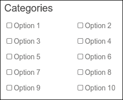

还不错！

我们现在将对较小的视口进行一些调整。

## 调整选项列表布局以适应平板和手机

我们需要限制选项面板的宽度，使其在平板宽度设备上不要范围太广。

在平板的中等网格中，768 到 992 像素之间，**清仓大甩卖**按钮和选项都不适合列，如下面的截图所示：

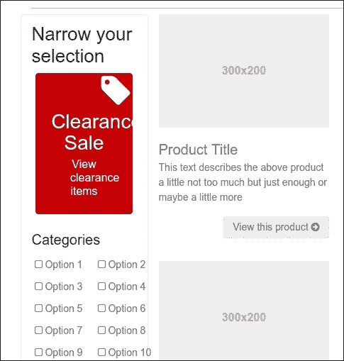

我们可以使用 Sass 修复这个问题，并强制将选项在中等网格中再次排列成单列，如下所示：

```js
.grid-options { 
  @include make-row(); 
  li { 
    @include make-col-ready(); 
    @include make-col(6); 
    @include media-breakpoint-only(md) { 
       @include make-col(12); 
    } 
  }   
} 

```

上述 SCSS 代码没有解决中等网格的 **清仓大甩卖** 按钮。您可以尝试减小字体大小来修复它。

或者，你可以采用主网格来解决中等网格上的问题。在 `html/pages/products.html` 文件中，按照以下所示更改网格类：

```js
<div class="grid-options col-md-4 col-lg-3"> 
 ... 
</div> 
<div class="products-grid col-md-8 col-lg-9"> 
 ... 
</div> 

```

在中等网格中，网格选项区域现在将跨越四列。中等网格的问题已解决。让我们来处理小网格。

目前，我们的 **清仓大甩卖** 按钮太宽，在 480 像素到 768 像素宽的视图中，我们的选项列表项间距太远。因此，它们最终可能看起来像以下截图：

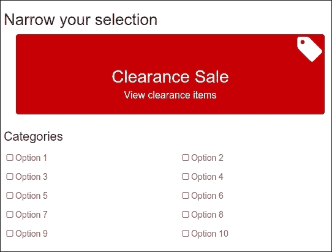

这可以通过为整个选项面板设置一个值为 480 像素的 `max-width` 属性来轻松修复：

```js
.grid-options { 
  max-width: 480px; 
}   

```

现在让我们调整我们的选项列表项，以便它们在小视图中以三列的形式组织。使用 Sass，我们可以在适当的选择器内嵌套一个媒体查询，并添加一个调整后的 `make-col(4)` 混合，如下面的代码片段所示：

```js
.grid-options { 
  @include make-row(); 
  li { 
    @include make-col(); 
    @include make-col(6); 
    @include media-breakpoint-down(sm) { 
       @include make-col(4); 
    } 
  }   
} 

```

在进行这些调整后，保存文件并在窄视图中进行测试。你应该会看到以下截图所示的结果：

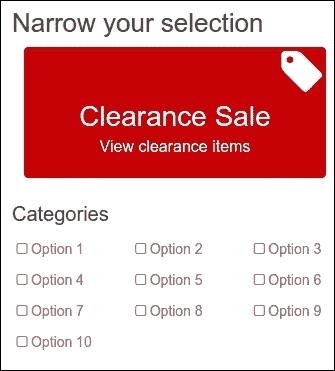

现在让我们解决我们单列布局面临的下一个问题：我们需要在需要时隐藏我们的选项。

## 为手机用户折叠选项面板

目前，我们的选项占据了相当多的垂直空间。这在窄视图中造成了一个问题。单列布局最终会将我们的产品网格推到页面底部。

这对于不需要的选项来说是一个很大的垂直空间。产品本身是优先事项。我们需要允许手机用户更快地找到产品，同时仍然允许他们在需要时访问过滤选项。

我们将使用 Bootstrap 的折叠插件来完成这个任务。在以下步骤中，我们将折叠插件应用于选项面板，添加一个按钮以在需要时展开面板，并将行为限制在窄视图中：

1.  使用 `products.html` 打开您的编辑器。

1.  添加一个新的 `div` 标签来包裹我们的 **清仓大甩卖** 按钮 和三个选项列表。我们需要给这个新的 `div` 一个特殊的折叠类以及一个独特的 ID，以便我们可以用我们的 JavaScript 插件定位它。为了保险起见，我们还将给它一个匹配的特殊类：

    ```js
            <h2>Narrow your selection</h2> 
            <div id="options-panel" class="options-panel collapse"> 
            ... 
            </div> 

    ```

1.  注意到在上一步骤中的 `collapse` 类隐藏了所有视口的内容。您可以通过添加 `navbar-toggleable-sm` 类来确保内容在更大的视口中始终可见：

    ```js
            <h2>Narrow your selection</h2> 
            <div id="options-panel" class="options-panel collapse
            navbar-toggleable-sm"> 
            ... 
            </div> 

    ```

    ### 小贴士

    Bootstrap 的折叠 JavaScript 插件是驱动可折叠响应式导航栏的动力。它也可以用于其他用途，例如在 Bootstrap 文档中所示，见 [v4-alpha.getbootstrap.com/components/collapse/](http://v4-alpha.getbootstrap.com/components/collapse/)。

1.  保存文件并在浏览器中刷新。您应该会看到**清仓大甩卖**按钮和选项列表现在已从视图中隐藏。选项面板内容剩下的将是 `h2` 标题**缩小选择范围**，如以下截图所示：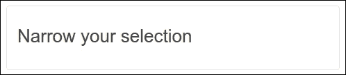

1.  现在我们需要一个切换按钮，当点击时可以展开我们的筛选选项。

1.  在仍然可见的、读作**缩小选择范围**的 `h2` 标题内，添加一个具有以下属性结构的按钮元素：

    ```js
            <h2 class="clearfix">Narrow your selection 
              <button type="button" 
                class="options-panel-toggle btn btn-primary pull-right hidden-md-up"      
                data-toggle="collapse" data-target="#options-panel"> 
                <span class="icon fa fa-cog fa-2x"></span> 
              </button> 
            </h2> 

    ```

1.  以下要点解释了前面的标记将做什么：

    1.  `clearfix` 类将确保 `h2` 标题包含切换按钮，由于 `pull-right` 类，按钮将浮动到右侧。

    1.  `btn` 和 `btn-primary` 类将使用 Bootstrap 的 `btn` 样式来设置我们的新 `button` 元素，这包括我们的 `$brand-primary` 背景颜色。

    1.  `hidden-md-up` 类在较大视口中隐藏按钮。

    1.  在 `button` 元素内，我们使用 `fa-2x` 类放置了一个 Font Awesome 图标，以将其大小加倍。

    1.  保存此文件，并在浏览器中查找以下结果：

    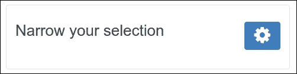

1.  在较窄视口中，选项列表被折叠，切换按钮可见：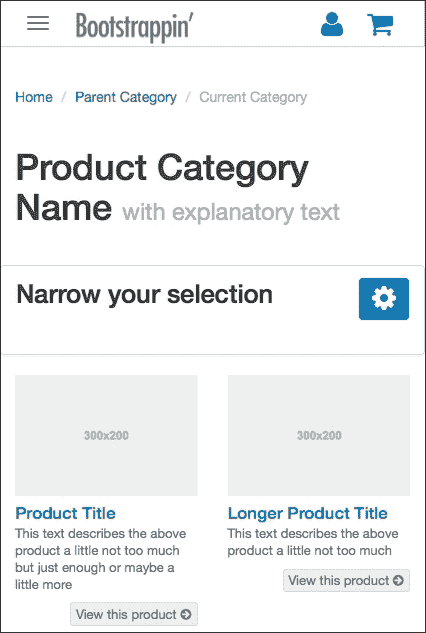

1.  在小、中和大视口中，切换按钮被隐藏，选项列表可见：

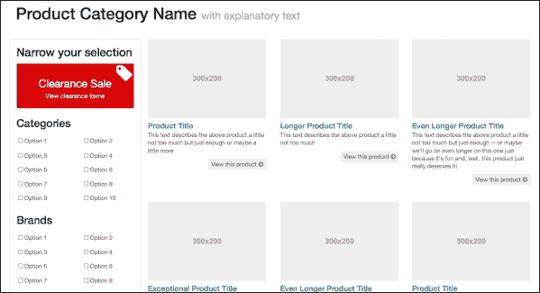

# 将搜索表单添加到您的页面设计中

在前面的部分中，我们构建了一个导航结构。大约百分之五十的访客将使用此导航，另一半访客将更喜欢搜索您的内容。因此，在您的页面上始终要有良好的搜索内容和产品的能力。

我们可以在页面的页眉中添加一个搜索表单，其外观应如下所示：


编辑 `html/includes/header.html` 文件中的以下 HTML 代码：

```js
   <div class="utility-nav"> 
      <ul> 
        <li><a href="#" ><i class="icon fa fa-user
        fa-lg"></i><span> Log In or Register</span></a></li> 
        <li><a href="#" ><i class="icon fa fa-shopping-cart
        fa-lg"></i><span> View Cart</span></a></li> 
      </ul> 
   </div> 
  <form class="search-form form-inline pull-md-right"> 
    <input class="form-control" type="text" placeholder="Search"> 
    <button class="btn btn-outline-success hidden-sm-down"
    type="submit">Search</button> 
  </form> 
  </div> 

```

以下要点解释了前面的标记将做什么：

+   form-inline 和 form-control 类是 Bootstrap 的内联表单类。您可以在以下网址了解更多关于 Bootstrap 内联表单的信息：[v4-alpha.getbootstrap.com/components/forms/#inline-forms](http://v4-alpha.getbootstrap.com/components/forms/#inline-forms)。

+   `pull-md-right` 类将确保表单在页眉的右侧浮动。

+   `hidden-sm-down` 类在小型视口中隐藏搜索按钮；在这些视口中仅可见搜索输入。

前面的代码重叠了图标；您可以通过在 `scss/includes/_header.scss` Sass 部分中使用以下 SCSS 代码设置 `padding-top` 来修复此问题：

```js
header[role="banner"] { 
  .search-form { 
    @include media-breakpoint-up(md) { 
      padding-top: $spacer-y * 6; 
    }   
  } 
} 

```

`media-breakpoint-up(md)` 混合器调用确保仅对中等和更大的视口添加填充。

## 使用 Typeahead 插件

在您的搜索表单中添加自动完成功能可能会提高搜索功能的可用性。可以从 Bootstrap 2 的 typeahead 插件中构建自动完成功能。更多关于此插件的信息可以在以下网址找到：[`github.com/bassjobsen/Bootstrap-3-Typeahead`](https://github.com/bassjobsen/Bootstrap-3-Typeahead)。该插件已准备好与 Bootstrap 4 一起使用。

以下步骤描述了如何在您的项目中集成 Typeahead 插件：

+   首先，将插件添加到您的 bower 项目依赖项中，如下所示：

```js
   "dependencies": { 
    "bootstrap": "4", 
    "tether": "¹.1.2", 
    "font-awesome": "⁴.6.1", 
    "bootstrap3-typeahead": "git://github.com/bassjobsen/Bootstrap-3-
    Typeahead.git#master" 
  } 

```

+   然后在您的控制台中运行 `bootstrap update` 或 `bower update` 命令。

+   然后编辑 `Gruntfile.js` 中的 `compile-js` 任务，以确保插件包含在您的项目中：

```js
gulp.task('compile-js', function() { 
  return gulp.src([ 
        bowerpath+ 'jquery/dist/jquery.min.js', 
        bowerpath+ 'tether/dist/js/tether.min.js', 
        bowerpath+ 'bootstrap/dist/js/bootstrap.min.js', 
        bowerpath+ 'holderjs/holder.min.js', // Holder.js for project
        development only 
        bowerpath+ 'bootstrap3-typeahead/bootstrap3-typeahead.min.js', 
        'js/main.js']) 
    .pipe(concat('app.js')) 
    .pipe(gulp.dest('./_site/js/')); 
}); 

```

+   然后初始化插件并将其附加到搜索表单上。打开 `js/main.js` 并将以下 JavaScript 代码编辑到其中：

```js
 $('.search-form .form-control').typeahead( { items: 4, source: ["Alabama","Alaska","Arizona","Arkansas","California","Colorado","Connecticut","Delaware","Florida","Georgia","Hawaii","Idaho","Illinois","Indiana","Iowa","Kansas","Kentucky","Louisiana","Maine","Maryland","Massachusetts","Michigan","Minnesota","Mississippi","Missouri","Montana","Nebraska","Nevada","New Hampshire","New Jersey","New Mexico","New York","North Dakota","North Carolina","Ohio","Oklahoma","Oregon","Pennsylvania","Rhode Island","South Carolina","South Dakota","Tennessee","Texas","Utah","Vermont","Virginia","Washington","West Virginia","Wisconsin","Wyoming"] });
```

+   最后，将建议菜单的 CSS z-index 值设置为防止导航栏与其重叠。您可以通过以下 SCSS 代码设置 `scss/includes/_header.scss` 部分的内容：

```js
header[role="banner"] { 
  .search-form { 
    @include media-breakpoint-up(md) { 
      padding-top: $spacer-y * 6; 
    } 
    .typeahead.dropdown-menu { 
      z-index: 2000; 
    }   
  } 
} 

```

现在，您的搜索表单已准备好带有自动完成功能。运行 Bootstrap watch 命令，并在浏览器中查看结果。在搜索表单中输入大写字母 A，您将发现出现一个带有建议的下拉列表：

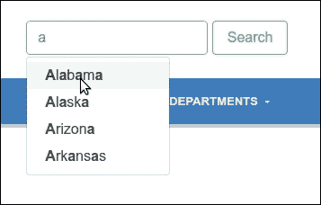

### 小贴士

Bootstrap 团队在版本 3 中放弃了 typeahead 插件，转而使用 `typeahead.js`；请参阅 [`github.com/twitter/typeahead.js`](https://github.com/twitter/typeahead.js)。要使用 `typeahead.js` 与 Bootstrap 4，需要一些额外的 CSS 代码。所需的 CSS 代码，包括生成的 SCSS 代码，可以在以下网址找到：[`github.com/bassjobsen/typeahead.js-bootstrap4-css/`](https://github.com/bassjobsen/typeahead.js-bootstrap4-css/).

恭喜！有了搜索表单，我们已经完成了我们的设计。

# 摘要

在本章中，我们使用了 Bootstrap 样式来快速设置面包屑、页面标题和根据我们的需求定制的分页。然后我们创建了一个视觉上令人愉悦的产品项网格，所有项的高度相同，以确保使用 Bootstrap 的移动优先和响应式网格样式来创建规则的网格。

我们通过添加一个具有 `$brand-feature` 红色背景色和易于点击的筛选选项列表的复杂 **清仓大甩卖** 按钮完成了我们的设计。我们还使用了 Bootstrap 列类和响应式调整来优化我们的选项列表项，以适应多个视口宽度。

最后，我们还添加了一个具有自动完成功能的搜索表单。

恭喜！我们现在拥有了一个具有精心制作的电子商务部分的吸引人的商业网站。

接下来，让我们通过用 Angular 2 重建我们的项目来将我们的技能提升到另一个层次。

# 评估

1.  以下哪个代码片段将设置卡片的最大宽度？

    1.  `$include media-breakpoint-up(md) {.card-deck .card {width: 46%;}}`

    1.  `@include media-breakpoint-up(sm) {.card-deck .card {max-width: 46%;}}`

    1.  两者 i 和 iib

    1.  以上皆非

1.  以下代码片段的作用是什么？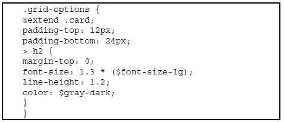

    1.  为我们的侧边栏添加 Bootstrap 卡片样式

    1.  为侧边栏添加顶部和底部填充，以便我们的新背景延伸到侧边栏内容之外

    1.  调整 h2 标题的字体大小、行高和颜色

    1.  所有上述选项

1.  设置 CSS `z-index`值的目的何在？

    1.  防止导航栏覆盖菜单

    1.  将插件添加到您的 bower 项目依赖项中

    1.  为了编辑`Gruntfile.js`中的`compile-js`任务，以确保插件包含在您的项目中

    1.  所有上述选项

1.  在您的搜索表单中添加自动完成功能的优势是什么？

    1.  读取更多关于 Bootstrap 内联表单的信息

    1.  获取更多关于此插件的信息

    1.  为了提高搜索功能的可用性

    1.  以上皆非

1.  以下哪个是`clearfix`类的用途？

    1.  它确保标题将包含`切换按钮`，由于`pull-right`类，该按钮将浮动到右侧

    1.  它允许手机用户更快地找到产品，同时仍然允许他们在需要时访问过滤选项。

    1.  它使用 Sass，在适当的选择器内嵌套媒体查询，并添加了一个调整后的`make-col(4)`混入

    1.  所有上述选项
