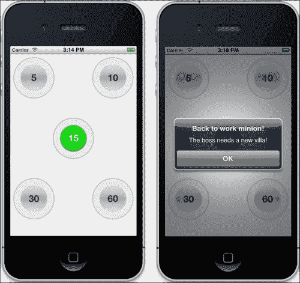

# 第三章. 命令行操作

对于我们的第三个项目，我们将从对 Sencha Designer 的依赖中做出一些改变。在本章中，我们将探讨 Sencha 的免费命令行工具 **Sencha Cmd** 的用法。使用这个新的工具集，我们可以快速生成新应用程序的基本框架，创建控制器和模型，并将我们的应用程序编译成适用于 iOS 和 Android 的原生应用程序。

本章的应用程序是一个简单的用于安排休息时间的计时器应用程序。我们称之为 **TimeCop**。

TimeCop 应用程序允许用户为未来的某个时间设置提醒（例如，为休息时间设置 15 分钟）。一旦设置时间，按下开始按钮，在适当的延迟后会出现提醒。这个应用程序的简单性将使我们能够关注使用 Sencha Cmd 和创建编译应用程序涉及的某些细节和问题。

在本章中，我们将涵盖：

+   使用 Sencha Cmd 创建基本应用程序

+   Sencha Cmd 的功能

+   为 iOS 创建开发者账户

+   为 iOS 配置应用程序

+   创建正确的文件配置

+   添加原生通知

+   编译应用程序

# 基本应用程序

TimeCop 应用程序被设计为一个简单的跟踪你的休息或午餐时间结束的方式。该应用程序由四个主要按钮组成，分别标记为**5**、**10**、**30**和**60**。点击这些按钮中的任何一个都会在中心出现一个第五个按钮。此按钮将显示用户选择的时间量，并作为开始按钮。用户可以通过多次点击四个外围按钮来添加不同的分配时间。


例如，点击**5**按钮两次将在中心按钮的分配时间内放置 10 分钟。点击**5**按钮一次然后点击**10**按钮一次将在分配时间内放置**15**分钟。一旦达到所需的时间量，用户点击中心按钮，倒计时开始。当倒计时结束时，用户将通过设备通知被提醒。

## 安装 Sencha Cmd

Sencha Cmd 是从我们的 Sencha Touch 代码中单独下载的，可以在[`www.sencha.com/products/sencha-cmd/download`](http://www.sencha.com/products/sencha-cmd/download)找到。下载适用于 Windows、OSX 和 Linux（32 位和 64 位）。当你解压下载的文件时，你可以双击它来安装 Sencha Cmd。

### 注意

对于这本书，我们使用 Sencha Cmd 版本 3（至少需要 3.0.0.250）。详细的安装说明可以在[`docs.sencha.com/ext-js/4-1/#!/guide/command`](http://docs.sencha.com/ext-js/4-1/#!/guide/command)找到。

一旦安装了 Sencha Cmd，你可以在计算机上按照以下方式打开命令行：

+   在 Mac OSX 上，转到**应用程序**并启动**终端**

+   在 Windows 上，转到**开始** | **运行**并输入`cmd`

从这里开始，你需要切换到你的 Sencha Touch 文件安装的目录（不是我们刚刚下载的 Sencha Cmd 文件，而是你的原始 Sencha Touch 2.1 文件）：

```js
cd /path/to/Sencha-touch-directory/

```

一旦你切换到目录，请输入：

```js
sencha

```

你应该在终端看到以下截图类似的内容：


这段文本为你提供了可用的命令的快速概述以及你当前运行的 Sencha Cmd 版本（这应该是版本 3.0.0.250 或更高）。

## Sencha Cmd 的优势

Sencha Cmd 的一个主要优势是，与 Designer 不同，它是免费提供的。Sencha Cmd 还可以为我们处理很多重复的编码工作。例如，你可以通过从你的 Sencha Touch 2.1 目录执行以下命令来生成一个完整的应用程序骨架：

```js
sencha generate app MyApp /path/to/www/myapp

```

这将在指定的目录中创建一个名为`MyApp`的新应用程序。

你也可以在新的应用程序目录中使用类似以下命令从命令行创建模型：

```js
sencha generate model Contact --fields=id:int,firstName, lastName,email,phone

```

这将为具有五个指定字段的用户创建一个完整的模型，并确保`id`字段是一个整数。

### 小贴士

**关于 Sencha Cmd 和目录的注意事项**

当生成应用程序骨架时，你需要位于 Sencha Touch 2.1 目录中。一旦应用程序生成，你需要切换到新的应用程序目录以执行生成模型和控制器、构建和编译应用程序的命令。

你还可以使用`build`命令来自动优化你的应用程序以用于生产。这包括解决依赖关系，以便你的应用程序只包含它实际需要的代码。此外，`build`命令设置了 HTML5 应用程序缓存，最小化了所有的 JavaScript 和 CSS，以及其他速度和缓存增强。

让我们通过生成我们的 TimeCop 应用程序来看看它是如何工作的。

## 生成应用程序骨架

在我们之前的例子中，我们从`create`命令开始：

```js
sencha generate app TimeCop /Library/Documents/Webserver/timecop

```

你还需要确保调整输出路径以适应你的开发环境。

### 注意

如我们之前所述，此命令应从你的 Sencha Touch 2.1 目录中执行以正确工作。你还可以通过使用`-sdk`选项来指定 Sencha Touch 目录，如下所示：

```js
sencha -sdk /Path/to /sencha-touch-2.1 generate app AppName /path/to/your/app/directory

```

这将在`timecop`文件夹中创建以下文件和目录结构：


如果你查看`index.html`文件，你会看到它已经设置了基本的应用程序，并包含了以下 JavaScript：

```js
<script id="microloader" type="text/javascript" src="img/development.js"></script>
```

这是自动加载器，它将自动包含我们需要的其余 JavaScript 代码。它还在 CSS 中包含一个加载指示。当应用程序加载时，这将触发，以提醒用户后台正在发生事情。你不应该需要触摸`index.html`文件。

`app.js`文件包含了一些更有趣的部分：

```js
Ext.Loader.setPath({
    'Ext': 'touch/src',
    'TimeCop': 'app'
});
Ext.application({
    name: 'TimeCop',

    requires: [
        'Ext.MessageBox'
    ],

    views: ['Main'],

    icon: {
        57: 'resources/icons/Icon.png',
        72: 'resources/icons/Icon~ipad.png',
        114: 'resources/icons/Icon@2x.png',
        144: 'resources/icons/Icon~ipad@2x.png'
    },

    phoneStartupScreen: 'resources/loading/Homescreen.jpg',
    tabletStartupScreen: 'resources/loading/Homescreen~ipad.jpg',

    launch: function() {
        // Destroy the #appLoadingIndicator element
        Ext.fly('appLoadingIndicator').destroy();

        // Initialize the main view
        Ext.Viewport.add(Ext.create('TimeCop.view.Main'));
    },

});
```

顶部的 `Ext.Loader.setPath` 函数将指向我们的 `touch` 目录，其中包含所有我们的基础 Sencha Touch 2 库文件。

下一个部分设置应用程序的名称、所需组件、视图、图标和启动屏幕。

`launch` 部分将移除我们的加载指示器，并将 `TimeCop.view.Main` 添加到视图中。

如果你使用 Safari 导航到文件夹并查看应用程序，你会看到如下内容：


此应用程序的实际显示代码的大部分都包含在 `TimeCop.view.Main` 文件中。这是我们稍后将要修改以创建实际应用程序的文件。

## 创建 TimeCop 布局

此应用程序的布局由主容器上的 vbox 布局组成。在主容器内部是一组三个容器，每个容器都有一个 hbox 布局，并包含三个额外的容器。这为我们提供了一个灵活的 3 x 3 网格，我们可以在此网格中放置我们的组件：


在容器 **1**、**3**、**7** 和 **8** 内，我们需要带有四个时间增加按钮。在容器 **5** 中我们将放置启动按钮。通过使用本节稍后描述的 `vbox` 和 `hbox` 布局，我们可以使组件在屏幕大小变化时保持居中。

我们的按钮容器可以设置一个固定宽度（在这种情况下我们选择 `120`）。该行中的空容器将被赋予一个 `flex` 值为 `1`。这将导致它们占据剩余的可用空间，并在屏幕大小变化时保持按钮之间的均匀间距。

例如，我们的第一行布局如下：

```js
{
    xtype: 'container',
    layout: {
        type: 'hbox'
    },
    flex: 1,
    items: [
        {
            xtype: 'container',
            width: 120,
            layout: {
                type: 'fit'
            },
            items: [
                {
                    xtype: 'incrementButton',
                    text: 5

                }
            ]
        },
        {
            xtype: 'container',
            flex: 1
        },
        {
            xtype: 'container',
            layout: {
                type: 'fit'
            },
            width: 120,
            items: [
                {
                    xtype: 'incrementButton',
                    text: 10
                }
            ]
        }
    ]
}
```

你会注意到我们的每个按钮都有一个 `xtype` 类型为 `incrementButton`，但文本值（`5` 和 `10`）不同。我们稍后会回到这一点，但首先我们需要看看我们的第二行。

第二个 `hbox` 容器行是第一行的变体；中间有一个固定宽度的容器，两侧是可变宽度的（`flex:1`）容器：

```js
{
    xtype: 'container',
    layout: {
        type: 'hbox'
    },
    flex: 1,
    items: [
        {
            xtype: 'container',
            flex: 1
        },
        {
            xtype: 'container',
            width: '',
            layout: {
                type: 'fit'
            },
            width: 120,
            items: [
                {
                    xtype: 'button',
                    hidden: true,
                    id: 'startButton',
                    ui: 'roundStart',
                    text: 0
                }
            ]
        },
        {
            xtype: 'container',
            flex: 1
        }
    ]
}
```

居中的 `startButton` 默认情况下是隐藏的，并且只有在点击 `incrementButtons` 时才会出现。我们将 `ui` 设置为 `roundStart`，稍后我们将使用它来设置按钮样式，并将按钮的 `text` 值设置为 `0`（我们将在 `incrementButton` 函数中稍后使用此值）。我们还为 `startButton` 实例添加了一个点击事件监听器。

我们的第三行只是第一行的复制，按钮值分别设置为 `30` 和 `60`。这两个按钮都将具有 `xtype:incrementButton`，就像第一行一样。

## 创建主题

我们目前的基础布局将给我们一大堆大而丑陋的正方形按钮。我们想要比这更酷的东西，因此我们将为应用程序设置一个新的主题。Sencha Touch 主题使用 SASS 和 Compass 以多种有趣的方式自定义用户界面。

### 注意

关于创建 Sencha Touch 主题的更多信息，请参阅文档和教程视频：[`docs.sencha.com/touch/2-0/#!/guide/theming`](http://docs.sencha.com/touch/2-0/#!/guide/theming)。

我们主题的第一步是为我们的按钮添加一个`ui`配置。四个时间增量按钮将在其配置选项中添加`ui: 'round'`。这将给我们一个更令人愉悦的圆形按钮。

中心按钮将在其配置选项中添加`ui: 'roundStart'`。我们将使`ui`继承我们原始圆形 ui 的所有特性，并添加一些颜色变化，以给我们一个绿色的开始按钮。

然后，我们可以将以下代码添加到`app.scss`中：

```js
.x-button-round, .x-button-roundStart {
  background-color: transparent;
  background-image: none;
  width: 120px;
  padding: 10px;
  height: 120px;
  overflow:hidden;
  border: none;

  span  {
    color:#333;
    font-size:24px;
    line-height:68px;
  }
  span.x-button-label {
    display: block;
    background: -webkit-gradient(linear, left top, left bottom, color-stop(0%,rgba(230,230,230,1)), color-stop(50%,rgba(168,168,168,1)), color-stop(50%,rgba(168,168,168,1)), color-stop(100%,rgba(230,230,230,1))); /* Chrome,Safari4+ */
    position:relative;
    height:100px;
    width:100px;
    text-align:center;
    cursor:pointer;
    border:16px solid #e8e8e8;
    -webkit-border-radius: 60px;
    font-weight: 900;
    -webkit-box-shadow: inset 0 0 10px#C7C7C7, 0 0 1px 2px #bababa;
  }
}
```

这其中的关键部分是`-webkit-border-radius: 60px`（按钮宽度/高度的一半），这使得按钮呈圆形，以及`background: -webkit-gradient`，它创建了按钮的渐变背景。

我们对开始按钮做类似的事情，但我们将文本设置为白色，背景设置为绿色：

```js
.x-button-roundStart {
  span {
  color: white;
  }
  span.x-button-label {
  background-color: #0C0;
  background-image: -webkit-gradient(linear, 50% 0%, 50% 100%, color-stop(0%, #1AFF1A), color-stop(50%, #00E600), color-stop(51%, #0C0), color-stop(100%, #00B300));
  background-image: -webkit-linear-gradient(#1AFF1A, #00E600 50%, #0C0 51%, #00B300);
  background-image: linear-gradient(#1AFF1A, #00E600 50%, #0C0 51%, #00B300);
  }
}
```

运行`compass compile`将重新生成包含我们新样式的`app.css`文件。现在我们已经有了应用程序的基本外观和感觉，我们需要讨论在 Sencha Touch 应用程序中使用原生 API。

## 创建增量按钮

由于我们的每个增量按钮都将执行类似的功能，这成为创建按钮类的一个绝佳机会。

要做到这一点，我们将在视图文件夹中创建一个名为`incrementButton.js`的单独文件：

```js
Ext.define('TimeCop.view.incrementButton', {
    extend: 'Ext.Button',
    alias: 'widget.incrementButton', 
    config: {
        itemId: 'mybutton',
        ui: 'round',
        text: 5,
        listeners: [
            {
                fn: 'onMybuttonTap',
                event: 'tap'
            }
        ]
    }
});
```

此代码扩展了标准的`Ext.Button`类，并为`itemID`、`text`和`ui`（我们将在后面使用`ui`来设置按钮样式）设置了默认值。我们还添加了一个监听器，用于用户按下按钮时。

当我们的时间增量按钮被点击时，我们需要将适当的时间添加到中心开始按钮中，并显示它（如果它是隐藏的）。我们将通过在之前代码的`Config`部分之后添加以下内容来实现这一点：

```js
onMybuttonTap: function(button, e, options) {
 var increment = button.getText();
 var start = Ext.getCmp('startButton');

 var startInt = start.getText();

 var total = parseInt(startInt, 10) + parseInt(increment, 10);

 start.setText(total);

 if(start.isHidden()) {
  start.show();
 }
}
```

此代码从我们的当前按钮中获取文本，该按钮是`5`，然后获取开始按钮。然后我们将两个按钮的值相加，并将此值设置为开始按钮上的文本。由于此函数现在是基本`incrementButton`的一部分，我们具有`xtype`为`incrementButton`的四个按钮都将能够使用此相同的功能。唯一会改变的是按钮的文本值。这允许你轻松选择其他时间增量，如果你需要的话。

使用按钮的方式如下：当用户首次启动应用程序时，开始按钮是隐藏的，其文本值为**0**。用户点击**5**按钮，开始按钮出现，5 加到 0 上，开始按钮的文本设置为**5**。然后用户点击**10**按钮，导致开始按钮文本增加到**15**，依此类推。

## 创建开始按钮

我们的开始按钮使用一个单独的函数来开始计时器的倒计时。在这种情况下，我们将监听器添加到我们的主视图中：

```js
listeners: [
 {
  fn: 'onStartButtonTap',
  event: 'tap',
  delegate: '#startButton'
 }
]
```

这将触发一个名为`onStartButtonTap`的函数。我们在`Main.js`文件的`Config`部分之后添加这个新函数。这是启动计时器倒计时的函数：

```js
onStartButtonTap: function(button, e, options) {
 var delay = button.getText();
 setTimeout(function() {
  Ext.Msg.alert('Back to work minion!', 
  'The boss needs a new villa!', 
  Ext.emptyFn);
 },parseInt(delay)*1000);
}
```

此函数获取按钮的文本，现在设置为我们要在计时器上设置的总时间。然后我们创建一个`setTimeout`函数，在计时器完成后显示消息框。为了测试目的，我们已将延迟设置为*1000，这将实际上给我们提供秒而不是分钟的延迟时间。当我们想要将延迟设置为分钟时，最后一行可以更改为：

```js
setTimeout(function() {
 Ext.Msg.alert('Back to work minion!', 
 'The boss needs a new villa!', 
 Ext.emptyFn);
},parseInt(delay)*60000);
```

为了测试目的，我们现在暂时保留代码不变，并测试这些函数。


如我们从示例中看到的那样，警报在延迟时间到期时出现。然而，目前这并没有使用设备上可用的任何原生警报。为了做到这一点，我们需要查看`Ext.device`。

# 使用 Ext.device 与原生 API

默认情况下，Sencha Touch 应用程序是基于 Web 的。这意味着 Android 或 iOS 上的用户将使用网络浏览器来访问你的应用程序。你可以将网页添加到桌面，它将非常类似于编译应用程序的外观和行为。然而，移动设备上存在许多通过基于 Web 的应用程序无法访问的功能；这些包括相机、设备方向、连接监控、原生警报以及一些原生地理位置功能。

Sencha Touch 通过使用`Ext.device`提供了一种绕过此问题的方法。该组件接受 JavaScript 命令，当应用程序编译时，这些命令将被转换为原生函数。

### 注意

应该注意的是，在使用`Ext.device`时，必须每次编译应用程序才能实际测试原生应用程序功能。如果你进行更改或需要调试，你必须重新编译应用程序并在你的移动设备上重新安装它。

`Ext.device`提供了以下选项：

+   **连接**：这允许你使用`Ext.device.Connection.isOnline()`检查用户是否在线。你也可以使用`Ext.device.Connection.getType()`检查连接类型。

+   **通知**：这允许你访问原生通知窗口和振动设备选项。

+   **方向**：这提供了在三维空间（alpha、beta 和 gamma）中跟踪的设备的当前方向。这些维度返回的值在 0 到 360 之间，可以用来计算各种设备运动。

+   **相机**：这允许你的应用程序拍照或从相机库中选择现有图像（需要用户许可）。

对于 TimeCop，我们将使用简单的通知/振动警报。在后面的章节中，我们将介绍其他`Ext.Device`组件。不过，首先，我们需要稍微偏离一下，探索一些额外的步骤，以便在 iOS 下测试和运行编译的应用程序。

# 测试和运行原生应用程序

为了在 iOS 上运行原生（编译）应用程序，你需要采取以下步骤：

1.  注册为苹果 iOS 开发者（截至本文写作时，费用为每年 99 美元）。

1.  启用你的设备进行开发。

1.  使用苹果为应用程序提供配置并创建 P12 证书。

1.  在你的设备上安装应用程序。

这个过程并不总是直观的，有时甚至感觉比编写实际应用程序还要繁琐。如果你更愿意创建 Android 应用程序，我们将在本章后面讨论如何构建原生 Android 应用程序。

## 注册为开发者

为了将你的应用程序发布到苹果商店，或者仅仅为了测试编译的 iOS 应用程序，你必须注册一个开发者账户。成为开发者需要付费（截至本文写作时，费用为每年 99 美元），苹果将需要你提供大量的个人信息。他们需要这些信息有几个原因。首先，他们需要知道你是谁，这样你才能从他们商店销售的应用程序中获得报酬。其次，如果您的应用程序出现问题，他们需要知道如何联系你。最后，如果他们发现你试图用你的应用程序做坏事，他们需要能够找到你。当然，你不会这么做。

即使你还没有准备好分发你的应用程序，你仍然需要注册为开发者，以便在你的 iOS 设备上安装编译应用程序。

你的 iOS 设备也需要在苹果处注册以进行开发。这将允许你直接从你的开发计算机上安装和测试你自己的个人编译应用程序，而不是通过苹果商店。

## 成为苹果开发者

要成为苹果开发者，首先你必须去：[`developer.apple.com/programs/register/`](http://developer.apple.com/programs/register/)。

你需要提供现有的苹果 ID 或注册一个新的 ID，填写一些冗长的个人资料信息，同意一些法律文件，然后进行电子邮件验证。从那里你将能够访问苹果开发者中心。对我们这些移动开发者来说，最感兴趣的两个点是 iOS Dev Center 和 iOS Provisioning Portal。

**iOS Dev Center** 是你可以下载 iOS SDK（称为 Xcode），阅读文档，查看示例代码和教程，以及观看一些 iOS 开发视频的地方。

**iOS Provisioning Portal** 是你可以将你的应用程序添加到苹果商店或发布应用程序测试版本的地方。

### 小贴士

注意，为了使用 Xcode、安装开发证书或将您的应用程序发布到苹果商店，您必须在运行 OSX 的计算机上。Windows 和 Linux 计算机无法运行 Xcode 或发布到苹果商店。

配置文件门户是我们关注的重点区域。

## 配置应用程序

为了运行您为 iPhone、iPad 或 iPod touch 开发的编译后的 Sencha Touch 应用程序，您必须在您的设备和 Mac 上安装配置文件和开发证书。（这仅适用于编译应用程序，不适用于标准的 Sencha Web 应用程序。）

虽然配置过程可能看起来有些复杂，但苹果在配置文件门户的右侧列出了非常不错的“如何操作”视频，以及一个方便的**配置助手**设置向导。**配置助手**向导将引导您完成创建和安装开发配置文件和 iOS 开发证书的步骤。

处理流程的第一步是获取一个开发证书。**开发证书**是一个电子文档，它将您作为苹果开发者与您的编译应用程序联系起来。出于测试目的，证书会被加载到您的 iOS 设备上，并让设备知道运行您的应用程序是安全的。

当您的应用程序编译时，会使用配置文件。它包含一组单独的开发证书、设备 ID 和应用程序 ID。这些信息会与原始开发证书进行核对，以授权应用程序在您的设备上运行。

# 同时，回到代码中

现在我们已经正确设置了证书，我们可以回到编写代码的业务中。

## 使用原生通知

要使用原生通知，我们需要将原来的`onStartButtonTap`函数替换为一个使用`Ext.device`的新函数。除此之外，原生通知的代码几乎与我们的之前代码相同：

```js
    onStartButtonTap: function(button, e, options) {
        var delay = button.getText();
        setTimeout(function() {
            Ext.device.Notification.vibrate();
            Ext.device.Notification.show({
                title: ' Back to work minion! ',
                message: 'The boss needs a new villa!'
            });

        },parseInt(delay)*1000);
    }
```

我们仍然将函数包裹在`setTimeout`语句中。然后调用`Ext.device.Notification.vibrate`和`Ext.device.Notification.show`。这将导致设备振动（如果设备支持的话），然后显示我们原来的消息，就像之前一样。

此外，`Ext.device`默认不会加载，因此我们需要将其添加到`app.js`文件中的`requires`配置：

```js
Ext.application({
    name: 'TimeCop',

    requires: [
        'Ext.MessageBox',
        'Ext.device.Notification'
    ],
```

### 注意

调试`Ext.device`的问题是一个棘手的问题。`Ext.device`功能在桌面浏览器中不可用，或者当您的应用程序未编译时。然而，如果您需要调试在您的移动设备上运行的应用程序，有一些第三方解决方案，其中之一是**weinre**，代表**WEb INspector REmote**。您可以在[`people.apache.org/~pmuellr/weinre/docs/latest/`](http://people.apache.org/~pmuellr/weinre/docs/latest/)了解更多关于 weinre 的信息。

然而，目前我们需要使用 Sencha Cmd 为原生 iPhone 编译应用程序。

# 编译应用程序

为了编译应用程序，您首先需要从苹果公司获取一些东西：

+   P12 格式的开发者证书（有关此过程的说明，请访问[`docs.sencha.com/touch/2-0/#!/guide/native_provisioning`](http://docs.sencha.com/touch/2-0/#!/guide/native_provisioning)）

+   一个配置文件（从苹果配置文件，启动开发配置助手：[`developer.apple.com/ios/manage/overview/index.action`](http://developer.apple.com/ios/manage/overview/index.action)）

您还需要知道您应用程序的应用程序名称、应用程序 ID 和包种子 ID。您可以通过点击门户中**App ID**部分旁边应用程序名称旁边的**配置**来找到这些信息。格式看起来像这样：


一旦我们有了这些信息和文件，我们需要设置我们的`packager.json`文件。

## 设置 packager.json

`packager.json`文件位于我们的应用程序文件夹的根目录中，它是由 Sencha Cmd 为我们最初生成的模板。我们需要更改一些默认信息以便编译应用程序。

`packager.json`文件有大量的注释，所以我们只需查看文件中的一些更关键的设置：

+   `"applicationName":"TimeCop"`

+   `"applicationId":"com.example.TimeCop"`

+   `"bundleSeedId":"D3THNXJT69"`

这是我们使用之前示例中的值的地方。您需要更改这些值以反映您自己的应用程序信息。

### 注意

请注意，我们正在使用示例信息作为我们的`applicationID`和`bundleSeedId`值。您需要将这些值更改为从苹果公司获得的值。

下一个重要部分是：

```js
"configuration":"Debug",
"platform":"iOSSimulator",
"deviceType":"Universal",
```

我们现在可以保持这些设置不变，但它们控制着应用程序的输出方式和它能在哪些设备上运行。在您准备好通过应用商店分发应用程序之前，`配置`类型应始终为`Debug`。这将帮助您追踪可能存在的任何代码错误。

平台选项包括：

+   iOSSimulator

+   iOS

+   Android

+   AndroidEmulator

使用`iOSSimmulator`或`AndroidEmulator`选项允许您在没有 iOS 或 Android 设备的情况下在您的机器上本地测试。您需要将 Xcode 和/或 Android SDK 套件安装到您的机器上才能使用此选项。

`deviceType`是一个仅适用于 iOS 的选项，它将应用程序声明为`iPhone`、`iPad`或`Universal`（意味着两者都适用）。

最后几个关键信息是：

```js
"certificatePath":"/Users/12ftguru/Downloads/New_Cer/Certificates.p12",
"provisionProfile":"/Users/12ftguru/Downloads/New_Cer/TimeCop.mobileprovision",
```

`certificatePath`和`provisionProfile`都应该对应于之前提到的转换后的 P12 证书的正确路径以及您从苹果公司下载的配置文件。

一旦您有了所需的信息，我们就可以编译应用程序了。

在命令行中，切换到您的应用程序目录：

```js
cd /path/to/your/application

```

然后输入：

```js
sencha app build -run native

```

这应该将您的应用程序编译成可执行文件并启动 iOS 模拟器。

### 注意

`-run` 选项是 Sencha Cmd 版本 3 中的新功能。之前的版本会默认启动模拟器。如果你只想构建应用程序，可以省略 `-run` 选项。



这看起来更像是原生 iPhone 应用程序应有的样子，如果应用程序在 iPhone 上运行，当通知发生时，手机也会振动。

编译后的应用程序现在应该位于你的应用程序目录中的 `build/native` 文件夹中。你可以将其拖放到 iTunes 中以在设备上安装。

### 小贴士

**安装原生应用程序**

如果你的应用程序安装失败，尝试在 Xcode 下安装通常很有帮助。连接你的设备，并将应用程序文件拖放到 Xcode 应用程序顶部。这将启动 Xcode 并尝试在你的移动设备上安装应用程序。Xcode 通常提供的错误信息比 iTunes 更好。

# 构建 Android 原生应用程序

在 Android 中构建编译的应用程序遵循与我们在 iOS 中使用的类似模式：

1.  我们创建一个 Android 签名证书。

1.  我们为 Sencha Cmd 创建一个包配置文件。

1.  我们运行 Sencha Cmd 打包器来创建一个 `application.apk` 文件，该文件将在 Android 设备或 Android 模拟器上运行以进行测试。

好的一点是，我们仍然可以使用完全相同的代码，我们需要的只是一个新的证书和一些配置更改。

## 创建 Android 签名证书

生成 Android 签名证书的过程比其 iOS 对应版本简单得多。我们可以在本地机器上生成所有密钥，并且没有为 Android 应用程序设置预配过程。

我们需要做的第一件事是从 [`developer.android.com/sdk/index.html`](http://developer.android.com/sdk/index.html) 下载 Android SDK。一旦 ZIP 文件下载完成，我们需要将其提取并保存在适当的位置。在这个例子中，我们选择将 SDK 保存在主目录下的一个名为 `development` 的文件夹中。当我们创建配置文件时，你的文件路径信息可能会根据你放置 SDK 的位置而有所不同。

Android 证书是通过以下命令在命令行中生成的（所有内容都在一行中）：

```js
keytool -genkey -v -keystore time-cop.keystore -alias timecop -keyalg RSA -keysize 2048 -validity 10000

```

这个命令的重要部分是 `keystore` 名称，`time-cop.keystore`，以及 `alias`，即 `timecop`。我们需要这些值来正确设置我们的配置文件。

当你执行这个命令时，系统会提示你为 keystore 创建一个密码。然后，系统会引导你回答一系列关于你的组织位置的问题（这些是可选的，但可能是个好主意）。

一旦你回答了所有问题，将会生成一个名为 `time-cop.keystore` 的文件（或者你给 keystore 命名的任何名称）。

## 创建 Android 配置文件

与我们之前的 iOS 配置文件一样，我们创建一个名为 `packager_android.json` 的 JSON 文件。此文件的格式将与之前的 iOS 文件格式相同：

```js
{
 "applicationName": "TimeCop",
 "applicationId": "com.12ftguru.TimeCop",
 "outputPath": "/Users/12ftguru/Development/compiled/",
 "iconName": "timecop.png",
"versionCode": "1.0", 
"versionString": "1.0 Release 1",
 "inputPath": "/path/to/your/application",
 "configuration": "Debug",
 "platform": "AndroidEmulator",
 "certificatePath": "/Users/12ftguru/Development/time-cop.keystore",
 "certificateAlias": "timecop",
 "sdkPath": "/Users/12ftguru/Development/sdk",
 "orientations": [
  "portrait",
  "landscapeLeft",
  "landscapeRight",
  "portraitUpsideDown"
 ],
 "deviceType": "<Not applicable for Android>"
}
```

`applicationName` 将是我们编译时创建的 `.apk` 文件名，在这个例子中，是 `TimeCop.apk`。

`applicationId` 是您应用程序的唯一标识符，我们建议使用类似 `com.your_name.your_application_name` 的格式。

`outputPath` 是 `.apk` 文件将被保存的位置，而 `iconName` 是用作您应用程序图标的文件。`versionCode` 和 `versionString` 由您决定，并且应该用于区分正在使用的软件版本。

`inputPath` 是您的 TimeCop 文件（或相对于此配置文件的路径）的完整路径。

`configuration` 可以设置为 `Release` 或 `Debug`，而 `platform` 可以设置为 `Android` 或 `AndroidEmulator`。这些设置通常为测试时为 `Debug` + `AndroidEmulator`，而对于完成的应用程序则为 `Release` + `Android`。

`certificatePath` 是我们之前章节中生成的 `keystore` 文件的位置，而 `certificateAlias` 是我们在创建 `keystore` 时作为命令行参数提供的别名。

方向是应用程序可用的查看位置。它们通常会保持为之前列出的默认值。Android 会忽略设备类型，但如果配置或值被省略，配置管理器将返回错误。您可以保持此值设置为 `<Not applicable for Android>`，并且它将被安全地忽略。

## 编译和启动 Android 应用程序

就像之前的 iOS 应用程序一样，我们将使用 Sencha 包命令来编译应用程序。但是，如果您在 Android 模拟器中进行测试，您需要在发出命令之前启动模拟器。

一旦模拟器正在运行，请在命令行中输入以下命令：

```js
sencha package run packager_android.json

```

这将执行我们在上一节中创建的 `packagerAndroid.json` 文件。

如果您正在创建应用程序的发布版本，请在您的 `packager_android.json` 配置文件中将 `configuration` 设置为 `Release`，将 `platform` 设置为 `Android`。然后，您可以执行 `package` 命令，但省略 `run` 命令，如下所示：

```js
sencha package packager_android.json

```

这将编译应用程序，但不会在模拟器中运行。

### 注意

Android 模拟器能够模拟各种硬件。有关 Android 模拟器的更多信息，请访问[`developer.android.com/tools/devices/emulator.html`](http://developer.android.com/tools/devices/emulator.html)。

关于设置不同的硬件配置文件（有时称为 Android 模拟器的 **Android 虚拟设备**（AVDs）的信息，请参阅[`developer.android.com/tools/devices/managing-avds.html`](http://developer.android.com/tools/devices/managing-avds.html)提供的文档。

一旦应用程序开始运行，你就可以开始测试不同的功能并修复任何问题。

# 摘要

在本章中，我们学习了以下内容：

+   使用 Sencha SDK 命令行工具生成应用程序骨架

+   使用 Sencha 的原生 `Ext.device` API

+   通过苹果开发者门户配置 iOS 应用程序

+   将 Sencha Touch 网络应用程序编译成原生 iOS 应用

+   将 Sencha Touch 网络应用程序编译成原生 Android 应用

在下一章中，我们将探讨 Sencha Touch Charts 包。Charts 包是 Sencha Touch 的一个附加组件，它将允许我们在应用程序中使用图表和图形。我们将向您展示如何使用标准的 `datastore` 实例并将其用于向您的图表和图形提供数据。
