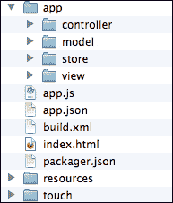
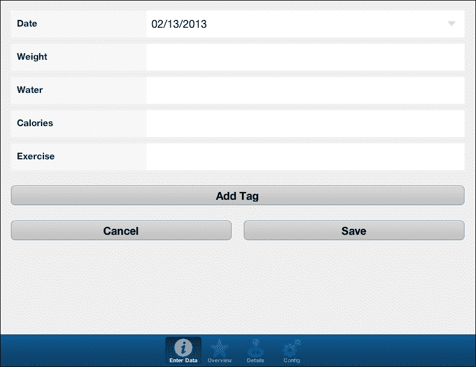
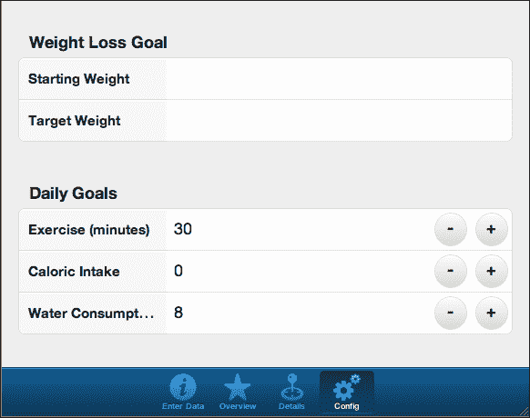
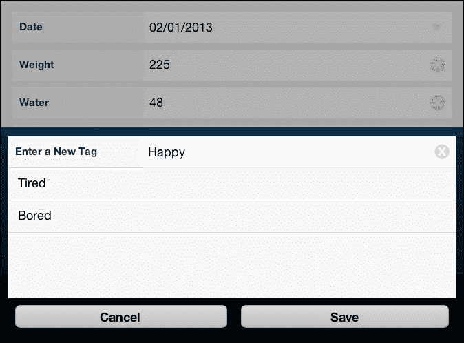
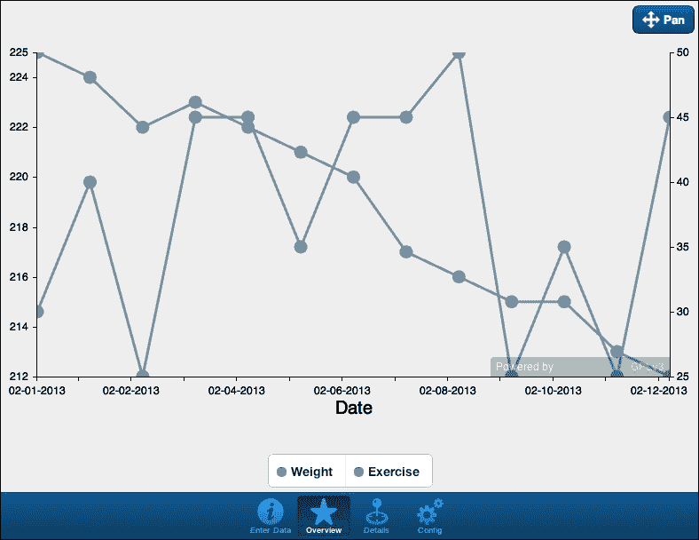
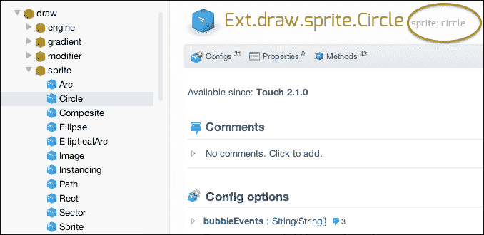
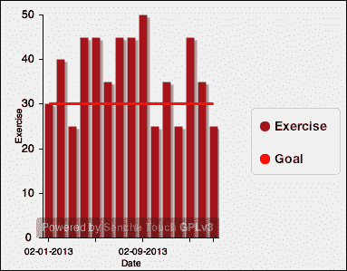
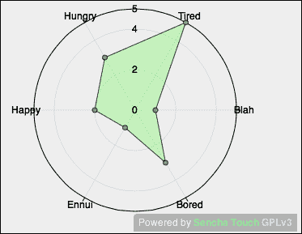
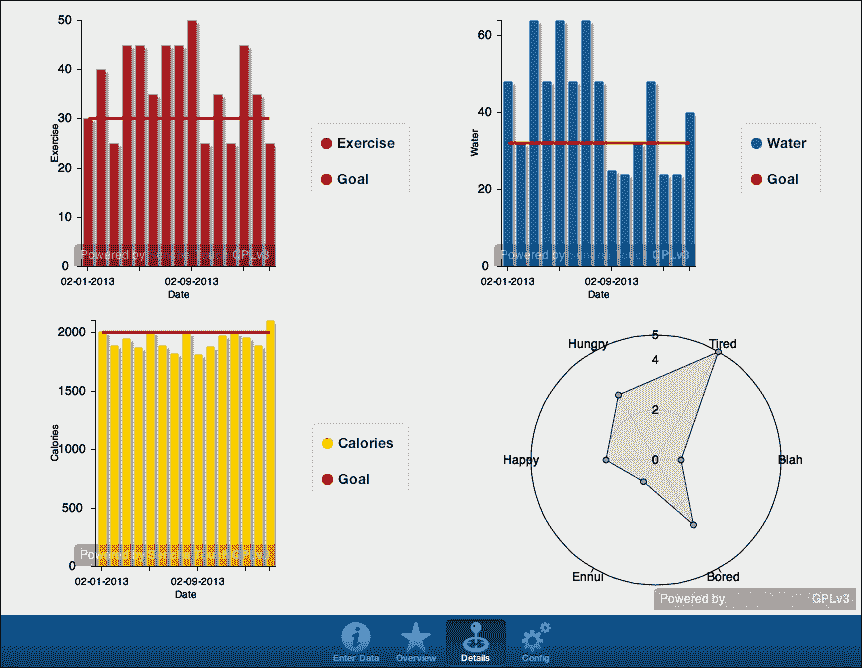
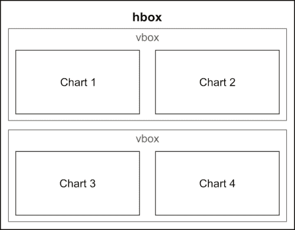

# 第四章。体重 体重

在本章中，我们将探讨 Sencha Touch 框架的可选附加包。该包称为 Sencha Charts，它使我们能够使用数据存储来创建图表。

在本章中，我们将涵盖以下内容：

+   构建基本应用程序

+   定义数据存储

+   设置 Sencha Charts 包

+   将商店连接到 Sencha Charts

+   配置和显示图表

# Sencha Charts 概览

基本的 Sencha Touch 框架提供了一些用于显示数据的组件。然而，商业和其他密集型软件产品通常需要更健壮的解决方案。通过使用 Sencha Touch Charts，我们还可以将复杂图形数据作为我们应用程序的一部分来显示。

以下截图展示了用于显示数据的图表和图形类型的概览：


这些新组件使用数据存储来显示各种图表和图形类型，包括：

+   饼图

+   柱状图

+   折线图

+   散点图

+   面积图

+   K 线图

+   雷达图

+   仪表盘

我们将使用这些图表中的几个来为我们的应用程序提供更友好的显示。

### 备注

截至编写时，Sencha Charts 包仅作为 Sencha Complete 的一部分提供，或者 Sencha Touch 2.1 的开源版本（GPL）下载。对于本章，我们将使用开源版本，可以从网页 [`www.sencha.com/products/touch/download/`](http://www.sencha.com/products/touch/download/) 免费下载。

在本章的后面部分，我们将介绍使用 Sencha Charts 的基本设置，但首先，我们将查看设置基本应用程序的过程。

# 基本应用程序

我们将使用 Sencha Charts 包来创建一个跟踪体重、锻炼、卡路里和水分摄入的程序。我们还将允许用户为图表添加额外的信息。

应用程序由以下四个基本部分组成：

+   用于输入数据的表单

+   一个概览，将在单页面上提供一组图表

+   一个详细部分，用于查看特定图表的详细信息

+   一个配置部分，允许用户为我们的四个类别设置目标，并定义体重和水分摄入量的计量单位

我们将首先设置基本应用程序并构建我们的表单。

## 设置应用程序和构建表单

我们将使用上一章中描述的 Sencha Command SDK 来创建应用程序。您需要从 `Sencha Touch` 目录执行此命令。基本命令如下：

```js
sencha app create weightweight /Path/To/Your/New/Application

```

如果您愿意，您可以自己创建初始目录和文件。您的文件和目录结构应该看起来像这样：



上一张截图显示了使用 `sencha app create` 命令自动生成的结构。

+   `touch` 目录包含 Sencha Touch 框架的副本，包括我们的图表功能。

+   `resources`目录将包含我们的图片和 CSS 文件。

+   `app`目录将包含我们大部分的代码。

首先，我们需要定义我们的主视图。这个文件将被称为`main.js`，它属于`views`文件夹。`main.js`文件是一个简单的标签面板，包含四个项目：

```js
Ext.define("WeightWeight.view.Main", {
    extend: 'Ext.tab.Panel',
    requires: ['Ext.TitleBar'],

    config: {
        tabBar: {
            docked: 'bottom'
        },
        items: [
            { xtype: 'dataentry'},
            { xtype: 'overview'},
            { xtype: 'details'},
            { xtype: 'configform' }
        ]
    }
});
```

我们还需要确保将此组件添加到我们的`app.js`文件中，在`Ext.application`函数的`views`部分：

```js
Ext.application({
    name: 'WeightWeight',
    views: ['Main'],
…
```

记住，我们在视图下列出的名称不是文件名（`Main.js`），而是我们代码顶部定义语句的最后一部分：`WeightWeight.view.Main`。一旦我们设置好这个，让我们为我们的标签视图中的每个面板创建四个占位符文件。

我们需要为`dataentry`、`overview`、`details`和`configform`面板创建占位符。这些文件将包含我们应用程序中每个面板或表单的起始代码。这将使我们能够在不出现缺失文件错误的情况下测试我们的应用程序。

让我们看看如何通过每个面板的起始代码来测试我们的应用程序：

1.  在`views`目录下创建一个`dataentry.js`文件。这将是一个表单面板，因此起始代码应设置如下：

    ```js
    Ext.define("WeightWeight.view.DataEntry", {
        extend:'Ext.form.Panel',
        alias:'widget.dataentry',
        config:{
            title:'Enter Data',
            iconCls:'info',
            html: 'Data Entry'
        }
    });
    ```

1.  接下来，我们需要在`views`目录中创建一个`overview.js`文件，并设置一个简单的面板，代码如下：

    ```js
    Ext.define("WeightWeight.view.OverviewChart", {
        extend:'Ext.Panel',
        alias:'widget.overview',
        config:{
            title:'Overview',
            iconCls:'star',
            html: 'Overview'

        }
    });
    ```

1.  `view/details.js`文件与之前的`overview.js`文件类似，也是一个面板。代码如下：

    ```js
    Ext.define("WeightWeight.view.DetailChart", {
        extend:'Ext.Panel',
        alias:'widget.details',
        config:{
            title:'Details',
            iconCls:'locate',
            html: 'Details'

        }
    });
    ```

1.  最后，是`views/config.js`文件，它也是一个与`dataentry.js`文件类似的表单面板。代码如下：

    ```js
    Ext.define("WeightWeight.view.Config", {
        extend:'Ext.form.Panel',
        alias:'widget.configform',
        config:{
            title:'Config',
            iconCls:'settings',
            html: 'Config'

        }
    });
    ```

1.  一旦所有视图都创建完成，我们需要记住将它们添加到`app.js`文件中的`views`部分（我们之前添加了`Main`）。在`app js`文件中，将`views`部分设置如下：

    ```js
    views: ['Main', 'Config', 'AddTag', "OverviewChart", "DetailChart"]
    ```

我们现在应该能够加载代码并测试我们的面板。

### 小贴士

**小步骤**

编写代码可能是一个非常复杂的过程。通常，先进行小幅度修改并测试，而不是修改几百行代码后再测试，这样做往往更有帮助。通过修改少量代码，当问题发生时，你应该能够更快地追踪到问题。在这种情况下，通过创建这些起始文件，我们可以测试以确保 Sencha 正确地定位文件，并且应用程序可以无错误地启动。然后我们可以一次处理一个文件，并限制在出现问题时需要查找的地方。


到目前为止，我们的应用程序应该简单地启动并允许我们在视图之间切换。这确认了应用程序正在工作，然后我们可以开始创建我们的表单。

## 创建数据输入表单

我们的数据输入表单包括：

+   三个字段：`datepickerfield`用于设置日期，`numberfield`用于我们四个类别（体重、水分、卡路里和锻炼）中的每一个，以及`hiddenfield`用于存储我们的条目标签值。

+   三个按钮：一个用于添加标签，一个用于保存，一个用于取消并清除表单。

+   我们还将把 **取消** 和 **保存** 按钮放在一个 Hbox 布局容器内。这将使我们能够并排显示按钮。

我们将替换 `view/DataEntry.js` 中的那一行，该行说 `html: 'Data Entry'`，以便代码看起来像这样：

```js
Ext.define("WeightWeight.view.DataEntry", {
    extend:'Ext.form.Panel',
    alias:'widget.dataentry',
    config:{

        title:'Enter Data',
        iconCls:'info',
        items:[
            {
                xtype:'datepickerfield',
                label:'Date',
                placeHolder:'mm/dd/yyyy'
            },
            {
                xtype:'numberfield',
                id:'weightField',
                margin:'10 0',
                label:'Weight'
            },
            {
                xtype:'numberfield',
                id:'waterField',
                margin:'10 0',
                label:'Water'
            },
            {
                xtype:'numberfield',
                id:'calorieField',
                margin:'10 0',
                label:'Calories'
            },
            {
                xtype:'numberfield',
                id:'exerciseField',
                label:'Exercise'
            },
            {
                xtype:'hiddenfield',
                id:'hiddenTagField'
            },
            {
                xtype:'button',
                margin:'25 0 25',
                text:'Add Tag',
                id: 'addTagButton'
            },
            {
                xtype:'container',
                layout:{
                    type:'hbox'
                },
                items:[
                    {
                        xtype:'button',
                        margin:'0 10 0 0',
                        text:'Cancel',
                        flex:1
                    },
                    {
                        xtype:'button',
                        margin:'0 0 0 10',
                        text:'Save',
                        flex:1
                    }
                ]
            }
        ]
    }
});
```

我们还为我们的每个项目提供了边距，以在表单中添加间距，使其更易于阅读。最终结果应该看起来像这样：



我们需要创建的下一个视图是添加我们的标签的视图。我们将使用一个表格来完成这个任务。

## 创建 AddTag 视图

`AddTag` 视图嵌入在一个 `ActionSheet` 组件中。这个视图将允许我们添加新的标签或从之前的标签中选择，`ActionSheet` 组件将作为从屏幕底部滑上的覆盖层显示视图。表单包含一个名为 `textfield` 的单行文本字段、一个 `list` 视图和两个按钮。在 `views` 目录中创建文件，并命名为 `AddTag.js`：

```js
Ext.define('WeightWeight.view.AddTag', {
    extend: 'Ext.ActionSheet',
    alias: 'widget.addtag',
    config: {
        id: 'addTagSheet',
        items: [
            {
                xtype: 'textfield',
                label: 'Enter a New Tag',
                placeHolder: 'or choose a tag from the list below.'
            },
            {
                xtype: 'list',
                height: 300,
                itemTpl: [
                    '<div>List Item {string}</div>'
                ]
            },
            {
                xtype: 'container',
                margin: 10,
                layout: {
                    type: 'hbox'
                },
                items: [
                    {
                        xtype: 'button',
                        margin: '0 10 0 0',
                        text: 'Cancel',
                        flex: 1
                    },
                    {
                        xtype: 'button',
                        margin: '0 0 0 10',
                        text: 'Save',
                        flex: 1
                    }
                ]
            }
        ]
    }
});
```

我们已经使用 `alias` 配置为这个组件提供了一个 `xtype` 属性。这将使我们能够在程序中快速创建和删除它。我们还为组件提供了一个 `id` 属性，以便我们可以在控制器中引用它。

最终结果应该看起来像这样：


`list` 组件目前是一个占位符。一旦我们设置了数据存储，我们将在之后完成它。

我们需要设置的下一个视图是配置表单。这将类似于我们的数据录入表单，但有一些不同的字段类型。

## 创建配置表单

我们将首先编辑本章中较早设置的 `Config.js` 占位符文件。它的代码如下：

```js
Ext.define("WeightWeight.view.Config", {
    extend:'Ext.form.Panel',
    alias: 'widget.configform',
    config:{
        title:'Config',
        iconCls:'settings',
        items:[]
    }
});
```

`alias` 属性允许我们通过自定义的 xtype 或配置表单来调用面板。这是我们 `Main.js` 文件中第四个面板使用的 `xtype` 属性。`title` 和 `iconCls` 属性控制了此面板在主视图中的导航显示方式。

接下来，我们需要向我们的面板添加一些项目。我们将从添加 `Starting Weight`（起始重量）和 `Target Weight`（目标重量）的数字字段开始。通过使用 `numberfield` 组件，我们确保在大多数移动设备上会出现数字键盘。为了保持字段组织有序，我们将它们放在一个 `fieldset` 组件中。这将放入空的 `items` 配置中：

```js
{
    xtype:'fieldset',
    title:'Weight Loss Goal',
    items:[
        {
            xtype:'numberfield',
            id:'startingWeight', 
            name:'startingWeight',
            label:'Starting Weight'
        },
        {
            xtype:'numberfield',
            id:'targetWeight', 
            name:'targetWeight',
            label:'Target Weight'
        }
    ]
}
```

接下来，我们将添加一组旋转字段。`spinnerfield` 组件允许用户使用 **+** 和 **-** 按钮增加字段值。这些也将像之前的那样放在一个 `fieldset` 组件中：

```js
{
xtype:'fieldset',
title:'Daily Goals',
items:[
    {
        xtype:'spinnerfield',
        id:'exercisePerDay',
        label:'Exercise (minutes)',
        defaultValue:30,
        stepValue: 1
    },
    {
        xtype:'spinnerfield',
        id:'caloriesPerDay',
        label:'Caloric Intake',
        defaultValue:0,
        stepValue: 100
    },
    {
        xtype:'spinnerfield',
        id:'waterPerDay',
        label:'Water Consumption',
        defaultValue:8,
        stepValue: 1
    }
]
}
```

注意，`spinnerfield` 组件还允许我们设置 `stepValue` 配置，这控制了当按钮被按下时字段增加或减少的量。

最后，我们将添加我们的单位测量部分，包含不同选择的单选按钮，如下所示：

```js
{
    xtype:'fieldset',
    title:'Units of Measure',
    padding:25,
    items:[
        {
            xtype:'fieldset',
            title:'Weight',
            items:[
                {
                    xtype:'radiofield',
                    label:'Pounds',
                    name:'weightUnits',
                    value:'lbs',
                    checked:true
                },
                {
                    xtype:'radiofield',
                    label:'Kilograms',
                    name:'weightUnits',
                    value:'kg'
                }
            ]
        },
        {
            xtype:'fieldset',
            title:'Water',
            items:[
                {
                    xtype:'radiofield',
                    label:'Glasses',
                    name:'waterUnits',
                    value:'glass',
                    checked:true
                },
                {
                    xtype:'radiofield',
                    label:'Ounces',
                    name:'waterUnits',
                    value:'oz'
                }
            ]
        }
    ]
}
```

结束表单应该看起来像这样：



现在我们有了两个表单，让我们开始为它们编写控制器。我们将从数据输入控制器开始。

## 创建 DataEntry 控制器

让我们从这样一个裸控制器开始：

```js
Ext.define('WeightWeight.controller.DataEntry', {
    extend: 'Ext.app.Controller',
    config: {
        refs: {

        },
        control: {

        }
    }
});
```

我们首先扩展基本控制器，然后添加一个 `config` 部分，该部分将包含我们其余的初始设置代码。`refs` 部分将包含我们需要的其他组件的引用，而 `control` 部分将为我们的按钮和其他组件分配函数。

`refs` 部分是我们将添加 `AddTag` 表格引用的地方：

```js
refs: {
    tagSheet: '#addTagSheet',
}
```

这有时会以更长的形式写出，如下所示：

```js
refs: {
    tagSheet: {
        selector: '#addTagSheet'
    }
}
```

两种方式都可以正常工作。参考寻找一个组件选择器，在这种情况下是一个具有 `id` 值为 `addTagSheet` 的组件。

通过使用 `AddTag` 表格的 `id` 配置创建这个参考，我们可以在控制器中的任何地方通过输入以下代码来访问它：

```js
var sheet = this.getTagSheet();
```

### 备注

注意，尽管我们使用了 `tagSheet` 作为参考，但 `get` 函数将我们的参考的第一个字母大写为 `getTagSheet`。由于 JavaScript 区分大小写，如果你尝试使用 gettagSheet，JavaScript 将返回一个错误。

现在我们有了参考，我们需要在我们的 `DataEntry` 表格中的 **添加标签** 按钮和 `AddTag` 表格上的两个按钮中添加控件。代码如下：

```js
control: {
    'button#addTagButton': {
        tap: 'showAddTag'
    },
    '#addTagSheet button[text="Cancel"]': {
        tap: 'cancelAddTag'
    },
    '#addTagSheet button[text="Save"]': {
        tap: 'saveAddTag'
    }
}
```

我们的每个控件都有三个部分：

+   一个 DOM 选择器，告诉程序我们想要绑定到哪个组件

+   我们希望它监听的事件

+   当事件发生时触发的功能

我们将在创建数据存储时添加额外的控件。现在，让我们添加在点击这三个按钮时需要触发的函数。

第一部分是 `showAddTag` 函数。它调用我们的 `AddTag` 表格并显示它。该函数添加在 `config` 部分的末尾，看起来类似于以下代码：

```js
showAddTag: function() {
    var sheet = this.getTagSheet();
    if (typeof sheet == 'undefined') {
        sheet = Ext.widget('addtag');
        Ext.Viewport.add(sheet);
    }
    sheet.show();
}
```

首先，我们检查内存中是否已经有一个表格（使用 `this.getTagSheet()` 函数，该函数由 `refs` 部分中的参考自动创建），如果没有，则使用 `Ext.Widget()` 函数创建一个新的具有 `xtype` 属性为 `addtag` 的组件来创建一个新的表格。然后我们将此表格添加到视图中并显示它。

我们 `AddTag` 表格中的 **取消** 按钮具有一个非常简单的功能：

```js
cancelAddTag: function() {
    this.getTagSheet().hide();
}
```

这也用作我们自动生成的参考函数，用于获取打开的表格并关闭它。

现在，我们将为最后的 `saveAddTag` 函数复制此函数：

```js
saveAddTag: function() {
    this.getTagSheet().hide();
}
```

这将简单地隐藏该表格。一旦我们创建了存储，我们将添加保存标签数据的代码。现在，保存并测试代码以确保表格按预期出现和隐藏。

最终结果应该看起来像这样：



现在我们有了基本表单，我们需要创建我们的存储和模型。这将为我们提供存储来自各种表单的数据的地方。

# 定义模型和存储

对于这个项目，我们将使用 HTML5 提供的本地存储来存储我们的数据。我们将首先定义我们的数据条目模型的模型。我们将称这个为`Entry.js`，它放在`models`文件夹中。代码如下：

```js
Ext.define('WeightWeight.model.Entry', {
    extend: 'Ext.data.Model',

    config: {
        idProperty: 'id',
        fields: [
            {name: 'id', type: 'auto'},
            {name: 'entryDate', type: 'date', dateFormat: 'm-d-Y'},
            {name: 'weight', type:'float'},
            {name: 'water', type:'int'},
            {name: 'calories', type: 'int'},
            {name: 'exercise', type: 'int'},
            {name: 'tag', type: 'string'}
        ],
        proxy: {
            type: 'localstorage',
            id: 'weightweight-entry'
        }
    }
});
```

模型相当简单，定义了各种数据类型和名称。需要注意的一点是`entryDate`字段，它有一个`type`字段为`date`。

### 提示

当你在模型中使用日期类型时，你应该始终声明一个`dateFormat`组件。这告诉模型如何存储和检索数据。它还提供了从模型获取数据的组件的通用翻译。未能设置`dateFormat`组件通常会导致粗俗的语言和极度沮丧。

下一个我们需要的是标签的模型。`Tag.js`文件放在`models`文件夹中，它相当简单。它只有一个`id`字段和一个`text`字段：

```js
Ext.define('WeightWeight.model.Tag', {
    extend: 'Ext.data.Model',

    config: {
        idProperty: 'id',
        fields: [
            {name: 'id', type: 'auto'},
            {name: 'text', type: 'string'}
        ],
        proxy: {
            type: 'localstorage',
            id: 'weightweight-tag'
        }
    }
});
```

如前所述，我们只使用一个`localstorage`代理并给它一个唯一的 ID。这个 ID 确保数据存储在其自己的单独表中。

我们需要的最后一个模型是我们的`Config.js`模型。这个模型遵循与本地存储代理和我们的`config`表单字段相同的格式。代码如下：

```js
Ext.define('WeightWeight.model.Config', {
 extend: 'Ext.data.Model',
 config: {
  fields: [
   {name: 'id', type: 'int'},
   {name: 'startingWeight', type: 'float'},
   {name: 'targetWeight', type: 'float'},
   {name: 'exercisePerDay', type: 'int', defaultValue: 30},
   {name: 'caloriesPerDay', type: 'int'},
   {name: 'waterPerDay', type: 'int', defaultValue: 8},
   {name: 'weightUnits', type: 'string', defaultValue: 'lbs'},
   {name: 'waterUnits', type: 'string', defaultValue: 'glass'}
  ],
  proxy: {
   type: 'localstorage',
   id  : 'weightweight-config'
  }
 }
});
```

我们还在模型中包含了一些默认值。这些值将在我们创建新的配置记录时被拉入表单中。

一旦我们有了模型，我们需要创建我们的数据存储。`EntryStore.js`文件被创建，并放入`stores`文件夹中。代码如下：

```js
Ext.define('WeightWeight.store.EntryStore', {
   extend: 'Ext.data.Store',
    config: {
   model: 'WeightWeight.model.Entry',
   autoLoad: true,
    storeId: 'EntryStore'
    }
});
```

这是一个非常基本的存储，我们将在以后扩展。现在，我们将使用模型来做大部分繁重的工作。我们给存储一个`storeId`值为`EntryStore`，这样我们就可以用我们的`DataEntry`控制器轻松地引用它。

接下来，我们需要一个用于我们的标签的存储。由于我们只需要对标签存储有非常有限的控制（它只向我们的`AddTag`表单中的列表提供数据），我们将把存储作为组件本身的一部分添加。打开`AddTag.js`文件并修改`list`条目，使其看起来类似于以下代码：

```js
{
    xtype: 'list',
    height: 300,
    store: {
        model: 'WeightWeight.model.Tag',
        autoLoad: true
    },
    itemTpl: [
        '<div>{text}</div>'
    ]
}
```

这种简单的存储格式将存储作为`list`条目的部分创建，不需要添加到我们的`app.js`文件中。

说到`app.js`文件，我们应该在`Ext.Application`函数的顶部附近添加其他模型和存储，如下所示：

```js
models: ["Tag", "Entry", "Config"]
stores: ['EntryStore']
```

### 注意

如果一个模型或存储在其自己的文件中，那么它需要添加到`app.js`文件中。但是，由于我们`list`的简单存储格式是组件本身的一部分，所以我们不需要将其添加到`app.js`文件中。

在我们的`Config`模型的情况下，将只有一个配置记录用于应用程序。这意味着我们实际上不需要存储来使用它。我们将在控制器中处理这个问题。

## 同时，回到控制器中

在我们的控制器中，现在是时候让那些存储为我们工作了，保存并显示我们的数据。

让我们从`DataEntry`控制器开始。首先，我们将添加一些额外的引用，这样我们就可以更容易地访问我们的组件。按照以下方式更新`DataEntry.js`的引用：

```js
refs: {
    tagSheet: '#addTagSheet',
    tagList: '#addTagSheet list',
    tagInput: '#addTagSheet textfield',
    tagButton: 'button#addTagButton',
    tagField: '#hiddenTagField',
    entrySaveButton: 'dataentry button[text="Save"]',
    entryCancelButton: 'dataentry button[text="Cancel"]',
    entryForm: 'dataentry'
}
```

这为我们提供了轻松访问我们的标签添加表单、标签列表、输入和隐藏字段以及打开表单的按钮。我们还添加了对我们数据输入表单及其两个按钮的引用。

在这里，在`control`部分，我们需要为这些项目分配事件和函数。我们也可以在这里使用我们的引用名称来引用控件，如下所示：

```js
control: {
    tagButton: {
        tap: 'showAddTag'
    },
    tagInput: {
      clearicontap: 'deselectTag'
    },
    tagList: {
      select: 'selectTag'
    },
    '#addTagSheet button[text="Cancel"]': {
        tap: 'cancelAddTag'
    },
    '#addTagSheet button[text="Save"]': {
        tap: 'saveAddTag'
    },
    entrySaveButton: {
        tap: 'saveEntry'
    },
    entryCancelButton: {
        tap: 'clearEntry'
    }
}
```

注意，我们大多数情况下使用了引用名称。然而，对于我们的`tagSheet`上的`Save`和`Cancel`按钮，我们使用了组件查询引用。这是因为我们并不真的需要对这些两个组件有任何额外的控制。它们基本上是单用途组件。

例如，我们的`showAddTag`和`cancelAddTag`函数都需要能够获取表单本身以便显示和隐藏它。由于我们有一个`TagSheet`的引用分配给它，我们可以使用以下代码调用它：

```js
var sheet = this.getTagSheet();
```

由于我们一旦创建了`Save`和`Cancel`按钮就不会对其进行修改，因此没有必要为它们创建引用。然而，当我们在保存标签时，将对我们的`AddTagButton`进行一些修改，因此我们为它创建了一个引用。

让我们更新我们的`saveAddTag`函数，看看它是如何完成的。按照以下方式更改函数：

```js
saveAddTag: function() {
        var tag = this.getTagInput().getValue(),
            store = this.getTagList().getStore();
        if (tag != "") {
            this.getTagButton().setText('Tag: '+tag);
            this.getTagField().setValue(tag);
            if (store.findExact('text', tag) == -1) {
                store.add({text: tag});
                store.sync();
            }
        } else {
            this.getTagButton().setText('Add Tag');
            this.getTagField().setValue('');
        }

        this.getTagSheet().hide();
    }
```

从一开始，我们就开始自动使用由我们的引用创建的`get`函数。我们使用`this.getTagInput().getValue()`获取我们表单中`textfield`的值，然后通过调用`this.getTagList().getStore()`函数获取我们用于标签列表的存储。

### 注意

记住，列表存储是我们作为组件的一部分创建的，而不是单独的`store.js`文件。然而，由于我们可以访问列表，并且列表知道它使用的是哪个存储，我们可以轻松访问我们所需的一切。对父级的引用也为我们提供了快速访问其子项的途径。

接下来，我们检查用户是否在字段中输入了任何内容（如果`tag`的值不为空），如果是，我们将按钮上的文本设置为`Tag:**`和用户输入的内容。这为用户提供了一个关于当前条目上标签的简单反馈，因此如果我们把条目标记为`Tired`，那么按钮将看起来像这样：


接下来，我们将隐藏字段的值设置为相同的值。我们这样做是因为我们需要将我们的表单加载到记录中以保存它。我们可以从表单字段中加载值，但不能从按钮名称中加载值。我们使用隐藏字段来在表单中保存值以供以后使用。

接下来，我们需要找出标签是否是我们之前输入的，或者它是否是新的。为了做到这一点，我们需要使用`store.findExact('text', tag)`在存储中搜索。如果`tag`的值在任何存储数据的`text`字段中找不到，它将返回`-1`。如果我们找不到标签，我们使用以下代码将其添加到我们的存储中：

```js
store.add({text: tag});
store.sync();
```

最后，如果用户清除了`textfield`并使其为空，我们将从按钮中移除之前的标签文本并清除隐藏字段的值。

我们下一个函数控制当用户从表格中的标签列表中选择一个现有标签时（而不是输入一个新的）：

```js
selectTag: function(list, record) {
this.getTagInput().setValue(record.get('text'));
}
```

当用户在列表中选择一个项目时，我们将项目的文本放入文本字段以保存。`saveAddTag`函数将处理其余部分。

我们有一个类似的功能，用于取消选择列表中的项目：

```js
deselectTag: function() {
 this.getTagList().deselectAll();
}
```

我们文本字段有一个清除图标，可以移除字段的值。我们将其与我们在`controllers`部分中设置的`clearicontap`事件关联起来，以触发这个`deselectTag`函数。

现在我们已经处理好了标签，我们将能够保存完整的条目。我们通过添加以下函数来完成这项工作：

```js
saveEntry: function() {
    var values = this.getEntryForm().getValues(),
    store = Ext.getStore('EntryStore'),
    entry = Ext.create('WeightWeight.model.Entry', values);

    store.add(entry);

    store.sync();
    Ext.Msg.alert('Saved!', 'Your data has been saved.', this.clearEntry, this);
}
```

这个函数从我们的表单中获取值并为我们的存储创建一个新的条目。由于表单的名称与我们的模型名称匹配，我们可以使用`Ext.Create`来创建一个新的条目记录并直接分配值。然后我们将新的记录添加到存储中并同步。最后，我们向用户提醒新数据已被保存。

我们最后的函数通过以下函数清除我们表单中的字段：

```js
clearEntry: function() {
    this.getEntryForm().reset();
    this.getTagButton().setText('Add Tag');
}
```

这个函数重置我们的表单和按钮的文本。这个函数将由我们的数据输入表单中的**取消**按钮触发。

这完成了`DataEntry.js`控制器的编写。我们现在可以继续到`Config.js`控制器。

### Config.js

在`controllers`文件夹中创建一个名为`Config.js`的新文件（确保也将它添加到`app.js`文件中的控制器列表中）。我们将从基本的控制器开始：

```js
Ext.define('WeightWeight.controller.Config', {
    extend: 'Ext.app.Controller',

    config: {
        views:['Config'],
        models:['Config'],
        refs: {
            form: 'configform'
        },
        control: {
            form: {
                initialize: 'getSavedConfig'
            }
        }
    }
});
```

这设置了我们的控制器，包括我们的视图、模型和引用。它还为一个表单分配了一个函数，以便在初始化时调用`getSavedConfig`。这个函数也是我们需要创建的第一个。

在我们开始之前，我们应该记住一些关于`config`的事情。这将会像是一组应用的首选项。对于`config`将只有一个记录，这就是为什么我们不需要创建一个存储。我们可以使用`Config.js`模型直接创建、加载和保存记录。让我们看看这是如何完成的。

在`config`部分下方，我们需要添加以下代码：

```js
getSavedConfig: function() {
    var config = Ext.ModelManager.getModel('WeightWeight.model.Config');
    config.load(1, {
        scope: this,
        failure: this.createSavedConfig, 
        success: this.bindRecordToForm 
    });
}
```

在这里，我们创建了一个`Config`模型的实例，并尝试从 HTML5 本地存储中加载第一条记录（记住这应该也是唯一的记录）。这里有两种可能的结果：

+   如果加载失败，这意味着这是用户第一次访问 `Config` 部分，我们没有记录。在这种情况下，我们将调用另一个名为 `createSavedConfig` 的函数。

+   如果加载成功，那么我们需要将数据加载到我们的表单中以进行显示。这将在 `bindRecordToForm` 函数中发生。

通过将函数的作用域设置为 `this`（即控制器本身），我们可以使这两个函数成为控制器的一部分，并分别使用 `this.createSavedConfig` 和 `this.bindRecordToForm` 调用它们。

我们将从在之前的 `getSavedConfig` 函数下方添加我们的新函数开始：

```js
createSavedConfig: function() {
    var config = Ext.create('WeightWeight.model.Config', {id: 1});
    config.save({
        success: this.bindRecordToForm
    }, this);
}
```

这个函数创建了一个具有我们在 `config` 对象中定义的默认值的新空记录，然后保存该记录。如果这成功，我们将调用我们的下一个函数，该函数将数据记录绑定到我们的表单：

```js
bindRecordToForm: function(record) {
    this.savedConfig = record;

    var form = this.getForm();
    form.setRecord(this.savedConfig);

    form.on({
       delegate: 'field',
       change: this.updateValue,
        spin: this.updateValue,
        check: function(field) {
            this.updateValue(field, field.getGroupValue());
        },
        scope: this
    });
}
```

这个函数由 `getSavedConfig` 和 `createSavedConfig` 调用，它们会自动传递数据记录。我们将这个记录设置为我们的 `savedConfig`，这样我们就可以在任何控制器位置获取配置数据。

接下来我们获取表单并使用 `setRecord` 用我们的数据填充表单。一旦表单被填充，我们还需要一种保存数据的方法。为此，我们将使用一种称为 **代理** 的有趣技术。

代理允许我们在表单中的特定子元素上设置监听器和函数。在这种情况下，我们执行 `form.on({ delegate: 'field'`，这让我们可以在我们表单的每个字段上设置一组监听器：

+   `numberfield` 组件理解 `change` 事件

+   `spinnerfield` 组件理解 `spin` 事件

+   `checkboxfield` 组件理解 `check` 事件

这些事件中的每一个都会调用 `this.updateValue` 来保存数据。虽然其他字段会自动传递字段和值，但复选框实际上只有在 `check` 事件触发时才传递字段。这意味着我们需要做一点额外的工作，以便它们将字段和值传递给我们的下一个函数。

我们的 `updateValue` 函数接受在前一个函数中传递的字段和值，并为我们保存数据：

```js
updateValue: function(field, newValue) {
    this.savedConfig.set(field.getName(), newValue);
    this.savedConfig.save();
}
```

这将我们的数据保存到本地存储。现在我们有了保存数据和目标的方法，我们可以开始查看用于显示数据的图表功能。

### 开始使用 Sencha Touch Charts

如我们在本章开头所提到的，Sencha Touch Charts 目前仅作为 Sencha Complete 或 Sencha Touch 2.1 的开源版本的一部分提供。以前，Sencha Touch Charts 是一个单独的下载，必须作为您应用程序的一部分安装和配置才能使用。现在这不再需要了。

### 注意

还应注意的是，如果你使用的是独立的商业版 Sencha Touch 2.1（它不属于 Sencha Complete 套件），你将无法使用新的 Sencha Charts 功能。虽然这个独立的商业版 Sencha Touch 2.1 包含一个空的`src/charts`目录，但它没有任何实际的图表功能。

## 创建概览图

概览图是一个单线图，追踪体重和锻炼。我们的图表将有三条轴，体重范围显示在左侧，日期范围显示在底部，锻炼时间范围在右侧。

以下截图更详细地描述了前面的解释：



我们将从对`OverviewChart.js`视图的占位符进行一些更改开始：

```js
Ext.define("WeightWeight.view.OverviewChart", {
    extend:'Ext.Panel',
    alias:'widget.overview',
    config:{
        title:'Overview',
        iconCls:'star',
        layout: 'fit',
        items:[{
          xtype:'chart',
          store:'EntryStore', 
          legend:{
            position:'bottom'
          }]
       }
    }
});
```

在这里，我们已经替换了`html`配置，并将单个`chart`项作为我们面板的一部分包含进来。

### 注意

Sencha Touch Chart 软件的早期版本使用了一个`chartPanel`对象，该对象自动将`chart`项作为面板的一部分。当前的 2.1 版本将`chart`项视为一个单独的对象，这允许`chart`项嵌入到面板或容器中。

我们已经为`chart`项指定了一个`store`值以获取数据，并将`legend`部分定位在图表的底部。

### 添加轴

我们接下来需要添加的是我们的轴。正如我们之前提到的，这个图有三个轴。它们的代码位于`config`定义中的`chart`部分（在我们的`legend`定义下方）：

```js
axes:[
 {
  type:'numeric',
  position:'left',
  fields:['weight'],
  title:{
   text:'Weight',
   fontSize:14
  }
 },
 {
  type:'numeric',
  position:'right',
  fields:['exercise'],
  title:{
   text:'Exercise',
   fontSize:14
  }
 },
 {
  type:'time',
  dateFormat:'m-d-Y',
  position:'bottom',
  fields:'entryDate',
  title:{
   text:'Date',
   fontSize:20
  }
 }
]
```

第一个轴有一个`title`部分为`weight`，它是一个`numeric`轴。我们将它定位在左侧，然后告诉轴我们正在跟踪哪些字段（在这种情况下，`weight`）。

如您从名称`fields`中猜测的那样，这意味着我们可以沿着同一轴跟踪多个项目。如果您有多个具有相同数值数据范围的项，这将工作得很好。在这种情况下，`exercise`和`weight`的范围变化太大，所以我们把它们放在不同的轴上。

`exercise`轴以类似的方式设置，但位于右侧。

`date`轴略有不同。它有一个`date`类型和用于显示的`dateFormat`。

接下来，我们需要设置系列。

### 创建系列

`series`部分位于图表配置内部，并在我们的轴部分之下。`series`部分描述了数据点应在图上如何对齐以及它们应该如何格式化。

我们的概览图是一个折线图显示，追踪随着时间的推移体重和锻炼情况。我们需要为体重创建一个条目，并为锻炼创建第二个条目：

```js
series:[
 {
  type:'line',
  xField:'entryDate',
  yField:'weight',
  title:'Weight',
  axis:'left',
  style:{
   smooth:false,
   stroke:'#76AD86',
   miterLimit:3,
   lineCap:'miter',
   lineWidth:3
  },
  marker:{
   type:'circle',
   r:6,
   fillStyle:'#76AD86'
  },
  highlightCfg:{
   scale:1.25
  }
 },
 {
  type:'line',
  xField:'entryDate',
  yField:'exercise',
  title:'Exercise',
  axis:'right',
  style:{
   smooth:false,
   stroke:'#7681AD',
   lineWidth:3
  },
  marker:{
   type:'circle',
   r:6,
   fillStyle:'#7681AD'
  },
  highlightCfg:{
   scale:1.25
  }
 }
]
```

这定义了我们的两个系列（`Weight`和`Exercise`）。`type`配置定义了我们使用的是哪种类型的系列。`xField`配置确定沿着水平轴跟踪哪个数据字段（两个都是`entryDate`）和`yField`配置确定沿着垂直轴跟踪哪个字段（第一个系列是`weight`，第二个系列是`exercise`）。`axis`配置告诉系列将值映射到图形的哪个部分。

`style`部分确定我们的系列线条将如何显示。`marker`部分给出了线条上每个数据点的外观。`highlightCfg`部分使用`scale`来增加选中标记的大小，因此当用户点击数据点时，标记将增加到正常大小的 1.25 倍。

`marker`部分本身实际上是一个`sprite`引用，这意味着我们可以为我们的`marker`使用任何可用的 Sencha Touch `sprite`对象。这些包括如下内容：

+   圆形

+   椭圆

+   图片

+   矩形

+   文本

可用的`sprite`及其配置选项的完整列表可以在 API 的**draw** | **sprite**部分找到，网址为[`docs.sencha.com/touch/2-1/`](http://docs.sencha.com/touch/2-1/)。要使用这些`sprite`，只需将类型配置设置为`sprite`名称。每个`sprite`的名称可以在文档的顶部找到，如下面的截图所示：



一旦为`marker`部分设置了`type`配置，就可以使用任何`sprite`的配置选项来自定义标记的外观。

系列配置完成后，我们还可以向图形添加一些交互，使其更有趣。

### `interactions`部分

`interactions`部分允许我们响应用户的点击和手势来扩展我们提供的信息量。当前交互类型包括以下几种：

+   `ItemCompare`：这允许用户选择两个项目并查看数据比较

+   `ItemHighlight`：这允许用户点击并突出显示图表中的数据系列

+   `ItemInfo`：这允许用户点击并获取数据记录的详细视图

+   `PanZoom`：这允许用户通过捏合图表来放大和缩小，或者通过点击和拖动来平移

+   `PieGrouping`：这允许用户选择并合并连续的饼图切片

+   `Rotate`：这允许用户点击并拖动饼图或雷达图的中心来旋转图表

+   `ToggleStacked`：这允许用户在柱状图或柱形图系列之间切换堆叠和分组方向

对于这个应用程序，我们将允许用户轻触数据点，并获取该特定日期的所有详细信息。我们设置了一个`type`值为`iteminfo`的交互，并定义了一个`tpl`标签，该标签用于在面板中显示数据。交互接收被轻触数据点的整个数据记录，以便`tpl`标签可以使用我们的任何值，如重量、锻炼、水分、卡路里或标签：

```js
interactions:[
 {
  type:'iteminfo',
  panel:{
   tpl:[ '<table>',
    '<tpl if="weight"><tr><th>Weight</th><td>{weight} ({weightUnits})</td></tr></tpl>',
    '<tpl if="water"><tr><th>Water</th><td>{water} ({waterUnits})</td></tr></tpl>',
    '<tpl if="calories"><tr><th>Calories</th><td>{calories}</td></tr></tpl>',
    '<tpl if="exercise"><tr><th>Exercise</th><td>{exercise} minutes</td></tr></tpl>',
    '<tpl if="tag"><tr><th>Tag</th><td>{tag}</td></tr></tpl>',
    '</table>'
   ]
  }
```

这个模板将显示我们的详细项目信息。接下来，我们需要添加一个监听器，当我们在`OverviewChart`中点击一个数据点时，它会显示窗口：

```js
  listeners:{
   show:function (interaction, item, panel) {
    var record = item.record;
    var dt = new Date(record.get('entryDate'));
    var config = Ext.ModelManager.getModel('WeightWeight.model.Config');
    config.load(1, {
     scope:this,
     success:function (configRecord) {
      panel.setData(Ext.apply(record.getData(), configRecord.getData()));
     }
    });

panel.getDockedComponent(0).setTitle(Ext.Date.format(dt, 'm-d-Y'));
   }
  }
 }
]
```

监听器首先设置`var record = item.record;`然后从记录中获取日期，以便我们可以在监听器的末尾正确地格式化它用于`setTitle`函数。

接下来，我们获取单个配置记录，以便我们可以获取重量和水分消耗的单位。然后我们将面板的数据设置为组合的`record`和`configRecord`对象（使用`Ext.apply()`）。这会将两组数据都放入我们的`tpl`中以便显示。

最后，由于这是一个 Sencha Touch 中的特殊浮动面板，它没有`title`属性，但我们可以使用面板中第一个停靠的组件来创建一个。我们将这个`title`设置为函数顶部获取的格式化日期。


您现在应该能够保存您的作品并点击任何数据点以查看我们新的详细项目信息。

我们最后要介绍的是创建详细视图。

## 创建详细视图

对于详细图表，我们决定制作一个稍微更可重用的东西。我们的整体详细视图将包含三个类似的图表和一个雷达图。由于我们不希望反复创建相同的图表，我们需要一个可以调用不同配置的视图。这将是一个简单的条形图，有两个轴；一个用于日期，一个用于金额。



这个可重用的图表将是我们的`goalChart`视图。我们将创建一个具有自己`xtype`的`goalChart`视图，这将允许我们使用不同的配置重用它。

### 创建目标图表视图

我们首先创建一个`goalChart`视图，并在初始化时设置它来加载我们的`config`文件：

```js
Ext.define('WeightWeight.view.goalChart', {
   extend:'Ext.Panel',
    alias:'widget.goalchart',
    config: {
      layout: 'fit'
    },
    constructor: function (config) {
        this.store = Ext.getStore('EntryStore');

        Ext.apply(this, config);

        this.callParent([config]);
        var configRecord = Ext.ModelManager.getModel('WeightWeight.model.Config');
        configRecord.load(1, {
            scope:this,
            success: this.createChart
        });

    }
});
```

在这里，我们将面板的 store 设置为包含所有数据的`EntryStore`（这使我们能够访问每条记录）。接下来，我们的`constructor`函数将接受传递给它的任何配置选项，并使用`Ext.apply(this, config);`将其应用于面板。这就是我们将为每个图表设置一个单独的`title`、`dataField`、`goalField`和`colorSet`的地方。

一旦设置了这些选项，面板随后将以与我们之前图表面板相同的方式加载来自单个`configRecord`的目标和测量值。这次当`Config`成功加载时，我们调用一个新的函数`createChart`。

`createChart`函数紧随我们的`constructor`函数之后：

```js
createChart: function(config) {
 this.configRecord = config;
 var goalStore = Ext.create('Ext.data.Store',{ fields: [
    'entryDate', 
    {name: Ext.String.capitalize(this.dataField), type:'int'}, 
    {name: 'goal', type: 'int'}
   ]
  }
 );
 this.store.each(function(record) {
 if (record.get(this.dataField)) {
  var values = {
  entryDate: Ext.Date.format(dt,'m-d-Y'),
  goal: this.configRecord.get(this.goalField)
  };
  values[Ext.String.capitalize(this.dataField)] = record.get(this.dataField);
  goalStore.add(values);
  }
 }, this);
}
```

`createChart`函数首先创建一个名为`goalStore`的第二个`store`，并给它以下三个字段：

+   `entryDate`：这是我们的存储中的日期字段

+   `goal`：这是从我们的`configRecord`传递过来的目标

+   `this.dataField`：当我们使用`goalChart`视图时，这将被作为我们的配置选项之一传递给我们

然后，我们遍历主存储（`EntryData`）中的数据，并查找字段中与`this.dataField`收到的值匹配的任何值。当我们找到匹配项时，我们将它们添加到我们的`goalStore`中。`goalStore`是实际将数据提供给图表的存储。

例如，我们可以使用以下代码创建一个`goalChart`视图：

```js
{
  xtype: 'goalchart', 
  chartTitle: 'Exercise', 
  dataField: 'exercise', 
  goalField: 'exercisePerDay', 
  colorSet:['#a61120', '#ff0000'] 
}
```

`goalChart`视图将使用`dataField`值来查找我们拥有的任何关于`exercise`的数据，并创建图表。它还会使用`goalField`值`exercisePerDay`从我们的配置记录中获取该数字并将其添加到显示中。

我们`goalChart`的最后一部分设置系列和轴，与之前的类似：

```js
this.chart = Ext.factory({
 xtype: 'chart',
 store: goalStore,
 animate: true,
 legend: {
  position: 'right'
 },
 axes: [{
  type:'Numeric',
  position:'left',
  fields:[ Ext.String.capitalize(this.dataField), 'goal'],
  title: Ext.String.capitalize(this.dataField),
  decimals:0,
  minimum:0
 },
 {
  type:'category',
  position:'bottom',
  fields:['entryDate'],
  title:'Date'
 }],
 series: [
  {
   type: 'bar',
   xField: 'entryDate',
   yField: Ext.String.capitalize(this.dataField),
   style: {
    fill: this.colorSet[0],
    shadowColor: 'rgba(0,0,0,0.3)',
    maxBarWidth: 50,
    minGapWidth: 3,
    shadowOffsetX: 3,
    shadowOffsetY: 3
   }
  },
  {
   type:'line',
   style: {
    smooth: false,
    stroke: this.colorSet[1],
    lineWidth: 3
   },
   axis:'left',
   xField:'entryDate',
   yField:'goal',
   showMarkers: false,
   title:'Goal'
   }
  ]
 }, 'Ext.char t.Chart');
```

与之前的图表相比，主要的不同之处在于我们有一些值将由我们的`config`提供，我们使用`Ext.factory`函数来创建图表对象。

### 注意

在这里，我们使用`Ext.factory`的方式等同于`Ext.create`，但`Ext.factory`也可以用来更新现有对象的配置。我们选择在这里使用`Ext.factory`而不是`Ext.create`，仅仅是因为大多数 Sencha Charts 示例在创建图表时都引用了`Ext.factory`，我们希望保持一致性。

现在，我们只需通过为以下内容设置不同的`config`值，就可以重用图表来创建我们的锻炼、水和体重图表：

+   `dataField`

+   `goalField`

+   `chartTitle`

+   `colorSet`

请查看我们示例代码中的`DetailChart.js`文件，以了解这是如何工作的。

我们需要最后提到的图表是单词图表。

### 创建单词图表

`wordChart`视图的设置与我们的`goalChart`类似，有自己的`constructor`和`createChart`函数。然而，目标图表使用我们的标签创建一个不同类型的图表，称为雷达图。我们的`wordChart.js`文件检查特定单词的出现次数，并使用这些信息绘制我们的雷达图。



`wordChart.js`文件的开头几乎与我们的`goalChart`相同：

```js
Ext.define('WeightWeight.view.wordChart', {
    extend:'Ext.Panel',
    alias:'widget.wordchart',
    config: {
        layout: 'fit'
    },
    constructor: function (config) {
        this.store = Ext.getStore('EntryStore');
        Ext.apply(this, config);
        this.callParent([config]);
        var configRecord = Ext.ModelManager.getModel('WeightWeight.model.Config');
        configRecord.load(1, {
            scope:this,
            success: this.createChart
        });

    }

});
```

在`constructor`结束之后，我们设置我们的`createChart`函数：

```js
createChart: function(config) {
        this.configRecord = config;
        this.store.filterBy(function(record) {
            if (record.get('tag')) {
                return true;
            } else {
                return false;
            }
        });
        this.store.setGroupField('tag');
        this.store.setGroupDir('ASC');
        var groups = this.store.getGroups();
        this.store.setGroupField('');
        this.store.clearFilter();
        var wordStore = Ext.create('Ext.data.Store',
            { fields: ['name', {name: 'count', type: 'int'}]}
        );
        Ext.each(groups, function(group) {
           wordStore.add({name: group.name, count: group.children.length});
        });
```

这就像我们之前做的那样抓取我们的`configRecord`，然后过滤我们的`store`以找到只有具有`tag`数据的记录。然后我们按`tag`字段`group`字段，以便我们可以为每个`tag`生成一个`count`。

接下来，我们创建第二个`store`，就像在我们的`goalCharts`中一样，并将我们的标签名称和计数转移到第二个`store`中。这个`store`被称为我们的`wordStore`。

现在我们有一个只包含标签名称和出现次数的`wordStore`，我们可以用它来为我们的新图表提供数据。同样，我们使用`Ext.Factory`来创建我们的存储：

```js
this.chart = Ext.factory({
 xtype: 'polar',
 store: wordStore,
 animate: {
  easing: "backInOut",
  duration: 500
 },
 series: [{
  type: 'radar',
  xField: 'name',
  yField: 'count',
  labelField: 'name',
  marker:{
   type:'circle',
   r:3,
   fillStyle:'#76AD86'
  },
  style: {
   fillStyle: 'rgba(0,255,0,0.2)',
   strokeStyle: 'rgba(0,0,0,0.8)',
   lineWidth: 1
  }
 }]
```

雷达风格图表在其图表配置中使用了`xtype`值为`polar`。

### 小贴士

**极坐标**图表包括饼图和雷达风格图表等圆形图表系统，而**笛卡尔**图表是基于线条的图表，如面积图和柱状图。

在`series`部分，我们为我们的图表设置`type`值为`radar`，这为我们提供了特定的图表外观。

与我们之前的图表一样，我们也设置了`marker`和`style`配置。最后，我们通过设置轴、关闭图表对象并将其添加到面板来完成`wordChart`：

```js
axes: [{
  type: 'numeric',
   position: 'radial',
   fields: 'count',
   grid: true,
   label: {
    fill: 'black'
   }
  },{
   type: 'category',
   position: 'angular',
   fields: 'name',
   grid: true,
   label: {
    fill: 'black'
   },
  style: {
   estStepSize: 1
  }
 }]
}, 'Ext.chart.Chart');

this.add(this.chart); 
```

这里我们有两个轴：一个用于标签计数的`numeric`轴和一个用于标签名称的`category`轴。我们将这些轴映射到正确的`field`，并将`grid`设置为`true`。这将为我们雷达图提供一个底部的网格。

`style`设置中的`estStepSize: 1`确保所有单词都将显示在雷达图的边缘，不会跳过任何单词。

现在我们的`wordChart`已经完成，我们需要将所有图表组装成一个页面，以供我们的完整详细信息视图使用：



回到我们的`details.js`占位符文件，我们需要设置一个新的布局并添加我们的四个图表。正如您在屏幕截图中所见，我们在页面上以正方形排列了四个图表，每个角落一个图表。完成这个任务最简单的方法是使用一组嵌套的`hbox`和`vbox`布局：



正如您在上一张图片中所见，我们的详细信息面板将有一个`layout`部分为`hbox`，其中包含两个容器，一个在另一个上面。在我们的`config`部分，添加布局如下：

```js
  layout: {
   type: 'hbox',
   align: 'stretch',
   pack: 'center',
   flex: 1
  }
```

`stretch`和`center`值确保我们的容器将扩展以填充可用空间并占据详细信息面板的中心。`flex`值使内部容器大小相等。这两个容器将具有`vbox`布局。

我们在`config`部分的`items`部分添加了这两个容器：

```js
items: [
    {
        xtype: 'container',
        layout: {
            type: 'vbox',
            align: 'stretch',
            pack: 'center',
            flex: 1
        },
        items: [
            {height: 300, width: 400, xtype: 'goalchart', chartTitle: 'Exercise', dataField: 'exercise', goalField: 'exercisePerDay', colorSet:['#a61120', '#ff0000'] },
            {height: 300, width: 400, xtype: 'goalchart', chartTitle: 'Caloric Intake', dataField: 'calories', goalField: 'caloriesPerDay', colorSet:['#ffd13e', '#ff0000']}
        ]
    },
    {
        xtype: 'container',
        layout: {
            type: 'vbox',
            align: 'stretch',
            pack: 'center',
            flex: 1
        },
        items: [
            {height: 300, width: 400, xtype: 'goalchart', chartTitle: 'Water', dataField: 'water', goalField: 'waterPerDay', colorSet:['#115fa6', '#ff0000']},
            {height: 300, width: 400, xtype: 'wordchart', chartTitle: 'Tags', dataField: 'tag'}
        ]
    }
]
```

这两个容器形成了顶部和底部布局，每个容器中各有两个图表。目标图表具有略微不同的配置，以便显示锻炼、卡路里和水的消耗。我们还用不同的颜色来增强视觉效果。`wordchart`使用类似的配置，仅包含我们标签的数据。

完成最后一个面板后，您应该能够将数据输入到应用程序中并测试所有图表。

# 作业

花些时间尝试不同的图表类型，看看有哪些可用选项。Sencha 网站提供了一个优秀的指南，用于使用图表和交互功能，请参阅[`docs.sencha.com/touch/2-1/#!/guide/drawing_and_charting`](http://docs.sencha.com/touch/2-1/#!/guide/drawing_and_charting)。

# 总结

在本章中，我们讨论了：

+   设置基本应用程序以创建应用程序的不同视图

+   创建将存储数据并为我们提供图表的存储库

+   设置应用程序的控制器

+   创建概述图表

+   创建详细图表

在下一章中，我们将探讨如何创建一个简单的应用程序来处理外部 API。
