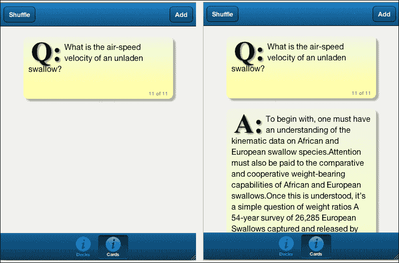
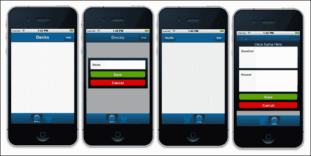
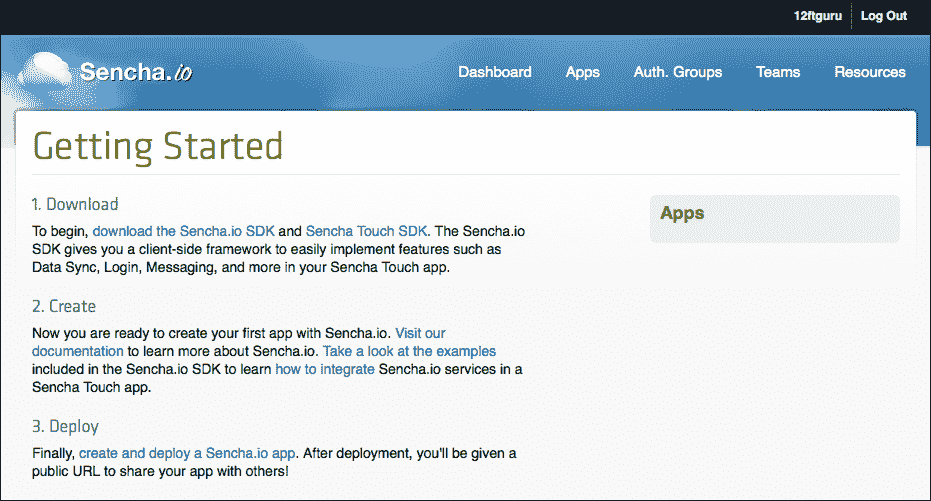
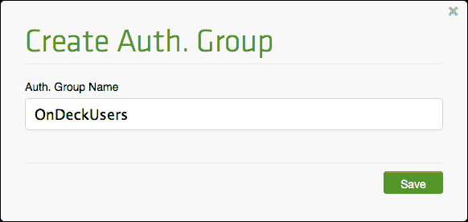
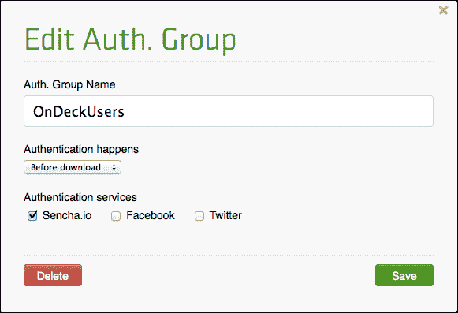
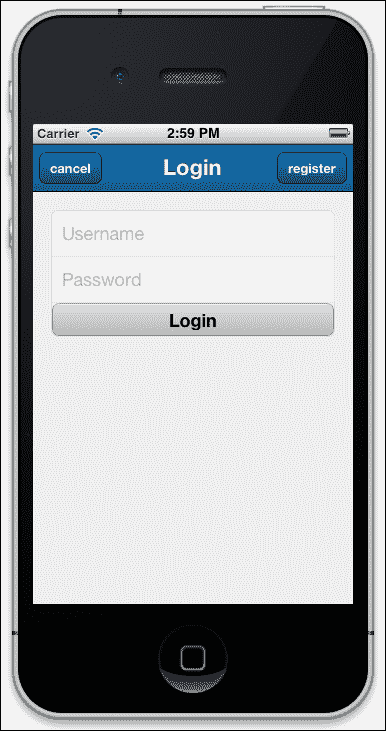
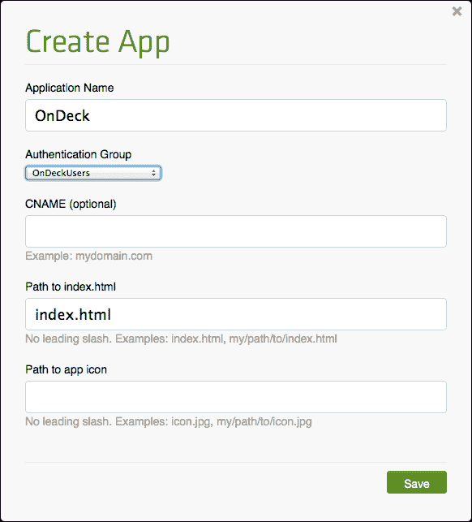
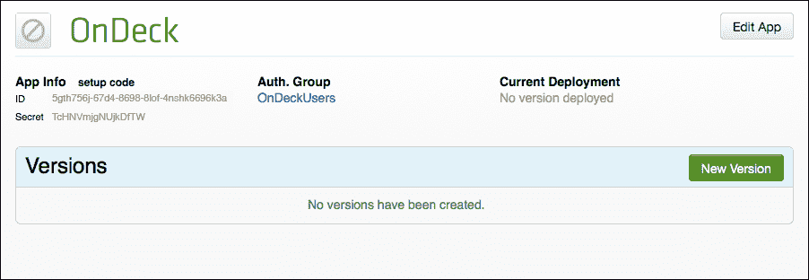
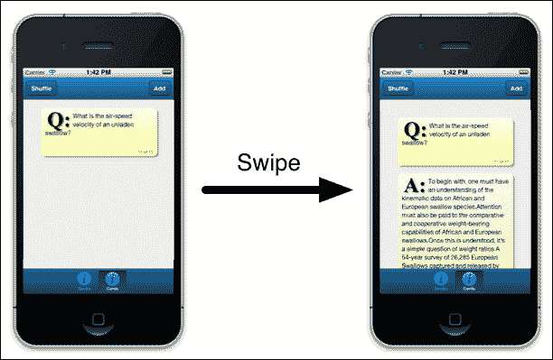
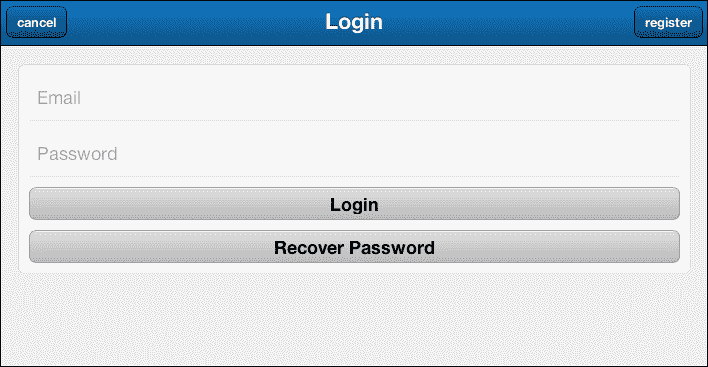

# 第五章。在牌组中：使用 Sencha.io

在我们之前的章节中，我们通常使用本地存储来维护我们的数据。这以其易用性和简单性提供了许多优势。存储和模型为我们做了所有繁重的工作。

然而，本地存储也有一些缺点。首先，它非常本地化。这意味着如果你的用户有多个设备（一部手机、桌面和一台平板电脑），那么他们将为每个设备有一组独立的数据。

这可能会使用户感到困惑，并抵消了拥有一个可以从多个设备访问的单个应用程序的优势。此外，用户在清除本地浏览器数据时可以删除数据。这可能会使本地存储对健壮的应用程序有些问题。

在本章中，我们将探讨使用名为 Sench.io 的外部 API 来解决此问题。以下是我们将要涵盖的内容：

+   设置基本应用程序

+   开始使用 Sencha.io

+   将基本应用程序更新为与 Sencha.io 一起工作

# 基本应用程序

我们的基本应用程序旨在以随机顺序向用户展示一组闪卡。每一组闪卡包含一副牌。用户可以为每副牌添加新的牌。这些牌和牌组将存储在一个名为**Sencha.io**的远程存储服务中。使用此服务，用户还可以从任何数量的设备登录并访问他们的牌和牌组。



我们将开始我们的应用程序，从模型和存储开始。

## 创建模型和存储

我们的牌组模型非常简单，只需要两块信息。我们将使用一个 ID 将牌链接到特定的牌组，并使用名称进行显示：

```js
Ext.define('MyApp.model.Deck', {
    extend: 'Ext.data.Model',
    config: {
        fields: [
            {
                name: 'id'
            },
            {
                name: 'name'
            }
        ]
    }
}); 
```

牌模型需要它自己的 ID，以便我们可以唯一地识别它，以及一个`deckID`值，以便我们知道它是哪个牌组的一部分。我们还需要为每张牌提供问题和答案：

```js
Ext.define('MyApp.model.Card', {
    extend: 'Ext.data.Model',
    config: {
        fields: [
            {
                name: 'id'
            },
            {
                name: 'deckID'
            },
            {
                name: 'question'
            },
            {
                name: 'answer'
            }
        ]
    }
});
```

对于这两个存储，我们最初将使用与之前章节中相同的本地存储`proxy`。这将让我们在开始使用 Sencha.io 服务之前测试我们的应用程序。

我们的牌组存储看起来是这样的：

```js
Ext.define('MyApp.store.DeckStore', {
    extend: 'Ext.data.Store',
    requires: [
        'MyApp.model.Deck'
    ],
    config: {
        autoLoad: true,
        model: 'MyApp.model.Deck',
        storeId: 'DeckStore',
        proxy: {
            type: 'localstorage',
            id: 'Decks'
        },
        fields: [
            {
                name: 'id',
                type: 'int'
            },
            {
                name: 'name',
                type: 'string'
            }
        ]
    }
});
```

如果你已经完成了第一章，这个基本设置应该对你来说相当熟悉。我们扩展了基本存储，需要我们的`model`文件，然后设置我们的配置。配置设置在创建时加载存储，告诉它使用哪个模型，设置我们的本地存储`proxy`，并告诉它期望哪些`fields`。

我们的牌存储几乎是一个完全的副本：

```js
Ext.define('MyApp.store.CardStore', {
    extend: 'Ext.data.Store',
    requires: [
        'MyApp.model.Card'
    ],
    config: {
        autoLoad: true,
        model: 'MyApp.model.Card',
        storeId: 'CardStore',
        proxy: {
            type: 'localstorage',
            id: 'Cards'
        },
        fields: [
            {
                name: 'id',
                type: 'int'
            },
            {
                name: 'deckID',
                type: 'int'
            },
            {
                name: 'question',
                type: 'string'
            },
            {
                name: 'question',
                type: 'string'
            }
        ]
    }
});
```

在这里，我们只是将名称从`Deck`更改为`Card`，并用我们的牌字段替换了牌组字段。

### 注意

如果你用模型配置存储，实际上你不必指定字段。我们在这里这样做只是为了完整性。

如前所述，一旦我们在 `Sencha.io` 上设置好一切，我们就会重新访问这些商店，但首先我们需要为我们的列表、卡片和编辑准备显示。

## 创建视图

对于我们的主视图，我们将使用一个包含两个容器的选项卡面板，一个用于我们的牌组，另一个用于我们的卡片。我们将使用表单进行编辑和添加新的牌组和卡片。我们的初始 `main.js` 文件如下所示：

```js
Ext.define('MyApp.view.Main', {
    extend: 'Ext.tab.Panel',

    config: {
        id: 'mainView',
        items: [],
        tabBar: {
            docked: 'bottom'
        }
});
```

记得将此文件添加到你的 `app.js` 文件中，并将启动函数设置为在应用程序启动时创建组件的副本（如果你使用 Sencha Architect，则此操作应自动完成）。你的 `app.js` 文件应如下所示：

```js
Ext.Loader.setConfig({
    enabled: true
});

Ext.application({
    models: [
        'Deck',
        'Card'
    ],
    stores: [
        'DeckStore',
        'CardStore'
    ],
    views: [
        'Main'
    ],
    name: 'MyApp',

    launch: function() {

        Ext.create('MyApp.view.Main', {fullscreen: true});
    }

});
```

接下来，我们需要将两个容器添加到我们的 `main.js` 视图中。在空项部分，添加以下容器：

```js
{
    xtype: 'container',
    layout: {
        type: 'fit'
    },
    title: 'Decks',
    iconCls: 'info',
    items: [
        {
            xtype: 'list',
            itemTpl: [
                '<div>{name}</div>'
            ],
            store: 'DeckStore'
        },
        {
            xtype: 'titlebar',
            docked: 'top',
            title: 'Decks',
            items: [
                {
                    xtype: 'button',
                    itemId: 'mybutton',
                    text: 'Add',
                    align: 'right'
                }
            ]
        }
    ]
}
```

这将是我们的牌组列表。整体容器具有 `fit` 布局，因此项目将填充容器的整个宽度和高度。我们给容器添加了一个标题和 `iconCls` 值，这些值将用于在 `Main` 选项卡面板中标记标签。

该容器有一个 `list` 视图，使用我们的 `DeckStore` 存储和简单的 `itemTpl` 模板，在单独的 `div` 标签中显示每个牌组的名称。

我们还添加了一个标题栏，其中可以显示用于添加新牌组的按钮，以及一个标题，让用户知道他们正在查看的内容。

我们的第二个容器遵循与第一个相同的模式，但与列表不同，我们有一个单独的容器，其中包含 `carousel` 布局，如下面的代码所示：

```js
{
    xtype: 'container',
    title: 'Cards',
    iconCls: 'info',
    items: [
        {
            xtype: 'titlebar',
            docked: 'top',
            items: [
                {
                    xtype: 'button',
                    itemId: 'mybutton1',
                    text: 'Add',
                    align: 'right'
                },
                {
                    xtype: 'button',
                    text: 'Shuffle'
                }
            ]
        },
        {
            xtype: 'carousel'
        }
    ]
}
```

该容器有一个 `titlebar` 控件，将设置为在顶部显示当前牌组的名称，并将卡片拉入 `carousel` 布局。我们还有一个第二个按钮，可以随机排列当前的牌组卡片。

接下来，我们需要设置用于添加卡片和牌组的两个表单。牌组表单是一个简单的表单，包含用于命名牌组的 `textfield` 元素，用于保存的 `button` 元素，以及用于取消的另一个 `button` 元素：

```js
Ext.define('MyApp.view.addDeckSheet', {
    extend: 'Ext.Sheet',
    alias: 'widget.addDeckSheet',

    config: {
        id: 'addDeckSheet',
        items: [
            {
                xtype: 'textfield',
                margin: '0 0 10 0',
                label: 'Name'
            },
            {
                xtype: 'button',
                ui: 'confirm',
                text: 'Save',
                itemID: 'saveDeckButton'
            },
            {
                xtype: 'button',
                itemId: 'cancelDeckButton',
                ui: 'decline',
                text: 'Cancel'
            }
        ],
        listeners: [
            {
                fn: 'hideDeckSheet',
                event: 'tap',
                delegate: '#cancelDeckButton'
            }
        ]
    },

    hideDeckSheet: function(button, e, options) {
        button.up('sheet').hide();
    }

});
```

我们还添加了一个监听器来监听 `Cancel` 按钮，该按钮会在不保存值的情况下隐藏表单。监听器将 `tap` 事件委托给我们的 `cancelDeckButton` 委托，并在 `tap` 事件发生时调用 `hideDeckSheet` 函数。

`hideDeckSheet` 函数接收 `button` 元素作为其参数的一部分。然后我们可以从按钮开始，沿着 DOM 结构向上移动，找到该表单，并将其隐藏。

### 提示

**关于上下使用的注意事项**

当你有一个组件并且需要到达子组件或父组件时，Sencha Touch 中的 `up` 和 `down` 函数非常有用。然而，需要注意的是，`up` 和 `down` 只返回第一个匹配的组件。例如，如果 `button` 元素位于 `container` 元素内部，而 `container` 元素本身又位于另一个 `container` 元素内部，那么 `button.up('container')` 将返回第一个容器而不是第二个，外部的容器。

我们的卡片表单是牌组表单的副本，但包含 `问题` 和 `答案` 的文本字段：

```js
Ext.define('MyApp.view.addCardSheet', {
    extend: 'Ext.Sheet', 
    config: {
        id: 'addCardSheet',
        items: [
            {
                xtype: 'container',
                html: 'Deck Name Here',
                style: 'color: #FFFFFF; text-align:center;'
            },
            {
                xtype: 'textareafield',
                id: 'cardQuestion',
                margin: '0 0 10 0',
                label: 'Question'
            },
            {
                xtype: 'textareafield',
                id: 'cardAnswer',
                margin: '0 0 10 0',
                label: 'Answer'
            },
            {
                xtype: 'button',
                ui: 'confirm',
                itemId: 'saveCardButton',
                text: 'Save'
            },
            {
                xtype: 'button',
                itemId: 'cancelCardButton',
                ui: 'decline',
                text: 'Cancel'
            }

        ],
        listeners: [
            {
                fn: 'hideCardSheet',
                event: 'tap',
                delegate: '#cancelCardButton'
            }
        ]
    },
    hideCardSheet: function(button, e, options) {
        button.up('sheet').hide();
    }
});
```

如前所述，我们有 **保存** 和 **取消** 按钮，当点击 **取消** 按钮时将隐藏表单。

现在，你应该能够启动应用程序并测试不同的视图，如所示：



在我们能够在应用程序中进一步工作之前，我们需要设置 Sencha.io。

# 开始使用 Sencha.io

Sencha.io 服务将允许我们使用 Sencha 的云服务来存储我们的数据。我们需要在 Sencha.io 控制台中注册一个新账户，添加我们的应用程序和用户组，然后配置我们的应用程序以使用该服务。

## 注册流程

要注册一个新账户，请访问 [`manage.sencha.io`](https://manage.sencha.io) 并点击页面底部的**注册**链接。填写表格并提交。一旦你的账户创建成功，使用注册时相同的地址登录 Sencha.io 控制台，你将看到以下截图类似的内容：



## 下载和安装 Sencha.io SDK

现在你已经有了账户，你可以下载并安装 Sencha.io SDK。在**入门**页面的第一部分有一个下载链接（当你登录时应该首先开始的地方）。

将 SDK 下载到您的计算机上并解压文件。将其移动到您的网页目录（您可以从应用程序中轻松引用的地方）。接下来，我们需要将这些文件添加到我们的应用程序中。您可以从打开主 `app.html` 文件并在文件的 `head` 部分添加以下行开始（与您的其他脚本包含一起）：

```js
<script type="text/javascript" src="img/socket.io.js"></script>
<script type="text/javascript" src="img/sencha-io-debug.js"></script>
```

### 注意

在这个例子中，我们将所有 Sencha.io 文件复制到了应用程序 `lib` 目录下的一个名为 `io` 的文件夹中。如果你的路径不同，你需要调整上面的行以适应你的设置。

现在我们已经包含了 Sencha.io 所需的两个主要文件，我们还需要在 `app.js` 中设置一些选项，以便自动加载器也能收集这些文件。在 `app.js` 文件的顶部，添加以下代码：

```js
Ext.Loader.setPath({
    'Ext.io': 'lib/io/src/io',
    'Ext.cf': 'lib/io/src/cf'
});
```

一旦我们设置了这些信息，我们的应用程序应该能够收集到它需要与 Sencha.io 一起工作的所有文件，但在我们继续构建之前，我们仍然需要注册我们的应用程序。

## 注册你的应用程序和 Auth 组

在 Sencha.io 上注册你的应用程序和 Auth 组将为应用程序提供其自己的数据存储和授权用户基础。与大多数 API 服务一样，你的应用程序需要一种方式来唯一标识自己以远程系统，这样它就会知道在哪里存储你的数据。

使用 Sencha.io，当注册我们的应用程序时，我们将获得两块信息：一个 `appID` 值和一个 `appSecret` 值。这两块信息将被添加到 `app.js` 中，以标识我们的应用程序给 Sencha.io 系统。

让我们从添加一个认证组开始。认证组设置了一个用户可以注册以使用您的应用程序的组。如果您有多个应用程序，可以为每个应用程序设置一个认证组，或者设置一个共享多个应用程序的单个认证组。

从您的 Sencha.io 账户的 **仪表板** 部分 ([`manage.sencha.io`](http://manage.sencha.io))，点击页面顶部的 **认证组** 链接，然后选择 **创建认证组**。



输入您的认证组名称，然后点击 **保存**。名称是任意的，但如果您为单个应用程序使用该组，最好将其命名为类似 `myAppNameUsers` 的名称，这样您可以跟踪这是为哪个应用程序。

认证组还控制用户在您的应用程序中的认证方式。一旦保存了认证组，您就可以编辑它并更改用户登录应用程序的方式。



您可以选择在应用程序完全下载之前或之后让用户进行认证。您还可以选择让用户使用有效的 Facebook、Twitter 或 Sencha.io 账户登录。

如果您选择 **Sencha.io** 登录选项，那么 SDK 将自动处理应用程序内的用户注册和认证，无需额外编码。

如果您选择 **Facebook** 或 **Twitter** 登录选项，Sencha.io 将自动处理认证。用户在能够访问应用程序之前必须先在任一服务中注册。



现在我们已经为应用程序设置了一组用户，我们需要注册应用程序本身。从 Sencha.io 仪表板，点击 **应用**，然后点击 **创建应用**。和之前一样，我们只需要输入应用程序的名称。对于这个应用程序，我们选择了 **OnDeck** 这个名称，如下截图所示：



接下来，我们需要从下拉菜单中选择我们的 **认证组** 名称。这会告诉 Sencha.io 对此组进行认证并将用户分配给我们的应用程序。有一个可选的 **CNAME** 字段用于设置应用程序所在的域名，以及一个用于 `index.html` 文件路径的字段。如果您使用的是 `app.html` 文件而不是 `index.html`，或者如果您的应用程序托管在服务器的子目录中，则需要设置此字段。

我们还可以在这里设置应用程序图标。这是当用户将我们的网络应用程序保存到主屏幕时将使用的图标。完成设置后，点击 **保存**。



在页面应用程序页面上，您现在应该看到您的应用程序 ID（在 **ID** 字段中提及）和密钥（在 **Secret** 字段中提及）的列表。请注意这些信息，因为我们完成注册后需要将它们添加到 `app.js` 中。

### 备注

请注意，前面示例截图中的 **ID** 和 **Secret** 值仅是示例数据。您需要在 Sencha.io 网站上生成自己的信息以使您的应用程序工作。您还需要生成自己的 ID 和密钥以使章节中的示例代码工作。

完成注册的这一部分后，您需要将 ID 和密钥值添加到您的 `app.js` 文件中。打开文件，并在 `Ext.application({` 部分的顶部添加以下代码：

```js
config: {
    io: {
    appId: 'YouAppIDHere',
    appSecret: 'YouAppSecretHere'
  }
}
```

用 `appId` 和 `appSecret` 占位符所示的信息替换您的信息。一旦您将信息添加到 `app.js` 中，我们就可以回到更新我们的存储和创建我们的控制器。

# 更新应用程序以使用 Sencha.io

现在我们已经注册了应用程序，我们需要设置存储以使用 Sencha.io。我们还将设置应用程序的控制器，并展示如何覆盖 `Carousel` 组件以使其与数据存储一起工作。

## 更新存储

我们原始的存储是简单的本地存储，用于测试。我们现在将编辑这些存储以使用 Sencha.io 存储我们的数据。这些更改的大部分将在 `proxy` 部分进行。例如，`DeckStore` 代码应更新为如下所示：

```js
Ext.define('MyApp.store.DeckStore', {
    extend: 'Ext.data.Store',
    requires: [
        'MyApp.model.Deck'
    ],

    config: {
        autoLoad: true,
        model: 'MyApp.model.Deck',
        storeId: 'DeckStore',
 proxy: {
 type: 'syncstorage',
 id: 'decks',
 owner: 'user',
 access: 'private'
 },
 autoLoad: true, 
 autoSync: false
    }
});
```

注意，我们现在使用一种新的代理类型，称为 `syncstorage`。这是一个特殊的 Sencha.io 代理，它的工作方式与本地存储非常相似，但它将数据远程存储在 Sencha.io 服务器上。

我们还有新的 `owner` 和 `access` 配置。`owner` 和 `access` 字段都必须设置，`syncstorage` 才能正确工作。截至本文写作时，唯一的 `owner` 选项是 `user`。这是当前认证的用户。

`access` 配置确定存储是**私有**的，仅对当前认证用户可用，还是**公共**的，对所有用户组的成员可用。这是我们设置在 Sencha.io 仪表板中的用户组。

接下来，我们添加了 `autoLoad: true` 的配置。当用户仍然登录时，如果连接丢失，这将加载任何本地数据。然后我们设置 `autosync: false` 以防止存储在应用程序启动时自动同步。我们应该在加载存储之前等待用户登录到应用程序。我们将手动作为应用程序控制器的一部分来完成这项工作。

您可以对 `CardStore.js` 文件进行完全相同的更改，使其与 Sencha.io 一起工作，但需要为 `remoteFilter: false` 设置一个额外的设置。当用户登录时，我们将加载所有用户的卡片，并在选择一副牌后进行过滤。

### 备注

`remoteFilter` 配置是存储的一部分，而不是代理。

现在我们已经配置了存储，我们可以继续到控制器部分。

## 创建控制器

我们的控制器需要为我们处理一些事情：

+   为 Sencha.io 设置

+   处理登录和登出时需要发生的任何事情

+   添加卡片和牌组

+   选择用于显示的牌组

+   在本地应用程序和 Sencha.io 之间同步

我们将首先设置基本控制器，包括模型、视图、存储和引用：

```js
Ext.define('MyApp.controller.MyController', {
    extend: 'Ext.app.Controller',
    config: {
        selectedDeck: false,
        models: [
          'Deck',
          'Card'
        ],
        stores: [
          'DeckStore',
          'CardStore'
        ],
        views: [
          'Main',
          'addCardSheet',
          'addDeckSheet',
          'CardView'
        ],
   refs: {
       addCardSheet: '#addCardSheet',
       addCardSaveButton: '#addCardSheet button[text="Save"]',
       addDeckSheet: '#addDeckSheet',
       addDeckSaveButton: '#addDeckSheet button[text="Save"]',
       deckList: '#deckList',
       mainView: '#mainView',
       shuffle: 'button[text="Shuffle"]'
   }
  }
});
```

第一部分定义了我们的控制器，并列出了之前创建的`models`、`stores`和`views`值。我们还为`selectedDeck`添加了一个空配置。我们将使用这个作为存储当前所选牌组记录的占位符。这将允许我们在控制器的任何地方使用`getSelectedDeck`和`setSelectedDeck`轻松地获取和设置值。

### 小贴士

**获取器和设置器**

Sencha Touch 会自动为配置设置以及引用创建`get`和`set`函数（见下一节）。这些函数的形式为`getWhateverYouCalledIt`和`setWhateverYouCalledIt`。重要的是要记住，即使你将`config`选项或引用的第一个字母小写，`get`和`set`函数也会将第一个字母大写。

`refs`部分允许我们通过`id`（例如`#addCardSheet`）或组件查询（例如`#addCardSheet button[text="Save"]`）创建对组件的引用。

### 注意

前一个组件查询将寻找一个`id`值为`addCardSheet`的组件，然后在该组件中找到配置为`"Save"`的按钮。

我们现在可以使用`this.getReferenceName`引用我们的`refs`列表中的任何内容。

在`refs`部分之后，我们需要添加一个`control`部分。此部分使用我们的引用，并为一些组件定义了一组监听器和函数：

```js
control: {
    addCardSaveButton: {
  tap: "addCard"
    },
    addDeckSaveButton: {
  tap: "addDeck"
    },
    deckList: {
  select: "onDeckSelected"
    },
    addCardSheet: {
  show: "updateCardSheetDeckInfo"
    },
    shuffle: {
  tap: 'shuffleDeck'
    }
}
```

我们`control`部分的每个成员都有一个引用，一个要监听的事件，以及当事件发生时要触发的函数。我们将在控制器中稍后创建这些函数，但首先我们需要添加我们的`init`函数来设置 Sencha.io 和其他认证函数。

当我们的应用程序首次启动时，它需要监听 Sencha.io 控制器进行认证和消息处理。我们在`init`函数中处理这个问题（紧接在`config`部分之后）：

```js
init: function() {
  this.getApplication().sio.on({
    authorized: this.onAuth,
    logout: this.onLogout,
    usermessage: this.onUserMessage,
    scope: this
  });
}
```

这段代码告诉我们的控制器来自 Sencha.io 控制器的三个事件：

+   `authorized`：用户已成功登录

+   `logout`：用户已从系统中登出

+   `usermessage`：用户已收到消息

我们为每个这些事件分配了一个函数，现在我们需要在`init`函数下方添加它们。

第一件事是我们的`onAuth`函数，它在用户登录后同步所有用户的存储：

```js
onAuth: function(user) {
 Ext.getStore('DeckStore').sync();
 Ext.getStore('CardStore').sync();
 return true;
}
```

我们的`onLogout`函数执行相反的操作，并清除任何本地存储的数据：

```js
onLogout: function() {
  var deckStore = Ext.getStore('DeckStore');
  deckStore.getProxy().clear();
  deckStore.load();
  var cardStore = Ext.getStore('CardStore');
  cardStore.getProxy().clear();
  cardStore.load();
  return true;
}
```

我们的消息功能有点更有趣。

Sencha.io 允许应用程序向用户发送消息。这些可以是系统消息（例如，存储中的数据已更新）或甚至用户之间的直接消息。

我们已经设置了一个函数，当收到消息时简单地同步我们的存储（我们将在稍后设置函数以发送消息）。这意味着如果用户在一个设备上打开了程序并更改了数据，任何其他登录了该用户的设备都将更新并接收更改：

```js
    onUserMessage: function(sender, message) {
        var userId = sender.getUserId();
        console.log("user got a message!", arguments, userId);
        Ext.getStore('DeckStore').sync(function() {
            console.log("DeckStore sync callback", arguments);
        });
        Ext.getStore('CardStore').sync(function() {
            console.log("CardStore sync callback", arguments);
        });
        return true;
    }
```

我们还添加了一些控制台日志，你可以使用它们来查看发送的消息和可能可用于应用程序的数据。

### 注意

在测试应用程序时，请确保打开控制台并检查可用的不同消息元素。我们将在最后一章深入探讨消息传递，但你也可以查看[`docs.sencha.io`](http://docs.sencha.io)上提供的*概述指南*以获取有关消息传递的更多信息。

接下来，我们需要添加将保存我们新卡片和牌组的函数。这两个函数都与它们各自的保存按钮相关联。它们需要从表格中获取数据，将其添加到存储中，然后同步存储：

```js
addCard: function() {
 var cards = Ext.getStore('CardStore'),
 sheet = this.getAddCardSheet();
 cards.add({
  deckID: this.getSelectedDeck().get('id'),
  question: sheet.down('#cardQuestion').getValue(),
  answer: sheet.down('#cardAnswer').getValue()
 });
 cards.sync(Ext.bind(this.syncCallback, this));
 sheet.down('#cardQuestion').setValue("");
 sheet.down('#cardAnswer').setValue("");
 sheet.hide();
}
```

我们在这里使用我们的引用来通过`this.getAddCardSheet()`获取`addCardSheet`值，然后将数据作为一条新记录添加到我们的卡片存储中。

然后，我们同步存储并将一个名为`syncCallback`的函数绑定。这是将发送消息告知应用程序数据已更新的函数。`syncCallback`函数可以直接放在`addCards`函数下面：

```js
syncCallback: function() {
    console.log("broadcast update", arguments);
    this.getApplication().sio.getUser(function(user, error) {
        if (user) {
            console.log("user", user);
            user.send({
                message: "updated"
            },
            function() {
                console.log("send callback");
            }
            );

        }
    });
}
```

控制台日志被保留以提供函数内部传递数据的内部视角。代码的第一部分`this.getApplication().sio.getUser`获取当前认证的用户并运行一个函数。该函数检查是否收到了用户，如果是，我们向用户发送一条简单的消息，内容为`updated`。

这条消息由我们的`onUserMessage`函数处理，这会导致我们的存储更新其数据。你可以更改这条消息并使用控制台日志来查看两个函数之间数据是如何传递的。

我们的`addDeck`函数是`addCard`函数的虚拟副本：

```js
addDeck: function() {
 var decks = Ext.getStore('DeckStore'),
 sheet = this.getAddDeckSheet();
 decks.add({
  name: sheet.down('textfield').getValue()
 });
 decks.sync(Ext.bind(this.syncCallback, this));
 sheet.down('textfield').setValue("");
 sheet.hide();
}
```

在同步存储并执行`syncCallback`函数之前，我们只需要获取一个`textfield`值。与之前一样，在隐藏表格之前，我们也会清除字段值。

接下来，我们需要暂时离开控制器，看看我们的卡片是如何显示的。

## 覆盖 Carousel 组件

对于一个闪卡应用来说，`Carousel`组件似乎是一个理想的选择，因为它允许用户快速翻转到下一张卡片。这将使我们能够展示一个问题，并让用户滑动以获取答案。用户可以再次滑动以获取下一个问题，依此类推。

这个问题在于`Carousel`实际上是一个面板集合，而我们真正需要的是能够像列表视图那样从我们的数据存储中提取记录的东西。为了做到这一点，我们需要覆盖`Carousel`组件并添加一些额外的行为。

我们将从扩展`Carousel`的基本组件开始：

```js
Ext.define('MyApp.view.CardView', {
 extend: 'Ext.carousel.Carousel',
 alias: 'widget.flashcards',
 config: {
  store: null,
  indicator: false
 }
});
```

我们最初将`store`配置设置为默认的`null`。我们将在`Main.js`文件中声明组件时设置它。在我们的`Main.js`文件中，找到以下部分：

```js
xtype: 'carousel'
```

将该行替换为以下内容：

```js
xtype: 'flashcards',
store: 'CardStore'
```

这将容器设置为我们的新`flashcards`轮播图，并将`store`配置设置为`CardStore`。

如果我们在`CardView.js`文件中硬编码了组件的存储，那么它将更难重用。当你覆盖一个组件以扩展功能时，始终是一个好主意，编写时考虑到将来在其他地方重用的可能性。

回到`CardView.js`，我们需要添加一对字符串，用作问题和答案卡片的 xTemplates。这些放在我们的组件的`config`部分：

```js
questionTpl: '<div class="question qa"><span class="count">{number} of {total}</span><span class="question">{question}</span></div>',
answerTpl: '<div class="question qa"><span class="count">{number} of {total}</span><span class="question">{question}</span></div><div class="answer qa"><span class="answer">{answer}</span></div>'
```

这些将控制如何显示问题和答案卡片。由于我们将多次使用这些相同的模板，所以在`constructor`函数中编译它们是个好主意。否则，xTemplate 将在每次创建新的闪存卡时被编译和重新编译：

```js
constructor: function(config) {
   this.callParent(arguments);
   this.getQuestionTpl().compile();
   this.getAnswerTpl().compile();
   this.setStore(Ext.getStore(this.getStore()));
   this.getStore().on({
       load: this.createCards,
       refresh: this.createCards,
       addrecords: this.createCards,
       scope: this
   });

}
```

我们的`constructor`函数还设置了在`Main.js`中传递的存储。这个函数有点复杂，需要一些解释。让我们从内部开始，逐步向外解释：

+   `this.getStore()`: 这获取我们在`Main.js`中传递的字符串值（`store: 'CardStore'`）

+   `Ext.getStore()`: 这通过`storeId`值为`'CardStore'`获取存储

+   `this.setStore()`: 这将存储应用于我们的`CardView`组件，替换原始字符串值

在下一行调用`this.getStore()`来设置`listeners`时，现在它返回一个实际的存储，而不是之前的字符串值。

然后我们为存储的`load`、`refresh`和`addrecords`事件分配一个单一的功能。我们需要在下一个步骤中添加该函数。

我们将这个函数分为两部分。第一部分是`createCards`函数，它获取我们的存储并从我们的自定义轮播图中删除任何现有的面板。然后它检查存储中是否有任何卡片：

```js
createCards: function() {
   var store = this.getStore();
   this.removeAll(); // removes all the old panels
   if (store.getCount() > 0) {
     store.each(this.createFlashCard, this); 
   } else {
       this.add({xtype: 'panel', html: 'No Cards Available for this Deck.<br />Please click Add to add a card to this deck.'});
   }
   this.setActiveItem(0);
}
```

如果没有，我们给用户显示一条消息，说明牌组中没有卡片，并且他们可以点击**添加**来创建新的卡片。

这就是我们的函数的第二部分发挥作用的地方。如果我们有记录，我们将每个记录传递给一个名为`createFlashCard`的第二个函数：

```js
createFlashCard: function(record, index, total) {
  var data = Ext.apply({ total: total, number: (index + 1) }, record.data);
  this.add({ xtype: 'panel', html: this.getQuestionTpl().apply(data), scrollable: 'vertical' });
  this.add({ xtype: 'panel', html: this.getAnswerTpl().apply(data), scrollable: 'vertical' });
}
```

这个函数在`CardStore`中的每一条记录上运行。第一行创建我们的初始数据数组，并设置`total`（牌组中的卡片数量）、`number`（当前卡片的顺序号）和从存储中获取的`data`记录（其中包含我们的问题和答案）的值。

然后我们创建一个新的`panel`组件，并将`html`设置为应用了数据的编译后问题模板。

我们对答案模板也做同样的事情，因此对于存储中的每条记录，我们最终会得到两个新的面板；一个问题面板，后面跟着一个答案面板。

由于`CardStore`包含每个牌组的所有记录，我们在`CardsView`轮播加载之前需要按牌组过滤这些记录。我们将在控制器中处理这个问题。

## 回到控制器

一旦用户从我们的列表中选择了一个牌组，我们需要过滤`CardStore`，以便只有该牌组的卡片可用。我们在`onDeckSelected`函数中这样做：

```js
onDeckSelected: function(list, record) {
 var cards = Ext.getStore('CardStore');
 this.setSelectedDeck(record);
 cards.clearFilter();
 cards.sort('id', 'ASC');
 cards.filter('deckID', record.get('id'));
 this.getMainView().down('#cardsPanel').enable();
 this.getMainView().setActiveItem(1);
}
```

此函数由我们的`deckList`组件中的选择事件触发，并将列表和所选记录传递给我们。一旦我们获取到`CardStore`，我们将`selectedDeck`函数设置为在列表中的牌组被选中时传递给我们的记录。

接下来，我们清除`CardStore`上的任何现有过滤器，并按其`id`值对其进行排序。然后我们过滤卡片，只显示当前牌组的卡片。最后，我们启用`cardsPanel`并将其设置为活动项。

我们还有一个`control`函数，当`cardPanel`显示时触发。此函数将卡片面板的标题栏设置为牌组的名称：

```js
updateCardSheetDeckInfo: function(sheet) {
sheet.down('#deckName').setHtml(this.getSelectedDeck().get('name'));
}
```

由于我们最初加载的卡片存储按`id`顺序显示它们，可能让用户洗牌是个好主意。我们通过最终的控制器函数来实现这一点：

```js
shuffleDeck: function() {
 Ext.getStore('CardStore').sort({
  sorterFn: function() {
   return (Math.round(Math.random())-0.5);
  }
 });
}
```

此函数获取`CardStore`并使用 JavaScript 的`Math.random`函数对其进行排序，为每张卡片分配一个随机的排序顺序。

### 注意

要更全面地了解 JavaScript（以及 Sencha Touch）中的排序工作原理，请参阅 Mozilla 开发者网络提供的出色的 JavaScript 排序参考，网址为[`developer.mozilla.org/en/JavaScript/Reference/Global_Objects/Array/sort`](https://developer.mozilla.org/en/JavaScript/Reference/Global_Objects/Array/sort)。

现在，你应该能够向应用程序添加牌组和卡片。当你选择一个牌组时，卡片堆将出现。你可以通过从右向左滑动来从一张卡片切换到下一张，如下所示：



你可以使用 CSS 文件来设置答案和问题的样式，以适应你自己的个人品味。

记住，在开始创建牌组和卡片之前，你需要注册应用程序。一旦你注册了，你就可以从任何 Sencha Touch 兼容的浏览器登录并跨多个设备访问相同的信息。幸运的是，由于我们使用 Sencha.io，所有这些都会自动处理。



Sencha.io 自动为我们应用程序创建这些登录和注册表单。如果用户点击**注册**按钮，他们将被提供注册和使用您应用程序的机会。Sencha.io 处理所有表单、数据存储和交互，包括密码恢复，无需任何额外的代码。

# 应用程序的部署

Sencha.io 还提供了将您的应用程序部署到 Sencha.io 云服务的选项。

从 Sencha.io 仪表板中，您可以在页面右侧的列表中点击您的应用程序。当应用程序的主页出现时，点击**新版本**，您将能够上传一个包含所有代码的压缩文件到 Sencha.io 网站。

上传完成后，您将看到一个可以用来访问应用程序的公共 URL。您还可以指定发布是针对开发还是生产。

您也可以选择将应用程序部署到您自己的 Web 服务器。

# 作业

可以添加一些内容到应用程序中使其更加完整：

+   添加编辑/删除卡片和牌组的功能

+   更新牌组列表模板以显示牌组中的卡片数量

+   为问题和答案提供更详细的布局和 CSS 样式

+   将 Sencha 仪表板中的登录方法切换为允许使用 Facebook 登录

+   使用消息系统在用户有新卡片或牌组可用时向用户显示警报

Sencha.io 提供的机会是巨大的。凭借其集成的消息系统，您有可能与单个用户或应用程序的每个用户进行通信。这为用户之间发布和共享牌组等可能性打开了大门。

更多信息，请查看[`docs.sencha.io/0.3.3/index.html#!/guide/overview_introduction`](http://docs.sencha.io/0.3.3/index.html#!/guide/overview_introduction)提供的文档。

# 摘要

在本章中，我们使用了一个简单的闪卡应用程序来探索 Sencha.io 的一些用途和可能性。我们涵盖了以下内容：

+   构建基本应用程序，包括存储、模型和视图

+   开始使用 Sencha.io，注册、下载、安装和配置基本应用程序以与 Sencha.io 服务通信

+   为应用程序创建控制器并更新存储以连接到 Sencha.io 服务

+   覆盖轮播图，使其能够从数据存储中读取

+   将应用程序部署到 Sencha.io

在下一章中，我们将探讨创建用于 Sencha Touch 的自定义 API。
