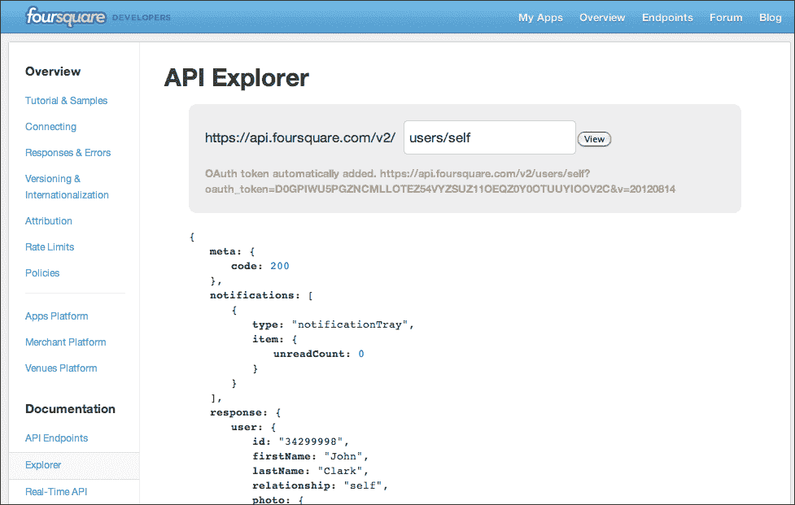
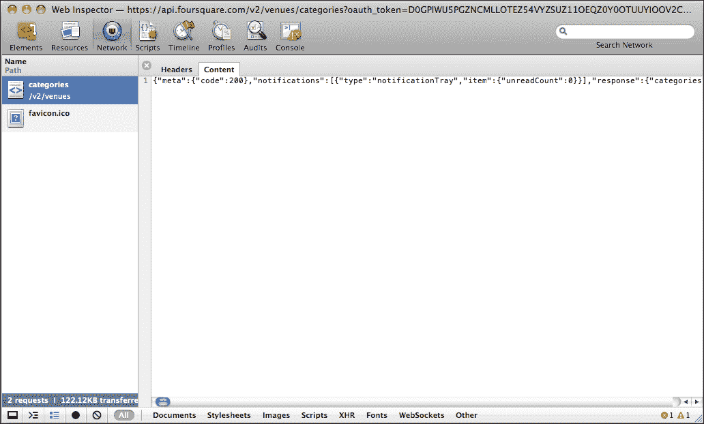
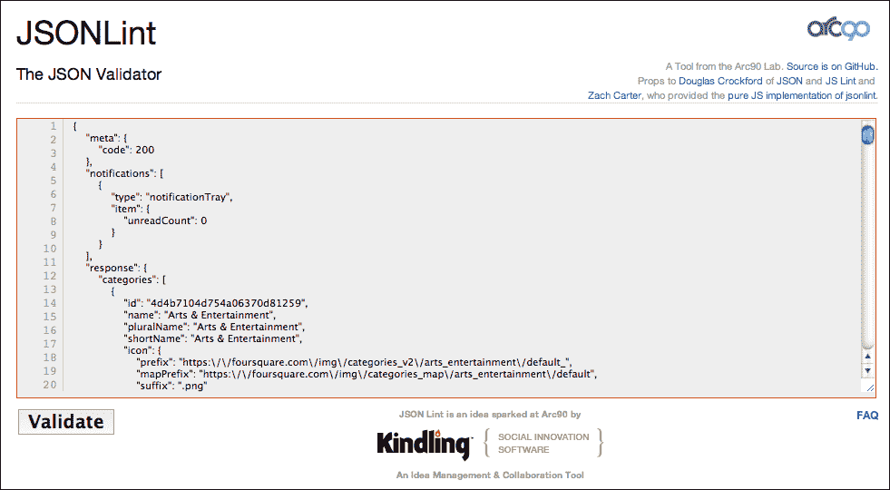
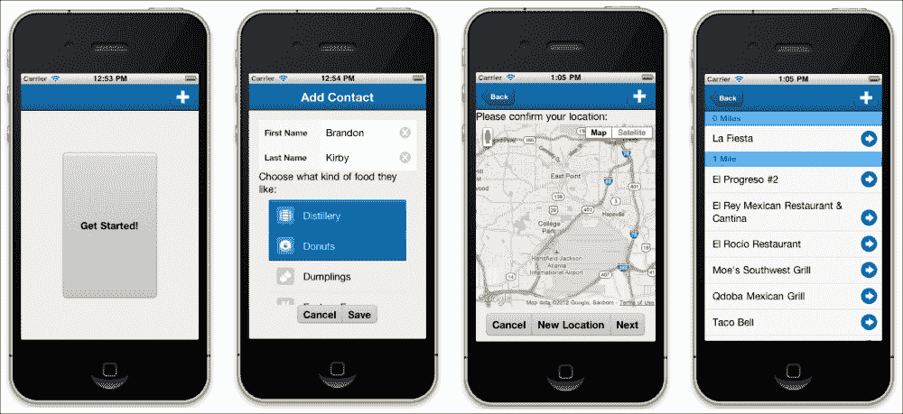
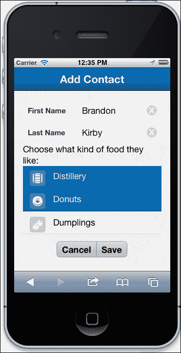
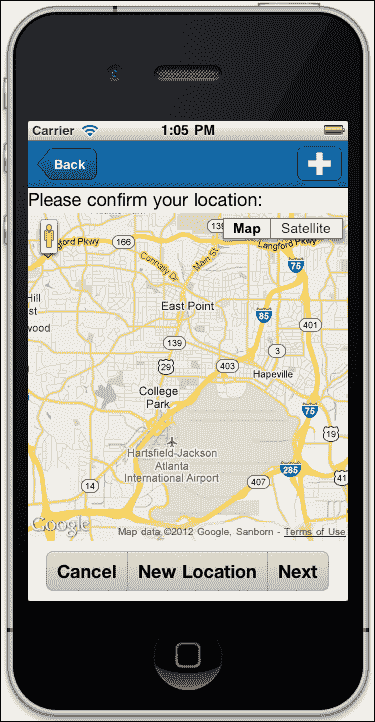
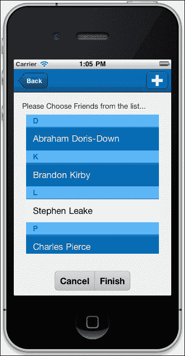
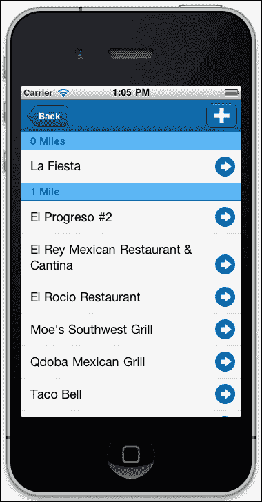

# 第七章. 决策者：外部 API

移动技术的一个关键方面是将不同的系统结合起来形成一个有意义的应用程序。越来越多的公司允许通过**应用程序编程接口**或**API**访问他们的程序和数据。这些 API 包括如下内容：

+   通过 Google、Yahoo 和其他提供商的地图

+   如 Rdio 和 Spotify 之类的音乐应用程序

+   如 Foursquare 之类的位置感知数据提供商

+   如 Facebook 和 Google Plus 之类的社交网络

+   如 Flickr 和 Picasa 之类的照片服务

    ### 注意

    你可以在[`www.programmableweb.com/apis`](http://www.programmableweb.com/apis)上大致了解可用的内容。

这只是可用数据的小样本，使你的应用程序更有用。关键是获取数据和使用数据的方法。在本章中，我们将使用 Foursquare API 来探索这些类型 API 的使用以及如何开始。我们将讨论：

+   外部 API 概述

+   开始使用 Foursquare API

+   构建基本应用程序

+   使用 Foursquare 的信息加载数据存储

+   向用户展示数据

我们将从外部 API 通常是如何工作以及你需要开始使用它的概述开始。

# 使用外部 API

许多不同的公司提供 API 作为一项服务。这不是公司完全无私的行为。预期是通过提供信息和访问公司数据，公司可以使他们的服务得到更多使用，并吸引更多客户。

考虑到这一点，大多数（如果不是所有）公司都会要求你在他们的系统中拥有一个账户，以便访问他们的 API。这允许你从你的应用程序内部访问他们的系统和信息，但更重要的是，从公司的角度来看，它允许他们保持对其数据如何使用的控制。如果你违反了公司的使用政策，他们可以切断你的应用程序对数据的访问，所以请保持友好。

## API 密钥

大多数 API 在使用时都需要一个密钥。API 密钥是一长串文本，它作为任何你发送到 API 的请求的额外参数发送。密钥通常由两个独立的部分组成，它像用户名和密码对普通用户账户那样唯一地识别你的应用程序。因此，最好也将此密钥隐藏在你的应用程序中，这样你的用户就不能轻易地获取它。

虽然每个公司都不同，但 API 密钥通常只是填写一个网页表单并获取密钥的事情。大多数公司不为此服务收费。然而，一些公司确实限制了外部应用程序可用的使用量，因此查看公司对其服务设定的任何限制是个好主意。

一旦你有了 API 密钥，你应该查看 API 提供的可用功能。

## API 函数

API 函数通常有两种类型——公开的和受保护的：

+   公共功能可以通过 API 密钥简单请求

+   受保护的函数还要求用户登录到系统中才能发出请求

如果 API 功能受保护，您的应用程序还需要知道如何正确地与远程系统登录。登录功能通常会是 API 的一部分或是一个网络标准，例如 Facebook 和 Google 的 OAuth。

### 注意

应该注意的是，虽然 OAuth 是一个标准，但其实现将根据服务而有所不同。您需要查阅您所使用服务的文档，以确保您需要的特性和功能得到支持。

一定要阅读服务的 API 文档，以了解您需要哪些功能以及它们是否需要登录。

关于 API 的另一件事是要理解，它们并不总是完全按照您需要的去做。您可能会发现，您需要做比预期更多的工作才能获取所需的数据。在这种情况下，进行一些测试总是好的。

许多 API 提供控制台接口，您可以直接在系统中输入命令并检查结果：



这对于深入挖掘数据非常有帮助，但控制台并不总是适用于每个 API 服务。另一种选择是将命令发送到您的应用程序中（包括您的 API 凭据）并在 Safari 控制台中检查返回的数据。

这种方法的缺点是数据通常以单行字符串的形式返回，如截图所示，非常难以阅读：



这时，一个像 JSONLint 这样的工具就派上用场了。您可以将从 Safari 控制台复制的单行字符串粘贴到[`jsonlint.com`](http://jsonlint.com)页面中，这样字符串就会被格式化，使其更容易阅读，并且同时验证字符串作为 JSON 的有效性：



一旦您掌握了发送和接收的数据，您就需要在 Sencha Touch 中设置所有这些。

## 外部 API 和 Sencha Touch

正如我们在本书中之前讨论过的，您不能使用标准的 AJAX 请求从另一个域获取数据。您需要使用 JSONP 代理和存储来请求外部 API 的数据。

使用 API 或 Safari 控制台，您可以很好地了解返回给您的数据，并使用它来设置您的模型。对于这个例子，让我们使用一个简单的模型叫做`Category`。

```js
Ext.define('MyApp.model.Category', {
    extend: 'Ext.data.Model',
    config: {
        fields: ['id', 'name', 'icon']
    }
});
```

然后，我们可以设置一个存储来从 API 加载数据：

```js
var store = Ext.create('Ext.data.Store', {
    model: 'Category',
    proxy: {
        type: 'jsonp',
        url : 'http://foursquare.com/vendors/categories' ,
        extraParams: {
          apiKey: 'XXXXXXXXXXXXXXXXXXXXXXXXX',
          appSecret: 'XXXXXXXXXXXXXXXXXXXXXXXXXXXXX'
        },
        reader: {
            type: 'json',
            rootProperty: 'categories'
        }
    }
});
```

这将设置一个使用我们的`Category`模型的数据存储，并调用我们外部 API 的`url`属性。请记住，我们必须在请求中发送我们的凭据，因此我们在`proxy`部分将这些设置为`extraParams`。

### 注意

这里显示的`apiKey`和`appSecret`属性是示例。您需要自己的 API 密钥信息才能使用 API。

我们还需要在`reader`部分设置一个名为`rootProperty`的属性。大多数 API 都会在请求中发送大量的详细信息，并且存储需要一些关于从何处开始加载类别记录的想法。

我们还可以通过在存储代理上调用`setExtraParam()`函数来稍后添加额外的参数。这将使我们能够添加要发送到外部 API URL 的额外参数。

### 注意

请注意，`setExtraParam()`将添加一个额外的参数，但`setExtraParams()`将用新值替换我们所有的`extraParams`。

让我们看看本章的应用程序，看看这一切是如何结合在一起的。

# 基本应用

Decider 应用程序旨在结合使用本地存储、Google 的 Map API 和 Foursquare API。应用程序将获取人员列表及其食品偏好，然后使用 Foursquare 和 Google Maps 找到符合每个人食品偏好的附近餐饮场所。

此截图提供了先前解释的图示表示：



我们将使用本地存储来存储我们的联系人和类别。来自 Google 和 Foursquare 的外部 API 将分别生成我们的地图和餐厅列表。我们将在深入研究存储设置和 API 集成之前，快速概述基本应用程序结构和表单。

我们的主要容器是一个简单的卡片布局：

```js
Ext.define('MyApp.view.ViewPortContainer', {
    extend: 'Ext.Container',

    config: {
        id: 'viewport',
        layout: {
            type: 'card'
        },
        items: [ ]
    }

});
```

在此视图中，我们将添加两个卡片：一个导航视图和一个表单面板。我们的`navigationvew`将作为我们的主显示窗口。我们将通过我们的控制器向其中添加额外的容器：

```js
{
    xtype: 'navigationview',
    id: 'mainView',
    navigationBar: {
        items: [
            {
                xtype: 'button',
                handler: function(button, event) {
                    Ext.getCmp('viewport').setActiveItem(1);
                },
                id: 'addContactButton',
                ui: 'action',
                iconCls: 'add',
                iconMask: true,
                align: 'right'
            }
        ]
    },
    items: [
        {
            xtype: 'container',
            id: 'homeScreen',
            layout: {
                type: 'hbox'
            },
            items: [
                {
                    xtype: 'button',
                    action: 'go',
                    margin: 75,
                    text: 'Get Started!',
                    flex: 1
                }
            ]
        }
    ]
}
```

此`mainView`包含我们的`navigationBar`和包含大号`Get Started`按钮的`homeScreen`容器。此按钮将向导航视图添加新容器（我们将在控制器中稍后查看）。

### 注意

记住，Sencha Touch 会自动为添加到导航视图中的每个容器创建一个返回按钮。这意味着我们不需要为它编写额外的代码。

添加到我们的视口中的第二个项目是我们的表单面板。它将包含用于姓氏和名字的文本字段，以及用于我们不同食品类别的可选择列表：

```js
{
    xtype: 'formpanel',
    id: 'editContact',
    layout: {
        type: 'vbox'
    },
    items: [
        {
            xtype: 'textfield',
            label: 'First Name',
            labelWidth: '40%',
            name: 'firstname'
        },
        {
            xtype: 'textfield',
            label: 'Last Name',
            labelWidth: '40%',
            name: 'lastname'
        },
        {
            xtype: 'label',
            html: 'Choose what kind of food they like:'
        },
        {
            xtype: 'list',
            id: 'categoryList',
            itemTpl: [
                '<div><span class="icon"></span> {shortName}</div>'
            ],
            store: 'Categories',
            mode: 'MULTI',
            flex: 1
        },
        {
            xtype: 'segmentedbutton',
            margin: '0 0 10 0',
            layout: {
                pack: 'center',
                type: 'hbox'
            },
            items: [
                {
                    xtype: 'button',
                    text: 'Cancel'
                },
                {
                    xtype: 'button',
                    text: 'Save'
                }
            ]
        },
        {
            xtype: 'titlebar',
            docked: 'top',
            title: 'Add Contact'
        }
    ]
}
```

我们通过一个`segmentedbutton`属性关闭表单，该属性具有`Save`和`Cancel`选项。我们将在控制器中稍后添加这些按钮的处理函数。

我们还在表单的顶部包括一个标题栏，以使用户了解他们正在做什么。

此表单的关键部分之一是类别列表，因此让我们更详细地看看它是如何工作的。

## 创建类别列表

由于我们将从 Foursquare API 获取潜在餐厅的列表，因此我们需要使用他们的类别，以便我们可以以某种程度的准确性匹配事物。

### 注意

Foursquare API 可以在 [`developer.foursquare.com/`](https://developer.foursquare.com/) 找到。如前所述，你需要一个 Foursquare 账户来访问 API。你还需要一个 API 密钥，以便将 Foursquare 集成到你的应用程序中。

我们可以使用 Foursquare 的 API 获取类别列表，然而 API 返回的列表包括机场、火车、出租车、博物馆和餐厅等几百个类别。此外，每个类别都有自己的子类别。我们真正想要的只是餐厅的子类别。

要使事情更加复杂，Foursquare 的 API 还会以这种方式返回数据：

```js
categories: [
  {category 1},
  {category 2},
  {category 3},
  {category 4}…

]
```

这意味着我们只能通过类别数组中的顺序来获取特定的类别。例如，如果餐厅是数组中的第二十三类别，我们可以通过 `categories[23]` 来访问它，但不能通过调用 `categories['Restaurants']` 来访问。不幸的是，如果我们使用 `categories[23]`，而 Foursquare 添加了一个新类别或改变了顺序，我们的应用程序将会崩溃。

这是一个需要灵活应对的情况。Foursquare 的 API 包含一个控制台，我们可以在这里尝试我们的 API 请求。我们可以使用这个控制台来请求我们所有类别的数据，然后将所需的数据拉入我们应用程序的平面文件中。查看此 URL 以查看输出：

[`developer.foursquare.com/docs/explore#req=venues/categories`](https://developer.foursquare.com/docs/explore#req=venues/categories)

我们可以从类别中复制所需的餐厅信息，并将其保存为名为 `categories.json` 的文件，然后从我们的存储中调用它。

### 注意

解决这个难题的更好方法可能是编写一些服务器代码，从 Foursquare 请求完整的类别列表，然后提取我们感兴趣的信息。但为了简洁起见，我们只会使用平面 `json` 文件。

我们的每个类别都像这样排列：

```js
{
    id: "4bf58dd8d48988d107941735",
    name: "Argentinian Restaurant",
    pluralName: "Argentinian Restaurants",
    shortName: "Argentinian",
    icon: {
        prefix: "https://foursquare.com/img/categories_v2/food/argentinian_",
        mapPrefix: "https://foursquare.com/img/categories_map/food/argentinian",
        suffix: ".png",
    },
    categories: [ ]
}
```

我们关注的要点是 `id`、`name`、`shortname` 和 `icon` 值。这给我们一个看起来像这样的数据模型：

```js
Ext.define('MyApp.model.Category', {
    extend: 'Ext.data.Model',
    config: {
        fields: [
            {
                name: 'id'
            },
            {
                name: 'name'
            },
            {
                name: 'shortName'
            },
            {
                name: 'icon'
            },
            {
                convert: function(v, rec) {
                    return rec.data.icon.prefix+ '32' + rec.data.icon.suffix;
                },
                name: 'imgURL'
            }
        ],
        proxy: {
            type: 'ajax',
            url: '/categories.json',
            reader: {
                type: 'json',
                rootProperty: 'categories'
            }
        }
    }
});
```

注意我们还在其中添加了一个函数来创建所需图标的图像 URL。我们通过 `convert` 配置来完成此操作，它允许我们根据记录中的其他数据组装图像 URL 的数据：

```js
{
 convert: function(v, rec) {
  return rec.data.icon.prefix+ '32' + rec.data.icon.suffix;
 },
 name: 'imgURL'
}
```

`convert` 函数会自动传入数据值（`v`），在这个例子中我们忽略了它，以及记录（`rec`），这允许我们通过将记录中的 `icon.prefix` 值、一个数字和 `icon.suffix` 值组合起来，创建一个有效的 Foursquare URL。如果你查看我们之前的类别数据示例，这将产生以下 URL：

[`foursquare.com/img/categories_v2/food/argentinian_32.png`](https://foursquare.com/img/categories_v2/food/argentinian_32.png)

通过更改数字，我们可以控制图标的大小（这也是 Foursquare API 的一部分）。

我们将这个与我们的 XTemplate 结合起来：

```js
'<div><span class="icon"></span> {shortName}</div>'
```

这为我们提供了一个非常吸引人的类别选择列表：



接下来我们需要查看联系表单的控制器。

## 创建联系人控制器

联系控制器处理保存联系人和取消操作。我们通过声明我们的引用和控制开始控制器：

```js
Ext.define('MyApp.controller.Contact', {
    extend: 'Ext.app.Controller',
    config: {
        refs: {
            contactEditor: '#editContact',
            categoryList: '#editContact list',
            cancelButton: '#editContact button[text="Cancel"]',
            saveButton: '#editContact button[text="Save"]',
            viewContainer: '#viewport'
        },
        control: {
            cancelButton: {
                tap: 'doCancel'
            },
            saveButton: {
                tap: 'doSave'
            }
        }
    }
});
```

记住我们的`refs`（引用）为我们提供了一个方便的快捷方式，我们可以在控制器中的任何地方使用它来获取我们需要的部分。我们的`control`部分将`tap`监听器附加到取消和保存按钮上。

接下来我们需要在控制部分之后添加我们的两个函数。`doCancel`函数非常简单：

```js
doCancel: function() {
    this.getContactEditor().reset();
    this.getCategoryList().deselectAll();
    this.getViewContainer().setActiveItem(0);
}
```

我们只需使用我们的引用来清除联系人编辑器，取消选择我们类别列表中的所有项目，并切换回我们的主视图。

`save`函数比我们在这本书的其他地方覆盖的函数复杂一些，但类似：

```js
doSave: function() {

    var contact = Ext.create('MyApp.model.Contact', this.getContactEditor().getValues());
    var categories = this.getCategoryList().getSelection();
    var categoryIDs = [];
    Ext.each(categories, function(category) {
        categoryIDs.push(category.get('id'));
    });
    contact.set('categories', categoryIDs.join(','));

    contact.save(function() {
        console.log('Contact: ',contact);
    });

    this.doCancel();
}
```

与我们之前的保存函数一样，我们创建一个新的`MyApp.model.Contact`并添加表单中的值。然而，由于我们的列表并不是一个标准的表单组件，我们需要单独获取其选择并将其作为以逗号分隔的列表添加到联系人数据中。

我们通过创建一个空数组并使用`Ext.each()`来遍历并运行一个函数在我们所有的类别上。然后我们使用`join`将数组压缩成以逗号分隔的列表。

最后，我们保存联系人并运行我们的`doCancel`函数来清理并返回到我们的主视图。

现在我们能够添加联系人，我们需要创建一个控制器来处理我们对 Foursquare 和 Google API 的请求，并将数据返回给我们的用户。

# 与 Google Maps 和 Foursquare 集成

我们的应用程序仍有一些任务要完成。它需要：

+   处理**开始**按钮的点击

+   添加我们的地图面板，并通过 Google Maps API 提供调整当前位置的选项

+   显示要包含在搜索中的朋友列表

+   在列表中显示搜索结果

+   显示所选结果的详细信息

我们将从控制器的基本骨架开始，创建视图和存储，然后完成控制器以完成应用程序。

## 启动 mainView.js 控制器

我们将以一些存储的占位符开始`mainView.js`控制器文件。我们将在稍后添加视图和这些组件的一些引用。

### 注意

请记住，以这种方式使用占位符时，应用程序将无法测试，直到所有文件实际上都已就位。

我们在`controllers`文件夹中创建`mainView.js`文件：

```js
Ext.define('MyApp.controller.mainView', {
    extend: 'Ext.app.Controller',
    requires: 'Ext.DateExtras',
    config: {
        views: [ 'confirmLocation', 'restaurantList', 'ViewPortContainer', 'friendChooser', 'restaurantDetails'],
        stores: [ 'ContactStore', 'RestaurantStore'],
        refs: {
            viewContainer: '#viewport',
            mainView: '#mainView',
            startButton: '#homeScreen button[action="go"]',
            cancelButton: 'button[action="cancel"]',
            finishButton: 'button[action="finish"]',
            locationButton: 'button[action="newlocation"]',
            nextButton: 'button[action="choosefriends"]',
            map: 'confirmlocation map',
            restaurantList: 'restaurantlist',
            friendList: 'friendchooser list'
        }
    }
});
```

在此配置的顶部，我们引入了`Ext.DateExtras`。此文件为我们提供了日期对象的格式化选项。如果此文件未包含，则日期对象中只有`now()`方法将可用在你的应用程序中。

在我们的`views`部分，我们为`confirmLocation`、`restaurantList`、`friendChooser`和`restaurantDetails`添加了占位符。我们将在稍后添加这些文件，以及`stores`部分中列出的`RestaurantStore`文件。

我们也为这些视图、存储以及它们的一些子组件提供了一些参考。在我们继续控制器其他部分之前，我们需要创建这些视图。我们将按照用户看到的顺序来处理这些视图，首先是`confirmLocation`视图。

## 创建 confirmLocation 视图

当用户点击**开始**按钮时，`confirmLocation`视图首先出现。这个视图将向用户展示一个显示他们当前位置的地图，并提供一个选项，如果用户希望，可以切换到不同的位置。

以下截图给出了前面代码的图形表示：



为了给我们自己更多的灵活性，我们将在这个视图中使用 Google Maps Tracker 插件。你可以在你的 Sencha Touch 2 文件夹中的`examples/map/lib/plugin/google/Tracker.js`找到这个插件。将文件复制到你的主应用程序文件夹中的`lib/google`文件夹，并确保将其添加到`app.js`文件的`requires`部分：

```js
requires: [
 'Ext.plugin.google.Tracker'
]
```

你还应该在`app.js`文件中启用`Ext.Loader`的上方设置与`Ext.plugin`命名空间对应的路径：

```js
Ext.Loader.setPath({
    'Ext.plugin': 'lib/plugin'
});
```

这个插件将使我们能够轻松地在地图上放置标记。

一旦将 Google Tracker 插件文件包含到应用程序中，我们就可以像这样设置我们的`confirmLocation.js`视图：

```js
Ext.define('MyApp.view.confirmLocation', {
 extend: 'Ext.Container',
 alias: 'widget.confirmlocation',
 config: {
  layout: {
   type: 'vbox'
  },
  items: [
   {
    xtype: 'container',
    height: 25,
    html: 'Please confirm your location:'
   },
   {
    xtype: 'map',
    useCurrentLocation: true,
    flex: 1,
    plugins: [
     new Ext.plugin.google.Tracker({
      trackSuspended: false,   //suspend tracking initially
      allowHighAccuracy: false,
      marker: new google.maps.Marker({
      position: new google.maps.LatLng(37.44885, -122.158592), 
      title: 'My Current Location',
      animation: google.maps.Animation.DROP
      })
     })
    ]
   }
  ]
 }
});
```

视图本身是一个简单的容器，顶部有一些 HTML 代码，提示用户确认他们的位置。接下来是一个地图容器，它使用我们的 Google Tracker 插件来配置地图并使位置标记从屏幕顶部动画到用户的当前位置。`position`配置是一个默认位置，当用户拒绝应用程序访问其当前位置时使用。这个位置设置为 Sencha 总部。

接下来，我们需要为用户提供一些选项来选择：**取消**、**新位置**和**下一步**。我们将把这些选项作为一个分段按钮添加到地图容器下。我们在`items`容器的末尾添加代码（在`map`容器之后）：

```js
{
 xtype: 'segmentedbutton',
 height: 40,
 margin: '10 0 10 0',
 layout: {
  pack: 'center',
  type: 'hbox'
 },
 items: [
  {
   xtype: 'button',
   text: 'Cancel',
   action: 'cancel'
  },
  {
   xtype: 'button',
   text: 'New Location',
   action: 'newlocation'
  },
  {
   xtype: 'button',
   text: 'Next',
   action: 'choosefriends'
  }
 ]
}
```

我们每个按钮都关联了一个动作。这允许我们在`mainView.js`控制器中为每个按钮分配函数。通过以这种方式创建按钮，我们保持了应用程序显示和功能之间的分离。当你想要重用视图组件时，这非常有帮助。

用户遇到的下一个视图是“朋友选择器”。

## 创建 Friends Chooser 视图

`friendsChooser.js`文件使用了一个与之前类别选择器相似的列表。这允许我们的用户选择多个要包含在餐厅搜索中的人：



我们的`friendChooser`扩展了`Ext.Container`组件，并允许用户从朋友列表中选择：

```js
Ext.define('MyApp.view.friendChooser', {
 extend: 'Ext.Container',
 alias: 'widget.friendchooser',
 config: {
  id: 'friendChooser',
  layout: {
   type: 'vbox'
  },
  items: [
   {
    xtype: 'container',
    height: 20,
    html: 'Please Choose Friends from the list...',
    styleHtmlContent: true
   },
   {
    xtype: 'list',
    margin: 25,
    store: 'Contacts',
    itemTpl: [
     '<div>{firstname} {lastname}</div>'
    ],
    mode: 'MULTI',
    flex: 1,
    grouped: true,
    emptyText: 'No Contacts to display.<br />Please add some by clicking the plus icon.'
   }
  ]
 }
});
```

就像我们之前的面板一样，我们有一个包含 HTML 的容器在顶部，为用户提供一些说明。下面是我们的 `list` 容器，它，就像我们的类别列表一样，允许通过 `mode: 'MULTI'` 配置选择多个项目。我们还设置了 `grouped` 为 `true`。这允许我们的商店通过姓氏将联系人分组在一起。

如果您查看 `ContactStore.js` 文件，您可以看到我们做了什么：

```js
grouper: {
 groupFn: function(record) {
  return record.get('lastname')[0];
 }
}
```

此配置返回姓氏的首字母进行分组。

我们需要用 `friendChooser.js` 文件做的最后一件事是在底部添加按钮来 **取消** 或 **完成** 搜索。按钮位于列表下方，`items` 部分中：

```js
{
  xtype: 'segmentedbutton',
  height: 40,
  margin: '10 0 10 0',
  layout: {
   pack: 'center',
   type: 'hbox'
  },
  items: [
   {
    xtype: 'button',
    text: 'Cancel',
    action: 'cancel'
   },
   {
    xtype: 'button',
    text: 'Finish',
    action: 'finish'
   }
  ]
 }
```

就像我们之前的视图一样，我们使用一个 `segmentedbutton` 属性，并为每个单独的按钮分配了动作。

一旦用户点击 **完成**，我们需要返回一个他们可以从中选择的餐厅列表。

## 创建餐厅列表、商店和详细信息

我们的餐厅列表将使用商店和 Foursquare API 根据用户选择的每个人的共享偏好返回餐厅列表。

以下截图展示了前面的解释：



此组件相当基础：

```js
Ext.define('MyApp.view.restaurantList', {
    extend: 'Ext.dataview.List',
    alias: 'widget.restaurantlist',
    config: {
        store: 'Restaurants',
        itemTpl: [
            '<div>{name}</div>'
        ],
        onItemDisclosure: true,
        grouped: true
    }
});
```

此组件使用一个简单的列表，并具有 `onItemDisclosure: true` 的配置选项。这将在列表中的餐厅名称旁边放置一个箭头。用户将能够点击箭头并查看该餐厅的详细信息（我们将在创建商店后创建）。

我们还设置了 `grouped` 为 `true`，但这次我们的商店将使用一个函数来计算和按距离排序。

### 创建餐厅商店和模型

餐厅商店是我们设置向 Foursquare API 发送请求的地方：

```js
Ext.define('MyApp.store.RestaurantStore', {
 extend: 'Ext.data.Store',
 requires: [
  'MyApp.model.Restaurant'
 ],
 config: {
  model: 'MyApp.model.Restaurant',
  storeId: 'Restaurants',
  proxy: {
   type: 'jsonp',
   url: 'https://api.foursquare.com/v2/venues/search',
   reader: {
    type: 'json',
    rootProperty: 'response.venues'
   }
  },
  grouper: {
   groupFn: function(record) {
    var distM = record.raw.location.distance;
    var distMiles = Math.round(distM * 0.000621371); //give or take.
    return (distMiles == 1)?"1 Mile":distMiles+' Miles';
   }
  },
  sorters: [
   { property: 'name', direction: 'ASC' }
  ]
 }
});
```

`RestaurantStore.js` 文件为我们的商店设置了一个 `model` 和 `storeId` 字段，然后定义了我们的代理。`proxy` 部分是我们设置向 Foursquare 发送请求的地方。

正如我们在本章开头提到的，这需要是一个 `jsonp` 请求，因为它将访问另一个域名。我们向 [`api.foursquare.com/v2/venues/search`](https://api.foursquare.com/v2/venues/search) 发送请求，并寻找返回的 `JSON` 数组中的 `responses.venues` 部分。

您会注意到，这个商店目前没有其他参数要发送给 Foursquare。我们将在控制器中加载商店之前稍后添加这些参数。

对于模型，我们可以查阅 Foursquare API 文档，以查看返回的餐厅信息（在 Foursquare 术语中称为 venue）[`developer.foursquare.com/docs/responses/venue`](https://developer.foursquare.com/docs/responses/venue)

您可以包括页面上的任何字段。对于这个应用程序，我们选择在我们的模型中包含以下代码：

```js
Ext.define('MyApp.model.Restaurant', {
    extend: 'Ext.data.Model',
    config: {
        fields: [
            {
                name: 'id'
            },
            {
                name: 'name'
            },
            {
                name: 'categories'
            },
            {
                name: 'location'
            },
            {
                name: 'contact'
            },
            {
                name: 'menu'
            },
            {
                name: 'specials'
            }
        ]
    }
});
```

如果您想在详细视图中显示更多信息，可以添加更多字段。

### 创建详细视图

详细信息视图是一个简单的面板和 XTemplate 组合。使用我们的控制器，当用户在列表中点击餐厅时，面板将接收到数据记录：

```js
Ext.define('MyApp.view.restaurantDetails', {
 extend: 'Ext.Panel',
 alias: 'widget.restaurantdetails',
 title: 'Details',
 config: {
  tpl: [
   '<div class="restaurant"><span class="name">{name}</span>',
   '<tpl for="contact">',
     '<span class="phone">- {formattedPhone}</span>',
   '</tpl>',
   '<div class="icons"><tpl for="categories">',
     '<span></span>',
   '</tpl></div>',
   '<div class="address">Address:<br />',
   '<tpl for="location">',
     '{address}<br />',
     '{city}, {state} {postalCode}',
   '</tpl></div>',
   '<tpl for="menu">',
     '<a class="menu" href="{mobileUrl}">Menu</a>',
   '</tpl>',
   '<tpl for="specials">',
     '<tpl if="count &gt; 0">',
       '<div class="specials">Specials:<dl><tpl for="items">',
         '<dt>{title}</dt>',
         '<dd>{description}<br>{message}</dd>',
       '</tpl></dl></div>',
     '</tpl>',
   '</tpl>',
   '</div>'
  ]
 }
});
```

由于 `tpl` 标签基本上是 HTML，你可以在这里使用任何你喜欢的 CSS 样式。请注意，某些字段如 `contact`、`location` 和 `categories` 可以有多个条目。你需要使用 `<tpl for="fieldname">` 来遍历这些值。

现在视图已经完成，我们需要回到我们的控制器并添加将一切组合起来的函数。

# 完成主视图控制器

当我们开始使用主控制器时，我们添加了所有的视图、存储和引用。现在是我们添加应用程序功能的时候了。我们首先在 `config` 的末尾添加一个 `control` 部分：

```js
control: {
 startButton: {
   tap: 'doStart'
 },
 cancelButton: {
   tap: 'doCancel'
 },
 locationButton: {
   tap: 'doNewLocation'
 },
 nextButton: {
   tap: 'doChooseFriends'
 },
 finishButton: {
   tap: 'doShowRestaurants'
 },
 restaurantList: {
   disclose: 'doShowRestaurantDetails'
 }
}
```

控件基于控制器中的引用，并为组件的特定监听器添加函数。这些函数的格式如下：

```js
reference: {
 eventName: 'functionName'
}
```

一旦这些控件就位，我们可以在控制器的 `config` 部分之后添加我们的函数。

我们的第一个函数是 `doStart`。这个函数加载我们的 `Contacts` 存储并检查我们是否有任何现有联系人。如果没有，我们提醒用户并建议他们添加一些。如果他们有联系人，我们创建一个新的 `confirmLocation` 容器实例并将其 `push` 到主导航视图中：

```js
doStart: function() {
 var contactStore = Ext.getStore('Contacts');
 contactStore.load();
 if(contactStore.getCount() > 0) {
     this.getMainView().push({ xtype: 'confirmlocation' });
 } else {
     Ext.Msg.confirm('No Contacts', 'You will need to add some contacts before we can search for restaurants. Would you like to add contacts now?', function(btn){
    if(btn == 'yes') {
      Ext.getCmp('viewport').setActiveItem(1);
    }
  }, this);
 }
}
```

记住，由于 `mainView` 是一个导航视图，**后退** 按钮将自动在顶部工具栏中创建。这个函数将显示用户当前的初始地图面板。

这个面板需要四个函数：一个用于取消请求，一个用于弹出新的位置窗口，一个用于设置新位置，以及一个用于进入下一步：

```js
doCancel: function() {
 var count = this.getMainView().items.length - 1;
 this.getMainView().pop(count);
}
```

我们实际上希望能够在处理过程中的任何地方使用 `doCancel` 函数。当我们向 `mainView` 导航添加新的面板时，这些面板只是简单地堆叠起来。这意味着我们需要获取当前在 `mainView` 堆栈上的面板数量。我们使用 `length-1` 以确保初始面板（带有我们的大 **Get Started** 按钮的那个）仍然在堆栈上。我们使用 `pop` 来从堆栈中移除除了第一个面板之外的所有面板。这样，**取消** 按钮将带我们回到堆栈的起点，而 **后退** 按钮将带我们回到上一步。

下一个函数是 `doNewLocation()`，它使用 `Ext.Msg.prompt` 来提示用户输入新位置：

```js
doNewLocation: function() {
 Ext.Msg.prompt(
     '',
     'Please enter the address you want to search from:',
     this.setNewLocation,
     this,
     100
 );
} 
```

如果用户输入了新位置，我们调用 `setNewLocation` 来处理用户在提示文本框中输入的文本：

```js
setNewLocation: function(buttonID, address) {
 var geocoder = new google.maps.Geocoder();
 var map = this.getMap();
 geocoder.geocode({'address': address}, function(results, status) {
  if (status == google.maps.GeocoderStatus.OK) {
   map.getGeo().suspendUpdates();
   map.getMap().setCenter(results[0].geometry.location);
   var marker = new google.maps.Marker({
    map: map.getMap(),
    position: results[0].geometry.location,
    title: 'My Current Location',
    animation: google.maps.Animation.DROP
   });
   map.getGeo().setLatitude(results[0].geometry.location.lat());
   map.getGeo().setLongitude(results[0].geometry.location.lng());
  } else {
   Ext.Msg.alert('Error', 'Unable to find address.');
  }
 }); 
}
```

这段代码获取我们的地图并将用户传递给我们的文本编码为地理编码位置。如果谷歌返回一个有效的地址，我们将地图中心定位在该位置并放置一个标记以显示确切位置。我们还设置了纬度和经度，以便我们以后可以引用它们。

如果我们无法获取有效的地址，我们将提醒用户以便他们可以修复并再次尝试。

一旦用户对位置满意，他们可以点击 **下一步** 按钮，这将触发我们的 `doChooseFriends` 函数：

```js
doChooseFriends: function() {
 this.getMainView().push({ xtype: 'friendchooser' });
}
```

此函数将我们的 `friendchooser` 视图推入堆栈以进行显示。`friendchooser` 视图允许用户选择多个朋友并点击 **取消** 或 **完成**。

由于我们已经用 `doCancel` 函数处理了我们的 **取消** 按钮，我们只需要编写 `doShowRestaurants` 函数。

此函数首先遍历选定的朋友。对于列表中的第一个，我们获取朋友存储的餐厅类别，并将其从逗号分隔列表（这是我们存储的方式）转换为数组。

这使我们能够获取每个后续选择，并运行 `Ext.Array.intersect()` 来找到所有选中朋友之间的共同类别：

```js
doShowRestaurants: function() {
 var location = this.getMap().getGeo();
 var friends = this.getFriendList().getSelection();
 var store = Ext.getStore('Restaurants');
 var categories = [];
 var dt = new Date();
 var first = true;
 Ext.each(friends, function(friend) {
  if (first) {
   categories = friend.get('categories').split(',');
   first = false;
  } else {
   categories = Ext.Array.intersect(categories, friend.get('categories').split(','));
  }
 });
 store.load({
  params: {
   ll: location.getLatitude()+','+location.getLongitude(),
   client_id: FourSquare.clientID,
   client_secret: FourSquare.clientSecret,
   radius: 2000,
   categoryId: categories.join(','),
   v: Ext.Date.format(dt, 'Ymd')
 }
 });
 this.getMainView().push({xtype: 'restaurantlist', store: store});
}
```

接下来，我们根据 `categoryID` 加载存储，这是我们在地图中存储的位置数据，`client_id` 和 `client_secret`，它们构成了我们的 Foursquare API 密钥以及一个 `radius` 值（以米为单位）。

我们还发送一个名为 `v` 的必填字段，其设置为当前日期。

最后，我们将我们的餐厅列表组件推入容器堆栈。这将显示我们的结果列表，并允许用户点击查看详情。

这将带我们到 `doShowRestaurantDetails` 函数：

```js
doShowRestaurantDetails: function(list, record) {
 this.getMainView().push({xtype: 'restaurantdetails', data: record.data});
}
```

当用户在我们的餐厅列表中点击其中一个展开图标时，我们将 `restaurantdetails` 视图推入容器堆栈，并将其数据设置为被点击的记录。这将在我们的详情 XTemplate 中显示餐厅的详细信息。

# 作业

可以向此类应用程序添加许多其他功能，包括：

+   编辑联系人（或从 Facebook 自动拉取朋友）

+   设置类别菜单的实时流

+   添加除餐厅以外的其他场所

+   将应用程序与额外的 API（如 Yelp）结合以获取评论

只需记住使用额外 API 的关键要求：API 密钥、研究 API 文档以及使用 JSONP 存储来获取数据。

# 摘要

在本章中，我们讨论了使用外部 API 来增强您的 Sencha Touch 应用程序。这包括：

+   API 基础概述

+   组装基本应用程序

+   与 Google Maps 和 Foursquare 的交互

+   构建视图、模型和存储

+   构建应用程序控制器

在下一章中，我们将讨论使用渐进增强来针对特定设备或屏幕尺寸的网站。
