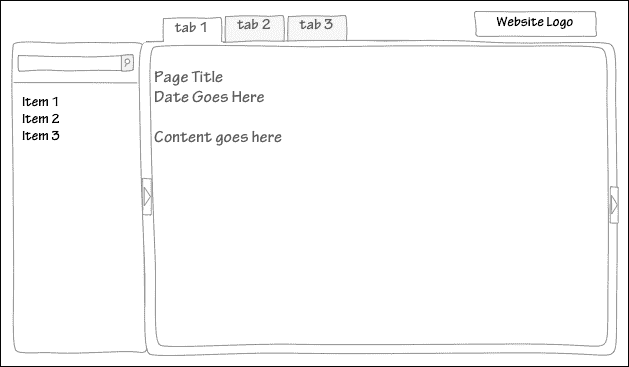
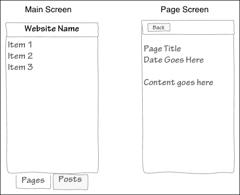
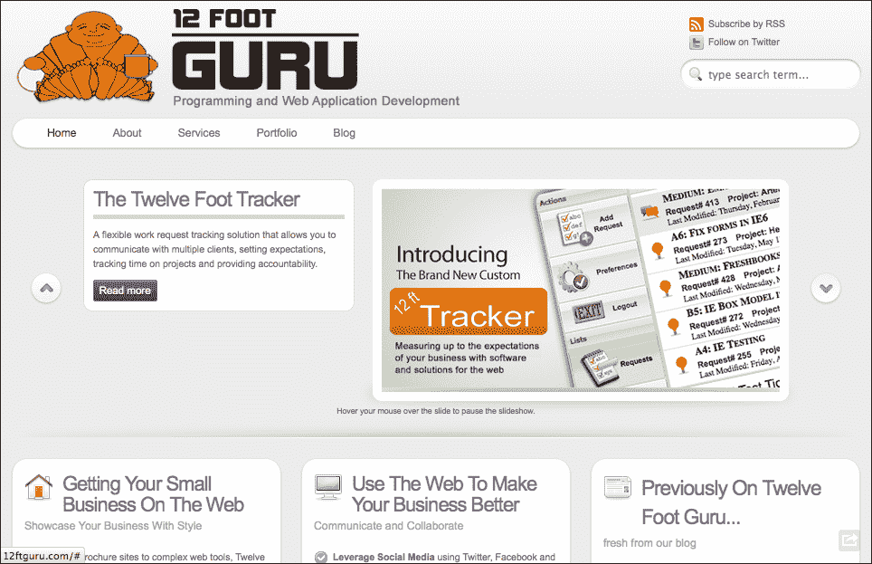
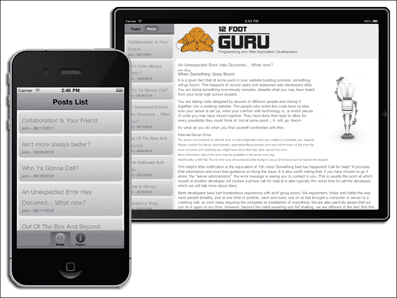
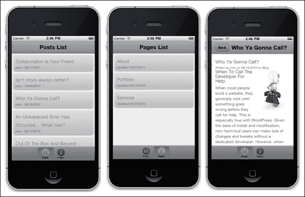
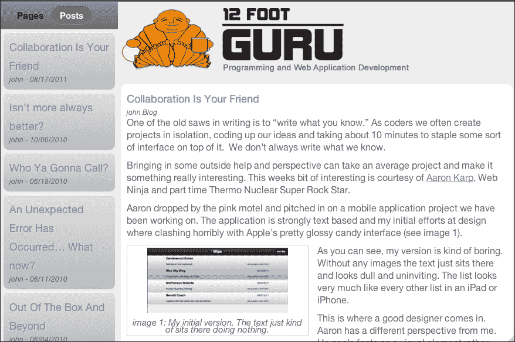

# 第八章。Evolver：使用配置文件

随着移动设备的日益普及，网页设计师不得不处理各种屏幕尺寸。这对需要在不同设备之间允许不同功能的网页应用开发者来说更加困难。Sencha Touch 提供了一个简单的方法来处理多个设备，称为配置文件。

由于 Sencha Touch 框架知道它在哪个设备上运行，我们可以为每个我们想要支持的设备设置单独的配置文件。然后 Sencha Touch 将根据设备交换组件和功能。

在本章中，我们将探讨：

+   配置文件的概述

+   设置配置文件

+   测试配置文件

+   根据设备加载自定义 CSS

我们将创建一个应用程序，从 WordPress 网站读取页面和帖子，并将它们转换为适用于移动设备的自定义应用程序。我们称这个应用程序为 Evolver。

Evolver 将使用不同的配置文件来为 iPhone 创建一个视图，并为 iPad 创建一个不同的视图。这些视图将具有自己的功能，并且可以根据用户和设备的需求进行定制。

然而，在我们过于深入之前，我们可能应该稍微谈谈配置文件的作用以及何时使用它们。

# 配置文件的概述

在 Sencha Touch 中，配置文件的作用类似于导演或交通警察。当应用程序加载时，配置文件会确定它们正在运行的设备类型，并根据设备（通常是存储和模型不会改变）加载不同的控制器和视图。

如你所猜，这意味着每个配置文件（设备）都需要自己的控制器和视图集。虽然它们可以，并且确实共享诸如存储和模型之类的元素，但大多数显示逻辑都是针对特定设备的。这可能会感觉像是一项额外的工作，这也引出了一个问题：何时以及为什么应该使用配置文件？

## 配置文件基础

作为一般规则，为特定设备或屏幕尺寸设计应用程序通常是一个好主意。较小的屏幕需要更大的字体以便阅读，但同时也为信息提供了更少的空间。这意味着它通常依赖于多个屏幕将信息传达给用户。在平板电脑设备上，类似的界面在大多数情况下都会显得笨拙且令人沮丧。

然而，通过一些简单的应用，CSS 样式的更改就能实现界面所需的更改。在这种情况下不需要配置文件，可以直接根据使用的设备加载样式表。这种方法允许我们使用我们个别元素的类和 ID 来控制应用程序的整体外观。

对于大多数专业应用，配置文件和样式表更改的组合将更好地服务于最终用户。我们可以通过一些 Evolver 应用程序的绘图来展示这一点。让我们从我们的平板电脑版本开始：



在这里，我们有大量的屏幕空间可以利用。我们可以轻松显示我们的页面和帖子列表，同时还可以显示所选项目的内。我们有足够的空间放置多个标签，甚至是一个网站标志。

如果我们在手机大小的屏幕上查看这种布局，它将太小，无法有效使用，甚至难以阅读。正如我们之前提到的，手机大小的屏幕需要更大的字体和多个屏幕来显示用户所需的数据：



在这种情况下，我们有两个屏幕。第一个是我们页面或帖子的列表。底部的标签将决定用户看到哪个列表。当用户从列表中选择一个项目时，我们将使用第二个屏幕来显示页面或帖子的内容。我们还将提供一个返回按钮，允许用户返回到邮件列表。

### 小贴士

**草图或线框图**

这样的草图通常被称为 **线框图**。在开始编码应用程序之前，将这些想法绘制出来是一个非常好的主意。它们不需要很复杂，只需要让你思考应用程序的组织方式以及用户如何从一个屏幕切换到下一个屏幕。线框图可以快速突出你尚未考虑的问题，并在你开始编码时节省大量时间。向潜在用户展示这些线框图也是一个好主意。非技术人士经常可以揭示用户的困惑区域，他们的疑问和反馈会使你的应用程序更有用。

通过查看这两个草图，我们可以确定我们需要哪些视图以及控制器中需要的不同功能。例如，在手机版本中点击一个项目需要向导航视图中添加一个面板，而在平板电脑版本中，点击一个项目只会替换我们主面板中的内容。

现在我们对想要的不同视图和功能有了些了解，我们可以看看个人资料实际上是如何工作的。

## 使用个人资料

我们个人资料设置的第一个部分发生在 `app.js` 文件中。这个文件通常是加载我们的初始存储和模型的地方，以及设置一个启动函数来启动应用程序。

使用个人资料时，事情的工作方式略有不同。我们首先声明我们希望使用的个人资料，如下所示：

```js
Ext.application({
 name: 'Evolver', 
 profiles: ['Phone', 'Tablet'] …
```

我们两个个人资料的名字是任意的，我们可以有我们想要的任意多个。它们可以针对特定的操作系统以及设备类型。当我们使用这样的个人资料时，我们通常不在 `app.js` 文件中使用启动函数。由于个人资料将具有不同的起始屏幕，我们将启动函数放在单独的个人资料中。

个人资料应该放在一个名为 `profile` 的目录中，位于应用程序的 `app` 目录内。它们的命名方式应该与你在 `app.js` 文件中命名的方式相同（在我们的例子中这将分别是 `Phone.js` 和 `Tablet.js`）。

### 注意

如果有帮助，您可以想象配置文件文件就像是一种拥有多个 `app.js` 文件的方式，每个设备一个。

这些单独的配置文件将加载我们的视图和控制器，并将启动我们的初始屏幕。然而，我们首先需要做的是确定哪个配置文件是激活的。我们通过在 `Phone.js` 文件中创建一个 `isActive` 函数来实现这一点，如下所示：

```js
Ext.define('Evolver.profile.Phone', {
    extend: 'Ext.app.Profile',
    config: {
        name: 'Phone'
    },
    isActive: function() {
        return Ext.os.is.Phone;
    }
});
```

如果该函数返回 true，则表示应用程序正在手机上运行。我们在 `Tablet.js` 配置文件中也使用了一个类似的功能：

```js
Ext.define('Evolver.profile.Tablet, {
    extend: 'Ext.app.Profile',
    config: {
        name: 'Tablet'
    },
    isActive: function() {
        return Ext.os.is.Tablet;
    }
});
```

如果 `isActive` 函数返回 true，则 `app.js` 文件将加载这些配置文件中的一个。只有一个配置文件应该始终返回 true。

### 注意

您可以在位于 [`docs.sencha.com/touch/2-1/#!/api/Ext.env.OS-method-is`](http://docs.sencha.com/touch/2-1/#!/api/Ext.env.OS-method-is) 的 Sencha Touch 开发者文档中找到有关 `Ext.os.is` 函数的更多信息。

每个配置文件也将包含其自己的视图和控制器，以及其自己的启动函数。然而，重要的是要注意，`Ext.loader` 函数将自动在以配置文件命名的子文件夹中查找这些项目。

例如，我们的平板电脑配置文件有一个名为 `Main.js` 的控制器。我们以通常在 `app.js` 中包含的方式将其包含在我们的配置文件中：

```js
controllers: ['Main']
```

然而，由于此控制器位于配置文件中，`Ext.loader` 函数将按 `app/controllers/tablet/Main.js` 查找文件。相反，在我们的手机配置文件中，我们仍然将控制器包含为 `controllers: ['Main']`，但加载器将自动按 `app/controllers/phone/Main.js` 查找文件。

您可以通过使用控制器的全称来覆盖此行为，例如：

```js
controllers: ['MyApp.controller.Main']
```

这将在 `app/controller` 文件夹中查找 `Main.js` 文件。这对于视图、模型和存储也是一样的。

您还会发现一些文件在两个配置文件中都是通用的。我们不是将它们包含在我们的单独配置文件中，而是可以将这些通用文件包含在 `app.js` 中。例如，在我们的 Evolver 应用程序中，我们将有页面和帖子模型和存储。这些将适用于两个配置文件，因此我们可以在 `app.js` 中正常添加它们：

```js
 models: ['Page', 'Post'],
 stores: ['pageStore', 'postStore']
```

由于这些是从 `app.js`（而不是从我们的配置文件之一）加载的，因此加载器将在 `app/model` 和 `app/store` 文件夹中分别查找它们。

正如我们之前提到的，配置文件除了 `app.js` 中的可选 `launch` 函数外，还有各自的启动函数。在基于配置文件的应用程序中，`app.js` 中的 `launch` 函数通常会被忽略，因为配置文件可能会启动不同的组件来创建主屏幕。但是，如果应用程序需要，您也可以使用 `app.js` 中的 `launch` 函数，以执行清理或加载存储（如果需要的话）。

顺序大致如下（当应用程序启动时）：

1.  激活配置文件已确定。

1.  配置文件或 `app.js` 中的任何控制器都将被实例化（这意味着将触发 `init` 函数）。

1.  配置文件中的启动函数被触发。

1.  `app.js`中的启动函数被触发。

应该注意的是，个人资料和`app.js launch`功能都是可选的，并且只有在它们被定义的情况下才会被调用。

现在我们已经处理了个人资料的基本内容，让我们对我们的应用程序进行更具体的了解。

# 创建 Evolver 应用程序

Evolver 应用程序从 WordPress 网站获取 RSS 源，并将源转换为 Sencha Touch 存储中的数据。我们在之前的 Feedback 应用程序中也使用过 RSS 源。然而，我们需要一些额外的帮助来从 WordPress 中获取所有所需的信息。

## 关于 WordPress

对于那些不了解 WordPress 的人来说，它是一个最初为博客设计的内容管理系统。WordPress 允许用户通过简单的基于 Web 的表单轻松创建文章和页面。文章通常是较短的、时间敏感的项目，而页面则包含更长、更通用的信息。

当 WordPress 开始流行时，用户迅速开始将其用于各种网站，从个人到商业和购物。目前的估计是，WordPress 网站数量超过 5500 万，占互联网上活跃网站的 15%到 20%。

由于安装简单和大量定制，WordPress 已经成为小型商业社区的宠儿。唯一的缺点是，典型 WordPress 网站的设计复杂性并不总是适合移动屏幕和平台。以下截图是一个标准 WordPress 风格网站的示例：



虽然这种布局在桌面或笔记本电脑屏幕上看起来不错，但对于平板电脑来说并不是很好的空间利用，对于手机大小的屏幕来说信息量过大。我们需要一个对移动设备友好的网站版本，能够有效利用平板和手机平台的优势和局限性。以下截图是我们想要采取的方法的示例：



由于 WordPress 网站背后的数据已经存在于 MySQL 数据库中，我们只需要一种方法将其放入数据存储中，以便我们可以在 Sencha Touch 中使用它。

WordPress 发布的文章以 RSS 格式提供，但页面不是。我们将需要使用 WordPress 插件来获取我们想要的页面。您需要使用自己的 WordPress 网站来实现这一点。

## 使用插件

WordPress 插件允许您扩展 WordPress 的基本功能和特性。在大多数情况下，这个过程就像搜索并点击安装按钮一样简单。在这种情况下，我们将安装 Dan Phiffer 的 JSON API 插件。此插件将允许我们向我们的 WordPress 网站发出标准 API 调用。

让我们安装插件，然后我们可以通过一些测试来看看它是如何工作的：

1.  从您的 WordPress 管理页面，从菜单中选择**插件**。

1.  在 **插件** 页面上，点击 **添加新插件** 按钮。

1.  在 **搜索** 字段中输入 `JSON API` 并点击 **搜索插件**。

1.  点击 **安装** 按钮旁边的 **JSON API 插件**（它应该是列表中的第一个）。

你可以通过检查以下 URL 来测试插件是否已正确安装（将 `yourwordpressdomain.com` 替换为你的 WordPress 安装地址）：

[`yourwordpressdomain.com/api/get_page_index/`](http://yourwordpressdomain.com/api/get_page_index/)

你应该会收到一个包含你网站页面的 JSON 响应字符串。注意，这个字符串返回如下所示：

```js
{"status":"ok",
 "pages":[
  {page 1 data},
  {page 2 data},
  {page 3 data},
  {etc…}
 ]
}
```

我们需要记住，`pages` 数组实际上包含我们正在寻找的数据。当我们创建存储时，这将设置为存储的读取组件的 `rootProperty`。

## 设置配置文件和 app.js

我们将从基本的 Sencha Touch 应用程序开始，使用我们的命令行 SDK 工具设置（就像我们在一些早期的章节中所做的那样）。这会创建我们的应用程序外壳以及视图、模型、存储和控制器文件夹。

在我们的 `app.js` 文件中，我们将添加我们的配置文件行。我们还在两个配置文件中都有一些公共元素，特别是页面和配置文件的模型和存储。由于这些将需要为两个配置文件加载，我们可以在 `Ext.application` 声明中添加它们，而不是在每个配置文件中各添加一次：

```js
 profiles: ['Phone', 'Tablet']
 models: ['Page', 'Post'],
 stores: ['pageStore', 'postStore'] 
```

现在我们已经设置了 `app.js` 文件，我们需要在 `app` 目录中创建一个 `profile` 文件夹。这是我们的两个配置文件将存放的地方。

我们的 `Phone.js` 配置文件如下所示：

```js
Ext.define('Evolver.profile.Phone', {
    extend: 'Ext.app.Profile',
    config: {
        name: 'Phone',
        controllers: ['Main'],
        views: ['Main', 'Evolver.view.PostList', 'Evolver.view.PageList', 'PageDetails', 'PostDetails']
    },
    isActive: function() {
       return Ext.os.is.Phone;
    },
    launch: function() {
       Ext.fly('appLoadingIndicator').destroy();
       Ext.create('Evolver.view.phone.Main', {fullscreen: true});
    }
});
```

我们这里有三个部分：`config` 部分、`isActive` 函数和 `launch` 函数。

我们的 `config` 部分包含配置文件 `name`、`controllers` 和 `views` 的值。记住，由于我们处于配置文件中，加载器将在 `app/controller/phone` 和 `app/view/phone` 分别查找这些文件。

注意，我们还有两个带有完整名称的视图列在我们的列表中：`Evolver.view.PostList` 和 `Evolver.view.PageList`。这些视图实际上将由两个配置文件共享，因此我们将它们放在 `app/views` 文件夹中。我们也可以只是将它们放在 `app.js` 中，这也会达到相同的效果。我们在这里包括它们是为了演示如果需要，可以覆盖文件位置。

我们的 `isActive` 函数将返回 true，如果我们正在手机上运行。

### 小贴士

**isActive、设备类型和 Safari**

如果你使用桌面或笔记本电脑上的 Safari 进行测试，使用此功能会遇到一些问题。尽管可以在 Safari 中设置用户代理为 iPad 或 iPod，但浏览器并没有正确地向 Sencha Touch 报告设备类型。

在测试时，您需要在`isActive`函数中注释掉`return Ext.os.is.Phone`或`return Ext.os.is.Tablet`行。然后，您可以将您想要测试的配置文件中的`isActive`函数设置为`return true;`，另一个设置为`return false;`。只需记住在转移到生产环境之前取消注释正确的函数。

如果您正在使用 iOS 或 Android 模拟器进行测试，这不是问题。

`launch`函数移除我们的加载指示器，并在全屏大小创建我们的`Evolver.view.phone.Main`视图实例。

我们的`Tablet.js`配置文件遵循与手机配置文件相同的模式：

```js
Ext.define('Evolver.profile.Tablet', {
    extend: 'Ext.app.Profile',
    config: {
        name: 'Tablet',
        controllers: ['Main'],
        views: ['Main', 'Evolver.view.PostList', 'Evolver.view.PageList', 'PageDetails', 'PostDetails']
    },
    isActive: function() {
      return Ext.os.is.Tablet;
    },
    launch: function() {
        Ext.fly('appLoadingIndicator').destroy();
        Ext.create('Evolver.view.tablet.Main', {fullscreen: true});
    }
});
```

与手机配置文件类似，控制器和视图将从我们的`app/controllers`和`app/views`文件夹中的`tablet`文件夹加载。

由于这里没有太多新内容，我们将简要地查看应用的存储、模型和视图。然后，我们将完成控制器部分，因为真正的动作就发生在那里。

## 设置模型和存储

我们的模式非常基础，它们来自 RSS 订阅源返回的帖子数据和页面 JSON API 插件。我们只使用其中的一些数据，但您可以轻松地查看从`yoursite/feeds/rss/`（帖子）和`yoursite/api/get_page_index/`（页面）返回的值，以查看是否有其他您可能想要使用的数据。

我们的文章模型看起来像这样：

```js
Ext.define('Evolver.model.Post', {
    extend: 'Ext.data.Model',
    config: {
    idProperty: 'guid',
        fields: [
            {
                name: 'guid',
                type: 'string'
            },
            {
                dateFormat: 'D, d M Y H:i:s Z',
                name: 'pubDate',
                type: 'date'
            },
            {
                name: 'title',
                type: 'string'
            },
            {
                name: 'author',
                mapping: 'creator',
                type: 'string'
            },
            {
                name: 'content',
                mapping: 'encoded',
                type: 'string'
            },
            {
                name: 'category',
                type: 'string'
            },
            {
                name: 'link',
                type: 'string'
            }
        ]
    }
});
```

这里唯一的新变化是使用映射来指示，虽然我们将字符串称为`author`和`content`，但数据实际上以`creator`和`encoded`分别接收。这通常有助于在整个应用中保持值的一致性，避免命名冲突，或者简单地保持代码员的理智。

此模型的`postStore`属性配置为从您使用的 WordPress 网站相同的服务器运行。这意味着我们可以使用`ajax`存储而不是`jsonp`存储。如果您想从不同的服务器使用它，您需要将代理更改为`jsonp`，并使用 JSON API 来获取帖子，而不是标准的 WordPress RSS 订阅源（它位于 XML 中）：

```js
Ext.define('Evolver.store.postStore', {
    extend: 'Ext.data.Store',
    requires: [
        'Evolver.model.Post'
    ],
    config: {
        storeId: 'postStore',
        autoLoad: true,
        model: 'Evolver.model.Post',
        proxy: {
            type: 'ajax',
            url: '/feed/rss/',
            reader: {
                type: 'xml',
                record: 'item'
            }
        }
    }
});
```

`record: 'item'` 配置指示读者在 XML 中查找用于其记录数据的一组项目。

### 小贴士

**WordPress RSS 订阅源**

默认情况下，WordPress 中的 RSS 订阅源仅显示文章的部分文本。您可以在 WordPress 网站的**管理**控制面板中更改此设置。在**管理**菜单中选择**设置** | **阅读**，并将订阅设置从**摘要**更改为**全文**。

由于这个存储库不是 JSONP 存储库，它必须运行在与它从 WordPress 网站拉取的同一服务器上。没有等效的 XMLP 存储库，因此在本地机器上进行测试需要一些变通方法。在测试期间，您可以从 WordPress 网站下载 RSS 源到您的本地机器，并从本地 XML 文件中读取。稍后，当您迁移到生产环境时，您可以更改 URL 到实时链接。

我们的`pageStore`是为使用 JSON API 插件而设计的，因此我们将接收 JSON 而不是 XML：

```js
Ext.define('Evolver.store.pageStore', {
    extend: 'Ext.data.Store',
    requires: [
        'Evolver.model.Page'
    ],
    config: {
        model: 'Evolver.model.Page',
        autoLoad: true,
        storeId: 'pageStore',
        proxy: {
            type: 'jsonp',
            url: 'http://yourWordPressSite.com/api/get_page_index/',
            reader: {
                type: 'json',
                rootProperty: 'pages'
            }
        }
    }
});
```

使用这个存储库，我们从 API 读取 JSON。`get_page_index`函数将返回网站页面的分层列表。

### 注意

WordPress 的 JSON API 插件提供了一些有用的函数，您可以使用这些函数读取和写入 WordPress 网站的数据。完整的函数列表可以在以下链接中找到：[`wordpress.org/extend/plugins/json-api/other_notes/`](http://wordpress.org/extend/plugins/json-api/other_notes/)。

我们为页面使用的数据模型使用了 JSON API 插件提供的有限数据集：

```js
Ext.define('Evolver.model.Page', {
    extend: 'Ext.data.Model',
    config: {
        fields: [
            {
                name: 'id',
                type: 'int'
            },
            {
                name: 'title',
                type: 'string'
            },
            {
                name: 'content',
                type: 'string'
            },
            {
                dateFormat: 'Y-m-d H:i:s',
                name: 'modified',
                type: 'date'
            }
        ]
    }
});
```

您可以通过访问 WordPress 网站的 API URL 来查看所有可用的数据列表（[`yourWordPressSite.com/api/get_page_index/?dev=1`](http://yourWordPressSite.com/api/get_page_index/?dev=1)）。`dev1`参数将格式化 JSON 响应并使其更易于阅读。

现在我们有了存储和模型，我们可以着手创建用于显示数据的视图。

## 创建视图

由于我们将在两个配置文件之间共享我们的帖子列表和页面列表，让我们从这里开始。我们将使用数据视图而不是列表视图，因为这与简单的列表相比提供了更多的显示选项。

我们的`PostList.js`文件如下所示：

```js
Ext.define('Evolver.view.PostList', {
    extend: 'Ext.dataview.DataView',
    alias: 'widget.postlist',
    title: 'Posts',
    id: 'postList',
    config: {
        store: 'postStore',
        itemTpl: [
            '<div class="postItem">',
            '    <div class="postTitle">{title}</div>',
            '    <div class="postMeta"><span class="postAuthor">{author}</span> - <span class="postDate">{[Ext.util.Format.date(values.pubDate, "m/d/Y")]}</span></div>',
            '</div>'
        ]
    }
});
```

与标准列表类似，`DataView`接受数据存储并按顺序从存储中显示项目。然而，`DataView`在样式方面更为灵活，允许创建拼贴列表和其他更有趣的布局。

这个视图从`postStore`读取并使用`itemTpl`显示每篇帖子的标题、作者和日期。我们每个数据项都使用特定的类进行样式化，这意味着我们可以根据加载的样式表以不同的方式显示它们，甚至可以完全关闭它们。我们将在本章的末尾讨论这些类型的条件样式表。

我们的`PageList`视图遵循类似的架构：

```js
Ext.define('Evolver.view.PageList', {
    extend: 'Ext.dataview.DataView',
    alias: 'widget.pagelist',
    title: 'Pages',
    config: {
        store: 'pageStore',
        itemTpl: [
            '<div class="pageItem">',
            '    <div class="pageTitle">{title}</div>',
            '    <div class="pageMeta">Updated <span class="pageDate">{[Ext.util.Format.date(values.modified, "m/d/Y")]}</span></div>',
            '</div>'
        ]
    }

});
```

这个共享视图从我们的`pageStore`读取并仅显示标题和日期。正如所注，您可以添加由 WordPress JSON API 生成的任何其他数据，然后使用条件样式表根据用户查看的设备显示或隐藏它。

我们的其他视图将针对手机或平板电脑配置文件而独特。在本章的目的上，每个视图都类似，每个都是一个简单的容器，包含一个模板来格式化记录以供显示。让我们从我们的手机详情容器开始。

### 创建手机详情视图

由于这个详情容器是我们电话配置文件的一部分，因此它被命名为`Evolver.view.phone.PageDetails`，并且它将位于`app/view/phone/`文件夹中。

```js
Ext.define('Evolver.view.phone.PageDetails', {
    extend: 'Ext.Container',
    alias: 'widget.pagedetails', 
    config: {
    layout: 'fit',
    scrollable: {direction: 'vertical', directionLock: true},
    tpl: [
     '<div class="pageDetails">',
     '    <div class="pageTitle">{title}</div>',
     '    <div class="pageMeta"><span class="pageAuthor">{author}</span> <span class="pageDate">{updated}</span></div>',
     '    <div class="pageContent">{content}</div>',
     '</div>'
     ]
    }
});
```

我们也为此视图设置了`scrollable`配置。由于我们处于一个可以通过滑动触发的导航视图中，我们设置了方向和方向锁定，以防止滑动触发页面更改。

### 创建平板电脑详情视图

我们`PageDetails.js`视图的平板版本看起来是这样的：

```js
Ext.define('Evolver.view.tablet.PageDetails', {
 extend: 'Ext.Container',
 alias: 'widget.pagedetails',
 config: {
  tpl: [
   '<div class="pageDetails">',
   '<div class="pageTitle">{title}</div>',
   '<div class="pageMeta"><span class="pageAuthor">{author}</span> <span class="pageDate">{updated}</span></div>',
   '<div class="pageContent">{content}</div>',
   '<div class="pageContent"><a href="{url}">View Original Page</a></div>',
   '</div>'
  ]
 }
});
```

两个版本之间的唯一区别是名称（`Evolver.view.tablet.PageDetails`）和页面的 URL，我们在`tpl`底部包含这个 URL。虽然大多数基于平板的应用程序中都有“查看原始页面”的链接，但对于电话应用程序来说，这并不是必需的，因为我们首先试图避免原始网站。

我们将在平板版本中处理滚动的方式不同，所以我们在这里不包括`scrollable`配置。

如前所述，你可以使这两个容器尽可能不同。如果你愿意，你可以将其中一个做成面板，另一个做成容器。由于实际上只有一个会被包含，我们甚至可以保持`widget.pageDetails`的`alias`属性值相同。不会出现`xtype`冲突，因为电话版本或平板版本在任何时候都只会激活一个。

我们为电话和平板电脑的`postDetails`对象遵循相同的格式，所以我们在这里不详细说明。你可以在章节的示例代码中看到它们。只需记住，电话版本放在`app/view/phone`中，平板版本放在`app/view/tablet`中。此外，视图命名约定将遵循`Evolver.view.phone.viewName`和`Evolver.view.tablet.viewName`的格式。

现在，我们需要将各个部分组合成一个主容器，用于我们的每个配置文件。

## 主视图

从我们的原始草图来看，我们有两个不同的界面。我们将首先查看的是电话界面：



由于电话屏幕尺寸有限，我们需要创建一个更紧凑和分层的界面。这将允许我们显示所有数据，同时仍然为用户提供可读的文本。

### 创建电话主视图

电话`Main.js`界面将包含一个带有两个 DataView（一个用于页面，一个用于帖子）的标签视图。每个 DataView 都在一个导航视图中。当我们点击 DataView 中的项目时，控制器将弹出我们的详情容器到导航视图中，自动创建一个返回按钮：

```js
Ext.define('Evolver.view.phone.Main', {
    extend: 'Ext.tab.Panel',
    alias: 'widget.phonemain',
    id: 'mainView',
    config: {
        tabBar: {
            docked: 'bottom'
        },
        items: [
            {
                xtype: 'navigationview',
                iconCls: 'quote_black2',
                iconMask: true,
                title: 'Posts',
                items: [
                  {xtype: 'postlist', title: 'Posts List'}
                ]
            },
            {
                xtype: 'navigationview',
                title: 'Pages',
                iconCls: 'info',
                iconMask: true,
                items: [
                  {xtype: 'pagelist', title: 'Pages List'}
                ]
            }
        ]
    }

});
```

我们给这个视图一个`id`值为`mainView`，以便在控制器中轻松引用。你会注意到导航视图有一个`title`配置，并且每个导航视图内的 DataView 也有自己的`title`配置。

两个导航视图是整体标签面板的直接子视图。这意味着我们主标签面板底部的标签上的标题将使用这个标题。导航视图内部的数据视图每个都有一个标题栏组件，它将在顶部显示每个数据视图的标题。

通过使用带有导航视图的弹出详情的双列表策略，我们最大限度地利用了我们有限的手机屏幕区域。在我们的平板配置中，我们有更多的工作空间，因此我们可以采取不同的方法。

### 创建平板主视图

由于我们在平板尺寸的屏幕上有额外的空间，我们可以使用不同的视图来利用额外的空间：



我们平板的`Main.js`视图在标签面板中有两个数据视图，这与我们的手机配置版本类似。然而，平板版本保持了一个可见的主内容区域，我们可以在这里显示当前选定的项目。我们还在内容上方包含了一个区域，我们可以使用以下代码放置网站标志：

```js
Ext.define('Evolver.view.tablet.Main', {
 extend: 'Ext.Panel',
 id: 'mainView',
 config: {
  layout: 'fit',
  items: [
   {
    xtype: 'tabpanel',
    width: 200,
    docked: 'left',
    items: [
     {
      xtype: 'pagelist',
      title: 'Pages'
     },
     {
      xtype: 'postlist',
      title: 'Posts'
     }
    ]
   },
   {
    xtype: 'container',
    layout: 'vbox',
    scrollable: true,
    items: [
     {
      xtype: 'container',
      layout: 'fit',
      id: 'banner',
      height: 140,
      html: ''
     },
     {
      xtype: 'pagedetails'
     },
     {
      xtype: 'postdetails',
      hidden: true
     }
    ]
   }
  ]
 }
});
```

我们首先扩展基本的`Ext.Panel`组件，并给它一个`fit`布局。在这个面板内部有一个标签面板和两个容器。

`tabpanel`组件包含我们的两个数据视图（页面和帖子），就像我们在应用程序的手机版本中一样。我们将其设置为`width`值为`200`。

内容容器设置为具有三个子容器的`vbox`布局。用于我们标志的顶部容器将具有`height`值为`140`，以及从我们的 WordPress 网站到标志的 HTML 链接。`vbox`布局意味着我们的其他容器，包括我们的帖子内容和页面内容，将自动调整大小以适应剩余的空间。

注意，我们的`postdetails`容器默认是隐藏的，而页面详情是可见的。我们将根据控制器中选定的数据视图来交换这两个容器。

## 创建控制器

Evolver 应用程序使用一对数据视图（一个用于帖子，一个用于页面），这些视图在手机和平板配置之间共享。在手机配置的情况下，数据视图需要监听触摸事件并向导航容器添加一个新的详情组件。在平板配置的情况下，数据视图仍然监听触摸事件，但需要根据选定的数据视图交换两个详情容器。

通过将功能与显示逻辑分离，我们可以使单个数据视图执行两种不同的操作（一个在手机版本中，另一个在平板版本中）。我们从`phone.js`和`main.js`控制器开始，以及`tablet.js`和`main.js`控制器如下：

```js
Ext.define('Evolver.controller.phone.Main', {
 extend: 'Ext.app.Controller',
 config: {
  refs: {
   postList: '#postList',
   pageList: '#pageList',
   mainView: '#mainView'
  },

  control: {
   postList: {
    itemtap: 'onListItemTap'
   },
   pageList: {
    itemtap: 'onListItemTap'
   }
  }
 }
});
```

这里显示的是手机配置版本，但在这个阶段，平板版本实际上是相同的，只是命名为`Evolver.controller.tablet.Main`。

我们的引用设置了指向我们组件的快捷指针。由于`postList`和`pageList`在两个应用程序中都是相同的，并且我们一致地为两个配置文件的主要容器命名，因此引用在两个控制器中都是相同的。

我们还使用相同的代码为我们的`control`配置，其中两个列表都需要监听`itemTap`事件以触发我们的函数。为了使我们的工作更简单，我们还让 DataViews 触发名为`onListItemTap`的相同函数。我们可以根据哪个列表被点击来决定需要发生什么。

这里是我们两个控制器开始分叉的地方。让我们从`onListItemTap`函数的手机版本开始：

```js
onListItemTap: function(dataview, index, target, record) {
 var original = record.get('content');
 var converted = original.replace(/src=\"/g, 'src=\"http://src.sencha.io/120/');
 var final = converted.replace(/((width|height)\s*=\s*"*\d+"*)/g, '');
 record.set('content', final);
 if(dataview.id == 'postList') {
  var details = Ext.create(
   'Evolver.view.phone.PostDetails', {
    title: record.get('title'),
    data: record.data
  });
 } else {
  var details = Ext.create(
   'Evolver.view.phone.PageDetails', {
    title: record.get('title'),
    data: record.data
  });
 }
 this.getMainView().getActiveItem().push(details);
}
```

我们使用此函数的第一部分进行一些有趣的操作，以修改我们的内容，使其在手机大小的屏幕上显示得更好。由于返回给我们的内容包含全尺寸图像，它通常会在手机大小的屏幕上占用大量空间，使得布局看起来有点糟糕。

为了解决这个问题，我们首先使用以下方法从记录中获取内容：

```js
var original = record.get('content');
```

接下来，我们对内容进行两次遍历，以查找和替换一些图像信息，这样我们就可以按我们的意愿调整大小。第一次遍历看起来像这样：

```js
var converted = original.replace(/src=\"/g, 'src=\"http://src.sencha.io/120/');
```

这将把一个带有`src`链接的图像标签[`mydomain.com/images/image15.png`](http://mydomain.com/images/image15.png)转换成`http://src.sencha.io/120/http://mydomain.com/images/image15.png`。

此格式将抓取图像并将其通过`src.sencha.io`进行处理，然后再显示。120 的值表示图像将自动调整大小，最大宽度为 120 像素，大约是典型手机屏幕大小的一半。

### 小贴士

**src.sencha.io**

src.sencha.io 可以用来即时调整任何图像的大小。此服务有许多有用的功能，更多信息可以在[`docs.sencha.io/current/index.html#!/guide/src`](http://docs.sencha.io/current/index.html#!/guide/src)找到。

第三次也是最后一次转换，使用正则表达式匹配并移除值，从``标签中移除原始的高度和宽度配置。默认情况下，WordPress 会在将图片作为帖子或页面的一部分包含时插入`height`和`width`标签：

```js
var final = converted.replace(/((width|height)\s*=\s*"*\d+"*)/g, '');
```

如果我们只使用我们第一段代码来调整实际图像的大小而不移除高度和宽度配置，图像实际上将以原始大小显示，只是像素化且看起来很丑陋。

### 小贴士

**正则表达式**

正则表达式，或**Regexes**，是匹配字符串模式的一个极其有价值的工具。您可以在[`www.rexv.org/`](http://www.rexv.org/)了解更多有关正则表达式的信息。

一旦我们完成了所有的转换，我们将记录的内容值设置为我们的新改进的值：

```js
record.set('content', final);
```

转换完成后，我们需要确定需要哪个详情容器。幸运的是，我们通过`itemTap`处理程序传递了被点击的视图。我们可以使用这个来检查哪个数据视图是活动的：

```js
if(dataview.id == 'postList') {
  var details = Ext.create(
   'Evolver.view.phone.PostDetails', {
    title: record.get('title'),
    data: record.data
  });
 } else {
  var details = Ext.create(
   'Evolver.view.phone.PageDetails', {
    title: record.get('title'),
    data: record.data
  });
 }
```

如果我们有`postList`，我们需要创建一个新的帖子详情容器，如果没有，我们想要创建一个新的页面详情容器。一旦我们有了新的容器，我们就用以下代码将其推送到活动项上：

```js
this.getMainView().getActiveItem().push(details);
```

我们使用`this.getMainView()`通过我们之前创建的引用来获取我们的主视图。通过使用`getActiveItem()`，我们确保获取用户正在查看的数据视图，并将容器推送到正确的导航视图中。

这就是手机配置文件`Main.js`控制器文件的全部内容。`Main.js`控制器的平板电脑版本与手机版本完全相同，除了`onListItemTap()`函数，它看起来是这样的：

```js
onListItemTap: function(dataview, index, target, record, e, options) {
 var original = record.get('content');
 var converted = original.replace(/src=\"/g, 'src=\"http://src.sencha.io/240/');
 var final = converted.replace(/((width|height)\s*=\s*"*\d+"*)/g, '');
 record.set('content', final);
 var pageDetails = this.getMainView().down('pagedetails');
 var postDetails = this.getMainView().down('postdetails');
 if(dataview.id == 'pageList') {
  postDetails.hide();
  pageDetails.setRecord(record)
  pageDetails.show();
 } else {
  pageDetails.hide();
  postDetails.setRecord(record)
  postDetails.show();
 }
}
```

在这个函数中，我们以与手机版本中相同的方式进行转换。这次我们将最大宽度增加到 240 像素。

接下来，我们使用以下代码获取我们的两个详情容器：

```js
 var pageDetails = this.getMainView().down('pagedetails');
 var postDetails = this.getMainView().down('postdetails');
```

一旦我们有了这些，我们就使用与之前相同的方式使用`dataview id`来获取当前活动的数据视图。然后我们在添加记录以供显示后隐藏一个并显示另一个。

如从两个控制器中可以看到，我们可以完全指定应用程序中的函数，无论视图本身是否在配置文件之间共享。结合根据特定配置文件包含不同视图的能力，我们可以轻松地将应用程序针对特定平台的优势，并克服任何潜在弱点。

然而，尽管这很强大，我们还可以使用另一个技巧来进一步根据平台或设备自定义我们的应用程序，那就是条件样式。

# 条件样式

你应该熟悉使用 CSS 样式表根据`id`或`class`来控制网页元素的外观。由于这些可以应用于 Sencha 组件和 xTemplates 中，我们可以使用这些类和 ID 来控制应用程序的外观。我们通过使用媒体查询检查设备的宽度来实现这一点。

## 媒体查询

媒体查询实际上是 CSS 标准的一部分，而不是 Sencha Touch 的直接部分。然而，由于 Sencha Touch 使用 CSS，我们可以继承这个工具，并使用它作为一个根据网页显示的环境做出决策的简单方法。虽然这个功能已经存在了一段时间，但直到最近它才在所有网络浏览器中成为标准。幸运的是，对于我们的 Sencha Touch 来说，它只支持现代网络浏览器，所以标准的较晚采用对我们没有影响。

如果你过去几年使用了大量的 CSS，你可能已经注意到了在样式表链接中使用媒体的方式，如下所示：

```js
<link rel="stylesheet" type="text/css" href="main.css" media="screen" />
<link rel="stylesheet" type="text/css" href="print.css" media="print" />
```

此设置将使用 `main.css` 在浏览器中显示，并在打印页面到打印机时使用 `print.css`。这通常用于在打印时移除导航和多余的页面元素。

然而，这些相同的媒体查询也可以根据屏幕大小包含样式表，如下所示：

```js
<link rel="stylesheet" type="text/css" media="screen and (max-device-width: 480px)" href="iPhone.css" />
```

如果设备使用的是最大屏幕宽度为 480px 的网络浏览器（屏幕）（如 iPhone 3G），则此媒体查询将加载样式表。

我们甚至可以更进一步，根据方向更改样式表：

```js
<link rel="stylesheet" type="text/css" media="screen and (max-device-width: 480px) and (orientation:portrait" href="iPhonePortrait.css" />
<link rel="stylesheet" type="text/css" media="screen and (max-device-width: 480px) and (orientation:landscape" href="iPhoneLandscape.css" />
```

当 iPhone 以纵向模式持有时，这两个链接将包含 `iPhonePortrait.css`，当以横向模式持有时，将包含 `iPhoneLandscape.css`。

将这些 CSS 媒体查询与 Sencha Touch 的配置文件结合使用，使我们能够非常细致地针对特定设备。

# 概述

当为移动环境设计应用程序时，充分利用设备的任何特殊功能并避免设备可能存在的任何潜在缺陷至关重要。通过直接针对设备定制应用程序，您提供更好的整体用户体验。在本章中，我们通过以下要点展示了如何充分利用这一能力：

+   配置文件的基本用法

+   设置 WordPress 以与 Sencha Touch 一起工作

+   创建基本的 Evolver 应用程序

+   设置控制器以管理手机和平板设备上的功能

+   使用媒体查询进一步针对特定设备样式化您的应用程序

在下一章中，我们将探讨如何访问您设备的一些硬件功能，特别是摄像头。我们还向您展示如何编译您的应用程序以利用更多设备的功能。
