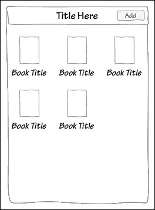
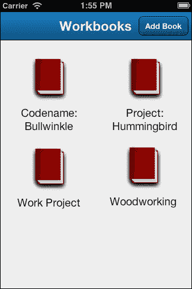
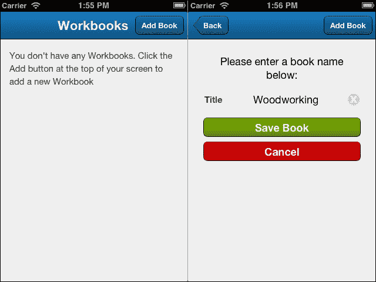
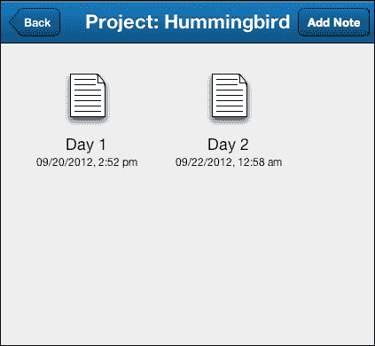
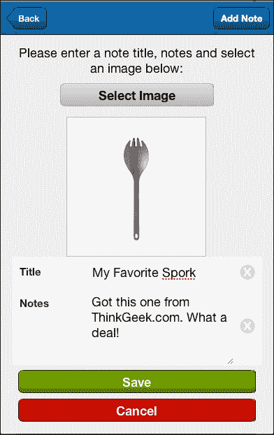

# 第九章。工作簿：使用摄像头

到目前为止，移动设备最常见的特点是摄像头。很难想象一个没有摄像头的移动设备。一个高质量的应用程序需要能够利用这个功能，在本章中，我们将向您展示如何实现。

在本章中，我们将构建一个基本的工作簿应用程序，您可以在其中：

+   创建笔记本

+   为每个笔记本添加笔记

+   为每个笔记添加图片

我们还将使用拼贴布局数据视图来增强应用程序的外观，并讨论将图片发送到其他应用程序（如 WordPress 或 Sencha.io 存储系统）的方法。

# 设计基本应用程序

对于这个应用程序，我们将有“书籍”包含“笔记”，这意味着我们只有在用户点击特定书籍时才会看到笔记。在这种情况下，标签页界面可能没有太多意义，所以我们将使用导航视图在书籍列表和特定书籍的笔记列表之间切换。

我们还希望超越传统的列表，使用带有一些图标的拼贴视图。这将给我们带来类似这样的效果：



当用户点击其中一本书时，他们将看到一个类似的屏幕，显示该特定书籍的笔记。我们将有一个**添加**按钮用于新书籍和一个**添加**按钮用于新笔记。由于导航视图使用相同的标题栏来显示两个视图，我们需要根据我们正在查看的视图在两个**添加**按钮之间切换。

我们还需要为我们的书籍和笔记创建表单。笔记表单还需要一个按钮，允许我们使用设备摄像头拍照，或者从设备的照片库中选择照片。

在数据方面，我们需要为我们的书籍设置一个标题和一个 ID。我们的笔记也将有一个标题和一个 ID，我们还需要为笔记设置字段，一个图片字段，以及一个书籍 ID 来告诉我们笔记属于哪本书。

由于我们已经清楚我们需要哪些数据，让我们先设置我们的模型和存储。

# 创建模型和存储

我们需要处理的两个组件中，书籍要简单得多，所以让我们从这里开始。我们的书籍模型看起来像这样：

```js
Ext.define('Workbook.model.Book', {
    extend: 'Ext.data.Model',
    config: {
        fields: [
            {
                name: 'id',
                type: 'int'
            },
            {
                name: 'title',
                type: 'string'
            }
        ]
    }
});
```

我们的`bookstore.js`文件同样简单，并使用本地存储代理来存储我们的数据。由于书籍列表是用户首先看到的东西，我们也希望这个存储自动加载。因此，在这种情况下，我们将使用以下代码：

```js
Ext.define('Workbook.store.BookStore', {
    extend: 'Ext.data.Store',
    requires: [
        'Workbook.model.Book'
    ],
    config: {
        model: 'Workbook.model.Book',
        autoLoad: true,
        storeId: 'BookStore',
        proxy: {
            type: 'localstorage',
            id  : 'books'
        }
    }
});
```

我们的笔记需要与我们的书籍相关联，所以它们将有一个关联的`bookID`以及它们自己的唯一 ID 属性：

```js
Ext.define('Workbook.model.Note', {
    extend: 'Ext.data.Model',
    config: {
        fields: [
            {
                name: 'id',
                type: 'int'
            },
            {
                name: 'bookID',
                type: 'int'
            },
            {
                name: 'title',
                type: 'string'
            },
            {
                name: 'dateModified',
                type: 'date'
            },
            {
                name: 'notes',
                type: 'string'
            },
            {
                name: 'image',
                type: 'string'
            }
        ]
    }
});
```

我们还有标题、`dateModified`、`notes`和`image`字段。当创建新笔记或更新并保存现有笔记时，我们将`dateModified`设置为当前日期。

我们的`noteStore.js`文件看起来和我们的书店文件很相似，但我们不希望这个文件自动加载，所以我们设置`autoLoad`为`false`：

```js
Ext.define('Workbook.store.NoteStore', {
    extend: 'Ext.data.Store',
    requires: [
        'Workbook.model.Note'
    ],
    config: {
        model: 'Workbook.model.Note',
        storeId: 'NoteStore',
        autoLoad: false,
        proxy: {
            type: 'localstorage',
            id  : 'notes'
        }
    }
});
```

现在我们知道了我们正在处理什么类型的数据，我们需要考虑如何显示这些数据。

# 视图

对于我们的应用程序视图，我们需要为书籍创建一个列表视图和编辑视图。当用户点击一本书时，他们会看到笔记列表。我们还需要一个用于编辑笔记的表单和一个用于查看笔记的详细视图。

让我们从书籍视图开始。

## 创建书籍视图

第一本书的视图是我们的书籍列表。我们不会简单地使用列表，而是会使用一个 DataView 和图标来给我们的列表增添一些视觉吸引力：



这个布局将使用 xTemplate（`tpl`）和 CSS 样式来创建：

```js
Ext.define('Workbook.view.bookList', {
    extend: 'Ext.dataview.DataView',
    alias: 'widget.booklist',
    config: {
        title: 'Workbooks',
        styleHtmlContent: true,
        scrollable: {
         direction: 'vertical',
         directionLock: true
        },
        emptyText: 'You don\'t have any Workbooks. Click the Add button at the top of your screen to add a new Workbook',
        store: 'BookStore',
        id: 'bookList',
        itemTpl: '<h4>{title}</h4>',
        itemCls: 'bookItem'
    }
});
```

我们从`booklist.js`文件开始，扩展标准的`Ext.dataview.DataView`并添加我们的配置选项。我们设置了一个标题，并允许在面板中使用样式化的 HTML 内容。我们还设置了滚动，并提供了`directionLock`，使其只能在一个方向上滚动。

接下来，我们添加一些指示用户如何添加书籍的空文本，并完成我们的`itemTpl`和`itemCls`。`itemTpl`和`itemCls`将用于在视图中定位我们的每本书。

默认情况下，当 DataView 以 HTML 渲染时，我们 DataView 中的每个项目都被一个带有`.x-dataview-item` CSS 类的`div`标签包裹。它看起来像这样：

```js
<div class="x-dataview-item">Our Book Item</div>
```

可能的话，我们只需在`.x-dataview-item`上设置样式，但这将改变我们使用的每个 DataView 的样式。通过设置`itemCls`，`div`标签现在看起来是这样的：

```js
<div class="x-dataview-item bookItem">Our Book Item</div>
```

这意味着我们现在可以样式化`bookItem`类，而不会影响我们的其他数据视图。我们通过在我们的 CSS 文件中放置以下内容来样式化`bookItem`类：

```js
.bookItem {
  width: 140px;
  display: inline-block;
  clear: none;
  margin: 10px;
  text-align: center;
  vertical-align: top;
}
.bookItem img {
    margin-left: auto;
    margin-right: auto;
  }
 .bookItem h4 {
    margin-bottom: 0px;
  }
```

这种样式数据决定了每个项目的宽度，并将它们从左到右平铺在屏幕上。它还设置了我们的边距，并使文本和图标居中。

接下来，我们需要创建一个用于添加书籍的视图，使用一个`form`组件：

```js
Ext.define('Workbook.view.bookEdit', {
    extend: 'Ext.form.Panel',
    alias: 'widget.bookedit',
    config: {
        items: [
            {
                xtype: 'container',
                html: 'Please enter a book name below:',
                id: 'bookEditText',
                margin: 8,
                style: 'text-align:center;'
            },
            {
                xtype: 'textfield',
                id: 'bookName',
                name: 'title',
                label: 'Title'
            },
            {
                xtype: 'hiddenfield',
                id: 'bookID',
                name: 'id'
            }
        ]
    }
});
```

这个表单有一个用于说明的容器，一个用于用户输入书籍名称的文本字段，以及一个`hiddenfield`组件，当我们编辑现有的书籍时，我们将添加书籍的`id`值。

我们还将在表单中添加两个按钮；一个**保存**按钮和一个**取消**按钮。在这个例子中，我们将在视图内部为每个按钮设置处理程序。如果你更喜欢将此代码移动到控制器中，我们稍后会展示如何这样做。现在，让我们首先添加**保存**按钮：

```js
{
 xtype: 'button',
 margin: 8,
 id: 'saveBookButton',
 ui: 'confirm',
 text: 'Save Book',
 handler: function() {
  var form = this.up('formpanel');
  var store = Ext.getStore('BookStore');
  var values = form.getValues();
  if(values.id > 0) {
   var index = store.find('id', values.id);
   var record = store.getAt(index);
   record.set(values);
  } else {
   var record = Ext.ModelMgr.create(values, 'Workbook.model.Book'); 
  store.add(record);
  }
  store.sync();
  var main = this.up('navigationview');
  main.pop(form);
 }
}
```

对于`button`元素的基本设置现在应该对你来说很熟悉了。当按钮被点击时，`handler`组件会自动触发。

这个函数获取我们的`store`和`form`，值，以及`values`变量的值。然后我们检查`id`值是否是一个大于零的数字。这种情况只会发生在我们将现有的书籍记录加载到表单中进行编辑时。

如果 `id` 值大于零（我们有一个现有的书籍），我们从商店中获取当前的 `record` 值，并用我们表单的新值替换它。

如果 `id` 值为 null（它是一本书），我们使用我们的书籍模型创建一个新的记录，插入表单的 `values` 变量，并将记录添加到商店中。

我们随后同步商店以保存我们的更改，并从主 `navigationview` 中移除书籍表单。

最后，我们在“保存”按钮之后添加了一个 **取消** 按钮。这个按钮只需要从我们的 `navigationview` 中移除表单：

```js
{
 xtype: 'button',
 margin: 8,
 ui: 'decline',
 text: 'Cancel',
 handler: function() {
  var form = this.up('formpanel');
  var main = this.up('navigationview');
  main.pop(form);
 }
}
```

现在我们已经在我们的应用程序中创建了添加和显示书籍的视图，我们需要创建我们的 `main.js` 视图，该视图将在应用程序启动时启动。

## 将书籍列表添加到主视图

我们的主视图需要显示书籍列表，并且需要一个按钮来显示我们的添加书籍表单。正如我们之前所提到的，我们将使用 `navigationview` 来实现这个主要组件：

```js
Ext.define("Workbook.view.Main", {
 extend: 'Ext.NavigationView',
 requires: ['Ext.TitleBar','Ext.dataview.DataView'],
 config: {
  id: 'mainView',
  fullscreen: true,
  navigationBar : {
   docked : 'top',
   items : [
    {
     text : 'Add Book',
     align : 'right',
     id: 'addBookButton'
    }
   ]
  },
  items: [
   { xtype: 'booklist'}
  ]
 }
});
```

此视图在 `app.js` 中定义，作为应用程序启动时将被添加到视口中的视图。您会注意到，我们在 `Main` 组件中已引入了 `TitleBar` 和 `DataView` 组件，这是为了防止在构建我们的原生应用程序时出现编译错误。主要的 `navigationview` 组件还包括我们的书籍列表组件和添加按钮，以显示我们的表单。

### 小贴士

**控制器中的代码与视图中的代码**

与我们之前书籍的 `form` 视图不同，我们将“添加书籍”按钮的功能代码放在控制器中。将视图的功能放在控制器中通常被认为是“最佳实践”，但重要的是要理解这可以通过多种不同的方式来完成。

现在我们已经创建了主视图，让我们跳转到 `Book.js` 控制器，并设置好以测试到目前为止我们所做的工作。

## 启动书籍控制器

书籍控制器将从我们创建的视图、模型和商店开始。它还将设置我们的引用、初始控件和两个函数：

```js
Ext.define('Workbook.controller.Book', {
    extend: 'Ext.app.Controller',
    config: {
        stores: ['BookStore'],
        models: ['Book'],
        views: ['bookEdit', 'bookList'],
        refs: {
            bookList: '#bookList',
            addBookButton: '#addBookButton',
            main: '#mainView'
        },

        control: {
            addBookButton: {
                tap: 'onAddBookButtonTap'
            },
            bookList: {
                select: 'onBookSelect'
            }
        }
    },
    onAddBookButtonTap: function(button, event, options) {
        var bookForm = Ext.create('Workbook.view.bookEdit');
        this.getMain().push(bookForm);
    },
    onBookSelect: function(dataview, record, options) {
        console.log(dataview, record, options);
    }
});
```

我们的 `book.js` 控制器文件需要将我们的 `bookEdit` 表单推送到 `Main` 导航视图中。我们通过创建一个引用 (`refs`) 为 `addBookButton` 组件使用其 `id` 属性。然后我们在 `controls` 部分为按钮的 `tap` 事件分配一个函数。

`onAddBookButtonTap` 函数创建我们 `bookEdit` 表单的新实例，并将其推送到我们的 `Main` 导航视图中。这将使表单出现，并在页面顶部添加一个返回按钮。

我们还为 `bookList` 表单添加了 `refs` 和 `controls`，包括一个 `onBookSelect` 函数。然而，我们没有其他视图，因此无法显示书籍的笔记列表。相反，我们添加了一个控制台日志，它将显示当列表中的书籍被点击时传递的 DataView、记录和选项。一旦我们添加了一本书，我们应该能够点击它，并在 Safari 错误控制台中看到显示的信息。

### 备注

`console.log()`函数是测试开发早期阶段应用程序的绝佳方式。它可以帮助你及早发现问题并处理它们，在你构建整个项目之前。

如果你现在测试项目，你应该会得到初始的空书屏幕，并且能够添加新的书籍：



如果你添加了一本书并在书列表中轻触它，你应该在 Safari 错误控制台中看到以下截图类似的内容：


从左到右，这些对象是`DataView`（我们的书列表）、记录（被轻触的书）和选项（传递给监听器的对象——真正的技术宅内容）。

我们将在稍后使用记录对象中的信息来告诉我们显示哪些笔记。现在我们需要为我们的笔记创建视图。

## 创建笔记视图

我们需要为我们的笔记创建三个不同的视图：列表视图、编辑视图和详情视图。我们将从列表视图开始，因为它与我们的书列表类似：

```js
Ext.define('Workbook.view.noteList', {
    extend: 'Ext.dataview.DataView',
    config: {
        id: 'noteList',
        itemId: 'noteList',
        styleHtmlContent: true,
        scrollable: {
            direction: 'vertical',
            directionLock: true
        },
        itemTpl: '<h4>{title}</h4><h5>{dateModified:date("m/d/Y, g:i a")}</h5>',
        store: 'NoteStore',
        emptyText: 'You don't have any Notes in this Workbook. Click the Add button at the top of your screen to add a new Note to the Workbook',
        title: 'Notes For'
    }
});
```

我们覆盖了`DataView`，设置了我们的 ID 和滚动，就像我们在书列表中做的那样。在`itemTpl`配置中，我们添加了笔记修改的日期，使用`date()`函数将其转换为比默认格式更短的格式。我们还设置了我们的空文本和默认标题。我们的书控制器将更新标题并显示当前笔记的书名。

我们将使用与我们的书容器相同的基本样式，使笔记列表像书列表一样横跨屏幕。



当用户在列表中轻触笔记时，我们需要显示笔记的详细信息，包括文本和笔记的图片。我们的`noteDetails.js`视图是一个简单的面板，使用 xTemplate：

```js
Ext.define('Workbook.view.noteDetails', {
    extend: 'Ext.Container',
    alias: 'widget.notedetails',
    config: {
        layout: 'fit',
        scrollable: {direction: 'vertical', directionLock: true},
        tpl: '<h1>{title}</h1><h5>{date}</h5><div class="notes">{notes}</div>'
    }
});
```

不要过分担心此代码中的`data:image/png;base64`部分。我们将在本章的*图像入门*部分介绍 base64 图像格式。

我们笔记的编辑视图将包含标题和笔记文本字段。同时，还将有隐藏字段，如`bookID`、`image`和笔记的`id`字段（这些字段的值将由我们的控制器设置）。

```js
Ext.define('Workbook.view.noteEdit', {
 extend: 'Ext.form.Panel',
 alias: 'widget.noteedit',
 config: {
  items: [
   {
    xtype: 'container',
    html: 'Please enter a note title, notes and select an image below:',
    id: 'noteEditText',
    margin: 8,
    style: 'text-align:center;'
   }, {
    xtype: 'button',
    text: 'Select Image',
    id: 'imageSelectButton',
    width: 220,
    style: 'margin-top: 10px; margin-right:auto; margin-left:auto; margin-bottom: 15px;'
   }, {
    xtype: 'container',
    id: 'imageView',
    width: 200,
    height: 200
   },
   {
    xtype: 'hiddenfield',
    id: 'imageField',
    name: 'image',
    value: ''
   },
   {
    xtype: 'textfield',
    id: 'noteTitle',
    name: 'title',
    label: 'Title'
   },
   {
    xtype: 'hiddenfield',
    id: 'bookID',
    name: 'bookID',
    value: 0
   },
   {
    xtype: 'hiddenfield',
    id: 'noteID',
    name: 'id',
    value: 0
   },
   {
    xtype: 'textareafield',
    id: 'notesArea',
    name: 'notes',
    label: 'Notes',
    value: ''
   }
  ]
 }
});
```

我们还将有一个用于选择图片的按钮和一个用于显示所选图片的容器。当按钮被轻触时，我们将从设备中选择一个图片，该图片将作为 base64 字符串返回给我们。这个字符串将被设置为我们的隐藏`image`字段的值。

我们还将有两个按钮，就像我们的书编辑表单一样，一个用于保存，一个用于取消。**取消**按钮与之前的书编辑按钮完全相同，它只是从导航视图中弹出表单。

**保存**按钮有一点不同，因为它需要在每次保存笔记时设置日期修改的值：

```js
{
 xtype: 'button',
 margin: 8,
 ui: 'confirm',
 text: 'Save',
 id: 'saveNoteButton',
 handler: function() {
  var form = this.up('formpanel');
  var store = Ext.getStore('NoteStore');
  var values = form.getValues();
  if(values.id > 0) {
   var index = store.find('id', values.id);
   var record = store.getAt(index);
   record.set(values);
 var date = new Date();
 record.set('dateModified', date);
  } else {
   var record = Ext.ModelMgr.create(values, 'Workbook.model.Note');
 var date = new Date();
 record.set('dateModified', date);
  }
  store.add(record);
  store.sync();
  var main = this.up('navigationview');
  main.pop(form);
 }
}
```

除了这些，按钮基本上与我们的书籍保存按钮相同。我们获取存储和表单值，检查我们是否正在处理新的笔记或现有的笔记，并相应地保存笔记。

在设置好这些基本视图后，是时候回到我们的控制器，将所有东西连接在一起了。

# 创建控制器

在我们的控制器中，我们首先需要更新 `config` 部分，为我们的应用程序添加新的视图、存储和模型。我们还需要为这些新组件添加一些新的引用和控制。

```js
config: {
  stores: ['BookStore', 'NoteStore'],
  models: ['Book', 'Note'],
  views: ['bookEdit', 'noteEdit', 'noteList', 'bookList'],
  refs: {
   bookList: '#bookList',
   noteList: '#noteList',
   addBookButton: '#addBookButton',
   addNoteButton: '#addNoteButton',
   imageSelectButton: '#imageSelectButton',
   main: '#mainView'
  },
  control: {
   addBookButton: {
    tap: 'onAddBookButtonTap'
   },
   addNoteButton: {
    tap: 'onAddNoteButtonTap'
   },
   imageSelectButton: {
    tap: 'onImageSelectButtonTap'
   },
   bookList: {
    select: 'onBookSelect'
   },
   noteList: {
    select: 'onNoteSelect'
   },
   main: {
    back: 'onBackClicked'
   }
  }
 }
```

`refs` 部分将设置我们为创建的新笔记组件设置快捷键，而控制部分将为以下操作添加新功能：

+   点击列表中的笔记

+   点击按钮添加图片

+   在列表中选择书籍

+   在列表中选择笔记

+   在应用程序的任何地方点击返回按钮

现在，我们已经有了 `refs` 和 `control`，让我们开始创建应用程序所需的函数。

`onBookSelect` 函数与书单的 `select` 事件（在 `controls` 部分中）相关联。`select` 事件将自动将其参数中选中的记录传递过来。我们将使用该记录中的书名来设置我们新的笔记列表视图的 `title` 属性。我们还将使用此记录的 `id` 属性来限制笔记的 `store` 只包含该书的笔记：

```js
onBookSelect: function(dataview, record, options) {
  console.log(dataview, record, options);
  var noteList = Ext.create('Workbook.view.noteList', {title: record.get('title')});
  var bookID = record.get('id');
  this.getMain().push(noteList);
  this.getAddNoteButton().show();
  this.getAddBookButton().hide();
  var noteStore = noteList.getStore();
  noteStore.filter("bookID", bookID);
  noteStore.load();
  noteList.bookID = bookID;
}
```

注意，我们在创建笔记列表的新实例时，将 `title` 值作为配置选项传递。这通常是在创建新对象时设置额外参数的一种便捷方式。

接下来，我们将新的 `noteList` 对象推送到 `Main` 导航视图，并使用 `show`/`hide` 函数将 `AddBook` 按钮与 `AddNote` 按钮进行交换。

然后，我们使用 `bookID` 值来过滤存储，仅限制当前书籍的笔记，并加载存储。

我们还在 `noteList` 上添加了 `bookID` 作为配置选项。这将使我们能够轻松地在我们添加新笔记时获取 `bookID`。

接下来我们需要处理的是 **返回** 按钮。此按钮由导航视图自动创建，并且它将自动从导航视图堆栈中弹出当前视图，返回到上一页。

然而，这里有三个问题：

+   当我们切换回上一视图时，我们需要隐藏 **添加笔记** 按钮并显示我们的 **添加书籍** 按钮。

+   当我们切换回书单时，我们仍然在笔记存储上有过滤器。如果我们选择不同的书籍，这将会搞乱事情。

+   当我们切换回书单时，最初选择的书籍仍然被选中。这意味着如果你再次点击同一本书，`select` 事件将不会触发。这同样适用于我们的笔记列表。

这意味着我们需要连接到我们的导航视图上的后退事件并修复这些问题：

```js
onBackClicked: function(button, options) {
 var store = Ext.getStore('NoteStore');
 var activeItem = this.getMain().getActiveItem();
 if(activeItem.id == 'bookList') {
  this.getAddNoteButton().hide();
  this.getAddBookButton().show();
  this.getBookList().deselectAll();
  store.clearFilter();
 } else if(activeItem.id == 'noteList') {
  this.getAddNoteButton().show();
  this.getAddBookButton().hide();
  this.getNoteList().deselectAll();
 }
}
```

我们必须确定在 `back` 事件触发后哪个项目是激活的。

如果是书单，我们将隐藏`AddNote`按钮，显示`AddBook`按钮，取消选择`bookList`中的所有项，并清除存储上的过滤器。

如果`noteList`是活动的，则用户是从笔记详情返回的。我们仍然需要取消选择`noteList`中的所有项并显示正确的按钮，但我们需要保持存储上的过滤器。 

下一个函数将用于创建一个`noteEdit`表单并向其中添加一些初始值：

```js
onAddNoteButtonTap: function(button, event, options) {
 var noteForm = Ext.create('Workbook.view.noteEdit');
 this.getMain().push(noteForm);
 var record = Ext.create(
 'Workbook.model.Note', {
  title: '',
  note: '',
  bookID: this.getNoteList().bookID
 });
 noteForm.setRecord(record);
 }
```

在`onAddNoteButtonTap`函数中，我们创建一个`noteEdit`表单的新实例并将其推送到`Main`导航视图。我们还基于我们的`Note`模型创建一个新记录并设置`bookID`值。最后，我们使用`setRecord()`将记录加载到表单中。

接下来，我们需要一个简短的函数来将笔记的详细信息面板推送到我们的主导航。这是通过我们的`onNoteSelect`函数实现的：

```js
onNoteSelect: function(dataview, record, options) {
 var noteDetails = Ext.create('Workbook.view.noteDetails');
 this.getMain().push(noteDetails);
 noteDetails.setRecord(record);
}
```

现在我们已经完成了基本函数，我们最终可以开始将图像添加到我们的应用程序中。

# 开始使用图像

在应用程序中使用图像有几个重要事项需要注意。首先，应用程序必须是一个编译后的应用程序，以便此功能能够工作。你还需要在`app.js`中的`requires`部分添加`Ext.device.Camera`。由于此功能仅在编译后的应用程序中使用，因此默认情况下不包括该文件。

### 注意

由于我们在第三章中已经介绍了编译应用程序，即“命令行操作”，对于我们的 TimeCop 应用程序，我们在此不再重复介绍。

由于安全原因，JavaScript 无法访问移动设备上的文件系统。只有通过编译应用程序，我们才能绕过这一限制并使用相机或访问设备上的现有照片。这意味着在实际编译应用程序之前，对应用程序的实际测试可能有些受限。

当你在网页浏览器中进行测试时，Sencha Touch 会返回一个占位符图像链接以供测试。然而，图像可以以两种不同的格式返回。

第一种格式是`file`或 URI。这基本上是现有文件的链接，其实施可以在不同设备上有所不同。第二种格式是`data`，它是一个 base64 编码的字符串。

`file`格式通常可以用作图像链接中的`src`。例如：

```js

```

然而，base64 `data`需要稍有不同的格式，你可能还记得我们的`noteDetails.js`文件：

```js

```

这种 base64 `data`格式允许我们动态控制图像格式并将值作为字符串存储在数据库中。

### 注意

Base64 数据是一种允许你将文件作为文本字符串传输的格式。这使得我们可以将图像等东西作为我们 JSON 数据的一部分。它还允许我们将字符串作为数据库中的数据部分存储。

如果我们使用文件 URI，并且用户从设备中删除了图像，URI 也将从我们的应用程序中消失。虽然在某些情况下这可能是一种期望的行为，但更常见的情况并非如此。

我们还需要考虑源图片是从哪里来的。它是从相机本身来的，还是从存储的照片，或者是从特定的相册来的？

所有这些选项以及更多都是在`capture`函数中处理的。

## 捕获图片

让我们看看图片`capture()`函数是如何在我们的`Book.js`控制器中的`onImageSelectButtonTap`函数中工作的：

```js
onImageSelectButtonTap: function(button, event, options) {
 var imageView = Ext.getCmp('imageView');
 var imageField = Ext.getCmp('imageField');
 Ext.device.Camera.capture({
  success: function(image) {
   imageView.setHtml('');
   imageField.setValue(image);
  },
  quality: 100,
  destination: 'data'
 });
}
```

我们首先获取我们的`imageView`变量（在图片被选中后我们将放置图片副本的地方）和我们的`imageField`变量（将存储我们图片数据的隐藏字段）。您可以在下面的屏幕截图中看到我们的完整表单。这显示了我们的按钮、选中的图片和两个表单字段：



`Ext.device.Camera.capture`函数有一个内部的`success`函数，将图片传递给它。图片的格式由`destination`配置设置，可以是`data`（base64）或`file`（URI）格式。

`success`函数是我们处理接收到的图片信息的地方。在这种情况下，我们将我们的`imageView`容器（在图片被选中后我们将放置图片副本的地方）的 HTML 设置为 200x200 像素的图片。这为用户提供了一个在保存之前的预览。

我们还将我们的隐藏`imageField`组件的值设置为 base64 编码的字符串，以便它将与我们的其他表单值一起保存。

然而，在我们保存之前，我们可以在图片上设置一系列选项：

+   `quality`: 这指定了图片质量，范围从 1 到 100。

+   `source`: 图片应该从哪里来？选项有`camera`、`library`或`album`。

+   `encoding`: 可用的编码格式有`png`和`jpg`。

+   `height`: 这指定了图片的高度（以像素为单位）。

+   `width`: 这指定了图片的宽度（以像素为单位）。

这些选项中的任何一个都可以在捕获函数中设置，但最好记住，`quality`、`height`和`width`将在图片可能被存储之前应用于图片。限制这些值可能会随后限制图片在之后的可用性。将大图片变小总是比将小图片变大容易。

## 存储图片

在我们的`onImageSelectButtonTap`函数中，我们将隐藏字段的值设置为 base64 编码的`data`字符串。如果我们选择了`destination: file`而不是`destination: data`，我们仍然可以做很多相同的事情。图片作为我们之前在章节中构建的`noteEdit.js`中的保存按钮处理程序的一部分被保存。

然而，`file`选项只会存储图片文件的引用。正如我们之前提到的，如果用户使用他们的照片管理器从设备中删除图片，它也会从我们的应用程序中消失。

`data`选项为我们提供了图片本身的实际数据。这意味着如果用户使用他们的照片管理器从设备中删除图片，它不会影响我们应用程序中存储的图片。

## 显示图片

一旦您有了存储的图像，您就可以像我们之前描述的那样在您的 xTemplates 中使用它。

`文件`格式通常可以用作图像链接中的`src`，如下所示：

```js

```

base64 `数据`格式的使用方式如下：

```js

```

正如我们也提到的，当您在网页浏览器中测试时，Sencha Touch 将返回一个测试图像链接([`www.sencha.com/img/sencha-large.png`](http://www.sencha.com/img/sencha-large.png))。

当在浏览器中测试时返回的测试图像将正常工作，但如果您使用的是`文件目标`格式，并且使用的是`数据目标`格式，则会显示一个缺失的图像。在编译的应用程序中，图像将正确显示。

在这些图像中还需要注意的另一件事是，您可以使用标准的`img height`和`width`标签将图像缩小到特定的屏幕大小。例如：

```js
var imageWidth = Ext.Viewport.getWindowWidth();
var imageString = '';
```

如果您存储全尺寸图像并以不同的方式使用它，这将为您带来极大的灵活性。

## 发送图像

如果您的应用程序需要传输图像，无论是发送给其他用户还是外部 API，您将需要使用数据目标格式。如前所述，文件目标格式只是一个参考，它与应用程序运行的设备相关。

由于数据格式是 base64，它可以像任何其他字符串数据一样传输。不幸的是，目前还没有办法在不构建自己的自定义 API 来接受 base64 数据字符串并将其转换为图像文件的情况下，在本地上传文件到远程服务器。

然而，如果您使用 PhoneGap 编译器而不是本地的 Sencha Touch 编译器来编译您的应用程序，您可以使用他们的`fileTransfer`对象将文件作为标准的 HTTP POST 发送。您可以在[`docs.phonegap.com/en/1.0.0/phonegap_file_file.md.html#FileTransfer`](http://docs.phonegap.com/en/1.0.0/phonegap_file_file.md.html#FileTransfer)找到更多关于 PhoneGap 和`fileTransfer`对象的信息。

PhoneGap 提供了一个在线编译服务，可以从 Sencha Touch 代码创建原生应用程序，就像我们在前一章中介绍的 Sencha Touch 命令工具一样。

更多关于 PhoneGap 的信息可以在[`www.phonegap.com/`](http://www.phonegap.com/)找到。

# 摘要

在本章中，我们讨论了如何设置您的应用程序以利用您的移动设备上的相机。通过这种方式，我们涵盖了以下要点：

+   如何使用 DataViews 创建不同外观的 UI

+   `数据`和`文件`图像格式之间的区别

+   使用 Sencha Touch 与设备的相机和本地照片存储进行交互

在下一章中，我们将更广泛地使用 DataViews 来创建多人游戏的游戏板。
