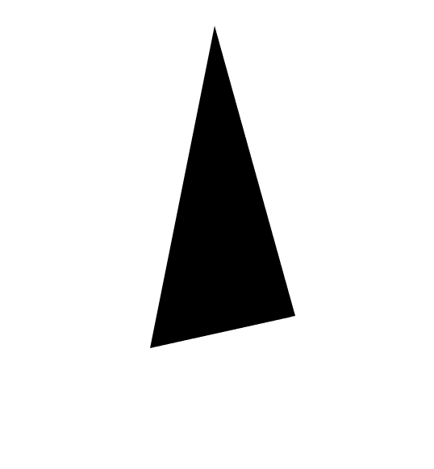
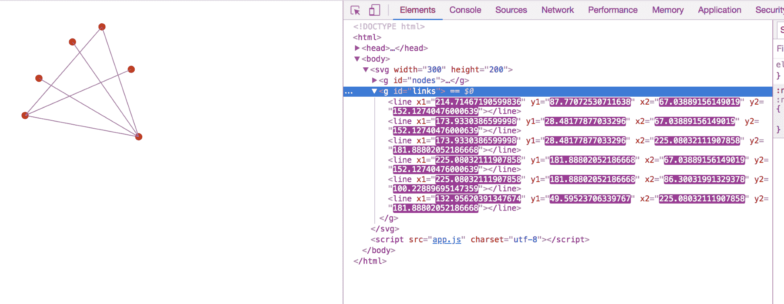

# 第一章：D3.js 入门

大数据时代已经到来！硬件的进步使得计算机能够以前不可能的方式存储、分析和传输大量信息。数据科学已成为美国最受欢迎的领域之一，公司不断推出新技术来分析客户信息；似乎每天都有新的方法来可视化这些数据。**D3** 已经成为创建动态、交互式、数据驱动的网络可视化的最受欢迎的库。与之前用于数据可视化的许多技术不同

，D3 利用将 SVG 图像与网络浏览器和 JavaScript 结合起来的力量。在本章中，我们将讨论以下主题：

+   什么是 SVG？

+   D3 有什么特别之处？

+   本书的学习方法

# 什么是 SVG？

在网络上通过交互式图形展示你的数据是最佳方式之一。这种方法的优点是，其交互性允许创作者在一个可视化中包含更多信息，而网络的普遍性则允许任何人立即访问它。PowerPoint 演示文稿或更糟糕的是，将静态图像打印成纸作为讲义的日子已经过去了。有许多方法可以创建基于网络的交互式数据可视化，但没有一种方法比名为 **D3.js** 的 JavaScript 库更受欢迎。

要理解为什么 `D3.js` 工作得如此出色，重要的是要了解 SVG 是什么以及它与 D3 的关系。**SVG** 代表 **可缩放矢量图形**，它是一种使用数学方向/命令显示形状的方法。传统上，图像的信息存储在网格中，也称为位图。图像的每个方格（称为像素）都有特定的颜色：


但在 SVG 中，存储的是一组简洁的绘图指令。例如，绘制圆的绘图命令如下：

```js
<circle r=50><circle>
```

这段代码生成的文件大小更小，因为它是一组绘图指令，所以图像可以无损放大。位图图像放大时，会变得模糊和像素化。与矢量图形相比，位图图形的优势在于它们非常适合存储复杂的图像，如照片。对于照片，每个像素可能都有不同的颜色，因此最好使用位图图像。想象一下为照片编写 SVG 绘图命令：你将为每个像素创建一个新的元素，文件大小会变得非常大。

一旦写出了 SVG 绘图命令，程序就需要解释该命令并显示图像。直到最近，只有指定的绘图应用程序，如 Adobe Illustrator，才能查看和操作这些图像。但到了 2011 年，所有主要的现代浏览器都支持 SVG 标签，允许开发者直接在网页上嵌入 SVG。由于 SVG 图像直接嵌入到网页代码中，通常用于操作 HTML 的 JavaScript 可以用来根据用户事件操作图像的形状、大小和颜色。为了使您刚才看到的 SVG 示例中的圆圈增长到原来的两倍大小，JavaScript 只需更改 r 属性：

```js
<circle r=100><circle>
```

这是一次巨大的突破，它使得复杂的交互式数据可视化能够托管在网络上。

# D3 有什么特别之处？

D3.js 在这个时刻出现，因为编写代码以创建复杂的数据驱动文档（D3 得名的由来）——这些文档将 SVG 图像与互联网上可用的海量数据链接起来，是一项艰巨的任务。在奥巴马与罗姆尼总统辩论期间，随着《纽约时报》发布了一系列惊人的可视化作品，D3 开始崭露头角。在此处查看一些示例：

+   [`archive.nytimes.com/www.nytimes.com/interactive/2012/11/07/us/politics/obamas-diverse-base-of-support.html`](https://archive.nytimes.com/www.nytimes.com/interactive/2012/11/07/us/politics/obamas-diverse-base-of-support.html)

+   [`archive.nytimes.com/www.nytimes.com/interactive/2012/11/02/us/politics/paths-to-the-white-house.html`](http://archive.nytimes.com/www.nytimes.com/interactive/2012/11/02/us/politics/paths-to-the-white-house.html)

+   [`archive.nytimes.com/www.nytimes.com/interactive/2012/10/15/us/politics/swing-history.html`](https://archive.nytimes.com/www.nytimes.com/interactive/2012/10/15/us/politics/swing-history.html)

+   [`www.nytimes.com/elections/2012/electoral-map.html`](https://www.nytimes.com/elections/2012/electoral-map.html)

+   [`archive.nytimes.com/www.nytimes.com/interactive/2012/09/06/us/politics/convention-word-counts.html`](https://archive.nytimes.com/www.nytimes.com/interactive/2012/09/06/us/politics/convention-word-counts.html)

+   [`archive.nytimes.com/www.nytimes.com/interactive/2012/03/07/us/politics/how-candidates-fared-with-different-demographic-groups.html`](https://archive.nytimes.com/www.nytimes.com/interactive/2012/03/07/us/politics/how-candidates-fared-with-different-demographic-groups.html)

D3 简化了开发者创建基于浏览器的可视化时可能遇到的一些最常见以及一些最复杂的任务。在其核心，D3 可以轻松地将 SVG 图像属性映射到数据值。随着数据值的变化，由于用户交互，图像也会相应变化。

# 本书的学习方法

D3 是一个庞大的库，包含数百万个选项，但其核心概念很容易学习。您不需要了解库的每个细节就能成为一名功能性的 D3 开发者。相反，这本书试图教授 D3 最基本的部分，以便读者能够快速准备好就业。它通过引导用户通过一系列开发者将被要求制作的常见图表来实现这一点：散点图、条形图、饼图、力导向图和地图。目标是不仅教授基础知识，还要给读者提供一套有趣的构建，这些构建不仅在工作时有用，而且随着他们职业生涯的继续，也有助于他们从中汲取经验。

请注意，这里展示的代码是为了从教育角度易于理解而创建的。它并不是为生产准备的代码。也不使用 ES6 或 ES7 语法。通常，用生产就绪的代码或用 ES6/ES7 编写的代码来展示一个概念可能会阻碍教育体验。假设读者对编程的核心概念足够熟悉，他们可以在熟悉 D3 的基础知识后自行改进代码。

# 每个构建的预览

每章都专注于特定的构建。每章完成的构建代码可以在以下位置找到：[`github.com/PacktPublishing/D3.js-Quick-Start-Guide`](https://github.com/PacktPublishing/D3.js-Quick-Start-Guide)。

# 使用 SVG 通过代码创建图像

在本章中，我们将学习如何使用 SVG 在浏览器中渲染形状。我们将涵盖如下形状：

+   圆形：


+   线条：


+   矩形：


+   椭圆：


+   多边形：



+   多段线：


+   立方贝塞尔曲线：


本节完成的代码可以在以下位置找到：[`github.com/PacktPublishing/D3.js-Quick-Start-Guide/tree/master/Chapter02`](https://github.com/PacktPublishing/D3.js-Quick-Start-Guide/tree/master/Chapter02)。

# 构建交互式散点图

在本章中，您将学习如何在图表上绘制点以创建散点图。它看起来可能像这样：


本节完成的代码可以在以下位置找到：[`github.com/PacktPublishing/D3.js-Quick-Start-Guide/tree/master/Chapter03`](https://github.com/PacktPublishing/D3.js-Quick-Start-Guide/tree/master/Chapter03)。

# 使基本的散点图交互式

本章在上一章的基础上进行了扩展，增加了交互功能，允许您执行以下操作：

+   创建新点：


+   移除点：


+   更新点：


+   缩放和平移：


本节完成的代码可以在以下位置找到：[`github.com/PacktPublishing/D3.js-Quick-Start-Guide/tree/master/Chapter04`](https://github.com/PacktPublishing/D3.js-Quick-Start-Guide/tree/master/Chapter04).

# 使用数据文件创建条形图

在本章中，我们将学习如何使用 AJAX 在页面加载后进行异步调用，以检索一些 JSON 数据并将其渲染为条形图。它应该看起来如下：


本节完成的代码可以在以下位置找到：[`github.com/PacktPublishing/D3.js-Quick-Start-Guide/tree/master/Chapter05`](https://github.com/PacktPublishing/D3.js-Quick-Start-Guide/tree/master/Chapter05).

# 使用 SVG 元素动画创建交互式饼图

在本章中，我们将学习如何制作饼图：


然后我们将它转换为饼图：


然后我们将创建功能，使用户能够删除图表的一部分，并且它将以平滑的过渡关闭缺口：


本节完成的代码可以在以下位置找到：[`github.com/PacktPublishing/D3.js-Quick-Start-Guide/tree/master/Chapter06`](https://github.com/PacktPublishing/D3.js-Quick-Start-Guide/tree/master/Chapter06).

# 使用物理创建力导向图

在本章中，我们将使用力导向图来绘制人与人之间的关系图。它将看起来如下：



本节完成的代码可以在以下位置找到：[`github.com/PacktPublishing/D3.js-Quick-Start-Guide/tree/master/Chapter07`](https://github.com/PacktPublishing/D3.js-Quick-Start-Guide/tree/master/Chapter07).

# 映射

在第八章，*映射*中，我们将学习如何使用 GeoJSON 数据创建世界地图。它将看起来如下：


本节完成的代码可以在以下位置找到：[`github.com/PacktPublishing/D3.js-Quick-Start-Guide/tree/master/Chapter08`](https://github.com/PacktPublishing/D3.js-Quick-Start-Guide/tree/master/Chapter08).

# 设置

对于这本书，你实际上只需要下载并安装以下内容：

+   Chrome：[`www.google.com/chrome/`](https://www.google.com/chrome/).

    +   一个网络浏览器，以便我们可以查看我们的可视化。

+   节点：[`nodejs.org/en/`](https://nodejs.org/en/).

    +   这允许我们从终端运行 JavaScript。在第四章，*制作基本散点图交互式*，我们将使用它来进行 AJAX 调用。

+   代码编辑器。如果你是编程新手，我建议使用 Atom：[`atom.io/`](https://atom.io/).

# 摘要

在本章中，您已经得到了一个关于 D3 为何如此有趣的概述。我们探讨了 SVG 元素是什么，并设置了我们的机器，使其准备好创建 D3 代码。我们还审视了本书的学习方法以及它如何应用于我们将要构建的应用程序。在第二章《使用代码创建 SVG 图像》中，我们将深入探讨创建 SVG 元素。
