# 第三章：构建一个交互式散点图

让我们假设我们已经开始了慢跑，并希望通过散点图来可视化我们作为跑者的进步数据。我们将有一个包含对象的数组，每个对象都有一个日期和距离属性。对于数组中的每个对象，我们将在 SVG 中创建一个圆圈。如果一个对象的`distance`属性相对较高，其关联的圆圈将在图表上更高。如果一个对象的`date`属性相对较高（较晚的日期），其关联的圆圈将在图表的右侧更远。

到本节课结束时，你应该能够做到以下几点：

+   添加指向 D3 库的链接

+   使用 D3 添加一个`<svg>`标签并设置其大小

+   为我们的应用程序创建一些假数据

+   添加 SVG 圆圈并为其设置样式

+   创建一个线性刻度

+   将数据附加到视觉元素上

+   使用附加到视觉元素的数据来影响其外观

+   创建一个时间刻度

+   解析和格式化时间

+   设置动态域

+   动态生成 SVG 元素

+   创建坐标轴

+   在表格中显示数据

本节完整的代码可以在以下位置找到：[`github.com/PacktPublishing/D3.js-Quick-Start-Guide/tree/master/Chapter03`](https://github.com/PacktPublishing/D3.js-Quick-Start-Guide/tree/master/Chapter03)。

# 添加指向 D3 库的链接

我们首先想做的事情是创建一个基本的`index.html`文件：

```js
<!DOCTYPE html>
<html>
    <head>
        <meta charset="utf-8">
        <title></title>
    </head>
    <body>
    </body>
</html>
```

现在在`index.html`的`<body>`标签底部添加一个指向 D3 的链接。我们将将其放在底部，以确保脚本在所有其他 HTML 元素加载到浏览器中之后加载：

```js
<body>    
    <script src="img/d3.v5.min.js"></script>
</body>
```

现在在`index.html`相同的文件夹中创建`app.js`。在其中，我们将存储所有的 JS 代码。现在，只需将此代码放入其中以查看它是否工作：

```js
console.log('this works');
console.log(d3);
```

在`index.html`的`<body>`标签底部链接到它。确保它在 D3 脚本标签之后，这样 D3 就会在`app.js`脚本之前加载：

```js
<body>
    <script src="img/d3.v5.min.js"></script>
    <script src="img/app.js" charset="utf-8"></script>
</body>
```

就像我们在第二章中做的那样，在 Chrome 中打开`index.html`，*使用 SVG 通过代码创建图像*（**文件** | **打开文件**），并检查你的开发者工具（**查看** | **开发者** | **开发者工具**）以查看 JavaScript 文件是否正确链接：


# 使用 D3 添加一个`<svg>`标签并设置其大小

在`index.html`中的`<indexentry content=" tag:sizing, with D3">`顶部，在`<body>`中，在`<indexentry content=" tag:adding">`你的脚本标签之前，添加一个`<svg>`标签：

```js
<body>
    <svg></svg>
    <script src="img/d3.v5.min.js"></script>
    <script src="img/app.js" charset="utf-8"></script>
</body>
```

如果我们检查开发者工具的**元素**选项卡，我们会看到`svg`元素已经被放置。在 Chrome 中，它默认宽度/高度为 300 px/150 px：


在`app.js`中，删除你之前的`console.log`语句，并创建变量来保存`<svg>`标签的宽度和高度：

```js
var WIDTH = 800;
var HEIGHT = 600;
```

接下来，我们可以使用`d3.select()`选择一个单一元素，在这种情况下是`<svg>`元素：

```js
var WIDTH = 800;
var HEIGHT = 600;

d3.select('svg');
```

`d3.select('svg')`的返回值是 D3 版本的 svg 元素（如 jQuery），因此我们可以向其添加命令。让我们添加一些样式来调整元素的高度/宽度：

```js
d3.select('svg')
    .style('width', WIDTH)
    .style('height', HEIGHT);
```

现在，当我们检查开发者工具时，我们会看到`<svg>`元素已被调整大小：

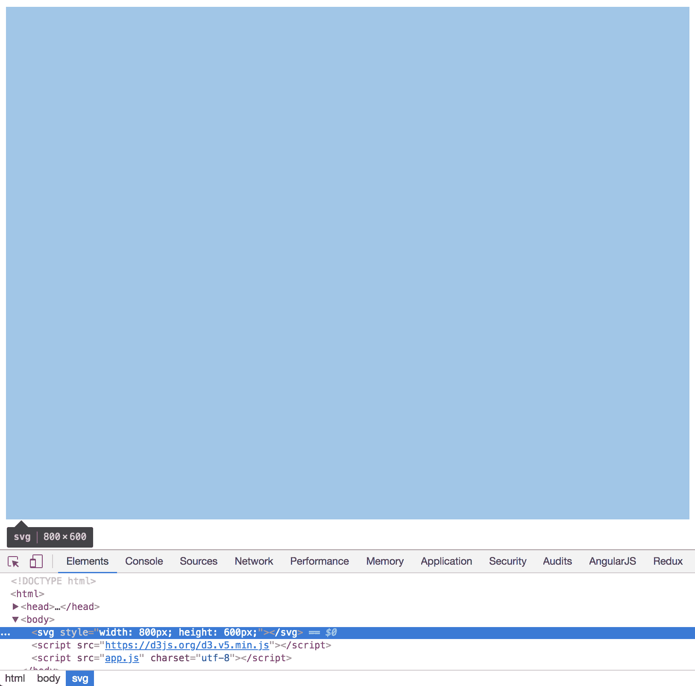

# 为我们的应用程序创建一些假数据

在`app.js`中，让我们创建一个`run`对象的数组，我故意将日期存储为字符串，这也是很重要的，因为这个数组必须是对象数组，以便与 D3 一起使用）。到目前为止，你的`app.js`代码应该如下所示：

```js
var WIDTH = 800;
var HEIGHT = 600;

var runs = [
    {
        id: 1,
        date: 'October 1, 2017 at 4:00PM',
        distance: 5.2
    },
    {
        id: 2,
        date: 'October 2, 2017 at 5:00PM',
        distance: 7.0725
    },
    {
        id: 3,
        date: 'October 3, 2017 at 6:00PM',
        distance: 8.7
    }
];

d3.select('svg')
    .style('width', WIDTH)
    .style('height', HEIGHT);
```

# 添加 SVG 圆形并为其添加样式

在`index.html`中，向你的`<svg>`元素添加三个圆形（每个圆形将代表一次运行）：

```js
<svg>
    <circle/>
    <circle/>
    <circle/>
</svg>
```

在与`index.html`相同的文件夹中创建`app.css`，为圆形和我们的`svg`元素添加一些样式：

```js
circle {
    r:5;
    fill: black;
}
svg {
    border: 1px solid black;
}
```

在`index.html`的头部链接到它：

```js
<head>
    <meta charset="utf-8">
    <title></title>
    <link rel="stylesheet" href="app.css">
</head>
```

现在页面应该如下所示：

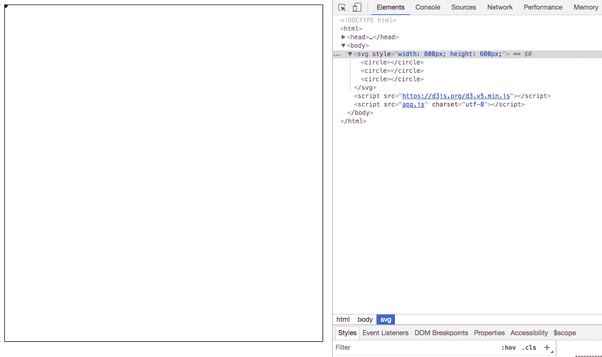

# 创建一个线性`scale`

我们目前在 SVG 中有三个圆形，在`runs`数组中有三个对象。D3 做得最好的事情之一是提供将 SVG 元素与数据链接的能力，以便随着数据的变化，SVG 元素也会变化。在本章中，我们将每个圆形链接到`runs`数组中的一个对象。如果一个对象的`distance`属性相对较高，其关联的圆形将在图表上更高。如果一个对象的`date`属性相对较高（较晚的日期），其关联的圆形将更靠右。

首先，让我们根据`runs`数组中对象的`distance`属性垂直定位圆形。D3 做的最重要的事情之一是提供将（或`map`）数据值转换为视觉点以及相反的能力。它是通过`scale`来实现的。有许多不同类型的`scale`可以处理许多不同的数据类型，但到目前为止，我们只是使用`linear scale`，它将数值数据映射到数值视觉点，反之亦然。

在`app.js`的底部添加以下内容：

```js
var yScale = d3.scaleLinear(); //create the scale 
```

每次我们创建一个`scale`时，我们需要告诉它数据中可能存在的最小和最大可能值（这被称为`domain`）。为了对`yScale`这样做，在`app.js`的底部添加以下内容：

```js
yScale.domain([0, 10]); //minimum data value is 0, max is 10
```

我们还需要告诉`scale`哪些视觉值对应于数据中的最小/最大值（这被称为`range`）。为此，在`app.js`的底部添加以下内容：

```js
//HEIGHT corresponds to min data value
//0 corresponds to max data value
yScale.range([HEIGHT, 0]); 
```

现在，你的`app.js`中的最后三行代码应该如下所示：

```js
var yScale = d3.scaleLinear(); //create the scale
yScale.domain([0, 10]); //minimum data value is 0, max is 10
//HEIGHT corresponds to min data value
//0 corresponds to max data value
yScale.range([HEIGHT, 0]);
```

在前面的代码片段中，范围的第一个（起始）值是`HEIGHT`（600），第二个（结束）值是 0。数据值的最小值是 0，最大值是 10。通过这样做，我们表示数据点（跑步距离）为 0 应映射到视觉高度值`HEIGHT`（600）：

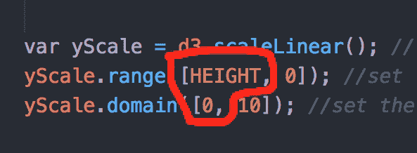

这是因为运行距离（数据值）越低，我们越希望将视觉点沿*Y*轴向下移动。记住，*Y*轴从屏幕顶部的 0 开始，随着我们垂直向下移动而增加值。

我们还表示，距离（运行）为 10 的数据点应该映射到视觉高度为 0：

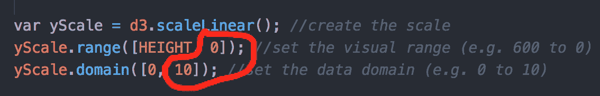

再次强调，这是因为随着运行距离的增加，我们希望得到一个越来越低的视觉值，这样我们的圆圈就越来越接近屏幕顶部。

如果你需要提醒自己域/范围是什么，你可以通过记录`yScale.domain()`或`yScale.range()`来实现。暂时在`app.js`底部添加以下代码：

```js
//you can get the domain whenever you want like this
console.log(yScale.domain());
//you can get the range whenever you want like this:
console.log(yScale.range());
```

我们的 Chrome 控制台应该看起来如下所示：

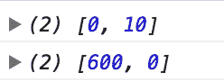

在声明线性比例的范围/域时，我们只需要指定每个的开始/结束值。起始和结束值之间的值将由 D3 计算。例如，要找出与距离值 5 对应的视觉值，使用`yScale()`。删除之前的两个`console.log()`语句，并在`app.js`底部添加以下代码：

```js
console.log(yScale(5)); //get a visual point from a data value
```

下面是我们的 Chrome 开发者控制台应该看起来是什么样子：

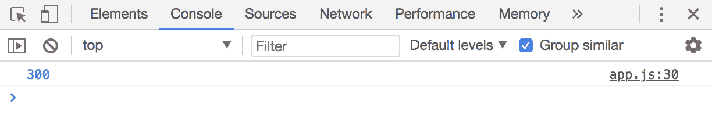

这个日志显示`300`是有道理的，因为数据值`5`位于最小数据值`0`和最大数据值`10`之间的一半。范围从`HEIGHT`（600）开始到`0`结束，所以这两个值之间的一半是 300。

所以，每次你想将数据点转换为视觉点时，就调用`yScale()`。我们可以反过来，通过调用`yScale.invert()`将视觉点转换为数据值。要找出与视觉值 450 对应的数据点，删除之前的`console.log()`语句，并在`app.js`底部添加以下代码：

```js
//get a data values from a visual point
console.log(yScale.invert(450));
```

下面是 Chrome 控制台的样子：

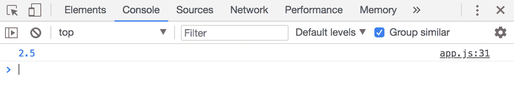

这个日志显示`2.5`是有道理的，因为视觉值 450 是从起始视觉值 600（`HEIGHT`）到结束视觉值`0`的 25%。你现在可以删除最后一行`console.log()`。

# 将数据附加到视觉元素上

现在让我们将我们的`runs`数组中的每个 JavaScript 对象连接到 SVG 中的圆圈上。一旦我们这样做，每个圆圈就可以访问其关联的`run`对象的数据，以确定其位置。在`app.js`底部添加以下代码：

```js
yScale.range([HEIGHT, 0]);
yScale.domain([0, 10]);
//selectAll is like select,
//but it selects all elements that match the query string
d3.selectAll('circle').data(runs);
```

如果`runs`数组中的对象比圆圈多，则额外的对象将被忽略。如果有比对象多的圆圈，那么 JavaScript 对象将按照它们在 DOM 中出现的顺序附加到圆圈上，直到没有更多的对象可以附加。

# 使用附加到视觉元素上的数据来影响其外观

我们可以通过传递静态值来更改一组 DOM 元素的属性，并且所有选定的元素都将具有该特定值作为属性。暂时将以下内容添加到 `app.js` 的末尾：

```js
d3.selectAll('circle').attr('cy', 300);
```

屏幕上应该显示以下内容：

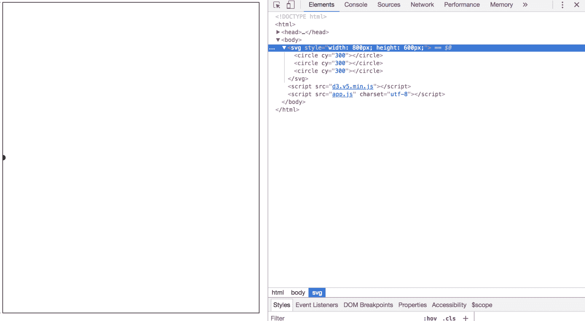

但是现在，由于每个圆圈都附加了我们 `runs` JavaScript 数据对象之一，我们可以使用该数据设置每个圆圈的属性。我们通过将 `.attr()` 方法的第二个参数传递回调函数而不是静态值来实现这一点。移除 `d3.selectAll('circle').attr('cy', 300);` 并将 `app.js` 的最后一行从 `d3.selectAll('circle').data(runs);` 调整为以下内容：

```js
d3.selectAll('circle').data(runs)
    .attr('cy', function(datum, index){
        return yScale(datum.distance);
    });
```

如果我们刷新浏览器，我们应该看到以下内容：

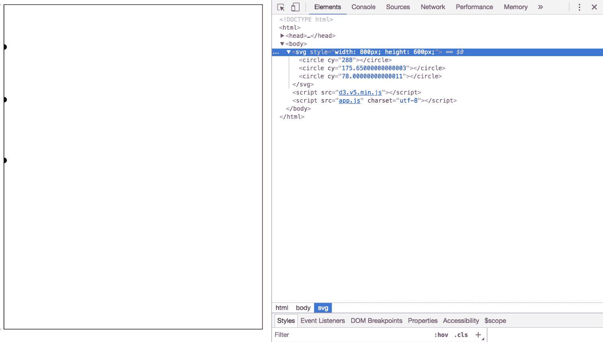

让我们检查我们刚才写了什么。传递给 `.attr()` 的作为第二个参数的回调函数在选定的每个视觉元素上运行（在这种情况下是每个 `circle` 元素）。在每次回调执行期间，该回调函数的返回值被分配给当前元素正在设置的任何方面（在这种情况下是 `cy` 属性）。

回调函数接收两个参数：

+   当我们调用 `.data(runs)` 时，附加到特定视觉元素上的 `runs` 数组中的单个 `datum` 对象

+   该 `datum` 在 `runs` 数组中的 `index`

总结来说，这个过程是遍历 SVG 中的每个 `circle`。对于每个 `circle`，它查看附加到该 `circle` 的 `run` 对象并找到其 `distance` 属性。然后，它将数据值输入到 `yScale()` 中，该函数将其转换为相应的视觉点。然后，这个视觉点被分配给该 `circle` 的 `cy` 属性。由于每个数据对象都有不同的 `distance` 值，因此每个 `circle` 在垂直方向上的位置都不同。

# 创建时间刻度

让我们根据关联的运行发生的日期水平定位圆圈。首先，创建一个时间刻度。这就像一个线性刻度，但它不是将数值映射到视觉点，而是将日期映射到视觉点。将以下内容添加到 `app.js` 的底部：

```js
//scaleTime maps date values with numeric visual points
var xScale = d3.scaleTime();
xScale.range([0,WIDTH]); 
xScale.domain([new Date('2017-10-1'), new Date('2017-10-31')]); console.log(xScale(new Date('2017-10-28'))); console.log(xScale.invert(400));
```

这里是我们控制台应该看起来像什么：

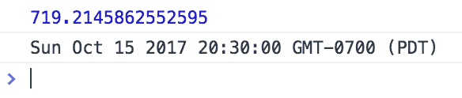

现在，您可以移除两个 `console.log()` 语句。

# 解析和格式化时间

注意，我们 `runs` 数组中对象的 `date` 属性是字符串，而不是日期对象。这是一个问题，因为 `xScale` 与所有时间刻度一样，期望其数据值是日期对象。幸运的是，D3 提供了一种简单的方法来将字符串转换为日期，反之亦然。我们将使用一个特殊格式的字符串，根据文档（[`github.com/d3/d3-time-format#locale_format`](https://github.com/d3/d3-time-format#locale_format)），告诉 D3 如何将 `runs` 数组中对象的 `date` 字符串属性解析为实际的 JavaScript 日期对象。在 `app.js` 的末尾添加以下内容：

```js
//this format matches our data in the runs array
var parseTime = d3.timeParse("%B%e, %Y at %-I:%M%p"); 
console.log(parseTime('October 3, 2017 at 6:00PM'));
var formatTime = d3.timeFormat("%B%e, %Y at %-I:%M%p");
//this format matches our data in the runs array 
console.log(formatTime(new Date()));
```

这里是我们的 Chrome 控制台：

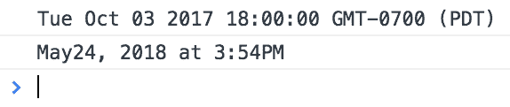

当计算圆的 `cx` 属性时，让我们使用这个方法。删除最后两个 `console.log()` 语句，并将以下代码添加到 `app.js` 的底部：

```js
//use parseTime to convert the date string property on the datum object to a Date object.
//xScale then converts this to a visual value
d3.selectAll('circle')
    .attr('cx', function(datum, index){
        return xScale(parseTime(datum.date));
    });
```

Chrome 应该看起来像这样：

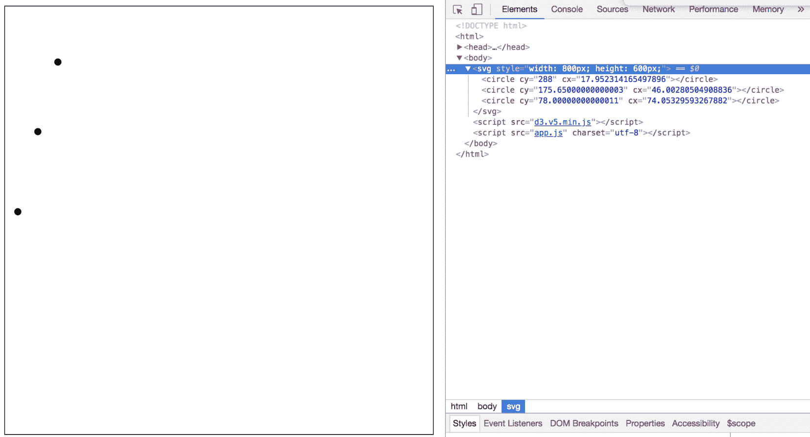

总结来说，这选择了所有的 `circle` 元素。然后为每个 `circle` 的 `cx` 属性设置回调函数的结果。该回调函数为每个 `circle` 运行，并获取与该 `circle` 关联的 `run` 数据对象，并找到其 `date` 属性（记住它是一个字符串，例如，`'October 3, 2017 at 6:00PM'`）。它将这个字符串值传递给 `parseTime()`，然后将其转换为实际的 JavaScript 日期对象。然后，将这个日期对象传递给 `xScale()`，它将日期转换为视觉值。然后，这个视觉值被用于回调函数刚刚运行的 `circle` 的 `cx` 属性。由于 `runs` 数组中对象的每个 `date` 属性都不同，因此 `circles` 在水平位置上不同。

# 设置动态域

目前，我们正在为距离和日期的范围设置任意的最小/最大值。D3 可以找到数据集的最小/最大值，这样我们的图表就可以只显示我们需要的日期范围。我们只需要传递最小/最大方法一个回调函数，该回调函数会在 `runs` 数组中的每个数据项上被调用。D3 使用回调函数来确定数据对象中比较最小/最大值的属性。

转到以下代码部分：

```js
var yScale = d3.scaleLinear(); //create the scale
yScale.range([HEIGHT, 0]); //set the visual range (for example 600 to 0)
yScale.domain([0, 10]); //set the data domain (for example 0 to 10)
```

更改为以下代码：

```js
var yScale = d3.scaleLinear(); //create the scale
yScale.range([HEIGHT, 0]); //set the visual range (for example 600 to 0)
var yMin = d3.min(runs, function(datum, index){
    //compare distance properties of each item in the data array
    return datum.distance; 
})
var yMax = d3.max(runs, function(datum, index){
    //compare distance properties of each item in the data array
    return datum.distance;
})
//now that we have the min/max of the data set for distance,
//we can use those values for the yScale domain
yScale.domain([yMin, yMax]); 
console.log(yScale.domain());
```

Chrome 应该看起来如下：

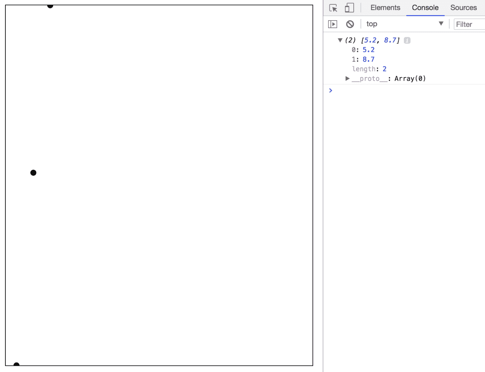

让我们检查我们刚才写的代码。以下代码找到最小距离：

```js
var yMin = d3.min(runs, function(datum, index){
    //compare distance properties of each item in the data array
    return datum.distance; 
})
```

D3 遍历 `runs` 数组（第一个参数）并在数组的每个元素上调用回调函数（第二个参数）。该函数的返回值与其他元素上回调函数的返回值进行比较。最低值被分配给 `yMin`。对于 `d3.max()` 也是同样的操作，但用于最高值。

我们可以将最小/最大函数合并为一个 `extent` 函数，该函数返回一个与 `[yMin, yMax]` 完全相同的结构的数组。让我们看看我们刚才写的代码：

```js
var yScale = d3.scaleLinear(); //create the scale
yScale.range([HEIGHT, 0]); //set the visual range (for example 600 to 0)
var yMin = d3.min(runs, function(datum, index){
    //compare distance properties of each item in the data array
    return datum.distance;
})
var yMax = d3.max(runs, function(datum, index){
    //compare distance properties of each item in the data array
    return datum.distance; 
})
//now that we have the min/max of the data set for distance
//we can use those values for the yScale domain
yScale.domain([yMin, yMax]);
console.log(yScale.domain());
```

将之前的代码更改为以下代码：

```js
var yScale = d3.scaleLinear(); //create the scale
yScale.range([HEIGHT, 0]); //set the visual range (for example 600 to 0)
var yDomain = d3.extent(runs, function(datum, index){
    //compare distance properties of each item in the data array
    return datum.distance; 
})
yScale.domain(yDomain);
```

它短多了，对吧？让我们为 xScale 的域做同样的操作。转到以下代码部分：

```js
//scaleTime maps date values with numeric visual points
var xScale = d3.scaleTime(); 
xScale.range([0,WIDTH]);
xScale.domain([new Date('2017-10-1'), new Date('2017-10-31')]);

//this format matches our data in the runs array
var parseTime = d3.timeParse("%B%e, %Y at %-I:%M%p");
//this format matches our data in the runs array 
var formatTime = d3.timeFormat("%B%e, %Y at %-I:%M%p"); 
```

更改为以下代码：

```js
var parseTime = d3.timeParse("%B%e, %Y at %-I:%M%p");
var formatTime = d3.timeFormat("%B%e, %Y at %-I:%M%p");
var xScale = d3.scaleTime();
xScale.range([0,WIDTH]);
var xDomain = d3.extent(runs, function(datum, index){
    return parseTime(datum.date);
});
xScale.domain(xDomain);
```

注意我们将 `parseTime` 和 `formatTime` 上移，以便它们可以在 `.extent()` 中使用。Chrome 应该看起来如下：

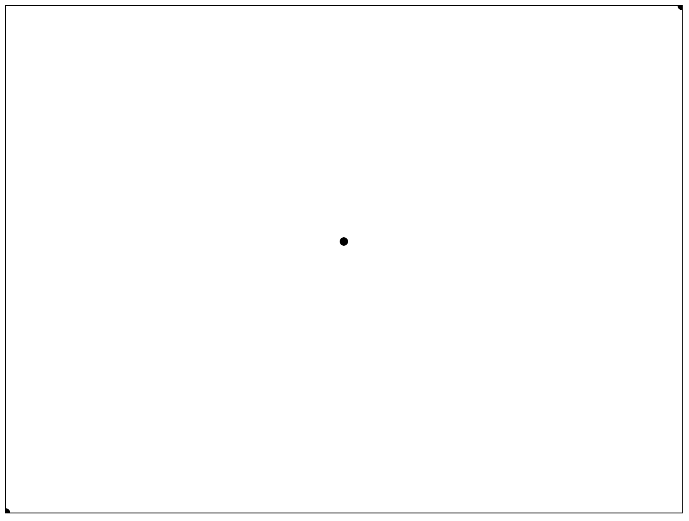

# 动态生成 SVG 元素

目前，我们只有足够多的 `<circle>` 元素来适应我们的数据。如果我们不想计算数组中有多少元素呢？D3 可以根据需要创建元素。首先，从 `index.html` 中删除所有 `<circle>` 元素。现在，你的 `<body>` 标签应该如下所示：

```js
<body>
    <svg></svg>
    <script src="img/d3.v5.min.js"></script>
    <script src="img/app.js" charset="utf-8"></script>
</body>
```

在 `app.js` 中，找到以下代码部分：

```js
d3.selectAll('circle').data(runs)
    .attr('cy', function(datum, index){
        return yScale(datum.distance);
    });
```

修改代码以创建圆圈：

```js
//since no circles exist, we need to select('svg')
//so that d3 knows where to append the new circles
d3.select('svg').selectAll('circle')
    .data(runs) //attach the data as before
    //find the data objects that have not yet 
    //been attached to visual elements
    .enter()
    //for each data object that hasn't been attached,
    //append a <circle> to the <svg>
    .append('circle'); 

d3.selectAll('circle')
    .attr('cy', function(datum, index){
        return yScale(datum.distance);
    });
```

它应该看起来和之前完全一样，但现在为 `runs` 数组中的每个对象创建了一个圆圈：

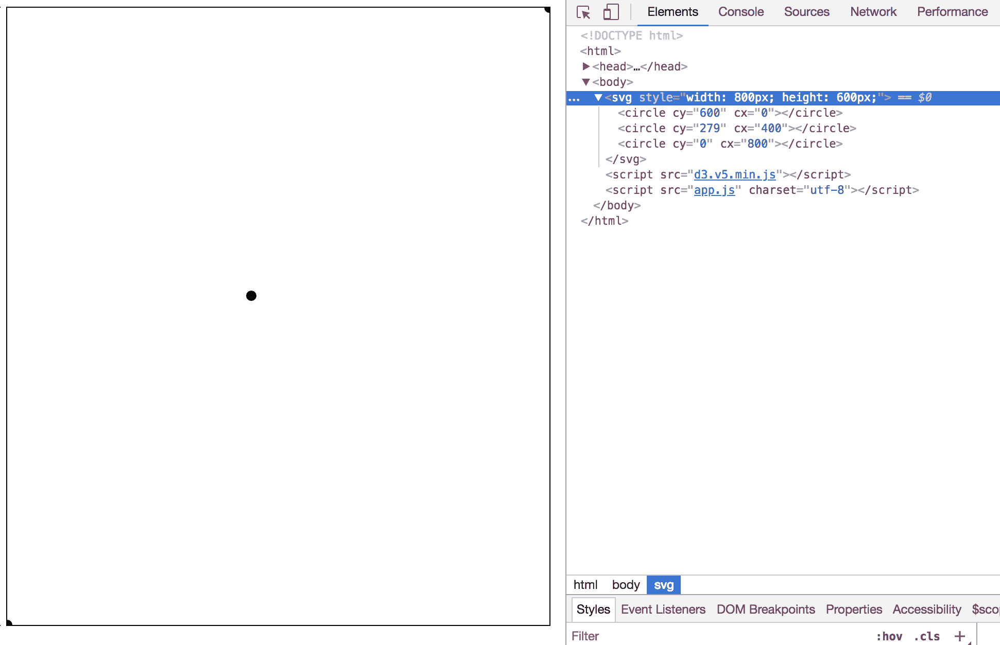

这里是对我们刚才所写内容的更深入解释。看看新代码的第一行：

```js
d3.select('svg').selectAll('circle')
```

这可能看起来是不必要的。为什么不直接使用 `d3.selectAll('circle')` 呢？嗯，目前还没有 `circle` 元素。我们将动态地添加 `circle` 元素，所以 `d3.select('svg')` 告诉 D3 将它们添加到何处。我们仍然需要 `.selectAll('circle')`，这样当我们在下一行调用 `.data(runs)` 时，D3 就知道将 `runs` 数组中的各种对象绑定到哪些元素上。但是没有 `circle` 元素可以绑定数据。没关系。`.enter()` 找到尚未绑定到任何 `circle` 元素的 `run` 对象（在这种情况下是所有对象）。然后我们使用 `.append('circle')` 为 `.enter()` 找到的每个未绑定的 `run` 对象添加一个圆圈。

# 创建坐标轴

D3 可以自动为你生成坐标轴。将以下内容添加到 `app.js` 的底部：

```js
//pass the appropriate scale in as a parameter
var bottomAxis = d3.axisBottom(xScale);
```

这创建了一个底部坐标轴生成器，可以用来将坐标轴插入你选择的任何元素中。将以下代码添加到 `app.js` 的底部，在 SVG 元素内部添加一个 `<g>` 元素，然后在其中插入一个底部坐标轴：

```js
d3.select('svg')
    .append('g') //put everything inside a group
    .call(bottomAxis); //generate the axis within the group
```

这就是 Chrome 应该有的样子：

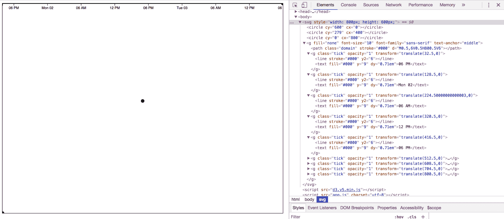

Chrome 显示

我们希望坐标轴位于 SVG 的底部。修改我们刚才写的代码，使其看起来像这样（注意：我们在 `.call(bottomAxis)` 后面移除了一个`;` 并添加了 `.attr('transform', 'translate(0,'+HEIGHT+')');`）：

```js
//pass the appropriate scale in as a parameter
var bottomAxis = d3.axisBottom(xScale); 
d3.select('svg')
    .append('g') //put everything inside a group
    .call(bottomAxis) //generate the axis within the group
    //move it to the bottom
    .attr('transform', 'translate(0,'+HEIGHT+')'); 
```

目前，我们的 SVG 裁剪了坐标轴：


让我们修改 `svg` 的 CSS，使其不会裁剪超出其边界的任何元素：

```js
svg {
    overflow: visible;    
}
```

现在看起来不错：

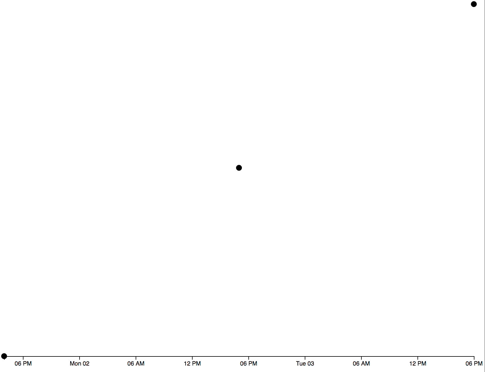

左侧坐标轴非常相似。将以下内容添加到 `app.js` 的底部：

```js
var leftAxis = d3.axisLeft(yScale);
d3.select('svg')
    .append('g')
    //no need to transform, since it's placed correctly initially
    .call(leftAxis); 
```

注意：我们不需要设置 `transform` 属性，因为它最初就在正确的位置：

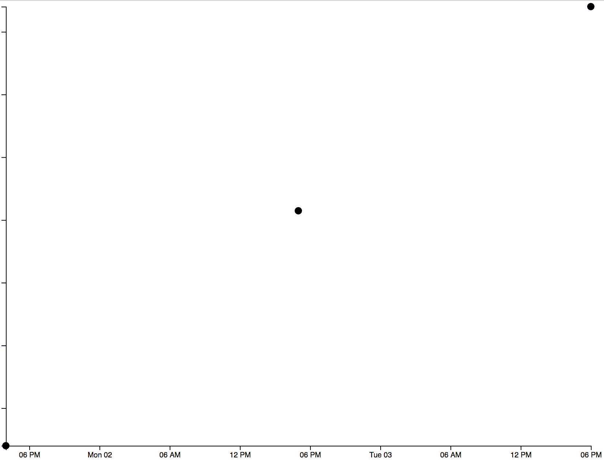

看起来有点困难，所以让我们在 `app.css` 的底部添加以下内容：

```js
body {
    margin: 20px 40px;
}
```

现在我们的坐标轴已经完整：

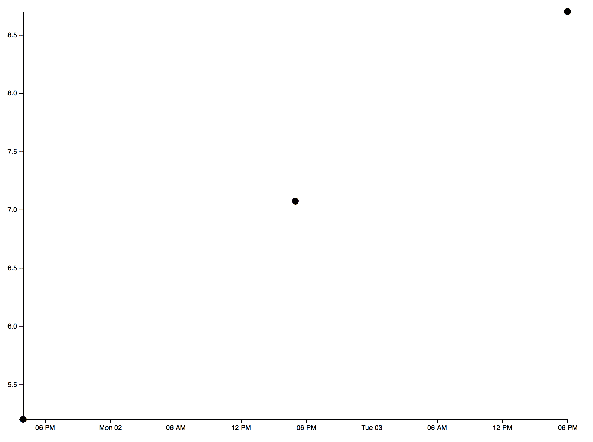

# 在表格中显示数据

仅用于调试目的，让我们创建一个表格，将显示所有数据。将 `index.html` 中的 `<body>` 标签修改如下：

```js
<body>
    <svg></svg>
    <table>
        <thead>
            <tr>
                <th>id</th>
                <th>date</th>
                <th>distance</th>
            </tr>
        </thead>
        <tbody>
        </tbody>
    </table>
    <script src="img/d3.v5.min.js"></script>
    <script src="img/app.js" charset="utf-8"></script>
</body>
```

D3 也可以用来操作 DOM，就像 jQuery 一样。让我们以这种方式填充 `<tbody>`。将以下内容添加到 `app.js` 的底部：

```js
var createTable = function(){
    for (var i = 0; i < runs.length; i++) {
        var row = d3.select('tbody').append('tr');
        row.append('td').html(runs[i].id);
        row.append('td').html(runs[i].date);
        row.append('td').html(runs[i].distance);
    }
}

createTable();
```

在 `app.css` 的底部添加一些表格样式：

```js
table, th, td {
   border: 1px solid black;
}
th, td {
    padding:10px;
    text-align: center;
}
```

调整 `svg` 的 CSS 以添加底部边距。这将创建图表和表格之间的空间：

```js
svg {
    overflow: visible;
    margin-bottom: 50px;
}
```

现在浏览器应该看起来是这样的：


# 摘要

到目前为止，你有一个静态的散点图和一个显示其数据的表格。在第四章，《制作基本散点图交互式》中，我们将学习如何使其交互式。
