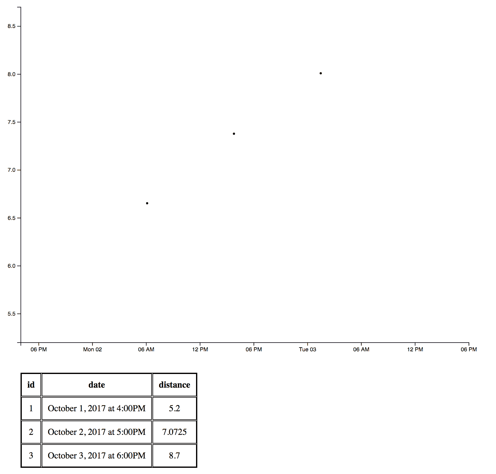

# 第四章：制作一个基本的散点图交互

在上一章中，我们创建了一个静态散点图。在本章中，我们将使其交互式，以便我们可以添加、更新和删除运行。你将学习如何执行以下操作：

+   创建一个点击处理器

+   删除数据

+   拖动一个元素

+   拖动后的数据更新

+   创建一个缩放行为以缩放元素

+   缩放/平移时更新坐标轴

+   更新变换后的点击点

+   避免在渲染过程中重绘整个屏幕

+   隐藏轴以外的元素

本节完整的代码可以在以下位置找到：[`github.com/PacktPublishing/D3.js-Quick-Start-Guide/tree/master/Chapter04`](https://github.com/PacktPublishing/D3.js-Quick-Start-Guide/tree/master/Chapter04)[.](https://github.com/PacktPublishing/D3.js-Quick-Start-Guide/tree/master/Chapter04)

# 创建一个点击处理器

假设我们想让用户点击 `<svg>` 元素时创建一个新的运行。将以下内容添加到 `app.js` 的底部：

```js
d3.select('svg').on('click', function(){
    //gets the x position of the mouse relative to the svg element
    var x = d3.event.offsetX;
    //gets the y position of the mouse relative to the svg element
    var y = d3.event.offsetY; 
    //get a date value from the visual point that we clicked on
    var date = xScale.invert(x);
    //get a numeric distance value from
    //the visual point that we clicked on
    var distance = yScale.invert(y); 

    //create a new "run" object
    var newRun = { 
        //generate a new id by adding 1 to the last run's id
        id: runs[runs.length-1].id+1, 
        //format the date object created above to a string
        date: formatTime(date),
        distance: distance //add the distance
    }
    runs.push(newRun); //push the new run onto the runs array
    createTable(); //render the table
});
```

让我们检查我们刚才写的。注意，`d3.select('svg').on('click', function(){` 在 `svg` 元素上设置了一个点击处理器。传递给 `.on()` 的第二个参数的匿名函数在用户每次点击 SVG 时都会被调用。一旦进入那个回调函数，我们使用 `d3.event.offsetX` 获取鼠标在 SVG 内部的 *x* 位置，并使用 `d3.event.offsetY` 获取 *y* 位置。然后我们使用 `xScale.invert()` 和 `yScale.invert()` 将 *x*/*y* 可视点转换为数据值（日期和距离，分别）。然后我们使用这些数据值创建一个新的运行对象。我们通过获取 `runs` 数组中最后一个元素的 ID 并加 1 来创建新运行的 ID。最后，我们将新运行推送到 `runs` 数组并调用 `createTable()`。

点击 SVG 创建一个新的运行。你可能注意到 `createTable()` 只是再次添加了所有运行行：


让我们修改 `createTable()` 函数，使其在运行时清除之前创建的任何行并重新渲染一切。在 `app.js` 中的 `createTable` 函数顶部添加 `d3.select('tbody').html('')`：

```js
var createTable = function(){
    //clear out all rows from the table
    d3.select('tbody').html(''); 
    for (var i = 0; i < runs.length; i++) {
        var row = d3.select('tbody').append('tr');
        row.append('td').html(runs[i].id);
        row.append('td').html(runs[i].date);
        row.append('td').html(runs[i].distance);
    }
}
```

现在刷新页面并点击 SVG 创建一个新的运行。表格应该看起来像这样：


现在唯一的问题是当你点击 SVG 时没有创建圆圈。为了解决这个问题，让我们将创建 `<circle>` 元素的代码包裹在一个渲染函数中，并在定义后立即调用 `render()`：

```js
var render = function(){

    var yScale = d3.scaleLinear();
    yScale.range([HEIGHT, 0]);
    yDomain = d3.extent(runs, function(datum, index){
        return datum.distance;
    })
    yScale.domain(yDomain);

    d3.select('svg').selectAll('circle')
        .data(runs)
        .enter()
        .append('circle');

    d3.selectAll('circle')
        .attr('cy', function(datum, index){
            return yScale(datum.distance);
        });

    var parseTime = d3.timeParse("%B%e, %Y at %-I:%M%p");
    var formatTime = d3.timeFormat("%B%e, %Y at %-I:%M%p");
    var xScale = d3.scaleTime();
    xScale.range([0,WIDTH]);
    xDomain = d3.extent(runs, function(datum, index){
        return parseTime(datum.date);
    });
    xScale.domain(xDomain);
    d3.selectAll('circle')
        .attr('cx', function(datum, index){
            return xScale(parseTime(datum.date));
        });

}
render();
```

如果你刷新浏览器，你会在控制台看到一个错误。这是因为 `bottomAxis` 和 `leftAxis` 使用了现在仅限于 `render()` 函数内部的 `xScale` 和 `yScale`。为了未来的使用，让我们将 `xScale` 和 `yScale` 以及创建域/范围的代码从渲染函数中移出：

```js
var parseTime = d3.timeParse("%B%e, %Y at %-I:%M%p");
var formatTime = d3.timeFormat("%B%e, %Y at %-I:%M%p");
var xScale = d3.scaleTime();
xScale.range([0,WIDTH]);
xDomain = d3.extent(runs, function(datum, index){
    return parseTime(datum.date);
});
xScale.domain(xDomain);

var yScale = d3.scaleLinear();
yScale.range([HEIGHT, 0]);
yDomain = d3.extent(runs, function(datum, index){
    return datum.distance;
})
yScale.domain(yDomain);
var render = function(){

    //since no circles exist,
    //we need to select('svg') so that 
    //d3 knows where to append the new circles
    d3.select('svg').selectAll('circle') 
        //attach the data as before
        .data(runs) 
        //find the data objects that have not yet
        //been attached to visual elements
        .enter()
        //for each data object that hasn't been attached, 
        //append a <circle> to the <svg>
        .append('circle');
    d3.selectAll('circle')
        .attr('cy', function(datum, index){
            return yScale(datum.distance);
        });

    d3.selectAll('circle')
        .attr('cx', function(datum, index){
            //use parseTime to convert 
            //the date string property on the datum object 
            //to a Date object, 
            //which xScale then converts to a visual value
            return xScale(parseTime(datum.date)); 
        });

}
render();
```

现在转到 `app.js` 的底部并添加一行调用 `<svg>` 点击处理器的 `render()`：

```js
var newRun = {
    id: runs[runs.length-1].id+1,
    date: formatTime(date),
    distance: distance
}
runs.push(newRun);
createTable();
render(); //add this line
```

现在当你点击 SVG 时，会出现一个圆圈：


# 删除数据

让我们在所有 `<circle>` 元素上设置一个点击处理程序，以便当用户点击 `<circle>` 时，D3 将从数组中删除该圆圈及其相关数据元素。在上一节中我们编写的 `render` 函数声明底部添加以下代码。我们这样做是为了确保点击处理程序在圆圈创建后附加：

```js
//put this at the bottom of the render function, 
//so that click handlers are attached when the circle is created
d3.selectAll('circle').on('click', function(datum, index){
    //stop click event from propagating to 
    //the SVG element and creating a run
    d3.event.stopPropagation(); 
    //create a new array that has removed the run 
    //with the correct id. Set it to the runs var
    runs = runs.filter(function(run, index){ 
        return run.id != datum.id;
    });
    render(); //re-render dots
    createTable(); //re-render table
});
```

让我们检查之前的代码。第一行选择所有 `<circle>` 元素并为每个元素创建一个点击处理程序。然而，`d3.event.stopPropagation();` 阻止点击事件向上冒泡到 SVG。如果我们不添加它，当我们在圆圈上点击时，SVG 上的点击处理程序也会触发。这会在我们尝试删除运行时创建额外的运行。接下来，我们调用以下代码：

```js
runs = runs.filter(function(run, index){
 return run.id != datum.id;
});
```

这会遍历 `runs` 数组，并过滤掉任何具有与点击的 `<circle>` 关联的 `datum` 的 `id` 属性匹配的 `id` 属性的对象。注意，`.on('click', function(datum, index){` 中的回调函数接受两个参数：`datum`，与该 `<circle>` 关联的运行对象，以及 `runs` 数组中运行对象的 `index`。

一旦我们从 `runs` 数组中过滤出正确的运行对象，我们就调用 `render()` 和 `createdTable()` 来重新渲染图表和表格。

但如果我们点击中间的圆圈并检查开发者工具的 **元素** 选项卡，我们会看到 `<circle>` 元素没有被删除：


显示 <circle> 元素的元素选项卡

在之前的屏幕截图中，看起来只有两个圆圈，但实际上中间的那个圆圈的 `cx` 被设置为 800，`cy` 被设置为 0。它与相同位置的另一个圆圈重叠。这是因为我们已经从 `runs` 数组中删除了第二个元素。当我们重新渲染图表时，`runs` 数组中只有两个对象；在删除中间运行之前，第二个运行对象原本是第三个运行对象。现在它是第二个运行对象，第二个 `<circle>` 被分配了数据。第三个圆圈仍然保留了旧数据，因此第二个和第三个圆圈具有相同的数据，因此它们被放置在相同的位置。

让我们把圆圈放入 `<g>` 中，这样当我们删除一个运行时，就可以轻松清除所有圆圈并重新渲染它们。这样，当我们尝试删除它们时，就不会有任何额外的 `<circle>` 元素散落在周围。这种方法与我们重新渲染表格时所做的类似。调整 `index.html` 中的 `<svg>` 元素，使其看起来如下：

```js
<svg>
    <g id="points"></g>
</svg>
```

现在我们可以每次调用 `render()` 时清除 `<circle>` 元素。这有点粗糙，但暂时可以工作。稍后，我们将以更优雅的方式处理。在 `render()` 函数声明顶部添加 `d3.select('#points').html('');` 并将下一行从 `d3.select('svg').selectAll('circle')` 调整为 `d3.select('#points').selectAll('circle')`：

```js
//adjust the code at the top of your render function
 //clear out all circles when rendering d3.select('#points').html('');
 //add circles to #points group, not svg d3.select('#points').selectAll('circle') .data(runs) .enter() .append('circle');
```

现在如果您点击中间的圆圈，元素将从 DOM 中移除：


从 DOM 中移除元素

如果您尝试删除所有圆圈并添加一个新的圆圈，您将得到一个错误：


显示删除所有圆圈并添加一个新圆圈时得到的错误

这是因为我们在 SVG 点击处理程序中创建 `newRun` 的代码需要一些修改：

```js
var newRun = { //create a new "run" object
    //generate a new id by adding 1 to the last run's id
    id: runs[runs.length-1].id+1, 
    //format the date object created above to a string
    date: formatTime(date), 
    distance: distance //add the distance
}
```

这是因为当 `runs` 数组中没有运行元素时，`runs[runs.length-1]` 尝试访问数组中索引为 `-1` 的元素。在 `<svg>` 点击处理程序内部，让我们添加一些代码来处理用户删除所有运行并尝试添加一个新运行的情况：

```js
//inside svg click handler
var newRun = {
    //add this line
    id: ( runs.length > 0 ) ? runs[runs.length-1].id+1 : 1, 
    date: formatTime(date),
    distance: distance
}
```

如果您删除所有运行并尝试添加一个新的运行，Chrome 现在应该看起来是这样的：


最后，让我们添加一些 CSS，以便我们知道我们在点击圆圈。首先，将 `transition: r 0.5s linear, fill 0.5s linear;` 添加到您已经为 `circle` 编写的 CSS 代码中：

```js
circle {
    r: 5;
    fill: black;
    /* add this transition to original code */
    transition: r 0.5s linear, fill 0.5s linear; 
}
```

然后将此代码添加到 `app.css` 的底部：

```js
/* add this css for the hover state */
circle:hover {
    r:10;
    fill: blue;
}
```

当您悬停在圆圈上时，圆圈应该看起来是这样的：


# 拖动一个元素

我们希望能够通过拖动相关的圆圈来更新一次运行的 数据。为此，我们将使用一个行为，您可以将其视为多个事件处理器的组合。对于拖动行为，有三个回调函数：

+   当用户开始拖动时

+   每次用户在释放鼠标按钮之前移动光标时

+   当用户释放 *鼠标* 按钮时

每次我们创建一个行为时，都有两个步骤：

1.  创建行为

1.  将行为附加到一个或多个元素上

将以下代码放在 `render()` 函数声明底部：

```js
//put this code at the end of the render function
var drag = function(datum){
    var x = d3.event.x;
    var y = d3.event.y;
    d3.select(this).attr('cx', x);
    d3.select(this).attr('cy', y);
}
var dragBehavior = d3.drag()    
    .on('drag', drag);
d3.selectAll('circle').call(dragBehavior);
```

现在，您可以拖动这些圆圈，但数据不会更新：


让我们看看这段代码是如何工作的：

```js
var drag = function(datum){
 var x = d3.event.x;
 var y = d3.event.y;
 d3.select(this).attr('cx', x);
 d3.select(this).attr('cy', y);
}
```

这个 `drag` 函数将在用户在释放鼠标按钮之前移动光标时作为回调函数使用。它获取鼠标的 *x* 和 *y* 坐标，并将被拖动元素（`d3.select(this)`）的 `cx` 和 `cy` 值设置为这些坐标。

接下来，我们生成一个拖动行为，在适当的时候调用刚才解释过的 `drag` 函数：

```js
var dragBehavior = d3.drag()
 .on('drag', drag);
```

最后，我们将这种行为附加到所有的 `<circle>` 元素上：

```js
d3.selectAll('circle').call(dragBehavior);
```

# 拖动后更新数据

现在我们将添加功能，以便当用户释放鼠标按钮时，与被拖动的圆圈关联的运行对象的数据将得到更新。

首先，让我们创建一个当用户释放鼠标按钮时将被调用的回调函数。在`render()`函数声明的底部，在`var drag = function(datum){`之上添加以下代码：

```js
var dragEnd = function(datum){
    var x = d3.event.x;
    var y = d3.event.y;

    var date = xScale.invert(x);
    var distance = yScale.invert(y);

    datum.date = formatTime(date);
    datum.distance = distance;
    createTable();
}
```

现在将此函数附加到`dragBehavior`，以便在用户停止拖动圆圈时调用。查看以下代码：

```js
var dragBehavior = d3.drag()
    .on('drag', drag);
```

更改为以下内容：

```js
var dragBehavior = d3.drag()
    .on('drag', drag)
    .on('end', dragEnd);
```

现在，一旦你停止拖动圆圈，你应该看到表格中的数据发生变化：


让我们在拖动圆圈的同时改变圆圈的颜色。将以下内容添加到`app.css`的底部：

```js
circle:active {
    fill: red;
}
```

当你拖动一个圆圈时，它应该变成红色。

# 创建一个缩放行为以缩放元素

我们可以创建的另一种行为是缩放/平移能力。一旦这个功能完成，你将能够通过以下操作之一在不同的图形部分进行缩放和平移：

+   在触摸板上进行两指拖动

+   滚动鼠标滚轮

+   在触摸板上进行捏合/展开操作

你还将能够通过在 SVG 元素上点击和拖动来在图表上左右、上下平移。

将以下代码放在`app.js`的底部：

```js
var zoomCallback = function(){
    d3.select('#points').attr("transform", d3.event.transform);
}
```

这是当用户尝试缩放或平移时将被调用的回调函数。它所做的只是将缩放或平移操作转换为应用于包含圆圈的`<g id="points"></g>`元素的`transform`属性。现在将以下代码添加到`app.js`的底部以创建`zoom`行为并将其附加到`svg`元素：

```js
var zoom = d3.zoom()
    .on('zoom', zoomCallback);
d3.select('svg').call(zoom);
```

现在，如果我们缩放，图表应该看起来像这样：



# 在缩放和平移时更新坐标轴

现在我们缩放时，点移动到内部/外部。当我们平移时，它们垂直/水平移动。不幸的是，坐标轴没有相应更新。让我们首先为包含它们的`<g>`元素添加 ID。找到以下代码：

```js
var bottomAxis = d3.axisBottom(xScale);
d3.select('svg')
    .append('g')
    .call(bottomAxis)
    .attr('transform', 'translate(0,'+HEIGHT+')');
var leftAxis = d3.axisLeft(yScale);
d3.select('svg')
    .append('g')
    .call(leftAxis);
```

在第一个`.append('g')`之后添加`.attr('id', 'x-axis')`，在第二个`.append('g')`之后添加`.attr('id', 'y-axis')`：

```js
d3.select('svg')
    .append('g')
    .attr('id', 'x-axis') //add an id
    .call(bottomAxis)
    .attr('transform', 'translate(0,'+HEIGHT+')');
var leftAxis = d3.axisLeft(yScale);
d3.select('svg')
    .append('g')
    .attr('id', 'y-axis') //add an id
    .call(leftAxis);
```

现在让我们使用这些 ID 在缩放时调整坐标轴。找到以下代码：

```js
var zoomCallback = function(){
    d3.select('#points').attr("transform", d3.event.transform);
}
```

将以下内容添加到函数声明的末尾：

```js
d3.select('#x-axis')
    .call(bottomAxis.scale(d3.event.transform.rescaleX(xScale)));
d3.select('#y-axis')
    .call(leftAxis.scale(d3.event.transform.rescaleY(yScale)));
```

现在`zoomCallback`应该如下所示：

```js
var zoomCallback = function(){
    d3.select('#points').attr("transform", d3.event.transform);
    d3.select('#x-axis')
      .call(bottomAxis.scale(d3.event.transform.rescaleX(xScale)));
    d3.select('#y-axis')
      .call(leftAxis.scale(d3.event.transform.rescaleY(yScale)));
}
```

关于前面的代码，有两点需要注意：

+   `bottomAxis.scale()`告诉坐标轴重新绘制自己。

+   `d3.event.transform.rescaleX(xScale)`返回一个值，指示底部坐标轴应该如何缩放。

现在当你缩放时，坐标轴应该重新绘制：


# 变换后更新点击点

尝试缩放和平移，然后点击 SVG 创建一个新的运行。你会注意到它位置不正确。这是因为 SVG 点击处理程序不知道发生了缩放或平移。目前，无论你缩放或平移多少，点击处理程序仍然将其转换为好像你从未缩放或平移过。

当我们缩放时，我们需要将变换信息保存到变量中，以便我们稍后可以使用它来确定如何正确创建圆圈和运行。找到 `zoomCallback` 声明，并在它之前添加 `var lastTransform = null`。然后，在函数声明开始处添加 `lastTransform = d3.event.transform;`。它应该看起来如下：

```js
var lastTransform = null; //add this
var zoomCallback = function(){
    lastTransform = d3.event.transform; //add this
    d3.select('#points').attr("transform", d3.event.transform);
    d3.select('#x-axis')
      .call(bottomAxis.scale(d3.event.transform.rescaleX(xScale)));
    d3.select('#y-axis')
      .call(leftAxis.scale(d3.event.transform.rescaleY(yScale)));
}
```

现在每当用户缩放或平移时，用于缩小或移动 SVG 和坐标轴的变换数据将保存在 `lastTransform` 变量中。在点击 SVG 时使用该变量。

在 SVG 点击处理器的开头找到这两行：

```js
var x = d3.event.offsetX;
var y = d3.event.offsetY;
```

将它们更改为以下内容：

```js
var x = lastTransform.invertX(d3.event.offsetX);
var y = lastTransform.invertY(d3.event.offsetY);
```

你的点击处理器现在应该看起来像这样：

```js
d3.select('svg').on('click', function(){
    var x = lastTransform.invertX(d3.event.offsetX); //adjust this
    var y = lastTransform.invertY(d3.event.offsetY); //adjust this

    var date = xScale.invert(x)
    var distance = yScale.invert(y);

    var newRun = {
        id: ( runs.length > 0 ) ? runs[runs.length-1].id+1 : 1,
        date: formatTime(date),
        distance: distance
    }
    runs.push(newRun);
    createTable();
    render();
});
```

但现在在缩放被破坏之前点击，因为 `lastTransform` 将为空：


找到我们刚刚为 SVG 点击处理器编写的代码：

```js
var x = lastTransform.invertX(d3.event.offsetX);
var y = lastTransform.invertY(d3.event.offsetY);
```

调整它，使其看起来如下：

```js
var x = d3.event.offsetX;
var y = d3.event.offsetY;

if(lastTransform !== null){
    x = lastTransform.invertX(d3.event.offsetX);
    y = lastTransform.invertY(d3.event.offsetY);
}
```

初始时，`x` 和 `y` 分别被设置为 `d3.event.offsetX` 和 `d3.event.offsetY`。如果发生缩放或平移，`lastTransform` 将不会为空，因此我们将使用变换后的值覆盖 `x` 和 `y`。

初始时添加一个新的运行：


现在向右平移并添加一个新的点：


# 避免在渲染过程中重新绘制整个屏幕

目前，每次我们调用 `render()` 时，我们都会从 `<svg>` 中擦除所有 `<circle>` 元素。这是低效的。我们只需移除我们不需要的元素

在 `render()` 函数的顶部，将 `d3.select('#points').selectAll('circle').data(runs)` 赋值给一个变量，这样我们就可以稍后使用它。这有助于保留在下一节中 DOM 元素如何分配给数据元素。在 `render()` 函数声明顶部找到它：

```js
d3.select('#points').html('');
d3.select('#points').selectAll('circle')
 .data(runs)
 .enter()
 .append('circle');
```

更改为以下内容：

```js
d3.select('#points').html('');
var circles = d3.select('#points')
 .selectAll('circle')
 .data(runs);
circles.enter().append('circle');
```

接下来，删除 `d3.select('#points').html('');` 这一行。我们将使用 `.exit()` 来找到尚未与数据匹配的圆圈选择，然后我们将使用 `.remove()` 来移除这些圆圈。在我们刚刚写的最后一行之后添加以下内容 (`circles.enter().append('circle');`):

```js
circles.exit().remove();
```

重新加载页面，点击中心（第二个）圆圈。你会注意到圆圈似乎消失了，右上角的圆圈短暂地获得悬停状态然后又缩小。这并不是真正发生的事情。

如果我们点击中间的圆圈（第二个），它将删除 `runs` 数组中的第二个运行对象，第三个运行对象将向下移动以替换它。现在我们只有一个包含两个运行对象的数组：第一个和原本是第三个（但现在变成了第二个）。当再次调用 `render()` 时，原本的中间（第二个）圆圈被分配给原本是 `runs` 数组中的第三个运行对象（但现在变成了第二个）。这个“运行”对象原本被分配给右上角的第三个圆圈。但现在，由于只有两个运行对象，当我们调用 `circles.exit().remove();` 时，第三个（右上角）圆圈将被删除。第二个圆圈的数据已经改变，它跳到右上角以匹配该数据。它原本有一个悬停状态，但突然它从光标下移开，因此它缩小回正常大小并变成黑色。

为了避免这些影响，我们需要确保在调用 `render()` 时，每个圆圈都保持与它最初分配到的数据一致。为此，我们可以告诉 D3 通过 ID 而不是索引将 `<circles>` 映射到数据项。在 `render()` 函数的顶部，找到以下代码：

```js
var circles = d3.select('#points')
 .selectAll('circle')
 .data(runs);
```

改为如下所示：

```js
var circles = d3.select('#points')
 .selectAll('circle')
 .data(runs, function(datum){
 return datum.id
});
```

这告诉 D3 在确定将数据对象分配给哪个 `<circle>` 元素时使用每个运行对象的 `id` 属性。它基本上是将运行对象的 `id` 属性最初分配给 `<circle>` 元素。这样，当第二个运行对象被删除时，`circles.exit().remove();` 将找到具有相应 ID（中间的圆圈）的圆圈并将其删除。

现在点击中间的圆圈应该可以正常工作。

# 隐藏超出轴的元素

如果你进行大量的平移或缩放，你会注意到圆圈在轴的范围之外可见：


要隐藏超出轴的元素，我们只需在 `index.html` 中的当前 `<svg>` 元素周围添加一个带有 `id="container"` 的外部 SVG：

```js
<svg id="container">
    <svg>
        <g id="points"></g>
    </svg>
</svg>
```

现在将所有 `d3.select('svg')` 代码替换为 `d3.select('#container')`。你可以进行查找和替换。应该有五个实例需要更改：

```js
d3.select('#container')
    .style('width', WIDTH)
    .style('height', HEIGHT);

//
// lots of code omitted here, including render() declaration...
//

var bottomAxis = d3.axisBottom(xScale);
d3.select('#container')
    .append('g')
    .attr('id', 'x-axis')
    .call(bottomAxis)
    .attr('transform', 'translate(0,'+HEIGHT+')');

var leftAxis = d3.axisLeft(yScale);
d3.select('#container')
    .append('g')
    .attr('id', 'y-axis')
    .call(leftAxis);

//
// code for create table omitted here...
//

d3.select('#container').on('click', function(){
    //
    // click handler functionality omitted
    //
});

//
// zoomCallback code omitted here
//

var zoom = d3.zoom()
    .on('zoom', zoomCallback);
d3.select('#container').call(zoom); 
```

最后，调整 CSS 以将 `svg {` 替换为 `#container {`：

```js
#container {
    overflow: visible;
    margin-bottom: 50px;
}
```

现在，一旦圆圈移动到内 `<svg>` 元素的范围之外，它们应该被隐藏：


# 摘要

在本章中，我们学习了 D3 的基础知识，并创建了一个完全交互式的散点图。在下一章中，我们将学习如何使用 AJAX 发出异步请求以填充条形图。
