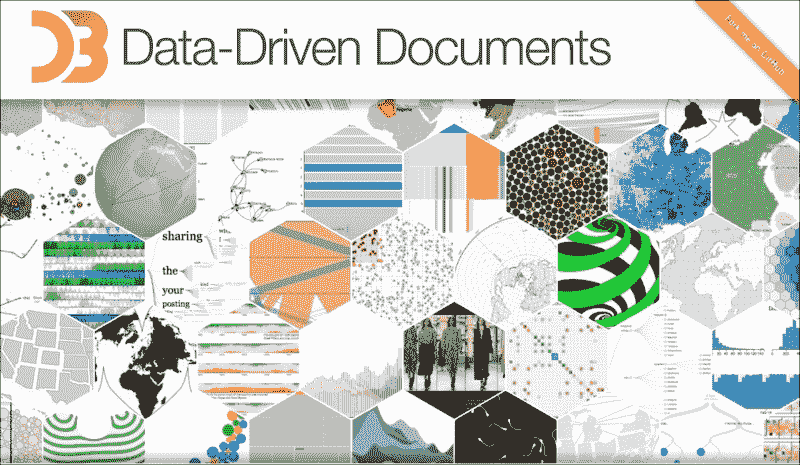
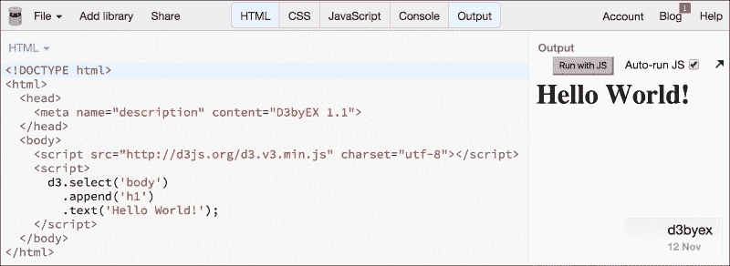
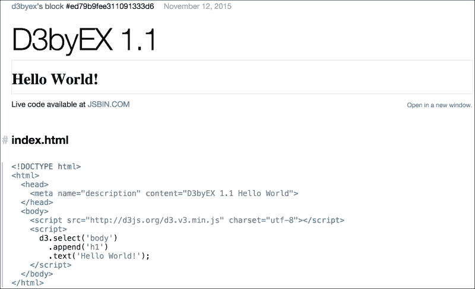
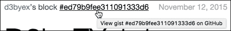
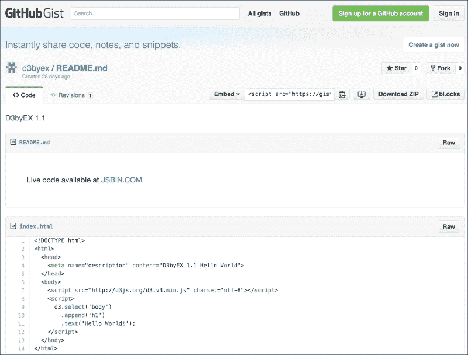
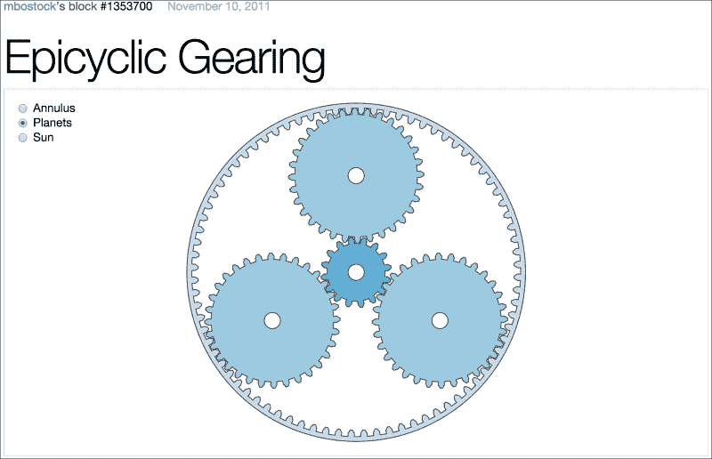
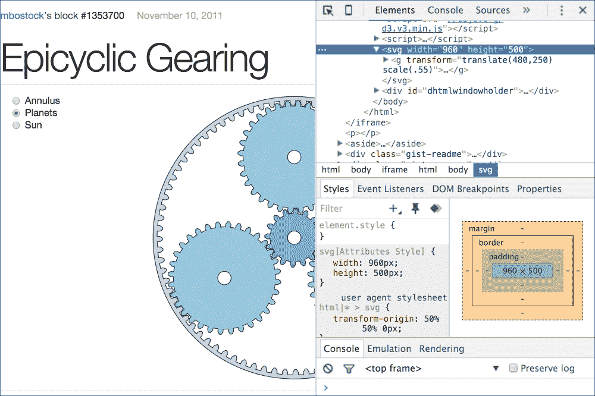
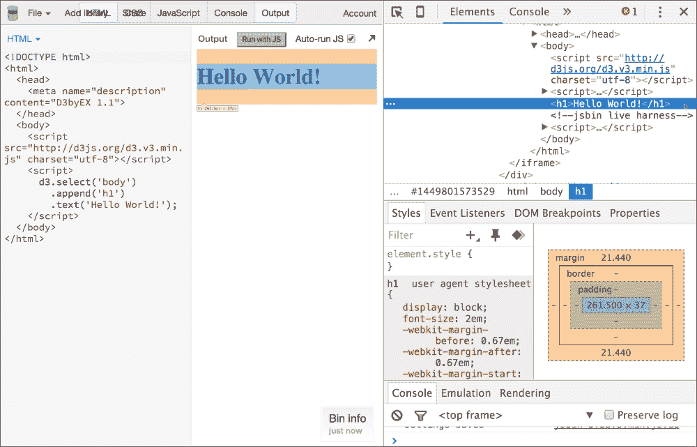
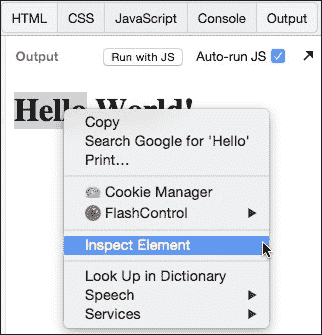
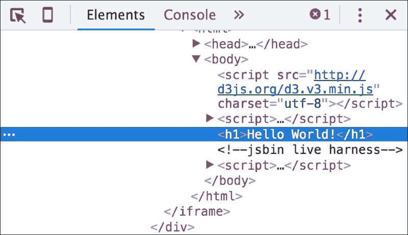

# 第一章：D3.js 入门

**D3.js** 是一个开源的 JavaScript 库，它提供了基于数据操作 HTML 文档的功能，使用 JavaScript 作为实现数据到文档映射的语言。因此，名称 **D3** （**D**ata **D**riven **D**ocuments）。许多人认为 D3.js 是一个数据可视化库。这可能正确，但 D3.js 为用户提供的不仅仅是可视化，例如：

+   在 HTML DOM 中高效选择项目。

+   数据与视觉元素绑定。

+   处理数据项添加和删除的规范。

+   动态样式化 DOM 元素的能力。

+   定义用户与数据之间的交互模型。

+   根据数据动态变化指定数据可视化之间的过渡。

+   D3.js 帮助您使用 **HTML**、**SVG** 和 **CSS** 使数据生动起来。它关注数据，数据呈现给用户的方式，数据变化时可视化方式的改变，以及用户通过可视化与数据交互的方式。

我们即将开始一段精彩的探索之旅，通过创建丰富的 D3.js 数据可视化，并专注于基于实际案例的项目式 D3.js 学习。我们将从基本概念开始，然后通过各种创建动态数据可视化的 D3.js 示例进行学习。

在本章中，我们将简要介绍 D3.js 中的几个概念，创建一个最小的 D3.js 应用程序，并检查您可以使用来构建 D3.js 应用程序的一些工具。

具体来说，在本章中，我们将涵盖以下主题：

+   D3.js 简要概述

+   D3.js 的关键设计特性，包括选择、数据管理、交互、动画和模块

+   D3.js 开发工具简介，助您快速上手

+   使用 D3.js 的简单 Hello World 程序

+   使用 Google Chrome 开发者工具检查 D3.js 生成的 DOM

# D3.js 简要概述

D3.js 是一个基于数据的 JavaScript 库，用于操作 DOM 对象。通过使用 D3.js 和现代浏览器（特别是那些可以显示和操作 SVG 的浏览器），您可以创建丰富的数据可视化。这些可视化不仅可视化数据，还可以包括描述，根据数据的变化向用户显示不同的内容，以及用户如何与代表数据的视觉元素进行交互。

### 备注

您可以在 [`d3js.org`](http://d3js.org) 获取 D3.js。



D3.js 与其他数据可视化框架（如 **Processing** ([`processing.org/`](https://processing.org/))）不同，因为它提供了一个基于数据的特定领域语言来转换 DOM，而像 Processing 这样的工具则提供了一个更底层的直接渲染模型。D3.js 允许你描述数据可视化的方式，而不是编写所有具体的细节来绘制视觉化的像素。这通过允许 D3.js 根据 SVG 和 CSS 的标准来处理数据渲染的细节，简化了可视化创建的过程。

D3.js 的一个基本概念是能够轻松地在网页文档中操作 DOM。这通常是一个复杂的问题，许多框架（如 **jQuery**）被创建来执行这项任务。D3.js 提供了与 jQuery 相似的功能，对于那些熟悉 jQuery 的人来说，D3.js 的许多内容都会感到熟悉。

但 D3.js 在提供类似 jQuery 等库的功能的基础上进行了扩展，以提供更声明式的 DOM 修改方式，用于根据数据结构创建视觉元素，而不是仅仅作为一个低级 DOM 操作的框架。

这很重要，因为数据可视化不仅需要简单地修改 DOM 的能力；它还应该描述当数据被修改时 DOM 应该如何改变，包括用户与代表数据的视觉元素交互时 DOM 的变化方式。

### 注意

我们在这本书中不会涵盖 jQuery。我们的重点将纯粹是如何使用 D3.js 提供的设施来操作 DOM。我们将使用 D3.js 构造来应用样式，而不是依赖于 CSS。所有这些都是为了展示如何使用 D3.js 的设施，而不是用其他工具隐藏任何部分。

我们将详细探讨 D3.js 中的许多概念，但让我们首先提及 D3.js 中一些值得注意的高层次想法。

## 选择

D3.js 中的核心操作是 **选择**，它是从文档中查询得到的 DOM 元素的一个过滤集合。当数据发生变化（即，它被加载或修改）时，D3.js 会根据数据变化的方式改变选择过滤器的结果。因此，视觉表示也会随之改变。

D3.js 使用 W3C 选择器 API ([`www.w3.org/TR/selectors-api/`](http://www.w3.org/TR/selectors-api/)) 来识别 DOM 中的项目。这是一个由谓词组成的迷你语言，可以按标签、类、ID、属性、包含、相邻等 DOM 的多个方面过滤 DOM 元素。谓词也可以进行交集或并集操作，从而得到丰富且简洁的元素选择。

选择是通过 D3.js 的全局命名空间 `d3` 实现的，它提供了 `d3.select()` 和 `d3.selectAll()` 函数。这些函数使用迷你语言，并分别返回与指定匹配的第一个或所有项目。使用这些选择的成果，D3.js 提供了通过称为 **数据绑定** 的过程，根据您的数据修改这些元素的能力。

## 数据和数据绑定

D3.js 中的数据是 **绑定** 到 DOM 元素上的。通过 **绑定**，D3.js 跟踪一组对象及其属性，并根据您指定的规则，根据该数据修改文档的 DOM。这种绑定是通过 D3.js 提供的各种运算符来执行的，这些运算符可以轻松地用来描述数据的视觉表示映射。在此阶段，我们将介绍数据绑定的三个阶段，并在 第二章 中更详细地探讨这个过程，*选择和数据绑定*。

D3.js 中的绑定过程包括三个阶段：**进入**、**更新**和**退出**。当第一次使用 D3.js 进行选择时，您可以指定要绑定并需要进入的数据。您还可以指定每个阶段要执行的代码。

当数据首次加入选择时，需要在 DOM 中为每个数据项创建新的视觉元素。这是通过调用 `.enter()` 函数启动的进入过程来完成的。在 `.enter()` 函数之后指定的代码将用于指定每个和每个视觉表示的数据，D3.js 将使用此代码自动生成所需的 DOM，而不是您需要详细编写所有代码。

当应用程序修改这些绑定数据时，我们将重复执行选择。D3.js 将记录现有的视觉元素及其绑定数据，并允许我们根据数据的变化对视觉元素进行修改。

如果删除数据项，我们可以在选择中使用 D3.js 的 `.exit()` 函数来通知 D3.js 从显示中移除视觉元素。通常，这是通过告诉 D3.js 移除相关的 DOM 元素来完成的，但我们也可以执行动画来向用户展示视觉元素是如何变化的，而不是突然改变显示。

如果我们创建一个没有显式引用 `.enter()` 或 `.exit()` 的选择，我们是在通知 D3.js 我们想要对已经绑定到数据上的视觉元素进行可能的修改。这给了我们检查每个数据项属性并指导 D3.js 适当更改绑定视觉元素的机会。

这种将进入、更新和退出过程分离的做法，使得对视觉元素生命周期的控制非常精确。这些状态允许你在数据内部变化或通过用户交互变化时更新视觉元素。它还赋予你为三个状态中的每一个提供良好定义的过渡或动画的能力，这对于动态数据可视化至关重要，它不仅展示了数据的静态状态，还展示了数据如何通过运动变化。

## 交互和动画

D3.js 提供了基于数据变化或用户创建的事件（如鼠标事件）来动画化视觉元素的功能。这些操作通过将`.on()`函数作为选择的一部分与 DOM 事件集成来执行。

D3.js 的事件处理器与 jQuery 提供的事件处理器类似。然而，它们不仅调用一个函数，还向函数暴露绑定数据项，如果你愿意，还可以暴露数据项在集合中的索引。这使我们免于编写基于鼠标位置等查找数据项的代码，从而极大地简化了我们的代码。

此外，通过集成进入、更新和退出选择过程，我们可以在这些场景中声明式地编写场景过渡。这些过渡暴露了选择的`style`和`attr`运算符。我们对这些属性所做的任何更改都会被 D3.js 注意到，然后它将应用**插值器**，在给定的时间内将属性值从上一个值过渡到新值。

通过使用插值，我们可以避免在动画的每个步骤中重复编写视觉属性（如位置和颜色）值的更改代码。D3.js 会为我们自动完成所有这些操作！

此外，D3.js 自动管理动画和过渡的调度。这消除了你需要管理复杂的并发问题，并保证了每个元素对资源的独占访问，同时通过 D3.js 管理的共享计时器实现了高度优化的动画。

## 模块

D3.js 提供了一系列预构建的功能模块，帮助我们编写创建丰富和交互式数据可视化所需的大部分代码。这些模块在 D3.js 中根据提供给程序员的特性被分组到多个生成的类别中。

+   **形状**: 形状模块为我们提供了众多预构建的视觉元素，包括但不限于线条、弧线、区域和散点图符号。通过使用 D3.js 的形状，我们可以简单地添加几何渲染到可视化中，而无需担心逐个详细绘制，像素像素地绘制。

+   **比例尺**：本模块为我们提供了一种将数据值转换为浏览器内坐标的方法。它们通过提供现成的转换，使我们免于编写重复的、复杂的、常常是容易出错的代码。它们还提供了生成轴视觉的基础，再次节省了我们渲染复杂视觉的大量工作。

+   **布局**：布局模块为我们提供了轻松（如果不是自动）计算可视化中元素之间视觉关系的工具。这通常是数据可视化中最复杂的一部分，D3.js 为我们提供了许多预构建的层次结构和物理布局，使我们的编程生活变得更加简单。

+   **行为**：本模块提供了常见用户交互模式的实现。一个例子是选择行为，它实现了监听视觉元素上的鼠标事件，并改变项目的展示方式以表示用户已选择它。

+   **数据处理模块**：D3.js 还包括各种数据处理实用工具，如 nest 和 cross 操作符，以及用于 CSV、JSON、TSV 等格式的数据解析器，以及用于日期和数字格式的数据。

我们将在各自的章节中详细讨论这些模块。

# 创建和共享 D3.js 可视化的工具

D3.js 应用程序可以使用许多，如果不是任何，网络开发工具来构建。工具的选择通常取决于个人开发者，因为每个平台（.Net、Node.JS、Ruby on Rails 等）都提供了自己的（以及许多第三方）工具。

本书将不会指定编辑器，而是通常会将您引导到所有代码的在线和功能示例，并留给读者在自己的开发环境中重现它们。

本书中的示例将使用 **Js Bin** ([`jsbin.com/`](http://jsbin.com/)) 和 **bl.ocks.org** ([`bl.ocks.org/`](http://bl.ocks.org/)) 的组合来提供，我们将使用 Google Chrome 开发者工具来检查示例中的 DOM。因此，对每个工具的简要介绍都是值得的，因为本书中的每个示例都将链接到 bl.ocks.org 上的一个示例，该示例本身将包含一个链接到 Js Bin 中的代码，以便您可以动态地与之互动。

## Js Bin

Js Bin ([`jsbin.com/`](http://jsbin.com/)) 是一个网站，充当浏览器内简单 JavaScript 应用程序的快速创建和共享的开发工具。它提供了许多功能，包括保存和共享 HTML 和 JavaScript、编辑时的实时 UI 更新，以及将您的代码和数据推送到 GitHub 的非常酷的能力。

### 注意

GitHub 是一个免费的代码共享和源代码管理工具。如果您不熟悉它，请访问 [`www.github.com`](http://www.github.com)。

我认为 Js Bin 提供了使用 D3.js 快速开始编码的最少摩擦方式。你只需访问网站，开始编辑 HTML、CSS 或 JavaScript，并在浏览器窗格中键入时查看结果。无需安装任何开发工具或 Web 服务器！

作为 Js Bin 的示例，以下链接将带你到我们的第一个示例，即完全用 HTML 编写的经典 Hello World 应用程序。[`jsbin.com/zimeqe/edit?html,output`](http://jsbin.com/zimeqe/edit?html,output)。



### 注意

目前不必担心这个演示中嵌入在 HTML 中的代码。我们将在本章后面更复杂的示例中再次查看这个示例。

上一张截图显示了一个 bin，它是 HTML、CSS 和 JavaScript 的组合，存储在 Js Bin 的服务器上。Js Bin 用户界面为 HTML、CSS、JavaScript、控制台和 bin 中代码的 HTML 输出提供了多个标签页/窗格。当选择**自动运行 JS**时，任何代码的交互式更改都会重新生成输出。

这使得 Js Bin 非常适合交互式演示和创建 D3.js 可视化。

## bl.ocks.org

bl.ocks.org ([`bl.ocks.org`](http://bl.ocks.org)) 是一个用于放置在 GitHub 上的 D3.js 代码示例的服务，GitHub 是一个免费的开源代码和分享仓库，以实体形式存在，称为 gist。gist 只是由 GitHub 管理的可重用和可共享的代码片段之一。它们是记住和分享小型代码示例的绝佳方式。

bl.ocks.org 是由 D3.js 的原始创建者 Mike Bostock 创建的。只要 gist 本身是 D3.js 代码，它就能使用 gist 创建出色的 D3.js 可视化。网络上的许多（如果不是大多数）D3.js 示例都是以 bl.ocks.org 上的示例形式呈现的，本书将遵循这种模式。

为了演示，请打开[`bl.ocks.org/d3byex/ed79b9fee311091333d6`](http://bl.ocks.org/d3byex/ed79b9fee311091333d6)，这将带你到 bl.ock.org 版本的**Hello World**示例。打开链接将显示以下内容。



这个 bl.ock 遵循本书中将要使用的模式。每个示例都将位于自己的 bl.ocks.org 中，并包括标题、正在运行的 D3.js 代码、Js Bin 上实时代码的链接，以及示例中使用的 HTML 和任何数据。

在页面的最顶部，有一个你可以点击的链接，它也会带你到 GitHub 上的 gist。



上一张截图中显示的链接将带你到[`gist.github.com/d3byex/ed79b9fee311091333d6`](https://gist.github.com/d3byex/ed79b9fee311091333d6)上的页面。



这段代码与 Js Bin 上的代码不同，它不是动态的，但你可以点击**下载 Zip**按钮，并将 gist 中的所有文件作为一个 ZIP 文件下载到你的系统中。

# Google Chrome 和开发者工具

D3.js 应用可以在任何数量的工具中开发。在这本书中，我们将使用 Google Chrome 作为浏览器，并使用其内置的开发工具。您也可以使用 Firefox 或 Internet Explorer 以及它们各自的开发插件。从理论上讲，所有示例都将在这三个浏览器中运行得完全相同，但仅在 Google Chrome 中进行了测试。

您可以通过 Chrome 设置按钮访问开发者工具，或者使用键组合 *option* + *command* + *I*（在 Mac 上）或 *Ctrl* + *Shift* + *I*（在 Windows 上）。在 Windows 平台上按下 *F12* 按钮也会带您进入 Chrome 开发者工具。

以下截图展示了在 [`bl.ocks.org/mbostock/1353700`](http://bl.ocks.org/mbostock/1353700) 的 **Epicyclic Gearing** bl.ock 上打开的 Google Chrome 开发者工具。



在打开开发者工具时，您将看到一个在浏览器中打开的面板，该面板显示页面内容的详细信息。



在这种情况下，面板在右侧打开（您可以配置其打开的位置），并显示带有页面主要 SVG 元素的页面 HTML，并突出显示该元素。在 HTML 中选择节点时，工具将突出显示网页中的该元素，并显示该元素的选择详情，在这种情况下，是样式。我们将在 第二章，*选择和数据绑定* 中使用这些工具来演示 D3.js 如何将数据绑定到 DOM 元素，并在后面的章节中了解这一点。

# Hello World – D3.js 风格

现在，让我们通过一个示例来应用本章学到的知识，看看我们如何使用 D3.js 修改 DOM。示例将与我们在上一节中看到的相同；我们将逐步分析它以了解其功能。

以下是该应用程序的完整 HTML 代码：

```js
<!DOCTYPE html>
<html>
  <head>
    <meta name="description" content="D3byEX 1.1>
  </head>
  <body>
    <script src="img/d3.v3.min.js" 
            charset="utf-8"></script>
    <script>
      d3.select('body')
        .append('h1')
        .text('Hello World!');
    </script>
  </body>
</html>
```

### 注意

bl.ock (1.1): [`goo.gl/7KkIuC`](http://goo.gl/7KkIuC)

代码使用 `h1` 标签向文档的 `body` 标签中添加一个一级标题。然后，`h1` 标签的内容被设置为文本 `Hello World`。正如我们之前看到的，浏览器中的输出看起来如下截图所示：


该应用程序有两个主要部分，我们几乎在每一个示例中都会看到这两个部分。第一部分包括对 D3.js 脚本的引用，该脚本通过以下代码放置在 `<body>` 标签内执行：

```js
<script src="img/d3.v3.min.js" 
           charset="utf-8"></script>
```

这直接从 D3.js ([`d3js.org/`](http://d3js.org/)) 网站引用了压缩的 D3.js 文件。您也可以复制此文件并将其放置在您的 Web 服务器或 Web 项目中。由于本书中的所有示例都是在线的，我们将始终使用此 URL。

注意，我们还需要指定`charset="utf-8"`。对于大多数 JavaScript 库来说，这通常不是必需的，但 D3.js 是 UTF-8 编码的，如果不包含这个属性可能会引起问题。所以，请确保不要忘记这个属性。

本例中的实际 D3.js 代码由以下三个函数组成，这些函数放置在文档主体内的另一个`<script>`标签中。

```js
d3.select('body')
  .append('h1')
  .text('Hello World!');
```

让我们来看看这是如何将文本放入网页中的。

```js
d3.select('body')
```

所有 D3.js 语句都将从使用`d3`命名空间开始。这是我们开始访问所有 D3.js 函数的根。在这行代码中，我们调用`.select()`函数，传递其`body`参数。这是告诉 D3.js 找到文档中的第一个`body`元素并将其返回给我们，以便对其进行其他操作。

`.select()`函数返回一个代表 body DOM 对象的 D3.js 对象。我们可以立即调用`.append('h1')`在文档的 body 中添加标题元素。

`.append()`函数返回另一个 D3.js 对象，但这个对象代表新的`h1` DOM 元素。所以我们只需要进行一个**链式**调用：`.text('Hello World!')`，我们的代码就完成了。

以这种方式调用函数的过程在 D3.js 术语中被称为**链式操作**，在编程语言中通常被称为**流畅 API**。这种链式操作就是前面提到的迷你语言。每个链式调用的 D3.js 函数进一步指定操作，使您能够非常容易地通过链式方法调用描述您想要如何修改 DOM。

对于没有使用流畅语法经验的那些人来说，这有时会感觉有些奇怪，但一旦习惯了，我保证你会看到使用这种语法的原因。正如我们将通过所涵盖的示例看到的那样，这为我们提供了一种非常简洁的方法，可以声明性地指导 D3.js 我们想要在可视化中实现的内容。

### 注意

对于熟悉 jQuery 的人来说，这种语法看起来很熟悉。等效的代码可以用 JQuery 写成`$('body').append('h1').text('Hello World');`

但正如我们将在更复杂的示例中看到的那样，D3.js 提供的功能将给我们提供比 jQuery 更多的能力来创建数据可视化。

# 检查 D3.js 生成的 DOM

现在，让我们快速查看由这段代码创建的 DOM 结构，使用 Chrome 开发者工具。按照本章前面给出的说明打开开发者工具。我更喜欢将其显示在页面右侧，本书将遵循这一惯例。



由于这个示例（以及本书中的所有示例）都在 Js Bin 中托管，因此自动生成并注入到我们页面中的 HTML 内容有很多。要找到与我们的代码生成的文本对应的元素，你可以在浏览器中的资源管理器中钻取 DOM。否则，你可以在浏览器输出面板中的元素上右键单击，并选择**检查元素**，如以下屏幕截图所示：



然后你可以直接跳转到开发者工具中的元素。



在前面的屏幕截图中，我们可以直观地验证 `<body>` 标签中添加了一个新的 `<h1>` 标签，其文本正如我们所期望的那样。

# 摘要

在本章中，我们探讨了 D3.js 中的几个高级概念：选择、数据、交互和动画，以及模块。然后我们简要介绍了可以用来构建 D3.js 应用程序的一些工具，这些工具将在本书后续的示例中使用：Js Bin、bl.ocks.org、Google Chrome 和 Google Chrome 开发者工具。我们以一个非常简单的示例结束本章，该示例演示了如何将 D3.js 包含到你的应用程序中，并执行一个简单的选择操作，将内容插入到网页中。

在下一章中，我们将扩展选择的概念，并使用它将数据绑定到 DOM 中的视觉元素。我们将扩展 D3.js 的使用，以创建和修改 DIV 元素。在第三章 *使用 SVG 创建视觉元素*中，我们将通过使用 D3.js 来操作 SVG 来深入了解 D3.js 的真正威力。
