# 第三章：使用 SVG 创建可视化

在本章中，我们将学习关于**可缩放矢量图形**（Scalable Vector Graphics），通常简称为**SVG**。SVG 是一种网络标准，用于在浏览器中创建基于矢量的图形。我们将从几个直接在浏览器中编码 SVG 的基本示例开始本章，最后检查如何使用 D3 根据数据创建 SVG 元素。

在本章中，我们将涵盖以下主题：

+   SVG、坐标和属性的简要介绍

+   一个简单的 SVG 示例，绘制圆形

+   使用基本形状：椭圆、矩形、线条和路径

+   CSS 与 SVG 和 D3.js 的关系

+   使用描边、线帽和虚线

+   基本变换：旋转、平移和缩放

+   对 SVG 元素进行分组并统一应用变换

+   SVG 元素的透明度和分层

# 介绍 SVG

到目前为止，我们使用 D3 在 DOM 中创建新的 DIV 元素。虽然可以使用 D3 和 DIV 创建许多优秀的可视化，但 D3 真正的表现力在于用它来创建和操作 SVG 元素。

SVG 是一种 XML 标记语言，它被设计用来表达非常丰富的 2D 可视化。SVG 可以利用计算机的图形处理器来加速渲染，并且也针对用户交互和动画进行了优化。

SVG 不是直接操作屏幕上的像素，而是使用矢量来构建展示模型，然后代表你将其转换为像素。这使得与 HTML5 Canvas 等其他网络技术相比，可视化编码变得更加简单。

由于图像以矢量表示形式存储，因此模型的可视化可以缩放。这是因为所有视觉元素都可以轻松地缩放（无论是放大还是缩小），而不会因为缩放而产生视觉伪影。

SVG 有一个便利之处，即其语言可以直接在支持 SVG 的浏览器中的 HTML 中使用。D3 提供了对 SVG 的直接支持和操作，这感觉就像使用 D3 操作 DOM 一样。

## SVG 坐标系

SVG 的坐标系以 SVG 元素的左上角为原点，即(**0,0**)；*x*的值向右增加，而*y*的值向下增加。这在计算机图形系统中很常见，但对于习惯于以原点在左下或正中心的数学图形的人来说，有时可能会感到困惑。

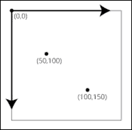

## SVG 属性

SVG 虽然能够与 HTML 无缝集成，但它并不是 HTML。具体来说，属性和样式可能以不同的方式运作。一个例子是，大多数 HTML 元素都有宽度和高度元素，但并非所有 SVG 元素都使用这些属性。

关于 SVG 的第二个重要点是，元素的位置是通过属性设置的。因此，无法使用样式设置 SVG 元素的位置。此外，要更改 SVG 元素的位置，例如在动画中，需要编写设置元素定位属性的代码。

## 使用 SVG 绘制圆

我们通过使用 SVG 标签并在该标签内放置 SVG 元素，在 HTML 中使用 SVG。以下是一个非常简单的例子，它创建了三个圆：

```js
<svg width="720" height="120">
    <circle cx="40" cy="20" r="10"></circle>
    <circle cx="80" cy="40" r="15"></circle>
    <circle cx="120" cy="60" r="20"></circle>
</svg>
```

这将在浏览器中产生以下图像：

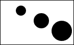

### 注意

bl.ock (3.1): [`goo.gl/UMCLtl`](http://goo.gl/UMCLtl)

SVG 元素本身在页面上不可见，仅提供子标签的容器。在这本书中，我们将始终明确设置 SVG 标签的宽度和高度。在这个例子中，它被设置为宽度 `720` 像素，高度 `120` 像素。

在 SVG 元素内定位圆是通过指定圆的中心 `x` 和 `y` 值来完成的。此位置相对于 SVG 元素的左上角，正 `x` 值从原点向右移动，正 `y` 值向下移动。圆的大小由 `r` 属性指定，该属性表示圆的半径。

这个例子没有指定这些圆的颜色，因此圆的默认颜色是黑色。大多数 SVG 元素通过使用 CSS 样式属性来指定颜色，然后设置样式的 `fill` 属性。

例如，以下代码给三个圆赋予了不同的颜色（红色、绿色和蓝色）：

```js
<svg width="720" height="120">
  <circle cx="40" cy="20" r="10" style="fill:red"></circle>
  <circle cx="80" cy="40" r="15" style="fill:green"></circle>
  <circle cx="120" cy="60" r="20" style="fill:blue"></circle>
</svg>
```

这将产生以下输出：

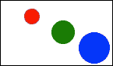

### 注意

bl.ock (3.2): [`goo.gl/2k1ZIm`](http://goo.gl/2k1ZIm)

D3 选择与 SVG 元素的工作方式与 DOM 元素相同。作为一个快速示例，以下代码选择所选 `svg` 标签内的所有圆，并将它们的颜色设置为统一的 `teal` 颜色。

```js
<svg width="720" height="120">
  <circle cx="40" cy="20" r="10" style="fill:red"></circle>
  <circle cx="80" cy="40" r="15" style="fill:green"></circle>
  <circle cx="120" cy="60" r="20" style="fill:blue"></circle>
</svg>
<script>
  d3.selectAll('circle').style('fill', 'teal');
</script>
```

这将在浏览器中产生以下输出：

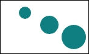

### 注意

bl.ock (3.3): [`goo.gl/bszmEf`](http://goo.gl/bszmEf)

# SVG 提供的基本形状

在完成了一些初步介绍之后，现在让我们来探讨本书中我们将经常使用的各种 SVG 形状。我们已经看到了如何创建一个圆；现在让我们看看其他一些形状。

## 椭圆

圆是椭圆的一种特殊情况，其 *x* 和 *y* 半径相同。椭圆可以有不同大小的半径，并且通常有不同的半径大小。椭圆在 SVG 中使用 `<ellipse>` 标签指定。我们仍然使用 `cx` 和 `cy` 属性来定位椭圆，但不是使用 `r` 作为半径，而是使用两个属性 `rx` 和 `ry` 来指定 x 和 y 方向上的半径：

```js
<ellipse cx="50" cy="30" rx="40" ry="20" />
```

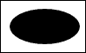

### 注意

bl.ock (3.4): [`goo.gl/05QCnG`](http://goo.gl/05QCnG)

## 矩形

矩形使用 `<rect>` 标签指定。左上角使用 `x` 和 `y` 属性指定。`width` 和 `height` 属性分别指定矩形的相应大小：

```js
<rect x="10" y="10" width="150" height="100"></rect>
```

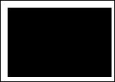

### 注意

bl.ock (3.5): [`goo.gl/b3w1Rq`](http://goo.gl/b3w1Rq)

## 行

使用 SVG 可以通过 `<line>` 标签绘制线条。一条线至少需要指定四个属性，通常使用五个。前两个属性 `x1` 和 `y1` 指定线的起始位置。另外两个属性 `x2` 和 `y2` 指定线的终点。最后一个属性，尽管不是必需的，是 `stroke`，它指定用于绘制线的颜色。通常，我们必须指定描边才能看到线。这里我们将其设置为 `black`。

```js
<line x1="10" y1="10" x2="100" y2="100" stroke="black" />
```

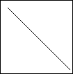

### 注意

bl.ock (3.6): [`goo.gl/4qZejC`](http://goo.gl/4qZejC)

## 路径

路径是 SVG 中最强大的绘图结构之一。它们提供了一个符号概念，可以用来创建许多几何形状。路径可以是圆形和矩形等形状。路径还允许用户使用控制点创建曲线。

路径的绘制是通过指定一个属性 `d` 来控制的，该属性传递一个字符串，该字符串指定了将要执行的绘制命令。

路径的基本概念是你可以绘制一系列直线或曲线，然后可以选择填充形状内部的空隙。例如，以下命令创建了一个用黑色填充的三角形：

```js
<path d="M 10 10 L 310 20 L 160 110 Z"/>
```

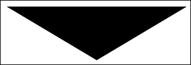

### 注意

bl.ock (3.7): [`goo.gl/kCTbv7`](http://goo.gl/kCTbv7)

一个路径通常从一个 `M` 命令开始，该命令从指定位置开始绘制，在这个例子中是 (`10, 10`)。下一个命令 `L 310 10` 从上一个点绘制到 (`310, 10`)。下一个命令 `L 160 10` 然后从 (`310, 10`) 绘制到 (`160, 10`)。最后的命令是 `Z`，它告诉 SVG 形状是封闭的。本质上，这通知 SVG 在命令字符串中存在一个到第一个位置的隐式线，在这个例子中是 (`10, 10`)。

### 注意

注意我们没有指定填充或描边颜色。在路径中，这些默认为黑色。

路径的迷你语言相当强大，因此也相当复杂。以下表格列出了其他一些常见的路径命令：

| 命令 | 目的 |
| --- | --- |
| `M` | 移动到 |
| `L` | 线到 |
| `H` | 水平线到 |
| `V` | 垂直线到 |
| `C` | 曲线到 |
| `Q` | 二次贝塞尔曲线到 |
| `T` | 平滑二次贝塞尔曲线到 |
| `A` | 椭圆弧 |
| `Z` | 关闭路径 |

D3 提供了多个工具来简化路径的使用，与手动使用字符串字面量指定相比，这些工具使得路径的使用更加简单。我们将在本章后面详细探讨这些工具。

## 文本

`<text>` SVG 标签允许我们在 SVG 元素内放置文本。在 SVG 中放置文本的方式与 HTML 中的方式不同。SVG 文本项使用矢量图形绘制，而不是进行光栅化。因此，SVG 中渲染的文本比使用 HTML 渲染的光栅化文本更灵活。使用 SVG 渲染的字母曲线保持平滑，而不是在应用整个图形的缩放级别时变得像素化。

文本使用 `x` 和 `y` 属性进行定位，这些属性指定文本的基线位于 `y`，文本左对齐到 `x`，文本的底部基线（字母主要部分的底部部分，不包括下划线）位于文本左侧是定位的锚点。

如下所示，它还设置了字体家族、大小和填充颜色。实际要显示的文本设置为标签的内文本内容：

```js
<text x="10" y="20" 
      fill="Red" font-family="arial" font-size="16">
  Content of the SVG text
</text>
```

这将在 SVG 元素的左上角渲染以下内容：


### 注意

bl.ock (3.8): [`goo.gl/f89tZX`](http://goo.gl/f89tZX)

# 将 CSS 样式应用于 SVG 元素

SVG 元素可以像 HTML 元素一样进行样式化。可以使用具有 ID 和类属性的相同 CSS 来将样式应用于 SVG 元素，或者您可以直接使用 style 属性并指定 CSS 作为其内容。然而，HTML 中许多实际的样式在 SVG 中是不同的。例如，SVG 使用 `fill` 来填充矩形，而 HTML 会使用背景来填充代表矩形的 `div` 标签。

在这本书中，我们将尽量避免使用 CSS，并使用 D3.js 提供的函数显式地编写样式属性。但是，网络上的许多示例确实使用了 CSS 与 SVG 的组合，因此简要提及是有价值的。

以下示例演示了如何使用 CSS 样式化 SVG。该示例使用两种样式来设置几个矩形的填充。第一种样式将使所有矩形默认为红色。第二种样式定义了一个样式，使所有具有 ID `willBeGreen` 的矩形填充为绿色。然后示例创建了三个矩形：前两个使用 CSS 样式，第三个使用在 `attributeset` 样式属性中作为填充的 CSS 将其设置为蓝色。

### 注意

bl.ock (3.9): [`goo.gl/KAnc6j`](http://goo.gl/KAnc6j)

样本中定义的样式如下：

```js
<style>
    svg rect { fill: red; }
    svg rect#willBeGreen { fill: green; }
</style>
```

矩形的创建方式如下：

```js
<rect x="10" y="10" width="50" height="50" />
<rect x="70" y="10" width="50" height="50" id="willBeGreen" />
<rect x="130" y="10" width="50" height="50" style="fill:blue" />
```

结果输出将如图所示：

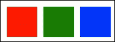

# 描边、端点和虚线

SVG 形状有一个名为 `stroke` 的属性。`stroke` 属性指定了勾勒 SVG 形状的线条的颜色。我们看到了线条中使用 stroke 的用法，但它可以与大多数 SVG 元素一起使用。

每当我们指定 `stroke` 时，我们通常也会使用 `stroke-width` 属性指定一个描边宽度。这会告知 SVG 关于将要渲染的轮廓的厚度（以像素为单位）。

为了演示`stroke`和`stroke-width`属性，以下示例重新创建了路径示例中的路径，并将笔触设置为`10`像素粗，使用`red`作为其颜色。此外，我们还设置了路径的`fill`为`blue`。我们使用`stroke`的`style`属性设置了所有这些属性：

```js
<path d="M 10 10 L 210 10 L 110 120 z"
      style="fill:blue;stroke:red;stroke-width:5" />
```

上述示例的结果如下所示：

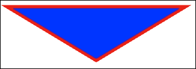

### 注意

bl.ock (3.10): [`goo.gl/dMjdUX`](http://goo.gl/dMjdUX)

如我们之前看到的，我们可以在线条上设置笔触。它也可以设置其`stroke-width`。让我们通过将我们的线条示例的线条厚度设置为`20`并将颜色设置为`green`来检查这一点：

```js
<line x1="10" y1="10" x2="110" y2="110" 
      stroke="green" stroke-width="20" />
```


### 注意

bl.ock (3.11): [`goo.gl/p880dC`](http://goo.gl/p880dC)

注意这条线实际上看起来像一个矩形。这是因为线条有一个名为`stroke-linecap`的属性，它描述了线条末端的形状，称为线帽。

此值的默认值为`butt`，它给我们提供了 90 度锐利的角落。其他可以使用的值还有`square`或`round`。以下示例演示了具有所有这些不同的`stroke-linecap`值的相同线条：

```js
<line x1="10" y1="20" x2="110" y2="100"
        stroke="red" stroke-width="20" stroke-linecap="butt" />
<line x1="60" y1="20" x2="160" y2="100"
      stroke="green" stroke-width="20" stroke-linecap="square" />
<line x1="110" y1="20" x2="210" y2="100"
      stroke="blue" stroke-width="20" stroke-linecap="round" />
<path d="M 10 20 L 110 100 M 60 20 L 160 100 M 110 20 L 210 100"
        stroke="white" />
```

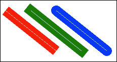

### 注意

bl.ock (3.12): [`goo.gl/Xcaz41`](http://goo.gl/Xcaz41)

注意到对于这三条线中的每一条，我们都画了一条`stroke-width`为`20`的线，然后在每条线内，我们使用单个路径和三个移动和线条命令画了一条白色线。白色线有助于区分线端帽对线条的影响。

首先检查红色线。其末端与白色线的末端齐平。将其与绿色线进行对比。在这条线中，线帽，尽管仍然是方形的，但延伸到白色线之外，宽度与笔触相同。蓝色线，具有圆形线帽，使用半径为`stroke-width`一半的半圆绘制。

默认情况下，SVG 线条是实心的，但也可以使用虚线创建，通过使用`stroke-dasharray`属性来指定。此属性给出一个整数值的列表，该列表指定了线段宽度的重复模式，第一个从`stroke`颜色开始，并交替与空空间：

```js
<line x1="10" y1="20" x2="110" y2="120"
        stroke="red" stroke-width="5"
        stroke-dasharray="5,5" />
<line x1="60" y1="20" x2="160" y2="120"
        stroke="green" stroke-width="5"
        stroke-dasharray="10,10" />
<line x1="110" y1="20" x2="210" y2="120"
        stroke="blue" stroke-width="5"
        stroke-dasharray="20,10,5,5,5" />
```

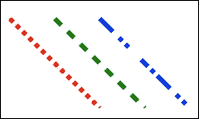

### 注意

bl.ock (3.13): [`goo.gl/VyBBwy`](http://goo.gl/VyBBwy)

# 应用 SVG 变换

SVG 中的**S**代表**可缩放**，而**V**代表**矢量**。这两个是名称中的两个重要部分。这使得我们能够在渲染 SVG 形状之前应用各种变换。

每个 SVG 形状都由一个或多个矢量表示，其中 SVG 中的矢量是坐标系中从原点到(*x, y*)距离的元组。例如，矩形将由四个二维矢量表示，每个角一个。

在创建图形可视化时，这种使用向量对数据进行建模的方法有几个优点。其中之一是我们可以为该形状定义一个围绕坐标系统的形状。以这种方式建模允许我们复制该形状，但可以在更大的图像中的不同位置放置它们，旋转它们，缩放它们，并执行许多其他操作，这些操作超出了本文的范围。

其次，这些变换是在渲染到屏幕上的像素之前应用于模型的。正因为如此，SVG 可以确保无论对图像应用何种缩放级别，它都不会出现像素化。

变换中的另一个重要概念是它们可以按链式和任何顺序应用。这在线性代数中是一个极其强大的概念，可以创建视觉的复合模型。

### 注意

变换及其顺序对 SVG 渲染结果的影响有很多。不幸的是，对这些的解释超出了本书的范围，但当我们对示例产生影响时，我们将根据特定示例来检查它们。

在本节中，以及本书中的其他示例中，我们将使用 SVG 提供的三个通用类型的变换：`translate`、`rotate` 和 `scale`。可以通过使用 `transform` 属性将变换应用于 SVG 元素。

为了演示变换，我们将查看几个示例，将每个变换应用于矩形，以了解它们如何影响矩形的最终渲染效果。

## Rotate

我们将要考察的第一个变换是旋转。我们可以使用 `.rotate(x)` 通过指定度数来旋转 SVG 对象，其中 `x` 指定了旋转元素的角度。

为了演示这一点，以下示例将我们的矩形旋转 45 度。一个简单的由两条线组成的轴被渲染出来，作为平移的参考框架。这将被包含在这个代码片段中，但为了简洁起见，不包括在其他示例中：

```js
<line x1="0" y1="150" x2="0" y2="0" stroke="black" />
<line x1="0" y1="0" x2="150" y2="0" stroke="black" />
<rect x="0" y="0 " width="100" height="100" fill="red"
      transform="rotate(45)" />
```

前面的代码片段给出了以下结果：

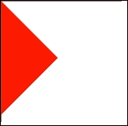

### 注意

bl.ock (3.14): [`goo.gl/vLCeHD`](http://goo.gl/vLCeHD)

这并不是我们可能期望的效果。这是因为矩形的旋转是围绕其左上角进行的。为了使其看起来是围绕中心旋转的，我们需要使用一个接受三个参数的 `rotate()` 的替代形式：旋转角度，然后是矩形左上角到一个代表矩形中心的点的偏移量：

```js
<rect x="0" y="0" width="100" height="100" fill="red"
      transform="rotate(45,50,50)" />
```

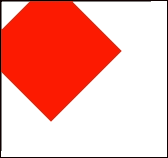

### 注意

bl.ock (3.15): [`goo.gl/ujF3iY`](http://goo.gl/ujF3iY)

矩形现在已经围绕其中心旋转，但有几个角落被裁剪到包含 SVG 元素的边界之外。我们将在下一节讨论平移时修复这个问题。

## Translate

SVG 元素可以通过使用**变换**在其包含元素内重新定位。变换是通过`translate()`函数执行的。`translate()`接受两个值：`x`和`y`方向上的距离以及重新定位元素在父元素内的距离。

以下示例将绘制我们的矩形，并将其向右和向下平移 30 像素：

```js
<rect x="0" y="0 " width="100" height="100" fill="red"
      transform="translate(30,30)" />
```

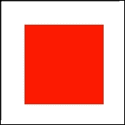

### 注意

bl.ock (3.16): [`goo.gl/jANiXU`](http://goo.gl/jANiXU)

现在，让我们回顾一下最后一个旋转示例，其中矩形的两个角被裁剪了。我们可以通过在旋转之前指定矩形的平移来修复这个问题，将其向右和向下移动 30 像素：

```js
<rect x="0" y="0" width="100" height="100" fill="red"
        transform="translate(30,30) rotate(45,50,50)" />
```

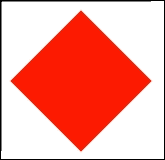

### 注意

bl.ock (3.17): [`goo.gl/W6MeSc`](http://goo.gl/W6MeSc)

这也演示了在单个字符串中应用多个变换。你可以以这种方式连续应用多个变换来处理复杂建模场景。

### 注意

关于平移变换的一个常见问题是为什么不直接更改*x*和*y*属性来定位元素，而不是使用变换？

这个问题的答案可能非常复杂，并且有多个原因。首先，并不是所有的 SVG 元素都是通过*x*和*y*属性定位的，例如，一个圆，它是通过其*cx*和*cy*属性定位的。因此，没有一组一致的属性用于定位。因此，使用平移变换可以让我们无论元素类型如何，都能有一个统一的定位方式。

另一个原因是，在应用多个变换时，不容易（或不可能）访问*x*和*y*属性。此外，通过各种变换，SVG 元素的实际位置可能不会直接与另一个坐标系中指定的像素或点匹配，该坐标系使用*x*和*y*属性。

## 缩放

缩放对象会根据给定的百分比在*x*和*y*轴上改变其视觉大小。缩放是通过`scale()`函数实现的。它可以均匀地应用到每个轴上，或者你也可以为每个轴指定不同的缩放值。

以下示例演示了缩放。我们将绘制两个矩形，一个叠在另一个上面。底部的矩形将是蓝色，上面的矩形是红色。然后红色将被缩放到其大小的 50%：

```js
<rect x="0" y="0" width="100" height="100" fill="blue"/>
<rect x="0" y="0" width="100" height="100" fill="red"
      transform="scale(0.5)" />
```

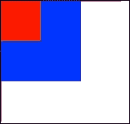

### 注意

bl.ock (3.18): [`goo.gl/fCAhg7`](http://goo.gl/fCAhg7)

# 分组

SVG 元素可以使用`<g>`标签进行分组。对组应用任何变换都会应用到组中的每个元素。这对于仅对特定组的项目应用整体变换来说很方便。

以下示例演示了将一组项目（带文本的蓝色矩形）的转换以及组变换如何影响这些项目。请注意，`绿色`矩形不受影响，因为它不是转换的一部分：

```js
<g transform="translate(100,30) rotate(45 50 50)">
  <rect x="0" y="0" width="100" height="100" style="fill:blue" />
  <text x="15" y="58" fill="White" font-family="arial" 
        font-size="16">
        In the box
    </text>
</g>
```

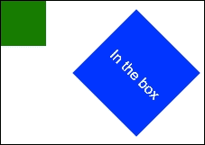

### 注意

bl.ock (3.19): [`goo.gl/FY6q4D`](http://goo.gl/FY6q4D)

注意，文本在矩形顶部的位置相对于组的左上角，而不是 SVG 元素。这对于确保文本相对于蓝色矩形正确旋转非常重要。

# 透明度

SVG 支持绘制透明元素。这可以通过设置 `opacity` 属性或在使用 `rgba (红-绿-蓝-透明度)` 值来指定颜色时完成。

以下示例渲染了三种不同颜色的圆圈，它们的透明度都是 50%。前两个使用不透明度属性，第三个使用透明颜色规范进行填充。

```js
<circle cx="150" cy="150" r="100" 
        style="fill:red" opacity="0.5" />
<circle cx="250" cy="150" r="100" 
        style="fill:green" opacity="0.5" />
<circle cx="200" cy="250" r="100" 
        style="fill:rgba(0, 0, 255, 0.5)" />
```

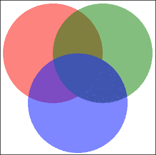

### 注意

bl.ock (3.20): [`goo.gl/xRzArg`](http://goo.gl/xRzArg)

# 层

你可能已经注意到 SVG 元素以特定的顺序重叠，某些元素看起来更接近并遮挡了后面的元素。让我们通过一个将三个圆圈重叠在一起的示例来检查这一点：

```js
<circle cx="150" cy="150" r="100" style="fill:red" />
<circle cx="250" cy="150" r="100" style="fill:green" />
<circle cx="200" cy="250" r="100" style="fill:blue" />
```

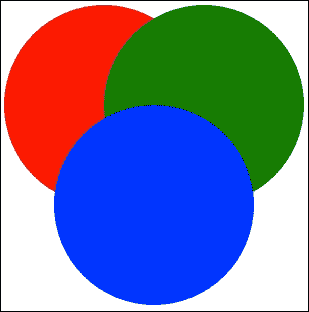

### 注意

bl.ock (3.21): [`goo.gl/hO4xmc`](http://goo.gl/hO4xmc)

蓝色圆圈绘制在绿色圆圈之前，绿色圆圈绘制在红色圆圈之前。这个顺序是由 SVG 标记中指定的顺序定义的，每个后续元素都是在上一个元素之上渲染的。

### 注意

如果你使用过其他图形包或 UI 工具，你会知道它们通常提供了一个称为 Z-顺序的概念，其中 *Z* 是一个伪维度，元素的绘制顺序是从最低到最高的 Z-顺序。SVG 不提供这种功能，但我们在后面的章节中将会看到，我们可以在布局之前对选择进行排序来解决这个问题。

# 摘要

在本章中，你学习了如何使用 SVG 创建各种形状，如何使用 SVG 坐标来布局 SVG 元素，以及层如何影响渲染。你还学习了在 SVG 元素上执行变换，这在本书的示例中将被频繁使用，并成为使用 D3 创建视觉元素的基本部分。

在下一章中，我们将回到 D3.js 的焦点，特别是我们将利用本章学到的 SVG 知识，使用 D3 和 SVG 元素创建数据驱动的条形图。
