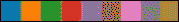
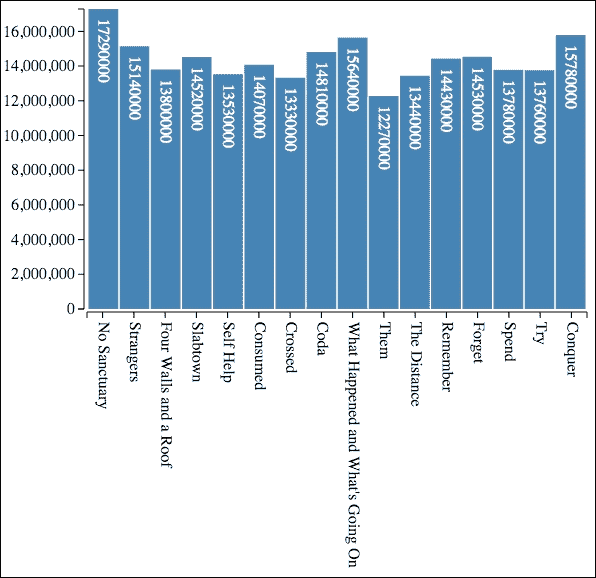

# 第五章。使用数据和尺度

在第四章中，*创建条形图*，你学习了如何创建基于在应用程序中静态编码的整数序列的条形图。尽管生成的图表看起来相当不错，但在数据提供和渲染的方式上存在几个问题。

问题是数据是硬编码在应用程序中的。几乎无一例外，我们将从外部源加载数据。D3.js 提供了一套丰富的功能，可以从网络上的不同格式的源加载数据。在本章中，你将学习如何使用 D3.js 从网络以 JSON、CSV 和 TSV 格式加载数据。

在上一章给出的示例中，数据存在第二个问题是它只是一个整数的数组。数据通常会被表示为具有多个属性的对象集合，其中许多属性我们不需要用于我们的可视化。它们也经常被表示为字符串而不是数值。在本章中，你将学习如何选择你想要的数据并将其转换为所需的数据类型。

在我们之前的条形图中，还有一个问题是假设数据中表示的值与可视化中的像素有直接映射。这通常不是情况，我们需要将数据缩放到浏览器中渲染的大小。这可以通过使用尺度轻松实现，我们已经相对于坐标轴进行了考察，现在我们将它们应用于数据。

在上一个示例中，最后一个问题是我们的代码是手动计算条的大小和位置的。条形图在 D3.js 应用程序中很常见，并且有内置的函数可以自动为我们完成这项工作。我们将考察如何使用这些函数来简化我们的代码。

因此，让我们开始吧。在本章中，我们将具体涵盖以下主题：

+   从网络加载 JSON、TSV 或 CSV 格式的数据

+   使用`.map()`函数从对象中提取字段

+   将字符串值转换为它们的代表数值数据类型

+   使用线性尺度转换连续值

+   使用序数尺度映射离散数据

+   使用带区计算条的大小和位置

+   将我们迄今为止学到的知识应用于创建使用真实数据的丰富条形图

# 数据

数据是创建数据可视化的核心。在 D3 中创建的几乎每个视觉元素都需要绑定到一些数据上。这些数据可以来自多个来源。它可以明确地编码在可视化中，从外部源加载，或者由其他数据的操作或计算结果而来。

用于创建 D3.js 可视化的数据大多是从文件、网络服务或 URL 获取的。这些数据通常以 JSON、XML、**CSV**（逗号分隔值）和 **TSV**（制表符分隔值）等多种格式之一存在。我们需要将这些格式的数据转换为 JavaScript 对象，而 D3.js 提供了方便的函数来完成这项工作。

## 使用 D3.js 加载数据

D3.js 提供了多个辅助函数，可以从浏览器外部加载数据，并将其同时转换为 JavaScript 对象。你可能遇到的最常见的几种数据格式，我们也将涉及，包括：

+   JSON

+   TSV

+   CSV

### 注意

你可能已经注意到，在我们的示例中，我排除了 XML。D3.js 确实有加载 XML 的函数，但与 JSON、TSV 和 CSV 不同，加载的结果不会自动转换为 JavaScript 对象，需要使用 JavaScript XML/DOM 功能进行额外的操作。由于大多数你目前会遇到的情况都将由这三种格式处理，如果不仅仅是 JSON，而 JSON 已经成为网络几乎无处不在的数据格式，因此 XML 将不在此文本的范围内。

为了演示处理所有这些数据格式，我们将检查一个数据集，我将其整理并放置在 GitHub 上，该数据集代表了 AMC 电视剧《行尸走肉》第五季的观众收视率。

### 注意

这个 GitHub 是手动使用 [`en.wikipedia.org/wiki/The_Walking_Dead_(season_5)`](https://en.wikipedia.org/wiki/The_Walking_Dead_(season_5)) 上的数据构建的。

### 加载 JSON 数据

**JavaScript 对象表示法**（**JSON**）格式的数据便于转换为 JavaScript 对象。它是一个非常灵活的格式，支持命名属性以及层次化数据。

本例的 JSON 数据存储在 GitHub 上，可在 [`gist.githubusercontent.com/d3byex/e5ce6526ba2208014379/raw/8fefb14cc18f0440dc00248f23cbf6aec80dcc13/walking_dead_s5.json`](https://gist.githubusercontent.com/d3byex/e5ce6526ba2208014379/raw/8fefb14cc18f0440dc00248f23cbf6aec80dcc13/walking_dead_s5.json) 找到。

### 注意

URL 稍显复杂。你可以直接访问包含此数据三个版本的 gist [`goo.gl/OfD1hc`](https://goo.gl/OfD1hc)。

点击链接将在浏览器中显示数据。此文件包含一个 JavaScript 对象数组，每个对象都有六个属性，代表该节目的单个剧集。前两个对象如下：

```js
[
{
  "Season": 5,
  "Episode":  1,
  "SeriesNumber": 52,
  "Title": "No Sanctuary",
  "FirstAirDate": "10-12-2014",
  "USViewers": 17290000
},
{
  "Season": 5,
  "Episode":  2,
  "SeriesNumber": 53,
  "Title": "Strangers",
  "FirstAirDate": "10-19-2014",
  "USViewers": 15140000
},
…
]
```

可以使用 `d3.json()` 函数将此数据加载到我们的 D3.js 应用程序中。这个函数，像 D3.js 中的许多其他函数一样，是异步执行的。它接受两个参数：要加载的数据的 URL，以及当数据加载完成时被调用的回调函数。

以下示例演示了加载数据并显示数组中的第一个项目。

### 注意

bl.ock (5.1): [`goo.gl/Qe63wH`](http://goo.gl/Qe63wH)

加载数据的主要代码如下：

```js
var url = "https://gist.githubusercontent.com/d3byex/e5ce6526ba2208014379/raw/8fefb14cc18f0440dc00248f23cbf6aec80dcc13/walking_dead_s5.json";
d3.json(url, function (error, data) {
    console.log(data[0]);
});
console.log("Data in D3.js is loaded asynchronously");
```

此示例没有可见的输出，但输出被写入 JavaScript 控制台：

```js
"Data in D3.js is loaded asynchronously"
[object Object] {
  Episode: 1,
  FirstAirDate: "10-12-2014",
  Season: 5,
  SeriesNumber: 52,
  Title: "No Sanctuary",
  USViewers: 17290000
}
```

注意，D3.js 中的数据加载是异步进行的。`console.log()` 调用的输出显示数据是异步加载的，并且首先执行。稍后，当数据加载完成后，我们会在第二次调用 `console.log()` 中看到输出。

回调函数本身有两个参数。第一个是一个表示错误的对象的引用。在这种情况下，该变量将非空并包含详细信息。非空表示数据已加载，并由数据变量表示。

### 加载 TSV 数据

TSV 是你在进行足够的 D3.js 编程时会遇到的一种数据类型。在 TSV 文件中，值由制表符分隔。通常，文件的第一个行是每个值的名称的制表符分隔序列。

TSV 文件比 JSON 文件更简洁，并且通常由许多非 JavaScript 基础的系统自动生成。

TSV 格式的剧集数据可在以下链接找到：[`gist.githubusercontent.com/d3byex/e5ce6526ba2208014379/raw/8fefb14cc18f0440dc00248f23cbf6aec80dcc13/walking_dead_s5.tsv`](https://gist.githubusercontent.com/d3byex/e5ce6526ba2208014379/raw/8fefb14cc18f0440dc00248f23cbf6aec80dcc13/walking_dead_s5.tsv).

点击链接，你将在浏览器中看到以下内容：

```js
Season Episode SeriesNumber Title FirstAirDate USViewers
5 1 52 No Sanctuary 10-12-2014 17290000
5 2 53 Strangers 10-19-2014 15140000 
5 3 54 Four Walls and a Roof 10-26-2014 13800000
5 4 55 Slabtown 11-02-2014 14520000
5 5 56 Self Help 11-09-2014 13530000
5 6 57 Consumed 11-16-2014 14070000
5 7 58 Crossed 11-23-2014 13330000
5 8 59 Coda 11-30-2014 14810000
5 9 60 What Happened and What's Going On 02-08-2015 15640000
5 10 61 Them 02-15-2015 12270000
5 11 62 The Distance 02-22-2015 13440000
5 12 63 Remember 03-01-2015 14430000
5 13 64 Forget 03-08-2015 14530000
5 14 65 Spend 03-15-2015 13780000
5 15 66 Try 03-22-2015 13760000
5 16 67 Conquer 03-29-2015 15780000
```

我们可以使用 `d3.tsv()` 从此文件加载数据。以下包含示例代码：

### 注意

bl.ock (5.2): [`goo.gl/nlq8jy`](http://goo.gl/nlq8jy)

代码与 JSON 示例相同，只是 URL 和 `d3.json()` 调用不同。然而，控制台输出却是不同的。

```js
[object Object] {
  Episode: "1",
  FirstAirDate: "10-12-2014",
  Season: "5",
  SeriesNumber: "52",
  Title: "No Sanctuary",
  USViewers: "17290000"
}
```

注意，属性 **Episode**、**Season**、**SeriesNumber** 和 **USViewers** 现在是字符串类型，而不是整数类型。TSV 文件没有像 JSON 那样暗示类型的手段，所以所有内容默认为字符串。这些通常需要转换为其他类型，我们将在下一节关于映射和数据转换中探讨这一点。

### 加载 CSV 数据

CSV 格式与 TSV 类似，但字段分隔符不是制表符，而是逗号。CSV 是一种相当常见的格式，类似于电子表格应用程序的输出，常用于创建许多组织中其他应用程序消费的数据。

数据的 CSV 版本可在以下链接找到：[`gist.githubusercontent.com/d3byex/e5ce6526ba2208014379/raw/8fefb14cc18f0440dc00248f23cbf6aec80dcc13/walking_dead_s5.csv`](https://gist.githubusercontent.com/d3byex/e5ce6526ba2208014379/raw/8fefb14cc18f0440dc00248f23cbf6aec80dcc13/walking_dead_s5.csv).

打开链接，你将在浏览器中看到以下内容：

```js
Season,Episode,SeriesNumber,Title,FirstAirDate,USViewers
5,1,52,No Sanctuary,10-12-2014,17290000
5,2,53,Strangers,10-19-2014,15140000 
5,3,54,Four Walls and a Roof,10-26-2014,13800000
5,4,55,Slabtown,11-02-2014,14520000
5,5,56,Self Help,11-09-2014,13530000
5,6,57,Consumed,11-16-2014,14070000
5,7,58,Crossed,11-23-2014,13330000
5,8,59,Coda,11-30-2014,14810000
5,9,60,What Happened and What's Going On,02-08-2015,15640000
5,10,61,Them,02-15-2015,12270000
5,11,62,The Distance,02-22-2015,13440000
5,12,63,Remember,03-01-2015,14430000
5,13,64,Forget,03-08-2015,14530000
5,14,65,Spend,03-15-2015,13780000
5,15,66,Try,03-22-2015,13760000
5,16,67,Conquer,03-29-2015,15780000
```

使用 `d3.csv()` 加载前面数据的示例可在以下链接找到：

### 注意

bl.ock (5.3): [`goo.gl/JUX9CA`](http://goo.gl/JUX9CA)

结果与 TSV 示例中的结果相同，即所有字段都作为字符串加载。

## 映射字段和将字符串转换为数字

我们将使用这些数据（其 CSV 源）来渲染一个条形图，显示每个集的观众量比较。如果我们直接使用这些字段创建条形图，这些值将被错误地解释为字符串类型而不是数字，我们的结果图将是不正确的。

此外，为了创建一个显示观众量的条形图，我们不需要这些属性，可以省略 `Season`、`SeriesNumber` 和 `FirstAirDate` 字段。在这个数据集中这不是真正的问题，但有时数据可以有数百列和数十亿行，因此提取仅必要的属性以帮助节省内存将更加高效。

这些可以通过简单的 `for` 循环完成，将所需的字段复制到一个新的 JavaScript 对象中，并使用其中一个解析函数转换数据。D3.js 给我们提供了一个更好的方法，一种函数式的方法，来执行这个任务。

D3.js 为我们提供了一个 `.map()` 函数，可以在数组上使用，它将对数组的每个项目应用一个函数。这个函数返回一个 JavaScript 对象，D3.js 收集所有这些对象并将它们作为一个数组返回。这为我们提供了一种简单的方法，只需一个语句就可以选择我们想要的属性并转换数据。

要演示这一点，请打开以下链接提供的示例：

### 注意

bl.ock (5.4): [`goo.gl/ex2e8C`](http://goo.gl/ex2e8C)

代码中的重要部分是 `data.map()` 的调用：

```js
var mappedAndConverted = data.map(function(d) {
    return {
        Episode: +d.Episode,
        USViewers: +d.USViewers,
        Title: d.Title
    };
});
console.log(mappedAndConverted);
```

传递给 `.map()` 的函数为数据数组中的每个项目返回一个新的 JavaScript 对象。这个新对象仅包含三个指定的属性。这些对象都被 `.map()` 收集并存储在 `mappedAndConverted` 变量中。

以下代码显示了新数组中的前两个对象：

```js
[[object Object] {
  Episode: 1,
  Title: "No Sanctuary",
  USViewers: 17290000
}, [object Object] {
  Episode: 2,
  Title: "Strangers",
  USViewers: 15140000
},
```

注意，`Episode` 和 `USViewers` 现在是数值。这是通过应用一元 `+` 运算符实现的，它将字符串转换为适当的数值类型。

# 规模

规模是 D3.js 提供的函数，用于将一组值映射到另一组值。输入值集被称为域，输出是范围。规模存在的基本原因是防止我们编写循环，并做大量的数学运算来实现这些转换。这是一件非常有用的事情。

规模通常分为三类：定量、序数和时间尺度。在每个尺度的类别中，D3.js 提供了一系列具体的实现，用于完成特定类型的数据映射，这些数据映射对于数据可视化非常有用。

覆盖每种类型的刻度示例将占用比本书可用的空间更多，同时也会变得难以阅读。我们将考察几个常用的刻度，这有点像 80/20 规则，在这里我们涵盖的少数几个刻度将是你使用刻度时最常用的。

## 线性刻度

线性刻度是一种定量刻度，可以说是最常用的刻度之一。所执行的映射是线性的，即输出范围是通过输入域的线性函数计算得出的。

使用线性刻度的良好例子是我们*行尸走肉*观众的收视率数据。我们需要从这个数据中绘制条形图；但如果我们使用书中之前使用过的代码，我们的条形图将会非常高，因为那个代码在值和像素之间有一个一对一的映射。

假设图表上条形图区域的高度为 400 像素。我们希望将最低收视率值映射到 100 像素高的条形图，并将最高收视率值映射到 400 像素。以下示例执行此任务：

### 注意

bl.ock (5.5): [`goo.gl/dgg0zf`](http://goo.gl/dgg0zf)

代码开始，就像 CSV 示例一样，首先加载数据并映射/转换它。下一个任务是确定最小和最大收视率值：

```js
var viewership = mappedAndConverted.map(function (d) { 
     return d.USViewers; 
});
var minViewership = d3.min(viewership);
var maxViewership = d3.max(viewership);
```

接下来，我们定义几个变量来表示我们希望条形图的最小和最大高度：

```js
var minBarHeight = 100, maxBarHeight = 400;
```

刻度随后创建如下：

```js
var yScale = d3.scale
    .linear()
    .domain([minViewership, maxViewership])
    .range([minBarHeight, maxBarHeight]);
```

我们现在可以将`yScale`对象当作一个函数来使用。以下代码将记录缩放最小和最大收视率值的结果：

```js
console.log(minViewership + " -> " + yScale(minViewership));
console.log(maxViewership + " -> " + yScale(maxViewership));
```

检查控制台输出，我们可以看到缩放产生了预期的值：

```js
"12270000 -> 100"
"17290000 -> 400"
```

## 序数刻度

序数刻度在某种程度上类似于字典对象。域和范围中的值是离散的。对于每个唯一的输入值，必须在范围中有一个条目，并且该值必须映射到范围中的单个值。

有几种常见的序数刻度用法，我们将考察本书剩余部分中我们将使用的四种常见用法。

### 将颜色字符串映射到代码

打开以下链接查看序数刻度的示例。此示例不使用*行尸走肉*的数据，而是简单地演示了将表示基本颜色的字符串字面量映射到相应的颜色代码。

### 注意

bl.ock (5.6): [`goo.gl/DezcUN`](http://goo.gl/DezcUN)

刻度创建如下：

```js
var colorScale = d3.scale.ordinal()
    .domain(['red', 'green', 'blue'])
    .range(['#ff0000', '#00ff00', '#0000ff']);
```

我们现在可以将任何范围值传递给`colorScale`，如下所示：

```js
console.log(colorScale('red'),
    colorsScale('green'),
    colorScale('blue'));
```

检查控制台输出，我们可以看到映射的结果如下：

```js
"#ff0000"
"#00ff00"
"#0000ff"
```

### 将整数映射到颜色刻度

D3.js 附带了一些称为**分类**刻度的特殊内置刻度。听起来像是一个复杂的术语，但它们只是将一组整数映射到唯一的颜色（在该刻度内唯一）。

当你有一组基于 0 的整数键的数据集，并且你想为每个键使用独特的颜色，但你不想手动创建所有映射（就像我们在上一个示例中为三个字符串所做的那样）时，这些很有用。

打开以下链接，查看使用 10 种颜色分类尺度的示例：

### 注意

bl.ock (5.7): [`goo.gl/RSW9Qa`](http://goo.gl/RSW9Qa)

上述示例生成了 10 个相邻的矩形，每个矩形都从`category10()`颜色尺度中获取一个独特的颜色。当你执行这个示例时，你将在浏览器中看到这一点。



此示例首先创建一个包含从 0 到 9 的 10 个整数的数组。

```js
var data = d3.range(0, 9);
```

接下来创建尺度：

```js
var colorScale = d3.scale.category10();
```

现在我们可以将整数绑定到矩形上，并通过传递值到`colorScale`函数来设置每个矩形的填充：

```js
var svg = d3.select('body')
    .append('svg')
    .attr({width: 200, height: 20});

svg.selectAll('rect')
    .data(data)
    .enter()
    .append('rect')
    .attr({
        fill: function(d) { return colorScale(d); },
        x: function(d, i) { return i * 20 },
        width: 20,
        height: 20
    });
```

D3.js 提供了四组分类颜色尺度，可以根据你的场景使用。你可以在 D3.js 文档页面上查看它们，网址为[`github.com/mbostock/d3/wiki/Ordinal-Scales`](https://github.com/mbostock/d3/wiki/Ordinal-Scales)。

### 使用范围带的序数尺度

在第四章中，*创建条形图*，当我们绘制图表时，我们根据固定的条形大小和填充计算条形的位置。这实际上是一种非常不灵活的完成任务的方式。D3.js 为我们提供了一个特殊的尺度，我们可以使用它，给定域值和基本宽度，这将告诉我们每个条形的起始和结束值，使得所有条形都能完美地位于范围内！

让我们使用以下示例中的特殊尺度来看看：

### 注意

bl.ock (5.8): [`goo.gl/OG3g7S`](http://goo.gl/OG3g7S)

此示例创建了一个简单的序数尺度，使用`.rangeBands()`函数指定范围，而不是`.range()`。示例的整个代码如下：

```js
var bands = d3.scale.ordinal()
    .domain([0, 1, 2])
    .rangeBands([0, 100]);
console.log(bands.range()); 
console.log(bands.rangeBand());
```

`.range()`函数将返回一个数组，其中的值表示`.rangeBands()`指定的范围的等间距划分的数量的范围。在这种情况下，范围的宽度是`100`，域中指定了三个项目；因此，结果是以下内容：

```js
[0, 33.333333333333336, 66.66666666666667]
```

技术上，这个结果是表示每个带起始值的值。每个带的宽度可以通过`.rangeBand()`函数找到，在这种情况下返回以下内容：

```js
33.333333333333336
```

这个宽度可能看起来很简单。如果我们可以直接计算`.range()`结果中两个相邻值之间的差异，为什么还要有这个函数？为了演示，让我们看看这个示例的轻微修改，链接如下。

### 注意

bl.ock (5.9): [`goo.gl/JPsuqh`](http://goo.gl/JPsuqh)

这对`.rangeBands()`的调用进行了一次修改，添加了一个额外的参数，指定了条形之间应该存在的填充：

```js
var bands = d3.scale.ordinal()
    .domain([0, 1, 2])
    .rangeRoundBands([0, 100], 0.1);
```

由于在带之间添加了填充，输出略有不同：

```js
[3.2258064516129035, 35.483870967741936, 67.74193548387096]
29.032258064516128
```

每个带的宽度现在是 29.03，带之间的填充为 3.23（包括两个外带的外侧）。

填充的值是一个介于 0.0（默认值，结果为 0 填充）和 1.0 之间的值，结果为宽度为 0.0 的带。0.5 的值使填充的宽度与每个带相同。

## 可视化《行尸走肉》观众人数

现在，我们将本章的所有内容结合起来，以渲染《行尸走肉》所有剧集的观众人数条形图：

### 注意

bl.ock (5.10): [`goo.gl/T8d6OU`](http://goo.gl/T8d6OU)

前一个示例的输出如下：



现在让我们逐步了解这是如何创建的。在从 JSON 文件加载数据后，首先执行的操作是提取 `USViewership` 值并确定最大值：

```js
var viewership = data.map(function (d) {
    return d.USViewers;
});

var maxViewers = d3.max(viewership);
```

然后创建了各种变量，它们代表图表的各种度量指标，以及主要的 SVG 元素：

```js
var margin = { top: 10, right: 10, bottom: 260, left: 85 };

var graphWidth = 500, graphHeight = 300;

var totalWidth = graphWidth + margin.left + margin.right;
var totalHeight = graphHeight + margin.top + margin.bottom;

var axisPadding = 3;

var svg = d3.select('body')
    .append('svg')
    .attr({ width: totalWidth, height: totalHeight });
```

创建用于容纳条形的容器：

```js
var mainGroup = svg
    .append('g')
    .attr('transform', 'translate(' + margin.left + ',' + 
                                      margin.top + ")");
```

现在我们使用 `.rangeBands()` 创建一个用于条形的序数刻度尺。我们将使用它来计算条形的位置和填充：

```js
var bands = d3.scale.ordinal()
    .domain(viewership)
    .rangeBands([0, graphWidth], 0.05);
```

我们还需要一个刻度尺来计算每个条形的高度：

```js
var yScale = d3.scale
    .linear()
    .domain([0, maxViewers])
    .range([0, graphHeight]);
```

下面的函数用于创建条形的选取，以定位每个条形：

```js
function translator(d, i) {
    return "translate(" + bands.range()[i] + "," +
                          (graphHeight - yScale(d)) + ")";
}
```

现在我们为每个条形的内容创建组：

```js
var barGroup = mainGroup.selectAll('g')
    .data(viewership)
    .enter()
    .append('g')
    .attr('transform', translator);
```

接下来，我们添加条形的矩形：

```js
barGroup.append('rect')
    .attr({
        fill: 'steelblue',
        width: bands.rangeBand(),
        height: function(d) { return yScale(d); }
    });
```

然后在条形上添加一个标签以显示确切的观众人数值：

```js
barGroup.append('text')
    .text(function(d) { return d; })
    .style('text-anchor', 'start')
    .attr({
        dx: 10,
        dy: -10,
        transform: 'rotate(90)',
        fill: 'white'
    });
```

条形现在已完成，因此我们继续创建两个轴。我们首先从左侧轴开始：

```js
var leftAxisGroup = svg.append('g');
leftAxisGroup.attr({
    transform: 'translate(' + (margin.left - axisPadding) + ',' +
                               margin.top + ')'
});

var yAxisScale = d3.scale
    .linear()
    .domain([maxViewers, 0])
    .range([0, graphHeight]);

var leftAxis = d3.svg.axis()
    .orient('left')
    .scale(yAxisScale);
var leftAxisNodes = leftAxisGroup.call(leftAxis);
styleAxisNodes(leftAxisNodes);
```

现在创建一个底部轴，显示标题：

```js
var titles = data.map(function(d) { return d.Title; });
var bottomAxisScale = d3.scale.ordinal()
    .domain(titles)
    .rangeBands([axisPadding, graphWidth + axisPadding]);

var bottomAxis = d3.svg
    .axis()
    .scale(bottomAxisScale)
    .orient("bottom");

var bottomAxisX = margin.left - axisPadding;
var bottomAxisY = totalHeight - margin.bottom + axisPadding;

var bottomAxisGroup = svg.append("g")
    .attr({ transform: 'translate(' + bottomAxisX + ',' + bottomAxisY + ')' });

var bottomAxisNodes = bottomAxisGroup.call(bottomAxis);
styleAxisNodes(bottomAxisNodes);

bottomAxisNodes.selectAll("text")
    .style('text-anchor', 'start')
    .attr({
        dx: 10,
        dy: -5,
        transform: 'rotate(90)'
});
```

下面的函数是用于样式化轴的可重用代码：

```js
function styleAxisNodes(axisNodes) {
    axisNodes.selectAll('.domain')
        .attr({
            fill: 'none',
            'stroke-width': 1,
            stroke: 'black'
        });
    axisNodes.selectAll('.tick line')
        .attr({
            fill: 'none',
            'stroke-width': 1,
            stroke: 'black'
        });
}
```

# 摘要

在本章中，你学习了如何从网络加载数据并将其用作条形图的基础。我们从加载 JSON、CSV 和 TSV 格式的数据开始。你学习了如何使用 `.map()` 函数从这些数据中提取你需要的值，并探讨了将字符串值转换为数值值所需的问题和解决方案。

接下来，我们更详细地介绍了刻度尺，并探讨了如何使用刻度尺将数据从一个值域映射到另一个值域，以及如何将离散值，如颜色名称映射到颜色代码。我们介绍了分类刻度尺，这是一种将整数值映射到预定义颜色图的方法，以及我们将在示例中经常使用的一个概念。我们对刻度尺的考察以使用 `.rangeBands()` 的演示结束，并展示了它如何帮助我们确定预定义区域内条形的大小和位置。

我们通过将这些概念结合起来，形成了到目前为止我们生成条形图的最佳示例来结束本章。这展示了加载数据、使用数据轴和轴的多个刻度尺，以及使用 `.rangeBands()` 确定条形位置，以及不仅使用垂直轴还使用水平轴。

在下一章中，我们将从条形图扩展到另一种数据可视化类型——散点图（和气泡图）。
