# 第八章：添加用户交互

优秀的可视化不仅提供漂亮的图片和动画；它们允许用户与数据交互，赋予他们通过给定静态展示可能不明显的数据含义进行探索的能力。

优秀的交互允许用户在大量信息中找到自己的路径。它允许他们浏览单个显示无法容纳的数据，深入总结信息，并且可以放大以获得更高层次的视图——本质上，它允许用户从树木中看到森林。

同样非常有价值的是允许用户轻松选择、重新排序和重新定位视觉元素的能力。通过这些操作，用户可以通过鼠标悬停或触摸简单地查看数据的详细信息，重新排列项目以揭示其他见解，并且还可以看到数据在重新排序时的移动情况。这为用户提供了一种恒定的感觉，并显示了当需要重新排列时数据如何变化。

在本章中，我们将探讨为您的 D3.js 可视化添加交互性的多种技术。我们将探讨使用鼠标突出显示信息、提供上下文信息、平移和缩放您的可视化以及使用刷选来选择和缩放信息视图的概念。

具体来说，在本章中我们将学习以下主题：

+   钩入 D3.js 可视化上的鼠标事件

+   点击和响应鼠标事件

+   构建多个视觉动画模型以提供交互反馈

+   处理鼠标悬停以在特定视觉上提供详细信息

+   创建对鼠标事件做出响应的流畅动画

+   刷选及其在数据选择中的应用

+   实现用于查看股票数据的上下文焦点交互模式

# 处理鼠标事件

鼠标是用户与 D3.js 可视化交互最常用的设备。触摸在平板电脑的情况下常用，在许多情况下，触摸事件可以映射到鼠标事件。在本章中，我们将专注于鼠标。但我们涵盖的大部分内容也适用于触摸。D3.js 还可以轻松支持触摸设备上的触摸概念，如捏合。

要在 D3.js 中处理鼠标事件，我们为希望处理事件的 SVG 元素附加事件监听器。使用`.on()`函数添加处理程序，该函数接受事件名称和当鼠标事件发生时要调用的函数作为参数。

我们将探讨处理四个鼠标事件：`mousemove`、`mouseenter`、`mouseout`和`click`。

## 使用 mousemove 跟踪鼠标位置

鼠标在 SVG 可视化上的移动通过监听`mousemove`事件报告给您的代码。以下示例演示了跟踪和报告鼠标位置：

### 注意

bl.ock (8.1): [`goo.gl/VK67C4`](http://goo.gl/VK67C4)

```js
var svg = d3.select('body')
    .append('svg')
    .attr({
        width: 450,
        height: 450
    });
var label = svg.append('text')
    .attr('x', 10)
    .attr('y', 30);

svg.on('mousemove', function () {
    var position = d3.mouse(svg.node());
    label.text('X=' + position[0] + ' , Y=' + position[1]);
});
```

我们使用 `.on()` 监听 `mousemove` 事件，在事件触发时传递它，并更新 SVG 文本元素中的文本内容：

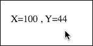

鼠标的位置不会作为参数传递给函数。为了获取实际的鼠标位置，我们需要调用 `d3.mouse()` 函数，并将其传递给 `svg.node()` 的返回值。然后该函数计算鼠标相对于鼠标正在移动的 SVG 元素的 *X* 和 *Y* 位置。

## 捕获鼠标进入和退出 SVG 元素

使用相应的 `mouseenter` 和 `mouseout` 事件捕获鼠标进入和退出特定 SVG 元素。以下示例通过创建几个圆并改变鼠标在圆区域内（也称为 **悬停**）时的颜色来展示这一点。

### 注意

bl.ock (8.2): [`goo.gl/4cfrdq`](http://goo.gl/4cfrdq)

此代码创建了三个不同大小的圆（半径分别为 `30`、`20` 和 `40` 像素）：

```js
var data = [30, 20, 40],
```

通过挂钩到这两个事件来跟踪鼠标的进入和退出：

```js
    .on('mouseenter', function() {
        d3.select(this).attr('fill', 'red');
    })
    .on('mouseout', function() {
        d3.select(this).attr('fill', 'steelblue');
    });
```

当你运行此示例时，你会看到三个大小略有不同的 `steelblue` 圆圈，并且当你将鼠标悬停在任何一个上面时，它会变成 `red`：

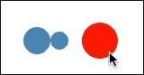

注意，当前鼠标正在进入或退出的 SVG 元素不会传递给函数，因此我们需要使用 `d3.select(this)` 来检索它们。

## 让用户知道他们已经点击了鼠标

当用户在鼠标上点击按钮时，可以使用 `mouseclick` 事件跟踪被点击的鼠标。以下链接中的代码演示了处理点击事件处理器：

### 注意

bl.ock (8.3): [`goo.gl/91rt4S`](http://goo.gl/91rt4S)

此代码向示例 *8.2* 中的代码添加了一个事件处理器，以捕获点击事件并弹出一个显示数据值及其在集合中位置的警告框：

```js
.on('click', function(d, i) {
    alert(d + ' ' + i);
});
```

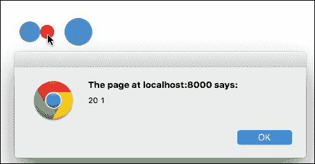

这非常方便，因为你可以得到你点击的视觉背后的数据。无需保留视觉到数据的映射，只需查找即可。

# 使用行为来拖动、平移和缩放

鼠标事件通常需要组合起来创建更复杂的交互，如拖动、平移和缩放。通常，这需要大量的代码来跟踪 `mouseenter`、`mousemove` 和 `mouseexit` 事件的序列。

D3.js 通过使用 **行为** 提供了一种更好的方式来实现这些交互。这些行为是通过 D3.js 本身处理鼠标事件的一组复杂的 DOM/SVG 交互。在某种程度上，行为在移动平台上的手势识别器功能上作用相似。

D3.js 目前提供了两种内置的行为：

+   **拖动**：这跟踪相对于原点的鼠标或多点触控移动

+   **Zoom**: 在拖动或捏合时，此功能会发出缩放和平移事件

让我们考察一个实现拖动的示例，以及另一个也添加了平移和缩放功能的示例。

## 拖动

拖动是交互式可视化中的一种常见行为，允许用户通过鼠标或触摸移动视觉元素。以下示例演示了使用拖动行为：

### 注意

bl.ock (8.4): [`goo.gl/wxn6iN`](http://goo.gl/wxn6iN)

上述示例渲染了四个圆圈，并允许您使用鼠标在 SVG 区域内移动它们，但同时也限制了移动，以确保圆圈完全位于 SVG 元素的视觉区域内：

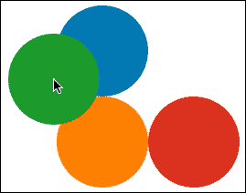

代码首先计算圆圈的位置，并使用选择进行渲染。然后，使用以下代码实现拖动行为：

```js
var dragBehavior = d3.behavior.drag()
                              .on('drag', onDrag);
circles.call(dragBehavior);

function onDrag(d) {
    var x = d3.event.x,
        y = d3.event.y;
    if ((x >= radius) && (x <= width - radius) &&
        (y >= radius) && (y <= height - radius)) {
        d3.select(this)
            .attr('transform', function () {
                return 'translate(' + x + ', ' + y + ')';
            });
    }
}
```

该行为是通过使用 `d3.behavior.drag()` 创建的。然后，此对象要求我们告知它我们感兴趣的是监听 `drag` 事件。您还可以指定 `dragstart` 和 `dragged` 事件的处理器，以识别拖动行为的开始和完成。

接下来，我们需要通知 D3.js 将行为连接到 SVG 元素。这是通过在选择上使用 `.call()` 函数来完成的。正如我们在渲染坐标轴时看到的，我们指定的函数将由 D3.js 在渲染每个选定项目时调用。在这种情况下，这将是我们拖动行为，因此，此函数的实现可以为我们执行所有必要的拖动 SVG 元素的事件处理。

当用户拖动相关 SVG 元素时，我们的拖动行为事件处理程序就会被调用。此函数首先从 `d3.event` 对象中检索正在拖动的项目的新的 `x` 和 `y` 位置。这些值在调用此函数之前由 D3.js 计算并设置。

目前所需的所有操作只是为相应的 SVG 元素设置一个新的变换，将其移动到新位置。此示例还检查圆圈是否仍然完全位于 SVG 元素内，并且只有在该条件为 `true` 时才设置新位置。

## 平移和缩放

平移和缩放是数据可视化中的两种常见技术。平移允许用户将整个视觉在屏幕上拖动。这可以揭示原本在视觉区域外渲染的视觉。平移的一个常见场景是将地图拖动以显示之前不可见的区域。

缩放允许您放大或缩小用户与视觉之间的感知距离。这可以用来放大小物品，或者缩放以查看太大或超出视觉显示范围的物品。

平移和缩放都通过相同的 D3.js 行为 `d3.behavior.zoom()` 实现。以下示例演示了其用法：

### 注意

bl.ock (8.5): [`goo.gl/tEY0hm`](http://goo.gl/tEY0hm)

当运行此示例时，您不仅可以拖动圆圈，还可以拖动背景以同时移动所有圆圈（平移）并使用鼠标滚轮进行缩放：

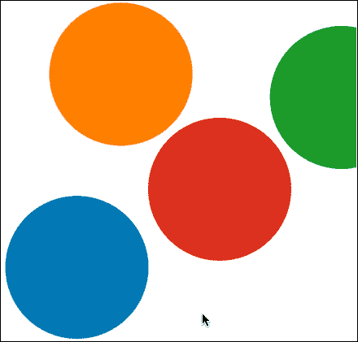

为了添加这些附加功能，对之前的示例进行了一些小的修改。这些修改从声明缩放行为开始：

```js
var zoomBehavior = d3.behavior.zoom()
    .scaleExtent([0.1, 10])
    .on('zoom', onZoom);
```

初始缩放级别为`1.0`。调用`to .scaleExtent()`通知行为，它应该缩小到`0.1`，即原始尺寸的十分之一，并放大到`10`，即原始尺寸的 10 倍。此外，当发生缩放事件时，行为应调用`onZoom()`函数。

现在我们创建主 SVG 元素，并使用`.call()`将其缩放行为附加到它：

```js
var svg = d3.select('body')
    .append('svg')
    .attr({
        width: width,
        height: height
    })
    .call(zoomBehavior)
    .append('g');
```

代码还向 SVG 元素添加了一个组元素，然后`svg`变量就引用了这个组。平移和缩放事件通过顶级 SVG 元素路由到我们的处理器，然后处理器设置此组上的平移和缩放因子，因此对圆圈产生效果。

现在我们只需要实现`zoomIt`函数：

```js
function onZoom() {
    svg.attr('transform', 'translate(' + d3.event.translate + 
              ')' + 'scale(' + d3.event.scale + ')');
}
```

在行为调用此函数之前，它将`d3.event.translate`变量设置为表示整个视觉应该发生的平移范围。

`d3.event.scale`变量也由 D3.js 设置，以表示适当的缩放级别。在此示例中，这个范围从 0.1 到 10。

另一个小改动是在声明拖动行为的方式上。

```js
var dragBehavior = d3.behavior.drag()
    .on("drag", onDrag)
    .on("dragstart", function() {
        d3.event.sourceEvent.stopPropagation();
    });
```

这样做是因为如果以这种方式修改，示例将出现问题。如果保持原样，平移和缩放行为以及拖动行为将相互冲突。当拖动圆圈时，`svg`元素也会平移，而它应该保持在原位。

通过处理`dragstart`事件并调用`d3.event.sourceEvent.stopPropagation()`，我们防止了在圆圈上的鼠标事件向上冒泡到`svg`元素并开始平移。问题解决！

# 增强条形图的交互性

现在让我们将我们关于鼠标事件处理所学的知识应用到创建交互式条形图。条形图上的鼠标事件可以为与图表交互的人提供有用的上下文信息。

示例数据将使用早期章节中使用的预期寿命与生育率数据集的简化版。此数据集仅使用拉丁美洲和加勒比海经济区域的数据，这些区域大约包含 35 个国家，数据年份为 2013 年。

示例中的条形图将代表长寿，顶部将标注国家代码，并垂直排列的文本表示实际的长寿值和完整的国家名称。示例将省略坐标轴和边距以保持简单。

此示例的代码和实时示例可在以下位置找到：

### 注意

bl.ock (8.6): [`goo.gl/8jb9Rn`](http://goo.gl/8jb9Rn)

当鼠标移到条形图上时，这种交互模式可以用来视觉上强调特定的条形。我们之前在应用于圆的`mouseenter`和`mouseout`事件中看到了这一点。这里，我们将用它来突出条形：

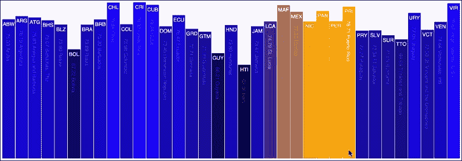

创建表示条形的矩形使用以下代码：

```js
svg.selectAll('rect')
    .data(data)
    .enter()
    .append('rect')
    .attr({
        width: barWidth,
        height: 0,
        y: height
    })
```

在创建条形图之后，代码将`mouseover`和`mouseout`事件连接起来。`mouseover`事件使垂直文本完全不透明，并将条形图颜色设置为橙色：

```js
    .on('mouseover', function (d) {
        d3.select('text.vert#' + d.CountryCode)
          .style('opacity', maxOpacity);
        d3.select(this).attr('fill', 'orange');
    })
```

`mouseout`事件动画化并设置文本不透明度回到原始值，并开始动画将颜色恢复到原始色调。这个动画在移动到条形图上时给出了鼠标轨迹的视觉效果：

```js
    .on('mouseout', function (d) {
        d3.select('text.vert#' + d.CountryCode)
          .style('opacity', minOpacity);
        d3.select(this)
          .transition()
          .duration(returnToColorDuration)
          .attr('fill', 'rgb(0, 0, ' + 
                         Math.floor(colorScale(d.LifeExp)) + ')');
    })
```

创建条形图的最后部分执行动画，使条形图增长并从黑色过渡到图形加载的最终颜色：

```js
    .transition()
    .duration(barGrowDuration)
    .attr({
        height: function (d) { return yScale(d.LifeExp); },
        x: function (d, i) { return xScale(i); },
        y: function (d) {
            return height - yScale(d.LifeExp);
        },
        fill: function (d) {
            return 'rgb(0, 0, ' + 
                   Math.floor(colorScale(d.LifeExp)) + ')';
        }
    });
```

为了增强底层信息的展示，我们将在每个条形上放置两份数据：国家代码作为顶部水平文本，以及显示数据实际值和国家全名的垂直文本。以下代码创建水平文本：

```js
svg.selectAll('text')
    .data(data)
    .enter()
    .append('text')
    .text(function (d) { return d.CountryCode; })
    .attr({
        x: function (d, i) { return xScale(i) + barWidth / 2; },
        y: height,
        fill: 'white',
        'text-anchor': 'middle',
        'font-family': 'sans-serif',
        'font-size': '11px'
    })
    .transition()
    .duration(barGrowDuration)
    .attr('y', function (d) { 
                      return height - yScale(d.LifeExp) + 
                                      horzTextOffsetY; });
```

垂直文本由以下代码创建：

```js
svg.selectAll('text.vert')
    .data(data)
    .enter()
    .append('text')
    .text(function (d) { return d.LifeExp.toFixed(2) + ' ' +
                                d.CountryName; })
    .attr({
        id: function (d) { return d.CountryCode; },
        opacity: minOpacity,
        transform: function (d, i) {
            var x = xScale(i) + halfBarWidth – 
                    verticalTextOffsetX;
            var y = height - yScale(d.LifeExp) + 
                    verticalTextOffsetY;
            return 'translate(' + x + ',' + y + ')rotate(90)';
        },
        'class': 'vert',
        'font-family': 'sans-serif',
        'font-size': 11,
        'fill': 'white'
    });
```

# 使用画笔突出显示选定的项目

D3.js 中的**画笔**提供了用户通过允许使用鼠标选择一个或多个视觉元素（以及相关的数据项）与你的可视化进行交互的能力。

这是在探索性数据分析与可视化中的一个非常重要的概念，因为它允许用户轻松地钻入和钻出数据或选择特定的数据项进行进一步分析。

D3.js 中的画笔非常灵活，你如何实现它取决于你向用户展示的视觉化的类型。我们将查看几个画笔的示例，然后实现一个真实示例，让我们可以使用画笔来检查股票数据。

## 画笔的在线示例

要理解画笔，让我们首先看看互联网上的一些画笔示例。这些都是你可以去玩玩的网络上的示例。

以下画笔显示了使用矩形选择来选择画笔内部的数据的方法([`bl.ocks.org/mbostock/4343214`](http://bl.ocks.org/mbostock/4343214))：

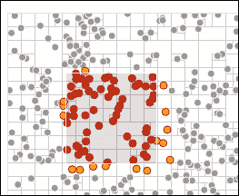

这种画笔的另一个例子是[`bl.ocks.org/mbostock/4063663`](http://bl.ocks.org/mbostock/4063663)上的散点图矩阵画笔。这个例子值得注意的是你可以选择任何散点图上的点。然后应用程序会选择其他所有图上的点，以便在这些图上突出显示数据：

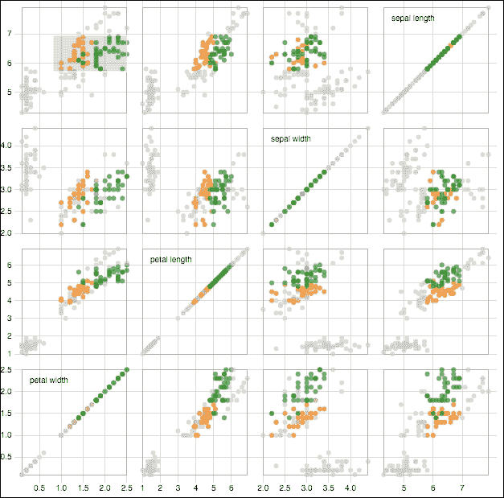

以下示例演示了如何使用画笔在力导向网络可视化中选择一个点（[`bl.ocks.org/mbostock/4565798`](http://bl.ocks.org/mbostock/4565798)）：

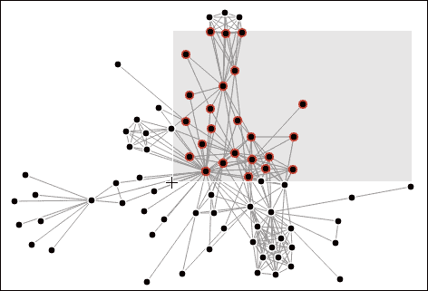

### 注意

我们将在第十一章可视化信息网络中更详细地了解力导向网络可视化。

在使用画笔时，创建自定义画笔手柄是一个常见的场景。手柄为你提供了一种方式，可以自定义画笔边缘的渲染，从而为用户提供视觉提示。

作为自定义画笔的一个例子，以下代码创建半圆形作为手柄：[`bl.ocks.org/mbostock/4349545`](http://bl.ocks.org/mbostock/4349545)。

你可以通过拖动任一手柄来调整画笔的大小，并通过拖动手柄之间的区域来重新定位它：

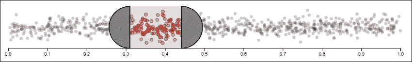

在我们创建自己的画笔之前，最后一个画笔的例子如下，它演示了一个被称为“焦点+上下文”的概念：

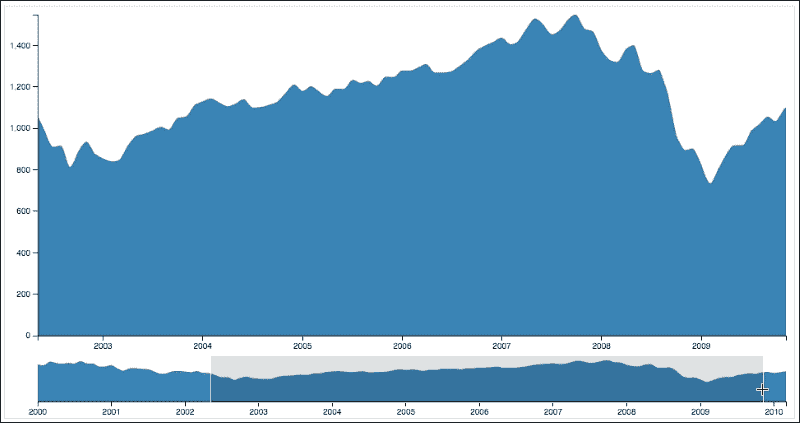

在这个例子中，画笔被绘制在较小的图形（上下文）之上。上下文图是静态的，显示了整个数据范围的总览。当画笔在上下文中改变时，较大的图形（焦点）会实时动画化，同时画笔被改变。

在下一节中，我们将探讨创建一个类似版本的图形，该图形利用金融数据，这是此类交互式可视化的常见领域。

## 实现焦点+上下文

现在我们来探讨如何实现**焦点+上下文**。以下我们将使用的示例将此概念应用于一系列股票数据：

### 注意

bl.ock (8.7): [`goo.gl/Niyc56`](http://goo.gl/Niyc56)

生成的图形将类似于以下图形：

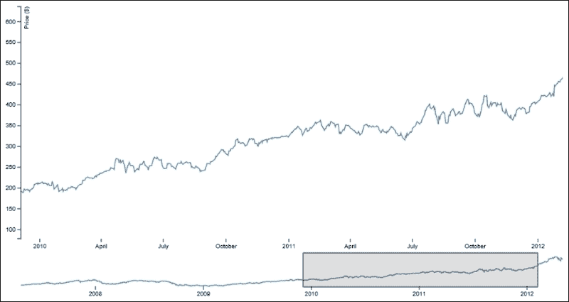

顶部的图形是图表的焦点，表示我们正在检查的股票数据的详细信息。底部的图形是上下文，始终是整个数据系列的图表。在这个例子中，我们关注的是 2010 年初到 2012 年初的数据。

上下文区域支持画笔操作。你可以通过点击上下文图并拖动鼠标来创建新的画笔，选择画笔的范围。然后可以通过拖动来滑动画笔，并且可以通过拖动任一边界在左右两侧调整其大小。焦点区域将始终显示上下文选择的区域详情。

要创建这个可视化，我们将绘制两个不同的图形，因此，我们需要为每个图形布局垂直区域，并创建一个足够大的主要 SVG 元素来容纳两者：

```js
var width = 960, height = 600;

var margins = { top: 10, left: 50, right: 50, 
                bottom: 50, between: 50 };

var bottomGraphHeight = 50;
var topGraphHeight = height - (margins.top + margins.bottom + margins.between + bottomGraphHeight);
var graphWidths = width - margins.left - margins.right;
```

这个示例还需要创建一个裁剪区域。当焦点区域的线条按比例缩放时，它可能会与*y*轴重叠在左侧。裁剪区域防止线条在轴上向左流动：

```js
svg.append('defs')
    .append('clipPath')
    .attr('id', 'clip')
    .append('rect')
    .attr('width', width)
    .attr('height', height);
```

这个裁剪矩形在线条的样式中被引用。当线条被绘制时，它们将被裁剪到这个边界。我们将在检查用于样式化线条的函数时看到这是如何指定的。

现在我们添加两个组，将分别包含焦点和上下文图的渲染：

```js
var focus = svg
    .append('g')
    .attr('transform', 'translate(' + margins.left + ',' + margins.top + ')');

var context = svg.append('g')
    .attr('class', 'context')
    .attr('transform', 'translate(' + margins.left + ',' +
            (margins.top + topGraphHeight + margins.between) + ')');
```

这个可视化需要一个*y*轴，两个*x*轴，以及每个轴的适当比例。这些是通过以下代码创建的：

```js
var xScaleTop = d3.time.scale().range([0, graphWidths]),
    xScaleBottom = d3.time.scale().range([0, graphWidths]),
    yScaleTop = d3.scale.linear().range([topGraphHeight, 0]),
    yScaleBottom = d3.scale.linear()
                     .range([bottomGraphHeight, 0]);

var xAxisTop = d3.svg.axis().scale(xScaleTop)
                 .orient('bottom'),
    xAxisBottom = d3.svg.axis().scale(xScaleBottom)
                        .orient('bottom');
var yAxisTop = d3.svg.axis().scale(yScaleTop).orient('left');
```

我们将绘制两条线，因此我们创建了两个线生成器，每个线一个：

```js
var lineTop = d3.svg.line()
    .x(function (d) { return xScaleTop(d.date); })
    .y(function (d) { return yScaleTop(d.close); });

var lineBottom = d3.svg.line()
    .x(function (d) { return xScaleBottom(d.date); })
    .y(function (d) { return yScaleBottom(d.close); });
```

在加载数据并实际渲染之前，我们需要做最后一件事情，就是使用`d3.svg.brush()`创建我们的画笔：

```js
var brush = d3.svg.brush()
    .x(xScaleBottom)
    .on('brush', function brushed() {
        xScaleTop.domain(brush.empty() ? xScaleBottom.domain() : 
                                         brush.extent());
        focus.select('.x.axis').call(xAxisTop);
    });
```

这个前置片段通知画笔，我们想要使用在`xScaleBottom`中定义的比例在`x`值上画笔。画笔是事件驱动的，并将处理`brush`事件，每当画笔移动或调整大小时都会触发此事件。

最后，代码所做的最后一件主要事情是加载数据并建立初始可视化。你之前已经见过这段代码，所以我们不会一步一步地解释它。简而言之，它包括加载数据，设置比例的域，以及添加和绘制轴和线条：

```js
d3.tsv('https://gist.githubusercontent.com/d3byex/b6b753b6ef178fdb06a2/raw/0c13e82b6b59c3ba195d7f47c33e3fe00cc3f56f/aapl.tsv', function (error, data) {
    data.forEach(function (d) {
        d.date = d3.time.format('%d-%b-%y').parse(d.date);
        d.close = +d.close;
    });

    xScaleTop.domain(d3.extent(data, function (d) { 
                  return d.date; 
    }));
    yScaleTop.domain(d3.extent(data, function (d) { 
        return d.close; 
    }));
    xScaleBottom.domain(d3.extent(data, function (d) { 
        return d.date; 
    }));
    yScaleBottom.domain(d3.extent(data, function (d) { 
        return d.close; 
    }));

    var topXAxisNodes = focus.append('g')
        .attr('class', 'x axis')
        .attr('transform', 'translate(' + 0 + ',' + 
                           (margins.top + topGraphHeight) + ')')
        .call(xAxisTop);
    styleAxisNodes(topXAxisNodes, 0);

    focus.append('path')
        .datum(data)
        .attr('class', 'line')
        .attr('d', lineTop);

    var topYAxisNodes = focus.append('g')
        .call(yAxisTop);
    styleAxisNodes(topYAxisNodes);

    context.append('path')
        .datum(data)
        .attr('class', 'line')
        .attr('d', lineBottom);

    var bottomXAxisNodes = context.append('g')
        .attr('transform', 'translate(0,' + 
                           bottomGraphHeight + ')')
        .call(xAxisBottom);
    styleAxisNodes(bottomXAxisNodes, 0);

    context.append('g')
        .attr('class', 'x brush')
        .call(brush)
        .selectAll('rect')
        .attr('y', -6)
        .attr('height', bottomGraphHeight + 7);

    context.selectAll('.extent')
        .attr({
            stroke: '#000',
            'fill-opacity': 0.125,
            'shape-rendering': 'crispEdges'
        });

    styleLines(svg);
});
```

恭喜！你已经完成了创建一个相当复杂的股票数据交互式显示的过程。但美的是，通过 D3.js 的底层功能，它由一系列相对简单的步骤组成，最终实现了**美丽的数据**。

# 摘要

在本章中，你学习了如何使用 D3.js 提供的鼠标事件来创建交互式可视化。我们首先解释了如何连接鼠标事件并对其做出响应，随着事件的发生改变可视化。然后我们检查了行为，以及我们如何使用它们来实现拖动、平移和缩放，这使用户能够移动数据，更仔细地查看，以及进行放大和缩小。最后，我们介绍了画笔及其如何用于选择多个可视化/数据项，并以一个应用**焦点 + 上下文**来可视化财务数据的流畅示例结束。

在下一章关于布局的内容中，我们将稍微提升到 D3.js 的视觉堆栈中，以检查布局，布局本质上是为复杂数据可视化生成器。
