# 第九章. 使用路径的复杂形状

在第三章中，我们简要探讨了路径的概念。我们了解到，我们可以通过创建一系列命令来使用路径及其相关的迷你语言创建多段渲染。虽然这些路径功能强大，但手动创建可能会很繁琐。

但不必担心，因为 D3.js 提供了一系列对象，只需几行 JavaScript 语句就可以创建复杂的路径。这些**路径生成器**在手动创建复杂路径时减轻了许多痛苦，因为它们自动组装命令序列。

此外，这本书中我们尚未探讨的一种重要类型的图表是折线图。这一部分内容是有意推迟到现在的，因为它是最常用于通过路径生成器创建线条的。在本章的示例之后，路径创建线条的能力将变得显而易见。

在本章中，我们将涵盖以下主题：

+   路径数据生成器的概述

+   线条和区域生成器

+   弧线和饼图生成器

+   符号生成器

+   对角线和径向生成器

+   线性插值器

# 路径数据生成器的概述

D3.js 不遗余力地使使用 SVG 变得简单，尤其是在创建复杂路径时。为此，D3 提供了一系列称为路径生成器的辅助函数，这些函数被创建来处理从一组数据中生成路径的繁琐细节。

我们将要探讨的生成器将遵循一种常见的使用模式，所以一旦你学会了如何使用一个，其他的使用方法就会自然而然地掌握。这些步骤包括：

1.  创建`generator`对象。

1.  指定可以用来找到*X*和*Y*值的访问器函数。

1.  调用任何额外的函数来指定各种渲染指令。

1.  将路径添加到视觉中。

1.  在该路径上使用`.datum()`指定数据。

1.  最后，将路径的`d`属性设置为生成器，这告诉路径在哪里找到该路径的`generator`对象。

一旦这些步骤完成，D3.js 渲染出视觉图形后，它将使用附加到`d`属性上的生成器，并根据你的数据创建路径命令。这也是为什么我们使用`.datum()`而不是`.data()`的原因，因为 datum 只将数据分配给单个元素，并不会强制在该数据上执行进入-更新-退出循环。

现在，让我们通过一些常见的生成器来探讨如何实现这一点——这将很有趣！

## 创建一系列线条

线生成器创建必要的命令来绘制一系列相互连接的线条：

### 注意

bl.ock (9.1): [`goo.gl/eAgBjL`](http://goo.gl/eAgBjL)

之前的示例创建了一个单独的线路径生成器并将其渲染两次，结果如下图形：

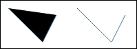

路径生成器是通过以下数据和 `d3.svg.line()` 对象创建的。在该对象上，我们调用两个函数，`x()` 和 `y()`，我们提供一个函数来告诉生成器如何为每个数据点定位 *X* 和 *Y* 值：

```js
var data = [
    { X: 10, Y: 10 },
    { X: 60, Y: 60 },
    { X: 80, Y: 20 }
];
var generator = d3.svg.line()
    .x(function(d) { return d.X; })
    .y(function(d) { return d.Y; });
```

下一步是添加一个路径，调用其 `.datum()` 函数传递数据，并将 `d` 属性至少设置以指定要使用哪个生成器。示例创建了两个路径，它们使用相同的数据和生成器，但应用了不同的填充：

```js
svg.append('path')
    .datum(data)
    .attr({
        d: generator,
        fill: 'none',
        stroke: 'steelblue'
    });
svg.append('path')
    .datum(data)
    .attr({
        transform: 'translate(100,0)',
        d: generator,
        fill: 'none',
        stroke: 'steelblue'
    });
```

此路径指定了两条线。线路径的默认操作是将最后一个点与第一个点连接并填充内部。在第一个路径的情况下，这是一个黑色填充，结果是一个黑色三角形（如果你放大，你会看到两边的 `steelblue` 轮廓）。后者路径将填充设置为空，所以结果只是两条线。

此示例还演示了使用单个路径生成器，但应用了转换和不同的样式到实际路径上。

检查生成的 SVG，我们看到 D3.js 创建了两个路径并自动生成了分配给路径的 `d` 属性的路径数据：

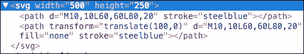

## 区域

区域路径生成器允许我们创建填充特定颜色的线形图。这些的实际用途之一是创建面积图。以下示例演示了创建面积图：

### 注意

bl.ock (9.2): [`goo.gl/7Xmo7u`](http://goo.gl/7Xmo7u)

上述示例的结果看起来像以下图像。数据是随机的，所以每次运行都会不同：

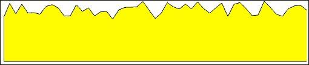

数据是通过生成 0 到 30 之间的 100 个随机数并定义 `Y` 为随机值以及 `X` 以 10 为增量增加来生成的：

```js
var data = d3.range(100)
    .map(function(i) {
        return Math.random() * 30;
    })
    .map(function(d, i) {
            return { X: i * 10, Y: d }
    });
```

路径是通过使用 `d3.svg.area()` 对象生成的：

```js
var generator = d3.svg.area()
    .y0(100)
    .x(function(d) { return d.X; })
    .y1(function (d) { return d.Y; });
```

区域路径生成器需要提供三个访问器函数：

+   `x()`：这指定了获取 *X* 值的位置

+   `y0()`：这获取区域基线的位置

+   `y1()`：这检索给定 `x()` 值的高度

实际的 SVG 路径随后创建并样式化，类似于之前的示例。

## 创建弧、甜甜圈、楔形和段

弧是圆的一部分，它通过两个特定的角度扫过。通过 360 度完整扫过的弧实际上会形成一个圆。小于 360 度的扫过会给你一个圆的楔形，这通常被称为饼 **楔**。

使用 `d3.svg.arc()` 函数创建一个弧。此生成器接受四个参数，描述了弧的数学。楔形的大小是通过使用 `.outerRadius()` 函数和一个使用 `.innerRadius()` 指定的内半径来定义的。

以下示例使用弧来绘制圆形：

### 注意

bl.ock (9.3): [`goo.gl/fJN80J`](http://goo.gl/fJN80J)

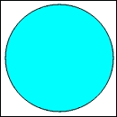

创建生成器的代码如下：

```js
var generator = d3.svg.arc()
    .innerRadius(0)
    .outerRadius(60)
    .startAngle(0)
    .endAngle(Math.PI * 2);
```

生成器指定内半径为 `0` 和外半径为 `60`。起始和结束角度以弧度为单位，扫出一个完整的圆。

以下示例增加了内半径的大小来创建一个甜甜圈：

### 注意

bl.ock (9.4): [`goo.gl/NDVPRw`](http://goo.gl/NDVPRw)

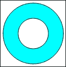

代码中唯一的区别是调用 `.innerRadius()`：

```js
var generator = d3.svg.arc()
    .innerRadius(30)
    .outerRadius(60)
    .startAngle(0)
    .endAngle(Math.PI * 2);
```

我们现在已经创建了一个甜甜圈！那么，让我们来看一个创建饼形扇区的例子。我们可以通过指定内半径为 `0` 并设置起始角度和结束角度不扫满 360 度来创建一个饼形扇区，如下面的示例所示。

为了演示，以下示例创建了一个在 `45` 到 `105` 度之间扫过的饼形扇区：

### 注意

bl.ock (9.5): [`goo.gl/cNizYk`](http://goo.gl/cNizYk)

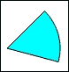

生成前一个饼形扇区的生成器如下：

```js
var generator = d3.svg.arc()
    .innerRadius(0)
    .outerRadius(60)
    .startAngle(45 * Math.PI * 2 / 360)
    .endAngle(105 * Math.PI * 2 / 360);
```

对于弧的一个最终示例是，通过增加前一个示例的内半径使其大于 0 来创建一个扇区：

### 注意

bl.ock (9.6): [`goo.gl/24djAS`](http://goo.gl/24djAS)

```js
var generator = d3.svg.arc()
    .innerRadius(40)
    .outerRadius(60)
    .startAngle(45 * Math.PI * 2/360)
    .endAngle(105 * Math.PI * 2/360);
```

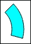

## Creating a pie chart

最常见的一种图表类型是饼图（它也是最被人诟病的一种）。饼图可以通过使用多个弧生成器并手动放置来创建。

为了使这个过程更简单，D3.js 提供了一个工具，帮助我们通过饼的生成器 `d3.layout.pie()` 来生成饼和相关的弧。从数据数组中，这个函数将生成一个弧规范数组，然后我们可以使用它来自动生成所有的饼形扇区。

因此，让我们来检查饼的创建过程：

### 注意

bl.ock (9.7): [`goo.gl/omVW2n`](http://goo.gl/omVW2n)

上述代码生成以下饼图：

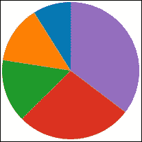

示例首先声明代表饼中每一块的数据值，然后将其传递给 `d3.layout.pie()` 函数：

```js
 var data = [21, 32, 35, 64, 83];
 var pieSegments = d3.layout.pie()(data);
```

如果你检查 `pieSegments` 的内容，你会看到一系列类似于以下的对象：

```js
[[object Object] {
  data: 21,
  endAngle: 6.283185307179587,
  padAngle: 0,
  startAngle: 5.721709173346517,
  value: 21
},
…
] 
```

我们可以通过一个弧生成器使用这些数据来生成饼：

```js
var arcGenerator = d3.svg.arc()
    .innerRadius(0)
    .outerRadius(100)
    .startAngle(function(d) {
         return d.startAngle;
    })
    .endAngle(function(d) {
         return d.endAngle;
    });
var colors = d3.scale.category10();
group.selectAll('path')
    .data(pieSegments)
    .enter()
    .append('path')
    .attr('d', arcGenerator)
    .style('fill', function(d, i) {
        return colors(i);
  });
```

### Exploding the pie

我们可以通过设置饼形扇区的边框宽度来制作一个爆炸式的饼。以下示例展示了这一过程。我们将跳过代码的详细说明，因为它只是在先前的示例中添加了 `stroke` 和 `stroke-width`：

### 注意

bl.ock (9.8): [`goo.gl/fhQEau`](http://goo.gl/fhQEau)

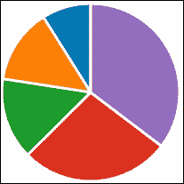

### Creating a ring graph

我们也可以很容易地将它转换成一个环形图，通过增加内半径，如下面的示例所示（对先前的示例进行简要修改）：

### 注意

bl.ock (9.9): [`goo.gl/Mk60ws`](http://goo.gl/Mk60ws)

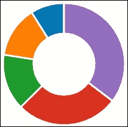

## 创建符号

符号是可以在图表上使用的小形状，就像我们在散点图章节中使用小圆圈和正方形一样。D3.js 附带一个生成器可以创建六个符号：圆形、十字、菱形、正方形、向下三角形和向上三角形。

这些符号有名称，`d3.svg.symbolTypes`包含可用符号类型的名称数组。然后通过将符号名称传递给`d3.svg.symbol().type()`函数来创建一个符号，该函数返回指定符号的路径生成器。

在以下链接中可以找到渲染可用符号的示例：

### 注意

bl.ock (9.10): [`goo.gl/AM2ErM`](http://goo.gl/AM2ErM)

以下代码渲染了以下符号作为结果：

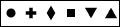

也许它们不是世界上最令人兴奋的事情，但它们对于在散点图上表示不同的数据项或在线图的点标记上很有用。

## 使用对角线创建曲线线条

对角线是我个人最喜欢的一种，它可以用在许多复杂的可视化中。这是一个我认为最好通过示例来理解的概念：

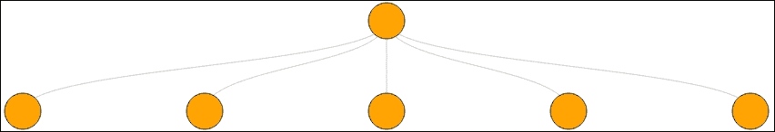

对角线生成器生成一个点和一组其他点之间的曲线线条，根据目标点的位置生成适当的曲线。

以下示例创建了之前的图像：

### 注意

bl.ock (9.11): [`goo.gl/by9B4S`](http://goo.gl/by9B4S)

这个例子从定义源位置和目标位置使用 JavaScript 对象开始，然后，通过创建一个表示每个`source`和`target`组合的对象数组：

```js
var source = { x: 500, y: 50 };
var targets = [
    { x: 100, y: 150 },
    { x: 300, y: 150 },
    { x: 500, y: 150 },
    { x: 700, y: 150 },
    { x: 900, y: 150 }
];
var links = targets.map(function (target) {
    return { source: source, target: target };
});
```

然后，我们可以使用以下选择生成曲线线条，它使用一个`d3.svg.diagonal()`对象作为路径数据的生成器：

```js
svg.selectAll('path')
    .data(links)
    .enter()
    .append('path')
    .attr({
        d: d3.svg.diagonal(),
        fill: 'none',
        stroke: '#ccc'
    });
```

圆形不是由对角生成器渲染的。代码根据源点和目标点的位置渲染和定位它们。

# 使用插值器绘制线图

现在我们来探讨如何使用内置的线生成器创建线图。在 D3.js 中渲染线条的功能非常强大，可以用来生成带有直线段的线条，或者使用多种不同的算法通过一系列点拟合曲线。

当使用线生成器渲染线条时，D3.js 会在你的数据上应用一个插值器，以确定如何创建连接数据点的路径段。以下表格列出了可用的线插值器：

| 插值器 | 操作 |
| --- | --- |
| `linear` | 点之间的直线 |
| `linear-closed` | 关闭线段，从最后一个点到第一个点，形成一个多边形 |
| `step-before` | 先垂直后水平进行步进绘制 |
| `step-after` | 先水平后垂直的步进绘制 |
| `basis` | 在端点处渲染带有控制点的 b 样条曲线 |
| `basis-open` | 在端点处渲染带有控制点的 b 样条曲线，不闭合环 |
| `basic-closed` | 在端点处渲染带有控制点的 b 样条曲线，闭合环 |
| `bundle` | 与`basis`等效，但带有张力参数 |
| `cardinal` | 一种基数样条，端点处有控制点 |
| `cardinal-open` | 一种基数样条，端点处有控制点；线可能不会与端点相交，但会通过内部点 |
| `cardinal-closed` | 将基数样条闭合成环 |
| `monotone` | 一种保持 y 值单调性的三次插值 |

默认情况下使用线性插值器，它本质上是在每对相邻点之间绘制一条直线。我们将逐一查看这些内容，因为我认为它们值得展示（而且很有趣！）。

示例可在以下链接找到：

### 注意

bl.ock (9.12): [`goo.gl/MdjuPz`](http://goo.gl/MdjuPz)

应用程序向用户提供了两个选项。一个是选择插值类型，另一个是选择张力值，这个值仅在所选插值是`bundle`时使用。

然后示例生成一个由 8 个点表示的正弦波周期。作为一个例子，当选择线性插值时，结果如下：

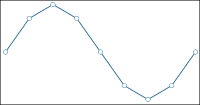

应用程序首先在 HTML 中创建下拉框和主要 SVG 元素。然后设置正弦波的刻度，将点映射到 SVG 中。当页面首次加载，以及每次更改插值或张力选择时，都会调用`redraw()`函数并生成图形。

`redraw()`函数从插值下拉菜单中检索当前值，并使用所选值创建线路径生成器：

```js
var line = d3.svg.line()
    .interpolate(interpolation)
    .x(function(d) { return xScale(d[0]); })
    .y(function(d) { return yScale(d[1]); });
```

如果选择的插值是`bundle`，它还会检索所选的张力值并将其应用于线路径生成器：

```js
if (interpolation === "bundle") {
    var tensionsSel = document.getElementById('tensions');
    var tension = tensionsSel.options[
        tensionsSel.selectedIndex].value;
    line.tension(tension);
}
```

然后使用路径和相关生成器生成线条，并在每个点的位置添加圆圈。

现在我们来检查这些插值如何渲染我们的正弦波。

## 线性与线性闭合插值器

线性插值器在点之间绘制直线：

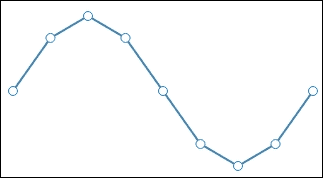

线性闭合是一个略有变体的选项，它也会将最后一个点连接到第一个点：

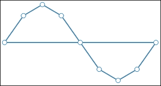

## 步前和步后插值

展示步前和步后的最佳方式就是通过给出例子。但本质上，每对点都通过两条线连接，一条水平线和一条垂直线。

在“步前”模式下，垂直线先出现：

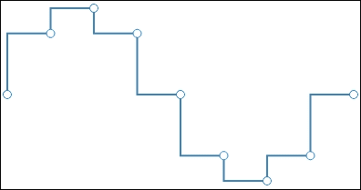

步后首先绘制水平线：

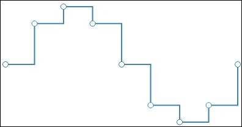

## 使用基插值创建曲线

**基础**曲线将通过端点，但可能不会通过内部点。内部点影响线的曲线，但线不必穿过任何内部点。

以下是一个基础插值的示例：

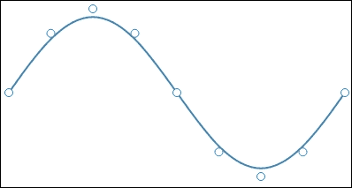

**基础开放**插值不通过端点。它看起来与基础相似，但线不会在第一和第二点之间以及下一到最后一点之间绘制：

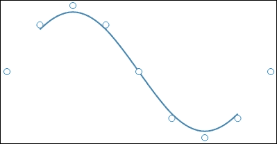

我们为什么要这样做？这种情况是当第一个和最后一个点是控制点，并且可以在 *X* 和 *Y* 值中更改以影响曲线如何通过内部点。检查这一点超出了本书的范围，但我挑战您将您在 第八章 中学到的概念应用到实践中，允许用户拖动控制点，并看看这如何改变线的流动。

**基础封闭**告诉生成器关闭循环并确保循环在所有点上都是平滑的（代码的小变化再次省略）。结果是以下内容：

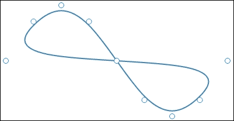

非常棒！正如您所看到的，您可以使用这些插值器创建非常复杂的曲线形状。想象一下，如果您自己创建路径命令会怎样。我敢打赌，您会检查这条线的路径命令——有很多。

## 使用捆绑插值创建曲线

`bundle` 与 `basis` 类似，但您可以指定生成线张力的参数。张力允许您控制线将如何紧密地符合给定的点。要指定张力，将 `.tension()` 函数与介于 `0.0` 和 `1.0`（默认为 `0.7`）之间的参数值链式调用。以下显示了一个选定的张力值为 `0.75`：

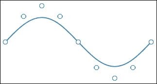

您可以看到生成的线（好吧，曲线）现在受点的影响要小得多。如果您将值设置为 `0.0`，这实际上将是一条直线。为了有效地展示其他张力值，以下表格展示了从 `0.0` 到 `1.0` 的张力各个点的形状变化：

| 张力 | 结果 |
| --- | --- |
| `0.0` | 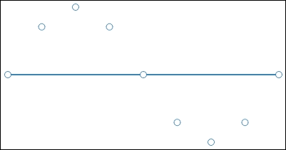 |
| `0.5` | 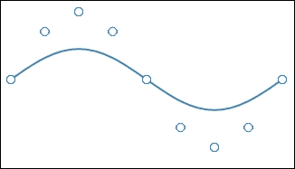 |
| `1.0` | 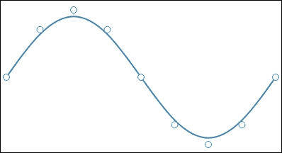 |

如果你将`1.0`的张力与基函数插值进行比较，你会注意到它们是相同的。

## 使用基数插值创建曲线线

`cardinal`曲线类似于`basis`曲线，不同之处在于线条被强制通过所有点。以下图表展示了正常、开放和封闭的形式：

| 插值 | 结果 |
| --- | --- |
| cardinal | 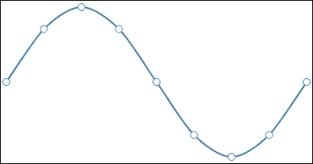 |
| cardinal-open | 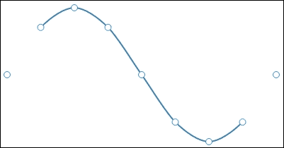 |
| cardinal-closed | 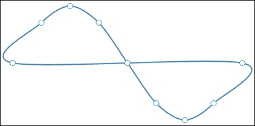 |

# 摘要

在本章中，我们考察了使用 D3.js 路径数据生成器创建复杂形状的几种技术。我们从常见的生成器示例开始，包括线、区域、圆形、甜甜圈、弧线和对角线。这些工具非常强大，可以增强你轻松创建复杂可视化的能力。

我们通过考察线插值器结束了这一章，这是一种通知线路径生成器如何在数据点之间拟合线条的方法。这些插值，包括默认的线性插值，是高效创建复杂线图和适合数据的曲线形状的基础。

在下一章关于布局的部分，我们将稍微提升到 D3.js 的视觉堆栈中，来考察布局，布局本质上是为复杂数据可视化生成器。
