# 第十章。使用布局可视化系列和层次数据

我们现在将探讨一些人认为的 D3.js 最强大的功能——布局。布局封装了检查你的数据并计算特定类型图表（如条形、面积、气泡、弦、树等）的视觉元素位置的算法。

我们将深入研究几个有用的布局。这些将根据数据的结构和可视化类型（如堆叠、层次、弦和基于流的图表）分为几个主要类别。对于每个类别，我们将介绍一些示例，包括数据和代码。

具体来说，我们将检查创建以下类型的图表和布局：

+   使用堆叠布局创建条形图和面积图

+   层次图包括树、簇树状图和围栏

+   使用弦图表示项目之间的关系

+   使用流图和桑基图流动数据

# 使用堆叠布局

堆叠是一类布局，它接受多个数据系列，其中每个系列中的每个测量值都渲染在彼此之上。这些非常适合展示每个系列在每个测量点上的测量值的比较大小。它们也非常擅长展示多个数据流在整个测量集中的变化。

堆叠图基本上归结为两种不同的表示：堆叠条形图和堆叠面积图。我们将检查这两种，并解释如何使用 D3.js 创建它们。

## 创建堆叠条形图

堆叠条形图的实现与条形图类似，但我们需要考虑每个条形的高度是由每个测量的总和组成的这一事实。通常，每个条形会被细分，每个部分的大小相对于总和，并且会赋予不同的颜色以区分它们。

让我们开始创建自己的堆叠条形图。将要使用的数据可以在[`goo.gl/6fJrxE`](https://goo.gl/6fJrxE)找到。

以下文件的前几行。这些数据代表七个数据系列，每个系列代表一个特定的年龄范围，按州进行分类。每个值代表该年龄组给定州的居民人数。

```js
State,Under 5 Years,5 to 13 Years,14 to 17 Years,18 to 24 Years,25 to 44 Years,45 to 64 Years,65 Years and Over
AL,310504,552339,259034,450818,1231572,1215966,641667
AK,52083,85640,42153,74257,198724,183159,50277
AZ,515910,828669,362642,601943,1804762,1523681,862573
```

在以下链接中可以找到在线示例：

### 注意

bl.ock (10.1): [`goo.gl/G3BIL7`](http://goo.gl/G3BIL7)

结果条形图如下：

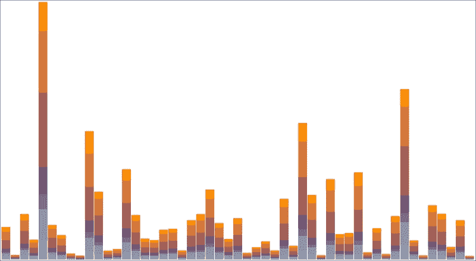

数据使用`d3.csv()`加载：

```js
var url = 'https://gist.githubusercontent.com/d3byex/25129228aa50c30ef01f/raw/17838a0a03d94328a529de1dd768e956ce217af1/stacked_bars.csv';
d3.csv(url, function (error, data) {
```

检查结果数据中的第一个对象，我们看到以下结构：

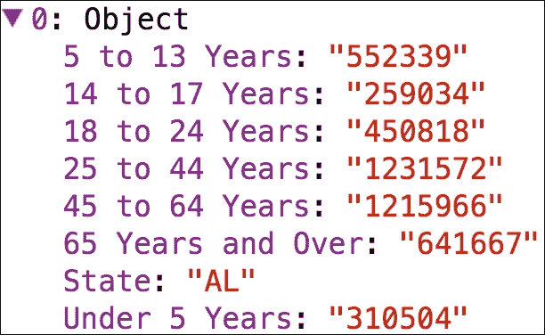

此数组有 51 个元素，每个元素代表美国和华盛顿特区的每个州。这些数据需要转换成一个结构，为我们提供渲染每个条形以及每个条形内每个序列的矩形的信息。为此，我们需要进行三个步骤，最后一个步骤使用`d3.layout.stack()`。

首先，代码提取每个数据序列的唯一键，即年龄组。这可以通过过滤掉数组中每个对象的非`State`属性的所有属性来实现。

```js
var keys = d3.keys(data[0])
    .filter(function (key) {
        return key !== "State";
    });
```

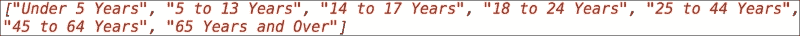

使用这些键，我们可以重新组织数据，以便我们有一个表示每个年龄组值的数组：

```js
var statesAndAges = keys.map(function (ageRange) {
    return data.map(function (d) {
        return {
            x: d.State,
            y: +d[ageRange]
        };
    });
});
```

`statesAndAges`变量现在是一个包含七个元素的数组，每个元素都是一个对象数组，代表每个序列的`x`和`y`值：


现在，使用这些键，我们创建一个`d3.layout.stack()`函数，并让它处理这些数据。

```js
var stackedData = d3.layout.stack()(statesAndAges);
```

此数据的堆叠结果是将堆叠函数添加一个额外的属性`y0`到每个序列中的每个对象。`y0`的值将是之前编号较低的序列中`y`值的总和。为了演示，以下是在每个数组第一个对象中的对象值：

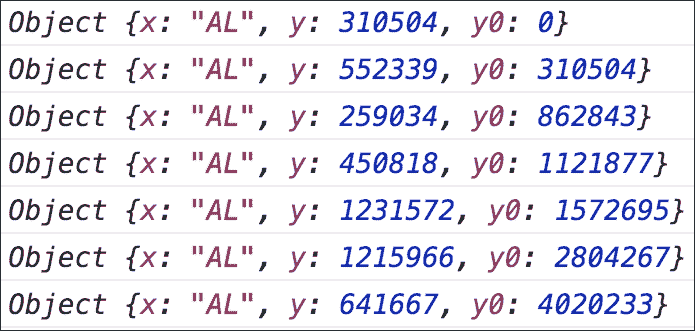

第一个对象中`y0`的值为`0`。第二个对象中`y0`的值为`310504`，等于第一个对象的`y0` + `y`。第三个对象中`y0`的值为第二个的`y0` + `y`，即`862843`。此函数已堆叠`y`值，每个`y`值都是将要渲染的条形单个段的`y`值。

数据现在已组织好以渲染条形图。下一步是创建主 SVG 元素：

```js
var width = 960, height = 500;
var svg = d3.select('body')
    .append("svg")
    .attr({
        width: width,
        height: height
    });
```

接下来，代码计算`x`和`y`比例尺，以将条形映射到指定的像素数。`y`比例尺的域将从`0`到所有序列中`y0`和`y`的最大总和：

```js
var yScale = d3.scale.linear()
        .domain([0,
            d3.max(stackedData, function (d) {
                return d3.max(d, function (d) {
                    return d.y0 + d.y;
                });
            })
        ])
        .range([0, height]);
```

`x`比例尺设置为每个州的序数`rangeRoundBands`：

```js
var xScale = d3.scale.ordinal()
    .domain(d3.range(stackedData[0].length))
    .rangeRoundBands([0, width], 0.05);
```

代码随后为每个序列创建一个组，并为每个组分配一个颜色，该颜色将用于填充矩形：

```js
var colors = d3.scale.ordinal()
    .range(["#98abc5", "#8a89a6", "#7b6888",
            "#6b486b", "#a05d56", "#d0743c", "#ff8c00"]);

var groups = svg.selectAll("g")
    .data(stackedData)
    .enter()
    .append("g")
    .style("fill", function (d, i) {
        return colors(i);
    });
```

最后一步是渲染所有矩形。以下是在每个组内创建`51`个矩形的操作：

```js
groups.selectAll("rect")
    .data(function (d) { return d; })
    .enter()
    .append("rect")
    .attr("x", function (d, i) {
        return xScale(i);
    })
    .attr("y", function (d, i) {
        return height - yScale(d.y) - yScale(d.y0);
    })
    .attr("height", function (d) {
        return yScale(d.y);
    })
    .attr("width", xScale.rangeBand());
});
```

就这样！您已经使用这些数据绘制了这个图表。

## 将堆积条形图修改为堆积面积图

堆积面积图与堆积条形图对数据的展示方式不同。要创建堆积面积图，我们需要将每个数据序列的渲染方式改为路径。路径是通过一个面积生成器定义的，该生成器在底部具有`y`值，在顶部具有`y0 + y`的总和。

堆积面积图的代码可在以下链接在线获取：

### 注意

bl.ock (10.2): [`goo.gl/PRw8wv`](http://goo.gl/PRw8wv)

此示例的结果如下：

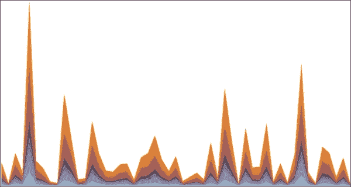

与前一个示例相比，这种变化相对较小。数据加载和组织方式完全相同。刻度和颜色也是以相同的方式创建的。

差异在于视觉效果的呈现。我们不是渲染矩形组，而是为每个系列渲染一个填充路径。以下创建这些路径并为每个分配颜色：

```js
svg.selectAll("path")
    .data(stackedData)
    .enter()
    .append("path")
    .style("fill", function (d, i) {
        return colors(i);
    });
```

这已经生成了路径元素，但尚未分配路径的`d`属性以创建实际的路径数据。这是我们下一步要做的事情，但首先我们需要创建一个面积生成器，将我们的数据转换为路径所需的数据。这个面积生成器需要指定三个值，即`x`值，`y0`（表示区域的底部），以及`y1`（位于区域的顶部）：

```js
var area = d3.svg.area()
    .x(function (d, i) {
        return xScale(i);
    })
    .y0(function (d) {
        return height - yScale(d.y0);
    })
    .y1(function (d) {
        return height - yScale(d.y + d.y0);
    });
```

最后，我们选择我们刚刚创建的路径并将它们绑定到每个适当的系列上，将对应路径的`d`属性设置为调用面积生成器的结果。请注意，这是为每个系列调用面积生成器：

```js
svg.selectAll("path")
    .data(stackedData)
    .transition()
    .attr("d", function (d) {
        return area(d);
    });
```

## 将面积图转换为扩展面积图

存在一种堆叠面积图的变体，称为扩展面积图。扩展面积图完全填充图表的整个区域，可以用来轻松地可视化每个系列在每个点所代表的相对百分比。

这种图表是通过将所有系列中每个点的数据归一化到 1.0 来从堆叠面积图创建的。以下示例演示了这是如何执行的：

### 注意

bl.ock (10.3): [`goo.gl/g9BH4L`](http://goo.gl/g9BH4L)

结果图表如下：

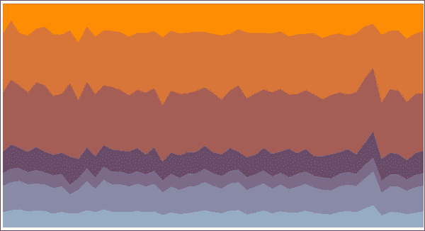

这从视觉上很好地展示了每个年龄组在期间相对大小如何变化。大多数情况下，年龄组的比例保持不变，除了数据末尾可能的一个州。

将堆叠面积图转换为扩展面积图是一件非常容易的事情。为了完成这个任务，我们需要做两件事。其中之一是改变我们堆叠数据的方式。我们将堆叠操作更改为以下内容：

```js
var stackedData = d3.layout.stack()
    .offset('expand')(statesAndAges);
```

这里的变化是添加对`.offset("expand")`的调用。这通知 D3.js 将每个点的结果归一化到`[0, 1]`。默认偏移量是`"zero"`，正如我们所看到的，它从`*Y*`值开始为`0`并执行运行总和。

数据现在已准备好，第二个更改是将`Y`轴范围更改为考虑域为`[0, 1]`：

```js
var yScale = d3.scale.linear()
    .domain([0, 1])
    .range([0, height]);
```

现在你已经有了你的扩展面积图。

# 展示分层数据

**分层布局**显示具有分层性质的信息。这可能是一个稍微递归的定义，但基本思想是某些数据项在较低级别分解为零个或多个数据项，然后可能到另一个级别，依此类推，直到所需的级别。

层次布局都是通过`d3.layout.hierarchy()`函数创建的，但该函数有专门化的版本，可以创建各种布局，这些布局属于常见的视觉模式，如树、簇和包围与包装。我们将查看每种类型布局的示例。

## 树形图

树形图本质上是一种节点-链接图。在第九章中，我们看到了使用一种称为对角线生成器的路径生成器的应用。这种生成器能够创建可以连接一个节点到一个或多个节点的曲线线段。为了帮助您回忆，我们有一个生成以下内容的示例：

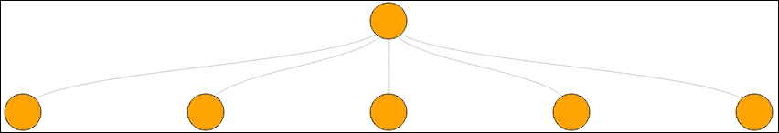

这是一个基本的节点-链接图。树形图利用对角线并将它们应用于多个层次。该图可以结构化为树形或其他更复杂的布局，如辐射簇（我们将对其进行研究）。布局将计算节点的位置，然后我们需要渲染节点和连接的对角线。

我们将从一个简单的树形图开始。数据可在[`goo.gl/mcdT9r`](https://goo.gl/mcdT9r)找到。数据的内容如下：

```js
{
  "name": "Mike and Marcia",
  "children": [
    {
      "name": "Children",
      "children": [
        { "name": "Mikael" }
      ]
    },
    {
      "name": "Pets",
      "children": [
        {
          "name": "Dogs",
          "children": [
            { "name": "Bleu" },
            { "name": "Tagg" }
          ]
        },
        {
          "name": "Cats",
          "children": [
            { "name": "Bob" },
            { "name": "Peanut" }
          ]
        }
      ]
    }
  ]
}
```

示例可在以下位置找到：

### 注意

bl.ock (10.4): [`goo.gl/t1hBTS`](http://goo.gl/t1hBTS)

渲染的结果是以下树形图：

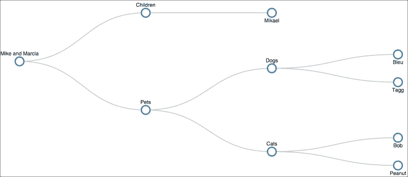

我们的示例从加载数据、为图表建立度量标准、创建主要 SVG 元素以及建立主要组和边距开始：

```js
var url = 'https://gist.githubusercontent.com/d3byex/25129228aa50c30ef01f/raw/c1c3ad9fa745c42c5410fba29cefccac47cd0ec7/familytree.json';
d3.json(url, function (error, data) {
    var width = 960, height = 500,
        nodeRadius = 10,
        margin = {
            left: 50, top: 10,
            bottom: 10, right: 40
        };

    var svg = d3.select('body')
        .append("svg")
        .attr({
            width: width,
            height: height
        });
    var mainGroup = svg.append("g")
        .attr("transform", "translate(" + margin.left + "," + 
                                          margin.top + ')');
```

为了将数据转换为树的可视表示，我们将使用`d3.layout.tree()`函数创建树布局。

```js
var tree = d3.layout.tree()
    .size([
        height - (margin.bottom + margin.top),
        width - (margin.left + margin.right),
    ]);
```

这告诉 D3.js 我们想要创建一个树，它将数据映射到由`height`和`width`指定的矩形中。请注意，`height`是在`width`之前指定的。

图表有两个视觉组件：节点，由圆圈表示，以及边，即对角线。为了计算节点，我们使用布局的`.nodes()`函数，并将我们的数据传递给它。

```js
var nodes = tree.nodes(data);
```

树函数寻找具有`children`属性的顶级节点。它将遍历层次结构中的所有节点，并确定其深度，在这种情况下，有四个级别。然后它将为每个节点添加`x`和`y`属性，这些属性代表基于布局和特定`width`和`height`计算出的节点位置。

检查`nodes`变量的内容，我们可以看到 D3.js 已经为我们提供了每个节点的位置（以下显示了前两个节点）：

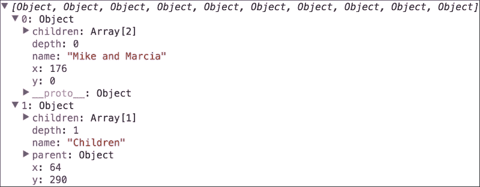

要获取树中的链接，我们调用`tree.links(nodes)`：

```js
var links = tree.links(nodes);
```

下图显示了导致此示例的链接：

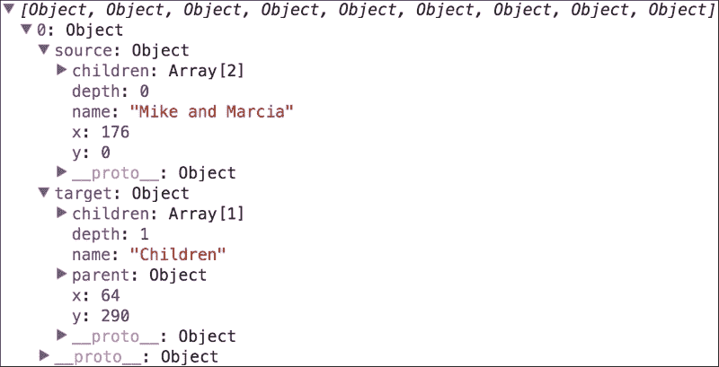

新创建的数据结构由每个链接的元素组成，其中每个对象包含一个指向链接每端节点的`source`和`target`属性。

我们现在有了创建视觉数据的数据准备就绪。接下来是创建对角线生成器的语句。我们使用`.projection()`函数，因为我们需要告诉生成器如何从每个数据中找到`x`和`y`值：

```js
var diagonal = d3.svg.diagonal()
    .projection(function(d) {
        return [d.y, d.x];
    });
```

现在我们可以创建对角线，为每个对角线重用生成器。对角线是在节点之前创建的，因为我们希望节点在前：

```js
mainGroup.selectAll('path')
    .data(links)
    .enter()
    .append('path', 'g')
    .attr({
        d: diagonal,
        fill: 'none',
        stroke: '#ccc',
        'stroke-width': 2
    });
```

现在代码创建圆和标签。我们将用包含一个圆和一段文本的组来表示每个节点。以下创建这些组并将它们放置在计算出的位置：

```js
var circleGroups = mainGroup.selectAll('g')
    .data(nodes)
    .enter()
    .append('g')
    .attr('transform', function (d) {
        return 'translate(' + d.y + ',' + d.x + ')';
    });
```

接下来，我们将圆作为每个节点组元素的子元素添加：

```js
circleGroups.append('circle')
    .attr({
        r: nodeRadius,
        fill: '#fff',
        stroke: 'steelblue',
        'stroke-width': 3,
    });
```

然后我们将节点标签文本添加到组中：

```js
circleGroups.append('text')
    .text(function (d) {
        return d.name;
    })
    .attr('y', function (d) {
        return d.children || d._children ?
            -nodeRadius * 2 : nodeRadius * 2;
    })
    .attr({
        dy: '.35em',
        'text-anchor': 'middle',
        'fill-opacity': 1
    })
    .style('font', '12px sans-serif');
```

当分配`y`属性时，如果节点不是叶子节点，则将文本位置偏移到圆上方；如果是叶子节点，则位于节点下方。

## 创建聚类树状图

一个层次结构也可以被可视化为一个称为**聚类树状图**的树形变体。聚类树状图与树图的不同之处在于我们使用聚类布局。这种布局将树的根放在中心。计算数据深度，并将相应数量的同心圆层放入图中。然后，将每个深度的节点放置在圆的边缘，以对应其深度。

为了演示这一点，我们将利用位于[`goo.gl/t3M7n1`](https://goo.gl/t3M7n1)的数据。这些数据代表三个级别的数据，有一个根节点和第二级上的四个节点；这些节点中的每一个都有九个孩子。

以下是一些数据的样本：

```js
{
  "name": "1",
  "children": [
    {
      "name": "1-1",
      "children": [
        { "name": "1-1-1" },
        { "name": "1-1-2" },
        { "name": "1-1-3" },
        { "name": "1-1-4" },
        { "name": "1-1-5" },
        { "name": "1-1-6" },
        { "name": "1-1-7" },
        { "name": "1-1-8" },
        { "name": "1-1-9" }
      ]
    },
    {
      "name": "1-2",
      "children": [
        { "name": "1-2-1" },
        { "name": "1-2-2" },
        { "name": "1-2-3" },
...
```

示例可在以下位置找到：

### 注意

bl.ock (10.5): [`goo.gl/cQtPuH`](http://goo.gl/cQtPuH)

结果图如下：

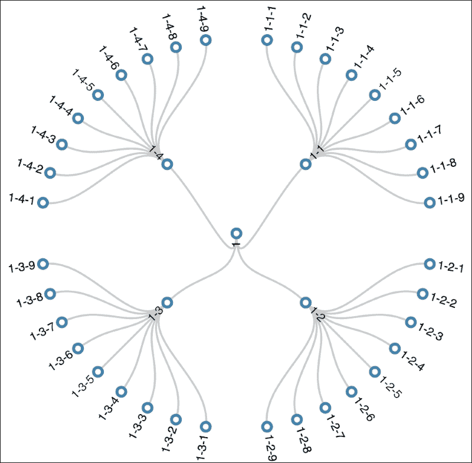

让我们逐步了解这是如何创建的。代码与树示例类似，但有一些不同。在数据加载后，创建主 SVG 元素，然后在元素内放置一个组：

```js
var center = width / 2;
var mainGroup = svg.append('g')
    .attr("transform", "translate(" + center + "," + 
                                      center + ")");
```

布局算法将在中心点（**0, 0**）周围计算点，因此我们将组居中以便图形居中。

然后使用`d3.layout.cluster()`创建布局：

```js
var cluster = d3.layout.cluster()
    .size([
        360,
        center - 50
    ]);
```

大小指定了两件事；第一个参数是点在圆外圈上扫过的角度数。这指定了`360`度，以便我们完全填满外圈。第二个参数是树深度，或者说外圈的最外层圆的半径。

接下来，我们使用布局来计算节点和链接的位置：

```js
var nodes = cluster.nodes(data);
var links = cluster.links(nodes);
```

值得检查这些计算结果的前几个节点：

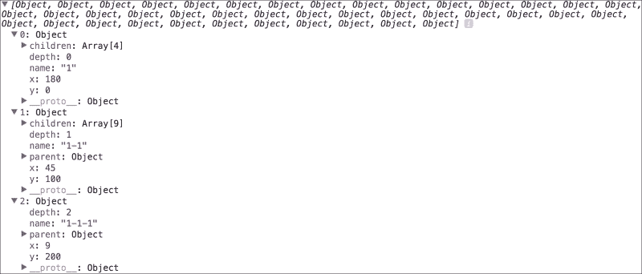

`x` 和 `y` 属性指定了节点（以及边）放置的方向和距离。`x` 属性指定了与垂直方向的夹角，而 `y` 属性的值指定了距离。

对角线是使用径向对角线计算的，需要将 `x` 值转换为弧度：

```js
var diagonal = d3.svg.diagonal.radial()
    .projection(function(d) {
        return [
            d.y,
            d.x / 180 * Math.PI
        ];
    });
```

现在，我们可以使用连接节点的对角线径向生成器：

```js
mainGroup.selectAll('path')
    .data(links)
    .enter()
    .append('path')
    .attr({
        'd': diagonal,
        fill: 'none',
        stroke: '#ccc',
        'stroke-width': 2
    }); 
```

接下来，我们创建一个组来包含节点和文本。这个技巧在于我们需要将组转换并旋转到正确的位置：

```js
var nodeGroups = mainGroup.selectAll("g")
    .data(nodes)
    .enter()
    .append("g")
    .attr("transform", function(d) {
        return "rotate(" + (d.x - 90) + ")translate(" + d.y + ")";
    }); 
```

我们将组绕计算出的角度旋转 `90` 度。这改变了文本的流向，使其从圆圈流出，沿着对角线。请注意，旋转使用的是度数，而不是弧度，正如径向生成器所要求的。平移仅使用 `y` 值，它将组沿指定角度移动这个距离。现在我们将圆圈添加到组中：

```js
nodeGroups.append("circle")
    .attr({
        r: nodeRadius,
        fill: '#fff',
        stroke: 'steelblue',
        'stroke-width': 3
    });
```

最后，我们添加文本。注意围绕文本的小计算，它表示角度大于或小于 180 度。这本质上意味着图左侧的节点位置是文本的末端对着节点，而在右侧，从文本的开始处开始。文本还通过圆半径的两倍进行变换，以防止它与圆重叠：

```js
nodeGroups.append('text')
    .attr({
            dy: '.31em',
            'text-anchor': function(d) {
                return d.x < 180 ? 'start' : 'end';
            },
            'transform': function(d) {
                return d.x < 180 ? 
                           'translate(' + (nodeRadius*2) + ')' :
                           'rotate(180)' +
                           'translate(' + (-nodeRadius*2) + ')';
            }
        })
        .style('font', '12px sans-serif')
    .text(function(d) { return d.name; });
```

## 使用封装图表示层次结构

封装图使用视觉嵌套来表示层次结构。每个叶节点圆圈的大小揭示了每个数据点的定量维度。包含的圆圈显示了每个子树的近似累积大小，但请注意，由于空间浪费，不同级别之间存在一些扭曲。因此，只有叶节点可以准确比较。

以下是在线示例的位置：

### 注意

块 (10.6): [`goo.gl/MQ3CwG`](http://goo.gl/MQ3CwG)

以下图像是生成的视觉结果：

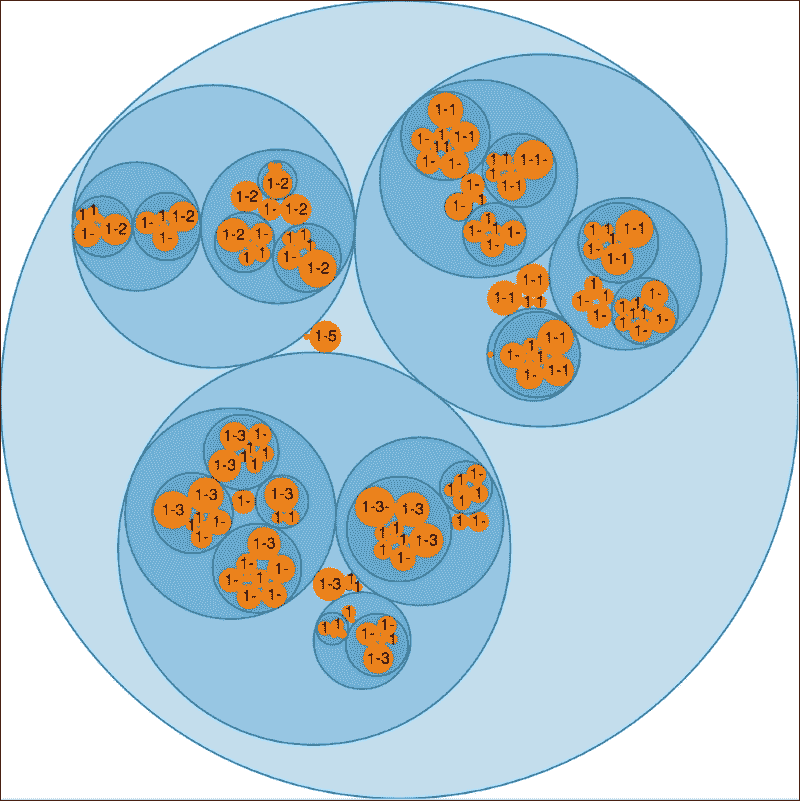

示例中使用的数据可在 [`goo.gl/RzvlV3`](https://goo.gl/RzvlV3) 获取。它的结构类似于前面的示例，除了每个节点都添加了一个 `value` 属性。叶节点的值在它们的父节点中汇总，一直重复到顶部。

实质上，这些数据是对值的汇总，就像从销售人员到办公室、到部门、到公司层面的销售额汇总时所执行的操作一样。然后，图表使我们能够看到叶节点中数字的相对大小，这些节点被涂成橙色，并且可以了解树中每个级别的总数。

现在，让我们看看这是如何创建的。示例从加载数据开始，然后创建一个指定直径的 SVG 元素。然后创建一个包装布局，它也使用了直径。创建的层次气泡将被测量以适应指定的直径：

```js
var pack = d3.layout.pack()
    .size([diameter, diameter])
    .value(function (d) { return d.value; });
```

现在我们渲染圆圈。对于每个节点，我们添加一个平移到适当位置的组，然后添加一个圆圈，其半径设置为计算出的半径`(d.r)`，`fill`、`fill-opacity`和`stroke`根据节点是否为叶子节点而设置不同的值：

```js
var nodes = svg.datum(data)
    .selectAll('g')
    .data(pack.nodes)
    .enter()
    .append('g')
    .attr('transform', function (d) {
        return 'translate(' + d.x + ',' + d.y + ')';
    });

nodes.append('circle')
    .each(function (d) {
        d3.select(this)
            .attr({
                r: d.r,
                fill: d.children ? 'rgb(31, 119, 180)' :
                                   '#ff7f0e',
                'fill-opacity': d.children ? 0.25 : 1.0,
                stroke: d.children ? 'rgb(31, 119, 180)' : 'none'
            });
    });
```

最后一步是将文本添加到叶子圆圈（没有子节点的那些，如使用过滤器指定的）：

```js
nodes.filter(function(d) {
        return !d.children;
    })
    .append('text')
    .attr('dy', '.3em')
    .style({
        'text-anchor': 'middle',
        'font': '10px sans-serif'
    })
    .text(function(d) {
        return d.name.substring(0, d.r / 3);
    });
```

# 使用弦图表示关系

弦图展示了实体组之间的关系。为了展示，我们将使用以下链接中的示例：

### 注意

bl.ock (10.7): [`goo.gl/8mRDSg`](http://goo.gl/8mRDSg)

结果图表如下：

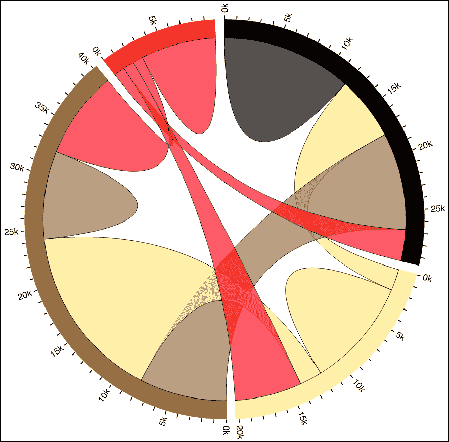

此示例中的数据是一个方阵数据，行和列代表发色（黑色、金色、棕色和红色）。数据代表总共**100000**次测量，其中每一行展示了具有特定发色的人所偏好的其他发色的总计数：

|   | ***偏好*** |
| --- | --- |
| ***拥有*** | **黑色** | **金色** | **棕色** | **红色** | **总计** |
| **黑色** | 11975 | 5871 | 8916 | 2868 | 29630 |
| **金色** | 1951 | 10048 | 2060 | 6171 | 20230 |
| **棕色** | 8010 | 16145 | 8090 | 8045 | 40290 |
| **红色** | 1013 | 990 | 940 | 6907 | 9850 |
| **总计** | 22949 | 30354 | 20006 | 23991 | 10000 |

为了解释这个图表，每个外环段代表具有特定发色的人数。这些环段的尺寸与具有特定发色的人数的百分比成比例。从给定颜色的环段到另一个环段（或自身）的每个弧线代表喜欢该弧线另一侧发色的人数，反之亦然。每个环段外部的刻度给出了所代表的人数的总体感觉。

现在我们逐步创建此图。首先，我们创建我们的顶级 SVG 元素。主组被平移到中心，因为位置将围绕（**0, 0**）进行居中：

```js
var width = 960, height = 500;
var svg = d3.select('body')
    .append('svg')
    .attr({
        width: width,
        height: height
    });
var mainGroup = svg.append('g')
    .attr('transform', 'translate(' + width / 2 + ',' + 
                                      height / 2 + ')');
```

现在我们声明数据。我们将使用硬编码的数组而不是从文件中读取。这些值代表之前表格中的值，不包括总计：

```js
var matrix = [
    [11975, 5871, 8916, 2868],
    [1951, 10048, 2060, 6171],
    [8010, 16145, 8090, 8045],
    [1013, 990, 940, 6907]
];
```

然后我们使用`d3.layout.chord()`函数来创建此图的布局对象。

```js
var layout = d3.layout.chord()
    .padding(.05)
    .matrix(matrix);
```

`.padding(0.05)`表示在图表外部区域的部分之间将有`0.05`弧度的空间，而`.matrix()`的调用指定了要使用的数据。

以下行代码创建了将要使用的颜色（黑色、金色、棕色和红色）：

```js
var fill = d3.scale.ordinal().domain(d3.range(4))
    .range(['#000000', '#FFEE89', '#957244', '#FF0023']);
```

然后，渲染环段。环段的内半径和外半径是视觉的最小维度的百分比。绑定的是布局对象的组属性。对于这些中的每一个，我们使用弧生成器渲染一个路径：

```js
var innerRadius = Math.min(width, height) * 0.41,
    outerRadius = innerRadius * 1.1;
mainGroup.append('g')
    .selectAll('path')
    .data(layout.groups)
    .enter()
    .append('path')
    .style('fill', function(d) { return fill(d.index); })
    .style('stroke', function(d) { return fill(d.index); })
    .attr('d', d3.svg.arc()
        .innerRadius(innerRadius)
        .outerRadius(outerRadius));
```

接下来，渲染弦。将对每个数据项应用 `d3.svg.chord()` 函数，并生成大小为 `innerRadius` 的路径：

```js
mainGroup.append('g')
    .selectAll('path')
    .data(layout.chords)
    .enter()
    .append('path')
    .attr('d', d3.svg.chord()
                 .radius(innerRadius))
    .style('fill', function(d) { return fill(d.target.index); })
    .style({
        opacity: 1,
        stroke: '#000',
        'fill-opacity': 0.67,
        'stroke-width': '0.5px'
    });
```

到目前为止，我们已经创建了整个弦图，不包括刻度和标签。我们将省略这部分内容，但请随意查看带有文本的示例代码，以了解这是如何实现的。

# 展示信息流动的技术

最后两个布局和相应的可视化有助于观众了解数据如何随时间流动或通过中间点而变化。

## 使用流图显示值的变化

**流图**展示了多系列数据值的变化，就像流动的数据流一样。每个流的高度代表该流在某一时刻的值。

它们对于演示某些类别在不同点沿图开始或结束的位置非常有用。常见的例子包括票房收入或流媒体上各种艺术家听众数量的数据，这些数据随时间变化。

为了演示流图，我们将使用在 [`goo.gl/HTL4HG`](https://goo.gl/HTL4HG) 可用的数据。

这些数据由四个系列的数据组成：

```js
 [
  [ 20, 49, 67, 16,  0, 19, 19, 0,  0, 1, 10,  5, 6,  1,  1 ],
  [ 4,   6,  3, 34,  0, 16,  1, 2,  1, 1,  6,  0, 1, 56,  0 ],
  [ 2,   8, 13, 15,  0, 12, 23, 15,10, 1,  0,  1, 0,  0,  6 ],
  [ 3,   9, 28,  0, 91,  6,  1, 0,  0, 0,  7, 18, 0,  9, 16 ]
]
```

在以下位置可以找到在线示例：

### 注意

bl.ock (10.8): [`goo.gl/LMd3F3`](http://goo.gl/LMd3F3)

下面的结果是流图：

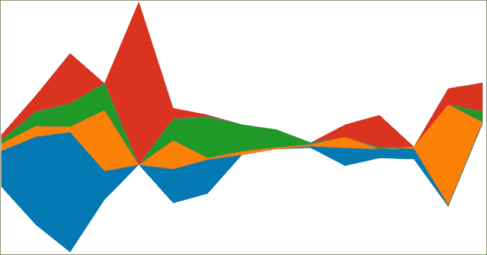

此图使我们能够看到每个数据系列在每次测量点如何相互关联。在某种程度上，它就像堆叠区域图，但与每个都固定在共同的基线不同，图表的底部位置也可以变化。

示例首先加载数据并设置主要的 SVG 元素：

```js
var url = 'https://gist.githubusercontent.com/d3byex/25129228aa50c30ef01f/raw/4393a0e579cbfd9bb20a431ce93c72fb1ea23537/streamgraph.json';
d3.json(url, function (error, rawData) {
    var width = 960, height = 500;
    var svg = d3.select('body')
        .append('svg')
        .attr({
            'width': width,
            'height': height
        });
```

我们需要对数据进行一些调整，因为布局函数的调用将期望它以与区域图相同的格式，即具有 `x` 和 `y` 属性的对象的数组数组。以下代码创建了这个，使用数组中值的每个位置作为 `x` 值：

```js
var data = Array();
d3.map(rawData, function (d, i) {
    data[i] = d.map(function (i, j) {
        return { x: j, y: i };
    });
});
```

接下来，代码创建轴，其中 *X* 轴是一个线性轴，表示每个系列中的点数：

```js
var numPointsPerLayer = data[0].length;

var xScale = d3.scale.linear()
    .domain([0, numPointsPerLayer - 1])
    .range([0, width]);
```

布局是熟悉的堆叠布局，就像在区域图示例中使用的那样，但我们通过调用 `.offset('wiggle')` 来链式调用：

```js
var layers = d3.layout.stack()
    .offset('wiggle')(data);
```

代码的其余部分继续像区域图一样，使用区域路径生成器和类似缩放的 *Y* 轴。

## 通过多个节点表示流程

与显示连续流动的流图不同，**桑基图**强调流动量的比例变化。这有点像弦图，但桑基图能够可视化比仅两个项目之间的更复杂的流动。

在 Sankey 图中，节点之间的线条宽度表示两个节点之间的流量量。通常，流量从左侧的一个或多个节点开始，通过中间节点，然后终止在右侧的节点上。

示例图表使用可在 [`goo.gl/lgQZBz`](https://goo.gl/lgQZBz) 找到的数据。这些数据包括八个节点的声明以及节点之间的链接和节点之间的流量：

```js
{
"nodes":[
  {"node":0, "name":"Source 1"},
  {"node":1, "name":"Source 2"},
  {"node":2, "name":"First Level Distribution"},
  {"node":3, "name":"Second Level Distribution 1"},
  {"node":4, "name":"Terminus 1"},
  {"node":5, "name":"Terminus 2"},
  {"node":6, "name":"Second Level Distribution 2"},
  {"node":7, "name":"Source 3"}
],
"links":[
  {"source":0, "target":2, "value":6},
  {"source":0, "target":4, "value":2},

  {"source":1, "target":2, "value":4},
  {"source":1, "target":3, "value":2},
  {"source":1, "target":6, "value":1},

  {"source":2, "target":3, "value":5},
  {"source":2, "target":4, "value":3},
  {"source":2, "target":6, "value":2},

  {"source":3, "target":4, "value":4},
  {"source":3, "target":5, "value":4},

  {"source":6, "target":5, "value":5},
  {"source":7, "target":6, "value":2},
  {"source":7, "target":3, "value":1}
] 
}
```

在以下位置可以找到在线示例：

### 注意

bl.ock (10.9): [`goo.gl/exZkI4`](http://goo.gl/exZkI4)

从这些数据生成的 Sankey 图如下所示：

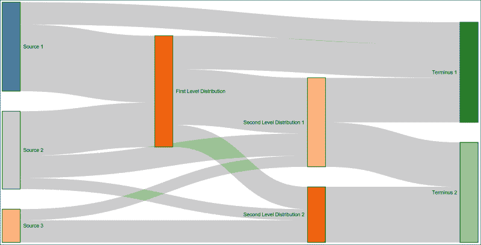

Sankey 布局被视为 D3.js 的一个插件。它不在基础库中，因此您需要检索代码，并确保在您的应用程序中引用它。此代码可在 [`github.com/d3/d3-plugins/tree/master/sankey`](https://github.com/d3/d3-plugins/tree/master/sankey) 找到，或者您可以从本书的示例中获取它。

示例首先通过加载数据并创建主要的 SVG 元素开始：

```js
var url = 'https://gist.githubusercontent.com/d3byex/25129228aa50c30ef01f/raw/e6ea7c4728e45fb8d0464b21686eec806687e117/sankey.json';
d3.json(url, function(error, graph) {
    var width = 950, height = 500;
    var svg = d3.select('body')
        .append('svg')
        .attr({
            width: width,
            height: height
        });
    var mainGroup = svg.append('g');
```

我们使用以下方式创建布局。这里有很多参数可以指定节点的大小、填充、整个图表的大小、在您的数据中获取链接和节点的地方，以及布局指定用于定位节点的迭代次数：

```js
var sankey = d3.sankey()
    .nodeWidth(36)
    .nodePadding(40)
    .size([width, height])
    .nodes(graph.nodes)
    .links(graph.links)
    .layout(10);
```

流路径（链接）通过创建表示流的路径来渲染。路径的结构是通过引用 `sankey.link()` 提供的，这是一个创建流路径数据的函数：

```js
mainGroup.append('g')
    .selectAll('g.link')
    .data(data.links)
    .enter()
    .append('path')
    .attr({
        d: sankey.link(),
        fill: 'none',
        stroke: '#000',
        'stroke-opacity': 0.2,
        'stroke-width': function(d) { return Math.max(1, d.dy) }
    })
    .sort(function(a, b) { return b.dy - a.dy; });
```

现在我们创建一个组来存放节点，并根据布局提供的 `x` 和 `y` 属性将它们放置到合适的位置。`.node` 样式仅用于区分这些组的选择与路径（使用 `.link`）的选择：

```js
var nodes = mainGroup.append('g')
    .selectAll('g.node')
    .data(data.nodes)
    .enter()
    .append('g')
    .attr('transform', function(d) {
        return 'translate(' + d.x + ',' + d.y + ')';
    });
```

然后，我们在组中插入一个彩色矩形：

```js
var color = d3.scale.category20();
nodes.append('rect')
    .attr({
        height: function(d) { return d.dy; },
        width: sankey.nodeWidth(),
        fill: function(d, i) {
            return d.color = color(i);
        },
        stroke: 'black'
    });
```

我们还包含文本来描述节点，并使用一些逻辑来定位标签：

```js
nodes.append('text')
    .attr({
        x: -6,
        y: function(d) { return d.dy / 2; },
        dy: '.35em',
        'text-anchor': 'end'
    })
    .style('font', '10px sans-serif')
    .text(function(d) { return d.name; })
    .filter(function(d) { return d.x < width / 2; })
    .attr({
        x: 6 + sankey.nodeWidth(),
        'text-anchor': 'start'
    });
```

# 摘要

我们在本章中涵盖了大量的内容。总体重点是创建利用 D3.js 布局对象的复杂图表。这些图表包括不同类别的大量图表，包括堆叠、打包、聚类、基于流、层次和径向。

D3.js 的一个优点是它允许您轻松地创建这些复杂视觉效果的便捷性。它们是模式导向的，因此每个的代码通常非常相似，只是布局对象略有不同。

在下一章中，我们将详细探讨一种特定的图形：网络图。这些图扩展了我们本章中看到的一些概念，如流和层次结构，使我们能够可视化非常复杂的数据，如社交网络中的数据。
