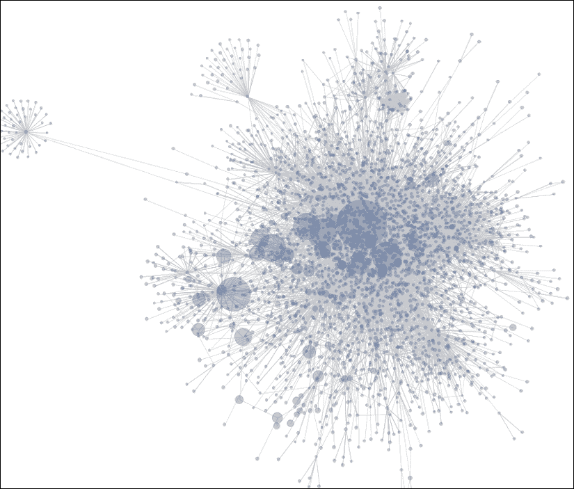
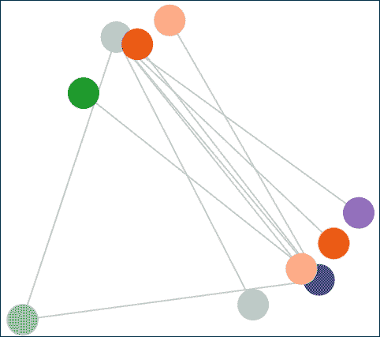
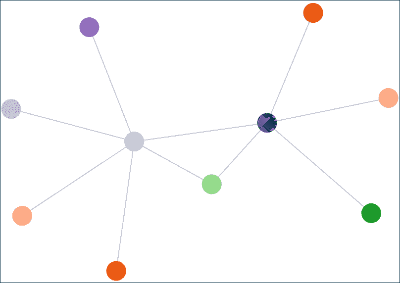
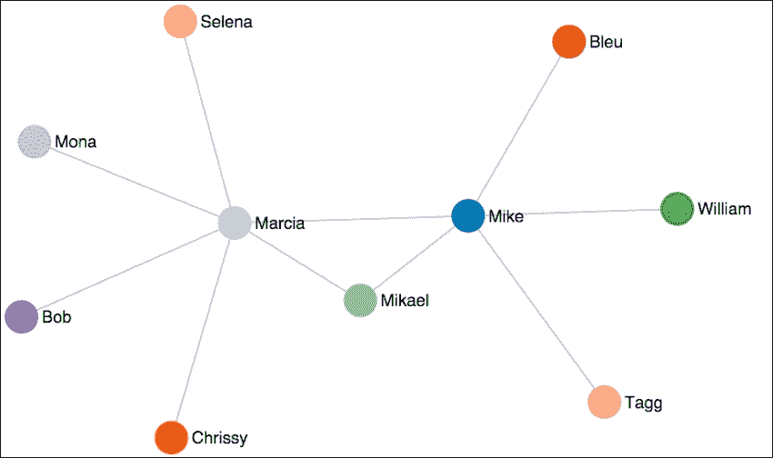
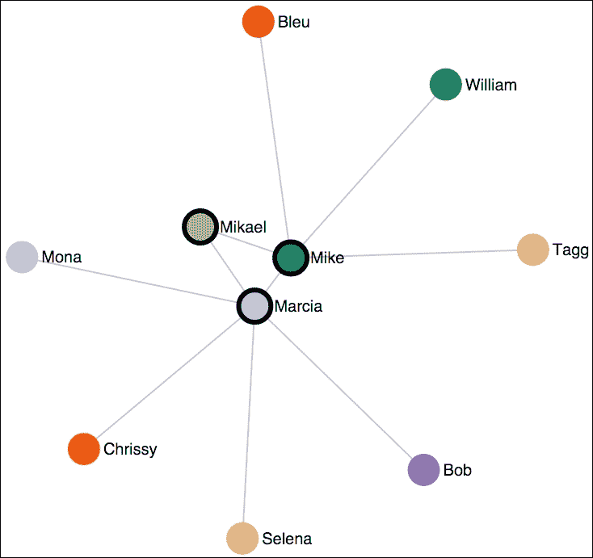
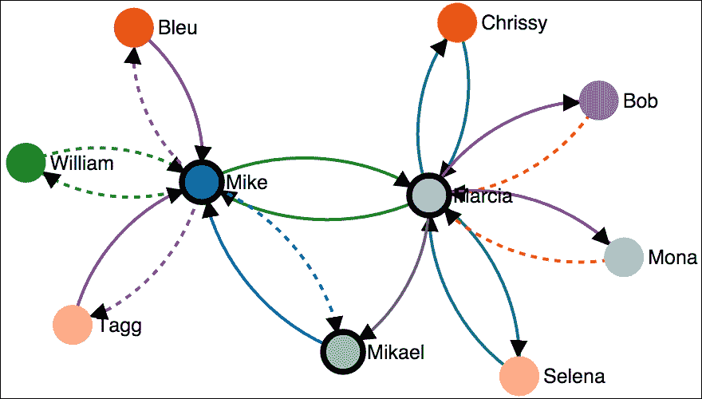

# 第十一章. 信息网络可视化

在本章中，我们将探讨一种称为**力导向图**的具体布局类型。这类可视化通常用于显示网络信息：相互连接的节点。

一种特别常见的网络可视化类型是社交网络中的关系。社交网络的可视化可以帮助你理解不同的人是如何形成各种关系的。这包括其他人之间的链接，以及人们如何形成群体或朋友圈，以及这些群体如何相互关联。

D3.js 提供了使用力导向网络创建非常复杂网络可视化的广泛功能。我们将概述这些图的几个代表性示例，简要介绍它们的工作理论，并深入几个示例以展示它们的创建和使用。

具体来说，在本章中我们将涵盖以下内容：

+   力导向图的简要概述

+   创建基本的力导向图

+   修改链接的长度

+   强制节点相互远离

+   标记节点

+   强制节点保持在原地

+   使用链接视觉表达方向性和类型

# 力导向图的概述

网络数据有多种呈现方式。其中一种特别常见的方式，我们将在本章中探讨，就是使用一类称为力导向布局的算法。

这些算法在二维或三维空间中定位图中的节点。定位是通过沿边和节点分配力来完成的，然后使用这些力来模拟将节点移动到整个系统中能量最小化的位置。

以下是从维基百科中选取的力导向图的代表性图片。节点是页面，节点之间的线条代表页面之间的链接。节点的大小根据特定节点的链接数量而变化：



力导向图的基本组成部分是图中的节点以及这些节点之间的关系。图是迭代布局的，通常在过程中进行动画处理，并且可能需要相当多的迭代才能**稳定**。

D3.js 中的力布局算法考虑了许多因素。算法的一些重要参数以及它们如何影响模拟如下：

+   **大小（宽度和高度）**：这代表图表的整体大小，以及重心，通常是图表的中心。图中的节点将倾向于移动到这个点。如果节点没有初始的`x`和`y`位置，那么它们将在`x`方向的 0 到宽度之间和`y`方向的 0 到高度之间随机放置。

+   **电荷**：这描述了一个节点吸引其他节点的程度。负值会推开其他节点，而正值会吸引。任一方向的值越大，该方向的力就越强。

+   **电荷距离**：这指定了电荷有效作用的最大距离（默认为无穷大）。较小的值有助于布局的性能，并导致节点在簇中的布局更加局部化。

+   **摩擦力**：表示速度延迟的量。此值应在 `[0, 1]` 范围内。在布局的每个时间点，每个节点的速度都会乘以这个值。因此，使用 0 的值将使所有节点保持在原地，而 `1` 则表示无摩擦的环境。介于两者之间的值最终会减慢节点的速度，使整体运动足够小，当总移动量低于布局阈值时，模拟可以被认为是完成的，此时图被称为稳定。

+   **链接距离**：这指定了模拟结束时节点之间的期望距离。在模拟的每个时间点，链接节点之间的距离与这个值进行比较，节点会向彼此移动或远离彼此，以尝试达到期望的距离。

+   **链接强度**：这是一个 `[0, 1]` 范围内的值，指定了在模拟过程中链接距离的可拉伸性。0 的值是刚性的，而 `1` 是完全灵活的。

+   **重力**：这指定了每个节点对布局中心的吸引力。这是一个弱几何约束。也就是说，整体重力越高，它就越远离渲染中心。此值对于保持布局在图中的相对居中以及防止断开连接的节点飞向无穷远是有用的。

我们将介绍足够的这些参数，以便能够制作有用的可视化。

### 注意

所有布局参数的更多详细信息可在 [`github.com/mbostock/d3/wiki/Force-Layout`](https://github.com/mbostock/d3/wiki/Force-Layout) 找到。

除了有助于节点实际布局的参数外，还可以使用其他视觉元素在力导向图中传达底层信息中的各种值：

+   节点的颜色可以用来区分特定类型的节点，例如人们与雇主之间的区别，或者根据它们的关系，例如所有在特定雇主工作的个人，或者节点与另一个节点之间的分离度数。

+   节点的大小，通常表示节点的重要性程度。通常，链接的数量会影响节点的大小。

+   链接的渲染厚度可以用来表明某些链接比其他链接有更大的影响力，或者链接是特定类型的，即公路与铁路。

+   链接的方向性，表明链接要么没有方向性，要么是一向或双向的。

# 一个简单的力导向图

我们的第一个示例将演示如何构建一个力导向图。在线示例可在以下链接找到：

### 注意

bl.ock (11.1): [`goo.gl/ZyxCej`](http://goo.gl/ZyxCej)

我们所有的力导向图都将从加载表示网络的表示数据开始。此示例使用[`gist.githubusercontent.com/d3byex/5a8267f90a0d215fcb3e/raw/ba3b2e3065ca8eafb375f01155dc99c569fae66b/uni_network.json`](https://gist.githubusercontent.com/d3byex/5a8267f90a0d215fcb3e/raw/ba3b2e3065ca8eafb375f01155dc99c569fae66b/uni_network.json)中的数据。

以下是在前一个链接中文件的包含内容：

```js
{
  "nodes": [
    { "name": "Mike" },
    { "name": "Marcia" },
    { "name": "Chrissy" },
    { "name": "Selena" },
    { "name": "William" },
    { "name": "Mikael" },
    { "name": "Bleu" },
    { "name": "Tagg" },
    { "name": "Bob" },
    { "name": "Mona" }
  ],
  "edges": [
    { "source": 0, "target":  1 },
    { "source": 0, "target":  4 },
    { "source": 0, "target":  5 },
    { "source": 0, "target":  6 },
    { "source": 0, "target":  7 },
    { "source": 1, "target":  2 },
    { "source": 1, "target":  3 },
    { "source": 1, "target":  5 },
    { "source": 1, "target":  8 },
    { "source": 1, "target":  9 },
  ]
}
```

D3.js 中的力导向布局算法需要数据以这种格式。这需要是一个具有`nodes`和`edges`属性的对象。`nodes`属性可以是任何其他你喜欢的对象的数组。这些通常是你的数据项。

`edges`数组必须由同时具有`source`和`target`属性的对象组成，每个对象的值是对`nodes`数组中源节点和目标节点的索引。你可以添加其他属性，但我们至少需要提供这两个。

要开始渲染图形，我们加载这些数据并创建主要的 SVG 元素：

```js
var url = 'https://gist.githubusercontent.com/d3byex/5a8267f90a0d215fcb3e/raw/ba3b2e3065ca8eafb375f01155dc99c569fae66b/uni_network.json';
d3.json(url, function(error, data) {
    var width = 960, height = 500;
    var svg = d3.select('body').append('svg')
        .attr({
            width: width,
            height: height
        });
```

下一步是使用`d3.layout.force()`创建图的布局。有许多选项，其中一些我们将在示例中探讨，但我们从以下选项开始：

```js
var force = d3.layout.force()
    .nodes(data.nodes)
    .links(data.edges)
    .size([width, height])
    .start();
```

这通过`.node()`和`.link()`函数分别通知布局关于节点和链接的位置。调用`.size()`通知布局要约束布局的面积，并对图有两个影响：重力中心和初始随机位置。

调用`.start()`开始模拟，必须在创建布局并分配节点和链接之后调用。如果节点和链接之后发生变化，可以再次调用它来重新启动模拟。请注意，模拟是在此函数返回后开始，而不是立即开始。因此，你仍然可以对视觉进行其他更改。

现在我们可以渲染链接和节点：

```js
var edges = svg.selectAll('line')
    .data(data.edges)
    .enter()
    .append('line')
    .style('stroke', '#ccc')
    .style('stroke-width', 1);

var colors = d3.scale.category20();
var nodes = svg
    .selectAll('circle')
    .data(data.nodes)
    .enter()
    .append('circle')
    .attr('r', 10)
    .attr('fill', function(d, i) {
        return colors(i);
    })
    .call(force.drag);
```

注意，我们还链式调用了`.call()`函数，传递给它我们布局的`force.drag`函数的引用。此函数由布局对象提供，以便我们能够轻松地拖动网络中的节点。

需要执行的一个额外步骤是。力导向布局是一种模拟，由一系列必须处理的**tick**组成。每个 tick 代表布局算法已经遍历了节点并重新计算了它们的位置，这为我们提供了重新定位可视元素的机会。

要连接到 tick，我们可以使用`force.on()`函数，告诉它我们想要监听`tick`事件，并在每个事件上调用一个函数，以便我们能够重新定位我们的视觉元素。以下是我们为此活动编写的函数：

```js
force.on('tick', function() {
    edges.attr({
        x1: function(d) { return d.source.x; },
        y1: function(d) { return d.source.y; },
        x2: function(d) { return d.target.x; },
        y2: function(d) { return d.target.y; }
    });

    nodes.attr('cx', function(d) { return d.x; })
         .attr('cy', function(d) { return d.y; });
});
```

在每个时钟周期，我们需要适当地重新定位每个节点和边。注意我们是如何做到这一点的。D3.js 为我们的数据添加了 `x` 和 `y` 属性，这些是计算出的位置。它还为每个数据节点添加了 `px` 和 `py` 属性，代表之前的 `x` 和 `y` 位置。

### 注意

您还可以使用 `start` 和 `end` 作为 `on()` 方法的参数，以捕获模拟开始和完成时的状态。

运行此程序后，输出将类似于以下内容：


每次执行此示例时，节点将位于不同的位置。这是由于算法为每个节点指定了一个随机的起始位置。

在这个例子中，节点非常接近，以至于链接几乎看不见。但您可以使用鼠标拖动节点，这将显示链接。同时请注意，布局在您拖动时执行，当拖动的节点被释放时，节点会跳回到中间。

# 使用链接距离来分散节点

在前面的例子中，这些节点太靠近了，我们很难看到边缘。为了在节点之间增加更多距离，我们可以指定链接距离。以下示例演示了这一点：

### 注意

bl.ock (11.2): [`goo.gl/dd1T3O`](http://goo.gl/dd1T3O)

此示例对上一个示例所做的唯一修改是增加链接距离到 `200`（默认为 `20`）：

```js
var force = d3.layout.force()
    .nodes(data.nodes)
    .links(data.edges)
    .size([width, height])
    .linkDistance(200)
    .start();
```

这种修改导致模拟结束时节点间距更好：



拖动节点。这将演示一些在游戏中起作用的物理现象：

+   无论您移动哪个节点，图都会回到可视化的中心。这是重力对布局的影响，以及它被放置在中心的效果。

+   节点总是聚集在一起，但总是至少保持链接距离。重力将它们吸引到中心，默认电荷 `-30` 使节点相互推开，但不足以拉伸链接或使节点逃离重力中心。

+   前面的观点在可视化结果中有一个重要的推论。节点之间的链接通常会交叉。在许多网络可视化中，人们希望尝试使链接不交叉，因为这简化了跟踪链接的能力，从而简化了关系。我们将在下一个示例中探讨如何解决这个问题。

# 为节点添加排斥力以防止交叉链接

我们尝试防止交叉链接的方法是为每个节点应用一定量的排斥力。当排斥力超过重心的拉力时，节点可以远离这一点。它们也会远离其他节点，倾向于将结果图扩展到最大尺寸，从而造成链接不交叉的效果。

以下示例演示了节点排斥：

### 注意

bl.ock (11.3): [`goo.gl/PCHK68`](http://goo.gl/PCHK68)

此示例对之前的示例进行了两项修改：

```js
var force = d3.layout.force()
    .nodes(data.nodes)
    .links(data.edges)
    .size([width, height])
    .linkDistance(1)
    .charge(-5000)
    .start();
```

这创建了一个值为`-5000`的电荷，这意味着节点实际上相互排斥。还有一个较小的链接距离，因为排斥力会将节点推开很多，因此拉伸了链接。如果将链接保持在`200`，会使链接非常长。

当这个模拟完成时，你将得到一个如下所示的图形：



注意节点现在如何尽可能地彼此远离！链接也被拉伸了很多，尽管链接距离设置为`1`。链接默认是弹性的，会根据系统中的电荷和重力拉伸或压缩。

重复运行此模拟。你会注意到它几乎总是收敛到这个相同的形状，节点在图中的相对位置相同（组本身可能每次都会旋转不同的角度）。在非常罕见的情况下，可能仍然存在交叉边，但排斥力设置得足够高，以防止这种情况在大多数执行中出现。

## 节点标注

我们在力导向图中缺少的是节点标注，这样我们就可以知道节点代表什么数据。以下示例演示了如何向节点添加标签：

### 注意

bl.ock (11.4): [`goo.gl/31VfSU`](http://goo.gl/31VfSU)

在此先前的示例中，与之前不同之处在于，我们不是用一个单独的圆形 SVG 元素来表示一个节点，而是用一个包含圆形和文本元素的组来表示：

```js
var nodes = svg.selectAll('g')
    .data(data.nodes)
    .enter()
    .append('g')
    .call(force.drag);

var colors = d3.scale.category20();
nodes.append('circle')
    .attr('r', 10)
    .attr('fill', function (d, i) {
        return colors(i);
    })
    .call(force.drag);

nodes.append('text')
    .attr({
            dx: 12,
            dy: '.35em',
            'pointer-events': 'none'
        })
.style('font', '10px sans-serif')
.text(function (d) { return d.name });
```

然后在处理 tick 事件的过程中，我们需要进行一个额外的更改。由于我们现在需要定位 SVG 组而不是圆形，因此此代码需要将组转换到位置而不是使用`x`和`y`属性：

```js
force.on('tick', function () {
    edges.each(function (d) {
        d3.select(this).attr({
            x1: d.source.x,
            y1: d.source.y,
            x2: d.target.x,
            y2: d.target.y
        });
    });

    nodes.attr('transform', function (d) { 
    return 'translate(' + d.x + ',' + d.y + ')'; 
    });
});
```

此示例的结果现在看起来如下：



## 使节点固定在位置

在检查力网络中的节点时，一个常见且令人沮丧的问题是，当你移动一簇其他节点中的一个节点以更好地查看它，然后释放它时，它会回到原来的位置。我敢打赌，你已经在使用这些示例时经历过这种疯狂。

这可以通过使用一个称为使节点粘性的概念来解决。以下示例演示了这一操作：

### 注意

bl.ock (11.5): [`goo.gl/nmQu3d`](http://goo.gl/nmQu3d)

现在，当你拖动一个节点时，它将停留在你放置的位置。固定位置的节点将变为具有粗黑边框。要释放一个节点，双击它，它将被放回力布局中。

以下图像显示了三个固定位置的节点：



现在我们来检查需要进行的修改。这是通过向我们的代码中添加几个函数链来创建圆圈来实现的：

```js
nodes.append('circle')
    .attr('r', 10)
    .attr({
        r: 10,
        fill: function(d, i) {
            return colors(i);
        },
        stroke: 'black',
        'stroke-width': 0
    })
    .call(force.drag()
        .on("dragstart", function(d) {
            d.fixed = true;
            d3.select(this).attr('stroke-width', 3);
        }))
    .on('dblclick', function(d) {
        d.fixed = false;
        d3.select(this).attr('stroke-width', 0);
    });
```

当圆圈首次创建时，除了指定填充颜色外，它还将有一个黑色但宽度为 `0` 的描边颜色。

然后，我们不再使用 `.call(force.drag)`，而是用自定义的拖动实现来替换它。在拖动开始时，代码将数据对象上的属性 `fixed` 设置为 `true`。如果力导向布局对象看到该对象具有此属性，并且其值为 `true`，则它将不会尝试重新定位项目。然后，边框被设置为宽度为三像素。

最后的修改是处理 `dblclick` 鼠标事件，该事件将固定属性设置为 `false`，使节点成为布局的一部分，然后隐藏粗边框。

## 为链接添加方向性标记和样式

节点之间的关系可以是单向的或双向的。我们之前编写的代码假设是单向的，或者可能是非定向的。现在让我们看看我们如何通过在线条上添加箭头来表达关系的方向。

我们将要创建的例子将假设数据中边集合的每个条目代表从源到目标的一个单向链接。如果存在双向链接，则 `edges` 中将有一个额外的条目，其源和目标被反转。

这个例子将使用来自 [`gist.githubusercontent.com/d3byex/5a8267f90a0d215fcb3e/raw/8469d2a7da14c1c8180ebb2ea8ddf1e2944f990c/multi_network.html`](https://gist.githubusercontent.com/d3byex/5a8267f90a0d215fcb3e/raw/8469d2a7da14c1c8180ebb2ea8ddf1e2944f990c/multi_network.html) 的数据，该数据添加了几个双向链接以及一个 `type` 属性来指定关系的类型。

在这个数据中的边集合如下。节点没有变化：

```js
"edges": [
  { "source": 0, "target":  1, "type": "spouse" },
  { "source": 1, "target":  0, "type": "spouse" },
  { "source": 0, "target":  4, "type": "coworker"},
  { "source": 4, "target":  0, "type": "coworker"},
  { "source": 0, "target":  5, "type": "father" },
  { "source": 5, "target":  0, "type": "son" },
  { "source": 0, "target":  6, "type": "master" },
  { "source": 6, "target":  0, "type": "pet" },
  { "source": 0, "target":  7, "type": "master" },
  { "source": 1, "target":  2, "type": "spouse" },
  { "source": 1, "target":  3, "type": "friend" },
  { "source": 1, "target":  5, "type": "mother" },
  { "source": 1, "target":  8, "type": "pet" },
  { "source": 8, "target":  1, "type": "master" },
  { "source": 1, "target":  9, "type": "pet" },
  { "source": 5, "target": 10, "type": "pet" }
]
```

### 注意

bl.ock (11.6): [`goo.gl/hucTe1`](https://goo.gl/hucTe1)

下面的图像展示了这个例子的结果：



让我们看看代码是如何创建这个可视化的。

在这个例子中，首先改变的是它使用样式来为不同类型的链接着色：

```js
.link {
    fill: none;
    stroke: #666;
    stroke-width: 1.5px;
}

.link.spouse {
    stroke: green;
}

.link.son {
    stroke: blue;
}

.link.father {
    stroke: blue;
    stroke-dasharray: 0, 2, 1;
}

.link.friend {
    stroke: teal;
}

.link.pet {
    stroke: purple;
}

.link.master {
    stroke: purple;
    stroke-dasharray: 0, 2, 1;
}

.link.ruler {
    stroke: red;
    stroke-dasharray: 0, 2, 1;
}

.link.coworker {
    stroke: green;
    stroke-dasharray: 0, 2, 1;
}
```

加载数据和设置 SVG 元素以及力导向布局的代码与上一个例子相同。另一个区别是代码需要确定特定的链接类型，因为它们将被用于标记和样式：

```js
var linkTypes = d3.set(data.edges.map(function (d) {
    return d.type;
})).values();
```

接下来，为每个链接类型创建了标记。这些将通过设置 `d` 属性的最后一个链式函数来渲染带有箭头的曲线路径：

```js
svg.append("defs")
    .selectAll("marker")
    .data(linkTypes)
    .enter()
    .append("marker")
    .attr({
        id: function (d) { return d; },
        viewBox: "0 -5 10 10",
        refX: 15,
        refY: -1.5,
        markerWidth: 6,
        markerHeight: 6,
        orient: "auto"
    })
    .append("path")
    .attr("d", "M0,-5L10,0L0,5"); 
```

下一步是创建边：

```js
var edges = svg.append("g")
    .selectAll("path")
    .data(force.links())
    .enter()
    .append("path")
    .attr("class", function (d) {
        return "link " + d.type;
    })
    .attr("marker-end", function(d) {
         return "url(#" + d.type + ")";
    }); 
```

代码现在使用路径而不是线条。路径的 `d` 属性在此时尚未指定。它将在模拟的每个刻度时设置。此路径通过将类型作为类名的一部分来引用一种样式，而 `marker-end` 属性指定了用于此段落的标记定义。

圆圈和文本的创建方式与上一个示例相同，最后的变化是将刻度处理程序修改为不仅重新定位节点，而且根据弧线重新生成路径：

```js
force.on("tick", function () {
    edges.attr("d", function (d) {
        var dx = d.target.x - d.source.x,
            dy = d.target.y - d.source.y,
            dr = Math.sqrt(dx * dx + dy * dy);
        return "M" + d.source.x + "," + d.source.y + "A" +
                dr + "," + dr + " 0 0,1 " +
                d.target.x + "," + d.target.y;
    });
    nodes.attr("transform", function (d) {
        return "translate(" + d.x + "," + d.y + ")";
    });
}); 
```

# 摘要

在本章中，我们解释了如何使用 D3.js 生成力导向图。这类图是一些最有趣的图之一，可以用来可视化大量相互连接的数据，例如社交网络。

本章从介绍创建图的基本概念开始，通过一个逐步改进的示例来展示如何几个参数影响图表的结果。

我们随后介绍了几种增强和使图表更易于使用的技巧。这些包括用文本标记节点、用图像替换节点以及为显示方向和类型而着色链接。

在下一章中，我们将介绍如何使用 D3.js 创建地图。我们还将学习很多关于 GeoJSON 和 TopoJSON 的知识，这两者结合 D3.js 可以让我们基于地理数据创建复杂的视觉图表。
