# 第十二章. 使用 GeoJSON 和 TopoJSON 创建地图

D3.js 提供了广泛的创建地图的能力，并帮助您将数据作为地图的一部分或作为叠加层来展示。D3.js 中的映射函数利用一种称为 GeoJSON 的数据格式，这是一种编码地理信息的 JSON 格式。

D3.js 中地图的另一种常见数据类型是 TopoJSON。TopoJSON 是 GeoJSON 的更压缩形式。这两种格式都用于表示创建地图所需的制图信息，D3.js 处理这些数据并执行其将信息转换为可视化地图的 SVG 路径的常规魔法。

本章将从 GeoJSON 和 TopoJSON 的简要概述开始。这将为您理解如何使用 D3.js 表示和渲染地图奠定基础。然后，我们将通过使用这两种数据格式渲染各种类型的地图、根据数据对地图内的几何形状进行着色以及在这些地图的特定位置叠加信息，进入许多示例。

本章我们将涵盖的具体主题包括：

+   TopoJSON 和 GeoJSON 的简要概述

+   使用 GeoJSON 绘制美国地图

+   使用 TopoJSON 绘制世界各国的地图

+   为构成地图的几何形状设置样式

+   地图的平移和缩放

+   与地球仪的交互

+   在 `mouseover` 事件中突出显示几何形状的边界

+   在地图的特定位置添加符号

+   根据数据（使用渐变）渲染区域地图

# 介绍 TopoJSON 和 GeoJSON

几乎所有的 D3.js 地图示例都将使用 **GeoJSON** 或 **TopoJSON**。GeoJSON 是一种开放、标准的基于 JSON 的格式，用于表示基本地理特征以及这些特征的非空间属性（如城市或地标的名字）。

GeoJSON 的核心几何形状是点、线字符串和多边形。GeoJSON 实体的基本描述使用以下语法：

```js
{ 
    "type": name of the type of geometry (point, line string, ...)
    "coordinates": one or more tuple of latitude / longitude
}
```

让我们看看 GeoJSON 中可用的四种基本几何类型。一个 **点** 表示二维空间中的一个位置，由一对纬度和经度组成。点通常用于指定地图上某个要素的位置（例如建筑物）：

| 示例 | 代表性 GeoJSON |
| --- | --- |
| 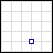 |

```js
{
    "type": "Point", 
    "coordinates": [30, 10]
}
```

|

`LineString` 描述了一系列点，这些点之间用线连接，从第一个点开始，经过所有中间点，最后到达最后一个坐标。这个名字让人联想到在所有点之间拉紧一根线的景象。这些形状通常用于表示诸如道路或河流等物品：

| 示例 | 代表性 GeoJSON |
| --- | --- |
| 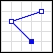 |

```js
{ 
    "type": "LineString", 
    "coordinates": [
        [30, 10], [10, 30], 
        [40, 40] ]
}
```

|

**多边形** 是一个闭合形状，通常由三个或更多点组成，其中最后一个点与第一个点相同，形成一个闭合形状。其 JSON 表示如下；请注意，坐标是一个元组的数组数组：

| 示例 | 代表性 GeoJSON |
| --- | --- |
| 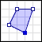 |

```js
{ 
    "type": "Polygon", 
    "coordinates": 
    [
        [[30, 10], [40, 40],
         [20, 40], [10, 20], 
         [30, 10]] 
    ]
}
```

|

数组数组的目的是允许定义多个多边形，这些多边形相互排斥，从而允许在多边形区域内排除一个或多个多边形区域：

| 示例 | 代表性 GeoJSON |
| --- | --- |
| 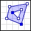 |

```js
{ 
    "type": "Polygon", 
    "coordinates": 
        [
          [[35, 10], [45, 45], 
           [15, 40], [10, 20], 
           [35, 10]], 
          [[20, 30], [35, 35],
           [30, 20], [20, 30]] 
        ]
}
```

|

可以定义多部分几何形状，其中特定的几何类型被重用，并且坐标描述了该几何类型的多个实例。这些类型是前面带有 *Multi* 的类型——`MultiPoint`、`MultiLineString` 和 `MultiPolygon`。每个类型如下所示：

| 类型 | 示例 | 代表性 GeoJSON |
| --- | --- | --- |
| 多点 | 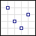 |

```js
{ 
    "type": "MultiPoint", 
    "coordinates": 
     [[10, 40], [40, 30], 
      [20, 20], [30, 10]]
}
```

|

| 多线字符串 | 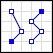 |
| --- | --- |

```js
{ 
"type": MultiLineString", 
   "coordinates": 
   [
     [[10, 10], [20, 20],
      [10, 40]], 
    [[40, 40], [30, 30], 
     [40, 20], [30, 10]] 
   ]
}
```

|

| 多边形 | 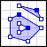 |
| --- | --- |

```js
{ 
    "type": "MultiPolygon", 
    "coordinates": [
        [ [[40, 40], [20, 45], [45, 30], [40, 40]] ], 
        [ [[20, 35], [10, 30], [10, 10], [30, 5], [45, 20],
           [20, 35]], 
          [[30, 20], [20, 15], [20, 25], [30, 20]]  ]  ]
}
```

|

这些基本几何形状可以封装在一个 **特性** 中。特性包含一个几何形状和一组属性。例如，以下定义了一个包含点几何形状的特性，并且具有单个属性 `name`，可以用来描述该特性的名称：

```js
{
  "type": "Feature",
  "geometry": {
    "type": "Point",
    "coordinates": [46.862633, -114.011593]   
  },
  "properties": {
    "name": "Missoula"  
   }
}
```

我们可以在层次结构中再上升一级，并定义称为 **特性集合** 的概念：

```js
{ 
    "type": "FeatureCollection",
    "features": [
      { "type": "Feature",
        "geometry": {"type": "Point", 
        "coordinates": [102.0, 0.5]},
        "properties": {"prop0": "value0"} },
      { "type": "Feature",
        "geometry": {
          "type": "LineString",
          "coordinates": [
            [102.0, 0.0], [103.0, 1.0],[104.0, 0.0], [105.0, 1.0]]
          },
        "properties": { "prop0": "value0", "prop1": 0.0 }
        },
      { "type": "Feature",
         "geometry": {
           "type": "Polygon",
           "coordinates": [
             [ [100.0, 0.0], [101.0, 0.0], [101.0, 1.0],
               [100.0, 1.0], [100.0, 0.0] ]  ]
         },
         "properties": {
           "prop0": "value0", "prop1": {"this": "that"} }
         }
       ]
     }
```

通过组合几何形状、特性和特性集合，可以描述非常复杂的形状，如地图。

但 GeoJSON 的问题之一是它非常冗长，并且特定的几何形状和特性不能被重用。如果需要在多个位置使用相同的几何形状，则必须完全重新指定第二次。

为了帮助解决这个问题，TopoJSON 被创建出来。TopoJSON 为拓扑编码和重用提供了额外的结构。而不是离散地描述每个几何形状，TopoJSON 允许你定义几何形状，然后使用称为 **弧** 的概念将它们拼接在一起。

Arcs 允许 TopoJSON 消除冗余，并提供比 GeoJSON 更紧凑的表示形式。据称，TopoJSON 通常可以提供比 GeoJSON 高达 80% 的压缩率。考虑到网页下载的每一毫秒都很重要，这对于使用大量几何数据集的用户体验来说可能非常关键。

TopoJSON 的完整解释超出了本书的范围，但为了简要展示它，我们可以查看以下内容并简要检查其内容：

```js
{
  "type": "Topology",
  "objects": {
    "example": {
      "type": "GeometryCollection",
      "geometries": [
        { "type": "Point",
          "properties": {
            "prop0": "value0" },
          "coordinates": [102, 0.5]
        },
        { "type": "LineString",
          "properties": {
            "prop0": "value0",
            "prop1": 0 },
          "arcs": [0]
        },
        { "type": "Polygon",
          "properties": {
            "prop0": "value0",
            "prop1": {
              "this": "that"
            }
          },
          "arcs": [[-2]]
        }
      ]
    }
  },
  "arcs": [
    [[102, 0], [103, 1], [104, 0], [105, 1]],
    [[100, 0], [101, 0], [101, 1], [100, 1], [100, 0]]  ]
}
```

此 TopoJSON 对象有三个属性：`type`、`objects` 和 `arcs`。`type` 的值始终为 `"topology"`。`objects` 属性由一个类似于 GeoJSON 中的几何形状集合组成，不同之处在于，对象可以指定一个或多个弧，而不是坐标。

弧是 TopoJSON 与 GeoJSON 之间的主要区别，代表了重用的手段。弧属性提供了一个位置数组的数组，其中位置本质上是一个坐标。

这些弧是通过基于 0 的数组语义的几何形状引用的。因此，前述代码中的 `LineString` 几何形状通过指定 `arcs[0]` 来引用拓扑对象中的第一个弧。

多边形对象引用了一个值为 `-2` 的弧。负弧值指定了应该利用的弧的补码。这本质上意味着弧中的位置应该被反转。因此，`-2` 指示获取第二个弧的反转位置。这是 TopoJSON 用来重用和压缩数据的一种策略。

还有其他选项，例如变换和边界框，以及其他规则。对于更详细的规范，请参阅[`github.com/mbostock/topojson-specification`](https://github.com/mbostock/topojson-specification)。

### 注意

关于 TopoJSON 的重要事项是，D3.js 本身仅使用 GeoJSON 数据。要使用 TopoJSON 格式的数据，您需要使用可在[`github.com/mbostock/topojson`](https://github.com/mbostock/topojson)找到的 TopoJSON 插件。此插件将 TopoJSON 转换为 D3.js 函数可以使用的 GeoJSON，从而为您的 D3.js 应用程序提供 TopoJSON 的功能。

# 创建美国地图

我们的第一批示例将探讨创建美国地图的过程。我们将从一个加载数据并渲染地图的示例开始，然后我们将检查如何对地图进行样式化以使其更易于观察，接着将展示如何修改投影以更有效地渲染内容。

## 使用 GeoJSON 创建我们第一张美国地图

我们的第一张地图将渲染美国地图。我们将使用一个 GeoJSON 数据文件，`us-states.json`，该文件可在[`gist.githubusercontent.com/d3byex/65a128a9a499f7f0b37d/raw/176771c2f08dbd3431009ae27bef9b2f2fb56e36/us-states.json`](https://gist.githubusercontent.com/d3byex/65a128a9a499f7f0b37d/raw/176771c2f08dbd3431009ae27bef9b2f2fb56e36/us-states.json)找到。以下是该文件的几行内容，展示了州形状在文件中的组织方式：

```js
{"type":"FeatureCollection","features":[
  { "type": "Feature",
    "id": "01",
    "properties": { "name": "Alabama" },
    "geometry": {
      "type": "Polygon",
      "coordinates": [ [
          [ -87.359296, 35.00118 ], [ -85.606675, 34.984749 ], 
          [ -85.431413, 34.124869 ], [ -85.184951, 32.859696 ], 
          [ -85.069935, 32.580372 ], [ -84.960397, 32.421541 ],
          [ -85.004212, 32.322956 ], [ -84.889196, 32.262709 ], 
...
```

顶级 `FeatureCollection` 包含一个特征数组，每个元素都是一个州（或地区）以及华盛顿特区。每个州都是一个特征，具有单个属性 `Name`，以及一个表示州轮廓的多边形几何形状，该轮廓以经纬度元组表示。

示例的代码可在以下链接找到：

### 注意

bl.ock (12.1): [`goo.gl/dzKsVd`](http://goo.gl/dzKsVd)

打开 URL 后，您将看到以下地图：

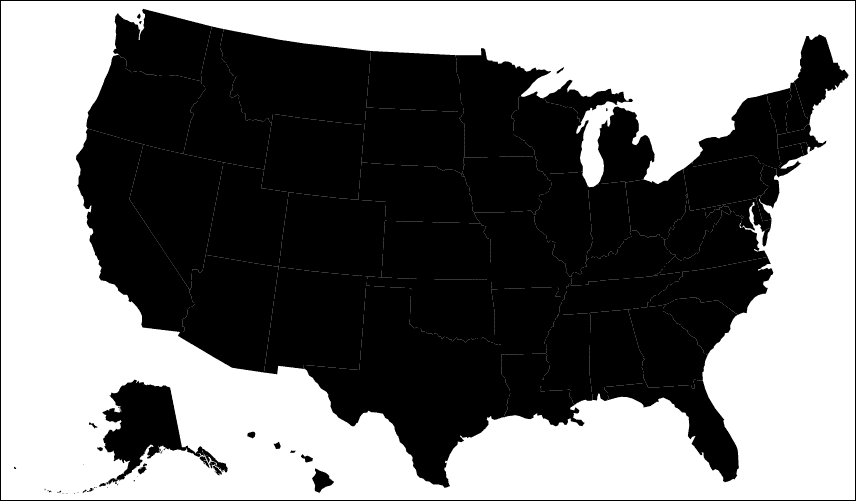

生成此地图所需的数据和渲染代码非常简单（按设计）。它首先创建主 SVG 元素：

```js
var width = 950, height = 500;
var svg = d3.select('body')
    .append('svg')
    .attr({
        width: width,
        height: height
    });
```

GeoJSON 只是 JSON，可以用 `d3.json()` 加载：

```js
var url = 'https://gist.githubusercontent.com/d3byex/65a128a9a499f7f0b37d/raw/176771c2f08dbd3431009ae27bef9b2f2fb56e36/us-states.json';
d3.json(url, function (error, data) {
    var path = d3.geo.path();
    svg.selectAll('path')
        .data(data.features)
        .enter()
        .append('path')
        .attr('d', path);
});
d3.json("/data/us-states.json", function (error, data) {
```

一旦我们有了数据，我们就可以创建一个 `d3.geo.path()`。此对象具有将 GeoJSON 中的要素转换为 SVG 路径的智能。然后代码将路径添加到主 SVG 元素中，绑定数据，并将路径的 `d` 属性设置为我们的 `d3.geo.path()` 对象。

哇，仅仅用几行代码，我们就绘制了一张美国地图！

# 美国地图的样式化

总体来说，这张图片比较暗，各州之间的边界并不特别明显。我们可以通过提供用于渲染地图的填充和描边值样式来改变这一点。

此示例的代码位于以下链接：

### 注意

bl.ock (12.2): [`goo.gl/chhKjz`](https://goo.gl/chhKjz)

当打开此 URL 时，您将看到以下地图：

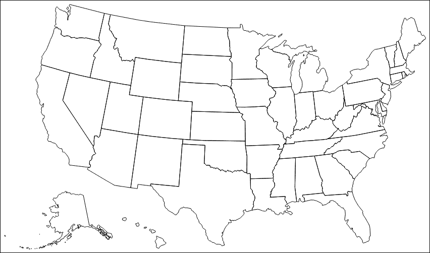

与前一个示例的唯一不同之处在于将填充设置为透明，并将边界设置为黑色：

```js
svg.selectAll('path')
   .data(data.features)
   .enter()
   .append('path')
   .attr('d', path)
      .style({ fill: 'none', stroke: 'black' });
```

## 使用 albersUsa 投影

您可能对前两个示例中的地图有一些疑问。首先，地图是如何缩放到 SVG 元素的大小？其次，我能改变这个比例吗？为什么阿拉斯加和夏威夷被画在墨西哥通常所在的位置？

这些与一些关于**投影**的基本假设有关。投影是将地理数据（二维数据，纬度和经度），但实际上是在一个三维球体（地球）上，渲染到具有特定尺寸的二维表面上（您的计算机屏幕或浏览器视口）的一种方式。

在此示例中，D3.js 对这些因素做了一些隐含的假设。为了帮助说明这些假设，假设我们将 SVG 元素的大小更改为 500 x 250。运行此操作时，我们得到以下输出：

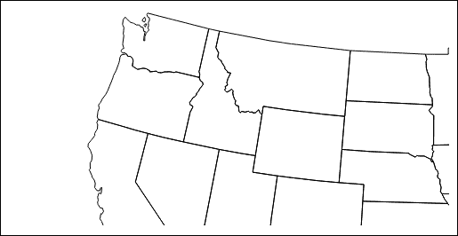

创建此代码的代码位于以下位置。与前一个示例相比，唯一的区别是 SVG 元素的宽度和高度都减半了：

### 注意

bl.ock (12.3): [`goo.gl/41wyCY`](http://goo.gl/41wyCY)

结果是实际渲染的大小相同，但由于容器较小，我们剪掉了地图的下半部和最右边的四分之一。

为什么会这样？这是因为，默认情况下，D3.js 使用一个称为**albersUsa**投影的投影，它附带一些假设：

+   生成的地图尺寸为 1024 x 728

+   地图位于宽度和高度的一半（512，364）

+   投影还将阿拉斯加和夏威夷放在地图的左下角（啊哈！）

要改变这些假设，我们可以使用`d3.geo.albersUsa()`投影对象创建自己的`albersUsa`投影。此对象可用于指定结果的渲染的平移和缩放。

以下示例创建了一个`albersUsa`投影并定位了地图：

### 注意

bl.ock (12.4): [`goo.gl/1e4DGp`](http://goo.gl/1e4DGp)

结果如下：

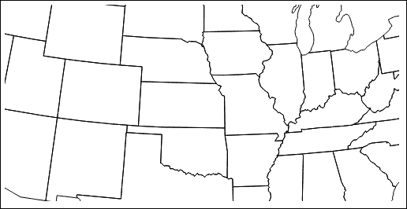

代码创建了一个`d3.geo.albersUsa`投影，并告诉它将美国地图的中心定位在`[width/2, height/2]`：

```js
var projection = d3.geo.albersUsa()
    .translate([width / 2, height / 2]);
```

然后将投影对象分配给`d3.geo.path()`对象，使用其`.projection()`函数：

```js
var path = d3.geo.path()
    .projection(projection);
```

我们已经改变了地图的中心，但比例尺仍然是相同的尺寸。要改变比例尺，我们使用投影的`.scale()`函数。以下示例将比例尺设置为宽度，告诉 D3.js 地图的宽度不应该是 1024，而是`width`和`height`的值：

### 注意

bl.ock (12.5): [`goo.gl/O51jPN`](http://goo.gl/O51jPN)

前面的示例生成了一个正确缩放的地图：

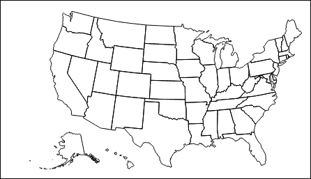

代码中唯一的不同之处在于对投影的`.scale()`的调用：

```js
var projection = d3.geo.albersUsa()
    .translate([width / 2, height / 2])
    .scale([width]);
```

注意，我们只传递了一个比例尺值。投影沿着宽度缩放，然后自动按比例沿高度缩放。

# 创建世界的一个平坦地图

**albersUsa**投影是 D3.js 提供的许多投影对象之一。您可以在[`github.com/mbostock/d3/wiki/Geo-Projections`](https://github.com/mbostock/d3/wiki/Geo-Projections)中查看这些投影的完整列表。

我们没有足够的空间在这个书中展示所有这些，但其中一些值得努力展示几个 TopoJSON 概念。具体来说，我们将演示从 TopoJSON 源获取的世界各国地图的渲染，并将其投影到平坦和球面上。

在这些示例中，我们将使用 TopoJSON 数据库源代码提供的`world-110m.json`数据文件，该源代码可在[`gist.githubusercontent.com/d3byex/65a128a9a499f7f0b37d/raw/176771c2f08dbd3431009ae27bef9b2f2fb56e36/world-110m.json`](https://gist.githubusercontent.com/d3byex/65a128a9a499f7f0b37d/raw/176771c2f08dbd3431009ae27bef9b2f2fb56e36/world-110m.json)找到。

此数据表示具有特征的国界数据，以 110 米分辨率指定。

## 使用 TopoJSON 加载和渲染

现在我们来检查加载和渲染 TopoJSON。以下示例演示了该过程：

### 注意

bl.ock (12.6): [`goo.gl/aLhKKe`](http://goo.gl/aLhKKe)

代码与前面的示例变化不大。变化发生在数据加载之后：

```js
var path = d3.geo.path();
var countries = topojson.feature(world,
                           world.objects.countries).features;
svg.selectAll('path')
    .data(countries)
    .enter()
    .append('path')
    .attr('d', path)
    .style({
        fill: 'black',
        stroke: 'white'
    });
```

示例仍然使用`d3.geo.path()`对象，但此对象不能直接接受 TopoJSON。需要做的第一件事是提取代表国家的数据部分，这是通过调用`topojson.feature()`函数来完成的。

`topojson`变量在`topojson.js`文件中全局声明。它的`.feature()`函数，当给定一个 TopoJSON 对象（在这种情况下，`world`）和一个`GeometryCollection`（在这种情况下，`world.objects.countries`），返回一个 GeoJSON 特征，该特征可以被路径使用。

将地图渲染出来的选择绑定到这个结果上，从而得到以下地图：

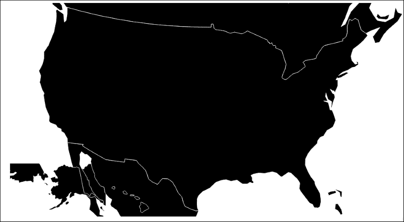

哎呀！这并不是我们预期的结果（但正如我们将看到的，这正是我们编码的结果）。为什么所有东西都聚集在一起？这是因为我们仍在使用默认的投影，即`d3.geo.albersUsa()`投影。

## 使用墨卡托投影创建世界地图

为了解决这个问题，我们只需要创建一个墨卡托投影对象，并将其应用到路径上。这是一个众所周知的投影，它将地球的地图渲染在一个矩形区域内。

这个过程在以下示例中得到了演示：

### 注意

bl.ock (12.7): [`goo.gl/IWQPte`](http://goo.gl/IWQPte)

这段代码中唯一的区别是路径设置的配置，使用墨卡托投影对象：

```js
    var projection = d3.geo.mercator()
        .scale((width + 1) / 2 / Math.PI)
        .translate([width / 2, height / 2]);
    var path = d3.geo.path().projection(projection);
```

我们需要给投影对象提供一些关于我们渲染的宽度和高度的信息，现在得到的地图如下，看起来更像我们熟悉的世界地图：


## 使用正射投影创建球形地图

现在让我们将我们的投影更改为**正射投影**。这种投影将数据映射到一个模拟的球体上。以下示例展示了这一点：

### 注意

bl.ock (12.8): [`goo.gl/M464W8`](http://goo.gl/M464W8)

这个示例只是通过使用`d3.geo.orthographic()`投影对象来改变之前的示例：

```js
    var projection = d3.geo.orthographic();
    var path = d3.geo.path().projection(projection);
```

之前的示例代码给出了这个美丽的星球渲染：

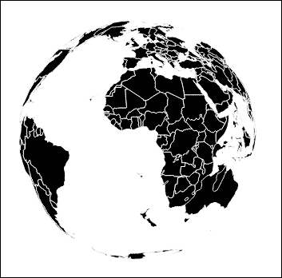

如果你仔细观察，你会注意到它并不完全完美。注意，澳大利亚似乎与非洲和马达加斯加相撞，新西兰在南大西洋中可见。

这是因为这个投影渲染了整个地球的 360 度，我们实际上是通过一个透明的地球看到了远侧陆地的大后方。

为了解决这个问题，我们可以使用墨卡托投影的`.clipAngle()`函数。参数是围绕中心点渲染陆地的度数。

以下示例展示了这一过程：

### 注意

bl.ock (12.9): [`goo.gl/G28ir0`](http://goo.gl/G28ir0)

这改变了代码中的一行：

```js
var projection = d3.geo.orthographic()
   .clipAngle(90);
```

并给出了以下结果：

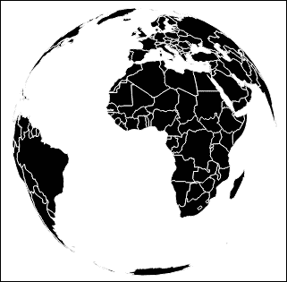

书中提供的图像可能不明显，但网页上的地球仪图像相当小。我们可以使用投影的 `.scale()` 函数来改变渲染的缩放比例。默认的缩放值是 150，相应的值会使渲染更大或更小。

以下示例将地球仪放大一倍，同时设置地球仪的中心不被 SVG 容器裁剪：

### 注意

bl.ock (12.10): [`goo.gl/EVsHgU`](http://goo.gl/EVsHgU)

```js
var projection = d3.geo.orthographic()
    .scale(300)
    .clipAngle(90)
    .translate([width / 2, height / 2]); 
```

这种正射投影默认情况下将视图中心定位在地球仪的纬度和经度（**0,0**）。如果我们想定位在另一个位置，我们需要通过纬度和经度度数来 `.rotate()` 投影。

以下示例将地球仪旋转以突出显示美国：

### 注意

bl.ock (12.11): [`goo.gl/1acSjF`](http://goo.gl/1acSjF)

投影的一个变化如下：

```js
var projection = d3.geo.orthographic()
    .scale(300)
    .clipAngle(90)
    .translate([width / 2, height / 2])
    .rotate([90, -40]);
```

这种投影方式的变化给我们带来了以下结果：

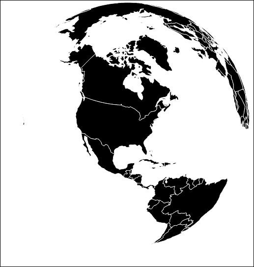

# 调味地球仪

尽管这个地球仪使用创建它的代码量相当可观，但它感觉有点单调。让我们稍微区分一下国家，并添加纬线和经线。

## 地球仪上国家上色

我们可以使用 `d3.scale.category20()` 颜色比例尺来给地球仪上的国家上色。但我们不能简单地旋转颜色，因为相邻的国家可能会被填充成相同的颜色。

为了避免这种情况，我们将利用 TopoJSON 的另一个函数 `topojson.neighbors()`。此函数将返回给定一组几何形状（如国家），一个标识相邻几何形状的数据结构。然后我们可以利用这个数据来防止潜在的颜色问题。

该过程在以下示例中得到了演示：

### 注意

bl.ock (12.12): [`goo.gl/9UimER`](http://goo.gl/9UimER)

本例中的投影保持不变。其余的代码已更改。

我们首先使用与上一个示例相同的投影，所以这里不重复代码。以下创建颜色、国家和邻居的数据结构：

```js
var color = d3.scale.category20();
var countries = topojson.feature(world,
                         world.objects.countries).features;
var neighbors = topojson.neighbors(
                         world.objects.countries.geometries);
```

地球仪的创建使用以下语句：

```js
var color = d3.scale.category20();
svg.selectAll('.country')
    .data(countries)
    .enter()
    .append('path')
    .attr('d', path)
    .style('fill', function (d, i) {
        return color(d.color = d3.max(neighbors[i],
            function (n) { 
                return countries[n].color; 
            })
            + 1 | 0);
    });
```

我们得到的地球仪如下：

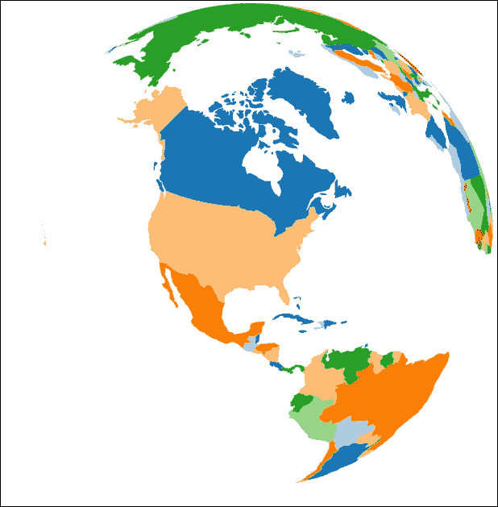

看起来很棒！但仍然缺少纬线和经线，你实际上无法确定地球仪的范围。现在让我们通过添加纬线和经线来解决这个问题。

你会惊讶于添加纬线和经线有多容易。在 D3.js 中，这些被称为 **graticules**。我们通过实例化一个 `d3.geo.graticules()` 对象来创建它们，然后在国家的路径之前添加一个单独的路径。

这在以下示例中得到了演示：

### 注意

bl.ock (12.13): [`goo.gl/5eJOai`](http://goo.gl/5eJOai)

添加到先前示例中的唯一代码如下：

```js
var graticule = d3.geo.graticule();
svg.append('path')
    .datum(graticule)
    .attr('d', path)
    .style({
        fill: 'none',
        stroke: '#777',
        'stroke-width': '.5px',
        'stroke-opacity': 0.5
    });
```

代码的变化导致以下结果：

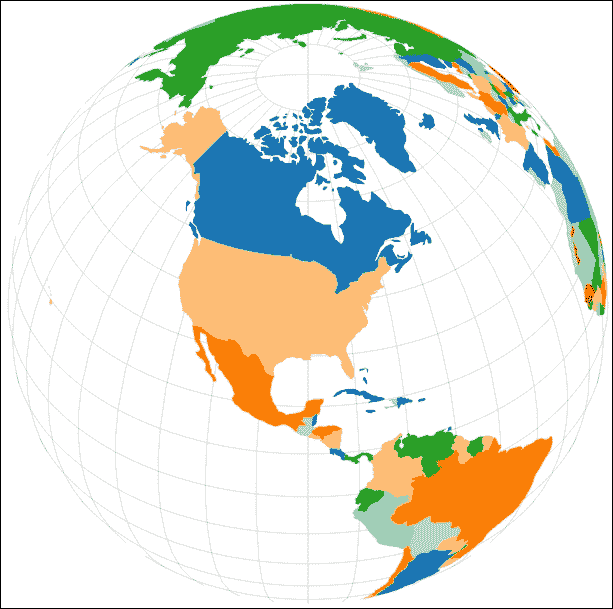

哇！正如他们所说，简单易行！

# 向地图添加交互性

如果用户无法在地图上平移和缩放以改变焦点，并更仔细地查看事物，那么地图有什么用呢？幸运的是，由于 D3.js，这使得实现这一点变得非常简单。我们将查看三个不同的交互式地图示例：

+   平移和缩放世界地图

+   在`mouseover`时突出显示国家边界

+   使用鼠标旋转地球仪

## 平移和缩放世界地图

为了演示世界地图的平移和缩放，我们将对我们的世界墨卡托投影示例进行一些修改。这些修改将用于使用鼠标滚轮进行缩放，并能够拖动地图将其移动到另一个中心。

这种地图代码版本的可能图像可能如下所示，它位于巴西东边，并放大了几个因子：

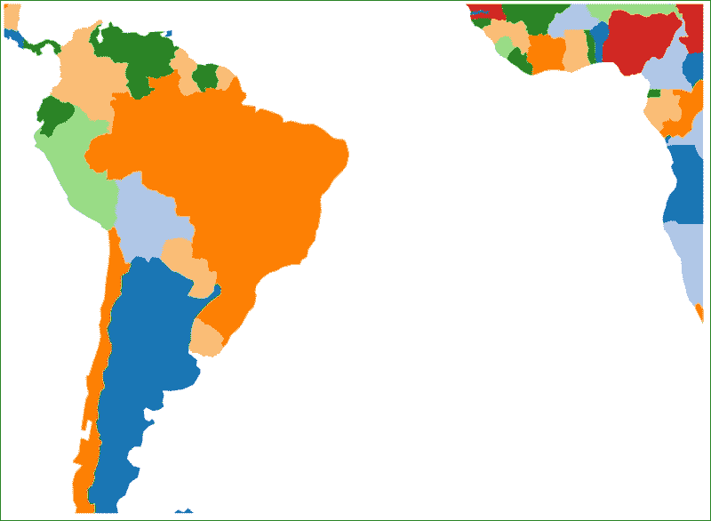

在平移和缩放地图时，我们应该考虑以下一些因素：

+   我们只能在两个范围之间进行缩放，这样我们不会缩放得太远以至于看不到地图，也不会缩放得太近以至于迷失在单个国家中

+   我们只能将地图拖动到一定范围内，以确保它是约束的，不会从某个边缘拖动出去

示例可在以下位置找到：

### 注意

bl.ock (12.14): [`goo.gl/jjouGK`](http://goo.gl/jjouGK)

大部分代码是从墨卡托投影示例中复用的，并且还添加了代码来为各国着色。

创建主要 SVG 元素的不同之处在于允许拖动和缩放。这始于创建一个缩放行为，并将其分配给主要 SVG 元素。此外，由于我们需要缩放客户端元素，我们添加一个组来便于这一动作：

```js
var zoom = d3.behavior.zoom()
    .scaleExtent([1, 5])
    .on('zoom', moveAndZoom);

var svg = d3.select('body')
    .append('svg')
    .attr({
        width: width,
        height: height
     })
    .call(zoom);
var mainGroup = svg.append('g');
```

代码的其余部分加载数据并渲染地图，与之前的示例相同。

`moveAndZoom`函数，它将在任何拖动和缩放事件上被调用，如下所示：

```js
function moveAndZoom() {
    var t = d3.event.translate;
    var s = d3.event.scale;

    var x = Math.min(
        (width / height) * (s - 1),
        Math.max(width * (1 - s), t[0]));

    var h = height / 4;
    var y = Math.min(
        h * (s - 1) + h * s,
        Math.max(height * (1 - s) - h * s, t[1]));

    mainGroup.attr('transform', 'translate(' + x + ',' + y +
                                        ')scale(' + s + ')');
}
```

从这些值中，我们需要根据当前鼠标位置调整地图上的 SVG 平移，同时考虑到缩放级别。我们也不希望地图在任意方向上平移，这样地图和边界之间就有填充；这是通过`Math.min`和`Math.max`的联合调用来处理的。

恭喜你，你现在有一个完全平移和扫描的地图！

### 注意

注意，当你放大时，国家的边界相当粗糙。这是由于数据的 110 米分辨率造成的。为了获得更精确的图形，请使用具有更细细节的文件。更好的是，根据缩放级别动态更改到更高分辨率的数据。

## 在鼠标悬停时突出显示国家边界

现在，让我们给我们的地图添加另一个交互效果：突出显示鼠标当前悬停在其几何形状上的国家边界。这将帮助我们强调用户当前正在检查的国家。以下是一个快速演示，其中秘鲁有一个细白的边界：

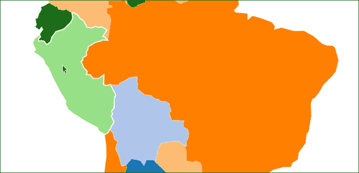

示例可在以下位置找到：

### 注意

bl.ock (12.15): [`goo.gl/DTtJ2A`](http://goo.gl/DTtJ2A)

这是通过在先前的示例中做几处修改来实现的。修改从创建顶级组元素开始：

```js
mainGroup.style({
    stroke: 'white',
    'stroke-width': 2,
    'stroke-opacity': 0.0
});
```

这段代码通知 D3.js，该组内包含的所有 SVG 元素都将有一个 2 像素的白色边框，最初是透明的。当我们悬停鼠标时，我们将使适当的几何形状可见。

现在，我们需要在每个代表国家的路径元素上连接鼠标事件处理器。在`mouseover`事件中，我们将`stroke-opacity`设置为不透明，并在鼠标退出时将其设置回透明：

```js
mainGroup.selectAll('path')
    .on('mouseover', function () {
        d3.select(this).style('stroke-opacity', 1.0);
    });
mainGroup.selectAll('path')
    .on('mouseout', function () {
        d3.select(this).style('stroke-opacity', 0.0);
    });
```

每当缩放级别发生变化时，我们希望进行的一个小改动是。当缩放级别增加时，国家边界会不成比例地变厚。为了防止这种情况，我们可以在`moveAndZoom`函数的末尾添加以下语句：

```js
g.style("stroke-width", ((1 / s) * 2) + "px");
```

这表示国家的边界应该始终保持在视觉上`2px`的厚度，无论缩放级别如何。

## 使用鼠标旋转地球

交互性也可以应用于其他投影。我们将检查使用鼠标旋转正交地球。示例可在以下位置找到：

### 注意

bl.ock (12.16): [`goo.gl/cpH0LN`](http://goo.gl/cpH0LN)

为了节省一点空间，我们这里不会展示图片，因为它看起来与本章早期示例相同，只是它会跟随鼠标旋转。此外，旋转效果在打印介质中会丢失。

但这个工作方式非常简单。该技术涉及创建两个比例尺，一个用于经度，另一个用于纬度。经度是通过将鼠标位置从`0`映射到图形宽度到`-180`和`180`度的经度。纬度是将垂直鼠标位置映射到`90`和`-90`度：

```js
var scaleLongitude = d3.scale.linear()
    .domain([0, width])
    .range([-180, 180]);

var scaleLatitude = d3.scale.linear()
    .domain([0, height])
    .range([90, -90]);
```

当鼠标移动到 SVG 元素上时，我们捕获它并将鼠标位置缩放为相应的纬度和经度；然后我们设置投影的旋转：

```js
svg.on('mousemove', function() {
    var p = d3.mouse(this);
    projection.rotate([scaleLongitude(p[0]), 
                       scaleLatitude(p[1])]);
    svg.selectAll('path').attr('d', path);
});
```

这是一个相当酷的数学和比例技巧，它使我们能够看到整个地球上的每一个位置。

# 注释地图

我们使用地图的最终示例将展示如何在地图上添加注释。前两个示例将展示如何在地图上放置标签和标记，第三个示例将展示如何使用渐变色为地区着色，直至州级别。

如果我们不得不自己完成这些技术，通常需要一些相当复杂的数学，但幸运的是，D3.js 再次帮助我们只需几个语句就解决了这个问题。

## 使用质心标记状态

我们到目前为止创建的美国地图在内容上感觉有点不足，因为它们没有在其几何形状上放置州名。对于许多阅读地图的人来说，使名称可见将非常有帮助。示例可在以下位置找到：

### 注意

bl.ock (12.17): [`goo.gl/3vChcR`](http://goo.gl/3vChcR)

示例的结果如下：

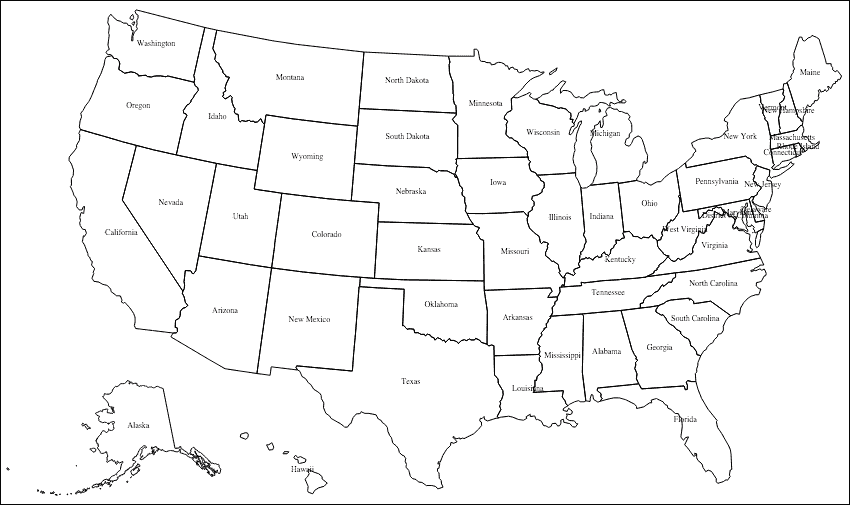

这实际上相当容易实现，只需在我们的美国墨卡托投影示例中添加一个语句即可。以下代码放置在创建所有州边界的`.selectAll()`语句之后：

```js
svg.selectAll('text')
    .data(data.features)
    .enter()
    .append('text')
    .text(function(d) { return d.properties.name; })
    .attr({
        x: function(d) { return path.centroid(d)[0]; },
        y: function(d) { return path.centroid(d)[1]; },
        'text-anchor': 'middle',
        'font-size': '6pt'
    });
```

该语句为数据文件中的每个几何特征创建一个文本元素，并将文本设置为几何对象的`name`属性的值。

文本的位置使用路径的函数来计算几何形状的**质心**。质心是几何形状的数学中心，可以使用路径的`.centroid()`函数来计算。

对于大多数州，尤其是矩形州，这效果很好。对于其他形状不规则的州，以密歇根州为例，放置可能不是从美学角度来看最理想的。有各种方法可以解决这个问题，但这些超出了本书的范围（提示：这涉及到为每个几何形状添加额外的数据来表示位置偏移）。 

## 在特定地理位置放置符号

我们将要查看的最后一个地图示例是将 SVG 元素放置在地图上的特定坐标处。具体来说，我们将放置圆圈在 50 个人口最多的城市的位置，并使圆圈的大小与人口成比例。

我们将使用的数据在`us-cities.csv`文件中，该文件可在以下位置找到：[`gist.githubusercontent.com/d3byex/65a128a9a499f7f0b37d/raw/176771c2f08dbd3431009ae27bef9b2f2fb56e36/us-cities.csv`](https://gist.githubusercontent.com/d3byex/65a128a9a499f7f0b37d/raw/176771c2f08dbd3431009ae27bef9b2f2fb56e36/us-cities.csv)。数据很简单；以下是一些前几行：

```js
name,population,latitude,longitude
New York,8491079,40.6643,-73.9385
Los Angeles,3792621,34.0194,-118.4108
Chicago,2695598,41.8376,-87.6818
```

示例可在以下位置找到：

### 注意

bl.ock (12.18): [`goo.gl/Y9MN5q`](http://goo.gl/Y9MN5q)

结果的可视化如下：

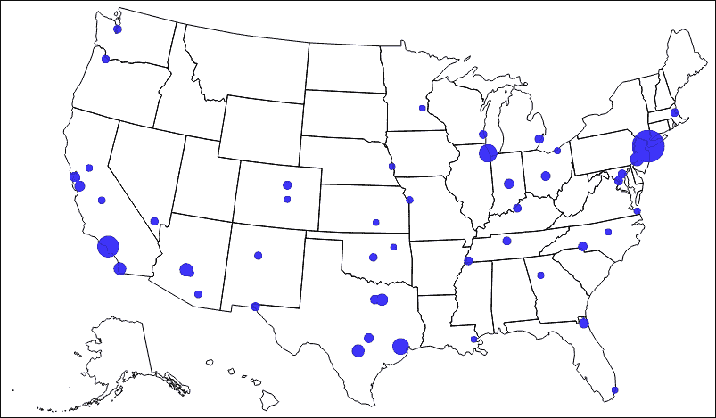

上述示例利用了美国墨卡托示例代码。然而，此示例需要加载两个数据文件。为了方便起见，我们将使用由 Mike Bostock 创建的名为**queue**的库来异步加载这些文件，并在两个文件都加载完成后执行`ready()`函数。您可以在[`github.com/mbostock/queue`](https://github.com/mbostock/queue)获取此库和文档：

```js
queue()
    .defer(d3.json, usDataUrl)
    .defer(d3.csv, citiesDataUrl)
    .await(function (error, states, cities) {
```

然后地图的渲染方式与前面的示例相同。然后我们需要放置圆圈。为此，我们需要将纬度和经度值转换为*X*和*Y*像素位置。我们可以在 D3.js 中使用投影对象来完成此操作：

```js
svg.selectAll('circle')
    .data(cities)
    .enter()
    .append('circle')
    .each(function(d) {
        var location = projection([d.longitude, d.latitude]);
        d3.select(this).attr({
            cx: location[0],
            cy: location[1],
            r: Math.sqrt(+d.population * 0.00004)
        });
    })
    .style({
        fill: 'blue',
        opacity: 0.75
    });
```

对于创建的每个圆，此代码会调用投影函数，传递每个城市的纬度和经度。返回值是该位置的像素的`x`和`y`坐标。因此，我们只需将圆的中心设置为这个结果，并给圆分配一个与人口规模成比例的半径。

## 创建渐变图

我们最后的地图示例是创建一个**渐变图**。渐变图是一种用不同颜色填充区域以反映基础数据值的地图，而不仅仅是用不同颜色来表示不同的地理边界。这些是相当常见的视觉类型，它们通常显示相邻地区之间的人口意见差异，或者经济因素如何在不同邻国之间有所不同。

示例可在以下位置找到：

### 注意

bl.ock (12.19): [`goo.gl/ZeTh4o`](http://goo.gl/ZeTh4o)

最终的可视化结果如下：

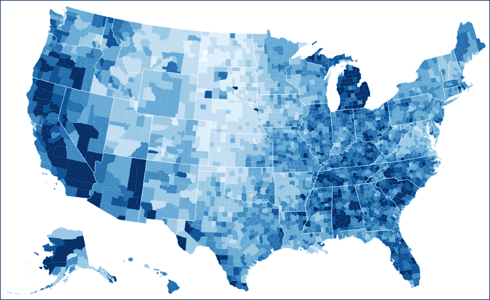

此渐变图表示了 2008 年美国各县失业率。蓝色的阴影从较深（表示失业率较低）到较浅（表示失业率较高）变化。

失业率数据可在[`gist.githubusercontent.com/d3byex/65a128a9a499f7f0b37d/raw/176771c2f08dbd3431009ae27bef9b2f2fb56e36/unemployment.tsv`](https://gist.githubusercontent.com/d3byex/65a128a9a499f7f0b37d/raw/176771c2f08dbd3431009ae27bef9b2f2fb56e36/unemployment.tsv)找到。前几行如下所示：

```js
id    rate
1001  .097
1003  .091
1005  .134
1007  .121
1009  .099
1011  .164
```

数据由一对县标识符和相应的失业率组成。县 ID 将与在[`gist.githubusercontent.com/d3byex/65a128a9a499f7f0b37d/raw/176771c2f08dbd3431009ae27bef9b2f2fb56e36/us.json`](https://gist.githubusercontent.com/d3byex/65a128a9a499f7f0b37d/raw/176771c2f08dbd3431009ae27bef9b2f2fb56e36/us.json)中可用的`us.json`文件中的县 ID 相匹配。

此文件由描述美国所有县形状的 TopoJSON 组成，每个县在失业文件中都有相同的县 ID。此文件的片段如下，显示了用于渲染国家`1001`的弧线：

```js
{
  "type": "Polygon",
  "id": 1001,
  "arcs": [ [ -8063, 8094, 8095, -8084, -7911 ] ]
},
```

我们的目标是将失业率量化，然后为每个几何形状填充一个与该分位数对应的颜色。实际上，这比看起来要容易得多。

在这个例子中，我们将失业率映射到十个分位数。每个的颜色将使用具有特定名称的样式指定。这些声明如下：

```js
<style>
    .q0-9 { fill:rgb(247,251,255); }
    .q1-9 { fill:rgb(222,235,247); }
    .q2-9 { fill:rgb(198,219,239); }
    .q3-9 { fill:rgb(158,202,225); }
    .q4-9 { fill:rgb(107,174,214); }
    .q5-9 { fill:rgb(66,146,198); }
    .q6-9 { fill:rgb(33,113,181); }
    .q7-9 { fill:rgb(8,81,156); }
    .q8-9 { fill:rgb(8,48,107); }
</style>
```

数据是通过`queue()`函数加载的：

```js
queue()
    .defer(d3.json, usDataUrl)
    .defer(d3.tsv, unempDataUrl, function(d) { 
                      rateById.set(d.id, +d.rate); 
     })
    .await(function(error, us) {
```

这段代码使用了一个用于失业数据的`.defer()`的替代形式，它为每个加载的数据项调用一个函数（队列的另一个酷特性）。这构建了一个`d3.map()`对象（类似于字典对象），它将县 ID 映射到其失业率，我们在渲染过程中使用这个映射。

县数据首先被渲染。为此，我们需要创建一个分位数刻度，它将域从`0`映射到`0.15`。这将用于将失业水平映射到一种样式。然后配置范围以生成九种样式的名称：

```js
var quantize = d3.scale.quantize()
    .domain([0, .15])
    .range(d3.range(9).map(function(i) { 
        return 'q' + i + '-9'; 
}));
```

接下来，代码创建了一个`albersUsa`投影和一个相关的路径：

```js
var projection = d3.geo.albersUsa()
    .scale(1280)
    .translate([width / 2, height / 2]);

var path = d3.geo.path()
    .projection(projection);
```

下一步是创建一个组来存放阴影县，然后，我们将通过绑定到`counties`特征为这个组添加每个县的路径：

```js
svg.append('g')
    .attr('class", "counties")
    .selectAll("path")
    .data(topojson.feature(us, us.objects.counties).features)
    .enter()
    .append("path")
    .attr("class", function(d) { 
        return quantize(rateById.get(d.id)); 
     })
    .attr("d", path);
```

最后，我们使用白色描边叠加了州的轮廓，以帮助我们区分州界：

```js
svg.append('path')
    .datum(topojson.mesh(us, us.objects.states)
    .attr({
        'class': 'states',
        fill: 'none',
        stroke: '#fff',
        'stroke-linejoin': 'round',
        'd': path
    });
```

### 注意

这段代码还使用了`topojson.mesh`函数从 TopoJSON 对象中提取所有州的**MultiPolygon**（GeoJSON）数据。

就这样！我们已经创建了一个渐变图，并使用了一种易于与其他类型的数据重复使用的编码模式。

# 摘要

我们以简要了解 GeoJSON 和 TopoJSON 开始这一章。如果您在 D3.js 中做任何与地图相关的事情，您将使用其中之一或两个。我们只介绍了足够的内容，以便理解其结构以及如何使用它来定义可以渲染为地图的数据。

从那里，我们深入创建了几张地图，并涵盖了您在创建过程中将使用到的许多概念。这包括加载数据、创建投影以及渲染数据中的几何形状。

我们研究了两种投影，墨卡托和正射投影，以了解这些如何呈现数据。在这个过程中，我们还探讨了如何样式化地图上的元素，用颜色填充几何形状，以及在鼠标悬停时突出显示几何形状。

然后，我们研究了如何用标签以及基于数据的颜色元素（渐变图）来注释我们的地图，并在特定的地理位置放置符号，其大小基于数据。

到这本书的这一部分，我们已经相当详细地介绍了 D3.js 的核心内容，至少足够让您能够熟练使用它。但我们也只创建了独立的可视化，这些可视化不与其他可视化交互。

在下一章，这本书的最后一章，我们将探讨如何使用 AngularJS 结合多个 D3.js 可视化，以及这些可视化如何对用户在其页面上操作其他内容做出反应。
