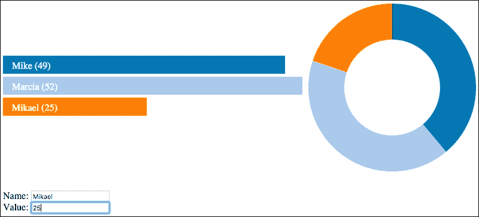
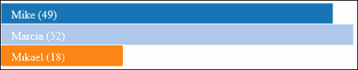
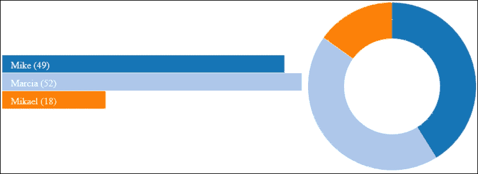
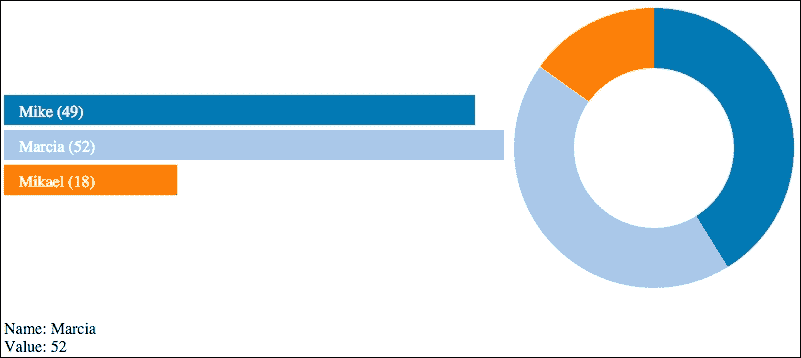

# 第十三章. 结合 D3.js 和 AngularJS

本书最后一章将演示在单个网页上使用多个 D3.js 视觉元素。这些示例还将展示以模块化方式构建 D3.js 视觉元素，这允许通过简单的 HTML 标签进行重用，同时将数据从渲染视觉的代码中抽象出来。这将使创建更通用的 D3.js 视觉元素成为可能，这些元素可以通过单个 HTML 标签放置在页面上，并且与数据源松散耦合。

为了实现这些功能，我们将利用**AngularJS**，这是一个用于创建动态和模块化 Web 应用的 JavaScript 框架。示例将展示如何集成 AngularJS（v1.4）和 D3.js 以创建可重用和互操作的视觉元素。对本章来说，预期读者对 AngularJS 有初步了解，但重点将放在如何使用 AngularJS 的功能来创建可重用和可扩展的 D3.js 控件上；因此，即使是 AngularJS 的新手也能跟上。

在本章中，我们将通过以下主题来实现这一目标：

+   组合可视化概述

+   使用 AngularJS 应用、控制器和指令创建条形图

+   添加一个指令到页面上添加饼图

+   在视觉元素之间添加详细视图和交互性

+   在数据细节修改时更新图表

# 组合可视化概述

在深入示例之前，让我们先检查最终结果，以帮助理解我们将使用 AngularJS 结合 D3.js 尝试实现的一些目标。以下图表示了最终交互式和组合图表的静态图像：



页面的每个组件——条形图、饼图和输入表单——最初将独立构建，并且能够独立运行。为此，示例将使用 AngularJS 的功能来促进以下功能：

+   每个视觉元素都应该用 HTML 标签简单地表示，而不是将每个代码复制到页面上。这是通过 AngularJS 指令完成的。

+   我们不会在每个视觉元素中一次性在代码中加载数据，而是利用一个跨每个元素共享的应用级数据模型。在 AngularJS 中，这是通过创建一个 JavaScript 数据模型并将其注入到每个指令的控制器中实现的。

+   条形图将提供一个方式来暴露当前选中项的更新通知，这样详细模型就可以更新其数据。这将通过模型中的`selectedItem`属性实现，该属性允许详细指令通过 AngularJS 模板绑定来监视更新。

+   此外，当应用模型在详细指令中更新时，条形图和饼图将通过 AngularJS 通知更新，以表示修改。

### 注意

本章与之前章节的一个不同之处在于，代码不在 bl.ock.org 或 JSBIN.COM 上在线提供，必须从 Packt 网站获取。这是因为示例使用了 AngularJS，它与 bl.ock.org 和 JSBIN.COM 的兼容性不是很好。因此，代码必须从本地通过 Web 服务器运行。你可以简单地解压代码并将其放置在 Web 服务器的根目录中，或者在你的内容根目录下启动你选择的 Web 服务器。每个示例都作为文件夹根目录中的一个不同的 HTML 文件实现，并且每个文件都引用了各种子目录中的多个其他文件。

# 使用 AngularJS 创建条形图

第一个示例将创建一个可重用的条形图组件来演示如何使用底层控制器创建 AngularJS 指令。这是在 HTML 文件`01_just_bars.html`中实现的，它包含以下组件：

+   **AngularJS 应用对象**：这个对象在页面中（即在`app.js`中）作为 AngularJS 代码的入口点。

+   一个 AngularJS 控制器（在`controllers/basic_dashboard.js`中）：这个控制器创建数据并将其发送到渲染图形 HTML 代码的指令

+   指令：这个指令在`directives/bars.js`中渲染 D3.js 条形图。

## 网页和应用

AngularJS 应用通过网页呈现给用户，网页首先加载 AngularJS 和 D3.js 库（这在本章的所有示例中都很常见）。看看下面的代码：

```js
<script src="img/angular.min.js"></script>
<script src="img/d3.v3.min.js" charset="utf-8"></script>
```

然后，页面加载 AngularJS 应用对象、指令和控制器实现。现在，执行以下代码：

```js
<script src="img/app.js"></script>
<script src="img/bars.js"></script>
<script src="img/basic_dashboard.js"></script>
```

这些细节将在稍后进行考察。在我们查看这些之前，这个文件中剩余的 HTML 代码使用一个带有`ng-app`和`ng-controller`属性的`<div>`标签创建 AngularJS 应用和我们的指令控制器。添加以下代码：

```js
<div ng-app="dashboardApp" ng-controller="dashboardController">
    <bars-view width="500" height="105"></bars-view>
</div>
```

使用`ng-app`属性告诉 AngularJS 在哪里找到实现，这是一个名为`dashboardApp`的模块（即 AngularJS 可引用的 JavaScript 片段）。

在这个示例中，这个模块在`app.js`中声明（每个示例都是这样）：

```js
angular.module('dashboardApp', []);
```

这个示例实际上并没有为应用模块声明任何代码，它仅仅是一个 HTML 标记可以进入 AngularJS 并开始定位各种对象的地方。在一个更复杂的应用中，这将是注入其他依赖模块和进行一些应用级初始化的好地方。

这个`<div>`标签内的标签定义了一个称为 AngularJS 指令的结构。这个指令渲染控制器中代表的数据。在我们查看指令的实现之前，让我们看看提供数据给指令的控制器。

## 控制器

`<div>` 标签上的 `ng-controller` 属性指定了一个用于向此 `<div>` 标签的子元素指定的 AngularJS 指令提供数据的控制器名称。AngularJS 在 `ng-app` 指定的模块中搜索具有指定名称的控制器。在这个例子中，这个控制器在 `controllers/basic_dashboard.js` 中声明，如下所示：

```js
angular.module('dashboardApp')
    .controller('dashboardController', 
        ['$scope', function ($scope) {
            $scope.items = [
                { Name: 'Mike', Value: 49 },
                { Name: 'Marcia', Value: 52 },
                { Name: 'Mikael', Value: 18 }
        ];
    }]);
```

这使用 `.controller()` 创建了一个名为 `dashboardController` 的 AngularJS 控制器，它是应用程序的 `dashboardApp` 模块的一部分。看看下面的脚本：

```js
angular.module('dashboardApp')
       .controller('dashboardController', 
                   ['$scope', function ($scope) {
```

`.controller()` 的第二个参数是一个数组，指定了要注入到实现控制器的函数中的变量以及实现控制器的函数。

现在，这告诉 AngularJS 我们希望将代表控制器数据和将被注入到控制指令中的 AngularJS 变量 `$scope` 传递给这个要初始化的函数。

在以下命令的最后一个语句中，通过向作用域中添加一个项目的属性来声明要提供给视图的数据：

```js
$scope.items = [
    { Name: 'Mike', Value: 49 },
    { Name: 'Marcia', Value: 52 },
    { Name: 'Mikael', Value: 18 }
]; 
```

## 柱状图的指令

AngularJS 指令是一个自定义的 HTML 标签，它指导 AngularJS 如何根据控制器提供的数据创建 HTML。在示例的 HTML 代码中，有一个名为 `<bars-view>` 的标签被声明。当页面加载时，AngularJS 会检查 HTML 中的所有标签，如果某个标签不被识别为标准 HTML 标签，AngularJS 会搜索你作为应用程序的一部分声明的指令，以提供这个标签的实现。

在这种情况下，它将标签的连字符名称 `<bars-view>` 转换为驼峰式版本 `barsView`，并在具有此名称声明的模块中查找指令。如果找到，AngularJS 将执行为指令提供的代码以生成 HTML 代码。

在这个例子中，AngularJS 找到了在 `directives/bars.js` 文件中实现的 `<bars-view>` 标签。此文件首先通知 AngularJS 我们希望在 `dashboardApp` 模块中声明一个名为 `barsView` 的指令：

```js
angular.module('dashboardApp')
    .directive('barsView', function () {
        return {
            restrict: 'E',
            scope: { data: '=' },
            link: renderView
        };
```

`.directive()` 的第二个参数是一个函数，它告诉 AngularJS 如何应用和构建视图。在这个例子中，指定了三个指令：

+   `restrict: 'E'`：这告诉 AngularJS 此指令仅适用于 HTML 元素，而不适用于它们的属性或 CSS 类名。

+   `scope: { data: "="}`：这告诉 AngularJS 我们希望在作用域中的数据和视图中的元素之间建立**双向绑定**。如果控制器中的数据发生变化，AngularJS 将更新视图，反之亦然。

+   `link: renderView`：这个属性告诉 AngularJS 当视图创建时将调用哪个函数。然后这个函数将生成 DOM 构造来表示视图。这就是我们将放置我们的 D3.js 代码的地方。

`renderView` 函数声明如下：

```js
function renderView($scope, $elements, $attrs) {
```

当 AngularJS 调用此函数来渲染指令的标签时，它将表示相关控制器的范围对象作为`$scope`参数传递。第二个参数`$elements`传递一个 AngularJS 对象，可以用来识别指令应附加新元素的顶层 DOM 元素。最后一个参数`$attrs`传递任何在先前参数的根 DOM 元素中定义的自定义属性。

实现条形图的代码与我们的早期条形图示例没有显著不同。它所做的第一件事与 AngularJS 不同，因为它从函数中传递的范围获取数据，如下所示：

```js
var data = $scope.$parent.items;
```

`<bars-view>`指令由 AngularJS 分配一个范围对象。控制器的数据实际上是此对象的`parent`范围属性的属性。此对象具有我们定义在控制器中的`items`属性及其相关数据作为`items`属性。

元素的宽度和高度，如 HTML 代码中指定的，可以使用`$attrs`参数的`width`和`height`属性检索。看看以下命令：

```js
var width = $attrs.width, height = $attrs.height;
```

在获取宽度和高度后，我们可以创建图表的主要 SVG 元素。这将附加到`$element[0]`，它代表此指令的根 DOM 元素（`$element`对象实际上是 AngularJS 的一个包装根元素的实例，使用`[0]`索引器访问），如下所示：

```js
var svg = d3.select($element[0])
    .append("svg");
```

代码的其余部分与前面章节中涵盖的示例类似，用于创建带有叠加文本的条形图。它首先设置 SVG 元素的大小，并设置计算条形大小和位置所需的各种变量，如下所示代码：

```js
svg.attr({
    width: width,
    height: height
});

var max = d3.max(data, function(d) {
    return d.Value;
});

var colors = d3.scale.category20();

var barHeight = 30;
var leftMargin = 15;
var barTextOffsetY = 22;
```

然后创建条形，并设置为动画到它们各自的最大大小。看看以下：

```js
svg.selectAll('rect')
    .data(data)
    .enter()
    .append('rect')
    .attr({
        height: barHeight,
        width: 0,
        x: 0,
        y: function(d, i) {
            return i * barHeight;
        },
        stroke: 'white'
    })
    .style('fill', function(d, i) {
        return colors(i);
    })
    .transition()
    .duration(1000)
    .attr('width', function(d) {
        return d.Value / (max / width);
    });
```

现在，在更新场景中，所有现有的 D3.js 元素都被选中，这会将任何现有条形的大小过渡到新的大小。看看以下代码：

```js
svg.selectAll("rect")
    .data(data)
    .transition()
    .duration(1000)
    .attr("width", function(d, i) {
        return d.Value / (max / width);
    });
```

然后，实现创建条形上的进入标签以及在数据值更改时更改条形上的文本的情况，如下所示：

```js
 svg.selectAll('text')
    .data(data)
    .enter()
    .append('text')
    .attr({
        fill: '#fff',
        x: leftMargin,
        y: function(d, i) {
            return i * barHeight + barTextOffsetY;
        }
    })
    .text(function(d) { 
        return d.Name + ' (' + d.Value + ')'; 
    });

svg.selectAll('text')
    .data(data)
    .attr({
        fill: '#fff',
        x: leftMargin,
        y: function(d, i) {
            return i * barHeight + barTextOffsetY;
        }
    })
    .text(function(d) {
        return d.Name + ' (' + d.Value + ')';
    });
}
```

在浏览器中打开此页面时，显示以下图表：



# 为甜甜圈添加第二个指令

下一个示例添加第二个 D3.js 可视化来表示数据中的甜甜圈图。此实现需要创建一个新的指令并将其添加到网页上。它重用了控制器实现以及它创建的数据。

## 网页

此示例的网页可在`02_bars_and_donut.html`中找到。与之前的网页相比，它包含一个额外的甜甜圈视图。看看以下：

```js
<script src="img/app.js"></script>
<script src="img/bars.js"></script>
<script src="img/donut.js"></script>
<script src="img/basic_dashboard.js"></script>
```

页面内容的声明现在变为以下内容：

```js
<div ng-app="dashboardApp" ng-controller="BasicBarsController">
    <bars-view width="500" height="105" 
              style="display: table-cell; vertical-align: middle">
    </bars-view>
    <donut-view width="300" height="300" 
                style="display: table-cell">
    </donut-view>
</div>
```

这为 `donut-view` 添加了一个额外的指令。还向指令添加了样式，使它们并排浮动。

## 甜甜圈图的指令

甜甜圈指令的实现首先声明这个指令将被添加到 `dashboardApp` 模块中，并且它的名字将是 `donutView`（因此我们在 HTML 代码中使用 `<donut-view>`）。与条形图指令一样，它还指示 AngularJS 仅将此代码应用于 DOM 元素，具有双向数据绑定，并由名为 `renderView` 的函数实现；请看以下代码：

```js
angular.module('dashboardApp')
    .directive('donutView', function () {
        return {
            restrict: 'E',
            scope: { data: '=' },
            link: renderView
        };
```

`renderView` 的这个版本遵循与 `bars-view` 实现相似的图案。它首先从作用域中获取数据，包括视觉的宽度和高度，并计算甜甜圈的半径。以下代码被执行：

```js
function renderView($scope, $elements, $attrs) {
    var data = $scope.$parent.items;

    var width = $attrs.width,
        height = $attrs.height,
        radius = Math.min(width, height) / 2;
```

然后使用饼图布局开始渲染甜甜圈，如下所示：

```js
var pie = d3.layout.pie()
    .value(function (d) { return d.Value; })
    .sort(null);
```

弧线填充在 SVG 元素边界外 `10` 到 `70` 像素之间，这是基于计算出的半径。请看以下代码：

```js
    var arc = d3.svg.arc()
        .innerRadius(radius - 70)
        .outerRadius(radius - 10);
```

然后，通过以下方式将主 SVG 元素附加到 `$elements[0]` 上，开始构建视觉：

```js
    var svg = d3.select($elements[0])
        .append('svg')
        .attr({
            width: width,
            height: height
    });
```

最后，使用颜色尺度和每个进入数据的路径生成器构建甜甜圈图的视觉元素，如下所示：

```js
var colors = d3.scale.category20();
graphGroup
    .datum(data)
    .selectAll('path')
    .data(pie)
    .enter()
    .append('path')
    .attr('fill', function(d, i) {
        return colors(i);
    })
    .attr('d', arc)
    .each(function(d) {
        this._current = d;
    });
```

在浏览器中加载此页面时，它呈现以下视觉效果，现在在单个网页上显示了两个 D3.js 视觉效果：



# 添加细节视图和交互性

下一个示例向页面添加了一个细节指令，并增加了交互性，使得当点击一个条形时，细节指令将显示所选条形的适当数据。

为了实现这种交互性，条形图指令被修改，以便产生一个可以被 AngularJS 应用程序的其他部分监控的动作。这个动作将是设置模型上的 `selectedItem` 属性，其他控制器或指令可以监视这个属性的变化，然后采取行动。

## 网页

此示例的网页包含在 `03_with_detail.html` 中。包含的内容略有不同，因为我们将在 `directives/bars_with_click.js` 中包含我们 `<bars-view>` 指令的新实现，并在 `controllers/enhanced_controller.js` 中包含控制器，以及在 `directives/detail.js` 中包含代表细节视图的新指令。请看以下内容：

```js
<script src="img/app.js"></script>
<script src="img/bars_with_click.js"></script>
<script src="img/donut.js"></script>
<script src="img/detail.js"></script>
<script src="img/enhanced_controller.js">
</script>
```

主 `<div>` 标签的声明略有变化，如下所示，通过添加 `details-view` 指令：

```js
<div ng-app="dashboardApp" ng-controller="dashboardController">
    <bars-view width="500" height="105" 
        style="display: table-cell; vertical-align: middle">
    </bars-view>
    <donut-view width="300" height="300" 
        style="display: table-cell"></donut-view>
    <details-view data="selectedItem" width="300">
    </details-view>
</div>
```

注意，这个新指令使用一个名为 data 的属性，并将其值设置为`selectedItem`。这是一个特殊的 AngularJS 属性/绑定，指定了此指令的模型数据位于 DOM 层次结构中最近的 scope 对象的`selectedItem`属性中。在这种情况下，它是 div 标签上定义的 scope，并且每当此属性在 scope 中更改时，此指令将自动更新其数据和可视化。

## 在控制器中指定初始的`selectedItem`

详细视图控制器期望能够访问模型中的`selectedItem`属性以用作其数据，因此它需要为此属性设置一个初始值。以下添加了一行代码来完成此任务：

```js
angular.module('dashboardApp')
    .controller('dashboardController',
                ['$scope', function ($scope) {
        $scope.items = [
            { Name: 'Mike', Value: 49 },
            { Name: 'Marcia', Value: 52 },
            { Name: 'Mikael', Value: 18 }
        ];
        $scope.selectedItem = $scope.items[0];
    }]); 
```

## 修改后的条形图视图指令

`<bars-view>`指令随后添加了一个点击处理程序，以便在点击条形图时设置选中项的值，如下所示：

```js
.on('click', function (d, i) {
    $timeout(function () {
        parent.selectedItem = d;
    };
}) 
```

此点击处理程序执行一个动作：它将父作用域中选中项的值更新为点击的视觉元素下方的数据项的值。它不会向其他组件发送消息，也不应该这样做。如果其他指令对此更新感兴趣，它们可以通过查找模型中的更改来执行此操作。

### 注意

这被包裹在调用 AngularJS 的`$timeout`函数中，该函数将根据此属性的更改更新浏览器上的 UI。如果不执行此操作，任何感兴趣的元素都不会被 AngularJS 通知。

## 实现详细视图指令

详细视图是一段相当简单的代码，从指令声明开始。看看以下内容：

```js
angular.module('dashboardApp')
    .directive('detailsView', function () {
        return {
            restrict: 'E',
            scope: { data: "=" },
            templateUrl: 'templates/static_item.html'
        };
    });
```

与我们的其他指令声明相比，这个声明中的不同之处在于代码没有指定`link`属性，而是指定了`templateUrl`属性及其相关值。这告诉 AngularJS，这个指令将不会通过调用 JavaScript 函数来实现，而应该使用`templates/static_item.html`文件中的内容。该文件的内容如下：

```js
Name: {{data.Name}}
<br/>
Value: {{data.Value}}
```

这个 HTML 代码将由 AngularJS 注入到 DOM 中。该 HTML 包含嵌入的**handlebars**语法，AngularJS 会注意到并替换其内容。在这种情况下，将使用由指令的数据属性指定的对象的`Name`和`Value`属性的值，其中数据是模型中`selectedItem`的绑定值，即当前选中的条形图。每当此属性更新时，AngularJS 将自动代表我们正确更新 DOM，而无需任何额外的编码。

## 生成的交互式页面

以下图像是此页面可能生成的显示示例：



在此图像中，点击了第二个条形图，因此详细视图显示了此条形图的数据。当你点击不同的条形图时，详细中的值会相应地更改。

# 在详细数据修改时更新图表

最终的示例将使详细视图与条形图和甜甜圈图之间的数据更新双向。上一个示例仅在点击条形图时更新详细视图。详细视图的内容是静态文本，因此用户无法修改数据。这是通过修改模板以利用文本输入字段来改变的。控制器没有变化，所以不会进行讨论。

## 网页

此示例的网页 `04_dynamic.html` 与上一个示例相比有几个小的变化，以引用新的条形图、甜甜圈和详细指令的实现。`<div>` 标签保持不变。请看以下代码：

```js
<script src="img/app.js"></script>
<script src="img/bars_with_click_and_updates.js"></script>
<script src="img/donut_with_updates.js"></script>
<script src="img/dynamic_detail.js"></script>
<script src="img/enhanced_controller.js">
</script>
```

## 修订后的条形图视图指令

新的 `<bar-view>` 指令有一个行为变化，同时还有一个小的结构变化。这个行为变化是监视传递给它的作用域中 `selectedItem` 属性的变化。为此，在 `renderView()` 代码的顶部附近添加了以下语句：

```js
parent.$watch("selectedItem", render, true);
```

这通知 AngularJS 我们希望它监视绑定作用域对象中 `selectedItem` 属性的变化。当此属性或此对象的任何属性发生变化时（由第三个参数中的 `true` 指定），AngularJS 将调用 `render()` 函数。

### 注意

注意，此监视过程不必在详细视图控制器中执行，因为模板和 handlebars 的使用会自动设置此操作。

在选择 `svg` 元素并设置其大小之后，对代码的结构变化进行了修改。现在创建视觉效果的代码被包裹在新的 `render()` 函数中，该函数在指令首次加载时调用，然后在 `selectedItem` 的值每次发生变化时调用。当后者发生时，条形图被更新，条形动画到新的尺寸，并且它还修改了文本标签。

## 修订后的甜甜圈视图指令

与对 `bar-view` 指令的更新类似，此指令通过添加一个监视作用域中 `selectedItem` 属性的调用以及将渲染代码包裹在 `updatePath()` 函数中来修改，当此属性的值发生变化时可以调用此函数，如下所示：

```js
parent.$watch('selectedItem', updatePath, true);
```

`updatePath()` 函数只需要为每个弧段重新生成路径，如下面的代码所示：

```js
function updatePath() {
    path = path.data(pie);
    path.transition()
        .duration(750)
        .attrTween('d',
            function() {
                var i = d3.interpolate(this._current, a);
                this._current = i(0);
                return function(t) {
                    return arc(i(t));
                };
            });
}
```

## 详细视图指令

新的 `<detail-view>` 指令有一个修改，即使用不同的模板。请看以下代码：

```js
angular.module('dashboardApp')
    .directive('detailsView', function () {
        return {
            restrict: 'E',
            scope: { data: "=" },
            templateUrl: 'templates/dynamic_item.html'
        };
    });
```

此模板的内容指定输入框而不是文本字段，如下所示：

```js
Name: <input type="text" ng-model="data.Name"/>
<br/>
Value: <input type="text" ng-model="data.Value"/>
```

注意，对于更新 handlebars 的输入字段，不能使用这些符号。为了使这生效，您需要使用 AngularJS 的 `ng-model` 属性，并将其指向绑定数据对象及其相应的属性。

## 结果

以下截图显示了此示例的实际操作：


在这个演示中，点击了第三个条形图，现在`details-view`提供了编辑控件，允许我们更改值。**Mikael**的值随后被更改为**25**，条形图和饼图动画显示值的变化。

这里真正令人愉快的一点是，实际上，在两个输入字段中逐个按键，AngularJS 会更新这些属性，并且条形图和饼图会在每个按键时更新！

# 摘要

本章的示例展示了如何使用 AngularJS 制作模块化和复合的 D3.js 可视化。它们首先展示了如何在 AngularJS 控制器中放置数据并与多个 D3.js 可视化共享。接下来，我们演示了如何将单个控制器中的数据共享到多个指令中。最后的两个示例展示了如何使用共享属性进行双向通信，并实现一个详情视图以允许编辑数据。

这本书通过示例介绍了使用 D3.js 的方法。本书从 D3.js 的基本概念开始，讲解如何使用其结构绑定数据并从中生成 SVG。在此基础上，我们通过向示例中添加功能，逐步展示了同一章节内以及章节之间逐渐复杂化的结构扩展。最终，这些示例涵盖了 D3.js 中的许多概念，可以帮助您从新手成长为能够构建丰富、交互式和复合可视化的人，这一切都是通过示例实现的。
