# 第二章：Node.js 中的微服务 - Seneca 和 PM2 替代方案

在本章中，您将主要了解两个框架，**Seneca**和**PM2**，以及它们对于构建微服务的重要性。我们还将了解这些框架的替代方案，以便对 Node.js 生态系统中正在发生的事情有一个总体了解。在本章中，我们将重点关注以下主题：

+   **Node.js 的需求**：在本节中，我们将证明选择 Node.js 作为构建面向微服务的软件框架的选择。我们将介绍使用这一令人敬畏的技术所需的软件堆栈。

+   **Seneca - 一个微服务框架**：在本节中，您将学习 Seneca 的基础知识，以及为什么它是我们想要保持软件可管理性的正确选择。我们将解释如何将 Seneca 与 Express（Node.js 中最流行的 Web 服务器）集成，以遵循行业标准。

+   **PM2**：PM2 是运行 Node.js 应用程序的最佳选择。无论您在部署应用程序生态系统时遇到什么问题，PM2 总是有解决方案。

# Node.js 的需求

在上一章中，我提到过我过去并不是 Node.js 的铁杆粉丝。原因是我没有准备好应对 JavaScript 正在经历的标准化水平。

浏览器中的 JavaScript 很痛苦。跨浏览器兼容性一直是一个问题，缺乏标准化也没有帮助缓解痛苦。

然后 Node.js 出现了，由于其非阻塞性质（我们将在本章后面讨论），创建高度可扩展的应用程序变得很容易，而且由于它基于 JavaScript，一个众所周知的语言，学习起来也很容易。

如今，Node.js 是全球许多公司的首选，也是需要服务器非阻塞性质的方面的首选，例如 Web 套接字。

在本书中，我们将主要（但不仅仅）使用 Seneca 和 PM2 作为构建和运行微服务的框架，但这并不意味着其他替代方案不好。

市场上有一些替代品，如**restify**或**Express**用于构建应用程序，**forever**或**nodemon**用于运行它们。然而，我发现 Seneca 和 PM2 是构建微服务的最合适的组合，原因如下：

+   PM2 在应用程序部署方面非常强大

+   Seneca 不仅是构建微服务的框架，而且还是重新塑造我们对面向对象软件的认识的范式

在本书的几个章节中，我们将使用 Express，并讨论如何将 Seneca 作为中间件集成到 Express 中。

然而，在此之前，让我们讨论一些围绕 Node.js 的概念，这将帮助我们理解这些框架。

## 安装 Node.js、npm、Seneca 和 PM2

Node.js 的安装相当简单。根据您的系统，有一个安装程序可用，可以使 Node.js 和**npm**（Node 包管理器）的安装变得非常简单。只需双击它，然后按照说明操作。在撰写本书时，Windows 和 OSX 都有安装程序可用。

然而，高级用户，特别是 DevOps 工程师，需要从源代码或二进制文件安装 Node.js 和 npm。

### 注意

Node.js 和 npm 程序都捆绑在一起，我们可以从 Node.js 网站上下载各种平台的单个软件包（源代码或二进制文件）：

[`nodejs.org/en/download/`](https://nodejs.org/en/download/)

对于 Chef 用户，一个流行的配置管理软件来构建服务器，有一些选项可用，但最流行的是以下配方（对于不熟悉 Chef 的人来说，配方基本上是一个脚本，用于通过 Chef 在服务器上安装或配置软件）：

[`github.com/redguide/nodejs`](https://github.com/redguide/nodejs)

在撰写本书时，Linux 上有可用的二进制文件。

### 学习 npm

**npm**是随 Node.js 一起提供的软件，它使您能够从互联网上获取依赖项，而无需担心其管理。它还可以用于维护和更新依赖项，以及从头开始创建项目。

您可能知道，每个 node 应用程序都带有一个`package.json`文件。该文件描述了项目的配置（依赖项、版本、常用命令等）。让我们看下面的例子：

```js
{
  "name": "test-project",
  "version": "1.0.0",
  "description": "test project",
  "main": "index.js",
  "scripts": {
  "test": "grunt validate --verbose"
  },
  "author": "David Gonzalez",
  "license": "ISC"
}
```

文件本身是不言自明的。文件中有一个有趣的部分-`scripts`。

在这一部分，我们可以指定用于不同操作的运行命令。在这种情况下，如果我们从终端运行`npm test`，npm 将执行`grunt validate --verbose`。

Node 应用程序通常很容易运行，只需执行以下命令：

```js
node index.js

```

在您的项目根目录中，考虑引导文件是`index.js`。如果不是这种情况，您最好在`package.json`的`scripts`部分中添加一个子部分，如下所示：

```js
"scripts": {
  "test": "grunt validate --verbose"
  "start": "node index.js"
},
```

如您所见，现在我们有两个命令执行相同的程序：

```js
node index.js
npm start

```

使用`npm start`的好处是非常明显的-统一性。无论您的应用程序有多复杂，`npm start`都将始终运行它（如果您已正确配置了`scripts`部分）。

让我们在一个干净的项目中安装 Seneca 和 PM2。

首先，在安装 Node.js 后，在终端中的一个新文件夹中执行`npm init`。您应该会得到一个类似以下图片的提示：

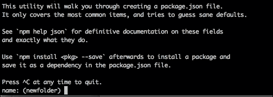

npm 会要求您输入一些参数来配置您的项目，一旦完成，它会写入一个`package.json`文件，内容类似于上述代码。

现在我们需要安装依赖项；npm 会为我们做这件事。只需运行以下命令：

```js
npm install --save seneca

```

现在，如果再次检查`package.json`，您会看到一个名为`dependencies`的新部分，其中包含了 Seneca 的条目：

```js
"dependencies": {
  "seneca": "⁰.7.1"
}
```

这意味着从现在开始，我们的应用程序可以需要 Seneca 模块，并且`require()`函数将能够找到它。`save`标志有一些变化，如下所示：

+   `save`：这将在`dependencies`部分保存依赖项。它在整个开发生命周期中都可用。

+   `save-dev`：这将在`devDependencies`部分保存依赖项。它仅在开发中可用，不会部署到生产环境中。

+   `save-optional`：这会添加一个依赖项（例如`save`），但如果找不到依赖项，npm 会继续执行。由应用程序来处理缺少此依赖项。

让我们继续使用 PM2。虽然它可以作为一个库来使用，但 PM2 主要是一个命令工具，就像在任何 Unix 系统中的`ls`或`grep`一样。npm 在安装命令行工具方面做得很好：

```js
npm install –g pm2

```

`-g`标志指示 npm 全局安装 PM2，因此它在系统中可用，而不是在应用程序中。这意味着当前一个命令完成时，`pm2`在控制台中作为一个命令可用。如果在终端中运行`pm2 help`，您可以看到 PM2 的帮助。

## 我们的第一个程序-Hello World

围绕 Node.js 最有趣的概念之一是简单性。只要您熟悉 JavaScript，您可以在几天内学会 Node.js，并在几周内掌握它。Node.js 中的代码往往比其他语言更短更清晰：

```js
var http = require('http');

var server = http.createServer(function (request, response) {
  response.writeHead(200, {"Content-Type": "text/plain"});
  response.end("Hello World\n");
});

server.listen(8000);
```

上述代码创建了一个服务器，监听`8000`端口的请求。如果您不相信，打开浏览器，在导航栏中输入`http://127.0.0.1:8000`，如下截图所示：

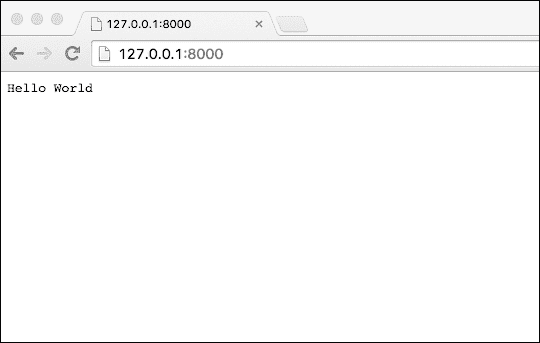

让我们解释一下代码：

+   第一行加载了`http`模块。通过`require()`指令，我们要求节点加载`http`模块，并将该模块的导出分配给`http`变量。导出语言元素是 Node.js 用来从模块内部向外部世界公开函数和变量的方式。

+   脚本中的第二个构造创建了 HTTP 服务器。`http`模块创建并公开了一个名为`createServer()`的方法，该方法接收一个函数（记住 JavaScript 将函数视为一级对象，因此它们可以作为其他函数的参数传递），在 Node.js 世界中称为**回调**。回调是作为对事件的响应而执行的操作。在这种情况下，事件是脚本接收到 HTTP 请求。由于 Node.js 的线程模型，回调的使用非常频繁。您的应用程序将始终在单个线程上执行，因此不会阻塞应用程序线程，同时等待操作完成，并且可以防止我们的应用程序看起来停滞或挂起。否则，您的程序将无法响应。我们将在第四章中回到这一点，*在 Node.js 中编写您的第一个微服务*。

+   在下一行中，`server.listen(8000)`启动了服务器。从现在开始，每当我们的服务器收到一个请求，`http.createServer()`函数上的回调将被执行。

就是这样。简单是 Node.js 程序的关键。代码允许您直奔主题，而不必编写大量的类、方法和配置对象，这些会使最初可以更简单地完成的事情变得复杂：编写一个提供请求的脚本。

## Node.js 线程模型

Node.js 编写的程序是单线程的。这的影响相当显著；在前面的例子中，如果我们有一万个并发请求，它们将被排队并由 Node.js 事件循环满足（将在第四章和第六章中进一步解释，*在 Node.js 中编写您的第一个微服务*和*测试和文档化 Node.js 微服务*）。

乍一看，这听起来是错误的。我的意思是，现代 CPU 可以处理多个并行请求，因为它们是多核的。那么，在一个线程中执行它们有什么好处呢？

这个问题的答案是，Node.js 被设计用来处理异步处理。这意味着在读取文件等慢操作时，Node.js 不会阻塞线程，而是允许线程继续满足其他事件，然后节点的控制过程将执行与事件相关的方法，处理响应。

坚持前面的例子，`createServer()`方法接受一个回调，该回调将在 HTTP 请求事件发生时执行，但与此同时，线程可以自由地继续执行其他操作。

这种模型的问题是 Node.js 开发人员所说的回调地狱。随着每个对阻塞操作的响应都必须在回调中处理，代码变得复杂，就像前面的例子中，作为`createServer()`方法参数使用的函数一样。

## 模块化组织最佳实践

大型项目的源代码组织总是有争议的。不同的开发人员有不同的方法来整理源代码，以保持混乱的远离。

一些语言，如 Java 或 C＃，通过包来组织代码，以便我们可以在包内找到相关的源代码文件。例如，如果我们正在编写一个任务管理器软件，在`com.taskmanager.dao`包内，我们可以期望找到实现**数据访问对象**（**DAO**）模式以访问数据库的类。同样，在`com.taskmanager.dao.domain.model`包中，我们可以找到表示模型对象（通常是表）的所有类。

这是 Java 和 C#中的一个约定。如果你是 C#开发人员，并且开始在一个现有项目上工作，只需要几天时间就可以适应代码的结构，因为语言强制执行源代码的组织。

### Javascript

JavaScript 最初是设计为在浏览器内运行的。代码应该嵌入在 HTML 文档中，以便可以操作**文档对象模型**（**DOM**）来创建动态效果。看看下面的例子：

```js
<!DOCTYPE html>
<html>
<head>
  <meta charset="UTF-8">
  <title>Title of the document</title>
</head>
<body>
  Hello <span id="world">Mundo</span>
  <script type="text/javascript">
  document.getElementById("world").innerText = 'World';
  </script>
</body>
</html>
```

正如你所看到的，如果你在浏览器上加载这个 HTML，`id`为`world`的`span`标签内的文本在页面加载时被替换。

在 JavaScript 中，没有依赖管理的概念。JavaScript 可以从 HTML 中分离出来成为自己的文件，但目前没有办法将一个 JavaScript 文件包含到另一个 JavaScript 文件中。

这导致了一个大问题。当项目包含数十个 JavaScript 文件时，资源管理变得更像是一种艺术而不是工程努力。

导入 JavaScript 文件的顺序变得重要，因为浏览器会在找到 JavaScript 文件时执行它们。让我们重新排列前面例子中的代码来演示它，如下所示：

```js
<!DOCTYPE html>
<html>
<head>
  <meta charset="UTF-8">
  <title>Title of the document</title>
  <script type="text/javascript">
    document.getElementById("world").innerText = 'World';
  </script>
</head>
<body>
  Hello <span id="world">Mundo</span>

</body>
</html>
```

现在，将这个 HTML 保存在一个名为`index.html`的文件中，并尝试在任何浏览器中加载它，如下图所示：

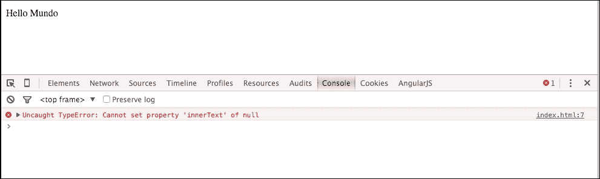

在这种情况下，我使用了 Chrome，控制台显示第 7 行出现了**Uncaught TypeError: Cannot set property 'innerText' of null**错误。

为什么会发生这种情况？

正如我们之前解释的，浏览器*执行*代码时，当浏览器执行 JavaScript 时，`world`元素尚不存在。

幸运的是，Node.js 已经通过一种非常优雅和标准的方法解决了依赖加载问题。

### SOLID 设计原则

在谈论微服务时，我们总是谈论模块化，而模块化总是归结为以下（**SOLID**）设计原则：

+   **单一**职责原则

+   **开放**扩展，关闭修改

+   **Liskov**替换

+   **接口**隔离

+   **依赖**反转（控制反转和依赖注入）

你希望你的代码组织成模块。模块是一组执行简单操作的代码，比如操作字符串，并且它执行得很好。你的模块包含的函数（或类、实用程序等）越多，它的内聚性就越低，我们正试图避免这种情况。

在 Node.js 中，每个 JavaScript 文件默认都是一个模块。我们也可以使用文件夹作为模块，但让我们专注于文件：

```js
function contains(a, b) {
  return a.indexOf(b) > -1;
}

function stringToOrdinal(str) {
  var result = ""
  for (var i = 0, len = str.length; i < len; i++) {
    result += charToNumber(str[i]);
  }
  return result;
}

function charToNumber(char) {
  return char.charCodeAt(0) - 96;
}

module.exports = {
  contains: contains,
  stringToOrdinal: stringToOrdinal
}
```

上面的代码代表了 Node.js 中的一个有效模块。在这种情况下，模块包含三个函数，其中两个函数对外部可见。

在 Node.js 中，这是通过`module.exports`变量完成的。无论你分配给这个变量什么，都将被调用代码看到，这样我们就可以在模块上模拟私有内容，比如在这种情况下的`charToNumber()`函数。

因此，如果我们想要使用这个模块，我们只需要像下面这样`require()`它：

```js
var stringManipulation = require("./string-manipulation");
console.log(stringManipulation.stringToOrdinal("aabb"));
```

这应该输出`1122`。

让我们回到 SOLID 原则，看看我们的模块是什么样子的：

+   **单一职责原则**：我们的模块只处理字符串

+   **开放扩展，关闭修改**：我们可以添加更多的函数，但我们已经有的函数是正确的，它们可以用来构建模块中的新函数

+   **Liskov 替换**：我们将跳过这一点，因为模块的结构与实现这一原则无关

+   **接口隔离**：JavaScript 不是像 Java 或 C#那样具有接口元素的语言，但在这个模块中，我们暴露了接口，`module.exports`变量将作为调用代码和我们实现变化之间的合同

+   **依赖反转**：这就是我们失败的地方，不是完全失败，但足够让我们重新考虑我们的方法

在这种情况下，我们需要模块，并且与之交互的唯一方法是通过全局范围。如果在模块内部，我们想要与外部的数据交互，唯一可能的选项就是在需要模块之前创建一个全局变量（或函数），然后假设它总是存在。

全局变量在 Node.js 中是一个大问题。你可能知道，在 JavaScript 中，如果在声明变量时省略了`var`关键字，它会自动成为全局变量。

这与有意的全局变量创建模块之间的数据耦合（耦合是我们想要以任何代价避免的）事实相结合，是寻找更好的方法来定义我们的微服务（或者一般情况下）模块的原因。

让我们按照以下方式重构代码：

```js
function init(options) {

  function charToNumber(char) {
    return char.charCodeAt(0) - 96;
  }

  function StringManipulation() {
  }

  var stringManipulation = new StringManipulation();

  stringManipulation.contains = function(a, b) {
    return a.indexOf(b) > -1;
  };

  stringManipulation.stringToOrdinal = function(str) {
    var result = ""
    for (var i = 0, len = str.length; i < len; i++) {
      result += charToNumber(str[i]);
    }
    return result;
  }
  return stringManipulation;
}

module.exports = init;
```

这看起来有点复杂，但一旦你习惯了，好处是巨大的：

+   我们可以向模块传递配置参数（例如调试信息）

+   避免全局范围的污染，就好像所有东西都包裹在一个函数内部一样，并且我们强制执行*use strict*配置（这样可以避免没有`var`声明的编译错误）

+   对模块进行参数化使得为测试模拟行为和数据变得容易

在本书中，我们将编写大量代码来模拟微服务的系统。我们将尽量保持这种模式，以便我们可以看到好处。

我们将要使用的一个构建微服务的库 Seneca，遵循这种模式，以及许多可以在互联网上找到的库。

# Seneca - 一个微服务框架

Seneca 是由 Richard Rodger 编写的用于构建微服务的框架，他是 nearForm 的创始人兼首席技术官，nearForm 是一家咨询公司，帮助其他公司使用 Node.js 设计和实现软件。Seneca 是关于简单性的，它通过一个复杂的模式匹配接口连接服务，将传输从代码中抽象出来，因此编写高度可扩展的软件相当容易。

让我们停止说话，看一些例子：

```js
var seneca = require( 'seneca' )()

seneca.add({role: 'math', cmd: 'sum'}, function (msg, respond) {
  var sum = msg.left + msg.right
  respond(null, {answer: sum})
})

seneca.add({role: 'math', cmd: 'product'}, function (msg, respond) {
  var product = msg.left * msg.right
  respond( null, { answer: product } )
})

seneca.act({role: 'math', cmd: 'sum', left: 1, right: 2}, console.log)
    seneca.act({role: 'math', cmd: 'product', left: 3, right: 4}, console.log)
```

正如你所看到的，代码是不言自明的：

+   Seneca 作为一个模块出现，所以需要做的第一件事就是`require()`它。Seneca 包装在一个函数中，因此调用该函数会初始化库。

+   接下来的两条指令与第一章中解释的一个概念相关：API 组合。`seneca.add()`方法指示 Seneca 添加一个函数，该函数将在一组模式下被调用。对于第一个，我们指定当 Seneca 接收到`{role: math, cmd: sum}`命令时将发生的动作。对于第二个，模式是`{role: math, cmd: product}`。

+   最后一行发送一个命令给 Seneca，该命令将由与作为第一个参数传递的模式匹配的服务执行。在这种情况下，它将匹配第一个服务作为`role`和`cmd`匹配。对`act`的第二次调用将匹配第二个服务。

在本章前面创建的项目中的名为`index.js`的文件中编写代码（记住我们安装了 Seneca 和 PM2），并运行以下命令：

```js
node index.js

```

输出将类似于以下图像：

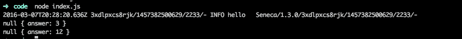

我们稍后会谈论这个输出，以便准确解释它的含义，但是如果你习惯于企业应用程序，你几乎可以猜到发生了什么。

最后两行是来自两个服务的响应：第一个执行`1+2`，第二个执行`3*4`。

在最后两行中显示的`null`输出对应于 JavaScript 中广泛使用的模式：错误回调优先。

让我们用一个代码示例来解释一下：

```js
var seneca = require( 'seneca' )()

seneca.add({role: 'math', cmd: 'sum'}, function (msg, respond) {
  var sum = msg.left + msg.right
  respond(null, {answer: sum})
})

seneca.add({role: 'math', cmd: 'product'}, function (msg, respond) {
  var product = msg.left * msg.right
  respond( null, { answer: product } )
})

seneca.act({role: 'math', cmd: 'sum', left: 1, right: 2}, function(err, data) {
  if (err) {
    return console.error(err);
  }
  console.log(data);
});
seneca.act({role: 'math', cmd: 'product', left: 3, right: 4}, console.log);
```

前面的代码重写了对 Seneca 的第一次调用，采用了更合适的方法。而不是将所有内容转储到控制台，处理来自 Seneca 的响应，这是一个回调，第一个参数是错误（如果有的话是`null`），第二个参数是来自微服务的数据。这就是为什么在第一个例子中，`null`是第一个输出到控制台的原因。

在 Node.js 世界中，使用回调是非常常见的。回调是一种指示程序发生了某事的方式，而不会被阻塞，直到结果准备好被处理。Seneca 也不例外。它严重依赖回调来处理对服务调用的响应，特别是当您考虑到微服务部署在不同的机器上时（在前面的例子中，一切都在同一台机器上运行），尤其是因为网络延迟可能是需要考虑到软件设计的因素。

## 正确的控制反转

在现代软件中，控制反转是必不可少的。它与依赖注入一起使用。

控制反转可以被定义为*一种委托创建或调用组件和方法的技术，使得您的模块不需要知道如何构建依赖关系，通常通过依赖注入获得*。

Seneca 实际上并没有使用依赖注入，但它是控制反转的完美例子。

让我们看看以下代码：

```js
var seneca = require('seneca')();
seneca.add({component: 'greeter'}, function(msg, respond) {
  respond(null, {message: 'Hello ' + msg.name});
});
seneca.act({component: 'greeter', name: 'David'}, function(error, response) {
  if(error) return console.log(error);
  console.log(response.message);
});
```

这是最基本的 Seneca 示例。从企业软件的角度来看，我们可以区分两个组件：一个生产者（`Seneca.add()`）和一个消费者（`Seneca.act()`）。如前所述，Seneca 并没有像现在这样的依赖注入系统，但 Seneca 是围绕控制反转原则优雅构建的。

在`Seneca.act()`函数中，我们不显式调用持有业务逻辑的组件；而是通过接口向 Seneca 询问解析组件，这里是一个 JSON 消息。这就是控制反转。

Seneca 在这方面非常灵活：没有关键字（除了集成）和没有强制字段。它只是具有一组关键字和值，这些关键字和值由称为**Patrun**的模式匹配引擎使用。

## Seneca 中的模式匹配

模式匹配是您可以用于微服务的最灵活的软件模式之一。

与网络地址或消息相反，模式相当容易扩展。让我们通过以下例子来解释一下：

```js
var seneca = require('seneca')();
seneca.add({cmd: 'wordcount'}, function(msg, respond) {
  var length = msg.phrase.split(' ').length;
  respond(null, {words: length});
});

seneca.act({cmd: 'wordcount', phrase: 'Hello world this is Seneca'}, function(err, response) {
  console.log(response);
});
```

这是一个统计句子中单词数量的服务。正如我们之前所见，在第一行中，我们为`wordcount`命令添加了处理程序，在第二行中，我们向 Seneca 发送了一个请求，以统计短语中的单词数量。

如果您执行它，您应该会得到类似以下图像的结果：


到目前为止，您应该能够理解它是如何工作的，甚至对其进行一些修改。

让我们扩展这个模式。现在，我们想要跳过短单词，如下所示：

```js
var seneca = require('seneca')();

seneca.add({cmd: 'wordcount'}, function(msg, respond) {
  var length = msg.phrase.split(' ').length;
  respond(null, {words: length});
});

seneca.add({cmd: 'wordcount', skipShort: true}, function(msg, respond) {
  var words = msg.phrase.split(' ');
  var validWords = 0;
  for (var i = 0; i < words.length; i++) {
    if (words[i].length > 3) {
      validWords++;
    }
  }
  respond(null, {words: validWords});
});

seneca.act({cmd: 'wordcount', phrase: 'Hello world this is Seneca'}, function(err, response) {
  console.log(response);
});

seneca.act({cmd: 'wordcount', skipShort: true, phrase: 'Hello world this is Seneca'}, function(err, response) {
  console.log(response);
});
```

如您所见，我们为`wordcount`命令添加了另一个处理程序，带有额外的`skipShort`参数。

这个处理程序现在跳过所有三个或更少字符的单词。如果您执行前面的代码，输出将类似于以下图像：

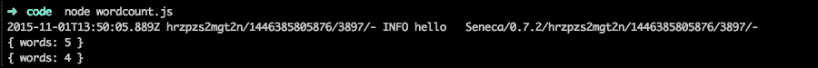

第一行`{words: 5}`对应于第一个 act 调用。第二行`{words: 4}`对应于第二个调用。

### Patrun-一个模式匹配库

Patrun 也是由 Richard Rodger 编写的。它被 Seneca 用来执行模式匹配，并决定哪个服务应该响应调用。

Patrun 使用**最接近** **匹配**方法来解决调用。让我们看看以下例子：

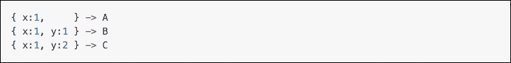

在前面的图像中，我们可以看到三种模式。这些等同于前一节示例中的`seneca.add()`。

在这种情况下，我们注册了三种不同的*x*和*y*变量的组合。现在，让我们看看 Patrun 如何进行匹配：

+   `{x: 1} ->A`：这与**A**完全匹配

+   `{x: 2} ->`：无匹配

+   `{x:1, y:1} -> B`：与**B**完全匹配；它也与**A**匹配，但**B**是更好的匹配——两对两对对一对一

+   `{x:1, y:2} -> C`：与**C**完全匹配；同样，它也与**A**匹配，但**C**更具体

+   `{y: 1} ->`：无匹配

如你所见，Patrun（和 Seneca）总是会得到最长的匹配。这样，我们可以通过具体化匹配轻松扩展更抽象模式的功能。

### 重用模式

在前面的例子中，为了跳过少于三个字符的单词，我们不重用单词计数函数。

在这种情况下，很难按原样重用函数；尽管问题听起来非常相似，但解决方案几乎没有重叠。

然而，让我们回到我们添加两个数字的例子：

```js
var seneca = require( 'seneca' )()

seneca.add({role: 'math', cmd: 'sum'}, function (msg, respond) {
  var sum = msg.left + msg.right
  respond(null, {answer: sum})
});

seneca.add({role: 'math', cmd: 'sum', integer: true}, function (msg, respond) {
  this.act({role: 'math', cmd: 'sum', left: Math.floor(msg.left), right: Math.floor(msg.right)},respond);
});

seneca.act({role: 'math', cmd: 'sum', left: 1.5, right: 2.5}, console.log)

seneca.act({role: 'math', cmd: 'sum', left: 1.5, right: 2.5, integer: true}, console.log)
```

如你所见，代码有些变化。现在，接受整数的模式依赖于基本模式来计算数字的总和。

Patrun 总是试图匹配最接近和最具体的模式，它可以找到以下两个维度：

+   最长的匹配链

+   模式的顺序

它将始终尝试找到最佳匹配，如果存在歧义，它将匹配找到的第一个模式。

这样，我们可以依赖已经存在的模式来构建新的服务。

### 编写插件

插件是基于 Seneca 的应用程序的重要部分。正如我们在第一章中讨论的那样，API 聚合是构建应用程序的完美方式。

Node.js 最流行的框架都是围绕这个概念构建的：小软件片段组合在一起，创建一个更大的系统。

塞内卡也是围绕这一点构建的；`Seneca.add()`原则向拼图添加一个新的部分，以便最终的 API 是不同小软件部分的混合体。

塞内卡更进一步，实现了一个有趣的插件系统，以便将常见功能模块化并抽象为可重用的组件。

以下示例是最小的 Seneca 插件：

```js
function minimal_plugin( options ) {
  console.log(options)
}

require( 'seneca' )()
  .use( minimal_plugin, {foo:'bar'} )
```

将代码写入`minimal-plugin.js`文件并执行它：

```js
node minimal-plugin.js

```

这个执行的输出应该类似于以下图像：

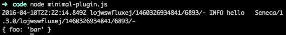

在 Seneca 中，插件在启动时加载，但我们看不到它，因为默认的日志级别是 INFO。这意味着 Seneca 不会显示任何 DEBUG 级别的信息。为了查看 Seneca 在做什么，我们需要获取更多信息，如下所示：

```js
node minimal-plugin.js –seneca.log.all

```

这会产生大量输出。这几乎是 Seneca 内部发生的一切，这对于调试复杂的情况非常有用，但在这种情况下，我们想要做的是显示插件列表：

```js
node minimal-plugin.js --seneca.log.all | grep plugin | grep DEFINE

```

它会产生类似于以下图像的东西：

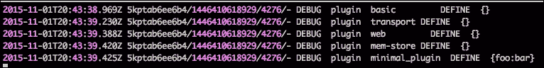

让我们分析前面的输出：

+   `basic`：这个插件包含在主 Seneca 模块中，并提供一小组基本实用程序动作模式。

+   `transport`：这是传输插件。到目前为止，我们只在同一台机器上执行了不同的服务（相当小而简洁），但如果我们想要分发它们呢？这个插件将帮助我们做到这一点，我们将在接下来的章节中看到如何做到这一点。

+   `web`：在第一章中，我们提到微服务应该倡导将连接它们的管道保持在广泛使用的标准下。Seneca 默认使用 TCP，但创建 RESTful API 可能会很棘手。这个插件有助于做到这一点，我们将在下一节中看到如何做到这一点。

+   `mem-store`：Seneca 带有一个数据抽象层，以便我们可以在不同的地方处理数据存储：Mongo、SQL 数据库等等。Seneca 提供了一个内存存储，因此它可以直接使用。

+   `minimal_plugin`：这是我们的插件。所以，现在我们知道 Seneca 能够加载它。

我们编写的插件什么也没做。现在是时候写一些有用的东西了：

```js
function math( options ) {

  this.add({role:'math', cmd: 'sum'}, function( msg, respond ) {
    respond( null, { answer: msg.left + msg.right } )
  })

  this.add({role:'math', cmd: 'product'}, function( msg, respond ) {
    respond( null, { answer: msg.left * msg.right } )
  })

}

require( 'seneca' )()
  .use( math )
  .act( 'role:math,cmd:sum,left:1,right:2', console.log )
```

首先，请注意在最后一条指令中，`act()`遵循不同的格式。我们不是传递一个字典，而是传递一个带有与第一个参数相同键值的字符串，就像我们用字典一样。这样做没有问题，但我更喜欢使用 JSON 对象（字典），因为这是一种在没有语法问题的情况下构造数据的方式。

在前面的例子中，我们可以看到代码是如何被构造为一个插件的。如果我们执行它，我们可以看到输出与下面的类似：

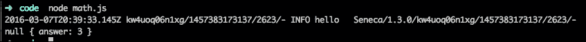

在 Seneca 中，您需要小心如何初始化您的插件。包装插件的函数（在前面的例子中是`math()`函数）是按设计同步执行的，并且被称为**定义函数**。如果您还记得前一章，Node.js 应用程序是单线程的。

要初始化一个插件，您需要添加一个特殊的`init()`动作模式。这个动作模式按顺序为每个插件调用。`init()`函数必须在没有错误的情况下调用其响应回调。如果插件初始化失败，那么 Seneca 将退出 Node.js 进程。当出现问题时，您希望您的微服务能够快速失败（并大声尖叫）。所有插件必须在执行任何操作之前完成初始化。

让我们看一个如何以以下方式初始化插件的例子：

```js
function init(msg, respond) {
  console.log("plugin initialized!");
  console.log("expensive operation taking place now... DONE!");
  respond();
}

function math( options ) {

  this.add({role:'math', cmd: 'sum'}, function( msg, respond ) {
    respond( null, { answer: msg.left + msg.right } )
  })

  this.add({role:'math', cmd: 'product'}, function( msg, respond ) {
    respond( null, { answer: msg.left * msg.right } )
  })

  this.add({init: "math"}, init);
}
require( 'seneca' )()
  .use( math )
  .act( 'role:math,cmd:sum,left:1,right:2', console.log )
```

然后，在执行此文件之后，输出应该看起来与以下图像非常相似：

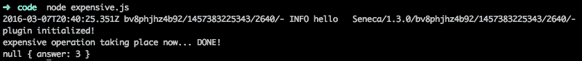

从输出中可以看出，初始化插件的函数被调用了。

### 提示

在 Node.js 应用程序中的一般规则是永远不要阻塞线程。如果发现自己阻塞线程，可能需要重新考虑如何避免它。

### Web 服务器集成

在第一章中，*微服务架构*，我们特别强调使用标准技术与您的微服务进行通信。

Seneca 默认使用 TCP 传输层，尽管它使用 TCP，但与之交互并不容易，因为决定执行的方法的标准是基于从客户端发送的有效负载。

让我们深入探讨最常见的用例：你的服务是由浏览器上的 JavaScript 调用的。虽然可以做到，但如果 Seneca 暴露了 REST API 而不是 JSON 对话，将会更容易得多，这对于微服务之间的通信是完美的（除非你有超低延迟的要求）。

Seneca 不是一个 Web 框架。它可以被定义为*通用微服务框架*，因此围绕像之前暴露的具体案例构建它并没有太多意义。

相反，Seneca 是以一种使其与其他框架集成相当容易的方式构建的。

**Express**是在 Node.js 上构建 Web 应用程序时的首选。关于 Express 的示例和文档的数量使得学习它的任务相当容易。

#### Seneca 作为 Express 中间件

Express 也是根据 API 组合原则构建的。Express 中的每个软件都被称为中间件，并且它们在代码中被链接在一起以处理每个请求。

在这种情况下，我们将使用**seneca-web**作为 Express 的中间件，这样一旦我们指定配置，所有的 URL 都将遵循命名约定。

让我们考虑以下例子：

```js
var seneca = require('seneca')()

seneca.add('role:api,cmd:bazinga',function(args,done){
  done(null,{bar:"Bazinga!"});
});
seneca.act('role:web',{use:{
  prefix: '/my-api',
  pin: {role:'api',cmd:'*'},

  map:{
    bazinga: {GET: true}
  }
}})
var express = require('express')
var app = express()
app.use( seneca.export('web') )
app.listen(3000)
```

这段代码不像前面的例子那么容易理解，但我会尽力解释：

+   第二行将一个模式添加到 Seneca。我们对此非常熟悉，因为本书中的所有示例都这样做。

+   第三条指令`seneca.act()`是魔法发生的地方。我们正在将模式与`role:api`模式和任何 cmd 模式（`cmd:*`）挂载到`/my-api`下的 URL 上。在这个例子中，第一个`seneca.add()`将回复 URL`/my-api/bazinga`，因为`prefix`变量指定了`/my-api/`，而`seneca.add()`命令的`cmd`部分指定了`bazinga`。

+   `app.use(seneca.export('web'))`指示 Express 使用 seneca-web 作为中间件，根据配置规则执行操作。

+   `app.listen(3000)`将端口`3000`绑定到 Express。

如果您还记得本章早些时候的部分，`seneca.act()`将一个函数作为第二个参数。在这种情况下，我们正在向 Express 公开配置，以便用于将传入请求映射到 Seneca 操作的方式。

让我们来测试一下：

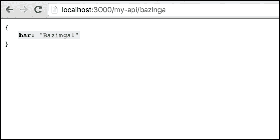

前面的代码非常密集，所以让我们将其解释为来自浏览器的代码：

+   Express 接收到一个请求，由 seneca-web 处理。

+   seneca-web 插件配置为使用`/my-api/`作为前缀，该前缀与包含`role:api`模式以及任何 cmd 模式（`cmd:*`）的 Seneca 操作（`seneca.add()`）绑定在一起。在这种情况下，`/my-api/bazinga`对应于第一个（也是唯一的）带有`{role: 'api', cmd: 'bazinga'}`模式的`seneca.add()`命令。

完全理解 Seneca 和 Express 之间的集成需要一些时间，但一旦清楚，API 组合模式提供的灵活性是无限的。

Express 本身已经足够庞大，超出了本书的范围，但值得一看，因为它是一个非常流行的框架。

#### 数据存储

Seneca 带有一个数据抽象层，允许您以通用方式与应用程序的数据进行交互。

默认情况下，Seneca 带有一个内存插件（如前一节所述），因此它可以直接使用。

在本书的大部分时间里，我们将使用它，因为不同的存储系统完全超出了范围，而 Seneca 将我们从中抽象出来。

Seneca 提供了一个简单的数据抽象层（基于以下操作的对象关系映射（ORM））：

+   **加载**：通过标识符加载实体

+   **保存**：创建或更新（如果提供标识符）实体

+   **列表**：列出与简单查询匹配的实体

+   **删除**：通过标识符删除实体

让我们构建一个管理数据库中员工的插件：

```js
module.exports = function(options) {
  this.add({role: 'employee', cmd: 'add'}, function(msg, respond){
    this.make('employee').data$(msg.data).save$(respond);
  });

  this.find({role: 'employee', cmd: 'get'}, function(msg, respond) {
    this.make('employee').load$(msg.id, respond);
  });
}
```

请记住，默认情况下，数据库是在内存中的，所以我们现在不需要担心表结构。

第一条命令将员工添加到数据库。第二条命令通过`id`从数据库中恢复员工。

请注意，Seneca 中的所有 ORM 原语最终都以美元符号（`$`）结尾。

现在您可以看到，我们已经从数据存储的细节中抽象出来。如果应用程序在将来发生变化，并且我们决定使用 MongoDB 作为数据存储而不是内存存储，我们唯一需要处理的就是处理 MongoDB 的插件。

让我们使用我们的员工管理插件，如下所示：

```js
var seneca = require('seneca')().use('employees-storage')
var employee =  {
  name: "David",
  surname: "Gonzalez",
  position: "Software Developer"
}

function add_employee() {
  seneca.act({role: 'employee', cmd: 'add', data: employee}, function (err, msg) {
    console.log(msg);
  });
}
add_employee();
```

在前面的例子中，我们通过调用插件中暴露的模式向内存数据库添加了一个员工。

在整本书中，我们将看到关于如何使用数据抽象层的不同示例，但主要重点将放在如何构建微服务上，而不是如何处理不同的数据存储上。

# PM2 - 用于 Node.js 的任务运行器

**PM2**是一个生产进程管理器，可以帮助扩展或缩小 Node.js，以及负载均衡服务器的实例。它还确保进程一直在运行，解决了 Node.js 线程模型的一个副作用：未捕获的异常会终止线程，从而导致应用程序崩溃。

## 单线程应用程序和异常

正如您之前学到的，Node.js 应用程序在单个线程中运行。这并不意味着 Node.js 不是并发的，它只是意味着您的应用程序在单个线程上运行，但其他所有内容都是并行运行的。

这意味着：*如果异常未经处理就冒出来，您的应用程序将死掉*。

解决这个问题的方法是大量使用 promise 库，比如**bluebird**；它添加了成功和失败的处理程序，这样如果出现错误，异常就不会冒出来，导致应用程序崩溃。

然而，有一些情况是我们无法控制的，*我们称之为不可恢复的错误或错误*。最终，由于错误处理不当，您的应用程序将死掉。在诸如 Java 之类的语言中，异常并不是一个大问题：线程死掉了，但应用程序继续工作。

在 Node.js 中，这是一个大问题。这个问题最初是使用**forever**等任务运行器解决的。

它们都是任务运行器，当您的应用程序因某种原因退出时，它们会重新运行它，以确保运行时间。

考虑以下例子：

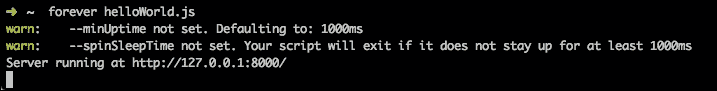

`helloWorld.js`应用程序现在由 forever 处理，如果应用程序死掉，它将重新运行。让我们杀死它，如下图所示：

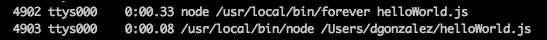

正如你所看到的，forever 已经生成了一个带有`4903` PID 的不同进程。现在，我们发出一个 kill 命令（`kill -9 4093`），这是 forever 的输出如下：

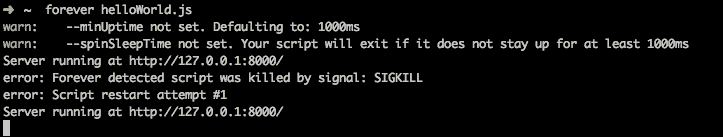

尽管我们已经杀死了它，但我们的应用程序被 forever 重新启动，没有任何停机时间（至少没有明显的停机时间）。

正如你所看到的，forever 非常基础：它会重新运行应用程序，直到被杀死为止。

还有另一个叫做**nodemon**的包，它是开发 Node.js 应用程序最有用的工具之一。如果它检测到监视的文件发生变化（默认情况下是`*.*`），它会重新加载应用程序：

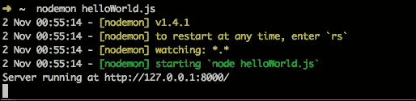

现在，如果我们修改`helloWorld.js`文件，我们可以看到 nodemon 如何重新加载应用程序。这对于避免编辑/重新加载循环并加快开发速度非常有趣。

## 使用 PM2-行业标准任务运行器

尽管 forever 看起来非常有趣，但 PM2 比 forever 更先进。使用 PM2，您可以完全管理应用程序的生命周期，而无需任何停机时间，还可以通过简单的命令扩展或缩小应用程序。

PM2 还充当负载均衡器。

让我们考虑以下例子：

```js
var http = require('http');

var server = http.createServer(function (request, response) {
  console.log('called!');
  response.writeHead(200, {"Content-Type": "text/plain"});
  response.end("Hello World\n");
});
server.listen(8000);
console.log("Server running at http://127.0.0.1:8000/");
```

这是一个非常简单的应用程序。让我们使用 PM2 运行它：

```js
pm2 start helloWorld.js

```

这会产生类似以下图像的输出：

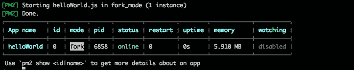

PM2 已注册了一个名为`helloWorld`的应用程序。该应用程序以`fork`模式运行（这意味着 PM2 不是负载均衡器，它只是分叉了应用程序），操作系统的 PID 为`6858`。

现在，如下图所示，我们将运行`pm2 show 0`，显示与`id 0`相关的应用程序的信息，如下图所示：

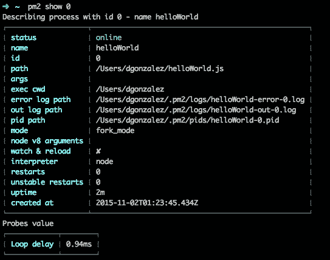

通过两个命令，我们已经成功以非常复杂的方式运行了一个简单的应用程序。

从现在开始，PM2 将确保您的应用程序始终运行，因此如果您的应用程序死掉，PM2 将再次启动它。

我们还可以监视 PM2 正在运行的应用程序数量：

```js
pm2 monit

```

这显示了以下输出：

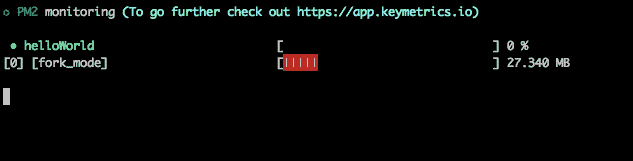

这是 PM2 监视器。在这种情况下，这完全是一种过度杀伤，因为我们的系统只由一个应用程序组成，它在分叉模式下运行。

我们还可以通过执行`pm2 logs`来查看日志，如下图所示：

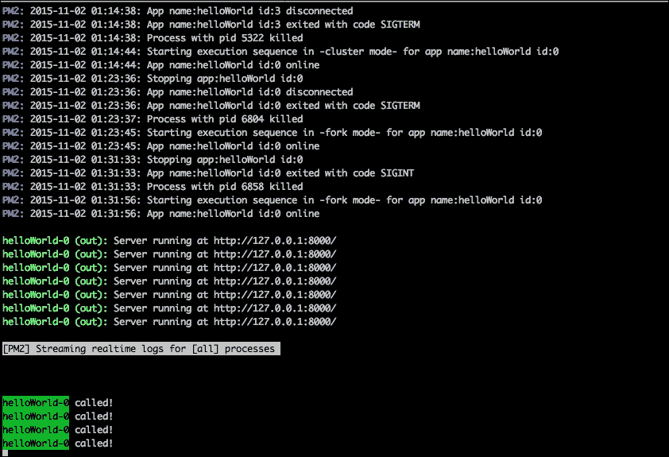

正如您所看到的，PM2 非常可靠。通过少量命令，我们已经涵盖了应用程序监控的 90%的需求。然而，这还不是全部。

PM2 还提供了一种简单的方法，在不间断的情况下重新加载您的应用程序：

```js
pm2 reload all

```

此命令确保您的应用程序在零停机时间内重新启动。PM2 将为您排队的传入请求，并在您的应用程序再次响应时重新处理它们。还有一个更精细的选项，您可以通过指定应用程序名称来指定仅重新加载某些应用程序：

```js
pm2 reload helloWorld

```

对于那些多年来一直在与 Apache、NGINX、PHP-FPM 等作斗争的人来说，这听起来非常熟悉。

PM2 中的另一个有趣功能是在集群模式下运行应用程序。在这种模式下，PM2 会生成一个控制器进程和您指定的许多工作进程（您的应用程序），以便您可以利用单线程技术（如 Node.js）的多核 CPU 的好处。

在执行此操作之前，我们需要停止正在运行的应用程序：

```js
pm2 stop all

```

这将导致以下输出：

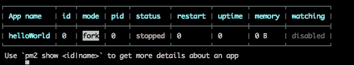

PM2 会记住正在运行的应用程序，因此在集群模式下重新运行应用程序之前，我们需要通知 PM2 忘记您的应用程序，如下所示：

```js
pm2 delete all

```

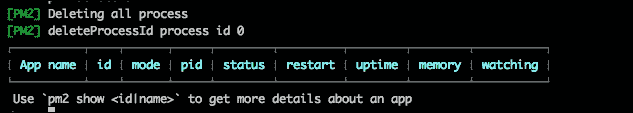

我们已准备好在集群模式下运行我们的应用程序：

```js
pm2 start helloWorld.js -i 3

```

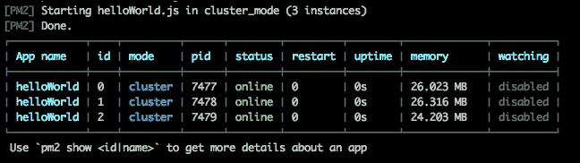

PM2 在主进程和三个工作进程之间循环运行，以便它们可以同时处理三个请求。我们还可以缩减或增加我们的工作进程数量：

```js
pm2 scale helloWorld 2

```

这将导致运行相同应用程序的两个进程，而不是三个：

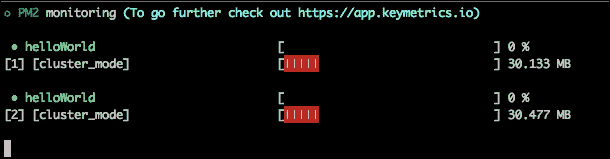

正如您所看到的，我们几乎没有费力就成功地配置了我们的应用程序，以便投入生产。

现在，我们可以保存 PM2 的状态，以便如果重新启动服务器，并且 PM2 作为守护程序运行，应用程序将自动启动。

PM2 具有代码 API，因此我们可以编写一个 Node.js 程序来管理我们手动进行的所有步骤。它还可以通过 JSON 文件配置您的服务。当我们学习如何使用 PM2 和 Docker 部署 Node.js 应用程序时，我们将在第六章中更深入地讨论这一点，*测试和记录 Node.js 微服务*。

# 总结

在本章中，您学习了 Seneca 和 PM2 的基础知识，以便我们能够在本书的第四章中构建和运行面向微服务的系统，*在 Node.js 中编写您的第一个微服务*。

我们还证明了上一章中提出的一些概念实际上有助于解决现实世界的问题，同时也使我们的生活变得非常容易。

在下一章中，我们将讨论如何拆分单片应用程序，这需要我们了解本章开发的一些概念。
