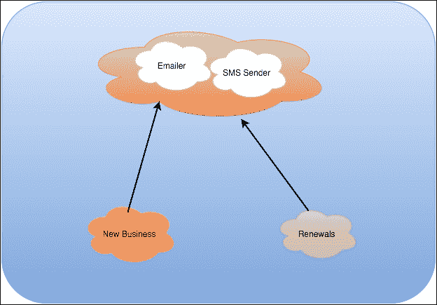
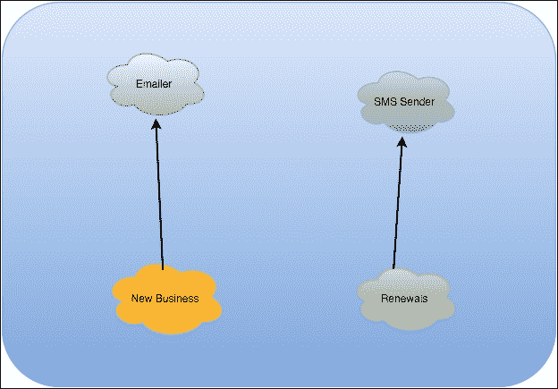
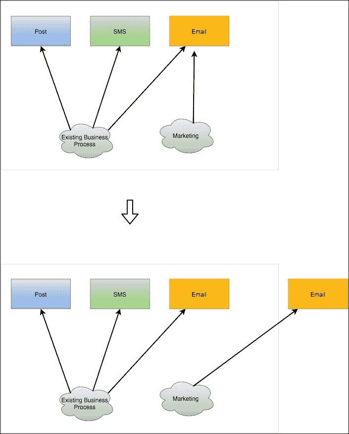
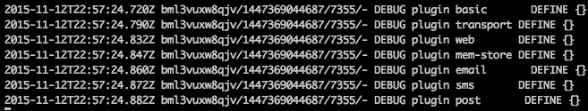

# 第三章：从单体到微服务

在我的职业生涯中，我在许多不同的公司工作过，主要是在金融服务领域，我为所有工作过的公司都遵循了以下相同的模式：

1.  一家公司是由一些具有良好领域知识的人建立的：保险、支付、信用卡等等。

1.  公司增长，需要满足新的业务需求（监管、大客户要求愚蠢的事情等），这些需求匆忙建立，几乎没有规划。

1.  公司经历了另一个增长阶段，业务交易明确定义，但被难以维护的单片软件模糊建模。

1.  公司增加了员工人数，导致增长痛苦和效率损失，因为软件建立时受到了限制。

这一章不仅关于如何避免之前的流程（不受控制的有机增长），还关于如何使用微服务模型一个新系统。这一章是本书的灵魂，我将在几页中尝试综合我的经验，建立在前几章中学到的原则上，第四章中，我们将基于微服务构建一个完整的系统，使用前几章中学到的经验。

# 首先是单体

现代企业软件的巨大比例（我估计约为 90%）是按照单体方法构建的。

大型软件组件在单个容器中运行，并且具有明确定义的开发生命周期，这完全违反了敏捷原则，早交付和经常交付（[`en.wikipedia.org/wiki/Release_early,_release_often`](https://en.wikipedia.org/wiki/Release_early,_release_often)）。

+   **早交付**：失败得越早，恢复就越容易。如果你在一个软件组件上工作了两年，然后发布，那么与原始要求偏离的风险很大，而原始要求通常是错误的，并且每隔几天就会改变一次。

+   **经常交付**：经常交付，利益相关者可以意识到进展，并可以在软件中快速看到变化。错误可以在几天内修复，改进很容易被识别。

公司构建大型软件组件，而不是一起工作的较小组件，这是自然的事情，如下所示：

1.  开发人员有了新的要求。

1.  他在服务层的现有类上构建了一个新的方法。

1.  该方法通过 HTTP、SOAP 或任何其他协议在 API 上公开。

现在，将开发人员的数量乘以，你将得到一种称为**有机增长**的东西。有机增长是一种在业务压力下对软件系统进行*不受控制和无计划*的增长，而且是不好的。

## 如何解决有机增长？

解决有机增长的第一件事是确保公司的业务和 IT 是对齐的。通常，在大公司中，IT 并不被视为业务的核心部分。

组织外包其 IT 系统，考虑价格，但不考虑质量，因此构建这些软件组件的合作伙伴专注于一件事：*按时交付*并根据规格进行交付，即使规格是不正确的。

这导致了一个不太理想的生态系统，无法以现有问题的工作解决方案来响应业务需求。IT 由几乎不了解系统构建方式的人领导，并且通常忽视软件开发的复杂性。

幸运的是，随着 IT 系统成为全球 99%企业的驱动力，这种趋势正在改变，但我们需要更聪明地构建它们。

解决有机增长的第一步是使 IT 和业务利益相关者协同工作：教育非技术利益相关者是成功的关键。

如果我们回到少量大版本的模式。我们能做得更好吗？

当然可以。将工作分成可管理的软件构件，模拟一个明确定义的业务活动并赋予其实体。

在这个阶段，它不需要成为微服务，但是将逻辑保持在一个分离的、定义良好、易于测试和解耦的模块内，将为我们在应用程序未来变更中带来巨大优势。

让我们考虑以下示例：



在这个保险系统中，你可以看到有人匆忙。短信和电子邮件发送者，尽管两者都是通信渠道，但它们的性质非常不同，你可能希望它们以不同的方式行事。

调用服务分为以下两个高级实体：

+   **新业务**：新客户在注册时收到电子邮件

+   **续保**：现有客户在保险政策准备续保时收到短信

在某个时候，系统需要发送短信和电子邮件，有人创建了处理所有第三方通信的通信服务实体。

一开始看起来是个好主意。短信或电子邮件，归根结底，只是一个通道，通信机制将 90%相同，我们可以重复使用大量功能。

如果我们突然想要集成一个处理所有实体邮件的第三方服务会发生什么？

如果我们想要添加一个每周向客户发送我们认为有趣的信息的新闻简报会发生什么？

服务将失控，并且测试、发布和确保短信代码的更改不会以任何形式影响发送电子邮件将变得更加困难。

这就是有机增长，在这种情况下，它与一条称为**康威定律**的法律有关，该定律陈述如下：

> *任何设计系统的组织（此处定义比信息系统更广泛）都将不可避免地产生一个结构与组织通信结构相同的设计。*

在这种情况下，我们陷入了一个陷阱。我们试图对一个可能太大和复杂以至于无法迅速应对新业务需求的单个软件组件进行建模通信。

让我们看一下下面的图表：



现在，我们已经将每个通信渠道封装到自己的服务中（稍后将部署为微服务），并且我们将对未来的通信渠道采取同样的做法。

这是击败有机增长的第一步：创建细粒度的服务，具有明确定义的边界和单一责任—*做一些小事，但做得很好*。

## 抽象到什么程度才算太抽象？

我们的大脑无法处理复杂的机制。抽象能力是人类智力最近的获取之一。

在前一节的示例中，我提出了一些对大部分程序员来说是好事的东西：*消除我们系统的抽象*。

抽象能力是我们多年来学到的东西，与智力不同，它是可以训练的。并非每个人都能达到相同的抽象水平，如果我们将某些行业所需的特定和复杂领域知识与高水平的抽象混合在一起，就会制造出灾难的完美配方。

在构建软件时，我总是试图遵循的黄金法则之一（试图是正确的词，因为我总是遇到巨大的反对意见）是避免过早的抽象。

你有多少次发现自己在一个简单的需求集合中：*构建一个解决 X 的程序*。然而，您的团队却提前考虑了*X*的所有可能变化，甚至不知道它们是否可行。然后，一旦软件投入生产，利益相关者之一提出了一个您甚至无法想象的*X*的变化（因为需求甚至不正确），现在，让这个变化工作将花费您几天和大规模的重构。

避免这个问题的方法很简单：*避免没有至少三个用例的抽象*。

不要考虑通过不同类型的渠道发送数据的可能性，因为这可能不会发生，而且您正在通过不必要的抽象来损害当前的功能。一旦您至少有另一个通信渠道，就是时候开始考虑如何更好地设计这两个软件组件了，当第三个用例出现时，进行重构。

请记住，在构建微服务时，它们应该足够小，可以在一个迭代周期内重写（大约两周），因此在这么短的时间内获得一个可工作的原型的好处是值得的，尽管有可能在需求更加具体时需要重写：向利益相关者展示东西是确定需求的最快方式。

**Seneca**在这方面非常出色，通过模式匹配，我们可以扩展给定微服务的 API，而不影响现有的调用代码：我们的服务可以进行扩展，但对修改关闭（SOLID 原则），因为我们正在添加功能而不影响现有功能。我们将在第四章中看到更完整的示例，*在 Node.js 中编写您的第一个微服务*。

# 然后微服务出现了。

微服务已经成为一种趋势。如今，公司更加重视软件的质量。正如前一节所述，及早交付和频繁交付是软件开发成功的关键。

微服务正在通过模块化和专业化帮助我们尽快满足业务需求。这些小型软件片段可以很容易地进行版本控制和升级，只需几天就可以进行测试，因为它们具有明确而小的目的（专业化），并且以一种使它们与系统其他部分隔离的方式编写。

不幸的是，通常很少会出现如前所述的情况。通常，大型软件系统并不是以易于识别的模块化或专业化的方式构建的。一般规则是构建一个功能齐全的大型软件组件，而模块化很差，因此我们需要从非常基础的地方开始。

让我们从编写一些代码开始，如下所示：

```js
module.exports = function(options) {

  var init = {}

  /**
   * Sends one SMS
   */
  init.sendSMS = function(destination, content) {
    // Code to send SMS
  }

  /**
   * Reads the pending list of SMS.
   */
  init.readPendingSMS = function() {
    // code to receive SMS
    return listOfSms;
  }

  /**
   * Sends an email.
   */
  init.sendEmail = function(subject, content) {
    // code to send emails
  }

  /**
   * Gets a list of pending emails.
   */
  init.readPendingEmails = function() {
    // code to read the pending emails
    return listOfEmails;
  }

  /**
   * This code marks an email as read so it does not get
   * fetch again by the readPendingEmails function.
   */
  init.markEmailAsRead = function(messageId) {
    // code to mark a message as read.
  }

  /**
   * This function queues a document to be printed and
   * sent by post.
   */
  init.queuePost = function(document) {
    // code to queue post
  }

  return init;
}
```

正如您所看到的，这个模块可以很容易地被称为**通信服务**，并且很容易猜到它在做什么。它管理电子邮件、短信和邮件通信。

这可能太多了。这个服务被认为会失控，因为人们会不断添加与通信相关的方法。这是单片软件的关键问题：边界上下文跨越不同领域，影响我们的软件质量，无论是从功能还是维护的角度来看。

如果您是一名软件开发人员，这个模块的内聚性就会立即引起警觉。

尽管它可能已经运行了一段时间，但我们现在正在改变我们的思维方式。我们正在构建小型、可扩展和自治的组件，可以被隔离。在这种情况下，内聚性很差，因为该模块做了太多不同的事情：电子邮件、短信和邮件。

如果我们添加另一个通信渠道，比如 Twitter 和 Facebook 通知，会发生什么？

服务变得失控。你不再拥有小型的功能软件组件，而是拥有一个庞大的模块，这将很难重构、测试和修改。让我们来看看下面的 SOLID 设计原则，解释在第二章中：*Node.js 中的微服务 - Seneca 和 PM2 替代方案*：

+   **单一责任原则**：模块做了太多的事情。

+   **开放扩展，关闭修改**：模块需要被修改以添加新的功能，可能需要改变公共代码。

+   **Liskov 替换**：我们将再次跳过这个。

+   **接口隔离**：模块中没有指定任何接口，只是一组任意函数的实现。

+   **依赖注入**：没有依赖注入。模块需要由调用代码构建。

如果没有测试，事情会变得更加复杂。

因此，让我们使用 Seneca 将其拆分为各种小模块。

首先，电子邮件模块（`email.js`）将如下所示：

```js
module.exports = function (options) {

  /**
   * Sends an email.
   */
  this.add({channel: 'email', action: 'send'}, function(msg, respond) {
    // Code to send an email.
    respond(null, {...});
  });

  /**
   * Gets a list of pending emails.
   */
  this.add({channel: 'email', action: 'pending'}, function(msg, respond) {
    // Code to read pending email.
    respond(null, {...});
  });

  /**
   * Marks a message as read.
   */
  this.add({channel: 'email', action: 'read'}, function(msg, respond) {
    // Code to mark a message as read.
    respond(null, {...});
  });
}
```

短信模块（`sms.js`）将如下所示：

```js
module.exports = function (options) {

  /**
   * Sends an email.
   */
  this.add({channel: 'sms', action: 'send'}, function(msg, respond) {
    // Code to send a sms.
    respond(null, {...});
  });

  /**
   * Receives the pending SMS.
   */
  this.add({channel: 'sms', action: 'pending'}, function(msg, respond) {
    // Code to read pending sms.
    respond(null, {...});
  });
}
```

最后，帖子模块（`post.js`）将如下所示：

```js
module.exports = function (options) {

  /**
   * Queues a post message for printing and sending.
   */
  this.add({channel: 'post', action: 'queue'}, function(msg, respond) {
    // Code to queue a post message.
    respond(null, {...});
  });
}
```

下图显示了模块的新结构：



现在，我们有三个模块。每个模块都做一件特定的事情，互不干扰；我们已经创建了高内聚的模块。

让我们运行上述代码，如下所示：

```js
var seneca = require("seneca")()
      .use("email")
      .use("sms")
      .use("post");

seneca.listen({port: 1932, host: "10.0.0.7"});
```

就这么简单，我们创建了一个绑定到 IP `10.0.0.7`的服务器，监听`1932`端口以接收请求。正如你所看到的，我们没有引用任何文件，只是按名称引用了模块；Seneca 会完成其余工作。

让我们运行它，并验证 Seneca 是否已加载了插件：

```js
node index.js --seneca.log.all | grep DEFINE

```

这个命令将输出类似以下行的内容：



如果你还记得第二章中的内容，*Node.js 中的微服务 - Seneca 和 PM2 替代方案*，Seneca 默认加载了一些插件：`basic`、`transport`、`web`和`mem-store`，这些插件使得 Seneca 可以直接使用，而不需要烦恼于配置。显然，正如我们将在第四章中看到的那样，*在 Node.js 中编写你的第一个微服务*，配置是必要的，例如，`mem-store`只会在内存中存储数据，不会在执行之间进行持久化。

除了标准插件外，我们还可以看到 Seneca 加载了三个额外的插件：`email`、`sms`和`post`，这些是我们创建的插件。

正如你所看到的，一旦你了解了框架的工作原理，就会发现用 Seneca 编写的服务非常容易理解。在这种情况下，我已经以插件的形式编写了代码，这样它就可以被不同机器上的不同 Seneca 实例使用，因为 Seneca 具有透明的传输机制，允许我们快速重新部署和扩展我们的单体应用的部分作为微服务，如下所示：

+   新版本可以很容易地进行测试，因为对电子邮件功能的更改只会影响到发送电子邮件。

+   它很容易扩展。正如我们将在下一章中看到的那样，复制一个服务就像配置一个新的服务器并将我们的 Seneca 客户端指向它一样容易。

+   它也很容易维护，因为软件更容易理解和修改。

## 缺点

通过微服务，我们解决了现代企业中最大的问题，但这并不意味着它们没有问题。微服务经常导致各种类型的问题，这些问题不容易预见。

最令人担忧的是操作开销可能会消耗使用微服务获得的好处。当你设计一个系统时，你应该始终记住一个问题：如何自动化？自动化是解决这个问题的关键。

微服务的第二个缺点是应用程序的不一致性。一个团队可能认为某种做法是好的，而另一个团队可能会禁止（尤其是在异常处理方面），这给团队内工程师之间的沟通增加了额外的隔离层。

最后，但同样重要的是，微服务引入了更大的通信复杂性，可能会导致安全问题。现在我们不再只需要控制单个应用程序及其与外部世界的通信，而是面对一些相互通信的服务器。

## 拆分单体

考虑到你公司的营销部门已经决定进行一项激进的电子邮件营销活动，这将需要容量的峰值，可能会影响正常的日常发送电子邮件的流程。在压力下，电子邮件将会延迟，这可能会给我们带来问题。

幸运的是，我们已经按照前一节所述的方式构建了我们的系统。以高内聚和低耦合的插件形式的小型 Seneca 模块。

然后，实现这个解决方案很简单：在多台机器上部署电子邮件服务（`email.js`）：

```js
var seneca = require("seneca")().use("email");
seneca.listen({port: 1932, host: "new-email-service-ip"});
```

同时，创建一个指向它的 Seneca 客户端，如下所示：

```js
var seneca = require("seneca")()
      .use("email")
      .use("sms")
      .use("post");
seneca.listen({port: 1932, host: "10.0.0.7"});

// interact with the existing email service using "seneca"

var senecaEmail = require("seneca").client({host: "new-email-service-ip", port: 1932});

// interact with the new email service using "senecaEmail"
```

从现在开始，`senecaEmail`变量在调用`act`时将联系远程服务，我们将实现我们的目标：*扩展我们的第一个微服务*。

## 拆分单体的问题 - 这一切都与数据有关

数据存储可能会有问题。如果你的应用程序多年来已经失控，那么数据库也会如此，到现在为止，有机的增长将使处理数据库中的重大变化变得困难。

微服务应该照顾好自己的数据。将数据保持在服务的本地是确保系统在发展过程中保持灵活性的关键之一，但这可能并非总是可能的。例如，金融服务特别受到微服务导向架构的主要弱点之一的影响：*事务性的缺乏*。当软件组件处理资金时，它需要确保数据在每次操作后保持一致，而不是最终一致。如果客户向金融公司存款，持有账户余额的软件需要与银行持有的资金保持一致，否则账目的对账将失败。不仅如此，如果你的公司是受监管的实体，这可能会给业务的连续性带来严重问题。

在使用微服务和金融系统时的一般经验法则是，保留一个不那么微小的服务来处理所有的资金，并为系统的辅助模块创建微服务，比如电子邮件、短信、用户注册等，如下图所示：


正如前面的图片所示，支付将成为一个大型微服务而不是较小的服务，这只对操作方面有影响，没有什么能阻止我们像之前看到的那样模块化应用。从 ATM 取款必须是一个原子操作（要么成功，要么失败，没有中间状态）的事实不应该决定我们如何组织应用中的代码，这使我们能够模块化服务，但跨越所有服务范围的事务范围。

# 组织对齐

在一个以微服务为基础构建软件的公司中，每个利益相关者都需要参与决策。

微服务是一个巨大的范式转变。通常，大型组织倾向于以非常老式的方式构建软件。每隔几个月进行大版本发布，需要数天来完成质量保证（QA）阶段，以及几个小时来部署。

当一家公司选择实施面向微服务的架构时，方法论会完全改变：小团队负责构建、测试和部署自己的小功能。团队只做一件事（一个微服务，或更现实的是几个），并且做得很好（他们掌握了构建软件所需的领域和技术知识）。

这通常被称为跨职能团队。一小组人完成所需知识以构建高质量软件组件的工作单元。

还要强调团队必须掌握理解业务需求所需的领域知识。

这就是我在职业生涯中大多数公司失败的地方（在我看来）。开发人员被认为是神奇地理解业务流程而不需要事先接触它们的砖块堆叠者。如果一个开发人员在一周内交付了*X*量的工作，那么十个开发人员将交付*10X*。这是错误的。

构建微服务的跨职能团队必须掌握（不仅仅是了解）领域特定知识，以便高效地考虑康威定律及其对改变业务流程工作方式的影响。

在谈论微服务的组织对齐时，自治是关键。团队需要具有自治性，以便在构建微服务时保持敏捷，这意味着在团队内保持技术权威，具体如下：

+   使用的语言

+   代码标准

+   用于解决问题的模式

+   选择用于构建、测试、调试和部署软件的工具

这是一个重要的部分，因为这是我们需要定义公司如何构建软件以及工程问题可能会引入的地方。

例如，我们可以看一下编码标准，如下列表所示：

+   我们是否希望在团队之间保持相同的编码标准？

+   我们是否希望每个团队都有自己的编码标准？

总的来说，我总是赞成 80%的法则：*80%的完美对于 100%的使用案例来说已经足够了*。这意味着放宽编码标准（也可以应用到其他领域）并允许一定程度的不完美/个性化，有助于减少团队之间的摩擦，也允许工程师快速掌握一些重要的规则，如日志策略或异常处理。

如果你的编码标准太复杂，当一个团队试图将代码推送到他们通常范围之外的微服务时，就会产生摩擦（记住，团队拥有服务，但每个团队都可以为其做出贡献）。

# 总结

在本章中，我们讨论了构建面向根据业务需求拆分为微服务的单片应用程序的原则。正如你所学到的，**原子性**、**一致性**、**隔离性**、**持久性**（**ACID**）设计原则是我们需要牢记的概念，以构建高质量软件。

你还学到了我们不能假设我们能够从头开始设计一个系统，因此我们需要聪明地构建系统的新部分以及重构现有部分，以便达到满足业务需求和具有弹性所需的水平。

我们还简要介绍了单片式设计数据库以及在将单片式软件拆分为微服务时它们是最大的痛点，因为通常需要关闭系统几个小时以将数据拆分到本地数据库中。这个主题可能会成为一本完整的书，因为 NoSQL 数据库的新趋势正在改变数据存储的游戏规则。

最后，我们讨论了如何调整我们公司的工程团队，以便在保持灵活性和弹性的同时高效运作，并讨论了康威定律如何影响将单片系统转换为面向微服务的架构。

在下一章中，我们将应用前三章讨论的所有原则，以及大量的常读感，构建基于微服务的完整工作系统。
