# 第四章：在 Node.js 中编写您的第一个微服务

我们一直在学习如何构建健壮的面向微服务的软件，现在是将所有概念付诸实践的时候了。在本章中，我们将使用 Seneca 和其他一些框架来构建一个面向微服务的电子商务，这将使我们能够编写一个软件，从微服务的特点中受益。

# 微服务 - 大局观

它涵盖了以下内容：

+   编写微服务

+   微服务的大小

+   创建 API

+   将 Seneca 与 Express 集成

+   使用 Seneca 存储数据

在本章中，我们将编写一个基于微服务的完整（几乎）简化的电子商务解决方案。完整意味着从概念上来看是完整的，但出于明显的原因，它不会是完整的（生产就绪），因为要处理所有可能的流程可能需要我们几本书。

我们不会深入研究 UI，因为它与本书的主题无关。相反，我们将做一个微服务，它将聚合所有其他微服务，创建一个前端 API，供任何现代 JavaScript 框架构建的**单页应用程序**（**SPA**）消费。

在本章中，我们将开发以下四个微服务：

+   **产品经理**：这个微服务将负责向我们的数据库添加、编辑和删除产品，以及向客户提供产品。这个微服务将部分对外开放，供潜在的管理员站点添加/删除产品。

+   订单管理器：这个微服务将负责管理订单和结算。

+   **Emailer**：这个微服务将负责向客户发送电子邮件。

+   **UI**：这个微服务将向潜在的 SPA 公开来自其他微服务的功能，但我们只会构建 JSON 接口。

通过构建前面的四个微服务，我们将开发前几章讨论的概念，以便在本章结束时，我们将能够识别前进时最常见的陷阱。请记住，本书的目标不是让您成为微服务或 Node.js 专家，而是为您提供自学所需的工具，并让您了解最佳设计原则和最常见的陷阱。

让我们来看一下部署图：

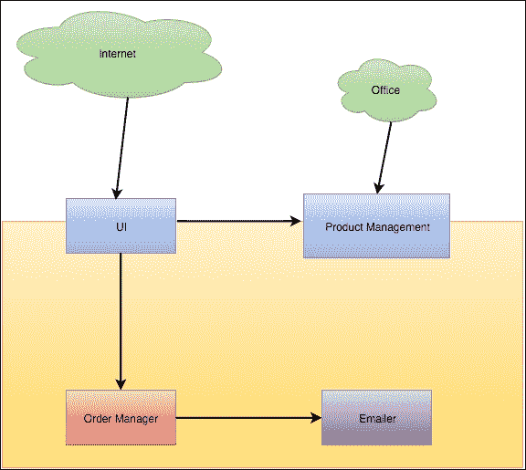

这张图显示了我们公司（黄色方块）如何将一些微服务隐藏在真实世界中，并向不同网络公开其他一些微服务，如下所示：

+   **UI**将向互联网公开。每个人都可以访问这个端点。

+   **产品管理**将管理我们电子商务中的产品。它将有以下两个接口：

+   一个 Seneca 端点，UI 将从中提取数据

+   一个 JSON API，我们公司的办公室将能够创建、更新和删除产品

+   **Emailer**将是我们与客户沟通的渠道。我们将使用这个微服务来解释 Seneca 的优点，并且我们还将举例说明当微服务失败时的最终一致性和系统退化。

+   **订单管理器**：这个微服务将让我们处理客户的订单。通过这个微服务，我们将讨论如何处理数据仅局限于每个微服务，而不是全局于系统的事实。您不能只是去数据库恢复产品名称或价格，它需要从其他微服务中恢复。

### 提示

如您所见，没有用户或员工管理，但通过这四个微服务，我们将能够开发微服务架构的核心概念。Seneca 配备了一个非常强大的数据和传输插件系统，使得使用不同的数据存储和传输系统与 Seneca 很容易。

对于我们所有的微服务，我们将使用 MongoDB 作为存储。Seneca 带有一个开箱即用的内存数据库插件，允许您立即开始编码，但存储是瞬态的：它不会在调用之间保留数据。

# 产品经理 - 双面核心

产品经理是我们系统的核心。我知道你在想什么：微服务应该是小的（微小）和分布式的（没有中心点），但你需要在某个地方设定概念中心，否则你最终会得到一个碎片化的系统和可追溯性问题（我们以后会谈论这个）。

使用 Seneca 构建双重 API 相当容易，因为它与 Express 有一个非常直接的集成。Express 将用于公开 UI 的一些功能，如编辑产品，添加产品，删除产品等。这是一个非常方便的框架，易于学习，并且与 Seneca 集成良好。它也是 Node.js Web 应用程序的事实标准，因此很容易找到关于可能问题的信息。

它还将通过 Seneca TCP（Seneca 的默认插件）暴露一个私有部分，以便我们的内部微服务网络（特别是 UI）能够访问我们目录中的产品列表。

产品经理将会小而紧密（它只会管理产品），以及可扩展，但它将拥有处理我们电子商务中产品所需的所有知识。

我们需要做的第一件事是定义我们的产品经理微服务，如下所示：

+   这将有一个函数来检索数据库中的所有产品。在生产系统中这可能是一个坏主意（因为它可能需要分页），但对于我们的例子来说是有效的。

+   这应该有一个函数来获取给定类别的所有产品。它类似于之前的函数，在一个生产就绪的系统中，它需要分页。

+   这应该有一个按标识符（`id`）检索产品的函数。

+   这应该有一个函数，允许我们将产品添加到数据库（在这种情况下是 MongoDB）。这个函数将使用 Seneca 数据抽象来解耦我们的微服务与存储：我们将能够（理论上）在不太麻烦的情况下切换 Mongo 到不同的数据库（再次理论上）。

+   这应该有一个函数来删除产品。同样，使用 Seneca 数据抽象。

+   这应该有一个函数来编辑产品。

我们的产品将是一个具有四个字段的数据结构：**名称**，**类别**，**描述**和**价格**。正如你所看到的，它有点简单，但它将帮助我们理解微服务的复杂世界。

我们的产品管理微服务将使用 MongoDB（[`www.mongodb.org/`](https://www.mongodb.org/)）。Mongo 是一个面向文档的无模式数据库，允许以极大的灵活性存储数据，如产品（最终，这些都是文档）。它也是 Node.js 的一个很好的选择，因为它存储 JSON 对象，这是 JavaScript 的标准，为 JavaScript 创建（**JSON**代表**JavaScript 对象表示**），因此看起来是完美的配对。

如果你想了解更多关于它的有用信息，可以在 MongoDB 网站上找到。

让我们开始编写我们的函数。

## 获取产品

要获取产品，我们去数据库并将完整的产品列表直接转储到接口。在这种情况下，我们不会创建任何分页机制，但通常，分页数据是避免数据库（或应用程序，但主要是数据库）性能问题的良好实践。

让我们看看以下代码：

```js
/**
 * Fetch the list of all the products.
 */
seneca.add({area: "product", action: "fetch"}, function(args, done) {
  var products = this.make("products");
  products.list$({}, done);
});
```

我们已经在 Seneca 中有一个模式，返回我们数据库中的所有数据。

`products.list$()`函数将接收以下两个参数：

+   查询条件

+   一个接收错误和结果对象的函数（记住错误优先的回调方法）

Seneca 使用`$`符号来标识关键函数，如`list$`、`save$`等。关于对象的属性命名，只要你使用字母数字标识符，你的命名就不会发生冲突。

我们将`seneca.add()`方法中的`done`函数传递给`list$`方法。这是因为 Seneca 遵循错误优先的回调方式。换句话说，我们正在为以下代码创建一个快捷方式：

```js
seneca.add({area: "product", action: "fetch"}, function(args, done) {
  var products = this.make("products");
  products.list$({}, function(err, result) {
    done(err, result);
  });
});
```

## 按类别获取

按类别获取与获取产品的完整列表非常相似。唯一的区别是现在 Seneca 操作将接受一个参数来按类别过滤产品。

让我们看看代码：

```js
/**
 * Fetch the list of products by category.
 */
seneca.add({area: "product", action: "fetch", criteria: "byCategory"}, function(args, done) {
  var products = this.make("products");
  products.list$({category: args.category}, done);
});
```

大多数高级开发人员现在脑海中的第一个问题是*这不是一个完美的注入攻击场景吗？*好吧，Seneca 足够聪明，可以防止它，所以我们不需要担心它，只需避免将字符串与用户输入连接起来。

正如你所看到的，唯一的显著差异是传递的名为`category`的参数，它被委托到 Seneca 数据抽象层，该层将根据我们使用的存储生成适当的查询。在谈论微服务时，这是非常强大的。如果你还记得，在前面的章节中，我们总是谈论耦合好像它是一切罪恶的根源，现在我们可以确定它是，而 Seneca 以非常优雅的方式处理它。在这种情况下，框架提供了不同存储插件必须满足的合同。在前面的示例中，`list$`是这个合同的一部分。如果你明智地使用 Seneca 存储，将你的微服务切换到新的数据库引擎（你有没有曾经想过将你的一部分数据转移到 MongoDB？）只是一个配置问题。

## 通过 ID 获取

通过 ID 获取产品是最必要的方法之一，也是一个棘手的方法。从编码的角度来看并不棘手，如下所示：

```js
/**
 * Fetch a product by id.
 */
seneca.add({area: "product", action: "fetch", criteria: "byId"}, function(args, done) {
  var product = this.make("products");
  product.load$(args.id, done);
});
```

棘手的部分是`id`是如何生成的。生成`id`是与数据库联系的一个接触点。Mongo 创建一个哈希来表示合成 ID；而 MySQL 通常创建一个整数，自动增加以唯一标识每条记录。鉴于此，如果我们想要在我们的应用程序中将 MongoDB 切换到 MySQL，我们需要解决的第一个问题是如何将类似以下内容的哈希映射为序数：

`e777d434a849760a1303b7f9f989e33a`

在 99%的情况下，这是可以的，但我们需要小心，特别是在存储 ID 时，如果你还记得前面的章节，数据应该是每个微服务本地的，这可能意味着更改一个实体的 ID 数据类型，需要在所有其他数据库中更改引用的 ID。

## 添加产品

添加产品是微不足道的。我们只需要创建数据并将其保存在数据库中：

```js
/**
 * Adds a product.
 */
seneca.add({area: "product", action: "add"}, function(args, done) {
  var products = this.make("products");
  products.category = args.category;
  products.name = args.name;
  products.description = args.description;
  products.category = args.category;
  products.price = args.price
  products.save$(function(err, product) {
    done(err, products.data$(false));
  });
});
```

在这个方法中，我们使用了 Seneca 的一个辅助函数`products.data$(false)`。这个辅助函数允许我们检索实体的数据，而不包括当数据返回给调用方法时我们不感兴趣的有关命名空间（区域）、实体名称和基本名称的所有元数据。

## 删除产品

通常通过`id`来删除产品：我们通过主键定位要删除的特定数据，然后将其删除，如下所示：

```js
/**
 * Removes a product by id.
 */
seneca.add({area: "product", action: "remove"}, function(args, done) {
  var product = this.make("products");
  product.remove$(args.id, function(err) {
  done(err, null);
  });
});
```

在这种情况下，除了在出现问题时返回错误之外，我们不返回任何东西，因此调用此操作的端点可以假定非错误响应是成功的。

## 编辑产品

我们需要提供一个操作来编辑产品。做到这一点的代码如下：

```js
/**
 * Edits a product fetching it by id first.
 */
seneca.edit({area: "product", action: "edit"}, function(args, done) {
  seneca.act({area: "product", action: "fetch", criteria: "byId", id: args.id}, function(err, result) {
  result.data$(
  {
    name: args.name, 
    category: args.category, 
    description: args.description,
    price: args.price 
  }
  );
  result.save$(function(err, product){
    done(product.data$(false));
    });
  });
});
```

这是一个有趣的场景。在编辑产品之前，我们需要通过 ID 获取它，我们已经做到了。所以，我们在这里所做的是依赖已经存在的操作来通过 ID 检索产品，复制数据，并保存它。

这是 Seneca 引入的代码重用的一种好方法，你可以将一个动作的调用委托给另一个动作，并在包装动作中处理结果。

## 将一切连接起来

正如我们之前商定的，产品经理将有两个面孔：一个将通过 Seneca 传输 TCP 暴露给其他微服务，另一个将通过 Express（一个用于创建 Web 应用程序的 Node.js 库）以 REST 方式暴露。

让我们把一切都连接起来：

```js
var plugin = function(options) {
  var seneca = this;

  /**
   * Fetch the list of all the products.
   */
  seneca.add({area: "product", action: "fetch"}, function(args, done) {
    var products = this.make("products");
    products.list$({}, done);
  });

  /**
   * Fetch the list of products by category.
   */
  seneca.add({area: "product", action: "fetch", criteria: "byCategory"}, function(args, done) {
    var products = this.make("products");
    products.list$({category: args.category}, done);
  });

  /**
   * Fetch a product by id.
   */
  seneca.add({area: "product", action: "fetch", criteria: "byId"}, function(args, done) {
    var product = this.make("products");
    product.load$(args.id, done);
  });

  /**
   * Adds a product.
   */
  seneca.add({area: "product", action: "add"}, function(args, done) {
    var products = this.make("products");
    products.category = args.category;
    products.name = args.name;
    products.description = args.description;
    products.category = args.category;
    products.price = args.price
    products.save$(function(err, product) {
      done(err, products.data$(false));
    });
  });

  /**
   * Removes a product by id.
   */
  seneca.add({area: "product", action: "remove"}, function(args, done) {
    var product = this.make("products");
    product.remove$(args.id, function(err) {
      done(err, null);
    });
  });

  /**
   * Edits a product fetching it by id first.
   */
  seneca.add({area: "product", action: "edit"}, function(args, done) {
    seneca.act({area: "product", action: "fetch", criteria: "byId", id: args.id}, function(err, result) {
      result.data$(
        {
          name: args.name, 
          category: args.category, 
          description: args.description,
          price: args.price            
        }
      );
      result.save$(function(err, product){
        done(err, product.data$(false));
      });
    });
  });
}
module.exports = plugin;

var seneca = require("seneca")();
seneca.use(plugin);
seneca.use("mongo-store", {
  name: "seneca",
  host: "127.0.0.1",
  port: "27017"
});

seneca.ready(function(err){

  seneca.act('role:web',{use:{
    prefix: '/products',
    pin: {area:'product',action:'*'},
    map:{
    fetch: {GET:true},
    edit: {GET:false,POST:true},
    delete: {GET: false, DELETE: true}
    }
  }});
  var express = require('express');
  var app = express();
  app.use(require("body-parser").json());

  // This is how you integrate Seneca with Express
  app.use( seneca.export('web') );

  app.listen(3000);

});
```

现在让我们解释一下代码：

我们创建了一个 Seneca 插件。这个插件可以在不同的微服务之间重复使用。这个插件包含了我们之前描述的微服务所需的所有方法的定义。

前面的代码描述了以下两个部分：

+   前几行连接到 Mongo。在这种情况下，我们指定 Mongo 是一个本地数据库。我们通过一个名为 mongo-store 的插件来实现这一点- [`github.com/rjrodger/seneca-mongo-store`](https://github.com/rjrodger/seneca-mongo-store)，由 Seneca 的作者 Richard Rodger 编写。

+   第二部分对我们来说是新的。如果你以前使用过 JQuery，这可能听起来很熟悉，但基本上`seneca.ready()`回调所做的是处理 Seneca 在调用开始流入其 API 之前可能尚未连接到 Mongo 的事实。`seneca.ready()`回调是整合 Express 与 Seneca 的代码所在的地方。

以下是我们应用程序的`package.json`配置：

```js
{
  "name": "Product Manager",
  "version": "1.0.0",
  "description": "Product Management sub-system",
  "main": "index.js",
  "keywords": [
    "microservices",
    "products"
  ],
  "author": "David Gonzalez",
  "license": "ISC",
  "dependencies": {
  "body-parser": "¹.14.1",
  "debug": "².2.0",
  "express": "⁴.13.3",
  "seneca": "⁰.8.0",
  "seneca-mongo-store": "⁰.2.0",
  "type-is": "¹.6.10"
  }
}
```

在这里，我们控制了微服务运行所需的所有库，以及配置。

## 与 Express 集成-如何创建 REST API

与 Express 集成非常简单。让我们看一下代码：

```js
  seneca.act('role:web',{use:{
    prefix: '/products',
    pin: {area:'product',action:'*'},
    map:{
    fetch: {GET:true},      
    edit: {PUT:true},
    delete: {GET: false, DELETE: true}
    }
  }});
  var express = require('express');
  var app = express();
  app.use(require("body-parser").json());

  // This is how you integrate Seneca with Express
  app.use( seneca.export('web') );

  app.listen(3000);
```

正如我们在前一节中看到的代码片段提供了以下三个 REST 端点：

`/products/fetch`

`/products/edit`

`/products/delete`

让我们解释一下。

首先，我们告诉 Seneca 执行`role:web`操作，指示配置。此配置指定为所有 URL 使用`/products`前缀，并将动作与匹配的`{area: "product", action: "*"}`模式固定。这对我们来说也是新的，但这是一种很好的方式，可以告诉 Seneca 无论它在 URL 中执行什么操作，它都将具有处理程序的隐式`area: "product"`。这意味着`/products/fetch`端点将对应于`{area: 'products', action: 'fetch'}`模式。这可能有点困难，但一旦你习惯了，它实际上非常强大。它不会强迫`use`通过约定将我们的动作与我们的 URL 完全耦合。

在配置中，属性映射指定了可以在端点上执行的 HTTP 操作：fetch 将允许`GET`，edit 将允许`PUT`，delete 将只允许`DELETE`。这样，我们可以控制应用程序的语义。

其他一切对你来说可能都很熟悉。创建一个 Express 应用程序，并指定使用以下两个插件：

+   JSON body 解析器

+   Seneca web 插件

就是这样。现在，如果我们向 Seneca 的动作列表中添加一个新的动作，以便通过 API 公开它，唯一需要做的就是修改映射属性以允许 HTTP 方法。

虽然我们构建了一个非常简单的微服务，但它捕获了创建**CRUD**（**创建读取更新删除**）应用程序时发现的常见模式的很大一部分。我们还从 Seneca 应用程序中轻松地创建了一个小型 REST API。现在我们只需要配置基础设施（MongoDB），我们就可以部署我们的微服务了。

# 电子邮件发送器-一个常见的问题

发送电子邮件是每家公司都需要做的事情。我们需要与客户沟通，以便发送通知、账单或注册电子邮件。

在我之前工作过的公司里，发送电子邮件总是出现问题，比如电子邮件无法投递，或者投递两次，内容错误地发送给错误的客户，等等。看起来像是发送电子邮件这样简单的事情竟然如此复杂。

一般来说，电子邮件通信是编写微服务的第一个候选者。想想看：

+   电子邮件只做一件事

+   电子邮件做得很好

+   电子邮件保留自己的数据

这也是*康威定律*如何在我们的系统中不被注意地发挥作用的一个很好的例子。我们设计我们的系统，模拟公司内部的现有通信，因为我们受到了它的限制。

## 如何发送电子邮件

回到基础。我们如何发送电子邮件？我不是在谈论我们用于发送电子邮件的网络协议或者最低可接受的标头是什么？

我在谈论从业务角度发送电子邮件所需的内容：

+   一个标题

+   内容

+   目的地地址

这就是全部。我们本可以深入讨论确认、安全电子邮件、密件抄送等等。然而，我们遵循精益方法论：从最小可行产品开始，然后逐步构建，直到达到期望的结果。

我记不得有哪个项目中，电子邮件发送不是一个有争议的部分。选择用于发送电子邮件的产品最终会与系统紧密耦合，很难无缝替换。然而，微服务来拯救我们。

## 定义接口

正如我之前提到的，尽管听起来很容易，发送企业电子邮件可能最终会变得一团糟。因此，我们需要澄清的第一件事是我们的最低要求：

+   我们如何渲染电子邮件？

+   渲染电子邮件是否属于电子邮件操作的绑定上下文？

+   我们是否创建另一个微服务来渲染电子邮件？

+   我们是否使用第三方来管理电子邮件？

+   我们是否存储已发送的电子邮件以进行审计？

对于这个微服务，我们将使用 Mandrill。Mandrill 是一家允许我们发送企业电子邮件、跟踪已发送电子邮件并创建可在线编辑的电子邮件模板的公司。

我们的微服务将如下所示： 

```js
var plugin = function(options) {
  var seneca = this;
  /**
   * Sends an email using a template email.
   */
  seneca.add({area: "email", action: "send", template: "*"}, function(args, done) {
// TODO: More code to come.
  });

  /**
   * Sends an email including the content.
   */
  seneca.add({area: "email", action: "send"}, function(args, done) {
// TODO: More code to come.
  });
};
```

我们有两种模式：一种使用模板，另一种发送请求中包含的内容。

正如你所看到的，我们在这里定义的一切都是与电子邮件相关的信息。Mandrill 的术语没有渗入到其他微服务在我们发送电子邮件时看到的内容中。我们唯一做出的妥协是模板化。我们将模板渲染委托给了电子邮件发送者，但这并不是什么大问题，因为即使我们离开 Mandrill，我们也需要以某种方式渲染内容。

我们稍后会回到代码。

## 设置 Mandrill

Mandrill 使用起来相当简单，不应该是一个设置问题。然而，我们将使用测试模式，以确保电子邮件不会被投递，并且我们可以访问 API 满足我们的所有需求。

我们需要做的第一件事是在 Mandrill 上创建一个账户。只需使用您的电子邮件在[`mandrillapp.com`](https://mandrillapp.com)注册，然后您应该能够访问它，如下面的截图所示：

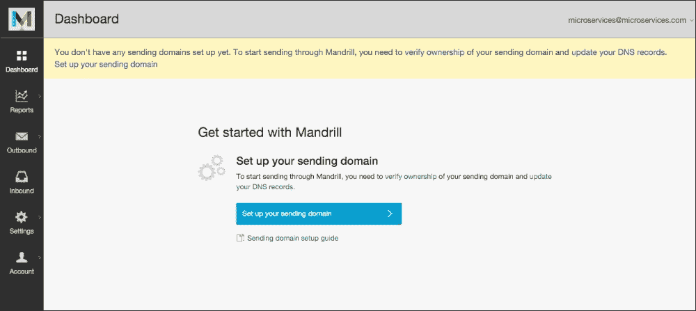

现在我们已经创建了一个账户，我们需要进入测试模式。为了做到这一点，只需点击右上角的电子邮件，然后从菜单中选择**打开测试模式**选项。左侧的 Mandrill 菜单现在会变成橙色。

接下来，我们需要创建一个 API 密钥。这个密钥是 Mandrill API 要使用的登录信息。只需点击**设置**和**SMTP & API 信息**，然后添加一个新密钥（不要忘记勾选将密钥标记为测试密钥的复选框）。现在它应该看起来像下面的截图：

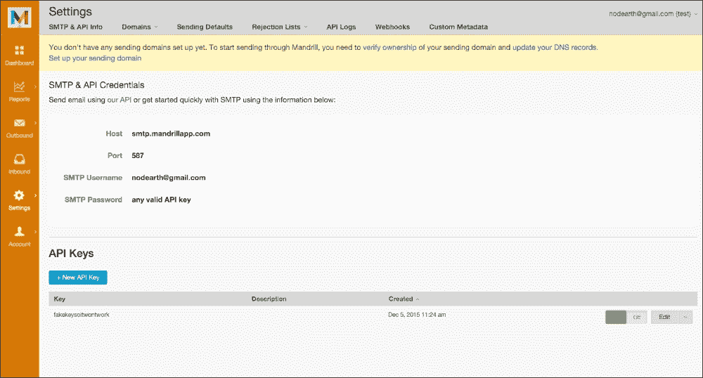

关键是现在你所需要的一切。让我们测试 API：

```js
var mandrill = require("mandrill-api/mandrill");
var mandrillClient = new mandrill.Mandrill("<YOUR-KEY-HERE>");

mandrillClient.users.info({}, function(result){
  console.log(result);
}, function(e){
  console.log(e);
});
```

通过这几行，我们已经成功测试了 Mandrill 是否正常运行，并且我们有一个有效的密钥。此程序的输出应该与以下 JSON 非常相似：

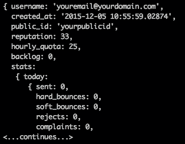

## 实践操作-将 Mandrill 集成到您的微服务中

现在一切准备就绪。我们有一个有效的密钥和我们的接口。唯一剩下的就是创建代码。我们将使用 Mandrill API 的一小部分，但如果您想使用其他功能，可以在这里找到更好的描述：[`mandrillapp.com/api/docs/`](https://mandrillapp.com/api/docs/)

让我们看一下以下代码：

```js
/**
   * Sends an email including the content.
   */
  seneca.add({area: "email", action: "send"}, function(args, done) {
    console.log(args);
    var message = {
      "html": args.content,
      "subject": args.subject,
      "to": [{
        "email": args.to,
        "name": args.toName,
        "type": "to"
      }],
      "from_email": "info@micromerce.com",
      "from_name": "Micromerce"
    }
    mandrillClient.messages.send({"message": message}, function(result) {
      done(null, {status: result.status});
    }, function(e) {
      done({code: e.name}, null);
    });
  });
```

这种第一种方法发送消息而不使用模板。我们只需从我们的应用程序获取 HTML 内容（和其他一些参数），然后通过 Mandrill 传递它。

正如您所看到的，我们只与外部世界有两个接触点：传递的参数和我们操作的返回。它们两者都有一个清晰的合同，与 Mandrill 无关，但数据呢？

在错误时，我们返回`e.name`，假设它是一个代码。在某个时候，某人最终会根据这个**错误代码**分支流程。在这里，我们有一种称为数据耦合的东西；我们的软件组件不依赖于合同，但它们确实依赖于发送的内容。

现在，问题是：我们该如何修复它？*我们不能*。至少不是一种简单的方式。我们需要假设我们的微服务不完美，它有一个缺陷。如果我们切换电子邮件提供商，我们将需要重新审视调用代码，以检查潜在的耦合。

在软件世界中，在我以前参与的每个项目中，总是有一个大力推动的努力，试图使代码尽可能通用，试图猜测未来，通常情况下可能像假设您的微服务不会完美一样糟糕。总是吸引我的注意的是：我们在追求完美上投入了大量的努力，但我们几乎忽略了我们将会失败，而且我们对此无能为力。软件经常失败，我们需要为此做好准备。

稍后，我们将看到一种将人类因素纳入微服务的模式：**断路器**。

如果 Mandrill 因*未签名*原因拒绝电子邮件，请不要感到惊讶。这是因为他们无法验证我们发送电子邮件的域（在这种情况下，一个不存在的虚拟域）。如果我们希望 Mandrill 实际处理电子邮件（即使我们处于测试模式），我们只需要通过添加一些配置来验证我们的域。

### 注意

更多信息可以在 Mandrill 文档中找到：

[`mandrillapp.com/api/docs/`](https://mandrillapp.com/api/docs/)

发送电子邮件的第二种方法是从模板发送电子邮件。在这种情况下，Mandrill 提供了灵活的 API：

+   它为每个收件人提供变量，以防我们将电子邮件发送给客户列表

+   它具有全局变量

+   它允许内容替换（我们可以替换整个部分）

为了方便起见，我们将只使用全局变量，因为在这本书中我们的空间有限。

让我们看一下以下代码：

```js
  /**
   * Sends an email using a template email.
   */
  seneca.add({area: "email", action: "send", template: "*"}, function(args, done) {
    console.log("sending");
    var message = {
      "subject": args.subject,
      "to": [{
        "email": args.to,
        "name": args.toName,
        "type": "to"
      }],
      "from_email": "info@micromerce.com",
      "from_name": "Micromerce",
      "global_merge_vars": args.vars,
    }
    mandrillClient.messages.sendTemplate(
      {"template_name": args.template, "template_content": {}, "message": message}, 
    function(result) {
      done(null, {status: result.status});
    }, function(e) {
      done({code: e.name}, null);
    });
  });
```

现在我们可以在 Mandrill 中创建我们的模板（并让其他人来管理它们），并且我们可以使用它们来发送电子邮件。再次强调，我们正在专门化。我们的系统专门用于发送电子邮件，您可以将电子邮件的创建留给其他人（也许是来自了解如何与客户交流的营销团队的人）。

让我们分析这个微服务：

+   **数据存储在本地**：实际上并非如此（它存储在 Mandrill 中），但从设计的角度来看，是这样的

+   **我们的微服务具有良好的内聚性**：它只发送电子邮件；它只做一件事，并且做得很好

+   **微服务的大小是正确的**：可以在几分钟内理解，没有不必要的抽象，可以相当容易地重写

当我们之前谈到 SOLID 设计原则时，我们总是跳过了 L，它代表**Liskov 替换**。基本上，这意味着软件必须在语义上是正确的。例如，如果我们编写一个处理一个抽象类的面向对象程序，那么程序必须能够处理所有子类。

回到 Node.js，如果我们的服务能够处理发送普通电子邮件，那么在不修改现有功能的情况下扩展和添加功能应该很容易。

从日常生产运营的角度来考虑一下；如果系统添加了新功能，你最不想做的就是重新测试现有功能，甚至更糟糕的是将新功能交付到生产环境中，引入了没有人意识到的错误。

让我们创建一个用例。我们想将同一封电子邮件发送给两个收件人。虽然 Mandrill API 允许调用代码这样做，但我们没有考虑到潜在的抄送。

因此，我们将在 Seneca 中添加一个新的操作，允许我们这样做，如下所示：

```js
  /**
   * Sends an email including the content.
   */
  seneca.add({area: "email", action: "send", cc: "*"}, function(args, done) {
    var message = {
      "html": args.content,
      "subject": args.subject,
      "to": [{
        "email": args.to,
        "name": args.toName,
        "type": "to"
      },{
        "email": args.cc,
        "name": args.ccName,
        "type": "cc"
      }],
      "from_email": "info@micromerce.com",
      "from_name": "Micromerce"
    }
    mandrillClient.messages.send({"message": message}, function(result) {
      done(null, {status: result.status});
    }, function(e) {
      done({code: e.name}, null);
    });
  });
```

我们已经指示 Seneca 接受包含`cc`在参数列表中的调用，并使用 Mandrill CC 发送它们到发送 API。如果我们想使用它，调用代码的以下签名将会改变：

```js
seneca.act({area: "email", action: "send", subject: "The Subject", to: "test@test.com", toName: "Test Testingtong"}, function(err, result){
// More code here
});
```

签名将更改为以下代码：

```js
seneca.act({area: "email", action: "send", subject: "The Subject", to: "test@test.com", toName: "Test Testingtong", cc: "test2@test.com", ccName: "Test 2"}, function(err, result){
// More code here
});
```

如果你记得的话，模式匹配会尝试匹配最具体的输入，所以如果一个操作与另一个操作相比具有更多的参数匹配，调用将被定向到它。

这就是 Seneca 的亮点所在：我们可以称之为**操作的多态性**，因为我们可以定义相同操作的不同版本，使用不同的参数，最终做一些略有不同的事情，并且使我们能够重用代码，如果我们 100%确定这样做是正确的（记住，微服务强制执行无共享的方法：重复代码可能不像耦合两个操作那样糟糕）。

这是电子邮件微服务的`package.json`：

```js
{
  "name": "emailing",
  "version": "1.0.0",
  "description": "Emailing sub-system",
  "main": "index.js",
  "keywords": [
  "microservices",
  "emailing"
  ],
  "author": "David Gonzalez",
  "license": "ISC",
  "dependencies": {
  "mandrill-api": "¹.0.45",
  "seneca": "⁰.8.0"
  }
}
```

## 备用策略

当设计一个系统时，通常我们会考虑现有组件的可替换性；例如，在 Java 中使用持久化技术时，我们倾向于倾向于标准（**JPA**），这样我们就可以在不太费力的情况下替换底层实现。

微服务采用相同的方法，但是它们隔离了问题，而不是朝着易于替换的方向努力。如果你读过前面的代码，在 Seneca 操作中，我们没有隐藏我们正在使用 Mandrill 发送电子邮件的事实。

正如我之前提到的，发送电子邮件是一件看似简单，但总是会出现问题的事情。

想象一下，我们想要用普通的 SMTP 服务器（如 Gmail）替换 Mandrill。我们不需要做任何特殊的事情，我们只需更改实现并发布我们微服务的新版本。

这个过程就像应用以下代码一样简单：

```js
var nodemailer = require('nodemailer');
var seneca = require("seneca")();
var transporter = nodemailer.createTransport({
  service: 'Gmail',
  auth: {
    user: 'info@micromerce.com',
    pass: 'verysecurepassword'
  }
});

/**
 * Sends an email including the content.
 */
seneca.add({area: "email", action: "send"}, function(args, done) {
  var mailOptions = {
    from: 'Micromerce Info <info@micromerce.com>',
    to: args.to, 
    subject: args.subject,
    html: args.body
  };
  transporter.sendMail(mailOptions, function(error, info){
    if(error){
      done({code: e}, null);
    }
    done(null, {status: "sent"});
  });
});
```

对外界来说，我们最简单的电子邮件发送器现在使用 Gmail 通过 SMTP 来发送我们的电子邮件。

正如我们将在本书后面看到的那样，在微服务网络中交付同一接口的新版本是相当容易的；只要我们尊重接口，实现就应该是无关紧要的。

我们甚至可以发布一个具有这个新版本的服务器，并将一些流量发送到它，以验证我们的实现，而不影响所有客户（换句话说，包含故障）。

我们已经看到了如何在本节中编写电子邮件发送器。我们已经通过了一些示例，说明了我们的微服务如何可以快速适应新的需求，只要业务需要新的功能，或者我们决定我们的供应商无法满足我们的技术需求。

# 订单管理器

订单管理器是一个处理顾客通过 UI 下订单的微服务。你可能还记得，我们不会创建一个复杂的单页应用程序，使用现代的视觉框架，因为这超出了本书的范围，但我们会提供 JSON 接口，以便能够稍后构建前端。

订单管理器引入了一个有趣的问题：这个微服务需要访问有关产品的信息，比如名称、价格、可用性等。然而，这些信息存储在产品管理器微服务中，那么我们该怎么做呢？

嗯，这个问题的答案看起来很简单，但需要一点思考。

## 定义微服务-如何收集非本地数据

我们的微服务需要做以下三件事：

+   恢复订单

+   创建订单

+   删除现有订单

在恢复订单时，选项会很简单。通过主键恢复订单。我们可以将其扩展为通过不同的标准恢复订单，比如价格、日期等，但我们会保持简单，因为我们想专注于微服务。

在删除现有订单时，选项也很明确：使用 ID 删除订单。同样，我们可以选择更高级的删除标准，但我们想保持简单。

当我们试图创建订单时问题就出现了。在我们小的微服务架构中创建订单意味着向顾客发送一封电子邮件，说明我们正在处理他们的订单，以及订单的详细信息，如下所示：

+   产品数量

+   每种产品的价格

+   总价

+   订单 ID（以防顾客需要解决订单问题）

我们如何恢复产品详情？

如果你看到我们在本章的“微服务-大局”部分中展示的图表，订单管理器只会从 UI 调用，UI 将负责恢复产品名称、价格等信息。在这里我们可以采取以下两种策略：

+   订单管理器调用产品管理器并获取详情

+   UI 调用产品管理器并将数据委托给订单管理器

两个选项都是完全有效的，但在这种情况下，我们选择第二个：UI 将收集生成订单所需的信息，只有在所有所需的数据可用时才会调用订单管理器。

现在来回答这个问题：为什么？

一个简单的原因：故障容忍。让我们来看看两个选项的以下序列图：

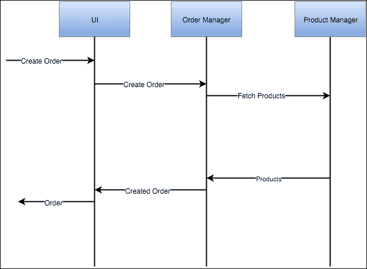

第二个选项的图表如下所示：

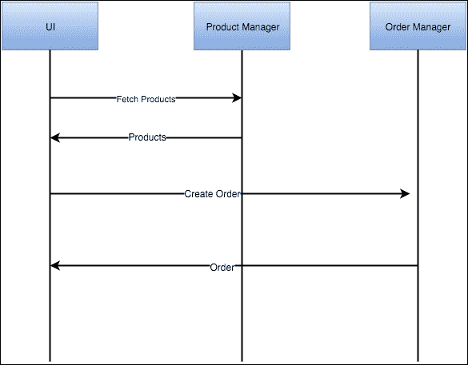

在第一个视图中，有一个很大的区别：调用的深度；而在第一个例子中，我们有两层深度（UI 调用订单管理器，订单管理器调用产品管理器）。在第二个例子中，我们只有一层深度。在我们的架构中有一些即时的影响，如下所示：

+   当出现问题时，如果我们只有一层深度，我们就不需要在太多地方检查。

+   我们更具弹性。如果出现问题，是微服务的 UI 注意到了它，返回适当的 HTTP 代码，这样就不需要将发生在客户端微服务几层以上的错误进行转换。

+   部署和测试更容易。并不是非常容易，但我们不需要到处搞，我们可以立即看到产品管理器是否从 UI 中被调用，而不需要通过订单管理器。

我们使用这种架构而不是两层深度的架构，并不意味着它不适用于其他情况：网络拓扑是你需要提前规划的东西，如果你正在创建一个面向微服务的架构，因为这是最难改变的方面之一。

在某些情况下，如果我们想要非常灵活，我们可以使用发布者/订阅者技术的消息队列，其中我们的微服务可以订阅不同类型的消息并发出其他消息供不同的服务消费，但这可能会使我们需要构建的基础设施变得复杂，以避免单点故障。

## 订单管理器 - 代码

让我们来看看订单管理器的代码：

```js
var plugin = function(options) {
  var seneca = this;

  seneca.add({area: "orders", action: "fetch"}, function(args, done) {
    var orders = this.make("orders");
    orders.list$({id: args.id}, done);
  });

  seneca.add({area: "orders", action: "delete"}, function(args, done) {
    var orders = this.make("orders");
    orders.remove$({id: args.id}, function(err) {
        done(err, null);
    });
  });
}
module.exports = plugin;
```

如您所见，代码并不复杂。唯一有趣的地方是创建操作中缺失的代码。

### 调用远程服务

到目前为止，我们假设所有的微服务都在同一台机器上运行，但这远非理想。在现实世界中，微服务是分布式的，我们需要使用某种传输协议来将消息从一个服务传递到另一个服务。

Seneca 以及 Seneca 背后的 nearForm 公司已经为我们解决了这个问题，以及围绕它的开源社区。

作为一个模块化系统，Seneca 内置了插件的概念。默认情况下，Seneca 带有一个捆绑的插件来使用 TCP 作为协议，但创建一个新的传输插件并不难。

### 注意

在写这本书的时候，我自己创建了一个：[`github.com/dgonzalez/seneca-nservicebus-transport/`](https://github.com/dgonzalez/seneca-nservicebus-transport/)

使用这个插件，我们可以通过 NServiceBus（一个基于.NET 的企业总线）路由 Seneca 消息，改变我们的客户端和服务器的配置。

让我们看看如何配置 Seneca 指向不同的机器：

```js
var senecaEmailer = require("seneca")().client({host: "192.168.0.2", port: 8080});
```

默认情况下，Seneca 将使用默认的传输插件，正如我们在第二章中所看到的，*Node.js 中的微服务-Seneca 和 PM2 替代方案*，是`tcp`，我们已经指定它指向`192.168.0.2`主机的`8080`端口。

就这么简单，从现在开始，当我们在`senecaEmailer`上执行一个动作命令时，传输将把消息发送到邮件发送器并接收响应。

让我们看看剩下的代码：

```js
  seneca.add({area: "orders", action: "create"}, function(args, done) {
    var products = args.products;
    var total = 0.0;
    products.forEach(function(product){
      total += product.price;
    });
    var orders = this.make("orders");
    orders.total = total;
    orders.customer_email = args.email;
    orders.customer_name = args.name;
    orders.save$(function(err, order) {
      var pattern = {
        area: "email", 
        action: "send", 
        template: "new_order", 
        to: args.email,
        toName: args.name,
        vars: {
          // ... vars for rendering the template including the products ...
        }
      }
      senecaEmailer.act(pattern, done);
    });
  });
```

如您所见，我们收到了一个包含所有所需数据的产品列表，并将它们传递给邮件发送器以渲染邮件。

如果我们更改邮件发送器所在的主机，这里唯一需要做的更改就是`senecaEmailer`变量的配置。

即使我们改变了通道的性质（例如，我们甚至可以编写一个插件将数据发送到 Twitter），插件也应该处理它的特殊性并对应用程序透明。

### 韧性胜过完美

在前一节的示例中，我们构建了一个微服务，调用另一个微服务来解决它接收到的调用。然而，需要记住以下几点：

+   如果邮件发送器宕机会发生什么？

+   如果配置错误，邮件发送器在正确的端口上无法工作会发生什么？

我们可以为几页纸写下“如果”。

人类是不完美的，他们建造的东西也是如此，软件也不例外。人类也很难识别逻辑流程中的潜在问题，而软件往往是一个复杂的系统。

在其他语言中，处理异常几乎是很正常的事情，但在 JavaScript 中，异常是一件大事：

+   如果在 Java 的 Web 应用程序中出现异常，它会终止当前的调用堆栈，Tomcat（或您使用的容器）会向客户端返回错误。

+   如果在 Node.js 应用程序中出现异常，应用程序会被终止，因为我们只有一个线程执行应用程序。

如您所见，Node.js 中几乎每个回调都有一个作为错误的第一个参数。

在谈论微服务时，这种错误尤为重要。你希望具有弹性。电子邮件发送失败并不意味着订单无法处理，但可以稍后由某人重新处理数据手动发送电子邮件。这就是我们所说的最终一致性；我们在系统中考虑到了我们的系统在某个时刻会崩溃的事实。

在这种情况下，如果发送电子邮件出现问题，但我们可以将订单存储在数据库中，调用代码，也就是用户界面，应该有足够的信息来决定客户是收到致命消息还是警告：

“您的订单已准备好处理，但我们可能需要两天时间才能向您发送包含订单详情的电子邮件。感谢您的耐心。”

通常，即使我们无法完成一个请求，我们的应用程序仍将继续工作，这通常更多是业务而不是技术决策。这是一个重要的细节，因为在构建微服务时，“康威定律”正在推动我们，技术人员，来模拟现有的业务流程，部分成功与人类的本性完美契合。如果你无法完成一个任务，可以在 Evernote（或类似工具）中创建一个提醒，并在解决阻碍后再回来处理。

这比以下内容要好得多：

关于某件事情发生了，但我们不能告诉你更多（有时当我在一些网站上遇到一般性故障时，我的大脑会读到这样的信息）。

我们称这种处理错误的方式为系统退化：它可能不是 100%功能，但即使其少数功能不可用，它仍将工作，而不是一般性故障。

如果你想一秒钟，想一想在你的大型公司系统中，有多少次网络服务调用因为无法到达甚至可能并不重要的第三方服务而回滚了整个事务？

在这一部分，我们构建了一个微服务，它使用另一个微服务来解决客户的请求：订单管理器使用电子邮件发送器来完成请求。我们还谈到了弹性以及在我们的架构中提供最佳服务的重要性。

# 用户界面 - API 聚合

到目前为止，我们已经构建了独立的微服务。它们有一个特定的目的，并处理我们系统的一个特定部分：发送电子邮件，产品管理和订单处理，但现在我们正在构建一个唯一目的是促进微服务之间通信的微服务。

现在我们将构建一个与其他服务交互并面向客户的前端微服务。

当我在计划本章的内容时，这样一个服务并不在其中。然而，经过思考，如果没有展示围绕 API 聚合的一些概念，这一章就不会是一样的，而这些概念在前端微服务中是相当容易展示的。

## 需要前端微服务

考虑可扩展性。在处理 HTTP 流量时，有一个流量金字塔。前端的点击量比后端多。通常，为了到达后端，前端需要处理以下几个来自前端的请求：

+   阅读一个表格

+   验证它

+   管理 PRG 模式（[`en.wikipedia.org/wiki/Post/Redirect/Get`](https://en.wikipedia.org/wiki/Post/Redirect/Get)）

正如你所看到的，有很多逻辑需要由前端处理，所以如果软件很忙，很容易出现容量问题。如果我们正在使用微服务，并且正在正确使用它，扩展或缩小应该是一个可以通过点击（或命令）触发的自动过程。

## 代码

到目前为止，我们几乎总是在单个服务器上测试代码。这对于测试来说是可以的，但当我们构建微服务时，我们希望它们是分布式的。因此，为了实现这一点，我们需要告诉 Seneca 如何到达这些服务：

```js
var senecaEmailer = require("seneca")().client({
  host: "192.168.0.2", 
  port: 8080
});
var senecaProductManager = require("seneca")().client({
  host: "192.168.0.3", 
  port: 8080
});
var senecaOrderProcessor = require("seneca")().client({
  host: "192.168.0.4", 
  port: 8080
});
```

我们所做的是创建三个 Seneca 实例。它们就像服务器之间的通信管道。

让我们解释一下代码：

Seneca 默认使用传输插件 TCP。这意味着 Seneca 将监听服务器上的`/act` URL。例如，当我们创建`senecaEmailer`时，Seneca 将指向的 URL 是`http://192.168.0.2:8080/act`。

我们实际上可以用 curl 来验证它。如果我们执行以下命令行，将`<valid Seneca pattern>`替换为有效的 Seneca 命令，我们应该会在 JSON 格式的服务器响应中得到一个响应，这将是`done`函数的第二个参数的值。

```js
curl -d '<valid Seneca pattern>' -v http://192.168.0.2:8080/act

```

### 提示

Seneca 的默认传输插件是 TCP。如果我们没有指定其他插件，Seneca 将使用它来到达其他服务器并监听调用。

让我们看一个简单的例子：

```js
var seneca = require("seneca")();
seneca.add({cmd: "test"}, function(args, done) {
  done(null, {response: "Hello World!"});
});

seneca.listen({port: 3000});
```

如果我们运行这个程序，我们可以在终端中看到以下输出：

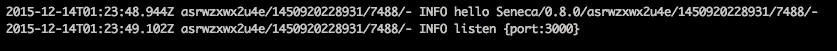

这意味着 Seneca 正在监听端口`3000`。让我们来测试一下：

```js
curl -d '{"cmd": "test"}' -v http://127.0.0.1:3000/act

```

这应该在终端中打印出与以下代码非常相似的内容：

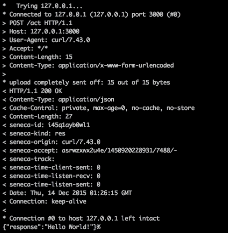

前面的代码是我们的终端和 Seneca 服务器之间的 TCP/IP 对话，最后一行是响应的结果。

因此，通过在 Seneca 上拥有三个不同的实例，我们配置了我们的微服务网络；Seneca 将为我们在网络中传输消息。

以下流程图描述了单个 API 如何在后端隐藏多个 Seneca 服务器，这些服务器具有不同的微服务（基本上是不同的 Seneca 实例）：

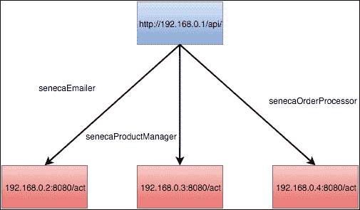

现在，让我们来看一下微服务的骨架：

```js
var express = require("express");
var bodyParser = require('body-parser');
var senecaEmailer = require("seneca")().client({
  host: "192.168.0.2", 
  port: 8080
});
var senecaProductManager = require("seneca")().client({
  host: "192.168.0.3", 
  port: 8080
});
var senecaOrderProcessor = require("seneca")().client({
  host: "192.168.0.4", 
  port: 8080
});

function api(options) {
  var seneca = this;

  /**
   * Gets the full list of products
   */
  seneca.add({area: "ui", action: "products"}, function(args, done) {
    // More code to come
  });
  /**
   * Get a product by id
   */
  seneca.add({area: "ui", action: "productbyid"}, function(args, done) {
    // More code to come
  });

  /**
   * Creates an order
   */
  seneca.add({area: "ui", action: "createorder"}, function(args, done) {
    // More code to come
  });

  this.add("init:api", function(msg, respond){
    seneca.act('role:web',{ use: {
      prefix: '/api',
      pin:  'area:ui,action:*',
      map: {
        products:  {GET:true}  
        productbyid: {GET:true, suffix:'/:id'}
        createorder: {POST:true}
      }
    }}, respond)
  });
}
module.exports = api;
var seneca = require("seneca")();
seneca.use(api);

var app = require("express")();
app.use( require("body-parser").json());
app.use(seneca.export("web"));
app.listen(3000);
```

我们实际上留下了调用其他微服务的功能，以便以后讨论。现在我们将专注于代码的结构：

+   我们正在创建一个新的插件。插件名为`api`（包装插件的函数名为`api`）。

+   插件必须执行以下三个操作：

+   列出所有产品

+   按 ID 获取产品

+   创建订单

+   这三个操作将调用两个不同的微服务：产品经理和订单经理。我们稍后会回到这个话题。

### 提示

Seneca 可以与 Express 无缝集成，以便为 Seneca 微服务提供 Web 功能。

到目前为止，一切都是众所周知的，但是插件的初始化函数呢？

乍一看，它看起来像黑魔法：

```js
  this.add("init:api", function(msg, respond){
    seneca.act('role:web',{ use: {
      prefix: '/api',
      pin:  'area:ui,action:*',
      map: {
        products:  {GET:true}  
        productbyid: {GET:true, suffix:'/:id'}
        createorder: {POST:true}
      }
    }}, respond)
  });
```

让我们解释一下：

1.  Seneca 将调用`init: <plugin-name>`动作以初始化插件。

1.  通过`prefix`参数，我们正在监听`/api`路径下的 URL。

1.  我们指示 Seneca 通过固定一个基本公共参数来将 URL 映射到动作。在这种情况下，我们所有的`seneca.add(..)`都包含一个名为`area`的参数，其值为`ui`。我们还要求 Seneca 路由包含`action`参数的调用（无论值如何，这就是为什么我们使用`*`），以便它会忽略未指定`action`参数的调用。

以下参数（`map`）指定了匹配中允许的方法。

参数匹配是如何进行的？

`area`参数是隐式的，因为我们已经将其与`ui`值固定。

`action`参数需要存在。

URL 必须以`/api`开头，因为我们指定了一个前缀。

因此，根据这些信息，`/api/products`将对应于`{area: "ui", action: "products"}`动作。同样，`/api/createorder`将对应于`{area: "ui", action:"createorder"}`动作。

`Productbyid`参数有点特殊。

### 提示

Seneca 的`pin`关键字用于假定调用代码具有一对参数值，以使代码更易于理解，但要小心，隐式值可能会对可读性产生不良影响。

现在，虽然它并不简单，但看起来容易多了。

让我们回到将提供功能的 Seneca 操作：

```js
  /**
   * Gets the full list of products.
   */
  seneca.add({area: "ui", action: "products"}, function(args, done) {
    senecaProductManager.act({area: "product", action: "fetch"}, function(err, result) {
      done(err, result);
    });
  });

  /**
   * Get a product by id.
   */
  seneca.add({area: "ui", action: "productbyid"}, function(args, done) {
    senecaProductManager.act({area: "product", action: "fetch", criteria: "byId", id: args.id}, function(err, result) {
      done(err, result);
    });
  });

  /**
   * Creates an order to buy a single prodct.
   */
  seneca.add({area: "ui", action: "createorder"}, function(args, done) {
    senecaProductManager.act({area: "product", action: "fetch", criteria: "byId", id: args.id}, function(err, product) {
      if(err) done(err, null);
      senecaOrderProcessor.act(area: "orders", action: "create", products: [product], email: args.email, name: args.name, function(err, order) {
        done(err, order);
      });
    });
  });
```

### 注意

警告！在本章编写的服务中，没有进行数据验证，以便清楚地阐明微服务设计的概念。您应该始终验证来自不受信任系统（如客户输入）的传入数据。

实际上，我们正在使用我们在前几章中讨论过的一切，但我们正在在 Seneca 语义上迈出一步。

我们已经创建了一个具有非常有限功能集的 API，但通过它们，我们正在将不同微服务的功能聚合成一个。

需要考虑的一个细节是在创建订单操作（最后一个）中嵌套调用的数量。在这种情况下，我们只是根据产品创建订单，以简化代码，但如果我们对非阻塞操作进行太多的嵌套调用，等待回调中的响应，我们最终会得到一堆代码，使您的程序难以阅读。

解决方法是重构数据获取方式和/或重新组织匿名函数，避免内联。

另一个解决方案是使用 Promise 库，如 Q 或 Bluebird（[`bluebirdjs.com/`](http://bluebirdjs.com/)），它们允许我们通过 Promise 链来连接方法的流程：

```js
myFunction().then(function() {
// Code here
}).then(function(){
// More code here
}).catch(function(error){
// Handle the error.
});
```

这样，我们不是构建一堆回调，而是很好地链接方法的调用，并添加错误处理程序以避免异常冒泡。

正如您在前面的图表中所看到的，我们将 UI 用作所有微服务的中心通信点，除了邮件发送程序，我们有一个非常好的理由。

## 服务降级-当故障不是灾难时

微服务很棒，我们已经通过编写几百行代码的小系统证明了这一点，这个系统相当容易理解。

它们也很棒，因为它们允许我们在发生故障时做出反应：

+   如果发送电子邮件的微服务停止工作会发生什么？

+   如果订单处理器停止工作会发生什么？

+   我们能从这种情况中恢复吗？

+   客户看到什么？

在单体系统上，这些问题是无意义的。发送电子邮件可能是应用程序的一部分。发送电子邮件失败意味着一般错误，除非特别处理。订单处理器也是如此。

但是，我们的面向微服务的架构呢？

电子邮件发送失败并不会阻止订单被处理，尽管客户没有收到电子邮件。这就是我们所说的性能或服务降级；系统可能会变慢，但某些功能仍将正常工作。

### 提示

服务降级是系统失去功能而不会遭受一般性故障的能力。

订单管理器呢？嗯...我们仍然可以使与产品相关的调用工作，但我们将无法处理任何订单...这可能仍然是一件好事。

订单管理器负责发送电子邮件而不是 UI 微服务并非巧合；我们只想在成功事件上发送销售确认的电子邮件，而不想在任何其他情况下发送成功的电子邮件。

## 断路器

在前一节中，我们谈到了系统在发生故障时的系统降级，但是在 IT 行业工作多年的人都知道，在大多数故障情况下，系统并不会突然失败。

最常见的事件是超时；服务器忙碌一段时间，导致请求失败，给我们的客户带来糟糕的用户体验。

我们如何解决这个特定的问题？

我们可以通过断路器解决这个问题，如下图所示：

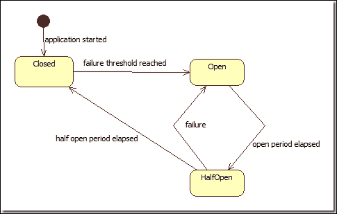

断路器是一种防止请求到达可能导致应用程序运行不正常的不稳定服务器的机制。

如前图所示，断路器有以下三种状态：

+   **关闭**：电路关闭；请求到达其目的地。

+   **打开**：电路打开；请求无法通过断路器，客户端收到错误。系统将在一段时间后重试通信。

+   **半开**：电路再次测试服务，如果到达服务时没有错误，请求可以再次流动，断路器**关闭**。

通过这种简单的机制，我们可以防止错误在系统中蔓延，避免灾难性的故障。

理想情况下，断路器应该是异步的。这意味着即使没有请求，系统也应该每隔几秒/毫秒尝试重新建立与故障服务的连接，以便继续正常运行。

### 提示

失败是人类本性中的共同点：最好为此做好准备。

断路器也是警报支持工程师的理想位置。根据我们系统的性质，某个服务无法到达可能意味着一个严重的问题。你能想象一家银行无法到达短信服务发送双因素认证码吗？无论我们如何努力，它总会在某个时候发生。所以，为此做好准备。

### 注意

Martin Fowler（微服务中的大人物之一）有一篇非常鼓舞人心的文章，讲述了断路器的内容，网址为[`martinfowler.com/bliki/CircuitBreaker.html`](http://martinfowler.com/bliki/CircuitBreaker.html)。

## Seneca - 一个简单的谜题，让我们的生活变得更轻松

**Seneca**很棒。它使开发人员能够将一个简单而小的想法转化为一段代码，其中连接点不做任何假设，只是事实。一个操作有清晰的输入，并通过回调为其提供答案的接口。

你的团队有多少次为了以*一种好的方式*重用代码而在应用程序的类结构中挣扎？

Seneca 专注于**简单性**。我们不是在建模对象，而只是使用小段代码来构建系统的一部分，这些代码与对象非常紧密和幂等，使我们的生活变得更加轻松。

Seneca 让我们的生活变得更轻松的另一种方式是通过**可插拔性**。

如果你回顾一下我们在本书中写的代码，首先会注意到插件是多么方便。

它们为一系列某种程度上相关的操作提供了适当的封装（看起来类似于类吗？）。

我总是尽量不过度设计解决方案。很容易陷入过早的抽象，为我们不知道在大多数情况下是否会发生的未来准备代码。

我们没有意识到我们花了多长时间来维护那些被过度设计并且需要每次有人改变它们周围的代码时都需要测试的功能。

Seneca 避免（或至少不鼓励）这种类型的设计。把 Seneca 的操作想象成一张小纸条（就像便利贴），你需要在上面写上上周发生的事情。你需要聪明地选择要放进去的内容，并且可能，如果内容太密集，就把它分成另一张便利贴。

Seneca 在可配置性方面也表现良好。正如我们之前所看到的，Seneca 带有许多用于数据存储和传输的集成。

Seneca 的一个重要方面是传输协议。正如我们现在所知，默认传输是通过 TCP 进行的，但我们可以使用消息队列吗？结构如下所示：

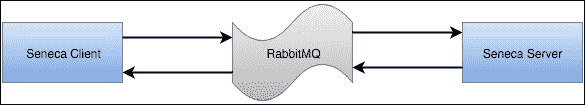

是的，我们可以。它已经完成并得到维护。

### 注意

以下 URL 是 Seneca 的一个插件，允许它通过 RabbitMQ 发送消息而不是 HTTP：

[`github.com/senecajs/seneca-rabbitmq-transport`](https://github.com/senecajs/seneca-rabbitmq-transport)

如果您查看插件的代码（看起来非常复杂，但实际上并不是），您可以在几秒钟内找到魔术发生的地方：

```js
  seneca.add({role: 'transport', hook: 'listen', type: 'rabbitmq'}, hook_listen_rabbitmq)
  seneca.add({role: 'transport', hook: 'client', type: 'rabbitmq'}, hook_client_rabbitmq)
```

Seneca 正在使用 Seneca 动作来委托消息的传输。虽然看起来有点递归，但它很棒！

一旦您了解了 Seneca 和所选择的传输协议的工作原理，您就立即有资格为 Seneca 编写传输插件。

### 注意

当我开始学习 Seneca 以撰写本书时，我还编写了一个传输插件来使用 NServiceBus（[`particular.net/`](http://particular.net/)）。

NServiceBus 是一个有趣的想法，它允许您连接多个存储和 AMPQ 兼容系统，并将它们用作客户端。例如，我们可以将消息写入 SQL Server 表中，并在通过 NServiceBus 路由后从队列中消费它们，从而具有消息历史的即时审计功能。

有了这样的灵活性，我们可能编写一个使用几乎任何东西作为传输协议的插件。

## Seneca 和 promises

我们之前章节中的所有代码都依赖于回调。回调在您的代码不嵌套超过三层时是好的。

然而，有一种更好的方法来管理 JavaScript 的异步特性：**promises**。

看看下面的代码：

```js
<!doctype html>
<html lang="en">
<head>
  <meta charset="utf-8">
  <title>promise demo</title>
<script src="img/jquery-1.10.2.js"></script>
</head>
<body>

<button>Go</button>
<p>Ready...</p>
<div></div>
<div></div>
<div></div>
<div></div>

<script>
var effect = function() {
  return $( "div" ).fadeIn( 800 ).delay( 1200 ).fadeOut();
};

$( "button" ).on( "click", function() {
  $( "p" ).append( " Started... " );

  $.when( effect() ).done(function() {
  $( "p" ).append( " Finished! " );
  });
});
</script>

</body>
</html>
```

前面的代码是使用 promises 的 JQuery 片段的一个例子。

根据其定义，promise 是：

*承诺或保证将做某事或发生某事的声明*

就是这样。如果你看到前面的代码，`$.when`返回一个 promise。我们不知道 effect 函数会花多长时间，但我们可以保证一旦准备好，`done`里面的函数就会被执行。它看起来非常类似于回调，但是看看下面的代码：

```js
callhttp(url1, data1).then(function(result1) {
   // result1 is available here
   return callhttp(url2, data2);
}).then(function(result2) {
   // only result2 is available here
   return callhttp(url3, data3);
}).then(function(result3) {
   // all three are done now, final result is in result3
});
```

不要尝试执行它，这只是一个假设的例子，但我们在那里所做的是链接 promises；这使得代码垂直而不是以金字塔形式结束，这样更难阅读，如下图所示：

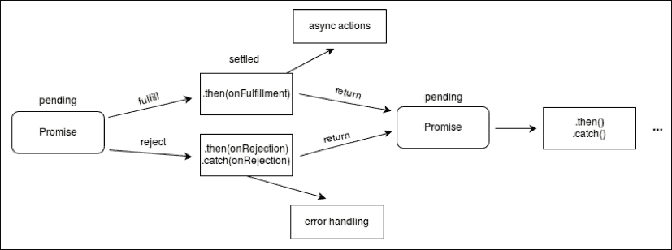

默认情况下，Seneca 不是一个面向 promise 的框架，但（总是有一个但）使用 Bluebird，JavaScript 中最著名的 promise 库之一，我们可以*promisify* Seneca，如下所示：

```js
var Promise = require('bluebird');
var seneca = require('seneca')();

// Promisify the .act() method; to learn more about this technique see:
// http://bluebirdjs.com/docs/features.html#promisification-on-steroids
var act = Promise.promisify(seneca.act, seneca);

// Return no error and a success message to illustrate a resolved promise
seneca.add({cmd: 'resolve'}, function (args, done) {
  done(null, {message: "Yay, I've been resolved!"});
});

// Return an error to force a rejected promise
seneca.add({cmd: 'reject'}, function (args, done) {
  done(new Error("D'oh! I've been rejected."));
});

// Use the new promisified act() with no callback
act({cmd: 'resolve'})
  .then(function (result) {
  // result will be {message: "Yay, I've been resolved!"} since 
  // its guaranteed to resolve
  })
  .catch(function (err) {
  // Catch any error as usual if it was rejected
  });

act({cmd: 'reject'})
  .then(function (result) {
  // Never reaches here since we throw an error on purpose
  })
  .catch(function (err) {
  // err will be set with message "D'oh! I've been rejected."
  });
```

前面的代码中有两个重要的细节：

```js
var act = Promise.promisify(seneca.act, seneca);
```

这创建了`act`函数及其使用的 promise 版本，如下所示：

```js
act({cmd: 'reject'})
  .then(function (result) {
  // Never reaches here since we throw an error on purpose
  })
  .catch(function (err) {
  // err will be set with message "D'oh! I've been rejected."
  });
```

在最后的片段中有一个重要的细节；而不是接收以下两个参数的回调：

+   一个错误

+   结果

我们正在链接以下两种方法：

+   **Then**：当 promise 被解析时执行

+   **Catch**：如果在解析 promise 时出现错误，则执行此操作

这种构造方式使我们能够编写以下代码：

```js
act({cmd: 'timeout'})
  .then(function (result) {
  // Never reaches here since the gate executer times out
  })
  .catch(function (err) {
  // err will be set with a timeout error thrown by the gate executer
  });
```

这段代码处理了我们以前从未谈论过的东西：gate executor 超时。当 Seneca 在某些情况下无法到达目的地时，就会发生这种情况，而且可以像之前展示的那样轻松地处理。`then`部分永远不会被执行，因为只有在出现错误时才会调用该函数。

现在市场上有几种 JavaScript 中的 promise 的成熟选择。如今，我的首选是 Bluebird（[`github.com/petkaantonov/bluebird`](https://github.com/petkaantonov/bluebird)），因为它简单易用。Q 是 AngularJS（最流行的 SPA 框架之一）使用的另一个选项，但在日常使用中，它看起来比 Bluebird 更复杂。

# 调试

调试 Node.js 应用程序与调试任何其他应用程序非常相似。像**WebStorm**或**IntelliJ**这样的 IDE 提供了一个传统的调试器，您可以在其中设置断点，并在应用程序触及给定行时停止执行。

如果您购买了其中一个 IDE 的许可证，这将是完美的，但是对于 Google Chrome 的用户来说，有一个免费的替代方案将会产生非常相似的结果，**node-inspector**。

Node-inspector 是一个 npm 包，几乎可以使 Chrome 调试器调试 Node.js 应用程序。

让我们看看它是如何工作的：

1.  首先，我们需要安装 node-inspector：

```js
npm install –g node-inspector

```

这应该会向我们的系统添加一个名为`node-inspector`的命令。如果我们执行它，我们会得到以下输出：

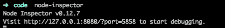

这意味着我们的调试服务器已经启动。

1.  现在我们需要运行一个带有特殊标志的节点应用程序，以指示需要进行调试。

让我们以一个简单的塞内加行为为例：

```js
var seneca = require( 'seneca' )()
seneca.add({role: 'math', cmd: 'sum'}, function (msg, respond) {
  var sum = msg.left + msg.right
  respond(null, {answer: sum})
})

seneca.add({role: 'math', cmd: 'product'}, function (msg, respond) {
  var product = msg.left * msg.right
  respond( null, { answer: product } )
})

seneca.act({role: 'math', cmd: 'sum', left: 1, right: 2}, console.log)
seneca.act({role: 'math', cmd: 'product', left: 3, right: 4}, console.log)
```

1.  现在，为了在调试模式下运行它，执行以下命令：

```js
node index.js --debug-brk

```

访问调试器的方式是通过 URL `http://127.0.0.1:8080/?port=5858`：

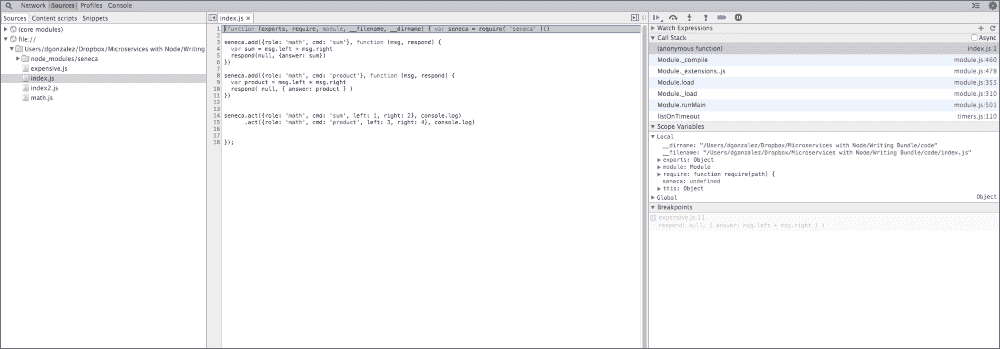

我相信这张图片对世界上每个开发人员来说都很熟悉：这是 Chrome 调试器显示我们的代码。正如您在第一行中所看到的，也就是蓝色高亮显示的那一行，应用程序在第一条指令处停止，以便我们可以通过点击行号来设置断点，如下图所示：

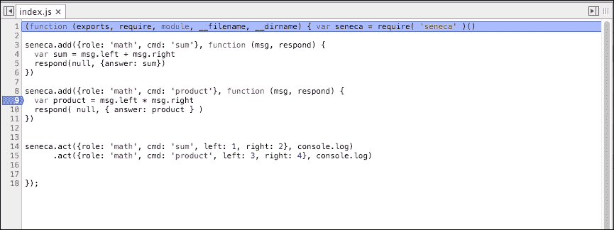

正如您在上图中所看到的，我们在第 9 行设置了一个断点。现在我们可以使用控制面板来浏览代码和变量的值：

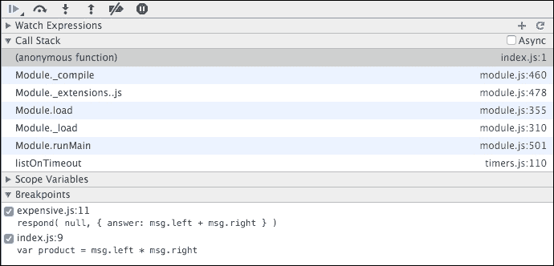

顶部的控件说明了自己，如果您曾经调试过一个应用程序：

+   第一个按钮称为播放，它允许应用程序运行到下一个断点

+   逐步执行当前文件中的下一行

+   步入进入下一行，深入调用堆栈，以便我们可以看到调用层次结构

+   跳出是步入的反向

+   禁用断点将阻止程序在断点处停止。

+   异常暂停，顾名思义，将导致程序在异常处停止（在尝试捕获错误时非常有用）

如果我们点击播放，我们可以看到脚本将在下图中的第 9 行停止：

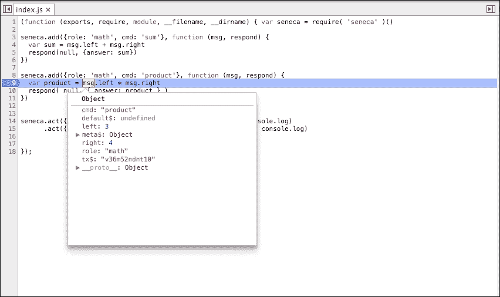

作为一个好的调试器，它将让我们通过将光标悬停在变量名上来检查变量的值。

# 总结

这一章节非常紧凑。我们已经经历了很多内容，这些内容帮助我们构建了一个小型的微服务生态系统，当它们一起编排时，将会相当好地工作。有时我们有点过于简化，但本书的目的是要表明面向微服务的软件的强大之处。在这个阶段，我建议读者开始围绕塞内加进行一些测试。

网站上的文档非常有帮助，也有很多示例可供参考。

有一些存储和传输的插件，以及其他类型的插件（如用户认证），可以让您尝试不同的塞内加功能。

我们将在接下来的章节中更多地讨论其中一些。
