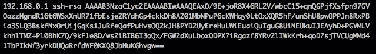
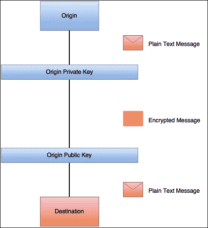
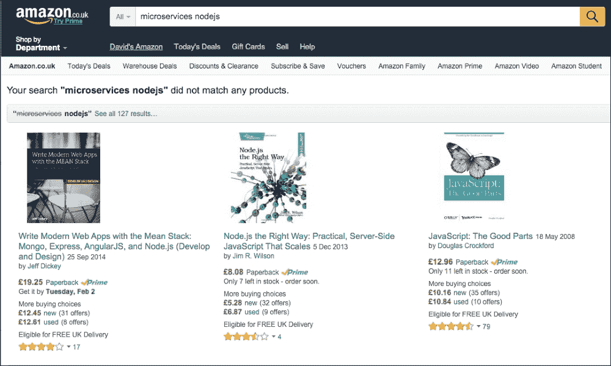
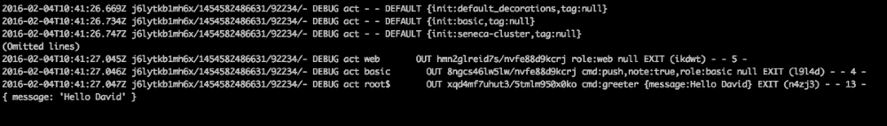

# 第五章：安全和可追溯性

**安全**是当今系统中最大的关注点之一。大公司泄露的信息量令人担忧，尤其是因为 90%的信息泄露可以通过软件开发人员的一些小动作来修复。类似的情况也发生在事件日志记录和错误的可追溯性上。直到有人要求你没有的日志来审计故障时，没有人会真正关注这些。在本章中，我们将讨论如何管理安全和日志记录，以使我们的系统安全和可追溯，以下是一些帮助的主题：

+   **基础逻辑安全性**：我们将讨论如何保护我们的软件基础设施，以提供行业标准的通信安全层。

+   **应用安全**：我们将介绍保护我们应用程序的常见技术。输出编码或输入验证等做法是行业标准，它们可以避免我们遭受灾难。

+   **可追溯性**：能够跟踪我们系统中的请求在微服务架构中是必不可少的。我们将利用 Seneca 来完成这项任务，并学习如何从这个出色的框架中获取信息。

+   **审计**：即使我们尽了最大努力构建软件，事故仍然会发生。重建调用序列并准确查看发生了什么的能力是很重要的。我们将讨论如何启用我们的系统，以便能够恢复所需的信息。

# 基础逻辑安全性

基础设施安全通常被软件工程师忽视，因为它与他们的专业领域完全不同。然而，如今，特别是如果你的职业倾向于 DevOps，这是一个不容忽视的主题。

在本书中，我们不会深入探讨基础设施安全，只会提出一些保持微服务安全的经验法则。

强烈建议读者阅读并了解密码学以及围绕 SSH 使用的所有影响，这是目前保持通信安全的主要资源之一。

## SSH - 加密通信

在任何组织中，都有一份可以访问某些服务的严格名单。通常，这些服务的身份验证是通过用户名和密码进行的，但也可以使用密钥来*验证用户的身份*。

无论使用何种身份验证方法，通信都应始终通过安全通道进行，如**SSH**。

**SSH**代表**安全外壳**，它是一种用于访问远程机器中的外壳的软件，但它也可以是一个非常有用的工具，用于创建代理和隧道以访问远程服务器。

让我们使用以下命令来解释它是如何工作的：

```js
/home/david:(develop) *x* ssh david@192.168.0.1
The authenticity of host '192.168.0.1 (192.168.0.1)' can't be established.
RSA key fingerprint is SHA256:S22/A2/eqxSqkS4VfR1BrcDxNX1rmfM1JkZaGhrjMbk.
Are you sure you want to continue connecting (yes/no)? yes
Warning: Permanently added '192.168.0.1' (RSA) to the list of known hosts.
vagrant@192.168.0.1's password:
Last login: Mon Jan 25 02:30:21 2016 from 10.0.2.2
Welcome to your virtual machine.

```

在这种情况下，我使用**Vagrant**来简化虚拟机的构建。Vagrant 是一个非常流行的工具，用于自动化开发环境，他们的网站（[`www.vagrantup.com/`](https://www.vagrantup.com/)）包含了有用的信息。

第一行中，我们执行`ssh david@192.168.0.1`命令。该命令尝试以`192.168.0.1`主机中的用户`david`身份打开终端。

由于这是第一次针对 IP 为`192.168.0.1`的机器执行此命令，我们的计算机将不信任远程服务器。

这是通过维护一个名为`known_hosts`的文件来完成的，在这种情况下是在`/home/david/.ssh/known_hosts`文件夹下（这将取决于用户）。

这个文件是一个带有相应密钥的主机列表。正如你所看到的，接下来的两行解释了*主机不能被信任*并呈现了远程服务器持有的密钥指纹以进行验证：

```js
The authenticity of host '192.168.0.1 (192.168.0.1)' can't be established.
RSA key fingerprint is SHA256:S22/A2/eqxSqkS4VfR1BrcDxNX1rmfM1JkZaGhrjMbk.

```

此时，用户应该通过检查密钥来验证服务器的身份。一旦完成此操作，我们可以指示 SSH 连接到服务器，这将导致打印以下日志：

```js
Warning: Permanently added '192.168.0.1' (RSA) to the list of known hosts.

```

现在，如果我们检查我们的`known_hosts`文件，我们可以看到密钥已被添加到列表中，如下所示：



存储在`known_hosts`文件中的这个密钥是远程服务器的公钥。

SSH 使用一种名为**RSA**的**密码算法**。这种算法是围绕**非对称加密**的概念构建的，如下图所示：



非对称加密依赖于一组密钥：一个公钥和一个私钥。顾名思义，公钥可以与所有人共享；而私钥必须保密。

使用私钥加密的消息只能使用公钥解密，反之亦然，因此几乎不可能（除非有人获得了密钥的另一半）拦截和解密消息。

在这一点上，我们的计算机知道了服务器的公钥，我们可以开始与服务器建立加密会话。一旦我们进入终端，所有命令和命令的结果都将被加密并发送到网络上。

这个密钥也可以用来在没有密码的情况下连接到远程服务器。我们需要做的唯一一件事就是在我们的机器上生成一个 SSH 密钥，并将其安装在服务器上的一个名为`authorized_keys`的文件中，该文件位于`.ssh`文件夹下，`known_hosts`文件所在的位置。

在使用微服务时，您可以远程登录到许多不同的机器上，因此这种方法变得更加吸引人。但是，我们需要非常小心地处理私钥，因为如果用户泄漏了私钥，我们的基础设施可能会受到损害。

# 应用程序安全性

应用程序安全性变得越来越重要。随着云成为大公司基础设施的事实标准，我们不能指望数据仅限于单个数据中心。

通常，当有人开始新业务时，主要关注点是从功能角度构建产品。安全性不是主要关注点，通常被忽视。

这是一种非常危险的做法，我们将通过让读者了解可能危害我们应用程序的主要安全威胁来加以修正。

开发应用程序的主要四个安全要点是：

+   注入

+   跨站脚本

+   跨站点请求伪造令牌保护

+   开放式重定向

在本节结束时，我们将能够识别主要的漏洞，但我们不会对恶意攻击者进行防护。一般来说，软件工程师应该尽可能跟上安全性，就像他们跟上新技术一样。无论你构建的产品有多好，如果它不安全，总会有人发现并利用它。

## 常见威胁-如何跟上最新

正如我们之前所述，安全性是应用程序开发中一个持续的主题。无论您正在构建什么类型的软件，总会有与之相关的安全性问题。

在我的职业生涯中，我发现了一种不需要成为全职专门的安全工程师就能跟上网页开发安全的最佳方法，那就是遵循**OWASP**项目。**OWASP**代表**开放式 Web 应用程序安全项目**，他们每年都会发布一份相当有趣的文件（以及其他文件），名为 OWASP 十大。

### 注意

OWASP 十大于 2003 年首次发布，其目标是提高开发社区对应用程序开发中最常见威胁的意识。

在前一节中，我们确定了软件开发人员可能面临的四个主要安全问题，并且所有这些问题都在接下来的章节中提到。

### 注入

**注入**是迄今为止我们可能遭受的最危险的攻击。具体来说，SQL 注入是影响应用程序的最常见的注入形式，它包括攻击者在我们的应用程序查询中强制执行 SQL 代码，导致不同的查询可能危及我们公司的数据。

还有其他类型的注入，但我们将专注于 SQL 注入，因为现代世界中几乎每个应用程序都使用关系数据库。

SQL 注入包括通过来自未经验证的来源的输入（如 Web 表单或任何其他具有任意文本输入的数据源）注入或操纵我们应用程序中的 SQL 查询。

让我们考虑以下例子：

```js
SELECT * FROM users WHERE username = 'username' AND password = 'password'

```

### 提示

永远不要将密码以明文形式存储在数据库中。始终对其进行哈希和盐处理，以避免彩虹表攻击。这只是一个例子。

这个查询将给我们提供与给定名称和密码相对应的用户。为了从客户端的输入构建查询，我们可以考虑做类似以下代码的事情是一个好主意：

```js
var express = require('express');
var app = express();
var mysql      = require('mysql');

var connection = mysql.createConnection({
  host     : 'localhost',
  user     : 'me',
  password : 'secret',
  database : 'test_db'
});

app.get('/login', function(req, res) {
  var username = req.param("username");
  var password = req.param("password");

  connection.connect();
  var query = "SELECT * FROM users WHERE username = '" + username + "' AND password = '" + password + "'";
  connection.query(query, function(err, rows, fields) {
    if (err) throw err;
    res.send(rows);
  });
  connection.end();
});

app.listen(3000, function() {
  console.log("Application running in port 3000.");
});
```

乍一看，它看起来像一个简单的程序，访问名为`test_db`的数据库，并发出一个查询，以检查是否有与用户名和密码匹配的用户，并将其返回给客户端，因此如果我们打开浏览器并尝试浏览到`http://localhost:3000/login?username=david&password=mypassword` URL，浏览器将呈现一个 JSON 对象，其中包含以下查询的结果：

```js
SELECT * FROM users WHERE username = 'david' AND password = 'mypassword'

```

还没有什么奇怪的，但是如果客户试图黑我们会发生什么？

看一下以下输入：

`http://localhost:3000/login?username=' OR 1=1 --&password=mypassword`

正如你所看到的，它生成的查询是以下代码：

```js
SELECT * FROM users WHERE username = '' OR 1=1 -- AND password = 'mypassword'

```

在 SQL 中，`--`字符序列用于注释掉行的其余部分，因此有效的查询将如下所示：

```js
SELECT * FROM users WHERE username='' OR 1=1

```

这个查询返回用户的完整列表，如果我们的软件使用这个查询的结果来确定用户是否应该登录，那么我们就有一些严重的问题。我们刚刚授予了我们的系统对一个甚至不知道有效用户名的人的访问权限。

这是 SQL 注入如何影响我们的众多例子之一。

在这种情况下，很明显我们正在将不受信任的数据（来自用户）连接到我们的查询中，但相信我，当软件变得更加复杂时，要识别这一点并不总是容易的。

避免 SQL 注入的一种方法是使用预处理语句。

#### 输入验证

应用程序主要通过表单与用户进行交互。这些表单通常包含自由文本输入字段，可能会导致攻击。

防止损坏数据进入我们服务器的最简单方法是通过输入验证，正如其名称所示，它包括验证用户的输入，以避免前面描述的情况。

有两种类型的输入验证，如下：

+   白名单

+   黑名单

**黑名单**是一种危险的技术。在大多数情况下，试图定义输入中的错误要比简单定义我们期望的要费力得多。

推荐的方法是（并且将始终是）从用户那里**白名单**数据，通过使用正则表达式进行验证：我们知道电话号码是什么样子的，我们也知道用户名应该是什么样子的，等等。

输入验证并不总是容易的。如果你曾经遇到过验证电子邮件的情况，你会知道我在说什么：验证电子邮件的正则表达式绝不简单。

不能轻易验证某些数据的事实不应该限制我们去做，因为忽略输入验证可能会导致严重的安全漏洞。

输入验证并不是 SQL 注入的万能药，但它也有助于解决其他安全威胁，比如跨站脚本攻击。

在上一节的查询中，我们做了一些非常危险的事情：将用户输入连接到我们的查询中。

其中一个解决方案可能是使用某种转义库来清理用户输入，如下所示：

```js
app.get('/login', function(req, res) {
  var username = req.param("username");
  var password = req.param("password");

  connection.connect();
  var query = "SELECT * FROM users WHERE username = '" + connection.escape(username) + "' AND password = '" + connection.escape(password) + "'";
  connection.query(query, function(err, rows, fields) {
    if (err) throw err;
    res.send(rows);
  });
  connection.end();
});
```

在这种情况下，使用的`mysql`库提供了一套方法来转义字符串。让我们看看它是如何工作的：

```js
var mysql = require('mysql');
var connection = mysql.createConnection({
  host: 'localhost',
  username: 'root',
  password: 'root'
});

console.log(connection.escape("' OR 1=1 --"))
```

之前的小脚本转义了前面示例中作为`username`提供的字符串，结果是`\' OR 1=1 --`。

正如你所看到的，`escape()`方法已经替换了危险字符，清理了用户输入。

### 跨站脚本攻击

**跨站脚本攻击**，也称为**XSS**，是主要影响 Web 应用程序的安全漏洞之一。这是最常见的安全问题之一，对客户的影响可能是巨大的，因为潜在地，有人可能会利用这种攻击窃取用户身份。

这种攻击是将注入代码放入第三方网站中，可以从客户端浏览器中窃取数据。有几种方法可以做到这一点，但到目前为止，最常见的方法是通过来自客户端的未转义输入。

在互联网上的一些网站上，用户可以添加包含任意输入的评论。这种任意输入可能包含加载来自远程服务器的 JavaScript 的脚本标记，可以窃取会话 cookie（或其他类型的有价值的信息），让攻击者在远程机器上复制用户会话。

有两种主要类型的 XSS 攻击：**持久**和**非持久**。

**持久**类型的 XSS 包括通过制作特定的文本字符串来存储 XSS 攻击，一旦在网站上向用户显示时，该文本字符串就会解析为攻击。这段代码可以通过存储在数据库中的任意输入文本（例如论坛中的评论）来注入。

**非持久**类型的 XSS 是当攻击插入到应用程序的非持久部分中，由于处理不当的数据而发生。

让我们来看一下以下的屏幕截图：



正如你所看到的，我们在[`www.amazon.co.uk/`](http://www.amazon.co.uk/)中搜索了一本书（这本书）。它没有产生任何输出（因为这本书还没有出版），但它指定了**Your search "microservices nodejs" did not match any products**，这在某种程度上使用了来自 Web 浏览器的输入作为输出。更重要的是，当我点击搜索时，亚马逊将我重定向到以下 URL：

[`www.amazon.co.uk/s/ref=nb_sb_noss?url=search-alias%3Daps&field-keywords=microservices+nodejs`](http://www.amazon.co.uk/s/ref=nb_sb_noss?url=search-alias%3Daps&field-keywords=microservices+nodejs)

我们知道亚马逊是安全的，但如果它对 XSS 攻击很敏感，我们可以修改`field-keywords`参数的值，以制作一个请求，该请求在内容中注入了一个脚本标记，导致攻击者能够窃取会话 cookie，这可能会给网站带来严重的问题。

#### 输出编码

防范这种攻击的一种方法是输出编码。我们之前已经做过了，在本章的*输入验证*部分中使用了`connection.escape()`。公平地说，我们应该验证用户输入的所有数据，并对来自第三方的所有输出进行编码。这包括用户输入的输入，以及来自系统外部的信息来源。

当将问题缩小到 Web 开发时，我们必须意识到输出编码所需的三个不同领域：

+   CSS

+   JavaScript

+   HTML

最棘手的两种是 JavaScript 和 HTML，攻击者可以很容易地窃取信息。

通常，无论我们使用哪个框架来构建我们的应用程序，它总是具有编码输出的功能。

### 跨站请求伪造

**跨站点请求伪造**（**CSRF**）是跨站点请求脚本的反向。在跨站点请求脚本中，问题在于客户端信任来自服务器的数据。而在跨站点请求伪造中，问题在于服务器信任来自客户端的数据。

窃取会话 cookie 后，攻击者不仅可以窃取用户的信息，还可以修改与 cookie 关联的帐户的信息。

这是通过通过 HTTP 请求将数据发布到服务器来完成的。

HTTP 将其请求分类为方法。方法基本上用于指定请求要执行的操作。最有趣的四种方法是以下几种：

+   `GET`：这从服务器获取数据。它不应修改任何持久数据。

+   `POST`：这在服务器上创建资源。

+   `PUT`：这在服务器上更新资源。

+   `DELETE`：这从服务器中删除资源。

还有更多方法（如`PATCH`或`CONNECT`），但让我们专注于这四种。正如你所看到的，这四种方法中的三种会修改服务器中的数据，而具有有效会话的用户可能会窃取数据，创建付款，订购商品等。

避免跨站点请求伪造攻击的一种方法是使用跨站点请求令牌保护`POST`，`PUT`和`DELETE`端点。

看一下以下 HTML 表单：

```js
<form action="/register" method="post">
  <input name="email" type="text" />
  <input name="password" type="password" />
</form>
```

这个表单描述了一个完全有效的情况：用户在我们的网站上注册；非常简单，但仍然有效且有缺陷。

我们正在指定一个 URL 和预期参数列表，以便攻击者可以在几分钟内注册数百或数千个帐户，使用一个小脚本发出带有两个参数（`email`和`password`）的`POST`请求。

现在，看一下以下表单：

```js
<form action="/register" method="post">
  <input name="email" type="text" />
  <input name="password" type="password" />
  <input name="csrftoken" type="hidden" value="as7d6fasd678f5a5sf5asf" />
</form>
```

你可以看到区别：有一个额外的隐藏参数叫做`csrftoken`。

该参数是一个随机字符串，每次呈现表单时都会生成，以便我们可以将此额外参数添加到每个表单中。

一旦表单提交，`csrftoken`参数将被验证，只允许具有有效令牌的请求通过，并生成一个新令牌再次呈现在页面上。

### 开放式重定向

有时，我们的应用程序可能需要将用户重定向到某个特定的 URL。例如，当访问私有 URL 而没有有效的身份验证时，用户通常会被重定向到登录页面：

`http://www.mysite.com/my-private-page`

这可能会导致重定向到以下内容：

`http://www.mysite.com/login?redirect=/my-private-page`

这听起来合理。用户被发送到登录页面，一旦提供有效的凭据集，就会被重定向到`/my-private-page`。

如果有人试图窃取我们用户的帐户会发生什么？

看一下以下请求：

`http://www.mysite.com/login?redirect=http://myslte.com`

这是一个精心制作的请求，将用户重定向到`myslte.com`而不是`mysite.com`（注意`l`而不是`i`）。

有人可以让`myslte.com`看起来像`mysite.com`的登录页面，并通过在社交媒体上分发前面的 URL 来窃取用户的密码和用户名，因为用户将被重定向到恶意页面。

前面问题的解决方案非常简单：不要将用户重定向到不受信任的第三方网站。

再次，执行此任务的最佳方法是为重定向的目标主机进行白名单处理。基本上，我们不让我们的软件将我们的客户重定向到未知的网站。

## 有效的代码审查

减少我们应用程序中安全漏洞的最有效方法之一是通过系统化和知情的代码审查流程。代码审查的问题在于它们总是最终成为意见和个人偏好的倾倒区域，这些意见和偏好通常不仅不会提高代码的质量，而且还会导致最后一刻的更改，可能会暴露我们应用程序中的漏洞。

产品开发生命周期中专门的安全代码审查阶段有助于大大减少交付到生产环境中的错误数量。

软件工程师面临的问题是，他们的思维被训练成构建良好运行的东西，但他们没有发现缺陷的思维，尤其是围绕他们构建的东西。这就是为什么您不应该测试自己的代码（除了在开发时进行的测试之外），甚至更少地测试应用程序的安全性。

然而，我们通常是团队合作，这使我们能够审查别人的代码，但我们必须以有效的方式进行。

代码审查需要尽可能多的大脑力量，尤其是在审查复杂的代码时。您不应该花费超过两个小时审查相同的功能，否则会错过重要的缺陷，并且对细节的关注将降低到令人担忧的水平。

这在基于微服务的架构中并不是一个大问题，因为功能应该足够小，可以在合理的时间内阅读，尤其是如果你和作者讨论过他试图构建什么。

您应该始终遵循两阶段审查，如下所示：

+   快速审查代码以获得整体情况：它是如何工作的，它使用了你不熟悉的技术，它是否做了它应该做的事情，等等

+   按照检查清单审查代码

这些项目清单必须事先决定，并取决于您的公司正在构建的软件的性质。

通常，在代码审查期间检查代码安全性方面的项目清单很长，但我们可以将其缩小到以下组件：

+   所有输入在适用时都经过了验证/编码吗？

+   所有输出都进行了编码，包括日志吗？

+   我们是否用跨站点请求伪造令牌保护端点？

+   所有用户凭据在数据库中都进行了加密或哈希处理吗？

如果我们检查这个清单，我们将能够确定我们应用程序中安全性方面的最大问题。

# 可追溯性

在现代信息系统中，可追溯性非常重要。这在微服务中是一个微妙的问题，在 Seneca 中得到了很好的解决，使得请求在我们的系统中易于跟踪，以便我们可以审计故障。

## 日志记录

Seneca 在日志记录方面做得相当不错。在 Seneca 中有很多可以配置的选项，以便获取关于一切工作情况的所需信息（如果它正在工作）。

让我们看看日志记录如何在一个小应用程序中工作：

```js
var seneca = require("seneca")();

seneca.add({cmd: "greeter"}, function(args, callback){
  callback(null, {message: "Hello " + args.name});
});

seneca.act({cmd: "greeter", name: "David"}, function(err, result) {
  console.log(result);
});
```

这是可以编写的最简单的 Seneca 应用程序。让我们按照以下方式运行它：

```js
seneca  node index.js
2016-02-01T09:55:40.962Z 3rhomq69cbe0/1454579740947/84217/- INFO hello Seneca/1.0.0/3rhomq69cbe0/1454579740947/84217/-
{ message: 'Hello David' }

```

这是使用默认日志配置运行应用程序的结果。除了我们在代码中使用的`console.log()`方法之外，还有一些有关 Seneca 的内部信息被记录下来。有时，您可能只想记录您的应用程序产生的日志，以便您可以调试应用程序而不受到所有噪音的干扰。在这种情况下，只需运行以下命令：

```js
seneca  node index.js --seneca.log.quiet
{ message: 'Hello David' }

```

然而，有时系统中会出现奇怪的行为（甚至是使用的框架中的错误），你想获取关于发生了什么的所有信息。Seneca 也支持这一点，如下命令所示：

```js
seneca  node index.js --seneca.log.print

```

前面的命令将打印大量可能没有帮助的信息。

为了减少 Seneca 产生的日志量，可以对输出的日志进行精细控制。让我们看看以下行：

```js
2016-02-01T10:00:07.191Z dyy9ixcavqu4/1454580006885/85010/- DEBUG register install transport {exports:[transport/utils]} seneca-8t1dup
2016-02-01T10:00:07.305Z dyy9ixcavqu4/1454580006885/85010/- DEBUG register init seneca-y9os9j
2016-02-01T10:00:07.305Z dyy9ixcavqu4/1454580006885/85010/- DEBUG plugin seneca-y9os9j DEFINE {}
2016-02-01T10:00:07.330Z dyy9ixcavqu4/1454580006885/85010/- DEBUG act root$       IN o5onzziv9i7a/b7dtf6v1u9sq cmd:greeter {cmd:greeter,name:David} ENTRY (mnb89) - - -

```

这些是前面代码示例的日志输出中的随机行，但它将为我们提供有用的信息：这些条目是 Seneca 框架上不同操作（如插件、注册和执行）的调试级别日志行。为了对它们进行过滤，Seneca 提供了对我们想要查看的级别或操作的控制。例如考虑以下内容：

```js
node index.js --seneca.log=level:INFO

```

这将仅输出与`INFO`级别相关的日志：

```js
seneca  node index.js --seneca.log=level:INFO
2016-02-04T10:39:04.685Z q6wnh8qmm1l3/1454582344670/91823/- INFO hello Seneca/1.0.0/q6wnh8qmm1l3/1454582344670/91823/-
{ message: 'Hello David' }

```

您还可以按操作类型进行过滤，这是非常有趣的。当您使用微服务时，了解流程中发生的事件链是您需要首先查看的事情之一，以便审计失败。有了塞内卡给我们的日志记录控制，执行以下命令就像轻而易举的事情：

```js
node index.js --seneca.log=type:act

```

这将产生以下输出：



正如你所看到的，所有前面的行都对应于`act`类型，而且，如果我们从上到下跟随命令的输出，我们确切地知道塞内卡对事件的反应及其顺序。

## 追踪请求

追踪请求也是非常重要的活动，有时甚至是法律要求，特别是如果你在金融领域工作。同样，塞内卡在追踪请求方面做得非常出色。对于每个调用，塞内卡生成一个唯一标识符。这个标识符可以在调用要去的所有路径上进行追踪，如下所示：

```js
var seneca = require("seneca")();

seneca.add({cmd: "greeter"}, function(args, callback){
  console.log(this.fixedargs['tx$']);
  callback(null, {message: "Hello " + args.name});
});
seneca.act({cmd: "greeter", name: "David"}, function(err, result) {
  console.log(this.fixedargs['tx$']);
});
```

在这里，我们将一个包含塞内卡中的事务 ID 的字典记录到终端。因此，如果我们执行它，我们将得到以下输出：

```js
2016-02-04T10:58:07.570Z zl0u7hj3hbeg/1454583487555/95159/- INFO hello Seneca/1.0.0/zl0u7hj3hbeg/1454583487555/95159/-
3jlroj2n91da
3jlroj2n91da

```

您可以看到塞内卡是如何追踪所有请求的：框架分配了一个 ID，并且它在端点之间传播。在这种情况下，我们所有的端点都在本地机器上，但如果我们将它们分布在不同的机器上，ID 仍将是相同的。

有了这个唯一的 ID，我们将能够重建客户数据在我们系统中的旅程，并且通过与相关时间戳的请求排序，我们可以准确地了解用户在做什么，每个动作需要多长时间，与延迟相关的可能问题等。通常，结合断路器输出信息的日志记录使工程师能够在非常短的时间内解决问题。

## 审计

到目前为止，我们一直在使用`console.log()`将数据输出到日志中。这是一个不好的做法。它会破坏日志的格式，并将内容抛到标准输出。

再次，塞内卡来到了救援：

```js
var seneca = require("seneca")();

seneca.add({cmd: "greeter"}, function(args, callback){
  this.log.warn(this.fixedargs['tx$']);
  callback(null, {message: "Hello " + args.name});
});

seneca.act({cmd: "greeter", name: "David"}, function(err, result) {
  this.log.warn(this.fixedargs['tx$']);
});
```

让我们看看塞内卡产生的输出：

```js
seneca  node index.js
2016-02-04T11:17:28.772Z wo10oa299tub/1454584648758/98550/- INFO hello Seneca/1.0.0/wo10oa299tub/1454584648758/98550/-
2016-02-04T11:17:29.156Z wo10oa299tub/1454584648758/98550/- WARN - - ACT 02jlpyiux70s/9ca086d19x7n cmd:greeter 9ca086d19x7n
2016-02-04T11:17:29.157Z wo10oa299tub/1454584648758/98550/- WARN - - ACT 02jlpyiux70s/9ca086d19x7n cmd:greeter 9ca086d19x7n

```

正如您所看到的，我们现在正在使用记录器输出事务 ID。我们产生了一个`WARN`消息，而不是简单的控制台转储。从现在开始，我们可以使用塞内卡日志过滤器来隐藏我们操作的输出，以便专注于我们试图找到的内容。

塞内卡提供以下五个日志级别：

+   **DEBUG**：这用于在开发应用程序时进行调试，也用于跟踪生产系统中的问题。

+   **INFO**：此日志级别用于生成关于事件的重要消息，例如交易已开始或已完成。

+   **WARN**：这是警告级别。当系统发生一些不好的事情时我们使用它，但它并不是关键的，用户通常不会受到影响；然而，这表明事情正在朝着错误的方向发展。

+   **ERROR**：这用于记录错误。通常用户会受到影响，它也会中断流程。

+   **FATAL**：这是最灾难性的级别。只有在发生不可恢复的错误并且系统无法正常运行时才会使用。

以不同级别生成日志的一种方法是使用相关函数。正如我们之前所看到的，我们调用了`this.log.warn()`来记录警告。如果我们调用`this.log.fatal()`方法，我们将记录一个致命错误，其他级别也是如此。

### 提示

尝试在应用程序开发过程中调整日志，否则当生产中发生问题时，您将后悔缺乏信息。

一般来说，INFO、DEBUG 和 WARN 将是最常用的日志级别。

## HTTP 代码

HTTP 代码经常被忽视，但它们是标准化远程服务器响应的一个非常重要的机制。

当程序（或用户）向服务器发出请求时，可能会发生以下几种情况：

+   它可能会成功

+   它可能会失败验证

+   可能会产生服务器错误

正如你所看到的，可能性是无穷无尽的。我们现在面临的问题是，HTTP 是为机器之间的通信而创建的。我们如何处理机器将阅读这些代码的事实？

HTTP 以非常优雅的方式解决了这个问题：每个请求都必须用 HTTP 代码解决，这些代码有指示代码性质的范围。

### 1xx – 信息性

100-199 范围内的代码纯粹是信息性的。此范围内最有趣的代码是 102 代码。此代码用于指定后台正在进行的操作，可能需要一些时间才能完成。

### 2xx – 成功代码

成功代码用于指示 HTTP 请求的一定程度的成功。这是最常见（也是最期望的）代码。

此范围内最常见的代码如下：

+   200：成功：此代码表示完全成功。甚至远程都没有出现任何问题。

+   201：已创建：当客户端请求在服务器中创建一个新实体时，主要使用此代码。

+   203：非权威信息：此代码用于在通过转换代理路由请求时，源响应为 200。

+   204：无内容：这是一个成功的代码，但是服务器没有返回任何内容。有时，API 即使没有内容也会返回 200。

+   206：部分内容：此代码用于分页响应。发送一个标头，指定客户端将接受的范围（和偏移量）。如果响应大于范围，服务器将回复 206，表示还有更多数据要跟随。

### 3xx – 重定向

300 至 399 范围内的代码表示客户端必须采取一些额外的操作才能完成请求。

此范围内最常见的代码描述如下：

+   301：永久移动：此状态代码表示客户端试图获取的资源已永久移动到另一个位置。

+   302：找到：此代码表示用户需要出于某种原因执行临时重定向，但浏览器开始实现此代码为`303 See Other`。这导致引入了 303 和`307 临时重定向`代码以消除行为的重叠。

+   308 永久重定向：此代码如其名称所示，用于指定资源的永久重定向。它可能会与 301 混淆，但有一个小差异，308 代码不允许 HTTP 方法更改。

### 4xx – 客户端错误

400 至 499 范围内的代码表示客户端生成的错误。它们表示请求存在问题。此范围尤为重要，因为这是 HTTP 服务器用来指示客户端请求存在问题的方式。

此范围内常见的代码如下：

+   400 错误请求：此代码表示用户的请求在语法上不正确。可能缺少参数或某些值未通过验证。

+   401 未经授权：此代码表示客户端缺乏身份验证。通常，有效的登录将解决此问题。

+   403 禁止：这与 401 类似，但在这种情况下，它表示用户权限不足。

+   404 未找到：这意味着服务器中未找到资源。当您导航到不存在的页面时，会出现此错误。

### 5xx – 服务器错误

此范围表示服务器中发生了处理错误。当发出 5xx 代码时，意味着服务器出现了某种问题，客户端无法修复。

此范围内的一些代码如下：

+   500 内部服务器错误：这意味着服务器中的软件发生了错误。没有更多信息披露。

+   501 未实现：当客户端命中尚未实现的端点时会发生此错误。

+   `503 服务不可用`：当服务器由于某种原因不可用时，将发出此代码，无论是负载过多还是服务器宕机。

### 为什么 HTTP 代码在微服务中很重要

流行的说法“不要重复造轮子”是我在构建软件时最喜欢的原则之一。HTTP 代码是一个标准，所以每个人都了解不同代码的后果。

在构建微服务时，您始终需要牢记您的系统将与代理、缓存和其他已经使用 HTTP 的服务进行交互，以便它们可以根据来自服务器的响应做出反应。

最好的例子是断路器模式。无论您如何实现它以及使用什么软件，断路器都必须了解 500 代码的 HTTP 请求是一个错误，因此它可以相应地打开断路器。

一般来说，将应用程序的代码保持尽可能准确是一个良好的做法，因为这将使您的系统受益良多。

# 摘要

在本章中，您已经学会了如何构建安全软件（不仅仅是微服务），尽管这是一个足够大的主题，可以写一本完整的书。安全性的问题在于，公司通常认为投资安全就是在烧钱，但这与现实相去甚远。我非常喜欢 80-20 法则：20%的时间将给您 80%的功能，而缺失的 20%功能将需要 80%的时间。

在安全方面，我们确实应该力争实现 100%的覆盖率；然而，本章显示的 80%将覆盖大多数情况。无论如何，正如我之前提到的，软件工程师应该随时了解安全性，因为应用程序安全性的缺陷是摧毁公司的最简单方式。

我们还谈到了可追溯性和日志记录，这是现代软件工程中最被忽视的主题之一，尤其是如果您的软件是使用微服务方法构建的。
