# 第六章：测试和文档化 Node.js 微服务

到目前为止，我们所做的一切都是开发微服务并讨论围绕构建软件组件的框架。现在是测试它们的时候了。测试是验证已构建软件的活动。验证是一个非常广泛的术语。在本章中，我们将学习如何测试微服务，不仅从功能的角度，还将学习如何测试我们应用的性能，以及与不同模块集成等其他方面。我们还将使用 Node.js 构建一个代理来帮助我们检查服务的输入和输出，以便验证我们设计的是否真正发生，并再次验证 JavaScript 等语言的多功能性，以快速原型化功能。

现在，发布带有 A/B 测试的功能是一种趋势，我们只为某种类型的用户启用功能，然后收集指标来查看我们系统的变化如何执行。在本章中，我们将构建一个微服务，使我们能够以受控的方式推出功能。

另一方面，我们将记录我们的应用，这在传统软件开发中往往被忽视：我没有找到一家公司的文档能够完全捕捉到新开发人员所需的所有信息。

在本章中，我们将涵盖以下主题：

+   **功能测试**：在本节中，我们将学习如何测试微服务以及什么是良好的测试策略。我们还将学习一个名为 Postman 的工具，手动测试我们的 API，以及使用 Node.js 构建代理来监视我们的连接。

+   **文档化微服务**：我们将学习如何使用 Swagger 使用开放 API 标准来记录我们的微服务。我们还将使用开源工具从 YAML 定义生成代码。

# 功能测试

测试通常是一个耗时的活动，在构建软件时并没有得到所有必要的关注。

想想一家公司是如何发展的：

1.  有人想出一个主意。

1.  一些工程师/产品人员构建系统。

1.  公司进入市场。

没有时间进行比最低要求的手动测试更多的测试。特别是当有人在互联网上读到测试做对可能需要占用开发时间的 40%，而常识再次失败。

自动化是好的，单元测试、集成测试和端到端测试都是一种自动化形式。通过让计算机测试我们的软件，我们大大减少了验证软件所需的人力。

想想软件是如何开发的。尽管我们的公司喜欢宣称*我们是敏捷的*，但事实上每个软件项目都有一定程度的迭代开发，而测试是每个周期的一部分，但通常为了交付新功能而被忽视。

通过自动化大部分（或大部分）测试，我们正在节省金钱，如下图所示：

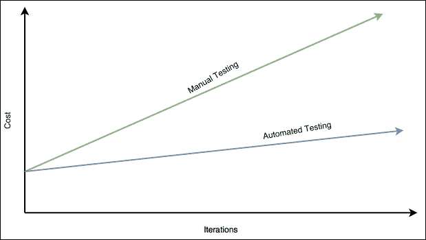

成本和迭代

如果测试做得对，测试实际上是节约成本的，关键是做对，这并不总是容易的。多少测试是过多的测试？我们应该覆盖我们应用的每一个角落吗？我们真的需要深入的性能测试吗？

这些问题通常会引发不同的意见，有趣的是并没有一个真正的答案。这取决于你的系统的性质。

在本章中，我们将学习一套广泛的测试技术，这并不意味着我们应该在我们的测试计划中包括所有这些技术，但至少我们将了解测试方法论。

在过去的七年里，Ruby on Rails 已经创造了一种新的范式的巨大趋势，称为**测试驱动开发**（**TDD**），直到现在，大多数新的开发平台都是以 TDD 为目标构建的。

就个人而言，我并不是 TDD 的坚定支持者，但我喜欢吸收其中的优点。在开发之前规划测试有助于创建具有正确内聚性的模块，并定义一个清晰易测的接口。在本章中，我们不会深入讨论 TDD，但我们会提到几次，并解释如何将这些技术应用到 TDD 测试计划中。

## 自动化测试金字塔

如何制定测试计划是一个棘手的问题。无论你做什么，你总会有一种感觉*这完全是错的*。

在深入讨论之前，让我们从功能角度定义我们将要处理的不同类型的测试，以及它们应该设计为什么。

### 单元测试

**单元测试**是一种覆盖应用程序各个部分的测试，而不考虑与不同模块的集成。它也被称为**白盒测试**，因为其目的是尽可能覆盖和验证尽可能多的分支。

通常，衡量我们测试质量的方法是测试覆盖率，以百分比来衡量。如果我们的代码涵盖了十个分支，而我们的测试覆盖了七个分支，那么我们的代码覆盖率就是 70%。这是我们测试覆盖率可靠程度的一个很好的指标。然而，这可能会误导，因为测试可能存在缺陷，或者即使所有分支都经过了测试，不同的输入可能会导致不同的输出，而这并没有被测试捕捉到。

在单元测试中，由于我们不与其他模块交互，我们将大量使用模拟和存根来模拟第三方系统的响应，并控制流程以命中所需的分支。

### 集成测试

**集成测试**，顾名思义，是设计用来验证我们模块在应用程序环境中的集成的测试。它们不是设计来测试我们代码的分支，而是业务单元，我们将把数据保存到数据库中，调用第三方网络服务或我们架构的其他微服务。

这些测试是检查我们的服务是否表现如预期的完美工具，有时可能很难维护（往往如此）。

在我的多年经验中，我还没有找到一家集成测试做得正确的公司，这其中有很多原因，如下列表所述：

+   一些公司认为集成测试很昂贵（这是真的），因为它需要额外的资源（如数据库和额外的机器）。

+   一些其他公司尝试仅通过单元测试覆盖所有业务案例，这取决于业务案例，可能会起作用，但远非理想，因为单元测试会做出假设（模拟），这可能会让我们对我们的测试套件产生错误的信心。

+   有时，集成测试被用来验证代码分支，就像单元测试一样，这是很耗时的，因为你需要调整环境以使集成测试命中所需的分支。

无论你想变得多聪明，集成测试都是你想要做对的事情，因为它是我们软件中防止集成错误进入生产的第一个真正的屏障。

### 端到端测试

在这里，我们将展示我们的应用程序实际上是有效的。在集成测试中，我们在代码级别调用服务。这意味着我们需要构建服务的上下文，然后发出调用。

端到端测试的区别在于，在端到端测试中，我们实际上完全部署我们的应用程序并发出所需的调用来执行目标代码。然而，很多时候，工程师可以决定将两种类型的测试（集成测试和端到端测试）捆绑在一起，因为现代框架允许我们快速运行端到端测试，就像它们是集成测试一样。

与集成测试一样，端到端测试的目标不是测试应用程序的所有路径，而是测试用例。

在端到端测试中，我们可以找到一些不同的测试模式，如下所示：

+   我们可以通过发出 JSON 请求（或其他类型的请求）来测试我们的 API

+   我们可以使用 Selenium 来模拟对 DOM 的点击来测试我们的 UI

+   我们可以使用一种称为**行为驱动开发**（**BDD**）测试的新范式，其中用例被映射到我们应用程序中的操作（在 UI 上点击，API 中的请求等），并执行应用程序构建的用例

端到端测试通常非常脆弱，很容易出错。根据我们的应用程序，我们可能会对这些测试放松警惕，因为成本价值比相当低，但我仍然建议至少覆盖最基本和必要的流程。

### 测试过多是多少？

像以下这样的问题并不容易回答，特别是在像初创公司这样的快节奏企业中：

+   我们的集成测试太多了吗？

+   我们应该追求 100%的单元测试覆盖率吗？

+   如果 Selenium 测试每隔一天就无缘无故失败，为什么还要费心？

总是有一个妥协。测试覆盖率与消耗时间之间的平衡，而且，对于这些问题并没有简单的单一答案。

多年来我发现的唯一有用的指导是测试世界所谓的**测试金字塔**，如下图所示。如果你想一下，在你之前工作的项目中，你一共有多少测试？这些中有多少是集成测试和单元测试？端到端测试呢？

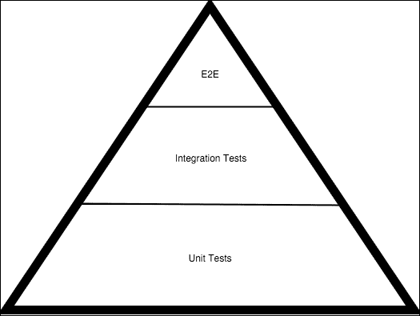

测试金字塔

前面的金字塔展示了这些问题的答案。在一个健康的测试计划中，我们应该有很多单元测试：一些集成测试和很少的端到端测试。

原因很简单，大多数问题都可以在单元测试中发现。覆盖我们代码的不同分支将验证我们应用程序中几乎每个功能案例的功能，所以在我们的测试计划中有很多这样的测试是有意义的。根据我的经验，在一个平衡的测试计划中，大约 70%的测试应该是单元测试。然而，在以微服务为导向的架构中，特别是使用 Node.js 这样的动态语言，这个数字可以很容易下降，但仍然可以有效地进行测试。其背后的原因是 Node.js 允许您快速编写集成测试，因此我们可以用集成测试替换一些单元测试。

### 提示

测试是一个有很多文档记录的复杂过程。试图打破现有的方法可能会导致一个难以维护和难以信任的测试套件。

集成测试负责捕捉集成问题，如下所示：

+   我们的代码能调用短信网关吗？

+   连接到数据库没问题吗？

+   我们的服务是否发送了 HTTP 头？

根据我的经验，再次，大约 20%的测试应该是集成测试；重点放在正向流程和一些依赖于第三方模块的负向流程上。

当涉及到 E2E 测试时，它们应该非常有限，只测试应用程序的主要流程，而不要过多地进入细节。这些细节应该已经被单元测试和集成测试捕获，易于在失败事件中修复。然而，这里有一个问题：在 Node.js 中测试微服务时，90%的情况下，集成测试和 E2E 测试可能是一回事。由于 Node.js 的动态特性，我们可以从集成的角度测试 REST API（完整的服务器运行），但实际上，我们也将测试我们的代码与其他模块集成时的行为。我们将在本章后面看到一个例子。

## 在 Node.js 中测试微服务

Node.js 是一种令人印象深刻的语言。在任何开发方面都有大量的库。无论你想在 Node.js 中实现多么奇怪的任务，总会有一个 npm 模块。

关于测试，Node.js 有一套非常强大的库，但其中两个特别受欢迎：**Mocha**和**Chai**。

它们在应用测试方面几乎是行业标准，并且得到了很好的维护和升级。

另一个有趣的库叫做**Sinon.JS**，它用于模拟、监视和存根方法。我们将在接下来的章节中回到这些概念，但这个库基本上是用来模拟与第三方的集成而不与它们交互。

### Chai

这个库是一个可以与任何其他库一起使用的 BDD/TDD 断言库，用来创建高质量的测试。

断言是一个代码语句，它要么被满足，要么抛出一个错误，停止测试并标记为失败：

```js
5 should be equal to A
```

当变量`A`包含值`5`时，前面的语句将是正确的。这是一个非常强大的工具，用于编写易于理解的测试，特别是使用 Chai 时，我们可以使用以下三种不同的接口来进行断言：

+   `should`

+   `expect`

+   `assert`

归根结底，每个条件都可以使用单个接口进行检查，但是库提供了如此丰富的接口，使得测试的冗长程度减少，从而编写干净、简单和易于维护的测试。

让我们安装这个库：

```js
npm install chai

```

这将产生以下输出：

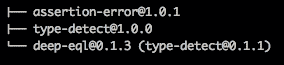

这意味着 Chai 依赖于`assertion-error`、`type-detect`和`deep-eql`。正如你所看到的，这是一个很好的迹象，表明我们可以使用简单的指令来检查复杂的语句，比如对象的深度相等或类型匹配。

像 Chai 这样的测试库不是我们应用程序的直接依赖，而是开发依赖。我们需要它们来开发应用程序，但它们不应该被发布到生产环境。这是重构我们的`package.json`并将 Chai 添加到`devDependencies`依赖标签的一个很好的理由，如下所示：

```js
{
  "name": "chai-test",
  "version": "1.0.0",
  "description": "A test script",
  "main": "chai.js",
  "dependencies": {
  },
  "devDependencies": {
    "chai": "*"
  },
  "author": "David Gonzalez",
  "license": "ISC"
}
```

这将阻止我们的软件将 Chai 等与我们应用程序操作无关的库发布到生产环境。

一旦我们安装了 Chai，我们就可以开始尝试不同的接口。

#### BDD 风格的接口

Chai 有两种 BDD 接口的风格。使用哪种取决于个人偏好，但我个人建议使用让你在任何情况下感觉更舒适的那种。

让我们从`should`接口开始。这是一种 BDD 风格的接口，使用类似自然语言的东西，我们可以创建断言来决定我们的测试是成功还是失败：

```js
myVar.should.be.a('string')
```

为了能够构建像前面那样的句子，我们需要在程序中导入`should`模块：

```js
var chai = require('chai');

chai.should();

var foo = "Hello world";
console.log(foo);

foo.should.equal('Hello world');
```

虽然看起来有点像黑魔法，但在测试我们的代码时，使用类似自然语言的东西来确保我们的代码满足某些标准是非常方便的：*foo 应该等于'Hello world'*直接翻译成我们的测试。

Chai 提供的第二种 BDD 风格接口是`expect`。虽然它与`should`非常相似，但它改变了一些语法，以便设置结果必须满足的期望。

让我们看一个例子：

```js
var expect = require('chai').expect;

var foo = "Hello world";

expect(foo).to.equal("Hello world");
```

正如您所看到的，风格非常相似：一种流畅的接口，允许我们检查测试成功的条件是否满足，但是如果条件不满足会发生什么呢？

让我们执行一个简单的 Node.js 程序，其中一个条件失败：

```js
var expect = require('chai').expect;
var animals = ['cat', 'dog', 'parrot'];
expect(animals).to.have.length(4);
```

现在，让我们执行前面的脚本，假设您已经安装了 Chai：

```js
code/node_modules/chai/lib/chai/assertion.js:107
 throw new AssertionError(msg, {
 ^
AssertionError: expected [ 'cat', 'dog', 'parrot' ] to have a length of 4 but got 3
 at Object.<anonymous> (/Users/dgonzalez/Dropbox/Microservices with Node/Writing Bundle/Chapter 6/code/chai.js:24:25)
 at Module._compile (module.js:460:26)
 at Object.Module._extensions..js (module.js:478:10)
 at Module.load (module.js:355:32)
 at Function.Module._load (module.js:310:12)
 at Function.Module.runMain (module.js:501:10)
 at startup (node.js:129:16)
 at node.js:814:3

```

将引发异常并且测试失败。如果所有条件都得到验证，就不会引发异常，测试就会成功。

正如您所看到的，我们可以使用`expect`和`should`接口进行测试的自然语言词汇有很多。完整列表可以在 Chai 文档中找到（[`chaijs.com/api/bdd/#-include-value-`](http://chaijs.com/api/bdd/#-include-value-)），但让我们在以下列表中解释一些最有趣的内容：

+   `not`：这个词用于否定链中的断言。例如，`expect("some string").to.not.equal("Other String")`将通过。

+   `deep`：这个词是所有集合中最有趣的之一。它用于深度比较对象，这是进行完全相等比较的最快方法。例如，`expect(foo).to.deep.equal({name: "David"})`将在`foo`是一个具有名为`name`且值为`"David"`的属性的 JavaScript 对象时成功。

+   `any`/`all`：这用于检查字典或对象是否包含给定列表中的任何键，因此`expect(foo).to.have.any.keys("name", "surname")`将在`foo`包含任何给定键时成功，并且`expect(foo).to.have.all.keys("name", "surname")`只有在它拥有所有键时才会成功。

+   `ok`：这是一个有趣的词。您可能知道，JavaScript 有一些陷阱，其中之一是表达式的真/假评估。使用`ok`，我们可以抽象出所有混乱，并执行类似于以下表达式列表的操作：

+   `expect('everything').to.be.ok`：`'everything'`是一个字符串，它将被评估为`ok`

+   `expect(undefined).to.not.be.ok`：在 JavaScript 世界中，未定义是不好的，因此这个断言将成功

+   `above`：这是一个非常有用的词，用来检查数组或集合是否包含超过某个阈值的元素数量，如下所示：`expect([1,2,3]).to.have.length.above(2)`

正如您所看到的，Chai 的流畅断言 API 非常丰富，使我们能够编写非常描述性的测试，易于维护。

现在，您可能会问自己，为什么有两种基本相同的接口风格？嗯，它们在功能上确实是一样的，但是，看看细节：

+   `expect`提供了链式语言中的起点

+   `should`扩展了`Object.prototype`签名，以在 JavaScript 中的每个对象上添加可链式调用的语言

从 Node.js 的角度来看，它们两者都可以，尽管`should`仪器化了`Object`的原型，这可能是对使用它有点偏执的原因。

#### 断言接口

**断言**接口与最常见的老式测试断言库相匹配。在这种风格中，我们需要明确我们要测试什么，没有表达式的流畅链接：

```js
var assert = require('chai').assert;
var myStringVar = 'Here is my string';
// No message:
assert.typeOf(myStringVar, 'string');
// With message:
assert.typeOf(myStringVar, 'string', 'myStringVar is not string type.');
// Asserting on length:
assert.lengthOf(myStringVar, 17);
```

如果您已经在任何语言中使用过任何现有的测试库，那么就没有更多的深入了。

### Mocha

Mocha 在我看来是我职业生涯中使用过的最方便的测试框架之一。它遵循**行为驱动** **开发测试**（**BDDT**）的原则，其中测试描述了应用程序的用例，并使用另一个库的断言来验证执行代码的结果。

虽然听起来有点复杂，但确保我们的代码从功能和技术角度得到覆盖确实非常方便，因为我们将构建应用程序所使用的要求镜像到自动化测试中来验证它们。

让我们从一个简单的例子开始。Mocha 与任何其他库都有所不同，因为它定义了自己的**领域特定语言**（**DSL**），需要使用 Mocha 而不是 Node.js 来执行。这是语言的扩展。

首先我们需要在系统中安装 Mocha：

```js
npm install mocha -g

```

这将产生类似于以下图像的输出：

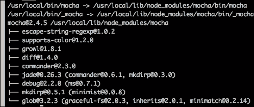

从现在开始，我们的系统中有一个新的命令：`mocha`。

下一步是使用 Mocha 编写一个测试：

```js
function rollDice() {
  return Math.floor(Math.random() * 6) + 1;
}

require('chai').should();
var expect = require('chai').expect;

describe('When a customer rolls a dice', function(){

  it('should return an integer number', function() {
    expect(rollDice()).to.be.an('number');
  });

  it('should get a number below 7', function(){
    rollDice().should.be.below(7);
  });

  it('should get a number bigger than 0', function(){
    rollDice().should.be.above(0);
  });

  it('should not be null', function() {
    expect(rollDice()).to.not.be.null;
  });

  it('should not be undefined', function() {
    expect(rollDice()).to.not.be.undefined;
  });
});
```

前面的例子很简单。一个掷骰子并返回从`1`到`6`的整数的函数。现在我们需要思考一下使用情况和要求：

+   这个数字必须是整数

+   这个整数必须小于 7

+   它必须大于 0，骰子不可能有负数

+   函数不能返回`null`

+   函数不能返回`undefined`

这几乎涵盖了在 Node.js 中掷骰子的每一个边角案例。我们正在描述我们确实想要测试的情况，以便安全地对软件进行更改而不会破坏现有的功能。

这五个用例与之前编写的测试完全吻合：

+   **我们描述情况**：*当客户掷骰子时*

+   **条件得到验证**：*它应该返回一个整数*

让我们运行之前的测试并检查结果：

```js
mocha tests.js

```

这应该返回类似于以下截图的内容：

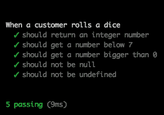

正如你所看到的，Mocha 对测试中发生的情况进行了全面的报告。在这种情况下，所有测试都通过了，所以我们不需要担心问题。

让我们强制一些测试失败：

```js
function rollDice() {
  return -1 * Math.floor(Math.random() * 6) + 1;
}

require('chai').should();
var expect = require('chai').expect;

describe('When a customer rolls a dice', function(){

  it('should return an integer number', function() {
    expect(rollDice()).to.be.an('number');
  });

  it('should get a number below 7', function(){
    rollDice().should.be.below(7);
  });

  it('should get a number bigger than 0', function(){
    rollDice().should.be.above(0);
  });

  it('should not be null', function() {
    expect(rollDice()).to.not.be.null;
  });

  it('should not be undefined', function() {
    expect(rollDice()).to.not.be.undefined;
  });
});
```

不小心，有人把一个代码片段插入了`rollDice()`函数中，这使得函数返回一个不符合一些要求的数字。让我们再次运行 Mocha，如下图所示：

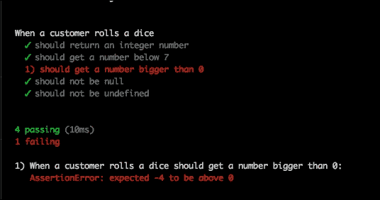

现在，我们可以看到报告返回了一个错误：该方法返回了`-4`，而它应该始终返回一个大于`0`的数字。

此类测试在 Node.js 中使用 Mocha 和 Chai 的一个好处是时间。测试运行非常快，因此很容易得到反馈，如果我们有破坏的东西。前面的套件运行在`10ms`内。

### Sinon.JS - 一个模拟框架

前两章已经集中在对函数返回值的断言条件上，但是当我们的函数没有返回任何值时会发生什么呢？唯一正确的衡量标准是检查方法是否被调用。另外，如果我们的模块之一正在调用第三方网络服务，但我们不希望我们的测试调用远程服务器会怎么样呢？

为了回答这些问题，我们有两个概念工具，称为模拟和间谍，Node.js 有一个完美的库来实现它们：Sinon.JS。

首先安装它，如下所示：

```js
npm install sinon

```

前面的命令应该产生以下输出：

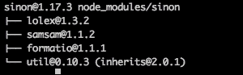

现在让我们通过一个例子来解释它是如何工作的：

```js
function calculateHypotenuse(x, y, callback) {
  callback(null, Math.sqrt(x*x + y*x));
}

calculateHypotenuse(3, 3, function(err, result){
  console.log(result);
});
```

这个简单的脚本计算三角形的斜边，给定三角形的另外两边的长度。我们想要进行的测试之一是回调是否以正确的参数列表执行。我们需要完成这样的任务的是 Sinon.JS 称之为间谍：

```js
var sinon = require('sinon');

require('chai').should();

function calculateHypotenuse(x, y, callback) {
  callback(null, Math.sqrt(x*x + y*x));
}

describe("When the user calculates the hypotenuse", function(){
  it("should execute the callback passed as argument", function() {
    var callback = sinon.spy();
    calculateHypotenuse(3, 3, callback);
    callback.called.should.be.true;
  });
});
```

我们再次使用 Mocha 来运行脚本，并使用 Chai 通过`should`接口验证测试结果，如下图所示：

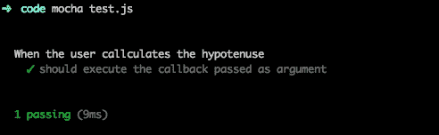

前面脚本中的重要行是：

```js
var callback = sinon.spy();
```

在这里，我们正在创建间谍并将其作为回调注入到函数中。Sinon.JS 创建的这个函数实际上不仅是一个函数，而是一个带有一些有趣信息点的完整对象。Sinon.JS 利用 JavaScript 的动态特性来做到这一点。您实际上可以通过将其转储到控制台中的`console.log()`中来查看此对象中的内容。

Sinon.JS 中另一个非常强大的工具是存根。**存根**与模拟非常相似（在 JavaScript 中在实际效果上是相同的），并允许我们伪造函数以模拟所需的返回：

```js
var sinon = require('sinon');
var expect = require('chai').expect;

function rollDice() {
  return -1 * Math.floor(Math.random() * 6) + 1;
}
describe("When rollDice gets called", function() {
  it("Math#random should be called with no arguments", function() {
    sinon.stub(Math, "random");
    rollDice();
    console.log(Math.random.calledWith());
  });
})
```

在这种情况下，我们对`Math#random`方法进行了存根，这导致该方法成为某种过载的空函数（它不发出 get 调用），并记录了有关其调用方式或方式的统计信息。

在上述代码中有一个陷阱：我们从未将`random()`方法恢复，这是非常危险的。它具有巨大的副作用，因为其他测试将把`Math#random`方法视为存根，而不是原始方法，这可能导致我们根据无效信息编写测试。

为了防止这种情况发生，我们需要使用 Mocha 的`before()`和`after()`方法：

```js
var sinon = require('sinon');
var expect = require('chai').expect;

var sinon = require('sinon');
var expect = require('chai').expect;

function rollDice() {
  return -1 * Math.floor(Math.random() * 6) + 1;
}
describe("When rollDice gets called", function() {

  it("Math#random should be called with no arguments", function() {
    sinon.stub(Math, "random");
    rollDice();
    console.log(Math.random.calledWith());
  });
after(function(){
 Math.random.restore();
 });
});
```

如果您注意到突出显示的代码，我们正在告诉 Sinon.JS 恢复在一个`it`块内部存根的原始方法，以便如果另一个`describe`块使用`http.get`，我们将不会看到存根，而是原始方法。

### 提示

`before()`和`after()`方法非常有助于为测试设置和清理上下文。但是，您需要小心它们执行的范围，因为它可能导致测试相互影响。

Mocha 有几种 before 和 after 的变体：

+   `before(callback)`: 这在当前范围之前执行（在上述代码中的`describe`块的开头）

+   `after(callback)`: 这在当前范围之后执行（在上述代码中的`describe`块的末尾）

+   `beforeEach(callback)`: 这在当前范围的每个元素开始时执行（在上述示例中的每个`it`之前）

+   `afterEach(callback)`: 这在当前范围的每个元素结束时执行（在上述示例中的每个`it`之后）

Sinon.JS 中的另一个有趣功能是时间操纵。一些测试需要在事件发生后的一定时间内执行周期性任务或响应。使用 Sinon.JS，我们可以将时间作为测试的参数之一来规定时间：

```js
var sinon = require('sinon');
var expect = require('chai').expect

function areWeThereYet(callback) {

  setTimeout(function() {
    callback.apply(this);
  }, 10);

}

var clock;

before(function(){
  clock = sinon.useFakeTimers();
});

it("callback gets called after 10ms", function () {
  var callback = sinon.spy();
  var throttled = areWeThereYet(callback);

  areWeThereYet(callback);

  clock.tick(9);
  expect(callback.notCalled).to.be.true;

  clock.tick(1);
  expect(callback.notCalled).to.be.false;
});

after(function(){
  clock.restore();
});
```

正如你所看到的，我们现在可以在我们的测试中控制时间。

### 测试一个真实的微服务

现在，是时候测试一个真实的微服务，以便对整个测试套件有一个总体了解。

我们的微服务将使用 Express，并将过滤输入文本以删除搜索引擎称为**停用词**的内容：*少于三个字符的单词和被禁止的单词*。

让我们看看代码：

```js
var _ = require('lodash');
var express = require('express');

var bannedWords = ["kitten", "puppy", "parrot"];

function removeStopWords (text, callback) {
  var words = text.split(' ');
  var validWords = [];
  _(words).forEach(function(word, index) {
    var addWord = true;

    if (word.length < 3) {
      addWord = false;
    }

    if(addWord && bannedWords.indexOf(word) > -1) {
      addWord = false;
    }

    if (addWord) {
      validWords.push(word); 
    }

    // Last iteration:
    if (index == (words.length - 1)) {
      callback(null, validWords.join(" "));
    }
  });
}
var app = express();

app.get('/filter', function(req, res) {
  removeStopWords(req.query.text, function(err, response){
    res.send(response);
  });
});

app.listen(3000, function() {
  console.log("app started in port 3000");
});
```

正如你所看到的，这项服务非常小，因此它是解释如何编写单元测试、集成测试和端到端测试的完美示例。在这种情况下，正如我们之前所说，端到端和集成测试将与通过 REST API 测试服务等效，这将等同于从端到端的角度测试系统，以及我们的组件如何集成到系统中。鉴于此，如果我们要添加用户界面，我们将不得不将集成测试与端到端测试分开，以确保质量。

#### TDD – 测试驱动开发

我们的服务已经完成并且正在运行。但是，现在我们想对其进行单元测试，但我们发现了一些问题：

+   我们要进行单元测试的函数在主`.js`文件之外是不可见的

+   服务器代码与功能代码紧密耦合，内聚性不好

在这里，TDD 来拯救；我们应该始终问自己“在编写软件时，我要如何测试这个函数？”这并不意味着我们应该修改我们的软件以进行特定的测试，但如果在测试程序的某个部分时出现问题，很可能应该查看内聚性和耦合性，因为这是问题的一个很好的指示。让我们看看下面的文件：

```js
var _ = require('lodash');
var express = require('express');

module.exports = function(options) {
  bannedWords = [];
  if (typeof options !== 'undefined') {
    console.log(options);
    bannedWords = options.bannedWords || [];
  }

  return function bannedWords(text, callback) {
    var words = text.split(' ');
    var validWords = [];
    _(words).forEach(function(word, index) {
      var addWord = true;

      if (word.length < 3) {
        addWord = false;
      }

      if(addWord && bannedWords.indexOf(word) > -1) {
        addWord = false;
      }

      if (addWord) {
        validWords.push(word); 
      }

      // Last iteration:
      if (index == (words.length - 1)) {
        callback(null, validWords.join(" "));
      }
    });
  }
}
```

这个文件是一个模块，在我看来，它是高度可重用的，并且具有良好的内聚性：

+   我们可以在任何地方导入它（甚至在浏览器中）

+   禁止的单词可以在创建模块时注入（非常适用于测试）

+   它没有与应用程序代码纠缠在一起

以这种方式编写代码，我们的应用程序模块将类似于以下内容：

```js
var _ = require('lodash');
var express = require('express');

var removeStopWords = require('./remove-stop-words')({bannedWords: ["kitten", "puppy", "parrot"]});

var app = express();

app.get('filter', function(req, res) {
  res.send(removeStopWords(req.query.text));
});

app.listen(3000, function() {
  console.log("app started in port 3000");
});
```

正如你所看到的，我们已经清楚地将业务单元（捕获业务逻辑的函数）与操作单元（服务器的设置）分开。

正如我之前提到的，我不是先写测试再写代码的铁杆粉丝，但测试应该（在我看来）与代码一起编写，但始终牢记前面提到的问题。

公司似乎在推动采用 TDD 方法，但这可能导致显着的低效，特别是如果业务需求不清晰（通常情况下是 90%），并且我们在开发过程中面临变化。

#### 单元测试

现在我们的代码形式更好了，我们将对函数进行单元测试。我们将使用 Mocha 和 Chai 来完成这样的任务：

```js
var removeStopWords = require('./remove-stop-words')({bannedWords: ["kitten", "parrot"]});

var chai = require('chai');
var assert = chai.assert;
chai.should();
var expect = chai.expect;

describe('When executing "removeStopWords"', function() {

  it('should remove words with less than 3 chars of length', function() {
    removeStopWords('my small list of words', function(err, response) {
      expect(response).to.equal("small list words");
    });
  });

  it('should remove extra white spaces', function() {
    removeStopWords('my small       list of words', function(err, response) {
      expect(response).to.equal("small list words");
    });
  });

  it('should remove banned words', function() {
    removeStopWords('My kitten is sleeping', function(err, response) {
      expect(response).to.equal("sleeping");
    });
  });

  it('should not fail with null as input', function() {
    removeStopWords(null, function(err, response) {
      expect(response).to.equal("small list words");
    });
  });

  it('should fail if the input is not a string', function() {
    try {
      removeStopWords(5, function(err, response) {});
      assert.fail();
    }
    catch(err) {
    }
  });
});
```

正如你所看到的，我们已经覆盖了几乎每一个在我们应用程序中的情况和分支，但我们的代码覆盖率如何？

到目前为止，我们已经提到过它，但从未实际测量过。我们将使用一个名为**Istanbul**的工具来测量测试覆盖率：

```js
npm install -g istanbul

```

这应该安装 Istanbul。现在我们需要运行覆盖率报告：

```js
istanbul cover _mocha my-tests.js

```

这将产生一个类似于下图所示的输出：

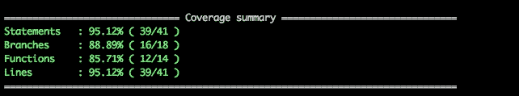

这也将生成一个 HTML 覆盖率报告，指出哪些行、函数、分支和语句没有被覆盖，如下面的截图所示：

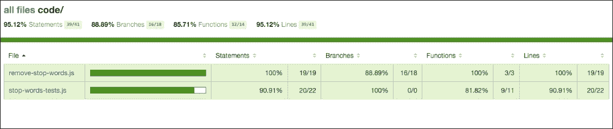

正如你所看到的，我们看起来相当不错。我们的代码（而不是测试）实际上覆盖得很好，特别是如果我们查看我们代码文件的详细报告，如下图所示：

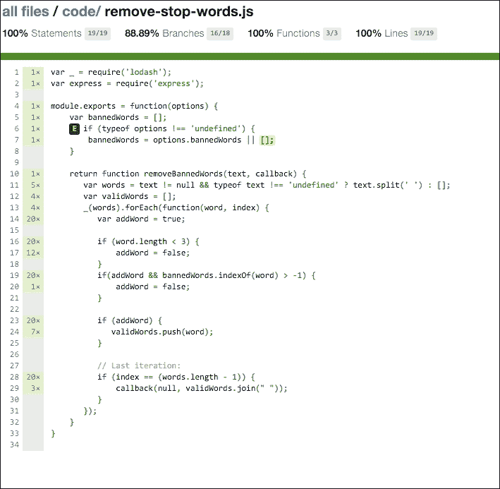

我们可以看到只有一个分支（第 7 行的`or`运算符）没有被覆盖，第 6 行的`if`运算符从未转到`else`运算符。

我们还获得了关于一行代码执行次数的信息：它显示在行号旁边的垂直条中。这些信息对于发现我们应用程序的热点区域非常有用，优化将最有益处。

关于正确的覆盖率水平，在这个例子中，很容易达到 90%以上，但不幸的是，在生产系统中并非如此容易：

+   代码更加复杂

+   时间总是一个限制

+   测试可能不被视为生产时间

然而，在使用动态语言时，需要谨慎。在 Java 或 C#中，调用不存在的函数会导致编译时错误；而在 JavaScript 中，会导致运行时错误。唯一的真正障碍是测试（手动或自动化），因此最好的做法是确保至少每一行都执行一次。一般来说，代码覆盖率超过 75%对于大多数情况应该足够了。

#### 端到端测试

为了对我们的应用程序进行端到端测试，我们需要一个运行它的服务器。通常，端到端测试是针对受控环境（如 QA 盒子或预生产机器）执行的，以验证我们即将部署的软件是否表现如预期。

在这种情况下，我们的应用程序是一个 API，因此我们将创建端到端测试，同时也将用作集成测试。

然而，在一个完整的应用程序中，我们可能希望在集成和端到端测试之间有明确的分离，并使用类似 Selenium 的工具来从 UI 的角度测试我们的应用程序。

Selenium 是一个允许我们的代码向浏览器发送指令的框架，如下所示：

+   点击具有`button1`ID 的按钮

+   悬停在具有 CSS 类`highlighted`的`div`元素上

通过这种方式，我们可以确保我们的应用程序流程按预期工作，端到端，我们的下一个发布版本不会破坏应用程序的关键流程。

让我们专注于我们微服务的端到端测试。我们一直在使用 Chai 和 Mocha 及其相应的断言接口来对我们的软件进行单元测试，并使用 Sinon.JS 来模拟服务函数和其他元素，以避免调用传播到第三方网络服务或从一个方法获得受控响应。

现在，在我们的端到端测试计划中，我们实际上希望发出调用到我们的服务并获取响应以验证结果。

我们需要做的第一件事是在某个地方运行我们的微服务。我们将仅仅使用我们的本地机器出于方便，但我们可以在持续开发环境中针对 QA 机器执行这些测试。

所以，让我们启动服务器：

```js
node stop-words.js

```

我将我的脚本称为`stop-words.js`以方便起见。一旦服务器运行，我们就准备开始测试。在某些情况下，我们可能希望我们的测试启动和停止服务器，以便一切都是自包含的。让我们看一个关于如何做到这一点的小例子：

```js
var express = require('express');

var myServer = express();

var chai = require('chai');

myServer.get('/endpoint', function(req, res){
  res.send('endpoint reached');
});

var serverHandler;

before(function(){
  serverHandler = myServer.listen(3000);
});

describe("When executing 'GET' into /endpoint", function(){
  it("should return 'endpoint reached'", function(){
    // Your test logic here. http://localhost:3000 is your server.
  });
});

after(function(){
  serverHandler.close();
});
```

正如你所看到的，Express 提供了一个处理程序来以编程方式操作服务器，因此只需简单地使用`before()`和`after()`函数来实现。

在我们的示例中，我们将假设服务器正在运行。为了发出请求，我们将使用一个名为`request`的库来向服务器发出调用。

安装它的方式与往常一样，执行`npm install request`。一旦完成，我们就可以利用这个令人惊叹的库：

```js
var chai = require('chai');
var chaiHttp = require('chai-http');
var expect = chai.expect;
chai.use(chaiHttp);

describe("when we issue a 'GET' to /filter with text='aaaa bbbb cccc'", function(){
  it("should return HTTP 200", function(done) {
    chai.request('http://localhost:3000')
      .get('/filter')
      .query({text: 'aa bb ccccc'}).end(function(req, res){
        expect(res.status).to.equal(200);
        done();
      });
  });
});

describe("when we issue a 'GET' to /filter with text='aa bb ccccc'", function(){
  it("should return 'ccccc'", function(done) {
    chai.request('http://localhost:3000')
      .get('/filter')
      .query({text: 'aa bb ccccc'}).end(function(req, res){
        expect(res.text).to.equal('ccccc');
        done();
      });
  });
});

describe("when we issue a 'GET' to /filter with text='aa bb cc'", function(){
  it("should return ''", function(done) {
    chai.request('http://localhost:3000')
      .get('/filter')
      .query({text: 'aa bb cc'}).end(function(req, res){
        expect(res.text).to.equal('');
        done();
      });
  });
});
```

通过之前的简单测试，我们设法测试了我们的服务器，以确保应用程序的每个移动部分都已执行。

这里有一个我们以前没有的特殊之处：

```js
 it("should return 'ccccc'", function(done) {
    chai.request('http://localhost:3000')
      .get('/filter')
      .query({text: 'aa bb ccccc'}).end(function(req, res){
        expect(res.text).to.equal('ccccc');
 done();
      });
  });
```

如果你看一下突出显示的代码，你会看到一个叫做`done`的新回调。这个回调有一个任务：防止测试在调用之前结束，以便 HTTP 请求有时间执行并返回适当的值。记住，Node.js 是异步的，没有线程被阻塞直到一个操作完成。

除此之外，我们正在使用`chai-http`引入的新 DSL 来构建 get 请求。

这种语言允许我们构建大量的组合，例如考虑以下内容：

```js
chai.request('http://mydomain.com')
  .post('/myform')
  .field('_method', 'put')
  .field('username', 'dgonzalez')
  .field('password', '123456').end(...)
```

在前面的请求中，我们正在提交一个看起来像登录的表单，因此在`end()`函数中，我们可以断言来自服务器的返回。

有无数种组合可以使用`chai-http`来测试我们的 API。

### 手动测试-必要的恶

无论我们对自动化测试付出多少努力，总会有一些手动测试被执行。

有时，我们需要在开发 API 时这样做，因为我们想要看到从客户端到服务器的消息传递，但有时我们只是想用预先制作的请求命中我们的端点，以使软件按我们的预期执行。

在第一种情况下，我们将利用 Node.js 及其动态特性来构建一个代理，该代理将嗅探所有请求并将它们记录到终端，以便我们可以调试发生了什么。这种技术可以用来利用两个微服务之间的通信，并查看发生了什么，而不会中断流程。

在第二种情况下，我们将使用名为 Postman 的软件以受控方式向我们的服务器发出请求。

#### 构建一个用于调试我们的微服务的代理

我第一次接触 Node.js 正是因为这个问题：两台服务器彼此发送消息，导致行为异常，没有明显的原因。

这是一个非常常见的问题，有许多已经运行的解决方案（基本上是中间人代理），但我们将演示 Node.js 有多强大：

```js
var http = require('http');
var httpProxy = require('http-proxy');
var proxy = httpProxy.createProxyServer({});

http.createServer(function(req, res) {
  console.log(req.rawHeaders);
  proxy.web(req, res, { target: 'http://localhost:3000' });
}).listen(4000);
```

如果你还记得上一节，我们的`stop-words.js`程序是在端口`3000`上运行的。我们用这段代码做的是使用`http-proxy`创建一个代理，将在端口`4000`上发出的所有请求都隧道到端口`3000`，然后将头信息记录到控制台中。

如果我们在项目的根目录中使用`npm install`命令安装了所有依赖项后运行程序，我们可以看到代理如何有效地记录请求并将其隧道到目标主机：

```js
curl http://localhost:4000/filter?text=aaa

```

这将产生以下输出：

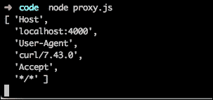

这个例子非常简单，但这个小代理可以在我们的微服务之间的任何地方部署，并为我们提供有关网络情况的非常有价值的信息。

#### Postman

在互联网上可以找到的所有用于测试 API 的软件中，Postman 是我最喜欢的。它起初是谷歌 Chrome 的一个扩展，但如今已经成为一个基于 Chrome 运行时构建的独立应用程序。

它可以在 Chrome 网络商店中找到，而且是免费的（所以你不需要付费），尽管它有一个团队版本，具有更高级功能，是付费的。

界面非常简洁和简单，如下面的屏幕截图所示：

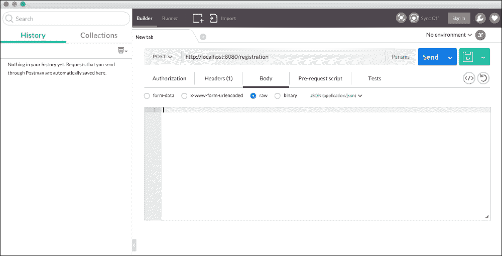

在左侧，我们可以看到请求的**历史记录**，以及请求的**集合**，这对于我们在长期项目上工作并且需要构建一些复杂请求时非常方便。

我们将再次使用我们的`stop-words.js`微服务来展示 Postman 有多强大。

因此，首要任务是确保我们的微服务正在运行。一旦它运行起来，让我们从 Postman 发出一个请求，如下面的屏幕截图所示：

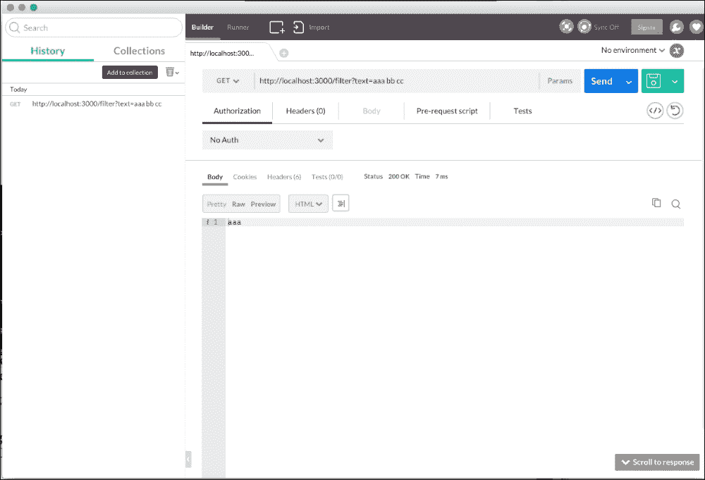

就这样，我们已经发出了对我们的服务的请求（使用**GET**动词），它已经回复了过滤后的文本：非常简单而有效。

现在想象一下，我们想要在 Node.js 上执行该调用。Postman 带有一个非常有趣的功能，即生成我们从界面发出的请求的代码。如果你点击窗口右侧保存按钮下面的图标，出现的屏幕将会做魔术：

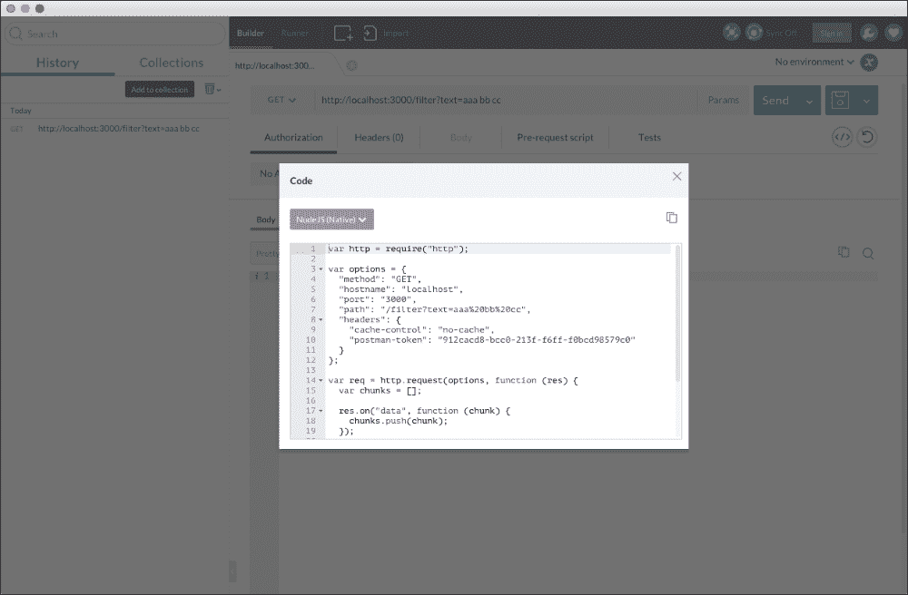

让我们来看一下生成的代码：

```js
var http = require("http");

var options = {
  "method": "GET",
  "hostname": "localhost",
  "port": "3000",
  "path": "/filter?text=aaa%20bb%20cc",
  "headers": {
    "cache-control": "no-cache",
    "postman-token": "912cacd8-bcc0-213f-f6ff-f0bcd98579c0"
  }
};

var req = http.request(options, function (res) {
  var chunks = [];

  res.on("data", function (chunk) {
    chunks.push(chunk);
  });

  res.on("end", function () {
    var body = Buffer.concat(chunks);
    console.log(body.toString());
  });
});

req.end();
```

这是一个非常容易理解的代码，特别是如果你熟悉 HTTP 库。

使用 Postman，我们还可以发送 cookie、头部和表单到服务器，以模拟应用程序通过发送身份验证令牌或 cookie 来实现的身份验证。

让我们将我们在前一节中创建的代理重定向到代理，如下面的屏幕截图所示：


如果代理和`stop-words.js`微服务正在运行，你应该在代理中看到类似以下输出：

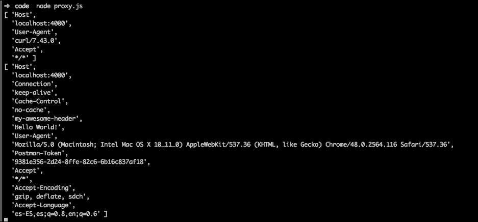

我们用 Postman 发送的头部**my-awesome-header**将显示在原始头部列表中。

# 记录微服务

在本节中，我们将学习如何使用 Swagger 来记录 API。Swagger 是一个遵循**Open API 标准**的 API 管理器，因此它是所有 API 创建者的*共同语言*。我们将讨论如何编写定义以及为什么就如何描述资源达成一致意见如此重要。

## 使用 Swagger 记录 API

文档一直是一个问题。无论你多努力，它最终都会过时。幸运的是，在过去几年中，人们一直在努力为 REST API 制作高质量的文档。

API 管理者在其中发挥了关键作用，Swagger 特别是一个有趣的平台。Swagger 不仅仅是一个文档模块，它以一种使您能够全面了解您的工作的方式来管理您的 API。

让我们开始安装它：

```js
npm install -g swagger

```

这将在系统范围内安装 Swagger，因此它将成为我们系统中的另一个命令。现在，我们需要使用它创建一个项目：

```js
swagger project create my-project

```

这个命令将允许您选择不同的 Web 框架。我们将选择 Express，因为这是我们已经在使用的框架。上述命令的输出如下截图所示：

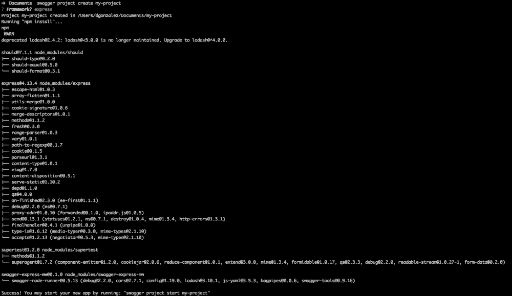

这个截图显示了如何使用 Swagger 启动项目

现在我们可以找到一个名为`my-project`的新文件夹，看起来像以下图像：

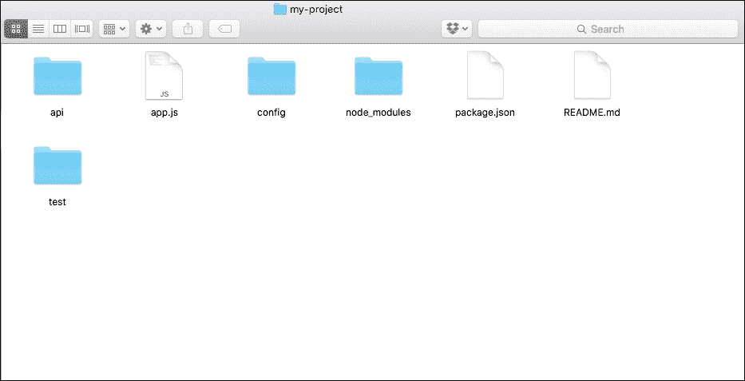

结构是不言自明的，这是一个 Node.js 应用程序的常见布局：

+   `api`：这里是我们的 API 代码

+   `config`：所有的配置都在这里

+   `node_modules`：这是一个包含运行我们应用程序所需的所有依赖项的文件夹

+   `test`：这是 Swagger 生成一些虚拟测试的地方，我们也可以添加自己的测试

Swagger 具有一个令人印象深刻的功能：一个嵌入式编辑器，允许您对 API 的端点进行建模。为了运行它，从生成的文件夹中执行以下命令：

```js
Swagger project edit

```

它将在默认浏览器中打开 Swagger 编辑器，窗口类似于以下图像：

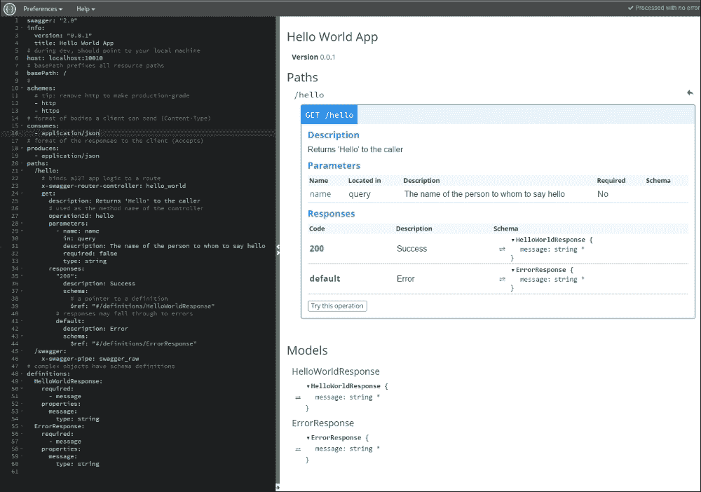

Swagger 使用**另一种标记语言**（**YAML**）。这是一种与**JSON**非常相似但具有不同语法的语言。

在这个文档中，我们可以自定义许多内容，比如路径（我们应用程序中的路由）。让我们看看 Swagger 生成的路径：

```js
/hello:
  # binds a127 app logic to a route
  x-swagger-router-controller: hello_world
  get:
    description: Returns 'Hello' to the caller
    # used as the method name of the controller
    operationId: hello
    parameters:
      - name: name
        in: query
        description: The name of the person to whom to say hello
        required: false
        type: string
    responses:
      "200":
        description: Success
        schema:
          # a pointer to a definition
          $ref: "#/definitions/HelloWorldResponse"
      # responses may fall through to errors
      default:
        description: Error
        schema:
          $ref: "#/definitions/ErrorResponse"
```

定义是自我记录的。基本上，我们将以声明方式配置我们的端点使用的参数。此端点将将传入的操作映射到`hello_world`控制器，具体到`hello`方法，该方法由`id`操作定义。让我们看看 Swagger 在这个控制器中为我们生成了什么：

```js
'use strict';

var util = require('util');

module.exports = {
  hello: hello
};

function hello(req, res) {
  var name = req.swagger.params.name.value || 'stranger';
  var hello = util.format('Hello, %s!', name);
  res.json(hello);
}
```

这段代码可以在项目的`api/controllers`文件夹中找到。正如您所看到的，它是一个作为模块打包的标准 Express 控制器（高内聚）。唯一奇怪的一行是`hello`函数中的第一行，我们从 Swagger 中提取参数。一旦我们运行项目，我们将回到这一点。

端点的第二部分是响应。正如我们所看到的，我们引用了两个定义：`HelloWorldResponse`用于`http code 200`，`ErrorResponse`用于其他代码。这些对象在以下代码中定义：

```js
definitions:
  HelloWorldResponse:
    required:
      - message
    properties:
      message:
        type: string
  ErrorResponse:
    required:
      - message
    properties:
      message:
        type: string
```

这是非常有趣的一点，尽管我们使用的是动态语言，但合同是由 Swagger 定义的，因此我们有一个与语言无关的定义，可以被许多不同的技术所消费，尊重我们在第一章和第二章中谈到的技术异构性原则，*微服务架构*和*Node.js 中的微服务-Seneca 和 PM2 替代方案*。

在解释定义如何工作之后，现在是时候启动服务器了：

```js
swagger project start

```

这应该产生一个与以下代码非常相似的输出：

```js
Starting: C:\my-project\app.js...
 project started here: http://localhost:10010/
 project will restart on changes.
 to restart at any time, enter `rs`
try this:
curl http://127.0.0.1:10010/hello?name=Scott

```

现在，如果我们按照输出的说明执行 curl 命令，我们将得到以下输出：

```js
curl http://127.0.0.1:10010/hello?name=David
"Hello David!"

```

Swagger 将`name`查询参数绑定到 YAML 定义中指定的 Swagger 参数。这可能听起来不好，因为我们将软件与 Swagger 耦合在一起，但它给你带来了巨大的好处：Swagger 允许你通过编辑器测试端点。让我们看看它是如何工作的。

在编辑器的右侧，你可以看到一个带有**尝试此操作**标签的按钮，如下截图所示：

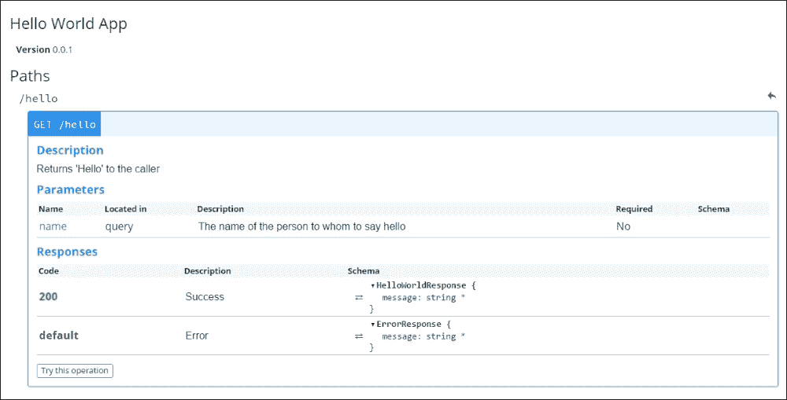

一旦你点击它，它将呈现一个表单，允许你测试端点，如下截图所示：

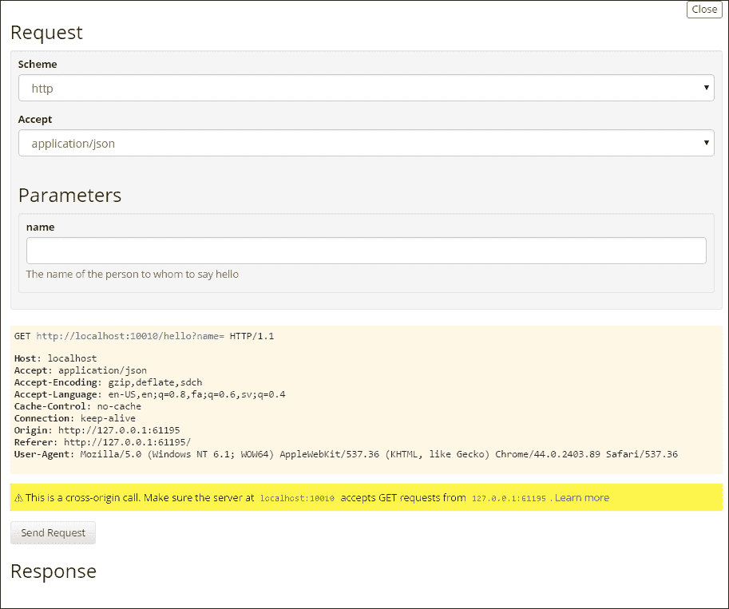

这个表单上有一个关于跨域请求的警告消息。在我们本地开发时，我们不需要担心它；然而，当使用 Swagger Editor 测试其他主机时，我们可能会遇到问题。

### 注意

欲了解更多信息，请访问以下网址：

[`en.wikipedia.org/wiki/Cross-origin_resource_sharing`](https://en.wikipedia.org/wiki/Cross-origin_resource_sharing)

为**name**参数输入一个值，然后点击**发送请求**，如下图所示：

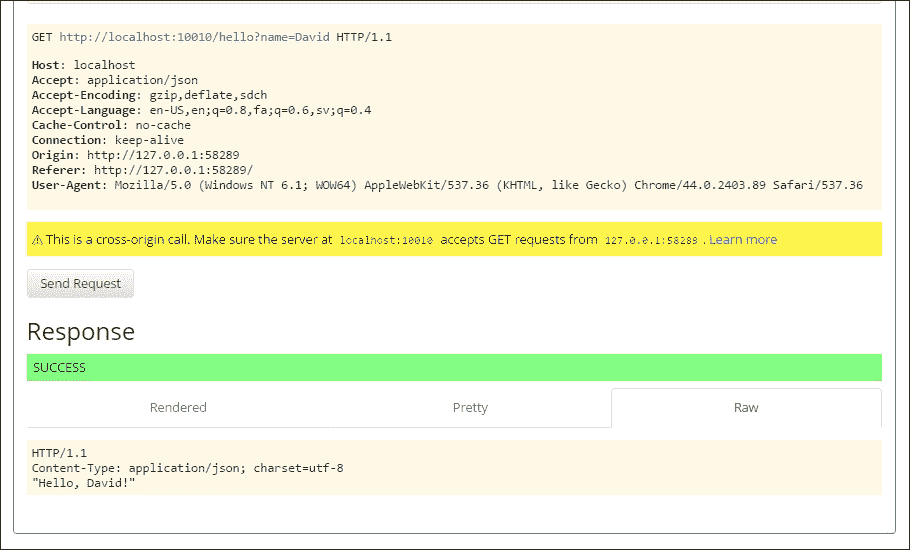

这是使用 Swagger Editor 测试端点的响应示例

请注意，为了使此测试工作，我们的应用服务器必须处于运行状态。

## 从 Swagger 定义生成项目

到目前为止，我们一直在使用 Swagger 和生成的项目进行操作，但现在我们将从`swagger.yaml`文件中生成项目。我们将使用已生成的项目作为起点，但我们将添加一个新的端点：

```js
swagger: "2.0"
info:
  version: "0.0.1"
  title: Stop Words Filtering App
host: localhost:8000
basePath: /
schemes:
  - http
  - https
consumes:
  - application/json
produces:
  - application/json
paths:
  /stop-words:
    x-swagger-router-controller: stop_words
    get:
      description: Removes the stop words from an arbitrary input text.
      operationId: stopwords
      parameters:
        - name: text
          in: query
          description: The text to be sanitized
          required: false
          type: string
      responses:
        "200":
          description: Success
          schema:
            $ref: "#/definitions/StopWordsResponse"
  /swagger:
    x-swagger-pipe: swagger_raw
definitions:
  StopWordsResponse:
    required:
      - message
    properties:
      message:
        type: string
```

这个端点可能对你来说非常熟悉，因为在本章的早些时候我们对其进行了单元测试。你现在可能已经知道，Swagger Editor 非常酷：它会在你输入时提供关于 YAML 文件中正在进行的操作的反馈，同时保存更改。

下一步是从[`github.com/swagger-api/swagger-codegen`](https://github.com/swagger-api/swagger-codegen)下载 Swagger 代码生成器。这是一个 Java 项目，所以我们需要 Java SDK 和 Maven 来构建它，如下所示：

```js
mvn package

```

Codegen 是一个工具，允许我们从 Swagger YAML 中读取 API 定义，并在我们选择的语言中构建项目的基本结构，本例中是 Node.js。

在项目的根目录中执行上述命令应该构建所有子模块。现在，只需在`swagger-codegen`文件夹的根目录中执行以下命令即可：

```js
java -jar modules/swagger-codegen-cli/target/swagger-codegen-cli.jar generate -i my-project.yaml -l nodejs -o my-project

```

Swagger 代码生成器支持多种语言。在这里，关键是当用于微服务时，我们可以定义接口，然后使用最合适的技术来构建我们的服务。

如果你进入`my-project`文件夹，你应该会在那里找到项目的完整结构，准备开始编码。

# 总结

在本章中，你学会了如何测试和记录微服务。这通常是软件开发中被遗忘的活动，因为要交付新功能的压力，但在我看来，这是一个冒险的决定。我们必须在单元测试、集成测试和端到端测试之间找到平衡。总的来说，我们将始终努力找到适当的比例。

你还了解了手动测试以及有效测试我们的软件的工具（手动测试总是有一部分组成）。

另一个有趣的点是文档和 API 管理。在这种情况下，我们了解了 Swagger，这可能是最流行的 API 管理器，导致了 Open API 标准的创建。

如果你想更深入地了解 API 世界（构建实用和高效的 API 需要学习的东西很多），你可能应该浏览[`apigee.com`](http://apigee.com)。Apigee 是一家专门构建 API 并为开发人员和企业提供工具的公司，可以帮助你构建更好的 API。
