# 第七章：监控微服务

监控服务器总是一个有争议的话题。它通常属于系统管理范畴，软件工程师甚至不会接触它，但我们正在失去监控的一个巨大好处：*快速对故障做出反应的能力*。通过非常密切地监控我们的系统，我们几乎可以立即意识到问题，以便采取纠正问题的行动，甚至可能使我们免受影响客户的影响。除了监控，还有性能的概念。通过了解我们的系统在负载期间的行为，我们将能够预测扩展系统的必要性。在本章中，我们将讨论如何监控服务器，特别是微服务，以维护我们系统的稳定性。

在本章中，我们将涵盖以下主题：

+   监控服务

+   使用 PM2 和 Keymetrics 进行监控

+   监控指标

+   Simian Army - Spotify 的主动监控

+   吞吐量和性能下降

# 监控服务

在监控微服务时，我们对几种不同类型的指标感兴趣。第一大组指标是硬件资源，如下所述：

+   **内存指标**：这表明系统中还剩多少内存或被应用程序占用了多少内存

+   **CPU 利用率**：顾名思义，这表明我们在某个时间点上使用了多少 CPU

+   **磁盘利用率**：这表明物理硬盘的 I/O 压力

第二大组是应用程序指标，如下所示：

+   每个时间单位的错误次数

+   每个时间单位的调用次数

+   响应时间

尽管这两个组是相互关联的，硬件出现问题将影响应用程序性能（反之亦然），了解它们都是必须的。

硬件指标很容易查询，如果我们的服务器是一台 Linux 机器。在 Linux 上，所有硬件资源的魔力都发生在`/proc`文件夹中。这个文件夹由系统的内核维护，包含有关系统行为的文件。

软件指标更难收集，我们将使用来自 PM2 创建者的**Keymetrics**来监控我们的 Node.js 应用程序。

## 使用 PM2 和 Keymetrics 进行监控

正如我们之前所看到的，PM2 是一个非常强大的工具，可以运行 Node 应用程序，但它也非常擅长监控生产服务器中的独立应用程序。然而，根据您的业务情况，要想访问生产环境并不总是容易。

PM2 的创建者通过创建 Keymetrics 来解决了这个问题。Keymetrics 是一个**软件即服务**（**SaaS**）组件，允许 PM2 将监控数据发送到其网站，如下图所示（在[`keymetrics.io/`](https://keymetrics.io/)找到）：

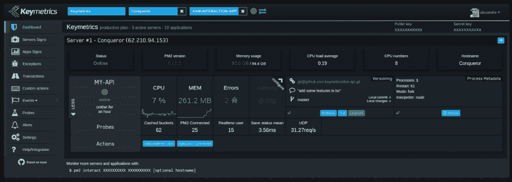

尽管 Keymetrics 不是免费的，但它提供了一个免费的层次来演示它的工作原理。我们将在本章中使用它。

我们需要做的第一件事是注册一个用户。一旦我们获得了账户访问权限，我们应该看到类似以下屏幕的内容：

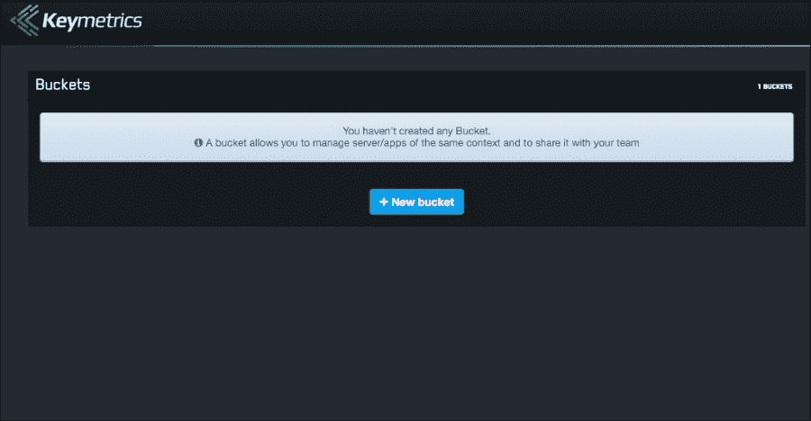

这个屏幕要求我们创建一个 bucket。Keymetrics 使用 bucket 概念来定义上下文。例如，如果我们的组织有不同的领域（支付、客户服务等），每个领域都有不同的服务器，我们可以在一个 bucket 中监控所有服务器。在一个 bucket 中可以拥有多少服务器都没有限制。甚至可以将整个组织放在同一个 bucket 中，这样一切都很容易访问。

让我们创建一个名为`监控测试`的 bucket，如下图所示：

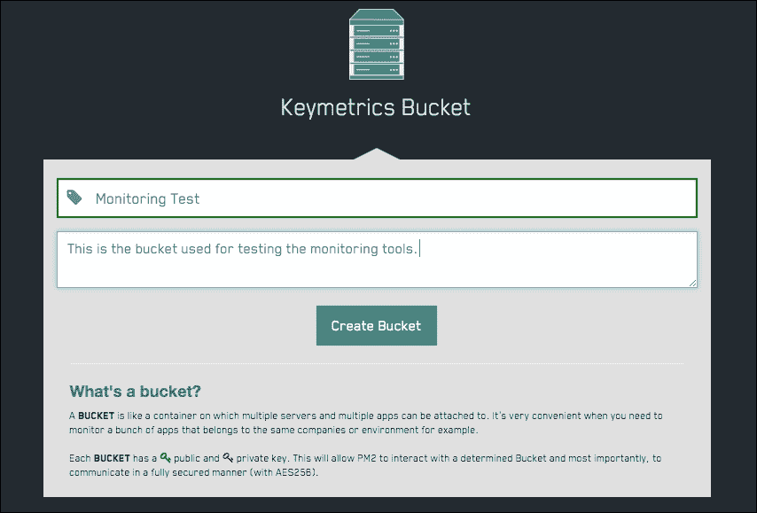

很简单，一旦我们点击**创建 Bucket**，Keymetrics 将显示一个屏幕，其中包含开始监控我们的应用程序所需的信息，如下图所示：

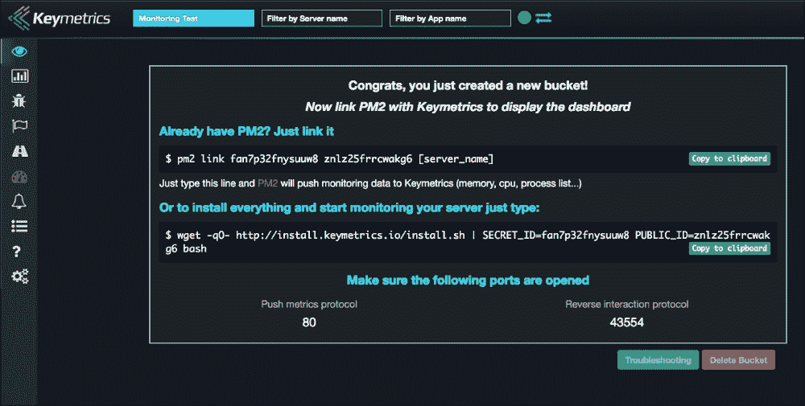

如您所见，屏幕显示了 Keymetrics 使用的私钥信息。通常，与任何人分享此密钥都是一个非常糟糕的主意。

如屏幕所示，下一步是配置 PM2 将数据推送到 Keymetrics。还有关于使 Keymetrics 工作所需的网络的有用信息：

+   PM2 将向 Keymetrics 的端口**80**推送数据

+   Keymetrics 将通过端口**43554**向我们推送数据

通常，在大型组织中，有关网络的限制，但如果您是在家中进行测试，一切都应该立即运行。

为了使 PM2 能够将指标发送到 Keymetrics，我们需要安装一个名为`pm2-server-monit`的 PM2 模块。这是一个相当简单的任务：

```js
pm2 install pm2-server-monit

```

这将导致类似以下的输出：

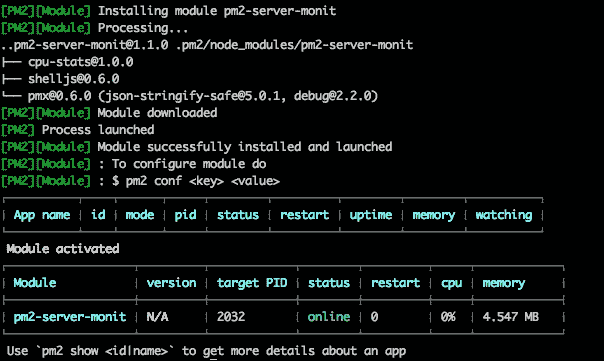

让我们运行建议的命令：

```js
pm2 link fan7p32fnysuuw8 znlz25frrcwakg6 my-server

```

在这种情况下，我已将`[服务器名称]`替换为`my-server`。服务器名称没有限制；但是，在将 Keymetrics 部署到真实系统时，建议选择一个描述性名称，以便在仪表板中轻松识别服务器。

前面的命令将产生类似以下图像的输出：

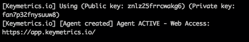

这表明一切进行顺利，我们的应用程序已准备好从 Keymetrics 进行监控，可以在[`app.keymetrics.io/`](https://app.keymetrics.io/)上进行检查，如下所示：

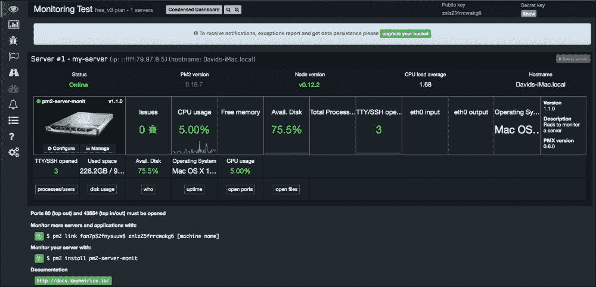

现在，我们的服务器显示在界面上。正如我们之前所述，这个桶可以监控不同的服务器。创建了一个简单的虚拟机，正如您在屏幕底部所看到的，Keymetrics 为我们提供了要执行的命令，以添加另一个服务器。在这种情况下，由于我们正在使用 Keymetrics 的免费访问，所以我们只能监控一个服务器。

让我们看看 Keymetrics 能为我们提供什么。乍一看，我们可以看到有趣的指标，如 CPU 使用率、可用内存、可用磁盘等。

所有这些都是硬件指标，表明了我们的系统的行为。在压力下，它们是指出需要更多硬件资源的完美指标。

通常，硬件资源是应用程序失败的主要指标。现在，我们将看看如何使用 Keymetrics 来诊断问题。

### 诊断问题

内存泄漏通常是一个难以解决的问题，因为缺陷的性质。看一下以下代码。

让我们使用简单的`seneca.act()`操作运行程序：

```js
var seneca = require('seneca')();

var names = [];

seneca.add({cmd: 'memory-leak'}, function(args, done){
  names.push(args.name);
  greetings = "Hello " + args.name;
  done(null ,{result: greetings});
});

seneca.act({cmd: 'memory-leak', name: 'David'}, function(err, response) {
  console.log(response);
});
```

这个程序有一个非常明显的内存泄漏，我指的是它被写成明显的。`names`数组将无限增长。在前面的例子中，由于我们的应用程序是一个将在不保留内存状态的情况下启动和完成的脚本，所以这并不是什么大问题。

### 提示

请记住，如果未使用`var`关键字，JavaScript 会在全局范围内分配变量。

当其他人在应用程序的不同部分重用我们的代码时，问题就出现了。

假设我们的系统发展到需要一个微服务来向新客户打招呼（或传递个人信息的初始负载，如姓名、偏好、配置等）的程度。以下代码可能是如何构建它的一个很好的例子：

```js
var seneca = require('seneca')();

var names = [];

seneca.add({cmd: 'memory-leak'}, function(args, done){
  names.push(args.name);
  greetings = "Hello " + args.name;
  done(null ,{result: greetings});
});

seneca.listen(null, {port: 8080});
```

在这个例子中，Seneca 将通过 HTTP 监听来自 Seneca 客户端或其他类型系统（如**curl**）的请求。当我们运行应用程序时：

```js
node index.js
2016-02-14T13:30:26.748Z szwj2mazorea/1455456626740/40489/- INFO hello Seneca/1.1.0/szwj2mazorea/1455456626740/40489/-
2016-02-14T13:30:27.003Z szwj2mazorea/1455456626740/40489/- INFO listen {port:8080}

```

然后从另一个终端，我们使用 curl 作为我们微服务的客户端，一切都将顺利进行，我们的内存泄漏将不会被注意到：

```js
curl -d '{"cmd": "memory-leak", "name":"David"}' http://127.0.0.1:8080/act
{"result":"Hello David"}%

```

然而，我们将使用 Keymetrics 来找到问题。我们需要做的第一件事是使用 PM2 运行我们的程序。为了这样做，我们运行以下命令：

```js
pm2 start index.js

```

这个命令将产生以下输出：

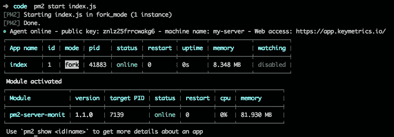

让我们来解释一下以下的输出：

+   第一行提供了与 Keymetrics 的集成信息。诸如公钥、服务器名称和访问 Keymetrics 的 URL 等数据。

+   在第一个表中，我们可以看到正在运行的应用程序的名称，以及有关内存、正常运行时间、CPU 等方面的一些统计数据。

+   在第二个表中，我们可以看到与`pm2-server-monit` PM2 模块相关的信息。

现在，让我们去 Keymetrics 看看发生了什么：

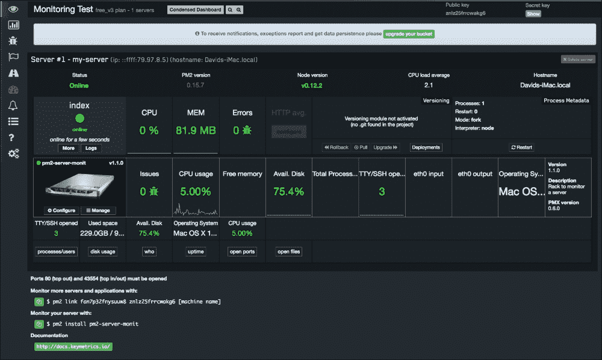

应用程序现在已经在 Keymetrics 中注册，可以在控制面板中看到。

正如你所看到的，现在我们的应用程序出现在 Keymetrics 中。

我们立刻就能看到我们的应用程序非常有用的东西。其中之一是内存使用情况。这是一个指示内存泄漏的度量标准，因为它会不断增长。

现在，我们将强制内存泄漏导致我们应用程序出现问题。在这种情况下，我们唯一需要做的就是启动我们的服务器（之前编写的小应用程序）并发出大量的请求：

```js
for i in {0..100000}
do
  curl -d '{"cmd": "memory-leak", "name":"David"}' http://127.0.0.1:8080/act
done
```

就像这个小的 bash 脚本一样，这就是打开我们应用程序潘多拉魔盒所需要的全部：

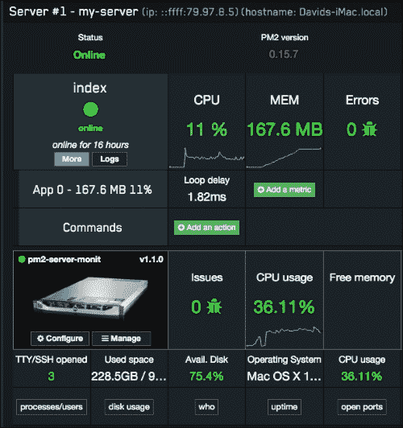

应用程序现在显示出高负载（36%的 CPU 使用率和内存使用增加到 167 MB）

上面的图片显示了在我们系统中运行请求循环的影响。让我们来解释一下：

+   我们的应用程序的 CPU 已经恢复到 11%，平均循环延迟为 1.82 毫秒。关于我们的系统，由于应用程序和 bash 脚本都使用了大量资源，整体 CPU 利用率已经上升到 36.11%。

+   内存消耗从 81.9 MB 飙升到 167.6 MB。正如你所看到的，内存分配图上的线并不是直线上升的，这是由于垃圾回收造成的。垃圾回收是 Node.js 框架内的一项活动，它会释放内存中的未引用对象，使我们的系统能够重用硬件资源。

+   关于错误，我们的应用程序一直稳定，没有错误（我们稍后会回到这一部分）。

现在，一旦我们的 bash 脚本完成（我手动停止了它，因为它可能需要大量资源和时间才能完成），我们可以再次看到我们系统发生了什么，如下截图所示：

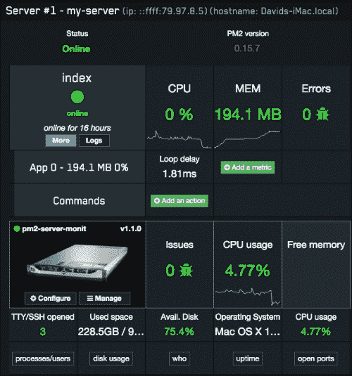

我们可以看到 CPU 已经恢复正常，但内存呢？由于我们的程序存在内存泄漏，导致应用程序消耗的内存没有被释放，只要我们的变量引用了已消耗的内存（记住`names`数组正在积累越来越多的名字），它就不会被释放。

在这种情况下，我们有一个非常简单的例子，清楚地显示了内存泄漏的位置，但在复杂的应用程序中，情况并不总是那么明显。特别是这种错误可能永远不会成为问题，因为我们可能经常部署新版本的应用程序而没有意识到它。

### 监控应用程序异常

应用程序错误是在我们的应用程序无法处理意外情况时发生的事件。诸如将一个数字除以零或尝试访问应用程序的未定义属性通常会导致这类问题。

在使用多线程框架（语言）如 Tomcat 时，一个线程由于异常而死亡通常只会影响一个客户（持有该线程的客户）。然而，在 Node.js 中，一个冒泡的异常可能是一个重大问题，因为我们的应用程序会死掉。

PM2 和 Seneca 在保持应用程序运行方面做得非常好，如果有什么原因导致应用程序停止，PM2 会重新启动我们的应用程序，而 Seneca 则不会让应用程序在某个操作发生异常时死掉。

Keymetrics 开发了一个名为**pmx**的模块，我们可以使用它来以编程方式获取错误警报：

```js
var seneca = require('seneca')();

var pmx = require('pmx');

var names = [];

seneca.add({cmd: 'exception'}, function(args, done){
  pmx.notify(new Error("Unexpected Exception!"));

  done(null ,{result: 100/args.number}); 
});

seneca.listen({port: 8085});
```

这很容易且自我描述：如果作为参数发送的数字为零，则会向 Keymetrics 发送异常的操作。如果我们运行它，我们将得到以下输出：

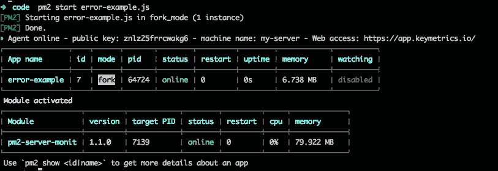

现在我们需要访问服务器以引发错误。与之前一样，我们将使用 curl 来执行：

```js
curl -d '{"cmd": "exception", "number": "0"}' http://localhost:8085/act
{"result":null}%

```

现在，当我们转到 Keymetrics 时，我们可以看到有一个错误日志，如下图所示：

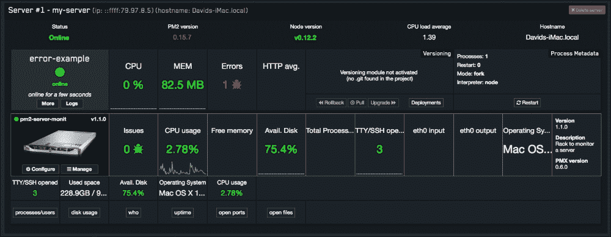

Keymetrics 的另一个有趣之处是警报的配置。由于 PM2 发送了关于系统中几乎每个指标的数据，我们有能力根据我们认为对我们的应用程序健康的阈值来配置 Keymetrics。

这非常方便，因为我们可以将通知集成到我们的企业聊天中（类似于**Slack**），并在我们的应用程序出现问题时实时收到警报。

### 自定义指标

Keymetrics 还允许我们使用**探针**。探针是应用程序通过编程方式发送到 Keymetrics 的自定义指标。

Keymetrics 的本机库允许我们直接推送不同类型的值。我们将看到最有用的值。

#### 简单指标

简单指标就像其名称所示，是一个非常基本的指标，开发人员可以将值设置为发送到 Keymetrics 的数据：

```js
var seneca = require('seneca')();
var pmx = require("pmx").init({
  http: true,
  errors: true,
  custom_probes: true,
  network: true,
  ports: true
});
var names = [];
var probe = pmx.probe();

var meter = probe.metric({
  name      : 'Last call'
});

seneca.add({cmd: 'last-call'}, function(args, done){
  console.log(meter);
  meter.set(new Date().toISOString());
  done(null, {result: "done!"});
});

seneca.listen({port: 8085});
```

在这种情况下，该指标将发送上次调用操作的时间给 Keymetrics：

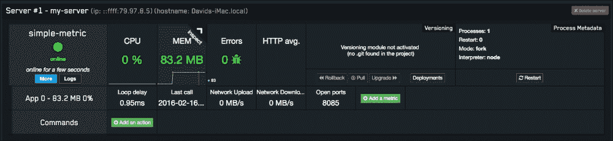

该指标的配置不存在：

```js
var probe = pmx.probe();

var meter = probe.metric({
  name      : 'Last call'
});
```

这个指标没有复杂性。

#### 计数器

该指标非常有用，可以计算事件发生的次数：

```js
var seneca = require('seneca')();
var pmx = require("pmx").init({
  http: true,
  errors: true,
  custom_probes: true,
  network: true,
  ports: true
});
var names = [];
var probe = pmx.probe();

var counter = probe.counter({
  name : 'Number of calls'
});

seneca.add({cmd: 'counter'}, function(args, done){
  counter.inc();
  done(null, {result: "done!"});
});

seneca.listen({port: 8085});
```

在上述代码中，我们可以看到每次调用操作计数器都会递增。

该指标还允许我们通过在计数器上调用`dec()`方法来递减值：

```js
counter.dec();
```

#### 平均计算值

该指标允许我们记录事件发生的时间，并将自动计算每个时间单位的事件数量。它非常有用于计算平均值，并且是衡量系统负载的好工具。让我们看一个简单的例子，如下所示：

```js
var seneca = require('seneca')();
var pmx = require("pmx").init({
  http: true,
  errors: true,
  custom_probes: true,
  network: true,
  ports: true
});
var names = [];
var probe = pmx.probe();

var meter = probe.meter({
  name      : 'Calls per minute',
  samples   : 60,
  timeframe : 3600
});

seneca.add({cmd: 'calls-minute'}, function(args, done){
  meter.mark();
  done(null, {result: "done!"});
});

seneca.listen({port: 8085});
```

上述代码创建了一个探针，并将一个名为`每分钟调用`的新指标发送到 Keymetrics。

现在，如果我们运行应用程序并多次运行以下命令，该指标将显示在以下 Keymetrics 界面中：

```js
curl -d '{"cmd": "calls-minute"}' http://localhost:8085/act

```

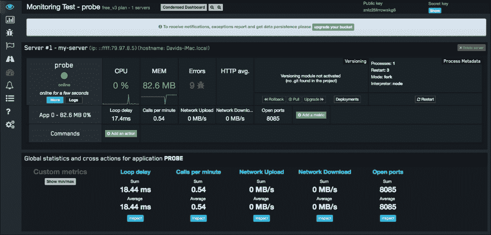

正如你所看到的，UI 中有一个名为`每分钟调用`的新指标。配置此指标的关键在以下初始化中：

```js
var meter = probe.meter({
  name      : 'Calls per minute',
  samples   : 60,
  timeframe : 3600
});
```

如您所见，指标的名称在配置字典中，以及在两个参数中：`samples`和`timeframe`。

`samples`参数对应于我们希望对指标进行评分的间隔；在这种情况下，是每分钟的调用次数，因此速率是`60`秒。

另一方面，`timeframe`参数是我们希望 Keymetrics 保存数据的时间，或者简单地说，它是分析指标的时间范围。

# 猿人军队 - Spotify 的主动监控

**Spotify**是构建面向微服务的应用程序时的参考公司之一。他们在提出新想法时非常有创意和才华横溢。

其中我最喜欢的想法之一是他们所谓的**猿人军队**。我喜欢称之为**主动监控**。

在这本书中，我多次谈到人类在执行不同任务时的失败。无论你付出多少努力来创建你的软件，都会有 bug 会影响系统的稳定性。

这是一个大问题，但当您的基础设施与现代云提供商自动化时，它变得非常重要。

想想看，如果在一千台服务器中，有三台的时区与其他服务器不同步会发生什么？嗯，根据你的系统性质，这可能没问题，也可能是个大问题。你能想象你的银行给你提供了一份交易混乱的对账单吗？

Spotify 通过创建一系列软件代理（在我们系统的不同机器中移动的程序）来解决（或减轻）上述问题，给它们取了不同种类的猴子的名字，目的是确保他们基础设施的稳健性。让我们进一步解释一下。

你可能知道，如果你之前使用过亚马逊网络服务，机器和计算元素被划分到了不同的区域（欧盟、澳大利亚、美国等），每个区域内有可用区，如下图所示：

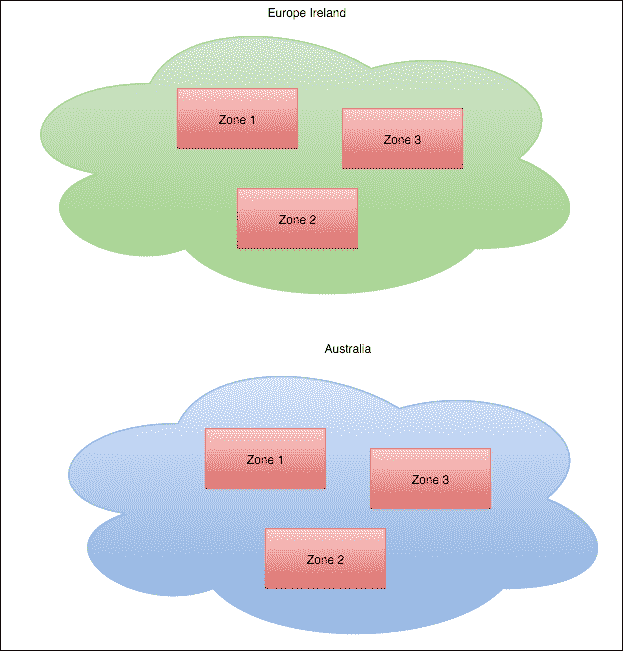

这使我们工程师能够创建软件和基础设施，而不会遇到我们所说的单点故障。

### 注：

**单点故障**是系统中的一个条件，其中一个元素的故障会导致系统运行不正常。

这个配置给 Spotify 的工程师们提出了一些问题，如下：

+   如果我们盲目相信我们的设计，而没有测试我们是否真的有任何单点故障，会发生什么？

+   如果一个完整的可用区或区域宕机会发生什么？

+   如果由于某种原因出现异常延迟，我们的应用程序会如何表现？

为了回答所有这些问题，Netflix 创建了各种代理。代理是在系统上运行的软件（在这种情况下，是我们的微服务系统），并进行不同的操作，比如检查硬件，测量网络延迟等。代理的概念并不新鲜，但直到现在，它的应用几乎是一个未来主题。让我们来看看 Netflix 创建的以下代理：

+   **混沌猴**：这个代理会在给定的可用区中断开健康的机器与网络的连接。这确保了在一个可用区内没有单点故障。所以，如果我们的应用程序在四个节点之间平衡，当混沌猴出现时，它会断开这四台机器中的一台。

+   **混沌大猩猩**：这类似于混沌猴，混沌大猩猩会断开一个完整的可用区，以验证 Netflix 服务是否会重新平衡到其他可用区。换句话说，混沌大猩猩是混沌猴的大哥；它不是在服务器级别操作，而是在分区级别操作。

+   **延迟猴**：这个代理负责在连接中引入人为的延迟。在开发系统时，通常很少考虑延迟，但在构建微服务架构时，延迟是一个非常微妙的问题：一个节点的延迟可能会影响整个系统的质量。当一个服务资源不足时，通常第一个迹象就是响应的延迟；因此，延迟猴是一个很好的方法，可以找出我们的系统在压力下会如何表现。

+   **医生猴**：健康检查是我们应用程序中的一个端点，如果一切正常就返回 HTTP 200，如果应用程序内部出现问题就返回 500 错误代码。医生猴是一个代理，会随机执行我们应用程序中节点的健康检查，并报告有问题的节点以便替换它们。

+   **10-18 Monkey**：像 Netflix 这样的组织是全球性的，因此它们需要具备语言意识（当然，如果你的母语是西班牙语，你肯定不希望在德语网站上）。10-18 Monkey 报告了配置错误的实例。

还有一些其他代理，但我只想向你解释一下主动监控。当然，这种类型的监控对于小型组织来说是难以企及的，但了解它们的存在是很好的，这样我们就可以受到启发，建立我们自己的监控程序。

### 注意

该代码在以下存储库中以 Apache 许可证提供：

[`github.com/Netflix/SimianArmy`](https://github.com/Netflix/SimianArmy)。

一般来说，这种主动监控遵循“尽早失败”的理念，我非常赞同。无论你的系统有多大的缺陷或者有多重要，你都希望尽早发现它，理想情况下，不影响任何客户。

## 吞吐量和性能下降

吞吐量对我们的应用程序来说就像月度生产对工厂一样。这是一个衡量单位，可以让我们了解我们的应用程序的表现，并回答系统的“有多少”问题。

在吞吐量附近，还有另一个我们可以衡量的单位：延迟。

延迟是回答“多长时间”的性能单位。

让我们考虑以下例子：

我们的应用程序是基于微服务架构的，负责计算申请人的信用评级以提取抵押贷款。由于我们有大量的客户（这是一个很好的问题），我们决定批量处理申请。让我们围绕它画一个小算法：

```js
var seneca = require('seneca')();
var senecaPendingApplications = require('seneca').client({type: 'tcp', 
  port: 8002, 
  host: "192.168.1.2"});
  var senecaCreditRatingCalculator = require('seneca').client({type: 'tcp', 
  port: 8002, 
  host: "192.168.1.3"});

seneca.add({cmd: 'mortgages', action: 'calculate'}, function(args, callback) {
  senecaPendingApplications.act({
    cmd: 'applications', 
    section: 'mortgages', 
    custmers: args.customers}, function(err, responseApplications) {
      senecaCreditRatingCalculator.act({cmd: 'rating', customers: args.customers}, function(err, response) {

        processApplications(response.ratings, 
        responseApplications.applications,
        args.customers
      );
    });
  });
});
```

这是一个小而简单的 Seneca 应用程序（这只是理论上的，不要试图运行它，因为缺少很多代码！），它作为另外两个微服务的客户端，如下所示：

+   第一个获取待处理的抵押贷款申请列表

+   第二个获取我们请求的客户的信用评级列表

这可能是处理抵押贷款申请的真实情况。说实话，我过去曾经在一个非常类似的系统上工作过，即使它更加复杂，工作流程也非常相似。

让我们谈谈吞吐量和延迟。想象一下，我们有一大批抵押贷款要处理，但系统表现不佳：网络速度不如预期快，出现了一些中断。

其中一些应用程序将丢失并需要重试。在理想条件下，我们的系统每小时产生 500 个应用程序的吞吐量，并且平均需要 7.2 秒的延迟来处理每个应用程序。然而，今天，正如我们之前所述，系统并不处于最佳状态；我们每小时只处理 270 个应用程序，并且平均需要 13.3 秒来处理一个抵押贷款申请。

如你所见，通过延迟和吞吐量，我们可以衡量我们的业务交易相对于以前的经验表现如何；我们的运行能力只有正常能力的 54%。

这可能是一个严重的问题。说实话，这种中断应该在我们的系统中引起所有警报，因为我们的基础设施中确实发生了非常严重的问题；然而，如果我们在构建系统时足够聪明，性能会下降，但系统不会停止工作。这可以通过使用断路器和队列技术（如 RabbitMQ）轻松实现。

队列是一个很好的例子，展示了如何将人类行为应用到 IT 系统中。说真的，我们可以很容易地解耦我们的软件组件，只需一个简单的消息作为连接点，我们的服务要么产生，要么消费，这在编写复杂软件时给我们带来了很大的优势。

队列与 HTTP 相比的另一个优势是，如果网络中断，HTTP 消息就会丢失。

我们需要围绕这样一个事实构建我们的应用程序，即它要么完全成功，要么出现错误。使用 RabbitMQ 等排队技术，我们的消息传递是异步的，因此我们不需要担心间歇性故障：*一旦我们能够将消息传递到适当的队列，它将被持久化，直到客户端能够消费它（或者消息超时发生）*。

这使我们能够考虑基础设施中的间歇性错误，并基于队列周围的通信构建更加健壮的应用程序。

再次，Seneca 让我们的生活变得非常简单：Seneca 框架构建的插件系统使编写传输插件成为一项相当简单的任务。

### 注意

RabbitMQ 传输插件可以在以下 GitHub 存储库中找到：

[`github.com/senecajs/seneca-rabbitmq-transport`](https://github.com/senecajs/seneca-rabbitmq-transport)

有相当多的传输插件，我们也可以创建我们自己的插件（或修改现有的插件！）来满足我们的需求。

如果你快速浏览一下 RabbitMQ 插件（只是举个例子），我们需要做的唯一一件事就是覆盖以下两个 Seneca 操作：

+   `seneca.add({role: 'transport', hook: 'listen', type: 'rabbitmq'}, ...)`

+   `seneca.add({role: 'transport', hook: 'client', type: 'rabbitmq'}, ...)`

使用排队技术，我们的系统将*更加抗干扰*，我们将能够降低性能而不是因为丢失消息而陷入灾难性的故障。

# 总结

在本章中，我们深入了解了通过 Keymetrics 进行 PM2 监控。我们学会了如何进行严格的监控，以便我们能够迅速了解应用程序中的故障。

在软件开发生命周期中，**QA**阶段，在我看来，是最重要的阶段之一：无论你的代码看起来多么好，如果它不起作用，那就是无用的。然而，如果我必须选择另一个阶段，工程师应该更加重视的是部署，更具体地说，是在每次部署后进行的监控。如果你立即收到错误报告，那么很有可能能够迅速做出反应，避免更大的问题，比如数据损坏或客户抱怨。

我们还看到了 Netflix 在其系统上进行的主动监控的例子，尽管这可能超出了你公司的范围，但它可以激发出对监控软件的好想法和实践。

Keymetrics 只是一个符合 Node.js 要求的例子，因为它与 PM2 集成非常好，但也有其他好的监控系统，比如**AppDynamics**，或者如果你想使用内部软件，你可以使用 Nagios。关键是要清楚地知道需要监控应用程序中的内容，然后找到最好的提供者。

监控 Node.js 应用程序的另外两个好选择是 StrongLoop 和 New Relic。它们与 Keymetrics 处于同一水平线，但对于大规模系统来说效果更好，特别是 StrongLoop，它专门针对使用 Node.js 编写的应用程序和微服务。
