# 第八章：部署微服务

在本章中，我们将部署微服务。我们将使用不同的技术，以便为读者提供选择每项工作的正确工具所需的知识。首先，我们将使用 PM2 及其部署功能在远程服务器上运行应用程序。然后，我们将尝试 Docker，这是最先进的部署平台之一，以及容器周围的整个生态系统。在本章中，我们将展示如何尽可能自动化所有部署。

# 软件部署中的概念

部署通常是**软件开发生命周期**（**SDLC**）派对的不受欢迎的朋友。开发和系统管理之间存在缺失的联系点，这是 DevOps 在未来几年将要解决的问题。在以下图表中显示了在 SDLC 不同阶段修复错误的成本：

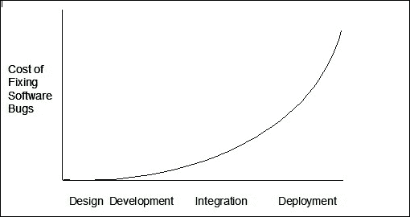

这个图表显示了根据 SDLC 阶段修复错误的成本

在精益方法论中，尽早失败是我最喜欢的概念之一。在变更管理领域，软件生命周期不同阶段修复错误的成本被称为**变更成本曲线**。

粗略地说，在生产环境中修复错误的成本估计是需求确定时修复错误成本的 150 倍。

无论数字是多少，这在很大程度上取决于我们使用的方法和技术，我们得出的教训是，通过及早发现错误，我们可以节省大量时间。

从持续集成到持续交付，过程应尽可能自动化，*尽可能*意味着 100%。记住，人类是不完美的，在进行手动重复任务时更容易出错。

## 持续集成

**持续集成**（**CI**）是将来自不同分支的工作每天（或一天多次）集成在一起，并通过运行集成和单元测试来验证这些更改不会破坏现有功能的实践。

CI 应该使用与我们将在预生产和生产中使用的相同基础架构配置进行自动化，这样如果有任何缺陷，就可以及早发现。

## 持续交付

**持续交付**（**CD**）是一种旨在构建小型、可测试和易于部署的功能片段的软件工程方法，可以随时无缝交付。

这就是我们在微服务中的目标。再次强调，我们应该推动自动化交付过程，因为如果我们手动操作，我们只会寻找问题。

从微服务的角度来看，部署的自动化是关键。我们需要解决拥有几十个服务而不是几台机器所带来的额外开销，否则我们可能会发现自己在维护一堆服务，而不是为公司增加价值。

**Docker**是我们的最佳盟友。有了 Docker，我们几乎可以将新软件部署到不同环境中的过程简化为移动一个文件（容器），这是我们将在本章后面看到的。

# 使用 PM2 进行部署

PM2 是一个非常强大的工具。无论我们处于开发的哪个阶段，PM2 总是有所提供。

在软件开发的这个阶段，部署是 PM2 真正发光的地方。通过一个 JSON 配置文件，PM2 将管理一组应用程序，以便我们可以轻松地在远程服务器上部署、重新部署和管理应用程序。

## PM2 - 生态系统

PM2 将一组应用程序称为生态系统。每个生态系统都由一个 JSON 文件描述，生成它的最简单方法是执行以下命令：

```js
pm2 ecosystem

```

这应该输出类似于以下代码：

```js
[PM2] Spawning PM2 daemon
[PM2] PM2 Successfully daemonized
File /path/to/your/app/ecosystem.json generated

```

`ecosystem.json`文件的内容因 PM2 的版本而异，但这个文件包含了 PM2 集群的框架：

```js
{
  apps : [

    {
      name      : "My Application",
      script    : "app.js"
    },

    {
      name      : "Test Web Server",
      script    : "proxy-server.js"
    }
  ],

*/
  deploy : {
    production : {
      user : "admin",
      host : "10.0.0.1",
      ref  : "remotes/origin/master",
      repo : "git@github.com:the-repository.git",
      path : "/apps/repository",
      "post-deploy" : "pm2 startOrRestart ecosystem.json --env production"
    },
    dev : {
      user : "devadmin",
      host : "10.0.0.1",
      ref  : "remotes/origin/master",
      repo : "git@github.com:the-repository.git",
      path : "/home/david/development/test-app/",
      "post-deploy" : "pm2 startOrRestart ecosystem.json --env dev",
    }
  }
}
```

这个文件包含了为两个环境配置的两个应用程序。我们将修改这个框架，以适应我们的需求，模拟我们在第四章中编写的整个生态系统，*在 Node.js 中编写你的第一个微服务*。

然而，现在，让我们解释一下配置：

+   我们有一个应用程序数组(`apps`)，定义了两个应用程序：API 和 WEB

+   正如你所看到的，我们为每个应用程序有一些配置参数：

+   `name`：这是应用程序的名称

+   `script`：这是应用程序的启动脚本

+   `env`：这些是要由 PM2 注入到系统中的环境变量

+   `env_<environment>`：这与`env`相同，但是它是根据环境定制的

+   在默认生态系统下定义了两个环境，分别是`deploy`键下的两个环境：

+   `production`

+   `dev`

正如你所看到的，在这两个环境之间，除了我们在开发环境中配置一个环境变量和我们部署应用程序的文件夹之外，没有什么显著的变化。

## 使用 PM2 部署微服务

在第四章中，*在 Node.js 中编写你的第一个微服务*，我们编写了一个简单的电子商务，以展示微服务中的不同概念和常见陷阱。

现在，我们将学习如何使用 PM2 部署它们。

### 配置服务器

使用 PM2 部署软件的第一件事是配置远程机器和本地机器，以便使用 SSH 进行通信，采用公钥/私钥模式。

这样做的方式很简单，如下所示：

+   生成一个 RSA 密钥

+   将其安装到远程服务器

让我们来做吧：

```js
ssh-keygen -t rsa

```

这应该产生类似于以下输出：

```js
Generating public/private rsa key pair.
Enter file in which to save the key (/Users/youruser/.ssh/id_rsa): /Users/youruser/.ssh/pm2_rsa
Enter passphrase (empty for no passphrase):
Enter same passphrase again:
Your identification has been saved in pm2_rsa.
Your public key has been saved in pm2_rsa.pub.
The key fingerprint is:
eb:bc:24:fe:23:b2:6e:2d:58:e4:5f:ab:7b:b7:ee:38 dgonzalez@yourmachine.local
The key's randomart image is:
+--[ RSA 2048]----+
|                 |
|                 |
|                 |
|    .            |
|   o    S        |
|    o   ..       |
|   o o..o.       |
|  . +.+=E..      |
|   oo++**B+.     |
+-----------------+

```

现在，如果我们进入前面输出中指示的文件夹，我们可以找到以下两个文件：

+   `pm2_rsa`：第一个是`pm2_rsa`，是你的私钥。正如你从名称中所读到的，没有人应该有权访问这个密钥，因为他们可能在信任这个密钥的服务器中窃取你的身份。

+   `pm2_rsa.pub`：`pm2_rsa.pub`是你的公钥。这个密钥可以交给任何人，使用非对称加密技术，他们可以验证你的身份（或者你所说的身份）。

我们现在要做的是将公钥复制到远程服务器，这样当我们的本地机器 PM2 尝试与服务器通信时，它知道我们是谁，并且让我们在没有密码的情况下进入 shell：

```js
cat pm2_rsa.pub | ssh youruser@yourremoteserver 'cat >> .ssh/authorized_keys'

```

最后一步是将你的私钥注册为本地机器中已知的身份：

```js
ssh-add pm2_rsa

```

就是这样。

从现在开始，每当你使用`youruser`作为用户 SSH 进入远程服务器时，你就不需要输入密码就可以进入 shell。

一旦配置完成，就几乎没有什么需要做的，就可以将任何应用程序部署到这个服务器上：

```js
pm2 deploy ecosystem.json production setup
pm2 deploy ecosystem.json production

```

第一条命令将配置所有需要的内容来容纳该应用程序。第二条命令将实际部署应用程序本身，就像我们之前配置的那样。

# Docker - 用于软件交付的容器

虚拟化是过去几年中最大的趋势之一。虚拟化使工程师能够在不同的软件实例之间共享硬件。Docker 实际上并不是一个虚拟化软件，但在概念上是相同的。

使用纯虚拟化解决方案，一个新的操作系统运行在现有操作系统（主机操作系统）顶部的 hypervisor 上。运行完整的操作系统意味着我们可能需要消耗几 GB 的硬盘空间来复制从内核到文件系统的整个堆栈，这通常会消耗大量资源。虚拟化解决方案的结构如下图所示：

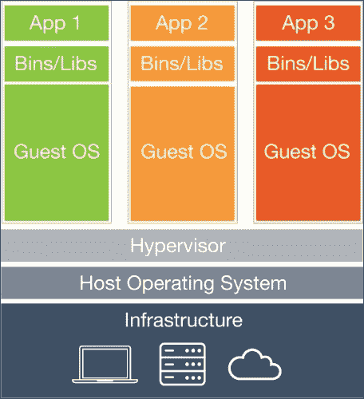

虚拟机环境的层次图

使用 Docker，我们只复制文件系统和二进制文件，因此无需运行我们不需要的操作系统的完整堆栈。 Docker 图像通常只有几百兆字节，而不是几十亿字节，它们非常轻量级，因此我们可以在同一台机器上运行一些容器。使用 Docker 的先前结构如下所示：

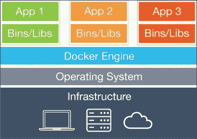

Docker 的图层图

使用 Docker，我们还消除了软件部署的最大问题之一，即**配置管理**。

我们正在切换到一个复杂的每个环境配置管理，我们需要担心应用程序如何部署/配置到基本上类似于可以安装在任何 Docker-ready 机器上的软件包的容器中。

目前唯一支持 Docker 的操作系统是 Linux，因为 Docker 需要利用先进的内核功能，迫使 Windows 和 Mac 用户运行带有 Linux 的虚拟机，以提供对 Docker 容器的支持。

## 设置容器

Docker 提供了一种非常强大且熟悉的方式（对于开发人员来说）来配置容器。

您可以基于现有图像（互联网上有成千上万的图像）创建容器，然后通过添加新的软件包或更改文件系统来修改图像以满足您的需求。

一旦我们对此满意，我们可以使用图像的新版本使用类似**Git**的版本控制系统创建我们的容器。

但是，我们首先需要了解 Docker 的工作原理。

### 安装 Docker

如前所述，Docker 需要虚拟机来在 Mac 和 Windows 上提供支持，因此这些系统上的安装可能有所不同。在您的系统上安装 Docker 的最佳方法是转到官方网站并按照步骤进行操作：

[`docs.docker.com/engine/installation/`](https://docs.docker.com/engine/installation/)

目前，这是一个非常活跃的项目，因此您可以预期每隔几周就会有变化。

### 选择图像

默认情况下，Docker 不带任何图像。我们可以通过在终端上运行`docker images`来验证这一点，这将产生与以下截图非常相似的输出：

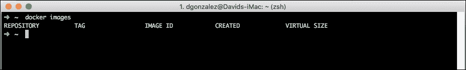

它是一个空列表。本地机器中没有存储任何图像。我们需要做的第一件事是搜索图像。在这种情况下，我们将使用**CentOS**作为创建图像的基础。 CentOS 非常接近 Red Hat Enterprise Linux，似乎是行业中最广泛使用的 Linux 发行版之一。他们提供了很好的支持，并且有大量的信息可用于互联网上解决问题。

让我们按照以下步骤搜索 CentOS 图像：

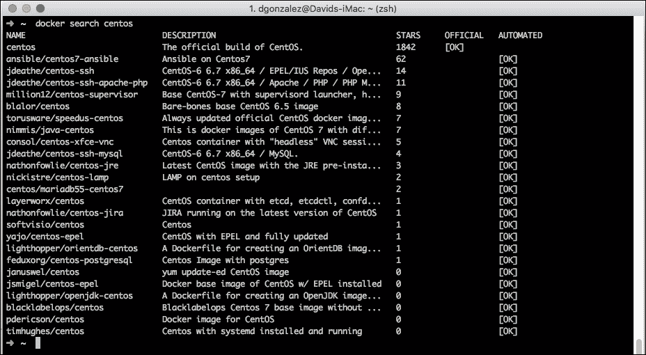

如您所见，有一个基于 CentOS 的图像的长列表，但只有第一个是官方的。

这些图像列表来自 Docker 世界中的**Registry**。Docker Registry 是一个简单的图像存储库，可供公众使用。您也可以运行自己的 Registry，以防止您的图像进入公共 Registry。

### 注意

更多信息可以在以下链接找到：

[`docs.docker.com/registry/`](https://docs.docker.com/registry/)

在前面截图中的表中有一列几乎立即应该引起您的注意，即**STARS**列。该列代表用户对给定图像的评分。我们可以根据用户给定图像的星级数量来缩小搜索范围，使用`-s`标志。

如果运行以下命令，您将看到一个带有 1000 或更多星级的图像列表：

```js
docker search -s 1000 centos

```

### 提示

选择图像时要小心，没有任何阻止用户创建带有恶意软件的图像。

为了将 CentOS 图像获取到本地机器，我们需要运行以下命令：

```js
docker pull centos

```

产生的输出将与下图非常相似：

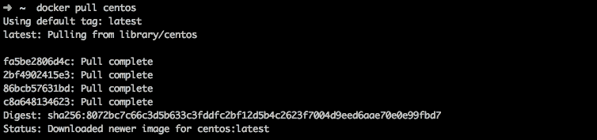

一旦命令完成，如果我们再次运行 Docker images，我们可以看到**centos**现在出现在以下列表中：

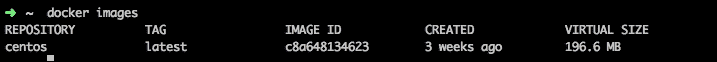

正如我们之前指定的，Docker 不使用完整的镜像，而是使用它的缩小版本，只虚拟 OS 的最后几层。你可以清楚地看到，因为镜像的大小甚至不到 200MB，而对于完整版本的 CentOS 来说，可能会达到几 GB。

### 运行容器

现在我们在本地机器上有了镜像的副本，是时候运行它了：

```js
docker run -i -t centos /bin/bash

```

这将产生以下输出：

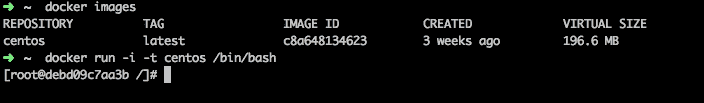

正如你所看到的，终端的提示已经改变成了类似`root@debd09c7aa3b`的东西，这意味着我们在容器内部。

从现在开始，我们运行的每个命令都将在一个包含版本的 CentOS Linux 中执行。

Docker 中还有另一个有趣的命令：

```js
docker ps

```

如果我们在新的终端中运行这个命令（而不退出正在运行的容器），我们将得到以下输出：

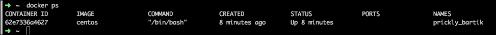

这个输出是不言自明的；这是一个简单的方法来看看我们的 Docker 容器中发生了什么。

### 安装所需的软件

让我们在容器中安装 Node.js：

```js
curl --silent --location https://rpm.nodesource.com/setup_4.x | bash -

```

这个命令将拉取并执行 Node.js 的设置脚本。

这将产生一个与下图非常相似的输出：

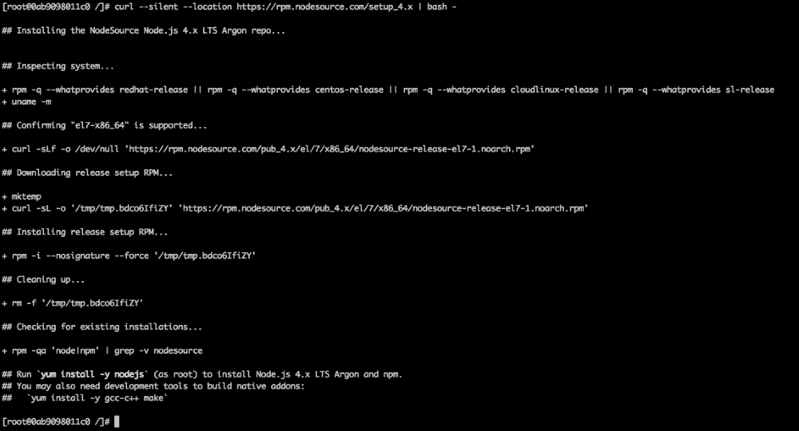

按照说明操作，这将安装 node：

```js
yum install -y nodejs

```

强烈建议安装开发工具，因为安装一些模块需要编译步骤。让我们来做吧：

```js
yum install -y gcc-c++ make

```

一旦命令完成，我们就可以在容器内运行节点应用程序了。

### 保存更改

在 Docker 世界中，镜像是给定容器的配置。我们可以使用镜像作为模板运行尽可能多的容器，但首先，我们需要保存在上一节中所做的更改。

如果你是软件开发人员，你可能熟悉诸如 CVS、Subversion 或 Git 之类的控制版本系统。Docker 是根据它们的理念构建的——一个容器可以被视为一个可版本化的软件组件，然后可以提交更改。

为了做到这一点，运行以下命令：

```js
docker ps -a

```

这个命令将显示过去运行过的容器的列表，如下图所示：

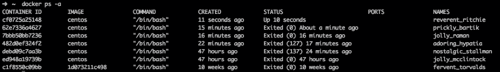

在我的情况下，有一些容器，但在这种情况下有趣的是第二个；这是 Node.js 安装的地方。

现在，我们需要提交容器的状态，以创建一个包含我们更改的新镜像。我们通过运行以下命令来做到这一点：

```js
docker commit -a dgonzalez 62e7336a4627 centos-microservices:1.0

```

让我们解释一下这个命令：

+   `-a`标志表示作者。在这种情况下，是`dgonzalez`。

+   下一个参数是`容器 ID`。正如我们之前所指出的，第二个容器具有相应的 ID`62e7336a4627`。

+   第三个参数是给新镜像的名称和镜像的标签的组合。当我们处理相当多的镜像时，标记系统可能非常强大，因为要在它们之间识别小的变化可能会变得非常复杂。

可能需要几秒钟，但完成后，命令的输出必须与下图非常相似：

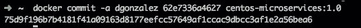

这表明我们在我们的软件列表中有一个新的镜像。再次运行`docker images`命令，输出将确认这一点，如下图所示：

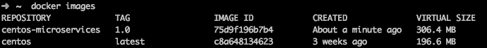

为了基于新镜像运行一个容器，我们可以运行以下命令：

```js
docker run -i -t centos-microservices:1.0 /bin/bash

```

这将使我们在容器中访问 shell，并且我们可以通过运行`node -v`来确认 Node.js 已安装，它应该输出 Node 的版本，在这种情况下是 4.2.4。

## 部署 Node.js 应用程序

现在，是时候在容器内部部署 Node.js 应用程序了。为了做到这一点，我们需要将本地机器的代码暴露给 Docker 容器。

正确的做法是通过在 Docker 机器中挂载一个本地文件夹，但首先，我们需要创建要在容器内运行的小应用程序，如下所示：

```js
var express = require('express');
var myApplication = express();

app.get('/hello', function (req, res) {
  res.send('Hello Earth!');
});

var port = 80;

app.listen(port, function () {
  console.log('Listeningistening on port '+ port);
});
```

这是一个简单的应用程序，使用 Express 基本上在浏览器中呈现`Hello Earth!`。如果我们从终端运行它并访问`http://localhost:80/hello`，我们就可以看到结果。

现在，我们将在容器内运行它。为了做到这一点，我们将一个本地文件夹作为卷挂载到 Docker 容器中并运行它。

Docker 源自系统管理员和开发人员的经验，他们最近融入了一个称为 DevOps 的角色，介于他们之间。在 Docker 之前，每家公司都有自己部署应用程序和管理配置的方式，因此没有共识如何正确地做事。

现在有了 Docker，公司有了一种提供部署统一性的方式。无论您的业务是什么，一切都归结为构建容器、部署应用程序并在适当的机器上运行容器。

假设应用程序在`/apps/test/`文件夹中。现在，为了将其暴露给容器，我们运行以下命令：

```js
docker run -i -t -v /app/test:/test_app -p 8000:3000 centos-microservices:1.0 /bin/bash

```

正如您所看到的，Docker 可以使用参数非常详细，但让我们解释一下，如下所示：

+   `-i`和`-t`标志对我们来说很熟悉。它们捕获输入并将输出发送到终端。

+   `-v`标志是新的。它指定了本地机器的一个卷以及在容器中的挂载位置。在这种情况下，我们将本地机器上的`/apps/test`挂载到`/test_app`。请注意冒号符号来分隔本地和远程路径。

+   `-p`标志指定本地机器上将通过的远程端口。在这种情况下，我们通过 Docker 机器中的端口`8000`公开容器中的端口`3000`，因此从主机机器访问`docker-machine:8000`最终会访问容器中的端口`3000`。

+   `centos-microservices:1.0`是我们在前一节中创建的镜像的名称和标签。

+   `/bin/bash`是我们想在容器内执行的命令。`/bin/bash`将使我们访问系统的提示符。

如果一切顺利，我们应该已经获得了进入容器内的系统提示，如下图所示：

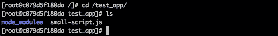

正如您在图中所看到的，有一个名为`/test_app`的文件夹，其中包含我们之前的应用程序`small-script.js`。

现在，是时候访问应用程序了，但首先，让我们解释一下 Docker 的工作原理。

Docker 是用**Go**编写的，这是谷歌创建的一种现代语言，将 C++等编译语言的所有优点与 Java 等现代语言的所有高级特性结合在一起。

学习起来相当容易，掌握起来也不难。Go 的哲学是将解释语言的所有优点带入编译语言，比如减少编译时间（完整的语言可以在不到一分钟内编译）。

Docker 使用 Linux 内核的非常特定的功能，这迫使 Windows 和 Mac 用户使用虚拟机来运行 Docker 容器。这个机器过去被称为**boot2docker**，但新版本被称为**Docker Machine**，其中包含更高级的功能，比如在远程虚拟机中部署容器。在这个例子中，我们只会使用本地功能。

鉴于此，如果您在 Linux 中从位于`/test_app/`文件夹中的容器内运行应用程序，并访问`http://localhost:8000/`，就足以进入应用程序。

当您使用 Mac 或 Windows 时，Docker 在 Docker Machine 或 boot2docker 中运行，因此 IP 是由这个虚拟机给出的，在 Docker 终端启动时显示，如下图所示：

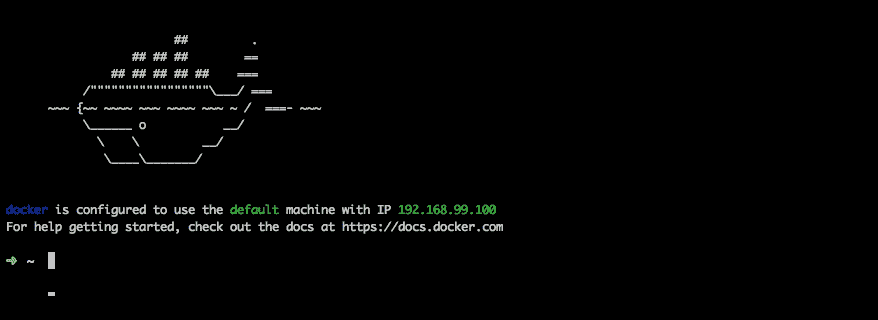

如您所见，IP 是`192.168.99.100`，因此为了访问我们的应用程序，我们需要访问`http://192.168.99.100:9000/` URL。

## 自动化 Docker 容器创建

如果您还记得，在前面的章节中，最重要的概念之一是自动化。自动化是在使用微服务时的关键。您可能不需要操作一个服务器，而是需要操作几十个服务器，达到几乎完全预订每日任务的程度。

当允许用户从名为`Dockerfile`的文件中编写脚本创建容器时，Docker 设计者考虑到了这一点。

如果您曾经在 C 或 C++编码中工作过，甚至在大学里，您可能熟悉`Makefiles`。`Makefile`文件是一个脚本，开发人员在其中指定自动构建软件组件的步骤。以下是一个示例：

```js
all: my-awesome-app

my-awesome-app: main.o external-module.o app-core.o
  g++ main.o external-module.o app-core.o -o my-awesome-app

main.o: main.cc
  g++ -c main.cc

external-module.o: external-module.cc
  g++ -c external-module.cc

app-core.o: app-core.cc
  g++ -c hello.cc

clean:
  rm *.o my-awesome-app
```

前面的`Makefile`包含要执行的任务和依赖项的列表。例如，如果我们在包含`Makefile`文件的同一文件夹中执行`make clean`，它将删除可执行文件和所有以`o`结尾的文件。

`Dockerfile`不像`Makefile`，它不是任务和依赖项的列表（尽管概念是相同的），它是一系列指令，用于从头开始构建容器到就绪状态。

让我们看一个例子：

```js
FROM centos
MAINTAINER David Gonzalez
RUN curl --silent --location https://rpm.nodesource.com/setup_4.x | bash -
RUN yum -y install nodejs

```

这几行简短的命令足以构建一个安装了 Node.js 的容器。

让我们以下面的方式来解释：

+   首先，我们选择基础镜像。在这种情况下，它是`centos`，就像我们之前使用的一样。为此，我们使用`FROM`命令，然后是镜像的名称。

+   `MAINTAINER`指定创建容器的人的名称。在这种情况下，是`David Gonzalez`。

+   `RUN`，顾名思义，运行一个命令。在这种情况下，我们使用它两次：一次是将存储库添加到`yum`，然后安装 Node.js。

Dockerfiles 可以包含许多不同的命令。它们的文档非常清晰，但让我们看看最常见的命令（除了之前看到的命令）：

+   `CMD`：这类似于 run，但实际上是在构建命令之后执行的。`CMD`是在实例化容器后用于启动应用程序的命令。

+   `WORKDIR`：这是与`CMD`一起使用的，它是用于指定下一个`CMD`命令的工作目录的命令。

+   `ADD`：此命令用于将文件从本地文件系统复制到容器实例文件系统。在前面的示例中，我们可以使用`ADD`将应用程序从主机复制到容器中，使用`CMD`命令运行`npm install`，然后再次使用`CMD`命令运行应用程序。它还可以用于将内容从 URL 复制到容器内的目标文件夹。

+   `ENV`：用于设置环境变量。例如，您可以通过向容器传递环境变量来指定一个文件夹来存储上传的文件，如下所示：

```js
ENV UPLOAD_PATH=/tmp/

```

+   `EXPOSE`：用于向集群中的其他容器公开端口。

正如您所看到的，`Dockerfiles`的**领域特定语言**（**DSL**）非常丰富，您几乎可以构建所需的每个系统。互联网上有数百个示例，可以构建几乎所有内容：MySQL、MongoDB、Apache 服务器等等。

强烈建议通过`Dockerfiles`创建容器，因为它可以用作脚本来复制和更改将来的容器，以及能够在不需要太多手动干预的情况下自动部署我们的软件。

# Node.js 事件循环-易学难精

我们都知道 Node.js 是以单线程方式运行应用程序的平台；那么，为什么我们不使用多个线程来运行应用程序，以便利用多核处理器的好处呢？

Node.js 是建立在一个名为**libuv**的库之上。这个库抽象了系统调用，为使用它的程序提供了一个异步接口。

我来自一个非常重的 Java 背景，在那里，一切都是同步的（除非你使用某种非阻塞库进行编码），如果你向数据库发出请求，线程就会被阻塞，直到数据库回复数据后才会恢复。

这通常运行良好，但它提出了一个有趣的问题：一个阻塞的线程正在消耗资源，这些资源本可以用来处理其他请求。Node.js 的事件循环如下图所示：

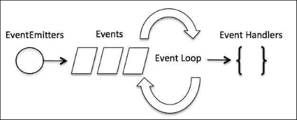

这是 Node.js 事件循环图表

默认情况下，JavaScript 是一个事件驱动的语言。它执行配置了一系列事件处理程序的程序，这些处理程序将对给定的事件做出反应，然后，它只是等待动作发生。

让我们看一个非常熟悉的例子：

```js
<div id="target">
  Click here
</div>
<div id="other">
  Trigger the handler
</div>
```

然后 JavaScript 代码如下：

```js
$( "#target" ).click(function() {
  alert( "Handler for .click() called." );
});
```

正如你所看到的，这是一个非常简单的例子。HTML 显示了一个按钮和一小段 JavaScript 代码，使用 JQuery，在按钮被点击时显示一个警报框。

这是关键：*当按钮被点击时*。

点击按钮是一个事件，这个事件通过 JavaScript 的事件循环使用 JavaScript 中指定的处理程序进行处理。

归根结底，我们只有一个线程执行事件，我们从不谈论 JavaScript 中的并行性，正确的词是并发。因此，更简洁地说，Node.js 程序具有高度的并发性。

你的应用程序将始终在一个线程中执行，我们在编码时需要牢记这一点。

如果你一直在 Java 或.NET 或任何其他设计和实现了线程阻塞技术的语言/框架中工作，你可能已经观察到，当 Tomcat 运行应用程序时，会生成一些线程来监听请求。

在 Java 世界中，这些线程中的每一个被称为**工作者**，它们负责从开始到结束处理来自特定用户的请求。在 Java 中有一种数据结构可以从中获益。它被称为**ThreadLocal**，它将数据存储在本地线程中，以便以后可以恢复。这种存储是可能的，因为启动请求的线程也负责完成它，如果线程正在执行任何阻塞操作（比如读取文件或访问数据库），它将等待直到完成。

这通常不是什么大问题，但当你的软件严重依赖 I/O 时，问题可能会变得严重。

Node.js 非阻塞模型的另一个重要优点是缺乏上下文切换。

当 CPU 将一个线程与另一个线程进行切换时，发生的情况是寄存器中的所有数据以及内存的其他区域都被堆叠起来，允许 CPU 将上下文与一个新的进程进行切换，该进程有自己的数据要放在那里，如下图所示：

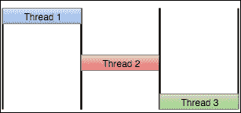

这是一个显示线程上下文切换的图表，从理论的角度来看。

这个操作需要时间，而这个时间并没有被应用程序利用。它只是丢失了。在 Node.js 中，你的应用程序只在一个线程中运行，因此在运行时没有这样的上下文切换（它仍然存在于后台，但对你的程序是隐藏的）。在下图中，我们可以看到在现实世界中当 CPU 切换一个线程时会发生什么：

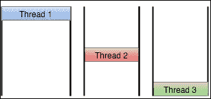

这是一个显示线程上下文切换的图表，从实际（显示死时间）的角度来看。

# 聚类 Node.js 应用程序

到目前为止，你已经知道 Node.js 应用程序是如何工作的，当然，一些读者可能会有一个问题，即如果应用程序在单个线程上运行，那么现代多核处理器会发生什么？

在回答这个问题之前，让我们看一下以下的情景。

当我上高中时，CPU 发生了一次重大的技术飞跃：分段。

这是在指令级别引入并行性的第一次尝试。如你可能知道的，CPU 解释汇编指令，每个指令由许多阶段组成，如下图所示：

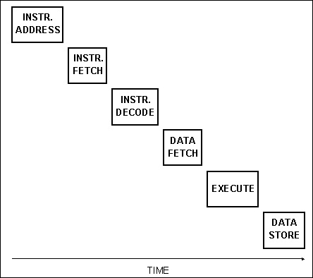

在 Intel 4x86 之前，CPU 一次只执行一条指令，因此根据前面图表中的指令模型，任何 CPU 每六个 CPU 周期只能执行一条指令。

然后，分段开始发挥作用。通过一组中间寄存器，CPU 工程师们设法并行化指令的各个阶段，以便在最佳情况下，CPU 能够每个周期执行一条指令（或几乎如此），如下图所示：

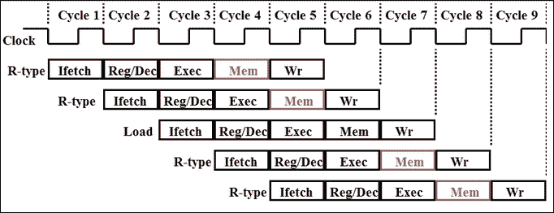

该图描述了 CPU 中指令的执行过程，具有分段管道

这一技术改进导致了更快的 CPU，并打开了原生硬件多线程的大门，这导致了现代的 n 核处理器可以执行大量的并行任务，但当我们运行 Node.js 应用程序时，我们只使用一个核心。

如果我们不对应用程序进行集群，与利用 CPU 的多个核心的其他平台相比，我们的性能将严重下降。

然而，这一次我们很幸运，PM2 已经允许你对 Node.js 应用程序进行集群，以最大限度地利用你的 CPU。

此外，PM2 的一个重要方面是它允许你在没有任何停机时间的情况下扩展应用程序。

让我们以集群模式运行一个简单的应用程序：

```js
var http = require("http");
http.createServer(function (request, response) {
  response.writeHead(200, {
    'Content-Type': 'text/plain'
  });
  response.write('Here we are!')
  response.end();
}).listen(3000);
```

这一次，我们使用了 Node.js 的原生 HTTP 库来处理传入的 HTTP 请求。

现在我们可以从终端运行应用程序并看看它是如何工作的：

```js
node app.js

```

虽然它不输出任何东西，但我们可以通过 curl 访问`http://localhost:3000/`URL 来查看服务器的响应，如下面的截图所示：

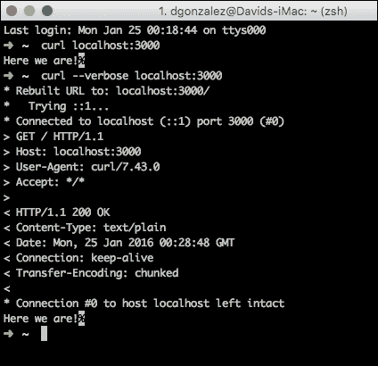

正如你所看到的，Node.js 已经处理了所有的 HTTP 协商，并且还成功地以代码中指定的`Here we are!`短语进行了回复。

这项服务相当琐碎，但它是更复杂的 Web 服务工作的原则，因此我们需要对 Web 服务进行集群以避免瓶颈。

Node.js 有一个名为`cluster`的库，允许我们以编程方式对应用程序进行集群，如下所示：

```js
var cluster = require('cluster');
var http = require('http');
var cpus = require('os').cpus().length;

// Here we verify if the we are the master of the cluster: This is the root process
// and needs to fork al the childs that will be executing the web server.
if (cluster.isMaster) {
  for (var i = 0; i < cpus; i++) {
    cluster.fork();
  }

  cluster.on('exit', function (worker, code, signal) {
    console.log("Worker " + worker.proces.pid + " has finished.");
  });
} else {
  // Here we are on the child process. They will be executing the web server.
  http.createServer(function (request, response) {
    response.writeHead(200);
    response.end('Here we are!d\n');
  }).listen(80);
}
```

就我个人而言，我发现使用特定软件如 PM2 来实现有效的集群要容易得多，因为在尝试处理我们应用程序的集群实例时，代码可能会变得非常复杂。

鉴于此，我们可以通过 PM2 运行应用程序如下：

```js
pm2 start app.js -i 1

```

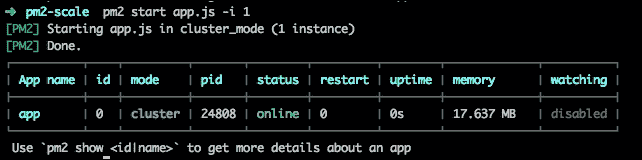

在 PM2 中，`-i`标志用于指定我们希望为我们的应用程序使用的核心数，如你在命令的输出中所见。

如果我们运行`pstree`，我们可以看到系统中的进程树，并检查 PM2 是否只为我们的应用程序运行了一个进程，如下图所示：

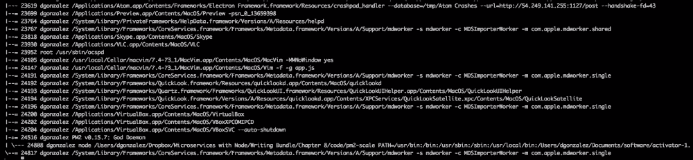

在这种情况下，我们只在一个进程中运行应用程序，因此它将分配在 CPU 的一个核心中。

在这种情况下，我们没有利用 CPU 的多核能力，但如果我们的算法出现异常，仍然可以获得自动重新启动应用程序的好处。

现在，我们将使用 CPU 中所有可用的核心来运行我们的应用程序，以便最大限度地利用它，但首先，我们需要停止集群：

```js
pm2 stop all

```

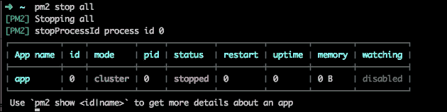

PM2 在停止所有服务后

```js
pm2 delete all

```

现在，我们可以重新运行应用程序，利用 CPU 的所有核心：

```js
pm2 start app.js -i 0

```

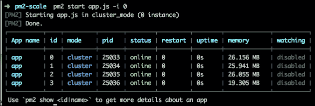

PM2 显示以集群模式运行的四个服务

PM2 已经成功猜测到了我们计算机的 CPU 核心数，就我而言，这是一台有四个核心的 iMac，如下图所示：

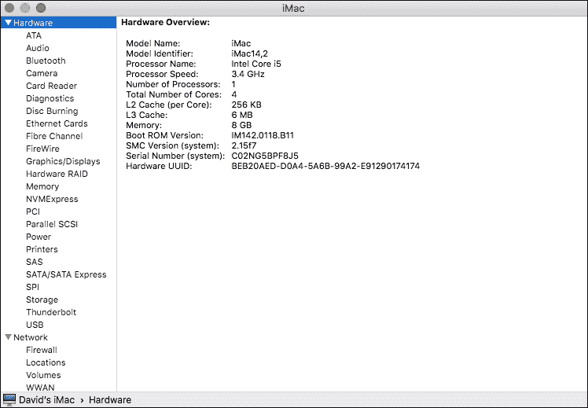

如你在`pstree`中所看到的，PM2 在操作系统级别启动了四个线程，如下图所示：

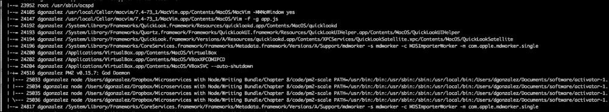

在集群应用程序时，有一个关于应用程序应该使用的核心数的不成文规定，这个数字是核心数减一。

这个数字背后的原因是操作系统需要一些 CPU 功率，所以如果我们在应用程序中使用了所有的 CPU，一旦操作系统开始执行一些其他任务，它将强制进行上下文切换，因为所有的核心都将忙碌，这将减慢应用程序的速度。

# 负载均衡我们的应用程序

有时，仅仅对应用程序进行集群处理是不够的，我们需要水平扩展我们的应用程序。

有许多方法可以水平扩展应用程序。如今，随着云服务提供商如亚马逊，每个提供商都实现了自己的解决方案，并具有许多功能。

我最喜欢的负载均衡实现方式之一是使用**NGINX**。

NGINX 是一个专注于并发和低内存使用的 Web 服务器。它也非常适合 Node.js 应用程序，因为从 Node.js 应用程序中提供静态资源是极不鼓励的。主要原因是避免应用程序因为一个可以用另一个软件更好地完成的任务而承受压力，比如 NGINX（这是另一个专业化的例子）。

然而，让我们专注于负载均衡。下图显示了 NGINX 作为负载均衡器的工作原理：

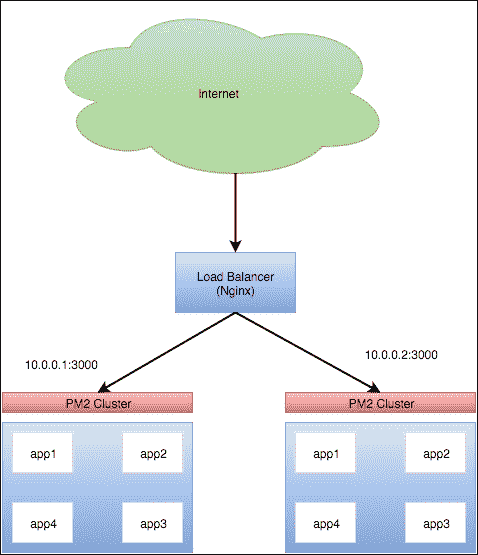

正如你在前面的图表中所看到的，我们有两个 PM2 集群通过一个 NGINX 实例进行负载均衡。

我们需要做的第一件事是了解 NGINX 如何管理配置。

在 Linux 上，可以通过`yum`、`apt-get`或任何其他软件包管理器安装 NGINX。它也可以从源代码构建，但除非你有非常特定的要求，否则推荐的方法是使用软件包管理器。

默认情况下，主配置文件是`/etc/nginx/nginx.conf`，如下所示：

```js
user  nginx;
worker_processes  1;

error_log  /var/log/nginx/error.log warn;
pid        /var/run/nginx.pid;

events {
  worker_connections  1024;
}

http {
  include                     /etc/nginx/mime.types;
  default_type                application/octet-stream;

  log_format          main '$remote_addr - $remote_user [$time_local] "$request" '
     '$status $body_bytes_sent "$http_referer" '
     '"$http_user_agent" "$http_x_forwarded_for" '
     '$request_time';

  access_log                  /var/log/nginx/access.log  main;
  server_tokens               off;
  sendfile                    on;
  #tcp_nopush                 on;
  keepalive_timeout           65s;
  send_timeout                15s;
  client_header_timeout       15s;
  client_body_timeout         15s;
  client_max_body_size        5m;
  ignore_invalid_headers      on;
  fastcgi_buffers             16 4k;
  #gzip                       on;
  include                     /etc/nginx/sites-enabled/*.conf;
}
```

这个文件非常简单，它指定了工作进程的数量（记住，用于处理请求的进程），错误日志的位置，工作进程在同一时间可以拥有的活动连接数，最后是 HTTP 配置。

最后一行是最有趣的：我们正在告诉 NGINX 使用`/etc/nginx/sites-enabled/*.conf`作为潜在的配置文件。

有了这个配置，指定文件夹中以`.conf`结尾的每个文件都将成为 NGINX 配置的一部分。

如你所见，那里已经存在一个默认文件。将其修改为如下所示：

```js
http {
  upstream app {
    server 10.0.0.1:3000;
    server 10.0.0.2:3000;
  }
  server {
    listen 80;
    location / {
      proxy_pass http://app;
    }
  }
}
```

这就是我们构建负载均衡器所需的所有配置。让我们在下面解释一下：

+   `upstream app`指令创建了一个名为`app`的服务组。在这个指令中，我们指定了两个服务器，就像在前面的图片中看到的那样。

+   `server`指令指定 NGINX 应监听来自端口`80`的所有请求，并将它们传递给名为`app`的上游服务组。

现在，NGINX 如何决定将请求发送到哪台计算机？

在这种情况下，我们可以指定用于分散负载的策略。

默认情况下，当没有特定配置负载均衡方法时，NGINX 使用**轮询**。

需要记住的一件事是，如果我们使用轮询，我们的应用程序应该是无状态的，因为我们不会总是命中同一台机器，所以如果我们在服务器上保存状态，可能在下一次调用时不会存在。

轮询是将工作队列中的负载以最基本的方式分配给多个工作节点的方法；它会使它们轮换，以便每个节点获得*相同数量的请求*。

还有其他机制来分散负载，如下所示：

```js
  upstream app {
    least_conn;
    server 10.0.0.1:3000;
    server 10.0.0.2:3000;
  }
```

**最少连接**，顾名思义，将请求发送到连接最少的节点，平均分配负载到所有节点：

```js
  upstream app {
    ip_hash;
    server 10.0.0.1:3000;
    server 10.0.0.2:3000;
  }
```

**IP 散列**是一种有趣的负载分配方式。如果您曾经使用过任何 Web 应用程序，会发现会话的概念几乎存在于任何应用程序中。为了记住用户是谁，浏览器会向服务器发送一个 cookie，服务器在内存中存储了用户是谁以及该用户需要/可以访问的数据。负载均衡的另一种类型的问题在于我们不能保证总是命中同一台服务器。

例如，如果我们使用最少连接作为负载均衡的策略，我们可能在第一次负载中命中服务器一次，但在后续重定向中命中不同的服务器，这将导致用户无法显示正确的信息，因为第二个服务器不知道用户是谁。

使用 IP 散列，负载均衡器将为给定的 IP 计算一个哈希值。这个哈希值将以某种方式导致一个从 1 到*N*的数字，其中*N*是服务器的数量，然后，只要用户保持相同的 IP，用户将始终被重定向到同一台机器。

我们还可以对负载均衡应用权重，如下所示：

```js
  upstream app {
    server 10.0.0.1:3000 weight=5;
    server 10.0.0.2:3000;
  }
```

这将以这样的方式分配负载，即对于每六个请求，五个将被定向到第一台机器，一个将被定向到第二台机器。

一旦我们选择了首选的负载均衡方法，就可以重新启动 NGINX 以使更改生效，但首先，我们希望验证它们，如下图所示：

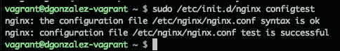

正如您所看到的，配置测试可以在避免配置灾难方面非常有帮助。

一旦 NGINX 通过了`configtest`，就可以保证 NGINX 能够在没有任何语法问题的情况下进行“重新启动/启动/重新加载”，如下所示：

```js
sudo /etc/init.d/nginx reload

```

重新加载将优雅地等待旧线程完成，然后重新加载配置并使用新配置路由新请求。

如果您有兴趣了解 NGINX，我发现以下官方文档对 NGINX 非常有帮助：

[`nginx.org/en/docs/`](http://nginx.org/en/docs/)

## NGINX 的健康检查

健康检查是负载均衡器上的重要活动之一。如果其中一个节点遭受严重的硬件故障，无法提供更多请求，会发生什么？

在这种情况下，NGINX 带有两种健康检查类型：**被动**和**主动**。

### 被动健康检查

在这里，NGINX 被配置为反向代理（就像我们在前一节中所做的那样）。它对来自上游服务器的某种类型的响应做出反应。

如果出现错误，NGINX 将标记节点为故障，从负载均衡中移除一段时间，然后重新引入*。通过这种策略，失败次数将大大减少，因为 NGINX 将不断地从负载均衡器中移除节点。

还有一些可配置的参数，比如`max_fails`或`fail_timeout`，我们可以配置需要多少次失败才能将节点标记为无效，或者请求的超时时间。

### 主动健康检查

与被动健康检查不同，主动健康检查会主动向上游服务器发出连接，以检查它们是否正确响应正在经历的问题。

NGINX 中用于主动健康检查的最简单配置如下：

```js
http {
  upstream app {
    zone app test;
    server 10.0.0.1:3000;
    server 10.0.0.2:3000;
  }
  server {
    listen 80;
    location / {
      proxy_pass http://app;
      health_check;
    }
  }
}
```

在这个配置文件中有两行新的内容，如下所示：

+   `health_check`: 这启用了主动健康检查。默认配置是每五秒向在`upstream`部分指定的主机和端口发起连接。

+   `zone app test`: 当启用健康检查时，NGINX 配置需要这个。

有各种选项可以配置更具体的健康检查，所有这些选项都可以在 NGINX 配置中找到，可以组合以满足不同用户的需求。

# 总结

在本章中，您学习了一系列可以用来部署微服务的技术。到目前为止，您已经知道如何构建、部署和配置软件组件，使我们能够使非常多样化的技术同质化。本书的目标是为您提供开始使用微服务所需的概念，并使读者知道如何寻找所需的信息。

就个人而言，我一直在努力寻找一本提供微服务生命周期各个方面总结的书籍，我真的希望这本书填补了这个空白。
