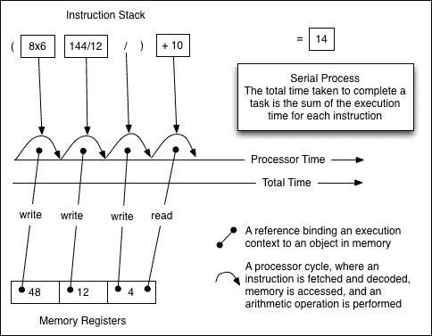
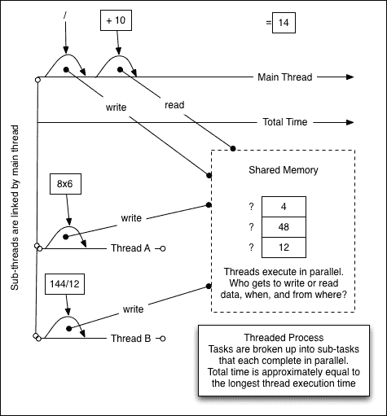

# 第一章： 欣赏 Node

在撰写本书时，Node 正接近其存在的第五个年头，其使用量在这五年中逐年增长。Node 失败的机会已经到来，并且已经过去。Node 是由一支技术精湛的核心团队和非常活跃的社区构建的严肃技术，他们专注于不断改进其速度、安全性和实用性。

每天开发者都会面临 NodeJS 旨在解决的问题。以下是一些例子：

+   在单个服务器之外扩展网络应用程序

+   防止 I/O 瓶颈（数据库、文件和网络访问）

+   监控系统使用情况和性能

+   测试系统组件的完整性

+   安全可靠地管理并发

+   将代码更改和错误修复推送到生产环境

在本书中，我们将探讨部署、扩展、监控、测试和维护您的 Node 应用程序的技术。重点将放在如何将 Node 的事件驱动、非阻塞模型应用于软件设计和部署的这些方面。

在 2014 年 2 月 28 日，Eran Hammer 向由 PayPal 组织和赞助的大型开发者会议 NodeDay 的与会者发表了主题演讲。他开始演讲时，列举了一些与他雇主沃尔玛相关的数字：

+   11,000 家门店

+   每年半兆美元的净销售额

+   2.2 百万名员工

+   世界上最大的私营雇主

他继续说道：

|    | *"55%的黑色星期五流量，这是我们一年中的超级碗……我们在黑色星期五实现了大约 40%的年度收入。55%的流量来自移动端……这 55%的流量 100%通过 Node 完成。[...] 我们能够处理...如此巨大的流量，只需要相当于两个 CPU 和 30 吉字节 RAM。就是这样。这就是 Node 在黑色星期五处理 100%移动端 Node 流量的需求。[...] 沃尔玛全球电子商务业务价值 100 亿美元，到今年年底，所有这 100 亿美元都将通过 Node 完成。"[...] |    |
| --- | --- | --- |
|    | --*Eran Hammer，沃尔玛实验室高级架构师* |

由于各种原因，现代网络软件的复杂性正在增长，并且在许多方面改变了我们思考应用程序开发的方式。大多数新的平台和语言都在试图应对这些变化。Node 也不例外——JavaScript 也不例外。

了解 Node 意味着了解事件驱动编程、将软件模块化、创建和链接数据流，以及产生和消费事件及其相关数据。基于 Node 的架构通常由许多小型进程和/或服务组成，它们通过事件进行通信——内部通过扩展`EventEmitter`接口和使用回调，外部通过几个常见的传输层之一（例如，HTTP、TCP）或通过覆盖这些传输层之一的薄消息层（例如，0MQ、Redis PUBSUB 和 Kafka）。这些进程可能由几个免费、开源且高质量的**npm**模块组成，每个模块都附带单元测试和/或示例和/或文档。

在本章中，我们将快速浏览 Node，突出其旨在解决的问题、其设计所暗示的解决方案以及这对你的意义。我们还将简要讨论一些我们将在后续章节中更全面探讨的核心主题，例如如何构建高效稳定的 Node 服务器、如何最好地利用 JavaScript 为你的应用程序和团队服务，以及如何思考和利用 Node 以获得最佳效果。

让我们从理解 Node 设计的方式和原因开始。

# 理解 Node 的独特设计

I/O 操作（磁盘和网络）显然更昂贵。以下表格显示了典型系统任务消耗的时钟周期（来自 Ryan Dahl 的原始演示——[`www.youtube.com/watch?v=ztspvPYybIY`](https://www.youtube.com/watch?v=ztspvPYybIY)）：

| **L1-cache** | 3 周期 |
| --- | --- |
| **L2-cache** | 14 周期 |
| **RAM** | 250 周期 |
| **Disk** | 41,000,000 周期 |
| **Network** | 240,000,000 周期 |

原因很清楚：磁盘是一个物理设备，一个旋转的金属盘片——存储和检索数据比在固态设备（如微处理器和内存芯片）之间移动数据或确实在片上优化的 L1/L2 缓存中操作要慢得多。同样，数据在网络上的点对点传输不会瞬间完成。光本身需要 0.1344 秒才能绕地球一周！在一个由数十亿人使用、在远距离以远低于光速的速度进行大量交互、有许多迂回和很少直线的网络中，这种延迟会累积起来。

当我们的软件在我们的办公桌上运行在个人电脑上时，网络上几乎没有通信发生。与文字处理器或电子表格交互中的延迟或中断与磁盘访问时间有关。我们做了大量工作来提高磁盘访问速度。数据存储和检索变得更快，软件变得更加响应，现在用户期望他们的工具具有这种响应性。

随着云计算和基于浏览器的软件的出现，你的数据已经离开了本地磁盘，存在于远程磁盘上，而你通过网络——互联网来访问这些数据。数据访问时间再次变慢，大幅下降。网络 I/O 速度缓慢。尽管如此，越来越多的公司将他们的应用程序的部分迁移到*云*中，有些软件完全是基于网络的。

Node 被设计成使 I/O 快速。它被设计用于这个新的网络软件世界，其中数据存在于许多地方，并且必须快速组装。许多用于构建 Web 应用程序的传统框架是在这样一个时代设计的，当时单个用户在台式计算机上使用浏览器定期向运行关系型数据库的单个服务器发出 HTTP 请求。现代软件必须预测成千上万的客户端同时通过各种网络协议在任何数量的独特设备上并发地更改巨大的共享数据池。Node 被特别设计来帮助那些构建这种网络软件的人。

并发、并行性、异步执行、回调和事件对 Node 开发者意味着什么？

## 并发

按顺序或程序性地运行代码是一个合理的想法。当我们执行任务时，我们往往会这样做，而且长期以来，编程语言都是自然程序性的。显然，在某个时刻，你发送给处理器的指令必须以可预测的顺序执行。如果我想将 8 乘以 6，然后将结果除以 144 除以 12，最后将总和加到 10 上，这些操作的顺序必须按顺序进行：

```js
( (8x6) / (144/12) ) + 10
```

操作的顺序不应该是以下这样：

```js
(8x6) / ( (144/12) + 10 )
```

这是有逻辑的，也容易理解。早期的计算机通常只有一个处理器，处理一个指令会阻止后续指令的处理。但事情并没有保持这种状态，我们已经远远超越了单核计算机。

如果你考虑之前的例子，应该很明显，计算`144/12`和`8x6`可以独立完成——一个不需要等待另一个。一个问题可以被分解成更小的问题，并分布到一组可用的人或工人中并行处理，然后将结果组合成一个正确排序的最终计算。

同时解决单个数学问题的一个部分，多个进程的例子是**并行性**。

Google 的 Go 编程语言的共同发明者 Rob Pike 这样定义**并发**：

> *"并发是一种构建事物的方式，这样你就可以，也许，利用并行性做得更好。但并行性不是并发的目标；并发的目标是良好的结构。"*

并发不是并行。一个表现出并发的系统允许开发者构建应用程序，*好像*多个独立的过程同时执行许多可能相关的事情。成功的高并发应用程序开发框架提供了一个易于理解的词汇表来描述和构建这样的系统。

Node 的设计表明，实现其主要目标——提供一种简单的方式来构建可扩展的网络程序——包括简化共存进程的执行顺序的结构和组成。Node 帮助开发者更好地组织代码，在程序中许多事情同时发生（例如，服务多个并发客户端）时，更好地思考程序。

让我们来看看并行性和并发性、线程和进程之间的区别，以及 Node 如何以独特的方式吸收每个部分的优点。

## 并行和线程

以下图描述了传统的微处理器可能如何执行之前讨论的简单程序：



程序被分解成单个指令，按顺序执行。这可行，但需要指令以串行方式处理，并且，在处理任何一条指令时，后续的指令必须等待。这是一个阻塞过程——执行链中的任何一段都会阻塞后续段的处理。这里有一个**单线程**的执行流。

然而，有一些好消息。处理器（实际上）完全控制着主板，没有其他处理器会清除内存或覆盖这个主要处理器可能操作的其他任何状态。速度是为了稳定性和安全性而牺牲的。

我们确实喜欢速度；然而，随着芯片设计师和系统程序员努力引入并行计算，之前讨论的模型迅速变得过时。目标不是只有一个阻塞线程，而是要有多条协作线程。

这种改进无疑提高了计算的效率，但也引入了一些问题，如下面的示意图所示：



此图说明了在单个进程中并行执行的协作线程，这减少了执行给定计算所需的时间。使用不同的线程来分解、解决和组合解决方案。由于许多子任务可以独立完成，整体完成时间可以显著减少。

线程在单个进程中提供并行性。一个线程代表一个单一的指令序列（顺序执行）。一个进程可以包含任意数量的线程。

线程同步的复杂性导致了困难。使用线程来模拟高度并发场景非常困难，尤其是在共享状态的模式中。如果异步执行的线程何时完成并不明确，那么很难预测一个线程采取的行动将如何影响所有其他线程：

+   共享内存及其所需的锁定行为导致系统在复杂性增加时变得非常难以推理。

+   任务之间的通信需要实现各种同步原语，如互斥锁和信号量、条件变量等。一个已经具有挑战性的环境需要高度复杂的工具，这增加了完成甚至相对简单系统所需的技能水平。

+   竞态条件和死锁是这类系统中的常见陷阱。在共享程序空间内同时进行的读写操作会导致序列化问题，其中两个线程可能在进行不可预测的*竞争*以获得影响状态、事件或其他关键系统特性的权利。

+   因为在线程及其状态之间保持可靠的边界如此困难，确保一个库（对于 Node 来说，它可能是一个*包*或*模块*）是线程安全的占据了开发者大量时间。我能知道这个库不会破坏我应用程序的某些部分吗？保证线程安全需要库开发者的极大勤奋，并且这些保证可能是条件性的：例如，一个库在读取时可能是线程安全的，但在写入时则不是。

我们希望利用线程提供的并行化能力，但可以不需要那些令人头疼的信号量和互斥锁的世界。在 Unix 世界中，有一个概念有时被称为**简单规则**：*开发者应该通过寻找将程序系统分解成小而直接的合作部分的方法来设计简单性。这个规则旨在阻止开发者对编写'复杂而美丽'的程序的喜爱，而这些程序实际上是有缺陷的程序*。

## 并发与进程

单个进程内的并行化是一个复杂的错觉，它是在令人费解的复杂芯片组和其它硬件深处实现的。真正的问题在于外观——关于系统的活动如何向开发者显示，以及如何被开发者编程。线程提供了超高效的并行化，但使得并发难以推理。

而不是让开发者与这种复杂性作斗争，Node 本身管理 I/O 线程，通过只要求在事件之间管理控制流来简化这种复杂性。需要**微观管理**I/O 线程；开发者只需设计一个应用程序来建立数据可用点（回调）以及当数据可用时要执行的指令。一条明确的指令流，以清晰、无冲突和可预测的方式明确地获取和释放控制，有助于开发：

+   与此同时，开发者不必担心任意的锁定和其他冲突，可以专注于构建执行链，其顺序是可预测的。

+   并行化是通过使用多个进程来实现的，每个进程都有自己的独立和独特的内存空间，因此进程间的通信保持简单——通过**简单法则**，我们不仅实现了简单且无错误的组件，还实现了更易于互操作。

+   状态不是（任意地）在单个 Node 进程之间共享的。单个进程自动受到来自其他进程的意外访问的保护，这些进程热衷于内存重新分配或资源垄断。通信是通过使用基本协议的清晰通道进行的，所有这些都使得编写在进程之间产生不可预测变化的程序变得非常困难。

+   线程安全是开发者无需浪费时间担忧的另一个问题。因为单线程并发消除了多线程并发中的冲突，开发可以更快地进行，并建立在更坚实的基础之上。

一个线程描述了由事件循环高效管理的异步控制流，为 Node 程序带来了稳定性、可维护性、可读性和弹性。最大的新闻是 Node 继续向开发者提供多线程的速度和力量——Node 设计的卓越之处使得这种力量变得透明，反映了 Node 声明的目标之一：以最少的困难将最多的力量带给最多的人。

## 事件

Node 中许多 JavaScript 扩展都会发出事件。这些是 `events.EventEmitter` 的实例。任何对象都可以扩展 `EventEmitter`，这为开发者提供了一个优雅的工具包，用于构建紧密的、异步的对象方法接口。

通过这个示例演示如何将 `EventEmitter` 对象设置为函数构造函数的原型。由于每个构造实例现在都将 `EventEmitter` 对象暴露给其原型链，`this` 提供了对事件**应用程序编程接口**（**API**）的自然引用。因此，`counter` 实例方法可以发出事件，并且可以监听这些事件。在这里，每当调用 `counter.increment` 方法时，我们都会发出最新的计数，并将回调绑定到“incremented”事件，该事件简单地打印当前计数器的值到命令行：

```js
var EventEmitter = require('events').EventEmitter;
var util = require('util');

var Counter = function(init) {
  this.increment = function() {
    init++;
    this.emit('incremented', init);
  }
}

util.inherits(Counter, EventEmitter);

var counter = new Counter(10);

var callback = function(count) {
  console.log(count);
}
counter.addListener('incremented', callback);

counter.increment(); // 11
counter.increment(); // 12
```

### 小贴士

**下载示例代码**

您可以从您在[`www.packtpub.com`](http://www.packtpub.com)的账户下载您购买的所有 Packt 书籍的示例代码文件。如果您在其他地方购买了这本书，您可以访问[`www.packtpub.com/support`](http://www.packtpub.com/support)并注册，以便将文件直接通过电子邮件发送给您。

要移除绑定到`counter`的事件监听器，请使用`counter.removeListener('incremented', callback)`。

`EventEmitter`作为一个可扩展的对象，增加了 JavaScript 的表达能力。例如，它允许以事件驱动的方式处理 I/O 数据流，符合 Node 的异步、非阻塞编程原则：

```js
var stream = require('stream');
var Readable = stream.Readable;
var util = require('util');

var Reader = function() {
  Readable.call(this);
  this.counter = 0;
}

util.inherits(Reader, Readable);

Reader.prototype._read = function() {
  if(++this.counter > 10) {
    return this.push(null);
  }
  this.push(this.counter.toString());
};

// When a #data event occurs, display the chunk.
//
var reader = new Reader();
reader.setEncoding('utf8');
reader.on('data', function(chunk) {
  console.log(chunk);
});
reader.on('end', function() {
  console.log('--finished--');
});
```

在这个程序中，我们有一个`Readable`流推送一系列数字——在该流的 data 事件上设置监听器，捕获发出的数字并记录它们——并在流结束时发送一条消息。很明显，监听器对每个数字只调用一次，这意味着运行这个集合并没有阻塞事件循环。因为 Node 的事件循环只需要承诺资源来处理回调，所以在每个事件的下一次空闲时间可以处理许多其他指令。

## 事件循环

在非网络软件中看到的代码通常是同步的或阻塞的。以下伪代码中的 I/O 操作也是阻塞的：

```js
variable = produceAValue()
print variable
// some value is output when #produceAValue is finished.
```

以下迭代器将一次读取一个文件，输出其内容，然后读取下一个文件，直到完成：

```js
fileNames = ['a','b','c']
while(filename = fileNames.shift()) {
  fileContents = File.read(filename)
  print fileContents
}
//	> a
//	> b
//	> c
```

这是一个适用于许多情况的优秀模型。然而，如果这些文件非常大呢？如果每个文件都需要 1 秒钟来获取，那么所有文件都需要 3 秒钟来获取。对一个文件的检索总是等待另一个检索完成，这既低效又慢。使用 Node，我们可以同时启动所有文件的读取操作：

```js
var fs = require('fs');
var fileNames = ['a','b','c'];
fileNames.forEach(function(filename) {
  fs.readFile(filename, {encoding:'utf8'}, function(err, content) {
    console.log(content);
  });
});
//	> b
//	> a
//	> c
```

Node 版本将一次性读取所有三个文件，每次调用`fs.readFile`都会在未来的某个未知时刻返回其结果。这就是为什么我们无法总是期望文件按它们被数组化的顺序返回。我们可以期望所有三个文件在大约一个文件被检索所需的时间内返回——这比 3 秒要少。我们为了速度而牺牲了可预测的执行顺序，并且，就像线程一样，在并发环境中实现同步需要额外的工作。我们如何管理和描述不可预测的数据事件，以便我们的代码既易于理解*又*高效？

Node 的设计者做出的关键设计选择是实现事件循环作为并发管理器。以下关于事件驱动编程的描述（摘自[`www.princeton.edu/~achaney/tmve/wiki100k/docs/Event-driven_programming.html`](http://www.princeton.edu/~achaney/tmve/wiki100k/docs/Event-driven_programming.html)）不仅清楚地描述了事件驱动范式，而且还介绍了 Node 中事件的处理方式以及 JavaScript 为何是这种范式的理想语言：

> *"在计算机编程中，事件驱动编程或基于事件的编程是一种编程范式，其中程序的流程由事件决定——即传感器输出或用户操作（鼠标点击、按键）或其他程序或线程的消息。"*
> 
> *事件驱动编程也可以被定义为一种应用程序架构技术，其中应用程序有一个主循环，该循环被明确地分为两个部分：第一部分是事件选择（或事件检测），第二部分是事件处理 [...]*
> 
> *事件驱动程序可以用任何语言编写，尽管在提供高级抽象的语言中这项任务更容易完成，例如闭包。"*

正如前述引用中看到的，单线程执行环境会阻塞，因此可能会运行缓慢。V8 为 JavaScript 程序提供单个执行线程。

如何使这个单线程更高效？

Node 通过将许多阻塞操作委托给操作系统子系统来处理，仅在可用数据时才打扰主 V8 线程，从而使单个线程更高效。主线程（你正在执行的 Node 程序）通过传递回调来对某些数据（例如通过`fs.readFile`）表示关注，并在数据可用时得到通知。在此数据到达之前，不会对 V8 的主 JavaScript 线程造成进一步负担。如何做到？Node 将 I/O 工作委托给**libuv**，如[`nikhilm.github.io/uvbook/basics.html#event-loops`](http://nikhilm.github.io/uvbook/basics.html#event-loops)中引用的那样：

> *"在事件驱动编程中，应用程序对某些事件表示关注，并在它们发生时做出响应。从操作系统或监控其他事件源收集事件的责任由 libuv 处理，用户可以注册回调，以便在事件发生时调用。"*

前述引用中的*用户*是执行 JavaScript 程序的 Node 进程。*回调*是 JavaScript 函数，Node 通过事件循环管理回调的调用，以管理用户的回调调用。Node 管理由 libuv 填充的 I/O 请求队列，libuv 负责轮询操作系统以获取 I/O 数据事件，并将结果传递给 JavaScript 回调。

考虑以下代码：

```js
var fs = require('fs');
fs.readFile('foo.js', {encoding:'utf8'}, function(err, fileContents) {
  console.log('Then the contents are available', fileContents);
});
console.log('This happens first');
```

本程序将产生以下输出：

```js
> This happens first
> Then the contents are available, [file contents shown]

```

当 Node 执行此程序时，它会做以下操作：

+   Node 加载`fs`模块。这提供了对`fs.binding`的访问，它是在`src/node.cc`中定义的静态类型映射，它提供了 C++和 JS 代码之间的粘合剂。([`groups.google.com/forum/#!msg/nodejs/R5fDzBr0eEk/lrCKaJX_6vIJ`](https://groups.google.com/forum/#!msg/nodejs/R5fDzBr0eEk/lrCKaJX_6vIJ))。

+   `fs.readFile`方法接收指令和 JavaScript 回调。通过`fs.binding`，libuv 被通知文件读取请求，并传递由原始程序发送的特别准备好的回调版本。

+   libuv 在其自己的线程池中调用必要的操作系统级函数来读取文件。

+   JavaScript 程序继续，打印`This happens first`。因为有一个未解决的回调，事件循环继续旋转，等待该回调解决。

+   当文件描述符被操作系统完全读取后，libuv（通过内部机制）会得到通知，并将回调传递给 libuv，这实际上是为原始 JavaScript 回调准备重新进入主（V8）线程。

+   原始 JavaScript 回调被推送到事件循环队列，并在循环的下一个 tick 上调用。

+   文件内容被打印到控制台。

+   由于飞行过程中没有进一步的回调，进程退出。

在这里，我们看到 Node 实现快速、可管理和可扩展 I/O 的关键思想。例如，如果在前面的程序中对`'foo.js'`进行了 10 次读取调用，执行时间仍然大致相同。每次调用都会在 libuv 线程池中的自己的线程中**并行**执行。尽管我们用“JavaScript”编写了代码，但实际上我们部署了一个非常高效的**多线程执行引擎**，同时避免了线程管理的困难。

让我们以更多细节结束，具体说明 libuv 结果是如何返回到主线程的事件循环中的。

当套接字或其他流接口上有数据可用时，我们不能立即执行我们的回调。JavaScript 是单线程的，所以结果必须同步。我们无法在事件循环的 tick 过程中突然改变状态——这会创建一些经典的多线程应用程序问题，如竞态条件、内存访问冲突等。

当进入事件循环时，Node（实际上）复制了当前的指令队列（也称为**栈**），清空了原始队列，并执行其副本。处理这个指令队列的过程被称为**tick**。如果在开始这个 tick 时复制的指令链在单个主线程（V8）上异步接收结果（作为回调包装），这些结果（包装为回调）将被排队。一旦当前队列被清空，其最后一条指令完成，队列再次检查是否有指令要在下一个 tick 上执行。这种检查和执行队列的模式将重复（循环）直到队列为空，并且不再期望有进一步的数据事件，此时 Node 进程退出。

### 注意

在[`github.com/joyent/node/issues/5798`](https://github.com/joyent/node/issues/5798)上，一些核心 Node 开发者关于`process.nextTick`和`setImmediate`实现的讨论提供了关于事件循环如何操作的非常精确的信息。

以下是一些被喂入队列的 I/O 事件：

+   **执行块**：这些是 Node 程序的 JavaScript 代码块；它们可以是表达式、循环、函数等。这包括在当前执行上下文中发出的`EventEmitter`事件。

+   **定时器**: 这些是在未来某个时间点（以毫秒为单位）延迟执行的回调函数，例如`setTimeout`和`setInterval`。

+   **I/O**: 这些是在委托给 Node 的管理线程池（如文件系统调用和网络监听器）后返回主线程的准备好的回调函数。

+   **延迟执行块**: 这些主要是根据`setImmediate`和`process.nextTick`的规则在堆栈上定位的函数。

有两件重要的事情需要记住：

+   你不能启动和/或停止事件循环。事件循环在进程启动时开始，在没有任何进一步回调需要执行时结束。因此，事件循环可能永远运行。

+   事件循环在单个线程上执行，但将 I/O 操作委托给 libuv，它管理一个线程池，并行化这些操作，并在结果可用时通知事件循环。通过多线程的效率强化了一个易于理解的单一线程编程模型。

要了解更多关于 Node 如何绑定到 libuv 和其他核心库的信息，请解析`fs`模块代码[`github.com/joyent/node/blob/master/lib/fs.js`](https://github.com/joyent/node/blob/master/lib/fs.js)。比较`fs.read`和`fs.readSync`方法，以观察同步和异步操作实现的差异——注意传递给`fs.read`中本地`binding.read`方法的`wrapper`回调。

要更深入地了解 Node 的设计核心，包括队列实现，请阅读 Node 源代码[`github.com/joyent/node/tree/master/src`](https://github.com/joyent/node/tree/master/src)。在`fs_event_wrap.cc`和`node.cc`中的`MakeCallback`跟踪，调查`req_wrap`类，它是 V8 引擎的包装器，在`node_file.cc`和其他地方部署，并在`req_wrap.h`中定义。

# Node 的设计对系统架构师的影响

Node 是一种新技术。在撰写本文时，它尚未达到 1.0 版本。已经发现并修复了安全漏洞。已经发现并修复了内存泄漏。在本章开头提到的 Eran Hammer 以及他在沃尔玛实验室的整个团队积极地为 Node 代码库做出贡献——特别是在他们发现漏洞时！许多其他致力于 Node 的大型公司也是如此，例如 PayPal。

如果你选择了 Node，并且你的应用程序已经增长到这样一个规模，以至于你觉得你需要阅读一本关于如何部署 Node 的书，那么你不仅有从社区中受益的机会，也许还能在实际上基于你的特定需求设计环境的一些方面。Node 是开源的，你可以提交 pull 请求。

除了事件之外，还有两个关键的设计方面，如果你打算进行高级 Node 工作，那么理解它们是很重要的：用小部分构建你的系统，并在它们之间传输数据时使用事件流。

## 从小系统构建大型系统

在他的书《Unix 编程艺术》中，埃里克·雷蒙德提出了**模块化法则**：

> *"开发者应该用简单部分构建程序，这些部分通过定义良好的接口连接，这样问题就是局部的，程序的某些部分可以在未来的版本中替换，以支持新功能。这个规则旨在节省调试复杂代码的时间，这些代码复杂、长且难以阅读。"*

这种从“小部件，松散连接”构建复杂系统的想法在管理理论、政府理论、制造业和其他许多环境中都可以看到。在软件开发方面，它建议开发者在更大的系统中只贡献最简单、最有用的组件。大型系统难以推理，特别是如果它们的组件边界模糊的话。

在构建可扩展的 JavaScript 程序时，主要困难之一是缺乏一个标准接口来将许多较小的程序组合成一个连贯的程序。例如，一个典型的 Web 应用程序可能会使用一系列的`<script>`标签在**超文本标记语言**（**HTML**）文档的`<head>`部分加载依赖项：

```js
<head>
  <script src="img/fileA.js"></script>
  <script src="img/fileB.js"></script>
</head>
```

这种类型的系统存在许多问题：

+   所有潜在的依赖项必须在需要之前声明——动态包含需要复杂的*技巧*。

+   引入的脚本没有被强制封装——没有任何东西阻止两个文件写入同一个全局对象。命名空间可以轻易冲突，这使得任意注入变得危险。

+   `fileA`不能将`fileB`作为一个集合来引用——没有可寻址的上下文，例如`fileB.method`是不可用的。

+   `<script>`方法本身并不系统，这阻碍了设计有用的模块服务，如依赖项意识和版本控制。

+   脚本不能轻易地移除或覆盖。

+   由于这些危险和困难，共享并非易事，从而减少了在开放生态系统中协作的机会。

在应用程序中随意插入不可预测的代码片段会挫败预测性地塑造功能性的尝试。需要的是一种标准的方式来加载和共享离散的程序模块。

因此，Node 引入了**包**的概念，遵循 CommonJS 规范。包是一组程序文件，与描述集合的清单文件捆绑在一起。依赖项、作者、目的、结构和其他重要元数据以标准方式公开。这鼓励从许多小型、相互依赖的系统构建大型系统。也许更重要的是，它鼓励共享：

|   | *"我在这里描述的不是技术问题。这是人们聚在一起，做出决定，向前迈出一步，一起开始构建更大、更酷的东西的问题。" |   |
| --- | --- | --- |
|   | --*CommonJS 的创造者凯文·丹古尔* |

在许多方面，Node 的成功归功于开发者社区中通过 Node 的包管理系统**npm**分发的包的数量和质量的增长。这个系统在很大程度上帮助 JavaScript 成为系统编程的一个可行且专业的选择。

### 注意

对于 Node 新用户来说，可以在以下链接找到对 npm 的良好介绍：[`www.npmjs.org/doc/developers.html`](https://www.npmjs.org/doc/developers.html)。

## 流

在他的著作《C++编程语言，第三版》中，Bjarne Stroustrup 表示：

> *"为编程语言设计并实现一个通用的输入/输出设施是出了名的困难。[...] 输入/输出设施应该易于使用、方便且安全；高效且灵活；最重要的是，完整。"*

一个专注于提供高效和简单 I/O 的设计团队通过 Node 提供这样的功能，这并不会让任何人感到惊讶。通过一个对称且简单的接口，该接口处理数据缓冲区和流事件，使得实现者无需自己处理，Node 的`Stream`模块是管理异步数据流的优选方式，对于内部模块，以及开发者可能创建的模块来说，也是如此。

### 注意

可以在[`github.com/substack/stream-handbook`](https://github.com/substack/stream-handbook)找到关于`Stream`模块的优秀教程。此外，Node 文档在[`nodejs.org/api/stream.html`](http://nodejs.org/api/stream.html)上非常全面。

在 Node 中，流简单地说是一系列字节，或者如果你愿意，是一系列字符。在任何时候，流都包含一个字节缓冲区，这个缓冲区的长度为零或更多。

由于流中的每个字符都有明确的定义，并且每种数字数据都可以用字节表示，因此流的任何部分都可以重定向，或*管道化*到任何其他流，流的不同部分可以发送到不同的处理器。这样，流输入和输出接口既灵活又可预测，并且可以轻松耦合。

除了事件之外，Node 以其对流的全面使用而独特。继续将应用程序组合成许多小进程，这些进程发出事件或对事件做出反应的想法，Node 的几个 I/O 模块和功能都作为流实现。网络套接字、文件读取器和写入器、stdin 和 stdout、Zlib 等，都是可以通过抽象的`Stream`接口轻松连接的数据生产者和/或消费者。熟悉 Unix 管道的人会看到一些相似之处。

通过抽象的`Stream`接口暴露了五个不同的基类：`Readable`、`Writable`、`Duplex`、`Transform`和`PassThrough`。每个基类都继承自`EventEmitter`，这是我们已知的事件监听器和发射器可以绑定到的接口。Node 中的流是事件流，进程间数据传输通常使用流来完成。因为流可以轻松地链式连接和组合，它们是 Node 开发者的重要工具。

建议你在进一步学习之前，对什么是流以及它们在 Node 中的实现有一个清晰的理解，因为我们将在这本书的整个过程中广泛使用流。

# 使用全栈 JavaScript 发挥最大效用

JavaScript 已经成为一种全栈语言。所有浏览器都存在本地的 JavaScript 运行时。Node 使用的 JavaScript 解释器 V8，是谷歌 Chrome 浏览器背后的同一引擎。而且，该语言已经超越了覆盖软件栈的客户端和服务器层。JavaScript 用于查询 CouchDB 数据库，使用 MongoDB 进行 map/reduce，以及在 ElasticSearch 集合中查找数据。广受欢迎的**JavaScript 对象表示法**（**JSON**）数据格式只是将数据表示为 JavaScript 对象。

当同一应用程序中使用不同的语言时，上下文切换的成本会增加。如果一个系统由用不同语言描述的部分组成，那么系统架构就变得更加难以描述、理解和扩展。如果系统的不同部分“说”不同的语言，每次跨方言的对话都需要昂贵的翻译。

理解上的低效会导致更高的成本和更脆弱的系统。这个系统的工程团队每个成员都必须精通这些多种语言，或者根据不同的技能组合成小组；工程师的寻找和/或培训成本高昂。当系统的关键部分对除了少数工程师之外的人都变得不透明时，跨团队协作很可能会减少，这使得产品升级和新增功能变得更加困难，并可能导致更多错误。

当这些困难减少或消除时，会打开哪些新的机会？

## 热代码

因为你的客户端和服务器将使用相同的语言，每个都可以将代码传递给对方以原生方式执行。如果你正在构建一个 Web 应用程序，这会打开非常有趣（且独特）的机会。

例如，考虑一个允许一个客户端对另一个环境进行更改的应用程序。这个工具允许软件开发者更改网站的 JavaScript，并允许他们的客户在浏览器中实时看到这些更改。这个应用程序必须做的事情是将实时代码在许多浏览器中转换，以便它反映更改。完成这一目标的一种方法是将更改集捕获到一个转换函数中，将该函数传递给所有连接的客户端，并在他们的本地环境中执行该函数，以更新它以反映 *规范* 视图。一个应用程序在演变时，会在 JavaScript 代码中发出一个 *遗传* 更新，其余的物种也会类似地演变。我们将在 第七章 *部署和维护* 中使用这种技术。

由于 Node 共享相同的 JavaScript 代码库，Node 服务器可以主动采取此行动。网络本身可以向其客户端广播要执行的代码。同样，客户端也可以向服务器发送代码以执行。很容易看出这如何允许热代码推送，其中 Node 进程向特定客户端发送一个唯一的原始 JavaScript 数据包以执行。

当 **远程过程调用** (**RPC**) 不再需要中介层来在通信上下文之间进行翻译时，代码可以在网络中的任何地方存在，所需的时间或短或长，并且可以在多个上下文中执行，这些上下文的选择基于负载均衡、数据意识、计算能力、地理精度等因素。

## Browserify

JavaScript 是 Node 和浏览器共有的语言。然而，Node 显著扩展了 JavaScript 语言，添加了许多客户端开发者不可用的命令和其他结构。例如，JavaScript 中没有与核心 Node `Stream` 模块等效的模块。

此外，npm 仓库正在迅速增长，在撰写本文时，包含超过 80,000 个 Node 包。其中许多包在客户端以及 Node 环境中同样有用。JavaScript 传播到服务器实际上创建了两个协作线程，产生了企业级的 JavaScript 库和模块。

**Browserify** 的开发是为了使共享 **npm** 模块和核心 Node 模块变得容易，并且可以无缝地与客户端一起使用。一旦一个包被 *browserified*，它就可以使用标准的 `<script>` 标签轻松地导入到浏览器环境中。安装 Browserify 非常简单：

```js
npm install -g browserify

```

让我们构建一个示例。创建一个文件，`math.js`，就像编写 npm 模块一样：

```js
module.exports = function() {
  this.add = function(a, b) {
    return a + b;
  }
  this.subtract = function(a, b) {
    return a - b;
  }
};
```

接下来，创建一个程序文件，`add.js`，它使用此模块：

```js
var Math = require('./math.js');
var math = new Math;

console.log(math.add(1,3)); // 4
```

使用 Node 在命令行上执行此程序（`> node add.js`）将在您的终端上打印出 `4`。如果我们想在浏览器中使用我们的数学模块呢？客户端 JavaScript 没有使用 `require` 语句，所以我们将其 browserify：

```js
browserify math.js -o bundle.js

```

Browserify 会遍历您的代码，找到`require`语句，并将这些依赖（以及这些依赖的依赖）自动打包成一个文件，您可以将这个文件加载到您的客户端应用中：

```js
<script src="img/bundle.js"></script>
```

作为额外的奖励，这个包会自动将一些有用的 Node 全局变量引入到您的浏览器环境中：`__filename`、`__dirname`、`process`、`Buffer`和`global`。这意味着您在浏览器中可以使用例如`process.nextTick`。

### 注意

Browserify 的创建者 James Halliday 是 Node 社区的活跃贡献者。您可以在[`github.com/substack`](https://github.com/substack)访问他。此外，还有一个在线服务可以测试 browserified npm 模块，网址为 http://requirebin.com。完整文档可以在[`github.com/substack/node-browserify#usage`](https://github.com/substack/node-browserify#usage)找到。

另一个令人兴奋的项目，就像 Browserify 一样，利用 Node 来增强基于浏览器的 JavaScript 的功能，是**Component**。作者这样描述它：*Component 目前是 ES6 模块和 Web Components 的临时解决方案。当所有现代浏览器开始支持这些功能时，Component 将开始更多地关注语义版本控制和服务器端打包，因为浏览器将能够处理其余部分*。该项目仍在不断发展，但值得一观。以下是链接：[`github.com/componentjs/guide`](https://github.com/componentjs/guide)。

# 摘要

在本章中，我们快速浏览了 Node。您了解了一些关于它为什么被设计成这样的原因，以及为什么这种事件驱动环境是解决网络软件现代问题的良好解决方案。在解释了事件循环以及相关的并发和并行性概念之后，我们简要地讨论了 Node 的软件组合哲学，即从*小而松散连接的组件*构建软件。您了解了全栈 JavaScript 提供的特殊优势，并探索了由此带来的应用新可能性。

您现在对我们将要部署的应用类型有了很好的理解，这种理解将帮助您在构建和维护 Node 应用时看到独特的关注点和考虑因素。在下一章中，我们将直接进入使用 Node 构建服务器、托管这些应用的选项以及构建、打包和分发它们的想法。
