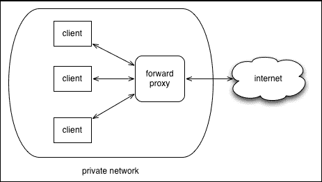
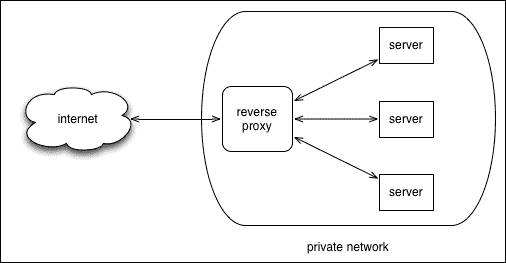
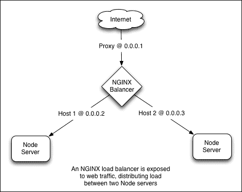
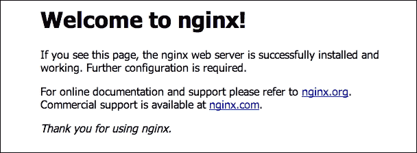
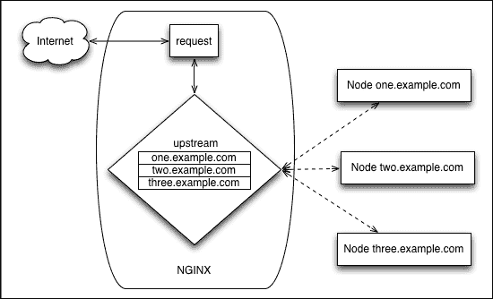

# 第三章。扩展 Node

与*并发*和*并行性*一样，*可伸缩性*和*性能*不是同一回事。

|   | *"性能"和"可伸缩性"这两个术语通常被互换使用，但两者是不同的：性能衡量单个请求可以执行的速率，而可伸缩性衡量请求在负载增加的情况下维持其性能的能力。例如，一个请求的性能可能报告为在 3 秒内生成有效的响应，但请求的可伸缩性衡量的是请求在用户负载增加时维持该 3 秒响应时间的能力。"* |   |
| --- | --- | --- |
|   | --*《Pro Java EE 5, Steve Haines》* |

审查员声称 Node 无法跨核心扩展，因此无法在特定机器上优化性能，这种情况并不少见。这种信念基于两个错误的印象——Node"不擅长"CPU 密集型任务，以及它*不能扩展*，因为它的进程只能利用单个核心。这些说法通常进一步扩展到关于 Node 声称的非阻塞性是错误的断言，主要是通过想象锁定的线程和未充分利用的硬件。

可伸缩的应用程序在增加的负载下保持响应。可伸缩的应用程序意味着可以根据客户端连接和资源需求（如更多内存或存储空间）的变化，向系统添加更多节点或从系统中移除节点。Node 旨在使概念化、描述和实现可伸缩网络应用程序变得容易。主要重点是创建一个工具包，用于构建由通过事件驱动的网络流连接并通过标准协议通信的多个节点组成的结构。分布式系统更关注故障而不是性能，出现的问题是：我们如何在运行系统中智能地交换、添加和移除节点？

### 注意

解决**C10K 问题**，即**优化网络套接字以同时处理大量客户端的问题**（[`en.wikipedia.org/wiki/C10k_problem`](https://en.wikipedia.org/wiki/C10k_problem)），是许多现代应用程序工具和环境的关键设计目标，包括 Node。

我们将探讨两种常见的扩展策略——垂直扩展和水平扩展。垂直扩展（*向上扩展*）涉及增加单个服务器处理增加负载的能力，通常是通过在单个盒子上增加 CPU、内存、存储空间等。水平扩展系统（*向外扩展*）通过添加或减少服务器或其他网络资源来响应负载。通过利用这两种技术中的任何一种或同时使用它们，可以部署可伸缩的 Node 解决方案。

# 在多个核心上垂直扩展

正如我们在第一章中讨论的，*欣赏 Node*，`libuv`在 Node 环境中用于管理多个 I/O 线程。操作系统本身也会调度线程，分配各种进程所需的工作。Node 提供了一种方式，让开发者可以通过创建和派生许多进程来利用这种操作系统级别的调度。在本节中，我们将学习如何将程序的任务分配给独立进程，以及如何将 Node 服务器的负载分配给多个协作服务器进程。

现代软件开发不再是单体程序的地盘。现代应用程序是分布式和松耦合的。我们现在构建的应用程序将用户与分布在整个互联网上的资源连接起来。许多用户同时访问共享资源。如果一个复杂系统被理解为一个解决一个或几个明确定义、相关问题的程序接口集合，那么它就更容易理解。在这样的系统中，预期（并且是所希望的）进程不应该处于空闲状态。

虽然单个 Node 进程在单个核心上运行，但可以通过使用`child_process`模块“启动”任意数量的 Node 进程。此模块的基本用法很简单：我们获取一个`ChildProcess`对象并监听数据事件。本例将调用 Unix 命令`ls`，列出当前目录：

```js
var spawn = require('child_process').spawn;
var ls  = spawn('ls', ['-lh', '.']);
ls.stdout.on('readable', function() {
 var d = this.read();
 d && console.log(d.toString());
});
ls.on('close', function(code) {
 console.log('child process exited with code ' + code);
});
```

在这里，我们在`ls`进程（列出目录）上使用`spawn`，并从结果的可读流中读取，接收类似以下内容：

```js
-rw-r--r-- 1 root root  43 Jul 9 19:44 index.html
-rw-rw-r-- 1 root root 278 Jul 15 16:36 child_example.js
-rw-r--r-- 1 root root 1.2K Jul 14 19:08 server.js

child process exited with code 0

```

可以以这种方式派生任意数量的子进程。这里需要注意的是，当派生或以其他方式创建子进程时，操作系统本身会将该进程的责任分配给特定的 CPU。Node 不负责操作系统如何分配资源。结果是，在具有八个核心的机器上，派生八个进程可能会导致每个进程被分配到独立的处理器。换句话说，子进程会自动由操作系统分配到 CPU 上，这反驳了 Node 不能充分利用多核环境的说法。

### 注意

每个新的 Node 进程（子进程）分配了 10 MB 的内存，并代表一个新的 V8 实例，该实例至少需要 30 毫秒才能启动。虽然你不太可能创建成千上万的这些进程，但了解如何查询和设置用户创建的进程的操作系统限制是有益的。你可以使用`htop`或`top`来报告当前正在运行的进程数，或者你可以从命令行使用`ps aux | wc –l`。Unix 命令`ulimit`([`ss64.com/bash/ulimit.html`](http://ss64.com/bash/ulimit.html))提供了关于操作系统上用户限制的重要信息。传递`ulimit`的`–u`参数将显示可以派生的最大用户进程数。通过传递参数来更改限制——`ulimit –u 8192`。

`child_process`模块代表一个类，公开四个主要方法：`spawn`、`fork`、`exec`和`execFile`。这些方法返回一个`ChildProcess`对象，它扩展了`EventEmitter`，公开了子事件接口，以及一些有助于管理子进程的函数。我们将查看其主要方法，并随后讨论常见的`ChildProcess`接口。

## `spawn(command, [arguments], [options])`

此强大命令允许 Node 程序通过系统命令启动和交互子进程。在先前的示例中，我们使用`spawn`调用原生 OS 进程`ls`，将参数`'-lh'`和`'.'`传递给该命令。这样，任何进程都可以像通过命令行启动一样启动。此方法接受三个参数：

+   **command**：这是由操作系统 shell 执行的命令

+   **arguments**：这些是作为数组发送的可选命令行参数

+   **options**：这是`spawn`的设置的可选映射

`spawn`的选项允许其行为被仔细定制：

+   **cwd**（字符串）：默认情况下，此命令将理解其当前工作目录与调用`spawn`的 Node 进程相同。使用此指令更改该设置。

+   **env**（对象）：这用于向子进程传递环境变量，例如，我们使用环境对象启动子进程，如下所示：

    ```js
    {
      name : "Sandro",
      role : "admin"
    }
    ```

    子进程环境将能够访问前面代码中指定的值。

+   **detached**（布尔值）：当父进程启动子进程时，两个进程形成一个组，父进程通常是该组的领导者。要使子进程成为组领导者，请使用`detached`。这允许子进程在父进程退出后继续运行。因为父进程默认会等待子进程退出，所以你可以调用`child.unref()`来告诉父进程的事件循环它不应计算子进程引用并在没有其他工作存在时退出。

+   **uid**（数字）：以标准系统权限设置子进程的 uid（用户身份），例如具有在子进程中执行权限的 uid。

+   **gid**（数字）：以标准系统权限设置子进程的 gid（组身份），例如具有在子进程中执行权限的 gid。

+   **stdio**（字符串或数组）：子进程有文件描述符，前三个是按顺序的`process.stdin`、`process.stdout`和`process.stderr`标准 I/O 描述符（fds = 0,1,2）。此指令允许重新定义、继承等这些描述符。

通常，为了读取以下子进程程序输出，父进程会监听`child.stdout`：

```js
process.stdout.write(new Buffer("Hello!"));
```

如果我们想要一个子进程继承其父进程的 `stdio`，以便当子进程写入 `process.stdout` 时，所发出的内容会通过管道传输到父进程的 `process.stdout` 流，我们将传递相关的父文件描述符给子进程，以覆盖其自身的设置：

```js
spawn("node", ['./reader.js', './afile.txt'], {
  stdio: [process.stdin, process.stdout, process.stderr]
});
```

在这种情况下，子进程的输出将直接通过管道传输到父进程的标准输出通道。此外，请参阅下文中的 `fork`，以获取有关此类模式更多信息。

三个（或更多）文件描述符中的每一个可以取六个值之一：

+   **'pipe'**：这将在子进程和父进程之间创建一个管道。由于前三个子进程文件描述符已经暴露给父进程（`child.stdin`、`child.stdout`、`child.stderr`），这在更复杂的子进程实现中是必要的。

+   **'ipc'**：创建一个 IPC 通道，用于在子进程和父进程之间传递消息。子进程最多可以有一个 IPC 文件描述符。一旦建立此连接，父进程就可以通过 `child.send` 与子进程通信。如果子进程通过此文件描述符发送 JSON 消息，则可以使用 `child.on("message")` 捕获这些输出。如果你正在以子进程的形式运行 Node 程序，那么使用 `ChildProcess.fork` 可能是一个更好的选择，因为它内置了这种消息通道。

+   **'ignore'**：文件描述符 0–2 将连接到 `/dev/null`。对于其他文件描述符，不会在子进程中设置引用的文件描述符。

+   **一个流对象**：这允许父进程与子进程共享一个流。为了演示目的，假设有一个子进程将将相同的内容写入任何提供的 `Writable` 流，我们可以这样做：

    ```js
    var writer = fs.createWriteStream("./a.out");
    writer.on('open', function() {
      var cp = spawn("node", ['./reader.js'], {
        stdio: [null, writer, null]
      });
    });
    ```

    子进程现在将获取其内容并将其管道传输到它被发送到的任何输出流：

    ```js
    fs.createReadStream('cached.data').pipe(process.stdout);
    ```

+   **一个整数**：这是一个文件描述符 ID。

+   **null, undefined**：这些是默认值。对于文件描述符 0–2 (`stdin`, `stdout`, `stderr`)，将创建一个管道。其他默认为 *ignore*。

除了以数组的形式传递 `stdio` 设置外，还可以通过传递快捷字符串值来实现某些常见的分组：

+   `'ignore' = ['ignore', 'ignore', 'ignore']`

+   `'pipe' = ['pipe', 'pipe', 'pipe']`

+   `'inherit' = [process.stdin, process.stdout, process.stderr] or [0,1,2]`

应当注意，能够启动任何系统进程的能力意味着可以使用 Node 运行操作系统上安装的其他应用程序环境。如果我们安装了流行的 PHP 语言，以下情况是可能的：

```js
var spawn = require('child_process').spawn;

var php = spawn("php", ['-r', 'print "Hello from PHP!";']);

php.stdout.on('readable', function() {
  var d;
  while(d = this.read()) {
    console.log(d.toString());
  }
});

// Hello from PHP!
```

运行一个更有趣、更大的程序同样简单。

除了可以通过此技术轻松运行 Java、Ruby 或其他程序，并且异步执行之外，我们还有对 Node 持续批评的良好回应：JavaScript 在处理数字或其他 CPU 密集型任务方面不如其他语言快。这在 Node 主要优化 I/O 效率和帮助管理高并发应用程序的意义上是正确的，而 JavaScript 是一种解释型语言，没有强烈关注重计算。

然而，使用 `spawn`，可以非常容易地将大量计算和长时间运行的例程传递到分析引擎或计算引擎中的其他环境中的分离进程。Node 的简单事件循环将在这些操作完成时通知主应用程序，无缝集成结果数据。同时，主应用程序可以自由地继续服务客户端。

## `fork(modulePath, [arguments], [options])`

就像 `spawn` 一样，`fork` 启动一个子进程，但设计用于运行 Node 程序，并具有内置通信的额外好处。与将系统命令作为 `fork` 的第一个参数传递不同，我们传递 Node 程序的路径。与 `spawn` 一样，命令行选项可以作为第二个参数发送，在分叉的子进程中可通过 `process.argv` 访问。

可以传递一个可选的对象作为其第三个参数，包含以下参数：

+   **cwd** (字符串): 默认情况下，此命令将理解其当前工作目录与调用 `fork` 的 Node 进程相同。使用此指令更改该设置。

+   **env** (对象): 这用于将环境变量传递给子进程。参见 `spawn`。

+   **encoding** (字符串): 这设置了通信通道的编码。

+   **execPath** (字符串): 这是创建子进程时使用的可执行文件。

+   **silent** (布尔值): 默认情况下，使用 `fork` 创建的子进程将与父进程的 `stdio` 相关联（例如，`child.stdout` 与 `parent.stdout` 相同）。将此选项设置为 'true' 将禁用此行为。

`fork` 和 `spawn` 之间的重要区别在于，前者在完成时其子进程**不会自动退出**。此类子进程在完成后必须显式退出，这可以通过 `process.exit()` 轻易实现。

在以下示例中，我们将创建一个子进程，该子进程每十分之一秒发出一个递增的数字，然后其父进程将其输出到系统控制台。首先，让我们看看子程序：

```js
var cnt = 0;

setInterval(function() {
  process.stdout.write(" -> " + cnt++);
}, 100);
```

再次，这只会简单地写入一个持续增加的数字。当分叉一个子进程时，子进程将继承其父进程的 `stdio` 流，因此我们只需要创建子进程，就可以在运行父进程的终端中获取输出：

```js
var fork = require('child_process').fork;
fork('./emitter.js');

// -> 0 -> 1 -> 2 -> 3 -> 4 -> 5 -> 6 -> 7 -> 8 -> 9 -> 10 ...
```

### 注意

这里可以演示 silent 选项。以下代码将关闭任何输出到终端：

```js
fork('./emitter.js', [], { silent: true });
```

创建多个、并行的进程很容易。让我们增加创建的子进程数量：

```js
fork('./emitter.js');
fork('./emitter.js');
fork('./emitter.js');

-> 0 -> 0 -> 0 -> 1 -> 1 -> 1 -> 2 -> 2 -> 2 -> 3 -> 3 -> 3 -> 4 ...
```

到目前为止，应该很清楚，使用 `fork`，我们正在创建许多并行执行上下文，这些上下文分布在所有机器核心上。

这已经很直接了，但 `fork` 提供的内置通信通道使得与使用 `fork` 的子进程通信变得更加简单和清晰。考虑以下两个代码片段：

**父进程**：

```js
var fork = require('child_process').fork;
var cp = fork('./child.js');
cp.on('message', function(msgobj) {
  console.log('Parent got message:', msgobj.text);
});

cp.send({
  text: "I love you"
});
```

**子进程**：

```js
process.on('message', function(msgobj) {
  console.log('Child got message:', msgobj.text);
  process.send({
    text: msgobj.text + ' too'
  });
});
```

通过执行父脚本，我们将在控制台看到以下内容：

```js
Child got message: I love you
Parent got message: I love you too

```

## exec(command, [options], callback)

在完整缓冲输出足以满足需求，无需通过事件管理数据的情况下，`child_process` 提供了 `exec` 方法。该方法接受三个参数：

**command**: 这是一个命令行字符串。与 `spawn` 和 `fork` 不同，它们通过数组将参数传递给命令，这个第一个参数接受一个完整的命令字符串，例如 `ps aux | grep node`。

+   **options**: 这是可选的。

+   **cwd**: 这是一个字符串。为命令进程设置工作目录。

+   **env**: 这是一个对象。它是一个键值对的映射，这些键值对将被暴露给子进程。

+   **encoding**: 这是一个字符串。它是子进程数据流的编码。默认值是 `'utf8'`。

+   **timeout**: 这是一个数字。这是我们等待进程完成的毫秒数，此时子进程将收到 **killSignal** 信号。

+   **maxBuffer**: 这是一个数字。它是允许在 `stdout` 或 `stderr` 上的最大字节数。当超过此数字时，进程将被终止。默认值是 200 KB。

+   **killSignal**: 这是一个字符串。子进程在 **timeout** 后接收此信号。默认值是 SIGTERM。

+   **callback**: 这接收三个参数：一个 `Error` 对象（如果有）；`stdout`（一个包含结果的 `Buffer`）；和 `stderr`（一个包含错误数据的 `Buffer`，如果有）。如果进程被终止，`Error.signal` 将包含终止信号。

## execFile

当你想使用 `exec` 的功能但针对 Node 文件时，请使用此方法。重要的是，`execFile` 不会启动新的子 shell，这使得它运行起来稍微便宜一些。

## 与子进程通信

所有 `ChildProcess` 对象的实例都扩展了 `EventEmitter`，暴露了用于管理子数据连接的有用事件。此外，`ChildProcess` 对象还暴露了与子进程直接交互的有用方法。现在让我们逐一介绍这些方法，从属性和方法开始。

### child.connected

当子进程通过 `child.disconnect()` 与父进程断开连接时，此标志将设置为 false。

### child.stdin

这是一个对应于子进程标准输入的 `Writable` 流。

### child.stdout

这是一个对应于子进程标准输出的 `Readable` 流。

### child.stderr

这是一个对应于子进程标准错误的 `Readable` 流。

### child.pid

这是一个表示分配给子进程的 **进程 ID**（**PID**）的整数。

### child.kill([signal])

尝试终止一个子进程，发送一个可选的信号。如果没有指定信号，默认为 SIGTERM（有关信号的更多信息，请参阅 [`unixhelp.ed.ac.uk/CGI/man-cgi?signal+7`](http://unixhelp.ed.ac.uk/CGI/man-cgi?signal+7)）。虽然方法名听起来像是终端，但它并不能保证杀死进程——它只是向进程发送一个信号。危险的是，如果尝试对已经退出的进程执行 `kill` 操作，可能另一个进程（它已经被分配了已死亡进程的 PID）将接收到该信号，后果不可预测。你应该触发一个 `close` 事件，该事件将接收用于关闭进程的信号。

### child.disconnect()

当对不属于其领导的进程组的子进程触发 `child.disconnect()` 时，子进程与其父进程之间的 IPC 连接将被切断，导致子进程优雅地死亡，因为它没有 IPC 通道来维持其存活。你还可以在子进程内部调用 `process.disconnect()`。一旦子进程断开连接，该子进程引用上的 `connected` 标志将被设置为 false。

### child.send(message, [sendHandle])

正如我们在 `fork` 的讨论中看到的那样，当在 `spawn` 上使用 `ipc` 选项时，可以通过此方法向子进程发送消息。可以将 TCP 服务器或套接字对象作为消息的第二个参数传递。通过这种方式，TCP 服务器可以将请求分散到多个子进程中。例如，以下服务器将套接字处理分散到与可用的 CPU 总数相等的多个子进程中。每个分叉的子进程都会被分配一个唯一的 ID，它在启动时报告。每当 TCP 服务器接收到套接字时，该套接字就会作为句柄传递给一个随机的子进程。然后该子进程发送一个唯一的响应，表明套接字处理正在分散。以下代码片段展示了这一点：

**父进程**：

```js
var fork = require('child_process').fork;
var net = require('net');

var children = [];

require('os').cpus().forEach(function(f, idx) {
  children.push(fork("./child.js", [idx]));
});

net.createServer(function(socket) {
  var rand = Math.floor(Math.random() * children.length);
  children[rand].send(null, socket);
}).listen(8080);
```

**子进程**：

```js
var id = process.argv[2];
process.on('message', function(n, socket) {
  socket.write('child ' + id + ' was your server today.\r\n');
  socket.end();
});
```

在终端窗口中启动父服务器。在另一个窗口中，运行 `telnet 127.0.0.1 8080`。你应该会看到类似以下的内容，每个连接上都会显示一个随机的子进程 ID（假设存在多个核心）：

```js
Trying 127.0.0.1...
...
child 3 was your server today.
Connection closed by foreign host.

```

## 集群模块

我们看到，通过创建独立进程来分散工作可以帮助垂直扩展 Node 应用程序。Node API 已经通过 `cluster` 模块进一步扩展，该模块正式化了这种模式并扩展了它。继续 Node 的核心目标，即帮助使可扩展的网络软件更容易构建，`cluster` 模块的具体目标是促进多个子工作进程之间网络套接字的共享。

例如，以下代码创建了一个由工作进程组成的集群，所有进程共享相同的 HTTP 连接：

```js
var cluster = require('cluster');
var http = require('http');
var numCPUs = require('os').cpus().length;

if(cluster.isMaster) {
  for(var i = 0; i < numCPUs; i++) {
    cluster.fork();
  }
}

if(cluster.isWorker) {
  http.createServer(function(req, res) {
    res.writeHead(200);
    res.end("Hello from " + cluster.worker.id);
  }).listen(8080);
}
```

我们很快会深入细节。需要注意的是，这个程序根据它是以主进程还是子进程运行而执行不同的操作。在其第一次执行时，它是主进程，由 `cluster.isMaster` 指示。当主进程调用 `cluster.fork` 时，这个相同的程序会作为子进程被 fork，在这种情况下，每个 CPU 对应一个子进程。当这个程序在 fork 的上下文中重新执行时，`cluster.isWorker` 将为 `true`，并且会启动一个新的在共享端口上运行的 HTTP 服务器。多个进程正在为单个服务器分担负载。

使用浏览器连接到这个服务器。你会看到类似 **Hello from 8** 的内容，这是对应于分配处理你请求的工作者的唯一 `cluster.worker.id` ID 的整数。所有工作者的负载均衡是自动处理的，这样刷新浏览器几次就会显示不同的工作者 ID。

`cluster` API 分为两部分：集群主进程可用的方法、属性和事件，以及子进程可用的方法。由于在此上下文中工作者是通过 `fork` 定义的，因此可以在这里应用 `child_process` 方法的文档。

### `cluster.isMaster`

这是一个布尔值，指示进程是否是主进程。

### `cluster.isWorker`

这是一个布尔值，指示进程是否是从主进程 fork 出来的。

### `cluster.worker`

这是当前工作对象的引用，并且仅对子进程可用。

### `cluster.workers`

这是一个包含所有活动工作对象引用的哈希，键为工作者 ID。使用它来遍历所有工作对象。这仅存在于主进程中。

### `cluster.setupMaster([settings])`

这是在子进程 fork 时传递默认参数映射的便捷方式。如果所有子进程都将使用 `fork` 在相同的文件上（这种情况很常见），你将在这里设置它来节省时间。可用的默认值如下：

+   **exec**：这是一个字符串。进程文件的文件路径默认为 `__filename`。

+   **args**：这是一个数组。字符串作为参数发送到子进程。

+   **silent**：这是一个布尔值，用于确定是否将输出发送到主进程的 `stdio`。

### `cluster.fork([env])`

这会创建一个新的工作进程。只有主进程可以调用此方法。要向子进程的环境暴露键值对映射，请向 `env` 发送一个对象。

### `cluster.disconnect([callback])`

这用于终止集群中的所有工作者。一旦所有工作者都优雅地死亡，如果没有其他事件等待，集群进程将自行终止。要通知所有子进程已过期，请传递 `callback`。

### `cluster` 事件

这个集群对象会发出几个事件：

+   **fork**：当主进程尝试在新的子进程中使用 `fork` 时会触发此事件。这不同于 `online`。它接收一个工作对象。

+   **在线**: 当主进程收到通知，子进程已完全绑定时，会触发此事件。这不同于 `fork` 事件。它接收一个 worker 对象。

+   **监听**: 当 worker 执行需要 `listen()` 调用的操作（如启动 HTTP 服务器）时，主进程将触发此事件。事件发出两个参数：一个 worker 对象和包含 `address`、`port` 和 `addressType` 的连接地址对象。

+   **断开**: 当子进程断开连接时调用，这可以通过进程退出事件或调用 `child.kill()` 后发生。它将在 `exit` 事件之前触发——它们不是同一个事件。它接收一个 worker 对象。

+   **退出**: 当子进程死亡时，会触发此事件。它接收三个参数：一个 worker 对象、退出代码数字以及导致进程被杀死的信号字符串，例如 SIGHUP。

+   **设置**: 在 `cluster.setupMaster` 执行后调用。

### worker.id

这是分配给 worker 的唯一 ID，它也代表了 worker 在 `cluster.workers` 索引中的键。

### worker.process

这是一个引用 worker 的 `ChildProcess` 对象。

### worker.suicide

这些最近被调用过 `kill` 或 `disconnect` 的 worker，它们的 `suicide` 属性将被设置为 true。

### worker.send(message, [sendHandle])

查看 *在多个核心上垂直扩展* 部分的 `child_process.fork()`，我在那里描述了 `#fork` 方法。

### worker.kill([signal])

这会杀死一个 worker。主进程可以检查此 worker 的 `suicide` 属性，以确定死亡是故意的还是意外的。默认发送的信号是 SIGTERM。

### worker.disconnect()

这指示 worker 断开连接。重要的是，现有的 worker 连接不会立即终止（如 `kill` 所做的那样），而是在 worker 完全断开连接之前允许它们正常退出。由于现有的连接可以存在很长时间，因此定期检查 worker 是否实际上已经断开连接是一个好习惯，可能使用超时来实现。

Workers 也会发出事件：

+   **消息**: 查看 *在多个核心上垂直扩展* 部分的 `child_process.fork()`，我在那里描述了 `#fork` 方法。

+   **在线**: 这与 `cluster.online` 相同，但检查仅针对指定的 worker

+   **监听**: 这与 `cluster.listening` 相同，但检查仅针对指定的 worker

+   **断开**: 这与 `cluster.disconnect` 相同，但检查仅针对指定的 worker

+   **退出**: 查看 `child_process` 的 `exit` 事件

+   **设置**: 在 `cluster.setupMaster` 执行后调用

现在我们已经很好地理解了如何使用 Node 实现垂直扩展，让我们来看看一些处理水平扩展的方法

# 在不同机器上水平扩展

由于 Node 非常高效，大多数网站或应用程序都可以在垂直维度上满足所有扩展需求。正如我们从 Eran Hammer 在沃尔玛的经历中学到的那样，Node 只需使用少量 CPU 和非常普通的内存量就能处理巨大的流量。

尽管如此，水平扩展仍然可能是正确的选择，即使只是为了架构原因。无论多么健壮，只有一个故障点仍然存在一些风险。"停车场问题"也是沃尔玛可能面临的一个考虑因素——在购物假日，你需要成千上万的停车位，但在一年中的其他时间，这种对空空间的投资很难证明其合理性。从服务器的角度来看，能够动态地向上和向下扩展的能力，反对建立固定的垂直孤岛。向运行中的服务器添加硬件也是一个比启动和无缝连接另一个虚拟机到应用程序更复杂的过程。

在本节中，我们将探讨一些水平扩展的技术，考虑到使用原生 Node 技术、第三方解决方案以及一些跨服务器通信的想法。

## 使用 Nginx

**Nginx**（发音为**Engine X**）对于那些从隐藏 Node 服务器背后的代理中受益的架构来说，仍然是一个流行的选择。Nginx 是一个非常流行的性能高的 Web 服务器，通常用作代理服务器。根据[`www.linuxjournal.com/magazine/nginx-high-performance-web-server-and-reverse-proxy`](http://www.linuxjournal.com/magazine/nginx-high-performance-web-server-and-reverse-proxy)：

> *"Nginx 由于其架构，能够以更少的资源每秒处理更多的请求。它由一个主进程组成，该进程将工作委托给一个或多个工作进程。每个工作进程以事件驱动或异步的方式处理多个请求，使用 Linux 内核的特殊功能（epoll/select/poll）。这使得 Nginx 能够快速处理大量的并发请求，同时开销非常小。"*

它的设计与 Node 的相似性非常明显：跨进程的事件委托以及由操作系统协调的事件驱动、异步环境，提供高并发性。

**代理**是指代表他人行事的人或事物。

**正向代理**通常在私有网络中代表客户端工作，作为外部网络（如从互联网检索数据）的请求经纪人。早期的**网络提供商**，如 AOL，就是这样运作的：



网络管理员在需要限制对外部世界（即互联网）的访问时通常会使用正向代理。如果通过电子邮件附件从不良网站下载恶意软件，管理员可能会阻止对该位置的访问。办公室网络可能会对社交网站实施访问限制。一些国家甚至以这种方式限制对互联网的访问。

反向代理，不出所料，以相反的方式工作，接受来自公共网络的请求，并在客户端可能不太了解的私有网络中处理这些请求。客户端首先将直接访问服务器的权限委托给反向代理。以下图可以帮助说明这一点：



这是我们可以使用来平衡来自多个 Node 服务器的客户端请求的类型。客户端 X 不直接与任何给定服务器通信。经纪人 Y 是第一个接触点，能够将 X 引导到负载较轻的服务器，位于 X 附近，或者以其他方式，是 X 在此时访问的最佳服务器。

让我们看看 Nginx 如何被用作代理，特别是作为一个负载均衡器，通过在云托管服务**Digital Cloud**上部署这样的系统来实现。

### 在 DigitalOcean 上部署 Nginx 负载均衡器

DigitalOcean 是一家价格低廉且易于设置的云托管提供商。我们将在该服务上构建一个 Nginx 负载均衡器。

要注册，请访问[`www.digitalocean.com`](http://www.digitalocean.com)。基本套餐（在撰写本文时）收取 5 美元的费用，但通常会提供促销代码——简单的网络搜索应该会找到可用的代码。创建并验证账户以开始使用。

DigitalOcean 的套餐被描述为具有某些特性的水滴——存储空间的大小、传输限制等。基本套餐足以满足我们的需求。此外，你将在你的水滴中指定托管区域和要安装的操作系统（在这个例子中，我们将使用 Ubuntu 的最新版本）。创建一个水滴，并检查你的电子邮件以获取登录说明。你已经完成了！

你将收到实例的完整登录信息。你现在可以打开一个终端，使用这些登录凭证 SSH 到你的机器上。

### 注意

在你的首次登录时，你可能想更新你的软件包。对于 Ubuntu，你会运行`apt-get update`和`apt-get upgrade`。其他包管理器有类似的命令（例如，RHEL/CentOS 的`yum update`）。

在我们开始安装之前，让我们更改我们的 root 密码并创建一个非 root 用户（将 root 暴露给外部登录和软件安装是不安全的）。要更改 root 密码，请输入`passwd`并遵循终端中的说明。要创建新用户，输入`adduser <新用户名>`（例如，`adduser john`）。遵循下文提到的说明。

再多一步：由于我们将以该新用户身份安装软件，因此我们希望给这个新用户一些管理权限。在 Unix 术语中，你希望给这个新用户`sudo`访问权限。如何操作的说明很容易找到，无论你选择了哪个操作系统。本质上，你将想要更改`/etc/sudoers`文件。请记住使用`visudo`之类的命令来执行此操作——不要手动编辑`sudoers`文件！此时，你可能还想限制 root 登录并执行其他 SSH 访问管理。

### 提示

在你的终端中成功执行`sudo -i`后，你将能够输入命令而无需在每个命令前加上`sudo`前缀。以下示例假设你已经这样做过了。

现在，我们将为两个 Node 服务器创建一个 Nginx 负载均衡器前端。这意味着我们将创建三个 Droplet——一个用于均衡器，两个额外的 Droplet 作为 Node 服务器。最终，我们将得到一个类似以下架构：



### 安装和配置 Nginx

让我们安装 Nginx 和 Node/npm。如果你仍然以 root 身份登录，请注销并重新以你刚刚创建的新用户身份登录。要在 Ubuntu 上安装 Nginx，只需输入：

```js
apt-get install nginx

```

大多数其他 Unix 包管理器都会有 Nginx 安装程序。要启动 Nginx，请使用：

```js
service nginx start

```

### 注意

Nginx 的完整文档可以在[`wiki.nginx.org/Configuration`](http://wiki.nginx.org/Configuration)找到。

现在，你应该能够将你的浏览器指向分配给你的 IP 地址（如果你忘记了，请检查你的收件箱）并看到如下内容：



现在，让我们设置 Nginx 将进行负载均衡的两个服务器。

在 DigitalOcean 上创建另外两个 Droplet。你*必须*不要在这些服务器上安装 Nginx。按照我们之前的方式配置这些服务器的权限。现在，在这两个 Droplet 上安装 Node。使用 Tim Caswell 的**Node 版本管理器**（**NVM**）管理你的 Node 安装是一个简单的方法。NVM 本质上是一个 bash 脚本，提供了一套命令行工具，便于 Node 版本管理，并允许你轻松地在版本之间切换。要安装它，请使用以下命令：

```js
curl -o- https://raw.githubusercontent.com/creationix/nvm/v0.25.4/install.sh | bash

```

现在，安装你喜欢的 Node 版本（这里我们要求 0.12 版本的最新发布版）：

```js
nvm install 0.12

```

你可能想在`.bashrc`或`.profile`文件中添加一个命令，以确保每次启动 shell 时都使用特定的 node 版本：

```js
# start with node 0.12
nvm use 0.12

```

为了测试我们的系统，我们需要在这两台机器上设置 Node 服务器。在每个服务器上创建以下程序文件，将****替换为每个服务器上独特的值（例如*one*和*two*）：

```js
var http = require('http');

http.createServer(function(req, res) {
   res.writeHead(200, {
    "Content-Type" : "text/html"
  });
  res.write('HOST **');
  res.end();
}).listen(8080)
```

在每个服务器上启动此文件（`node serverfile.js`）。现在每个服务器都将通过端口`8080`进行响应。

你现在应该能够通过将浏览器指向每个 Droplet 的 IP 地址 8080 来访问这个服务器。一旦你有两个服务器以不同的消息响应，我们就可以设置 Nginx 负载均衡器了。

使用 Nginx 在服务器之间进行负载均衡很简单。你只需要在 Nginx 配置脚本中指定哪些**upstream**服务器应该被平衡。我们刚刚创建的两个 Node 服务器是上游服务器。以下图表描述了 Nginx 如何均匀地将请求分布在上游服务器之间：



每个请求首先由 Nginx 处理，Nginx 将检查其**upstream**配置，并根据配置情况将请求（反向）代理到实际处理请求的上游服务器。

你可以在你的负载均衡 droplet 的`/etc/nginx/sites-available/default`找到默认的 Nginx 服务器配置文件。在生产环境中，你很可能想创建一个自定义目录和配置文件，但就我们的目的而言，我们将简单地修改默认配置文件（在开始修改之前，你可能想备份一下）。

在 Nginx 配置文件的最顶部，我们希望定义**upstream**服务器，这些服务器将成为重定向的候选者。这只是一个简单的映射，使用任意键`lb-servers`，在接下来的服务器定义中将被引用：

```js
upstream lb_servers {
  server first.node.server.ip;
  server second.node.server.ip;
}
```

现在我们已经建立了候选映射，我们需要配置 Nginx，使其以平衡的方式将请求转发到`lb-servers`的每个成员：

```js
server {
  listen 80 default_server;
  listen [::]:80 default_server ipv6only=on;

  #root /usr/share/nginx/html;
  #index index.html index.htm;

  # Make site accessible from http://localhost/
  server_name localhost;

  location / {
    proxy_pass http://lb-servers; # Load balance mapped servers
    proxy_http_version 1.1;
    proxy_set_header Upgrade $http_upgrade;
    proxy_set_header Connection 'upgrade';
    proxy_set_header Host $host;
    proxy_cache_bypass $http_upgrade;
  }

  ... more configuration options not specifically relevant to our purposes
}
```

关键行是这一行：

```js
proxy_pass http://lb-servers
```

注意`lb-servers`的名称与我们的上游定义名称相匹配。这应该使发生的事情变得清晰：监听端口`80`的 Nginx 服务器将请求传递给包含在`lb-servers`中的服务器定义。如果上游定义中只有一个服务器，那么该服务器将获得所有流量。如果定义了多个服务器，Nginx 将尝试在它们之间均匀分配流量。

### 注意

同样地，也可以使用相同的技巧在多个**本地服务器**之间平衡负载。只需在不同的端口上运行不同的 Node 服务器，例如`server 127.0.0.1:8001; server 127.0.0.1:8002; ...`。

好吧，现在去修改 Nginx 配置（如果你遇到困难，可以参考这本书的代码包中的`nginx.config`文件）。一旦修改完成，使用以下命令重启 Nginx：

```js
service nginx restart

```

或者，你可以使用以下命令：

```js
service nginx stop
service nginx start

```

假设运行 Node 服务器的其他两个 droplets 正在运行，你现在应该能够将你的浏览器指向你的 Nginx 启用的 droplet，并看到那些服务器的消息！

由于我们可能希望更精确地控制流量在上游服务器之间的分布，因此可以应用进一步的上游服务器定义指令。

Nginx 使用加权轮询算法来平衡负载。为了控制流量分布的相对权重，我们使用**weight**指令：

```js
upstream lb-servers {
  server first.node.server.ip weight=10;
  server second.node.server.ip weight=20;
}
```

这个定义告诉 Nginx 将两倍于第一台服务器的负载分配给第二台服务器。例如，内存或 CPU 更多的服务器可能会被优先考虑。另一种使用此系统的方法是创建一个 A/B 测试场景，其中一个包含提议的新设计的服务器接收一小部分总流量，这样就可以将测试服务器的指标（如销售额、下载量、参与时长等）与更广泛的平均值进行比较。

有三个其他有用的指令可用，它们共同管理连接失败：

+   **max_fails**：这是在将服务器标记为不可用之前，与服务器通信失败的次数。这些失败必须在**fail_timeout**定义的时期间发生。

+   **fail_timeout**：这是**max_fails**必须发生的时长，表示服务器不可用。这个数字还表示在服务器被标记为不可用后，Nginx 将再次尝试连接该标记服务器的时长。以下是一个示例：

    ```js
    upstream lb-servers {
      server first.node.server.ip weight=10 max_fails=2 fail_timeout=20s;
      server second.node.server.ip weight=20 max_fails=10 fail_timeout=5m;
    }
    ```

+   **backup**：带有此指令的服务器只有在所有其他列出的服务器都不可用时才会被调用。

此外，还有一些针对上游定义的指令，可以添加一些控制客户端如何被导向上游服务器的控制：

+   **least_conn**：将请求传递给连接数最少的服务器。这提供了一种稍微智能一点的平衡，考虑了服务器负载以及权重。

+   **ip_hash**：这里的想法是为每个连接的 IP 创建一个哈希值，并确保来自特定客户端的请求始终被传递到同一服务器。

### 注意

另一个常用于平衡 Node 服务器的工具是专门的负载均衡器**HAProxy**，可在[`haproxy.1wt.eu/`](http://haproxy.1wt.eu/)找到。

## 使用 Node 进行负载均衡

多年来，建议在 Node 服务器前放置一个 Web 服务器（如 Nginx）。声称成熟的 Web 服务器在处理静态文件传输方面更有效率。虽然这可能适用于早期的 Node 版本（它们确实遭受了新技术面临的错误），但从纯速度的角度来看，这不再一定是正确的。一些最近的基准测试证实了这一点：[`centminmod.com/siegebenchmarks/2013/020313/index.html`](http://centminmod.com/siegebenchmarks/2013/020313/index.html)。

当然，文件传输速度不是使用像 Nginx 这样的代理的唯一原因。通常，网络拓扑特性使得反向代理成为更好的选择，尤其是在集中化常见服务（如压缩）有意义时。关键是 Node 不应该仅仅因为过时的偏见而排除在外，这些偏见认为它无法有效地提供文件服务。让我们看看一个纯 Node 基础的代理和平衡解决方案的例子，`node-http-proxy`。

### 使用 node-http-proxy

Node 被设计用来促进网络软件的创建，因此开发出几个代理模块并不令人惊讶。NodeJitsu 团队发布了他们在生产中使用的代理——`http-proxy`。让我们看看我们如何使用它将请求路由到不同的 Node 服务器。

与 Nginx 不同，我们的整个路由堆栈将存在于 Node 中。监听端口`80`，一个 Node 服务器将运行我们的代理。我们将涵盖三种场景：在一个机器上使用单个盒子运行多个 Node 服务器，这些服务器在不同的端口上运行；使用一个盒子作为纯路由代理到外部 URL；以及创建一个基本的轮询负载均衡器。

作为初始示例，让我们看看如何使用此模块来重定向请求：

```js
var httpProxy = require('http-proxy');

var proxy = httpProxy.createServer({
  target: {
    host: 'www.example.com',
    port: 80
  }
}).listen(80);
```

通过在我们的本地机器的端口`80`上启动此服务器，我们能够将用户重定向到另一个 URL。

要在单个机器上运行多个不同的 Node 服务器，每个服务器响应不同的 URL，您只需定义一个路由器：

```js
var httpProxy = httpProxy.createServer({
  router: {
    'www.mywebsite.com'    : '127.0.0.1:8001',
    'www.myothersite.com'  : '127.0.0.1:8002',
  }
});
httpProxy.listen(80);
```

对于您每个不同的网站，您现在可以将您的 DNS 名称服务器（通过 ANAME 或 CNAME）指向相同的端点（无论此 Node 程序在哪里运行），并且它们将解析到不同的 Node 服务器。当您想运行多个网站但不想为每个网站创建新的物理服务器时，这很有用。另一种策略是在不同的 Node 服务器上处理同一网站内的不同路径：

```js
var httpProxy = httpProxy.createServer({
  router: {
    'www.mywebsite.com/friends'  : '127.0.0.1:8001',
    'www.mywebsite.com/foes'  : '127.0.0.1:8002',
  }
});
httpProxy.listen(80);
```

这允许您的应用程序中的专用功能由独特配置的服务器处理。

设置负载均衡器也很简单。与 Nginx 的`upstream`指令一样，我们只需列出要平衡的服务器并循环通过它们：

```js
var httpProxy = require('http-proxy');
var addresses = [
  {
    host: 'one.example.com',
    port: 80
  },
  {
    host: 'two.example.com',
    port: 80
  }
];

httpProxy.createServer(function(req, res, proxy) {
  var target = addresses.shift();
  proxy.proxyRequest(req, res, target);
  addresses.push(target);
}).listen(80);
```

与 Nginx 不同，我们负责实际进行负载均衡。在这个例子中，我们平等地对待服务器，按顺序循环。在选定的服务器被代理后，它将被返回到列表的*末尾*。

应该很明显，这个例子可以很容易地扩展以适应其他指令，例如 Nginx 的`weight`。

### 注意

代理 Node 的另一个好选择是 James Halliday 的`bouncy`模块，可在[`github.com/substack/bouncy`](https://github.com/substack/bouncy)找到。

## 使用消息队列

确保分布式服务器保持可靠的通信通道的最佳方法之一是将远程过程调用的复杂性打包到消息队列中。当一个服务器希望向另一个服务器发送消息时，消息可以简单地放置在这个队列上——就像您应用程序的“待办事项”列表——而队列服务则负责确保消息得到传递，并将任何重要的回复发送回原始发送者。

有几个企业级消息队列可供选择，其中许多部署了**高级消息队列协议**（**AMQP**）。我们将关注一个非常稳定且广为人知的实现：RabbitMQ。

### 注意

要在你的环境中安装 RabbitMQ，请遵循[`www.rabbitmq.com/download.html`](http://www.rabbitmq.com/download.html)中找到的说明。请注意，你还需要安装 Erlang（其说明可以在同一链接中找到）。

安装后，你可以使用以下命令启动 RabbitMQ 服务器：

```js
service rabbitmq-server start

```

要使用 Node 与 RabbitMQ 交互，我们将使用 Theo Schlossnagle 的 `node-amqp` 模块：

```js
npm install amqp

```

要使用消息队列，必须首先创建一个绑定到 RabbitMQ 的消费者，该消费者将监听发布到队列的消息。最基本的消费者将监听所有消息：

```js
var amqp = require('amqp');

var consumer = amqp.createConnection({ host: 'localhost', port: 5672 });
var exchange;

consumer.on('ready', function() {
  exchange = consumer.exchange('node-topic-exchange', {type: "topic"});
  consumer.queue('node-topic-queue', function(q) {

    q.bind(exchange, '#');

    q.subscribe(function(message) {
      // Messages are buffers
      //
      console.log(message.data.toString('utf8'));
    });
  });
});
```

我们现在正在监听绑定到端口 `5672` 的 RabbitMQ 服务器的消息。很明显，*localhost* 可以替换为适当的服务器地址，并绑定到任意数量的分布式服务器。

一旦这个消费者建立了连接，它将建立它将监听并应绑定到的队列的名称。在这个例子中，我们创建了一个主题 `exchange`（默认），给它一个唯一的名称。我们还表明我们希望通过 `#` 监听*所有*消息。剩下要做的就是订阅队列，接收消息对象。随着我们的进展，我们将了解更多关于消息对象的内容。现在，请注意重要的 `data` 属性，它包含发送的消息。

现在我们已经建立了一个消费者，让我们向交换发布一条消息。如果一切顺利，我们将看到发送的消息出现在我们的控制台中：

```js
consumer.on('ready', function() {

  ...

  exchange.publish("some-topic", "Hello!");
});

// Hello!
```

我们已经学到了足够的知识来实现有用的扩展工具。如果我们有多个分布式的 Node 进程，甚至在不同的物理服务器上，每个进程都可以通过 RabbitMQ 可靠地向其他进程发送消息。每个进程只需要简单地实现一个交换队列订阅者来接收消息，以及一个交换发布者，当需要发送消息时。

存在三种类型的交换：**直接**、**扇出**和**主题**。不同之处在于每种类型的交换处理**路由键**的方式——`exchange.publish` 发送的第一个参数。 

直接交换直接匹配路由键。以下是一个队列绑定的例子：

```js
queue.bind(exchange, 'room-1');
```

之前的队列绑定将*仅*匹配发送到 `room-1` 的消息。因为不需要解析，所以直接交换能够在一定时间内处理比主题交换更多的消息。

扇出交换是无差别的：它将消息路由到它绑定的所有队列，忽略路由键。这种类型的交换用于广泛的广播。

主题交换根据通配符 `#` 和 `*` 匹配路由键。与其他类型不同，主题交换的路由键*必须*由点分隔的单词组成——例如 `animals.dogs.poodle`。`#` 匹配*零个或多个*单词——它将匹配每条消息（就像我们在前面的例子中看到的那样），就像扇出交换一样。另一个通配符是 `*`，它匹配*恰好一个*单词。

可以使用与提供的主题交换示例几乎相同的代码实现直接和扇出交换，只需更改交换类型，并且绑定操作要了解它们将如何与路由键关联（扇出订阅者接收所有消息，无论键是什么；对于直接交换，路由键必须直接匹配）。

这个最后的例子应该能够说明主题交换是如何工作的。我们将创建三个具有不同匹配规则的队列，过滤每个队列从交换中接收到的消息：

```js
consumer.on('ready', function() {

  // When all 3 queues are ready, publish.
  //
  var cnt = 3;
  var queueReady = function() {
    if(--cnt > 0) {
      return;
    }
    exchange.publish('animals.dogs.poodles', 'Poodle!');
    exchange.publish('animals.dogs.dachshund', 'Dachshund!');
    exchange.publish('animals.cats.shorthaired', 'Shorthaired Cat!');
    exchange.publish('animals.dogs.shorthaired', 'Shorthaired Dog!');
    exchange.publish('animals.misc', 'Misc!');
  }

  var exchange = consumer.exchange('topical', {type: "topic"});

  consumer.queue('queue-1', function(q) {

    q.bind(exchange, 'animals.*.shorthaired');
    q.subscribe(function(message) {
      console.log('animals.*.shorthaired -> ' + message.data.toString('utf8'));
    });

    queueReady();
  });

  consumer.queue('queue-2', function(q) {
    q.bind(exchange, '#');
    q.subscribe(function(message) {
      console.log('# -> ' + message.data.toString('utf8'));
    });

    queueReady();
  });

  consumer.queue('queue-3', function(q) {
    q.bind(exchange, '*.cats.*');
    q.subscribe(function(message) {
      console.log('*.cats.* -> ' + message.data.toString('utf8'));
    });

    queueReady();
  });
});

//  # -> Poodle!
//  animals.*.shorthaired -> Shorthaired Cat!
//  *.cats.* -> Shorthaired Cat!
//  # -> Dachshund!
//  # -> Shorthaired Cat!
//  animals.*.shorthaired -> Shorthaired Dog!
//  # -> Shorthaired Dog!
//  # -> Misc!
```

`node-amqp` 模块包含进一步的方法来控制连接、队列和交换，特别是从交换中删除队列和从队列中删除订阅者的方法。通常，在运行队列上动态更改其组成可能会导致意外的错误，因此请谨慎使用这些方法。

### 注意

要了解更多关于 AMQP（以及使用 `node-amqp` 设置时可用选项），请访问 [`www.rabbitmq.com/tutorials/amqp-concepts.html`](http://www.rabbitmq.com/tutorials/amqp-concepts.html)。

## 使用 Node 的 UDP 模块

**用户数据报协议**（**UDP**）是一种轻量级的核心互联网消息协议，允许服务器传递简洁的 *数据报*。UDP 设计时考虑了最小的协议开销，放弃了交付、排序和重复预防机制，以确保高性能。当不需要完美可靠性而需要高速传输时，UDP 是一个好的选择，例如在网络视频游戏和视频会议应用程序中。日志记录也是 UDP 的另一个流行用途。

这并不是说 UDP 通常不可靠。在大多数应用程序中，它以高概率传递消息。它只是不适合需要 *完美* 可靠性的情况，例如在银行应用程序中。它是监控和日志记录应用程序以及非关键消息服务的优秀候选者。

使用 Node 创建 UDP 服务器很简单：

```js
var dgram = require('dgram');
var socket = dgram.createSocket('udp4');

socket.on('message', function(msg, info) {
  console.log('socket got: ' + msg + ' from ' +
  info.address + ':' + info.port);
});

socket.bind(41234);

socket.on('listening', function() {
  console.log('Listening for datagrams.');
});
```

绑定命令需要三个参数：

+   **端口**: 这是整数端口号。

+   **地址**: 这是一个可选的地址。如果没有指定，操作系统将尝试监听所有地址（这通常是您想要的）。您也可以尝试显式使用 `0.0.0.0`。

+   **回调**: 这是一个可选的回调，它不接受任何参数。

当此套接字通过端口 `41234` 接收到数据报时，它将现在发出一个 **消息** 事件。事件回调将消息本身作为第一个参数，以及一个包含数据包信息的映射作为第二个参数：

+   **地址**: 这是原始 IP 地址

+   **家族**: 这是 IPv4 或 IPv6 之一

+   **端口**: 这是原始端口

+   **大小**: 这是消息的字节数

此映射类似于调用 `socket.address()` 时返回的映射。

除了消息和监听事件外，UDP 套接字还会发出一个`close`事件和一个`error`事件，后者在发生错误时接收一个`Error`对象。要关闭 UDP 套接字（并触发`close`事件），请使用`server.close()`。

发送消息甚至更简单：

```js
var client = dgram.createSocket('udp4');
var message = new Buffer('UDP says Hello!');
client.send(message, 0, message.length, 41234, 'localhost', function(err, bytes) {
  client.close();
});
```

发送方法的形式为`client.send(buffer, offset, length, port, host, callback)`：

+   **缓冲区**：这是一个包含要发送的数据报的缓冲区

+   **偏移量**：这是一个整数，指示数据报在**缓冲区**中的起始位置

+   **长度**：这是数据报中的字节数。与**偏移量**结合，此值标识了**缓冲区**内的完整数据报

+   **端口**：这是一个整数，用于标识目标端口

+   **地址**：这是一个字符串，指示数据报的目标 IP 地址

+   **回调函数**：这是一个可选的回调函数，在发送操作完成后被调用。

### 注意

数据报的大小不能超过 65,507 字节，这等于*2¹⁶-1*（65,535）字节减去 UDP 头部占用的 8 字节减去 IP 头部占用的 20 字节。

我们现在有另一个进程间通信的候选方案。为我们的 Node 应用程序设置一个监听 UDP 套接字的监控服务器相当容易，该服务器用于监听来自其他进程的程序更新和统计信息。该协议的速度足够快，适用于实时系统，并且任何数据包丢失或其他 UDP 问题，从总量的百分比来看都是微不足道的。

将广播的概念进一步扩展，我们还可以使用`dgram`模块创建一个多播服务器。一个“多播”简单地说是一个一对多的服务器广播。我们可以向永久保留为多播地址的 IP 地址范围进行广播。网站[`www.iana.org/assignments/multicast-addresses/multicast-addresses.xhtml`](http://www.iana.org/assignments/multicast-addresses/multicast-addresses.xhtml)上有以下说明：

> *"IP 多播的主机扩展 [RFC1112] 指定了主机实现互联网协议（IP）所需的支持多播的扩展。多播地址的范围是 224.0.0.0 到 239.255.255.255。"*

此外，224.0.0.0 到 224.0.0.255 之间的范围进一步保留用于特殊路由协议。

此外，某些端口号被分配给 UDP（和 TCP）使用，可以在[`en.wikipedia.org/wiki/List_of_TCP_and_UDP_port_numbers`](https://en.wikipedia.org/wiki/List_of_TCP_and_UDP_port_numbers)找到这些端口号的列表。

所有这些有趣信息的要点是，我们知道有一块 IP 和端口是为 UDP 和/或多播保留的，我们现在将使用其中一些来实现 Node 上的多播。

设置多播 UDP 服务器和“标准”服务器之间的唯一区别是将多播服务器绑定到一个特殊的 UDP 端口，以表示我们想监听*所有*可用的网络适配器。我们的多播服务器初始化看起来像这样：

```js
var socket = dgram.createSocket('udp4');

var multicastAddress   = '230.1.2.3';
var multicastPort   = 5554;

socket.bind(multicastPort);

socket.on('listening', function() {
  this.setMulticastTTL(64);
  this.addMembership(multicastAddress);
});
```

在请求多播端口绑定后，我们等待套接字监听事件，此时我们可以配置我们的服务器。

最重要的命令是`socket.addMembership`，它告诉内核加入`multicastAddress`处的多播组。其他 UDP 套接字现在可以订阅此地址的多播组。

数据报就像任何网络数据包一样在网络中跳跃。`setMulticastTTL`方法用于设置数据报在被丢弃且未交付之前允许的最大跳跃数（“生存时间”）。可接受的范围是 0–255，大多数系统上的默认值是 1（1）。这通常不是必须担心的一个设置，但如果深入了解网络拓扑对数据包交付的这方面有相关性，则它是可用的。

### 注意

如果你还想允许在*本地*接口上监听，请使用`socket.setBroadcast(true)`和`socket.setMulticastLoopback(true)`。这通常不是必要的。

我们最终将使用此服务器向`multicastAddress`上的所有 UDP 监听器广播消息。现在，让我们创建两个客户端，它们将监听多播：

```js
dgram.createSocket('udp4')
.on('message', function(message, remote) {
  console.log('Client1 received message ' + message + ' from ' + remote.address + ':' + remote.port);
})
.bind(multicastPort, multicastAddress);

dgram.createSocket('udp4')
.on('message', function(message, remote) {
  console.log('Client2 received message ' + message + ' from ' + remote.address + ':' + remote.port);
})
.bind(multicastPort, multicastAddress);
```

我们现在有两个客户端正在监听同一个多播端口。剩下要做的就是多播。在这个例子中，我们将使用`setTimeout`每秒发送一个计数器值：

```js
var cnt = 1;
var sender;

(sender = function() {
  var msg = new Buffer("This is message #" + cnt);
  socket.send(
    msg,
    0,
    msg.length,
    multicastPort,
    multicastAddress
  );

  ++cnt;

  setTimeout(sender, 1000);

})();
```

上述代码将产生类似以下内容：

```js
Client2 received message This is message #1 from 67.40.141.16:5554
Client1 received message This is message #1 from 67.40.141.16:5554
Client2 received message This is message #2 from 67.40.141.16:5554
Client1 received message This is message #2 from 67.40.141.16:5554
Client2 received message This is message #3 from 67.40.141.16:5554
...

```

我们有两个客户端正在监听来自特定组的广播。让我们添加另一个客户端，监听不同的组——比如说在多播地址`230.3.2.1`：

```js
dgram.createSocket('udp4')
.on('message', function(message, remote) {
  console.log('Client3 received message ' + message + ' from ' + remote.address + ':' + remote.port);
})
.bind(multicastPort, '230.3.2.1');
```

由于我们的服务器目前向不同的地址广播消息，我们需要更改我们的服务器配置，并使用另一个`addMembership`调用添加此新地址：

```js
socket.on("listening", function() {
  this.addMembership(multicastAddress);
  this.addMembership('230.3.2.1');
});
```

我们现在可以向*两个*地址发送消息：

```js
(sender = function() {
  socket.send(
    ...
    multicastAddress
  );

  socket.send(
    ...
    '230.3.2.1'
  );

  ...
})();
```

当然，没有任何东西阻止客户端向其组中的其他人广播，甚至向*另一个*组的成员广播：

```js
dgram.createSocket('udp4')
.on('message', function(message, remote) {
  var msg = new Buffer("Calling original group!");
  socket.send(
    msg,
    0,
    msg.length,
    multicastPort,
    '230.1.2.3' // multicastAddress
  );
})
.bind(multicastPort, '230.3.2.1');
```

任何具有我们网络接口地址的 Node 进程现在都可以监听 UDP 多播地址上的消息，从而提供一个快速而优雅的进程间通信系统。

# 摘要

在本章中，我们探讨了 Node 应用程序如何进行垂直和水平扩展的方法。我们学习了如何在操作系统进程中使用`spawn`，以及在新的 Node 进程中使用`fork`。`cluster`模块的概述展示了使用 Node 跨核心扩展是多么容易，以及如何通过内置的消息通道高效且轻松地将客户端连接分配给中央（主）枢纽。我们还探讨了水平分布的进程和服务器如何使用消息队列和 UDP 服务器进行通信，以及这些服务器如何使用 Nginx 或为该目的设计的 Node 模块进行负载均衡和代理。

扩展不仅关乎服务器和负载均衡。在下一章中，我们将探讨如何扩展和管理资源，了解内存管理技术，同步分布式服务之间的数据，同步数据缓存策略，以及如何处理大量同时连接。
