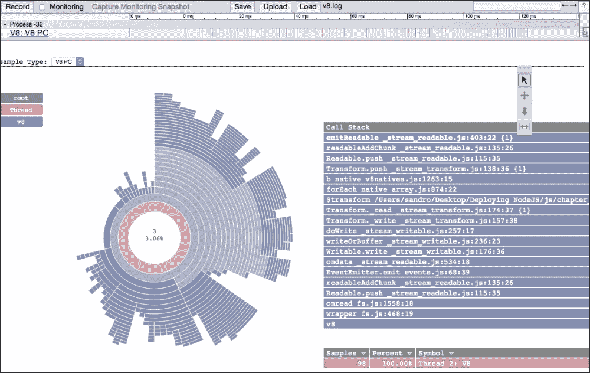
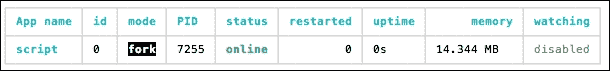
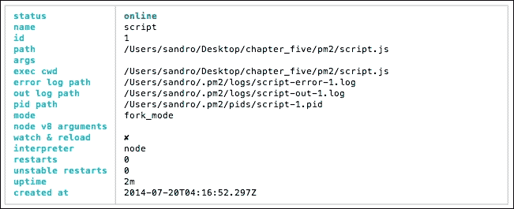
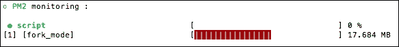
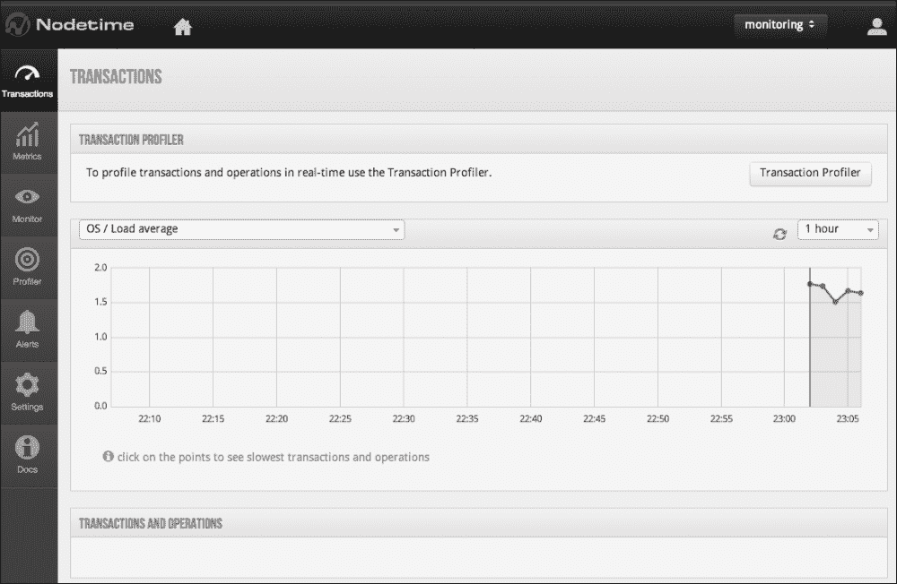
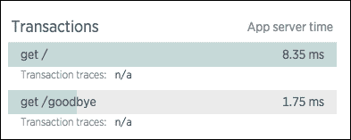

# 第五章：监控应用程序

分布式系统经常出现故障。更糟糕的是，它们经常部分故障。当操作发生故障，负责改变系统状态（例如，写入或删除操作）时，如何恢复正确的状态，尤其是当这些操作是并发时？更糟糕的是，一些操作会静默失败。因此，部分故障可能会使应用程序处于不确定的状态。预测一个不透明的系统将如何表现是困难的。

考虑以下来自《数据中心作为计算机：仓库规模机器设计导论》的引言：

> *"假设一个集群拥有超可靠的服务器节点，其平均故障间隔时间（MTBF）为 30 年（10,000 天）——远远超出在现实成本下通常能够实现的范围。即使有这些理想化的可靠服务器，一个由 10,000 个服务器组成的集群每天平均仍会看到一台服务器故障。因此，任何需要整个集群正常运行的应用程序，其 MTBF 都不会超过 1 天。"*

失败，尤其是在大规模上，对员工的质量或硬件的质量都是无所谓的。关键在于，在常规使用中看似很大的数值，在网络环境中却相对较小，因为在几分钟或几秒钟内可能发生数十亿笔交易，并且数百或更多独立的系统正在交互。失败的演变往往是反直觉的。因此，为失败做好准备是个好主意，而且，在其他方面，这意味着减少任何单一失败导致整个系统崩溃的能力。

通常，为单个用户分配工作负载也需要将用户数据分布到许多独立进程中。此外，当系统的一部分发生故障时，必须将其恢复，以保持系统的两个特性——其容量以及当故障发生时处于飞行中的任何数据或事务。

在本章中，我将概述一些用于监控应用程序中发生情况的工具和技巧。我们将探讨您可以构建自己的监控和日志记录工具的方法，并讨论第三方工具。在这个过程中，您将了解以下内容：

+   远程控制 Node 进程

+   使用 New Relic 监控服务器

+   捕获错误

+   在您的应用程序中跟踪和记录活动的其他选项

# 处理失败

正如我们在第四章中概述的，“管理内存和空间”，隔离操作和智能监控应用程序有助于最大限度地减少单个失败子系统导致更大系统崩溃的可能性。在本节中，我们将探讨如何在 Node 程序中捕获错误和异常，以及如何优雅地关闭和/或重启变得不稳定的过程，无论是单个进程还是集群中的进程。

### 注意

以下是一篇关于使用 Node.js 处理错误的全面文章，推荐阅读：

[`www.joyent.com/developers/node/design/errors`](http://www.joyent.com/developers/node/design/errors)

在代码库中添加 try/catch 块并试图预测所有错误可能会变得难以管理且难以控制。此外，如果你没有预料到的异常发生了？你如何*继续你离开的地方*？

Node 还没有一个很好的内置方式来处理未捕获的关键异常。这是该平台的一个弱点。一个未捕获的异常将继续在执行栈中冒泡，直到它击中事件循环，就像机器齿轮中的扳手，它将使整个进程崩溃。

一个选择是将`uncaughtException`处理器附加到进程本身，以下代码展示了这一点：

```js
process.on('uncaughtException', function(err) {
  console.log('Caught exception: ' + err);
});
setTimeout(function() {
  console.log("The exception was caught and this can run.");
}, 1000);
throwAnUncaughtException();
```

上述代码的输出将如下所示：

```js
> Caught exception: ReferenceError: throwAnUncaughtException is not defined
> The exception was caught and this can run.

```

虽然在异常代码之后的任何内容都不会执行，但超时仍然会触发，因为进程成功捕获了异常，从而拯救了自己。然而，这是一种处理异常非常笨拙的方式。

`domain`模块试图修复 Node 设计中这个漏洞。我们将接下来讨论域模块，作为一个更好的工具来处理异常。

## 'domain'模块

在异步代码中的错误处理也难以追踪：

```js
function f() {
  throw new error("error somewhere!")
}
setTimeout(f, 1000*Math.random());
setTimeout(f, 1000*Math.random());
```

哪个函数导致了错误？很难说。也很难智能地插入异常管理工具。很难知道下一步该做什么。Node 的`domain`模块试图帮助解决这些问题和其他异常定位问题。这样，代码可以更精确地进行测试，错误可以更有效地处理。

在最简单的形式中，一个**域**设置了一个上下文，在这个上下文中可以运行一个函数或其他“代码块”，使得在该隐式域绑定中发生的任何错误都会被路由到特定的域错误处理器。以下代码作为例子：

```js
var domain = require('domain');
var dom = domain.create();
dom.on('error', function(err) {
  console.error('error', err.stack);
});

dom.run(function() {
  throw new Error("my domain error");
});
// error Error: my domain error
//  at /js/basicdomain.js:10:8
//  ...
```

在这里，我们创建一个域，并通过该域上下文中的`run`命令在该域内执行代码。这使得我们能够智能地捕获那些异常，隐式绑定在该上下文中创建的所有事件发射器、计时器和其他请求。

有时，一个方法可能是在其他地方创建的（不是在给定的`domain.run`函数调用隐式上下文中），但仍然最好与外部域相关联。`add`方法就是为了这样的显式绑定而存在的，以下代码展示了这一点：

```js
var dom = domain.create();
dom.on("error", function(err) {
  console.log(err);
});

var somefunc = function() {
  throw new Error('Explicit bind error');
};
dom.add(somefunc);
dom.run(function() {
  somefunc();
});
// [Error: Explicit bind error]
```

这里，我们看到一个未在`run`上下文中隐式绑定的函数仍然可以显式地添加到该上下文中。要从域中移除执行上下文，请使用`domain.remove`。所有显式或隐式添加到域中的计时器、函数和其他发射器的数组可以通过`domain.members`访问。

就像 JavaScript 的`bind`方法将函数绑定到上下文一样，`domain.bind`方法同样允许将一个独立的函数绑定到域。以下代码展示了这一点：

```js
var domain = require('domain');
var fs = require('fs');
var dom = domain.create();
dom.on("error", ...);
fs.readFile('somefile', dom.bind(function(err, data) {
  if(err) { throw new Error('bad file call'); }
}));
//  { [Error: bad call]
//  domain_thrown: true,
//  ...
```

在这里，我们看到任何函数都可以通过特定的错误域*内联*包装，这是一个特别有用的功能，可以用来管理回调中的异常。从域发出的错误对象具有以下特殊属性

+   `error.domain`：这是处理错误的域。

+   `error.domainEmitter`：如果`EventEmitter`在某个域内触发一个`error`事件，这将被标记。

+   `error.domainBound`：这是将错误作为其第一个参数传递的回调。

+   `error.domainThrown`：这是一个布尔值，表示错误是否被抛出。例如，以下回调将传递一个 ENOENT 错误作为其第一个参数，因此`domainThrown`将为 false：

    ```js
    fs.createReadStream('nofile', callback)

    ```

### 注意

另一种方法，`domain.intercept`，与`domain.bind`功能相似，但简化了回调中的错误处理，使得开发者不再需要重复检查（甚至设置）每个回调的第一个参数`cb(err, data)`以查找错误。一个例子可以在你的代码包中的`js/domainintercept.js`文件中找到。

你可能还需要在域之间移动，根据需要进入和退出它们。为此，我们使用`domain.enter`和`domain.exit`方法。假设我们已经设置了两个域，`dom1`和`dom2`，第一个发出`domain 1 error`，第二个发出`domain 2 error`，我们可以像下面这样在域上下文中移动：

```js
dom1.add(aFuncThatThrows);
dom1.run(function() {
  dom1.exit();
  dom2.enter();
  aFuncThatThrows();
});
// domain 2 error
```

可以使用任意数量的`enter`和`exit`事件。请注意，域对象本身没有发生变化——`exit`不会关闭域或执行任何此类操作。如果需要销毁域，你应该使用`domain.dispose`方法，这将尝试清理任何正在进行的域 I/O——中断流、清除定时器、忽略回调等。

## 捕获进程错误

以进程为导向的设计在 Node.js 应用程序中很常见，其中独立进程通过事件流相互通信。这些通道以及进程本身的错误必须被跟踪。在本节中，我们将探讨如何跟踪以及如何正确地抛出与进程事件相关的错误。

我们在第三章中介绍了`child_process`模块，*扩展 Node*。在这里，我们将更详细地介绍如何处理子进程及其父进程中的错误。

要启动 Node 程序，请使用`child_process`模块的`fork`方法。这将创建一个在调用父进程下的新子进程。此外，两个进程之间将自动设置一个 IPC 通道，其中子进程调用`process.send`向其父进程发送消息，父进程可以监听`child.on('message')`。创建两个文件，第一个命名为`parent.js`，另一个命名为`child.js`：

```js
// parent.js
var fork = require('child_process').fork;
var proc = fork('./child.js');

proc.on('message', function(msg) {
  console.log("Child sent: " + msg);
});
//  Keeps the parent running even if no children are alive.
process.stdin.resume();

// child.js
var cnt = 0;
setInterval(function() {
  process.send(++cnt);
}, 1000);
```

父进程使用`fork`创建的子进程将在每秒间隔增加并发出一个值，父进程将监听并回显到你的控制台。我们如何从父进程中捕获子进程的错误？

让我们在子进程中引发一个错误，通过使其`throw`。将以下行添加到`child.js`中：

```js
...
process.send(++cnt);
throw new Error('boom!');
```

再次运行父进程将导致错误，并显示我们设置的消息。通常，父进程会在子进程死亡时采取行动——例如在新的子进程中使用`fork`或记录错误，或者两者都做。为了在父进程中捕获子进程错误，请将以下行添加到`parent.js`中：

```js
proc.on('exit', function() {
  console.log("Child exited: ", arguments);
});
```

再次运行父脚本将导致除了原始错误外，还会显示以下内容：

```js
Child exited:  { '0': 1, '1': null }
```

接收到的第一个参数是子进程在终止时传递的退出代码（如果父进程发送了终止信号，例如`child.kill('SIGTERM')`，这里的第二个参数将包含`'SIGTERM'`）。

除了在父进程中处理子进程的错误之外，建议使用`Domain`模块来捕获和处理子进程本身内的错误。这样，你可以在子进程错误发生后正确地清理，并使用`process.send()`将任何额外的错误信息广播给父进程。

### 注意

当进程异常退出时，Node 将返回的退出代码可以在[`github.com/joyent/node/blob/master/doc/api/process.markdown#exit-codes`](https://github.com/joyent/node/blob/master/doc/api/process.markdown#exit-codes)找到。（注意，这是针对 Node 0.11.x 的——更早的版本总是返回退出代码 8。）

子进程也可以通过`spawn`创建，这与`fork`不同，因为它不是 Node 特定的；可以使用`spawn`启动任何操作系统进程。例如，这是执行`ls`命令的一种迂回方式；当你运行它时，你应该会收到目录列表：

```js
var spawn = require('child_process').spawn;
var proc = spawn('ls',['-l']);
proc.stdout.setEncoding('utf8');
proc.stdout.on('data', function(data) {
  console.log(data)
});
```

注意与`fork`的不同之处。第一个参数是一个操作系统命令，第二个参数是传递给该命令的选项数组——相当于`> ls -l`。其次，我们没有访问自定义的 IPC（与`fork`一样——没有`send`或`on('message')`），但我们确实可以访问标准进程管道：`stdin`、`stdout`和`stderr`。因为管道默认以缓冲区形式进行通信，所以我们设置了所需的编码，并简单地显示任何被启动进程写入`stdout`的数据。

另一种捕获子进程错误的方法应该对你来说很清楚。使用以下代码修改前面的代码：

```js
var spawn = require('child_process').spawn;
var proc = spawn('ls',['-l', '/nonexistent/directory']);
proc.stderr.setEncoding('utf8');
proc.stderr.on('data', function(err) {
  console.log("Error", err)
});
```

当执行列出不存在目录内容这一尝试时，你应该看到以下内容：

```js
Error ls: /nonexistent/directory: No such file or directory

```

通过监听`stderr`管道，可以捕获子进程中的错误。我们还可以更改`stdio`设置，使错误自动记录到文件。而不是在父进程中捕获子输出，我们使用具有自定义`stdio`选项的`spawn`在子进程中，将子进程的`stdout`直接重定向到文件：

```js
var spawn = require('child_process').spawn;
// This will be the file we write to
var out = require('fs').openSync('./out.log', 'w+');
var proc = spawn('node', ['./spawn_child.js'], {
  // The options are: 0:stdin, 1:stdout, 2:stderr
  stdio : ['pipe', out, 'pipe']
});
```

接下来，我们将更深入地探讨日志记录策略。

## 日志记录

为什么需要记录数据？一个可能的答案是，现代应用程序产生的活动数据量超出了任何一个人的分析能力。我们无法实时有效地处理这么多信息。因此，有必要存储或记录大量细节，并使用智能工具将数据切割和排序成我们人类可以理解的形式。我们可以在日志中寻找模式，也许可以找到应用程序中的瓶颈或甚至错误，帮助我们改进系统的设计。我们可以从日志中获得商业智能，发现有助于我们理解客户偏好的使用模式，或者有助于我们设计新功能或增强现有功能的模式。

在接下来的内容中，我将向您介绍所有 Node 进程可用的信息，这些信息如何使用 **UDP** 进行记录，以及如何使用 Morgan 进行简单的请求记录。

### 注意

Etsy 团队的一个流行的开源日志和统计报告项目是 **StatsD** ([`github.com/etsy/statsd`](https://github.com/etsy/statsd))，它有一个很好的 Node 客户端在 [`github.com/sivy/node-statsd`](https://github.com/sivy/node-statsd)。

让我们创建一个使用 UDP 的日志模块。关于 UDP 如何工作的详细信息可以在第三章（[ch03.html "第三章. 扩展 Node"]*Scaling Node*）中找到，如果需要的话，请刷新您的记忆。需要记住的重要概念是，UDP 通过不保证消息到达来实现极高的性能。请注意，在 99% 的情况下，消息丢失的情况非常少，这使得 UDP 对于不需要完美保真度的应用程序（如日志应用程序）来说是一个速度和准确性的优秀平衡。

### 使用 UDP 进行日志记录

我们 UDP 日志模块的目标是为任何 Node 程序提供一个简单的日志接口。此外，我们希望允许许多独立进程写入同一日志文件。此模块的完整代码可以在您的代码包的 `udp/logger` 文件夹中找到。

从结尾开始，我们先来看一下客户端代码，然后再深入到日志记录器本身。所有客户端都将发送（至少）一个日志文件路径，可选的端口或主机信息，如果需要的话，一些处理函数，系统将正常工作：

```js
var dgram = require('dgram');
var Logger = require('./logger');

logger = new Logger({
  file : './out.log',
  port : 41234,
  host : 'localhost',
  encoding : 'utf8',
  onError : function(err) {
    console.log("ERROR: ", err);
  },
  onReady : function() {
...
  }
});
```

我们可以看到，我们的模块在提供的端口上启动了一个服务器，并配置为通知客户端任何错误以及其就绪状态。通过完善 `onReady` 的剩余代码，我们还可以看到我们期望客户端如何使用 UDP 日志记录器：

```js
console.log("READY");
var client = dgram.createSocket("udp4");
var udpm;
//  Flood it a bit.
for(var x=0; x < 10000; x++) {
  udpm = new Buffer("UDP write #" + x);
  logger.log('Test write #' + x);
  client.send(udpm, 0, udpm.length, 41234, "localhost");
}
```

客户可以选择调用模块的 `log` 函数或直接发送 UDP 消息。此外，我们预计可能会接收到许多消息。此外，我们预计任何数量的进程都可能将日志记录到 *同一文件* 中，因此我们必须处理管理消息洪流的问题。

日志模块如下：

```js
var dgram = require('dgram');
var fs = require('fs');

module.exports = function(opts) {

  opts = opts || {};

  var file = opts.file;
  var host = opts.host || 'localhost';
  var port = opts.port || 41234;
  var encoding = opts.encoding || 'utf8';
  var onError = opts.onError || function() {};
  var onReady = opts.onReady || function() {};
  var socket = dgram.createSocket("udp4");
  var writeable = true;
  var _this = this;
  var stream;

  if(!file) {
    throw new Error("Must send a #file argument");
  }

  stream = fs.createWriteStream(file, {
    flags : 'a+'
  });
  stream.setMaxListeners(0);

  socket.bind(port, host);

  socket.on("listening", onReady);
  socket.on("error", onError);
  socket.on("message", function(msg) {
    this.log(msg.toString());
  });

  this.log = function(msg) {
    if(!stream) {
      throw new Error('No write stream available for logger.');
    }

    try {
      if(typeof msg !== 'string') {
        msg = JSON.stringify(msg);
      }
    } catch(e) {
      return onError("Illegal message type sent to #log. Must be a string, or JSON");
    };

    // You'll likely want to create retry limits here.
    //
    var writer = function() {
      if(!stream.write(msg + '\n', encoding)) {
        stream.once('drain', writer);
      }
    }
    writer();
  };
};
```

这是管理设置 UDP 服务器和我们的客户端接口所需的所有代码。注意 `log` 函数要么直接由客户端调用，要么通过我们的 UDP 绑定的 `on('message')` 处理器调用。这允许客户端从任何环境中调用我们的日志服务器——使用此模块、使用另一种语言、使用另一个服务器、不使用此模块等。

最后一个重要的问题是 `log` 中的背压管理。因为许多独立来源可能会访问我们的日志文件，当我们尝试使用 `write` 时，管理该资源的写入流可能已经达到其高水位（*满*）。当这种情况发生时，对 `stream.write` 的调用将返回 `false`，调用者应将其视为停止发送数据的信号。当这种情况发生时，我们绑定到 `drain` 事件（仅一次——见 [`nodejs.org/api/events.html#events_emitter_once_event_listener`](http://nodejs.org/api/events.html#events_emitter_once_event_listener)），该事件在消费者（我们的日志文件的写入管理器）准备好接受更多数据时触发。

### 使用 Morgan 记录日志

**Morgan** ([`github.com/expressjs/morgan`](https://github.com/expressjs/morgan)) 是一个用于 **Express** 框架的 HTTP 记录器。如果你只需要为服务器记录 HTTP 连接数据，它非常适用且易于使用。我们将通过几个简短的 Express 示例来结束本节。

以下是最基本的 Morgan 使用方法：

```js
var express = require('express')
var morgan = require('morgan')
var app = express()
app.use(morgan('combined'))
app.get('/', function (req, res) {
  res.send('hello, world!')
});
app.listen(8080);
```

此代码将创建一个监听端口 `8080` 的服务器，并将日志条目以 Apache **Combined Log Format** ([httpd.apache.org/docs/1.3/logs.html#combined](http://httpd.apache.org/docs/1.3/logs.html#combined)) 格式输出到 `stdout`：

```js
127.0.0.1 - - [20/Nov/2014:23:02:58 +0000] "GET / HTTP/1.1" 200 13 "-" "Mozilla/5.0 (Macintosh; Intel Mac OS X 10_10_1) AppleWebKit/537.36 (KHTML, like Gecko) Chrome/39.0.2171.99 Safari/537.36"

```

除了格式参数外，Morgan 还接受各种选项。例如，要将日志数据流式传输到文件，请使用 `stream` 选项。对于此示例，将 `app.use` 声明替换为以下内容：

```js
app.use(morgan('combined', {
  stream : require('fs').createWriteStream('./out.log')
}));
```

日志条目现在将被写入到 `out.log`。

合并参数反映了 Morgan 内置的日志格式化器之一。这些格式化器由标记化的字符串组成，默认情况下有多个标记可用。例如，合并格式化器插入了以下字符串：

```js
:remote-addr - :remote-user [:date[clf]] ":method :url HTTP/:http-version" :status :res[content-length] ":referrer" ":user-agent"

```

应该很明显，前面的完全限定输出是通过给定的格式化器生成的，该格式化器将令牌映射到 Node 的 `http` 模块管理的 `ClientRequest` 和 `ClientResponse` 对象的标准属性。

Morgan 记录反映 `ClientRequest` 和 `ClientResponse` 对象状态的日志数据。`skip` 选项允许你根据这些对象的状态过滤日志。默认情况下，Morgan 记录每个请求。要仅记录错误，你需要在你的中间件定义中添加以下内容：

```js
skip: function(req, res) {
  return res.statusCode < 400;
}
```

你还可以添加新令牌。在这里，我们创建了一个名为 `'cache'` 的令牌：

```js
morgan.token('cache', function(req, res) {
  return req.headers['cache-control'];
});
```

这个新令牌（和/或现有令牌）可以用于自定义格式化器：

```js
app.use(morgan('cache-control is :cache'))
```

Morgan 现在已初始化了一个自定义格式化器，它将像 `cache-control is max-age=0` 这样的内容写入到你的日志中。

要了解更多关于其他内置格式化程序和其他高级选项的信息，请访问项目页面。由于其灵活性，Morgan 可以定制以满足许多日志需求。

其他流行的选项可供考虑：

+   **Bunyan** ([`github.com/trentm/node-bunyan`](https://github.com/trentm/node-bunyan))：Bunyan 是一个简单但足够强大的日志工具，适用于大多数需求。

+   **Winston** ([`github.com/flatiron/winston`](https://github.com/flatiron/winston))：Winston 的关键卖点是其支持的日志传输插件数量——你可以配置它将日志记录到 Redis、文件或第三方服务，例如 [loggly.com](http://loggly.com)。

# 在不断变化的环境中修改行为

在运行中的系统中修改应用程序数据，这被比作在飞机飞行中更换引擎。幸运的是，我们开发者在一个虚拟世界中工作，这里的 *物理定律* 更为宽容。在本节中，我们将通过示例学习如何使用 Node 应用程序的远程监控方法来创建一个 *遥控器*。

## Node REPL

Node 的 **Read-Eval-Print-Loop**（**REPL**）代表了 Node 壳。要进入壳提示符，请在终端中输入 Node，而不传递文件名：

```js
> node

```

现在，你可以访问一个正在运行的 Node 进程，并可以向该进程传递 JavaScript 命令。例如，在输入 `2+2` 之后，壳会向 `stdout` 发送 `4`。Node 的 REPL 是尝试、调试、测试或以其他方式玩 JavaScript 代码的绝佳场所。

因为 REPL 是一个原生对象，程序也可以使用实例作为运行 JavaScript 的上下文。例如，在这里，我们创建了自己的自定义函数 `sayHello`，将其添加到 REPL 实例的上下文中，并启动 REPL，模拟 Node 壳提示符：

```js
require('repl').start("> ").context.sayHello = function() {
  return "Hello"
};
```

在提示符中输入 `sayHello()` 将导致 `Hello` 被发送到 `stdout`。

这也意味着你的 Node 进程可以对外界暴露一个 REPL 实例，该实例可以以某种方式访问该进程，提供一个 *后门*，通过它可以连接到进程，修改其上下文，改变其行为，或者如果它在某些方面出了问题，甚至可以将其关闭。让我们探讨与进程监控相关的可能应用。

使用以下代码创建两个文件，`repl_client.js` 和 `repl_server.js`，并在各自的终端窗口中运行它们，以便你可以看到两个终端窗口：

```js
/*  repl_client.js   */
var net = require('net');
var sock = net.connect(8080);
process.stdin.pipe(sock);
sock.pipe(process.stdout);
```

`repl_client` 文件简单地通过 `net.connect` 创建一个新的套接字连接到端口 `8080`，并将来自 `stdin`（你的终端）的任何数据通过该套接字传输。同样，来自套接字的数据也会被传输到 `stdout`（你的终端）。应该很清楚，我们已经创建了一种方法来接收输入并通过套接字将其发送到端口 `8080`，监听套接字可能发送回我们的任何数据。以下代码展示了这一点：

```js
/*  repl_server.js  */
var repl = require('repl')
var net = require('net')
net.createServer(function(socket) {
  var inst = repl.start({
    prompt : 'repl_server> ',
    input    : socket,
    output  : socket,
    terminal  : true
  })

  inst.on('exit', function () {
    socket.end()
  })
}).listen(8080)
```

`repl_server` 文件闭合了循环。我们将首先使用 `net.createServer` 创建一个新的 **传输控制协议**（**TCP**）服务器，通过 `.listen` 绑定到端口 `8080`。传递给 `net.createServer` 的回调将接收一个指向已绑定套接字的引用。在这个回调的封装中，我们实例化一个新的 REPL 实例，给它一个漂亮的 `prompt`（在这个例子中是 `'repl_server>'`，但它可以是任何字符串），表示它应该监听来自传递的套接字引用的 `input`，并将 `output` 广播到该套接字引用，表示套接字数据应被视为 `terminal` 数据（它有特殊的编码）。

我们现在可以在客户端终端中输入一些内容，例如 `console.log("hello")`，然后看到 `hello` 被显示出来——REPL 服务器已经执行了我们通过 REPL 客户端发送的命令，并发送回评估后的响应。

为了确认我们的 JavaScript 命令的执行是在 `repl_server` 进程中进行的，请在客户端终端中输入 `process.argv`，服务器将显示一个包含当前进程路径的对象，该路径将是 `/.../repl_server.js`。

此外，我们还可以向 REPL 的 `context` 中添加自定义方法，然后通过客户端访问这些方法。例如，将以下行添加到 `repl_server.js` 中：

```js
  inst.context.sayHello = function() {
    return "Hello";
  }
```

重新启动服务器和客户端，然后在客户端终端中输入 `sayHello()`。你会看到 `Hello` 被显示出来。从这个演示中应该很明显，我们已经创建了一种远程监控 Node 进程的方法。

最后，REPL 提供了自定义命令，特别是 `.save` 和 `.load`（点 (`.`) 前缀是故意的）。`.save` 命令将保存当前的 REPL 会话到一个文件中——你发送给 REPL 的所有命令都将写入到指定的文件中，这意味着它们可以被回放。要看到这个动作，打开一个 REPL 会话并运行一些命令，建立会话历史。然后，输入以下两个命令：

```js
.save test.js
.load test.js
// Session saved to:test.js
// ... the output of the session commands, replayed
```

现在，让我们创建一个演示模块，当它包含在一个进程中的时候，它将通过 REPL 打开远程管理的通道。

## 远程监控和管理 Node 进程

在你的代码包中，你会找到 `repl-monitor` 包。这个模块将在指定的端口上暴露一个服务器，该服务器将提供当前进程的内存使用情况，允许远程进程读取这些信息并向被监控的进程发送指令。对于这个例子，我们将能够告诉进程在进程堆超过限制时停止在内存中存储东西，当它回到给定的阈值以下时再次开始存储东西。

我们还将演示 `.load` 的有用性，以创建高度动态的监控解决方案，可以在不重新启动目标进程的情况下进行调整。

注意，在应用程序的内部创建此类访问点应谨慎进行。虽然这些技术非常有用，但你必须小心保护对各种端口等的访问，主要通过限制对正确安全私有网络的访问来实现。

监控代码如下：

```js
var repl = require('repl');
var net = require('net');
var events = require('events');
var Emitter = new events.EventEmitter();

module.exports = function(port) {
  net.createServer(function(socket) {
    var inst = repl.start({
      prompt : '',
      input    : socket,
      output  : socket,
      terminal  : false
    })

    inst.on('exit', function () {
      socket.end();
    })

    inst.context.heapUsed = function() {
      return process.memoryUsage().heapUsed;
    }

    inst.context.send = function(msgType, msg) {
      Emitter.emit(msgType, msg);
    }

  }).listen(port);

  return Emitter;
};
```

此模块在指定的端口上创建 REPL，并通过 REPL 上下文公开两个自定义方法，客户端可以使用这些方法。`heapUsed`方法返回特定的内存读取值，而`send`方法则通过返回的`EventEmitter`实例将消息广播到被监控的进程。需要注意的是，此 REPL 的`output`管道是连接的套接字（与`input`管道相同）。正如我们之前讨论的，这意味着调用进程将接收到它发送的 JavaScript 代码的执行结果。我们将在稍后提供更多相关信息。

接下来，我们将创建一个要监控的进程，这需要监控模块：

```js
var listener = require('./monitor')(8080);

store = true;
var arr = [];

listener.on('stop', function() {
  console.log('stopped');
  store = false;
})

listener.on('start', function() {
  store = true;
})

var runner = function() {
  if(store === true) {
    arr.push(Math.random()*1e6);
    process.stdout.write('.');
  }
  setTimeout(runner, 100);
};

runner();
```

在这里，我们有一个不断向数组中添加内容的进程。通过监控模块，客户端可以连接到这个进程，检查内存使用情况，并广播启动或停止消息，该进程将监听并据此行动。

最后一步是创建一个用于远程进程管理的客户端。控制客户端很简单。我们通过 TCP（net）连接连接到 REPL，并定期轮询目标进程的内存状态：

```js
var net = require('net');
var sock = net.connect(8080);

var threshold = 0;
var stopped = false;
sock.on('end', function() {
  clearInterval(writer);
  console.log('**** Process ended ****');
});
//  Keep checking for memory usage, stringifying the returned object
var writer = setInterval(function() {
  sock.write('heapUsed()\n');
}, 1000);
```

回想一下我们是如何将`heapUsed`方法添加到监控器的 REPL 上下文中的，当我们向 REPL `input`套接字写入时，我们应该期望得到一些值。这意味着我们必须向`sock`添加一个数据监听器：

```js
sock.setEncoding('ascii');
sock.on('data', function(heapUsed) {

  //  Convert to number
  heapUsed = +heapUsed;

  //  Responses from commands will not be numbers
  if(isNaN(heapUsed)) {
    return;
  }

  if(!threshold) {
    threshold = heapUsed;
    console.log("New threshold: " + threshold)
  }

  console.log(heapUsed);

  //  If heap use grows past threshold, tell process to stop
  if((heapUsed - threshold) > 1e6) {
    !stopped && sock.write('.load stop_script.js\n');
    stopped = true;
  } else {
    stopped && sock.write('.load start_script.js\n');
    stopped = false;
  }
});
```

当我们收到内存探测读取值时，它被转换为整数，并与阈值值（基于第一次读取的值）进行比较。如果读取值超过预定的限制，我们告诉进程停止分配内存；当内存释放时，进程被告知继续。

重要的是，REPL 提供的特定机会是能够在远程进程的上下文中*运行脚本*。注意发送到`socket.write`的命令，每个命令都加载包含 JavaScript 的外部文件：

```js
// Stop script
send("stop")
// Start script
send("start")
```

虽然这些*单行代码*只是简单地练习了我们之前讨论的消息接口，但你的实现并不妨碍使用更长的命令列表来满足更现实的部署需求。关键的是，这种进程控制解耦促进了动态进程管理，因为今天你使用的`.load`脚本可以在未来更改，而不需要修改目标进程。

现在，让我们来看看更全面的用于深入分析应用程序性能的技术。

# 对进程进行性能分析

在追踪内存泄漏和其他难以发现的错误时，拥有分析工具是非常有用的。在本节中，我们将探讨如何对运行中的进程进行快照，以及如何从中提取有用的信息。

Node 已经原生提供了一些进程信息。使用 `process.memoryUsage()` 可以轻松获取你的 Node 进程使用的内存量：

```js
{ rss: 12361728, heapTotal: 7195904, heapUsed: 2801472 }

```

还有一些模块可以用来跟踪更多关于进程的信息。例如，`usage` 模块 ([github.com/arunoda/node-usage](http://github.com/arunoda/node-usage)) 提供了直接的内存和 CPU 使用信息。要探测当前进程，请使用以下代码：

```js
var usage = require('usage');
usage.lookup(process.pid, function(err, result) {
  console.log(result);
});
```

这将产生以下结果：

```js
{ memory: 15093760,
 memoryInfo: { rss: 15093760, vsize: 3109531648 },
 cpu: 3.8 }

```

在这里，我们可以看到进程的总内存使用量（以字节为单位）和 CPU 使用百分比。

### 注意

要了解 JavaScript 内存分析的好资源可以在 [`developer.chrome.com/devtools/docs/javascript-memory-profiling`](https://developer.chrome.com/devtools/docs/javascript-memory-profiling) 找到。

能够查看 V8 在运行你的进程时看到的内容更有趣。任何 Node 进程都可以通过传递 `--prof`（用于配置文件）标志来简单地生成 `v8.log`。让我们创建一个日志读取器，并使用 `tick` 模块 ([`github.com/sidorares/node-tick`](https://github.com/sidorares/node-tick)) 来检查其性能，该模块将读取 V8 日志并生成执行配置文件的分解。

首先，全局安装该包：

```js
npm install -g tick.

```

在你的代码包中，在为本章创建的 `/profiling` 目录下，将有一个名为 `logreader.js` 的文件。这个文件简单地读取（也在该文件夹中）的 `dummy.log` 文件，并将其内容输出到控制台。这是一个如何使用 `Transform` 流处理日志文件的优秀示例：

```js
var fs = require('fs');
var stream = require('stream');
var lineReader = new stream.Transform({
  objectMode: true
});
lineReader._transform = function $transform(chunk, encoding, done) {
  var data = chunk.toString()
  if(this._lastLine) {
    data = this._lastLine + data;
  }
  var lines = data.split('\n');
  this._lastLine = lines.pop();
  lines.forEach(this.push.bind(this));
  done();
}

lineReader._flush = function $flush(done) {
  if(this._lastLine) {
    this.push(this._lastLine);
  }
  this._lastLine = null;
  done();
}
lineReader.on('readable', function $reader() {
  var line;
  while(line = lineReader.read()) {
    console.log(line);
  }
});
fs.createReadStream('./dummy.log').pipe(lineReader);
```

需要注意的重要一点是，主要函数已经被命名，并且以 `$` 为前缀。这通常是一个好的实践——你应该始终为你的函数命名。具体原因与调试相关。我们希望这些名称出现在我们即将生成的报告中。

要生成 V8 日志，请使用 `–-prof`（配置文件）参数和 `–-nologfile-per-isolate` 参数运行此脚本以抑制默认日志文件的生成：

```js
node --prof logreader --nologfile-per-isolate > v8.log

```

你现在应该能在当前工作目录中看到一个名为 `v8.log` 的日志文件。不妨查看一下——日志有些令人畏惧。这正是 `tick` 模块发挥作用的地方：

```js
node-tick-processor > profile

```

此命令将生成一个更易读的配置文件并将其输出到 `profile` 文件。打开该文件并查看。这里有很多信息，深入探究其含义超出了本章的范围。然而，我们可以清楚地看到我们的脚本中各种函数（如 `$transform`）消耗了多少个 tick，我们还可以看到函数是否已优化。例如：

```js
16   21.6%      0    0.0%   LazyCompile: ~$transform /Users/sandro/profiling/logreader.js:8

```

在这里，我们可以看到 `$transform` 占用了 16 个 tick，并且是懒编译的，波浪号 (`~`) 表示该函数没有被优化——如果它被优化了，你会在前面看到一个星号 (`*`) 前缀。

作为实验，创建一个包含以下代码的脚本，并使用 `--prof` 标志运行它：

```js
while((function $badidea() {
  return 1;
})());
```

让这个无限循环运行一段时间，然后通过使用 *Ctrl* + *C* 终止进程。创建一个配置文件，就像我们之前做的那样，并查看它。应该很清楚，使用这些分析工具捕捉到昂贵的函数是多么容易。

对于运行最新 Node.js 构建版本（0.11.x 或更高版本和 io.js）的用户，有一个极其有用的可视化工具，只需在 Chrome 浏览器中运行以下命令即可访问——`chrome://tracing/`：



一旦你在浏览器中准备好了，点击 **加载** 按钮，上传你的 `v8.log` 文件。执行时间线在顶部展开，通过点击左侧的链接（V8: V8 PC），你可以访问星爆导航工具。星爆辐射调用栈，很好地可视化我们的应用程序中的工作。注意我们的 `$transform` 函数被列在右侧——给你的函数命名吧！

如果你想要了解更多关于分析 v8 的信息，以下是一些有用的链接：

+   [`developers.google.com/v8/profiler_example`](https://developers.google.com/v8/profiler_example)

+   [`groups.google.com/forum/#!msg/nodejs/oRbX5eZvOPg/jM6TINytVhoJ`](https://groups.google.com/forum/#!msg/nodejs/oRbX5eZvOPg/jM6TINytVhoJ)

# 使用第三方监控工具

Node 是一种新技术，目前还没有成熟的应用程序监控工具。一些独立开发者和在应用程序监控领域的知名公司已经跳进来填补这一空白。在本节中，我们将探讨 PM2 作为进程管理器和监控工具，并查看 Nodetime。

## PM2

PM2 被设计成是一个企业级进程管理器。如前所述，Node 在 Unix 进程中运行，它的 `child_process` 和 `cluster` 模块用于生成更多进程，通常是在跨多个核心扩展应用程序时。PM2 可以用于通过命令行和编程方式实现你的 Node 进程的部署和监控。在这里，我将专注于编程方式使用 PM2 进行进程管理，并展示如何使用它来监控和显示进程活动。

全局安装 PM2：

```js
npm install pm2 -g

```

使用 PM2 最直接的方式是作为一个简单的进程运行器。以下程序将每秒递增并记录一个值：

```js
// script.js
var count = 1;
function loop() {
  console.log(count++);
  setTimeout(loop, 1000);
};
loop();
```

在这里，我们使用 `fork` 在 `script.js` 的新进程中，将其在后台 *永远* 运行，直到我们停止它。这是一个运行守护进程的绝佳方式：

```js
pm2 start script.js
// [PM2] Process script.js launched

```

一旦脚本启动，你应该在你的终端看到类似以下的内容：



大多数值的含义应该是清晰的，例如你的进程使用的内存量，是否在线，运行了多长时间等等（`mode` 和 `watching` 字段将在稍后解释）。进程将继续运行，直到停止或删除。

要在启动时为你的进程设置自定义名称，将 `--name` 参数传递给 PM2，如下所示：`pm2 start script.js --name 'myProcessName'`。

所有运行中的 PM2 进程的概述可以通过 `pm2 list` 命令随时调出。PM2 提供了其他简单的命令：

+   `pm2 stop <app_name | id | all>`：这是通过名称或 ID 停止进程或停止所有进程的方式。停止的进程将保留在进程列表中，以后可以重新启动。

+   `pm2 restart <app_name | id | all>`：这是用于重新启动进程的方式。所有进程列表中的 `restarted` 下都会显示进程重启的次数。要自动在进程达到最大内存限制（例如，15 M）时重新启动进程，请使用 `pm2 start script.js --max-memory-restart 15M` 命令。

+   `pm2 delete <app_name | id | all>`：这用于删除一个进程。该进程不能被重新启动。

+   `pm2 info <app_name | id>`：这提供了关于进程的详细信息，如下所示：

注意给出的错误和其他日志路径。记住，我们的脚本每秒递增一个整数并记录该计数。如果你使用 `cat /path/to/script/ out/log`，你的终端将显示写入到 `out` 日志的内容，该日志应是一系列递增的数字。错误也会类似地写入到日志中。此外，你可以使用 `pm2 logs` 实时流式传输输出日志。例如，我们的 `script.js` 进程仍在输出递增的值：

```js
PM2: 2014-07-19 23:20:51: Starting execution sequence in -fork mode- for app name:script id:1
PM2: 2014-07-19 23:20:51: App name:script id:1 online
script-1 (out): 2642
script-1 (out): 2643
script-1 (out): 2644
...

```

要清除所有日志，使用 `pm2 flush`。

你也可以编程方式使用 PM2。首先，你需要在应用程序的 `package.json` 文件中本地安装 PM2，使用标准的 `npm install pm2` 命令。要复制我们使用 PM2 运行 `scripts.js` 的步骤，首先创建以下 `programmatic.js` 脚本：

```js
// programmatic.js
var pm2 = require('pm2');
pm2.connect(function(err) {
  pm2.start('script.js', {
    name: 'programmed script runner',
    scriptArgs: [
      'first',
      'second',
      'third'
    ],
    execMode : 'fork_mode'
  }, function(err, proc) {
    if(err) {
      throw new Error(err);
    }
  });
});
```

此脚本将使用 `pm2` 模块以进程方式运行 `script.js`。请运行 `node programmatic.js`。执行 PM2 列表应显示 `programmed script runner` 正在运行。为了确保这一点，尝试 `pm2 logs`——你应该看到递增的数字，就像之前一样。

### 监控

PM2 使进程监控变得简单。要查看进程的 CPU 和内存使用情况的实时统计信息，只需输入 `pm2 monit` 命令：



在这里，我们可以看到我们进程的 CPU 和内存使用情况的持续更新的图表。还有什么比这更简单吗？

PM2 还使得创建基于 Web 的监控界面变得简单——只需运行 `pm2 web` 即可。这个命令将启动一个监听端口 `9615` 的监控进程——运行 `pm2 list` 现在将列出名为 `pm2-http-interface` 的进程。运行 web 命令，然后在浏览器中导航到 `localhost:9615`。你将看到一个详细的进程、操作系统等的快照，作为一个 JSON 对象：

```js
...
  "monit": {
    "loadavg": [
      1.89892578125,
      1.91162109375,
      1.896484375
    ],
    "total_mem": 17179869184,
    "free_mem": 8377733120,
...
"pm_id": 1, // our script.js process
  "monit": {
    "memory": 19619840,
    "cpu": 0
  }
...
```

由于 PM2 的这个内置功能，创建一个每几秒轮询你的服务器、获取进程信息并将其图形化的基于 Web 的 UI 变得简单得多。

PM2 还有一个选项可以在所有管理的脚本上设置监视器，以便任何对监视脚本的更改都会导致自动进程重启。这在开发时非常有用。作为演示，让我们创建一个简单的 HTTP 服务器并通过 PM2 运行它：

```js
// server.js
var http = require('http');
http.createServer(function(req, resp) {
  if(req.url === "/") {
    resp.writeHead(200, {
      'content-type' : 'text/plain'
    });
    return resp.end("Hello World");
  }
  resp.end();
}).listen(8080);
```

当 `localhost:8080` 被访问时，这个服务器将回显 **"Hello World"**。使用 `pm2 start server.js --watch --name 'watchedHTTPServer'` 启动它。注意，如果你现在列出正在运行的过程，我们的命名进程将在 `watching` 列表中显示为 `enabled`。在浏览器中打开这个服务器。你应该会看到 **"Hello World"**。现在，导航到 `server.js` 脚本，将 `"Hello World"` 改为 `"Hello World, I've changed!"`。重新加载浏览器。注意变化。运行进程列表，你会看到这个服务器进程指示重启。这样做几次。由于 PM2，你的服务器应用程序的实时开发变得更容易了。

### 注意

一个具有与 PM2 类似功能的过程管理工具，更专注于提供开箱即用的全功能 Web UI 是 **Guvnor**：[`github.com/tableflip/guvnor`](https://github.com/tableflip/guvnor)。其他流行的进程监控工具可以在 [`github.com/remy/nodemon`](https://github.com/remy/nodemon) 和 [`github.com/foreverjs/forever`](https://github.com/foreverjs/forever) 找到。

我们将在第七章 部署和维护 中讨论使用 PM2 的应用程序部署策略，包括使用 PM2 的 `cluster` 模式。

## Nodetime

Nodetime 是一个易于使用的 Node 监控工具。访问 [www.nodetime.com](http://www.nodetime.com) 并注册。一旦这样做，你将看到一个包含要包含在你的应用程序中的代码的页面。保持这个页面打开，因为它将在我们启动应用程序时更新。

首先，我们将创建一个简单的 HTTP 服务器应用程序，对于每个请求都返回 `"Hello World"`：

```js
"use strict";
require('nodetime').profile({
  accountKey: 'your_account_key',
  appName: 'monitoring'
});

var http   = require('http');

http.createServer(function(request, response) {

  response.writeHead(200, {
    "content-type" : "text/html"
  });
  response.end('Hello World');

}).listen(8080)
```

将其保存为 `server.js`。执行它：

```js
node server.js

```

注意，在你的浏览器中的 Nodetime 页面上，你将在 **应用程序** 部分看到 **监控** 出现。点击该链接——你现在将看到 Nodetime 的监控界面：



在浏览器中访问 `localhost:8080` 来击中服务器。这样做几次后，返回您的 Nodetime 界面，并使用下拉列表选择 **OS / 平均负载**，选择其他有用的指标。尝试 `Process/V8 heap total (MB)` 来查看 V8 如何分配内存。其他指标允许您检查执行此服务器进程的机器的配置文件，等等。

# 使用 New Relic 进行监控

New Relic 是一个广为人知的监控服务器和应用程序的工具，它已升级以支持 Node。它旨在供那些希望监控内存和 CPU 使用率以及网络活动、Node 进程健康状况等的人使用。在本节中，我们将探讨如何在您的服务器上安装它，并提供其使用示例。

安装过程涉及从 New Relic 网站申请许可证密钥，网址为 [newrelic.com](http://newrelic.com)。设置您的账户非常简单。注册后，您将看到 New Relic 提供的监控工具列表——您需要选择 New Relic Servers。在接下来的步骤中，您将选择 Node.js 作为您的开发环境以及您将在其中工作的操作系统。我将使用 CentOS。在选择您的操作系统后，您应该会看到为您生成的安装说明，包括您的许可证密钥——只需剪切和粘贴即可。

您正在安装并启动一个服务器，该服务器将探测系统进程并向 New Relic 报告结果。此服务器必须使用您的许可证密钥与 New Relic 进行身份验证，这意味着您必须将此密钥存储在可访问的位置。因此，将在您的系统上存储一个配置文件。对于大多数 Unix 安装，此文件将存储在 `/etc/newrelic/nrsysmond.cfg`。阅读该文件中描述的配置选项，例如日志文件的位置。

许多第三方部署环境/主机通常提供与 New Relic 的简单集成，例如 Heroku ([`devcenter.heroku.com/articles/newrelic`](https://devcenter.heroku.com/articles/newrelic))。

一旦 New Relic 运行，将创建一个日志文件，如果一切顺利，该文件应包含类似以下内容的行，表明 New Relic 现在正在跟踪：

```js
{
  "v": 0,
  "level": 30,
  "name": "newrelic",
  "hostname": "your.server.net",
  "pid": 32214,
  "time": "2015-02-16T19:52:20.295Z",
  "msg": "Connected to collector-114.newrelic.com:443 with agent run ID 39366519380378313.",
  "component": "collector_api"
}
```

我们将通过 `newrelic` 包连接到该服务器。一旦该包安装到您的应用程序目录中，您将需要对其进行配置。有些尴尬的是，这意味着将 `newrelic.js` 文件从 `node_modules/newrelic` 复制到您的应用程序根目录，修改其内容，并添加您的许可证密钥以及您的应用程序名称。日志级别字段对应于 Bunyan 使用的日志级别，因此您可能想访问项目页面以获取更多信息：[`github.com/trentm/node-bunyan`](https://github.com/trentm/node-bunyan)。

当您进入生产环境时，您会希望避免在`newrelic.js`文件中存储您的许可证密钥。您可以通过环境变量传递配置参数给 New Relic，而不是通过硬编码。例如，您可以通过`NEW_RELIC_LICENSE_KEY`环境变量传递您的许可证密钥。

`newrelic`包仓库可以在[`github.com/newrelic/node-newrelic`](https://github.com/newrelic/node-newrelic)找到。这个项目页面包含了关于 New Relic 的使用和配置、环境变量等方面的详细信息。此外，还有设置客户端监控的示例。

让我们在一个示例应用程序中添加 New Relic 监控。创建以下 Express 服务器：

```js
var newrelic = require('newrelic');
var express = require('express');

var app = express();

app.get('/', function(req, res) {
  res.send('Hello World');
});

app.get('/goodbye', function(req, res) {
  res.send('Goodbye World');
});
app.listen(3000);
console.log('Server started on port 3000');
```

如果您想添加额外的路由或更改路由名称，可以这样做。我们将运行这个服务器，点击几次，然后使用 New Relic 检查它捕捉到了什么。启动服务器并发出一些请求。

一旦您对服务器进行了一些测试，请转到`newrelic.com`并登录。在页面顶部，您将看到一个导航菜单，您将处于**APM**部分。这里您可以访问您应用程序的各种监控工具。您应该会看到一个包括您之前设置的名称的应用程序列表。点击该名称，您将被带到仪表板概览（目前不会有太多信息）。但是，您应该会看到一些关于服务器路由活动的信息：



在左侧，将会有一个更详细的导航面板。转到**报告** | **Web 事务**，您将看到您设置的路径的更详细信息。如果您导航到**服务器**部分，您将看到包含详细系统信息的宿主仪表板。

现在，让我们创建服务器负载并看看 New Relic 在监控方面的表现。如果您有一个喜欢的负载压力工具，请继续向您的应用程序发送一些流量。如果您想学习一个简单且常见的压力测试工具，可以学习和使用 Apache Bench 工具([`httpd.apache.org/docs/2.2/programs/ab.html`](http://httpd.apache.org/docs/2.2/programs/ab.html))。还有免费的在线压力测试服务，例如[`loader.io`](http://loader.io)和[`loadimpact.com`](https://loadimpact.com)。

一旦您开始压力测试，请返回您应用程序和宿主服务器的 New Relic 仪表板。您将看到 New Relic 监控报告请求对内存、CPU 负载和其他关键指标的影响时定期更新的统计数据。

# 摘要

在本章中，我们探讨了部署最重要的方面之一——监控运行中的进程。从最基本和必要的水平开始——捕获错误——你学习了如何在单个进程级别和跨进程级别捕获错误。在讨论了使用 UDP 和第三方工具记录错误的技术之后，我们探讨了如何使用 Node 的 REPL 构建远程进程监控器，进而深入讨论了如何进行广泛的应用程序分析和内存分析。最后，我们探讨了如何部署 PM2 进程运行器以管理进程并可视化其活动。我们还探讨了如何使用基于云的 Nodetime 和 New Relic 服务来监控你的应用程序。

直接监控提供了对任何潜在威胁的关键实时洞察，但我们也必须尝试通过编写我们能够自信的健壮代码来限制未来错误的可能性。在下一章中，我们将探讨如何构建和测试我们的应用程序，以便它们能够激发信心。将介绍如何最佳地构建和组织你的应用程序，以便其设计清晰。这样，将剩余章节内容关于测试策略应用到你的应用程序中可以与你的持续开发自然地流动。
