# 第七章：部署和维护

在本书中，我们已经看到了将应用程序构建成定义良好的组件的优点。这个过程涉及安装许多支持系统，从应用程序将运行的操作系统，到您将支持的 Node 版本，再到各种 npm 模块、测试框架、分析工具以及其他支撑应用程序的子系统。您可能一直在单台机器上做所有这些——手动启动和停止服务器、更新配置和修改应用程序代码。您是否正在添加新模块？停止服务器，添加模块，然后重新启动服务器。

在生产环境中，这种临时性的开发几乎是不可能的，而且无论如何都相当繁琐。如何自动化并简化这个过程，以便在服务器负载平衡数量发生变化或增量推送新部署时，可以以最少的劳动完成，从而让负责运营的人员的生活变得更加简单？

在本章中，我们将学习以下内容：

+   自动化应用程序的部署，包括对持续集成、交付和部署之间差异的探讨

+   使用 Git 跟踪本地更改，并在适当的时候通过 webhooks 触发部署操作

+   使用 Vagrant 将本地开发环境与已部署的生产服务器同步

+   使用 Ansible 配置服务器

+   使用 Jenkins 实现持续集成和部署，并通过一个完整的示例了解如何在源代码更改时自动化构建和部署

+   维护 npm 包和依赖树，概述如何跟踪版本变化，并确保部署的应用程序保持最新

注意，应用程序部署是一个复杂的话题，涉及许多维度，这些维度通常在独特的需求集中被考虑。本章旨在介绍您将遇到的一些技术和主题。此外，请注意，第三章中讨论的扩展问题，*扩展节点*，是部署的一部分。同样，第二章中关于*安装和虚拟化节点服务器*的讨论也与此相关。您可能希望在处理以下部署场景时回顾这些主题。

# 使用 GitHub webhooks

在最基本层面上，部署涉及自动验证、准备和将新代码发布到生产环境。设置部署策略的最简单方法之一是在 Git 仓库中提交更改时通过使用**webhooks**触发发布。引用 GitHub 文档，webhooks *提供了一种在仓库上发生某些操作时将通知发送到外部 Web 服务器的方式*。

在第二章*安装和虚拟化 Node 服务器*中，我们看到了这个过程的简化示例，其中将更改推送到 Heroku 实例会导致您的生产构建自动更新。这个简单解决方案的一个问题是没有任何验证——如果您推送了坏代码，您的生产服务器会盲目地运行坏代码。在本节中，我们将使用 GitHub 钩子创建一个简单的持续部署工作流程，增加更现实的检查和平衡。

我们将构建一个本地开发环境，让开发者可以使用生产服务器代码的副本进行工作，进行更改，并立即看到这些更改的结果。由于这个本地**开发**构建与**生产**构建使用相同的仓库，因此配置所选环境的构建过程很简单，无需特殊努力即可创建多个生产和/或开发**盒子**。

第一步是如果您还没有的话创建一个 GitHub ([www.github.com](http://www.github.com)) 账户。基本账户是免费的，并且易于设置。

现在，让我们看看 GitHub 钩子是如何工作的。

## 启用钩子

创建一个新文件夹，并插入以下`package.json`文件：

```js
{
  "name": "express-webhook",
  "main": "server.js",
  "dependencies": {
    "express": "~4.0.0",
    "body-parser": "¹.12.3"
  }
}
```

这确保了 Express 4.x 已安装，并包含`body-parser`包，该包用于处理 POST 数据。接下来，创建一个名为`server.js`的基本服务器：

```js
var express   = require('express');
var app       = express();
var bodyParser   = require('body-parser');
var port      = process.env.PORT || 8082;

app.use(bodyParser.json());
app.get('/', function(req, res) {
  res.send('Hello World!');
});
app.post('/webhook', function(req, res) {
  //  We'll add this next
});
app.listen(port);
console.log('Express server listening on port ' + port);
```

输入您创建的文件夹，使用`npm install; npm start`构建和运行服务器。访问`localhost:8082/`，您应该在浏览器中看到**"Hello World!"**。

当给定仓库中的任何文件更改时，我们希望 GitHub 将有关更改的信息推送到`/webhook`。因此，第一步是为代码中提到的 Express 服务器创建一个 GitHub 仓库。转到您的 GitHub 账户，并创建一个名为`'express-webhook'`的新仓库。以下截图显示了这一过程：

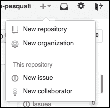

仓库创建后，进入您的本地仓库文件夹，并运行以下命令：

```js
git init
git add .
git commit -m "first commit"
git remote add origin git@github.com:<your username>/express-webhook

```

您现在应该有一个新的 GitHub 仓库和一个本地链接版本。下一步是配置这个仓库以广播仓库上的推送事件。导航到以下 URL：

`https://github.com/<你的用户名>/express-webhook/settings`

从这里，导航到**Webhooks & Services** | **添加钩子**（您可能需要再次输入密码）。现在您应该看到以下屏幕：

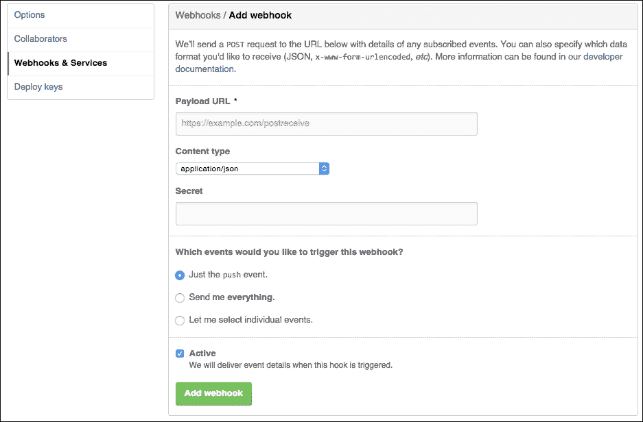

这就是您设置钩子的地方。请注意，`push`事件已设置为默认，如果您被要求，您现在想禁用 SSL 验证。GitHub 需要一个目标 URL 来在更改事件上使用 POST。如果您将本地仓库放置在一个已经可以公开访问的 Web 位置，现在输入该位置，记得要附加`/webhook`路由，例如[`www.example.com/webhook`](http://www.example.com/webhook)。

如果你是在本地机器或另一个受限网络上构建，你需要创建一个 GitHub 可以使用的安全隧道。你可以在这个免费服务[`localtunnel.me/`](http://localtunnel.me/)找到这个服务。按照页面上的说明操作，并使用提供的自定义 URL 来配置你的 webhook。

### 注意

其他好的转发服务可以在[`forwardhq.com/`](https://forwardhq.com/)和[`meetfinch.com/`](https://meetfinch.com/)找到。

现在 webhook 已经启用，下一步是通过触发一个推送事件来测试系统。创建一个名为`readme.md`的新文件（添加你想要的任何内容），保存它，然后运行以下命令：

```js
git add readme.md
git commit -m "testing webhooks"
git push origin master

```

这将把更改推送到你的 GitHub 仓库。返回 GitHub 上的`express-webhook`仓库的**Webhooks & Services**部分。你应该会看到类似以下的内容：

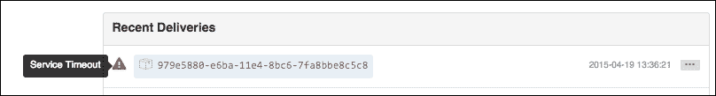

这是个好事！GitHub 注意到了你的推送并尝试将更改信息传递到设置的 webhook 端点，但由于我们还没有配置`/webhook`路由，传递失败是预料之中的。通过点击最后的尝试来检查失败的传递负载——你应该会看到一个大的 JSON 文件。在这个负载中，你会找到类似以下的内容：

```js
  "committer": {
    "name": "Sandro Pasquali",
    "email": "spasquali@gmail.com",
    "username": "sandro-pasquali"
  },
  "added": [
    "readme.md"
  ],
  "removed": [],
  "modified": []
```

现在应该很清楚 GitHub 在推送事件发生时将传递什么样的信息。你现在可以配置演示 Express 服务器中的`/webhook`路由来解析这些数据并使用这些信息，例如向管理员发送电子邮件。例如，使用以下代码：

```js
app.post('/webhook', function(req, res) {
  console.log(req.body);
});
```

下次你的 webhook 触发时，整个 JSON 负载将显示出来。

让我们更进一步，分解 autopilot 应用程序，看看如何使用 webhook 来创建一个构建/部署系统。

## 使用 webhook 实现构建/部署系统

为了演示如何构建一个由 webhook 驱动的部署系统，我们将使用一个应用程序开发入门套件。前往[`github.com/sandro-pasquali/autopilot.git`](https://github.com/sandro-pasquali/autopilot.git)的仓库并使用 Fork。你现在有了**autopilot**仓库的副本，它包括常见 Gulp 任务的脚手架、测试、Express 服务器和一个我们现在将要探索的部署系统。

根据你是在生产环境中运行还是在开发环境中运行，autopilot 应用程序会实现特殊功能。虽然 autopilot 太大太复杂，无法在这里完全记录，但我们将查看系统的主要组件是如何设计和实现的，这样你就可以构建自己的或增强现有系统。以下是我们要检查的内容：

+   如何在 GitHub 上以编程方式创建 webhook

+   如何捕获和读取 webhook 负载

+   如何使用负载数据来克隆、测试和集成更改

+   如何使用 PM2 在代码更改时安全地管理和重启服务器

如果你还没有在 autopilot 仓库上使用 fork，现在就做。将 autopilot 仓库克隆到服务器或其他可以网络访问的地方。遵循如何在 GitHub 上连接和推送你创建的 fork 的说明，并熟悉如何拉取和推送更改、提交更改等操作。

### 注意

PM2 提供了一个基本的部署系统，你可能考虑将其用于你的项目（[`github.com/Unitech/PM2/blob/master/ADVANCED_README.md#deployment`](https://github.com/Unitech/PM2/blob/master/ADVANCED_README.md#deployment)）。

使用 `npm install; npm start` 安装克隆的 autopilot 仓库。一旦 npm 安装了依赖项，一个交互式 CLI 应用程序将引导你完成配置过程。只需按 *Enter* 键回答所有问题，这将设置本地开发构建的默认值（我们将在稍后构建生产环境）。配置完成后，PM2 将启动一个新的开发服务器进程。你将在以下截图的 PM2 清单中看到它列在 `autopilot-dev` 下：

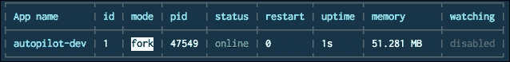

你将在本开发构建的 `/source` 目录中进行更改。当你最终部署好生产服务器时，你将使用 `git push` 将本地更改推送到 GitHub 上的 autopilot 仓库，从而触发 webhook。GitHub 将使用 `POST` 方法对更改信息发送到我们在服务器上定义的 Express 路由，这将触发构建过程。构建运行器将从 GitHub `pull` 你的更改到临时目录，安装、构建和测试更改，如果一切顺利，它将替换你已部署仓库中的相关文件。此时，PM2 将重新启动，你的更改将立即可用。

从示意图上看，流程如下：

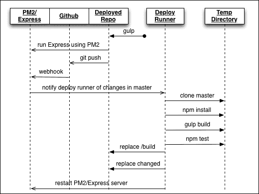

要以编程方式在 GitHub 上创建 webhook，你需要创建一个访问令牌。以下图表解释了从 A 到 B 到 C 的步骤：

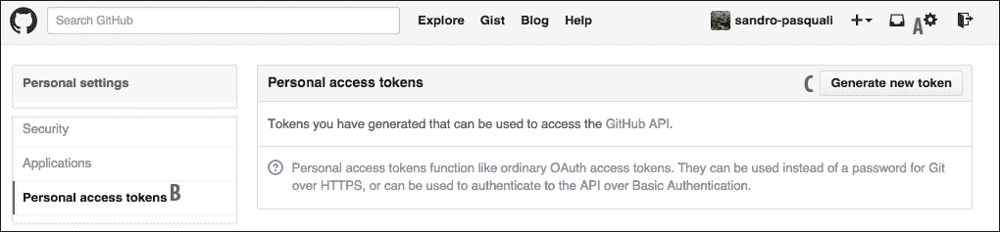

我们将使用位于 [`github.com/mikedeboer/node-github`](https://github.com/mikedeboer/node-github) 的 Node 库来访问 GitHub。我们将使用此包使用你刚刚创建的访问令牌在 GitHub 上创建钩子。

一旦你有了访问令牌，创建 webhook 就很容易了：

```js
var GitHubApi = require("github");

github.authenticate({
  type: "oauth",
  token: <your token>
});
github.repos.createHook({
  "user": <your github username>,
  "repo": <github repo name>,
  "name": "web",
  "secret": <any secret string>,
  "active": true,
  "events": [
    "push"
  ],
  "config": {
    "url": "http://yourserver.com/git-webhook",
    "content_type": "json"
  }
}, function(err, resp) {
  ...
});
```

Autopilot 在启动时执行此操作，无需你手动创建钩子。

现在，我们正在监听更改。正如我们之前看到的，GitHub 将发送一个有效载荷，指示已添加的内容、已删除的内容以及已更改的内容。autopilot 系统的下一步是整合这些更改。

重要的是要记住，当您使用 webhooks 时，您无法控制 GitHub 发送变更集的频率——如果您的团队中有多个人可以推送，那么这些推送发生的时间是无法预测的。自动飞行系统使用 Redis 来管理请求队列，按顺序执行它们。您需要以这种方式管理多个更改。现在，让我们看看一种简单的方法来构建、测试和集成更改。

在您的代码包中，访问 `autopilot/swanson/push.js`。这是在同一文件夹中 `buildQueue.js` 使用了分叉的过程运行器。以下信息传递给它：

+   我们将要克隆的 GitHub 仓库的 URL

+   将该仓库克隆到的目录（`<临时目录>`/`<提交哈希>`）

+   变更集

+   将要更改的生产仓库的位置

好吧，先阅读一下代码。使用几个 shell 脚本，我们将克隆更改后的仓库，并使用您熟悉的相同命令构建它——`npm install`、`npm test` 等等。如果应用程序构建无误，我们只需运行变更集，并用更改后的文件替换旧文件。

最后一步是重启我们的生产服务器，以便更改能够到达我们的用户。这正是 PM2 真正发挥其强大功能的地方。

当自动飞行系统在生产环境中运行时，PM2 会创建一个服务器集群（类似于 Node 的 `cluster` 模块）。这很重要，因为它允许我们逐步重启生产服务器。当我们使用新推送的内容重启集群中的一个服务器节点时，其他节点继续服务旧内容。这对于保持零停机时间生产至关重要。

希望自动飞行实现能给你一些如何改进此过程并定制到您自己需求的灵感。

# 同步本地和部署的构建

部署过程中最重要（并且常常是困难）的部分之一是确保应用程序开发、构建和测试的环境完美地模拟了应用程序将要部署到的环境。在本节中，您将学习如何使用 Vagrant 模拟或虚拟化您的部署应用程序将运行的环境。在演示了这种设置如何简化您的 *本地* 开发过程之后，我们将使用 Ansible 在 DigitalOcean 上配置一个远程实例。

## 使用 Vagrant 在本地开发

很长一段时间以来，开发者会直接在运行的服务器上工作，或者在自己的本地环境中拼凑生产环境的版本，通常编写临时的脚本和工具来简化他们的开发过程。在虚拟机时代，这不再是必要的。在本节中，我们将学习如何使用 Vagrant 在开发环境中模拟生产环境，这为你提供了一个现实中的 *虚拟机* 来测试生产代码，并使你的开发过程与本地机器过程隔离开。

根据定义，Vagrant 用于创建一个模拟生产环境的虚拟机。因此，我们需要安装 Vagrant、虚拟机和机器镜像。最后，我们还需要为我们的环境编写配置和预配置脚本。

前往 [`www.vagrantup.com/downloads`](http://www.vagrantup.com/downloads) 安装适合你的虚拟机的正确 Vagrant 版本。同样，在 [`www.virtualbox.org/wiki/Downloads`](https://www.virtualbox.org/wiki/Downloads) 这里安装 VirtualBox。

现在你需要添加一个虚拟机来运行。在这个例子中，我们将使用 Centos 7.0，但你可以选择你喜欢的任何版本。为这个项目创建一个新的文件夹，进入它，并运行以下命令：

```js
vagrant box add chef/centos-7.0
```

### 注意

有用的是，Vagrant 的创建者 HashiCorp 提供了一个 Vagrant 虚拟机搜索服务，请访问 [`atlas.hashicorp.com/boxes/search`](https://atlas.hashicorp.com/boxes/search)。

你将被提示选择你的虚拟环境提供商——选择 `virtualbox`。所有相关文件和机器现在将被下载。请注意，这些虚拟机非常大，可能需要一些时间来下载。

你现在将创建一个名为 `Vagrantfile` 的 Vagrant 配置文件。与 npm 类似，`init` 命令会快速设置一个基础文件。此外，我们还需要通知 Vagrant 我们将使用的虚拟机：

```js
vagrant init chef/centos-7.0

```

Vagrantfile 使用 Ruby 编写，并定义了 Vagrant 环境。现在打开它并扫描它。里面有很多注释，读起来很有用。注意初始化过程中插入的 `config.vm.box = "chef/centos-7.0"` 这一行。

现在你可以开始使用 Vagrant：

```js
vagrant up

```

如果一切如预期进行，你的虚拟机已经在 Virtualbox 中启动。为了确认你的虚拟机正在运行，请使用以下代码：

```js
vagrant ssh

```

如果你看到一个提示，那么你刚刚设置了一个虚拟机。你会看到你处于 CentOS 环境的典型家目录中。

要销毁你的虚拟机，运行 `vagrant destroy`。这将通过清理捕获的资源来删除虚拟机。然而，下一个 `vagrant up` 命令将需要做很多工作来重建。如果你只是想关闭你的机器，请使用 `vagrant halt`。

Vagrant 作为一个虚拟化、类似生产环境的开发环境非常有用。为此，它必须配置为模拟生产环境。换句话说，你的 box 必须通过告诉 Vagrant 如何配置以及每次运行`vagrant up`时应安装什么软件来进行配置。

配置服务器的一种策略是创建一个 shell 脚本，直接配置我们的服务器，并将 Vagrant 配置过程指向该脚本。在 Vagrantfile 中添加以下行：

```js
config.vm.provision "shell", path: "provision.sh"
```

现在，在托管 Vagrantfile 的文件夹中创建一个包含以下内容的文件：

```js
# install nvm
curl https://raw.githubusercontent.com/creationix/nvm/v0.24.1/install.sh | bash
# restart your shell with nvm enabled
source ~/.bashrc
# install the latest Node.js
nvm install 0.12
# ensure server default version
nvm alias default 0.12
```

销毁任何正在运行的 Vagrant boxes。再次运行 Vagrant，你会在输出中注意到我们的配置 shell 脚本中的命令执行。

完成此操作后，以 root 身份进入你的 Vagrant box（Vagrant boxes 会自动分配 root 密码"vagrant"）：

```js
vagrant ssh
su

```

你会看到已经安装了 Node v0.12.x：

```js
node -v

```

### 注意

允许*Vagrant*用户无密码 sudo 是标准做法。运行`visudo`并在`sudoers`配置文件中添加以下行：

```js
vagrant ALL=(ALL) NOPASSWD: ALL
```

通常，当你开发应用程序时，你会在项目目录中修改文件。你可能会将 Vagrant box 中的某个目录绑定到本地代码编辑器，并以此方式开发。Vagrant 提供了一个更简单的解决方案。在你的 VM 中，有一个`/vagrant`文件夹，它映射到 Vagrantfile 存在的文件夹，这两个文件夹会自动同步。因此，如果你在你的本地机器上的正确文件夹中添加了`server.js`文件，该文件也会出现在 VM 的`/vagrant`文件夹中。

在你的本地文件夹或 VM 的/vagrant 文件夹中创建一个新的`test`文件。你会发现无论它最初是在哪里创建的，该文件都会同步到这两个位置。

让我们将本章早些时候的`express-webhook`仓库克隆到我们的 Vagrant box 中。在 provision.sh 中添加以下行：

```js
# install various packages, particularly for git
yum groupinstall "Development Tools" -y
yum install gettext-devel openssl-devel perl-CPAN perl-devel zlib-devel -y
yum install git -y
# Move to shared folder, clone and start server
cd /vagrant
git clone https://github.com/sandro-pasquali/express-webhook
cd express-webhook
npm i; npm start

```

在 Vagrantfile 中添加以下内容，这将把 Vagrant box 上的端口`8082`（表示托管应用程序监听的端口）映射到主机上的端口`8000`：

```js
config.vm.network "forwarded_port", guest: 8082, host: 8000
```

现在，我们需要重新启动 Vagrant box（加载此新配置）并重新配置：

```js
vagrant reload
vagrant provision

```

由于`yum`正在安装各种依赖项，这个过程可能需要一些时间。配置完成后，你应该看到以下内容作为最后一行：

```js
==> default: Express server listening on port 8082

```

记住我们已将客户端端口`8082`绑定到主机端口`8000`，打开浏览器并导航到`localhost:8000`。你应该会看到**"Hello World!"**显示。

还要注意，在我们的配置脚本中，我们克隆到了（共享的）`/vagrant`文件夹。这意味着`express-webhook`的克隆应该可以在当前文件夹中看到，这将允许你更容易地访问代码库，并知道它将与 Vagrant box 上的版本自动同步。

## 使用 Ansible 进行配置

如我们之前所做的那样，手动配置机器并不容易扩展。首先，设置和管理环境变量可能过于困难。此外，编写自己的配置脚本容易出错，并且由于存在配置工具，如 Ansible，因此不再必要。

使用 Ansible，我们可以使用有组织的语法来定义服务器环境，而不是使用临时脚本，这使得配置的分布和修改更加容易。让我们使用 Ansible **playbooks** 重新创建之前开发的 `provision.sh` 脚本：

> *Playbooks 是 Ansible 的配置、部署和编排语言。它们可以描述你希望远程系统执行的政策或一般 IT 流程中的一系列步骤。*

Playbooks 以**YAML**格式（一种人类可读的数据序列化语言）表示。首先，我们将更改 Vagrantfile 的 provisioner 为 Ansible。首先，在你的 Vagrant 文件夹中创建以下子目录：

```js
provisioning
  common
    tasks
```

这些将在我们通过 Ansible 设置的过程中解释。

接下来，创建以下配置文件，并将其命名为 `ansible.cfg`：

```js
[defaults]
roles_path = provisioning
log_path = ./ansible.log
```

这表示 Ansible **roles** 可以在 `/provisioning` 文件夹中找到，并且我们希望在 `ansible.log` 中保留配置日志。Roles 用于将任务和其他功能组织到可重用的文件中。这些将在稍后解释。

将 `config.vm.provision` 定义修改为以下内容：

```js
    config.vm.provision "ansible" do |ansible|
    ansible.playbook = "provisioning/server.yml"
    ansible.verbose = "vvvv"
    end
```

这告诉 Vagrant 在配置指令上依赖于 Ansible，并且我们希望配置过程是详细的——我们希望在配置步骤运行时获得反馈。此外，我们可以看到预期的 playbook 定义，`provisioning/server.yml`，是存在的。现在创建该文件：

```js
---
- hosts: all
  sudo: yes
  roles:
    - common
  vars:
    env:
      user: 'vagrant'
    nvm:
      version: '0.24.1'
      node_version: '0.12'
    build:
      repo_path: 'https://github.com/sandro-pasquali'
      repo_name: 'express-webhook'
```

Playbooks 可以包含非常复杂的规则。此简单文件表示我们将使用名为 `common` 的单个角色来配置所有可用的主机。在更复杂的部署中，可以在 `hosts` 下设置 IP 地址列表，但在这里，我们只想为我们的单个服务器使用通用设置。此外，配置步骤将提供某些环境变量，形式为 `env.user`、`nvm.node_version` 等。这些变量将在我们定义 `common` 角色时发挥作用，该角色将为我们的 Vagrant 服务器提供构建、克隆和部署 `express-webhook` 所需的程序。最后，我们断言 Ansible 默认应以管理员（`sudo`）身份运行——这是在 CentOS 上运行`yum`包管理器所必需的。

现在，我们可以定义 `common` 角色。在 Ansible 中，文件夹结构很重要，并且由 playbook 隐含。在我们的例子中，Ansible 期望角色位置（`./provisioning`，如`ansible.cfg`中定义）包含 `common` 文件夹（反映 playbook 中给出的`common`角色），该文件夹本身必须包含一个包含`main.yml`文件的`tasks`文件夹。这两个命名约定是特定的，并且是必需的。

最后一步是在 `provisioning/common/tasks` 中创建 `main.yml` 文件。首先，我们复制 `yum` 软件包加载器（请参考代码包中的文件以获取完整列表）：

```js
---
- name: Install necessary OS programs
 yum: name={{ item }} state=installed
 with_items:
 - autoconf
 - automake
 ...
 - git

```

在这里，我们可以看到 Ansible 的几个好处。为 `yum` 任务提供了一个人类可读的描述，并将其提供给循环结构，该结构将安装列表中的每一项。接下来，我们运行 nvm 安装程序，它只是简单地执行 nvm 的自动安装器：

```js
- name: Install nvm
 sudo: no
 shell: "curl https://raw.githubusercontent.com/creationix/nvm/v{{ nvm.version }}/install.sh | bash"

```

注意，在这里我们正在覆盖 playbook 的 `sudo` 设置。这可以在每个任务的基础上完成，这给了我们在配置过程中在不同权限级别之间移动的自由。我们还能在执行 shell 命令的同时插入变量：

```js
- name: Update .bashrc
 sudo: no
 lineinfile: >
 dest="/home/{{ env.user }}/.bashrc"
 line="source /home/{{ env.user }}/.nvm/nvm.sh"

```

Ansible 提供了极其有用的文件操作工具，在这里我们将看到一个非常常见的例子——更新用户的 `.bashrc` 文件。`lineinfile` 指令使得添加别名等操作变得简单直接。

剩余的命令遵循类似的模式，以结构化的方式实现我们服务器所需的配置指令。所有你需要用到的文件都在你的代码包中的 `vagrant/with_ansible` 文件夹里。一旦安装完毕，运行 `vagrant up` 就可以看到 Ansible 的实际应用。

Ansible 的一个优势在于它处理上下文的方式。当你开始你的 Vagrant 构建，你会注意到 Ansible 会收集事实，如下面的截图所示：

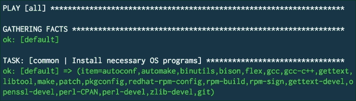

简而言之，Ansible 分析其工作上下文，并且只执行必要的操作。如果你的某个任务已经运行过，那么下次你尝试 `vagrant provision` 时，该任务将不会再次运行。这对于 shell 脚本来说可不是这样！通过这种方式，编辑 playbooks 和重新配置不会重复改变已经改变的内容，从而节省时间。

Ansible 是一个强大的工具，可用于配置和更多复杂的部署任务。它的一大优势是可以在远程运行——与大多数其他工具不同，Ansible 使用 SSH 连接到远程服务器并执行操作。你不需要在生产服务器上安装它。我们鼓励你浏览 Ansible 文档 [`docs.ansible.com/index.html`](http://docs.ansible.com/index.html) 以获取更多信息。

# 集成、交付和部署

在本章中，我们一直在探讨使用鼓励敏捷开发的部署系统，通常可以促进代码更新在近乎实时的情况下安全地交付到生产环境。部署的结构和/或理解方式的差异很常见，这通常取决于团队规模和管理结构等因素。以下几节将简要介绍三个典型类别，**持续集成**、**持续交付**和**持续部署**。最后，我们将使用 Jenkins，一个 CI 服务器，为 Node 应用程序设置一个构建/部署系统，配置为自动将更改部署到 Heroku 服务器。

## 持续集成

持续集成是将更改持续合并到主分支的过程（通常每天几次）。CI 的目标是让错误变得不耐烦和嘈杂，尽早出现并大声失败，而不是从几天或几周的工作中出现的更大、更复杂的**批量**合并中后期出现。通常在这里运行单元测试。请注意，更新的集成分支不一定持续部署，尽管它可能如此。目标是保持主分支新鲜、当前，并在必要时准备好部署。

## 持续交付

“交付”是这里的关键词。在所有更改都必须在发布之前由质量保证团队或其他利益相关者测试/审查的环境中，“交付”和“审查”是在提出更改时进行的。虽然持续交付不排除将代码交付到生产环境，但一般目标是在代码到达真实客户之前，将其交付到可以进行进一步功能测试、业务逻辑测试等的地方。

此测试环境应与生产环境相当，并且当测试通过时，应有一定的信心认为这些更改也可以部署到生产环境中。因为这个阶段通常被视为部署之前，所以它通常被称为*预部署环境*。

阶段性更改通常可以一步部署，一个系统命令，或 GUI 中的一个按钮点击。

## 持续部署

持续部署是一种积极、乐观的策略，以构建应用程序的方式使其可以随时发布到生产环境，通常是在通过某些自动化测试后立即发布。这种策略通常导致每天发布许多版本，并且需要验证管道尽可能接近生产环境。

由于对发布代码的监督有限（或不存在），对应用程序性能的持续发布后检查是正常的。也就是说，信任但核实：在自动化测试后推送到生产环境，但定期检查您的访问量是否下降、响应时间是否上升，或其他指标是否异常。

虽然与持续交付类似，但这两者不应混淆。

## 使用 Jenkins 构建和部署

您已经学会了如何使用 GitHub webhooks 在代码推送到存储库时触发构建过程。从拉取和测试更改后的存储库到通知聊天服务器新的构建已发生，Jenkins 帮助您触发部署工作流程。当您的部署需求比简单地测试单个分支更复杂时，更强大的 CI 工具的好处就显现出来了。Jenkins 提供了管理构建权限、任务调度、触发部署、显示构建日志等工具。让我们使用 Jenkins 部署一个应用程序。

要安装 Jenkins，运行您环境中的安装程序，该程序可在 [`jenkins-ci.org/`](http://jenkins-ci.org/) 找到。还有允许您在“云”中安装 Jenkins 的服务，但我们将构建一个本地服务。安装成功后，浏览器将打开并显示 Jenkins 的“主页”UI，如下所示：

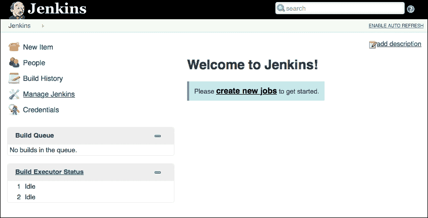

在管理构建时，您将经常使用这个 Jenkins **仪表板**。

注意，Jenkins 默认将在端口 `8080` 上运行。您需要像处理 webhooks 一样，直接通过代理、转发或其他方式将此位置映射到一个可访问的 Web URL。转到 **管理 Jenkins** | **配置系统** 并找到 **Jenkins 位置** 部分。添加 Jenkins URL，如下面的截图所示：


如果您在 `localhost` 上运行 Jenkins，请回到本章前面我们讨论使用转发服务（如 [`localtunnel.me/`](http://localtunnel.me/)）的部分。

### 注意

您可能会收到关于不安全 Jenkins 实例的警告。这是一个有效的投诉！虽然我们不会设置身份验证，但在任何实际的生产环境中，您都应该这样做。这并不难。访问 **管理 Jenkins** | **配置全局安全** 来进行设置，或访问 [`wiki.jenkins-ci.org/display/JENKINS/Securing+Jenkins`](https://wiki.jenkins-ci.org/display/JENKINS/Securing+Jenkins)。

下一步是配置 Jenkins 以与 Node.js 和 GitHub 一起工作。从仪表板导航到 **管理 Jenkins** | **管理插件** | **可用**。您应该会看到一个可用插件的列表，您将从中搜索并安装 *NodeJS 插件* 和 *GitHub 插件*。由于这些插件及其依赖项需要安装，这可能需要一些时间。如果任何安装提示您重新启动 Jenkins，您将在本节稍后提供的安装列表中找到如何操作的说明。

我们必须完成的关键集成是与 GitHub 的集成。在一个新的浏览器窗口中，访问您的 GitHub 账户并生成一个新的访问令牌。

复制生成的密钥。现在，您将向 Jenkins 提供这个访问令牌，以便它可以代表您在 GitHub 上执行操作，特别是在 webhooks 方面。返回到**管理 Jenkins** | **配置**，并将此 OAuth 令牌和您的用户信息添加到**GitHub Web Hook**部分，如下所示：

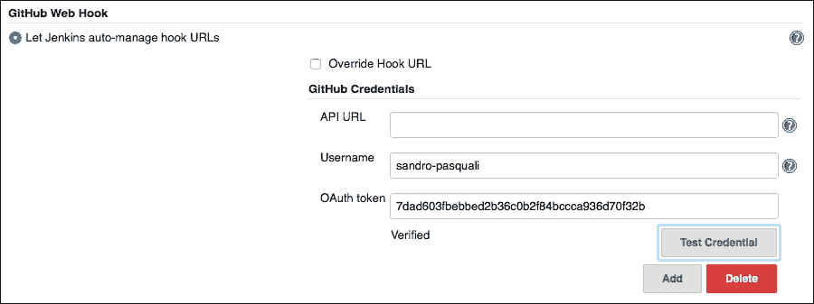

运行**测试凭据**以确保 Jenkins 可以使用您提供的令牌连接到 GitHub。

最后，我们需要向 Jenkins 提供我们的 GitHub 凭据，以便在发生更改时它可以拉取我们的仓库。导航到**凭据**并点击**全局凭据**。选择**用户名和密码**并添加您的凭据，这将确保您为这些凭据提供了一个有用的名称（您稍后需要引用这些凭据）。

因为您已经构建了自己的由 webhook 驱动的 CI 系统，所以您可能已经很明显为什么 Jenkins 要以这种方式配置。最终，我们正在配置 Jenkins 以响应 GitHub 仓库的推送事件，拉取更改后的仓库，并自动构建它。为此，我们需要配置 Jenkins，使其配置了 Node 节点，因此可以构建 Node 仓库。

导航到**配置系统**并添加一个 NodeJS 安装，如下所示：

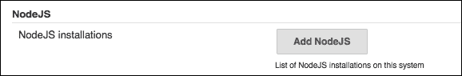

现在，您将配置 Jenkins 将使用的 Node 环境。您应该将此环境与您的生产服务器运行的环境相匹配。点击**添加 NodeJS**并按照说明操作。您可以选择**自动安装**，并在提供安装选项时选择**从 nodejs.org 安装**。确保添加您需要的任何全局 npm 包——例如 gulp、pm2、mocha 和其他对您的构建环境必要的工具。

如果你更愿意自己管理安装，只需使用“运行 Shell 命令”选项，并使用以下类似命令，添加你想要的全局安装：

```js
curl https://raw.githubusercontent.com/creationix/nvm/v0.24.1/install.sh | bash; nvm install 0.12; nvm alias default 0.12; npm install gulp -g

```

记得保存您的更改！

我们几乎完成了 Jenkins CI 的配置。最后一步是创建一个构建项目。导航到**新建项目**，在**项目名称**字段中添加一个有用的项目名称，选择**Freestyle 项目**，然后点击**确定**。现在，导航到**源代码管理**，选择**Git**，添加 GitHub 仓库名称，选择访问该仓库的凭据，点击**保存**，然后您就可以开始构建，如下面的截图所示：

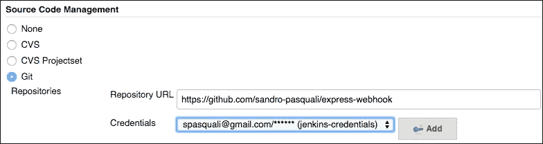

返回 Jenkins 仪表板，你会看到你的构建项目列出来。点击项目名称，从左侧菜单中选择**立即构建**。如果一切顺利，你会看到构建历史表快速填充，如下所示：

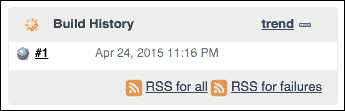

点击数字，如果一切顺利，您将看到有关构建的信息，表明 *没有更改*（您刚刚完成了一项妙手回春），一些关于 Git 修订版本的详细信息，等等。现在，真正的测试——对您的 GitHub 仓库进行更改，无论是通过推送更改还是简单地使用 GitHub 的编辑工具编辑文件。如果您返回到仪表板，您将看到 Jenkins 已将一个新的构建添加到 **构建队列**；不久构建将完成，您将在项目的构建历史中看到您刚刚所做的更改。您已经为您的项目创建了一个 CI 环境！

现在，我们需要进行部署。我们将使用 Heroku 进行部署，但请随意尝试您选择的任何提供商——只要它 *支持* Git，Jenkins 就能够推送您的仓库。

## 部署到 Heroku

返回 第二章，*安装和虚拟化 Node 服务器*，并刷新您对如何在 Heroku 上构建的记忆。至少，您需要安装 Heroku Toolbelt 并进行身份验证。通过工具带连接到 Heroku 后，克隆我们之前创建的 `express-webhook` 仓库，并进入该文件夹。现在，运行 `heroku create` 在 Heroku 上构建一个机器。您应该会收到一个 URL 和一个类似于以下内容的 Git 端点：

```js
https://floating-shelf-4947.herokuapp.com/ | https://git.heroku.com/floating-shelf-4947.git
Git remote heroku added

```

现在，是时候向服务器推送一些内容以便其运行了。执行以下命令将 `express-webhook` 应用程序推送到 Heroku：

```js
git push heroku master

```

`express-webhook` 应用程序现在已部署到 Heroku。Heroku 将自动构建并启动应用程序。请访问我们之前收到的 URL，在浏览器中查看。下一步是使用 Jenkins 在您对应用程序仓库进行更改时自动将其部署到 Heroku。

您现在连接了两个 Git 仓库，您可以通过运行 `git remote -v` 来查看：

```js
heroku  https://git.heroku.com/floating-shelf-4947.git (fetch)
heroku  https://git.heroku.com/floating-shelf-4947.git (push)
origin  https://github.com/sandro-pasquali/express-webhook (fetch)
origin  https://github.com/sandro-pasquali/express-webhook (push)

```

`origin` URL 是我们的 GitHub 仓库，而 `heroku` 代表 Heroku 维护的 Git 仓库。我们将通过 Jenkins 同步这两个仓库。

由于 Jenkins 最终将为我们进行推送，我们需要授予它访问您的 Heroku 机器的权限。我们将为 `jenkins` 用户生成一个密钥对，并将这些本地 SSH 密钥与 Heroku 关联起来，允许 Jenkins 执行推送等操作。以 `jenkins` 用户身份登录，并运行以下两个命令：

```js
ssh-keygen -t rsa
heroku keys:add ~/.ssh/id_rsa.pub

```

Jenkins 现在可以与 Heroku 进行身份验证。剩下的工作就是通知 Jenkins 关于 Heroku 仓库的信息，并指导 Jenkins 在通过之前配置的 webhook 通知有更改时部署到 Heroku。

返回您的 Jenkins 项目，点击 **配置**，然后通过点击 **添加仓库** 将 Heroku Git 端点作为另一个仓库添加到 **源代码管理** 部分。填写 **仓库 URL** 字段以匹配您之前收到的：

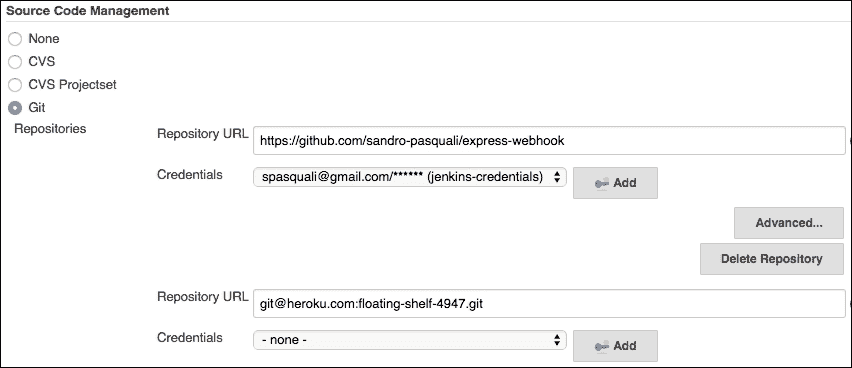

注意，你将 *不* 填写 **凭据**，因为我们之前已经使用 SSH 密钥将 Jenkins 连接到 Heroku。

现在，点击新仓库下方的“高级”按钮，给它一个名字——你将在下一步需要它。这里我们使用 **heroku**，但它可以是任何名字：


现在，Jenkins 已经知道我们的 GitHub 仓库和 Heroku 仓库。最后一步是配置 Jenkins 将 GitHub 的更改推送到 Heroku。

滚动到 Jenkins 项目的“构建后操作”。点击“添加构建后操作”，选择“Git 发布者”。按照此处所示填写提供的表格：

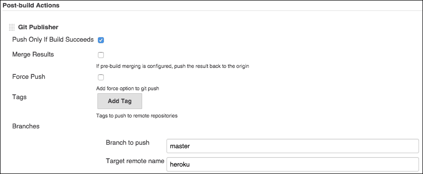

我们正在告诉 Jenkins 在每次成功构建后将 `express-webhook` GitHub 仓库的 `master` 分支推送到 `heroku`。这是部署步骤。保存你的更改——你已经完成了！

为了测试一切是否正常工作，修改你本地克隆的 `express-webhook` 中的 `server.js` 默认路由，使其产生不同的消息，并将此更改推送到 GitHub。如果你返回到 Jenkins 控制台，你将很快在项目的构建状态上看到以下进度指示器：

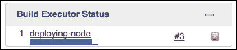

如果一切顺利，你的项目将在仪表板上列出，表明它已成功构建。如果你刷新你的 Heroku URL，你也将看到你所做的更改。恭喜你成功为你的项目设置了持续部署！

现在你已经为 CI 和部署设置了结构，开始添加测试和其他构建步骤，并在你的 Node 环境中或使用你可用的许多 Jenkins 工具中运行它们。祝构建愉快！

# 包维护

JavaScript 本身不提供原生的包管理系统；npm 为 Node 应用程序完成这项工作。因此，良好的包管理策略是良好部署策略的关键部分。

包提供封装的好处。运行中的包只能通过它们导出的 API 访问。这种隔离减少了系统中潜在错误的数量，从而保护核心功能免受意外更改。然而，由于（不透明的）包本身可能需要其他包作为依赖项，一个应用程序的完整依赖图可能对开发者来说难以轻易看到。例如，如果你实现的包的功能突然发生变化，你如何调试它？错误是在包中吗？还是在它的依赖包之一中？

当你部署 Node 应用程序时，理解 *npm 依赖图中的情况* 是至关重要的。在本节中，我们将探讨如何保持包更新的同步，使用 Git 管理私有包，跟踪整个依赖图的健康状况，以及查看在应用程序的 `package.json` 文件中设置版本规则的最佳实践。

## 理解 Semver

**语义版本控制** (**Semver**) 简单来说是一组规则，这些规则被提出以规范系统中依赖项的声明。Npm 在其包管理器中强制执行这些规则，因此理解它们如何管理依赖项将是这里讨论的重点。

以以下 npm 包文件为例：

```js
"devDependencies": {
  "browserify": "⁶.1.0",
  "gulp": "~3.8.8",
  "foobar": " >=1.2.3 <1.3.0"
}
```

每个依赖项都有一个与 npm 仓库中的版本相对应的版本号。其中一些数字通过标记进一步修改，例如，一个 caret (`^`) 或一个 tilde (`~`)，以及版本范围。让我们看看语义版本号中的每个部分代表什么，以及如何使用各种标记来调节这些部分。

版本号被分解为三个部分，如下所示：


Semver 具体描述了允许的包版本范围，并暗示了包的当前稳定性或状态——包是否稳定，是否成熟等。编号按顺序进行：1.0.1 在 1.0.2 之前，1.0.2 在 2.0.0 之前。

Semver 描述的变更的重要性从左到右递增，其中包的主版本变更通常描述了与较低版本不兼容的变更——2.0 与 1.0 不兼容。根据 [semver.org](http://semver.org)，你应该这样使用版本号：

> *"给定版本号 MAJOR.MINOR.PATCH，当进行不兼容的 API 变更时增加 MAJOR 版本，当以向后兼容的方式添加功能时增加 MINOR 版本，当进行向后兼容的错误修复时增加 PATCH 版本。"*

然后，Semver 允许你根据提供有用的影响程度指示，为应用程序中依赖项的版本设置可接受的范围限制。以下是一些常见的使用示例：

+   "3" 表示只有主版本（3）必须满足，忽略次要或补丁值——3.0.0、3.6.3 和 3.99.99 都是可接受的。

+   "3.4.5" 表示只有那个版本是可接受的，没有变化。

+   "<, <=, > 和 >=" 范围比较符在许多编程语言中按预期工作，可以用来设置受控范围。>= 3.0.1 <= 3.2.1 接受 3.0.2 和 3.1.9，但不接受 3.0.0 或 3.2.2。

+   1.3.4 >= 3.0.1 <= 3.2.1 接受前面所述的版本范围或 1.3.4 版本。

+   相当于 >= 0.0.0 的 "*" 表示任何版本都是可接受的。

+   Hyphen 范围 (-) 描述了包含的集合。Hyphen 范围 1.0.0 - 2.0.0 匹配任何主版本为 1 的包。

+   x-ranges 为小版本和补丁版本提供了一种简写方式；1.2.x 等同于 >= 1.2.0 <= 1.3.0，而 1.x 等同于 >= 1.0.0 <= 2.0.0。

+   Tilde (~) 范围允许在指定小版本时进行补丁级别变更，未指定时进行小版本变更。~1.3.2 等同于 >= 1.3.2 < 1.4.0，~1.3 等同于 >= 1.3.0 < 1.4.0，而 ~1 等同于 >= 1.0.0 < 2.0.0。

+   管理员符号（^）范围允许更改不修改最左边的非零数字。¹.2.0 等同于 >= 1.2.0 <= 2.0.0，⁰.2.1 等同于 >= 0.2.1 <= 0.3.0，而 ⁰.0.2 等同于 >= 0.0.2 < 0.0.3。

### 注意

更多详情，请访问 [`github.com/npm/node-semver`](https://github.com/npm/node-semver) 和 [`docs.npmjs.com/misc/semver`](https://docs.npmjs.com/misc/semver)。一个有用的工具，可以用来检查特定包与 Semver 元组的版本，可以在 [`semver.npmjs.com/`](http://semver.npmjs.com/) 找到。

正如我们在使用 `npm install <packagename> --save` 构造时看到的，npm 默认使用管理员符号前缀——npm 将为新安装的依赖项分配 `^<最新版本>` 的版本号到 `package.json` 中。如果你想使用默认的波浪线前缀，请使用 `npm config set save-prefix="~"`。

Semver 的另一个重要特性是预发布标签。这些标签允许你发布一个尚未准备好生产的包版本（预发布），你可能这样做是为了将其交给团队中的其他人、测试人员等，同时确保默认版本将在“正常”安装时安装。

当你发布一个 npm 包时，你可以使用 `--tag` 参数来标记那个版本。现在发布的包不再标记为 "latest"，而是你分配给它的任何标签。比如说，我们标记了 **alpha.7** 包（并且使用 `npm version <version>-alpha.7` 更改了包的版本字段）。

现在，考虑这种情况，该包被列在 *userland* 的某个地方作为依赖项：

```js
"my-package" : ">=1.03-alpha.1"

```

当这个包被安装时，npm 将安装 alpha.7 包——Semver 范围将适用，因为 alpha.7 大于 alpha.1。

让我们这样定义我们的包：

```js
"my-package" : ">=1.03"

```

在前面的例子中，alpha.7 包将 **不会** 被安装。这样，我们可以看到，根据 Semver 规则，预发布标签仅在比较器（你设置的包版本）也包含预发布标签时才适用。这样，你可以在标记的包中安全地发布实验性的破坏性更改，因为只有完全了解标签名称（及其 alpha 特性）的人才会进行使用它所需的工作，而其他人将继续使用生产版本。

## 使用 npm 管理包

你将部署的最重要（且棘手）的应用程序管理策略之一是选择包和更新包版本。在本节中，我们将讨论维护你的 npm 包的好策略——如何保持你的包更新，如何锁定依赖项，如何从 Git 仓库加载包而不是 npm，等等。

通常，你希望平衡严格的 Semver 约束的相对安全性，以及尽可能保持与重要包的最新版本同步的需求，同时保持你的依赖树可预测且干净。制定一个好的策略将有助于应用程序维护。

以下六个方面是包维护的要点：

+   维护对完整的 npm 依赖树的意识

+   跟踪包的最新版本和安装版本之间的差异

+   删除在包文件中定义的未使用包

+   确保所有必需的依赖项都已安装

+   确保所需的依赖项是你拥有的那些

+   使用私有或其他不在 npm 仓库中的模块

其他包管理系统强制执行规则，即包的单一版本存在于所有依赖项中；npm 则不是这样。包通常需要其他包，因此同一包的多个版本可以进入 npm 构建。一个应用程序可能有 A 和 B 依赖项，其中 A 包需要 C 包的 1.0.1 版本，而 B 包需要 C 包的 2.0.1 版本。

考虑到在每次 npm 安装时，对依赖树中插入的包版本的控制是有限的（通常思考得很少）——无法保证你的应用程序在任何给定时间运行相同的代码。某一时刻安装的内容，如果在一个小时后或甚至一秒后重新安装，可能会发生根本性的变化。这是将风险引入生产系统的一个异常高的水平——类似于软件经理对谁、在哪里、何时进行更改漠不关心。

第一步是获取完整的安装分解。使用`npm ls`来完成此操作，它返回如下内容：

```js
...
├─┬ mocha@1.21.5
│ ├── commander@2.3.0
│ ├─┬ debug@2.0.0
│ │ └── ms@0.6.2
│ ├── diff@1.0.8
│ ├── escape-string-regexp@1.0.2
│ ├─┬ glob@3.2.3
│ │ ├── graceful-fs@2.0.3
│ │ ├── inherits@2.0.1
│ │ └─┬ minimatch@0.2.14
│ │   ├── lru-cache@2.5.0
│ │   └── sigmund@1.0.0
│ ├── growl@1.8.1
...

```

如果你想将此树表示为 JSON，请使用`--json`标志：`npm ls --json`。要包括每个包的`description`字段的输出，请使用`npm ls --long`。你可以使用`npm ls -g`来获取全局安装包的此树。如果你只想知道哪些包已全局安装，请尝试`ls `npm root -g``。

定期保持已安装包的当前版本更新是你应该做的事情。包的版本很快就会过时。npm 提供了`npm outdated`工具来完成此目的（在这里，它使用了`--long`“扩展信息”参数）。下面的截图显示了这一点：

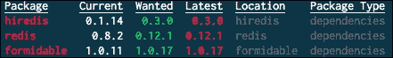

在这里，我们看到我们的应用程序的`node_modules/redis`文件夹中的`package.json`文件版本为 0.8.2（**当前**），最新版本为 0.12.1，并且根`package.json`文件中*redis*的期望 Semver 将与版本 0.12.1 相匹配。这表明自从在这个应用程序中运行`npm install`以来已经有一段时间了。一个非常有用的全局工具来执行这些检查是`npm-check`([`github.com/dylang/npm-check`](https://github.com/dylang/npm-check))，它提供了更详细的信息，如下面的截图所示：

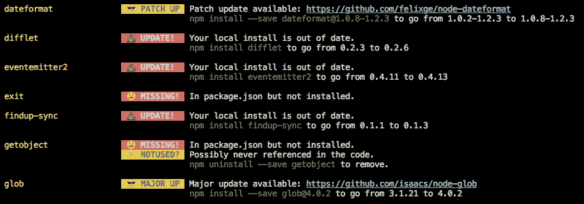

此外，此工具还提供了一个交互式用户界面，它将自动更新你选择的包。

随着时间的推移，另一种会积累的残留物是未使用的包。这些包可能已安装在 `node_modules` 中但不再链接，或者这些包可能已为某个包定义但未在应用程序代码的任何地方使用。

要删除在 `package.json` 中不再列出的已安装包，你可以使用 `npm prune`。请注意，这仅仅是一种清理单个包文件夹内的 `node_modules` 文件夹的技术；它不是一个智能的全局工具，不能在整个树中删除未使用的包。

`dependency-check` 模块（[`github.com/maxogden/dependency-check`](https://github.com/maxogden/dependency-check)）是另一个用于查找不必要的包的工具。假设存在这样的未使用依赖项，`dependency-check` 将会找到它：

```js
dependency-check package.json --unused
Fail! Modules in package.json not used in code: express

```

相反，包可能需要在应用程序代码中使用，但未在包文件中列出。这种情况偶尔发生，当在开发过程中安装了必要的包但未保存到 `package.json` 中时，可能是由于用户忘记使用 `--save` 选项或其他原因。`dependency-check` 命令将遍历你的代码库中的所有文件，并找到此类情况，如下所示：

```js
dependency-check package.json
Fail! Dependencies not listed in package.json: express

```

注意，预期你的应用程序的入口点在 `package.json` 中列出，因为 `dependency-check` 需要知道你的应用程序树根在哪里。因此，你应该确保你的所有包都有一个指向现有文件的 `main` 属性。如果你需要添加更多要检查的文件，请使用以下 `--entry` 参数：

```js
dependency-check package.json --entry a.js b.js [...]

```

拥有一个指向你应用程序的 `main` 入口点是你应该遵循的重要通用实践。

最后一个可以帮助加快你的 npm 构建的工具有 `npm dedupe`。当触发时，npm 尝试减少冗余包安装的数量，"扁平化" 树结构，因此减少安装时间。考虑以下依赖树：

```js
A
└─┬ B
│ └── C
└─┬ D
  └── C
```

在这里，A 包依赖于 B 和 D 包，而这两个包又各自依赖于 C 包。通常，C 会安装两次，一次为每个父包。然而，如果 B 和 D 用来针对 C 的 Semver 匹配 C 的单个版本，npm 将以这种方式减少树的大小，即 B 和 D 都从相同的单个已安装版本 C 中提取。请注意，Semver 规则仍然适用——npm 不会仅仅为了减少所需的安装次数而破坏版本要求。

应该很明显，我们一直在查看的许多工具都可以很好地集成到构建/部署过程中，例如，如果某个包未使用或已过时，则会发出警告。npm 本身也是一个 npm 包（[`github.com/npm/npm`](https://github.com/npm/npm)）——尝试在你的构建过程中使用 npm 进行编程，以执行这些检查之一。

### 设计依赖树

并非所有依赖项都同等重要。有些在开发模式下是必要的，但在生产中却没有意义。依赖项的位置和版本也可能变化，因为你可能并不总是使用 npm 仓库中的包，或者你可能想使用特定的版本。

npm 包文件中使用了三种类型的依赖项：**dependencies**、**devDependencies**和**peerDependencies**。让我们看看它们之间的区别。

简单依赖可能是你最熟悉的。这些依赖项**总是**被安装，无论在什么环境下。你应该将**必须**存在于这个集合中的依赖项放置在这里，通常是生产构建所需的包。

当你在开发和构建时，你经常会使用工具，如 Mocha 或 gulp。然而，一旦经过验证的构建准备好投入生产，就没有必要将这些包与其一起放置。在生产中不需要的包应该放在 devDependencies 集合中。虽然 npm 总是会安装依赖项和 devDependencies，但你（并且应该）可以通过使用`--production`标志从部署安装中排除 devDependencies，如下所示：

```js
npm install --production

```

有用的是，如果你运行`npm config set production`命令，`~/.npmrc`文件将被更新，使得所有未来的安装都将自动设置`--production`标志。例如，你的配置器可以执行此配置。

最后，peerDependencies 处理的是插件的案例。你熟悉各种 Grunt 插件。虽然这些插件是通过 npm 生态系统加载的，但它们需要其宿主程序（Grunt）才能运行。你可能认为每个插件都应该直接`require('grunt')`——但是哪个版本的 Grunt 呢？任何一个插件都可能依赖于其宿主程序的具体版本，但这些宿主程序也是包的直接依赖。因此，考虑以下声明：

```js
"dependencies": {
  "grunt": "1.2.3",
  "gulp-plugin": "1.0.0" // requires grunt@2.0.0
}
```

前面的声明可能导致危险的冲突：

```js
└── grunt@1.2.3
└─┬ gulp-plugin@1.0.0
  └── grunt@2.0.0
```

因此，peerDependencies 应该在具有特定宿主程序需求的插件类型包中使用，允许插件“携带”它们所需的宿主。如果 npm 尝试安装该宿主程序的不同版本，则会抛出错误。这当然会导致另一个问题——如果插件所需的主程序版本与主应用程序要求的版本不兼容，任何给定的插件都可能导致安装失败。peerDependencies 的复杂性在 Node 社区中仍然是一个持续讨论的话题([`github.com/npm/npm/issues/5080`](https://github.com/npm/npm/issues/5080))。

如前所述，npm 对包版本的限制不多，允许同一包存在多个版本，并且确实，版本（以及因此包的功能）可能会意外地发生变化。

确保你的应用程序状态的一种方法是通过使用 `npm shrinkwrap` 锁定依赖树。这个命令会触发 npm 生成包含对特定版本明确引用的 `npm-shrinkwrap.json` 文件。生成的文件包含如下定义：

```js
"moment": {
  "version": "2.8.4",
  "from": "moment@².8.3",
  "resolved": "https://registry.npmjs.org/moment/-/moment-2.8.4.tgz"
},
"node-uuid": {
  "version": "1.4.2",
  "from": "node-uuid@¹.4.1",
  "resolved": "https://registry.npmjs.org/node-uuid/-/node-uuid-1.4.2.tgz"
}
```

应该清楚这种语法如何确保未来的安装将与之前相同。请注意，这是一个较为直接的方法，你可能并不经常需要它。然而，在生产环境中，当你需要在多台机器上部署相同代码时，shrinkwrap 的“捆绑包”可能正是你所需要的。

另一种确保你的包行为可见性的方法是完全控制它们。你可以将依赖项链接到 Git 仓库，无论是公开的还是私有的。例如，你可以直接从 Express 的 GitHub 仓库加载 Express：

```js
dependencies : {
  "express" : "strongloop/express"
}
```

npm 假设 GitHub，因此你可以使用压缩语法，如前述代码所示。

你还可以使用 `https/oauth` 链接到私有 Git 仓库：

```js
"package-name": "git+https://<github_token>:x-oauth-basic@github.com/<user>/<repo>.git"

```

你还可以按照以下方式使用 SSH：

```js
"package-name": "git+ssh://git@github.com/<user>/<repo>.git"

```

npm 包管理器是 Node 生态系统的一个基本组成部分，Node 应用程序通常由数十个，甚至数百个包组成。如果你计划发布和维护一个大规模的 Node 应用程序，围绕包管理制定策略是一个重要的考虑因素。

# 摘要

在本章中，你学习了如何将本地构建部署到生产就绪环境中。强大的 Git webhook 工具被演示为创建持续集成环境的一种方式，并将这一知识应用于创建一个完整的构建/部署管道，该管道通过使用 Jenkins 配置的 CI 环境将 GitHub 仓库连接到 Heroku 部署。我们还介绍了 npm 使用的语义版本控制系统，甚至如何使用 Semver、npm 方法以及一些辅助库来保持我们的包树整洁和可预测。

从基本的 JavaScript 程序到完整应用程序的部署，在这本书中，我们游览了 Node 的设计和目标。我们探讨了 Node 事件驱动架构如何通过构建流的基础概念来影响我们设计网络软件的方式。为了创建快速、可部署的系统，我们探讨了虚拟化策略、编译器优化、负载均衡以及垂直和水平扩展策略。此外，通过引入微服务、进程间消息传递和队列作为构建分布式系统的一种方式，我们还考虑了由小型、专注的程序组成的软件的力量。

考虑到软件是由有缺陷的人类编写的，我们还涵盖了测试和维持运行中的应用程序的战略，学习预期失败并为此做好准备，借助原生和第三方日志和监控工具。我们学习了调试技术和优化策略，旨在减少本地和网络级别的瓶颈，以及如何在它们不可避免地出现时找到它们的来源。为了使开发更简单，我们研究了如何有效地使用集成工具和版本控制系统，配置虚拟机并使用无头浏览器进行测试，使开发者能够自由工作并承担风险，并带着智能部署策略带来的信心推送更改。构建智能构建管道，您了解了全栈 JavaScript、转译、实时更新和持续测试与集成的力量。

鼓励您修改和扩展示例代码以改进它或根据您的需求进行更改。希望随着您开始欣赏 Node.js 的力量、npm 生态系统和开源软件，您将开始自然地设计您的应用程序，以便在推向生产时需要很少的更改，并且您将分享您的发现，以便其他人也能做到同样的事情。
