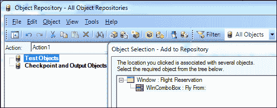
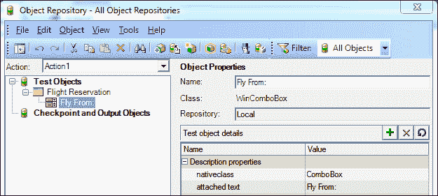
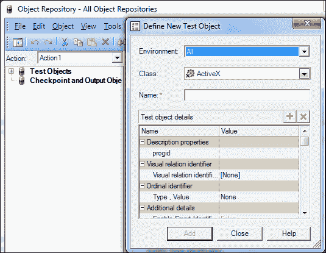
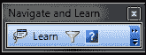
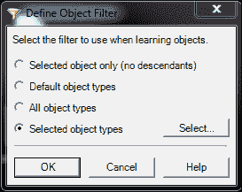
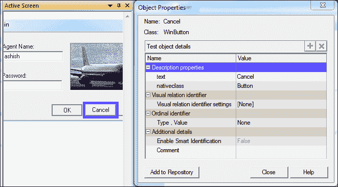
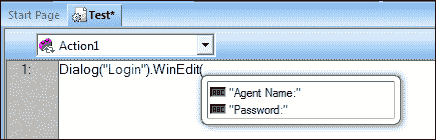
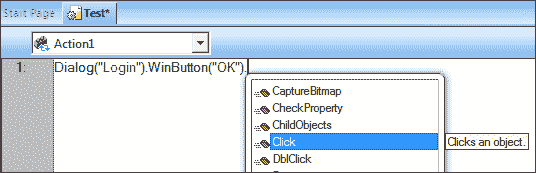
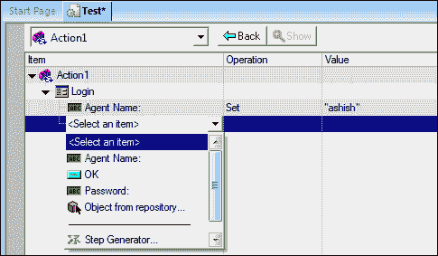
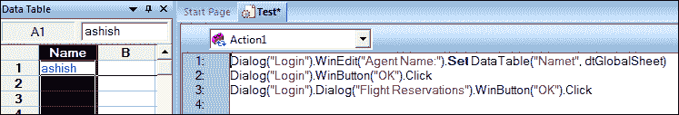

# 第二章. 自动化的基本要素

在第一章中，*自动化生命周期和自动化目标*，我们学习了测试自动化生命周期和自动化目标。测试自动化的基本功能是录制和回放。这些功能允许用户多次播放脚本，并将预期值与实际值进行比较。这种方法简单，且对编码知识的要求很少或没有，可以应用于任何具有图形用户界面的支持应用程序。应该熟悉基本 QTP 功能，如录制、回放、对象库（OR）创建、检查点、同步、动作、报告、错误处理、参数化和配置。还应该了解如何使用环境变量使脚本完整且可重用。本章旨在处理录制或创建测试脚本、脚本创建生命周期、QTP 功能和各种使用这些功能创建完整可重用脚本的方法。本章的目的是熟悉这些功能，以便于脚本创建和增强。

# 关于 QTP

HP **QuickTest Professional** (**QTP**或 QuickTest)或**Unified Functional Tester** (**UFT**)是用于功能性和回归测试用例自动化的测试自动化工具。HP QuickTest Professional 支持关键字视图和脚本接口来自动化测试。它使用 VBScript 作为脚本语言来指定测试脚本，并与测试中的应用程序中的对象和控件一起工作。

QTP 是一个提供自动化软件测试和框架创建支持的工具。支持 QTP 录制和回放机制的基本组件包括测试对象模型、测试对象和对象库。对这些组件的了解和理解有助于创建脚本。

# QuickTest 对象模型

测试对象模型是一组对象和类，它表示 AUT 中的对象。每个类都有一组属性用于其标识；QTP 使用属性的一个子集在运行时唯一地识别对象。

测试脚本是由标准 VBScript 语句和用于 QuickTest 测试对象、方法和属性的语句组合而成的。QuickTest 对象模型包含一个部分，用于表示 QTP 安装中可用的每个插件环境，以及一个用于实用程序和补充对象的特殊部分。

# 测试对象

QTP 使用测试对象来表示 AUT 中的对象。每个测试对象都有一组方法和属性，用于执行操作和检索该对象的价值。每个测试对象都有一些标识属性，用于描述该对象。

对象识别属性可以用在对象存储库描述、程序性描述、检查点、输出值、测试步骤中，并作为 `GetTOProperty` 和 `GetROProperty` 方法的参数值传递。运行时对象是在运行会话期间在 AUT 上执行方法的实际对象。

# 对象存储库

在创建测试之前设置资源。任何测试最重要的资源之一是对象存储库，它存储了测试中使用的测试对象（以及其他对象类型）。QuickTest 可以在两种类型的对象存储库文件中存储它所学习的测试对象：共享和本地。

一个**共享对象存储库**包含可以在多个操作中使用的测试对象。

一个**本地对象存储库**存储只能用于特定操作的测试对象，不能用于其他操作。

# 记录和回放

记录是一个捕捉在 AUT 上执行的人类动作的过程，并同时创建一个可以在 AUT 上多次回放的脚本。

## 记录时会发生什么

当用户记录脚本时，QTP 会执行以下步骤中的各种任务：

1.  QTP 使用测试对象模型。它识别属于 AUT 的测试对象和对象上执行的操作。

1.  然后将测试对象存储在用户执行操作的本地对象存储库中。

1.  捕获测试对象的对象识别属性，这允许在回放时唯一地识别该对象。

1.  它为测试对象提供了一个逻辑名称，这使得对象的名称易于阅读。

1.  创建测试步骤；测试步骤包含测试对象，包括父对象、操作和（如果适用）数据。以下代码是测试步骤的示例：

```js
Dialog("Login").WinEdit("Agent Name:").Set "ashish"
```

在上一个测试步骤中，`Dialog` 是类名，`Login` 是其逻辑名称，它是 `WinEdit` 对象的父对象。`WinEdit` 是类，`Set` 是操作，它将值设置为 `ashish` 到逻辑名称为 `Agent Name` 的对象：

记录的步骤如下：

1.  点击工具栏上的**记录**按钮，如图所示：

1.  在 AUT 上执行操作。

1.  重复步骤 2 以记录其他测试步骤。

## 回放时会发生什么

当 QTP 回放脚本时，它执行以下步骤中的各种任务：

1.  QTP 找到测试对象。

1.  它唯一地识别测试对象；在某些情况下，它可能使用以下一项或多项：序号标识符、智能识别和关系标识符。

1.  在运行时对象上执行预期操作。

记录的步骤如下：

点击工具栏上的**运行**按钮，如图所示：


# 脚本开发

脚本开发的步骤如下：

1.  分析待测试的应用程序。

1.  创建 OR（手动添加测试对象）。

1.  添加测试步骤。

1.  通过添加检查点、同步点等增强脚本。

1.  通过插入函数、操作、循环和控制语句创建结构。

1.  运行和调试测试。

1.  分析结果并报告缺陷。

1.  从 OR 拖放对象到专家视图。

我们将在后续章节中讨论前述步骤 4、5 和 6。

## 分析应用程序

确定开发环境以加载相关的 QuickTest 插件并提供对 AUT 中对象的支持。分析流程并相应地规划测试和操作。决定测试的组织结构，并确保测试和 AUT 设置为满足自动化的需求。

## 创建 OR（向 OR 添加测试对象）

当对象被添加到对象库时，QuickTest 执行以下操作：

1.  它识别测试对象类，该类代表学习到的对象并创建适当的测试对象。

1.  它读取对象在 AUT 中的当前属性值以及存储识别属性列表。它选择可以唯一识别测试对象的识别属性。

1.  它为测试对象选择一个唯一名称，通常使用其突出属性之一的价值：例如，如果对象有一个，则使用`name`。

以下是向 OR 添加测试对象的方法：

1.  记录测试步骤。

1.  将对象添加到本地。

1.  创建对象描述。

1.  通过使用定义新测试对象创建测试对象。

1.  OR 管理器导航和学习或添加对象选项。

1.  从**Active Screen**将测试对象添加到本地对象库。

### 记录测试步骤

当用户记录一个步骤时，测试对象会自动创建并添加到本地 OR 中。将对象添加到本地。

### 将测试对象添加到 OR

通过以下步骤将测试对象添加到本地 OR：

1.  导航到**资源** | **对象库** | **添加对象到本地**。

1.  点击**添加对象到本地**按钮。

1.  点击我们想要从 AUT 中添加的对象的手指针。

1.  点击**确定**。对象已添加到 OR 中，如下截图所示：

### 创建对象描述

测试对象可以通过提供对象描述来创建，而无需记录。请参考以下截图。测试对象类名为`WinComboBox`，它有两个描述属性，这些属性以逻辑名称`Fly From`存储：



当我们记录测试步骤以从**Fly From**组合框中选择一个选项时，将生成以下脚本：

```js
Window("FlghtReservation").WinComboBox("Fly From:").Select "London"
```

我们可以直接在测试步骤中使用对象描述，如下所示：

```js
Window("regexpwndtitle:=FlghtReservation").WinComboBox("attached text:=Fly From:").Select "London"
```

当我们回放脚本时，这两个语句是相同的，一个使用 OR 中的对象，另一个直接使用描述。当我们使用程序性描述时，逻辑名称被替换为识别属性及其值的对。

### 使用“定义新测试对象”创建测试对象

要定义一个新对象，我们应该知道它的类及其标识属性。执行以下步骤：

1.  导航到**资源** | **对象库** | **定义新测试对象**。

1.  从**定义新测试对象**窗口中筛选**环境**。

1.  从**类**下拉框中选择班级。

1.  输入一个逻辑名称。

1.  提供**标识**属性的值（1 到 n）。

1.  如有需要，添加一些标识属性。

1.  点击**添加**按钮将测试对象添加到 OR 中：

根据加载的插件选择显示的环境，选择**类**，并提供一个逻辑名称。

### OR 管理器导航和学习以及添加对象选项

+   如何一次性学习 GUI 对象？

+   在 OR 管理器中使用导航和学习功能。

#### 导航和学习工具栏

此工具栏允许您在导航应用程序时将多个测试对象添加到共享对象库中。以下是在对象库管理器中学习导航对象的步骤：

1.  导航到**资源** | **对象库管理器** | **对象** | **导航和学习**或按*F6*。

1.  选择一个窗口进行学习。根据预定义的对象筛选器，选定的窗口及其后代对象被添加到活动共享对象库中。

#### 使用 OR 管理器的“添加对象”选项添加测试对象

1.  导航到**资源** | **对象库管理器** | **对象** | **添加对象**。点击手指指针并选择窗口。

1.  对象筛选器用于**导航和学习**选项以及**添加对象**选项。

以下表格中说明了每个筛选器的描述：

| UI 元素 | 描述 |
| --- | --- |
| **仅选定的对象（无后代** **)** | 此选项允许您选择没有后代的对象，并通过先前选择及其属性添加选定的对象。 |
| **默认对象类型** | 此选项允许将选定的对象及其后代添加到对象库中。选定的对象由默认过滤器选项指定。 |
| **所有对象类型** | 此选项允许使用**选定的对象类型**选项在对象库中使用先前选择的具有属性和值的对象及其后代添加。 |
| **选定的对象类型** | 此选项允许选择和筛选对象及其后代。选择在用户不更改选择标准之前保持有效。 |

根据筛选器选项，其他对象被添加到 OR 中。

### 从活动屏幕向本地对象库添加测试对象

从**活动屏幕**中选择所需的对象并将其添加到对象库中。为了使用**活动屏幕**将测试对象添加到对象库中，**活动屏幕**应该有该对象。执行以下步骤：

1.  转到**活动屏幕**面板。

1.  选择一个对象并右键单击。

1.  点击**视图**/**添加对象**。

1.  点击**添加到库**按钮。

我们已选择如前图所示的“取消”对象按钮。测试对象已添加到本地对象库中，并且只能由当前动作使用。我们无法使用**活动屏幕**在共享对象库（在对象库管理器中）中添加测试对象。

## 添加测试步骤

我们可以在脚本中添加步骤的许多方法，如下所示：

+   **录制**：当用户在 AUT 中执行对象操作时，录制会创建测试步骤。

**手动添加步骤**：要手动添加步骤，我们需要首先添加对象库。写下类名，例如`Dialog`；编辑器显示对话框列表。如果对象库中存储了多个对话框，我们可以选择所需的对话框。如果只有一个对话框，QTP 将完整打印其名称在编辑器中。当用户输入`WinEdit`时，编辑器显示属于`WinEdit`类的两个对象。参见图示：



在`WinButton("OK")`后按*.*键，将出现包含对象可用方法的下拉菜单。选择适当的方法并完成语句。

执行以下步骤以进行关键字视图：

1.  创建对象库。

1.  切换到关键字驱动视图。

1.  右键单击**项目**列。

1.  从网格项的下拉菜单中选择对象。

1.  从**操作**列中选择方法。

1.  如有必要，在**值**列中设置值。

    ### 注意

    注释将由 QTP 自动添加。

如果在插入步骤之前未将测试对象添加到对象库中，请从项目列的下拉菜单中点击对象库中的对象。点击手形指针以从所选测试对象窗口中添加对象库中的测试对象。



**关键字视图中的步骤生成器**：

1.  创建对象库（将对象添加到对象库）。

1.  切换到关键字驱动视图，并右键单击。

1.  点击**步骤生成器**。

1.  从**类别**中选择**测试对象**。

1.  从下拉菜单中选择测试对象或点击图标（选择测试对象）以打开所选对象窗口。

1.  选择测试对象。

1.  提供参数并点击**确定**。

向**活动屏幕**添加步骤：

1.  打开**活动屏幕**面板（如果**活动屏幕**面板不可见，请转到**视图** | **活动**）。

1.  导航到我们想要添加的对象。

1.  点击**步骤生成器**选项。

1.  从**类别**中选择**测试对象**。

1.  从下拉菜单中选择测试对象或单击图标（选择测试对象）以打开选定的对象窗口。

1.  选择测试对象。

1.  提供参数。

## 增强脚本

我们已经学习了添加测试对象和创建测试步骤的各种方法，现在我们将学习如何使用检查点、动作、同步点、报告对象、错误处理和环境变量来增强脚本，使其更具可重用性和有效性。

### 检查点

检查点是一种验证，它将对象的指定属性的实际值或其他特性的当前状态与预期值或特性进行比较。这允许通知**运行结果**窗口或脚本，以确定应用程序是否按预期工作。当检查点添加到测试中时，QuickTest 在关键字视图中插入一个检查点步骤，并在专家视图中添加一个`CheckPoint`语句。当执行测试时，QuickTest 使用检查点比较预期结果和实际结果。如果存在不匹配，则检查点失败。检查点的结果可以在**运行结果查看器**中查看。以下列表显示了各种检查点的类型：

| 类型 | 描述 | 如何插入 | 使用示例 |
| --- | --- | --- | --- |
| 标准检查点 | 验证对象属性值 | 在工具栏中单击**记录**。转到**插入** &#124; **检查点** &#124; **标准检查点**。 | 验证对象的属性 |
| 图片检查点 | 验证图片的特性 | 通过选择**标准检查点**选项，然后选择检查网页图片对象来插入此检查点类型。 | 验证图片的`alt`属性 |
| 表格检查点 | 验证网页表格中的信息 | 通过选择**标准检查点**选项，然后选择检查任何表格对象来插入此检查点类型。 | 验证网页表格中单元格的值是否正确 |
| 页面检查点 | 验证网页的特性 | 通过选择标准检查点选项，然后选择检查网页对象来插入此检查点类型。 | 验证链接数量 |
| 文本检查点 | 验证显示的文本或预定义和后定义值内的文本 | 在工具栏中单击**记录**。转到**插入** &#124; **检查点** &#124; **文本检查点**。 | 验证是否显示了预期的文本字符串 |
| 文本区域检查点 | 验证是否在定义的区域内显示了字符串 | 在工具栏中单击**记录**。转到**插入** &#124; **检查点** &#124; **文本区域检查点**。 | 验证定义区域中的字符串是否与预期字符串匹配 |
| 位图检查点 | 验证位图或位图的一部分 | 在工具栏中点击**记录**。导航到**插入** &#124; **检查点** &#124; **位图检查点**。 | 检查位图是否与预期的位图匹配 |
| 数据库检查点 | 检查查询检索的值是否与预期值匹配 | 导航到**插入** &#124; **检查点** &#124; **数据库检查点**。 | 检查查询检索的值是否与预期值匹配 |
| 可访问性检查点 | 识别网站需要检查的 508 合规性区域 | 在工具栏中点击**记录**。导航到**插入** &#124; **检查点** &#124; **可访问性检查点**。 | 检查网页上的图像是否包含 W3C Web 所需的`ALT`属性 |
| XML 检查点 | 验证 XML 文档中的数据 | 导航到**插入** &#124; **检查点** &#124; **XML 检查点**。 | 检查 XML 节点和属性的值 |

我们将在下一章中学习更多关于检查点的知识。

### 同步

当测试运行时，它可能无法始终匹配 AUT 的速度，需要等待以下情况。这被称为测试同步。

+   等待直到进度条达到 100%

+   显示状态消息

+   等待直到按钮启用

+   等待直到窗口或弹出窗口显示

在这些情况下，测试可能无法执行下一步或同步超时，导致测试失败。这些问题可以通过 QTP 提供的各种同步技术来解决。

有几种选项可以将测试与 AUT 同步：

1.  插入`Wait`语句允许测试等待预定义的时间。

1.  插入一个同步点或插入`WaitProperty`方法，允许测试暂停直到对象属性达到指定的值。

1.  `Exist`语句允许等待直到对象存在或超时。

1.  QTP 允许设置网页加载的默认超时时间。

1.  通过导航到**文件** | **测试** | **运行** | **对象同步超时**来增加默认同步超时时间。

1.  使用`Sync`方法等待网页加载完成。请参阅以下代码：

    ```js
    Browser("Mercury Tours").Page("Mercury Tours").Sync
    ```

    ### 小贴士

    当 QTP 无法识别对象时，同步点不起作用；使用`exist`或`wait`代替。

#### Exist 语句

`Exist`语句允许测试等待窗口打开或对象出现。`Exist`语句返回一个布尔值，指示对象当前是否存在。

```js
Done = Window("Flight Reservation").Dialog("Flights Table").Exist 
Exitsinwaittime =Window("Flight Reservation").Dialog("Flights Table").Exist (10)
```

第一条语句指示 QuickTest 等待直到默认同步时间。第二条语句等待最多 10 秒，直到`Flights Table`对话框打开。

### 小贴士

**下载示例代码**

您可以从您在 [`www.packtpub.com`](http://www.packtpub.com) 的账户下载您购买的所有 Packt 书籍的示例代码文件。如果您在其他地方购买了此书，您可以访问 [`www.packtpub.com/support`](http://www.packtpub.com/support) 并注册，以便将文件直接通过电子邮件发送给您。

### Reporter 对象

此对象用于向运行结果发送信息。它具有在运行时用于决定和更改脚本流程控制的多种方法和属性。以下表格展示了 reporter 对象的方法和属性。

| `Reporter` 对象的相关方法 | `Reporter` 对象的相关属性 |
| --- | --- |
| `ReportEvent` 方法`ReportNote` 方法 | `Filter` 属性`ReportPath` 属性`RunStatus` 属性 |

让我们看看如何使用这些方法和属性：

它接受四个参数（`EventStatus`、`StepName`、`Details(Description)` 和 `[, pathtosavefile]`），如下面的代码所示：

```js
Reporter.ReportEvent EventStatus, StepName, Details(Description) [,pathtosavethefile] 
```

`EventStatus` 以数字或常量的形式显示。这些常量与发送到 **运行结果** 窗口的消息描述一起显示，如下表所示。

| 0 或 micPass: | 1 或 micFail: | 2 或 micDone: | 3 或 micWarning: |
| --- | --- | --- | --- |
| 将传递的消息发送到 **运行结果** 窗口 | 将失败的消息发送到 **运行结果** 窗口 | 将完成的消息发送到 **运行结果** 窗口 | 将警告消息发送到 **运行结果** 窗口 |

参数列表及其描述如下表所示：

| 参数 | 类型 | 描述 |
| --- | --- | --- |
| `ReportStepName` | `String` | 用户希望在 **运行结果** 窗口中显示的步骤名称 |
| `Details` | `String` | 将自定义消息或步骤描述发送到运行结果 |
| `ImageFilePath` | `String` | 此参数是可选的。存储图像的格式为 `.bmp`、`.jpeg`、`.png` 和 `.gif` 格式 |

以下是如何使用 reporter 对象的示例：

```js
chk = Window("Flight Reservation").WinButton("FLIGHT").Check (CheckPoint("FLIGHT_2"))
if(chk = True) then
Reporter.ReportEvent micPass, "Verify Flight CheckPoint","Button is enabled"
else
'msgbox "Fail"
Reporter.ReportEvent micFail, "Verify Flight CheckPoint ","Button is disabled"
end if
```

#### Reporter.RunStatus 对象

`Reporter.RunStatus` 对象检索测试的当前运行状态。以下示例演示了如何检索失败时的值，然后退出测试：

```js
If Reporter.RunStatus = micFail Then ExitTest
```

此方法还允许将 `RunStatus` 设置如下所示：

```js
Reporter.RunStatus = micPass
```

启用或禁用模式设置：

```js
CurrentMode = Reporter.Filter To set the mode:  Reporter.Filter = NewMode 
```

模式可以是以下值之一，如下表所示：

| 模式 | 描述 |
| --- | --- |
| `0` 或 `rfEnableAll` 默认。 | 在运行结果中显示所有事件 |
| `1` 或 `rfEnableErrorsAndWarnings` | 在运行结果中显示警告或失败状态 |
| `2` 或 `rfEnableErrorsOnly` | 在运行结果中显示失败状态 |
| `3` 或 `rfDisableAll` | 在运行结果中不显示任何事件 |

### 动作

一个动作是一组执行任务（s）的语句；将测试分解为动作，以将功能分解成更小、更易于管理的脚本。

#### 动作的目的

+   提供将脚本分解为可管理部分的分解

+   提高可重用性

#### 操作类型

+   **不可重用操作**：它们在同一测试中只能调用一次，且不能在其他测试中使用。

+   **可重用操作**：可重用操作可以在同一测试中多次使用，也可以在其他测试中使用。

+   **外部操作**：外部操作定义在另一个测试中，并在调用测试时作为只读使用，可以被存储的测试修改。

### 错误处理

错误处理是一个重要的方面，它允许从错误条件中干净地恢复。QTP 在出现错误时提供了各种选项。

当运行会话中出现错误时，转到**文件** | **设置** | **运行** | **选择**；选项包括：

+   **弹出消息框**：弹出消息框显示用户选择的选项。

+   **进入下一个测试迭代**：跳过当前迭代并进入下一个。

+   **停止运行**：停止测试执行。

+   **进入下一步**：跳过当前步骤并进入下一步。

通过指定此操作，测试将退出错误条件并按照所选选项继续。QTP 还提供了恢复机制。使用 VBScript，我们可以使用 VBScript 的 `ERR` 对象处理各种错误情况。我们将在本书的后续章节中看到如何使用它。

### 参数化

参数是一个变量，它保存一个或多个值。参数化允许在执行测试时替换值。QTP 使用`datatable`来参数化测试。可以使用全局或局部工作表进行参数化：

```js
Dialog("Login").WinEdit("Agent Name:").Set DataTable("Name", dtGlobalSheet) 'Name is column name in datatable and retrieving the data from global sheet
```



在`DataTable`或任何外部数据源中定义的数据允许在测试针对数据源中的多行运行时参数化测试。参数化有助于使测试迭代化。

### 环境变量

QTP 允许使用环境变量配置测试。QTP 提供了内置变量，并允许用户定义变量。可以通过导航到**测试** | **设置** | **环境** | **从下拉菜单中选择内置**来查看内置环境变量。

以下示例创建了一个名为`MyVariable`的新用户定义变量，其值为`15`，然后检索变量值并将其存储在`MyValue`变量中：

```js
Environment.Value("MyVariable")=10 
testvalue = Environment.Value("MyVariable") 
```

我们可以使用以下代码创建`Environment`变量，并通过导航到**测试** | **设置** | **环境** | **选择用户定义选项**来添加它。从加载变量设置导出文件，从外部文件设置 XML。使用**浏览**选项添加它。环境变量文件必须是 XML 文件；使用以下语法：

```js
<Environment>
    <Variable>
        <Name>TestEnv</Name> 
<!--  other environments are QA, Test and Dev -- >
        <Value>Staging</Value>
    </Variable>
</Environment>
```

QTP 允许使用命令`Environment.LoadFromFile(Path)`加载指定的环境变量文件。

以下示例加载了`Environment.xml`文件：

```js
Environment.LoadFromFile("C:\Environment.xml") 
'Check if an External Environment file is loaded and if not, load it. 
fileName = Environment.ExternalFileName 
If (fileName = "") Then 
Environment.LoadFromFile("C:\Environment.xml") 
End If 
'display value of one of the Environment variables from the External file 
msgbox Environment("TestEnv") 
```

# 摘要

本章的关键主题是学习如何创建可靠和可重用的脚本和概念。较小的代码示例展示了这些概念的使用方法。本章涵盖了创建脚本并使用检查点、参数化、环境变量分割操作以及向**运行结果**窗口添加报告对象来通知结果所需的步骤。在下一章中，关键讨论将围绕使用代码构建关键特性，这些代码可以用于开发可在框架中使用的组件。
