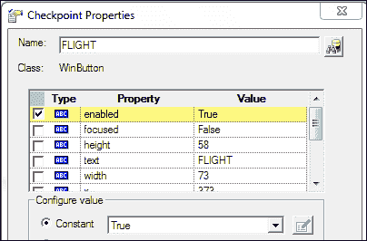
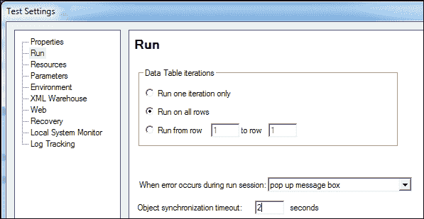
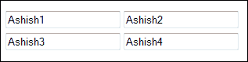
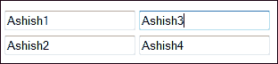
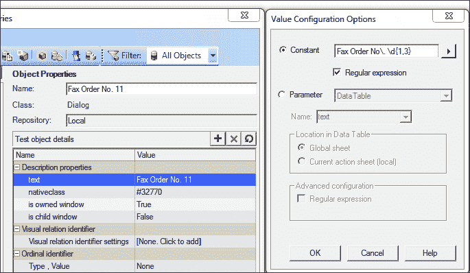
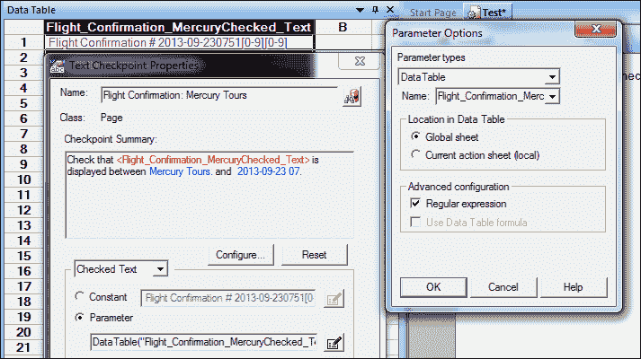

# 第三章。创建框架的基本构建块

在上一章中，我们看到了创建脚本所需的 QTP 特性。为了设计框架及其组件，我们需要设计可重用的代码块，除了 QTP 特性之外。代码块的关键特性如下：

+   **手动检查点**：这是一个可重用的函数，它在运行时检查属性是否如预期匹配

+   **手动同步**：这是一个可重用的函数，它等待直到指定的属性改变

+   **描述性编程**：这为测试脚本提供了对象标识属性以创建对象描述或创建描述本身

+   **正则表达式**：这是一个用于匹配模式的文本字符串，并允许我们定义遵循该模式的对象

+   **使用 Err 对象和 Exit 语句进行错误处理**：也称为异常处理，它指导我们如何从异常事件中退出并优雅地退出这些条件

+   **函数、子程序和过程**：函数和子程序使我们能够使脚本模块化和可重用

# VBScript – 创建代码块的关键特性

VBScript 是一种易于学习且功能强大的脚本语言。它用于开发脚本以执行简单和复杂的基于对象的任务，即使没有之前的编程经验。在**专家**视图中工作，请使用以下一般的 VBScript 语法规则和指南：

+   **大小写敏感度**：VBScript 不会区分大写和小写的单词。默认情况下，它不区分大小写，例如，在常量、变量、对象和方法名称中。以下两个语句是相同的：

    ```js
    Browser("Customer").page("Customer").weblist("date").select "31"
    Browser("Customer").page("Customer").WebList("date").Select "31"
    ```

+   **文本字符串**：我们可以通过在文本字符串前后添加双引号来定义一个字符串。在以下示例中，使用双引号分配了字符串值：

    ```js
    Dim objtype= "WinButton" or objtype= "WinButton"
    ```

    **日期字符串**：我们可以在日期值前后添加井号来定义日期；例如：

    ```js
    today = #7/10/2013#   or  Dim today = #7/10/2013#
    ```

+   **变量**：变量用于存储字符串、整数、日期、数组和对象。我们可以指定变量来引用测试对象或使用或不使用`Dim`存储简单值。如果使用，则必须在脚本中的任何其他语句之前出现`Option Explicit`语句。当声明`Option Explicit`语句时，它强制我们使用`Dim`、`Private`、`Public`或`ReDim`语句显式声明变量；否则，将发生错误。

    要指定一个变量来引用对象，请使用以下语法的`Set`语句：

    ```js
    Set ObjectVar = ObjectHierarchy 
    Set UserEditBox = Browser("email").Page("email").WebEdit("username") 
    UserEditBox.Set "John" 
    ```

    不要使用`Set`语句来指定一个包含简单值（如字符串或数字）的变量。下面的例子展示了如何为简单值定义一个变量：

    ```js
    MyVar = Browser("email").Page("email").WebEdit("username").GetTOProperty("text")  
    ```

    或者也可以定义为：

    ```js
    Dim Myvar = Browser("email").Page("email").WebEdit("username").GetTOProperty("text")  
    ```

+   **注释**：输入`rem`或使用撇号（`'`）来添加注释。

+   **空格**：VBScript 会忽略空格；它们只是增强了代码的清晰度和可读性。

+   **括号**：如果被调用的函数返回值，则在参数周围使用括号。

    以下示例需要将方法参数放在括号内，因为它返回值：

    ```js
    Set WebEditObj = Browser("Mercury").Page("Mercury").WebTable("table").ChildItem (8, 2, "WebEdit", 0) 
    WebEditObj.Set "name" 
    ```

    以下示例需要将方法参数放在括号内，因为使用了**Call**。

    ```js
    Call RunAction("BookFlight", oneIteration) 
    ```

    以下示例需要将方法参数放在括号内，因为它们返回检查点的值：

    ```js
    result = Browser("Customer").Page("Customer").Check (CheckPoint("MyProperty")) 
    ```

    以下示例不需要将`Click`方法参数放在括号内，因为它们不返回任何值：

    ```js
    Browser("Mercury Tours").Page("Method of Payment").WebTable("FirstName").Click 
    ```

## VBScript 过程

在 VBScript 中，有两种类型的子过程：

+   子过程

+   函数过程

### 子过程

子过程以`Sub`语句开始，以`End Sub`语句结束。`Sub`接受参数但不返回值。以下是一个代码片段的示例：

```js
Sub subSUM(a,b)
  print a+b
End Sub
```

### 函数过程

函数过程以`Function`语句开始，以`End Function`语句结束。它可以返回一个值；返回值始终是变体类型。要返回值，将其分配给函数名。以下是一个函数过程的示例：

```js
Function funcSUM(a,b)
FuncSUM = a+b
End Function
```

# 检查点

检查点检查页面、对象或文本字符串的特定值或特征，并使测试对象能够识别 AUT 是否正常工作。检查点将预期值（在录制或创建检查点时捕获）与实际值（在运行时捕获）进行比较。

以下脚本使用 Flight 应用程序创建订单；在选择`FlyFrom insert`检查点后，我们需要验证**FLIGHT**按钮的**enabled**属性是否设置为**True**：



```js
Window("WinFlight").Activate
Window("WinFlight").ActiveX("MaskEdBox").Type "111114"
Window("WinFlight").WinComboBox("FlyFrom:").Select "Frankfurt"
'Insert a checkpoint to verify if button is enabled or not
Window("WinFlight").WinButton("FLIGHT").Check CheckPoint("WINFLIGHT")
'In the preceding checkpoint verify if button is enabled or not
isChkPointPass= Window("WinFlight").WinButton("FLIGHT").Check (CheckPoint("FLIGHT"))
'Note: We have used the bracket around Checkpoint to get the outcome
If isChkPointPass = True Then
  'Continue with order of creation
  Window("WinFlight").WinComboBox("FlyTo:").Select "Paris"
Window("WinFlight").WinButton("FLIGHT").Click
Window("WinFlight").Dialog("FlightsTable").WinButton("WinOK").Click
Window("WinFlight").WinEdit("Name:").Set "ashish"
Window("WinFlight").WinButton("Insert Order").Click
  Else
      'Leave the action if a checkpoint fails
  ExitAction
End If
```

# 输出值

**输出值**是在测试执行期间从 DataTable 检索或保存到变量或参数中的值。当输出值执行时，`Output`方法将对象的属性值放入预先指定的列（在创建测试时定义）中，并通过 DataTable 检索。稍后，此值用于验证预期值和实际值；因此，我们可以使用输出值作为检查点。

以下代码片段使用输出值创建检查点：

```js
Window("WinFlight").Activate
Window("WinFlight").ActiveX("MaskEdBox").Type "111114"
Window("WinFlight").WinComboBox("FlyFrom:").Select "Frankfurt"
'Insert an output value to verify if button is enabled or not
Window("WinFlight").WinButton("FLIGHT"). Output CheckPoint("FLIGHT")
'The first column represents from where value is retrieved and the second column represents sheet Global/local
outval= Datatable("WINFLIGHT_Button",dtGlobalSheet)
'Verify the expected and actual values and report them in test results using reporter.reportevent
If   outval = True Then
  Reporter.ReportEvent micPass,"Verify WinFlight Button", "Match"
  else
  Reporter.ReportEvent micFail,"Verify WinFlight Button", "The property value does not match with the expected value"
ExitAction
End If
```

我们还可以使用`CheckProperty`方法创建一个手动检查点。`CheckProperty`允许我们使用各种选项，并且我们还可以检查不等条件。

如何使用`CheckProperty`检查相等条件：

```js
Window("WinFlight").WinButton("FLIGHT").CheckProperty( "enabled", True, 10000)
```

检查点允许以下选项以确定不同的不等选项：

+   `micGreaterThan`：此选项验证属性的值是否大于预期值。

+   `micLessThan`：此选项验证属性的值是否小于预期值。

+   `micGreaterThanOrEqual`：此选项验证属性的值是否大于或等于预期值。

+   `micLessThanOrEqual`：此选项验证属性的值是否小于或等于预期值。

+   `micNotEqual`：此选项验证属性的值是否不等于预期值。

    以下示例演示了如何使用不等选项：

    ```js
    Window("WinFlight").WinComboBox("FlyTo:").CheckProperty("items count", micGreaterThanOrEqual(10), 10000)
    ```

+   `micRegExpMatch`：`CheckProperty`还允许我们使用正则表达式。`micRegExpMatch`选项验证属性值是否与正则表达式匹配，如下例所示，以及如何使用正则表达式与`CheckProperty`一起使用：

    ```js
    Window("WinFlight").WinEdit("Order No:").CheckProperty ("text",micRegExpMatch("\d{1,3}"),10000) 
    Creating checkpoint using GetROProperty
    ```

    `GetROProperty`从自动化测试对象（AUT）的运行时对象中返回指定标识属性的当前值。我们可以使用`GetROProperty`来创建检查点。使用此检查点，我们将获取运行时属性，并且我们可以将其与预期值进行比较，如下例所示：

    ```js
    Required. A String value. Property to retrieve from the object. Required. A String value. Property to retrieve from the object. 
    'We are retrieving the value of enable property of the FLIGHT Button and comparing it with expected value thus serves as a check to take a further action
    Pvalue =Window("WinFlight").WinButton("FLIGHT").GetRoProperty("enabled")
    If Pvalue = True Then
      'Create the order
      Else
    'Exit the Test 
      ExitTest
    End If
    ```

当我们设计框架及其组件时，我们需要创建手动检查点以实现可重用性；一个良好的做法是将它们创建为可重用函数。

# 同步

QTP 和 AUT 在某个点上连接或握手以匹配它们的速度，以便事件发生并完成一系列动作。

速度不匹配、延迟、等待属性变化、对象变化和事件发生会导致脚本执行速度不匹配，从而导致自动化测试对象（AUT）出现同步问题，例如，脚本必须等待页面加载完成。默认对象同步时间为 20 秒，但我们可以通过导航到**文件** | **测试设置** | **运行** | **对象同步超时**来更改它。

将**对象同步超时**从**20**秒更改为**2**秒，如图所示：



现在我们已经更改了**对象同步超时**值，我们将运行以下脚本：

```js
'Open the Flight Reservation login window and create the script
Dialog("DialogLogin").WinEdit("AgentName").Set "ashish"
Dialog("DialogLogin").WinEdit("AgentPassword").SetSecure "51d84ff2108dc473a416b19e1fed478fab95ca75"
Dialog("DialogLogin").WinButton("WinOK").Click
'The script will fail at this step, the object synchronization is 2 seconds but window takes more time to open; hence script fails
Window("WinFlight").Activate
```

为了实现同步，我们引入了一些等待脚本，它们等待指定的时间。请参考以下代码片段：

```js
Dialog("DialogLogin").Activate
Dialog("DialogLogin").WinEdit("AgentName").Set "ashish"
Dialog("DialogLogin").WinEdit("AgentPassword").SetSecure "51d84ff2108dc473a416b19e1fed478fab95ca75"
Dialog("DialogLogin").WinButton("WinOK").Click
'The script will fail at this step. To avoid this, insert a wait statement
wait 10'Window("WinFlight").Activate
```

`wait`语句告诉 QTP 等待预定义的时间量，例如，10 秒。在这里，以下情况可能发生：

+   自动测试对象（AUT）已准备好执行下一步，但脚本仍在等待指定的时间

+   等待时间已过，但自动化测试对象（AUT）仍然没有准备好执行下一步

在这两种情况下，静态等待都不是一个好的选择。根据某些必须完成的属性或事件等待适当的时间称为动态同步。

## 动态同步

动态同步允许等待对象属性变化或直到超时，如下例所示：

```js
Window("WinFlight").ActiveX("MaskEdBox").Type "111114"
Window("WinFlight").WinComboBox("FlyFrom:").Select "Frankfurt"
Window("WinFlight").WinComboBox("FlyTo:").Select "Los Angeles"
Window("WinFlight").WinButton("FLIGHT").Click
Window("WinFlight").Dialog("FlightsTable").WinButton("WinOK").Click
Window("WinFlight").WinEdit("Name:").Set "ashish"
Window("WinFlight").WinButton("Insert Order").Click
'Window("WinFlight").WinButton("Button").Click
'When QTP tries to execute the following statement, application will not allow to click on the button since it is waiting for progress bar to reach 100% and display the message Insert Done...
'Here script will fail
'We need  to insert the dynamic synchronization point; this waits until the text changes to Insert Done...
'Window("WinFlight").ActiveX("ThreedPanelControl").WaitProperty "text", "Insert Done...", 10000
```

可以使用“插入同步点”或手动通过输入来添加`WaitProperty`方法。

除了使用`WaitProperty`之外，我们还可以使用以下代码创建同步点：

```js
Set Object = Window("WinFlight").ActiveX("ThreedPanelControl")
Set WinsObject = Window("WinFlight")
'It accepts the object with its property and value. You have to wait along with timeout
Function ManualSyncPoint (Object,propertyname, propertyval,timeout )
   Do 
  If Object.GetROProperty(propertyname)  =propertyval then
'if propertyname and propertyval match, come out of the loop and execute next step
      Exit Do
  else
       wait(1)
end if 
   Loop While (i <= timeout)
End Function
'In the preceding method we have used the static wait; we can implement it without using wait statement as well
Example 2:
Function ManualSyncPoint2(Object ,propertyname, propertyval, timeout )
   sttimer = Timer
'Timer allows to get the number of seconds elapsed since midnight (12:00 AM)
   Do 
   If Object.GetROProperty(propertyname)  = propertyval then
Exit Do
  else
      end if 
        endtimer = Timer
    'The difference between the two timer objects provides the number of seconds we need to determine for timeout
   Loop While ( int (endtimer-sttimer) <= -timeout)
 End Function
'Function that allows to wait till object exists
Function WaitTillExists(Object, timeout )
loadtimer = Timer
 Do
      isObjectExists = Object.Exist
  If isObjectExists = true Then
  Exit Do
    else
  End If
    completetimer = Timer
 Loop While(completetimer-loadtimer  <= timeout)
End Function
'Now we will use these functions in our scripts; refer to the following script
Dialog("DialogLogin").Activate
Dialog("DialogLogin").WinEdit("AgentName").Set "ashish"
Dialog("DialogLogin").WinEdit("Password").SetSecure "51d84ff2108dc473a416b19e1fed478fab95ca75"
Dialog("DialogLogin").WinButton("WinOK").Click
' wait
'Go to the test settings and make object synchronization time to 2 sec
WaitTillExists WinsObject, 10
Window("WinFlight").Activate
Window("WinFlight").ActiveX("MaskEdBox").Type "111114"
Window("WinFlight").WinComboBox("FlyFrom:").Select "Frankfurt"
Window("WinFlight").WinComboBox("FlyTo:").Select "Los Angeles"
Window("WinFlight").WinButton("FLIGHT").Click
Window("WinFlight").Dialog("FlightsTable").WinButton("WinOK").Click
Window("WinFlight").WinEdit("Name:").Set "ashish"
Window("WinFlight").WinButton("Insert Order").Click
Window("WinFlight").WinButton("Button").Click
'When QTP tries to execute the following statement, the application will not allow to click on the button since it is waiting for progress bar to reach 100% and display the message Insert Done...
'Here script will fail
'We need to insert the dynamic synchronization point
Window("WinFlight").ActiveX("ThreedPanelControl").WaitProperty "text", "Insert Done...", 5000

'The preceding statement waits till the text property changes to Insert Done... and waits for upto 10 secs
 If ManualSyncPoint1(Object ,"text","Insert Done…",10)  = true then
   'do nothing
  else 
  ExitTest
  end if
Window("WinFlight").WinButton("Button").Click
```

# 描述性编程

QTP 通过存储在 OR 中的对象属性来识别对象。当在测试脚本中创建对象描述时，这种方法被称为描述性编程。在这种脚本创建方法中，对象不会被存储在 OR 中。

描述性编程可以通过两种方式实现：

+   **静态编程**：对象的描述直接提供到脚本中

+   **动态编程**：使用 QTP 的描述对象创建对象的描述

## 静态编程

静态描述性编程的例子如下所示：

```js
'Add object description as property value pair
Dialog("regexpwndclass:=Login").Activate
Dialog("regexpwndclass:=Login").WinEdit("regexpwndclass:=Edit","attached text:=AgentName").Set "ashish"
Dialog("regexpwndclass:=Login").WinEdit("regexpwndclass:=Edit","attached text:=AgentPassword").Set "mercury"
Dialog("regexpwndclass:=Login").WinButton("regexpwndtitle:=OK").Click
'The multiple property and value pair is provided in the object description; property value pair should be comma separated

Method 2: Define Description as constant
Note:
Constant represents the literal value and gives it a name that is not allowed to change at time of script execution. Declare constants for use in place of literal values. For example, Const Env = "QA"
Define Constant
Name of the constant and expression; expression is Literal or another constant, or any combination that includes all arithmetic or logical operators
Constant can be declared as Public or Private. A variable that is declared as a constant is available to all procedures in all scripts. Not allowed in procedures. The Private keyword is used at script level to declare constants available only within the script where the declaration is made. Not allowed in procedures
Const Dailoglogin ="regexpwndtitle:=Login"
Const agent = "attached text:=AgentName"
Const password = "attached text:=Password:"
Const okButton ="text:=OK"

Dialog(Dialoglogin).Activate
Dialog(Dialoglogin).WinEdit(agent).Set "ashish"
Dialog(Dialoglogin).WinButton(okButton).Click

Method 3: Substitution of property values shown as follows

dialogname ="login"
agentname ="AgentName"
passwdname ="Password:"
buttonlabel="OK"

Dialog("regexpwndtitle:="&dialogname).Activate
Dialog("regexpwndtitle:="&dialogname).WinEdit("attached text:="&agentname).Set "ashish"
Dialog("regexpwndtitle:="&dialogname).WinEdit("attached text:="&passwdname).Set "mercury"
Dialog("regexpwndtitle:="&dialogname).WinButton("text:="& buttonlabel).Click
```

## 动态编程

QTP 允许使用`Description`对象及其`Create`方法来创建对象描述，并将其作为参数传递以创建脚本。

以下是一个相同的例子：

```js
Set diaDesc = Description.Create()
diaDesc("micclass").value="Dialog"
diaDesc("regexpwndtitle").Value ="Login"

Set btnDesc=Description.Create()
btnDesc("micclass").value="WinButton"
btnDesc("text").value="OK"

Set txtDesc = Description.Create()
txtDesc("micclass").value="WinEdit"
txtDesc("attached text").Value ="AgentName"

Set pwdDesc = Description.Create()
pwdDesc("micclass").value="WinEdit"
pwdDesc("attached text").Value ="Password:"

'Use these objects into the scripts shown as follows

Dialog(diaDesc).Activate
Dialog(diaDesc).WinEdit(txtDesc).Set "ashish"
Dialog(diaDesc).WinEdit(pwdDesc).Set "mercury"
Dialog(diaDesc).WinButton(btnDesc).Click
```

具有相同识别属性的测试对象被称为**重复对象**。序号标识符允许我们使用`index`和`location`属性来识别重复对象。`index`表示从左到右和从上到下的对象顺序。`location`表示从左上角到底部和从右上角到底部的对象。

```js
'Ordinal Identifier stats with 0
Browser("email").Page("email").WebEdit("name:=FNAME", "index:=0").Set "Ashish1"
Browser("email").Page("email").WebEdit("name:=FNAME", "index:=1").Set "Ashish2"
Browser("email").Page("email").WebEdit("name:=FNAME", "index:=2").Set "Ashish3"
Browser("email").Page("email").WebEdit("name:=FNAME", "index:=3").Set "Ashish4"

```

运行脚本后的结果如下：



```js
Browser("email").Page("email").WebEdit("name:=FNAME", "location:=0").Set "Ashish1"
Browser("email").Page("email").WebEdit("name:=FNAME", "location:=1").Set "Ashish2"
Browser("email").Page("email").WebEdit("name:=FNAME", "location:=2").Set "Ashish3"
Browser("email").Page("email").WebEdit("name:=FNAME", "location:=3").Set "Ashish4"

```

运行脚本后的结果如下



描述性编程使我们能够处理动态对象；这是一个测试对象在运行时才存在的情况，因此我们无法在 OR 中存储动态对象。例如，一个文本框是根据网页中的用户 ID 在运行时生成的，对象的名称遵循约定 edit_xxx，即 edit_123455\。

代码在上一页提供；现在我们将编写代码来设置如下代码片段所示的价值：

```js
Code = getCode() ' getCode is a function that's return the code given in previous page, we can use that code to create the object description for webEdit
Browser("email").Page("email").WebEdit("name:=text_"&Code).Set "jonh"
```

描述性编程的一个用途是它允许我们在运行时找到对象（s）并对其执行以下操作：

```js
Set buttonDesc=Description.Create()
buttonDesc("micclass").value="WinButton"
Set winAll=Window("regexpwndtitle:=Flight Reservation").ChildObjects(buttonDesc)
cnt=winAll.count
MsgBox "Total number of Buttons: "&cnt
For i=0 to cnt-1
  MsgBox winAll(i).getroproperty("text")
   If  winAll(i).Getroproperty("text")="FLIGHT" Then
  winAll(i).Click
    End If
Next
```

# 正则表达式

正则表达式（缩写为 regex 或 regexp）是一系列文本字符，其中一些被认为是具有符号意义的元字符，而另一些则具有其字面意义，它们一起自动识别给定的模式。

当对象本质上是动态的，我们无法在 OR 中存储每个遵循模式的对象时，正则表达式非常有用。在航班预订应用程序中，我们可以通过订单号打开任何现有订单并发送传真。当**传真**窗口打开时，窗口的标题包含订单号；当我们想要以不同的订单号打开传真窗口时，这将会引起问题，因为窗口不再是相同的。在这种情况下，我们可以使用正则表达式。参考以下截图；对象的识别属性是**传真订单号 11**。在这里，我们将**文本**属性转换为正则表达式，以将属性识别为模式而不是固定值。

下面的屏幕截图中的正则表达式匹配一个数字可能从**1**到**3**变化的模式。这意味着它用于验证从 0 到 999 的**传真**窗口标题。



## 描述性编程中的正则表达式

在早期的屏幕截图中，我们看到了一旦我们将**文本**属性更改为正则表达式，QTP 就能够识别从 0 到 999 的顺序号的对象。我们可以在对象描述中使用正则表达式，如下面的代码所示：

```js
Window("WinFlight").Dialog("regexpwndclass:=#32770", "text:=Fax Order No\. \d{1,3}").Activex("progid:=MSMask.MaskEdBox.1").Type "1111111111"
```

## 检查点中的正则表达式

检查点允许我们使用正则表达式进行模式匹配。要在检查点中使用正则表达式，请执行以下操作：

1.  在**文本检查点属性**窗口中点击**参数选项**。

1.  点击。

1.  在**参数选项**中检查**正则表达式**选项。

1.  点击**确定**并将参数更改为正则表达式（在**数据表**中）如图所示。



## CheckProperty 中的正则表达式

`CheckProperty`允许我们使用正则表达式和`micRegExpMatch`比较值，如下面的代码片段所示：

```js
'Verify whether the order number is numeric
Window("WinFlight").WinEdit("Order No:").CheckProperty ("text",micRegExpMatch("\d{1,3}"),10000) 
```

# 错误处理

异常处理是处理中断测试执行正常流程的异常或异常事件的方法。例如，当浮点数除以零（0）时，它将停止执行并显示错误消息，如下面的代码片段所示：

```js
Type in the QTP editor   
Result = 5 / 0
'When test runs the preceding line, it will display Error Division by zero
```

VBScript 中的`Err`对象包含运行时错误的详细信息，即使在运行时出现错误，也能继续执行。

如果脚本中缺少`On Error Resume Next`语句，任何运行时错误都会停止执行并显示错误消息，如下所示：

```js
On Error Resume Next
Result = 5 / 0 
'The above line will not display any error
```

使用`On Error Resume Next`语句允许我们继续处理异常，但有必要使用`Err`对象处理错误，并从错误条件中干净地退出。

`Err`对象的属性如下：

+   `描述`属性

+   `帮助上下文`属性

+   `帮助文件`属性

+   `数字`属性

+   `源`属性

`Err`对象的方法如下：

+   `清除`方法

+   `抛出`方法

```js
On Error Resume Next 'Enables the Err object to deal with error
'Raise an overflow error.
Err.Raise 6   
MsgBox "Error number is" & CStr(Err.Number) & "--" & Cstr(Err.Description))
'Clear the error.
Err.Clear   
```

如果使用了`On Error Resume Next`，请使用`On Error GoTo 0`来禁用错误处理。

以下代码片段展示了如何使用`Err`对象进行错误处理的示例：

```js
On Error Resume Next
Const ForReading = 1
Dim fso, theFile, retstring
   Set fileso = CreateObject("Scripting.FileSystemObject")
   Set theFile = fileso.OpenTextFile("c:\FilenotFound.txt", ForReading)
'Verify if error number of the Err object using its property number
   If Err.number <> 0 then
   'Error send there is no file exists by FilenotFound.txt   
  MsgBox Cstr(Err.number & "--"&  Cstr(Err.Description)
   ExitAction(-1)
else
  'Do While   theFile.AtEndOfStream <> True
Do until   theFile.AtEndOfStream 
      str = theFile.ReadLine()
      MsgBox str
  Loop
   theFile.Close
  end if
```

QTP 中的`Exit`语句非常重要；它们允许我们优雅地退出循环、操作、迭代、组件和测试。

以下显示了不同类型的`Exit`语句：

+   `退出循环`：此语句允许我们从`Do`循环语句中退出。

+   `退出循环`：此语句允许我们从`For`循环中退出。

+   `退出函数`：此语句允许我们从被调用的`函数`过程中退出。

+   `退出属性`：此语句允许我们从`属性`过程中退出。

+   `Exit Sub`: 这条语句允许我们从被调用的 `Sub` 过程中退出。

+   `ExitAction`: 这条语句允许我们从当前动作的迭代中退出。

+   `ExitTest`: 这条语句允许我们退出整个 QTP 或 **质量中心**（**QC**）业务流程测试，无论运行迭代设置如何。

+   `ExitTestIteration`: 这条语句允许我们退出测试迭代或 QC 的业务流程测试，并继续到下一个迭代。如果没有下一个迭代，它将停止执行。

`ExitActionIteration` 的返回值在 **运行结果** 窗口中显示。

+   `ExitComponent`: 这条语句允许我们退出当前组件的运行。

    在 **业务流程测试**（**BPT**）中，每个组件（脚本或业务）与 QTP 测试的单个动作相同。业务流程逐个运行每个组件。QC 将组件加载到 QTP 并开始运行。一旦运行完成，测试中的下一个组件将被加载，所有结果都将汇总成一个单独的测试结果摘要。

+   `ExitComponentIteration`: 这条语句允许我们退出当前组件迭代。

以下示例演示了当检查点失败时使用 `Exit` 语句的情况：

```js
res = Browser("Mercury").Page("Mercury").WebEdit("userName").Check ( CheckPoint("Name") ) 
If res = False Then 
'ExitActionIteration /ExitAction / /ExitTestIteration /ExitTest /ExitComponentIteration /ExitComponent
'We can use any one of them to gracefully exit based on how test is executing.
End If 
```

# 恢复场景 - 概述

在执行过程中，任何意外事件或错误条件导致自动测试工具（AUT）崩溃，都需要进行恢复。为了处理这些情况，QTP 允许我们定义恢复场景，并将它们与测试关联起来。当触发事件发生时，恢复场景会激活特定的恢复操作。

恢复场景管理器允许我们定义恢复场景，包括意外事件和运行会话期间要恢复的操作。例如，出现意外的弹出消息，通过在弹出窗口中点击 **确定** 按钮来恢复恢复场景。

恢复场景具有以下元素：

+   **触发事件**：任何突然干扰测试运行正常流程的事件，例如，测试执行期间弹出对话框。

+   **恢复操作**：恢复选项允许 QTP 在触发事件阻碍测试执行后继续运行测试或其组件。例如，关闭弹出窗口或调用重启窗口。

+   **恢复后**-**选项**：在执行恢复操作之后，QTP 提供了一些选项，例如调用自定义函数、执行相同的步骤或执行测试或组件中的下一个步骤。

在创建恢复场景后，我们可以将它们与选定的组件/测试关联起来。因此，如果在运行会话中发生触发事件，QTP 将执行适当的场景。

# 摘要

在本章中，我们探讨了各种概念和代码块。关键是要理解，除了 QTP 功能之外，我们还需要其他支持整个框架设计和架构的组件。创建代码块的一个关键方面是提高其可重用性，并对框架设计的每个功能产生影响。下一章将讨论设计和实现测试自动化框架。
