# 第四章：理解和创建框架

本章提供了创建测试自动化框架的详细方法和指导。

在 QTP 中创建框架需要了解以下内容：

+   VBScript 基础知识、控制结构、循环和内置函数

+   设计各种框架的基本概念和方法

+   帮助创建框架实用工具的编程结构

# 使用 VBScript 进行编程

熟悉 Visual Basic 脚本对于创建框架至关重要。了解 VBScript 中的简单语句、控制结构、循环和内置函数，使我们能够增强测试脚本并使其更健壮；它还允许我们与外部资源交互。本节描述了在设计框架过程中有用的 VBScript 功能。

## 使用 VBScript

QTP 使用 VBScript 作为脚本语言。VBScript 允许脚本处理不属于 QTP 本身的资源，例如文件系统和外部的数据源（Excel、数据库等）。VBScript 允许我们定义函数过程；它提供许多内置函数，有助于创建可重用函数。VBScript 支持正则表达式，有助于验证和验证。由于它是一种轻量级语言，框架设计者从中受益。

## VBScript 数据类型

变体是 VBScript 中唯一的数据类型。根据其声明和使用方式，变体可以包含不同类型的信息。它可以包含数字、常量、日期、字符串和布尔值。

以下是一个变体的子类型列表：

| 子类型 | 描述 | 范围 |
| --- | --- | --- |
| `Empty` | 变体未初始化 | 对于数值变量为 0 或对于字符串变量为零长度 |
| `Null` | 变体最初不包含有效数据 | 不包含数据 |
| `Boolean` |  | 真 或 假 |
| `Byte` | 小整数 | 0-255 |
| `Integer` | 整数 | 从 -32,768 到 32,767 |
| `Currency` | 货币 | 从 -922,337,203,685,477.5808 到 922,337,203,685,477.5807 |
| `Long` | 长整数 | 从 -2,147,483,648 到 2,147,483,647 |
| `Single` | 单精度浮点数 | 对于负值，从 -3.402823E38 到 -1.401298E-45，对于正值，从 1.401298E-45 到 3.402823E38 |
| `Double` | 双精度浮点数 | 对于负值，从 1.79769313486232E308 到 4.94065645841247E-324，对于正值，从 4.94065645841247E-324 到 1.79769313486232E308 |
| `Date (Time)` | 表示日期的数字 | 从 100 年 1 月 1 日到 9999 年 12 月 31 日 |
| `String` | 表示字符 | 包含可变长度的字符串，长度约为 20 亿 |
| `Object` | 包含一个对象 |  |
| `Error` | 包含一个错误对象 |  |

## VBScript 中的运算符

运算符在创建表达式时很有用；这些表达式通过算术、比较和逻辑运算符创建。在 VBScript 中，我们可以将运算符分为四大类：

+   数学

+   比较

+   连接

+   逻辑

| 数学 | 符号 | 比较 | 符号 | 逻辑 | 符号 |
| --- | --- | --- | --- | --- | --- |
| 指数 | `^` | 等于 | `=` | 逻辑否定 | `Not` |
| 尿素否定 | `-` | 不等式 | `<>` | 逻辑合取 | `And` |
| 乘法 | `*` | 小于 | `<` | 逻辑析取 | `OR` |
| 除法 | `/` | 大于 | `>` | 逻辑排除 | `XOR` |
| 整数除法 | `\` | 小于等于 | `<=` | 逻辑等价 | `EQV` |
| 模数 | `MOD` | 大于等于 | `>=` | 逻辑蕴涵 | `IMP` |
| 加法 | `+` | 对象等价** | `Is` |   |   |
| 减法 | `-` |   |   |   |   |
| 连接 | `&` |   |   |   |   |

### 注意

整数除法将两个数字相除并返回一个整数结果，例如，5/2 的结果将是 2 而不是 2.5。

模数或余数运算符将操作数 1 除以操作数 2（将浮点数四舍五入为整数）并返回余数，例如，5 MOD 2 的结果将是 1。

对象等价比较两个对象引用变量。如果 object1 和 object2 都引用了同一个对象，则结果为`True`；如果它们不引用同一个对象，则结果为`False`。

### 添加表达式的示例

表达式是由显式值、常量、变量、运算符和函数组成的组合，这些值根据特定编程/脚本语言的特定优先级和关联规则进行解释。

## 控制结构和循环

控制结构根据表达式的值有条件地执行一组语句。有四种控制执行流程的结构，如下表所示：

| If (condition)statement1End If | If condition Then statements [Else else statements]End If | If condition Then[statements][ElseIf condition Then[elseif statements]][Else[else statements]]End If | Select Case expression[Case expression list[statements]][Case Else[else statements]]End Select |
| --- | --- | --- | --- |

以下给出了`If`和`else`控制语句的示例：

```js
If True Then
Reporter.ReportEvent micPass,"Name of the step", "Details..."
Else
Reporter.ReportEvent micFail, "Name of the step", "Details..."
End If
If elseif … and end if
color ="b"

If color ="r" Then
    msgbox "red"
  elseif  color ="g" then
  msgbox "green"
  elseif color="b" then
  msgbox "blue"
  else
  msgbox "invalid color..."
End If
```

以下是一个`Select`案例的示例：

```js
Dim Color, bgcolor
   Select Case Color
      Case "red"     bgColor = "red"
      Case "green"   bgColor = "green"
      Case "blue"    bgColor = "blue"
      Case Else      MsgBox "pick another color"
   End select
   Msgbox "You have Selected the "& bgcolor
```

当给定条件为`True`时，运行前面的代码行将执行一系列语句。

## 使用循环

循环执行一次指定的语句序列，但可能连续多次执行。VBScript 允许以下表格所示的四种循环结构：

| While … Wend | Do…Loop | For…Next | For each…Next |
| --- | --- | --- | --- |
| `While condition[statements]Wend` | `Do [{While | Until} condition][statements][Exit Do][statements]LoopDo[statements][Exit Do][statements]Loop [{While | Until} condition]` | `For counter = start To end [Step step][statements][Exit For][statements]Next` | `For each element in collection[statements][Exit For][statements]Next [element]` |

以下为`While … Wend`使用示例：

```js
'Print 10 random numbers
counter = 0 'Initialize the counter
While counter < 10
  print Cint( rnd() * 100 )
  counter = counter + 1 'Increment the counter
Wend
```

`While…Wend`循环的一个缺点是没有`exit`语句来终止循环，但其他循环结构允许我们从循环中退出。

### `Do Loop`

`Do...Loop`在不确定的次数上运行语句。语句要么在条件为真时重复，要么直到它变为真。

以下为`Do Loops`使用示例：

```js
'Execute the loop until the response until CANCEL button is clicked
Usages 1
Do Until DefResp = vbNo
   MyNum = Int (6 * Rnd + 1)  
 'Generate a random number between 1 and 6.
   DefResp = MsgBox (MyNum & "Do you want another number?", vbYesNo)
'The msgbox displays generated random number and OK and Cancel button
Loop
Usages 2
Do while not DefResp = vbNo
   MyNum = Int (6 * Rnd + 1)  
   DefResp = MsgBox (MyNum & "Do you want another number?", vbYesNo)
Loop
Usages 3
Do 
   MyNum = Int (6 * Rnd + 1)  
   DefResp = MsgBox (MyNum & "Do you want another number?", vbYesNo)
Loop until DefResp = vbNo
```

`Do Loop`有两种变体；我们可以使用`Do`或`Loop`与`while`或`until`条件一起使用。当我们使用`Do`与`while`或`until`条件时，执行首先验证条件，然后进入循环；参见图例 1。在后一种情况，即图例 3 中，第一个循环执行一次，然后检查条件。

`For Next`循环在预定义的次数上迭代执行语句。参见图例。

`ToProperties`方法返回测试对象属性集合。

```js
set Pcoll = 
Dialog("DialogLogin").WinEdit("EditAgentName:").GetTOProperties()

For i = 0 to coll.count() – 1  
'Count method return the numbers of properties
  -print "Item is  " & Pcoll.item(i)
Next
```

上述代码集的结果如下：

```js
Item is Edit
Item is Agent Name:
Refer the above results and compare the properties of the object  are same in the following image.
```

参考以下屏幕截图：


`For each … Next`循环对数组或集合中的每个元素迭代执行语句。

`Dim dicObj`创建了一个字典变量，如下所示：

```js
Set city = CreateObject("Scripting.Dictionary") 'Creates Dictionary Object
'Dictionary stores data key, item (key – value) pairs.
'Add keys and items.
dicObj.Add "a", "Atlanta"
dicObj.Add "b", "Paris"
dicObj.Add "c", "New Delhi"
'Keys is a method that returns an array or collection containing all existing keys in a Dictionary object.
For each keyitem in d.Keys
   print keyitem
Next
```

# 介绍框架

框架被定义为对相互关联组件的广泛概述、指南或框架，支持特定目标的一种特定方法，并作为可以按需通过添加或删除组件来增强的指南。框架是一个支持或为创建或扩展测试脚本提供指南的工作或概念模型，以实现测试自动化，确保维护成本低且易于扩展。

测试自动化框架是一个分层结构，提供了相互关联和交互的机制以实现共同目标。框架还包括实际程序和接口，或提供用于使用框架的实用工具。框架简化了修改、添加和删除脚本和函数的标准方式。它是一个提供可扩展性和可靠性的综合结构，且无需过多努力。

通过选择适合测试自动化的正确框架，可以实现自动化目标。测试自动化的成本包括开发和维护工作。选择合适的框架和技术有助于保持低成本和高影响解决方案。

## 自动化框架和框架类型

通常，使用各种结构和技术来设计框架。广泛基于这些技术和结构，我们可以将框架分类如下：

+   **线性**：在这个框架中，脚本以线性方式创建，通常通过录制和回放生成，可能没有或只有轻微的修改。

+   **数据驱动**：参数化测试并从持久数据源获取数据。数据源可以是测试的内部或外部。

+   **模块化**：模块化框架旨在在测试和脚本级别实现模块化。模块化框架可以是以下组合之一：

    +   测试脚本模块化框架

    +   测试库模块化框架

+   **关键字驱动**：关键字驱动框架旨在通过将测试用例与其执行分离来降低维护成本。

+   **混合**：在这个框架中，使用两种或更多之前模式。

## 录制和回放

录制是捕获对象及其属性的过程，创建测试对象，并将它们以层次结构存储在对象资源管理器中。为测试对象分配一个逻辑名称，并通过捕获在 GUI 上执行的操作来创建脚本。

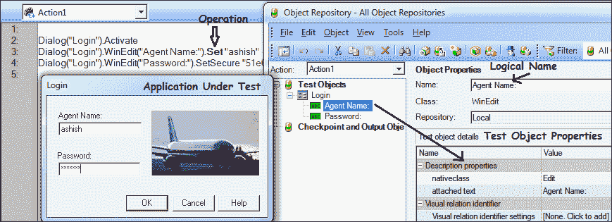

前面的截图显示了自动测试对象（AUT）、记录的脚本和对象资源管理器（OR）。自动测试对象包含测试对象。对象资源管理器以层次结构存储测试对象及其标识属性：

记录的脚本带我们通过以下三个测试步骤：

1.  点击**登录**对话框。

1.  在代理名称文本框中输入`ashish`。

1.  输入密码。

一个测试步骤包含具有层次结构、操作和数据值（如适用）的测试对象。在记录自动测试对象上的用户操作时，对象资源管理器的创建和脚本的生成几乎同时发生。这种方法也称为**QTP 线性框架**方法。在线性框架方法中，脚本以逐步方式记录，不关注可重用性。考虑一个例子，你有一个测试用例用于登录应用程序，搜索一些数据然后登出。在线性框架中，代码看起来像以下示例：

创建 QTP 线性框架的步骤：

1.  输入用户名。

1.  输入密码。

1.  点击**确定**按钮。

1.  输入**航班**日期。

1.  选择**飞出**（源）。

1.  选择**飞往**（目的地）。

1.  点击**航班**按钮。

1.  点击**确定**按钮。

1.  输入名称。

1.  点击**插入订单**按钮。

1.  关闭**航班预订**窗口。

```js
'Login 
Dialog("DialogLogin").Activate
Dialog("DialogLogin").WinEdit("EditAgentName:").Set "ashish"    'Enter the agent name
Dialog("DialogLogin").WinEdit("EditPassword:").SetSecure "51e6911da82a99155f73b209eaeac51a66ef0883" ' Enter password
'Create Order
Window("WinFlight").Activate
Window("WinFlight").ActiveX("MaskEdBox").Type "111114"             'Enter Flight Date 
Window("WinFlight").WinComboBox("FlyFrom").Select "London"  ' Select Source 
Window("WinFlight").WinComboBox("Fly To:").Select "Frankfurt"     'Select destination
Window("WinFlight").WinButton("btnFLIGHT").Click                                        'Click on flight button
Window("WinFlight").Dialog("FlightTable").WinButton("btnOK").Click 'Click on the OK button
Window("WinFlight").WinEdit("EditName:").Set "Mr. James Anderson" 'Enter the passenger name
Window("WinFlight").WinButton("btnInsertOrder").Click'Click on the Insert Order button
Window("WinFlight").Activate
Window("WinFlight").Close'Click on the close button
```

如果自动测试对象（AUT）较小，这是创建脚本和使用它们的简单方法，但如果期望 AUT 频繁更改，则不要期望。

## 线性框架的优缺点

线性框架的优点如下所述：

+   不需要编程或设计的专业知识或经验。创建脚本需要基本了解 QTP。

+   自动在对象库中创建和存储测试对象。

+   这是创建测试自动化脚本最快的方式。

+   这是 simplest 框架，并且易于理解。

+   帮助学习对象并手动创建脚本。

+   可以轻松添加检查点。

线性框架的缺点如下所述：

+   由于脚本以线性方式创建且没有函数，因此不允许重用。

+   数据与脚本绑定；因此，测试是非迭代的，这种方法对于执行多组数据的测试效率低下。每次运行都需要手动更改数据或创建多个脚本副本；不幸的是，这两种技术都效率低下。

+   维护成本非常高，且繁琐，容易出错，因为它需要在所有受影响区域进行更改。

+   需要我们自己添加注释。

# 数据驱动框架简介

数据驱动框架是一组运行相关多个数据集的测试脚本。此框架为不同数据集提供可重用脚本，并提高测试覆盖率。输入和结果（测试标准）数据值可以存储在一个或多个中央数据源或数据库中；实际格式和组织可以是实现特定的。

要了解数据驱动框架的实现，我们应该了解三个术语：

+   **变量**

+   **参数**

+   **迭代**

变量是一个存储位置，与一个标识符相关联，包含一些已知或未知数量或信息，即值。

参数是一个变量，它作为输入提供给脚本。在 QTP 中，可以通过 `datatable` 对象实现参数化。`datatable` 对象表示 QuickTest 设计时数据表及其关联的表和参数。`datatable` 对象具有各种方法和属性，用于从运行时数据表对象访问数据。

迭代是一个过程，其中参数化脚本从数据源执行预定义次数的测试。

创建数据驱动框架有四个主要步骤：

1.  创建一个脚本。

1.  定义包含数据的参数。

1.  添加代码从数据源获取数据并分配值。

1.  修改设置或添加代码以执行所有行或行子集的测试。

在 QTP 中访问数据有两种主要方式：

+   使用 `datatable` 对象

+   使用外部数据源

使用 `datatable` 对象创建数据驱动脚本：

1.  通过录制或手动创建脚本。

1.  如以下截图所示，在外部 Excel 表格中定义参数。确保第一行包含参数名称。在后续行中输入数据，如以下截图所示：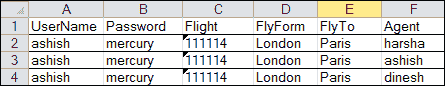

要从外部 Excel 表格中获取数据，请使用 `datatable` 的 `import` 方法：

1.  使用 `datatable` 对象定义参数

1.  要添加数据，通过双击列名来重命名列名。重命名列并按以下截图所示将数据添加到后续行中：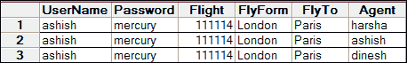

1.  使用数据驱动工具或 `datatable` 对象参数化。将测试数据添加到 `datatable`，将列名添加到标题中，然后双击**添加**或更改数据表中的列名为参数。

1.  使测试脚本迭代。

有两种方法可以使脚本迭代。首先，在**测试设置**下选择**仅运行一次迭代**、**运行所有行**，然后选择**从行** `n` **到行** `m` 运行：

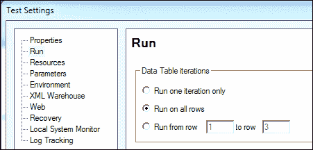

其次，你也可以通过编程创建运行测试脚本的脚本：

```js
'Set the current row to retrieve the value from datatable
datatable.SetCurrentRow startnum
For i =startnum to endnum 'run the script from row (n) to row (m)
.
.
.
'Move to next row of datatable
datatable.SetNextRow
Next
```

### 注意

要运行一次迭代，`startnum` 和 `endnum` 应为 1，`startnum=endnum=1`

要运行所有行的测试，`startnum = 1` 和 `endnum = datatable.GetRowCount`。

让我们将所有概念结合起来，对测试进行参数化。在 `datatable` 中创建测试数据。`datatable` 有两个参数：参数名和表类型。`datatable` 有两种类型的表：本地表（与操作相关）和全局表。要从全局表中访问数据，请使用 `dtGlobalSheet`，要从本地表中访问数据，请使用 `dtLocalSheet`。请参考以下示例：

```js
Systemutil.Run PathToFlightApp
Dialog("DialogLogin").Activate
Dialog("DialogLogin").WinEdit("EditAgentName:").Set DataTable("Agent",dtGlobalSheet)
Dialog("DialogLogin").WinEdit("EditPassword:").SetSecure DataTable("Password",dtGlobalSheet)
Dialog("DialogLogin").WinButton("btnOK").Click
Window("WinFlight").ActiveX("MaskEdBox").Type DataTable("FlightDate",dtGlobalSheet)
Window("WinFlight").WinComboBox("FlyFrom").Select DataTable("FlyFrom",dtGlobalSheet)
Window("WinFlight").WinComboBox("Fly To:").Select DataTable("Flyto",dtGlobalSheet)
Window("WinFlight").WinButton("btnFLIGHT").Click
Window("WinFlight").Dialog("FlightTable").WinButton("btnOK").Click
Window("WinFlight").WinEdit("EditName:").Set DataTable("Name", dtGlobalSheet)
Window("WinFlight").WinButton("btnInsertOrder").Click
Window("WinFlight").WinButton("btnButton").Click
Window("WinFlight").Close
```

以下代码展示了如何使用 `datatable` 导入和迭代测试：

```js
datatable.Import "c:\FlightData.xls"
' Import the excel to the datatable.
rc = datatable.GetRowCount
'get the row count
For i = 1 to rc
systemutil.Run PathToFlightApp
Dialog("DialogLogin").Activate
Dialog("DialogLogin").WinEdit("EditAgentName:").Set datatable.Value("Agent")
'Value is DataTable default property. Retrieves or sets the value of the cell in the specified parameter and the current row of the run-time Data Table.
'To find the value use DataTable.Value(ParameterID [, SheetID]) .SheetID Optional. Identifies the sheet to be returned. The SheetID can be the sheet name, index or dtLocalSheet, or dtGlobalSheet.
Dialog("DialogLogin").WinEdit("EditPassword:").SetSecure datatable.Value("Password")
Dialog("DialogLogin").WinButton("btnOK").Click
Window("WinFlight").ActiveX("MaskEdBox").Type datatable.Value("FlightDate")
Window("WinFlight").WinComboBox("FlyFrom").Select datatable.Value("FlyFrom")
Window("WinFlight").WinComboBox("Fly To:").Select datatable.Value("Flyto")
Window("WinFlight").WinButton("btnFLIGHT").Click
Window("WinFlight").Dialog("FlightTable").WinButton("btnOK").Click
Window("WinFlight").WinEdit("EditName:").Set datatable.Value("Name")
Window("WinFlight").WinButton("btnInsertOrder").Click
Window("WinFlight").WinButton("btnButton").Click
Window("WinFlight").Close
datatable.SetNextRow
Next
```

使用 Excel 应用程序和 VBScript：

```js
Set excelfile = createobject("excel.application") 

'Create the excel first before executing script. 
'Ensure that excel file is in Closed state.

excelfile.Workbooks.Open "D:\parameter.xls"
set sheet = excelfile.ActiveWorkbook.Worksheets("Sheet1")
 'Get the max row occupied in the excel file 
Row = sheet.UsedRange.Rows.Count 

'Read the data from the excel file
For i= 2 to Row

Username=sheet.cells(i,1).value
Password=sheet.cells(i,2).value
wait 1
 Next

'Close the Workbook
excelfile.ActiveWorkbook.Close

'Close Excel
excelfile.Application.Quit

'Release the objects
Set sheet =nothing
Set excelfile = nothing
```

## 文件系统对象模型

VBScript 允许你使用 `FileSystemObject` (FSO) 对象模型处理驱动器、文件夹和文件，以下章节将解释如何使用 `FileSystemObject` 来操作文件。

文件操作有两种方式：

+   创建和附加文件、从文件中删除数据以及从文件中读取

+   复制、移动和删除文件

以下是从文本文件中读取和写入数据的步骤：

1.  创建一个文本文件。

1.  向其中写入数据。

1.  关闭它。

1.  再次打开文本文件。

1.  读取文件。

1.  关闭它。

以下是一个读取和写入文本文件的示例：

```js
Dim filefso, file1, readfile, s
   Const ForReading = 1
'create the object of a File system Object
   Set filefso = CreateObject("Scripting.FileSystemObject")
   Set file1 = filefso.CreateTextFile("c:\logfile.txt", True)
   'Write a line.
      fi1e1.WriteLine "Testing FSO"
   file1.WriteBlankLines(2)
   file1.Close
   'Read contents of the text file.
   'Reading file 
   Set readfile = filefso.OpenTextFile("c:\logfile.txt", ForReading)
   's = readfile.ReadLine
 'iterate the file until end of the file
Do While readfile.AtEndOfStream <> True
      retstring = readfile.ReadLine
   Loop
      ts.Close
```

下面给出了使用文本文件进行数据驱动测试的示例：

```js
Dim fso, f1, textfile, s
   Const ForReading = 1

Set textfile = fso.OpenTextFile("c:\logfile.txt", ForReading)
   's = textfile.ReadLine
 'iterate the file until end of the file
Do While textfile.AtEndOfStream <> True
      retstring = textfile.ReadLine
Dialog("DialogLogin").Activate
Dialog("DialogLogin").WinEdit("EditAgentName:").Set datatable.Value("Agent")
'Value is DataTable default property. Retrieves or sets the value of the cell in the specified parameter and the current row of the run-time Data Table.
'To find the value use DataTable.Value(ParameterID [, SheetID]) .SheetID Optional. Identifies the sheet to be returned. The SheetID can be the sheet name, index or dtLocalSheet, or dtGlobalSheet.
Dialog("DialogLogin").WinEdit("EditPassword:").SetSecure datatable.Value("Password")
Dialog("DialogLogin").WinButton("btnOK").Click
Window("WinFlight").ActiveX("MaskEdBox").Type datatable.Value("FlightDate")
Window("WinFlight").WinComboBox("FlyFrom").Select datatable.Value("FlyFrom")
Window("WinFlight").WinComboBox("FlyTo:").Select datatable.Value("Flyto")
Window("WinFlight").WinButton("btnFLIGHT").Click
Window("WinFlight").Dialog("FlightTable").WinButton("btnOK").Click
Window("WinFlight").WinEdit("EditName:").Set datatable.Value("Name")
Window("WinFlight").WinButton("btnInsertOrder").Click
Window("WinFlight").WinButton("btnButton").Click
Window("WinFlight").Close

   Loop
      textfile.Close
```

列出用于在测试文件上执行读写操作的方法如下：

| `Write` | 将数据写入打开的文本文件 |
| --- | --- |
| `WriteLine` | 将数据写入打开的文本文件，并添加一个换行符 |
| `WriteBlankLines` | 向打开的文本文件写入空白行 |
| `Read` | 从文本文件中读取指定为参数的字符 |
| `ReadLine` | 读取整行，不包括换行符 |
| `ReadAll` | 从文本文件中读取整个数据 |

以下示例演示了文件操作：

```js
Dim filefso, txtfile1, txtfile2, txtfifle3
   Set filefso = CreateObject("Scripting.FileSystemObject")
   Set txtfile1 = filefso.CreateTextFile("d:\tmp\testfile.txt", True)
   'Write a line.
   txtfile1.Write ("Writing a text")
   'Close the file to writing.
   txtfile1.Close
   'Moving the file to d:\tmp 
   'Get a handle of the file in root of d:\.
   Set txtfile2 = filefso.GetFile("d:\tmp\testfile.txt")
   'Moving the file to tmp directory.
   txtfile2.Move ("d:\tmp\testfile.txt")

   'Copying the file to temp.
   txtfile2.Copy ("d:\temp\testfile.txt")

   Set txtfifle2 = filefso.GetFile("d:\tmp\testfile.txt")
   Set txtfifle3 = filefso.GetFile("d:\temp\testfile.txt")
   'Deleting the files
   txtfifle2.Delete
   txtfifle3.Delete
```

以下是一个使用 ADODB 从数据库获取数据的示例：

```js
Set Conn = CreateObject("ADODB.Connection") 

'Set the Connection String.
Conn.ConnectionString = 
"DSN=QT_Flight32;DBQ=C:\Program Files\Mercury Interactive\QuickTest Professional\samples\flight\app\flight32.mdb;Driver=C:\WINDOWS\system32\odbcjt32.dll;DriverId=281;FIL=MS Access;MaxBufferSize=2048;PageTimeout=5;"
'ADODB.Connection
'RecordSet
Conn.Open("DSN=QT_Flight32") 
Set rcRecordSet= Conn.Execute("SELECT order_number from Orders order by order_number desc")
rcRecordSet.MoveFirst
var_order_num = rcRecordSet.fields("Order_Number")
rcRecordSet.close

Conn.close
set rcRecordSet = nothing
set Conn = nothing
```

# 模块化框架简介

模块化允许分解组件和/或功能，并将它们重新组合。这种方法是一种设计技术，强调将自动化的功能单元（AUT）的功能分离成独立的、相互连接的模块，使得每个模块只包含执行所需功能一个方面的所有必要元素。

要实现模块化，需要在两个不同的层面上进行模块化；一个层面是测试层面，另一个层面是脚本层面。为了创建一个模块化框架，我们需要根据其目标将测试层分解成可管理的部分。例如，常见的测试库与功能库是分开的。在测试层面，我们将关键库和资源分解成结构，以使用适当的设计实现自动化目标。

模块化框架有四个不同的部分：

+   脚本层面模块化

+   测试层面模块化

+   资源结构

+   框架设计

让我们以 Flight 应用程序为例；整个功能可以划分为如以下图所示的小独立函数。这需要实现如以下图所示的脚本层面模块化：

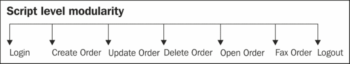

### 小贴士

我们可以省略一些作为自动化一部分的最少使用且不贡献于投资回报率的函数，例如图形、编辑和在 Flight 应用程序中的帮助。

除了将整个功能分解成小而独立的函数外，我们还需要确保其他组件也应该被分解。分解后，整个测试组件看起来如下图所示：

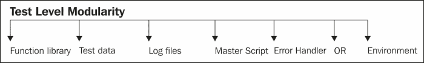

前面的列表包含了最常用的组件，但框架的实现可能需要根据自动化目标和要求拥有更多或更少的组件。以下是对这些组件的描述：

+   **功能库**：这是一个执行特定任务的脚本集合。通常是一个任务，允许在 AUT 的语句集上执行。

+   **测试数据**：这些数据存储在`datatable`中，或者外部数据源为测试提供输入。

+   **日志文件**：它们捕获用于查看测试脚本结果的日志消息。

+   **主脚本**：这些驱动测试流程，并允许与其他组件协调，以确保测试成功运行。

+   **错误处理器**：这些允许在发生错误时优雅地退出测试，并揭示有关错误的信息。

+   **OR**：这是包含测试对象的测试的一部分；通常 OR 是一个共享 OR。

+   **环境**：这是一个组件，用于提供测试级别的环境变量或值，允许配置需要在各种环境中运行的测试。

## 结构

在测试分解后，资源需要以结构化的方式进行排列，这意味着有一个集中存储这些资源的仓库。管理测试需要文件夹结构或测试管理工具（例如，质量中心）来存储测试资源。我们需要确保测试组件符合指南和结构。结构允许组织资源以实现可移植性和一致性。框架的文件夹结构如下所示。结构可能因项目而异，但实现一致性很重要。

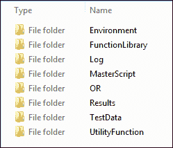

### 优点

结构有以下优点：

+   **促进专业化**：结构化设计组件以执行特定任务，并提供从复杂性中抽象出来的功能。

+   **资源控制**：资源结构简化了对资源的控制，因为它们位于集中位置，并受访问、创建和更新资源的策略管理。

+   **更易沟通**：资源结构以受控方式明确说明团队成员之间信息流的流程。修改是在集中位置进行的，并由所有其他团队成员使用。

+   **更好的性能**：每个组件都专门用于执行其任务，并且经过彻底测试以提高性能和可靠性。

    ### 提示

    总是使用相对路径；不要在脚本中硬编码资源位置。

## 设计

设计是框架最重要的方面。框架的设计由其关键自动化目标驱动。以下是一个全面但不完整的列表，如果需要，可以添加更多目标：

+   **可维护性**：它允许分解资源和脚本；这使得维护和调试更容易，并且可以更快、更可靠地解决问题。

+   **可读性**：这是一个设计良好且功能较小的函数，它提高了脚本的可读性，并使其更容易理解，同时也增强了它。

    ### 提示

    注释和脚本/函数头对于提高可读性和理解性非常重要。

+   **可扩展性**：当创建小型函数并结构化资源时，扩展现有功能变得容易。这使我们能够轻松添加和增强功能、调试和测试。

+   **可重用性**：允许函数重用的功能使框架更加健壮和可靠。

    ### 提示

    在我们开始设计框架之前，我们应该考虑可以在测试脚本中跨脚本使用的功能，以增加可重用性。彻底测试这些常用功能，并确保它们具有必要的错误处理能力。

+   **简洁的脚本**：确保脚本简短，一次执行单一任务；这些脚本应该是适当库或模块的一部分。确保脚本紧密耦合且松散耦合。

### 高内聚和耦合

耦合指的是代码中可以重用且可以与代码分离但直接是其一部分的部分。而内聚性是衡量一个类/代码中所有职责、数据和方法的相互关联程度。

尤其是我想通过框架的设计和架构实现以下三个具体目标的最小化：

+   将必须一起改变的代码部分尽可能放在一起。

+   允许代码中不相关的事物独立改变（也称为正交性）。

    正交性是一个允许将小组件组合以获得有效结果的概念。这简化了读写程序。更正交的设计允许更少的异常、对称和一致性。

+   最小化代码中的重复。

实现模块之间松耦合背后的目标是：

+   使代码更容易阅读

+   通过隐藏复杂性使我们的代码更容易被其他开发者消费

+   将潜在的变化隔离到代码的小区域

+   在完全新的环境中重用代码

### 减少耦合，增加内聚

我们通常认为高内聚性对于设计框架库如关键设计考虑因素是好事，但为什么？

看看以下代码。我们需要一个连接字符串来连接到数据库，连接字符串和数据库操作代码是紧密耦合的。好吧，这里的问题是什么？现在如果我们想更改 DSN，我们需要为每个 DSN 更改代码：

```js
Set Conn = CreateObject("ADODB.Connection") 
Conn.Open("DSN=QT_Flight32") 
Set rcRecordSet= Conn.Execute("SELECT order_number from Orders order by order_number desc")
rcRecordSet.MoveFirst
var_order_num = rcRecordSet.fields("Order_Number")
rcRecordSet.close

Conn.close
set rcRecordSet = nothing
set Conn = nothing
```

让我们重写这段代码，使其耦合度更低，内聚性更高。我已经将代码分为两部分。第一部分是一个返回 DSN 的函数，第二部分使用该 DSN 并操作数据库。现在如果用户想访问另一个数据库，DSN 将不同，用户只需更改参数。之前的代码是耦合的，而下面的代码是内聚的：

```js
Function getDSN(database)
If database = "access"
 DSN ="DSN=QT_Flight32"
ELSEIF
…
End Function

Set Conn = CreateObject("ADODB.Connection") 
Conn.Open(getDSN("access") )
Set rcRecordSet= Conn.Execute("SELECT order_number from Orders order by order_number desc")
rcRecordSet.MoveFirst
var_order_num = rcRecordSet.fields("Order_Number")
rcRecordSet.close
Conn.close
set rcRecordSet = nothing
set Conn = nothing
```

在 QTP 的上下文中，还有一个设计考虑因素，那就是我们是否应该使用操作或函数。

从我的个人经验来看，我们应该使用函数。操作具有许多优点，并且在实现任何框架时都应优先考虑。函数允许我们实现目标而不需要功能分解。为了创建框架，需要通用的库；例如，需要 Logger、错误处理程序和配置实用程序来实现以下目标：

通过使用操作或函数将整个流程划分为小块，可以增强其可用性。

设计模块化框架的关键步骤如下：

+   分析应用程序

+   创建设计

+   创建自动化测试库

+   创建测试级别的组件

+   创建脚本级别的函数

+   集成

+   测试它

### 分析应用程序

分析应用程序将自动化目标定义为预期应用程序定义的函数和操作。分析的关键考虑因素是：

+   应用程序的关键功能是什么，它们之间是如何相互关联的？

+   关键流程是什么？

+   哪个功能使用最少？它会对投资回报率产生影响吗？

+   我们希望通过自动化实现什么目标？

### 创建设计

创建设计详细描述了所需的功能和操作，包括布局、模块、规则、验证以及模块之间的交互，以及流程图、伪代码和其他文档。

实现模块化的关键是通过对功能进行分解和重新组合模块：

+   **分解**：用户与应用程序的交互被分解为库，例如功能库（登录、创建订单等）、通用库、OR、测试数据和环境。

+   **重新组合**：交互的基本元素通过使用多个聚合级别遵循正式的测试计划进行重新组合。将步骤聚合以形成基本步骤的序列，将基本步骤的序列组合以形成场景。将场景聚合以形成测试套件。

在分解和重新组合后，整体模块化框架设计将类似于以下图表：

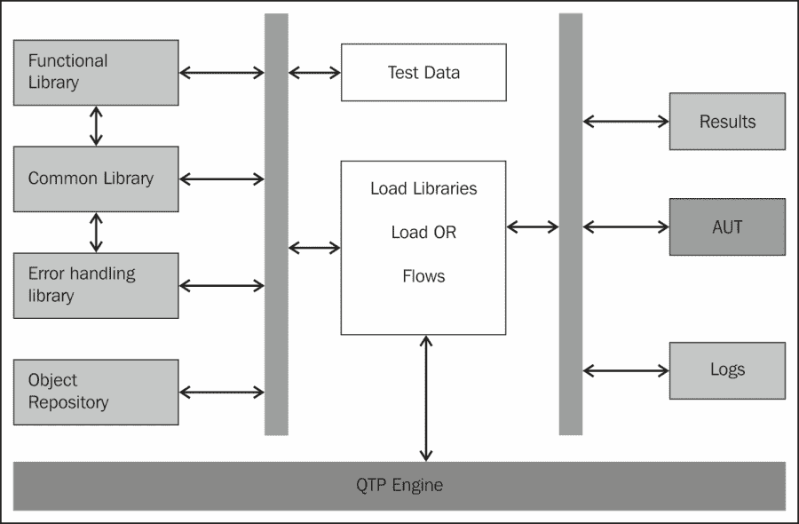

### 设置环境

执行以下步骤以设置测试环境：

1.  创建结构，这与创建测试基础设施相同。

1.  创建资源，包括安装。

1.  在测试管理工具中创建文件夹结构或资源。

1.  确保版本控制（良好实践）。

1.  创建配置文件。

### 创建对象存储库

通过添加对象（将对象添加到本地存储库或记录自动创建测试对象的测试步骤）来创建 OR。

### 创建测试级别组件

执行以下步骤以创建测试级别组件：

1.  准备测试数据。

1.  创建通用函数/库。

1.  创建功能库。

1.  创建测试流程。

1.  通过加载库添加通用组件。

### 创建脚本级别函数

执行以下步骤以创建脚本级别组件：

1.  手动创建步骤。

1.  添加所需的编程逻辑。

1.  调用通用函数（验证点）。

1.  调用`err`处理程序。

### 集成设计元素

将所有组件组合到测试环境中，并确保测试自动化是端到端工作的。

### 测试框架设计

最后，我们可以执行测试以检查错误、缺陷和互操作性。

报告错误，修复它们，并重新测试。

## 模块化框架的优势

+   功能分解使我们能够分而治之复杂性。

+   模块化简化了框架的设计、实现和调试。

+   提供标准接口以相互通信，并允许插入和移除新模块。

## 模块化框架的挑战

创建模块化框架的关键挑战如下：

+   创建通用模块需要更多的技术知识和努力

+   对于非常具体的模块，制作接口的成本很高

+   对于汇编器（集成者）来说，评估不同模块的质量和交互可能很困难

+   组装（集成）模块可能很困难

+   模块设计者的设计创造力可能受到限制，因为他需要符合接口

+   由于过度使用相同模块，产品变化较少

+   总体系统性能可能不是最优的

# 关键字驱动框架

**关键字驱动**测试也称为表驱动测试或基于动作的测试。它是一种软件测试方法。

关键字驱动测试使用电子表格以特定格式指定测试用例，通常以表格形式。这些功能是为每个关键字设计的。该关键字存储在表格的行上的列中。例如，在关键字驱动方法中，每个动作都有其对应的功能存储在功能库中。驱动脚本驱动整个流程，获取动作，并调用相应的功能。

## 关键字驱动测试方法

关键字驱动方法是指将用户与应用程序的交互抽象为动作的形式，并在外部源中维护数据。

### 分解

用户与应用程序的交互被分解为基本元素（登录、选择航班……）。在关键字驱动方法中，一个关键字代表在 AUT 上执行许多动作或重复执行小动作的业务场景。交互的基本元素被称为步骤。

### 重组

交互的基本元素被重新组合，以遵循正式的测试计划，使用多个聚合级别。步骤被聚合以形成基本步骤的序列（s），基本步骤的序列被组合以形成序列组。

参考以下截图，展示了使用驱动脚本从其库函数映射动作。用户与应用程序的交互以动作和数据的形式在外部源中抽象表示。

将测试用例与脚本分开。测试用例被保存在脚本之外。这些由驱动脚本获取，并调用`关键字`功能，如以下截图所示：

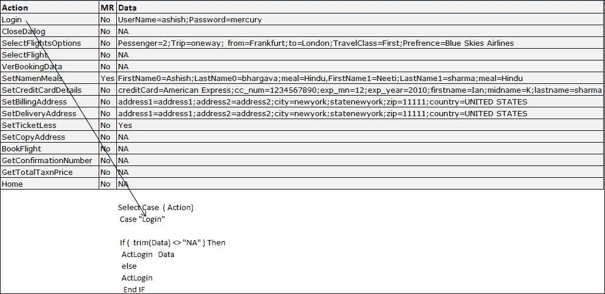

一旦找到关键字，就会调用相应的关键字库函数，如以下截图所示：

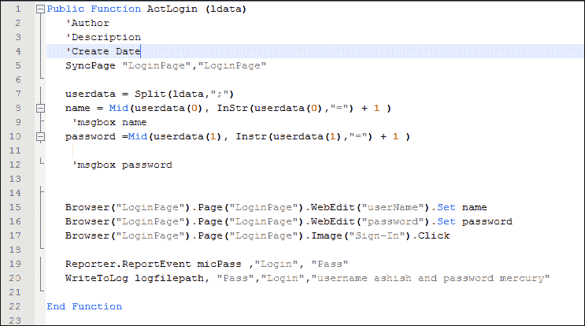

开发关键字驱动框架首先需要实现模块化；除此之外，我们还需要关键字功能库、测试用例和驱动脚本。关键字驱动框架是一个模块化框架，加上存储在外部源中的测试用例和具有特定功能库的驱动脚本，也称为关键字库。

功能分解是设计关键字驱动框架的重要活动，分解指南用于识别关键字。关键字是可重用的函数，在 AUT 上执行一个或多个关键动作，执行特定任务，并按自己的方式完成。关键字驱动框架的另一个重要方面是测试用例与测试脚本分离。

### 关键字驱动或测试计划驱动方法

这种方法利用了功能分解的优势，将执行与脚本分离。测试用例定义在包含关键字的电子表格中。每个关键字都有一个相应的函数库，该库在 AUT 上执行操作。

在这种方法中，整个过程都是关键字驱动的，包括功能。关键字控制处理过程。

**关键字驱动测试**（**KDT**）是为了简化自动化测试用例的创建，并尽可能使其与手动测试用例相似而创建的。KDT 根据输入到电子表格中的信息“即时”创建 QTP 自动化测试脚本。

测试用例表示将在行和列中。在测试场景电子表格中，每个测试用例将执行一个动作。

### **注意**

在自动化测试中，最低粒度是测试用例步骤。步骤级别是每个动作或验证发生的地方。

根据 KDT，我们需要为每个区域准备数据电子表格，因为功能可能根据不同的区域而有所不同。一些区域对商业团体、单个企业等有特定的覆盖率。在测试脚本中处理这些内容很困难。测试套件准备用于指定需要执行哪些区域/区域，脚本被通用化。脚本基于电子表格驱动，该电子表格将从区域获取 Excel 数据并生成“即时”脚本。

设计关键字驱动框架的关键步骤：

1.  分析应用程序。

1.  创建设计。

1.  创建自动化测试存储库。

1.  创建测试级别的组件。

1.  创建脚本级别的函数。

1.  集成。

1.  测试它。

我们已经看到了创建模块化框架的关键步骤。对于关键字驱动框架，方法也是相同的。

让我们了解关键字驱动方法中的自动化存储库。总的来说，它包含与文档、测试套件和创建的测试用例及库相关的数据。

测试用例也被称为测试场景或测试组，其中包含指定执行测试步骤的电子表格。

**常用库**包含 QTP 库文件和（`.vbs`，`.qfl`）文件，这些文件控制整个 KDT 控制流，例如，驱动脚本和库文件（`.qfl`，`.vbs`）。常用库可以被视为：

+   **效用函数**

+   **导航函数**

+   **支持函数**

**环境库**包含用于设置环境的`.xml`和`.qfl`文件。

**错误库**包含用于在执行过程中捕获错误并执行必要操作的文件（`.qfl`或`.vbs`文件）。

**框架文档**包含为框架创建的所有数据，例如，对初始框架的增强或为框架创建的帮助文件。

**对象库**包含使用 QTP 创建的`.tsr`对象文件。

以下图显示了各种层和组件如何协同工作以实现整体设计：

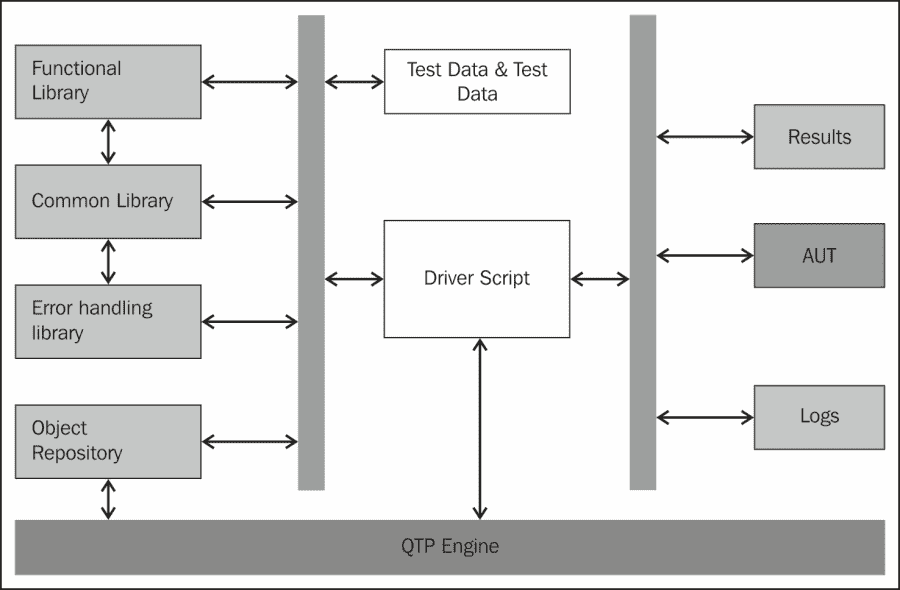

### 关键字驱动方法中的通用流程

关键字驱动方法中的关键步骤及其执行顺序如下：

1.  从电子表格中获取提到的关键字。

1.  从下一步骤构建参数列表。

1.  调用实用函数；实用脚本将执行以下操作：

    1.  使用从实用脚本接收的输入参数列表调用实用脚本。

    1.  调用驱动脚本执行特定任务（例如，登录、选择航班等），如果需要，调用用户定义的函数。

    1.  向测试报告报告测试用例的错误。

    1.  异常处理脚本。

    1.  返回到驱动脚本。

1.  重复 1 到 3 步。

## 关键字驱动方法的优点

关键字驱动方法提供的关键优点如下所述章节所述。

### 成本效益

关键字驱动自动化框架降低了测试设计、自动化和执行的成本和时间。关键字是高度可重用的函数，代表在 GUI 上执行的业务场景或操作。这些经过良好设计和测试的函数在一段时间内提供了良好的投资回报。

分离测试用例允许在不修改脚本的情况下执行测试用例。当应用程序的流程发生变化时，只需更改测试用例而不是脚本。

### 可重用性

关键字、实用工具和函数被构建以实现可重用性。整个框架被划分为相互集成的层。

### 易于维护

+   关键字驱动方法提供了从复杂性和技术挑战中的抽象；易于维护

+   关键字驱动的框架的健壮性允许适应 GUI 和测试流程的变化

+   允许在不修改脚本、函数和实用工具或进行最小更改的情况下专注于测试用例的开发。

### 易于执行

关键字驱动方法允许非技术测试人员、业务分析师和 SMEs（主题专家）执行和创建自动化测试用例。

测试用例与脚本分离，并且使用关键字准备测试用例很容易，无需了解它们是如何实现的。

## 关键挑战

需要设计知识。

新团队成员需要付出努力去理解框架及其设计。良好的文档和知识共享是克服这一问题的必要条件。

# 混合框架

**混合框架**允许结合两个框架的优势，并消除它们的弱点。大多数开发出来的框架都属于这一类别，它们使用功能分解，如模块化框架和数据驱动方法。

设计混合框架的关键步骤如下：

1.  创建文件夹结构。

1.  创建和存储自动化资源。

1.  组织和管理资源。

1.  集成框架。

1.  干运行。

## 混合框架的优势

混合框架允许利用其他框架的优势，并消除它们的不足，这适合自动化。实际上，大多数测试自动化解决方案都属于这一类别。

## 关键挑战

虽然它缓解了其他方法的弱点，但它失去了其通用性，并且非常具体于测试自动化解决方案 AUT，这降低了其组件在多个 AUT 之间的可重用性。

# 业务流程测试

**业务流程测试**（**BPT**）方法允许将业务流程划分为更小的可重用组件，这些组件可以在相同的或不同的测试脚本中使用多次；例如，购买产品的业务流程被划分为登录、选择产品、添加到购物车、下订单和登出等组件，这些组件可以在相同或不同的业务流程中重用。其关键优势是它促进了 SMEs、Bas 和自动化工程师的有效工作和协作。有些人称之为框架，但这更像是一种方法而不是框架。BPT 类似于使用 QTP 和 Quality Center 创建测试自动化解决方案的模块化方法。

# 应用独立框架

应用独立框架是一种特定的关键字驱动测试或表格驱动测试。它识别出独立于 AUT 的关键字，可以直接对 AUT 的组件执行特定操作。关键字驱动框架与应用独立关键字驱动框架之间的关键区别在于库。在应用独立关键字驱动框架中，功能库更为通用或直接作用于 AUT 的通用组件。以下为数据表：

| 窗口 | WinObject | 操作 | 参数 |
| --- | --- | --- | --- |
| 计算器 | 按钮 | 点击 | 1 |
| 计算器 | 按钮 | 点击 | + |
| 计算器 | 按钮 | 点击 | 3 |
| 计算器 | 按钮 | 点击 | = |
| 计算器 | 文本 | 验证结果 | 4 |

AUT 的功能在数据表中指定。前一个表允许在计算器窗口上计算一些操作，例如 1 + 3 =，并验证结果。操作说明如下：

1.  在计算器窗口中点击按钮（**1**）。

1.  在计算器窗口中点击按钮（**+**）。

1.  在计算器窗口中点击按钮（**3**）。

1.  在计算器窗口中点击按钮（**=**）。

1.  验证计算器中的文本结果。

操作列列出了使用鼠标、键盘或特定功能执行的操作。数据表应映射以生成测试步骤；例如，鼠标点击按钮，按钮通过参数（`1`）识别。控制名称在`WinObject`列中给出，而`Window`列包含应用程序的名称。

在 QTP 中，对象存储库存储测试对象并提供其逻辑名称|给它。我们可以使用这个逻辑名称作为参数来创建脚本；例如，我们可以使用 Excel 存储对象层次结构并包含数据。也就是说，利用代码创建与应用程序无关的框架。以下图表展示了我们如何使用 Excel 实现应用程序无关的实现并将其转换为脚本。所有对象的名称都列在列中；在运行时，它获取对象信息并创建如图所示的脚本：

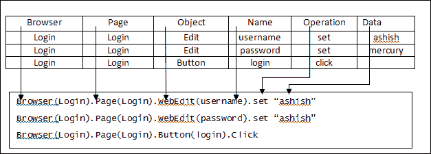

在前面的图表中，我们可以观察到脚本在运行时创建对象，而不是硬编码的脚本。这使应用程序从其他应用程序中独立出来。

## 应用程序无关框架的优势

应用程序无关的关键字驱动框架继承了关键字驱动框架的所有优点，除了允许我们在不同的应用程序上工作而不需要太多更改之外。

## 应用程序无关框架的关键挑战

创建与应用程序无关的框架需要更多的专业知识来处理创建通用库的复杂性。

与应用程序无关的关键字驱动方法通常是为特定技术设计的，而不是为多种技术设计的。

QTP 提供的最基本框架是回放机制和创建测试步骤的简单步骤。这些步骤被放入可重用函数中，成为模块化和关键字驱动框架中的功能库。参数化步骤并允许其迭代成为数据驱动方法。参考以下图表，展示了我们在开发一个框架时执行的步骤，该框架成为开发下一个框架的基础，例如，记录和回放成为数据驱动框架的基础。一个框架成为下一个框架的基础或部分基础。参考以下图表，展示它们之间的关系：

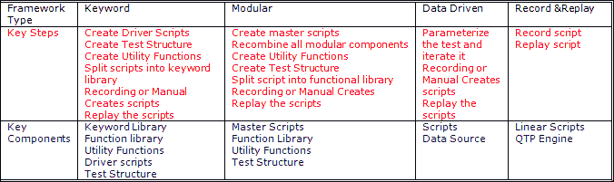

# 摘要

本章描述了构建框架及其组件的各种概念和方法，以及一种结构，使我们能够保持资源均匀可访问。这有助于实现自动化目标并降低测试自动化套件的维护成本。

在下一章中，我们将讨论调试脚本、自定义日志部署以及维护框架的各种方法。
