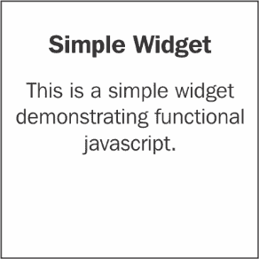

# 第一章. 使用 D3.js 入门

在本章中，我们将涵盖：

+   设置简单的 D3 开发环境

+   设置基于 NPM 的 D3 开发环境

+   理解 D3 风格的函数式 JavaScript

# 简介

本章旨在帮助您快速上手 D3.js，并涵盖基本方面，例如 D3.js 是什么以及如何设置典型的 D3.js 数据可视化环境。本章还特别介绍了一些 D3.js 高度依赖的、不太为人所知的 JavaScript 领域。

什么是 D3？D3 指的是*数据驱动文档*，根据官方 D3 Wiki 的描述：

> ***D3** (*数据驱动文档*或 D3.js)是一个用于使用 Web 标准可视化数据的 JavaScript 库。D3 帮助您通过 SVG、Canvas 和 HTML 将数据生动呈现。D3 将强大的可视化和技术与数据驱动的 DOM 操作方法相结合，为您提供现代浏览器的全部功能以及为您的数据设计正确视觉界面的自由度。*
> 
> *-D3 Github Wiki (2016 年 8 月)*

在某种意义上，D3 是一个专门的 JavaScript 库，它允许您通过利用现有的 Web 标准，以简单（数据驱动）的方式创建令人惊叹的数据可视化。D3.js 是由 Mike Bostock([`bost.ocks.org/mike/`](https://bost.ocks.org/mike/))创建的，并取代了他之前在另一个名为 Protovis 的 JavaScript 数据可视化库上的工作。有关 D3 是如何创建的以及影响 Protovis 和 D3.js 的理论的信息，请参阅以下信息框中的链接。在这里，本书将更多地关注如何使用 D3.js 来增强您的可视化。由于 D3 在数据可视化方面采用了不同的方法，因此一开始可能会有些令人困惑。我希望在本书的整个过程中，大量基本和高级主题将使您对 D3 感到舒适和有效。一旦正确理解，D3 可以通过数据可视化大幅提高您的生产力和表达能力。

### 注意

若想更正式地了解 D3 背后的理念，请参阅由 Mike Bostock 在 2010 年 IEEE InfoVis 上发表的《*交互可视化声明性语言设计*》论文，链接为[`vis.stanford.edu/papers/protovis-design`](http://vis.stanford.edu/papers/protovis-design) 。如果您想了解 D3 是如何产生的，我建议您查看 Mike Bostock、Vadim Ogievestsky 和 Jeffery Heer 在 2011 年 IEEE InfoVis 上发表的《*D3: 数据驱动文档*》论文，链接为[`vis.stanford.edu/papers/d3`](http://vis.stanford.edu/papers/d3) 。D3.js 的前身 Protovis 也是由 Mike Bostock 和斯坦福可视化小组的 Jeff Heer 创建的，可以在[`mbostock.github.io/protovis/`](https://mbostock.github.io/protovis/)找到。

# 设置简单的 D3 开发环境

当你开始一个由 D3 驱动的数据可视化项目时，你首先需要的是一个工作开发环境。在这个食谱中，我们将向你展示如何在几分钟内设置一个简单的 D3 开发环境。

## 准备工作

在我们开始之前，请确保你已经安装并准备好你的文本编辑器在你的电脑上。

## 如何操作...

我们将按照以下步骤开始下载 D3.js：

1.  从[`d3js.org/`](https://d3js.org/)下载最新的稳定版 D3.js。你可以从[`github.com/d3/d3/tags`](https://github.com/d3/d3/tags)下载存档的旧版本。另外，如果你对尝试 master 分支上的最新 D3 构建感兴趣，那么你可以 fork[`github.com/d3/d3`](https://github.com/d3/d3)。

1.  下载并解压后，你将在提取的文件夹中找到两个 D3 JavaScript 文件，`d3.js`和`d3.min.js`，以及其他信息文件。出于开发目的，建议你使用`d3.js`文件，即*非压缩*（最小化）版本，因为它可以帮助你在 D3 库内部跟踪和调试 JavaScript。一旦提取，将`d3.js`文件放置在与包含以下 HTML 的`index.html`文件相同的文件夹中：

    ```js
        <!-- index.html --> 
         <!DOCTYPE html> 
         <html> 
         <head> 
             <meta charset=""utf-8""> 
             <title>Simple D3 Dev Env</title> 
             <script type=""text/javascript"" src="img/"d3.js""></script> 
         </head> 
         <body> 

         </body> 
         </html> 

    ```

这就是创建一个 D3 驱动的数据可视化开发环境的全部所需。有了这个设置，你基本上可以使用你喜欢的文本编辑器打开 HTML 文件开始开发，也可以通过在浏览器中打开文件来查看你的可视化。

### 注意

本食谱的源代码可以在[`github.com/NickQiZhu/d3-cookbook-v2/tree/master/src/chapter1/simple-dev-env`](https://github.com/NickQiZhu/d3-cookbook-v2/tree/master/src/chapter1/simple-dev-env)找到。

## 它是如何工作的...

D3 JavaScript 库非常自给自足。它除了依赖于浏览器已经提供的 JavaScript 库外，不依赖于任何其他 JavaScript 库。

### 注意

如果你的可视化目标浏览器环境包括 Internet Explorer 9，建议你使用兼容性库**Aight**，它可以在[`github.com/shawnbot/aight`](https://github.com/shawnbot/aight)找到，以及**Sizzle 选择器引擎**，它可以在[`sizzlejs.com/`](http://sizzlejs.com/)找到。

在 D3 v4 发布之前，在头部部分包含以下字符编码指令是至关重要的，因为旧版本的 D3 在其源代码中使用了 UTF-8 符号，如π；然而，随着 D3 v4.x 的发布，这不再是必要的。然而，考虑到你将包含的其他 JavaScript 库可能也在使用 UTF-8 符号，所以这仍然被认为是一个好的实践，如下面的例子所示：

```js
    <meta charset=""utf-8""> 

```

### 注意

D3 在其作者迈克尔·博斯特克（Michael Bostock）创建的定制许可协议下 **完全开源**。这个许可协议与流行的 MIT 许可证非常相似，只有一个例外，即它明确指出，未经迈克尔·博斯特克的许可，不得使用其姓名来认可或推广由此软件派生的产品。

## 更多内容...

在整个食谱集中，将提供大量的食谱代码示例。所有示例源代码都提供并托管在 GitHub ([`github.com/`](https://github.com/) )，一个流行的开源社交编码仓库平台上。

### 如何获取源代码

获取所有所需食谱源代码的最简单方法是将本书的 Git 仓库 ([`github.com/NickQiZhu/d3-cookbook-v2`](https://github.com/NickQiZhu/d3-cookbook-v2) ) 克隆。如果您不打算为食谱设置开发环境，那么您可以安全地跳过这一节。

### 注意

如果您不熟悉 Git，其克隆概念与其他版本控制软件中的检出概念类似。然而，克隆不仅简单地检出文件，还会将所有分支和版本历史复制到您的本地机器上，实际上是将整个仓库克隆到您的本地机器上，这样您就可以在完全离线的情况下使用这个克隆的仓库在自己的环境中工作。

首先，在您的计算机上安装一个 Git 客户端。您可以在 [`git-scm.com/downloads`](https://git-scm.com/downloads) 找到 Git 客户端软件列表，以及如何在不同的操作系统上安装它的详细指南 [`git-scm.com/book/en/Getting-Started-Installing-Git`](https://git-scm.com/book/en/Getting-Started-Installing-Git) 。

### 注意

另一种使 Git 和 GitHub 工作起来更受欢迎的方法是安装 GitHub 客户端，它比单纯的 Git 提供了更丰富的功能。然而，在撰写本书时，GitHub 只提供了 Windows 和 Mac OS 的客户端软件；请参阅 [`desktop.github.com/`](https://desktop.github.com/) 。

一旦安装了 Git 客户端，只需执行以下命令即可将所有食谱源代码下载到您的计算机上：

```js
> git clone git@github.com:NickQiZhu/d3-cookbook-v2.git

```

# 设置基于 NPM 的开发环境

在之前的食谱中展示的简单设置对于实现本书中的大多数食谱已经足够。然而，当您从事一个需要使用多个 JavaScript 库的更复杂的数据可视化项目时，我们之前讨论的简单解决方案可能会变得有些笨拙且难以操作。在本节中，我们将演示使用 **Node Packaged Modules** （**NPM**），一个事实上的 JavaScript 库仓库管理系统，的改进设置。如果您和我一样急切，想直接进入书籍的精华部分——食谱，您可以安全地跳过这一节，在需要为项目设置更生产就绪的环境时再回来。

## 准备工作

在我们开始之前，请确保你已经正确安装了 NPM。NPM 是 Node.js 安装的一部分。你可以从 [`nodejs.org/`](https://nodejs.org/) 下载 Node.js。选择适合你的操作系统的正确 Node.js 二进制构建。安装后，以下 `npm` 命令将在你的终端控制台中可用：

```js
> npm -v 
2.15.8

```

前面的命令打印出 NPM 客户端的版本号，以指示安装成功。

## 如何操作...

安装 NPM 后，我们现在可以创建一个包描述文件来自动化一些手动设置步骤：

1.  首先，在你的项目文件夹下创建一个名为 `package.json` 的文件，该文件包含以下代码：

    ```js
         { 
           ""name": "d3-project-template", 
           ""version": "0.1.0", 
           "description": "Ready to go d3 data visualization project template", 
           "keywords": [ 
             "data visualization", 
             "d3" 
           ], 
           "homepage": "<project home page>", 
           "author": { 
             "name": "<your name>", 
             "url": "<your url>" 
           }, 
           "repository": { 
             "type": "git", 
             "url": "<source repo url>" 
           }, 
           "dependencies": { 
               "d3":"4.x" 
           }, 
           "devDependencies": { 
               "uglify-js": "2.x" 
           } 
         } 

    ```

1.  一旦定义了 `package.json` 文件，你只需简单地运行以下命令：

    ```js
             > npm install

    ```

## 它是如何工作的...

`package.json` 文件中的大多数字段仅用于信息目的，例如其名称、描述、主页、作者和仓库。如果你决定将来将库发布到 NPM 仓库，将使用名称和版本字段。在此阶段，我们真正关心的是 `dependencies` 和 `devDependencies` 字段：

+   `dependencies` 字段描述了项目在浏览器中正常运行所需的运行时库依赖项，即项目运行所需的库。

+   在这个简单的示例中，我们只依赖 D3。`d3` 是在 NPM 仓库中发布的 D3 库的名称。版本号 `4.x` 表示该项目与任何版本 4 的发布版本兼容，NPM 应该检索最新的稳定版本 4 构建来满足这个依赖。

### 注意

D3 是一个自给自足的库，没有外部运行时依赖。然而，这并不意味着它不能与其他流行的 JavaScript 库一起工作。我经常使用 D3 与其他库一起使用，以简化我的工作，例如 JQuery、Zepto.js、Underscore.js 和 ReactJs 等等。

+   `devDependencies` 字段描述了库依赖项的开发时间（编译时间）。这意味着在此类别下指定的库仅用于构建此项目，而不是运行 JavaScript 项目所必需的。

### 注意

详细 NPM 包 JSON 文件文档可以在 [`docs.npmjs.com/files/package.json`](https://docs.npmjs.com/files/package.json) 找到。

执行 `npm install` 命令将自动触发 NPM 下载项目所需的所有依赖项，包括依赖项的依赖项递归下载。所有依赖库都将下载到项目根目录下的 `node_modules` 文件夹中。完成此操作后，你只需简单地创建一个 HTML 文件，如前一个示例所示，并直接从 `node_modules/d3/build/d3.js` 加载 D3 JavaScript 库。

这个食谱的源代码以及自动构建脚本可以在[`github.com/NickQiZhu/d3-cookbook-v2/tree/master/src/chapter1/npm-dev-env`](https://github.com/NickQiZhu/d3-cookbook-v2/tree/master/src/chapter1/npm-dev-env)找到。

依赖 NPM 是一种简单且更有效的方法，可以让你免于手动下载 JavaScript 库的所有麻烦以及不断更新它们的需要。然而，一个敏锐的读者可能已经注意到了，有了这种能力，我们可以轻松地将我们的环境设置提升到下一个层次。如果你正在构建一个大型可视化项目，其中将创建数千行 JavaScript 代码，那会怎么样？显然，我们在这里描述的简单设置将不再足够。然而，模块化 JavaScript 开发本身就可以填满一本书；因此，我们不会尝试涵盖这个主题，因为我们的重点是数据可视化和 D3。在后面的章节中，当讨论与单元测试相关的食谱时，我们将扩展这个主题的范围，以展示如何增强我们的设置以运行自动构建和单元测试。

### 小贴士

D3 v4.x 非常模块化；所以如果你只需要 D3 库的一部分用于你的项目，你也可以选择性地包含 D3 子模块作为你的依赖。例如，如果你只需要 `d3-selection` 模块在你的项目中，那么你可以在你的 `package.json` 文件中使用以下依赖声明：`"dependencies": {` `      "d3-selection":"1.x"` `}`

## 还有更多...

虽然在前面的小节中提到，你可以直接使用浏览器打开你创建的 HTML 页面来查看你的可视化结果，但这种方法确实有其局限性。一旦我们需要从单独的数据文件中加载数据（这是我们将在后面的章节中做的，也是你日常工作中最可能的情况），由于浏览器的内置安全策略，这种简单的方法就不再有效了。为了绕过这个安全限制，强烈建议你设置一个本地 HTTP 服务器，这样你的 HTML 页面和数据文件就可以从这个服务器访问，而不是直接从本地文件系统加载。

### 设置本地 HTTP 服务器

根据你使用的操作系统和你决定用作 HTTP 服务器的软件包，你可能有十几种不同的方法在你的电脑上设置 HTTP 服务器。在这里，我将尝试涵盖一些最流行的设置。

#### Python 简单 HTTP 服务器

这是我最喜欢的用于开发和快速原型设计的工具。如果你在你的操作系统上安装了 Python，这在任何 Unix/Linux/Mac OS 分发版中通常是默认的，那么你只需在你的终端中输入以下命令（使用 Python 2）：

```js
> python -m SimpleHTTPServer 8888

```

或者，使用 Python 3 分发版输入以下命令：

```js
> python -m http.server 8888

```

这个小小的 Python 程序将启动一个 HTTP 服务器，并从程序启动的文件夹开始服务任何文件。这是在任意操作系统上运行 HTTP 服务器最简单的方法。

### 注意

如果您电脑上还没有安装 Python，您可以从 [`www.python.org/getit/`](https://www.python.org/getit/) 获取它。它适用于所有现代操作系统，包括 Windows、Linux 和 Mac。

#### Node.js HTTP 服务器

如果您已经安装了 Node.js，也许是我们之前章节中进行的开发环境设置练习的一部分，那么您可以简单地安装 `http-server` 模块。类似于 Python Simple HTTP 服务器，此模块将允许您从任何文件夹启动轻量级 HTTP 服务器并立即开始服务页面。

首先，您需要使用以下命令安装 `http-server` 模块：

```js
> npm install http-server -g

```

在此命令中的 `-g` 选项将全局安装 `http-server` 模块，因此它将自动在您的命令行终端中可用。一旦完成，您就可以通过简单地发出以下命令从您所在的任何文件夹启动服务器：

```js
> http-server -p 8888

```

此命令将在默认端口 `8080` 上启动一个由 Node.js 驱动的 HTTP 服务器，或者如果您想，您可以使用 `-p` 选项为它提供一个自定义端口号。

### 注意

如果您在 Linux、Unix 或 Mac OS 上运行 `npm install` 命令，您可能需要以 `sudo` 模式运行命令或作为 root 用户，以便使用 `-g` 全局安装选项。

# 理解 D3 风格的 JavaScript

D3 是使用函数式风格的 JavaScript 设计和构建的，这可能对更习惯于过程式或面向对象 JavaScript 风格的人来说有些不熟悉，甚至可能感到陌生。这个菜谱旨在涵盖 D3 所需的一些最基本的功能 JavaScript 概念，并进一步使您能够以 D3 风格编写可视化代码。

## 准备工作

在您的网络浏览器中打开以下文件的本地副本：[`github.com/NickQiZhu/d3-cookbook-v2/blob/master/src/chapter1/functional-js.html`](https://github.com/NickQiZhu/d3-cookbook-v2/blob/master/src/chapter1/functional-js.html) .

## 如何操作...

让我们更深入地了解一下 JavaScript 的优点，即更函数式的一面。看看以下代码片段：

```js
     function SimpleWidget(spec) { 
       var instance = {}; // <-- A 

       var headline, description; // <-- B 

       instance.render = function () { 
         var div = d3.select('body').append("div"); 

         div.append("h3").text(headline); // <-- C 

         div.attr("class", "box") 
         .attr("style", "color:" + spec.color) // <-- D 
           .append("p") 
           .text(description); // <-- E 

         return instance; // <-- F 
       }; 

       instance.headline = function (h) { 
         if (!arguments.length) return headline; // <-- G 
         headline = h; 
         return instance; // <-- H 
       }; 

       instance.description = function (d) { 
         if (!arguments.length) return description; 
         description = d; 
         return instance; 
       }; 

       return instance; // <-- I 
     } 

       var widget = SimpleWidget({color: "#6495ed"}) 
         .headline("Simple Widget") 
         .description("This is a simple widget demonstrating
           functional      javascript."); 
       widget.render(); 

```

上述代码片段在您的网页上生成以下简单的小部件：



## 它是如何工作的...

尽管这个小部件的界面很简单，但它与 D3 风格的 JavaScript 界面有着不可否认的相似性。这不是巧合，而是通过利用一种名为函数对象的 JavaScript 编程范式实现的。像许多有趣的话题一样，这也是一个可以单独填满一本书的主题；尽管如此，我将在本节中尝试涵盖这个特定范式最重要的和最有用的方面，这样你不仅可以理解 D3 的语法，还能以这种方式创建你的代码。正如 D3 项目 Wiki 所述，这种函数式编程风格给了 D3 很大的灵活性：

> *D3 的函数式风格通过一系列组件和插件允许代码重用。 ——D3 Wiki (2016 年 8 月)*

### 函数是对象

JavaScript 中的函数是对象。就像 JavaScript 中的任何其他对象一样，函数对象只是一个名称和值对的集合。函数对象与普通对象之间的唯一区别是函数可以被调用，并且还关联着以下两个隐藏属性：函数上下文和函数代码。这可能会让人感到惊讶，看起来不自然，尤其是如果你来自更注重过程式编程的背景。尽管如此，这是我们需要的关键洞察，以便理解 D3 使用函数的一些*奇怪*方式。

### 注意

在 ES6 之前，JavaScript 通常不被认为是非常面向对象的；然而，函数对象可能是它超越其他一些更面向对象的同类的方面之一。

现在，带着这个洞察，让我们再次看看以下代码片段：

```js
  var instance = {}; // <-- A 

  var headline, description; // <-- B 

  instance.render = function () { 
    var div = d3.select('body').append("div"); 

    div.append("h3").text(headline); // <-- C 

    div.attr("class", "box") 
      .attr("style", "color:" + spec.color) // <-- D 
      .append("p") 
      .text(description); // <-- E 

    return instance; // <-- F 
  }; 

```

在标记为 `A`、`B` 和 `C` 的行中，我们可以清楚地看到 `instance`、`headline` 和 `description` 都是 `SimpleWidget` 函数对象的内部私有变量。而 `render` 函数是与 `instance` 对象关联的函数，而 `instance` 对象本身被定义为对象字面量。由于函数只是对象，它们也可以存储在对象/函数中，通过变量引用，包含在数组中，以及作为函数参数传递。`SimpleWidget` 函数执行的结果是在行 `I` 返回对象实例，如下所示：

```js
function SimpleWidget(spec) { 
... 
  return instance; // <-- I 
} 

```

### 注意

`render` 函数使用了我们尚未介绍的一些 D3 函数，但在这里我们不必过分关注它们，因为我们将在接下来的几章中深入探讨每个函数。此外，它们基本上只是渲染这个小部件的视觉表示，与我们当前的主题关系不大。

### 静态变量作用域

好奇读者现在可能已经在问，在这个例子中变量作用域是如何解决的，因为渲染函数似乎可以访问`instance`、`headline`、`description`变量以及传递给基本`SimpleWidget`函数的`spec`变量。这种看似奇怪的变量作用域实际上是由一个简单的静态作用域规则决定的。这个规则可以理解为以下内容：每当运行时搜索变量引用时，首先会在本地执行搜索。当找不到变量声明（如在行`C`上的`headline`）时，搜索会继续向父对象（在这种情况下，`SimpleWidget`函数是其静态父对象，`headline`变量声明在行`B`上找到）。如果仍然找不到，那么这个过程会递归地继续到下一个静态父对象，依此类推，直到达到全局变量定义；如果仍然找不到，那么将为该变量生成一个引用错误。这种作用域行为与一些最流行的语言（如 Java 和 C#）中的变量解析规则非常不同。

可能需要一些时间来适应；然而，如果你仍然觉得它很困惑，不必过于担心。通过更多的实践并牢记静态作用域规则，你很快就会习惯这种作用域。

### 注意

这里再次提醒，对于来自 Java 和 C#背景的人来说，JavaScript 不实现块作用域。我们描述的静态作用域规则仅适用于函数/对象，而不适用于块级别，如下面的代码所示：`for(var i = 0; i < 10; i++){` `  for(var i = 0; i < 2; i++){` `    console.log(i);` `  }` `}` 你可能会认为这段代码应该产生 20 个数字。然而，在 JavaScript 中，这段代码会创建一个无限循环。这是因为 JavaScript 不实现块作用域，所以内层循环中的变量`i`与外层循环使用的同一个变量`i`相同。因此，它被内层循环重置，永远不会结束外层循环。

这种模式通常在与更流行的基于原型的**伪经典模式**相比时被称为功能模式。功能模式的优势在于它提供了一个更好的机制来实现信息隐藏和封装，因为私有变量，在我们的例子中，是`headline`和`description`变量，只能通过嵌套函数通过静态作用域规则访问；因此，`SimpleWidget`函数返回的对象既灵活又更难以篡改和损坏。

> *如果我们以功能风格创建一个对象，并且如果该对象的所有方法都不使用这个，那么这个对象是持久的。一个持久的对象仅仅是一组充当能力的函数集合。*
> 
> *-Crockfort D. 2008*

### 获取器-设置器函数

让我们看一下以下代码；在行`G`上发生了一些奇怪的事情：

```js
instance.headline = function (h) { 
  if (!arguments.length) return headline; // <-- G 
  headline = h; 
  return instance; // <-- H 
}; 

```

你可能想知道第`G`行中的这个`arguments`变量是从哪里来的。在这个例子中它从未被定义过。`arguments`变量是一个内置的隐藏参数，当函数被调用时对函数可用。`arguments`变量包含一个数组，其中包含函数调用的所有参数。

### 注意

事实上，`arguments`并不是一个真正的 JavaScript 数组对象。它有`length`属性，可以通过索引访问；然而，它并没有与典型 JavaScript 数组对象相关联的许多方法，例如`slice`或`concat`。当你需要在`arguments`上使用标准的 JavaScript 数组方法时，你需要使用以下 apply 调用模式：`var newArgs = Array.prototype.slice.apply(arguments);`

当这个隐藏参数与 JavaScript 中省略函数参数的能力结合使用时，你可以编写一个像`instance.headline`这样的函数，它具有未指定的参数数量。在这种情况下，我们既可以有一个参数`h`，也可以没有。因为当没有传递参数时，`arguments.length`返回`0`，所以如果未传递参数，`headline`函数返回`headline`，如果提供了参数`h`，它就变成了设置器。为了澄清这个解释，让我们看看下面的代码片段：

```js
var widget = SimpleWidget({color: "#6495ed"}) 
    .headline("Simple Widget"); // set headline 
console.log(widget.headline()); // prints "Simple Widget" 

```

在这里，你可以看到如何使用不同的参数将标题函数用作设置器和获取器。

### 函数链

这个特定示例的下一个有趣方面是函数相互链式调用的能力。这也是 D3 库主要采用的函数调用模式，因为大多数 D3 函数都是设计为可链式的，以提供更简洁和上下文相关的编程接口。一旦你理解了变量、参数函数的概念，这实际上是非常简单的。由于变量参数函数，如`headline`函数，可以同时作为设置器和获取器，当它作为设置器时返回`instance`对象，这允许你立即在调用结果上调用另一个函数，因此形成了链式调用。

让我们看看下面的代码：

```js
var widget = SimpleWidget({color: "#6495ed"}) 
  .headline("Simple Widget") 
  .description("This is ...") 
  .render(); 

```

在这个例子中，`SimpleWidget`函数返回`instance`对象（如第`I`行）。

```js
function SimpleWidget(spec) { 
... 
    instance.headline = function (h) { 
        if (!arguments.length) return headline; // <-- G 
        headline = h; 
       return instance; // <-- H 
    }; 
... 
    return instance; // <-- I 
} 

```

然后，`headline`函数作为设置器被调用，这也返回了`instance`对象（如第`H`行）。然后可以直接在其返回值上调用`description`函数，这再次返回了`instance`对象。最后，可以调用`render`函数。

现在，有了函数式 JavaScript 和现成的 D3 数据可视化开发环境的知识，我们准备好深入探索 D3 提供的丰富概念和技术。然而，在我们起飞之前，我想再覆盖几个重要领域，如何查找和分享代码以及当你遇到困难时如何寻求帮助。

## 还有更多...

让我们看看一些额外的有用资源。

### 查找和分享代码

与其他可视化选项相比，D3 的一个优点是它提供了丰富的示例和教程，你可以从中汲取灵感。在创建我自己的开源可视化图表库以及编写这本书的过程中，我大量依赖了这些资源。我将列出一些在这个方面最受欢迎的选项。这个列表绝对不是全面的目录，而是一个让你开始探索的起点：

+   D3 画廊（[`github.com/d3/d3/wiki/Gallery`](https://github.com/d3/d3/wiki/Gallery)）包含了一些你可以在网上找到的关于 D3 使用的最有趣的示例。它包含不同可视化图表的示例、特定技术以及一些野外有趣的可视化实现，等等。

+   Christophe Viau 的 D3 画廊（[`christopheviau.com/d3list/gallery.html`](http://christopheviau.com/d3list/gallery.html)）是另一个带有分类的 D3 画廊，帮助你快速在网上找到所需的可视化示例。

+   D3 教程页面（[`github.com/d3/d3/wiki/Tutorials`](https://github.com/d3/d3/wiki/Tutorials)）包含了一系列由不同贡献者在不同时间创建的教程、演讲和幻灯片，详细展示了如何使用不同的 D3 概念和技术。

+   D3 插件可以在[`github.com/d3/d3-plugins`](https://github.com/d3/d3-plugins)找到。也许 D3 对于你的可视化需求缺少一些功能？在你决定实现自己的功能之前，确保查看 D3 插件仓库。它包含了许多提供可视化世界中一些常见和有时不常见功能的插件。

+   D3 API（[`github.com/d3/d3/blob/master/API.md`](https://github.com/d3/d3/blob/master/API.md)）有很好的文档记录。这里你可以找到对 D3 库提供的每个函数和属性的详细解释。

+   Mike Bostok 的 Blocks（[`bl.ocks.org/mbostock`](http://bl.ocks.org/mbostock)）是一个 D3 示例网站，其中可以找到一些更引人入胜的可视化示例，并由其作者 Mike Bostock 维护。

+   JS Bin（[`jsbin.com/ugacud/1/edit`](http://jsbin.com/ugacud/1/edit)）是一个完全在线托管的前端 D3 测试和实验环境。你可以使用这个工具轻松地原型化一个简单的脚本，或者与其他社区成员分享你的创作。

+   JS Fiddle（[`jsfiddle.net/qAHC2/`](http://jsfiddle.net/qAHC2/)）类似于 JS Bin；它也是一个在线托管 JavaScript 代码原型和分享平台。

#### 如何获取帮助

即使有所有这些示例、教程和食谱，如本食谱，您在创建自己的可视化时仍可能遇到挑战。好消息是，D3 拥有一个广泛且活跃的支持社区。简单地对您的问题进行 *Google 搜索* 通常可以找到令人满意的答案。即使没有，也不要担心；D3 拥有一个强大的基于社区的支援系统，如下所示：

+   Stack Overflow 上的 D3.js ([`stackoverflow.com/questions/tagged/d3.js`](http://stackoverflow.com/questions/tagged/d3.js) )：Stack Overflow 是技术社区中最受欢迎的基于社区的免费问答网站。D3 是 Stack Overflow 网站上的一个特定类别，旨在帮助您快速找到专家并获得问题的答案。

+   D3 Google 群组 ([`groups.google.com/forum/?fromgroups#!forum/d3-js`](https://groups.google.com/forum/?fromgroups#!forum/d3-js) )：这是 D3 以及其生态系统中的其他相关库的官方用户群组。
