# 第三章。处理数据

在本章中，我们将涵盖：

+   将数组绑定为数据

+   将对象字面量绑定为数据

+   将函数绑定为数据

+   使用数组

+   使用数据过滤

+   使用数据排序

+   从服务器加载数据

+   使用队列进行异步数据加载

# 简介

在本章中，我们将探讨任何数据可视化项目中最重要的一个问题：数据如何以编程结构和其视觉隐喻的形式来表示。在我们开始这个话题之前，对数据可视化的一些讨论是必要的。为了理解什么是数据可视化，首先我们需要了解数据和信息的区别。

> *数据由原始事实组成。单词“原始”表示这些事实尚未经过处理以揭示其含义...信息是处理原始数据以揭示其含义的结果。*
> 
> *   -Rob P., S. Morris, and Coronel C. 2009*

这是在数字信息世界中传统上对数据和信息的定义。然而，数据可视化提供了对这个定义的更丰富解释，因为信息不再是仅仅处理过的原始事实的结果，而是一种事实的视觉隐喻。正如*曼努埃尔·利马*在他的*信息可视化宣言*中所说，在物质世界中，形式被视为功能的追随者。

同一个数据集可以生成任何数量的可视化，在有效性方面可能具有同等权利。在某种意义上，可视化更多的是关于传达创作者对数据的洞察，而不是其他任何事情。更有挑衅意味的是，Card、McKinlay 和 Shneiderman 提出，信息可视化的实践可以这样描述：

> *使用计算机支持的、交互式的、抽象数据的视觉表示来增强认知。*
> 
> * -"Card S. and Mackinly J.", and Shneiderman B. 1999*

在接下来的几节中，我们将探讨 D3 提供的各种技术，以将数据与视觉领域连接起来。这是我们在能够用我们的数据创建一个*认知放大器*之前需要采取的第一个步骤。

## 进入-更新-退出模式

匹配每个数据与其视觉表示的任务，例如，为数据集中每个数据点绘制一个条形图，当数据点发生变化时更新条形图，然后最终在某些数据点不再存在时删除条形图，这似乎是一个复杂且繁琐的任务。这正是 D3 被设计出来的原因，为了提供一种巧妙的方式来简化这个任务的实现。这种定义数据与其视觉表示之间连接的方式通常被称为 D3 中的 *进入-更新-退出* 模式。这种模式与大多数开发者熟悉的典型 *命令式方法* 深刻不同。然而，理解这个模式对于你在 D3 库中的有效性至关重要；因此，在本节中，我们将专注于解释这个模式背后的概念。首先，让我们看一下以下两个域的概念性示意图：

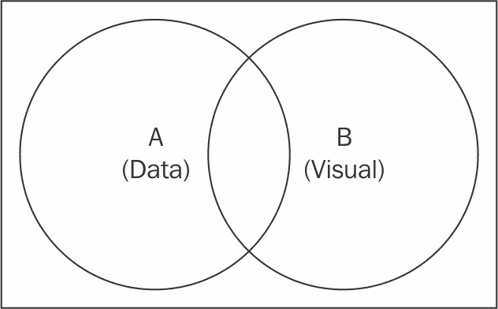

数据和视觉集

在前面的示意图中，两个圆圈代表两个连接的集合。集合 **A** 描述了你的数据集，而集合 **B** 代表视觉元素。这正是 D3 看待数据与视觉元素之间连接的方式。你可能想知道集合理论如何帮助你在这里的数据可视化工作中。让我来解释。

首先，让我们考虑一下这个问题：*我如何找到所有当前代表其对应数据点的视觉元素？* 答案是 *A∩B*；这表示集合 **A** 和 **B** 的交集，存在于数据和视觉域中的元素。

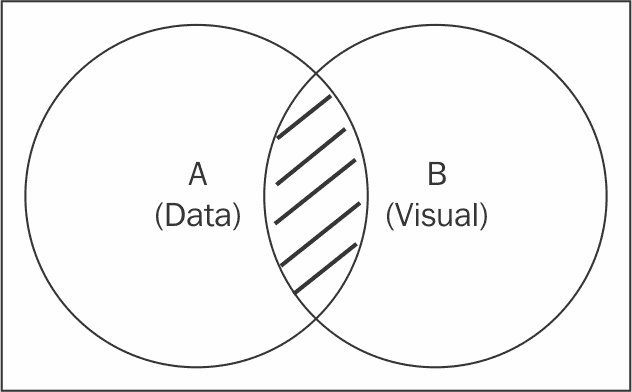

更新模式

在前面的图中，阴影区域代表两个集合 **A** 和 **B** 之间的交集。在 D3 中，可以使用 `selection.data` 函数来选择这个交集，*A* *∩* *B*。

当选择时，`selection.data(data)` 函数会建立数据域和视觉域之间的连接，正如我们在上一段中讨论的那样。初始选择形成视觉集 **B**，而 `data` 函数中提供的数据形成数据集 **A**。此函数的返回结果是所有存在于该交集中的元素的新选择（数据绑定选择）。现在，你可以在这个新选择上调用修改器函数来更新所有现有元素。这种选择模式通常被称为 **更新模式**。

我们在这里需要回答的第二个问题是：*我如何定位尚未可视化的数据点？* 答案是 **A** 和 **B** 的集合差，表示为 *A\B*，可以通过以下示意图直观地看到：

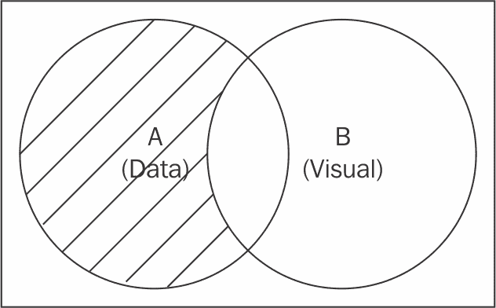

进入模式

集合 **A** 中的阴影区域表示尚未可视化的数据点。为了访问这个 *A\B* 子集，需要在数据绑定的 D3 选择（由 `data` 函数返回的选择）上执行以下函数。

`selection.data(data).enter()` 函数返回一个新的选择，表示 *A\B* 子集，其中包含所有尚未在视觉领域中表示的数据片段。然后，常规的修改函数可以链接到这个新的选择方法，以创建表示给定数据元素的新视觉元素。这种选择模式简单地被称为 **Enter 模式**。

我们讨论的第三个案例涵盖了存在于我们的数据集中的视觉元素，但不再与任何相关联的数据元素。你可能想知道这种类型的视觉元素最初是如何存在的。这通常是由于从数据集中删除元素造成的；也就是说，如果你最初在数据集中可视化了所有数据点，并在之后删除了一些数据点。现在，你有一些视觉元素不再代表数据集中的任何有效数据点。这个子集可以使用更新差异的逆运算来发现，表示为 *B\A*。

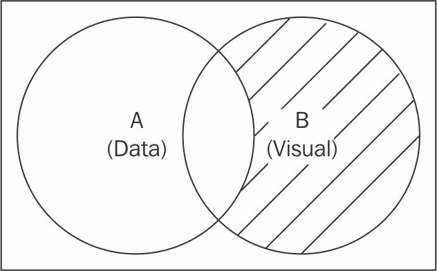

Exit 模式

前面的插图中的阴影区域表示我们刚才讨论的差异。可以使用数据绑定的选择上的 `selection.exit` 函数来选择这个子集。

当在数据绑定的 D3 `selectioncomputes` 上调用 `selection.data(data).exit` 函数时，它会计算一个新的选择，其中包含所有不再与任何有效数据元素相关联的视觉元素。作为一个有效的 D3 选择对象，修改函数可以链接到这个选择，以更新和删除不再作为我们可视化一部分的这些视觉元素。这种选择模式被称为 **Exit 模式**。

三个不同的选择模式共同涵盖了数据与其视觉领域之间所有可能的交互情况。

此外，D3 还提供了一个第四种选择模式，当需要避免重复可视化代码或所谓的 *DRY*（Don't Repeat Yourself）代码时，这个模式非常有用。这种第四种模式被称为合并模式。可以使用 `selection.merge` 函数调用它。此函数将传递给 `merge` 函数的给定选择与函数被调用的选择合并，并返回一个新的选择，它是两者的并集。在 *enter-update-exit* 模式下，`merge` 函数通常用于构建一个覆盖 Enter 和 Update 模式的选择，因为那里是大多数代码重复可能存在的位置。

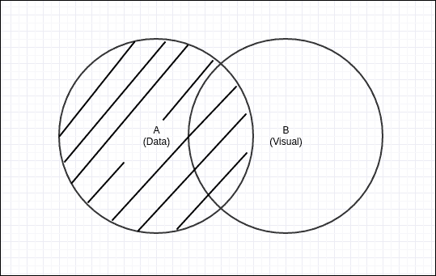

合并模式

本图中的阴影区域显示了由合并模式（结合了输入和更新模式）针对的目标数据点，这实际上是整个集合 A。这非常方便，因为现在可以使用单个修饰符链来样式化这两种模式，从而减少代码重复。我们将在本章的每个菜谱中展示如何利用合并模式。

### 注意

在软件工程中，**不要重复自己**（**DRY**）是一个软件开发原则，旨在减少各种信息重复（维基百科，2016 年 8 月）。你还可以阅读 Mike Bostock 关于*什么使软件变得好？*的帖子，以了解更多关于这种设计变化背后的原因。[`medium.com/@mbostock/what-makes-software-good-943557f8a488#.l640c13rp`](https://medium.com/@mbostock/what-makes-software-good-943557f8a488#.l640c13rp) .

*输入-更新-退出*模式是任何由 D3 驱动的可视化的基石。在本章的后续菜谱中，我们将涵盖如何有效地利用这些选择方法来生成数据驱动的视觉元素。

# 将数组绑定为数据

在 D3 可视化中定义数据最常见和最受欢迎的方法是通过使用 JavaScript 数组；例如，假设你有一个存储在数组中的多个数据元素，并且你想要生成相应的视觉元素来表示它们中的每一个。此外，当数据数组更新时，你希望你的可视化能够立即反映这些变化。在本菜谱中，我们将完成这个常见的做法。

## 准备工作

在你的网络浏览器中打开以下文件的本地副本：

[`github.com/NickQiZhu/d3-cookbook-v2/blob/master/src/chapter3/array-as-data.html`](https://github.com/NickQiZhu/d3-cookbook-v2/blob/master/src/chapter3/array-as-data.html) .

## 如何做...

可能首先想到的第一个和最自然的解决方案是遍历数据数组元素，并在页面上生成它们对应的视觉元素。这绝对是一个有效的解决方案，并且与 D3 一起工作；然而，我们在介绍中讨论的输入-更新-退出模式提供了一个更简单、更有效的方法来生成视觉元素。让我们看看我们如何做到这一点：

```js
var data = [10, 15, 30, 50, 80, 65, 55, 30, 20, 10, 8]; // <- A 
    function render(data) { // <- B 
        var bars = d3.select("body").selectAll("div.h-bar") // <- C 
                .data(data); // Update <- D 
        // Enter 
        bars.enter() // <- E 
                .append("div") // <- F 
                    .attr("class", "h-bar") // <- G 
            .merge(bars) // Enter + Update <- H 
                .style("width", function (d) { 
                    return (d * 3) + "px"; // <- I 
                }) 
                .text(function (d) { 
                    return d; // <- J 
                }); 
        // Exit 
        bars.exit() // <- K 
                .remove(); 
    } 
    setInterval(function () { // <- L 
        data.shift(); 
        data.push(Math.round(Math.random() * 100)); 
        render(data); 
    }, 1500); 
    render(data); 

```

本菜谱生成以下视觉输出：

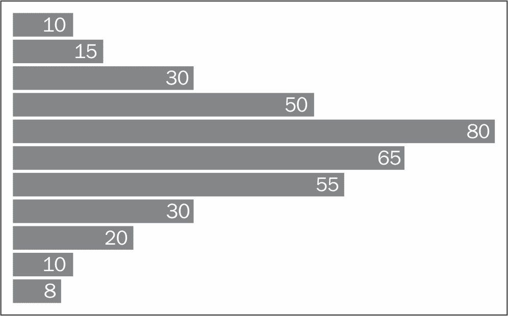

数据作为数组

## 它是如何工作的...

在这个例子中，数据（在这种情况下是一个整数列表）存储在简单的 JavaScript 数组中，如前述代码中的第 `A` 行所示。`render` 函数在第 `B` 行标记的位置定义，以便它可以被重复调用以更新我们的可视化。选择从标记为 `C` 的行开始，它选择网页上所有具有 `h-bar` CSS 类的 `div` 元素。你可能想知道为什么我们要选择这些 `div` 元素，因为它们甚至还没有在网页上存在。这实际上是正确的；然而，在这个阶段的选择是用来定义我们在介绍中讨论的视觉集。通过发出我们在上一行所做的选择，我们实际上声明网页上应该有一组 `div.h-bar` 元素来形成我们的视觉集。在第 `D` 行，我们调用初始选择上的 `data` 函数，将数组作为我们的数据集绑定到即将创建的视觉元素上。一旦定义了两个集合，第 `E` 行的 `enter()` 函数就可以用来选择所有尚未可视化的数据元素。当 `render` 函数第一次被调用时，它返回数据数组中的所有元素，如下面的代码片段所示：

```js
        var bars = d3.select("body") 
                       .selectAll("div.h-bar") // <- C 
                       .data(data); // Update <- D 
        // Enter 
        bars.enter() // <- E 
            .append("div") // <- F 
            .attr("class", "h-bar") // <- G 

```

在第 `F` 行，创建了一个新的 `div` 元素并将其附加到 `enter` 函数中选中的每个数据元素的 `body` 元素上；这实际上为每个数据创建了一个 `div` 元素。最后，在第 `G` 行，我们将它的 CSS 类设置为 `h-bar`。到这一点，我们基本上创建了可视化的大纲，包括空的 `div` 元素。下一步是根据给定数据更改元素的可视属性。

### 小贴士

D3 向 DOM 元素注入了一个名为 `__data__` 的属性，使数据与视觉元素粘合，因此当使用修改后的数据集进行选择时，D3 可以正确地计算差异和交集。如果你使用调试器或以编程方式检查 DOM 元素，可以轻松地看到这个属性。

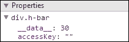

如前面的截图所示，这在调试时非常有用。

在下面的代码片段中，在第 `H` 行调用了合并函数，并将选择项作为其参数。这个函数调用实际上是将进入选择项与更新选择项合并，并返回两个选择项的并集，从而允许我们为进入和更新场景链式调用修饰符。如果没有合并函数，我们需要为进入和更新场景重复这段代码。然后，在第 `I` 行，我们应用了一个动态样式属性 `width`，其值是每个视觉元素关联的整数值的三倍，如下面的代码片段所示：

```js
        bars.enter() // <- E 
                .append("div") // <- F 
                    .attr("class", "h-bar") // <- G 
            .merge(bars) // Enter + Update <- H 
                .style("width", function (d) { 
                    return (d * 3) + "px"; // <- I 
                }) 
                .text(function (d) { 
                    return d; // <- J 
                }); 

```

所有 D3 修饰函数都接受这种动态函数来实时计算其值。这正是“数据驱动”您的可视化的含义。因此，了解这个函数在我们例子中的设计目的是至关重要的。这个函数接收一个参数`d`，它是与当前元素关联的数值。在我们的例子中，第一个`div`条形图具有与其数据关联的值`10`，第二个条形图有`15`，依此类推。因此，这个函数本质上计算每个条形图数值的三倍，并将其作为像素宽度的元素`width`返回。而在第`J`行，我们使用了类似的方法来更改`div`元素的文本内容，将其设置为与每个元素关联的数据值。

### 注意

动态修饰函数实际上接受两个参数，`d`和`i`。第一个参数`d`是我们刚才讨论的关联数据，`i`是当前元素的零基于索引号。前一章的一些食谱依赖于这个索引，在本章的其余部分，我们将探讨其他利用这个索引以不同方式使用的食谱。

以下是更新过程产生的原始 HTML 代码：

```js
<div class="h-bar" style="width: 30px;"> 
    10 
</div> 
<div class="h-bar" style="width: 45px;"> 
    15 
</div> 
.... 
<div class="h-bar" style="width: 24px;"> 
    8 
</div> 

```

以下最后部分，即“退出”部分，相当简单：

```js
bars.exit() // <- K 
    .remove(); 

```

### 注意

`exit()`函数返回的选择集就像任何其他选择集一样。因此，尽管`remove`是针对`exit`选择集最常用的操作，但您也可以将其他修饰符或过渡应用到这个选择集上。我们将在后面的章节中探讨一些这些选项。

在前面的代码片段的第`K`行，调用了`exit()`函数来计算不再与任何数据关联的所有视觉元素集合的差集。最后，在这个选择集上调用`remove()`函数来移除由`exit()`函数选中的所有元素。这样，只要您在更改我们的数据后调用`render()`函数，您就可以始终确保我们的视觉表示和数据保持同步。

现在，让我们按照以下方式实现最后一段代码：

```js
setInterval(function () { // <- L 
        data.shift(); 
        data.push(Math.round(Math.random() * 100)); 
        render(data); 
    }, 1500); 

```

在第`L`行，创建了一个简单的匿名函数，使用`shift`函数移除数据数组中的顶部元素，并使用`push()`函数每 1.5 秒向数据数组中添加一个随机整数。一旦数据数组更新，再次调用`render()`函数来更新我们的可视化，以保持与新的数据集同步。这就是我们的例子具有动画条形图外观的原因。

# 将对象字面量绑定到数据

对于更复杂的数据可视化，数据数组中的每个元素可能不仅是一个原始整数或字符串，而是一个 JavaScript 对象本身。在本食谱中，我们将讨论如何利用这种更复杂的数据结构来使用 D3 驱动您的可视化。

## 准备工作

在您的网页浏览器中打开以下文件的本地副本：

[`github.com/NickQiZhu/d3-cookbook-v2/blob/master/src/chapter3/object-as-data.html`](https://github.com/NickQiZhu/d3-cookbook-v2/blob/master/src/chapter3/object-as-data.html) .

## 如何实现...

当你在网络上加载数据源时，JavaScript 对象字面量可能是你遇到的最常见的数 据结构。在本示例中，我们将探讨如何利用这些 JavaScript 对象生成丰富的可视化。以下代码展示了如何实现：

```js
var data = [ // <- A 
        {width: 10, color: 23},{width: 15, color: 33}, 
        {width: 30, color: 40},{width: 50, color: 60}, 
        {width: 80, color: 22},{width: 65, color: 10}, 
        {width: 55, color: 5},{width: 30, color: 30}, 
        {width: 20, color: 60},{width: 10, color: 90}, 
        {width: 8, color: 10} 
    ]; 

    var colorScale = d3.scaleLinear() 
        .domain([0, 100]) 
        .range(["#add8e6", "blue"]); // <- B 
    function render(data) { 
        var bars = d3.select("body").selectAll("div.h-bar") 
                .data(data); // Update 
        // Enter 
        bars.enter() 
                .append("div") 
                .attr("class", "h-bar") 
                .merge(bars) // Enter + Update 
                .style("width", function (d) { // <- C 
                    return (d.width * 5) + "px"; // <- D 
                }) 
                .style("background-color", function(d){ 
                    return colorScale(d.color); // <- E 
                }) 
                .text(function (d) { 
                    return d.width; // <- F 
                }); 
        // Exit 
        bars.exit().remove(); 
    } 
    function randomValue() { 
        return Math.round(Math.random() * 100); 
    } 
    setInterval(function () { 
        data.shift(); 
        data.push({width: randomValue(), color: randomValue()}); 
        render(data); 
    }, 1500); 
    render(data); 

```

本示例生成了以下可视化：

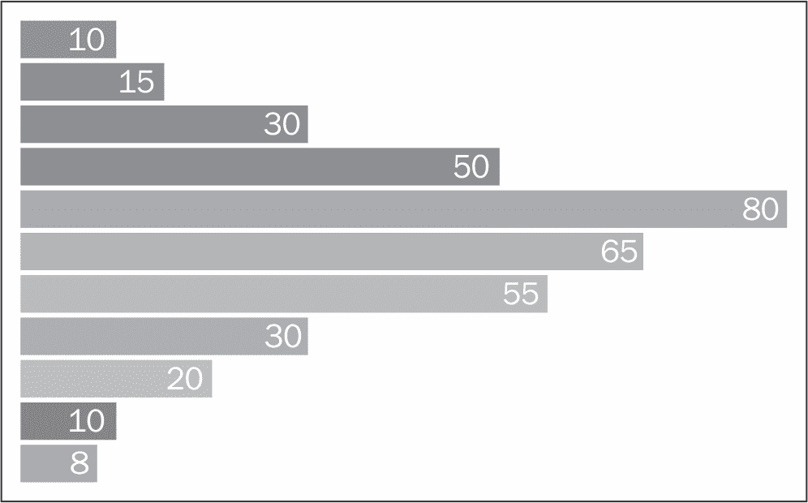

数据作为对象

### 注意

本示例建立在之前的示例之上，所以如果你不熟悉基本的 enter-update-exit 选择模式，请先查看之前的示例。

## 工作原理...

在本示例中，与上一个示例中显示的简单整数不同，现在我们的数据数组填充了对象（参看带有箭头的标记为 `A` 的行）。每个数据对象包含两个属性：`width` 和 `color`，在这个例子中这两个属性都是整数：

```js
        {width: 10, color: 23}, 
        {width: 15, color: 33}, 
... 
        {width: 8, color: 10} 
    ]; 

```

### 注意

在第 `B` 行，我们定义了一个看起来很复杂的 `color` 比例：`...` `.range(["#add8e6", "blue"]); // <- B` `...` 包括颜色比例在内的比例将在下一章中深入讨论，所以现在让我们假设这是一个我们可以使用它来生成 CSS 兼容颜色代码的比例函数，给定一些整数输入值。这对于本示例的目的来说已经足够了。

与上一个示例相比，主要区别在于处理数据的方式，如下面的代码片段中第 `C` 行所示：

```js
function (d) { // <- C 
    return (d.width * 5) + "px"; // <- D 
} 

```

如前述代码片段所示，在本示例中，与每个视觉元素关联的实际上是对象，而不是整数。因此，我们可以在第 `D` 行访问 `d.width` 属性。

### 注意

如果你的对象有自己的函数，你还可以在这里通过动态修改函数访问它们。这是在数据源中添加一些特定数据辅助函数的方便方式。然而，请注意，由于动态函数通常在可视化过程中被多次调用，因此你依赖的函数应该尽可能高效地实现。如果这不可能，那么在将数据绑定到可视化过程之前预处理你的数据是最好的选择。

同样，在下面的代码片段中第 `E` 行，可以使用我们之前定义的颜色比例的 `d.color` 属性来计算 `background-color` 样式：

```js
.style("background-color", function(d){ 
  return colorScale(d.color); // <- E 
}) 
.text(function (d) { 
  return d.width; // <- F 
}); 

```

再次，在第 `F` 行，我们将每个条形的文本设置为显示其宽度。

这个示例展示了如何使用与上一示例中讨论的完全相同的方法轻松地将 JavaScript 对象绑定到视觉元素。这是 D3 库最强大的功能之一；它允许您重用相同的模式和方 法来处理不同类型的数据，无论是简单还是复杂。我们将在下一示例中看到更多关于这个主题的例子。

# 将函数作为数据绑定

D3 对函数式 JavaScript 编程的优秀支持之一是它允许将函数视为数据。这种特定功能在某些情况下可以提供一些非常强大的功能。这是一个更高级的菜谱。如果你是 D3 的新手，并且一开始理解起来有些困难，请不要担心。随着时间的推移，这种函数式编程的使用将变得自然。

## 准备工作

在您的网络浏览器中打开以下文件的本地副本：

[`github.com/NickQiZhu/d3-cookbook-v2/blob/master/src/chapter3/function-as-data.html`](https://github.com/NickQiZhu/d3-cookbook-v2/blob/master/src/chapter3/function-as-data.html) .

## 如何操作...

在这个菜谱中，我们将探讨将函数作为数据绑定到您的视觉元素上的可能性。如果正确使用，这种功能非常强大且灵活：

```js
<div id="container"></div> 

<script type="text/javascript"> 
    var data = []; // <- A 
    var datum = function (x) { // <- B 
        return 15 + x * x; 
    }; 

    var newData = function () { // <- C 
        data.push(datum); 
        return data; 
    }; 
    function render(){ 
        var divs = d3.select("#container") 
                    .selectAll("div") 
                    .data(newData); // <- D 
        divs.enter().append("div").append("span"); 
        divs.attr("class", "v-bar") 
            .style("height", function (d, i) { 
                return d(i) + "px"; // <- E 
            }) 
            .select("span") // <- F 
                .text(function(d, i){  
                    return d(i); // <- G 
                }); 
        divs.exit().remove(); 
    } 

    setInterval(function () { 
        render(); 
    }, 1000); 
    render(); 
</script> 

```

以下代码生成了以下条形图：

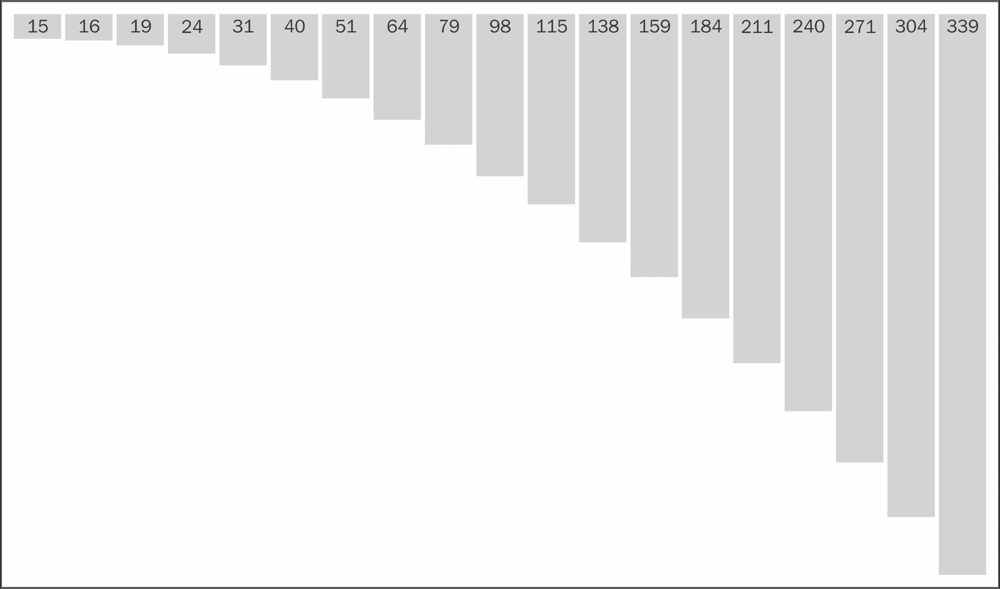

数据作为函数

## 它是如何工作的...

在这个菜谱中，我们选择使用一系列垂直条来可视化公式`15 + x * x`的输出，每个条形上都有其代表的积分值。这种可视化每 1.5 秒在之前的条形右侧添加一个新的条形。当然，我们可以使用我们在前两个菜谱中讨论的技术来实现这种可视化，其中我们使用公式生成一个整数数组，然后在每 1.5 秒重新渲染可视化之前，从*n*到*n+1*追加一个新的整数。然而，在这个菜谱中，我们决定采取更函数式的方法。

这次我们在行`A`上从一个空的数据数组开始。在行`B`上，定义了一个简单的`datum`函数来计算公式`15+x²`的结果。然后，在行`C`上，创建了一个名为`newData`的另一个函数来生成当前数据集，该数据集包含对`next`函数的*n+1*个引用。以下是一个函数数据定义的代码：

```js
    var data = []; // <- A 
    var datum = function (x) { // <- B 
        return 15 + x * x; 
    }; 

    var newData = function () { // <- C 
        data.push(datum); 
        return data; 
    }; 

```

这种设置似乎很奇怪，但为了达到我们的目标。让我们看看我们如何利用所有这些函数在我们的可视化代码中。在行`D`，我们将数据绑定到`div`元素的选择上，就像我们在之前的菜谱中所做的那样。然而，这次数据不是一个数组，而是`newData`函数：

```js
        var divs = d3.select("#container") 
                   .selectAll("div") 
                   .data(newData); // <- D 

```

当涉及到数据时，D3 非常灵活。如果你向`data`函数提供一个函数，D3 将简单地调用给定的函数，并使用该函数返回的值作为`data`函数的参数。在这种情况下，`newData`函数返回的数据是一个函数引用数组。因此，现在在我们的动态修改函数中，在行`E`和`G`上，传递给这些函数的`datum` `d`实际上是对`next`函数的引用，如下面的代码所示：

```js
         divs.attr("class", "v-bar") 
            .style("height", function (d, i) { 
                return d(i) + "px"; // <- E 
            }) 
            .select("span") // <- F 
                .text(function(d, i){  
                    return d(i); // <- G 
                });  

```

作为函数的引用，`d`现在可以用索引`i`作为参数调用，这将生成我们可视化所需的公式输出。

### 注意

在 JavaScript 中，函数是特殊对象，因此从语义上讲，这与绑定对象作为数据完全相同。此外，数据也可以被视为函数。例如，整数等常量值可以被视为一个恒等函数，它只是返回它接收的内容，而不进行任何修改。

这种技术可能不是可视化中最常用的技术；但使用得当，它非常灵活且强大，尤其是在您有一个流动的数据集时。

### 注意

数据函数通常需要是*幂等的*才有意义。幂等性是指能够多次应用相同的函数和相同的输入，而不会改变结果（除了初始应用之外）。有关幂等的更多详细信息，请访问[`en.wikipedia.org/wiki/Idempotence`](http://en.wikipedia.org/wiki/Idempotence)。

# 处理数组

我们的大部分数据都存储在数组中，我们花费大量精力处理数组以格式化和重构数据。这就是为什么 D3 提供了一套丰富的面向数组的实用函数，使得这项任务变得容易得多。在本配方中，我们将探讨这方面的某些最常见和有用的实用函数。

## 准备工作

在您的网络浏览器中打开以下文件的本地副本：

[`github.com/NickQiZhu/d3-cookbook-v2/blob/master/src/chapter3/working-with-array.html`](https://github.com/NickQiZhu/d3-cookbook-v2/blob/master/src/chapter3/working-with-array.html)。

## 如何做...

以下代码示例展示了 D3 库提供的某些最常见和有用的数组实用函数及其效果：

```js
<script type="text/javascript"> 
    // Static html code were omitted due to space constraint 

    var array = [3, 2, 11, 7, 6, 4, 10, 8, 15]; 
    d3.select("#min").text(d3.min(array)); 
    d3.select("#max").text(d3.max(array)); 
    d3.select("#extent").text(d3.extent(array)); 
    d3.select("#sum").text(d3.sum(array)); 
    d3.select("#median").text(d3.median(array)); 
    d3.select("#mean").text(d3.mean(array)); 
    d3.select("#quantile").text( 
            d3.quantile(array.sort(d3.ascending), 0.25) 
    ); 
    d3.select("#deviation").text(d3.deviation(array)); 
    d3.select("#asc").text(array.sort(d3.ascending)); 
    d3.select("#desc").text(array.sort(d3.descending)); 
    d3.select("#bisect").text( 
        d3.bisect(array.sort(d3.ascending), 6) 
    ); 
    var records = [ 
        {quantity: 2, total: 190, tip: 100, type: "tab"}, 
        {quantity: 2, total: 190, tip: 100, type: "tab"}, 
        {quantity: 1, total: 300, tip: 200, type: "visa"}, 
        {quantity: 2, total: 90, tip: 0, type: "tab"}, 
        {quantity: 2, total: 90, tip: 0, type: "tab"}, 
        {quantity: 2, total: 90, tip: 0, type: "tab"}, 
        {quantity: 1, total: 100, tip: 0, type: "cash"}, 
        {quantity: 2, total: 90, tip: 0, type: "tab"}, 
        {quantity: 2, total: 90, tip: 0, type: "tab"}, 
        {quantity: 2, total: 90, tip: 0, type: "tab"}, 
        {quantity: 2, total: 200, tip: 0, type: "cash"}, 
        {quantity: 1, total: 200, tip: 100, type: "visa"} 
    ]; 
    var nest = d3.nest() 
            .key(function (d) { // <- A 
                return d.type; 
            }) 
            .key(function (d) { // <- B 
                return d.tip; 
            }) 
            .entries(records); // <- C 
    d3.select("#nest").html(printNest(nest, "")); 

    // Utility function to generate HTML  
    // representation of nested tip data  
    function printNest(nest, out, i) { 
        """""""" 

    }"""""""" 
</script>  

```

上述代码产生以下输出：

```js
d3.min => 2 
d3.max => 15 
d3.extent => 2,15 
d3.sum => 66 
d3.median => 7 
d3.mean => 7.333333333333333 
array.sort(d3.ascending) => 2,3,4,6,7,8,10,11,15 
array.sort(d3.descending) => 15,11,10,8,7,6,4,3,2 
d3.quantile(array.sort(d3.ascending), 0.25) => 4 
d3.deviation(array) => 4.18 
d3.bisect(array.sort(d3.ascending), 6) => 4 

tab 
 100 
  {quantity: 2, total: 190, tip: 100, type: tab, } 
  {quantity: 2, total: 190, tip: 100, type: tab, } 
 0 
   {quantity: 2, total: 90, tip: 0, type: tab, } 
   {quantity: 2, total: 90, tip: 0, type: tab, } 
   {quantity: 2, total: 90, tip: 0, type: tab, } 
   {quantity: 2, total: 90, tip: 0, type: tab, } 
   {quantity: 2, total: 90, tip: 0, type: tab, } 
   {quantity: 2, total: 90, tip: 0, type: tab, } 
visa 
  200 
   {quantity: 1, total: 300, tip: 200, type: visa, } 
  100 
    {quantity: 1, total: 200, tip: 100, type: visa, } 
cash, } 
   0 
    {quantity: 1, total: 100, tip: 0, type: cash, } 
    {quantity: 2, total: 200, tip: 0, type: cash, } 

```

## 它是如何工作的...

D3 提供了一系列实用函数来帮助在 JavaScript 数组上执行操作。其中大多数都很直观且简单；然而，也有一些是内在的。我们将在本节中简要讨论它们。

给定我们的数组`[3, 2, 11, 7, 6, 4, 10, 8, 15]`，以下将是其实用函数：

+   `d3.min`：此函数检索最小元素，即`2`。

+   `d3.max`：此函数检索最大元素，即`15`。

+   `d3.extent`：此函数检索最小和最大元素，即`[2, 15]`。

+   `d3.sum`：此函数检索数组中所有元素的总和，即`66`。

+   `d3.median`：此函数找到中位数，即`7`。

+   `d3.mean`：此函数计算平均值，即`7.33`。

+   `d3.ascending`/`d3.descending`：`d3`对象包含一个内置的比较函数，您可以使用它来对 JavaScript 数组进行排序：

```js
     d3.ascending = function(a, b) {  return a < b ? -1 : a >  
       b ? 1 : 0; } 
     d3.descending = function(a, b) {  return b < a ? -1 : b  
       > a ? 1 : 0; } 

```

+   `d3.quantile`：此函数计算已按升序排序的数组上的分位数，例如，`0.25`的分位数将是`4`。

+   `d3.deviation`：此函数计算数组的标准差，在我们的例子中将是`4.18`。

+   `d3.bisect`：此函数在已排序数组中找到一个插入点，该点位于任何现有元素之后（右侧），即`bisect`（数组，`6`）将产生`4`。

+   `d3.nest`：D3 的`nest`函数可以用来构建一个算法，将基于平铺数组的结构转换为适合某些类型可视化的层次嵌套结构。D3 的`nest`函数可以通过连接到`nest`的键函数进行配置，如`A`和`B`行所示：

```js
         var nest = d3.nest() 
                 .key(function (d) { // <- A 
                     return d.type; 
                 }) 
                 .key(function (d) { // <- B 
                     return d.tip; 
                 }) 
                 .entries(records); // <- C 

```

+   可以提供多个`key`函数以生成多个嵌套级别。在我们的例子中，嵌套由两个级别组成，首先是按`type`金额，然后是按`tip`金额，如下面的输出所示：

```js
     tab 
      100 
       {quantity: 2, total: 190, tip: 100, type: tab, } 
       {quantity: 2, total: 190, tip: 100, type: tab, } 

```

+   最后，使用`entries()`函数提供与`C`行上显示的基于平铺数组的数据集。

# 数据过滤

假设您需要根据关联的数据元素过滤 D3 选择，以便可以根据用户的输入隐藏或显示不同的子数据集。D3 选择提供了一个过滤函数来执行这种数据驱动的过滤。在这个菜谱中，我们将向您展示如何利用这种方式以数据驱动的方式过滤视觉元素。

## 准备工作

在您的网络浏览器中打开以下文件的本地副本：

[`github.com/NickQiZhu/d3-cookbook-v2/blob/master/src/chapter3/data-filter.html`](https://github.com/NickQiZhu/d3-cookbook-v2/blob/master/src/chapter3/data-filter.html) .

## 如何做...

以下示例代码显示了如何利用数据过滤来根据其分类突出显示不同的视觉元素：

```js
<script type="text/javascript"> 
    var data = [ // <-A 
        {expense: 10, category: "Retail"}, 
        {expense: 15, category: "Gas"}, 
        {expense: 30, category: "Retail"}, 
        {expense: 50, category: "Dining"}, 
        {expense: 80, category: "Gas"}, 
        {expense: 65, category: "Retail"}, 
        {expense: 55, category: "Gas"}, 
        {expense: 30, category: "Dining"}, 
        {expense: 20, category: "Retail"}, 
        {expense: 10, category: "Dining"}, 
        {expense: 8, category: "Gas"} 
    ]; 
    function render(data, category) { 
        var bars = d3.select("body").selectAll("div.h-bar") // <-B 
                .data(data); 
        // Enter 
        bars.enter() 
            .append("div") // <-C 
                .attr("class", "h-bar") 
                .style("width", function (d) { 
                    return (d.expense * 5) + "px";} 
                ) 
                .append("span") // <-D 
                .text(function (d) { 
                    return d.category; 
                }); 
        // Update 
        d3.selectAll("div.h-bar").attr("class", "h-bar"); 
        // Filter 
        bars.filter(function (d, i) { // <-E 
                return d.category == category; 
            }) 
            .classed("selected", true); 
    } 
    render(data); 
    function select(category) { 
        render(data, category); 
    } 
</script> 

<div class="control-group"> 
    <button onclick="select('Retail')"> 
        Retail 
    </button> 
    <button onclick="select('Gas')"> 
        Gas 
    </button> 
    <button onclick="select('Dining')"> 
        Dining 
    </button> 
    <button onclick="select()"> 
        Clear 
    </button> 
</div> 

```

当您点击**Dining**按钮时，前面的代码将生成以下视觉输出：

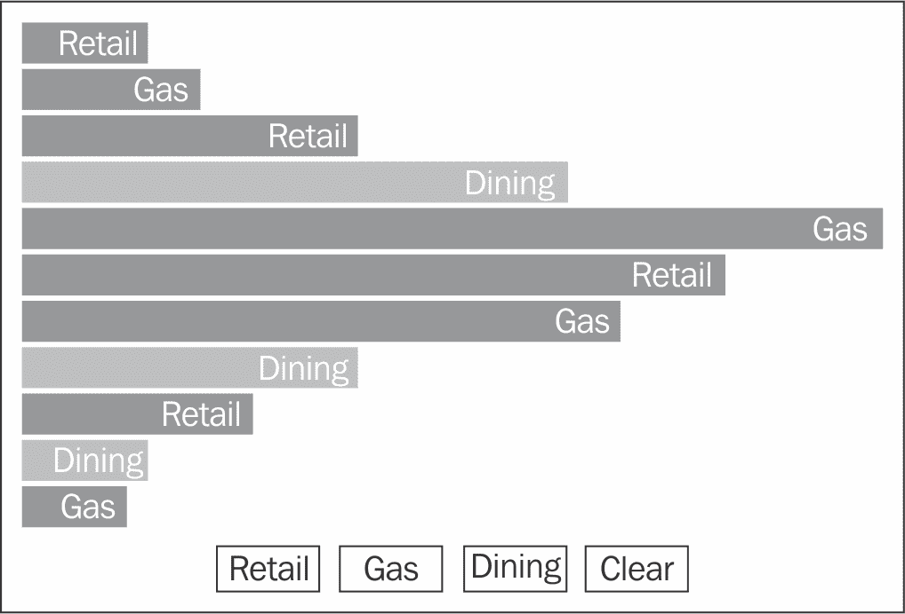

数据过滤

## 工作原理...

在这个菜谱中，我们有一个数据集，它包含一系列个人消费记录，以`expense`和`category`作为属性，这显示在标记为`A`的代码块中。在`B`、`C`和`D`行，使用标准的 enter-update-exit 模式创建了一组水平条形图（HTML `div`），以表示消费记录。到目前为止，这个菜谱与*绑定对象字面量作为数据*菜谱类似。现在让我们看看`E`行：

```js
bars.filter(function (d, i) { // <-E 
    return d.category == category; 
}).classed("selected", true); 

```

D3 的`selection.filter`函数接受一个函数作为其参数。它将函数应用于现有选择中的每个元素。`filter`提供的函数有两个参数，具有隐藏的`this`引用：

+   `d`：它是与当前元素关联的数据

+   `i`：它是当前元素的零基索引

+   `this`：这具有对当前 DOM 元素的隐藏引用点

D3 的`selection.filter`函数期望给定的函数返回一个布尔值。如果返回值为`true`，则相应的元素将被包含在由`filter`函数返回的新选择集中。在我们的例子中，`filter`函数实际上选择了所有与用户选择的类别匹配的条形，并将 CSS 类`selected`应用于它们。这种方法为你提供了一种强大的方式来过滤和生成数据驱动的子选择集，你可以进一步操作或分解以生成专注的可视化。

### 注意

D3 的`selection.filter`函数将返回的值作为 JavaScript 中的*真值*和*假值*测试处理，因此并不期望严格的布尔值。这意味着`false`、`null`、`0`、`""`、`undefined`和**NaN**（非数字）都被视为`false`，而其他东西被认为是`true`。

# 数据排序

在许多情况下，根据所代表的数据对视觉元素进行排序是可取的，这样你可以通过视觉方式突出不同元素的重要性。在本食谱中，我们将探讨如何在 D3 中实现这一点。

## 准备工作

在你的网络浏览器中打开以下文件的本地副本：

[`github.com/NickQiZhu/d3-cookbook-v2/blob/master/src/chapter3/data-sort.html`](https://github.com/NickQiZhu/d3-cookbook-v2/blob/master/src/chapter3/data-sort.html) .

## 如何操作...

让我们看看如何使用 D3 执行数据驱动的排序和进一步的操作。在这个例子中，我们将根据用户输入对之前食谱中创建的条形图进行排序，基于支出（宽度）或类别：

```js
<script type="text/javascript"> 
    var data = [ // <-A 
        {expense: 10, category: "Retail"}, 
        {expense: 15, category: "Gas"}, 
        {expense: 30, category: "Retail"}, 
        {expense: 50, category: "Dining"}, 
        {expense: 80, category: "Gas"}, 
        {expense: 65, category: "Retail"}, 
        {expense: 55, category: "Gas"}, 
        {expense: 30, category: "Dining"}, 
        {expense: 20, category: "Retail"}, 
        {expense: 10, category: "Dining"}, 
        {expense: 8, category: "Gas"} 
    ]; 
    function render(data, comparator) { 
        var bars = d3.select("body").selectAll("div.h-bar") // <-B 
                .data(data); 
        // Enter 
        bars.enter().append("div") // <-C 
                .attr("class", "h-bar") 
                .append("span"); 
        // Update 
        d3.selectAll("div.h-bar") // <-D 
                .style("width", function (d) { 
                    return (d.expense * 5) + "px"; 
                }) 
                .select("span") 
                .text(function (d) { 
                    return d.category; 
                }); 
        // Sort 
        if(comparator) 
            bars.sort(comparator); // <-E 
    } 
    var compareByExpense = function (a, b) {  // <-F 
        return a.expense < b.expense?-1:1; 
    }; 
    var compareByCategory = function (a, b) {  // <-G 
        return a.category < b.category?-1:1; 
}; 

    render(data); 

    function sort(comparator) { 
        render(data, comparator); 
    } 
</script> 

<div class="control-group"> 
    <button onclick="sort(compareByExpense)"> 
        Sort by Expense 
    </button> 
    <button onclick="sort(compareByCategory)"> 
        Sort by Category 
    </button> 
    <button onclick="sort()"> 
        Reset 
    </button> 
</div> 

```

上述代码生成了如下截图所示的排序后的水平条形：

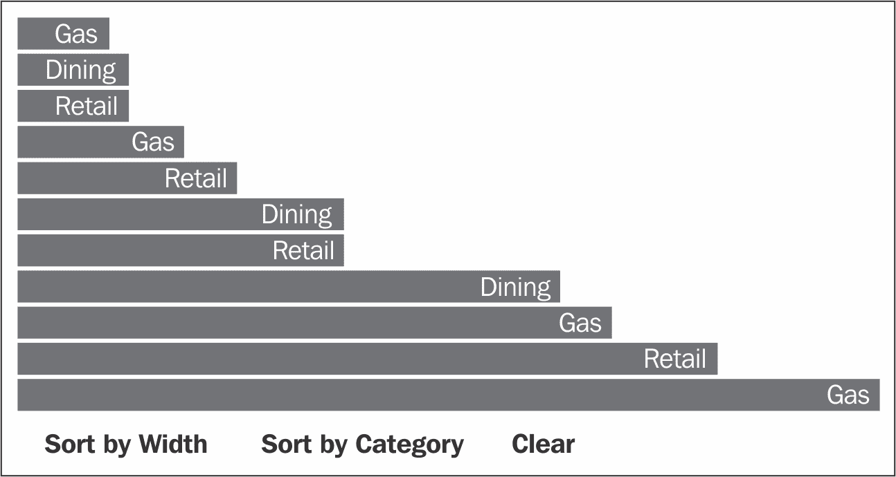

基于数据的排序

## 工作原理...

在本食谱中，我们设置了一个简单的基于行的可视化（在`B`、`C`和`D`行），包含两个属性`expense`和`category`，这些属性在`A`行定义。这几乎与之前的食谱完全相同，并且与我们之前在*绑定对象字面量作为数据*食谱中所做的非常相似。一旦完成基本操作，我们就在`E`行选择所有现有的条形，并使用 D3 的`selection.sort`函数进行排序：

```js
        // Sort 
        if(comparator) 
            bars.sort(comparator); // <-E 

```

`selection.sort`函数接受一个比较函数：

```js
var compareByExpense = function (a, b) {  // <-F 
    return a.expense < b.expense?-1:1; 
}; 
var compareByCategory = function (a, b) {  // <-G 
    return a.category < b.category?-1:1; 
}; 

```

`comparator` 函数接收两个数据元素：`a` 和 `b`，进行比较，返回一个负数、正数或零值。如果值为负数，则 `a` 将被放置在 `b` 之前；如果为正数，则 `a` 将被放置在 `b` 之后；否则，`a` 和 `b` 被视为相等，顺序是任意的。`sort()` 函数返回一个新的选择集，其中所有元素按指定的比较函数确定的顺序排序。然后可以进一步操作这个新返回的选择集以生成所需的可视化。

### 注意

由于`a`和`b`在它们相等时被任意放置，D3 `selection.sort`不能保证是稳定的；然而，它保证与浏览器内置的数组`sort`方法一致。

# 从服务器加载数据

您可能很少只可视化静态本地数据。数据可视化的力量通常在于能够可视化由服务器端程序生成的动态数据。由于这是一个常见用例，D3 提供了一些方便的辅助函数，以尽可能简化这项任务。在本菜谱中，我们将了解如何动态加载远程数据集，并在加载后更新现有可视化。

## 准备工作

在您的网络浏览器中打开以下文件的本地副本：

[`github.com/NickQiZhu/d3-cookbook-v2/blob/master/src/chapter3/asyn-data-load.html`](https://github.com/NickQiZhu/d3-cookbook-v2/blob/master/src/chapter3/asyn-data-load.html) .

## 如何操作...

在`asyn-data-load.html`文件的代码示例中，我们将根据用户请求从服务器动态加载数据，一旦数据加载完成，我们还将更新我们的可视化以反映新的扩展数据集。以下是其实现代码：

```js
<div id="chart"></div> 

<script type="text/javascript"> 
    function render(data) { 
        var bars = d3.select("#chart").selectAll("div.h-bar") // <-A 
                .data(data); 
        bars.enter().append("div") // <-B 
            .attr("class", "h-bar") 
                .style("width", function (d) { 
                    return (d.expense * 5) + "px"; 
                }) 
            .append("span") 
                .text(function (d) { 
                    return d.category; 
                }); 
    } 
    function load(){ // <-C 
        d3.json("data.json", function(error, json){ // <-D 
            render(json); 
        }); 
    } 
</script> 

<div class="control-group"> 
    <button onclick="load()">Load Data from JSON feed</button> 
</div> 

```

下面是我们的`data.json`文件看起来像：

```js
[ 
 {"expense": 15,  "category": "Retail"}, 
 {"expense": 18,  "category": "Gas"}, 
 ... 
 {"expense": 15, "category": "Gas"} 
] 

```

在您点击**从 JSON 源加载数据**按钮一次后，此菜谱将生成以下视觉输出：

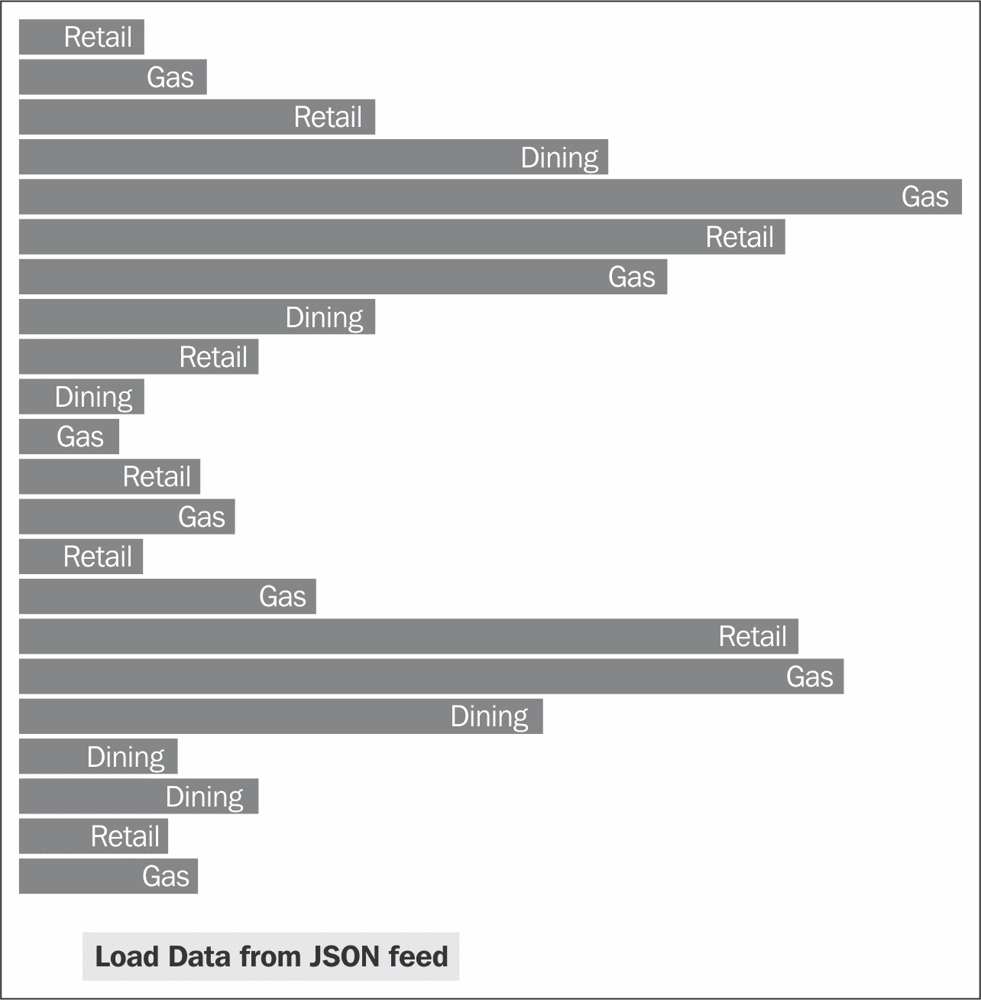

从服务器加载数据

## 工作原理...

在本菜谱中，我们创建了一个`render`函数来生成一个基于水平条的可视化，这与我们在上一两个菜谱中所做的工作非常相似。`load`函数定义在行`C`，它响应用户点击**从 JSON 源加载数据**按钮，从服务器加载来自单独文件（`data.json`）的数据。这是通过行`F`上显示的`d3.json`函数实现的：

```js
    function load(){ // <-C 
        d3.json("data.json", function(error, json){ // <-D 
            render(json); 
        }); 
    } 

```

由于从 JSON 文件加载远程数据集可能需要一些时间，因此它是异步执行的。一旦加载完成，数据集将被传递给在行`D`上定义的匿名回调函数。在这个函数中，我们只需将新加载的数据集传递给`render`函数，以便生成可视化。

### 注意

D3 还提供了类似的功能，使得加载 CSV、TSV、TXT、HTML 和 XML 数据变得简单。

如果需要更定制化和具体的控制，可以使用`d3.request`函数进一步自定义 MIME 类型和请求头。在幕后，`d3.json`和`d3.csv`都使用`d3.request`来生成实际请求。

### 注意

MIME 媒体类型是互联网上传输的文件格式的两部分标识符。常见的注册顶级类型包括：应用程序、文本、音频、图像、视频。

当然，这绝对不是从服务器加载远程数据的唯一方法。D3 并不规定如何从远程服务器加载数据。您可以使用您喜欢的 JavaScript 库，例如 jQuery 或 Zepto.js，发起 Ajax 请求并加载远程数据集。

# 使用队列进行异步数据加载

在这个菜谱中，我们将展示另一种在大型数据可视化项目中常用且非常有用的技术，用于处理或生成数据。在复杂的可视化项目中，通常在可视化之前，有必要从不同的来源加载和合并多个数据集。这种异步加载的挑战在于难以知道何时所有数据集都已成功加载，因为只有在那时可视化才能开始。D3 提供了一个非常方便的 `queue` 接口来帮助组织这些类型的异步任务，并帮助您协调它们，这也是本菜谱的焦点。

## 准备工作

在您的网络浏览器中打开以下文件的本地副本：

[`github.com/NickQiZhu/d3-cookbook-v2/blob/master/src/chapter3/queue.html`](https://github.com/NickQiZhu/d3-cookbook-v2/blob/master/src/chapter3/queue.html) .

## 如何做...

在 `queue.html` 文件的代码示例中，我们将使用 `setTimeout` 函数模拟加载和合并多个数据点。`setTimeout` 函数在设置的一段时间延迟后执行给定的函数；在我们的情况下，我们将延迟设置为 500 毫秒：

```js
<div id="chart"></div> 

<script type="text/javascript"> 
    function render(data) { 
        var bars = d3.select("#chart").selectAll("div.h-bar") // <-B 
                .data(data); 
        bars.enter().append("div") // <-C 
                .attr("class", "h-bar") 
                .style("width", function (d) { 
                    return (d.number) + "px"; 
                }) 
                .append("span") 
                .text(function (d) { 
                    return d.number; 
                }); 
    } 
    function generateDatum(callback) { 
        setInterval(function(){ 
            callback(null, {number: Math.ceil(Math.random() * 500)}); // <-D 
        }, 500); 
    } 
    function load() { // <-E 
        var q = d3.queue(); // <-F 
        for (var i = 0; i < 10; i++) 
            q.defer(generateDatum); // <-G 
        q.awaitAll(function (error, data) { // <-H 
            render(data); // <- I 
        }); 
    } 
</script> 

<div class="control-group"> 
    <button onclick="load()">Generate Data Set</button> 
</div> 

```

在点击**生成数据集**按钮后，此菜谱将生成以下输出：

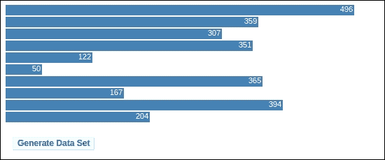

使用 D3 队列进行异步数据生成

## 它是如何工作的...

在这个菜谱中，我们有一个相当标准的 `render` 函数，它使用标准的 enter-update-exit 模式生成水平条形可视化，如第 `B` 行和 `C` 行所示。到目前为止，这个模式应该非常熟悉。然而，数据生成部分，这也是我们在这里关注的焦点，在这个菜谱中略有不同。在第 `D` 行，我们有一个简单的随机数据生成函数 `generateDatum(callback)`，它接收一个参数 callback。这是 D3 队列接口中任务函数的一个非常标准的模板，如下面的代码片段所示：

```js
function generateDatum(callback) { 
        setInterval(function(){ 
            callback(null, {number: Math.ceil(Math.random() * 500)}); // <-D 
        }, 500); 
} 

```

在这个函数中，我们使用 `setInterval` 函数以 500 毫秒的延迟模拟异步数据生成。每个任务函数可以在其主体中执行任意逻辑和计算，例如异步加载数据或计算结果。然而，一旦任务完成，它必须调用回调函数来通知队列它已完成其任务，并传递回结果，如第 `D` 行所示。回调函数接受两个参数：错误和结果；在这种情况下，我们传递 `null` 作为错误信号，因为它是通过第二个参数中的随机数成功完成的。在第 `E` 行，我们定义了 `load` 函数，该函数利用 `d3.queue` 来执行任务。让我们更详细地看看 `load` 函数：

```js
    function load() { // <-E 
        var q = d3.queue(); // <-F 
        for (var i = 0; i < 10; i++) 
            q.defer(generateDatum); // <-G 
            q.awaitAll(function (error, data) { // <-H 
            render(data); // <- I 
        }); 
    } 

```

可以使用 `d3.queue` 函数创建 D3 队列，如第 `F` 行所示。一旦创建，它可以使用 `defer` 函数注册任意数量的任务，如第 `G` 行所示。在我们的例子中，我们使用 `for` 循环在我们的队列中注册了 `10` 个异步随机数据生成任务，如第 `G` 行所示。

### 注意

D3 队列内部不提供多线程，如 **Web Worker** 所提供的。所有任务都是同步处理的；然而，任务函数可以执行，并且通常设计为执行异步任务，正如我们在这里所展示的。有关 Web Worker 的更多信息，请参阅 [`developer.mozilla.org/en-US/docs/Web/API/Web_Workers_API/Using_web_workers`](https://developer.mozilla.org/en-US/docs/Web/API/Web_Workers_API/Using_web_workers)。

在第 `H` 行显示的 `d3.queue.awaitAll` 函数用于等待所有任务完成。传递给 `awaitAll` 函数的回调函数将在所有任务完成或发生错误时（仅捕获并传递给回调的第一个错误）被调用。在我们的例子中，我们必须等待所有 10 个随机数据点成功生成后，才能调用渲染函数在第 `I` 行生成可视化。

### 提示

`d3.queue` 函数还接受一个参数来定义执行任务时允许的最大并发数。如果没有提供，则不对并发数进行限制。

在本章中，我们介绍了使用 D3 的基本方面——将数据绑定到视觉元素以及如何保持它们的同步。在此基础上，我们还涵盖了数据加载和处理的各种主题。在下一章中，我们将向读者介绍 D3 的另一个基本概念——刻度（scales），它为许多其他高级 D3 功能提供支持，例如动画和形状生成器等。
