# 第四章. 权衡轻重

在本章中，我们将涵盖：

+   使用连续尺度

+   使用时间尺度

+   使用序数尺度

+   插值字符串

+   插值颜色

+   插值复合对象

# 简介

作为数据可视化开发者，你将需要反复执行的关键任务之一是将数据域中的值映射到你的视觉域中；例如，将你最近购买的一块价值 453.00 美元的平板电脑映射为一个 653 像素长的条形，以及将你昨晚酒吧的消费 23.59 美元映射为一个 34 像素长的条形。在某种程度上，这就是数据可视化的全部内容，以高效和准确的方式将数据元素映射到它们的视觉隐喻。因为这是数据可视化和动画（动画将在第六章[Chapter 6. Transition with Style]“风格转换”中详细讨论）中绝对必要的任务，D3 提供了丰富且强大的支持，这是本章的重点。

## 尺度是什么？

D3 提供了各种称为“尺度”的结构来帮助你执行这种映射。对这些结构概念上的正确理解对于成为一名有效的可视化开发者至关重要。这是因为尺度不仅用于执行我们之前提到的映射，而且还作为许多其他 D3 结构（如过渡和坐标轴）的基本构建块。

*这些尺度究竟是什么？* 简而言之，尺度可以被视为数学上的*函数*。数学函数与在命令式编程语言（如 JavaScript 函数）中定义的函数不同。在数学中，函数被定义为两个集合之间的映射：

> *设 A 和 B 为非空集合。从 A 到 B 的函数 f 是将 B 中恰好一个元素分配给 A 中的每个元素。如果 b 是函数 f 分配给 A 中元素 a 的唯一元素，我们写作 f(a) = b。*
> 
> * -Rosen K. H. 2007*

尽管这个定义显得有些枯燥，但你仍然不禁注意到它如何巧妙地符合我们需要执行的任务，即从数据域映射到视觉域的元素。

我们在这里需要说明的另一个基本重要概念是给定函数的*定义域*和*值域*。

> *如果 f 是从 A 到 B 的函数，我们说 A 是 f 的定义域，B 是 f 的值域。如果 f(a) = b，我们说 b 是 a 的像，a 是 b 的原像。f 的值域或像是由 A 中所有元素的像组成的集合。如果 f 是从 A 到 B 的函数，我们说 f 将 A 映射到 B。*
> 
> *-Rosen K. H. 2007*

为了帮助我们理解这个概念，让我们看看以下插图：

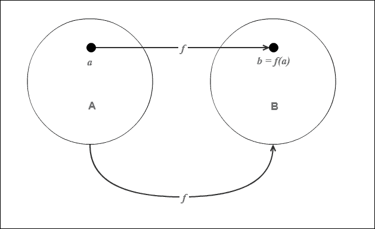

函数 f 将 A 映射到 B

如我们现在可以清楚地看到，在函数**f**的前一个示例中，定义域被设置为**A**，值域被设置为**B**。想象一下，如果集合**A**代表我们的数据域，而**B**代表视觉域，那么在这里定义的函数**f**本质上是一个 D3 中的比例尺，它将集合**A**中的元素映射到集合**B**。

### 注意

对于数学倾向的读者，数据可视化中的比例尺函数通常是单射，但不是*满射*函数。这是一个有用的见解，但不是本书目的的关键。因此，我们不会进一步讨论它。

既然我们已经讨论了 D3 中比例尺函数的概念定义，让我们看看它是如何帮助我们开发可视化项目的。

# 使用连续比例尺

在这个菜谱中，我们将检查 D3 提供的最常用的比例尺：将连续定量定义域映射到连续范围的连续比例尺，包括线性、幂、对数和时间比例尺。

## 准备工作

在您的网络浏览器中打开以下文件的本地副本：

[`github.com/NickQiZhu/d3-cookbook-v2/blob/master/src/chapter4/continuous-scales.html`](https://github.com/NickQiZhu/d3-cookbook-v2/blob/master/src/chapter4/continuous-scales.html) .

## 如何做...

让我们看看以下代码示例：

```js
<div id="linear" class="clear"><span>n</span></div> 
<div id="linear-capped" class="clear"> 
    <span>1 &lt;= a*n + b &lt;= 20</span> 
</div> 
<div id="pow" class="clear"><span>n²</span></div> 
<div id="pow-capped" class="clear"> 
    <span>1 &lt;= a*n² + b &lt;= 10</span> 
</div> 
<div id="log" class="clear"><span>log(n)</span></div> 
<div id="log-capped" class="clear"> 
    <span>1 &lt;= a*log(n) + b &lt;= 10</span> 
</div> 

<script type="text/javascript"> 
    var max = 11, data = []; 
    for (var i = 1; i < max; ++i) data.push(i); 

    var linear = d3.scaleLinear() // <-A 
        .domain([1, 10]) // <-B 
        .range([1, 10]); // <-C         
    var linearCapped = d3.scaleLinear() 
        .domain([1, 10])         
        .range([1, 20]); // <-D 

    var pow = d3.scalePow().exponent(2); // <-E 
    var powCapped = d3.scalePow() // <-F 
        .exponent(2) 
        .domain([1, 10]) 
        .rangeRound([1, 10]); // <-G 

    var log = d3.scaleLog(); // <-H 
    var logCapped = d3.scaleLog() // <-I 
        .domain([1, 10]) 
        .rangeRound([1, 10]); 

    function render(data, scale, selector) { 
        d3.select(selector).selectAll("div") 
                    .data(data) 
                .enter() 
                .append("div") 
                    .classed("cell", true) 
                    .style("display", "inline-block") 
                    .text(function (d) { 
                        return d3.format(".2")(scale(d), 2); 
                    }); 
    } 

    render(data, linear, "#linear"); 
    render(data, linearCapped, "#linear-capped"); 
    render(data, pow, "#pow"); 
    render(data, powCapped, "#pow-capped"); 
    render(data, log, "#log"); 
    render(data, logCapped, "#log-capped"); 
</script> 

```

前面的代码在您的浏览器中生成以下输出：

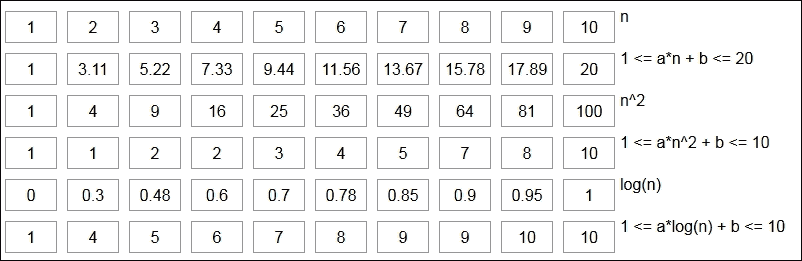

定量比例尺输出

## 它是如何工作的...

在这个菜谱中，我们展示了 D3 提供的一些最常见的比例尺。

### 线性比例尺

在前面的代码示例中，我们有一个数据数组，其中填充了从`1`到`10`的整数，如上面行`A`以上的 for 循环所示。我们通过调用`d3.scaleLinear()`函数创建了一个*线性比例尺*。这个函数返回一个默认定义域为`[0, 1]`和默认范围也为`[0, 1]`的线性定量比例尺函数。因此，默认比例尺本质上是一个*恒等函数*，对于数字来说并不那么有用，但通常需要通过其`domain`和`range`函数在行`B`和`C`上进行进一步定制。在这种情况下，我们将它们都设置为`[1, 10]`。这个比例尺基本上定义了函数*f(n) = n*，如下面的代码片段所示：

```js
    var linear = d3.scaleLinear() // <-A 
        .domain([1, 10]) // <-B 
        .range([1, 10]); // <-C         

```

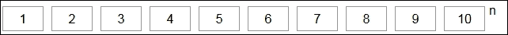

恒等比例尺

第二个线性比例尺更有趣一些，更好地说明了两个集合之间的映射。在行`D`上，我们将范围设置为`[1, 20]`，这与它的定义域不同。因此，现在这个函数本质上代表了以下方程：

+   *f(n) = a * n + b*

+   *1 <= f(n) <= 20*

这是在使用 D3 比例尺时最常见的情况，因为你的数据集将与你的视觉集完全匹配：

```js
    var linearCapped = d3.scaleLinear() 
        .domain([1, 10])         
        .range([1, 20]); // <-D 

```

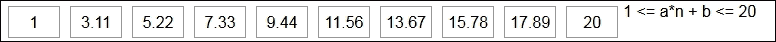

线性比例尺

在这个第二个比例尺中，D3 将自动计算并分配常数`a`和`b`的值以满足方程。

### 注意

一些基本的代数计算将告诉你，`a`大约是 2.11，`b`是-1.11，就像之前的例子一样。

### 功率尺度

我们创建的第二个尺度是一个*功率尺度*。在第`E`行，我们定义了一个具有`指数`为`2`的功率尺度。`d3.scalePow()`函数返回一个默认的功率尺度函数，其`指数`设置为`1`。这个尺度有效地定义了函数 *f(n) = n²*：

```js
    var pow = d3.scalePow().exponent(2); // <-E 

```

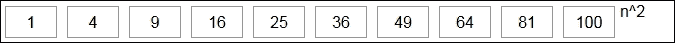

简单功率尺度

在第`F`行，定义了第二个功率尺度，这次在`G`行设置了不同的范围并进行了四舍五入；`rangeRound()`函数与`range()`函数几乎相同，它为尺度设置了范围。然而，`rangeRound`函数会四舍五入输出数字，使得没有小数部分。这非常方便，因为尺度通常用于将数据域中的元素映射到视觉域。因此，尺度的输出很可能是一个描述某些视觉特征的数字，例如像素数。避免子像素数是一种有用的技术，可以防止渲染时的反走样。

第二个功率尺度定义了以下函数，该函数在函数之后的代码中进行了演示：

*f(n) = a*n² + b, 1 <= f(n) <= 10*

```js
    var powCapped = d3.scalePow() // <-F 
        .exponent(2) 
        .domain([1, 10]) 
        .rangeRound([1, 10]); // <-G 

```

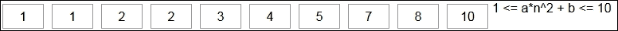

功率尺度

与线性尺度类似，D3 会自动找到合适的常数`a`和`b`，以满足在功率尺度上由`domain`和`range`定义的约束。

### 对数尺度

在第`H`行，使用`d3.scaleLog()`函数创建了一种第三种类型的定量尺度。默认的对数尺度有一个`base`为`10`。第`H`行实际上定义了以下数学函数 *f(n) = log(n)*，如下所示：

```js
    var log = d3.scale.log(); // <-H 

```

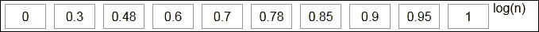

简单对数尺度

在第`I`行，我们自定义了对数尺度，使其域为`[1, 10]`，范围四舍五入为`[1, 10]`，这定义了以下约束数学函数 *f(n) = a*log(n) + b, 1 <= f(n) <= 10*。

```js
    var logCapped = d3.scaleLog() // <-I 
        .domain([1, 10]) 
        .rangeRound([1, 10]); 

```

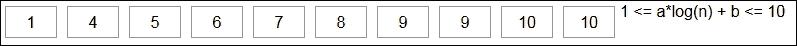

对数尺度

# 使用时间尺度

通常，我们将在具有时间和日期维度的数据集上创建可视化；因此，D3 提供了一个内置的时间尺度来帮助执行此类映射。在这个菜谱中，我们将学习如何使用 D3 时间尺度。

## 准备工作

在您的网络浏览器中打开以下文件的本地副本：

[`github.com/NickQiZhu/d3-cookbook-v2/blob/master/src/chapter4/time-scale.html`](https://github.com/NickQiZhu/d3-cookbook-v2/blob/master/src/chapter4/time-scale.html) .

## 如何操作...

首先，让我们看一下以下代码示例：

```js
<div id="time" class="clear"> 
    <span>Linear Time Progression<br></span> 
    <span>Mapping [01/01/2016, 12/31/2016] to [0, 1200]<br></span> 
</div> 

<script type="text/javascript"> 
    var start = new Date(2016, 0, 1), // <-A 
        end = new Date(2016, 11, 31), 
        range = [0, 1200], 
        time = d3.scaleTime().domain([start, end]) // <-B 
            .rangeRound(range), // <-C 
        max = 12, 
        data = []; 

    for (var i = 0; i < max; ++i){ // <-D 
        var date = new Date(start.getTime()); 
        date.setMonth(start.getMonth() + i); 
        data.push(date); 
    } 

    function render(data, scale, selector) { // <-E 
        d3.select(selector).selectAll("div.fixed-cell") 
                    .data(data) 
                .enter() 
                    .append("div") 
                        .classed("fixed-cell", true) 
                        .style("margin-left", function(d){ // <-F 
                            return scale(d) + "px"; 
                        }) 
                        .html(function (d) { // <-G 
                            var format = d3.timeFormat("%x"); // <-H 
                            return format(d) + "<br>" + scale(d) + "px"; 
                        }); 
    } 

    render(data, time, "#time"); 
</script> 

```

这个菜谱生成了以下视觉输出：

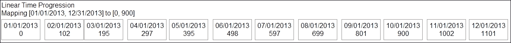

时间尺度

## 它是如何工作的...

在这个菜谱中，我们在第`A`行定义了一个`Date`范围，从 2016 年 1 月 1 日到 2016 年 12 月 31 日。

```js
var start = new Date(2016, 0, 1), // <-A 
        end = new Date(2016, 11, 31), 
        range = [0, 1200], 
        time = d3.scaleTime().domain([start, end]) // <-B 
            .rangeRound(range), // <-C 

```

### 注意

JavaScript `Date` 对象从 `0` 开始月份，从 `1` 开始日期。因此，`new Date(2016, 0, 1)` 将表示 2016 年 1 月 1 日，而 `new Date(2016, 0, 0)` 实际上表示 2015 年 12 月 31 日。

然后，我们使用 `d3.scaleTime` 函数在行 `B` 上创建了一个基于此范围的 D3 时间尺度。类似于其他连续尺度，时间尺度也支持单独的 `domain` 和 `range` 定义，用于将基于日期和时间的点映射到视觉范围。在这个例子中，我们将尺度的范围设置为 `[0, 900]`。这有效地定义了从 2016 年 1 月 1 日到 2016 年 12 月 31 日之间的任何日期和时间值到 0 到 900 之间的映射。

在定义了时间尺度之后，我们现在可以通过调用尺度函数来映射任何给定的 `Date` 对象，例如，`time(new Date(2016, 4, 1))` 将返回 `395`，`time(new Date(2016, 11, 15))` 将返回 `1147`，依此类推。

在以下代码中，在行 `D` 上，我们创建了一个包含 2013 年 1 月至 12 月的 12 个月份的数据数组，如下面的代码片段所示：

```js
    for (var i = 0; i < max; ++i){ // <-D 
        var date = new Date(start.getTime()); 
        date.setMonth(start.getMonth() + i); 
        data.push(date); 
    } 

```

然后，我们使用 `render` 函数创建了 12 个单元格，代表一年中的每个月份。

要水平展开单元格，行 `F` 执行从月份到我们定义的时间尺度的 `margin-left` CSS 样式的映射：

```js
.style("margin-left", function(d){ // <-F 
    return scale(d) + "px"; 
}) 

```

行 `G` 生成的标签展示了在这个例子中基于尺度映射产生的结果：

```js
.html(function (d) { // <-G 
    var format = d3.timeFormat("%x"); // <-H 
    return format(d) + "<br>" + scale(d) + "px"; 
}); 

```

要从 JavaScript `Date` 对象生成可读的字符串，我们在行 `H` 上使用了 D3 时间格式化器，它是 `d3.locale.format` 函数的别名。D3 随带一个强大且灵活的时间格式化库作为区域格式库的一部分，这在处理 `Date` 对象时非常有用。

## 还有更多...

以下是一些最有用的 `d3.locale.format` 模式：

+   `%a`: 这表示缩写的星期名称

+   `%A`: 这表示完整的星期名称

+   `%b`: 这表示缩写的月份名称

+   `%B`: 这表示完整的月份名称

+   `%d`: 这表示月份中的零填充的日期，以十进制数表示 `[01,31]`

+   `%e`: 这表示空格填充的月份中的日期，以十进制数表示 `[1,31]`

+   `%H`: 这表示小时（24 小时制）以十进制数表示 `[00,23]`

+   `%I`: 这表示小时（12 小时制）以十进制数表示 `[01,12]`

+   `%j`: 这表示年份中的天数，以十进制数表示 `[001,366]`

+   `%m`: 这表示月份，以十进制数表示 `[01,12]`

+   `%M`: 这表示分钟，以十进制数表示 `[00,59]`

+   `%L`: 这表示毫秒，以十进制数表示 `[000, 999]`

+   `%p`: 这表示上午或下午

+   `%S`: 这表示时间（以秒为单位）以十进制数表示 `[00,61]`

+   `%x`: 这表示日期，格式为 `%m/%d/%Y`

+   `%X`: 这表示时间，格式为 `%H:%M:%S`

+   `%y`: 这表示不带世纪的年份，以十进制数表示 `[00,99]`

+   `%Y`: 这表示带世纪的年份，以十进制数表示

## 参见

+   要了解 D3 本地格式模式的完整参考，请访问以下链接 - [`github.com/d3/d3-time-format/blob/master/README.md#locale_format`](https://github.com/d3/d3-time-format/blob/master/README.md#locale_format) 。

# 使用序数尺度

在某些情况下，我们可能需要将我们的数据映射到一些序数值，例如，`["a", "b", "c"]`或`["#1f77b4", "#ff7f0e", "#2ca02c"]`。那么，我们如何使用 D3 尺度执行这种映射呢？本食谱致力于回答这个问题。

## 准备工作

在您的网络浏览器中打开以下文件的本地副本：

[`github.com/NickQiZhu/d3-cookbook-v2/blob/master/src/chapter4/ordinal-scale.html`](https://github.com/NickQiZhu/d3-cookbook-v2/blob/master/src/chapter4/ordinal-scale.html) 。

## 如何操作...

这种序数映射在数据可视化中相当常见。例如，您可能希望通过分类将某些数据点映射到某些文本值或 RGB 颜色代码，这反过来又可以用于 CSS 样式。D3 提供了一种专门的尺度实现来处理这种映射。我们将在下面探讨其用法。以下是`ordinal-scale.html`文件的代码：

```js
<div id="alphabet" class="clear"> 
    <span>Ordinal Scale with Alphabet<br></span> 
    <span>Mapping [1..10] to ["a".."j"]<br></span> 
</div> 
<div id="category10" class="clear"> 
    <span>Ordinal Color Scale Category 10<br></span> 
    <span>Mapping [1..10] to category 10 colors<br></span> 
</div> 
<div id="category20" class="clear"> 
    <span>Ordinal Color Scale Category 20<br></span> 
    <span>Mapping [1..10] to category 20 colors<br></span> 
</div> 
<div id="category20b" class="clear"> 
    <span>Ordinal Color Scale Category 20b<br></span> 
    <span>Mapping [1..10] to category 20b colors<br></span> 
</div> 
<div id="category20c" class="clear"> 
    <span>Ordinal Color Scale Category 20c<br></span> 
    <span>Mapping [1..10] to category 20c colors<br></span> 
</div> 

<script type="text/javascript"> 
    var max = 10, data = []; 

    for (var i = 1; i <= max; ++i) data.push(i); // <-A 

    var alphabet = d3.scaleOrdinal() // <-B 
        .domain(data) 
        .range(["a", "b", "c", "d", "e", "f", "g", "h", "i", "j"]); 

    function render(data, scale, selector) { // <-C 
        var cells  = d3.select(selector).selectAll("div.cell") 
                .data(data); 

        cells.enter() 
                .append("div") 
                    .classed("cell", true) 
                    .style("display", "inline-block") 
                    .style("background-color", function(d){  // <-D 
                        return scale(d).indexOf("#") >=0 ?  
                                             scale(d) : "white"; 
                    }) 
                    .text(function (d) { // <-E 
                        return scale(d); 
                    }); 
    } 

    render(data, alphabet, "#alphabet"); // <-F 
render(data, d3.scaleOrdinal(d3.schemeCategory10),  
                                      "#category10"); 
render(data, d3.scaleOrdinal(d3.schemeCategory20),  
                                      "#category20"); 
render(data, d3.scaleOrdinal(d3.schemeCategory20b),  
                                      "#category20b"); 
render(data, d3.scaleOrdinal(d3.schemeCategory20c),  
                                      "#category20c"); // <-G 
</script> 

```

前面的代码在您的浏览器中输出以下内容：

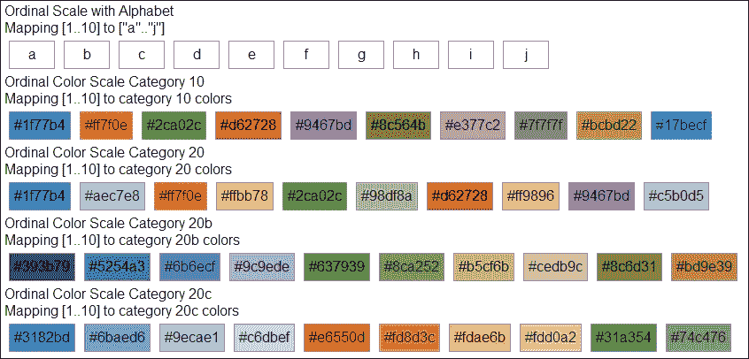

序数尺度

## 它是如何工作的...

在前面的代码示例中，第`A`行定义了一个简单的数据数组，包含从`0`到`9`的整数：

```js
for (var i = 0; i < max; ++i) data.push(i); // <-A     
var alphabet = d3.scaleOrdinal() // <-B 
    .domain(data) 
.range(["a", "b", "c", "d", "e", "f", "g", "h", "i", "j"]); 

```

然后，在第`B`行使用`d3.scaleOrdinal`函数创建了一个序数尺度。这个尺度的定义域被设置为我们的整数数组数据，而范围被设置为从`a`到`j`的字母列表。

定义了这个尺度后，我们可以通过简单地调用尺度函数来进行映射，例如，`alphabet(0)`将返回`a`，`alphabet(4)`将返回`e`，依此类推。

在第`C`行，定义了`render`函数以在页面上生成多个`div`元素来表示数据数组中的 10 个元素。每个`div`元素都将其`background-color`属性设置为尺度函数的输出或`white`，如果输出不是 RGB 颜色字符串：

```js
.style("background-color", function(d){  // <-D 
    return scale(d).indexOf("#")>=0 ? scale(d) : "white"; 
}) 

```

在第`E`行，我们还设置了每个单元格的文本以显示尺度函数的输出：

```js
.text(function (d) { // <-E 
    return scale(d); 
}); 

```

现在，所有结构都已就绪，从第`F`行到第`G`行，`render`函数被重复调用，使用不同的序数尺度来产生不同的视觉输出。在第`F`行，使用`alphabet`序数尺度调用`render`将产生以下输出：

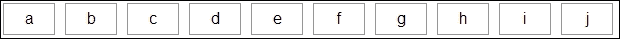

字母序数尺度

当在第`G`行时，使用内置的`d3.scaleOrdinal(d3.schemeCategory20c)`序数颜色类别方案调用`render`函数会产生以下输出：

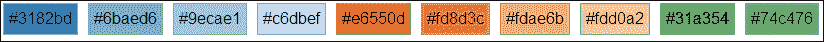

颜色序数尺度

由于在可视化中将不同颜色分配给不同的元素是一个常见任务，例如，在饼图和气泡图中分配不同的颜色，D3 提供了多个不同的内置序数颜色尺度，正如我们在本食谱中看到的。

### 提示

构建自己的简单自定义序数颜色比例相当容易。只需创建一个范围设置为所需颜色的序数比例，如下例所示：`d3.scaleOrdinal()` `.range(["#1f77b4", "#ff7f0e", "#2ca02c"]);`

# 插值字符串

在某些情况下，你可能需要插值字符串中嵌入的数字；例如，可能是字体 CSS 样式。

在这个菜谱中，我们将探讨如何使用 D3 比例和插值来实现这一点。然而，在我们直接进入字符串插值之前，我们需要一些关于插值器的基础知识，接下来的部分将涵盖插值的基本概念以及 D3 如何实现插值函数。 

## 插值器

在前三道菜谱中，我们讨论了三种不同的 D3 比例实现；现在是我们深入探讨 D3 比例的时候了。你可能已经在问自己，*不同的比例是如何知道对不同输入使用什么值的？* 实际上，这个问题可以通过以下插值器的定义进行概括：

> *我们给出了函数 f(x)在不同点 x0, x1, ... ,xn 处的值。我们想要找到函数 f(x)在“新”x 值之间的近似值，这些 x 值位于这些点之间。这个过程称为插值。*
> 
> *-Kreyszig E 和 Kreyszig H，以及 Norminton E. J. (2010)*

插值不仅在比例实现中很重要，而且对于许多其他核心 D3 功能也是必不可少的，例如动画和布局管理。正因为这个基本角色，D3 设计了一个单独且可重用的结构，称为*插值器*，以便这个常见的跨功能问题可以集中和一致地解决。让我们以一个简单的插值器为例：

```js
var interpolate = d3.interpolateNumber(0, 100); 
interpolate(0.1); // => 10 
interpolate(0.99); //=> 99 

```

在这个简单的例子中，我们创建了一个范围在`[0, 100]`的 D3 数字插值器。`d3.interpolateNumber`函数返回一个插值函数，我们可以使用它来执行基于数字的插值。插值函数等同于以下代码：

```js
function interpolate(t) { 
    return a * (1 - t) + b * t; 
} 

```

在这个函数中，`a`代表范围的开始，`b`代表范围的结束。传递给`interpolate()`函数的参数`t`是一个浮点数，范围从 0 到 1，它表示返回值与`a`的距离。

D3 提供了一些内置的插值器。由于本书的范围有限，我们将专注于接下来几道菜谱中一些更有趣的插值器；我们将在这里结束对简单数字插值的讨论。尽管如此，无论是一个数字还是 RGB 颜色代码插值器，基本方法和机制都将保持不变。

### 注意

关于数字和圆滑插值的更多细节，请参阅[`github.com/d3/d3/blob/master/API.md#interpolators-d3-interpolate`](https://github.com/d3/d3/blob/master/API.md#interpolators-d3-interpolate)中的 D3 参考文档。

现在，在我们掌握了通用插值概念之后，让我们来看看 D3 中的字符串插值器是如何工作的。

## 准备工作

在你的网络浏览器中打开以下文件的本地副本：

[`github.com/NickQiZhu/d3-cookbook-v2/blob/master/src/chapter4/string-interpolation.html`](https://github.com/NickQiZhu/d3-cookbook-v2/blob/master/src/chapter4/string-interpolation.html)。

## 如何做到这一点...

字符串插值器会找到字符串中嵌入的数字，然后使用 D3 数字插值器进行插值：

```js
<div id="font" class="clear"> 
    <span>Font Interpolation<br></span> 
</div> 

<script type="text/javascript"> 
    var max = 11, data = []; 

    var sizeScale = d3.scaleLinear() // <-A 
        .domain([0, max]) 
        .range([  // <-B 
            "italic bold 12px/30px Georgia, serif",  
            "italic bold 120px/180px Georgia, serif" 
        ]); 

    for (var i = 0; i < max; ++i) data.push(i); 

    function render(data, scale, selector) { // <-C 
        var cells = d3.select(selector).selectAll("div.cell") 
                .data(data); 

        cells.enter() 
            .append("div") 
                .classed("cell", true) 
                .style("display", "inline-block") 
            .append("span") 
                .style("font", function(d,i){ 
                    return scale(d); // <-D 
                }) 
                .text(function(d,i){return i;}); // <-E 
    } 

    render(data, sizeScale, "#font"); 
</script> 

```

上述代码产生了以下输出：

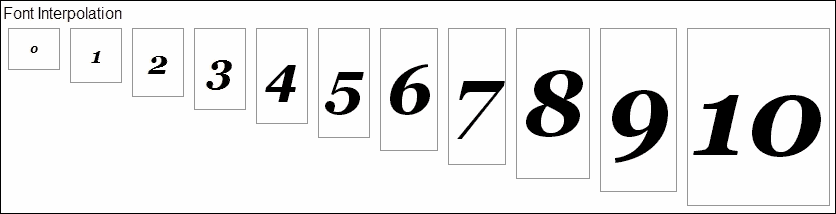

字符串插值

## 它是如何工作的...

在这个例子中，我们在线 `A` 上创建了一个线性比例尺，其范围由表示起始和结束 `font` 样式的两个字符串指定：

```js
var sizeScale = d3.scale.linear() // <-A 
        .domain([0, max]) 
        .range([  // <-B 
            "italic bold 12px/30px Georgia, serif",  
            "italic bold 120px/180px Georgia, serif" 
        ]); 

```

如你在 `string-interpolation.html` 文件的代码中所见，`font` 样式字符串包含 `font-size` 数字 `12px/30px` 和 `120px/180px`，这是我们在这个菜谱中想要插值的。此时，你可能会问线性比例尺函数是如何将数字域映射到这些任意的字体 CSS 样式的。默认情况下，线性比例尺使用 `d3.interpolateString` 函数来处理基于字符串的范围。`d3.interpolateString` 函数将尝试识别给定字符串中的嵌入数字，在我们的例子中，是字体大小数字，并且只对这些数字进行插值。因此，在这个菜谱中，我们实际上使用线性比例尺将我们的域映射到字体大小。

在线 `C`，`render()` 函数简单地创建了包含每个单元格索引数字（线 `E`）的 10 个单元格，这些单元格使用在线 `D` 计算的插值 `font` 样式字符串进行样式化。

```js
.style("font", function(d,i){  
    return scale(d); // <-D 
}) 
.text(function(d,i){return i;}); // <-E 

```

如我们所见，只需将字体样式设置为 `scale(d)` 的输出就足够了，因为函数输出是一个完整的字体 CSS 样式字符串，其中包含转换后的嵌入数字。

### 注意

如果你检查这个菜谱的输出，你会注意到输出的 CSS 样式实际上比我们使用的原始样式字符串要长。输出看起来像这样：`font-style: italic; font-variant: normal; font-weight: bold; font-stretch: normal; font-size: 90.5455px; line-height: 139.091px; font-family: Georgia, serif;` 这是因为 D3 CSS 转换首先解析 CSS 样式，然后使用浏览器计算的全限定 CSS 字符串进行插值。这样做是为了避免一些可能由直接插值引起的微妙错误。

## 还有更多...

虽然我们使用 CSS 字体样式作为例子演示了 D3 中的字符串插值，但 D3 字符串插值器不仅限于处理 CSS 样式。它可以基本上处理任何字符串，只要数字匹配以下 **正则表达式** 模式：

```js
/[-+]?(?:\d+\.?\d*|\.?\d+)(?:[eE][-+]?\d+)?/g 

```

### 注意

当你使用插值生成字符串时，非常小的值，在转换为字符串后可能会被转换为科学记数法，例如，1e-7。为了避免这种特定的转换，你需要保持你的值大于 1e-6。

# 颜色插值

当你需要插值不包含数字而包含 RGB 或 HSL 颜色代码的值时，有时需要插值颜色。本食谱解决了以下问题：*如何定义颜色代码的刻度并在其上进行插值？*

## 准备工作

在您的网络浏览器中打开以下文件的本地副本：

[`github.com/NickQiZhu/d3-cookbook-v2/blob/master/src/chapter4/color-interpolation.html`](https://github.com/NickQiZhu/d3-cookbook-v2/blob/master/src/chapter4/color-interpolation.html)。

## 如何做...

颜色插值在可视化中是一项非常常见的操作，因此 D3 实际上提供了一系列不同类型的插值器，专门用于支持颜色，例如**RGB**、**HSL**、**L*a*b***、**HCL**和**Cubehelix**颜色空间。在本食谱中，我们将演示如何在 RGB 颜色空间中执行颜色插值。然而，所有其他颜色插值器的工作方式相同。

### 注意

D3 颜色插值函数始终在 RGB 空间中返回插值颜色，无论原始颜色空间是什么，因为并非所有浏览器都支持 HSL 或 L*a*b*颜色空间。

下面是这个食谱的代码示例：

```js
<div id="color" class="clear"> 
    <span>Linear Color Interpolation<br></span> 
</div> 
<div id="color-diverge" class="clear"> 
    <span>Poly-Linear Color Interpolation<br></span> 
</div> 

<script type="text/javascript"> 
    var max = 21, data = []; 

    var colorScale = d3.scaleLinear() // <-A 
        .domain([0, max]) 
        .range(["white", "#4169e1"]); 

    var divergingScale = function(pivot) { // <-B 
        return d3.scaleLinear() 
                .domain([0, pivot, max]) // <-C 
                .range(["white", "#4169e1", "white"]) 
    }; 

    for (var i = 0; i < max; ++i) data.push(i); 

    function render(data, scale, selector) { // <-D 
        var cells = d3.select(selector).selectAll("div.cell") 
                .data(data); 

        cells.enter() 
            .append("div").merge(cells) 
                .classed("cell", true) 
                .style("display", "inline-block") 
                .style("background-color", function(d){ 
                    return scale(d); // <-E 
                }) 
                .text(function(d,i){return i;}); 
    } 

    render(data, colorScale, "#color"); 
    render(data, divergingScale(5), "#color-diverge"); 
</script> 

<div class="control-group clear"> 
    <button onclick="render(data, divergingScale(5), '#color-diverge')">Pivot at 5</button> 
    <button onclick="render(data, divergingScale(10), '#color-diverge')">Pivot at 10</button> 
    <button onclick="render(data, divergingScale(15), '#color-diverge')">Pivot at 15</button> 
    <button onclick="render(data, divergingScale(20), '#color-diverge')">Pivot at 20</button> 
</div> 

```

上述代码产生了以下视觉输出：

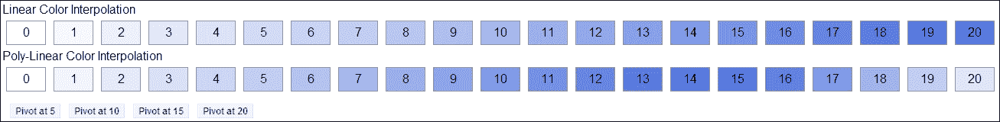

颜色插值

## 它是如何工作的...

本食谱的第一步是在第`A`行定义一个线性颜色刻度，其范围设置为`["white", "#4169e1"]`：

```js
var colorScale = d3.scaleLinear() // <-A 
    .domain([0, max]) 
    .range(["white", "#4169e1"]); 

```

### 注意

正如我们之前所展示的，D3 颜色插值器在处理颜色空间方面非常智能。类似于你的浏览器，它理解颜色关键字和十六进制值。

在这个食谱中使用的一种新技术，我们之前还没有遇到过，就是**多线性刻度**，它在`divergingScale`函数的第`B`行定义，如下所示：

```js
var divergingScale = function(pivot) { // <-B 
    return d3.scaleLinear() 
            .domain([0, pivot, max]) // <-C 
            .range(["white", "#4169e1", "white"]) 
}; 

```

多线性刻度是一种具有非均匀线性进度的刻度。它通过在线性刻度上提供一个多线性域来实现，正如我们在第`C`行所看到的。你可以将多线性刻度想象为将两个具有不同域的线性刻度缝合在一起的刻度。因此，这个多线性颜色刻度实际上是以下两个线性刻度的组合：

```js
d3.scaleLinear() 
    .domain([0, pivot]).range(["white", "#4169e1"]); 
d3.scaleLinear() 
.domain([pivot, max]).range(["#4169e1", "white "]); 

```

在食谱的其余部分没有惊喜。在第`D`行定义的`render()`函数生成 20 个单元格，这些单元格按其索引编号，并使用我们之前定义的两个颜色刻度的输出进行着色。点击网页上的按钮（例如**在 5 处旋转**）将显示在多线性颜色刻度中不同位置的旋转效果。

## 相关内容

+   关于 CSS3 支持的所有颜色关键字，请参阅 W3C 官方参考[`www.w3.org/TR/css3-color/#html4`](https://www.w3.org/TR/css3-color/#html4)。

# 插值复合对象

在你的可视化中，你可能需要插值的不只是一个简单的值，而是一个由多个不同值组成的对象，例如，具有宽度、高度和颜色属性的矩形对象。幸运的是，D3 内置了对这种复合对象插值的支持。

## 准备工作

在你的网络浏览器中打开以下文件的本地副本：

[`github.com/NickQiZhu/d3-cookbook-v2/blob/master/src/chapter4/compound-interpolation.html`](https://github.com/NickQiZhu/d3-cookbook-v2/blob/master/src/chapter4/compound-interpolation.html) .

## 如何做...

在这个菜谱中，我们将检查 D3 中如何执行复合对象插值。`compound-interpolation.html` 文件的代码如下：

```js
<div id="compound" class="clear"> 
    <span>Compound Interpolation<br></span> 
</div> 

<script type="text/javascript"> 
    var max = 21, data = []; 

    var compoundScale = d3.scalePow() 
            .exponent(2) 
            .domain([0, max]) 
            .range([ 
                {color:"#add8e6", height:"15px"}, // <-A 
                {color:"#4169e1", height:"150px"} // <-B 
            ]); 

    for (var i = 0; i < max; ++i) data.push(i); 

    function render(data, scale, selector) { // <-C 
        var bars = d3.select(selector).selectAll("div.v-bar") 
                .data(data); 
        bars.enter() 
                .append("div") 
                .classed("v-bar", true) 
                .style("height", function(d){ // <-D 
                        return scale(d).height; 
                    }) 
                .style("background-color", function(d){ // <-E 
                    return scale(d).color; 
                }) 
                .text(function(d,i){return i;}); 
    } 

    render(data, compoundScale, "#compound"); 
</script> 

```

上述代码生成以下视觉输出：

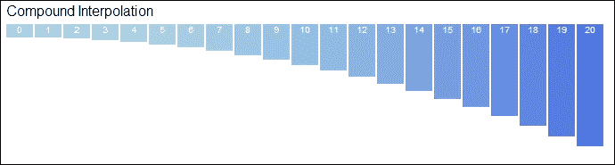

复合对象插值

## 它是如何工作的...

与本章前面的菜谱不同，本菜谱中我们将使用两个对象定义的范围而不是简单的原始数据类型来定义我们将使用的比例：

```js
var compoundScale = d3.scalePow() 
            .exponent(2) 
            .domain([0, max]) 
            .range([ 
                {color:"#add8e6", height:"15px"}, // <-A 
                {color:"#4169e1", height:"150px"} // <-B 
            ]); 

```

我们可以在行 `A` 和 `B` 上看到，比例范围的起始和结束是两个包含两种不同值的对象：一个用于 RGB 颜色，另一个用于 CSS 高度样式。当你对这种包含复合范围的尺度进行插值时，D3 将遍历对象内的每个字段，并对每个字段递归地应用插值规则。换句话说，对于这个例子，D3 将使用颜色插值从 `#add8e6` 插值到 `#4169e1`，同时在高度字段上使用字符串插值从 `15px` 插值到 `150px`。

### 注意

内部，D3 使用 `d3.interpolateObject` 函数递归地插值一个对象；该算法的递归性质允许 D3 在嵌套对象上进行插值。因此，你可以对如下这样的对象进行插值：`{` `  color:"#add8e6",` `  size{` `    height:"15px",` `    width: "25px"` `  }` `}`

当复合比例函数被调用时，它返回一个与给定范围定义相匹配的复合对象：

```js
.style("height", function(d){ 
  return scale(d).height; // <-D 
})  
.style("background-color", function(d){ 
  return scale(d).color; // <-E 
}) 

```

正如我们在行 `D` 和 `E` 上所看到的，返回值是一个复合对象，这就是为什么我们可以访问其属性以检索插值值。

### 注意

虽然这不是一个常见的案例，但如果你的复合比例范围的起始和结束没有相同的属性，D3 不会抱怨，而是会将缺失的属性视为一个常数。以下比例会将所有 `div` 元素的高度渲染为 `15px`：`var compoundScale = d3.scalePow()` `            .exponent(2)` `            .domain([0, max])` `                 range([` `                 {color:"#add8e6", height:"15px"}, // <-A` `                 {color:"#4169e1"} // <-B` `            ]);`

在本章中，我们介绍了 D3 中的一个重要基本概念——刻度。在下一章中，我们将继续探讨本书中第一个基于刻度的可视化组件——坐标轴。
