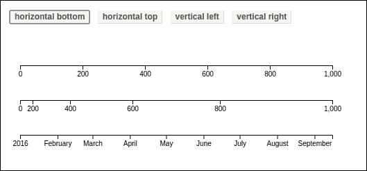
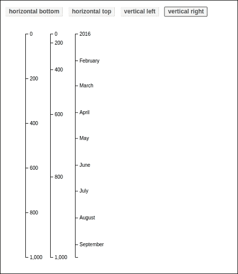
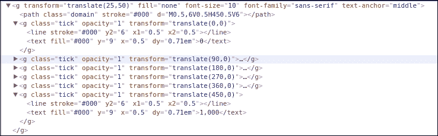
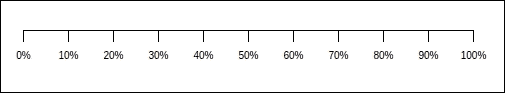
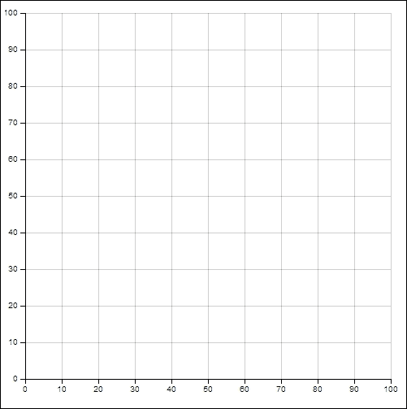
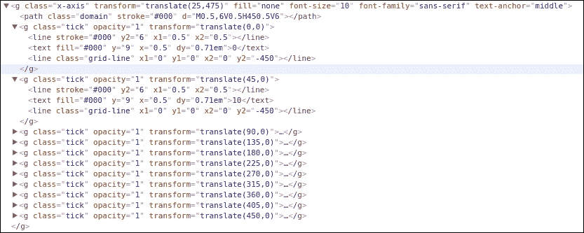
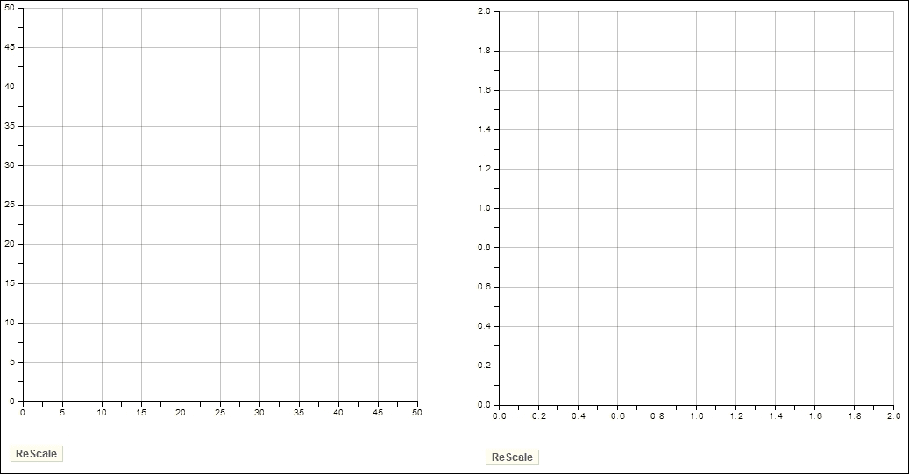

# 第五章。玩转坐标轴

在本章中，我们将涵盖：

+   使用基本坐标轴

+   自定义刻度

+   绘制网格线

+   坐标轴的动态缩放

# 简介

D3 最初发布时没有内置的坐标轴组件支持。这种情况并没有持续太久，因为坐标轴是许多基于笛卡尔坐标系的可视化项目的通用构建块之一，也是从头开始手动构建的最繁琐的任务之一。很快，就清楚 D3 需要提供内置的坐标轴支持。因此，它很早就被引入，并且自发布以来一直在不断改进。在本章中，我们将探讨坐标组件的使用和一些相关技术。

# 使用基本坐标轴

在本食谱中，我们将专注于介绍 D3 中坐标组件的基本概念和支持，同时我们将涵盖坐标的不同类型和功能以及它们的`SVG`结构。

## 准备工作

在你的网络浏览器中打开以下文件的本地副本：

[`github.com/NickQiZhu/d3-cookbook-v2/blob/master/src/chapter5/basic-axes.html`](https://github.com/NickQiZhu/d3-cookbook-v2/blob/master/src/chapter5/basic-axes.html)

## 如何操作...

让我们先看看以下代码示例：

```js
<div class="control-group"> 
    <button onclick="renderAll(d3.axisBottom)"> 
        horizontal bottom 
    </button> 
    <button onclick="renderAll(d3.axisTop)"> 
        horizontal top 
    </button> 
    <button onclick="renderAll(d3.axisLeft)"> 
        vertical left 
    </button> 
    <button onclick="renderAll(d3.axisRight)"> 
        vertical right 
    </button> 
</div> 

<script type="text/javascript"> 
    var height = 500,  
        width = 500,  
        margin = 25, 
        offset = 50, 
        axisWidth = width - 2 * margin, 
        svg; 

    function createSvg(){ // <-A 
         svg = d3.select("body").append("svg") // <-B 
            .attr("class", "axis") // <-C 
            .attr("width", width) 
            .attr("height", height); 
    } 

    function renderAxis(fn, scale, i){ 
        var axis = fn() // <-D 
            .scale(scale) // <-E 
            .ticks(5); // <-G 

        svg.append("g")         
            .attr("transform", function(){ // <-H 
                if([d3.axisTop, d3.axisBottom].indexOf(fn) >= 0) 
                    return "translate(" + margin + "," +  
                                              i * offset + ")"; 
                else 
                    return "translate(" + i * offset + ", " +  
                                              margin + ")"; 
            }) 
            .call(axis); // <-I 
    } 

    function renderAll(fn){ 
        if(svg) svg.remove(); 

        createSvg(); 

        renderAxis(fn, d3.scaleLinear() 
                    .domain([0, 1000]) 
                    .range([0, axisWidth]), 1); 
        renderAxis(fn, d3.scalePow() 
                    .exponent(2) 
                    .domain([0, 1000]) 
                    .range([0, axisWidth]), 2); 
        renderAxis(fn, d3.scaleTime() 
                    .domain([new Date(2016, 0, 1),  
                             new Date(2017, 0, 1)]) 
                    .range([0, axisWidth]), 3); 
    } 
</script> 

```

之前的代码只显示了以下截图中的四个按钮的视觉输出；当你点击**水平底部**时，它会显示以下内容：



水平坐标轴

以下截图显示了当你点击**垂直右侧**按钮时的样子：



垂直坐标轴

## 它是如何工作的...

本食谱的第一步是创建`svg`元素，它将被用来渲染我们的坐标轴。这是通过`createSvg`函数完成的，该函数定义在第`A`行，以及 D3 的`append`和`attr`修改函数，如第`B`行和第`C`行所示。

### 注意

这是本书中第一个使用 SVG 而不是 HTML 元素的食谱，因为 D3 坐标轴组件只支持 SVG。如果你不熟悉 SVG 标准，不要担心，我们将在第七章“形状入门”中详细介绍它。尽管如此，为了本章的目的，当使用 D3 坐标轴组件时，将介绍一些基本和有限的 SVG 概念。

让我们看看以下代码片段中我们是如何创建 SVG 画布的：

```js
var height = 500,  
  width = 500,  
  margin = 25, 
  offset = 50, 
  axisWidth = width - 2 * margin, 
  svg; 

function createSvg(){ // <-A 
     svg = d3.select("body").append("svg") // <-B 
        .attr("class", "axis") // <-C 
        .attr("width", width) 
        .attr("height", height); 
}  

```

现在，我们已经准备好在这个`svg`画布上渲染坐标轴。`renderAxis`函数正是为此而设计的。在第`D`行，我们首先使用给定的 D3 坐标轴生成函数创建一个坐标轴组件。D3 4.x 版本提供了四个内置的坐标轴生成器，用于不同的方向。方向告诉 D3 给定坐标轴将如何放置，因此应该如何渲染；例如，是水平还是垂直。D3 支持的四个内置坐标轴方向如下：

+   `d3.axisTop`: 一个水平轴，标签放置在轴的顶部

+   `d3.axisBottom`: 一个水平轴，标签放置在轴的底部

+   `d3.axisLeft`: 一个垂直轴，标签放置在轴的左侧

+   `d3.axisRight`: 一个垂直轴，标签放置在轴的右侧

您可以在以下代码片段中看到，这些确实是当您点击指定的按钮时传递给 `renderAll` 函数的函数：

```js
<div class="control-group"> 
    <button onclick="renderAll(d3.axisBottom)"> 
        horizontal bottom 
    </button> 
    <button onclick="renderAll(d3.axisTop)"> 
        horizontal top 
    </button> 
    <button onclick="renderAll(d3.axisLeft)"> 
        vertical left 
    </button> 
    <button onclick="renderAll(d3.axisRight)"> 
        vertical right 
    </button> 
</div> 
... 
function renderAxis(fn, scale, i){ 
        var axis = fn() // <-D 
            .scale(scale) // <-E 
            .ticks(5); // <-G 
... 

```

D3 轴被设计为与 D3 尺度无缝工作。轴尺度是通过 `scale()` 函数提供的（参考行 `E`）。在这个例子中，我们使用以下尺度渲染了三个不同的轴：

```js
d3.scaleLinear().domain([0, 1000]).range([0, axisWidth]) 
d3.scalePow().exponent(2).domain([0, 1000]).range([0, axisWidth]) 
d3.scaleTime() 
  .domain([new Date(2016, 0, 1), new Date()]) 
  .range([0, axisWidth]) 

```

在行 `G` 上，我们将刻度数（轴上的小标记）设置为 `5`。这告诉 D3 理想情况下我们希望为这个轴渲染多少个刻度；然而，D3 可能会根据可用空间和自己的计算选择渲染稍微更多或更少的刻度。我们将在下一个菜谱中详细探讨轴刻度的配置。

一旦定义了轴，这个创建过程的最后一步是创建一个 `svg:g` 容器元素，然后它将被用来托管所有渲染轴所需的 SVG 结构：

```js
svg.append("g")         
  .attr("transform", function(){ // <-H 
    if(["top", "bottom"].indexOf(orient) >= 0) 
      return "translate(" + margin + ","+ i * offset + ")"; 
    else 
      return "translate(" + i * offset + ", " + margin + ")"; 
    }) 
    .call(axis); // <-I 

```

### 注意

有一个 `g` 容器组元素来包含所有与轴相关的 SVG 元素不仅是一种良好的实践，也是 D3 轴组件的要求。

这段代码中的大部分逻辑都与使用 `transform` 属性在 `svg` 画布上绘制轴的位置计算相关（参考行 `H`）。在前面的代码示例中，为了使用偏移量移动轴，我们使用了 `translate` SVG 变换，这允许我们使用定义在 *x* 和 *y* 坐标中的距离参数来移动一个元素。

### 注意

SVG 变换将在第七章（Chapter 7）*Getting into Shape* 中详细讨论，或者您可以参考以下 URL 获取更多关于这个主题的信息：[`www.w3.org/TR/SVG/coords.html#TranslationDefined`](https://www.w3.org/TR/SVG/coords.html#TranslationDefined)

这段代码的相关部分在行 `I`，其中使用了 `d3.selection.call` 函数，并将 `axis` 对象作为参数传递。`d3.selection.call` 函数使用当前选择作为参数调用给定的函数（在我们的情况下，是 `axis` 对象）。换句话说，传递给 `d3.selection.call` 函数的函数应该具有以下形式：

```js
function foo(selection) { 
  ... 
} 

```

### 注意

`d3.selection.call` 函数还允许您向调用函数传递额外的参数。更多信息，请访问以下链接：[`github.com/d3/d3-selection/blob/master/README.md#selection_call`](https://github.com/d3/d3-selection/blob/master/README.md#selection_call)

一旦调用 D3 轴组件，它将负责剩余的工作，并自动创建轴所需的所有必要的 SVG 元素（参考行 `I`）。例如，本食谱中所示示例的水平底部时间轴具有以下自动生成的复杂 SVG 结构，我们实际上并不需要了解太多：



水平底部时间轴 SVG 结构

# 自定义刻度

我们已经在之前的食谱中看到了如何使用 `ticks` 函数。这是在 D3 轴上可以进行的最简单的刻度相关自定义。在本食谱中，我们将介绍一些最常见和有用的刻度相关自定义。

## 准备工作

在您的网络浏览器中打开以下文件的本地副本：

[`github.com/NickQiZhu/d3-cookbook-v2/blob/master/src/chapter5/ticks.html`](https://github.com/NickQiZhu/d3-cookbook-v2/blob/master/src/chapter5/ticks.html)

## 如何实现...

在下面的代码示例中，我们将自定义刻度、填充和标签的格式。让我们首先看看代码片段：

```js
<script type="text/javascript"> 
    var height = 500,  
        width = 500,  
        margin = 25, 
        axisWidth = width - 2 * margin; 

    var svg = d3.select("body").append("svg") 
            .attr("class", "axis") 
            .attr("width", width) 
            .attr("height", height); 

    var scale = d3.scaleLinear() 
            .domain([0, 1]).range([0, axisWidth]); 

    var axis = d3.axisBottom() 
            .scale(scale) 
            .ticks(10) 
            .tickSize(12) // <-A 
            .tickPadding(10) // <-B 
            .tickFormat(d3.format(".0%")); // <-C 

    svg.append("g")         
        .attr("transform", function(){ 
            return "translate(" + margin + 
                    "," + margin + ")"; 
        }) 
        .call(axis); 
</script> 

```

上述代码生成了以下视觉输出：



自定义轴刻度

## 工作原理...

本食谱的重点是 `ticks` 函数之后的突出显示的行。正如我们之前提到的，`ticks` 函数为 D3 提供了一个提示，说明轴应该包含多少个刻度。在设置刻度数量之后，在本食谱中，我们继续通过进一步的函数调用来进一步自定义刻度。在行 `A` 上，使用 `tickSize` 函数来自定义刻度的大小。D3 提供的默认刻度大小是 `6px`，而在这个例子中我们将其设置为 `12px`。然后，在行 `B` 上，使用 `tickPadding` 函数指定刻度标签和轴之间的空间（以像素为单位）。

最后，在行 `C` 上使用 `tickFormat` 函数自定义了格式，将刻度值转换为百分比。D3 轴的 `tickFormat` 函数也可以接受一个函数作为格式化器进行更多自定义，因此，本食谱中使用的格式化器与以下自定义格式函数相同：

```js
.tickFormat(function(v){ // <-C 
    return Math.floor(v * 100) + "%"; 
}); 

```

### 注意

关于上述函数和其他刻度相关自定义的更多信息，请访问以下 URL 的 D3 Wiki：[`github.com/d3/d3-axis/blob/master/README.md#_axis`](https://github.com/d3/d3-axis/blob/master/README.md#_axis)

# 绘制网格线

很频繁地，我们需要绘制与*x*和*y*轴上的刻度一致的水平和垂直网格线。正如我们在前面的配方中所示，通常情况下，我们并没有，或者不希望对 D3 轴上刻度的渲染有精确的控制。因此，在它们被渲染之前，我们可能不知道有多少刻度以及它们的值。这在您正在构建一个可重用的可视化库时尤其如此，因为在那时之前，您不可能知道刻度配置。在这个配方中，我们将探讨一些在轴上绘制一致网格线的技术，而实际上并不需要知道刻度值。

## 准备工作

在您的网络浏览器中打开以下文件的本地副本：

[`github.com/NickQiZhu/d3-cookbook-v2/blob/master/src/chapter5/grid-line.html`](https://github.com/NickQiZhu/d3-cookbook-v2/blob/master/src/chapter5/grid-line.html)

## 如何实现...

首先，让我们看看以下代码中我们是如何绘制网格线的：

```js
<script type="text/javascript"> 
    var height = 500,  
        width = 500,  
        margin = 25;        

    var svg = d3.select("body").append("svg") 
            .attr("class", "axis") 
            .attr("width", width) 
            .attr("height", height); 

    function renderXAxis(){ 
        var axisLength = width - 2 * margin; 

        var scale = d3.scaleLinear() 
                        .domain([0, 100]) 
                        .range([0, axisLength]); 

        var xAxis = d3.axisBottom() 
                .scale(scale); 

        svg.append("g")        
            .attr("class", "x-axis") 
            .attr("transform", function(){ // <-A 
                return "translate(" + margin + "," +  
                                 (height - margin) + ")"; 
            }) 
            .call(xAxis); 

        d3.selectAll("g.x-axis g.tick") // <-B 
            .append("line") // <-C 
                .classed("grid-line", true) 
                .attr("x1", 0) // <-D 
                .attr("y1", 0) 
                .attr("x2", 0) 
                .attr("y2", - (height - 2 * margin));  // <-E 
    } 

    function renderYAxis(){         
        var axisLength = height - 2 * margin; 

        var scale = d3.scaleLinear() 
                        .domain([100, 0]) 
                        .range([0, axisLength]); 

        var yAxis = d3.axisLeft() 
                .scale(scale); 

        svg.append("g")        
            .attr("class", "y-axis") 
            .attr("transform", function(){ 
                return "translate(" + margin + "," +  
                                              margin + ")"; 
            }) 
            .call(yAxis); 

        d3.selectAll("g.y-axis g.tick") 
            .append("line") 
                .classed("grid-line", true) 
                .attr("x1", 0) 
                .attr("y1", 0) 
                .attr("x2", axisLength) // <-F 
                .attr("y2", 0); 
    }    

    renderYAxis(); 
    renderXAxis(); 
</script> 

```

之前的代码生成了以下视觉输出：



轴和网格线

## 工作原理...

在这个配方中，`renderXAxis`和`renderYAxis`函数分别创建了两个轴-*x*和*y-*。让我们看看 x 轴是如何被渲染的。

一旦你了解了如何渲染*x*轴及其网格线，由于使用的逻辑几乎相同，因此渲染*y*轴的逻辑也可以很容易地理解。*x*轴及其刻度已经被定义得没有复杂性，正如我们在本章中已经多次演示的那样。创建了一个`svg:g`元素来包含*x*轴的结构。这个`svg:g`元素通过平移变换放置在图表的底部，如图线`A`所示：

```js
.attr("transform", function(){ // <-A 
  return "translate(" + margin + "," + (height - margin) + ")"; 
}) 

```

重要的是要记住，平移变换会改变其子元素坐标的参考框架。例如，在这个`svg:g`元素内部，如果我们创建一个坐标设置为`(0, 0)`的点，那么当我们在这个 SVG 画布上绘制这个点时，它实际上会被放置在`(margin, height - margin)`。这是因为`svg:g`元素内的所有子元素都会自动转换到这个基准坐标，从而导致参考框架的偏移。有了这个理解，让我们看看如何通过以下代码片段在轴渲染后生成动态网格线：

```js
d3.selectAll("g.x-axis g.tick") // <-B 
            .append("line") // <-C 
                .classed("grid-line", true) 
                .attr("x1", 0) // <-D 
                .attr("y1", 0) 
                .attr("x2", 0) 
                .attr("y2", - (height - 2 * margin));  // <-E 

```

一旦轴被渲染，我们可以通过选择`g.tick`来选择轴上的所有刻度元素，因为每个刻度都由它自己的`svg:g`元素分组（参见图线`B`）。然后，在图线`C`中，我们为每个`svg:g`刻度元素添加一个新的`svg:line`元素。SVG 线元素是 SVG 标准提供的最简单的形状。它有以下四个主要属性：

+   `x1`和`y1`属性定义了这条线的起点

+   `x2`和`y2`属性定义了终点

在我们的例子中，我们只需要将 `x1`、`y1` 和 `x2` 设置为 `0`，因为每个 `g.tick` 元素已经转换到了其在轴上的位置，因此我们只需要更改 `y2` 属性来绘制垂直网格线。`y2` 属性设置为 `-(height - 2 * margin)`。坐标为负的原因是，正如前一段代码中提到的，整个 `g.x-axis` 已经向下移动到 `(height - margin)`。因此，在绝对坐标下，`y2 =` `(height - margin)` `- (height - 2 * margin) = margin`，这是我们想要从 *x* 轴绘制的垂直网格线的顶部。

### 注意

在 SVG 坐标中，`(0, 0)` 表示 SVG 画布的左上角。

这就是 SVG 结构中带有相关网格线的 *x* 轴的样子：



带有网格线的 X 轴 SVG 结构

如前一个屏幕截图所示，一个代表网格线的 `svg:line` 元素被添加到了前面在本节中讨论的 `g.ticksvg:g` 容器元素中。

*y* 轴的网格线使用的是相同的技巧生成；唯一的区别是，我们不是在网格线上设置 `y2` 属性，就像我们在 *x* 轴上做的那样，而是改变 `x2` 属性，因为线条是水平的（参见图 `F`）：

```js
d3.selectAll("g.y-axis g.tick") 
            .append("line") 
                .classed("grid-line", true) 
                .attr("x1", 0) 
                .attr("y1", 0) 
                .attr("x2", axisLength) // <-F 
                .attr("y2", 0); 

```

# 轴的动态缩放

在某些情况下，当由用户交互或数据源的变化触发时，轴使用的比例可能会改变。例如，用户可能会更改可视化的时间范围。这种变化也需要通过缩放轴来反映。在本食谱中，我们将探讨如何动态地实现这一点，同时重新绘制与每个刻度相关的网格线。

## 准备工作

在您的网页浏览器中打开以下文件的本地副本：

[`github.com/NickQiZhu/d3-cookbook-v2/blob/master/src/chapter5/rescaling.html`](https://github.com/NickQiZhu/d3-cookbook-v2/blob/master/src/chapter5/rescaling.html)

## 如何操作...

以下代码展示了如何执行动态缩放：

```js
<script type="text/javascript"> 
    var height = 500,  
        width = 500,  
        margin = 25, 
        xAxis, yAxis, xAxisLength, yAxisLength; 

    var svg = d3.select("body").append("svg")      
            .attr("class", "axis")     
            .attr("width", width) 
            .attr("height", height); 

    function renderXAxis(){ 
        xAxisLength = width - 2 * margin; 
            var scale = d3.scaleLinear() 
                        .domain([0, 100]) 
                        .range([0, xAxisLength]); 

        xAxis = d3.axisBottom() 
                .scale(scale); 

        svg.append("g")        
            .attr("class", "x-axis") 
            .attr("transform", function(){  
                return "translate(" + margin + "," +  
                                  (height - margin) + ")"; 
            }) 
            .call(xAxis); 
    } 

    ... 

    function rescale(){ // <-A 
        var max = Math.round(Math.random() * 100); 

        xAxis.scale().domain([0, max]); // <-B 
        svg.select("g.x-axis") 
            .transition() 
            .call(xAxis); // <-C 

        yAxis.scale().domain([max, 0]); 
        svg.select("g.y-axis") 
            .transition() 
            .call(yAxis); 

        renderXGridlines(); 
        renderYGridlines(); 
    }        

    function renderXGridlines(){ 
        d3.selectAll("g.x-axis g.tick") 
                .select("line.grid-line") 
                .remove(); // <-D 

        d3.selectAll("g.x-axis g.tick") 
                .append("line") 
                    .classed("grid-line", true) 
                    .attr("x1", 0) 
                    .attr("y1", 0) 
                    .attr("x2", 0) 
                    .attr("y2", - yAxisLength); 
    } 

    ... 

    renderXAxis(); 
renderXGridlines(); 
... 
</script> 

```

以下代码生成了以下效果：



动态轴缩放

### 注意

由于本书篇幅有限，本食谱中的代码示例省略了与 *y* 轴相关的代码。请参考在线可用的代码示例以获取完整参考。

## 如何工作...

一旦您在屏幕上点击 **ReScale** 按钮，您将注意到轴会缩放，同时所有刻度和网格线都会随着平滑的过渡效果重新绘制。在本节中，我们将关注这种缩放是如何工作的，并将过渡效果留到下一章，*带有风格的过渡*。本食谱的大部分工作都是由第 `A` 行上定义的 `rescale` 函数完成的：

```js
function rescale(){ // <-A 
  var max = Math.round(Math.random() * 100); 

  xAxis.scale().domain([0, max]); // <-B 
  svg.select("g.x-axis") 
    .transition() 
    .call(xAxis); // <-C 

  renderXGridlines(); 
}    

```

要缩放一个轴，我们只需更改其域（参见图`B`）。如果你还记得，刻度域表示数据域，而其范围对应于视觉域。因此，视觉范围应保持不变，因为我们没有调整 SVG 画布的大小。一旦更新，我们再次调用轴函数`xAxis`，通过传入`svg:g`元素来为*x*轴（参见图`C`）。这个简单的调用将处理轴的更新，因此我们的轴工作就完成了。在下一步中，我们还需要更新和重新绘制所有网格线，因为域的变化也会改变所有刻度：

```js
function renderXGridlines(){ 
        d3.selectAll("g.x-axis g.tick") 
                .select("line.grid-line") 
                .remove(); // <-D 

        d3.selectAll("g.x-axis g.tick") 
                .append("line") 
                    .classed("grid-line", true) 
                    .attr("x1", 0) 
                    .attr("y1", 0) 
                    .attr("x2", 0) 
                    .attr("y2", - yAxisLength); 
} 

```

这是通过调用`remove()`函数移除所有网格线来实现的，如第`D`行所示，然后为缩放轴上的所有新刻度重新创建网格线。这种方法有效地保持了所有网格线在缩放过程中的与刻度的一致性。
