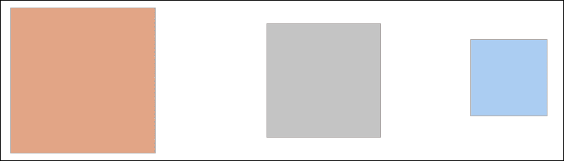
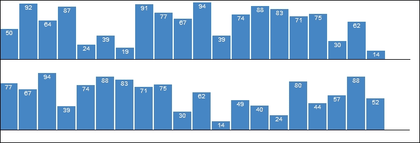
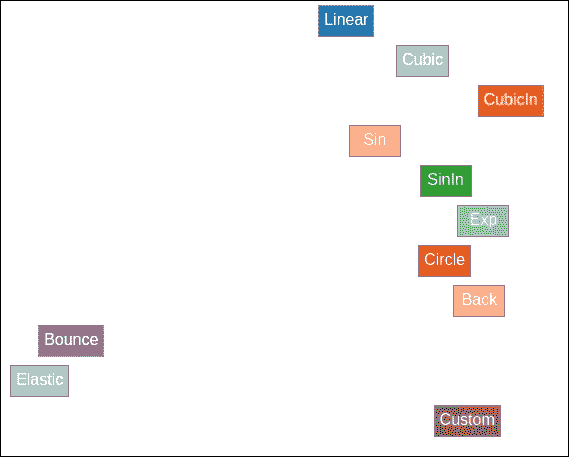
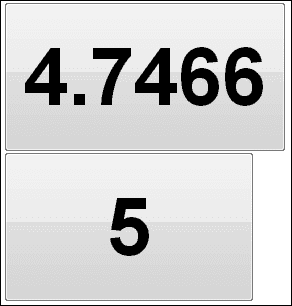
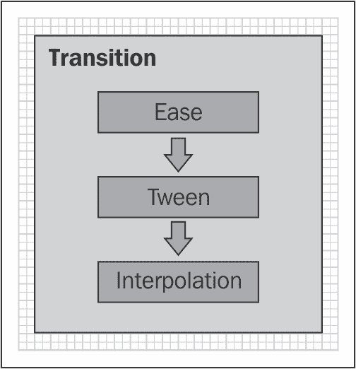
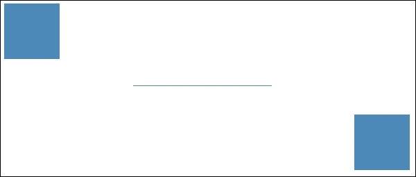
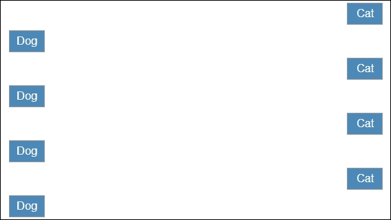
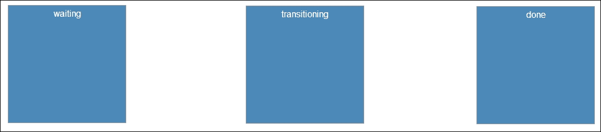
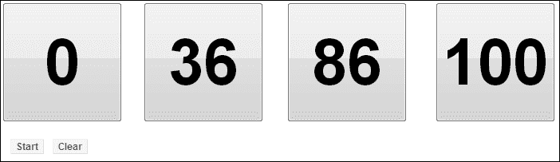

# 第六章。以风格进行过渡

上一段代码产生了以下视觉输出，其中出现了一个框，在本章中，我们将涵盖：

+   动画单个元素

+   动画多个元素

+   使用缓动

+   使用缓动

+   使用过渡链

+   使用过渡过滤器

+   监听过渡事件

+   与计时器一起工作

# 简介

> *"一张图片胜过千言万语。"*

这句古老的智慧可以说是数据可视化最重要的基石之一。另一方面，动画是通过一系列快速连续的静态图像生成的。人类的眼睛和大脑通过正后像、Phi 现象和 Beta 运动，能够创造出连续图像的错觉。正如 Rick Parent 在他的杰出作品《计算机动画算法和技术》中完美地表达的那样： 

> *图像可以迅速传达大量信息，因为人类的视觉系统是一个复杂的信息处理器。因此，移动图像有可能在短时间内传达更多信息。事实上，人类的视觉系统已经进化，以适应不断变化的世界；它被设计用来注意和解释运动。*
> 
> *-Parent R. 2012*

这实际上是在数据可视化项目中使用的动画的主要目标。在本章中，我们将重点关注*D3 过渡*的机制，从基础知识到更高级的主题，例如自定义插值和基于计时器的过渡。掌握过渡不仅将为你的可视化添加许多装饰，还将为你提供一套强大的工具集，用于可视化那些难以可视化的属性，如趋势和差异。

## 什么是过渡？

D3 过渡提供了在网页上使用 HTML 和 SVG 元素创建计算机动画的能力。D3 过渡实现了一种称为*基于插值的动画*的动画。计算机特别擅长值插值，因此，大多数计算机动画都是基于插值的。正如其名称所暗示的，这种动画能力的基础是值插值。

如果你还记得，我们在第四章 Tipping the Scales 中已经详细介绍了 D3 插值器和插值函数。过渡建立在插值和缩放之上，提供在时间上改变值的能力，这是动画的动力。每个过渡都可以使用起始值和结束值（在动画中也称为 *关键帧*）来定义，而不同的算法和插值器将逐帧填充中间值（也称为 "中间插值" 或简称为 "tweening"）。乍一看，如果你不熟悉动画算法和技术，这似乎是一种控制较少的创建动画的方式。然而，在现实中恰恰相反；基于插值的过渡可以提供对运动产生的每一帧的直接和具体期望，从而以简单的方式为动画师提供极大的控制。事实上，D3 过渡 API 设计得非常好，在大多数情况下，只需要几行代码就足以在数据可视化项目中实现所需的动画。现在，让我们动手尝试一些过渡，以进一步加深我们对这个主题的理解。

# 动画单个元素

在这个菜谱中，我们将首先查看过渡插值单个元素属性的最简单情况，以产生一个简单的动画。

## 准备工作

在你的网络浏览器中打开以下文件的本地副本：

[`github.com/NickQiZhu/d3-cookbook-v2/blob/master/src/chapter6/single-element-transition.html`](https://github.com/NickQiZhu/d3-cookbook-v2/blob/master/src/chapter6/single-element-transition.html)

## 如何做...

执行这个简单过渡所需的代码非常简短；这对于任何动画师来说都是好消息：

```js
<script type="text/javascript"> 
var body = d3.select("body"),  
duration = 5000; 

body.append("div") // <-A 
            .classed("box", true) 
            .style("background-color", "#e9967a") // <-B 
        .transition() // <-C 
        .duration(duration) // <-D 
            .style("background-color", "#add8e6") // <-E 
            .style("margin-left", "600px") // <-F 
            .style("width", "100px") 
            .style("height", "100px"); 
</script> 

```

上述代码产生了一个移动、缩小和颜色变化的正方形，如下面的截图所示：



单个元素过渡

## 它是如何工作的...

你可能会惊讶地发现，我们添加以启用此动画的额外代码仅在行 `C` 和 `D` 上，如下面的代码片段所示：

```js
body.append("div") // <-A 
            .classed("box", true) 
            .style("background-color", "#e9967a") // <-B 
            .transition() // <-C 
            .duration(duration) // <-D 

```

首先，在行 `C` 上，我们调用 `d3.selection.transition` 函数来定义一个过渡。然后，`transition` 函数返回一个过渡绑定的选择，它仍然代表当前选择中的相同元素（s）。然而，现在它配备了额外的功能，并允许进一步自定义过渡行为。

在行 `D`，我们使用 `duration()` 函数将过渡的持续时间设置为 `5000` 毫秒。此函数还返回当前过渡绑定的选择，从而允许函数链式调用。正如我们在本章开头提到的，基于插值的动画通常只需要您指定起始和结束值，而让插值器和算法在一段时间内填充中间值。D3 过渡将调用 `transition` 函数之前设置的任何值都视为起始值，将调用 `transition` 函数之后设置的值视为结束值。因此，在我们的例子中，我们有以下内容：

```js
.style("background-color", "#e9967a") // <-B 

```

在行 `B` 上定义的 `background-color` 样式被视为过渡的起始值。以下行中设置的任何样式都被视为结束值：

```js
.style("background-color", "#add8e6") // <-E 
.style("margin-left", "600px") // <-F 
.style("width", "100px") 
.style("height", "100px"); 

```

在这一点上，你可能会有疑问，*为什么这些起始值和结束值不对称？* D3 过渡不需要每个插值值都有明确的起始和结束值。如果缺少起始值，它将尝试使用计算出的样式，如果缺少结束值，则该值将被视为常数。一旦过渡开始，D3 将自动为每个值选择最合适的内置插值器。在我们的例子中，将在行 `E` 中使用 RGB 颜色插值器，而对于其他样式值，将使用字符串插值器——它内部使用数字插值器来插值嵌入的数字。在这里，我们将列出带有起始和结束值的插值样式值：

+   `background-color`：起始值 `#e9967a` 大于结束值 `#add8e6`

+   `margin-left`：起始值是计算出的样式，大于结束值 `600px`

+   `width`：起始值是计算出的样式，大于结束值 `100px`

+   `height`：起始值是计算出的样式，大于结束值 `100px`

# 多元素动画

更精细的数据可视化需要动画多个元素而不是单个元素，如前一个示例所示。更重要的是，这些过渡通常需要由数据驱动，并与同一可视化中的其他元素协调。在这个菜谱中，我们将看到如何创建一个数据驱动的多元素过渡来生成移动条形图。新条形图随着时间的推移被添加，图表从右向左平滑过渡。

## 准备工作

在您的网页浏览器中打开以下文件的本地副本：

[`github.com/NickQiZhu/d3-cookbook-v2/blob/master/src/chapter6/multi-element-transition.html`](https://github.com/NickQiZhu/d3-cookbook-v2/blob/master/src/chapter6/multi-element-transition.html)

## 如何实现...

如预期的那样，这个菜谱比上一个稍微大一些，但并不是很大。让我们看看以下代码：

```js
<script type="text/javascript"> 
var id= 0, 
data = [], 
duration = 500, 
chartHeight = 100, 
chartWidth = 680; 

for(vari = 0; i< 20; i++) push(data); 

function render(data) { 
        var selection = d3.select("body") 
                .selectAll("div.v-bar") 
                 .data(data, function(d){return d.id;}); // <-A 

        // enter 
        selection.enter() 
                .append("div") 
                .attr("class", "v-bar") 
                .style("z-index", "0") 
                .style("position", "fixed") 
                .style("top", chartHeight + "px") 
                 .style("left", function(d, i){ 
                    return barLeft(i+1) + "px"; // <-B 
                }) 
                .style("height", "0px") // <-C 
                .append("span"); 

        // update 
        selection 
             .transition().duration(duration) // <-D 
                .style("top", function (d) { 
                       return chartHeight - barHeight(d) + "px"; 
                }) 
                .style("left", function(d, i){ 
                    return barLeft(i) + "px"; 
                }) 
                .style("height", function (d) { 
                    return barHeight(d) + "px"; 
                }) 
                .select("span") 
                .text(function (d) {return d.value;}); 

        // exit 
        selection.exit() 
                .transition().duration(duration) // <-E 
                .style("left", function(d, i){ 
                    return barLeft(-1) + "px"; //<-F 
                }) 
                .remove(); // <-G 
    } 

function push(data) { 
    data.push({ 
        id: ++id, 
        value: Math.round(Math.random() * chartHeight) 
    }); 
} 

functionbarLeft(i) { 
    return i * (30 + 2); 
} 

functionbarHeight(d) { 
    returnd.value; 
} 

setInterval(function () { 
               data.shift(); 
               push(data); 
               render(data); 
    }, 2000); 

render(data); 

d3.select("body") 
       .append("div") 
           .attr("class", "baseline") 
           .style("position", "fixed") 
           .style("z-index", "1") 
           .style("top", chartHeight + "px") 
           .style("left", "0px") 
           .style("width", chartWidth + "px"); 
</script> 

```

以下代码将在您的网页浏览器中生成一个滑动条形图，如下面的截图所示：



滑动条形图

## 它是如何工作的...

表面上，这个例子似乎相当复杂，效果复杂。每秒钟都需要创建一个新的条形并动画化，而其余的条形需要精确滑动。D3 集合导向功能 API 的美丽之处在于，无论你操作多少元素，它的工作方式都是完全相同的；因此，一旦你理解了机制，你就会意识到这个配方与之前的配方并没有太大的不同。

作为第一步，我们在第 `A` 行创建了一系列垂直条形的数据绑定选择，然后可以在经典的 enter-update-exit D3 模式中使用：

```js
var selection = d3.select("body") 
                .selectAll("div.v-bar") 
                .data(data, function(d){return d.id;}); // <-A 

```

我们之前尚未触及的是 `d3.selection.data` 函数中的第二个参数。这个函数被称为 *对象身份函数*。使用这个函数的目的是提供对象恒定性。简单来说，这意味着我们希望数据与视觉元素之间的绑定是稳定的。为了实现对象恒定性，每个数据都需要有一个唯一的标识符。一旦提供了 ID，D3 将确保一个 `div` 元素绑定到 `{id: 3, value: 45}`；在下次更新选择时，将使用相同的 `div` 元素为具有相同索引 `id` 的数据，尽管这次值可能已更改，例如，变为 `{id: 3, value: 12}`。对象恒定性在这个过程中至关重要；没有对象恒定性，滑动效果将无法实现。

### 注意

如果你想了解更多关于对象恒定性的信息，请查看 D3 的创造者 Mike Bostock 的这篇优秀的文章：[`bost.ocks.org/mike/constancy/`](https://bost.ocks.org/mike/constancy/)

第二步是使用 `d3.selection.enter` 函数创建这些垂直条形，并根据索引号计算每个条形的 `left` 位置（参考第 `B` 行）：

```js
// enter 
selection.enter() 
                .append("div") 
                .attr("class", "v-bar") 
                .style("z-index", "0") 
                .style("position", "fixed") 
                .style("top", chartHeight + "px") 
                .style("left", function(d, i){ 
returnbarLeft(i+1) + "px"; // <-B 
                }) 
                .style("height", "0px") // <-C 
                .append("span"); 

```

值得注意的是，在 `enter` 部分中，我们尚未调用过渡，这意味着我们在这里指定的任何值都将用作过渡的起始值。如果你注意到第 `C` 行，条形 `高度` 被设置为 `0px`。这使条形从零高度增加到目标 `高度` 的动画成为可能。同时，相同的逻辑也应用于条形的 `left` 位置（参考第 `B` 行），并将其设置为 `barLeft(i+1)`，从而实现我们想要的滑动过渡：

```js
// update 
selection 
            .transition().duration(duration) // <-D 
                .style("top", function (d) {  
returnchartHeight - barHeight(d) + "px";  
                }) 
                .style("left", function(d, i){ 
returnbarLeft(i) + "px"; 
                }) 
                .style("height", function (d) {  
returnbarHeight(d) + "px";  
                }) 
                .select("span") 
                    .text(function (d) {return d.value;}); 

```

完成进入部分后，我们现在可以处理 `update` 部分，其中定义了过渡。首先，我们希望为所有更新引入过渡，因此，在应用任何样式更改之前，我们调用 `transition` 函数（参考第 `D` 行）。一旦创建了过渡绑定的选择，我们应用了以下样式过渡：

+   `top`: `chartHeight + "px" >chartHeight - barHeight(d)+"px"`

+   `left`: `barLeft(i+1) + "px" >barLeft(i) + "px"`

+   `height`: `"0px" >barHeight(d) + "px"`

上述三种样式转换就是处理新条形和每个现有条形及其滑动效果所需的所有操作。最后，我们在这里需要处理的最后一个情况是`exit`情况，当一个条形不再需要时。因此，我们希望保持页面上条形数量的恒定。这在`exit`部分处理：

```js
// exit 
selection.exit() 
                .transition().duration(duration) // <-E 
                .style("left", function(d, i){ 
returnbarLeft(-1) + "px"; // <-F 
                }) 
                .remove(); // <-G 

```

到目前为止，在这本书的这一章之前，我们总是在调用`d3.selection.exit`函数后立即调用`remove()`函数。这立即移除了不再需要的元素。实际上，`exit()`函数也返回一个选择集，因此可以在调用`remove()`函数之前进行动画处理。这正是我们在这里所做的事情：我们使用`exit`选择集在行`E`上启动了一个转换，然后，我们使用以下转换更改来动画化左值：

```js
left: barLeft(i) + "px" >barLeft(i-1) + "px" 

```

由于我们总是移除最左边的条形，这个转换将条形向左移动并移出 SVG 画布，然后将其移除。

### 注意

`exit`转换不一定局限于简单的转换，如我们在本食谱中展示的转换。在某些可视化中，它可能像`update`转换一样复杂。

一旦`render`函数就位并定义了转换，剩下的只是简单地更新数据，并使用`setInterval`函数每秒重新渲染我们的条形图。现在，我们的示例就完成了。

# 使用缓动

转换可以被视为时间的函数。它是一个将时间进程映射到数值进程的函数，然后导致对象运动（如果数值用于定位）或变形（如果数值用于描述其他视觉属性）。时间总是以恒定的速度前进；换句话说，时间进程是均匀的（当然，除非你在黑洞附近进行可视化）；然而，结果数值进程不需要均匀。*缓动*是提供这种映射灵活性和控制的标准技术。当一个转换生成均匀的数值进程时，它被称为*线性缓动*。D3 提供了对不同类型缓动功能的支持，在本食谱中，我们将探索不同的内置 D3 缓动函数，以及如何使用 D3 转换实现自定义缓动函数。

## 准备工作

在您的网络浏览器中打开以下文件的本地副本：

[`github.com/NickQiZhu/d3-cookbook-v2/blob/master/src/chapter6/easing.html`](https://github.com/NickQiZhu/d3-cookbook-v2/blob/master/src/chapter6/easing.html)

## 如何操作...

在以下代码示例中，我们将演示如何按元素逐个自定义转换缓动：

```js
<script type="text/javascript"> 
var data = [ // <-A 
            {name: 'Linear', fn: d3.easeLinear}, 
            {name: 'Cubic', fn: d3.easeCubic}, 
            {name: 'CubicIn', fn: d3.easeCubicIn}, 
            {name: 'Sin', fn: d3.easeSin}, 
            {name: 'SinIn', fn: d3.easeSinIn}, 
            {name: 'Exp', fn: d3.easeExp}, 
            {name: 'Circle', fn: d3.easeCircle}, 
            {name: 'Back', fn: d3.easeBack}, 
            {name: 'Bounce', fn: d3.easeBounce}, 
            {name: 'Elastic', fn: d3.easeElastic}, 
            {name: 'Custom', fn: function(t){ return t * t; }}// <-B 
    ], 
colors = d3.scaleOrdinal(d3.schemeCategory20); 

d3.select("body").selectAll("div") 
            .data(data) // <-C 
        .enter() 
        .append("div") 
            .attr("class", "fixed-cell") 
            .style("top", function (d, i) { 
            returni * 40 + "px"; 
            }) 
            .style("background-color", function (d, i) { 
            return colors(i); 
            }) 
            .style("color", "white") 
            .style("left", "500px") 
            .text(function (d) { 
            return d.name; 
            }); 

d3.selectAll("div").each(function(d){ 
d3.select(this) 
      .transition().ease(d.fn) // <-D 
      .duration(1500) 
      .style("left", "10px"); 
    }); 
</script> 

```

上述代码生成了一组具有不同缓动效果的移动框。以下截图是在缓动效果发生时捕获的：



不同的缓动效果

## 它是如何工作的...

在这个菜谱中，我们展示了多个不同的内置 D3 缓动函数及其对过渡的影响。让我们看看它是如何完成的；首先，我们创建了一个数组来存储我们想要展示的不同缓动模式：

```js
var data = [ // <-A 
            {name: 'Linear', fn: d3.easeLinear}, 
            {name: 'Cubic', fn: d3.easeCubic}, 
            {name: 'CubicIn', fn: d3.easeCubicIn}, 
            {name: 'Sin', fn: d3.easeSin}, 
            {name: 'SinIn', fn: d3.easeSinIn}, 
            {name: 'Exp', fn: d3.easeExp}, 
            {name: 'Circle', fn: d3.easeCircle}, 
            {name: 'Back', fn: d3.easeBack}, 
            {name: 'Bounce', fn: d3.easeBounce}, 
            {name: 'Elastic', fn: d3.easeElastic}, 
            {name: 'Custom', fn: function(t){ return t * t; }}// <-B 
    ], 
colors = d3.scaleOrdinal(d3.schemeCategory20); 

```

虽然所有内置的缓动函数都简单地使用它们的名称定义，但此数组的最后一个元素是一个自定义缓动函数（*二次缓动*）。然后，之后，使用此数据数组创建了一组 `div` 元素，并为每个 `div` 元素创建了一个具有不同缓动函数的过渡，将它们从 `("left", "500px")` 移动到 `("left", "10px")`，如下所示：

```js
d3.selectAll("div").each(function(d){ 
d3.select(this) 
      .transition().ease(d.fn) // <-D 
      .duration(1500) 
      .style("left", "10px"); 
    }); 

```

到目前为止，你可能想知道，为什么我们没有像通常为任何其他 D3 属性所做的那样，直接使用函数指定缓动？

```js
d3.selectAll("div").transition().ease(d.fn) // does not work 
        .duration(1500) 
        .style("left", "10px"); 

```

原因是它不适用于 `ease()` 函数。我们在第 `D` 行展示的是这个限制的解决方案；尽管在实际项目中，你很少需要针对每个元素自定义缓动行为。

### 注意

另一种绕过这种限制的方法是使用自定义缓动，我们将在下一个菜谱中介绍。

如第 `D` 行所示，为 D3 过渡指定不同的缓动函数非常简单；你所需要做的就是在一个过渡绑定的选择上调用 `ease()` 函数。D3 还提供了缓动模式修饰符，你可以将它们与任何缓动函数结合使用以实现额外的效果，例如 sin-out 或 quad-out-in。以下是可以用的缓动模式修饰符：

+   **In**: 默认

+   **Out**: 反转

+   **InOut**: 反射

+   **OutIn**: 反转和反射

### 注意

D3 使用的默认缓动效果是 `easeCubic()`。有关支持的 D3 缓动函数列表，请参阅以下链接：[`github.com/d3/d3-ease`](https://github.com/d3/d3-ease) 对于想要可视化探索不同内置缓动模式的任何人，可以查看由 D3 的创建者构建的此可视化缓动探索器：[`bl.ocks.org/mbostock/248bac3b8e354a9103c4`](http://bl.ocks.org/mbostock/248bac3b8e354a9103c4)

当使用自定义缓动函数时，该函数应接受当前参数时间值作为其参数，范围在 [0, 1] 之间，如下面的函数所示。

```js
function(t){ // <-B 
    return t * t; 
} 

```

在我们的例子中，我们实现了一个简单的二次缓动函数，这实际上是一个内置的 D3 缓动函数，名为 quad。

### 注意

关于缓动和 Penner 方程（包括 D3 和 jQuery 在内的大多数现代 JavaScript 框架实现）的更多信息，请查看以下链接：[`www.robertpenner.com/easing/`](http://www.robertpenner.com/easing/)

# 使用缓动

缓动一词来自“inbetween”，这是在传统动画中的一种常见做法，在关键帧由主动画师创建后，经验较少的动画师用于在关键帧之间生成帧。这个短语被借用到现代计算机生成的动画中，指的是控制如何生成*inbetween*帧的技术或算法。在这个菜谱中，我们将检查 D3 过渡如何支持缓动。

## 准备工作

在您的网络浏览器中打开以下文件的本地副本：

[`github.com/NickQiZhu/d3-cookbook-v2/blob/master/src/chapter6/tweening.html`](https://github.com/NickQiZhu/d3-cookbook-v2/blob/master/src/chapter6/tweening.html)

## 如何做...

在以下代码示例中，我们将创建一个自定义缓动函数来通过九个离散整数来动画化按钮标签：

```js
<script type="text/javascript"> 
var body = d3.select("body"), duration = 5000; 

body.append("div").append("input") 
        .attr("type", "button") 
        .attr("class", "countdown") 
        .attr("value", "0") 
        .style("width", "150px") 
        .transition().duration(duration).ease(d3.easeLinear) 
            .style("width", "400px") 
            .attr("value", "9"); 

body.append("div").append("input") 
        .attr("type", "button") 
        .attr("class", "countdown") 
        .attr("value", "0") 
        .transition().duration(duration).ease(d3.easeLinear) 
.styleTween("width", widthTween) // <- A 
            .attrTween("value", valueTween); // <- B 

functionwidthTween(a){ 
var interpolate = d3.scaleQuantize() 
            .domain([0, 1]) 
            .range([150, 200, 250, 350, 400]); 

              return function(t){ 
              return interpolate(t) + "px"; 
        }; 
    } 

functionvalueTween(){ 
var interpolate = d3.scaleQuantize() // <-C 
            .domain([0, 1]) 
            .range([1, 2, 3, 4, 5, 6, 7, 8, 9]); 

             return function(t){ // <-D 
             return interpolate(t); 
        }; 
    }         
</script> 

```

上述代码生成两个以非常不同的速率变形的按钮，以下截图是在此过程进行时拍摄的：



缓动

## 它是如何工作的...

在这个菜谱中，第一个按钮是通过简单的过渡和线性缓动创建的：

```js
body.append("div").append("input") 
        .attr("type", "button") 
        .attr("class", "countdown") 
        .attr("value", "0") 
        .style("width", "150px") 
        .transition().duration(duration).ease(d3.easeLinear) 
            .style("width", "400px") 
            .attr("value", "9"); 

```

过渡将按钮的宽度从`150px`变为`400px`，同时将其值从`0`变为`9`。正如预期的那样，这个过渡简单地依赖于使用 D3 字符串插值器对这些值的连续线性插值。相比之下，第二个按钮的效果是分块改变这些值，从 1 变为 2，然后到 3，依此类推，直到 9。这是通过使用 D3 缓动支持中的`attrTween`和`styleTween`函数实现的。让我们首先看看按钮值缓动是如何工作的：

```js
  .transition().duration(duration).ease(d3.easeLinear) 
            .styleTween("width", widthTween) // <- A 
            .attrTween("value", valueTween); // <- B 

```

在前面的代码片段中，我们可以看到，与我们在第一个按钮的情况下设置值属性的结束值不同，我们使用了`attrTween`函数并提供了一对缓动函数`widthTween`和`valueTween`，它们如下实现：

```js
functionwidthTween(a){ 
var interpolate = d3.scaleQuantize() 
            .domain([0, 1]) 
            .range([150, 200, 250, 350, 400]); 

return function(t){ 
return interpolate(t) + "px"; 
        }; 
    } 

functionvalueTween(){ 
var interpolate = d3.scaleQuantize() // <-C 
            .domain([0, 1]) 
            .range([1, 2, 3, 4, 5, 6, 7, 8, 9]); 

return function(t){ // <-D 
return interpolate(t); 
        }; 
    } 

```

在 D3 中，一个缓动函数预期是一个工厂函数，它构建将被用于执行缓动的实际函数。在这种情况下，我们在行`C`上定义了一个将域`[0, 1]`映射到离散整数范围`[1, 9]`的`quantize`刻度。在行`D`上定义的实际缓动函数简单地使用量化刻度插值参数时间值，从而产生跳跃整数效果。

### 注意

量化刻度是线性刻度的变体，它具有离散的范围而不是连续的范围。有关量化刻度的更多信息，请访问以下链接：[`github.com/d3/d3/blob/master/API.md#quantize-scales`](https://github.com/d3/d3/blob/master/API.md#quantize-scales)

## 更多内容...

到目前为止，我们已经触及了与过渡相关的三个概念：缓动、缓动和插值。通常，D3 过渡通过以下序列图中的三个级别定义和驱动：



`

过渡的驱动程序

如我们通过多个示例所示，D3 过渡支持在三个级别上进行自定义。这为我们提供了极大的灵活性，可以精确地按照我们的意愿自定义过渡行为。

### 注意

虽然自定义缓动通常使用插值实现，但你在自己的缓动函数中可以做到的事情没有限制。完全有可能在不使用 D3 插值器的情况下生成自定义缓动。

在这个示例中，我们使用了线性缓动来突出缓动效果；然而，D3 完全支持*缓动缓动*，这意味着你可以将之前示例中展示的任何缓动函数与你的自定义缓动函数结合，以生成更复杂的过渡效果。

# 使用过渡链式调用

本章的前四个示例专注于 D3 中的单个过渡控制，包括自定义缓动和缓动函数。然而，有时，无论你进行多少缓动或缓动，单个过渡都远远不够；例如，你可能想要通过首先将 `div` 元素挤压成一条光束，然后将光束传递到网页上的不同位置，最后将 `div` 恢复到原始大小来模拟传送 `div` 元素。在这个示例中，我们将看到如何使用*过渡链式调用*实现这种类型的过渡。

## 准备工作

在你的网络浏览器中打开以下文件的本地副本：

[`raw.githubusercontent.com/NickQiZhu/d3-cookbook-v2/master/src/chapter6/chaining.html`](https://raw.githubusercontent.com/NickQiZhu/d3-cookbook-v2/master/src/chapter6/chaining.html)

## 如何实现...

我们简单的传送过渡代码出奇地短：

```js
<script type="text/javascript"> 
var body = d3.select("body"); 

function teleport(s){ 
s.transition().duration(1000) // <-A 
            .style("width", "200px") 
            .style("height", "1px") 
        .transition().duration(500) // <-B 
            .style("left", "600px") 
        .transition().duration(1000) // <-C 
            .style("left", "800px") 
            .style("height", "80px") 
            .style("width", "80px"); 
    } 

body.append("div")     
            .style("position", "fixed") 
            .style("background-color", "steelblue") 
            .style("left", "10px") 
            .style("width", "80px") 
            .style("height", "80px") 
            .call(teleport); // <-D       
</script> 

```

上一段代码执行了一个 `div` 传送：



使用过渡链式调用的 `div` 传送

## 它是如何工作的...

通过链式调用几个过渡，实现了这个简单的传送效果。在 D3 中，当过渡被链式调用时，它们只有在之前的过渡达到完成状态后才会被执行。现在，让我们看看以下代码中是如何实现的：

```js
function teleport(s){ 
s.transition().duration(1000) // <-A 
        .style("width", "200px") 
        .style("height", "1px") 
    .transition().duration(500) // <-B 
        .style("left", "600px") 
    .transition().duration(1000) // <-C 
        .style("left", "800px") 
        .style("height", "80px") 
        .style("width", "80px"); 
}; 

```

第一个过渡在行 `A`（压缩）上定义并启动；然后，在行 `B` 上创建第二个过渡（发光）；最后，第三个过渡在行 `C`（恢复）上链式调用。通过将简单的过渡拼接在一起，过渡链式调用是一种强大而简单的技术，可以编排复杂的过渡效果。最后，在这个示例中，我们还通过将传送过渡包装在函数中，然后使用 `d3.selection.call` 函数在选择上应用它，展示了如何实现一个基本的可重用组合过渡效果（参见图 `D`）。可重用过渡效果对于遵循 DRY 原则至关重要，尤其是在你的可视化动画变得更加复杂时。

# 使用过渡过滤器

在某些情况下，你可能需要选择性地将过渡应用到某个选择集的子集。在这个菜谱中，我们将使用数据驱动的过渡过滤技术来探索这种效果。

## 准备工作

在你的网络浏览器中打开以下文件的本地副本：

[`github.com/NickQiZhu/d3-cookbook-v2/blob/master/src/chapter6/filtering.html`](https://raw.githubusercontent.com/NickQiZhu/d3-cookbook-v2/master/src/chapter6/chaining.html)

## 如何做到这一点...

在这个菜谱中，我们将把一组`div`元素（或盒子）从网页的右侧移动到左侧。在将所有盒子移动到左侧后，我们将选择性地将标记为**Cat**的盒子移回，这样它们就不会相互冲突。让我们看看下面的代码：

```js
<script type="text/javascript"> 
var data = ["Cat", "Dog", "Cat", "Dog", "Cat", "Dog", "Cat", "Dog"], 
duration = 1500; 

d3.select("body").selectAll("div") 
            .data(data) 
        .enter() 
        .append("div") 
            .attr("class", "fixed-cell") 
            .style("top", function (d, i) { 
            return i * 40 + "px"; 
            }) 
            .style("background-color", "steelblue") 
            .style("color", "white") 
            .style("left", "500px") 
            .text(function (d) { 
return d; 
            }) 
            .transition() // <- A 
                .duration(duration) 
                    .style("left", "10px") 
            .filter(function(d){return d == "Cat";}) // <- B 
                .transition() // <- C 
                .duration(duration) 
                    .style("left", "500px"); 
</script> 

```

过渡后页面看起来是这样的：



过渡过滤

## 它是如何工作的...

菜谱的初始设置非常简单，因为我们希望尽可能减少管道的复杂性，以便帮助你专注于技术的核心。我们有一个包含交错字符串`Cat`和`Dog`的数据数组。然后，为数据创建了一组`div`盒子，并创建了一个过渡（参见图 A）将所有盒子移动到网页的左侧。到目前为止，这是一个没有惊喜的多元素过渡的简单例子：

```js
.transition() // <- A 
.duration(duration) 
    .style("left", "10px") 
.filter(function(d){return d == "Cat";}) // <- B 
.transition() // <- C 
.duration(duration) 
    .style("left", "500px"); 

```

然后，在行 B 中，使用了`d3.selection.filter`函数来生成一个只包含*cat*盒子的子选择集。记住，D3 过渡仍然是一个选择集（过渡绑定选择集）；因此，`d3.selection.filter`函数在常规选择集上工作方式完全相同。一旦通过`filter`函数生成了子选择集，我们就可以单独对这个子选择集应用一个二级过渡（参见图 C）。`filter`函数返回一个过渡绑定选择集；因此，在行 C 上创建的第二个过渡实际上是在生成一个过渡链。它将在第一个过渡完成之后才会被触发。通过组合过渡链和过滤，我们可以生成一些真正有趣的数据驱动动画；这是任何数据可视化工具集中的一个有用工具。

## 参见

+   关于 D3 数据驱动的选择过滤的菜谱，请参阅*使用数据过滤*菜谱第三章，*处理数据*

+   有关`selection.filter`函数的 API 文档，请参阅[`github.com/d3/d3-selection/blob/master/README.md#selection_filter`](https://github.com/d3/d3-selection/blob/master/README.md#selection_filter)

# 监听过渡事件

过渡链允许你在初始过渡达到完成状态后触发二级过渡；然而，有时你可能需要触发除过渡之外的其他动作，或者可能在过渡期间做其他事情。这就是过渡事件监听器的设计目的，它们是本菜谱的主题。

## 准备工作

在你的网络浏览器中打开以下文件的本地副本：

[`github.com/NickQiZhu/d3-cookbook-v2/blob/master/src/chapter6/events.html`](https://github.com/NickQiZhu/d3-cookbook-v2/blob/master/src/chapter6/events.html)

## 如何做...

在本菜谱中，我们将展示如何根据动画 `div` 元素的过渡状态显示不同的字幕。显然，这个例子可以很容易地扩展到使用相同的技术执行更有意义的任务：

```js
<script type="text/javascript"> 
var body = d3.select("body"), duration = 3000; 

var div = body.append("div") 
            .classed("box", true) 
            .style("background-color", "steelblue") 
            .style("color", "white") 
.text("waiting") // <-A 
        .transition().duration(duration) // <-B 
                .delay(1000) // <-C 
                .on("start", function(){ // <-D 
                d3.select(this).text(function (d, i) { 
                return "transitioning"; 
                    }); 
                }) 
                .on("end", function(){ // <-E 
                d3.select(this).text(function (d, i) { 
                return "done"; 
                    }); 
                }) 
            .style("margin-left", "600px"); 
</script> 

```

上述代码产生了以下视觉输出，其中出现了一个带有**等待**标签的框；它向右移动，标签变为**过渡中**，当完成时，它停止移动并将标签改为**完成**：



过渡事件处理

## 它是如何工作的...

在本菜谱中，我们构建了一个具有简单水平移动过渡的单个 `div` 元素，当它被启动时，也会根据其处于的过渡状态更改标签。让我们首先看看我们是如何显示 **等待** 标签的：

```js
var div = body.append("div") 
            .classed("box", true) 
            .style("background-color", "steelblue") 
            .style("color", "white") 
            .text("waiting") // <-A 
        .transition().duration(duration) // <-B 
                .delay(1000) // <-C 

```

**等待** 标签在定义过渡的行 `B` 之前设置在行 `A` 上，然而，我们也为过渡指定了延迟，因此在过渡开始之前显示了 **等待** 标签。接下来，让我们找出我们是如何在过渡期间显示 **过渡中** 标签的：

```js
.on("start", function(){ // <-D 
d3.select(this).text(function (d, i) { 
  return "transitioning"; 
    }); 
}) 

```

这是通过调用 `on()` 函数并选择将其第一个参数设置为 `"start"` 事件名称，并将事件监听器函数作为第二个参数传递来实现的。事件监听器函数的 `this` 引用指向当前选定的元素，因此可以被 D3 包装并进行进一步操作。过渡 `"end"` 事件以相同的方式处理：

```js
.on("end", function(){ // <-E 
d3.select(this).text(function (d, i) { 
  return "done"; 
    }); 
}) 

```

这里的唯一区别是事件名称被传递到 `on()` 函数中。

# 使用计时器

到目前为止，在本章中我们已经讨论了关于 D3 过渡的各种主题。此时，你可能会有这样的疑问，*是什么在驱动 D3 过渡，从而生成动画帧？*

在本菜谱中，我们将探索一个低级别的 D3 计时器函数，你可以利用它从头开始创建自己的自定义动画。

## 准备工作

在你的网络浏览器中打开以下文件的本地副本：

[`github.com/NickQiZhu/d3-cookbook-v2/blob/master/src/chapter6/timer.html`](https://github.com/NickQiZhu/d3-cookbook-v2/blob/master/src/chapter6/timer.html)

## 如何做...

在这个菜谱中，我们将创建一个完全不受 D3 过渡或插值影响的自定义动画；本质上是从零开始创建的自定义动画。让我们看看下面的代码：

```js
<script type="text/javascript"> 
var body = d3.select("body"); 

var countdown = body.append("div").append("input"); 

countdown.attr("type", "button") 
        .attr("class", "countdown") 
        .attr("value", "0"); 

functioncountUp(target){ // <-A 
  var t = d3.timer(function(){ // <-B 
  var value = countdown.attr("value"); 
    if( value == target ) { 
       t.stop(); 
          return true; 
}  // <-C 
countdown.attr("value", ++value); // <-D             
        }); 
    } 

function reset(){ 
  countdown.attr("value", 0); 
} 
</script> 

<div class="control-group"> 
<button onclick="countUp(100)"> 
        Start 
</button> 
<button onclick="reset()"> 
        Clear 
</button> 
</div> 

```

上述代码生成一个计时器设置为 **0** 的框，当你点击 **开始** 时，时间会增加，直到达到 **100** 并停止，如下所示：



基于计时器的自定义动画

## 它是如何工作的...

在这个例子中，我们构建了一个从 0 到 100 移动整数的自定义动画。对于这样简单的动画，当然，我们可以使用 D3 过渡和缓动函数来完成它。然而，这样的简单例子避免了任何对技术本身的干扰。此外，即使在这样一个简单的例子中，基于计时器的解决方案在可论证的程度上比典型的基于过渡的解决方案更简单、更灵活。这种动画的力量在于 `countUp` 函数（参见图 `A`）：

```js
functioncountUp(target){ // <-A 
    var t = d3.timer(function(){ // <-B 
        var value = countdown.attr("value"); 
        if( value == target ) { 
            t.stop(); 
            return true; 
        }  // <-C 
        countdown.attr("value", ++value); // <-D             
    }); 
} 

```

正如我们在本例中所示，理解这个菜谱的关键在于 `d3.timer` 函数。这个 `d3.timer(function, [delay], [mark])` 开始一个自定义计时器函数，并重复调用给定的函数，直到函数返回 `true` 或计时器停止。在 D3 v4 之前，一旦计时器开始，就没有办法停止它，因此程序员必须确保函数最终返回 `true`；在最新的 D3 版本中，计时器对象现在提供了一个显式的 `stop()` 函数。然而，仍然建议一旦计时器完成了它的任务，从计时器函数中返回 `true`，就像在图 `C` 中看到的那样。可选地，你也可以指定一个 *延迟* 或一个 *标记*。延迟从标记开始，如果没有指定标记，则使用 `Date.now` 作为标记。以下插图显示了我们所讨论的时间关系：

在我们的实现中，自定义的 `timer` 函数每次被调用时都会将按钮标题增加一（参见图 `D`），并在值达到 `100` 时停止（参见图 `C`）。

内部，D3 过渡使用相同的计时器函数来生成其动画。在这个时候，你可能会问使用 `d3.timer` 与直接使用动画帧有什么区别。答案是，如果浏览器支持，`d3.timer` 函数实际上使用动画帧；否则，它足够智能，会回退到使用 `setTimeout` 函数，从而让你不必担心浏览器的支持。

## 参考信息

+   更多关于 d3.timer 的信息，请访问以下链接的 API：[`github.com/d3/d3-timer/blob/master/README.md#timer`](https://github.com/d3/d3-timer/blob/master/README.md#timer)
