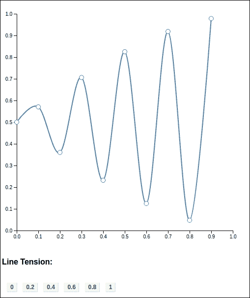

# 第七章. 形状化

在本章中，我们将涵盖：

+   创建简单形状

+   使用线条生成器

+   使用线曲线

+   改变线条张力

+   使用面积生成器

+   使用面积曲线

+   使用弧生成器

+   实现弧形过渡

# 简介

**可伸缩矢量图形**（**SVG**）是一个成熟的**万维网联盟**（**W3C**）标准，旨在为 Web 和移动平台上的用户交互式图形设计。与 HTML 类似，SVG 可以与其他技术，如 CSS 和 JavaScript，在现代浏览器中愉快地共存，并成为许多 Web 应用的基础。在今天的 Web 中，你可以看到 SVG 的用例无处不在，从数字地图到数据可视化。到目前为止，在这本书中，我们只使用 HTML 元素覆盖了大多数配方；然而，在实际项目中，SVG 是数据可视化的**事实标准**；它也是 D3 真正发光的地方。在本章中，我们将涵盖 SVG 的基本概念和 D3 对 SVG 形状生成的支持。SVG 是一个非常丰富的主题。可以，并且已经有许多书籍单独致力于这个主题；因此，我们不会计划或尝试涵盖所有与 SVG 相关的主题，而是将重点放在 D3 和数据可视化相关的技术和功能上。

## 什么是 SVG？

如其名所示，SVG 是关于图形的。它是用可伸缩矢量描述图形图像的一种方式。让我们看看 SVG 的两个主要优势：

### 矢量

SVG 图像基于矢量而不是像素。基于像素的方法，图像由一个位图组成，其坐标用*x*和*y*表示，并填充了彩色颜料。而基于矢量的方法，每个图像由一组使用简单和相对公式描述的几何形状组成，并填充了特定的纹理。正如你可以想象的那样，这种后一种方法自然地符合我们的数据可视化需求。在 SVG 中使用线条、条形和圆形来可视化你的数据，比试图在位图中操纵彩色颜料要简单得多。

### 可伸缩性

SVG 的第二个签名功能是可伸缩性。由于 SVG 图形是一组使用相对公式描述的几何形状，它可以被渲染和重新渲染，而不会失去精度。另一方面，当

以不同的尺寸和缩放级别，而不会失去精度。另一方面，当

基于位图的照片被调整到高分辨率，它们会遭受像素化的影响，即当单个像素变得可见时，而 SVG 没有这个缺点。参考以下图表以更好地了解我们刚才读到的内容：


SVG 与位图像素化

作为数据可视化者，使用 SVG 让你能够以任何分辨率显示你的可视化，而不会失去你引人注目创作的清晰度。除此之外，SVG 还提供了一些额外的优势，如下所示：

+   **可读性**：SVG 基于 XML，一种人类可读的标记语言。

+   **开放标准**：SVG 由 W3C 创建，不是专有供应商标准。

+   **采用**：所有现代浏览器都支持 SVG 标准，甚至在移动平台上也是如此。

+   **互操作性**：SVG 与其他 Web 技术（如 CSS 和 JavaScript）配合良好；D3 本身就是这种能力的完美展示。

+   **轻量级**：与基于位图的图像相比，SVG 要轻得多，占用的空间也小得多。

由于我们之前提到的所有这些功能，SVG 已经成为 Web 上数据可视化的**事实标准**。从本章开始，本书中的所有食谱都将使用 SVG 作为其最重要的部分进行展示，通过 SVG 可以充分发挥 D3 的真正威力。

### 注意

一些较旧的浏览器不支持 SVG。如果您的目标用户正在使用旧版浏览器，请在决定 SVG 是否是您可视化项目的正确选择之前检查 SVG 兼容性。您可以访问以下链接来检查您浏览器的兼容性：[`caniuse.com/#feat=svg`](http://caniuse.com/#feat=svg)

# 创建简单形状

在本食谱中，我们将探索一些简单的内置 SVG 形状公式及其属性。这些简单的形状很容易生成，通常在需要时手动使用 D3 创建。尽管这些简单形状不是与 D3 一起工作时最有用的形状生成器，但偶尔在可视化项目的边缘形状绘制时可能会很有用。

## 准备工作

在您的网络浏览器中打开以下文件的本地副本：

[`github.com/NickQiZhu/d3-cookbook-v2/blob/master/src/chapter7/simple-shapes.html`](https://github.com/NickQiZhu/d3-cookbook-v2/blob/master/src/chapter7/simple-shapes.html)

## 如何操作...

在本食谱中，我们将使用原生的 SVG 形状元素，以四种不同的颜色绘制四种不同的形状：

```js
<script type="text/javascript"> 
    var width = 600, 
        height = 500; 

    var svg = d3.select("body").append("svg"); 

    svg.attr("height", height) 
        .attr("width", width);     

    svg.append("line") // <-A 
        .attr("x1", 0) 
        .attr("y1", 200) 
        .attr("x2", 100) 
        .attr("y2", 100); 

    svg.append("circle") // <-B 
        .attr("cx", 200) 
        .attr("cy", 150) 
        .attr("r", 50); 

    svg.append("rect") 
        .attr("x", 300) // <-C 
        .attr("y", 100) 
        .attr("width", 100) // <-D 
        .attr("height", 100) 
        .attr("rx", 5); // <-E 

    svg.append("polygon") 
        .attr("points", "450,200 500,100 550,200"); // <-F 
</script> 

```

上述代码生成了以下视觉输出：


简单的 SVG 形状

## 它是如何工作的...

在这个例子中，我们使用 SVG 内置的形状元素绘制了四种不同的形状——一条线、一个圆、一个矩形和一个三角形，这些形状可以描述如下：

### 小贴士

**SVG 坐标系的简要回顾** SVG 的 *x* 和 *y* 坐标系起源于画布的左上角 `(0, 0)`，并延伸到右下角 `(<width>, <height>)`。

+   `line`：一个线元素创建了一条简单的直线，其坐标属性 `x1` 和 `y1` 作为起点，`x2` 和 `y2` 作为终点（参见图 `A`）。

+   `circle`：`append()` 函数通过坐标属性 `cx` 和 `cy` 绘制一个圆，这两个属性定义了圆的中心，而属性 `r` 定义了圆的半径（参见图 `B`）。

+   `rect`: `append()` 函数使用坐标属性 `x` 和 `y` 绘制矩形，这些属性定义了矩形的左上角（参考行 `C`），属性 `width` 和 `height` 控制矩形的大小，以及引入圆角的属性 `rx` 和 `ry`。属性 `rx` 和 `ry` 控制用于圆角矩形的椭圆的 *x* 和 *y* 轴半径（参考行 `E`）。

+   `polygon`: 要绘制多边形，需要使用 `points` 属性定义组成多边形的一组点（参考行 `F`）。`points` 属性接受由空格分隔的点坐标列表，如下面的代码片段所示：

```js
    svg.append("polygon") 
        .attr("points", "450,200 500,100 550,200"); // <-F 

```

所有 SVG 形状都可以使用样式属性直接或通过类似于 HTML 元素的 CSS 进行样式化。此外，它们可以使用 SVG 变换和过滤支持进行变换和过滤；然而，由于本书的范围有限，我们不会详细讨论这些主题。在本章的其余部分，我们将专注于 D3 特定的 SVG 形状生成支持。

## 还有更多...

SVG 也支持 `ellipse` 和 `polyline` 元素；然而，由于它们与 `circle` 和 `polygon` 的相似性，我们在这本书中不会详细讨论它们。有关 SVG 形状元素的更多信息，请访问 [`www.w3.org/TR/SVG/shapes.html`](https://www.w3.org/TR/SVG/shapes.html) .

### D3 SVG 形状生成器

SVG 形状元素中的“瑞士军刀”是 `svg:path`。路径定义了任何形状的轮廓，然后可以填充、描边或裁剪。我们迄今为止讨论的所有形状都可以仅使用 `svg:path` 进行数学定义。SVG 的 `path` 是一个非常强大的结构，并且有自己的迷你语言和语法。`svg:path` 迷你语言用于设置 `svg:path` 元素的 `d` 属性，它由以下命令组成：

+   **移动到**: M (绝对)/m (相对) 移动到 (x y)+

+   **闭合路径**: Z (绝对)/z (相对) 闭合路径

+   **直线到**: L (绝对)/l (相对) 直线到 (x y)+, H (绝对)/h (相对) 水平直线到 x+, V(绝对)/v(相对) 垂直直线到 y+

+   **三次贝塞尔曲线**: C(绝对)/c(相对) 曲线到 (x1 y1 x2 y2 x y)+, S(绝对)/s(相对) 简写曲线到 (x2 y2 x y)+

+   **二次贝塞尔曲线**: Q (绝对)/q (相对) 二次贝塞尔曲线到 (x1 y1 x y)+, T (绝对)/t (相对) 简写二次贝塞尔曲线到 (x y)+

+   **椭圆曲线**: A (绝对)/a (相对) 椭圆弧 (rx ry x-axis-rotation large-arc-flag sweep-flag x y)+

由于直接使用路径语言晦涩难懂，这种方法并不愉快，在大多数情况下，需要某种软件，例如 Adobe Illustrator 或 Inkscape，来帮助我们直观地创建 SVG `path`元素。同样，D3 附带了一套 SVG 形状生成器函数，可以用来生成数据驱动的路径公式；这就是 D3 如何通过结合 SVG 的力量和直观的数据驱动方法，真正地革新了数据可视化领域。这将是本章剩余部分的重点。

## 相关内容

+   请参考 [`www.w3.org/TR/SVG/Overview.html`](https://www.w3.org/TR/SVG/Overview.html) 了解更多关于 SVG 相关主题的信息

+   关于 SVG 路径公式语言及其语法的完整参考，请访问 [`www.w3.org/TR/SVG/paths.html`](https://www.w3.org/TR/SVG/paths.html)

# 使用线生成器

D3 线生成器可能是最通用的生成器之一。尽管它被称为线生成器，但它与`svg:line`元素几乎没有关系。相反，它是使用`svg:path`元素实现的。与`svg:path`类似，D3 `line`生成器非常灵活，你可以仅使用`line`有效地绘制任何形状；然而，为了使你的生活更轻松，D3 还提供了其他更专业的形状生成器，这些将在本章后面的食谱中介绍。在本食谱中，我们将使用`d3.svg.line`生成器绘制多个数据驱动的线。

## 准备工作

在你的网络浏览器中打开以下文件的本地副本：

[`github.com/NickQiZhu/d3-cookbook/blob/master/src/chapter7/line.html`](https://github.com/NickQiZhu/d3-cookbook/blob/master/src/chapter7/line.html)

## 如何做...

现在，让我们看看以下线生成器的实际效果：

```js
<script type="text/javascript"> 
    var width = 500, 
        height = 500, 
        margin = 50, 
        x = d3.scaleLinear() // <-A 
            .domain([0, 10]) 
            .range([margin, width - margin]), 
        y = d3.scaleLinear() // <-B 
            .domain([0, 10]) 
            .range([height - margin, margin]); 

    var data = [ // <-C 
        [ 
            {x: 0, y: 5},{x: 1, y: 9},{x: 2, y: 7}, 
            {x: 3, y: 5},{x: 4, y: 3},{x: 6, y: 4}, 
            {x: 7, y: 2},{x: 8, y: 3},{x: 9, y: 2} 
        ], 

        d3.range(10).map(function(i){ 
            return {x: i, y: Math.sin(i) + 5}; 
        }) 
    ]; 

var line = d3.line() // <-D 
            .x(function(d){return x(d.x);}) 
            .y(function(d){return y(d.y);}); 

    var svg = d3.select("body").append("svg"); 

    svg.attr("height", height) 
        .attr("width", width); 

     svg.selectAll("path.line") 
            .data(data) 
        .enter() 
            .append("path") // <-E 
            .attr("class", "line")             
            .attr("d", function(d){return line(d);}); // <-F 

    // Axes related code omitted 
    ...         
</script> 

```

上述代码绘制了与*x*和*y*轴相关的多条线：


D3 线生成器

## 工作原理...

在这个食谱中，我们用来绘制线的数据定义在一个二维数组中：

```js
var data = [ // <-C 
        [ 
            {x: 0, y: 5},{x: 1, y: 9},{x: 2, y: 7}, 
            {x: 3, y: 5},{x: 4, y: 3},{x: 6, y: 4}, 
            {x: 7, y: 2},{x: 8, y: 3},{x: 9, y: 2} 
        ], 

        d3.range(10).map(function(i){ 
            return {x: i, y: Math.sin(i) + 5}; 
        }) 
]; 

```

第一组数据是手动和明确定义的，而第二组数据则是通过数学公式生成的。这两种情况在数据可视化项目中都很常见。一旦数据被定义，为了将数据点映射到它们的视觉表示，为*x*和*y*坐标创建了以下两个比例尺：

x = d3.scaleLinear() // <-A .domain([0, 10]) .range([margin, width - margin]), y = d3.scaleLinear() // <-B .domain([0, 10]) .range([height - margin, margin]);

注意，这些比例尺的域被设置为足够大，以包含两个系列中的所有数据点，而范围被设置为表示画布区域而不包括边距。由于我们希望原点位于画布的左下角而不是 SVG 标准的左上角，因此*y*轴的范围是反转的。一旦数据和比例尺都设置好了，我们只需要生成线，使用`d3.line`函数定义我们的生成器：

```js
var line = d3.line() // <-D 
            .x(function(d){return x(d.x);}) 
            .y(function(d){return y(d.y);}); 

```

`d3.line`函数返回一个 D3 线生成器函数，您可以进一步自定义。在我们的例子中，我们只是为这个特定的线生成器声明了*x*坐标，它将使用`x`比例映射来计算，而*y*坐标将由`y`比例映射。使用 D3 比例映射坐标不仅方便，而且是一种广泛接受的最佳实践（关注点分离）。尽管技术上，您可以使用您喜欢的任何方法来实现这些函数。现在，您唯一需要做的就是实际创建以下`svg:path`元素：

```js
svg.selectAll("path.line") 
            .data(data) 
        .enter() 
            .append("path") // <-E 
            .attr("class", "line")             
            .attr("d", function(d){return line(d);}); // <-F 

```

代码中路径创建过程非常直接。创建了两个`svg:path`元素，使用我们定义的数据数组（在行`E`）。然后，使用我们之前创建的线生成器通过传递数据`d`作为其输入参数来设置每个路径元素的`d`属性。以下截图显示了生成的`svg:path`元素的外观：


生成的 SVG 路径元素

最后，使用我们之前定义的相同*x*和*y*比例创建了两个轴。由于本书空间有限，我们在本食谱和本章的其余部分省略了与轴相关的代码，因为它们实际上并没有改变，也不是本章的重点。

## 参见

有关 D3 轴支持详细信息的说明，请参阅第五章 Chapter 5. 玩转轴，*玩转轴*。

# 使用线曲线

默认情况下，D3 线生成器使用*线性曲线*模式；然而，D3 支持多种不同的曲线工厂。曲线函数决定了数据点将以何种方式连接，例如，通过直线（*线性*）或曲线（**B 样条**）。在本食谱中，我们将向您展示如何设置这些曲线模式及其效果。

## 准备工作

在您的网络浏览器中打开以下文件的本地副本：

[`github.com/NickQiZhu/d3-cookbook-v2/blob/master/src/chapter7/line-curve.html`](https://github.com/NickQiZhu/d3-cookbook-v2/blob/master/src/chapter7/line-curve.html)

本食谱是在前一个食谱的基础上构建的，所以如果您不是

如果您还不熟悉基本的线生成器函数，请首先参考前面的食谱

然后再继续。

## 如何做...

现在，让我们看看如何使用不同的线插值模式：

```js
<script type="text/javascript"> 
var width = 500, 
        height = 500, 
        margin = 30, 
        x = d3.scaleLinear() 
            .domain([0, 10]) 
            .range([margin, width - margin]), 
        y = d3.scaleLinear() 
            .domain([0, 10]) 
            .range([height - margin, margin]); 

    var data = [ 
        [ 
            {x: 0, y: 5},{x: 1, y: 9},{x: 2, y: 7}, 
            {x: 3, y: 5},{x: 4, y: 3},{x: 6, y: 4}, 
            {x: 7, y: 2},{x: 8, y: 3},{x: 9, y: 2} 
        ], 
        d3.range(10).map(function(i){ 
            return {x: i, y: Math.sin(i) + 5}; 
        }) 
    ]; 

    var svg = d3.select("body").append("svg"); 

    svg.attr("height", height) 
        .attr("width", width); 

    renderAxes(svg); 

    render(d3.curveLinear); 

    renderDots(svg); 

    function render(mode){ 
        var line = d3.line() 
                .x(function(d){return x(d.x);}) 
                .y(function(d){return y(d.y);}) 
                .curve(mode); // <-A 

        svg.selectAll("path.line") 
                .data(data) 
            .enter() 
                .append("path") 
                .attr("class", "line"); 

        svg.selectAll("path.line") 
                .data(data) 
            .attr("d", function(d){return line(d);}); 
    } 

    function renderDots(svg){ // <-B 
        data.forEach(function(list){ 
             svg.append("g").selectAll("circle") 
                .data(list) 
              .enter().append("circle") // <-C 
                .attr("class", "dot") 
                .attr("cx", function(d) { return x(d.x); }) 
                .attr("cy", function(d) { return y(d.y); }) 
                .attr("r", 4.5); 
        }); 
    } 
// Axes related code omitted 
... 
</script> 

<h4>Interpolation Mode:</h4> 
<div class="control-group"> 
<button onclick="render(d3.curveLinear)">linear</button> 
<button onclick="render(d3.curveLinearClosed)">linear closed</button> 
<button onclick="render(d3.curveStepBefore)">step before</button> 
<button onclick="render(d3.curveStepAfter)">step after</button> 
<button onclick="render(d3.curveBasis)">basis</button> 
<button onclick="render(d3.curveBasisOpen)">basis open</button> 
</div> 
... 

```

以下代码生成浏览器中的以下折线图，具有可配置的插值模式：


线性曲线

## 它是如何工作的...

总体而言，本食谱与上一个食谱类似。使用预定义的数据集生成两条线。然而，在本食谱中，您将允许用户选择特定的线插值模式，然后使用以下代码片段中的线生成器上的`interpolate`函数（参考行`A`）来设置：

```js
var line = d3.line() 
                .x(function(d){return x(d.x);}) 
                .y(function(d){return y(d.y);}) 
                .curve(mode); // <-A 

```

D3 支持以下插值模式：

+   `d3.curveLinear`: 线性段，即折线

+   `d3.curveLinearClosed`: 闭合线性段，即多边形

+   `d3.curveStepBefore`: 在垂直和水平段之间交替，就像步函数一样

+   `d3.curveStepAfter`: 在水平和垂直段之间交替，就像步函数一样

+   `d3.curveBasis`: 它是一个 B 样条，两端有控制点重复

+   `d3.curveBasisOpen`: 开放 B 样条；可能不会与起点或终点相交

+   `d3.curveBasisClosed`: 闭合的 B 样条，就像一个环

+   `d3.curveBundle`: 等同于基函数，但张力参数用于使样条变直

+   `d3.curveCardinal`: 一种基数样条，两端有控制点重复。

+   `d3.curveCardinalOpen`: 开放基数样条；可能不会与起点或终点相交，但会与其他控制点相交

+   `d3.curveCardinalClosed`: 闭合基数样条，就像一个环

+   `d3.curveMonotoneY`: 保留 y 的单调性的立方插值

+   `d3.curveCatmullRom`: 立方 catmull-Rom 样条。

此外，在`renderDots`函数中（参见图线`B`），我们还为每个数据点创建了一个小圆圈作为参考点。这些点使用`svg:circle`元素创建，如下面的代码片段的`C`行所示：

```js
function renderDots(svg){ // <-B 
        data.forEach(function(set){ 
             svg.append("g").selectAll("circle") 
                .data(set) 
              .enter().append("circle") // <-C 
                .attr("class", "dot") 
                .attr("cx", function(d) { return x(d.x); }) 
                .attr("cy", function(d) { return y(d.y); }) 
                .attr("r", 4.5); 
        }); 
} 

```

## 参见

+   有关所有 D3 曲线工厂的详细列表和 API 文档，请参阅[`github.com/d3/d3-shape#curves`](https://github.com/d3/d3-shape#curves)

# 改变线条张力

如果使用基数插值模式（基数、基数开放或基数闭合），则可以使用张力设置进一步修改线条。在这个菜谱中，您将看到如何修改张力以及它对线条插值的影响。

## 准备工作

在您的网络浏览器中打开以下文件的本地副本：

[`github.com/NickQiZhu/d3-cookbook-v2/blob/master/src/chapter7/line-tension.html`](https://github.com/NickQiZhu/d3-cookbook-v2/blob/master/src/chapter7/line-tension.html)

## 如何做...

现在，让我们看看如何改变线条张力以及它对线条生成的影响：

```js
<script type="text/javascript"> 
    var width = 500, 
        height = 500, 
        margin = 30, 
        duration = 500,     
        x = d3.scaleLinear() 
            .domain([0, 10]) 
            .range([margin, width - margin]), 
        y = d3.scaleLinear() 
            .domain([0, 1]) 
            .range([height - margin, margin]); 

var data = d3.range(10).map(function(i){ 
            return {x: i, y: (Math.sin(i * 3) + 1) / 2}; 
        }); 

    var svg = d3.select("body").append("svg"); 

    svg.attr("height", height) 
        .attr("width", width); 

    renderAxes(svg); 

    render(1); 

    function render(tension){ 
        var line = d3.line() 
                .curve(d3.curveCardinal.tension(tension)) // <-A 
                .x(function(d){return x(d.x);}) 
                .y(function(d){return y(d.y);}); 

        svg.selectAll("path.line") 
                .data([tension]) 
            .enter() 
                .append("path") 
                .attr("class", "line"); 

svg.selectAll("path.line") 
                .data([tension])  
            .transition().duration(duration) 
               .ease(d3.easeLinear) // <-B 
            .attr("d", function(d){ 
                return line(data); // <-C 
            }); 

        svg.selectAll("circle") 
            .data(data) 
          .enter().append("circle") 
            .attr("class", "dot") 
            .attr("cx", function(d) { return x(d.x); }) 
            .attr("cy", function(d) { return y(d.y); }) 
            .attr("r", 4.5); 
    } 
// Axes related code omitted 
    ... 
</script> 
<h4>Line Tension:</h4> 
<div class="control-group"> 
<button onclick="render(0)">0</button> 
<button onclick="render(0.2)">0.2</button> 
<button onclick="render(0.4)">0.4</button> 
<button onclick="render(0.6)">0.6</button> 
<button onclick="render(0.8)">0.8</button> 
<button onclick="render(1)">1</button> 
</div> 

```

上述代码生成一个可配置张力的基数线图：



线条张力

## 它是如何工作的...

张力将基数样条插值张力设置为`[0, 1]`范围内的特定数字。可以使用线条生成器的`tension`函数设置张力（参见图线`C`）：

```js
var line = d3.line() 
                .curve(d3.curveCardinal.tension(tension)) // <-A  
                .x(function(d){return x(d.x);}) 
                .y(function(d){return y(d.y);}); 

```

此外，我们还在图线`B`上启动了一个过渡，以突出张力对线条插值的影响。基数曲线的张力本质上决定了切线的长度。在张力为 1 时，它与曲线线性相同，而在张力为 0 时，它产生均匀的 Catmull-Rom 样条。如果没有明确设置张力，基数插值默认将张力设置为`0`。

# 使用区域生成器

使用 D3 线生成器，我们可以技术上生成任何形状的轮廓；然而，即使有不同的曲线支持，直接使用线（如面积图）绘制面积也不是一件容易的事情。这就是为什么 D3 还提供了一个专门为绘制面积而设计的独立形状生成器函数。

## 准备工作

在您的网络浏览器中打开以下文件的本地副本：

[`github.com/NickQiZhu/d3-cookbook-v2/blob/master/src/chapter7/area.html`](https://github.com/NickQiZhu/d3-cookbook-v2/blob/master/src/chapter7/area.html)

## 如何做...

在这个菜谱中，我们将向伪线图添加填充面积，从而有效地将其转换为

面积图：

```js
<script type="text/javascript"> 
    var width = 500, 
        height = 500, 
        margin = 30, 
        duration = 500, 
        x = d3.scaleLinear() // <-A 
            .domain([0, 10]) 
            .range([margin, width - margin]), 
        y = d3.scaleLinear() 
            .domain([0, 10]) 
            .range([height - margin, margin]); 

    var data = d3.range(11).map(function(i){ // <-B 
            return {x: i, y: Math.sin(i)*3 + 5}; 
        }); 

    var svg = d3.select("body").append("svg"); 

    svg.attr("height", height) 
        .attr("width", width);         

    renderAxes(svg); 

    render();     

    renderDots(svg); 

    function render(){ 
        var line = d3.line() 
                .x(function(d){return x(d.x);}) 
                .y(function(d){return y(d.y);}); 

        svg.selectAll("path.line") 
                .data([data]) 
            .enter() 
                .append("path") 
                .attr("class", "line");                 

        svg.selectAll("path.line") 
                .data([data])        
            .attr("d", function(d){return line(d);});         

        var area = d3.area() // <-C 
            .x(function(d) { return x(d.x); }) // <-D 
            .y0(y(0)) // <-E 
            .y1(function(d) { return y(d.y); }); // <-F 

        svg.selectAll("path.area") // <-G 
                .data([data]) 
            .enter() 
                .append("path") 
                .attr("class", "area") 
                .attr("d", function(d){return area(d);}); // <-H 
    } 

    // Dots rendering code omitted 

    // Axes related code omitted 
    ... 
</script> 

```

以下代码生成以下视觉输出：


面积生成器

## 它是如何工作的...

与之前给出的 *使用线生成器* 菜谱类似，在这个菜谱中我们定义了两个比例，用于将数据映射到 *x* 和 *y* 坐标上的视觉域（参见图 A），如下代码片段所示：

```js
        x = d3.scaleLinear() // <-A 
            .domain([0, 10]) 
            .range([margin, width - margin]), 
        y = d3.scaleLinear() 
            .domain([0, 10]) 
            .range([height - margin, margin]); 

    var data = d3.range(11).map(function(i){ // <-B 
            return {x: i, y: Math.sin(i)*3 + 5}; 
        }); 

```

在线 `B` 上，数据通过数学公式生成。然后使用 `d3.area` 函数创建面积生成器（参见图 `C`）：

```js
var area = d3.area() // <-C 
            .x(function(d) { return x(d.x); }) // <-D 
            .y0(y(0)) // <-E 
            .y1(function(d) { return y(d.y); }); // <-F 

```

如您所见，D3 面积生成器与线生成器类似，旨在在二维笛卡尔坐标系中工作。`x` 函数定义了一个访问器函数，用于 *x* 坐标（参见图 `D`），它简单地使用我们之前定义的 `x` 缩放映射数据到视觉坐标。对于 *y* 坐标，我们向面积生成器提供了两个不同的访问器：一个用于下限（`y0`）和一个用于上限（`y1`）坐标。这是面积生成器和线生成器之间的关键区别。D3 面积生成器支持 *x* 和 *y* 轴上的上下限（`x0`、`x1`、`y0`、`y1`），如果上下限相同，则支持简写访问器（`x` 和 `y`）。一旦定义了面积生成器，创建面积的方法几乎与线生成器相同：

```js
svg.selectAll("path.area") // <-G 
                .data([data]) 
            .enter() 
                .append("path") 
                .attr("class", "area") 
                .attr("d", function(d){return area(d);}); // <-H 

```

面积也是使用 `svg:path` 元素实现的（参见图 `G`）。D3 面积生成器用于生成 `svg:path` 元素上的 `d` 公式（参见图 `H`），其中数据 `d` 作为其输入参数。

# 使用面积曲线

与 D3 线生成器类似，面积生成器也支持相同的插值模式，因此它可以与线生成器在每种模式下结合使用。

## 准备工作

在您的网络浏览器中打开以下文件的本地副本：

[`github.com/NickQiZhu/d3-cookbook-v2/blob/master/src/chapter7/area-curve.html`](https://github.com/NickQiZhu/d3-cookbook-v2/blob/master/src/chapter7/area-curve.html)

## 如何做...

在这个菜谱中，我们将展示如何配置面积生成器的插值模式。这样，就可以创建与其对应的线匹配的插值面积：

```js
var width = 500, 
        height = 500, 
        margin = 30, 
        x = d3.scaleLinear() 
            .domain([0, 10]) 
            .range([margin, width - margin]), 
        y = d3.scaleLinear() 
            .domain([0, 10]) 
            .range([height - margin, margin]); 

    var data = d3.range(11).map(function(i){ 
        return {x: i, y: Math.sin(i)*3 + 5}; 
    }); 

    var svg = d3.select("body").append("svg"); 

    svg.attr("height", height) 
        .attr("width", width);         

    renderAxes(svg); 

    render(d3.curveLinear); 

    renderDots(svg); 

    function render(mode){ 
        var line = d3.line() 
                .x(function(d){return x(d.x);}) 
                .y(function(d){return y(d.y);}) 
                .curve(mode); // <-A 

        svg.selectAll("path.line") 
                .data([data]) 
            .enter() 
                .append("path") 
                .attr("class", "line");                 

        svg.selectAll("path.line") 
                .data([data])        
            .attr("d", function(d){return line(d);});         

        var area = d3.area() 
            .x(function(d) { return x(d.x); }) 
            .y0(y(0)) 
            .y1(function(d) { return y(d.y); }) 
            .curve(mode); // <-B 

        svg.selectAll("path.area") 
                .data([data]) 
            .enter() 
                .append("path") 
                .attr("class", "area") 

        svg.selectAll("path.area") 
            .data([data]) 
            .attr("d", function(d){return area(d);});         
    } 
// Dots and Axes related code omitted 

```

上述代码生成了以下可配置插值模式的伪面积图：


面积曲线

## 它是如何工作的...

本食谱与上一个类似，不同之处在于在本食谱中，根据用户的选取传入插值模式：

```js
var line = d3.line() 
                .x(function(d){return x(d.x);}) 
                .y(function(d){return y(d.y);}) 
                .curve(mode); // <-A 

var area = d3.area() 
            .x(function(d) { return x(d.x); }) 
            .y0(y(0)) 
            .y1(function(d) { return y(d.y); }) 
            .curve(mode); // <-B 

```

如您所见，曲线模式已在两条线上通过 `curve` 函数配置，同时与面积生成器一起（参见图 A 和 B）。由于 D3 线和面积生成器支持相同的曲线工厂集合，因此它们可以始终生成与本食谱中看到的匹配的线和面积。

## 还有更多...

D3 面积生成器在采用 Cardinal 模式时也支持相同的张力配置；然而，由于它与线生成器的张力支持相同，并且由于本书篇幅有限，我们在此不涵盖面积张力。

## 参见

+   请参阅[`github.com/d3/d3/blob/master/API.md#areas`](https://github.com/d3/d3/blob/master/API.md#areas)以获取有关面积生成器函数的更多信息

# 使用弧生成器

在最常见的形状生成器中——除了线和面积生成器之外——D3 还提供了 *弧生成器*。此时，你可能想知道，*SVG 标准已经包含了圆形元素，这还不够吗？*

对此的简单答案是 *不*。D3 弧生成器比简单的 `svg:circle` 元素要灵活得多。D3 弧生成器不仅能创建圆，还能创建环形（甜甜圈）、圆形扇区和环形扇区，所有这些我们将在本食谱中学习。更重要的是，弧生成器旨在生成弧（换句话说，不是完整的圆或扇区，而是任意角度的弧）。

## 准备工作

在您的网页浏览器中打开以下文件的本地副本：

[`github.com/NickQiZhu/d3-cookbook-v2/blob/master/src/chapter7/arc.html`](https://github.com/NickQiZhu/d3-cookbook-v2/blob/master/src/chapter7/arc.html)

## 如何操作...

在本食谱中，我们将使用弧生成器生成多切片圆、环形（甜甜圈）、圆形扇区和环形扇区，如下所示：

```js
<script type="text/javascript"> 
    var width = 400, 
        height = 400, 
        fullAngle = 2 * Math.PI, // <-A 
        colors =  d3.scaleOrdinal(d3.schemeCategory20); 

    var svg = d3.select("body").append("svg") 
                .attr("class", "pie") 
                .attr("height", height) 
                .attr("width", width);     

    function render(innerRadius, endAngle){ 
        if(!endAngle) endAngle = fullAngle; 

        var data = [ // <-B 
            {startAngle: 0, endAngle: 0.1 * endAngle}, 
            {startAngle: 0.1 * endAngle, endAngle: 0.2 * endAngle}, 
            {startAngle: 0.2 * endAngle, endAngle: 0.4 * endAngle}, 
            {startAngle: 0.4 * endAngle, endAngle: 0.6 * endAngle},   
            {startAngle: 0.6 * endAngle, endAngle: 0.7 * endAngle},   
            {startAngle: 0.7 * endAngle, endAngle: 0.9 * endAngle},   
            {startAngle: 0.9 * endAngle, endAngle: endAngle} 
        ]; 

        var arc = d3.arc().outerRadius(200) // <-C 
                        .innerRadius(innerRadius); 

        svg.select("g").remove(); 

        svg.append("g") 
                .attr("transform", "translate(200,200)") 
        .selectAll("path.arc") 
                .data(data) 
            .enter() 
                .append("path") 
                    .attr("class", "arc") 
                    .attr("fill", function(d, i){ 
      return colors(i); 
        }) 
                    .attr("d", function(d, i){ 
                        return arc(d, i); // <-D 
                    }); 
    } 

    render(0); 
</script> 

<div class="control-group"> 
<button onclick="render(0)">Circle</button> 
<button onclick="render(100)">Annulus(Donut)</button> 
<button onclick="render(0, Math.PI)">Circular Sector</button> 
<button onclick="render(100, Math.PI)">Annulus Sector</button> 
</div> 

```

以下代码生成了以下圆，您可以通过点击按钮将其更改为弧、扇区或弧扇区，例如，**环形（甜甜圈）**生成第二个形状：


弧生成器

## 它是如何工作的...

理解 D3 弧生成器最重要的部分是其数据结构。D3 弧生成器对其数据有非常具体的要求，如线 B 所示：

```js
var data = [ // <-B 
        {startAngle: 0, endAngle: 0.1 * endAngle}, 
        {startAngle: 0.1 * endAngle, endAngle: 0.2 * endAngle}, 
        {startAngle: 0.2 * endAngle, endAngle: 0.4 * endAngle}, 
        {startAngle: 0.4 * endAngle, endAngle: 0.6 * endAngle},    
        {startAngle: 0.6 * endAngle, endAngle: 0.7 * endAngle},    
        {startAngle: 0.7 * endAngle, endAngle: 0.9 * endAngle},   
        {startAngle: 0.9 * endAngle, endAngle: endAngle} 
]; 

```

弧数据集中的每一行都必须包含两个必填字段：`startAngle` 和 `endAngle`。角度必须在 `[0, 2 * Math.PI]` 范围内（参见图 A）。D3 弧生成器将使用这些角度生成相应的切片，如本食谱中前面所示。

### 注意

除了起始角和结束角，弧数据集还可以包含任意数量的附加字段，然后可以在 D3 函数中访问这些字段以驱动其他视觉表示。

如果你认为根据你拥有的数据计算这些角度将会非常麻烦，你完全正确。这就是为什么 D3 提供了一个特定的布局管理器来帮助你计算这些角度，我们将在下一章中介绍这一点。现在，让我们专注于理解幕后基本机制，这样当需要介绍布局管理器或者你任何时候需要手动设置角度时，你将能够充分准备。

```js
var arc = d3.arc().outerRadius(200) // <-C 
                    .innerRadius(innerRadius);  

```

`d3.arc`函数可选地具有`outerRadius`和`innerRadius`设置。当设置`innerRadius`时，弧生成器将生成一个环面（甜甜圈）的图像而不是一个圆。最后，D3 弧也是使用`svg:path`元素实现的，因此与线和面积生成器类似，`d3.arc`生成器函数可以被调用（参见图`D`）以生成`svg:path`元素的`d`公式：

```js
svg.append("g") 
            .attr("transform", "translate(200,200)") 
    .selectAll("path.arc") 
            .data(data) 
        .enter() 
            .append("path") 
                .attr("class", "arc") 
                .attr("fill", function(d, i){return colors(i);}) 
                .attr("d", function(d, i){ 
                    return arc(d, i); // <-D 
                }); 

```

值得在这里提到的一个额外元素是`svg:g`元素。这个元素本身不定义任何形状，而是一个容器元素，用于组合其他元素，在这种情况下，是`path.arc`元素。应用于`g`元素的变化会应用于所有子元素，同时其属性也会被其子元素继承。

## 参见

+   请参阅[`github.com/d3/d3/blob/master/API.md#arcs`](https://github.com/d3/d3/blob/master/API.md#arcs)以获取有关弧生成函数的更多信息

# 实现弧过渡

弧与其他形状（如线和面积）显著不同的一个领域是其过渡。到目前为止，我们涵盖的大多数形状，包括简单的 SVG 内置形状，你可以依赖 D3 过渡和插值来处理它们的动画。然而，当处理弧时并非如此。我们将在这个菜谱中探索弧过渡技术。

## 准备工作

在你的网络浏览器中打开以下文件的本地副本：

[`github.com/NickQiZhu/d3-cookbook-v2/blob/master/src/chapter7/arc-transition.html`](https://github.com/NickQiZhu/d3-cookbook-v2/blob/master/src/chapter7/arc-transition.html)

## 如何做...

在这个菜谱中，我们将动画一个多切片环，每个切片从角度`0`开始过渡到其最终所需的角度，最终形成一个完整的环。

```js
<script type="text/javascript"> 
    var width = 400, 
            height = 400, 
            endAngle = 2 * Math.PI, 
            colors = d3.scaleOrdinal(d3.schemeCategory20c); 

    var svg = d3.select("body").append("svg") 
            .attr("class", "pie") 
            .attr("height", height) 
            .attr("width", width); 

    function render(innerRadius) { 

        var data = [ 
            {startAngle: 0, endAngle: 0.1 * endAngle}, 
            {startAngle: 0.1 * endAngle, endAngle: 0.2 * endAngle}, 
            {startAngle: 0.2 * endAngle, endAngle: 0.4 * endAngle}, 
            {startAngle: 0.4 * endAngle, endAngle: 0.6 * endAngle}, 
            {startAngle: 0.6 * endAngle, endAngle: 0.7 * endAngle}, 
            {startAngle: 0.7 * endAngle, endAngle: 0.9 * endAngle}, 
            {startAngle: 0.9 * endAngle, endAngle: endAngle} 
        ]; 

        var arc = d3.arc() 
                .outerRadius(200).innerRadius(innerRadius); 

        svg.select("g").remove(); 

        svg.append("g") 
            .attr("transform", "translate(200,200)") 
            .selectAll("path.arc") 
                .data(data) 
            .enter() 
                .append("path") 
                .attr("class", "arc") 
                .attr("fill", function (d, i) { 
                    return colors(i); 
                }) 
                .transition().duration(1000) 
                .attrTween("d", function (d) { 
                  var start = {startAngle: 0, endAngle: 0}; // <-A 
                  var interpolate = d3.interpolate(start, d); // <-B 
                  return function (t) { 
                      return arc(interpolate(t)); // <-C 
                  }; 
                }); 
    } 

    render(100); 
</script> 

```

上述代码生成一个开始旋转并最终成为一个完整环的弧：


使用缓动函数的弧过渡

## 工作原理...

当面对这种过渡需求时，你首先可能想到的是使用纯 D3 过渡，同时依赖内置插值来生成动画。以下代码片段将完成这项工作：

```js
svg.append("g") 
        .attr("transform", "translate(200,200)") 
        .selectAll("path.arc") 
            .data(data) 
        .enter() 
            .append("path") 
            .attr("class", "arc") 
            .attr("fill", function (d, i) { 
                return colors(i); 
            }) 
            .attr("d", function(d){ 
               return arc({startAngle: 0, endAngle: 0}); 
             }) 
            .transition().duration(1000) 
            .attr("d", function(d){return arc(d);}); 

```

如前代码片段中突出显示的行所示，我们最初通过设置 `startAngle` 和 `endAngle` 都为零来创建切片路径。然后，通过过渡，我们使用弧生成函数 `arc(d)` 将路径 `d` 属性插值到其最终角度。这种方法看起来似乎合理，然而，它生成的过渡效果如下所示：


无缓动动画的弧过渡

这显然不是我们想要的动画。这种奇怪过渡的原因是，通过直接在 `svg:path` 属性 `d` 上创建过渡，我们指示 D3 对这个字符串进行插值：

```js
d="M1.2246063538223773e-14,-200A200,200 0 0,1 1.2246063538223773e- 
14,-200L6.123031769111886e-15,-100A100,100 0 0,0  
6.123031769111886e-15,-100Z" 

```

然后，前面的字符串将线性插值到这个字符串：

```js
d="M1.2246063538223773e-14,-200A200,200 0 0,1 117.55705045849463,- 
161.80339887498948L58.778525229247315,-80.90169943749474A100,100 0  
0,0 6.123031769111886e-15,-100Z" 

```

因此，导致了这种特定的过渡效果。

### 小贴士

尽管这种过渡效果不是我们在这个例子中所期望的，但这仍然很好地展示了内置 D3 过渡的灵活性和强大功能。

为了实现我们想要的过渡效果，我们需要利用 D3 属性缓动（有关缓动的详细描述，请参阅第六章中的*使用缓动*配方，*以风格进行过渡*）：

```js
svg.append("g") 
        .attr("transform", "translate(200,200)") 
        .selectAll("path.arc") 
            .data(data) 
        .enter() 
            .append("path") 
            .attr("class", "arc") 
            .attr("fill", function (d, i) { 
                return colors(i); 
            }) 
            .transition().duration(1000) 
            .attrTween("d", function (d) { // <-A 
                var start = {startAngle: 0, endAngle: 0}; // <-B 
                var interpolate = d3.interpolate(start, d); // <-C 
                return function (t) { 
                    return arc(interpolate(t)); // <-D 
                }; 
            }); 

```

在这里，我们不是直接过渡 `svg:path` 属性 `d`，而是在行 `A` 上创建了一个缓动函数。如您所回忆的，D3 `attrTween` 期望一个用于缓动函数的工厂函数。在这种情况下，我们从角度零开始缓动（参见图 `B`）。然后，我们在行 `C` 上创建了一个复合对象插值器，它将为每个切片插值起始和结束角度。最后，在行 `D` 上，使用弧生成器根据已经插值的角生成适当的 `svg:path` 公式。这就是如何通过自定义属性缓动创建平滑的、正确角度的弧过渡。

## 更多内容...

D3 还提供了对其他形状生成器的支持，例如符号、和弦和斜线。然而，由于它们的简单性和本书范围的限制，我们在这里不会单独介绍它们，尽管我们将在后续章节中作为其他更复杂视觉结构的部分来介绍它们。更重要的是，通过本章涵盖的这些基本形状生成器的扎实理解，你应该能够轻松地掌握其他 D3 形状生成器。

## 参见

+   关于过渡和缓动动画的更多信息，请参阅第六章中的*使用缓动动画配方*，*以风格进行过渡*。
