# 第九章。布局它们

在本章中，我们将涵盖：

+   建立饼图

+   建立堆叠面积图

+   建立树状图

+   建立树

+   建立围栏图

# 简介

D3 布局是本章的重点——一个我们之前未曾遇到的概念。正如预期的那样，D3 布局是计算和生成一组元素放置信息的算法。然而，在我们深入了解具体细节之前，有一些关键属性值得提及：

+   **布局是数据**：布局完全是数据驱动的，它们不直接生成任何图形或显示相关的输出。这使得它们可以在 SVG 或 canvas 上使用，甚至在没有图形输出的情况下也可以重复使用。

+   **抽象和可重用**：布局是抽象的，允许高度灵活性和可重用性。您可以通过各种有趣的方式组合和重用布局。

+   **布局不同**：每个布局都是不同的。D3 提供的每个布局都专注于一个非常特殊的图形需求和数据结构。

+   **无状态**：布局主要是无状态的，以简化其使用。这里的无状态意味着布局通常像函数一样；它们可以用不同的输入数据多次调用，并生成不同的布局输出。

布局是 D3 中有趣且强大的概念。在本章中，我们将通过创建一个利用这些布局的功能齐全的可视化来探索 D3 中一些最常用的布局。

# 建立饼图

饼图或圆形图是一种包含多个扇区的圆形图表，用于说明数值比例。在本食谱中，我们将探讨涉及 D3 **饼布局**的技术，以构建一个功能齐全的饼图。在第七章“进入形状”中，很明显，直接使用 D3 弧生成器是一项非常繁琐的工作。每个弧生成器都期望以下数据格式：

```js
var data = [ 
  {startAngle: 0, endAngle: 0.6283185307179586},  
  {startAngle: 0.6283185307179586, endAngle: 1.2566370614359172}, 
  ... 
  {startAngle: 5.654866776461628, endAngle: 6.283185307179586} 
]; 

```

这实际上需要计算整个圆周`2 * Math.PI`中每个切片的角度分区。显然，这个过程可以通过算法自动化，这正是`d3.pie`设计的目的。在本食谱中，我们将看到如何使用饼布局来实现一个功能齐全的饼图。

## 准备工作

在您的网络浏览器中打开以下文件的本地副本：[`github.com/NickQiZhu/d3-cookbook-v2/blob/master/src/chapter9/pie-chart.html`](https://github.com/NickQiZhu/d3-cookbook-v2/blob/master/src/chapter9/pie-chart.html)

## 如何做到这一点...

饼图或圆形图是将图表分成扇区（切片）的圆形图表。饼图在许多领域都很受欢迎，广泛用于展示不同实体之间的关系，尽管并非没有批评。让我们先看看如何使用`d3.layout`实现饼图：

```js
<script type="text/javascript"> 
    function pieChart() { 
        var _chart = {}; 

        var _width = 500, _height = 500, 
                _data = [], 
                _colors = d3.scaleOrdinal(d3.schemeCategory10), 
                _svg, 
                _bodyG, 
                _pieG, 
                _radius = 200, 
                _innerRadius = 100, 
                _duration = 1000; 

        _chart.render = function () { 
            if (!_svg) { 
                _svg = d3.select("body").append("svg") 
                        .attr("height", _height) 
                        .attr("width", _width); 
            } 

            renderBody(_svg); 
        }; 

        function renderBody(svg) { 
            if (!_bodyG) 
                _bodyG = svg.append("g") 
                        .attr("class", "body"); 

            renderPie(); 
        } 

        function renderPie() { 
            var pie = d3.pie() // <-A 
                    .sort(function (d) { 
                        return d.id; 
                    }) 
                    .value(function (d) { 
                        return d.value; 
                    }); 

            var arc = d3.arc() 
                    .outerRadius(_radius) 
                    .innerRadius(_innerRadius); 

            if (!_pieG) 
                _pieG = _bodyG.append("g") 
                        .attr("class", "pie") 
                        .attr("transform", "translate("  
                            + _radius  
                            + ","  
                            + _radius + ")"); 

            renderSlices(pie, arc); 

            renderLabels(pie, arc); 
        } 

  function renderSlices(pie, arc) { 
  // explained in detail in the'how it works...' section 
  ... 
  } 

  function renderLabels(pie, arc) { 
  // explained in detail in the 'how it works...' section 
  ... 
  } 
  ... 
  return _chart; 
} 
... 
</script> 

```

此食谱生成以下饼图：

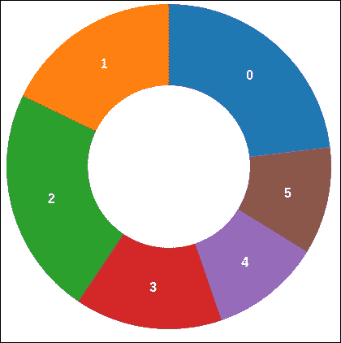

饼图

## 它是如何工作的...

这个食谱建立在你在第七章，*形状塑造*中学到的知识之上。一个主要的不同之处在于，你依赖`d3.pie`将原始数据转换成弧数据。饼图布局在行 A 创建，同时指定了排序和值访问器：

```js
var pie = d3.pie() // <-A 
              .sort(function (d) { 
                  return d.id; 
              }) 
              .value(function (d) { 
                  return d.value; 
              }); 

```

`sort`函数告诉饼图布局按其 ID 字段对切片进行排序，这样我们就可以在切片之间保持稳定的顺序。如果没有排序，默认情况下，饼图布局将按值排序切片，导致每次我们更新饼图时切片都会交换。`value`函数用于提供值访问器，在我们的例子中，它返回`value`字段。在渲染切片时，现在使用饼图布局，我们直接将`pie`函数调用的输出作为数据（记住，布局是数据）来生成`svg:path`元素（参见图`B`）：

```js
function renderSlices(pie, arc) { 
    var slices = _pieG.selectAll("path.arc") 
            .data(pie(_data)); // <-B 

    slices.enter() 
            .append("path") 
        .merge(slices) 
            .attr("class", "arc") 
            .attr("fill", function (d, i) { 
                return _colors(i); 
            }) 
        .transition() 
            .duration(_duration) 
            .attrTween("d", function (d) { 
                var currentArc = this.__current__; // <-C 

                if (!currentArc) 
                    currentArc = {startAngle: 0,  
                                    endAngle: 0}; 

                var interpolate = d3.interpolate( 
                                    currentArc, d); 

                this.__current__ = interpolate(1);//<-D 

                return function (t) { 
                    return arc(interpolate(t)); 
                }; 
            }); 
} 

```

在这一点上，你可能想知道`d3.pie`生成什么类型的数据。下面是输出数据的样子：

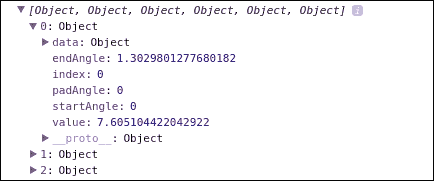

饼图输出数据

如我们所清楚地看到，这正是`d3.arc`生成器所期望的。这就是为什么我们可以直接使用`d3.arc`而不需要处理任何关于角度和分区的详细计算。渲染逻辑的其余部分基本上与你在第七章，*形状塑造*中学到的是一样的，只有一个例外可以在行 C 中看到。在行 C 中，我们从元素中检索当前的弧值，以便过渡可以从当前角度而不是零开始。然后，在行 D 中，我们将当前的弧值重置为最新值；因此，下次我们更新饼图数据时，我们可以重复状态化过渡。

### 提示

**技术 - 状态化可视化** 在 DOM 元素上注入值的技术是引入可视化状态性的常见方法。换句话说，如果你需要你的可视化记住它们之前的状态，你可以在 DOM 元素中保存它们，就像在这个食谱中行`C`所展示的那样。

最后，我们还需要在每个切片上渲染标签，以便我们的用户可以理解每个切片代表什么。这是通过`renderLabels`函数完成的：

```js
function renderLabels(pie, arc) { 
            var labels = _pieG.selectAll("text.label") 
                    .data(pie(_data)); // <-E 

            labels.enter() 
                    .append("text") 
                .merge(labels) 
                    .attr("class", "label") 
                .transition() 
                    .duration(_duration) 
                    .attr("transform", function (d) { 
                        return "translate("  
                            + arc.centroid(d) + ")"; // <-F 
                    }) 
                    .attr("dy", ".35em") 
                    .attr("text-anchor", "middle") 
                    .text(function (d) { 
                        return d.data.id; 
                    });         
} 

```

再次使用`pie`函数调用的输出作为数据来生成`svg:text`元素。标签的位置是通过`arc.centroid`计算的（参见图`F`）。此外，标签的位置通过过渡进行动画处理，这样它们就可以与弧一起移动。

## 更多...

饼图在许多不同的领域中被广泛使用。然而，由于它们难以用肉眼比较给定饼图的各个部分，以及它们的信息密度低，因此它们也受到了广泛的批评。因此，强烈建议将部分数量限制在三个以下，其中两个被认为是理想的。否则，您始终可以使用条形图或小型表格来替换饼图，以获得更好的精度和沟通能力。

## 相关内容

+   在第七章 *Getting into Shape* 的 *Using arc generators* 食谱中，[第七章。塑形]

+   在第七章 *Getting into Shape* 的 *Implementing arc transition* 食谱中，第七章

# 构建堆叠面积图

在第八章 *Chart Them Up* 的 *Creating an area chart* 食谱中，我们探讨了如何使用 D3 实现基本的分层面积图。在本食谱中，我们将基于面积图食谱中的内容来构建堆叠面积图。堆叠面积图是标准面积图的一种变体，其中不同的区域堆叠在一起，使观众能够比较不同的数据系列，以及它们与总量的比例关系。

## 准备工作

在您的网络浏览器中打开以下文件的本地副本：[`github.com/NickQiZhu/d3-cookbook-v2/blob/master/src/chapter9/stacked-area-chart.html`](https://github.com/NickQiZhu/d3-cookbook-v2/blob/master/src/chapter9/stacked-area-chart.html)

## 如何操作...

本食谱是在第八章 *Chart Them Up* 中我们所实现的内容的基础上构建的；因此，在以下代码示例中，仅包括与堆叠面积图特别相关的部分：

```js
<script type="text/javascript"> 
function stackedAreaChart() { 
    var _chart = {}; 

    var _width = 900, _height = 450, 
            _margins = {top: 30, left: 30, right: 30, bottom: 30}, 
            _x, _y, 
            _data = [], 
            _colors = d3.scaleOrdinal(d3.schemeCategory10), 
            _svg, 
            _bodyG, 
            _line; 

    _chart.render = function () { 
        if (!_svg) { 
            _svg = d3.select("body").append("svg") 
                    .attr("height", _height) 
                    .attr("width", _width); 

            renderAxes(_svg); 

            defineBodyClip(_svg); 
        } 

    renderBody(_svg); 
}; 
... 
function renderBody(svg) { 
   if (!_bodyG) 
       _bodyG = svg.append("g") 
                    .attr("class", "body") 
                    .attr("transform", "translate(" 
                            + xStart() + "," 
                            + yEnd() + ")") 
                    .attr("clip-path", "url(#body-clip)"); 

    var stack = d3.stack() // <-A 
                .keys(['value1', 'value2', 'value3']) 
                .offset(d3.stackOffsetNone); 

    var series = stack(_data); //<-B 

    renderLines(series); 

    renderAreas(series); 
} 

function renderLines(stackedData) { 
  // explained in details in the'how it works...' section 
... 
} 

function renderAreas(stackedData) { 
  // explained in details in the 'how it works...' section 
... 
} 
... 

```

本食谱生成以下可视化效果：

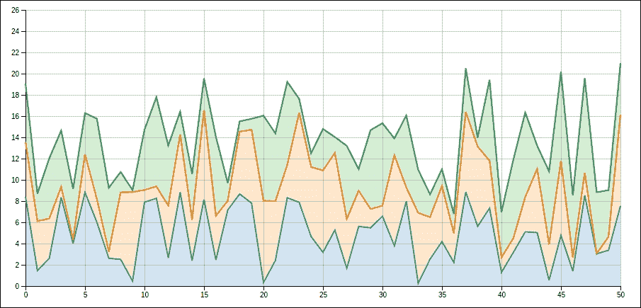

堆叠面积图

## 它是如何工作的...

与标准面积图相比，本食谱的主要区别在于堆叠，这也是本食谱的重点。本食谱中展示的堆叠效果是通过在行`A`上创建的`d3.stack`实现的：

```js
var stack = dn3.stack() // <-A 
                .keys(['value1', 'value2', 'value3']) // <-B 
                .offset(d3.stackOffsetNone); 
... 
function update() { 
    data = d3.range(numberOfDataPoint).map(function (i) { 
        return {value1: randomData(),  
                value2: randomData(),  
                value3: randomData()}; 
    }); 

    chart.data(data).render(); 
} 

```

如此代码片段所示，我们在`update`函数中生成的数据点有三个不同的系列，`value1`、`value2`和`value3`。这就是为什么我们需要在行`B`上指定它们的名称给`d3.stack`。我们在堆叠布局上所做的唯一其他定制是将其`offset`设置为`d3.stackOffsetNone`。D3 堆叠布局支持几种不同的偏移模式，这些模式决定了要使用的堆叠算法；这是我们将在本食谱和下一食谱中探讨的内容。在这种情况下，我们使用`zero`偏移堆叠，它生成一个零基线的堆叠算法，这正是本食谱所想要的。接下来，在行`B`上，我们对给定的数据数组调用了堆叠布局，生成了以下布局数据：

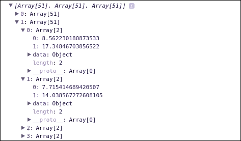

堆叠数据

如所示，堆叠布局自动为我们的三个不同数据系列中的每个数据计算一个`y`基线`0`以及`y`上界`1`。现在，有了这个堆叠数据集，我们可以轻松地生成堆叠线：

```js
function renderLines(series) { 
        _line = d3.line() 
                .x(function (d, i) { 
                    return _x(i); //<-C 
                }) 
                .y(function (d) { 
                    return _y(d[1]); //<-D 
                }); 

        var linePaths = _bodyG.selectAll("path.line") 
                .data(series); 

        linePaths.enter() 
                .append("path") 
            .merge(linePaths) 
                .style("stroke", function (d, i) { 
                    return _colors(i); 
                }) 
                .attr("class", "line") 
            .transition() 
                .attr("d", function (d) { 
                    return _line(d); 
                }); 
} 

```

使用`d3.line`生成函数创建了一个索引计数值`i`直接映射到`x`（参考行`C`），其`y`上界值映射到`d[1]`（参考行`D`）。这就是进行线堆叠所需做的所有事情。`renderLines`函数的其余部分基本上与基本区域图实现相同。区域堆叠逻辑略有不同：

```js
function renderAreas(series) { 
        var area = d3.area() 
                .x(function (d, i) { 
                    return _x(i); //<-E 
                }) 
                .y0(function(d){return _y(d[0]);}) //<-F 
                .y1(function (d) { 
                    return _y(d[1]); //<-G 
                }); 

        var areaPaths = _bodyG.selectAll("path.area") 
                .data(series); 

        areaPaths.enter() 
                .append("path") 
            .merge(areaPaths) 
                .style("fill", function (d, i) { 
                    return _colors(i); 
                }) 
                .attr("class", "area") 
            .transition() 
                .attr("d", function (d) { 
                    return area(d); 
                }); 
} 

```

与渲染区域时类似的线渲染逻辑，我们唯一需要更改的地方是在`d3.area`生成器设置中。对于区域，`x`值仍然直接映射到索引计数`i`（行 E），其`y0`直接映射到`y`基线`d[0]`，最后`y1`是`y`上界`d[1]`（行 G）。

如我们所见，D3 堆叠布局设计得非常好，可以与不同的 D3 SVG 生成函数兼容。因此，使用它来生成堆叠效果非常直接和方便。

## 还有更多...

让我们看看堆叠区域图的几个变体。

### 扩展区域图

我们已经提到`d3.stack`支持不同的偏移模式。除了我们之前看到的`d3.stackOffsetNone`偏移之外，对于区域图来说，另一个非常有用的偏移模式称为`d3.stackOffsetExpand`。使用`d3.stackOffsetExpand`模式，堆叠布局将不同层标准化以填充范围`[0, 1]`。如果我们更改此食谱中的偏移模式以及 y 轴域为`[0, 1]`，我们将得到以下扩展（标准化）区域图；这种可视化在观众更关心每个数据系列的相对比例而不是其绝对值时非常有用：

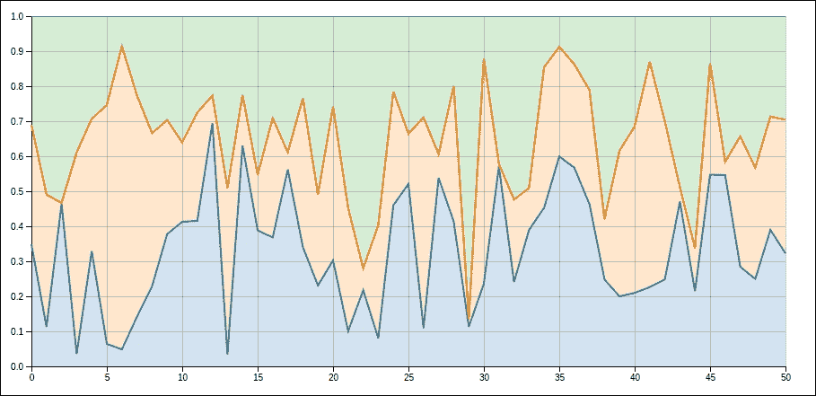

扩展区域图

对于完整的配套代码示例，请访问[`github.com/NickQiZhu/d3-cookbook-v2/blob/master/src/chapter9/expanded-area-chart.html`](https://github.com/NickQiZhu/d3-cookbook-v2/blob/master/src/chapter9/expanded-area-chart.html)。

### 流图

堆叠区域图的另一个有趣的变体称为流图。流图是一种围绕中心轴显示的堆叠区域图，创建出流动和有机的形状。流图最初由 Lee Byron 开发，并于 2008 年在一篇关于电影票房收入的纽约时报文章中普及。D3 堆叠布局内置了对这种堆叠算法的支持，因此，将基于零的堆叠区域图转换为流图非常简单。关键区别在于流图使用`d3.stackOffsetWiggle`作为其布局偏移模式。流图在你想强调数据的变化或其随时间的变化趋势而不是其绝对值时非常有用。

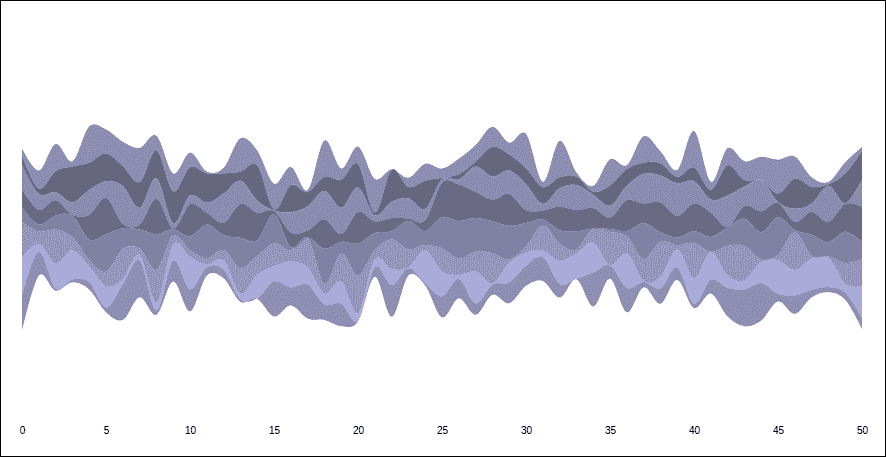

流图

完整的配套代码示例，请访问 [`github.com/NickQiZhu/d3-cookbook-v2/blob/master/src/chapter9/streamgraph.html`](https://github.com/NickQiZhu/d3-cookbook-v2/blob/master/src/chapter9/streamgraph.html) 。

## 参考信息

+   `d3.stack` 函数提供了几个额外的函数来定制其行为；有关堆叠布局的更多信息，请访问 [`github.com/d3/d3/blob/master/API.md#stacks`](https://github.com/d3/d3/blob/master/API.md#stacks)

+   在第八章 Chart Them Up 中创建区域图

# 构建树状图

树状图是由 Ben Shneiderman 在 1991 年提出的。树状图将层次树结构数据显示为一系列递归划分的矩形。换句话说，它将树的每个分支显示为一个大的矩形，然后用表示子分支的小矩形进行平铺。这个过程会一直重复，直到达到树的叶子节点。

### 注意

关于树状图的更多信息，请参阅 Ben Shneiderman 在 [`www.cs.umd.edu/hcil/treemap-history`](http://www.cs.umd.edu/hcil/treemap-history) 上关于空间受限层次结构可视化的树状图。

在我们深入代码示例之前，让我们首先定义我们所说的**层次数据**。到目前为止，我们讨论了许多能够表示通常存储在一维或二维数组中的平面数据结构的可视化类型。在本章的剩余部分，我们将把我们的重点转向数据可视化中另一种常见的类型——层次数据结构。与平面数据结构不同，层次数据通常以根树的形式结构化。以下 JSON 文件显示了数据可视化项目中可能会遇到的典型层次数据：

```js
{ 
  "name": "flare", 
  "children": [ 
  { 
    "name": "analytics", 
    "children": [ 
    { 
      "name": "cluster", 
      "children": [ 
        {"name": "AgglomerativeCluster", "size": 3938}, 
        {"name": "CommunityStructure", "size": 3812}, 
        {"name": "MergeEdge", "size": 743} 
      ] 
    }, 
    { 
      "name": "graph", 
      "children": [ 
        {"name": "BetweennessCentrality", "size": 3534}, 
        {"name": "LinkDistance", "size": 5731} 
      ] 
    }, 
    { 
      "name": "optimization", 
      "children": [ 
        {"name": "AspectRatioBanker", "size": 7074} 
      ] 
    } 
  ]   
  ] 
} 

```

这是从 D3 社区中广泛使用的流行分层数据集的简化版本，用于演示目的。这些数据是从一个流行的基于 Flash 的数据可视化库中提取的，该库由加州大学伯克利分校可视化实验室创建，名为 `flare`。它显示了库中不同包的大小和层次关系。

### 注意

有关项目的更多信息，请参考官方 Flare 网站 [`flare.prefuse.org/`](http://flare.prefuse.org/) 。

如我们很容易看到的，这个特定的 JSON 数据流被结构化为一个典型的单链根树，每个节点有一个父节点和存储在 `children` 数组中的多个子节点。这是为了使 D3 层次布局能够消费你的层次数据的一种相当常见的方式。在本章的剩余部分，我们将使用这个特定的数据集来探索 D3 提供的不同层次数据可视化技术。

## 准备工作

在你的网络浏览器中打开以下文件的本地副本：[`github.com/NickQiZhu/d3-cookbook-v2/blob/master/src/chapter9/treemap.html`](https://github.com/NickQiZhu/d3-cookbook-v2/blob/master/src/chapter9/treemap.html)。

## 如何实现...

现在，让我们看看如何使用 `d3.treemap` 函数来直观地表示这种层次数据：

```js
function treemapChart() { 
        var _chart = {}; 

        var _width = 1600, _height = 800, 
                _colors = d3.scaleOrdinal(d3.schemeCategory20c), 
                _svg, 
                _nodes, 
                _valueAccessor, 
                _treemap, 
                _bodyG; 

        _chart.render = function () { 
            if (!_svg) { 
                _svg = d3.select("body").append("svg") 
                        .attr("height", _height) 
                        .attr("width", _width); 
            } 

            renderBody(_svg); 
        }; 

        function renderBody(svg) { 
            // explained in the 'how it works...' section 
            ...  

            renderCells(cells); 
        } 

        function renderCells(cells){ 
            // explained in the 'how it works...' section 
            ... 
        } 

        // accessors omitted 
        ... 

        return _chart; 
} 

d3.json("flare.json", function (nodes) { 
  var chart = treemapChart(); 
  chart.nodes(nodes).render(); 
}); 

```

这个菜谱生成了以下 `treemap` 可视化：

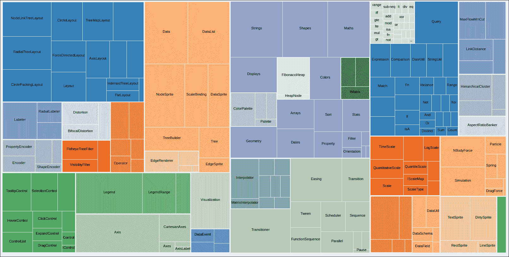

Treemap

## 它是如何工作的...

在这一点上，你可能会惊讶地发现实现如此复杂的数据可视化所需的代码如此之少。这是因为大部分繁重的工作都是由 `d3.treemap` 和 `d3.hierarchy` 函数完成的：

```js
function renderBody(svg) { 
        if (!_bodyG) { 
            _bodyG = svg.append("g") 
                    .attr("class", "body"); 

            _treemap = d3.treemap() //<-A 
                    .size([_width, _height]) 
                    .round(true) 
                    .padding(1); 
        } 

        var root = d3.hierarchy(_nodes) // <-B 
                .sum(_valueAccessor) 
                .sort(function(a, b) {  
                     return b.value - a.value;  
                }); 

        _treemap(root); //<-C 

        var cells = _bodyG.selectAll("g") 
                .data(root.leaves()); // <-D 

        renderCells(cells); 
    } 

```

在第 A 行定义了 `d3.treemap` 布局，并有一些基本的自定义设置：

+   `round(true)`: 当启用舍入时，树图布局将舍入到精确的像素边界。当你想要避免 SVG 中的抗锯齿伪影时，这非常好。

+   `size([_width, _height])`: 它将布局边界设置为这个 SVG 的大小。

+   `padding(1)`: 我们将填充设置为 1，这样在树图中生成的块之间就会有空白填充。

在这个菜谱中，我们使用 `d3.hierarchy` 函数在第 B 行重新结构化输入数据，使其能够被 `d3.treemap` 和其他 D3 层次数据函数消费：

+   `sum(_valueAccessor)`: 这个菜谱提供的一个特性是能够动态切换树图值访问器。值访问器由 `d3.hierachy` 函数用于访问每个节点的值字段。在我们的例子中，它可以是以下函数之一：

```js
function(d){ return d.size; } // visualize package size 
function(d){ return 1; } // visualize package count 

```

+   `sort(function(a, b) { return b.value - a.value; })`: 我们还指示 `d3.hierarch` 按照每个节点的值顺序排序，从而有效地使树图按照块的大小顺序排列。

要在 Flare JSON 数据源上应用 `d3.hierarchy` 转换，我们只需将 `d3.hierarchy` 函数上的 `nodes` 设置为我们 JSON 树的根节点（参见图 B）。然后，我们使用变量 `root` 存储经过 `d3.hierarchy` 转换后的数据。现在数据看起来是这样的：

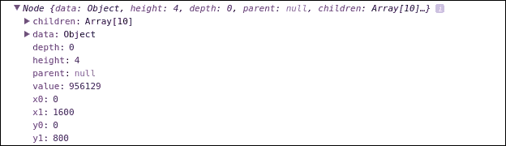

Treemap 层次结构转换

如我们所见，在转换之后，每个节点现在都根据其所有子节点的值的总和以及计算出的深度和大小来计算其值，如下所示：

+   `depth`: 它表示节点的深度

+   `height`: 它表示树中节点的长度

+   `value`: 它表示所有子树值的总和

+   `x0`: 它表示单元格开始的 *x* 坐标

+   `y0`: 它表示单元格开始的 *y* 坐标

+   `x1`: 它表示单元格结束的 *x* 坐标

+   `y1`: 它表示单元格结束的 *y* 坐标

经过这次转换后，现在我们可以将 `root` 变量传递到第 C 行的 `_treemap` 函数。现在，我们准备生成可视化。在第 D 行，我们仅使用树图的叶节点生成单元格：

```js
var cells = _bodyG.selectAll("g") 
                .data(root.leaves()); // <-D 

```

这是因为首先，d3.selection.data 期望的是扁平数据数组而不是层次化树。其次，树图实际上只渲染叶节点；子树分组是通过颜色来可视化的。如果我们仔细观察可视化，这一点并不难发现。

在`renderCells`函数中，为给定的节点创建了一组`svg:g`元素。然后`renderCells`函数负责创建矩形及其标签：

```js
function renderCells(cells) { 
        var cellEnter = cells.enter().append("g") 
                .attr("class", "cell") 
                .attr("transform", function (d) { 
                    return "translate(" + d.x0 + ","  
                                     + d.y0 + ")"; //<-E 
                }); 

        renderRect(cellEnter, cells); 

        renderText(cellEnter, cells); 

        cells.exit().remove(); 
    } 

```

每个矩形放置在其位置`(x, y)`，该位置由 E 行上的布局确定：

```js
function renderRect(cellEnter, cells) { 
        cellEnter.append("rect"); 

        cellEnter.merge(cells) 
                .transition() 
                .attr("transform", function (d) { 
                    return "translate(" + d.x0 + "," + d.y0 + ")";  
                }) 
                .select("rect") 
                .attr("width", function (d) { //<-F 
                    return d.x1 - d.x0; 
                }) 
                .attr("height", function (d) { 
                    return d.y1 - d.y0; 
                }) 
                .style("fill", function (d) { 
                    return _colors(d.parent.data.name); //<-G 
                }); 
    } 

```

然后，在`renderRect`函数中，我们在 F 行将其宽度和高度分别设置为`d.x1 - d.x0`和`d.y1 - d.y0`。在 G 行，我们使用其父级的名称为每个单元格着色，从而确保属于同一父级的所有子项都以相同的方式着色。下一步是渲染标签：

```js
function renderText(cellEnter, cells) { 
        cellEnter.append("text"); 

        cellEnter.merge(cells) 
                .select("text") //<-H 
                .style("font-size", 11) 
                .attr("x", function (d) { 
                    return (d.x1 - d.x0) / 2; 
                }) 
                .attr("y", function (d) { 
                    return (d.y1 - d.y0) / 2; 
                }) 
                .attr("text-anchor", "middle") 
                .text(function (d) { 
                    return d.data.name; 
                }) 
                .style("opacity", function (d) { 
                    d.w = this.getComputedTextLength(); 
                    return d.w < (d.x1 - d.x0) ? 1 : 0; //<-I 
                }); 
    } 

```

从 H 行开始，我们为每个矩形创建了标签（`svg:text`）元素，并将其文本设置为节点名称。在这里值得提到的一个方面是，为了避免显示比单元格本身还小的标签，如果标签的宽度大于单元格宽度，则将标签的不透明度设置为 0（请参阅 I 行）。

### 小贴士

**技术 - 自动隐藏标签** 在 I 行我们看到的是可视化中实现自动隐藏标签的有用技术。这个技术可以一般地考虑以下形式：`.style("opacity", function (d) {` `width = this.getComputedTextLength();` `return d.dx > width ? 1 : 0;`

## 相关内容

+   这个菜谱灵感来源于 Mike Bostock 的 treemap 布局示例，您可以在[`mbostock.github.io/d3/talk/20111018/treemap.html`](http://mbostock.github.io/d3/talk/20111018/treemap.html)找到它。

# 构建树

当处理层次化数据结构时，树（树图）可能是最自然和常用的可视化之一，通常用于展示不同数据元素之间的结构依赖关系。树是一个无向图，其中任何两个节点（顶点）通过一条且仅有一条简单路径连接。在本菜谱中，我们将学习如何使用 D3 树布局实现树形可视化。

## 准备就绪

在您的网络浏览器中打开以下文件的本地副本：

[`github.com/NickQiZhu/d3-cookbook-v2/blob/master/src/chapter9/tree.html`](https://github.com/NickQiZhu/d3-cookbook-v2/blob/master/src/chapter9/tree.html) .

## 如何做...

现在让我们看看`d3.tree`的实际应用：

```js
function tree() { 
        var _chart = {}; 

        var _width = 1600, _height = 1600, 
                _margins = {top: 30, left: 120, right: 30, bottom: 30}, 
                _svg, 
                _nodes, 
                _i = 0, 
                _duration = 300, 
                _bodyG, 
                _root; 

        _chart.render = function () { 
            if (!_svg) { 
                _svg = d3.select("body").append("svg") 
                        .attr("height", _height) 
                        .attr("width", _width); 
            } 

            renderBody(_svg); 
        }; 

        function renderBody(svg) { 
            if (!_bodyG) { 
                _bodyG = svg.append("g") 
                        .attr("class", "body") 
                        .attr("transform", function (d) { 
                            return "translate(" + _margins.left 
                                    + "," + _margins.top + ")"; 
                        }); 
            } 

            _root = d3.hierarchy(_nodes); // <-A 

            render(_root); 
        } 

        function render(root) { 
            var tree = d3.tree() // <-B 
                        .size([ 
                            (_height - _margins.top - _margins.bottom), 
                            (_width - _margins.left - _margins.right) 
                        ]); 

            tree(root); // <-C 

            renderNodes(root); // <-D 

            renderLinks(root); // <-E 
        } 

  function renderNodes(nodes, source) { 
    // will be explained in the 'how it works...' section 
    ... 
  } 

  function renderLinks(nodes, source) { 
    // will be explained in the 'how it works...' section 
    ... 
  } 

  // accessors omitted 
  ... 

  return _chart; 
} 

```

这个菜谱生成了以下树形可视化：

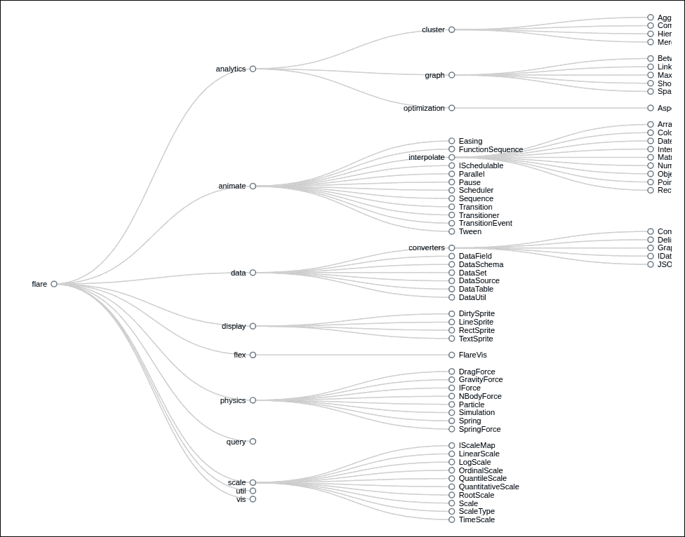

树

## 它是如何工作的...

如我们之前所述，这个菜谱是基于 D3 树布局构建的。`d3.tree` 函数专门设计用于将层次数据结构转换为适合生成树图的视觉布局数据。然而，与 *构建一个树状图* 菜谱类似，`d3.tree` 布局函数只接受结构化的 D3 层次数据，这意味着在我们可以使用布局函数之前，我们需要使用 `d3.hierachy` 首先处理和格式化我们的数据。同样，在这个菜谱中，我们使用的是本章迄今为止使用的相同的 Flare 项目包数据。原始 JSON 数据源如下所示：

```js
{ 
 "name": "flare", 
 "children": [ 
  { 
   "name": "analytics", 
   "children": [ 
    { 
     "name": "cluster", 
     "children": [ 
      {"name": "AgglomerativeCluster", "size": 3938}, 
      {"name": "CommunityStructure", "size": 3812}, 
      {"name": "HierarchicalCluster", "size": 6714}, 
      {"name": "MergeEdge", "size": 743} 
     ] 
}, 
... 
} 

```

此数据被加载并传递到以下函数中的我们的图表对象：

```js
function flare() { 
        d3.json("../../data/flare.json", function (nodes) { 
            chart.nodes(nodes).render(); 
        }); 
} 

```

一旦数据加载完成，我们首先将加载的 JSON 数据传递给 d3.hierachy 进行处理（参考行 A）：

```js
_root = d3.hierarchy(_nodes); // <-A 

```

在这个菜谱中，我们只需要这些，因为 `d3.tree` 布局只关心节点之间的层次关系，因此，我们不需要像在 *构建一个树状图* 菜谱中那样对数据进行求和或排序。一旦处理完成，我们现在可以使用以下代码创建树布局：

```js
var tree = d3.tree() // <-B 
                .size([ 
                    (_height - _margins.top - _margins.bottom), 
                    (_width - _margins.left - _margins.right) 
                ]); 

```

我们在这里提供的唯一设置是我们的可视化大小，即我们的 SVG 图像大小减去边距。`d3.tree` 函数将处理其余部分并相应地计算每个节点的位置。要使用树布局，你只需在行 C 上调用布局函数即可。

```js
tree(root); // <-C 

```

如果你查看 `nodes` 布局数据，它包含如下所示的数据：

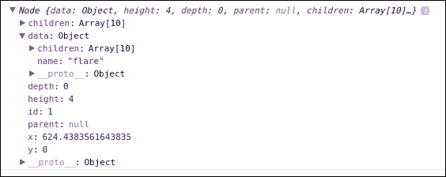

树布局数据

树节点在 `renderNode` 函数中如下渲染：

```js
function renderNodes(root) { 
            var nodes = root.descendants(); 

            var nodeElements = _bodyG.selectAll("g.node") 
                    .data(nodes, function (d) { 
                                    return d.id || (d.id = ++_i); 
                                }); 

            var nodeEnter = nodeElements.enter().append("g") 
                    .attr("class", "node") 
                    .attr("transform", function (d) {  // <-F 
                        return "translate(" + d.y 
                                + "," + d.x + ")"; 
                    }) 
                    .on("click", function (d) { // <-G 
                        toggle(d); 
                        render(_root); 
                    }); 

            nodeEnter.append("circle") // <-H 
                    .attr("r", 4); 

            var nodeUpdate = nodeEnter.merge(nodeElements) 
                .transition().duration(_duration) 
                .attr("transform", function (d) { 
                    return "translate(" + d.y + "," + d.x + ")"; // <-I 
                }); 

            nodeUpdate.select('circle') 
                .style("fill", function (d) { 
                  return d._children ? "lightsteelblue" : "#fff"; // <-J 
                }); 

            var nodeExit = nodeElements.exit() 
                    .transition().duration(_duration) 
                    .attr("transform", function (d) { 
                        return "translate(" + d.y 
                                + "," + d.x + ")"; 
                    }) 
                    .remove(); 

            nodeExit.select("circle") 
                    .attr("r", 1e-6) 
                    .remove(); 

            renderLabels(nodeEnter, nodeUpdate, nodeExit); 
} 

```

在这个函数中，我们首先生成一组与 `root.descendents()` 绑定的 `g.node` 元素：

```js
var nodes = root.descendants(); 
var nodeElements = _bodyG.selectAll("g.node") 
        .data(nodes, function (d) { 
            return d.id || (d.id = ++_i); 
        }); 

```

`root.descendents` 函数返回层次数据中的所有节点。这与我们在 *构建一个树状图* 菜单中使用的 `root.leaves` 函数不同。`root.leaves` 函数只返回作为 JavaScript 数组的叶节点；然而，使用 `d3.tree` 布局时，我们不仅关注叶节点，还关注任何中间节点，以便可视化整个树结构，因此，我们需要使用 `root.descendents`。在此阶段，我们还使用索引为每个节点分配一个 ID 以获得对象一致性；如对此概念不熟悉，请参考 第六章，*以风格过渡*，了解更多关于对象一致性的信息；

```js
var nodeEnter = nodeElements.enter().append("g") 
            .attr("class", "node") 
            .attr("transform", function (d) {  // <-F 
                return "translate(" + d.y 
                        + "," + d.x + ")"; 
            }) 
            .on("click", function (d) { // <-G 
                toggle(d); 
                render(_root); 
            }); 

```

在行 F 上，我们创建了节点并将它们移动到 `d3.tree` 布局为我们计算的 `(d.y, d.x)` 坐标。在这种情况下，我们交换了 `x` 和 `y`，因为默认情况下 `d3.tree` 布局以竖直模式计算坐标，而在这个菜谱中我们希望以横幅模式渲染。在行 G 上，我们还创建了 `onClick` 事件处理程序来处理用户对树节点的鼠标点击。`toggle` 函数由以下代码组成：

```js
        function toggle(d) { 
            if (d.children) { 
                d._children = d.children; 
                d.children = null; 
            } else { 
                d.children = d._children; 
                d._children = null; 
            } 
        } 

```

此函数有效地暂时隐藏了给定数据节点上的子节点字段。这样做本质上从该节点中移除所有子节点，在可视化中因此给用户一种点击节点时折叠其子树的感觉：

```js
nodeEnter.append("circle") // <-H 
            .attr("r", 4); 

    var nodeUpdate = nodeEnter.merge(nodeElements) 
            .transition().duration(_duration) 
                .attr("transform", function (d) { 
                    return "translate(" + d.y + "," + d.x + ")"; // <-I 
                }); 

    nodeUpdate.select('circle') 
            .style("fill", function (d) { 
                return d._children ? "lightsteelblue" : "#fff"; // <-J 
         }); 

```

在第 H 行，我们创建了 SVG 圆形元素来表示每个树节点，并且再次将它们定位在`(d.y, d.x)`。最后，在第 J 行，我们根据节点是折叠还是打开，通过检查由`toggle`函数生成的临时`_children`文件来用不同的填充色着色节点。其余的节点和标签渲染代码相当简单，所以在这里我们不会逐行介绍；更多详情请参考 GitHub 上的源代码。

在这个食谱中下一个重要的函数是`renderLinks`函数。此函数绘制了我们刚刚创建的所有连接树节点的链接：

```js
function renderLinks(root) { 
            var nodes = root.descendants().slice(1); 

            var link = _bodyG.selectAll("path.link") 
                .data(nodes, function (d) { 
                    return d.id || (d.id = ++_i); 
                }); 

            link.enter().insert("path", "g") // <-M 
                        .attr("class", "link") 
                    .merge(link) 
                    .transition().duration(_duration) 
                       .attr("d", function (d) { 
                        return generateLinkPath(d, d.parent); // <-N 
                    }); 

            link.exit().remove(); 
} 

```

首先，为了渲染链接，我们使用`root.descendants().slice(1)`作为其数据，而不是`root.descendants()`。这是因为对于`n`个节点，有`n - 1`个链接，因为在树中不存在指向根节点的链接。再次使用对象一致性来使我们的可视化在重新渲染期间更加稳定。然后，在第 M 行，我们创建了路径元素来表示我们可视化中的每个链接。现在，这个函数有趣的部分在于第 N 行的`generateLinkPath`函数：

```js
function generateLinkPath(target, source) { 
    var path = d3.path(); 
    path.moveTo(target.y, target.x); 
    path.bezierCurveTo((target.y + source.y) / 2, target.x, 
            (target.y + source.y) / 2, source.x, source.y, source.x); 
    return path.toString(); 
} 

```

在这个函数中，我们使用`d3.path`生成器生成一个连接源节点和目标节点的贝塞尔曲线。你可能注意到，`d3.path`生成器的使用几乎就像描述如何绘制线条。在这种情况下，我们将这条线的起点移动到`(target.y, target.x)`，然后从目标到源使用给定的控制点绘制贝塞尔曲线，如下面的插图所示：

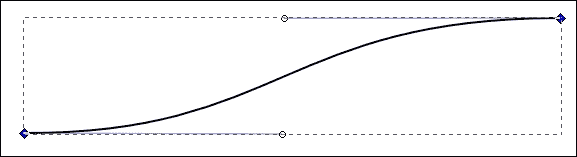

贝塞尔曲线

### 注意

当然，如果你熟悉 SVG 路径命令，那么你可以不使用`d3.path`生成器生成 d 公式。在这种情况下，我们本质上使用 M 和 C 命令。然而，`d3.path`生成器函数更易于阅读，并且与 SVG 和 Canvas 都兼容得很好，因此通常产生更易于维护的代码。有关 SVG 路径命令的更多信息，请参阅 [`www.w3.org/TR/SVG/paths.html#PathDataCubicBezierCommands`](https://www.w3.org/TR/SVG/paths.html#PathDataCubicBezierCommands)。

到目前为止，我们现在已经将整个树形图可视化。正如你所见，借助`d3.tree`布局，绘制这种复杂可视化相对直接，如果不是容易的话。

## 参见

+   `d3.tree` 提供了几个函数，允许自定义。更多详情，请查看其 API 文档，链接为 [`github.com/d3/d3-hierarchy/blob/master/README.md#tree`](https://github.com/d3/d3-hierarchy/blob/master/README.md#tree)。

+   `d3.path`生成器能够在画布和 SVG 上生成任何任意线条；更多信息，请参考其 API 文档[`github.com/d3/d3-path/blob/master/README.md#path`](https://github.com/d3/d3-path/blob/master/README.md#path)。

+   请参考第六章中的*动画多个元素*菜谱，*以风格过渡*，以了解对象恒常性的解释。

+   此菜谱灵感来源于 Mike Bostock 的 Tidy Tree 示例，您可以在[`bl.ocks.org/mbostock/4339184`](http://bl.ocks.org/mbostock/4339184)找到。

# 构建封装图

封装图是使用递归圆形打包算法的层次数据结构的有趣可视化。它使用包含（嵌套）来表示层次结构。为数据树中的每个叶节点创建圆形，其大小与每个数据元素的一个特定定量维度成比例。在这个菜谱中，您将学习如何使用 D3 打包布局实现这种可视化。

## 准备工作

在您的网络浏览器中打开以下文件的本地副本：

[`github.com/NickQiZhu/d3-cookbook-v2/blob/master/src/chapter9/pack.html`](https://github.com/NickQiZhu/d3-cookbook-v2/blob/master/src/chapter9/pack.html)

## 如何操作...

在这个菜谱中，让我们看看如何使用`d3.pack`实现一个封装图：

```js
function pack() { 
        var _chart = {}; 

        var _width = 1280, _height = 800, 
                _svg, 
                _valueAccessor, 
                _nodes, 
                _bodyG; 

        _chart.render = function () { 
            if (!_svg) { 
                _svg = d3.select("body").append("svg") 
                        .attr("height", _height) 
                        .attr("width", _width); 
            } 

            renderBody(_svg); 
        }; 

        function renderBody(svg) { 
          if (!_bodyG) { 
              _bodyG = svg.append("g") 
                      .attr("class", "body"); 
          } 

          var pack = d3.pack() // <-A 
                  .size([_width, _height]); 

          var root = d3.hierarchy(_nodes) // <-B 
                        .sum(_valueAccessor) 
                        .sort(function(a, b) {  
                          return b.value - a.value;  
                        }); 

          pack(root); // <-C 

          renderCircles(root.descendants()); 

          renderLabels(root.descendants()); 
       } 

    function renderCircles(nodes) { 
      // will be explained in the 'how it works...' section 
      ... 
    } 

    function renderLabels(nodes) { 
      // omitted 
      ... 
    } 

    // accessors omitted 
    ... 

    return _chart; 
} 

```

此菜谱生成了以下可视化：

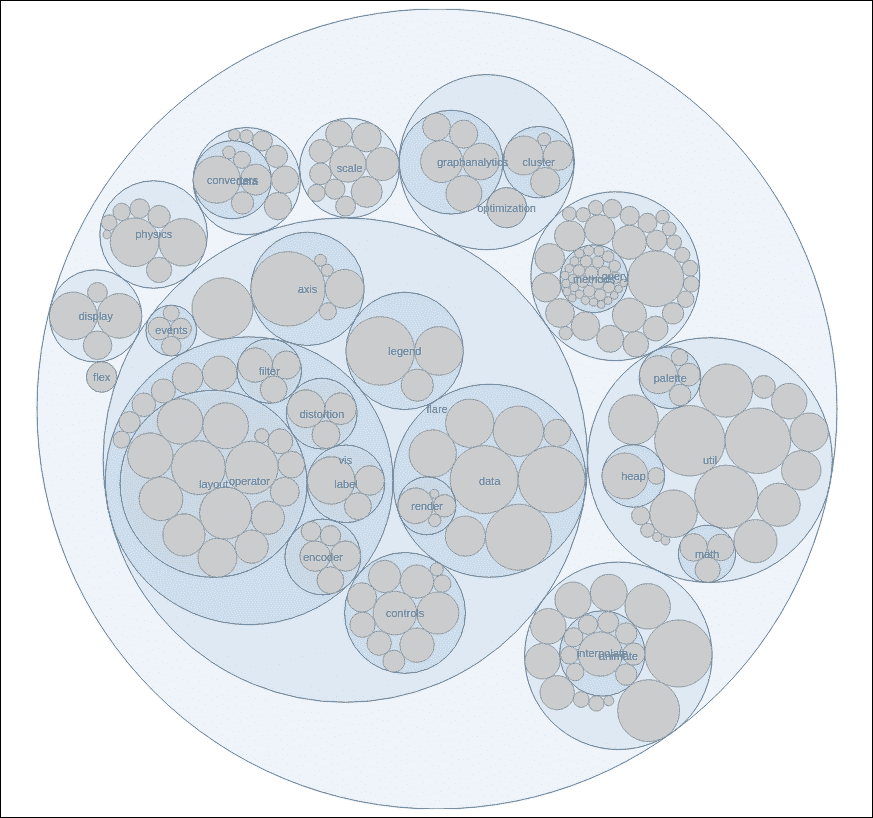

封装图

## 工作原理...

在这个菜谱中，我们继续使用描述 Flare 项目包关系的层次 JSON 数据源。有关数据源的信息，请参考本章的*构建树状图*菜谱。JSON 数据结构如下所示：

```js
{ 
 "name": "flare", 
 "children": [ 
  { 
   "name": "analytics", 
   "children": [ 
    { 
     "name": "cluster", 
     "children": [ 
      {"name": "AgglomerativeCluster", "size": 3938}, 
      {"name": "CommunityStructure", "size": 3812}, 
      {"name": "HierarchicalCluster", "size": 6714}, 
      {"name": "MergeEdge", "size": 743} 
     ] 
    }, 
    ... 
   } 
  ] 
} 

```

此数据在`flare`函数中加载到图表对象中：

```js
function flare() { 
    d3.json("../../data/flare.json", function (nodes) { 
       chart.nodes(nodes).valueAccessor(size).render(); 
    }); 
} 

```

在这个可视化中，我们首先需要关注的是定义我们的布局；在这种情况下，我们需要使用`d3.pack`布局：

```js
var pack = d3.pack() // <-A 
            .size([_width, _height]); 

```

我们在布局上设置了可视化的尺寸，以便它可以相应地计算。之后，在我们再次将 JSON 数据传递给`d3.pack`布局之前，我们需要首先使用`d3.hierarchy`函数（参考 B 行）对其进行处理，这是任何 D3 层次可视化必备的先决条件：

```js
var root = d3.hierarchy(_nodes) // <-B 
                .sum(_valueAccessor) 
                .sort(function(a, b) { return b.value - a.value; }); 
pack(root); // <-C 

```

在这种情况下，我们通过`_valueAccessor`函数告诉`d3.hierarchy`函数将所有值相加，该函数默认以`d.size`作为值。此外，我们还要求`d3.hierachy`函数根据值对节点进行排序。最后，我们将处理后的数据传递给 C 行上的`pack`函数。经过此过程后的布局数据现在看起来如下：

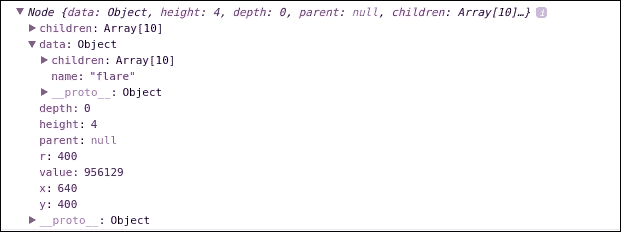

打包布局数据

圆形渲染是在`renderCircle`函数中完成的：

```js
function renderCircles(nodes) { // <-C 
    var circles = _bodyG.selectAll("circle") 
            .data(nodes); 
    circles.enter().append("circle") 
            .merge(circles) 
            .transition() 
        .attr("class", function (d) { 
            return d.children ? "parent" : "child"; 
        }) 
        .attr("cx", function (d) {return d.x;}) // <-D 
        .attr("cy", function (d) {return d.y;}) 
        .attr("r", function (d) {return d.r;}); 
    circles.exit().transition() 
            .attr("r", 0) 
            .remove(); 
} 

```

然后，我们简单地绑定布局数据并为每个节点创建 `svg:circle` 元素。对于更新，我们将 `cx`、`cy` 和 `radius` 设置为打包布局为我们每个圆计算出的值（参见图 D）。最后，在移除圆之前，我们首先将圆的大小减小到零，然后再移除它们以生成更平滑的过渡。在这个菜谱中，标签渲染相当直接，得益于我们在本章中引入的自动隐藏技术，因此我们不会在这里详细说明该函数。

## 参见

+   `d3.pack` 函数提供了几个允许定制的函数。有关更多详细信息，请查看其 API 文档，链接为 [`github.com/d3/d3-hierarchy/blob/master/README.md#pack`](https://github.com/d3/d3-hierarchy/blob/master/README.md#pack)。

+   *构建树状图* 菜谱中的自动标签隐藏技术。

+   这个菜谱灵感来源于 Mike Bostock 的打包布局示例，您可以在 [`bl.ocks.org/mbostock/ca5b03a33affa4160321`](http://bl.ocks.org/mbostock/ca5b03a33affa4160321) 找到。
