使用力

在本章中，我们将涵盖：

+   使用重力和电荷

+   自定义速度

+   设置链接约束

+   使用力来辅助可视化

+   操作力

+   构建力导向图

# 第十一章：简介

> *使用力量，卢克！*
> 
> **师傅对徒弟的智慧之言**

在这一章中，我们将涵盖 D3 最迷人的方面之一：力。力模拟是您可以添加到可视化中的一种最令人敬畏的技术。通过一系列高度交互和完全功能性的示例，我们将帮助您探索 D3 力（例如，力导向图）的典型应用，以及力操作的其他基本方面。

D3 力模拟支持并非作为一个独立的功能，而是一种额外的 D3 布局。正如我们在第九章中提到的，“布局”，D3 布局是非视觉数据导向的布局管理程序，旨在与不同的可视化一起使用。力模拟最初是为了实现一种称为**力导向图**的特定类型可视化而创建的。其实现使用标准的**速度** **Verlet 积分**来模拟粒子上的物理力。

换句话说，D3 实现了一种数值方法，它能够使用步进时间函数通过其速度松散地模拟粒子的运动。当然，这种模拟在实现特定可视化（如力导向图）方面是理想的；然而，您也会在本章的菜谱中发现，力模拟能够生成许多其他有趣的视觉效果，这得益于其在自定义力操作方面的灵活性。本章中介绍的技术应用甚至超出了数据可视化领域，并在许多其他领域有实际应用，例如用户界面设计。当然，在本章中，我们还将涵盖力的经典应用：力导向图。

# 使用重力和电荷

在这个菜谱中，我们将向您介绍前两种基本力：重力和电荷。正如我们之前提到的，力布局设计的一个目标是对粒子的运动进行松散模拟，而这个模拟的一个主要特点是电荷力。此外，力模拟还实现了伪重力，或者更准确地说，是一种通常以画布为中心的弱几何约束，可以利用它来防止您的可视化逃离画布。在下面的示例中，您将了解如何利用这两种基本、有时相反的力，通过粒子系统生成各种效果。

## 准备工作

在您的网络浏览器中打开以下文件的本地副本：

[`github.com/NickQiZhu/d3-cookbook-v2/blob/master/src/chapter11/gravity-and-charge.html`](https://github.com/NickQiZhu/d3-cookbook-v2/blob/master/src/chapter11/gravity-and-charge.html) .

## 如何做...

在以下示例中，我们将实验不同的力模拟重力电荷设置，以便您更好地理解涉及的不同对立力及其相互作用：

```js
<script type="text/javascript"> 
    var w = 1280, h = 800, r = 4.5, 
        nodes = [], 
        force = d3.forceSimulation() 
                .velocityDecay(0.8) 
                .alphaDecay(0) 
                .force("collision",  
                   d3.forceCollide(r + 0.5).strength(1)); 

    var svg = d3.select("body") 
        .append("svg") 
            .attr("width", w) 
            .attr("height", h); 

    force.on("tick", function () { 
        svg.selectAll("circle") 
            .attr("cx", function (d) {return d.x;}) 
            .attr("cy", function (d) {return d.y;}); 
    }); 

    svg.on("mousemove", function () { 
        var point = d3.mouse(this), 
            node = {x: point[0], y: point[1]}; // <-A 

        svg.append("circle") 
                .data([node]) 
            .attr("class", "node") 
            .attr("cx", function (d) {return d.x;}) 
            .attr("cy", function (d) {return d.y;}) 
            .attr("r", 1e-6) 
        .transition() 
            .attr("r", r) 
        .transition() 
            .delay(7000) 
            .attr("r", 1e-6) 
            .on("end", function () { 
                nodes.shift(); // <-B 
                force.nodes(nodes); 
            }) 
            .remove(); 

        nodes.push(node); // <-C 
        force.nodes(nodes); 
    }); 

    function noForce(){ 
        force.force("charge", null); 
        force.force("x", null); 
        force.force("y", null); 
        force.restart(); 
    } 

    function repulsion(){ 
        force.force("charge", d3.forceManyBody().strength(-10)); 
        force.force("x", null); 
        force.force("y", null); 
        force.restart(); 
    } 

    function gravity(){ 
        force.force("charge", d3.forceManyBody().strength(1)); 
        force.force("x", null); 
        force.force("y", null); 
        force.restart(); 
    } 

    function positioningWithGravity(){ 
        force.force("charge", d3.forceManyBody().strength(0.5)); 
        force.force("x", d3.forceX(w / 2)); 
        force.force("y", d3.forceY(h / 2)); 
        force.restart(); 
    } 

    function positioningWithRepulsion(){ 
        force.force("charge", d3.forceManyBody().strength(-20)); 
        force.force("x", d3.forceX(w / 2)); 
        force.force("y", d3.forceY(h / 2)); 
        force.restart(); 
    } 

</script> 

<div class="control-group"> 
    <button onclick="noForce()"> 
        No Force 
    </button> 
    <button onclick="repulsion()"> 
        Repulsion 
    </button> 
    <button onclick="gravity()"> 
        Gravity 
    </button> 
    <button onclick="positioningWithGravity()"> 
        Positioning with Gravity 
    </button> 
    <button onclick="positioningWithRepulsion()"> 
        Positioning with Repulsion 
    </button> 
</div> 

```

此配方生成一个具有力的粒子系统，能够在以下图中显示的模式中运行：


力模拟模式

## 它是如何工作的...

在我们动手编写前面的代码示例之前，让我们先深入探讨一下α衰变、速度衰减、电荷、定位和碰撞的基本概念，这样我们可以更容易地理解在这个配方中我们将使用的所有神奇数字设置。

### α衰减

α值决定了模拟的“热度”。默认情况下，模拟从α值为 1 开始，通过 300 次迭代衰减到 0。因此，如果您将α衰减设置为 0，表示没有衰减，因此模拟将永远不会停止。我们将在这个章节中使用这个设置，以便更好地展示效果。在实际的视觉化中，您通常会使用某种程度的衰减，这样模拟在一段时间后会冷却下来，类似于现实世界中粒子的行为。

### 速度衰减

在模拟粒子的每个 tick 中，速度会按指定的衰减值缩小。因此，值为 1 对应于无摩擦环境，而值为 0 则会使所有粒子立即冻结，因为它们失去了速度。

### 电荷

电荷被指定来模拟粒子之间的相互 n 体力。负值将导致相互节点排斥，而正值将导致相互节点吸引。

### 定位

如果指定了 X 或 Y 定位力，模拟将根据配置的强度将粒子推向给定维度上的期望位置。这通常用作作用于模拟中所有粒子的全局力。

### 碰撞

碰撞力将粒子视为具有一定半径的圆而不是无大小的点。这将防止粒子在模拟中重叠。

好的，现在定义已经明确了，让我们看看这些力如何被利用来生成有趣的视觉效果。

### 设置零力布局

要设置零力布局，我们只需设置既没有重力也没有电荷的力布局。力布局可以使用`d3.forceSimulation`函数创建：

```js
var w = 1280, h = 800, r = 4.5, 
        nodes = [], 
        force = d3.forceSimulation() 
                .velocityDecay(0.8) 
                .alphaDecay(0) 
                .force("collision",  
                    d3.forceCollide(r + 0.5).strength(1)); 

```

首先，我们禁用 `alphaDecay` 以确保在设置 `velocityDecay` 为 `0.8` 以模拟摩擦效果的同时，模拟可以继续运行而不冷却。接下来，我们将 `collision` 设置为稍大于我们稍后创建的 `svg:circle` 元素的半径。有了这个设置，我们就可以在用户移动鼠标时在 SVG 上创建表示为 `svg:circle` 的额外节点：

```js
svg.on("mousemove", function () { 
        var point = d3.mouse(this), 
            node = {x: point[0], y: point[1]}; // <-A 

        svg.append("circle") 
                .data([node]) 
            .attr("class", "node") 
            .attr("cx", function (d) {return d.x;}) 
            .attr("cy", function (d) {return d.y;}) 
            .attr("r", 1e-6) 
        .transition() 
            .attr("r", r) 
        .transition() 
            .delay(7000) 
            .attr("r", 1e-6) 
            .on("end", function () { 
                nodes.shift(); // <-B 
                force.nodes(nodes); 
            }) 
            .remove(); 

        nodes.push(node); // <-C 
        force.nodes(nodes); 
    }); 

```

节点对象最初在行 `A` 上创建，其坐标设置为当前鼠标位置。像所有其他 D3 布局一样，力模拟不知道也没有视觉元素。因此，我们创建的每个节点都需要在行 `C` 上添加到布局的节点数组中，并在行 `B` 上移除这些节点的视觉表示。默认情况下，力模拟在创建模拟后立即自动启动。在没有重力和电荷的情况下，这个设置实际上允许我们通过鼠标移动放置一串节点，如下面的截图所示：

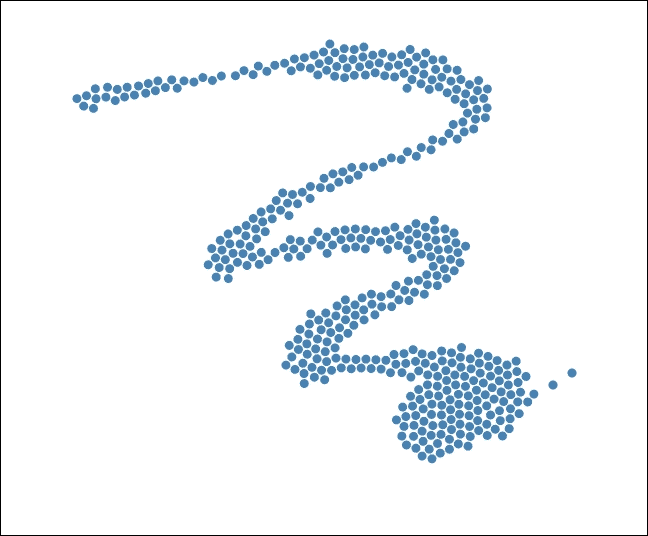

无重力或电荷

### 设置相互排斥

在下一个模式中，我们将电荷设置为负值，而不应用任何全局定位力，以便生成相互排斥的力场：

```js
    function repulsion(){ 
        force.force("charge", d3.forceManyBody().strength(-10)); 
        force.force("x", null); 
        force.force("y", null); 
        force.restart(); 
    } 

```

这些行告诉力布局对每个节点应用 `-10` 电荷，并根据每个时间步的模拟结果相应地更新节点的 `{x, y}` 坐标。然而，仅此还不够将粒子移动到 SVG 上，因为布局没有关于视觉元素的知识。接下来，我们需要编写一些代码将力布局正在操作的数据连接到我们的图形元素。以下是要执行此操作的代码：

```js
force.on("tick", function () { 
        svg.selectAll("circle") 
            .attr("cx", function (d) {return d.x;}) 
            .attr("cy", function (d) {return d.y;}); 
}); 

```

在这里，我们注册了一个 `tick` 事件监听器函数，该函数根据力布局的计算更新所有圆元素到其新位置。时间步监听器在模拟的每个时间步触发。在每个时间步，我们将 `cx` 和 `cy` 属性设置为 `d` 上的 `x` 和 `y` 值。这是因为我们已将节点对象作为数据绑定到这些圆元素上。因此，它们已经包含了力布局计算出的新坐标。这有效地建立了力布局对所有粒子的控制。

### 注意

力模拟还在节点对象上设置了除 x 和 y 之外的其他值，我们将在后面的菜谱中介绍并利用这些值来实现力拖动和自定义力。在这个菜谱中，让我们先专注于基于简单力的定位。

除了 `tick` 之外，力布局还支持一些其他事件：

+   `tick`: 在模拟的每个时间步触发

+   `end`: 当模拟结束时触发

这种力设置生成了以下视觉效果：

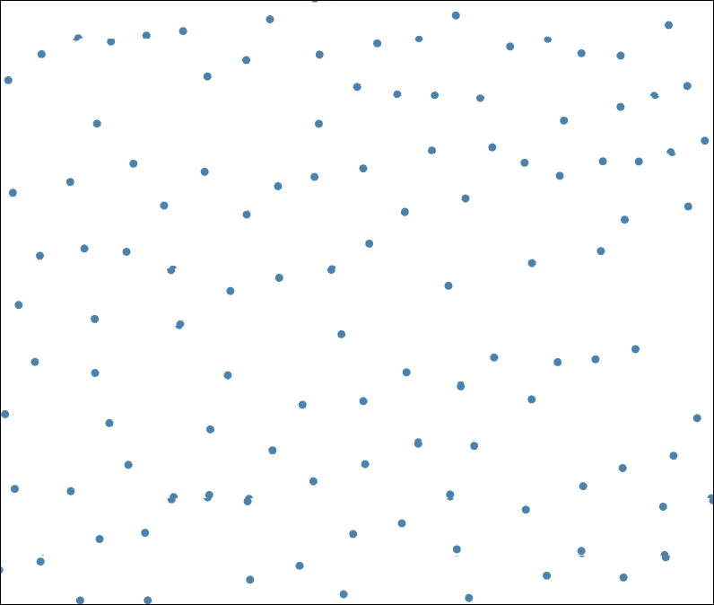

相互排斥

### 设置重力

当我们将电荷更改为正值时，它会在粒子之间产生相互吸引或重力：

```js
     function gravity(){ 
        force.force("charge", d3.forceManyBody().strength(1)); 
        force.force("x", null); 
        force.force("y", null); 
        force.restart(); 
    } 

```

这生成了以下视觉效果：

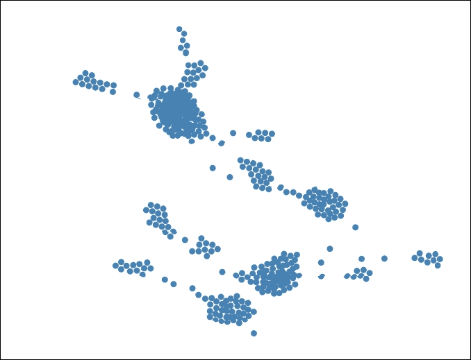

重力

### 使用重力设置定位

当我们打开中心定位力并启用重力时，它会产生与相互吸引类似的效果；然而，当鼠标光标从中心移开时，你可以注意到强烈的引力：

```js
    function positioningWithGravity(){ 
        force.force("charge", d3.forceManyBody().strength(0.5)); 
        force.force("x", d3.forceX(w / 2)); 
        force.force("y", d3.forceY(h / 2)); 
        force.restart(); 
    } 

```

此菜谱生成以下效果：

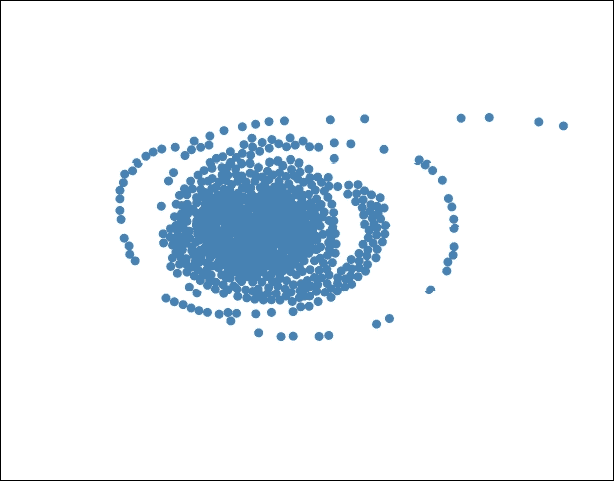

带有重力的定位

### 使用排斥力设置定位

最后，我们可以同时打开定位和相互排斥。结果是保持所有粒子相对稳定的力平衡，既不会逃逸也不会相互碰撞：

```js
    function positioningWithRepulsion(){ 
        force.force("charge", d3.forceManyBody().strength(-20)); 
        force.force("x", d3.forceX(w / 2)); 
        force.force("y", d3.forceY(h / 2)); 
        force.restart(); 
    } 

```

这是这种力平衡的外观：

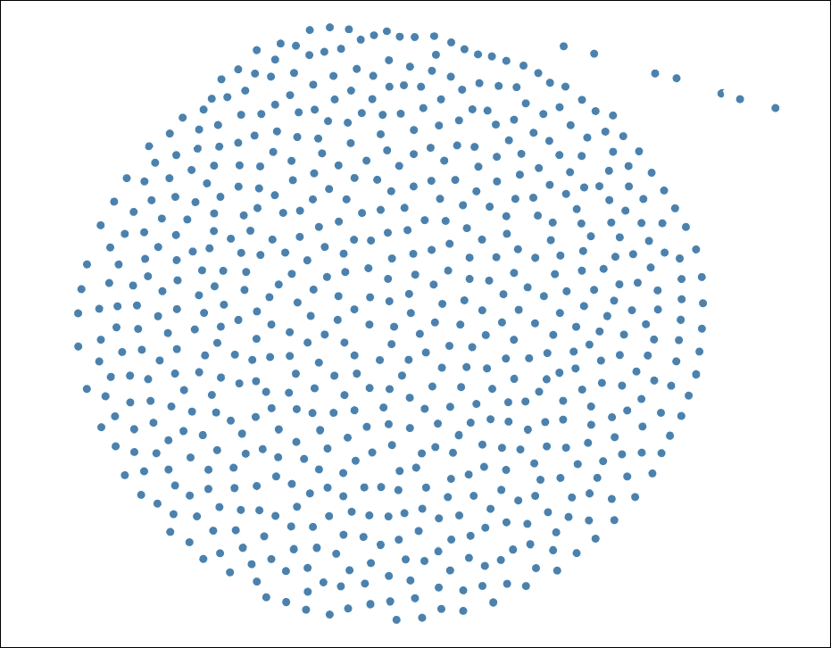

带有排斥力的定位

## 参考信息

+   参考速度 Verlet 积分，见[`en.wikipedia.org/wiki/Verlet_integration`](https://en.wikipedia.org/wiki/Verlet_integration)

+   参考可扩展、多功能且简单的约束图布局，见[`www.csse.monash.edu.au/~tdwyer/Dwyer2009FastConstraints.pdf`](http://www.csse.monash.edu.au/~tdwyer/Dwyer2009FastConstraints.pdf)

+   参考物理模拟，见[`www.gamasutra.com/resource_guide/20030121/jacobson_pfv.htm`](http://www.gamasutra.com/resource_guide/20030121/jacobson_pfv.htm)

+   本章的内容灵感来源于迈克·博斯托克关于 D3 力的精彩演讲，可在[`mbostock.github.io/d3/talk/20110921/`](http://mbostock.github.io/d3/talk/20110921/)找到

+   参考第十章交互式可视化，了解更多关于如何在 D3 中与鼠标交互的详细信息

+   参考 D3 力模拟 API 文档，了解更多关于力的详细信息，见[`github.com/d3/d3-force`](https://github.com/d3/d3-force)

# 自定义速度

在我们之前的菜谱中，我们提到了力模拟节点对象及其`{x, y}`属性，这些属性决定了节点在布局中的位置。在这个菜谱中，我们将讨论物理运动模拟的另一个有趣方面：速度。D3 力布局内置了对速度模拟的支持，这依赖于节点对象上的`{vx, vy}`属性。让我们看看在这个菜谱中描述的示例中如何实现这一点。

## 准备工作

在您的网络浏览器中打开以下文件的本地副本：

[`github.com/NickQiZhu/d3-cookbook-v2/blob/master/src/chapter11/velocity.html`](https://github.com/NickQiZhu/d3-cookbook-v2/blob/master/src/chapter11/velocity.html) .

## 如何操作...

在这个菜谱中，我们将通过首先禁用定位和电荷，然后给新添加的节点一些初始速度来修改先前的菜谱。结果，现在，鼠标移动得越快，每个节点的初始速度和动量就越大。以下是实现这一点的代码：

```js
<script type="text/javascript"> 
    var r = 4.5, nodes = []; 

    var force = d3.forceSimulation() 
                    .velocityDecay(0.1) 
                    .alphaDecay(0) 
                    .force("collision",  
                         d3.forceCollide(r + 0.5).strength(1)); 

    var svg = d3.select("body").append("svg:svg"); 

    force.on("tick", function () { 
        svg.selectAll("circle") 
                .attr("cx", function (d) {return d.x;}) 
                .attr("cy", function (d) {return d.y;}); 
    }); 

    var previousPoint; 

    svg.on("mousemove", function () { 
        var point = d3.mouse(this), 
            node = { 
                x: point[0], 
                y: point[1], 
                vx: previousPoint? 
                     point[0]-previousPoint[0]:point[0], 
                vy: previousPoint? 
                     point[1]-previousPoint[1]:point[1] 
            }; 

        previousPoint = point; 

        svg.append("svg:circle") 
                    .data([node]) 
                .attr("class", "node") 
                .attr("cx", function (d) {return d.x;}) 
                .attr("cy", function (d) {return d.y;}) 
                .attr("r", 1e-6) 
            .transition() 
                .attr("r", r) 
            .transition() 
            .delay(5000) 
                .attr("r", 1e-6) 
                .on("end", function () { 
                    nodes.shift(); 
                    force.nodes(nodes); 
                }) 
                .remove(); 

        nodes.push(node); 
        force.nodes(nodes); 
    }); 
</script>  

```

这个配方生成一个粒子系统，其初始方向速度与用户的鼠标移动成比例，如下面的截图所示：

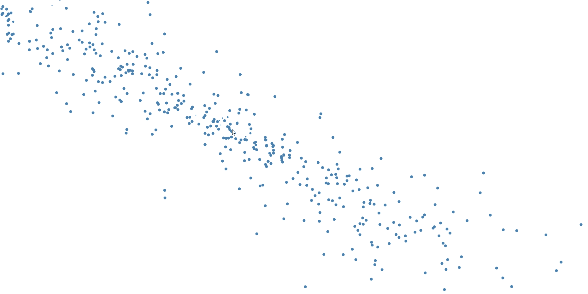

速度

## 它是如何工作的...

这个配方的整体结构与之前的配方非常相似。它也会在用户移动鼠标时生成粒子。此外，一旦力模拟开始，粒子位置将完全由力布局在其 `tick` 事件监听器函数中控制。然而，在这个配方中，我们关闭了定位和电荷，以便我们可以更清楚地关注动量。我们留下了一些摩擦，使得速度衰减，使模拟看起来更真实。以下是我们的力布局配置：

```js
var force = d3.forceSimulation() 
                    .velocityDecay(0.1) 
                    .alphaDecay(0) 
                    .force("collision",  
                         d3.forceCollide(r + 0.5).strength(1)); 

```

在这个配方中，与之前的不同之处在于我们不仅跟踪当前鼠标位置，还跟踪之前的鼠标位置。此外，每当用户移动鼠标时，我们都会生成一个包含当前位置（`point[0], point[1]`）和之前位置（`previousPoint.x, previousPoint.y`）的节点对象：

```js
    var previousPoint; 

    svg.on("mousemove", function () { 
        var point = d3.mouse(this), 
            node = { 
                x: point[0], 
                y: point[1], 
                vx: previousPoint? 
                    point[0]-previousPoint[0]:point[0], 
                vy: previousPoint? 
                    point[1]-previousPoint[1]:point[1] 
            }; 

        previousPoint = point; 
    ... 
} 

```

由于用户的鼠标位置以固定间隔采样，用户移动鼠标的速度越快，这两个位置之间的距离就越远。这种属性以及从这两个位置获得的方向信息被力模拟自动转换为每个我们创建的粒子的初始速度，正如我们在本配方中展示的那样。

除了我们之前讨论的 `{x, y, vx, vy}` 属性之外，力布局节点对象还支持一些其他有用的属性，我们将在此列出供您参考：

+   `index`: 节点在其数组中的零基索引

+   `x`: 当前节点位置的 x-坐标

+   `y`: 当前节点位置的 y-坐标

+   `vx`: 节点的当前 x-速度

+   `vy`: 节点的当前 y-速度

+   `fx`: 节点的固定 x-位置

+   `fy`: 节点的固定 y-位置

### 注意

我们将在涉及拖动的后续配方中介绍 `fx` 和 `fy` 及其用法，拖动是利用节点固定定位的最常见方式之一。

## 参见

+   有关如何在 D3 中与鼠标交互的更多详细信息，请参阅第十章“与您的可视化交互”中的“与鼠标事件交互”配方，链接为 Chapter 10。

+   有关节点属性的更多详细信息，请参阅 D3 力模拟节点 API，链接为 [`github.com/d3/d3-force#simulation_nodes`](https://github.com/d3/d3-force#simulation_nodes)。

# 设置链接约束

到目前为止，我们已经涵盖了力布局的一些重要方面，例如重力、电荷、摩擦和速度。在这个配方中，我们将讨论另一个关键功能：链接。正如我们在介绍部分中提到的，D3 力模拟支持可扩展的简单图约束，在这个配方中，我们将演示如何结合其他力利用链接约束。

## 准备工作

在您的网络浏览器中打开以下文件的本地副本：

[`github.com/NickQiZhu/d3-cookbook-v2/blob/master/src/chapter11/link-constraint.html`](https://github.com/NickQiZhu/d3-cookbook-v2/blob/master/src/chapter11/link-constraint.html) .

## 如何操作...

在此配方中，每当用户点击鼠标时，我们将生成一个由节点间的链接约束的力导向粒子环。以下是它的实现方式：

```js
<script type="text/javascript"> 
    var w = 1280, h = 800, 
            r = 4.5, nodes = [], links = []; 

    var force = d3.forceSimulation() 
                    .velocityDecay(0.8) 
                    .alphaDecay(0) 
                    .force("charge",  
                        d3.forceManyBody() 
                            .strength(-50).distanceMax(h / 4)) 
                    .force("collision",  
                        d3.forceCollide(r + 0.5).strength(1)); 

    var duration = 10000; 

    var svg = d3.select("body") 
            .append("svg") 
                .attr("width", w) 
                .attr("height", h); 

    force.on("tick", function () { 
        svg.selectAll("circle") 
            .attr("cx", function (d) {return boundX(d.x);}) 
            .attr("cy", function (d) {return boundY(d.y);}); 

        svg.selectAll("line") 
            .attr("x1", function (d) {return boundX(d.source.x);}) 
            .attr("y1", function (d) {return boundY(d.source.y);}) 
            .attr("x2", function (d) {return boundX(d.target.x);}) 
            .attr("y2", function (d) {return boundY(d.target.y);} 
        ); 
    }); 

    function boundX(x) { 
        return x > (w - r) ? (w - r): (x > r ? x : r); 
    } 

    function boundY(y){ 
        return y > (h - r) ? (h - r) : (y > r ? y : r); 
    } 

    function offset() { 
        return Math.random() * 100; 
    } 

    function createNodes(point) { 
        var numberOfNodes = Math.round(Math.random() * 10); 
        var newNodes = []; 

        for (var i = 0; i < numberOfNodes; ++i) { 
            newNodes.push({ 
                x: point[0] + offset(), 
                y: point[1] + offset() 
            }); 
        } 

        newNodes.forEach(function(e){nodes.push(e)}); 

        return newNodes; 
    } 

    function createLinks(nodes) { 
        var newLinks = []; 
        for (var i = 0; i < nodes.length; ++i) { // <-A 
            if(i == nodes.length - 1) 
                newLinks.push( 
                    {source: nodes[i], target: nodes[0]} 
                ); 
            else 
                newLinks.push( 
                    {source: nodes[i], target: nodes[i + 1]} 
                ); 
        } 

        newLinks.forEach(function(e){links.push(e)}); 

        return newLinks; 
    } 

    svg.on("click", function () { 
        var point = d3.mouse(this), 
                newNodes = createNodes(point), 
                newLinks = createLinks(newNodes); 

        newNodes.forEach(function (node) { 
            svg.append("circle") 
                    .data([node]) 
                .attr("class", "node") 
                .attr("cx", function (d) {return d.x;}) 
                .attr("cy", function (d) {return d.y;}) 
                .attr("r", 1e-6) 
                    .call(d3.drag() // <-D 
                            .on("start", dragStarted) 
                            .on("drag", dragged) 
                            .on("end", dragEnded)) 
                    .transition() 
                .attr("r", 7) 
                    .transition() 
                    .delay(duration) 
                .attr("r", 1e-6) 
                .on("end", function () {nodes.shift();}) 
                .remove(); 
        }); 

        newLinks.forEach(function (link) { 
            svg.append("line") // <-B 
                    .data([link]) 
                .attr("class", "line") 
                .attr("x1", function (d) {return d.source.x;}) 
                .attr("y1", function (d) {return d.source.y;}) 
                .attr("x2", function (d) {return d.target.x;}) 
                .attr("y2", function (d) {return d.target.y;}) 
                    .transition() 
                    .delay(duration) 
                .style("stroke-opacity", 1e-6) 
                .on("end", function () {links.shift();}) 
                .remove(); 
        }); 

        force.nodes(nodes); 
        force.force("link",  
                         d3.forceLink(links) 
                            .strength(1).distance(20)); // <-C 
        force.restart(); 
    }); 

    function dragStarted(d) { 
        d.fx = d.x; // <-E 
        d.fy = d.y; 
    } 

    function dragged(d) { 
        d.fx = d3.event.x; // <-F 
        d.fy = d3.event.y; 
    } 

    function dragEnded(d) { 
        d.fx = null; // <-G 
        d.fy = null; 
    } 
</script> 

```

此配方在鼠标点击时生成力导向的粒子环，如下面的截图所示：

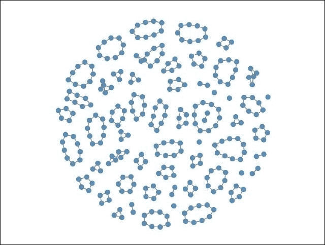

力导向粒子环

## 它是如何工作的...

链接约束为力辅助可视化添加了另一个有用的维度。在此配方中，我们使用以下参数设置我们的力布局：

```js
var force = d3.forceSimulation() 
                    .velocityDecay(0.8) 
                    .alphaDecay(0) 
                    .force("charge", d3.forceManyBody() 
                             .strength(-50).distanceMax(h / 4)) 
                    .force("collision",   
                            d3.forceCollide(r + 0.5).strength(1)); 

```

除了碰撞、电荷和摩擦之外，这次我们还把电荷-力相互作用绑定到最大高度的 25%，以模拟更局部的力相互作用。当用户点击鼠标时，会创建一定数量的节点并将其置于力模拟的控制之下，这与我们在之前的配方中所做的一样。此配方的主要新增功能是链接创建，其控制逻辑如下面的代码片段所示：

```js
    function createLinks(nodes) { 
        var newLinks = []; 
        for (var i = 0; i < nodes.length; ++i) { // <-A 
            if(i == nodes.length - 1) 
                newLinks.push( 
                    {source: nodes[i], target: nodes[0]} 
                ); 
            else 
                newLinks.push( 
                    {source: nodes[i], target: nodes[i + 1]} 
                ); 
        } 

        newLinks.forEach(function(e){links.push(e)}); 

        return newLinks; 
    } 

    svg.on("click", function () { 
        var point = d3.mouse(this), 
                newNodes = createNodes(point), 
                newLinks = createLinks(newNodes); 

        newNodes.forEach(function (node) { 
            svg.append("circle") 
                    .data([node]) 
                .attr("class", "node") 
                .attr("cx", function (d) {return d.x;}) 
                .attr("cy", function (d) {return d.y;}) 
                .attr("r", 1e-6) 
                    .call(d3.drag() // <-D 
                            .on("start", dragStarted) 
                            .on("drag", dragged) 
                            .on("end", dragEnded)) 
                    .transition() 
                .attr("r", 7) 
                    .transition() 
                    .delay(duration) 
                .attr("r", 1e-6) 
                .on("end", function () {nodes.shift();}) 
                .remove(); 
        }); 

        newLinks.forEach(function (link) { 
            svg.append("line") // <-B 
                    .data([link]) 
                .attr("class", "line") 
                .attr("x1", function (d) {return d.source.x;}) 
                .attr("y1", function (d) {return d.source.y;}) 
                .attr("x2", function (d) {return d.target.x;}) 
                .attr("y2", function (d) {return d.target.y;}) 
                    .transition() 
                    .delay(duration) 
                .style("stroke-opacity", 1e-6) 
                .on("end", function () {links.shift();}) 
                .remove(); 
        }); 

        force.nodes(nodes); 
        force.force("link", 
                        d3.forceLink(links) 
                           .strength(1).distance(20)); // <-C 
        force.restart(); 
    }); 

```

在`createLinks`函数中，创建了`n-1`个链接对象，将一组节点连接成一个环（在行`A`上的循环）。每个链接对象必须指定两个属性，即`source`和`target`，告诉力布局哪些节点对通过此链接对象连接。一旦创建，我们决定在此配方中使用`svg:line`元素来可视化链接（参考行`B`）。然而，我们将在下一个配方中看到，这并不总是必须的。事实上，你可以使用几乎所有东西来可视化（包括隐藏它们，但保留链接以进行布局计算），只要这对你的可视化观众有意义。之后，我们还需要将链接对象添加到力布局的链接数组中（在行`C`），这样它们就可以置于力布局的控制之下。`d3.forceLink`函数有两个重要的参数：链接距离和链接强度；这两个参数都是与链接相关的：

+   `linkDistance`：这可以是一个常量或一个函数，默认为`20`像素。链接距离在模拟初始化时评估，并且作为弱几何约束实现。对于布局的每个 tick，计算每对链接节点的距离并将其与目标距离进行比较。然后，链接会相互移动或远离。

+   `linkStength`：这可以是一个常量或一个函数，默认为`1`。链接强度通过一个在`[0, 1]`范围内的值设置链接的强度（刚性）。链接强度在初始化或重置时也会被评估。

最后，我们需要将力布局生成的定位数据翻译成`tick`函数中每个链接的 SVG 实现，类似于我们为节点所做的那样：

```js
    force.on("tick", function () { 
        svg.selectAll("circle") 
            .attr("cx", function (d) {return boundX(d.x);}) 
            .attr("cy", function (d) {return boundY(d.y);}); 

        svg.selectAll("line") 
            .attr("x1", function (d) {return boundX(d.source.x);}) 
            .attr("y1", function (d) {return boundY(d.source.y);}) 
            .attr("x2", function (d) {return boundX(d.target.x);}) 
            .attr("y2", function (d) {return boundY(d.target.y);}); 
    }); 

    function boundX(x) { 
        return x > (w - r) ? (w - r): (x > r ? x : r); 
    } 

    function boundY(y){ 
        return y > (h - r) ? (h - r) : (y > r ? y : r); 
    } 

```

如我们所见，D3 力模拟再次完成了大部分繁重的工作，因此，我们只需要在`tick`函数中简单地设置`svg:line`元素的`{x1, y1}`和`{x2, y2}`。此外，我们还使用了两个有界的 X 和 Y 函数，以确保粒子和环不会逃离我们的 SVG 画布区域。为了参考，以下截图展示了力布局操作后的链接对象：

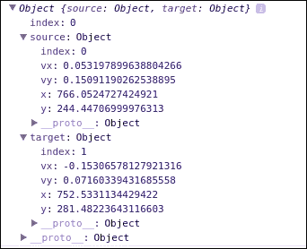

链接对象

在本配方中，还有一个值得提及的附加技术，即力启用拖动。本配方生成的所有节点都是“可拖动的”，当用户拖动环时，力模拟会自动重新计算所有力和约束，如图所示以下截图：

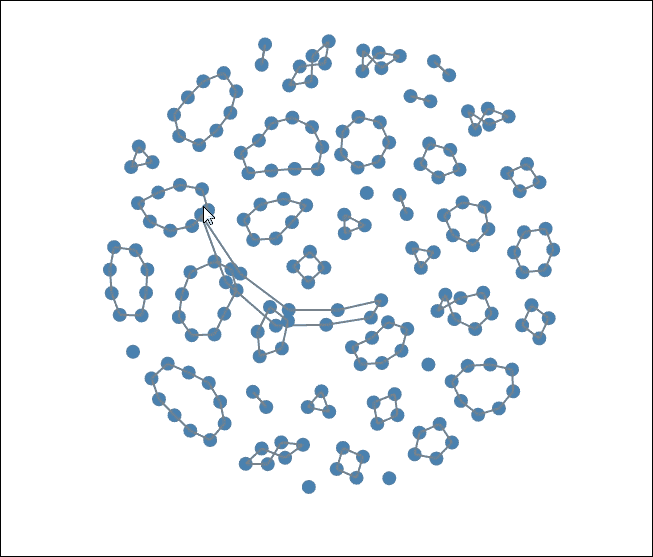

带力模拟的拖动

这是通过在以下代码片段中注册`d3.drag`事件处理程序来实现的，如图线`D`所示：

```js
       newNodes.forEach(function (node) { 
            svg.append("circle") 
                    .data([node]) 
                .attr("class", "node") 
                .attr("cx", function (d) {return d.x;}) 
                .attr("cy", function (d) {return d.y;}) 
                .attr("r", 1e-6) 
                    .call(d3.drag() // <-D 
                            .on("start", dragStarted) 
                            .on("drag", dragged) 
                            .on("end", dragEnded)) 
                    .transition() 
                .attr("r", 7) 
                    .transition() 
                    .delay(duration) 
                .attr("r", 1e-6) 
                .on("end", function () {nodes.shift();}) 
                .remove(); 
        }); 

```

每个拖动事件处理程序的实现相当简单：

```js
    function dragStarted(d) { 
        d.fx = d.x; // <-E 
        d.fy = d.y; 
    } 

    function dragged(d) { 
        d.fx = d3.event.x; // <-F 
        d.fy = d3.event.y; 
    } 

    function dragEnded(d) { 
        d.fx = null; // <-G 
        d.fy = null; 
    } 

```

当在特定节点上拖动时，我们使用`fx`和`fy`将该节点固定到其初始位置，如图线`E`所示。在拖动过程中，我们继续使用用户的鼠标位置更新节点位置，从而在拖动时移动节点（参见图线`F`）。最后，当拖动结束时，我们解除节点位置的限制，从而允许力模拟再次接管，如图线`G`所示。这是一个非常通用的拖动支持模式，你将在力辅助可视化中经常看到，包括本章后面的某些配方。

## 参见

+   可伸缩、多用途且简单的约束图布局：[`www.csse.monash.edu.au/~tdwyer/Dwyer2009FastConstraints.pdf`](http://www.csse.monash.edu.au/~tdwyer/Dwyer2009FastConstraints.pdf)

+   有关`force.links()`函数的更多信息，请参阅：[`github.com/d3/d3-force#links`](https://github.com/d3/d3-force#links)

# 使用力辅助可视化

到目前为止，我们学习了如何使用力模拟可视化粒子与链接，类似于在经典应用中，即力导向图，使用力的方式。这种可视化正是力模拟最初设计的目的。然而，这绝对不是利用力进行可视化的唯一方式。在本配方中，我们将探讨我称之为力辅助可视化的技术。利用这种技术，你可以通过利用力，在你的可视化中添加一些随机性和任意性。

## 准备工作

在您的网络浏览器中打开以下文件的本地副本：

[`github.com/NickQiZhu/d3-cookbook-v2/blob/master/src/chapter11/arbitrary-visualization.html`](https://github.com/NickQiZhu/d3-cookbook-v2/blob/master/src/chapter11/arbitrary-visualization.html)。

## 如何操作...

在这个配方中，我们将生成用户鼠标点击时的气泡。气泡由填充渐变色的 `svg:path` 元素组成。尽管 `svg:path` 元素不是严格由力布局控制的，但它们受到力的影响，因此提供了模拟现实气泡所需的随机性：

```js
<svg> 
    <defs> 
        <radialGradient id="gradient" cx="50%" cy="50%"  
                                r="100%" fx="50%" fy="50%"> 
            <stop offset="0%" 
              style="stop-color:blue;stop-opacity:0"/> 
            <stop offset="100%" 
              style="stop-color:rgb(255,255,255);stop-opacity:1"/> 
        </radialGradient> 
    </defs> 
</svg> 

<script type="text/javascript"> 
    var w = 1280, h = 800, 
                r = 4.5, nodes = [], links = []; 

    var force = d3.forceSimulation() 
                    .velocityDecay(0.8) 
                    .alphaDecay(0) 
                    .force("charge", d3.forceManyBody() 
                              .strength(-50).distanceMax(h / 4)) 
                    .force("collision",  
                              d3.forceCollide(r + 0.5).strength(1)) 
                    .force("position", d3.forceY(h / 2)); 

    var duration = 60000; 

    var svg = d3.select("svg") 
                .attr("width", w) 
                .attr("height", h); 

    var line = d3.line() // <-A 
            .curve(d3.curveBasisClosed) 
            .x(function(d){return d.x;}) 
            .y(function(d){return d.y;}); 

    force.on("tick", function () { 
        svg.selectAll("path") 
            .attr("d", line); 
    }); 

    function offset() { 
        return Math.random() * 100; 
    } 

    function createNodes(point) { 
        var numberOfNodes = Math.round(Math.random() * 10); 
        var newNodes = []; 

        for (var i = 0; i < numberOfNodes; ++i) { 
            newNodes.push({ 
                x: point[0] + offset(), 
                y: point[1] + offset() 
            }); 
        } 

        newNodes.forEach(function(e){nodes.push(e)}); 

        return newNodes; 
    } 

    function createLinks(nodes) { 
        var newLinks = []; 
        for (var i = 0; i < nodes.length; ++i) { 
            if(i == nodes.length - 1) 
                newLinks.push( 
                    {source: nodes[i], target: nodes[0]} 
                ); 
            else 
                newLinks.push( 
                    {source: nodes[i], target: nodes[i + 1]} 
                ); 
        } 

        newLinks.forEach(function(e){links.push(e)}); 

        return newLinks; 
    } 

    svg.on("click", function () { 
        var point = d3.mouse(this), 
                newNodes = createNodes(point), 
                newLinks = createLinks(newNodes); 

        console.log(point); 

        svg.append("path") 
                .data([newNodes]) 
            .attr("class", "bubble") 
            .attr("fill", "url(#gradient)") // <-B 
            .attr("d", function(d){return line(d);}) 
                .transition().delay(duration) // <-C 
            .attr("fill-opacity", 0) 
            .attr("stroke-opacity", 0) 
            .on("end", function(){d3.select(this).remove();}); 

        force.nodes(nodes); 
        force.force("link",  
                   d3.forceLink(links).strength(1).distance(20)); 
        force.restart(); 
    }); 
</script> 

```

此配方在用户鼠标点击时生成力辅助气泡，如下截图所示：

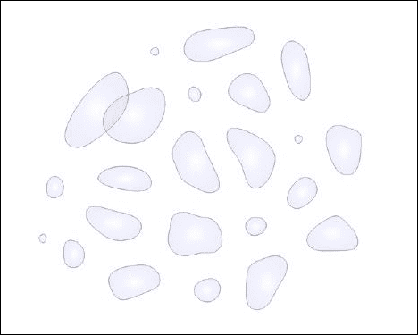

力辅助气泡

## 它是如何工作的...

此配方建立在之前配方的基础上，因此其整体方法与上一个配方（在用户鼠标点击时创建力控制粒子环）非常相似。此配方与上一个配方的主要区别在于，我们决定使用 `d3.line` 生成器来创建 `svg:path` 元素，以勾勒出我们的气泡，而不是使用 `svg:circle` 和 `svg:line`：

```js
var line = d3.line() // <-A 
            .curve(d3.curveBasisClosed) 
            .x(function(d){return d.x;}) 
            .y(function(d){return d.y;}); 
... 
svg.on("click", function () { 
        var point = d3.mouse(this), 
                newNodes = createNodes(point), 
                newLinks = createLinks(newNodes); 

        console.log(point); 

        svg.append("path") 
                .data([newNodes]) 
            .attr("class", "bubble") 
            .attr("fill", "url(#gradient)") // <-B 
            .attr("d", function(d){return line(d);}) // <-C 
                .transition().delay(duration) 
            .attr("fill-opacity", 0) 
            .attr("stroke-opacity", 0) 
            .on("end", function(){d3.select(this).remove();}); 

        force.nodes(nodes); 
        force.force("link",  
                d3.forceLink(links).strength(1).distance(20)); 
        force.restart(); 
    }); 

```

在线 `A` 上，我们使用 `d3.curveBasisClosed` 曲线模式创建了一个线生成器，因为这为我们提供了气泡最平滑的轮廓。每当用户点击鼠标时，就会创建一个连接所有节点的 `svg:path` 元素（线 `C`）。此外，我们还用我们预定义的渐变填充气泡，使其具有漂亮的发光效果（线 `B`）。最后，我们还需要在 `tick` 函数中实现基于力的定位：

```js
    force.on("tick", function () { 
        svg.selectAll("path") 
            .attr("d", line); 
    }); 

```

在 `tick` 函数中，我们简单地重新调用行生成器函数来更新每个路径的 `d` 属性，从而使用力布局计算来动画化气泡。

## 相关内容

+   请参阅[SVG 渐变和图案](https://www.w3.org/TR/SVG/pservers.html)。

+   有关 D3 线生成器的更多信息，请参阅第七章中的*使用线生成器*配方，*进入形状*。

# 力量操控

到目前为止，我们已经探索了 D3 力的许多有趣方面和应用；然而，在所有这些先前的配方中，我们只是直接将力布局的计算（重力、电荷、摩擦、碰撞和速度）应用于我们的可视化。在这个配方中，我们将更进一步，实现自定义力操控，从而创建我们自己的力类型。

在这个配方中，我们首先生成五组彩色粒子，然后为用户的触摸分配相应的颜色和分类力拉力，从而只拉动匹配颜色的粒子。由于这个配方有点复杂，我将在这里提供一个示例：如果我用我的第一根手指触摸可视化，它将生成一个蓝色圆圈并将所有蓝色粒子拉向该圆圈，而我的第二次触摸将生成一个橙色圆圈，并且只会拉动橙色粒子。这种类型的力操作通常被称为分类多焦点。

## 准备工作

在您的网络浏览器中打开以下文件的本地副本：

[`github.com/NickQiZhu/d3-cookbook-v2/blob/master/src/chapter11/multi-foci.html`](https://github.com/NickQiZhu/d3-cookbook-v2/blob/master/src/chapter11/multi-foci.html) .

## 如何做到这一点...

这是您如何在代码中实现它的方法：

```js
<script type="text/javascript"> 
    var svg = d3.select("body").append("svg"), 
            colors = d3.scaleOrdinal(d3.schemeCategory20c), 
            r = 4.5, 
            w = 1290, 
            h = 800; 

    svg.attr("width", w).attr("height", h); 

    var force = d3.forceSimulation() 
                    .velocityDecay(0.8) 
                    .alphaDecay(0) 
                    .force("charge",  
                        d3.forceManyBody().strength(-30)) 
                    .force("x", d3.forceX(w / 2)) 
                    .force("y", d3.forceY(h / 2)) 
                    .force("collision",   
                        d3.forceCollide(r + 0.5).strength(1)); 

    var nodes = [], centers = []; 

    for (var i = 0; i < 5; ++i) { 
        for (var j = 0; j < 50; ++j) { 
            nodes.push({ 
                x: w / 2 + offset(), 
                y: h / 2 + offset(), 
                color: colors(i), // <-A 
                type: i // <-B 
            }); 
        } 
    } 

    force.nodes(nodes); 

    function offset() { 
        return Math.random() * 100; 
    } 

    function boundX(x) { 
        return x > (w - r) ? (w - r): (x > r ? x : r); 
    } 

    function boundY(y){ 
        return y > (h - r) ? (h - r) : (y > r ? y : r); 
    } 

    svg.selectAll("circle") 
                .data(nodes).enter() 
            .append("circle") 
            .attr("class", "node") 
            .attr("cx", function (d) {return d.x;}) 
            .attr("cy", function (d) {return d.y;}) 
            .attr("fill", function(d){return d.color;}) 
            .attr("r", 1e-6) 
                .transition() 
            .attr("r", r); 

    force.on("tick", function() { 
        var k = 0.1; 
        nodes.forEach(function(node) { 
            var center = centers[node.type]; 
            if(center){ 
                node.x += (center[0] - node.x) * k; 
                node.y += (center[1] - node.y) * k; 
            } 
        }); 

        svg.selectAll("circle") 
            .attr("cx", function (d) {return boundX(d.x);}) 
            .attr("cy", function (d) {return boundY(d.y);}); 
    }); 

    d3.select("body") 
        .on("touchstart", touch) 
        .on("touchend", touch); 

    function touch() { 
        d3.event.preventDefault(); 

        centers = d3.touches(svg.node()); 

        console.log(centers); 

        var g = svg.selectAll("g.touch") 
                .data(centers, function (d) { 
                    return d.identifier; 
                }); 

        g.enter() 
            .append("g") 
            .attr("class", "touch") 
            .attr("transform", function (d) { 
                return "translate(" + d[0] + "," + d[1] + ")"; 
            }) 
            .append("circle") 
                .attr("class", "touch") 
                .attr("fill",  
                        function(d){return colors(d.identifier);}) 
                    .transition() 
                .attr("r", 50); 

        g.exit().remove(); 
    } 
</script> 

```

这个配方在触摸时生成多分类焦点，如下截图所示：

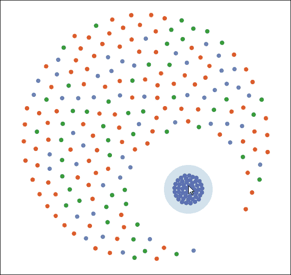

触摸的多分类焦点

## 它是如何工作的...

这个配方的第一步是创建彩色粒子并在定位和排斥之间建立标准的力平衡。所有节点对象都包含单独的颜色和类型 ID 属性（行`A`和`B`），因此它们可以很容易地被识别。在行`C`，我们让力模拟管理这些粒子的所有定位，就像我们在之前的配方中所做的那样：

```js
var force = d3.forceSimulation() 
                    .velocityDecay(0.8) 
                    .alphaDecay(0) 
                    .force("charge",  
                        d3.forceManyBody().strength(-30)) 
                    .force("x", d3.forceX(w / 2)) 
                    .force("y", d3.forceY(h / 2)) 
                    .force("collision",  
                        d3.forceCollide(r + 0.5).strength(1)); 

    var nodes = [], centers = []; 

    for (var i = 0; i < 5; ++i) { 
        for (var j = 0; j < 50; ++j) { 
            nodes.push({ 
                x: w / 2 + offset(), 
                y: h / 2 + offset(), 
                color: colors(i), // <-A 
                type: i // <-B 
            }); 
        } 
} 

    force.nodes(nodes); // <-C 

```

接下来，我们需要在用户触摸处创建一个大的`svg:circle`元素来表示触摸点：

```js
function touch() { 
        d3.event.preventDefault(); 

        centers = d3.touches(svg.node()); 

        var g = svg.selectAll("g.touch") 
                .data(centers, function (d) { 
                    return d.identifier; 
                }); 

        g.enter() 
            .append("g") 
            .attr("class", "touch") 
            .attr("transform", function (d) { 
                return "translate(" + d[0] + "," + d[1] + ")"; 
            }) 
            .append("circle") 
                .attr("class", "touch") 
                .attr("fill",  
                    function(d){return colors(d.identifier);}) 
                    .transition() 
                .attr("r", 50); 

        g.exit().remove(); 
    } 

```

这是我们之前在第十章中看到的*与多触摸设备交互*配方中的标准多触摸绘图，*与您的可视化交互*。一旦识别出触摸点，所有自定义力的魔法都在`tick`函数中实现。现在，让我们看看`tick`函数：

```js
    force.on("tick", function() { 
        var k = 0.1; 
        nodes.forEach(function(node) { 
            var center = centers[node.type]; // <-C 
            if(center){ 
                node.x += (center[0] - node.x) * k; // <-D 
                node.y += (center[1] - node.y) * k; // <-E 
            } 
        }); 

        svg.selectAll("circle") // <-F 
            .attr("cx", function (d) {return boundX(d.x);}) 
            .attr("cy", function (d) {return boundY(d.y);}); 
    }); 

```

在这个 tick 函数中，我们有熟悉的部分，在行`F`上，我们让力模拟控制画布上所有粒子的位置；然而，我们也引入了一个自定义力。在行`C`，我们遍历所有节点以识别与给定中心相关的节点，该中心代表用户的触摸。一旦我们检测到触摸中心，我们就开始逐 tick 移动粒子，使其逐渐靠近中心（行`D`和`E`），使用`k`系数。`k`值越大，粒子围绕触摸点的收敛速度越快。

## 参考信息

+   有关 D3 多触摸支持的信息，请参阅第十章中的*与多触摸设备交互*配方，*与您的可视化交互*。

# 构建力导向图

最后，我们将展示如何实现力导向图，这是 D3 力的经典应用。然而，我们相信，凭借你从本章中至今所获得的所有技术和知识，实现力导向图应该感觉相当直接。

## 准备工作

在您的网络浏览器中打开以下文件的本地副本：

[`github.com/NickQiZhu/d3-cookbook-v2/blob/master/src/chapter11/force-directed-graph.html`](https://github.com/NickQiZhu/d3-cookbook-v2/blob/master/src/chapter11/force-directed-graph.html) .

## 如何操作...

在这个菜谱中，我们将可视化 flare 数据集作为一个力导向树（树是一种特殊的图类型）：

```js
<script type="text/javascript"> 
    var w = 1280, 
            h = 800, 
            r = 4.5, 
            colors = d3.scaleOrdinal(d3.schemeCategory20c); 

    var force = d3.forceSimulation() 
            .velocityDecay(0.8) 
            .alphaDecay(0) 
            .force("charge", d3.forceManyBody()) 
            .force("x", d3.forceX(w / 2)) 
            .force("y", d3.forceY(h / 2)); 

    var svg = d3.select("body").append("svg") 
            .attr("width", w) 
            .attr("height", h); 

    d3.json("../../data/flare.json", function (data) { 
        var root = d3.hierarchy(data); 
        var nodes = root.descendants(); 
        var links = root.links(); 

        force.nodes(nodes); 
        force.force("link",  
            d3.forceLink(links).strength(1).distance(20)); 

          var link = svg.selectAll("line") 
              .data(links) 
            .enter().insert("line") 
              .style("stroke", "#999") 
              .style("stroke-width", "1px"); 

          var nodeElements = svg.selectAll("circle.node") 
              .data(nodes) 
            .enter().append("circle") 
              .attr("r", r) 
              .style("fill", function(d) {  
                    return colors(d.parent && d.parent.data.name);  
              }) 
              .style("stroke", "#000") 
              .call(d3.drag() 
                      .on("start", dragStarted) 
                      .on("drag", dragged) 
                      .on("end", dragEnded)); 

          force.on("tick", function(e) { 
            link.attr("x1", function(d) { return d.source.x; }) 
                .attr("y1", function(d) { return d.source.y; }) 
                .attr("x2", function(d) { return d.target.x; }) 
                .attr("y2", function(d) { return d.target.y; }); 

            nodeElements.attr("cx", function(d) { return d.x; }) 
                .attr("cy", function(d) { return d.y; }); 
          }); 
    }); 

    function dragStarted(d) { 
        d.fx = d.x; 
        d.fy = d.y; 
    } 

    function dragged(d) { 
        d.fx = d3.event.x; 
        d.fy = d3.event.y; 
    } 

    function dragEnded(d) { 
        d.fx = null; 
        d.fy = null; 
    } 
</script> 

```

这个菜谱将层次化的 flare 数据集可视化为一个力导向树：

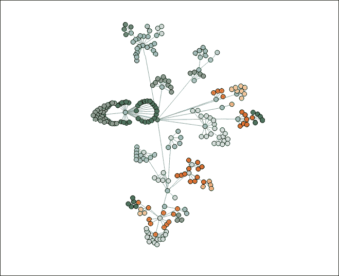

力导向图（树）

## 它是如何工作的...

如我们已能看到的，这个菜谱相当简短，实际上四分之一的代码都致力于拖拽支持。这是因为力导向图正是力模拟最初设计的目的。因此，实际上并没有太多的事情要做，除了简单地应用正确的数据结构来应用力。首先，我们使用标准的`d3.hierarchy`（行`A`）处理层次化数据集，因为这是我们获取`d3.force`期望的节点和链接数据结构的方式：

```js
d3.json("../../data/flare.json", function (data) { 
        var root = d3.hierarchy(data); // <-A 
        var nodes = root.descendants(); // <-B 
        var links = root.links(); // <-C 

        force.nodes(nodes); // <-D 
        force.force("link", // <-E 
                d3.forceLink(links).strength(1).distance(20)); 
        ... 
} 

```

在行`B`，我们利用`d3.hierarchy.descendants`函数检索树中包含的所有节点以及行`C`中节点的链接，使用`d3.hierachy.links`函数。这些是`d3.force`期望的数据结构；一旦我们有了它们，它们可以直接在行`D`和`E`上传递给模拟。这个菜谱的其余部分与本章中的*设置链接约束*菜谱非常相似。我们创建了`svg:link`元素来表示链接，以及`svg:circle`元素来表示图中的节点：

```js
          var link = svg.selectAll("line") 
              .data(links) 
            .enter().insert("line") 
              .style("stroke", "#999") 
              .style("stroke-width", "1px"); 

          var nodeElements = svg.selectAll("circle.node") 
              .data(nodes) 
            .enter().append("circle") 
              .attr("r", r) 
              .style("fill", function(d) { // <-F 
                  return colors(d.parent && d.parent.data.name); 
              }) 
              .style("stroke", "#000") 
              .call(d3.drag() // <-G 
                      .on("start", dragStarted) 
                      .on("drag", dragged) 
                      .on("end", dragEnded)); 

```

值得在这里提及的唯一部分是，我们在行`F`使用节点的父节点名称来着色节点，因此所有兄弟节点将被一致着色，并且在行`G`中，我们使用了在*设置链接约束*菜谱中提到的通用拖拽支持模式，以允许使用此图进行拖拽。最后，我们在 tick 函数中让力模拟完全控制节点和链接的位置：

```js
          force.on("tick", function(e) { 
            link.attr("x1", function(d) { return d.source.x; }) 
                .attr("y1", function(d) { return d.source.y; }) 
                .attr("x2", function(d) { return d.target.x; }) 
                .attr("y2", function(d) { return d.target.y; }); 

            nodeElements.attr("cx", function(d) { return d.x; }) 
                .attr("cy", function(d) { return d.y; }); 
          }); 

```

## 参见

+   参考第九章的*构建树*菜谱，*布局*，以获取有关 D3 树布局的更多信息。

+   关于力导向图的更多信息，请访问 [`en.wikipedia.org/wiki/Force-directed_graph_drawing`](https://en.wikipedia.org/wiki/Force-directed_graph_drawing) .
