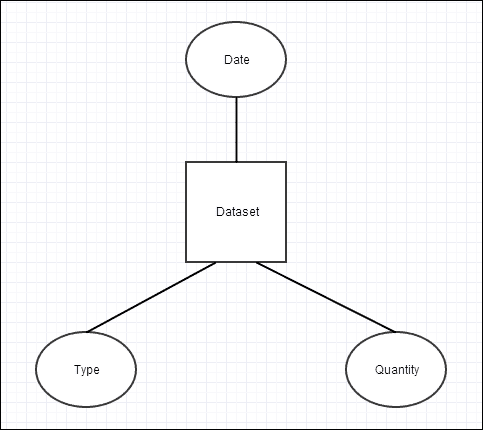
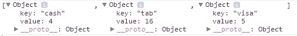
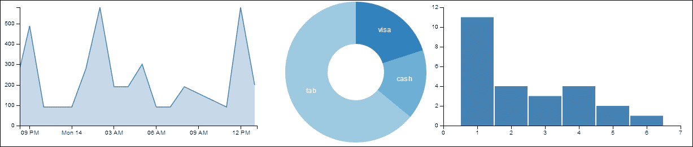
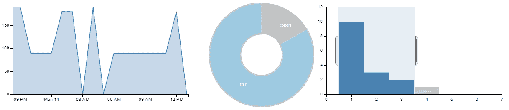
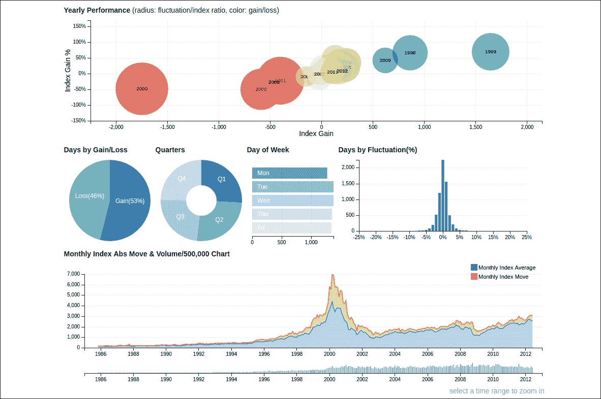

# 附录章节。在几分钟内构建交互式分析

在本附录中，我们将介绍：

+   学习 Crossfilter.js 库

+   使用 dc.js 进行维度图表

# 简介

恭喜！你已经完成了一本关于数据可视化的 D3 整本书。我们一起探讨了各种主题和技术。此时你可能会同意，即使在像 D3 这样强大的库的帮助下，构建交互式、准确且美观的数据可视化也不是一件简单的事情。即使不考虑通常在后台所需的工作量，完成一个专业的数据可视化项目通常也需要几天甚至几周的时间。如果你需要快速构建交互式可视化，或者在一个完整可视化项目开始之前的一个概念验证，而你只需要在几分钟内完成，那么会怎样呢？在本附录中，我们将介绍两个有趣的 JavaScript 库，允许你做到这一点：在几分钟内构建快速在浏览器中的交互式多维数据可视化。

# crossfilter.js 库

Crossfilter 还是由 D3 的作者 *Mike Bostock* 创建的库，最初用于为 Square Register 提供分析功能。

> *Crossfilter 是一个用于在浏览器中探索大型多元数据集的 JavaScript 库。Crossfilter 支持与协调视图的极快（<30ms）交互，即使是在包含数百万或更多记录的数据集中也能如此。*
> 
> *-Crossfilter Wiki（2013 年 8 月）*

换句话说，Crossfilter 是一个库，你可以用它在大型的通常平坦的多元数据集上生成数据维度。那么什么是数据维度呢？数据维度可以被视为一种数据分组或分类，而每个维度的数据元素是一个分类变量。由于这仍然是一个相当抽象的概念，让我们看一下以下 JSON 数据集，看看它是如何使用 Crossfilter 转换为维度数据集的。假设我们有一个以下扁平的 JSON 数据集，描述酒吧中的支付交易：

```js
[ 
  {"date": "2011-11-14T01:17:54Z", "quantity": 2, "total": 190,    "tip": 100, "type": "tab"}, 
  {"date": "2011-11-14T02:20:19Z", "quantity": 2, "total": 190,    "tip": 100, "type": "tab"}, 
  {"date": "2011-11-14T02:28:54Z", "quantity": 1, "total": 300,    "tip": 200, "type": "visa"}, 
.. 
] 

```

### 注意

从 Crossfilter Wiki 借用的样本数据集：[`github.com/square/crossfilter/wiki/API-Reference`](https://github.com/square/crossfilter/wiki/API-Reference)。

在这个样本数据集中，我们看到了多少个维度？答案是：它有与你可以对数据进行分类的不同方式一样多的维度。例如，由于这些数据是关于客户支付，这是时间序列的观察，显然 `date` 是一个维度。其次，支付类型是自然地对数据进行分类的方式；因此，`type` 也是一个维度。

下一个维度有点棘手，因为从技术上讲，我们可以将数据集中的任何字段建模为维度或其衍生物；然而，如果我们认为它不能帮助我们更有效地切片数据或提供更多对数据试图表达的内容的洞察，我们就不想将其作为维度。总计和小费字段具有非常高的基数，这通常是一个维度较差的指标，除非我们将它们分组到不同的桶中（尽管小费/总计，即小费百分比可能是一个有趣的维度）；然而，假设人们不会在这个酒吧购买成千上万杯饮料，`quantity` 字段可能具有相对较小的基数，因此我们选择将数量作为第三个维度。现在，这是维度逻辑模型的外观：



维度数据集

这些维度使我们能够从不同的角度审视数据，并且如果结合起来，将允许我们提出一些相当有趣的问题，例如：

+   使用点餐支付的客户更有可能购买大量商品吗？

+   周五晚上客户更有可能购买大量商品吗？

+   客户在使用点餐而非现金时更有可能给小费吗？

现在，你可以看到为什么维度数据集是一个如此强大的想法。本质上，每个维度都为你提供了一个不同的视角来查看你的数据，并且当它们结合在一起时，它们可以迅速将原始数据转化为知识。一位优秀的分析师可以快速使用这类工具来形成假设，从而从数据中获得知识。

## 如何操作...

现在，我们理解了为什么我们想要使用我们的数据集建立维度；让我们看看如何使用 Crossfilter 来实现这一点：

```js
var timeFormat = d3.time.format.iso; 
var data = crossfilter(json); // <-A 

var hours = data.dimension(function(d){ 
  return d3.time.hour(timeFormat.parse(d.date)); // <-B 
}); 
var totalByHour = hours.group().reduceSum(function(d){ 
  return d.total; 
}); 

var types = data.dimension(function(d){return d.type;}); 
var transactionByType = types.group().reduceCount(); 

var quantities = data.dimension(function(d){return d.quantity;}); 
var salesByQuantity = quantities.group().reduceCount(); 

```

## 工作原理...

如前所述章节所示，在 Crossfilter 中创建维度和分组相当直接。在我们能够创建任何内容之前的第一步是，通过调用 `crossfilter` 函数（行 `A`）将使用 D3 加载的 JSON 数据集通过 Crossfilter 进行传递。一旦完成，你可以通过调用 `dimension` 函数并传入一个访问器函数来创建维度，该函数将检索用于定义维度的数据元素。对于 `type` 的情况，我们将简单地传入 `function(d){return d.type;}`。你还可以在维度函数中执行数据格式化或其他任务（例如，行 `B` 上的日期格式化）。在创建维度之后，我们可以使用维度进行分类或分组，因此 `totalByHour` 是一个按每小时汇总销售额的分组，而 `salesByQuantity` 是按数量计数的交易分组。为了更好地理解 `group` 的工作原理，我们将查看分组对象的外观。如果你在 `transactionsByType` 分组上调用 `all` 函数，你将得到以下对象：



跨过滤器分组对象

我们可以清楚地看到`transactionByType`组实际上是根据数据元素的类型对其进行分组，并在每个组内计算数据元素的总数，因为我们创建组时调用了`reduceCount`函数。

以下是我们在这个例子中使用的函数的描述：

+   `crossfilter`：如果指定，创建一个新的带有给定记录的 crossfilter。记录可以是任何对象或原语数组。

+   `dimension`：使用给定的值访问器函数创建一个新的维度。该函数必须返回自然排序的值，即与 JavaScript 的`<`, `<=`, `>=`, 和 `>`运算符正确行为的值。这通常意味着原语：布尔值、数字或字符串。

+   `dimension.group`：根据给定的`groupValue`函数创建给定维度的新的分组，该函数接受维度值作为输入并返回相应的舍入值。

+   `group.all`：返回所有组，按键的自然顺序升序排列。

+   `group.reduceCount`：一个用于计数记录的快捷函数；返回此组。

+   `group.reduceSum`：一个用于使用指定的值访问器函数求和记录的快捷函数。

## 还有更多...

我们只接触了 Crossfilter 函数的一小部分。当涉及到如何创建维度和组时，Crossfilter 提供了更多的功能；有关更多信息，请查看其 API 参考：[Crossfilter API 参考](https://github.com/square/crossfilter/wiki/API-Reference)。

## 参见

+   数据维度：[数据维度](http://en.wikipedia.org/wiki/Dimension_(data_warehouse))

+   集合基数：[集合基数](http://en.wikipedia.org/wiki/Cardinality)

在这个阶段，我们已经拥有了所有想要分析的内容。现在，让我们看看如何能在几分钟内而不是几小时或几天内完成这项工作。

# 维度图表 - dc.js

可视化 Crossfilter 维度和组正是`dc.js`被创建的原因。这个方便的 JavaScript 库是由你的谦逊作者创建的，旨在允许你轻松快速地可视化 Crossfilter 维度数据集。这个库最初是由你的谦逊作者创建的，现在由一群以 Gordon Woodhull 为首的社区贡献者维护。

### 注意

我们在本章中使用的 dc.js 2.0 beta 版本尚未升级到 D3 v4.x，因此你会注意到对旧 D3 v3 API 的使用和引用，这与我们在本书中迄今为止所见证的有所不同。

## 准备工作

打开以下文件的本地副本作为参考：

[dc.js](https://github.com/NickQiZhu/d3-cookbook-v2/blob/master/src/appendix-a/dc.html)

## 如何做到这一点...

在这个例子中，我们将创建三个图表：

+   一个用于可视化时间序列中交易总量的折线图

+   一个用于可视化按支付类型交易数量的饼图

+   展示按购买数量销售数量的柱状图

下面是代码的样子：

```js
<div id="area-chart"></div> 
<div id="donut-chart"></div> 
<div id="bar-chart"></div> 
... 
dc.lineChart("#area-chart") 
                .width(500) 
                .height(250) 
                .dimension(hours) 
                .group(totalByHour) 
                .x(d3.time.scale().domain([ 
                 timeFormat.parse("2011-11-14T01:17:54Z"),  
                  timeFormat.parse("2011-11-14T18:09:52Z") 
])) 
                .elasticY(true) 
                .xUnits(d3.time.hours) 
                .renderArea(true) 
                .xAxis().ticks(5); 

        dc.pieChart("#donut-chart") 
                .width(250) 
                .height(250) 
                .radius(125) 
                .innerRadius(50) 
                .dimension(types) 
                .group(transactionByType); 

        dc.barChart("#bar-chart") 
                .width(500) 
                .height(250) 
                .dimension(quantities) 
                .group(salesByQuantity) 
                .x(d3.scale.linear().domain([0, 7])) 
                .y(d3.scale.linear().domain([0, 12])) 
                .centerBar(true); 

        dc.renderAll(); 

```

这生成了一组协调的交互式图表：



交互式 dc.js 图表

当您点击或拖动鼠标穿过这些图表时，您将在所有图表上看到相应的 Crossfilter 维度被相应地筛选：



过滤后的 dc.js 图表

## 它是如何工作的...

如我们通过此示例所见，`dc.js` 是设计在 Crossfilter 之上生成标准图表可视化工具的。每个 `dc.js` 图表都设计为交互式的，因此用户可以通过与图表交互来简单地应用维度筛选。由于 `dc.js` 完全基于 D3 构建，因此其 API 非常类似于 D3，我相信您从本书中获得的知识将使您在使用 `dc.js` 时感到非常自在。图表通常按以下步骤创建。

1.  第一步通过调用一个图表创建函数并传入其锚点元素的 D3 选择来创建一个图表对象，在我们的例子中是用于托管图表的 `div` 元素：

    ```js
          <div id="area-chart"></div> 
          ... 
          dc.lineChart("#area-chart") 

    ```

1.  然后，我们为每个图表设置 `width`、`height`、`dimension` 和 `group`：

    ```js
            chart.width(500) 
                 .height(250) 
                 .dimension(hours) 
                 .group(totalByHour) 

    ```

对于在笛卡尔平面上渲染的坐标图，您还需要设置 `x` 和 `y` 尺度：

```js
chart.x(d3.time.scale().domain([ 
  timeFormat.parse("2011-11-14T01:17:54Z"),  
  timeFormat.parse("2011-11-14T18:09:52Z") 
])).elasticY(true) 

```

在第一种情况下，我们明确设置 x 轴尺度，同时让图表自动为我们计算 y 尺度。而在下一个案例中，我们明确设置 x 和 y 尺度。

```js
chart.x(d3.scale.linear().domain([0, 7])) 
        .y(d3.scale.linear().domain([0, 12])) 

```

## 更多内容...

不同的图表有不同的自定义外观和感觉的功能，您可以在 [`github.com/dc-js/dc.js/blob/master/web/docs/api-latest.md`](https://github.com/dc-js/dc.js/blob/master/web/docs/api-latest.md) 查看完整的 API 参考文档。

利用 `crossfilter.js` 和 `dc.js` 可以让您快速构建复杂的数据分析仪表板。以下是一个用于分析过去 20 年纳斯达克 100 指数的演示仪表板 [`dc-js.github.io/dc.js/`](https://dc-js.github.io/dc.js/) ：



dc.js 纳斯达克演示

在撰写本书时，`dc.js` 支持以下图表类型：

+   柱状图（可堆叠）

+   线图（可堆叠）

+   面积图（可堆叠）

+   饼图

+   气泡图

+   组合图表

+   彩色地图

+   箱线图

+   热力图

+   折线图

+   气泡叠加图

还有更多，请查看此页以获取支持的图表类型完整列表 [`dc-js.github.io/dc.js/examples/`](http://dc-js.github.io/dc.js/examples/) 。有关 `dc.js` 库的更多信息，请查看我们的 Wiki 页面 [`github.com/dc-js/dc.js`](https://github.com/dc-js/dc.js) 。

## 参见

以下是一些其他有用的基于 D3 的可重用图表库。尽管它们不像 `dc.js` 那样原生支持与 Crossfilter 一起工作，但在应对一般的可视化挑战时，它们通常更加丰富和灵活：

+   NVD3: [`nvd3.org/`](http://nvd3.org/)

+   黄包车: [`code.shutterstock.com/rickshaw/`](http://code.shutterstock.com/rickshaw/)
