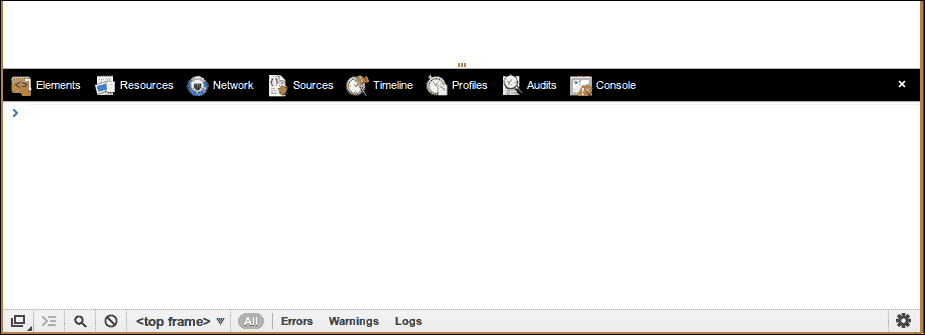
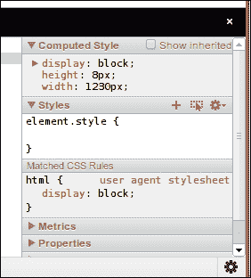
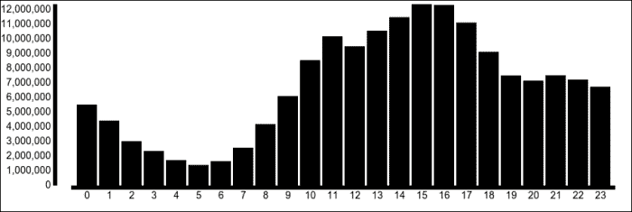
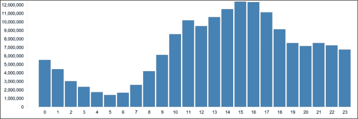

# 第一章. d3.js 入门

在本章中，我将向你展示在 d3.js 中制作简单可视化的基本工具，而不会深入探讨，这样你就可以立即开始。我们将学习 d3.js 的基本语言及其规则。

我们将尝试创建坐标轴和自动缩放图形以适应视口，并学习在进入全面编程狂欢之前使用 Chrome 开发者工具来模拟我们的代码。通过本章，我们将设置整本书中使用的环境，并创建一个由我从 GitHub 创建的数据集的动画图表。

# 什么是 d3.js？

D3 这个名字代表数据驱动文档。*迈克·博斯特克*自 2011 年以来一直在公开开发这个强大的数据可视化库。它通过操作数据来帮助你绘制美丽的图形，无需过多担心像素位置，计算事物在图上的位置等问题。如果你曾经使用 Python 或类似语言可视化数据，你可能已经使用过类似**gnuplot**的工具。我向你保证，d3.js 提供了一种更加愉悦的体验。

官方网站[d3js.org](http://d3js.org)展示了众多展示 d3.js 强大功能的优秀示例，但理解它们至多只是有点棘手。完成本书后，你应该能够足够了解 d3.js，以理解这些示例。如果你想更密切地跟踪 d3.js 的发展，源代码托管在 GitHub 上，网址为[`github.com/mbostock/d3`](https://github.com/mbostock/d3)。

精细的控制和其优雅性使 d3.js 成为最强大，如果不是最强大的开源可视化库之一。这也意味着它不太适合简单的任务，如绘制一个图表或两个——在这种情况下，你可能想使用专门为图表设计的库。尽管如此，许多人仍然在内部使用 d3.js。

作为数据操作库，d3.js 基于函数式编程原则，这可能是很多困惑的根源。不幸的是，函数式编程超出了本书的范围，但我将解释所有相关的部分，以确保每个人都在同一页面上。

# 设置播放环境

D3 结合 HTML、CSS 和 SVG 来创建图形。这意味着我们需要一个 HTML 文件和一个 JavaScript 文件。我们将使用 Chrome 开发者工具来调整我们的可视化并测试事物。让我们从一些 HTML 编码开始：

```js
<!DOCTYPE html>
<title></title>
<link href="bootstrap/css/bootstrap.min.css" rel="stylesheet">

<div id="graph"></div>

<script src="img/d3.v3.min.js"></script>
<script src="img/code.js"></script>
```

这六行 HTML 代码是我们将在整本书中使用的基础知识。

前两行构成了一个最小的 HTML5 文档。你不再需要包含`<html>`、`<head>`和`<body>`标签。接下来是`<link>`标签，它引入了 Twitter Bootstrap 的 CSS 规则——一组很好的默认规则，可以使事物看起来更美观。然后是`<div>`标签，它将包含我们的可视化，最后是`<script>`标签，它加载 d3.js。

最后，我们包括一个`code.js`文件，我们将把大部分代码放在这里。Twitter 不提供 Bootstrap 的托管版本，所以您必须从[`twitter.github.com/bootstrap/`](http://twitter.github.com/bootstrap/)下载整个包，并将其解压到您正在使用的其他文件旁边。我们现在只需要一个服务器来运行一切。这是因为我们不希望在制作 Ajax 请求时与浏览器安全模型发生冲突。任何服务器都可以，但如果您已经安装了 Python（默认在 Mac 和 Linux 上），这是一个快速启动和运行的方法。

启动控制台，导航到您的工作目录，并运行以下命令：

```js
$ python -m SimpleHTTPServer
```

Python 将以独立脚本的形式运行`SimpleHTTPServer`模块，并创建一个功能齐全的本地服务器。

现在将 Chrome 指向`localhost:8000`并启动开发者控制台——Linux 和 Windows 的*Ctrl* + *Shift* + *J*，Mac 的*Option* + *Command* + *J*。您应该看到一个空白的网站和一个空白的 JavaScript 控制台，其中有一个命令提示符等待输入代码：



## Chrome 开发者工具快速入门

Chrome 开发者工具在 Web 开发中是必不可少的。大多数现代浏览器都有类似的功能，但我认为我们还是坚持使用一个例子来使这本书更简洁。您可以使用不同的浏览器。

我们主要将使用**元素**和**控制台**标签：**元素**用于检查 DOM，**控制台**用于与 JavaScript 代码交互并查找任何问题。

其他六个标签对于大型项目非常有用。**网络**标签会告诉您文件加载需要多长时间，并帮助您检查 Ajax 请求。**配置文件**标签可以帮助您对 JavaScript 进行性能分析。**资源**标签适合检查客户端数据。老实说，我以前从未需要过**时间线**和**审计**。开发者工具中我最喜欢的功能之一是位于**元素**标签右侧的 CSS 检查器。

它可以告诉您哪些 CSS 规则影响了元素的风格，这对于寻找破坏事物的违规规则非常有用。您还可以编辑 CSS 并立即看到结果：



# 一个简单的直方图

我们将通过创建一个表示 GitHub 用户提交代码时间的直方图来介绍 d3.js 的基础知识。我们将标注坐标轴，确保可扩展性，并修改动画以增加额外的魅力。

数据集包含 504,015 个仓库，我花费了一周时间从每个仓库的穿孔卡片数据中创建它。穿孔卡片只是一个 7 x 24 的桶状网格，指定了在特定一天和小时内发生的提交次数。数据集的直方图摘要托管在[`nightowls.swizec.com/data/histogram-hours.json`](http://nightowls.swizec.com/data/histogram-hours.json)，并将小时映射到该小时内发生的提交总数。

这就是我们想要达到的效果：


我们首先从上一节准备好的环境中添加一些关于中心 `<div>` 标签的代码：

```js
<div class="container">
  <div class="row">
    <div id="graph" class="span12"></div>
  </div>
</div>
```

额外的 `<div>` 标签使图表水平居中，并确保我们有 900 像素的宽度来工作。别忘了在 `graph` div 中添加 `class="span12"` 参数。它告诉 Bootstrap 这个 div 应该占据网格的全宽。

为了避免触发浏览器关于跨域请求的安全限制，你现在应该花点时间下载数据集并将其保存到其他文件旁边。记住，它在 [`nightowls.swizec.com/data/histogram-hours.json`](http://nightowls.swizec.com/data/histogram-hours.json)。

你可以在 Chrome 开发者工具中尝试以下代码，看看它做了什么，然后将其保存到 `code.js` 中。直接写入文件也行，但请确保经常刷新。学习就是当你知道每一行代码做什么的时候。

我们从以下一些变量开始：

```js
var width = 900, height = 300, pad = 20, left_pad = 100;
```

我们将使用这些变量来指定绘图区域的尺寸。`pad` 变量将定义边缘的填充，`left_pad` 给左边更大的边距以允许标签。

接下来，我们定义一个水平比例尺，`x`：

```js
var x = d3.scale.ordinal().rangeRoundBands([left_pad, width - pad], 0.1);
```

`x` 比例尺现在是一个函数，它将来自一个尚未知的域（我们还没有数据）的输入映射到 `left_pad` 和 `width - pad` 之间的值域，即 `100` 和 `880` 之间，并有一些由 `0.1` 值定义的间隔。因为它是一个序数比例尺，域将必须是离散的而不是连续的。`rangeRoundBands` 意味着范围将被分成保证是圆形数字的带状区域。

然后，我们定义另一个名为 `y` 的比例尺：

```js
var y = d3.scale.linear().range([height-pad, pad]);
```

类似地，`y` 轴将把一个尚未知的线性域映射到 `height-pad` 和 `pad` 之间的范围，即 `880` 和 `20`。反转范围很重要，因为 d3.js 认为图表的顶部是 `y=0`。

现在，我们按照以下方式定义我们的坐标轴：

```js
var xAxis = d3.svg.axis().scale(x).orient("bottom");
var yAxis = d3.svg.axis().scale(y).orient("left");
```

我们已经告诉每个坐标轴在放置刻度时使用哪个比例尺，以及将标签放在坐标轴的哪一侧。D3 将自动决定显示多少刻度，它们的位置以及如何标记它们。

在加载数据之前的最后一步是定义直方图的 SVG 元素：

```js
var svg = d3.select("#graph").append("svg")
                .attr("width", width).attr("height", height);
```

快速切换到 **元素** 选项卡，你会注意到一个宽度为 900 像素、高度为 100 像素的新的 HTML 元素。

现在有趣的部分开始了！

我们将使用 d3.js 本身来远程加载数据，然后在回调函数中绘制图表。记住使用 *Shift* + *Enter* 在 Chrome 控制台中输入多行代码。现在可能是直接在 `code.js` 中编写代码并每走几步刷新的好时机：

```js
d3.json('histogram-hours.json', function (data) {
});
```

`d3.json` 将创建一个 Ajax 请求来加载一个 JSON 文件，然后将接收到的文本解析成 JavaScript 对象。D3 还理解 CSV 和一些其他数据格式，如果你问我，这真的很棒。

从现在开始，我们将所有内容放入那个回调函数（在`});`之前的部分）。我们的数据将存储在`data`变量中。D3 是一个功能性的数据处理库，因此我们需要将我们的字典数据转换成一个简单的对象列表。我们使用以下代码来完成这个操作：

```js
data = d3.keys(data).map(function (key) {
  return {bucket: Number(key),
    N: data[key]};
  });
```

`d3.keys`返回数据字典中的键列表，然后我们使用一个迭代函数`map`遍历这些键，为每个项目返回一个简单的字典。它告诉我们一个项目在直方图（`bucket`）中的位置以及它持有的值（`N`）。

我们已经将数据转换成了一个包含两个值的字典列表。

记得之前的`x`和`y`轴吗？我们终于可以给它们一个域，使它们变得有用：

```js
    x.domain(data.map(function (d) { return d.bucket; }));
    y.domain([0, d3.max(data, function (d) { return d.N; })]);
```

由于大多数 d3.js 元素既是对象又是函数，我们可以改变这两个轴的内部状态，而不需要将结果分配给任何东西。`x`轴的域是一个离散值的列表。`y`轴的域是从`0`到我们数据集的`d3.max`的范围——最大的值。

现在我们将在我们的图表上绘制坐标轴：

```js
svg.append("g")
  .attr("class", "axis")
  .attr("transform", "translate(0, "+(height-pad)+")")
  .call(xAxis);
```

我们已经将一个名为`g`的元素添加到图中，给它分配了 CSS 类`"axis"`，并使用`transform`属性将其移动到图的左下角。

最后，我们调用`xAxis`函数，让 d3.js 处理其余部分。

绘制其他轴的工作方式完全相同，但使用不同的参数：

```js
svg.append("g")
  .attr("class", "axis")
  .attr("transform", "translate("+(left_pad-pad)+", 0)")
  .call(yAxis);
```

现在我们已经为图表添加了标签，是时候绘制一些数据了：

```js
svg.selectAll('rect')
  .data(data)
  .enter()
  .append('rect')
  .attr('class', 'bar')
  .attr('x', function (d) { return x(d.bucket); })
  .attr('width', x.rangeBand())
  .attr('y', function (d) { return y(d.N); })
  .attr('height', function (d) { return height-pad - y(d.N); });
```

好吧，这里有很多事情在进行，但这段代码实际上非常简单：对于图中所有的矩形（`rect`），加载我们的数据，遍历它，并为每个项目添加一个`rect`，然后定义一些属性。

`x`轴帮助我们计算水平位置，`rangeBand`给出柱子的宽度。`y`轴计算垂直位置，我们手动从`y`到底部获取每个柱子的高度。请注意，每当我们需要为每个元素指定不同的值时，我们定义一个属性为函数（`x`、`y`和`height`）；否则，我们将其定义为值（`width`）。

在调整时请记住这一点。

让我们添加一些装饰，让每个柱子从水平轴生长出来。是时候尝试动画了！

在前面的代码中添加五行：

```js
svg.selectAll('rect')
  .data(data)
  .enter()
  .append('rect')
  .attr('class', 'bar')
  .attr('x', function (d) { return x(d.bucket); })
  .attr('width', x.rangeBand())
  .attr('y', height-pad)
  .transition()
  .delay(function (d) { return d.bucket*20; })
  .duration(800)
  .attr('y', function (d) { return y(d.N); })
  .attr('height', function (d) { return height-pad - y(d.N); });
```

不同之处在于我们静态地将所有柱子放置在底部（`height-pad`），然后使用`.transition()`进入一个过渡。从现在开始，我们定义我们想要的过渡。

首先，我们想要每个柱子的过渡延迟 20 毫秒，使用`d.bucket*20`。这给直方图带来了一种整洁的效果，逐渐从左到右出现，而不是一次性跳起来。接下来，我们说我们想要每个动画持续不到一秒，使用`.duration(800)`。最后，我们定义了动画属性的最终值——`y`和`height`与之前的代码相同——d3.js 将处理其余部分。

刷新页面，哇！一个漂亮的直方图就出现了，如下面的截图所示：



嗯，其实并不是这样。我们需要一些 CSS 来让一切看起来完美。

记住，如果你没有看到与前面的截图类似的内容，可以在 GitHub 上查看完整的代码[`github.com/Swizec/d3.js-book-examples/tree/master/ch1`](https://github.com/Swizec/d3.js-book-examples/tree/master/ch1)。

让我们进入 HTML 文件，在包含`bootstrap`之后在第 4 行添加一些 CSS：

```js
<style>
  .axis path,
  .axis line {
    fill: none;
    stroke: #eee;
    shape-rendering: crispEdges;
  }

  .axis text {
    font-size: 11px;
  }

  .bar {
    fill: steelblue;
  }
</style>
```

正是因为这个原因，我们给形状添加了所有那些类。我们使坐标轴变细，给它们一种浅灰色，并为标签使用了相对较小的字体。条形应该是钢蓝色。现在刷新页面，直方图就变得很漂亮了：



我建议尝试调整`width`、`height`、`left_pad`和`pad`的值，以感受`d3.js`的强大之处。你会发现一切都会根据任何大小进行缩放和调整，而无需更改其他代码。太棒了！

# 摘要

我们已经了解了什么是 d3.js，并对它的工作背后的核心哲学进行了初步了解。我们还为原型设计和可视化玩耍设置了一个快速简便的环境。这个环境将在整本书中被假设。

我们还通过一个简单的示例，使用`d3.js`的一些基础知识创建了一个动画直方图。我们了解到关于比例和坐标轴的知识，垂直坐标轴是反转的，任何定义为函数的属性都会为每个数据点重新计算，以及我们使用 CSS 和 SVG 的组合来使事物变得美观。

最重要的是，这一章为你提供了基本工具，让你可以自己开始玩 d3.js。捣鼓是你的朋友。
