# 第二章：DOM、SVG 和 CSS 入门

在本章中，我们将探讨使 d3.js 运行的核心技术：**文档对象模型**（**DOM**）、**可缩放矢量图形**（**SVG**）和**层叠样式表**（**CSS**）。

你可能已经习惯了使用 jQuery 或 MooTools 等库来操作 DOM 和 CSS，但 d3.js 也提供了一套完整的操作工具。

SVG 是构建真正优秀可视化图表的核心，因此我们将特别关注理解它；从手动绘制形状到变换和路径生成器的一切。

# DOM

文档对象模型（Document Object Model）是一种语言无关的模型，用于表示在 HTML、XML 或类似标准中构建的结构化文档。你可以将其想象成一个节点树，它与浏览器解析的文档非常相似。

在顶部，有一个隐式的`document`节点，它代表`<html>`标签；即使你没有指定它，浏览器也会创建这个标签，然后根据你的文档外观从这个根节点构建树。如果你有一个简单的 HTML 文件如下所示：

```js
<!DOCTYPE html>
<title>A title</title>

<div>
  <p>A paragraph of text</p>
</div>

<ul>
  <li>List item</li>
  <li>List item 2, <em><strong>italic</strong></em></li>
</ul>
```

Chrome 将解析前面的代码为 DOM，如下所示：

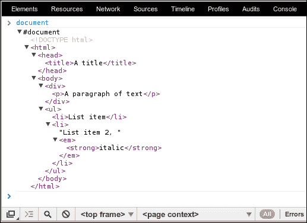

在最新的 Chrome 版本中，我可以在**控制台**标签中打印和操作这些内容；你可能需要使用**元素**标签来获得相同的效果。将光标移到每个元素上，将显示它确切地放置在页面上的位置，这对于调试来说非常方便。

## 使用 d3.js 操作 DOM

DOM 树中的每个节点都附带了一系列你可以用来改变渲染文档外观的方法和属性。

以我们之前的例子中的 HTML 代码为例。如果我们想将单词`italic`改为加粗并带有下划线（即`<em>`和`<strong>`标签的结果），我们会使用以下代码来完成：

```js
document.getElementsByTagName('strong')[0].style.setProperty('text-decoration', 'underline')
```

哇！真是一大堆。

我们从根`document`节点开始，找到了所有由`<strong>`标签创建的节点；然后我们取这个数组中的第一个元素，并为其`style`属性添加了一个`text-decoration`属性。

在一个只有十一个节点的文档中完成这样简单的事情所需要的大量代码是为什么今天很少有人直接使用 DOM API 的原因——更不用说浏览器之间所有细微的差异了。

由于我们希望生活简单，避免直接使用 DOM，我们需要一个库。jQuery 是一个不错的选择，但为了使事情更加简单，我们可以使用 d3.js。它包含了我们所需的一切。

这意味着我们可以将 HTML 视为另一种类型的数据可视化。让我们好好消化这一点。HTML 就是数据可视化。

实际上，这意味着我们可以使用类似的技术将数据呈现为表格或交互式图像。最重要的是，我们可以使用相同的数据。

让我们用 d3.js 重写之前的例子：

```js
d3.select('strong').style('text-decoration', 'underline')
```

简单多了！我们选择了`strong`元素并定义了一个`style`属性。任务完成！

顺便说一句，你可以使用 d3.js 设置的任何属性都是动态的，所以你可以分配一个函数以及一个值。这将在以后派上用场。

我们刚才所做的是称为 **选择**。由于选择是我们使用 d3.js 所做的一切的核心，让我们更仔细地看看。

## 选择

选择是一个根据特定 CSS 选择器从当前文档中提取的元素数组。选择器允许你一次性对整个选择集应用不同的函数，这样你就不必手动遍历元素。

使用 CSS 选择器来决定要处理的元素，为我们提供了一个定义文档中元素的简单语言。实际上，这与你从 jQuery 和 CSS 本身所熟悉的是一样的。

要获取 ID 为 `graph` 的第一个元素，我们使用 `.select('#graph')`；要获取所有具有类 `blue` 的元素，我们写入 `.selectAll('.blue')`；要获取文档中的所有段落，我们使用 `.selectAll('p')`。

我们可以将这些组合起来以获得更复杂的匹配。想象成集合操作。你可以使用 `".this.that"` 进行 AND 操作；这将获取具有 `this` 和 `that` 类的元素。或者，你可以使用 `".this, .that"` 进行 OR 操作以获取具有 `this` 或 `that` 类的元素。

但如果你想要选择子元素呢？嵌套选择可以解决这个问题。你可以使用一个简单的选择器，例如 `"tbody td"`，或者你可以链式调用两个 `selectAll` 调用，如 `.selectAll('tbody').selectAll('td')`。两者都将选择表格体中的所有单元格。请注意，嵌套选择保持所选元素之间的层次结构，这为我们提供了一些有趣的能力。让我们看看一个简短的例子。

### 选择示例

从第一章中的实验环境获取基本 HTML 并添加一个简单的表格：

```js
<table class="table">
  <thead>
    <tr><td>One</td><td>Two</td><td>Three</td><td>Four</td><td>Five</td></tr>
  </thead>
  <tbody>
    <tr><td>q</td><td>w</td><td>e</td><td>r</td><td>t</td></tr>
    <tr><td>a</td><td>s</td><td>d</td><td>f</td><td>g</td></tr>
    <tr><td>z</td><td>x</td><td>c</td><td>v</td><td>b</td></tr>
  </tbody>
</table>
```

几乎是表格的标准标记，`<thead>` 和 `<tbody>` 定义了表格的头部和主体，其中每个 `<tr>` 是一行，每个 `<td>` 是一个单元格。添加 `table` 类告诉 Bootstrap 为我们使表格看起来更美观。

让我们进入控制台，用选择做一些有趣的事情：

```js
d3.selectAll('td').style('color', 'red')
```

文本将立即变为红色。现在让我们通过链式调用两个 `selectAll` 来使表格标题中的所有内容加粗：

```js
d3.selectAll('thead').selectAll('td').style('font-weight', 'bold')
```

太棒了！让我们进一步探讨嵌套选择，并将表格体的第二列和第四列单元格变为绿色：

```js
d3.selectAll('tbody tr').selectAll('td')
  .style('color', function (d, i) { return i%2 ? 'green' : 'red'; })
```

两个 `selectAll` 调用为我们提供了体中所有 `td` 的实例，按行分隔，给我们一个包含三个数组的数组，每个数组有五个元素：`[ Array[5], Array[5], Array[5] ]`。然后我们使用 `style` 改变所选元素的颜色。

使用函数而不是静态属性给了我们所需的精细控制。该函数使用数据属性（我们稍后会讨论更多）和列的索引调用，即 `i` 变量。由于我们使用嵌套选择，第三个参数将给我们行。然后我们简单地根据当前索引返回 `'green'` 或 `'red'`。

需要注意的一点是，当涉及到非常大的文档时，链式调用选择可能比使用 OR 选择器更高效。这是因为每个后续选择只搜索之前匹配的元素。

## 操作内容

我们可以做的不仅仅是围绕选择和更改元素属性打转。我们可以操纵事物。

使用 d3.js，我们可以更改元素的内容，添加新元素，或删除我们不需要的元素。

让我们给之前示例中的表格添加一个新列：

```js
var newCol = d3.selectAll('tr').append('td')
```

我们选择了所有的表格行，然后使用 `.append()` 为每一行添加了一个新单元格。所有 d3.js 操作都会返回当前选择——在这个例子中是新单元格——因此我们可以链式调用操作或将新选择赋值给变量（`newCol`）以供以后使用。

我们手里有一个空的无形列。让我们添加一些文本来让它看起来更美观：

```js
newCol.text('a')
```

至少现在它充满了 `a` 实例，我们可以说列是存在的。但这有点没有意义，所以让我们遵循其他列设定的模式：

```js
newCol.text(function (d, i) { return ['Six', 'y', 'h', 'n'][i] })
```

通过函数动态定义内容的技巧帮助我们根据我们所在的列从值列表中选择正确的字符串，我们通过索引 `i` 来识别列。

你已经找到了这个模式了吗？阅读表体的顶部行。

同样，我们可以使用 `.remove()` 来删除元素。要删除表格中的最后一行，你会写如下内容：

```js
d3.selectAll('tr')[0][3].remove()
```

你必须使用 `[0][3]` 而不是 `[3]`，因为选择是数组的数组。

## 将数据连接到选择

我们已经到达了我们 DOM 恶作剧的有趣部分。记得我曾经说过 HTML 是数据可视化吗？将数据连接到选择就是如何实现这一点的。

要将数据与选择连接起来，我们使用 `.data()` 函数。它接受一个数据参数，形式为一个函数或一个数组，并且可选地提供一个函数告诉 d3.js 如何区分数据的不同部分。

当你将数据连接到选择时，以下三种情况之一将会发生：

+   已连接的数据比之前更多（数据的长度超过了选择的长度）。你可以使用 `.enter()` 函数来引用新的条目。

+   数据量与之前完全相同。你可以使用 `.data()` 返回的选择来更新元素状态。

+   数据量比之前少。你可以使用 `.exit()` 函数来引用这些数据。

你不能链式调用 `.enter()` 和 `.exit()`，因为它们只是引用，并不会创建一个新的选择。这意味着你通常想要专注于 `.enter()` 和 `.exit()`，并分别处理三种情况。请注意，这三种情况可能同时发生。

您可能想知道，“但为什么数据比之前多或少了？”这是因为选择元素绑定到数据实例，而不是它们的数量。如果您移动了一个数组并添加了一个新值，那么前面的第一个项目将进入`.exit()`引用，而新的添加将进入`.enter()`引用。

让我们用数据连接和 HTML 构建一些有趣的东西。

## 一个 HTML 可视化示例

我们将开始使用与往常一样的 HTML 文件。我建议从现在开始编码`code.js`文件，因为事情可能会变得相当复杂。经常刷新以保持对正在发生的事情的关注。

每个伟大的可视化都需要一个数据集；我们将使用自 1963 年以来所有《神秘博士》怪物和坏蛋的列表。它是由《卫报数据博客》在 2012 年 12 月底发布的。您可以从[`github.com/Swizec/d3.js-book-examples/blob/master/ch2/villains.csv`](https://github.com/Swizec/d3.js-book-examples/blob/master/ch2/villains.csv)获取 CSV 文件。

我们将创建一个表格。当然，这并不令人兴奋，但对于 HTML 可视化来说非常实用。

我们从一个全局数据变量开始。

在您的`code.js`文件顶部添加以下行：

```js
var Data;
```

然后我们使用以下代码将一个空表附加到我们的`graph` div 中：

```js
var table = d3.select('#graph')
  .append('table')
  .attr('class', 'table');

var thead = table.append('thead'),
  tbody = table.append('tbody');
```

如您从前面的示例中可以想象到的，这段代码通过 ID 选择目标`<div>`标签`graph`，并附加一个具有`class='table'`属性的`table`元素，这样 Bootstrap 就会使其看起来很吸引人。

接下来的两行将空的`thead`和`tbody`元素附加到变量中，以供以后使用。

现在我们将加载数据并将其分配给`Data`变量：

```js
var reload = function () {
  d3.csv('villains.csv', function (data) {
    Data = data;
    redraw();
  });
};
reload();
```

我们稍后会修改数据集，所以有一个函数在需要重新加载数据而不需要刷新页面时可以调用是很方便的。

由于我们的数据集是 CSV 格式，我们使用 d3.js 的`csv`函数来加载和解析它。d3.js 足够聪明，能够理解我们的数据集中的第一行不是数据，而是一组标签，因此它以以下方式将字典数组填充到`data`变量中：

```js
{
  "Villain": "Abzorbaloff (Victor Kennedy)",
  "Year first": "2006",
  "Year last": "2006",
  "Doc. no.": "10",
  "Doctor actor": "David Tennant",
  "Epi- sodes": "1",
  "Stories, total": "1",
  "Motivation (invasion earth, end of universe, etc)": "Kill humans",
  "Story titles": "Love and Monsters"
}
```

如果您现在运行代码，Chrome 会抱怨`redraw()`函数不存在。让我们按照以下方式编写一个：

```js
var redraw = function () {
};
```

我们定义了一个`redraw`变量，并将其分配给一个空函数。

我们下一步是让这个函数做些事情。让我们进入它的主体（在两个大括号之间）并添加一些代码：

```js
var tr = tbody.selectAll('tr')
              .data(Data);

  tr.enter()
    .append('tr');

  tr.exit()
    .remove();
```

代码分为三个部分。第一部分选择所有表格行（目前还没有）并使用`.data()`函数将我们的`Data`连接起来。结果选择被保存在`tr`变量中。

接下来我们使用`.enter()`引用为数据集中的每个新数据创建一个表格行。现在，这是针对所有数据。

代码的最后一部分目前还没有做任何事情，但一旦我们稍后更改数据，它将删除`.exit()`引用中的任何`<tr>`元素。

执行后，`tr`变量将包含一个`<tr>`元素的数组，每个元素都绑定到数据集中的相应位置。第一个`<tr>`元素包含第一个数据，第二个包含第二个数据，依此类推。

没有单元格的行是没有用的。让我们通过依赖于数据在新的选择之后仍然与元素相连的事实来添加一些单元格：

```js
tr.selectAll('td')
  .data(function (d) { return d3.values(d); })
  .enter()
  .append('td')
  .text(function (d) { return d; });
```

我们选择了每一行的所有`<td>`子元素（目前还没有）。然后我们必须使用`d3.values()`将相同的数据转换成一个值列表，并调用`.data()`函数。这给了我们一个使用`.enter()`的新机会。

从那时起，情况就更加相似。每个新的条目都会得到自己的表格单元格，文本设置为当前数据。

运行这段代码将给你一个完全令人困惑的表格，列出了自 1963 年以来在电视上出现的所有《博士》怪物和反派。

让我们让它更清晰。如果你想看到一些实时更新的魔法，你可以在`redraw()`函数的底部编写这段代码，或者直接在 Chrome 的 JavaScript 控制台中编写。

要按反派首次出现对表格进行排序，我们编写以下代码：

```js
tbody.selectAll('tr')
  .sort(function (a, b) { return d3.ascending(a['Year first'], b['Year first']); });
```

不做任何其他事情，这段代码将重新绘制表格并按新的顺序排列——无需刷新页面，无需手动添加或删除元素。因为所有我们的数据都与 HTML 相连，所以我们甚至不需要引用原始的`tr`选择或数据。如果你问我，这非常巧妙。

`.sort()`函数只接受一个比较函数。比较函数会给出两份数据，并必须决定如何排序：`-1`表示小于`b`，`0`表示等于，`1`表示大于`b`。你还可以使用 d3.js 的`d3.ascending`和`d3.descending`比较器。

虽然仍然不太清楚，但让我们只限制我们的表格到最新的博士：

```js
Data = Data.filter(function (d) { return d['Doctor actor'] == 'Matt Smith'; })
redraw()
```

我们过滤了数据集，使其只包含演员是马特·史密斯（Matt Smith）的行，然后调用了`redraw()`函数。`.exit()`选择完成了它的任务，并从表格中删除了几百行。等等……我们最终得到了一个演员的大杂烩。花了我一段时间才弄清楚发生了什么。

JavaScript 是一种基于实例的标识语言，这意味着 d3.js 不能使用`a == b`来判断两个复杂对象是否相同。相反，它依赖于索引来识别对象。所以当我们过滤数据时，前*x*个索引中有内容，被认为是未更改的，其余的则被删除。已经附加到元素上的数据不会更新，我们手上就有一个糟糕的表格。我们可以通过两种方式摆脱这种情况。

我们可以先对表格进行排序，然后按如下方式过滤数据：

```js
tbody.selectAll('tr').sort(function (a, b) {
  return d3.descending(Number(a['Doc. no.']), Number(b['Doc. no.']));
});
```

与之前一样，我们使用比较器进行排序；我们使用`a['Doc. no.']`和`b['Doc. no.']`之间的数值比较来按降序排序行，最高的数字在最上面。

运行与之前相同的代码将得到期望的结果：

```js
Data = Data.filter(function (d) { return d['Doctor actor'] == 'Matt Smith'; })
redraw()
```

这之所以有效，是因为 Matt Smith 在数据集的前几个位置。但这种方法只适用于这个例子。我们可以使用更健壮的方法，但这不会在更改数据时自动发生。请记住刷新页面或运行`reload()`以获取整个数据集。

现在我们可以直接过滤表格，如下所示：

```js
tbody.selectAll('tr')
  .filter(function (d) { return d['Doctor actor'] != 'Matt Smith'; })
  .remove()
```

`.filter()`函数接受一个选择器作为其参数，并将当前数据传递给它。当函数返回`false`时，元素将从选择中移除；当它返回`true`时，元素将保留。最后，我们使用`.remove()`函数移除我们捕获的所有行。这更加健壮，但直接操作数据本身通常更加优雅。请明智地选择。

# SVG

可缩放矢量图形（Scalable Vector Graphics）是一种使用 XML 描述图像的矢量图形格式。它自 1999 年以来一直存在，并且现在所有主流浏览器都支持它。不幸的是，Internet Explorer 一直落后，从版本 9 开始只提供了有限的支持。矢量图像可以以任何大小渲染而不会变得模糊。这意味着你可以在大型的视网膜显示屏或小型的手机上渲染相同的图像，两种情况下都会看起来很棒。

SVG 图像是由形状组成的，你可以使用路径从头开始创建这些形状，或者从标准中定义的基本形状组合而成，例如一条线或一个圆。该格式本身使用 XML 元素和一些属性来表示形状。

因此，SVG 代码只是一堆你可以手动编辑、使用浏览器正常的调试工具检查，以及使用标准文本压缩算法压缩的文本。基于文本也意味着你可以使用 d3.js 在你的浏览器中创建一个图像，然后将生成的 XML 复制并粘贴到`.svg`文件中，并用任何 SVG 查看器打开它。

另一个后果是，浏览器可以将 SVG 视为文档的正常部分。你可以使用 CSS 进行样式设计，监听特定形状上的鼠标事件，甚至可以编写脚本使图像具有交互性。

## 使用 SVG 绘制

使用 d3.js 绘制图形时，你可以通过定义适当的 SVG 元素手动添加形状，或者你可以使用辅助函数来帮助你轻松创建高级形状。

现在我们将深入探讨 d3.js 的核心功能。所有其他功能都是基于这个核心构建的，所以请务必注意。

让我们从在我们的常规环境中准备一个绘图区域开始。将以下代码放在一个新的`code.js`文件顶部：

```js
var svg = d3.select('#graph')
  .append('svg')
  .style('width', 1024)
  .style('height', 768);
```

我们将一个`<svg>`元素附加到主`<div>`标签上，并调整了其大小。从现在开始，我们将使用`svg`变量进行绘图。

### 手动添加元素和形状

SVG 图像是由形状组成的元素集合，它包含一组七个基本元素。除了一个之外，这些元素只是定义路径的一种更简单的方式：

+   文本（唯一一个不是路径的）

+   直线

+   矩形

+   圆形

+   椭圆

+   多段线（一组直线）

+   多边形（一组直线，闭合于自身）

您可以通过将这些元素添加到画布中并定义一些属性来构建 SVG 图像。所有这些元素都可以有一个 `stroke` 样式来定义边缘的渲染方式，一个 `fill` 样式来定义形状的填充方式，并且所有这些都可以使用 `transform` 属性进行旋转、倾斜或移动。

#### 文本

文本是唯一一个既不是形状也不像其他元素那样在背景中转换为路径的元素。让我们先看看它，这样本章的其余部分就可以关于形状了：

```js
svg.append('text')
  .text("A picture!")
  .attr({x: 10,
    y: 150,
      'text-anchor': 'start'});
```

我们取了我们的 `svg` 元素并添加了一个 `text` 元素。然后我们定义了其实际文本，并添加了一些属性来定位文本在 `(x, y)` 点，并将文本锚定在开始位置。

`text-anchor` 属性定义了渲染文本相对于由 `(x, y)` 定义的锚点的水平位置。它理解的位置是开始、中间和结束。

我们还可以使用 `dx` 和 `dy` 属性定义的偏移量来微调文本的位置。这在调整文本边距和基线相对于字体大小时特别有用，因为它理解 `em` 单位。

我们的形象如下所示：

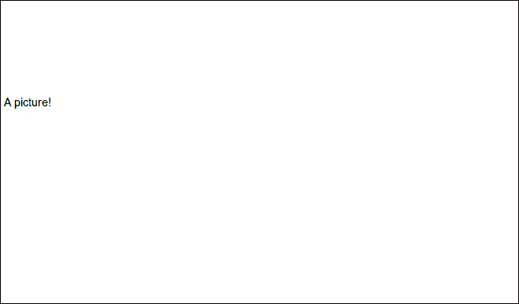

#### 形状

现在文本已经处理完毕，让我们看看一些有用的东西——形状，这是本书其余部分的核心。

我们首先使用以下代码绘制一条直线：

```js
svg.append('line')
  .attr({x1: 10,
    y1: 10,
    x2: 100,
    y2: 100,
    stroke: 'blue',
    'stroke-width': 3});
```

就像之前一样，我们取了 `svg` 元素，添加了一条线，并定义了一些属性。一条线在两个点之间绘制：`(x1, y1)` 和 `(x2, y2)`。为了使线条可见，我们必须定义线条颜色和 `stroke-width` 属性。

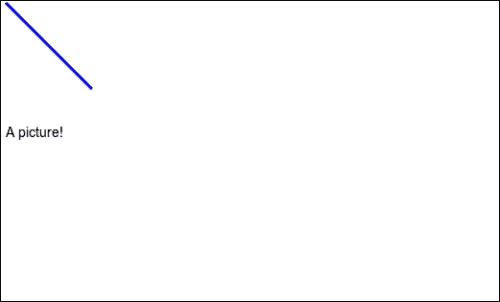

尽管`y2`大于`y1`，我们的线点却向下。嗯……这是因为大多数图像格式的原点位于左上角。这意味着 `(x=0, y=0)` 定义了图像的左上角。

要绘制一个矩形，我们可以使用 `rect` 元素：

```js
svg.append('rect')
  .attr({x: 200,
    y: 50,
    width: 300,
    height: 400});
```

我们将一个 `rect` 元素添加到 `svg` 元素中，并定义了一些属性。一个矩形由其左上角 (`x`，`y`)、`width` 和 `height` 定义。

我们的形象现在如下所示：

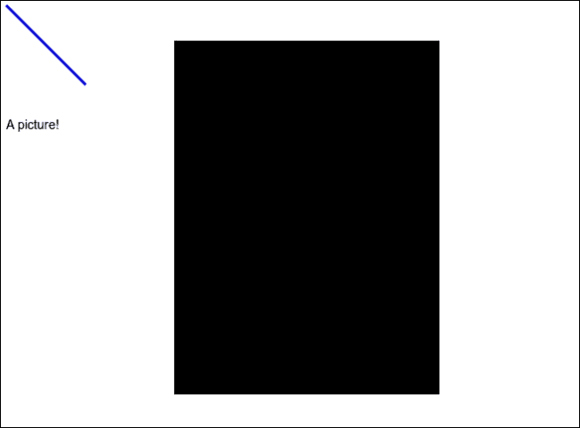

我们有一个难以驾驭的黑色矩形。我们可以通过定义以下三个更多属性来让它更漂亮：

```js
svg.select('rect')
  .attr({stroke: 'green',
    'stroke-width': 0.5,
    fill: 'white',
    rx: 20,
    ry: 40});
```

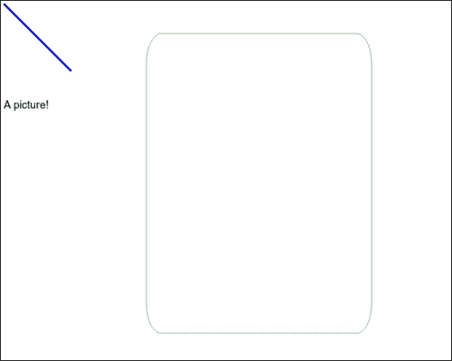

这好多了。我们的矩形有一个细的、绿色的轮廓。圆角来自 `rx` 和 `ry` 属性，它们定义了沿 x 和 y 轴的角落半径：

让我们尝试添加一个圆：

```js
svg.append('circle')
  .attr({cx: 350,
    cy: 250,
    r: 100,
    fill: 'green',
    fill-opacity': 0.5,
    stroke: 'steelblue',
    'stroke-width': 2});
```

一个圆由一个中心点 `(cx, cy)` 和一个半径 `r` 定义。在这个例子中，我们在矩形的中间得到了一个 `green` 圆圈，有一个 `steelblue` 轮廓。`fill-opacity` 属性告诉圆圈稍微透明，这样它就不会在浅色矩形上显得太强烈：

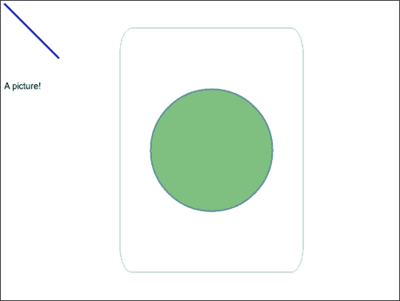

从数学的角度讲，一个圆只是一个特殊的椭圆形式。通过添加另一个半径并更改元素，我们可以绘制以下形状之一：

```js
svg.append('ellipse')
  .attr({cx: 350,
    cy: 250,
    rx: 150,
    ry: 70,
    fill: 'green',
    'fill-opacity': 0.3,
    stroke: 'steelblue',
    'stroke-width': 0.7});
```

我们添加了一个 `ellipse` 元素并定义了一些已知的属性。椭圆形状需要一个中心点 `(cx, cy)` 和两个半径，`rx` 和 `ry`。设置一个低的 `fill-opacity` 属性使得圆形在椭圆下可见：

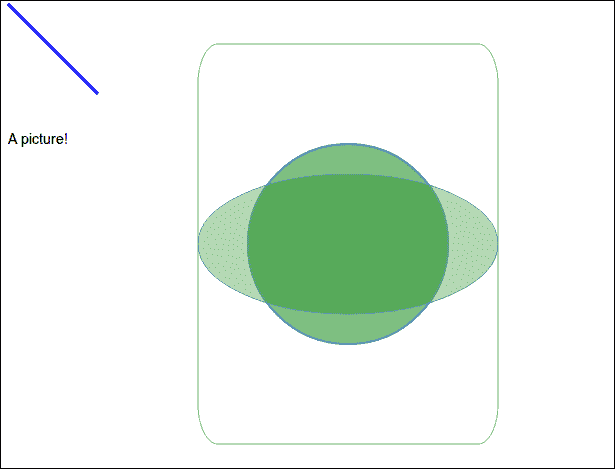

这不错，但我们可以用以下代码让它更有趣：

```js
svg.append('ellipse')
  .attr({cx: 350,
    cy: 250,
    rx: 20,
    ry: 70});
```

这里的唯一技巧是 `rx` 小于 `ry`，创建了一个垂直的椭圆。太棒了！

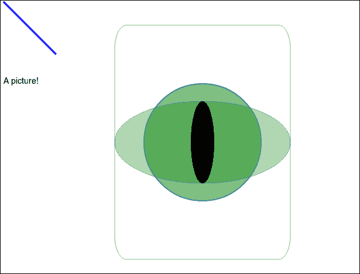

一个奇怪的绿色眼睛和一条随机的蓝色线条在盯着你，这一切都归功于手动将基本 SVG 元素添加到画布上并定义了一些属性。

生成的 SVG 以 XML 形式如下所示：

```js
<svg style="width: 1024px; height: 768px;">
  <text x="10" y="150" text-anchor="start">A picture!</text>
  <line x1="10" y1="10" x2="100" y2="100" stroke="blue" stroke-width="3"></line>
  <rect x="200" y="50" width="300" height="400" stroke="green" stroke-width="0.5" fill="white" rx="20" ry="40"></rect>
  <circle cx="350" cy="250" r="100" fill="green" fill-opacity="0.5" stroke="steelblue" stroke-width="2"></circle>
  <ellipse cx="350" cy="250" rx="150" ry="70" fill="green" fill-opacity="0.3" stroke="steelblue" stroke-width="0.7"></ellipse>
  <ellipse cx="350" cy="250" rx="20" ry="70"></ellipse>
</svg>
```

是的，我也不想手动写那个。

但你可以看到我们之前添加的所有元素和属性。能够查看图像文件并理解其中发生的事情可能在某一天很有用。这确实很酷。通常当你用文本编辑器打开图像时，你得到的就是二进制的乱码。

现在，我知道我之前提到过多边形和多边形也是基本的 SVG 元素。我之所以省略这些基本元素的解释，是因为在使用 d3.js 时，我们有很好的工具来处理它们。相信我，你不想手动做这些。

### 变换

在深入研究更复杂的事情之前，我们必须看看变换。

不深入数学细节，只需说，SVG 中使用的变换是我们绘图形状所使用的坐标系中的仿射变换。美妙的是，它们可以定义为矩阵乘法，这使得它们在计算上非常高效。

但是，除非你的大脑是由线性代数构成的，否则使用矩阵作为变换可能会变得非常复杂。SVG 通过提供一系列预定义的变换来帮助，即 `translate()`、`scale()`、`rotate()`、`skewX()` 和 `skewY()`。

根据维基百科，仿射变换是任何保持点、直线和平面，同时保持平行线集合平行的变换。它们不一定保持距离，但确实保持直线上的点之间距离的比率。这意味着如果你取一个矩形，你可以使用仿射变换来旋转它，放大它，甚至将其变成平行四边形；然而，无论你做什么，它永远不会变成梯形。

计算机将变换处理为矩阵乘法，因为任何变换序列都可以折叠成一个单一的矩阵。这意味着它们在绘制形状时只需要应用一个包含你的变换序列的单个变换，这很方便。

我们将使用 `transform` 属性应用变换。我们可以定义多个按顺序应用的变换。操作顺序可以改变结果。你将在以下示例中注意到这一点。

让我们把目光移到矩形的边缘：

```js
svg.selectAll('ellipse, circle')
  .attr('transform', 'translate(150, 0)');
```

我们选择了眼睛所构成的一切（两个椭圆和一个圆），然后应用了 `translate` 变换。它将形状的起点沿着 `(150, 0)` 向量移动，将形状向右移动 150 像素，向下移动 0 像素。

如果你再次尝试移动它，你会注意到新的变换是按照我们形状的原始状态应用的。这是因为每个形状只能有一个 `transform` 属性。

我们的图片看起来如下：


让我们旋转眼睛 45 度：

```js
svg.selectAll('ellipse, circle')
  .attr('transform', 'translate(150, 0) rotate(45)');
```

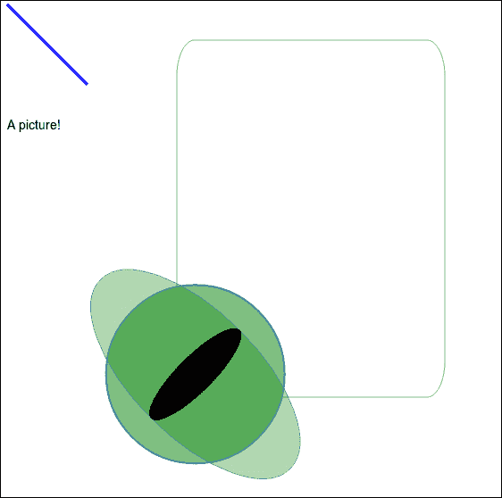

这根本就不是我们想要的。

欺骗我们的地方在于旋转是围绕图像的起点进行的，而不是形状。我们必须自己定义旋转轴：

```js
svg.selectAll('ellipse, circle')
  .attr('transform', 'translate(150, 0) rotate(-45, 350, 250)');
```

通过向 `rotate()` 函数添加两个额外的参数，我们定义了旋转轴并达到了预期的效果：

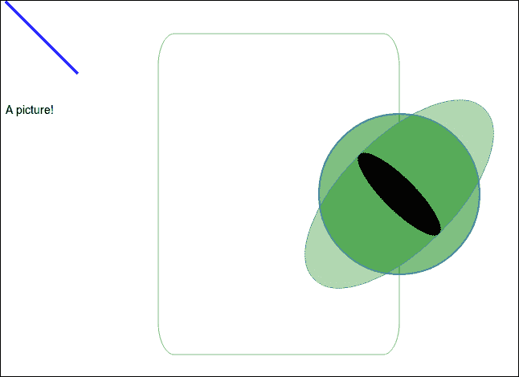

让我们使用 `scale()` 变换使眼睛稍微大一点：

```js
svg.selectAll('ellipse, circle')
  .attr('transform', 'translate(150, 0) rotate(-45, 350, 250) scale(1.2)');
```

这将使我们的对象在两个轴向上都扩大到 `1.2` 倍；两个参数会以不同的因子沿 x 轴和 y 轴缩放：

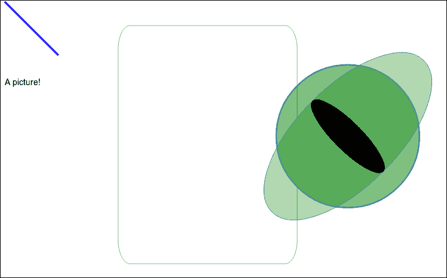

再次，我们调整了眼睛的位置，因为缩放是以整个图像的零点为基准的。我们必须使用另一个 `translate` 来将其移回。但现在我们正在工作的坐标系已经旋转了 45 度并进行了缩放。这使得事情变得复杂。我们需要在这两个坐标系之间进行转换，才能正确地移动眼睛。为了将眼睛向左移动 70 像素，我们必须沿着每个轴移动 *70*sqrt(2)/2* 像素，这是 45 度角的余弦和正弦的结果。

但这只是混乱。数字看起来很奇怪，我们为了这么简单的事情做了太多的工作。让我们改变操作顺序：

```js
svg.selectAll('ellipse, circle')
  .attr('transform', 'translate(150, 0) scale(1.2) translate(-70, 0) rotate(-45, '+(350/1.2)+', '+(250/1.2)+')');
```

好多了！我们得到了我们想要的确切效果：

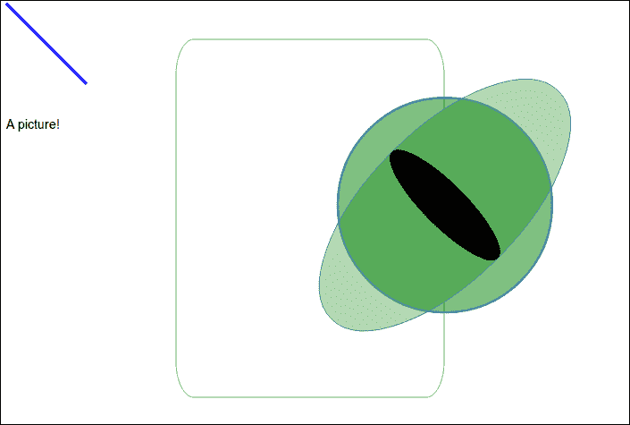

发生了很大的变化，让我们看看。

首先，我们将它转换到我们熟悉的位置，然后通过 `1.2` 缩放，将眼睛推离位置。我们通过向左移动 `70` 像素来修复这个问题，然后最终执行 `45` 度旋转，确保将旋转中心点除以 `1.2`。

我们还可以对这只可怜的眼睛做一件事；让它倾斜。存在两种倾斜变换：`skewX` 和 `skewY`。两者都沿着各自的轴倾斜：

```js
svg.selectAll('ellipse, circle')
  .attr('transform', 'translate(150, 0) scale(1.2) translate(-70, 0) rotate(-45, '+(350/1.2)+', '+(250/1.2)+') skewY(20)');
```

我们只是将 `skewY(20)` 添加到 `transform` 属性的末尾。

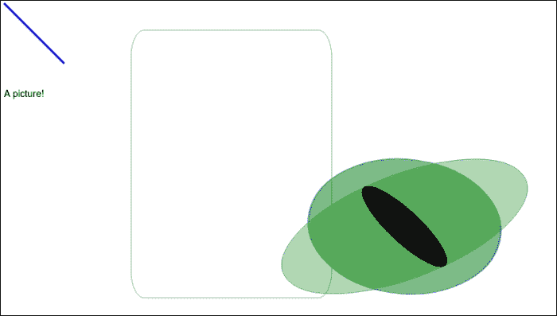

我们又一次破坏了我们精心对齐的中心。修复这个问题留给读者作为练习（我一直想这么说）。

总的来说，变换实际上只是矩阵乘法。实际上，你可以使用 `matrix()` 函数定义你想要的任何变换。我建议查看确切哪种矩阵会产生前面提到的效果。W3C 规范可在[`www.w3.org/TR/SVG/coords.html#EstablishingANewUserSpace`](http://www.w3.org/TR/SVG/coords.html#EstablishingANewUserSpace)找到。

### 使用路径

路径元素定义了可以填充、描边等形状的轮廓。它们是所有其他形状的泛化，可以用来绘制几乎任何东西。

大多数路径的魔法都源于 `d` 属性；它使用三种基本命令的迷你语言：

+   `M`，表示移动到

+   `L`，表示线到

+   `Z`，表示闭合路径

要创建一个矩形，我们可能会写如下内容：

```js
svg.append('path')
  .attr({d: 'M 100 100 L 300 100 L 200 300 z',
    stroke: 'black',
    'stroke-width': 2,
    fill: 'red',
    'fill-opacity': 0.7});
```

我们向我们的 `svg` 添加了一个新元素，并定义了一些属性。有趣的部分是 `d` 属性，`M 100 100 L 300 100 L 200 300 z`。分解来看，我们首先移动到 (`100`, `100`)，在 (`300`, `100`) 上画了一条线，然后在 (`200`, `300`) 上又画了一条线，最后闭合路径。

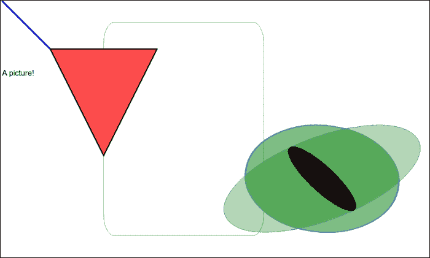

路径的力量并不仅限于此。`M`、`L`、`Z` 组合之外的命令给我们提供了创建曲线和圆弧的工具。但手动创建复杂形状已经超出了繁琐。

d3.js 附带一些有用的路径生成器函数，它们可以将 JavaScript 转换为路径定义。我们将在下一章中查看这些函数。

我们的形象变得越来越拥挤，所以让我们重新启动环境。

首先，我们将绘制一个谦逊的正弦函数。再一次，我们首先准备绘图区域：

```js
var width = 1024,
  height = 768,
  margin = 10;

var svg = d3.select('#graph')
  .append('svg')
  .attr('width', width+2*margin)
  .attr('height', height+2*margin);

var g = svg.append('g')
  .attr('transform', 'translate('+margin+', '+margin+')');
```

我们向我们的 `#graph` div 添加了一个 `svg` 元素，并设置了足够大的 `width` 和 `height` 以满足我们的邪恶计划。然后，我们添加了一个 `g` 元素来放置我们的图表。`g` 元素是 SVG 形状的逻辑分组，提高了我们文档的语义性，并使其更容易使用。

接下来，我们需要一些数据，即正弦函数。

```js
var sine = d3.range(0,10).map(
  function (k) { return [0.5*k*Math.PI,
                         Math.sin(0.5*k*Math.PI)]; });
```

使用 `d3.range(0,10)` 会给我们一个从零到九的整数列表。我们遍历它们，并将每个转换为元组，实际上是一个表示曲线的最大值、最小值和零点的 2 长度数组。你可能还记得从你的数学课上学到的，正弦函数从 (0,0) 开始，然后到 (π/2, 1)，(π, 0)，(3π/2, -1)，以此类推。

我们将这些作为数据输入到路径生成器中。

路径生成器实际上是 d3.js 魔法的精髓。我们将在 第五章 中讨论魔法的精华，*布局 – d3 的黑魔法*。它们本质上是一个函数，它接受一些数据（与元素相关联）并生成 SVG 路径迷你语言中的路径定义。所有路径生成器都可以被告知如何使用我们的数据。我们还可以大量地玩转最终输出。

#### 线

要创建一条线，我们使用 `d3.svg.line()` 生成器并定义 x 和 y 访问器函数。访问器告诉生成器如何从数据点读取 x 和 y 坐标。

我们首先定义两个比例尺。比例尺是从域到范围的函数；我们将在下一章中更多地讨论它们：

```js
var x = d3.scale.linear()
  .range([0, width/2-margin])
  .domain(d3.extent(sine, function (d) { return d[0]; })),
  y = d3.scale.linear().range([height/2-margin, 0]).domain([-1, 1]);
```

现在我们需要定义一个简单的路径生成器：

```js
var line = d3.svg.line()
  .x(function (d) { return x(d[0]); })
    .y(function (d) { return y(d[1]); });
```

这只是将基本线生成器与一些访问器附加在一起的问题。我们告诉生成器使用我们的 `x` 尺度在元组的第一个元素上，并在第二个元素上使用 `y` 尺度。默认情况下，它假设我们的数据集是一个直接定义点的数组的集合，因此 `d[0]` 是 `x`，`d[1]` 是 `y`。

现在只剩下绘制实际的线：

```js
g.append('path')
  .datum(sine)
  .attr("d", line)
  .attr({stroke: 'steelblue',
        'stroke-width': 2,
         fill: 'none'});
```

添加一个路径，并使用 `.datum()` 添加 `sine` 数据。使用这种方法而不是 `.data()` 意味着我们可以将函数渲染为单个元素，而不是为每个点创建新的一行。我们让生成器定义 `d` 属性。其余的只是使事物可见。

我们的图表如下所示：

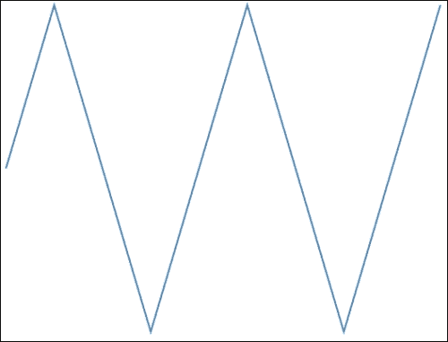

如果您查看生成的代码，您会看到这种乱七八糟的东西：

```js
d="M0,192L56.88888888888889,0L113.77777777777779,191.99999999999994L170.66666666666669,384L227.55555555555557,192.00000000000006L284.44444444444446,0L341.33333333333337,191.99999999999991L398.2222222222223,384L455.11111111111114,192.00000000000009L512,0"
```

看吧！我告诉过你没有人愿意手动编写这些。

那是一个非常锯齿状的 `sine` 函数，与高中数学老师画的不一样。我们可以通过插值来改进它。

插值是猜测线条上未指定点应出现的位置的行为，考虑到我们已知的点。默认情况下，我们使用 `linear` 插值器，它只是在点之间绘制直线。

让我们尝试其他的东西：

```js
g.append('path')
  .datum(sine)
  .attr("d", line.interpolate('step-before'))
  .attr({stroke: 'black',
    'stroke-width': 1,
    fill: 'none'});
```

这与之前的代码相同，但我们使用了 `step-before` 插值器，并更改了样式以生成以下内容：

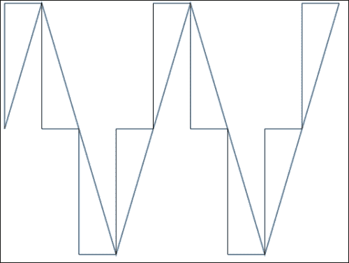

d3.js 总共提供了 12 个线插值器，这里不再一一列举。您可以在官方维基页面上查找它们：[`github.com/mbostock/d3/wiki/SVG-Shapes#wiki-line_interpolate`](https://github.com/mbostock/d3/wiki/SVG-Shapes#wiki-line_interpolate)。

我建议尝试所有这些，以了解它们的作用。

#### 区域

区域是两条线之间的彩色部分，实际上是一个多边形。

我们定义一个区域，类似于定义线的方式，所以取一个路径生成器并告诉它如何使用我们的数据。对于简单的水平区域，我们必须定义一个 x 访问器和两个 y 访问器，`y0` 和 `y1`，用于底部和顶部。

我们将并排比较不同的生成器，所以让我们添加一个新的图表：

```js
var g2 = svg.append('g')
  .attr('transform', 'translate('+(width/2+margin)+', '+margin+')');
```

现在我们定义一个 `area` 生成器并绘制一个区域。

```js
var area = d3.svg.area()
  .x(function (d) { return x(d[0]); })
  .y0(height/2)
  .y1(function (d) { return y(d[1]); })
  .interpolate('basis');

g2.append('path')
  .datum(sine)
  .attr("d", area)
  .attr({fill: 'steelblue',
    'fill-opacity': 0.4});
```

我们取了一个普通的 `d3.svg.area()` 路径生成器，并告诉它通过我们之前定义的 `x` 和 `y` 尺度获取坐标。`basis` 插值器将使用 B 样条从我们的数据创建平滑曲线。

为了绘制底部边缘，我们将 `y0` 定义为图表的底部，并生成一个彩色的正弦近似：

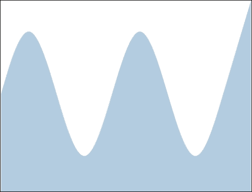

区域通常与使重要边缘突出的线一起使用。让我们试试这个：

```js
g2.append('path')
  .datum(sine)
  .attr("d", line.interpolate('basis'))
  .attr({stroke: 'steelblue',
    'stroke-width': 2,
    fill: 'none'});
```

我们可以重用之前的线生成器；我们只需要确保使用与区域相同的插值器。这样，图像看起来会好得多：

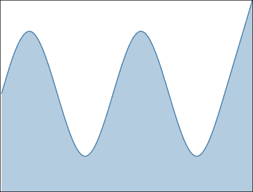

#### 弧

弧是一个有内半径和外半径的圆形路径，从一个角度到另一个角度。它们通常用于饼图和甜甜圈图。

一切都和以前一样工作；我们只需告诉基础生成器如何使用我们的数据。唯一的不同是这次默认的访问器期望的是命名属性，而不是我们习惯的 2 值数组。

让我们画一个弧：

```js
var arc = d3.svg.arc();

var g3 = svg.append('g')
        .attr('transform', 'translate('+margin+', '+(height/2+margin)+')');

g3.append('path')
  .attr("d", arc({outerRadius: 100,
    innerRadius: 50,
    startAngle: -Math.PI*0.25,
    endAngle: Math.PI*0.25}))
  .attr('transform', 'translate(150, 150)')
  .attr('fill', 'lightslategrey');
```

这次我们可以使用默认的 `d3.svg.arc()` 生成器。我们不是使用数据，而是手动计算角度，并将弧推向中心。

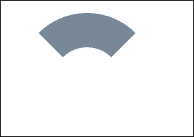

看看，一个简单的弧。庆祝吧！

尽管 SVG 通常使用度数，但起始和结束角度使用弧度。零角度向上，负值逆时针移动，正值朝相反方向移动。每 `2Pi` 我们回到零。

#### 符号

有时候在可视化数据时，我们需要一种简单的方式来标记数据点。这就是符号的作用，它们是用于区分数据点的微小符号。

`d3.svg.symbol()` 生成器接受一个 `type` 访问器和 `size` 访问器，并将定位留给我们。我们将在我们的面积图中添加一些符号，以显示函数穿过零时函数的走向。

和往常一样，我们从路径生成器开始：

```js
var symbols = d3.svg.symbol()
    .type(function (d, i) {
      if (d[1] > 0) {
        return 'triangle-down';
      }else{
        return 'triangle-up';
      }
    })
    .size(function (d, i) {
      if (i%2) {
        return 0;
      }else{
        return 64;
      }
    });
```

我们给 `d3.svg.symbol()` 生成器提供了一个 `type` 访问器，告诉它在 y 坐标为正时绘制向下指的三角形，在非正时绘制向上指的三角形。这之所以有效，是因为我们的 `sine` 数据由于 `Math.PI` 不是无限的以及由于浮点精度，数学上并不完美；我们得到接近零的无限小数，其符号取决于 `Math.sin` 参数是略小于还是略大于 `sin=0` 的完美点。

`size` 访问器告诉 `symbol()` 每个符号应该占用多少面积。因为其他每个数据点都接近零，所以我们用面积为零的方式隐藏了它们。

现在我们可以绘制一些符号：

```js
g2.selectAll('path')
  .data(sine)
  .enter()
  .append('path')
  .attr('d', symbols)
  .attr('transform', function (d) { return 'translate('+x(d[0])+','+y(d[1])+')'; })
  .attr({stroke: 'steelblue',
      'stroke-width': 2,
      fill: 'white'});
```

遍历数据，为每个条目添加一个新的路径，并将其转换为一个移动到位置的符号。结果如下所示：

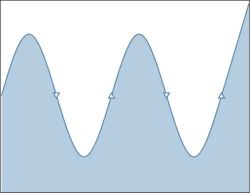

你可以通过打印 `d3.svg.symbolTypes` 来查看其他可用的符号。

#### 弦

好消息！我们正在离开简单图表的世界，进入魔法的世界。

弦通常用于在圆形排列中显示组元素之间的关系。它们使用二次贝塞尔曲线创建一个封闭形状，连接圆弧上的两个点。

如果你没有强大的计算机图形背景，这对你来说毫无意义。基本弦看起来像半个坏蛋的胡须：

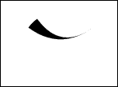

要绘制这个，我们使用以下代码片段：

```js
g3.append('g').selectAll('path')
  .data([{
    source: {radius: 50,
                  startAngle: -Math.PI*0.30,
                  endAngle: -Math.PI*0.20},
    target: {radius: 50,
                  startAngle: Math.PI*0.30,
                  endAngle: Math.PI*0.30}}])
  .enter()
  .append('path')
  .attr("d", d3.svg.chord());
```

这段代码添加了一个新的分组元素，定义了一个包含单个数据的数据集，并使用默认的 `d3.svg.chord()` 生成器为 `d` 属性附加了一个路径。

数据本身正好符合默认访问器的处理方式。`Source`定义了和弦的起始位置，`target`定义了和弦的结束位置。这两个都输入到另一组访问器中，指定弧的`radius`、`startAngle`和`endAngle`。与弧生成器一样，角度使用弧度定义。

让我们编造一些数据并绘制一个弦图：

```js
var data = d3.zip(d3.range(0, 12),
                            d3.shuffle(d3.range(0, 12))),
  colors = ['linen', 'lightsteelblue', 'lightcyan',
                   'lavender', 'honeydew', 'gainsboro'];
```

没有什么太花哨的。我们定义了两个数字数组，其中一个被随机打乱，然后合并成一个成对的数组；我们将在下一章中查看细节。然后我们定义了一些颜色。

```js
var chord = d3.svg.chord()
    .source(function (d) { return d[0]; })
    .target(function (d) { return d[1]; })
    .radius(150)
    .startAngle(function (d) { return -2*Math.PI*(1/data.length)*d; })
    .endAngle(function (d) {
      return -2*Math.PI*(1/data.length)*((d-1)%data.length); });
```

所有这些只是定义了生成器。我们将把圆分成几个部分，并用弦连接随机配对的点。

`.source()`和`.target()`访问器告诉我们每一对中的第一个元素是源，第二个是目标。对于`startAngle`，我们记得一个完整的圆是*2Pi*，然后除以部分的数量。最后，为了选择一个部分，我们乘以当前的值。`endAngle`访问器与之前类似，只是数据偏移了一个。

```js
g3.append('g')
  .attr('transform', 'translate(300, 200)')
  .selectAll('path')
  .data(data)
  .enter()
  .append('path')
  .attr('d', chord)
  .attr('fill', function (d, i) { return colors[i%colors.length]; })
  .attr('stroke', function (d, i) { return colors[(i+1)%colors.length]; });
```

要绘制实际的图表，我们创建一个新的分组，连接数据集，然后为每个数据项附加一个路径。`chord`生成器给它一个形状。为了使一切看起来更好，我们使用`colors`数组动态定义颜色。

最终结果每次刷新都会改变，但看起来可能像这样：

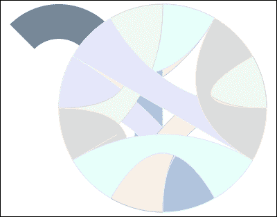

#### 对角线

`diagonal`生成器创建三次贝塞尔曲线——两点之间的平滑曲线。这对于用节点-链接图可视化树非常有用。

再次强调，默认访问器假设你的数据是一个字典，键名与特定的访问器同名。你需要`source`和`target`，它们被输入到`projection`中，然后它将笛卡尔坐标投影到你喜欢的任何坐标空间中。默认情况下，它只返回笛卡尔坐标。

让我们画一个胡子。没有`d3.layouts`，树状图就很难画，我们稍后再做这些：

```js
var g4 = svg.append('g')
    .attr('transform', 'translate('+(width/2)+','+(height/2)+')');

var moustache = [
  {source: {x: 250, y: 100}, target: {x: 500, y: 90}},
  {source: {x: 500, y: 90}, target: {x: 250, y: 120}},
  {source: {x: 250, y: 120}, target: {x: 0, y: 90}},
  {source: {x: 0, y: 90}, target: {x: 250, y: 100}},
  {source: {x: 500, y: 90}, target: {x: 490, y: 80}},
  {source: {x: 0, y: 90}, target: {x: 10, y: 80}}
];
```

我们开始在绘图区域上创建一个新的图形，并定义了一些应该创建一个甜美的胡子的数据：

```js
g4.selectAll('path')
  .data(moustache)
  .enter()
  .append('path')
  .attr("d", d3.svg.diagonal())
  .attr({stroke: 'black',
              fill: 'none'});
```

剩下的只是一个简单地将数据连接到我们的绘图并使用`d3.svg.diagonal()`生成器为`d`属性：

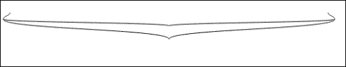

好吧，这有点像达利式的画风。可能吧，但它实际上看起来并不像胡子。这是因为定义贝塞尔曲线弯曲方式的切线被调整以在树状图中创建好看的扇出效果。不幸的是，d3.js 并没有给我们提供简单更改这些设置的方法，而且通过 SVG 的路径迷你语言手动定义贝塞尔曲线最多也只能算是繁琐。

无论哪种方式，我们都创建了一个路径生成器的并排比较：

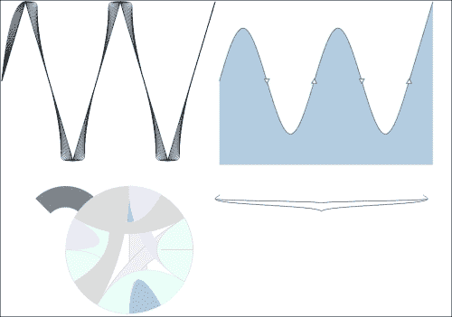

#### 轴

但我们还没有对我们的路径和形状做任何有用的事情。我们可以通过使用线条和文本来创建图形轴来实现这一点。但这会很繁琐，所以 d3.js 通过轴生成器使我们的工作变得更简单。它们负责绘制线条、添加刻度、添加标签、均匀地间隔它们等等。

d3.js 轴只是配置为酷炫的路径生成器的组合。对于简单的线性轴，我们只需要创建一个刻度并告诉轴使用它。就是这样！

对于更定制的轴，我们可能需要定义所需的刻度数并指定标签，也许甚至更有趣。甚至有方法制作圆形轴。

使用一个全新的环境版本，让我们创建一个轴。

我们从一个绘图区域开始：

```js
  var width = 800,
  height = 600,
  margin = 20,
  svg = d3.select('#graph')
    .append('svg')
    .attr({width: width,
                  height: height});
```

我们还需要一个线性刻度：

```js
var x = d3.scale.linear().domain([0, 100]).range([margin, width-margin]);
```

我们的轴将使用以下方式将数据点（`域`）转换为坐标（`范围`）：

```js
var axis = d3.svg.axis()
    .scale(x);
var a = svg.append('g')
  .attr('transform', 'translate(0, 30)')
  .data(d3.range(0, 100))
  .call(axis);
```

我们已经告诉 `d3.svg.axis()` 生成器使用我们的 `x` 刻度。然后，我们简单地创建了一个新的分组元素，连接了一些数据，并调用了轴。同时调用 `axis` 生成器对所有数据非常重要，这样它就可以处理附加自己的元素。

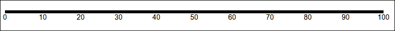

结果看起来一点也不好。

轴是复杂对象，所以没有 CSS 的情况下解决这个问题很复杂，CSS 将在下一节中介绍。

目前，添加以下代码就足够了：

```js
a.selectAll('path')
  .attr({fill: 'none',
       stroke: 'black',
       'stroke-width': 0.5});
a.selectAll('line')
  .attr({fill: 'none',
        stroke: 'black',
        'stroke-width': 0.3});
```

轴是一系列路径和线条；我们给它们一些风格，就能得到一个看起来很棒的轴：

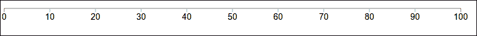

如果你调整刻度数量，确保刻度范围的域和范围的最大值匹配，你会发现轴足够智能，总是能选择完美的刻度数量。

让我们比较不同设置对轴的影响。我们将遍历几个轴并渲染相同的数据。

通过在 `svg.append('g')` 之上添加这一行来将你的轴绘制代码包裹在一个循环中。别忘了在最后一个 `stroke-width` 之后关闭循环：

```js
axes.forEach(function (axis, i) {
```

你也应该将 `.attr('transform', …)` 这一行改为将每个轴放置在上一轴下方 50 像素的位置。

```js
.attr('transform', 'translate(0, '+(i*50+margin)+')')
```

现在已经完成了，我们可以开始定义一个轴数组：

```js
var axes = [
  d3.svg.axis().scale(x),

  d3.svg.axis().scale(x)
    .ticks(5)
];
```

目前有两个版本：一个是普通版本，另一个将渲染出恰好 `5` 个刻度：

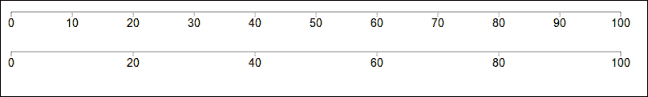

它成功了！`axis` 生成器已经找到了哪些刻度最好不显示，并重新标记了所有内容，我们几乎没做什么。

让我们在数组中添加更多轴并看看会发生什么：

```js
  d3.svg.axis().scale(x)
    .tickSubdivide(3)
    .tickSize(10, 5, 10)
```

使用 `.tickSubdivide()`，我们指示生成器在主刻度之间添加一些细分；`.tickSize()` 告诉它使次刻度更小。参数是主要、次要和末端刻度大小：

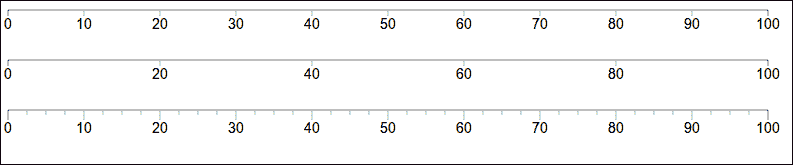

对于我们的最后一个技巧，让我们定义一些自定义刻度并将它们放置在轴上方。我们将在数组中添加另一个轴：

```js
  d3.svg.axis().scale(x)
    .tickValues([0, 20, 50, 70, 100])
    .tickFormat(function (d, i) {
      return ['a', 'e', 'i', 'o', 'u'][i];
    })
    .orient('top')
```

这里发生了三件事：`.tickValues()` 精确定义了哪些值应该有刻度，`.tickFormat()` 指定了标签的渲染方式——顺便说一句，d3 在 `d3.format` 中提供了一系列有用的格式化工具——最后 `.orient('top')` 将标签放在轴的上方。

你可能已经猜到了默认方向是 `'bottom'`。对于垂直轴，你可以使用 `'left'` 或 `'right'`，但别忘了分配适当的刻度。

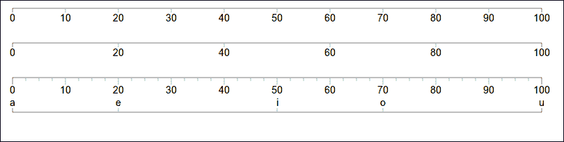

# CSS

层叠样式表（Cascading Stylesheets）自 1996 年以来一直伴随着我们，使它们成为网络中最古老的基石之一，尽管它们直到 21 世纪初的表格与 CSS 战争才达到广泛的流行。

你可能熟悉使用 CSS 为 HTML 添加样式。所以，在所有关于 SVG 的内容之后，这一节将会像一阵清新的微风。

我最喜欢的 CSS 之处在于它的简单性；参考以下代码。

```js
selector {
      attribute: value;
}
```

就这样。关于 CSS 的所有你需要知道的内容都在三行之内。

选择器可能会相当复杂，超出了本书的范围。我建议在网上寻找一个好的指南。我们只需要了解一些基础知识：

+   `path`: 选择所有 `<path>` 元素

+   `.axis`: 选择所有具有 `class="axis"` 属性的元素

+   `.axis line`: 选择所有是 `class="axis"` 元素子元素的 `<line>` 元素

+   `.axis, line`: 选择所有 `class="axis"` 和 `<line>` 元素

现在，你可能正在想，“哦，嘿！这和 d3.js 选择器的选择器是一样的。”是的！它确实是完全一样的。d3.js 选择器是 CSS 选择器的一个子集。

我们可以通过三种方式使用 d3.js 调用 CSS：使用 `.attr()` 方法定义一个类属性，这可能会很脆弱；使用 `.classed()` 方法，这是定义类的首选方式；或者直接使用 `.style()` 方法定义样式。

让我们改进之前的轴示例，并使样式更简洁。

进入 HTML 并在 `<div id="graph">` 标签之前添加一些 CSS，如下所示：

```js
<style>
  .axis path,
  .axis line {
    fill: none;
    stroke: black;
    stroke-width: 1px;
    shape-rendering: crispEdges;
  }

  .axis text {
    font-size: 11px;
  }

  .axis.red line,
  .axis.red path {
    stroke: red;
  }
</style>
```

它与直接更改 SVG 属性非常相似，但使用 CSS。我们使用 `stroke` 和 `fill` 来定义线的形状，并将 `shape-rendering` 设置为 `crispEdges`。这将使事情变得更好。

我们还定义了一种带有红色线条的额外类型的轴。

现在我们将绘图循环修正如下：

```js
axes.forEach(function (axis, i) {
  var a = svg.append('g')
      .classed('axis', true)
      .classed('red', i%2 == 0)
      .attr('transform', 'translate(0, '+(i*50+margin)+')')
      .data(d3.range(0, 100))
      .call(axis);
});
```

没有必要连续五次指定相同的样式。使用 `.classed()` 函数，我们为每个轴添加 `axis` 类，每隔一个轴是红色。`.classed()` 如果第二个参数为真则添加指定的类，否则移除。

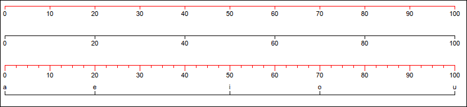

## 颜色

美观的视觉化往往涉及比你能立刻想到的基本名称更多的颜色。有时你想要根据数据的样子来玩弄颜色。

d3.js 提供了一系列用于在四个流行的颜色空间中操作颜色的函数：RGB、HSL、HCL 和 L*a*b。对我们最有用的是 RGB（红绿蓝）和 HSL（色调饱和度亮度），这实际上是另一种查看 RGB 的方式。无论如何，所有颜色空间都使用相同的函数，所以你可以使用最适合你需求的。

要构建一个 RGB 颜色，我们使用 `d3.rgb(r, g, b)`，其中 `r`、`g` 和 `b` 分别指定红色、绿色和蓝色的通道值。我们也可以用简单的 CSS 颜色参数替换三元组。然后我们可以使颜色变得更暗或更亮，这比手动着色要好得多。

是时候在新的环境中玩转颜色了。我们将绘制两个颜色轮，它们的亮度从中心向外部逐渐变化。

和往常一样，我们从一个变量和一个绘图区域开始：

```js
var width = 1024,
    height = 768,
    rings = 15;

var svg = d3.select('#graph')
        .append('svg')
        .style({width: width,
                    height: height});
```

从此以后，主要变量将是`rings`；它将告诉代码我们想要多少亮度级别。我们还需要一些基本颜色和计算角度的方法：

```js
var colors = d3.scale.category20b();
var angle = d3.scale.linear().domain([0, 20]).range([0, 2*Math.PI]);
```

`colors`在技术上是一个比例尺，但我们将它用作数据。Category20b 是 d3.js 附带的前定义颜色比例尺之一——一种获取精选颜色列表的简单方法。

为了计算角度，我们使用一个线性比例尺，它将`[0, 20]`域映射到完整的圆圈`[0, 2*pi]`。

接下来我们需要一个`arc`生成器和两个数据访问器来改变每个环的颜色色调：

```js
var arc = d3.svg.arc()
    .innerRadius(function (d) { return d*50/rings; })
    .outerRadius(function (d) { return 50+d*50/rings; })
    .startAngle(function (d, i, j) { return angle(j); })
    .endAngle(function (d, i, j) { return angle(j+1); });

var shade = {
  darker: function (d, j) { return d3.rgb(colors(j)).darker(d/rings); },
  brighter: function (d, j) { return d3.rgb(colors(j)).brighter(d/rings); }
};
```

弧将根据简单的环计数器计算内半径和外半径，角度将使用`angle`比例尺，这将自动计算正确的弧度值。`j`参数告诉我们当前正在绘制哪个弧段。

由于我们制作了两幅图，我们可以通过使用字典中的两个不同的着色器来简化代码。

每个着色器将从一个颜色比例尺中获取`d3.rgb()`颜色，然后根据它绘制的环数相应地变暗或变亮。再次强调，`j`参数告诉我们我们处于哪个弧段，`d`参数告诉我们我们处于哪个环。

最后，我们绘制两个颜色轮：

```js
[[100, 100, shade.darker],
 [300, 100, shade.brighter]].forEach(function (conf) {
  svg.append('g')
    .attr('transform', 'translate('+conf[0]+', '+conf[1]+')')
    .selectAll('g')
    .data(colors.range())
    .enter()
    .append('g')
    .selectAll('path')
    .data(function (d) { return d3.range(0, rings); })
    .enter()
    .append('path')
    .attr("d", arc)
    .attr('fill', function (d, i, j) { return conf2; });
});
```

哇！这段代码相当多。

我们取两个三元组，每个三元组定义了颜色轮的位置和要使用的着色器；然后调用一个函数，用每个着色器绘制一个闪亮的彩色圆圈。

对于每个圆圈，我们添加一个`<g>`元素并将其移动到位置，然后使用`colors.range()`获取完整的颜色列表并将其作为数据连接。对于每个新的颜色，我们创建另一个`<g>`元素并选择它包含的所有`<path>`元素。

这里事情变得神奇。我们连接了更多的数据，但这次只是一个从`0`到`rings`的数字数组。对于这个数组中的每个元素，我们添加一个`<path>`元素并使用`arc`生成器定义其形状。最后，我们使用适当的阴影颜色计算`fill`属性。

结果看起来如下：

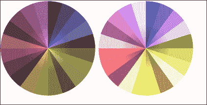

我们的主要技巧是将数据的第二维连接起来，通过提供给数据访问器的第三个属性保留了第一维的知识。

# 摘要

哇！在这一章中我们已经学到了很多。

你现在应该已经牢固掌握了构建优秀可视化所需的基本知识。我们学习了 DOM 操作，并详细探讨了 SVG，从手动绘制形状到路径生成器。最后，我们探讨了 CSS 作为使事物更美观的更好替代方案。

从现在开始，我们所看到的一切都将建立在这些基础知识之上，但你现在有了绘制任何你能想到的东西的工具。这本书的其余部分只是展示了更多优雅的实现方式。
