# 第四章 制作动态效果

一幅漂亮的图片只是开始！充分利用这种媒介的标志是制作能够适应新情况的视觉化。让用户能够探索我们的数据。

在本章中，我们将使用 d3.js 强大的转换模块来动画化我们的图片，并探讨一些与用户交互的策略。

# 使用转换进行动画

到目前为止，属性都是即时应用的，这对于渲染图像来说很棒，但如果我们想通过简单的动画突出显示某些内容呢？也许我们只想在加载数据时从无到“嘿，图表！”有一个更平滑的过渡？

这就是转换的作用。转换使用熟悉的改变选择属性的原则，但变化是随时间应用的。

要慢慢将矩形变成红色，我们会使用以下代码行：

```js
d3.select('rect').transition().style('fill', 'red');
```

我们通过 `.transition()` 开始一个新的转换，然后定义每个动画属性的最终状态。默认情况下，每个转换需要 250 毫秒；你可以使用 `.duration()` 来更改时间。除非你使用 `.delay()` 设置延迟，否则新转换将同时执行所有属性。

当我们想要按顺序使转换发生时，延迟很有用。如果没有延迟，它们将同时执行，取决于内部计时器。

对于单个对象，嵌套转换比精心校准的延迟简单得多。

以我们的矩形为例，在 Chrome 控制台中写下类似的内容。如果你还没有这样做，你需要实际将一个矩形添加到页面上才能使这生效。生活就是这样。

```js
d3.select('rect')
  .transition().style('fill', 'red').attr('x', 200)
  .transition().attr('y', 200)
```

运行这段代码，你会看到矩形向右移动一百像素后变成红色，然后向下移动相同的距离。

在屏幕截图中捕获动画很困难，但假设这是你的初始状态：

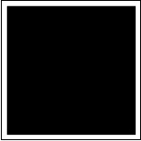

最终状态看起来会是这样：

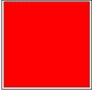

我们确实意识到这些只是白色背景上的两个正方形，但请相信我，红色正方形在黑色正方形下方和右侧一百像素处。

如果你想在转换开始之前做某事，或者想监听它何时结束，你可以使用 `.each()` 并提供适当的事件类型，如下所示：

```js
rect.transition()
    .style('fill', 'red')
    .each('start', function () { console.log("stahp, you're making me blush"); })
    .each('end', function () { console.log("crap, I'm all red now"); })
```

这在在转换之前或之后进行即时更改时很有用。但请记住，转换是独立运行的，你不能依赖于当前回调之外的转换处于这种状态或那种状态。

## 插值器

要计算一个转换的初始状态和最终状态之间的值，d3.js 使用插值器——这些函数将 `[0,1]` 的域映射到目标范围（颜色、数字或字符串）。在底层，比例尺基于这些相同的插值器。

D3 的内置插值器可以在几乎任何两个任意值之间进行插值，最常见的是在数字或颜色之间，也可以在字符串之间。一开始这听起来很奇怪，但实际上非常实用。

为了让 d3.js 选择适合工作的正确插值器，我们只需编写 `d3.interpolate(a, b)`，然后根据 `b` 的类型选择 `interpolation` 函数。

如果 `b` 是一个数字，`a` 将会被强制转换为数字，并使用 `.interpolateNumber()` 方法。你应该避免将值插值到或从零值，因为最终值会被转换为字符串属性，非常小的数字可能会变成科学记数法。CSS 和 HTML 并不完全理解 `1e-7`（前面有七个零的数字 1），所以你可以安全使用的最小数字是 `1e-6`。

如果 `b` 是一个字符串，d3.js 会检查它是否是 CSS 颜色，如果是，它会被转换为一个合适的颜色，就像 第二章 *DOM、SVG 和 CSS 简介* 中的那些一样。`a` 也会被转换成颜色，然后 d3.js 使用 `.interpolateRgb()` 或更适合你的颜色空间的插值器。

当字符串不是颜色时，还会发生更令人惊奇的事情。d3.js 也能处理这种情况！当它遇到字符串时，d3.js 会解析它以获取数字，然后对字符串中的每个数值部分使用 `.interpolateNumber()`。这对于插值混合样式定义非常有用。

例如，要过渡字体定义，你可能做如下操作：

```js
d3.select('svg')
    .append('text')
    .attr({x: 100, y: 100})
    .text("I'm growing!")
    .transition()
    .styleTween('font', function () {
      return d3.interpolate('12px Helvetica', '36px Comic Sans MS');
```

我们使用了 `.styleTween()` 来手动定义过渡。当不想依赖于当前状态来定义过渡的起始值时，这非常有用。第一个参数定义了要过渡的样式属性，第二个参数是插值器。

你可以使用 `.tween()` 方法来对除了样式以外的属性进行插值。

字符串中的每个数值部分都在起始值和结束值之间进行插值，而字符串部分则立即变为最终状态。这个应用的有趣之处在于插值路径定义——你可以使形状随时间变化。这有多酷？

请记住，只有具有相同数量和位置的控点（字符串中的数字）的字符串才能进行插值。你不能对一切使用插值器。创建一个自定义插值器就像定义一个只接受单个 `t` 参数并返回 `t = 0` 的起始值和 `t = 1` 的结束值，并在两者之间混合值的函数一样简单。

例如，以下代码显示了 d3.js 的 `interpolateNumber` 函数：

```js
function interpolateNumber(a, b) {
  return function(t) {
    return a + t * (b - a);
  };
}
```

就这么简单！

你甚至可以插值整个数组和对象，它们就像多个值复合插值器。我们很快就会使用它们。

## 缓动

缓动通过控制 `t` 参数来调整插值器的行为。我们使用它来使动画感觉更自然，添加一些弹跳弹性，等等。我们主要使用缓动来避免线性动画的人工感。

让我们快速比较 d3.js 提供的缓动函数，看看它们的作用。

不要忘记绘图区域！我曾经花了一个小时调试一个图表，直到意识到没有`svg`元素。

```js
var width = 1024,
  height = 768,
  svg = d3.select('#graph')
    .append('svg')
    .attr({width: width,
           height: height});
```

接下来，我们需要一个缓动函数数组和一个用于在垂直轴上放置它们的缩放比例。

```js
var eases = ['linear', 'poly(4)', 'quad', 'cubic', 'sin', 'exp', 'circle', 'elastic(10, -5)', 'back(0.5)', 'bounce', 'cubic-in', 'cubic-out', 'cubic-in-out', 'cubic-out-in'],
    y = d3.scale.ordinal().domain(eases).rangeBands([50, 500]);
```

你会注意到`poly`、`elastic`和`back`需要参数；由于这些只是字符串，我们稍后必须手动将它们更改为实际参数。`poly`缓动函数只是一个多项式，所以`poly(2)`等于`quad`，`poly(3)`等于`cubic`。

`elastic`缓动函数模拟弹性，两个参数控制张力。我建议尝试调整这些值以获得你想要的效果。

`back`缓动函数旨在模拟倒车进入停车位。参数控制将有多少超调。

最后面的无意义内容（`cubic-in`、`cubic-out`等）是我们通过组合以下修饰符自己创建的缓动函数列表：

+   `-in`：它什么都不做

+   `-out`：它反转缓动方向

+   `-in-out`：它从`[0, 0.5]`和`[0.5, 1]`复制并镜像缓动函数

+   `-out-in`：它从`[1, 0.5]`和`[0.5, 0]`复制并镜像缓动函数

你可以将这些添加到任何缓动函数中，所以可以随意尝试。现在是时候渲染一个向右飞行的圆圈，为列表中的每个函数：

```js
eases.forEach(function (ease) {
  var transition = svg.append('circle')
    .attr({cx: 130,
      cy: y(ease),
      r: y.rangeBand()/2-5})
    .transition()
    .delay(400)
    .duration(1500)
    .attr({cx: 400});
});
```

我们使用一个迭代器遍历列表，创建一个新的圆圈，并使用`y()`缩放进行垂直定位，使用`y.rangeBand()`进行圆圈大小。这样，我们可以轻松地添加或删除示例。过渡将延迟不到半秒开始，这样我们可以有机会看到正在发生的事情。持续时间为`1500`毫秒，最终位置为`400`应该有足够的时间和空间来观察缓动效果。

我们在这个函数的末尾定义缓动，在`});`之前：

```js
if (ease.indexOf('(') > -1) {
    var args = ease.match(/[0-9]+/g),
      type = ease.match(/^[a-z]+/);

    transition.ease(type, args[0], args[1]);
  }else{
    transition.ease(ease);
  }
```

这段代码检查`ease`字符串中的括号，解析出缓动函数及其参数，并将它们传递给`transition.ease()`。如果没有括号，`ease`只是缓动类型。

让我们添加一些文本，这样我们就可以区分示例：

```js
svg.append('text')
    .text(ease)
    .attr({x: 10,
        y: y(ease)+5});
```

可视化是一堆点的嘈杂组合：

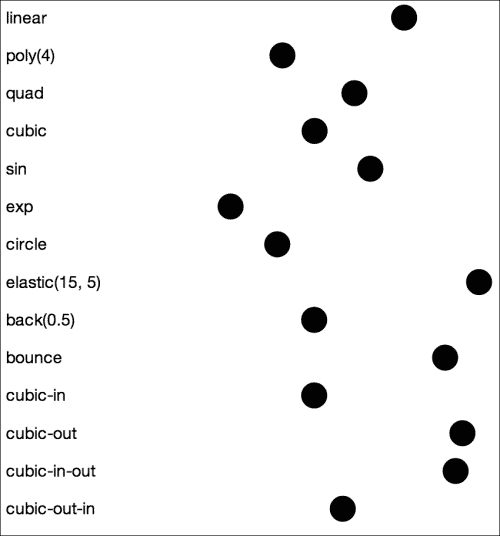

截图并不能很好地展示动画，所以你真的应该在浏览器中尝试这个。或者你可以查看[`easings.net/`](http://easings.net/)上的缓动曲线。

## 计时器

为了安排过渡，d3.js 使用计时器。即使是立即过渡，也会在延迟 17 毫秒后开始。

d3.js 不仅将计时器留给自己，还允许我们使用计时器，这样我们就可以将动画扩展到过渡的两个关键帧模型之外。对于我们这些不是动画师的人来说，关键帧定义了平滑过渡的开始或结束。

要创建一个计时器，我们使用 `d3.timer()`。它需要一个函数、一个延迟和一个起始标记。从标记开始设置延迟（以毫秒为单位）后，该函数将重复执行，直到它返回 `true`。标记应该是一个自 Unix 纪元以来的日期转换为毫秒（`Date.getTime()` 可以做到），或者你可以让 d3.js 默认使用 `Date.now()`。

让我们动画化一个参数函数的绘制，使其看起来就像你小时候可能玩过的斯皮罗图玩具。

我们将创建一个计时器，让它运行几秒钟，并使用毫秒标记作为参数函数的参数。

首先，我们需要一个绘图区域：

```js
var width = 600,
  height = 600,
  svg = d3.select('#graph')
    .append('svg')
    .attr({width: width,
              height: height});
```

我在维基百科关于参数方程的文章中找到一个很好的函数，链接为 [`en.wikipedia.org/wiki/Parametric_equations`](http://en.wikipedia.org/wiki/Parametric_equations)。

```js
var position = function (t) {
  var a = 80, b = 1, c = 1, d = 80;

  return {x: Math.cos(a*t) - Math.pow(Math.cos(b*t), 3),
          y: Math.sin(c*t) - Math.pow(Math.sin(d*t), 3)};
};
```

这个函数将根据参数从零向上的变化返回一个数学位置。你可以通过改变 `a`、`b`、`c` 和 `d` 变量来调整斯皮罗图——同一维基百科文章中的示例。

这个函数返回介于 `-2` 和 `2` 之间的位置，因此我们需要一些刻度来使其在屏幕上可见：

```js
var t_scale = d3.scale.linear().domain([500, 25000]).range([0, 2*Math.PI]),
  x = d3.scale.linear().domain([-2, 2]).range([100, width-100]),
  y = d3.scale.linear().domain([-2, 2]).range([height-100, 100]);
```

`t_scale` 将时间转换为函数的参数；`x` 和 `y` 将计算图像上的最终位置。

现在我们需要定义 `brush` 来四处移动并假装它在绘制，以及一个变量来保存 `previous` 位置，这样我们就可以绘制直线。

```js
var brush = svg.append('circle')
    .attr({r: 4}),
  previous = position(0);
```

接下来，我们需要定义一个动画 `step` 函数，该函数移动刷子并在前一个和当前点之间绘制线条：

```js
var step = function (time) {
  if (time > t_scale.domain()[1]) {
    return true;
  }

  var t = t_scale(time),
    pos = position(t);

  brush.attr({cx: x(pos.x),
              cy: y(pos.y)});
  svg.append('line')
    .attr({x1: x(previous.x),
           y1: y(previous.y),
           x2: x(pos.x),
           y2: y(pos.y),
           stroke: 'steelblue',
           'stroke-width': 1.3});

  previous = pos;
};
```

第一个条件在 `time` 参数的当前值超出 `t_scale` 的定义域时停止计时器。然后，我们使用 `t_scale()` 将时间转换为我们的参数，并为刷子获取一个新的位置。

然后，我们移动刷子——因为没有过渡，因为我们正在执行过渡——并在前一个和当前位置 (`pos`) 之间绘制一条新的钢蓝色线条。

我们通过设置新的 `previous` 位置来得出结论。

现在只剩下创建一个计时器：

```js
var timer = d3.timer(step, 500);
```

就这样。页面刷新后半秒，代码将开始绘制一个美丽的形状，并在 25 秒后完成。

开始时，它看起来像这样：

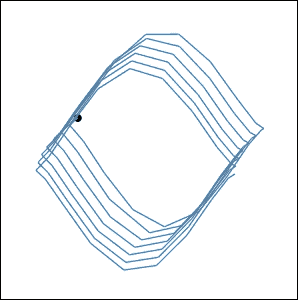

获得整个图像需要一段时间，所以这可能不是绘制斯皮罗图的最好方法。由于我们使用时间作为参数，更平滑的曲线（更多点）需要更多时间。

另一个问题是有延迟的计算机或较慢的机器会影响动画的最终结果。

一位读者编写了一个没有这些问题的版本，并将代码放在了 Github 上，链接为 [`github.com/johnaho/d3.js-book-examples/blob/master/ch4/timers.js`](https://github.com/johnaho/d3.js-book-examples/blob/master/ch4/timers.js)。

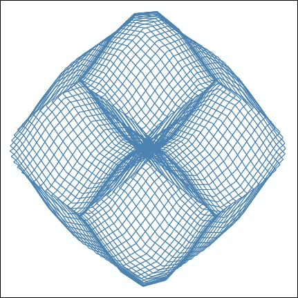

但两种代码版本最终都会得到一个美丽的花朵。当我编写这段代码时，我花了整整一个小时惊叹于绘制过程并调整参数以查看会发生什么。

# 与用户交互

优秀的可视化不仅仅停留在漂亮的图片和动画上！它们赋予用户操作数据和自行解决问题的能力。这正是我们接下来要探讨的。

你可能还不知道，但你已经知道如何让用户与可视化进行交互。

## 基本交互

与其他 UI 库类似，交互的原则很简单——将事件监听器附加到元素上，并在触发时执行某些操作。我们使用`.on()`方法、事件类型（例如，`click`）和当事件被触发时执行的监听器函数，向和从选择中添加和删除监听器。

我们可以设置一个捕获标志，确保我们的监听器首先被调用，其他所有监听器都等待我们的监听器完成。从子元素冒泡上来的事件不会触发我们的监听器。

你可以依赖这样一个事实：一个元素上特定事件的监听器始终只有一个，因为当添加新监听器时，会移除相同事件的旧监听器。这对于避免不可预测的行为非常有用。

就像其他对元素选择执行操作的函数一样，事件监听器会获取当前数据项和索引，并将 `this` 上下文设置为 DOM 元素。全局的 `d3.event` 将允许你访问实际的事件对象。

让我们通过鼠标点击和手指触摸来玩转这些原则和简单的可视化。是的，d3.js 对触摸设备有一些支持，但并不总是完美。

和往常一样，从一个绘图区域开始：

```js
var width = 1024,
  height = 768,
  svg = d3.select('#graph')
    .append('svg')
    .attr({width: width,
           height: height});
```

接下来，我们创建一个函数，将使用三个圆模拟池塘中的涟漪；你可能需要一些想象力：

```js
var radiate = function (pos) {
  d3.range(3).forEach(function (d) {
    svg.append('circle')
      .attr({cx: pos[0],
             cy: pos[1],
             r: 0})
      .style('opacity', '1')
      .transition()
      .duration(1000)
      .delay(d*50)
       .attr('r', 50)
       .style('opacity', '0.00001')
       .remove();
  });
};
```

`radiate` 函数在由一个包含两个元素的数组定义的位置（[x, y]）周围创建三个圆。过渡效果会使圆变大，降低它们的透明度，最后移除它们。我们使用了 `.delay` 来确保圆不会重叠，从而产生涟漪的错觉。

现在是时候享受乐趣了：

```js
svg.on('click', function () {
  radiate(d3.mouse(this));
});

svg.on('touchstart', function () {
  d3.touches(this).map(radiate);
});
```

我们为想要产生涟漪的每种事件类型使用 `.on()` 一次——首先是熟悉的 `click` 事件，然后是可能不太熟悉的 `touchstart`。当手指触摸屏幕时，会触发 `touchstart` 事件；将其视为触摸的 `mousedown` 事件。其他有用的触摸事件包括 `touchmove`、`touchend`、`touchcancel` 和 `tap`。Mozilla 的文档在 [`developer.mozilla.org/en-US/docs/Web/Guide/API/DOM/Events/Touch_events`](https://developer.mozilla.org/en-US/docs/Web/Guide/API/DOM/Events/Touch_events) 中更详细地解释了触摸事件。

`click` 监听器使用 `d3.mouse()` 获取相对于容器元素的游标位置，而 `touchstart` 监听器通过所有触摸的列表进行映射。理论上，如果你将整个手压在屏幕上，这将绘制几个涟漪，但我无法在我的任何设备上实现这一点。

通过一些样式使涟漪变得漂亮：

```js
<style>
circle {
  fill: none;
  stroke: red;
  stroke-width: 2;
}
</style>
```

点击周围会产生涟漪！

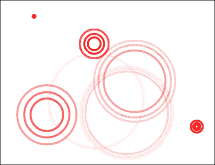

## 行为

有时候，你想要的不仅仅是让用户像疯子一样点击；你想要拖放、缩放和缩放功能！

你可以通过点击事件完成所有这些，但我强烈推荐使用 d3 的行为模块。它使得复杂的行为变得像在元素上调用正确函数一样简单。

目前，d3.js 只支持 `drag` 和 `zoom`，但我希望更多功能即将到来。行为的主要好处是它们自动创建相关的事件监听器，并允许你在更高的抽象级别上工作。

### Drag

我想不出比用视差错觉动画更好的拖动演示了。错觉是通过在垂直切片中渲染几个关键帧来实现的，通过拖动屏幕覆盖它们来创建一个动画效果。

手动绘制线条会很麻烦，所以我们使用了一个由 *Marco Kuiper* 在 Photoshop 中创建的图像。我在推特上询问了他，他说如果我们查看他在 [marcofolio.net](http://marcofolio.net) 的其他作品，我们可以使用这张图片。

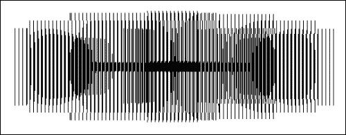

你也可以在示例仓库中找到这张图片：[`raw.github.com/Swizec/d3.js-book-examples/master/ch4/parallax_base.png`](https://raw.github.com/Swizec/d3.js-book-examples/master/ch4/parallax_base.png).

我们需要一个地方来放置视差效果：

```js
var width = 1200,
  height = 450,
  svg = d3.select('#graph')
    .append('svg')
    .attr({width: width,
           height: height});
```

我们将使用 SVG 的原生位图嵌入支持来将 `parallax_base.png` 插入页面：

```js
svg.append('image')
  .attr({'xlink:href': 'parallax_base.png',
          width: width,
          height: height});
```

`image` 元素的魔力源于其 `xlink:href` 属性。它理解链接，甚至允许我们嵌入图像以创建自包含的 SVG。要使用它，你需要在图像的 base64 编码表示之前添加一个图像 MIME 类型。

例如，以下行是最小的嵌入版 spacer GIF。如果你不知道什么是 spacer GIF，不用担心；它们在 2005 年左右之前很有用。

```js
data:image/gif;base64,R0lGODlhAQABAID/AMDAwAAAACH5BAEAAAAALAAAAAABAAEAAAICRAEAOw==
```

总之，现在我们有了动画的基础，我们需要一个可以拖动的屏幕。它将是一系列精心校准的垂直线条：

```js
var screen_width = 900,
  lines = d3.range(screen_width/6),
  x = d3.scale.ordinal().domain(lines).rangeBands([0, screen_width]);
```

我们将基于数字数组（`lines`）来构建屏幕。由于线条的粗细和密度非常重要，我们将 `screen_width` 除以 `6`——五像素用于线条，一像素用于间距。确保 `screen_width` 的值是 6 的倍数；否则抗锯齿会破坏效果。

`x` 标度将帮助我们均匀地放置线条：

```js
svg.append('g')
  .selectAll('line')
  .data(lines)
  .enter()
  .append('line')
  .style('shape-rendering', 'crispEdges')
  .attr({stroke: 'black',
        'stroke-width': x.rangeBand()-1,
         x1: function (d) { return x(d); },
         y1: 0,
         x2: function (d) { return x(d); },
         y2: height});
```

这里没有什么特别有趣的东西，只是你已经知道的东西。代码遍历数组，并为每个条目绘制一条新的垂直线。我们确保通过将 `shape-rendering` 设置为 `crispEdges` 来避免任何抗锯齿。

是时候定义并激活我们线条组的拖动行为：

```js
var drag = d3.behavior.drag()
    .origin(Object)
    .on('drag', function () {
         d3.select(this)
           .attr('transform', 'translate('+d3.event.x+', 0)')
           .datum({x: d3.event.x, y: 0});
    });
```

我们使用 `d3.behavior.drag()` 创建了行为，定义了 `.origin()` 访问器，并指定了拖动时发生的事情。该行为自动将触摸和鼠标事件转换为更高层次的拖动事件。这有多酷！

我们需要给行为一个原点，这样它就知道如何计算相对位置；否则，当前位置总是设置为鼠标光标，对象会四处跳跃。这太糟糕了。"Object" 是元素的恒等函数，并假设具有 *x* 和 *y* 坐标的 `datum`。

重的劳动发生在 `drag` 监听器内部。我们从 `d3.event.x` 获取屏幕的新位置，将其移动到那里，并更新附加的 `.datum()` 方法。

剩下的只是调用 `drag` 并确保将附加的 `datum` 设置为当前位置：

```js
svg.select('g')
  .datum({x: 0, y: 0})
  .call(drag);
```

现在项目看起来很坚固了！尝试以不同的速度拖动屏幕。

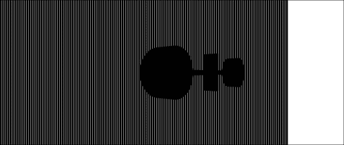

在视网膜显示屏上，视差效果并不很好，因为基础图像会被重新调整大小，我们的屏幕失去了校准。

### 缩放

尽管名字叫缩放行为，但它不仅能缩放，还能平移！就像拖动行为一样，缩放自动处理鼠标和触摸事件，然后触发高级缩放事件。如果你问我，这真的很酷！

记得第三章，*使数据有用*中的那个地图吗？那个在世界地图上有机场的地图？就是那个。

让我们犯一个计算效率上的错误，让它可以缩放和拖动。

我要警告你，这将会非常基础且痛苦缓慢。这并不是制作一个真正的可探索地图的方法，而只是一个让我们可以尝试缩放的例子。在现实生活中，你应该使用瓦片、渐进式细节和其他技巧。

为了使这个过程稍微容易忍受一些，你应该禁用水域和城市区域。在 JavaScript 代码的大约第 30、36 和 42 行处注释掉 `add_to_map` 对河流、湖泊和海洋的调用。

你的地图变得简单多了：

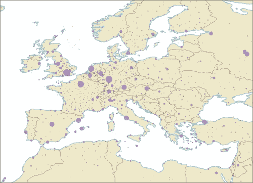

最大的效果来自于移除大面积区域，所以如果你也移除了陆地，地图将会有惊人的性能，但相当无用。

跳转到 `draw_airlines` 的末尾，并添加对 `zoomable` 的调用；我们将在下一部分定义它：

```js
  zoomable(airports, R, routes);
```

`zoomable` 需要 `airports`、`R_scale` 和 `routes` 数据来在缩放时调整圆的大小：

```js
function zoomable(airports, R_scale, routes) {
  svg.call(
    d3.behavior.zoom()
      .translate(projection.translate())
      .scale(projection.scale())
      .on('zoom', function () {
                onzoom(airports, R_scale, routes);
    })
  );
}
```

我们使用 `d3.behavior.zoom()` 定义了一个缩放行为，并立即在整个图像上调用它。

我们将当前的 `.translate()` 向量和 `.scale()` 设置为投影所使用的值。缩放事件将调用我们的 `onzoom` 函数。

让我们定义一下：

```js
function onzoom(airports, R_scale, routes) {
  projection
    .translate(d3.event.translate)
    .scale(d3.event.scale);

  d3.selectAll('path')
    .attr('d', d3.geo.path().projection(projection));
```

首先，我们告诉我们的投影新的平移向量是 `d3.event.translate`。平移向量将通过转换平移地图，就像在第二章，*DOM、SVG 和 CSS 入门*中一样。`d3.event.scale` 是投影用来缩放自身的数字，实际上就是缩放地图。

然后，我们使用新的投影重新计算了所有路径的 `d3.geo.path()`。

```js
  d3.selectAll('circle')
    .attr('transform', function (id) {
        var airport = airports[id];
        return "translate("+projection([airport.lon, airport.lat])+")";
    })
    .attr('r', function (id) {
      if (routes[id]) {
        var magnifier = d3.event.scale/1200;
        return magnifier*R_scale(routes[id].length);
      }else{
    return 1;
    }
  });
}
```

同样的方法也适用于圆形。获取新的信息，选择所有的圆形，并更改它们的属性。

定位函数与`draw_airlines`中的完全相同，因为地理投影处理了超出框的平移。调整大小需要更多的工作。

在计算放大镜作为当前和默认比例（`1200`）之间的比率后，我们使用`R_scale`获取圆的正常大小，并将其乘以放大镜。

你现在可以探索这个世界了！

但是要有耐心，因为它很慢。每次移动都重新绘制一切会这样。

为了创建一个更高效的可缩放地图，当缩小视图时，我们必须使用更少细节的数据，绘制一个合理的机场数量，并可能避免绘制图像之外的地图部分。

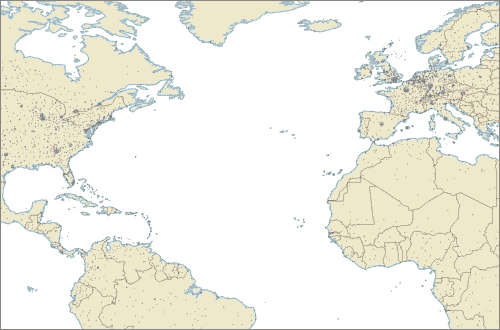

### 画笔

与缩放和拖动类似，画笔是一种创建复杂行为的简单方法——它们使用户能够选择画布的一部分。

很奇怪，它们不被视为一种行为，而是属于`.svg`命名空间，可能是因为它们主要用于视觉效果。

要创建一个新的画笔，我们会调用`d3.svg.brush()`并使用`.x()`和`.y()`定义其 x 和 y 比例。我们还可以定义一个边界矩形。

是时候举一个例子了！

我们将制作一些随机数据的散点图，并让用户选择点。从绘图区域和一些数据开始：

```js
var width = 600,
  height = 600,
  svg = d3.select('#graph')
    .append('svg')
    .attr({width: width,
           height: height});

var random = d3.random.normal(.5, .11),
  data = d3.range(800).map(function (i) {
    return {x: random(),
            y: random()};
});
```

我们使用内置的随机生成器创建围绕`.5`中心且分散度为`.11`的`normal`分布的数字。d3.js 还提供了`logNormal`和`irwinHall`分布。

现在我们有一个包含 800 个随机二维位置的数组。为了绘制它们，我们将使用两个比例使小范围更明显，然后将每个数据点放置在页面上作为一个圆。

```js
var x = d3.scale.linear()
    .range([50, width-50]),
  y = d3.scale.linear()
    .range([height-50, 50]);

svg.append('g')
  .classed('circles', true)
  .selectAll('circle')
  .data(data)
  .enter()
  .append('circle')
  .attr({cx: function (d) { return x(d.x); },
         cy: function (d) { return y(d.y); },
         r: 4});
```

我知道我们在这本书中通常不会添加坐标轴，但如果没有它们，散点图看起来会很荒谬。让我们添加一些：

```js
svg.append('g')
  .classed('axis', true)
  .attr('transform', 'translate(50, 0)')
  .call(d3.svg.axis().orient('left').scale(y));

svg.append('g')
  .classed('axis', true)
  .attr('transform', 'translate(0, '+(height-50)+')')
  .call(d3.svg.axis().orient('bottom').scale(x));
```

你应该记得这里发生的事情来自第二章，*DOM、SVG 和 CSS 入门*，在那里我们详细讨论了坐标轴。

为 HTML 添加一些基本样式：

```js
<style>
  .axis path,
  .axis line {
    fill: none;
    stroke: black;
    shape-rendering: crispEdges;
}
</style>
```

哈哈，散点图！

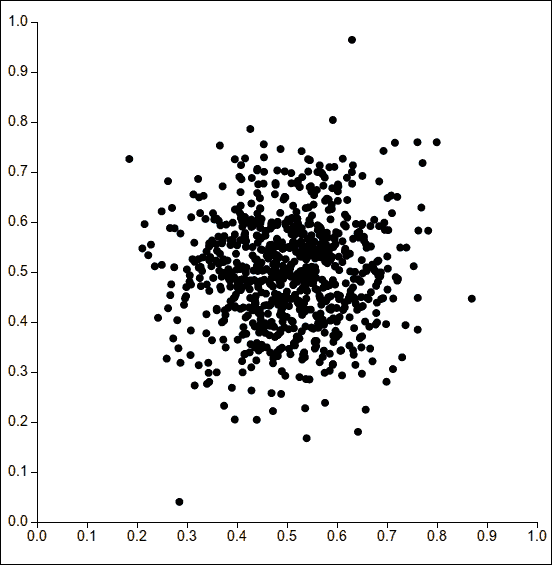

现在是时候做一些有趣的事情了：

```js
svg.append("g")
  .classed("brush", true)
  .call(d3.svg.brush().x(x).y(y)
  .on("brushstart", brushstart)
  .on("brush", brushmove)
  .on("brushend", brushend));
```

我们为画笔创建了一个新的分组元素，并使用已定义的两个比例调用了一个新构建的`d3.svg.brush()`。`"brush"`类将有助于样式。最后，我们为`brushstart`、`brush`和`brushend`事件定义了监听器。

```js
function brushstart() {
  svg.select('.circles')
    .classed('selecting', true);
}
```

`brushstart`将样式切换到`selecting`。我们将使用它来帮助用户区分已选择和未选择的圆圈：

```js
function brushmove() {
  var e = d3.event.target.extent();

  svg.selectAll('circle')
    .classed("selected", function(d) {
        return e[0][0] <= d.x && d.x <= e[1][0]
        && e[0][1] <= d.y && d.y <= e[1][1];
    });
}
```

`brushmove`是真正魔法发生的地方。

首先，我们使用`d3.event.target.extent()`找到选择范围的边界。`d3.event.target`返回当前的画笔，而`.extent()`返回一组两个点——左上角和右下角。

然后，我们遍历所有圆圈，根据圆的位置是否在边界框内，打开或关闭`selected`类：

```js
function brushend() {
  svg.select('.circles')
    .classed('selecting', !d3.event.target.empty());
}
```

如果选择为空，`brushend`只是关闭选择状态。

我们的 HTML 需要更多的样式定义：

```js
.brush .extent {
  stroke: #fff;
  fill-opacity: .125;
  shape-rendering: crispEdges;
}

circle {
  -webkit-transition: fill-opacity 125ms ease-in-out;
}

.selecting circle {
  fill-opacity: 0.25;
}

circle.selected {
  stroke: red;
}
```

我们正在改变圆形填充的透明度（`fill-opacity`），而不是边框的透明度，这样圆形的边缘总是以全透明度闪耀。添加 CSS 过渡使一切感觉更加平滑。

在这种情况下，我们更喜欢 CSS 过渡而不是 d3.js 能做的，这样我们可以将 JavaScript 限制在改变元素状态上。刷子有时也会在 d3.js 过渡中遇到问题，并立即更改属性。

当你选择一些元素时，图像将看起来像这样：

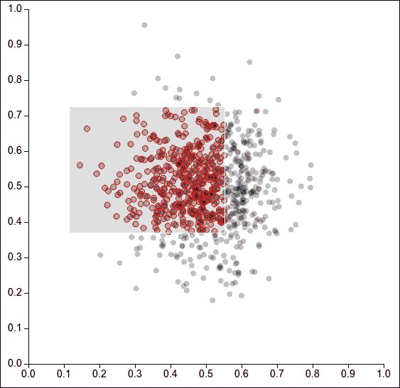

# 摘要

哇，多么有趣的一章！

你让事物在页面上跳跃，几乎用可缩放的地图杀死了你的电脑和耐心，并且仅用垂直线条就创造了一个旋转的东西。

这就是用户可以与之互动的视觉化所需的一切。其余的只是实验和一些巧妙地将事物组合在一起。祝你好运！
