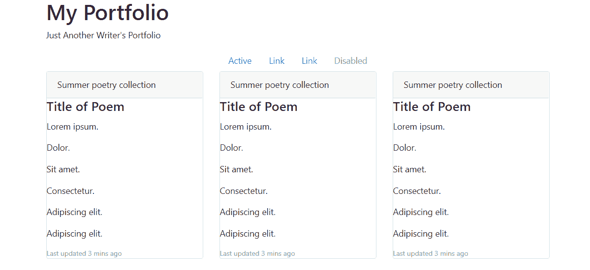
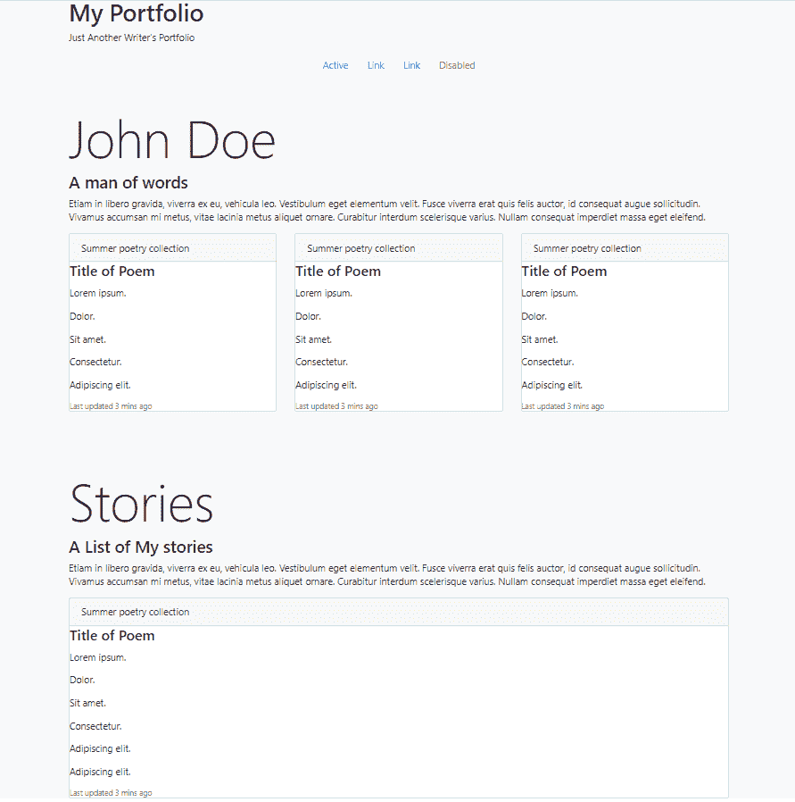

# 第三章：使用 Elm 创建您的个人作品集

欢迎来到 第三章，*使用 Elm 创建您的个人作品集*。本章的目标是使用 Elm 创建一个简单的个人作品集网站。

我们将涵盖的主题包括：

+   理解类型别名

+   详细讨论模型、视图、消息、更新工作流程（对 Elm 架构的深入了解）

+   使用 `List.map` 和 `List.filter` 映射和过滤值列表

+   使用 elm-make-app

+   将 Bootstrap 4 样式添加到我们的应用程序中

+   在 Elm 中与 `HTML` 模块一起工作

+   理解 HTML 元素的函数签名

+   通过将视图拆分为多个文件来模块化我们的应用程序

+   使用情况表达式动态渲染网页的各个部分

+   使用 `List.map` 和 `String.concat` 改进我们的 *FizzBuzz* 应用程序

完成本章后，您将能够：

+   在 Elm 中使用类型别名

+   了解如何使用 Elm 架构

+   能够使用 `List.map` 和 `List.filter` 在 Elm 中操作列表

+   使用 elm-make-app 构建 Elm 应用程序

+   将 Elm 应用程序模块化到多个文件中

    +   使用 `case` 表达式为您的 Elm 驱动的网页进行动态更新

+   为您的 Elm 应用程序添加自定义样式

# 使用 elm-make-app 创建我们的作品集

要开始本章，让我们回顾一下在 第一章，*为什么现在是学习 Elm 的好时机？* 中，我们已经使用 Atom 编辑器设置了一个工作流程。这个设置的美妙之处在于，尽管它很复杂，但一旦设置完成，我们就拥有了所有额外的 Elm 工具。

要遵循本章的说明，使用所提到的 Atom 设置并非绝对必要，但它会使与我们的 *Portfolio* 应用程序一起工作变得更加容易。或者，您可以使用任何编辑器，因为这些步骤仍然有效，但那样的话，您将没有使用代码检查器和语法高亮功能。

因此，首先，让我们使用控制台创建一个新的项目文件夹。例如，我们可以将 bash 指向桌面，并在那里创建一个新的文件夹：

```js
mkdir chapter3
```

接下来，让我们使用以下命令在我们的控制台中更改目录到 `chapter3`：`cd chapter3`。

在 第一章，*为什么现在是学习 Elm 的好时机？* 中，我们讨论了创建新 Elm 应用程序的几种方法。其中之一是使用 `create-elm-app` npm 包。如果您还没有安装该包，请参阅 第一章，*为什么现在是学习 Elm 的好时机？*，以确保您已正确设置一切。

使用 `create-elm-app` npm 包，让我们创建一个新的 Elm 应用程序，命名为 `my-portfolio`：

```js
create-elm-app my-portfolio
```

控制台将打印出运行前面命令的结果，如下所示：

```js
Creating my-portfolio project...

Starting downloads...

 ● elm-lang/HTML 2.0.0
 ● elm-lang/virtual-dom 2.0.4
 ● elm-lang/core 5.1.1

Packages configured successfully!

Project is successfully created in `C:\Users\PC\Desktop\chapter3\my-portfolio`.

Inside that directory, you can run several commands:

 elm-app start
 Starts the development server.

 elm-app build
 Bundles the app into static files for production.

 elm-app test
 Starts the test runner.

 elm-app eject
 Removes this tool and copies build dependencies, configuration files
 and scripts into the app directory. If you do this, you can’t go back!

We suggest that you begin by typing:

 cd my-portfolio
 elm-app start
```

一旦创建了新的 Elm 应用程序，请打开 Atom 编辑器中的 `my-portfolio` 文件夹。

从 Atom 编辑器中，展开 `src` 文件夹，并打开 `Main.elm` 文件。删除现有的代码，并粘贴以下代码：

```js
module Main exposing (main)

import HTML exposing (HTML, text)

main : HTML msg
main =
    HTML.h1 [] 
       [ text "My Portfolio" ]
```

或者，你也可以直接导入`h1`函数，并相应地更改`main`函数，如下所示：

```js
module Main exposing (main)

import HTML exposing (HTML, h1, text)

main : HTML msg
main =
    h1 [] 
       [ text "My Portfolio" ]
```

上述两个示例之间的区别在于我们导入的函数。如果我们不导入`h1`函数，我们需要使用`HTML.h1`。

最后，使用你的控制台，`cd`进入`my-portfolio`文件夹，并运行以下命令：

```js
elm-app start
```

运行前面的命令将打开你的默认浏览器，并显示`localhost:3000`的 URL。在打开的页面上，你会看到一个格式良好的`h1`标题：*我的作品集*。在下一节中，我们将为我们的网站添加更多内容。

# 构建静态单页作品集

我们正在构建一个简单的单页网站来展示一个作家的作品集。这将是一个有趣的练习，我们将通过它了解如何实际上使用 Elm 构建网站。同时，我们简化了网站的复杂性，因为我们的网站几乎全部由文本组成。当然，随着我们对 Elm 的深入，我们将引入更多概念，但就目前而言，我们将坚持基础。

让我们通过向我们的主页添加更多部分来扩展我们的网站。我们首先会犯一个错误。以下代码将无法工作：

```js
module Main exposing (main)

import HTML exposing (HTML, div, h1, text) 
-- NOTE: we imported the 'div' function here so we can use it below

main : HTML msg
main =
    h1 []
        [ text "My Portfolio" ]
        div
        []
        [ text "Just a bunch of text here " ]
```

当我们保存前面的代码时，我们会得到以下错误：

```js
Function `h1` is expecting 2 arguments, but was given 5.

 8| h1 []
 9| [ text "My Portfolio" ]
10|> div
11|> []
12|> [ text "Just a bunch of text here " ]

Maybe you forgot some parentheses? Or a comma?

Detected errors in 1 module.
```

为了解决这个问题，我们需要稍微改变我们传递给`main`函数的代码结构。基本上，我们需要为所有的 HTML 添加一个包装 HTML 元素。我们将把传递给`main`的所有内容都包裹在包装`div`函数中：

```js
module Main exposing (main)

import HTML exposing (HTML, div, h1, text)

main : HTML msg
main =
    div []
        [ h1 [] [ text "My Portfolio" ]
        , div [] [ text "Just a bunch of text here " ]
        ]
```

现在，我们可以使用许多其他元素来丰富我们的作品集。为了使它们全部可用，我们将暴露`HTML`模块中的所有内容。更新后的代码现在看起来像这样：

```js
module Main exposing (main)

import HTML exposing (..)

main : HTML msg
main =
    div []
        [ h1 [] [ text "My Portfolio" ]
        , p [] [ text "Just Another Writer's Portfolio" ]
        , div []
            [ ul []
                [ li [] [ text "About Me" ]
                , li [] [ text "Poems" ]
                , li [] [ text "Stories" ]
                , li [] [ text "Contact" ]
                ]
            ]
        ]
```

在这个时候，你可能会开始欣赏`elm-format`为我们所做的努力。无论我们的 Elm 代码格式有多糟糕，它都会在每次保存时为我们修复。

在继续之前，让我们向我们的单页网站添加一个 CSS 框架。在这个例子中，我们将使用最新的 Bootstrap 框架版本，即 Bootstrap 4。为了获取框架 CSS 的链接，导航到以下网页：[`getbootstrap.com/docs/4.0/getting-started/introduction/?#css`](https://getbootstrap.com/docs/4.0/getting-started/introduction/?#css)。

前面的链接指向一个 HTML `link` 元素，该元素从**内容分发网络**（**CDN**）提供 Bootstrap 4。右侧甚至还有一个方便的`copy`按钮。一旦你复制了链接，导航到你的项目`public`文件夹，并将复制的`link`标签粘贴到`index.HTML`文件中。将`link`标签粘贴的位置正好在`title`标签上方，文档的`head`部分。更新后的我们的`index.HTML`文件中的相关部分应该看起来像这样：

```js
    <link rel="shortcut icon" href="%PUBLIC_URL%/favicon.ico">
    <link rel="stylesheet" href="https://maxcdn.bootstrapcdn.com/bootstrap/4.0.0-beta.3/css/bootstrap.min.css" integrity="sha384-Zug+QiDoJOrZ5t4lssLdxGhVrurbmBWopoEl+M6BdEfwnCJZtKxi1KgxUyJq13dy" crossorigin="anonymous">
    <title>Elm App</title>
</head>
```

完成这些后，保存`index.HTML`文件并关闭它。回到`Main.elm`，我们需要导入`HTML.Attributes`模块。我们还需要指定要使用的 CSS 类。我们将首先将`.card`类添加到包裹`ul`标签的`div`中。

更新后的代码应该看起来像这样：

```js
module Main exposing (main)

import HTML exposing (..)
import HTML.Attributes exposing (..)

main : HTML msg
main =
    div []
        [ h1 [] [ text "My Portfolio" ]
        , p [] [ text "Just Another Writer's Portfolio" ]
        , div [ class "card" ]
            [ ul []
                [ li [] [ text "About Me" ]
                , li [] [ text "Poems" ]
                , li [] [ text "Stories" ]
                , li [] [ text "Contact" ]
                ]
            ]
        ]
```

在我们对代码进行这次更新之后，你将看到我们页面中的`ul`元素发生了一些细微的变化。让我们更进一步，通过向我们的`div`传递几个 Bootstrap 4 CSS 类来实现这一点。为此，我们将简单地替换以下代码：

```js
, div [ class "card" ]
```

现在，让我们通过添加以下代码来更改前面的行：

```js
, div [ class "card text-white bg-primary mb-3" ]
```

保存`Main.elm`之后，你应该会在`ul`元素上看到漂亮的蓝色背景，以及白色的`li`项。

然而，我们正在使用错误的 Bootstrap 组件。我们正在使用卡片，但使用可用的`nav`组件会更为合适，该组件位于[`getbootstrap.com/docs/4.0/components/navs/#horizontal-alignment`](https://getbootstrap.com/docs/4.0/components/navs/#horizontal-alignment)，以下 HTML 代码：

```js
<ul class="nav justify-content-center">
  <li class="nav-item">
    <a class="nav-link active" href="#">Active</a>
  </li>
  <li class="nav-item">
    <a class="nav-link" href="#">Link</a>
  </li>
  <li class="nav-item">
    <a class="nav-link" href="#">Link</a>
  </li>
  <li class="nav-item">
    <a class="nav-link disabled" href="#">Disabled</a>
  </li>
</ul> 
```

然而，前面的代码是纯 HTML，我们需要将其转换为 Elm 代码。

尝试自己将上述 HTML 代码转换为 Elm 代码是一个很好的练习。然而，有一个在线转换器可供使用，位于：[`mbylstra.github.io/HTML-to-elm/`](http://mbylstra.github.io/html-to-elm/)。我们可以简单地粘贴 HTML 代码到提供的 URL 的左侧面板。

我们得到的代码，在右侧面板中，将看起来像这样：

```js
ul [ class "nav justify-content-center" ]
    [ li [ class "nav-item" ]
        [ a [ class "nav-link active", href "#" ]
            [ text "Active" ]
        ]
    , li [ class "nav-item" ]
        [ a [ class "nav-link", href "#" ]
            [ text "Link" ]
        ]
    , li [ class "nav-item" ]
        [ a [ class "nav-link", href "#" ]
            [ text "Link" ]
        ]
    , li [ class "nav-item" ]
        [ a [ class "nav-link disabled", href "#" ]
            [ text "Disabled" ]
        ]
    ]
```

现在，我们只需将前面的代码粘贴到我们之前使用的子`div`的位置。完整的代码现在将看起来像这样：

```js
module Main exposing (main)

import HTML exposing (..)
import HTML.Attributes exposing (..)

main : HTML msg
main =
    div []
        [ h1 [] [ text "My Portfolio" ]
        , p [] [ text "Just Another Writer's Portfolio" ]
        , ul [ class "nav justify-content-center" ]
            [ li [ class "nav-item" ]
                [ a [ class "nav-link active", href "#" ]
                    [ text "Active" ]
                ]
            , li [ class "nav-item" ]
                [ a [ class "nav-link", href "#" ]
                    [ text "Link" ]
                ]
            , li [ class "nav-item" ]
                [ a [ class "nav-link", href "#" ]
                    [ text "Link" ]
                ]
            , li [ class "nav-item" ]
                [ a [ class "nav-link disabled", href "#" ]
                    [ text "Disabled" ]
                ]
            ]
        ]
```

在我们继续之前，我们需要做一些清理工作并解释几个其他重要概念。

# Elm 的 HTML

在我们通过 Elm 的旅程到目前为止，我们还没有以任何有意义的方式参考官方文档。在本节中，我们将专注于官方文档，并探讨它如何以实际的方式帮助我们。

首先，导航到 HTML Elm 包的官方 README，该包可在以下位置找到：

[`package.elm-lang.org/packages/elm-lang/HTML/2.0.0/`](http://package.elm-lang.org/packages/elm-lang/html/2.0.0/). 正如网站所述，我们打开的页面描述了 Elm 的核心 HTML 库。在我们当前的学习阶段，提高我们的 Elm 技能的最佳方式是查看可用的实际 HTML 包，位于：[`package.elm-lang.org/packages/elm-lang/HTML/2.0.0/HTML`](http://package.elm-lang.org/packages/elm-lang/html/2.0.0/Html)。

具体来说，我们将查看本章中使用的所有 HTML 函数的类型定义：`div`、`h1`、`text`、`p`、`ul`、`li`和`a`。完全掌握我们在程序中使用的函数签名将使推理它们变得更加容易。

# HTML 元素的函数签名

所有 HTML 元素都共享相同的函数签名模式：

```js
<element> : List (Attribute msg) -> List (HTML msg) -> HTML msg
```

每个 HTML 元素接受两个列表：属性列表和子元素列表。然后，它们返回一个`HTML msg`。如果函数返回的值不发出消息，那么该代码将返回`msg`类型。

换句话说，每个元素都返回一个*值*，即*HTML*。这个*HTML 值*是`msg`类型，因为它们最终成为普通的 HTML 节点，它们将不会（不能！）改变我们的应用状态。

这就是为什么我们可以在`main`函数中继续编写 Elm 的 HTML 函数，而永远不会添加`view`或`update`，仍然有一个工作的网页。这是可能的，因为我们正在渲染我们的代码而不发出任何消息，所以实际上，永远不会有什么东西需要更新，因此我们可以不需要`update`函数。这就是为什么我们可以用`a`替换`msg`的隐式类型：

```js
main : HTML a
```

按照惯例，`a`代表`任何东西`。由于`main`函数永远不会返回消息，我们可以更明确地表示它，并以下面的代码作为函数签名：

```js
main : HTML Never
```

现在，我们明确声明我们永远不会返回一个消息。`Never`类型的值永远无法构造。

完全理解我们在程序中使用的函数的签名将使我们对它们的推理更加容易。

# 文本函数的函数签名

文本函数的签名，正如我们在官方文档中看到的，如下所示：

```js
text : String -> HTML msg
```

因此，`text`函数接受一个`String`并返回一个`HTML msg`。

# 添加我们的视图函数

在本节中，我们将从直接将`view`代码传递给`main`函数中提取出来，而是将其分配给`view`函数，然后将其传递给`main`函数。这样，我们开始使我们的代码更加模块化和可重用。

首先，在我们的投资组合应用中，让我们将`main`函数重命名为`view`函数：

```js
view : HTML Never
view =
```

接下来，在文件的底部，我们可以简单地添加一个更新的`main`函数：

```js
main : HTML Never
main =
    view
```

这个设置的一个好处是，我们现在可以将整个`view`传递给一个包装的`div`，例如，如下所示：

```js
main : HTML Never
main =
    div [] [ view ]
```

我们还可以通过从另一个文件调用它来使我们的`view`更加模块化和可重用。

# 从另一个文件调用视图函数

首先，让我们在项目的`src`文件夹中创建一个新的文件夹。在你的控制台中，从项目的根目录运行以下命令：

```js
cd src && mkdir View 
```

接下来，`cd`到`View`并使用`touch`命令创建一个新的`View.elm`文件。如果你在控制台中可用`atom`命令，你可以直接从命令行打开`View.elm`文件：

```js
cd View && touch View.elm && atom View.elm
```

前面的命令做了什么？它通过命令行导航到`View`文件夹，然后创建一个名为`View.elm`的新文件，然后将其在*Atom*中打开。你根本不需要使用命令行——你可以使用操作系统的图形用户界面完成这些操作。

由于我们现在将 `view` 函数放在一个单独的文件中，我们将有效地使用视图函数作为 Elm 模块。由于我们将使用我们的 `View.elm` 文件作为模块，我们需要明确所有我们将使用的 `HTML` 函数，类似于原始的 `Main.elm` 文件中的方式。因此，我们的 `View.elm` 代码需要看起来像这样：

```js
module View.View exposing (view)

import HTML exposing (..)
import HTML.Attributes exposing (..)

view : HTML Never
view =
    div []
        [ h1 [] [ text "My Portfolio" ]
        , p [] [ text "Just Another Writer's Portfolio" ]
        , ul [ class "nav justify-content-center" ]
            [ li [ class "nav-item" ]
                [ a [ class "nav-link active", href "#" ]
                    [ text "Active" ]
                ]
            , li [ class "nav-item" ]
                [ a [ class "nav-link", href "#" ]
                    [ text "Link" ]
                ]
            , li [ class "nav-item" ]
                [ a [ class "nav-link", href "#" ]
                    [ text "Link" ]
                ]
            , li [ class "nav-item" ]
                [ a [ class "nav-link disabled", href "#" ]
                    [ text "Disabled" ]
                ]
            ]
        ]
```

接下来，让我们更新我们的 `Main.elm` 文件，使其看起来像这样：

```js
module Main exposing (main)

import HTML exposing (..)
import HTML.Attributes exposing (..)
import View.View exposing (..)

main : HTML Never
main =
    div [] [ view ]
```

保存一切，应用程序仍然可以工作，尽管我们的 linter 会发出警告：

```js
Module HTML.Attributes is unused.
Best to remove it. Don't save code quality for later!
```

基本上，这里发生的事情是我们正在将 `HTML.Attributes exposing (..)` 导入到我们的 `Main.elm` 中，但我们根本没用到它。我们可以用几种方法来处理这个问题。例如，我们可以简单地只将 `view` 函数传递给 `main` 函数。或者，我们可以在 `div` 上添加一个类，例如 `bg-warning`：

```js
module Main exposing (main)

import HTML exposing (..)
import HTML.Attributes exposing (..)
import View.View exposing (..)

main : HTML Never
main =
    div [ class "bg-warning" ] [ view ]
```

随意尝试其他解决方案来解决这个警告，因为这是一个有用的练习。

# 添加一些样式

接下来，让我们故意犯一个错误。如果你看过我们在 *Portfolio* 应用中使用 `bg-warning` 类的结果，你会看到它看起来像一条橙色条纹，而下面的其他一切只是普通的白色。假设我们想要增加包裹 `div` 的高度，使其覆盖 1,000 像素的高度，从而使一切变成橙色。在纯 HTML 中，我们可以使用 `style` 属性来实现这一点。让我们用 Elm 来做这件事。

在不知道 Elm 使用的 `style` 函数签名的情况下，让我们尝试在不查看文档的情况下解决这个问题：

```js
main : HTML Never
main =
    div [ class "bg-warning", style "height:1000px" ] [ view ]
```

如你所猜，保存前面的代码会导致错误。让我们看看在 Atom 中我们得到的 lint 消息：

```js
The argument to function style is causing a mismatch.
Function style is expecting the argument to be:
List(String,String)
But it is:
String
```

太好了！现在，我们知道我们需要如何更改我们的 `style` 函数。它需要接受一个或多个括号中的 `Strings` 对，就像编译器之前说的那样。所以，我们将更新我们的函数如下：

```js
main : HTML Never
main =
    div [ class "bg-warning", style [("height","1000px")] ] [ view ]
```

现在，一切又恢复正常了，我们橙色背景的高度也增加了。更好的是，为了确保我们的屏幕完全变成橙色，让我们再次更新样式：

```js
main : HTML Never
main =
    div [ class "bg-warning", style [("height","100vh")] ] [ view ]
```

我们不是使用像素，而是使用 `100vh`，即 100 视口高度，这相当于屏幕的全高度。在下一节中，我们将通过将其拆分为多个文件来使我们的视图更加模块化。

# 将视图拆分为多个文件

在本节中，我们将把我们的视图拆分为多个文件。我们还将添加更多内容，这样当我们完成时，我们将拥有一个完整的单页网站。

首先，让我们考虑一下我们可以在单独的文件中拆分视图代码的哪些部分。很明显，`ul` 函数是一段独立的代码，所以让我们将其转换为一个模块。在你的 `View` 文件夹中，打开一个新文件，并将其命名为 `Navigation.elm`。接下来，粘贴以下代码：

```js
module View.Navigation exposing (navigation)

import HTML exposing (HTML, a, li, text, ul)
import HTML.Attributes exposing (class, href)

navigation : HTML Never
navigation =
    ul [ class "nav justify-content-center" ]
        [ li [ class "nav-item" ]
            [ a [ class "nav-link active", href "#" ]
                [ text "Active" ]
            ]
        , li [ class "nav-item" ]
            [ a [ class "nav-link", href "#" ]
                [ text "Link" ]
            ]
        , li [ class "nav-item" ]
            [ a [ class "nav-link", href "#" ]
                [ text "Link" ]
            ]
        , li [ class "nav-item" ]
            [ a [ class "nav-link disabled", href "#" ]
                [ text "Disabled" ]
            ]
        ]
```

我们刚刚创建了一个名为 `View.Navigation` 的新模块。保存文件，然后回到 `View.elm`，我们将导入这个新模块。

在 `View.elm` 中，我们的更新代码将看起来像这样：

```js
module View.View exposing (view)

import HTML exposing (..)
import HTML.Attributes exposing (..)
import View.Navigation exposing (..)

view : HTML Never
view =
    div []
        [ h1 [] [ text "My Portfolio" ]
        , p [] [ text "Just Another Writer's Portfolio" ]
        , navigation
        ]
```

注意`View.elm`这个版本的更改——我们导入了`View.Navigation`模块，暴露了一切，并且我们还用模块化的`ul [] []`代码替换了导航函数。

我们可以遵循这个模式来构建整个页面。我们的页面接下来需要的是几首诗歌。

要添加它们，我们将使用 Bootstrap 4 的`card`组件。因此，让我们在我们的`View`文件夹中创建一个新文件，命名为`Poem.elm`，并将以下代码添加到其中：

```js
module View.Poem exposing (poem)

import HTML exposing (HTML, div, h4, p, small, text)
import HTML.Attributes exposing (class)

poem : HTML Never
poem =
    div [ class "card" ]
        [ div [ class "card-header" ]
            [ text "Summer poetry collection " ]
        , div [ class "card-block" ]
            [ h4 [ class "card-title" ]
                [ text "Title of Poem" ]
            , p [ class "card-text" ]
                [ text "Lorem ipsum." ]
            , p [ class "card-text" ]
                [ text "Dolor." ]
            , p [ class "card-text" ]
                [ text "Sit amet." ]
            , p [ class "card-text" ]
                [ text "Consectetur." ]
            , p [ class "card-text" ]
                [ text "Adipiscing elit." ]
            , p [ class "card-text" ]
                [ text "Adipiscing elit." ]
            , p [ class "card-text" ]
                [ small [ class "text-muted" ]
                    [ text "Last updated 3 mins ago" ]
                ]
            ]
        ]
```

接下来，在`View.elm`文件中导入`Poem`模块：

```js
module View.View exposing (view)

import HTML exposing (..)
import HTML.Attributes exposing (..)
import View.Navigation exposing (..)
import View.Poem exposing (..)

view : HTML Never
view =
    div []
        [ h1 [] [ text "My Portfolio" ]
        , p [] [ text "Just Another Writer's Portfolio" ]
        , navigation
        , poem
        ]
```

如果你现在查看网站，你会看到诗歌正在拉伸整个屏幕的宽度，这并不是最佳的外观。让我们通过更新我们的`View.elm`文件，将诗歌包裹在一个容器`div`中：

```js
view : HTML Never
view =
    div [ class "container-fluid" ]
        [ div [ class "container" ]
            [ h1 [] [ text "My Portfolio" ]
            , p [] [ text "Just Another Writer's Portfolio" ]
            , navigation
            , poem
            ]
        ]
```

让我们也更改我们的代码，以便我们可以在一行中放置多个卡片。我们将通过添加另一个默认的 Bootstrap 4 类`row`来实现这一点。在`row`内部，我们将添加三个等宽的列。为此，我们将更新`View.elm`文件如下：

```js
view : HTML Never
view =
    div [ class "container-fluid" ]
        [ div [ class "container" ]
            [ h1 [] [ text "My Portfolio" ]
            , p [] [ text "Just Another Writer's Portfolio" ]
            , navigation
            , div [ class "row" ]
                [ div [ class "col" ]
                    [ poem ]
                , div [ class "col" ]
                    [ poem ]
                , div [ class "col" ]
                    [ poem ]
                ]
            ]
        ]
```

如果你正确地遵循了到目前为止的所有步骤，你应该能在你的浏览器中看到以下网页：



现在，我们在页面上整齐地放置了三张卡片。在我们继续构建页面之前，是时候让它看起来更好了。回到`Main.elm`，让我们删除`class`函数，并给`style`函数添加另一个 CSS 声明：

```js
main : HTML Never
main =
    div [ style [ ( "height", "100vh" ), ( "background", "#eee" ) ] ] [ view ]
```

这将给我们的页面带来一个更平静、浅灰色的背景。

`style`函数接受一个*2 元素元组的列表*。在上面的例子中，列表由*两个 2 元素元组*组成，其中元组中的每个元素都是*String*类型。因此，第一个元组是`("height", "100vh")`，第二个是`("background", "#eee")`。

在下一节中，我们将通过添加剩余的`view`文件来完成我们的页面。

# 完成我们的作家组合

在本节中，我们将完成我们的作家组合。在我们继续之前，让我们列出我们还需要添加的内容。

正如我们在本章开头提到的，完成的组合应该包含以下部分：

+   关于我

+   诗歌

+   故事

+   联系方式

我们已经完成了诗歌部分。现在，让我们添加剩余的部分。因为我们已经知道如何这样做，所以让我们批量处理我们的过程以加快开发速度。

首先，在`View`文件夹中，让我们创建三个新文件：

+   `About.elm`

+   `Stories.elm`

+   `Contact.elm`

接下来，让我们将这些导入到`View.elm`中：

```js
module View.View exposing (view)

import HTML exposing (..)
import HTML.Attributes exposing (..)
import View.Navigation exposing (..)
import View.About exposing (..)
import View.Poem exposing (..)
import View.Stories exposing (..)
import View.Contact exposing (..)
```

接下来，让我们为刚刚创建的每个文件添加一些内容。首先，是`About.elm`文件：

```js
module View.About exposing (about)

import HTML exposing (..)
import HTML.Attributes exposing (class, href)

about : HTML Never
about =
    div [ class "" ]
        [ h1 [ class "display-2 mt-5" ]
            [ text "John Doe" ]
        , h3 [ class "display-5" ]
            [ text "A man of words" ]
        , p [ class "" ]
            [ text "Etiam in libero gravida, viverra ex eu, vehicula leo. Vestibulum eget elementum velit. Fusce viverra erat quis felis auctor, id consequat augue sollicitudin. Vivamus accumsan mi metus, vitae lacinia metus aliquet ornare. Curabitur interdum scelerisque varius. Nullam consequat imperdiet massa eget eleifend." ]
        ]
```

接下来，让我们更新`Stories.elm`文件：

```js
module View.Stories exposing (stories)

import HTML exposing (..)
import HTML.Attributes exposing (class, href)

stories : HTML Never
stories =
    div [ class "" ]
        [ h1 [ class "display-2 mt-5" ]
            [ text "Stories" ]
        , h3 [ class "display-5" ]
            [ text "A List of My stories" ]
        , p [ class "" ]
            [ text "Etiam in libero gravida, viverra ex eu, vehicula leo. Vestibulum eget elementum velit. Fusce viverra erat quis felis auctor, id consequat augue sollicitudin. Vivamus accumsan mi metus, vitae lacinia metus aliquet ornare. Curabitur interdum scelerisque varius. Nullam consequat imperdiet massa eget eleifend." ]
        ]
```

此外，让我们更新`Contact.elm`文件：

```js
module View.Contact exposing (contact)

import HTML exposing (..)
import HTML.Attributes exposing (class, href)

contact : HTML Never
contact =
    div [ class "card" ]
        [ div [ class "card-header" ]
            [ text "Summer poetry collection " ]
        , div [ class "card-block" ]
            [ h4 [ class "card-title" ]
                [ text "Title of Poem" ]
            , p [ class "card-text" ]
                [ text "Lorem ipsum." ]
            , p [ class "card-text" ]
                [ text "Dolor." ]
            , p [ class "card-text" ]
                [ text "Sit amet." ]
            , p [ class "card-text" ]
                [ text "Consectetur." ]
            , p [ class "card-text" ]
                [ text "Adipiscing elit." ]
            , p [ class "card-text" ]
                [ text "Adipiscing elit." ]
            , p [ class "card-text" ]
                [ small [ class "text-muted" ]
                    [ text "Last updated 3 mins ago" ]
                ]
            ]
        ]
```

我们还需要更新`View.elm`文件：

```js
view : HTML Never
view =
    div [ class "container-fluid" ]
        [ div [ class "container" ]
            [ h1 [] [ text "My Portfolio" ]
            , p [] [ text "Just Another Writer's Portfolio" ]
            , navigation
            , about
            , div [ class "row" ]
                [ div [ class "col-md-4 mb-5" ]
                    [ poem ]
                , div [ class "col-md-4 mb-5" ]
                    [ poem ]
                , div [ class "col-md-4 mb-5" ]
                    [ poem ]
                ]
            , stories
            , contact
            ]
        ]
```

最后，让我们也更新一下`Main.elm`文件：

```js
main : HTML Never
main =
    div [ class "bg-light" ]
        [ view ]
```

到目前为止，我们的 Elm 驱动的网站应该看起来像这样：



我们在上面的文件中进行了多次更新。尽管所有这些更新都涉及我们在本书中已经覆盖的概念，但在我们的应用程序中编写前面的代码是巩固我们之前所学知识并继续学习更高级主题的好方法。

在前面的代码中，可能引起混淆的一点是使用了各种 Bootstrap 4 类。有关这些类的更多信息，请参阅 Bootstrap 4 的官方文档，或 Packt 图书馆中详细介绍 Bootstrap 4 的多个标题。

现在我们所有的文件都已完成，让我们保存一切并查看结果。我们可以以许多方式改进我们的*投资组合*应用程序。例如，我们仍然需要给它一个工作的导航。不幸的是，在我们 Elm 之旅的这个阶段，向我们的网页添加导航需要熟悉许多相对复杂的话题，这只会造成混淆。这就是为什么我们将保持我们的静态页面不变。

如果您想为了练习而尝试在投资组合中改变一些东西，请记住，您可以使用[`mbylstra.github.io/HTML-to-elm/`](https://mbylstra.github.io/html-to-elm/)这个 HTML 到 Elm 网站，这应该会使事情更快、更容易。

在接下来的部分中，我们不会过早地涉及更高级的概念来构建复杂的导航解决方案，而是将查看一个简单的替代方案。这个替代方案将处理使用`case`表达式在屏幕上显示我们静态页面的不同部分。这种方法的优势在于，我们将加强 Elm 架构所有工作部分的协同作用。

# 使用`case`表达式渲染我们页面的部分

我们将从零开始这一节。创建一个新的文件夹，并在其上运行以下命令：`create-elm-app alternative-to-navigation`。一旦应用程序准备就绪，导航到`alternative-to-navigation`文件夹，在`src`中打开`Main.elm`，并删除所有代码。将以下代码添加到`Main.elm`中。以下代码按原样工作，所以您可以保存它并运行应用程序：

```js
module Main exposing (main)

import HTML exposing (..)
import HTML.Attributes exposing (..)
import HTML.Events exposing (onClick)

model =
    ""

type Msg
    = FirstButtonMessage
    | SecondButtonMessage
    | ThirdButtonMessage
    | FourthButtonMessage

update msg model =
    case msg of
        FirstButtonMessage ->
            "You've clicked the first button!"

        SecondButtonMessage ->
            "You've clicked the second button!"

        ThirdButtonMessage ->
            "You've clicked the third button!"

        FourthButtonMessage ->
            "You've clicked the fourth button!"

view model =
    div []
        [ h1 [ class "display-4 mt-5" ] [ text "My Portfolio" ]
        , div [ class "container" ]
            [ h2 [ class "strong" ] [ text "Just Another Writer's Portfolio" ]
            , hr [] []
            , div [ class "mt-5" ]
                [ button
                    [ class "btn btn-primary mr-1", onClick FirstButtonMessage ]
                    [ text "First Button" ]
                , button
                    [ class "btn btn-primary", onClick SecondButtonMessage ]
                    [ text "Second Button" ]
                , button
                    [ class "btn btn-primary", onClick ThirdButtonMessage ]
                    [ text "3rd Button" ]
                , button
                    [ class "btn btn-primary", onClick FourthButtonMessage ]
                    [ text "4th Button" ]
                , p [ class "mt-5 lead" ] [ text model ]
                ]
            ]
        ]

main =
    HTML.beginnerProgram
        { model = model
        , view = view
        , update = update
        }
```

在我们可以改进前面的代码之前，我们首先需要确保我们理解它。正如我们之前讨论的，前五行处理导入我们将在应用程序中使用的模块。接下来，我们将`model`设置为空字符串的值。

我们接着创建一个`Msg`的联合类型，它可以等于以下四个值之一：`FirstButtonMessage`、`SecondButtonMessage`等等。为什么`Msg`值名称这么冗长？因为我们希望让它绝对清晰，`Msg`联合类型包含消息。一旦用户点击其中一个按钮，这些消息就会被发射到`update`函数中。

接下来，我们编写我们的`update`函数，它接受一个`message`和一个`model`。

提醒：`update`函数的第一个参数是更新函数内部`case`表达式的`case`名称。

然后，我们传递给它一个 `case` 表达式，根据接收到的消息执行四段代码中的一段。所以，如果 `update` 函数接收到的消息是我们恰当地命名的 `FirstButtonMessage`，则 `case` 表达式将评估为 `You've clicked the first button!` 字符串。

接下来，我们的 `view` 函数接收一个 `model`，我们传递给它一个 `div` 函数，它包含一个 `h1` 和一个具有 `container` 类的 `div`。然后，这个包装 `div` 包含一个 `h2`、一个 `hr` 和另一个 `div`，它包含四个按钮和一个 `p` 函数。

每个按钮的属性列表包含两个属性；第一个是按钮上要使用的类，第二个是 `onClick` 事件。每个 `onClick` 事件将发出不同的消息，以便 `update` 函数接受和使用。

最后，`main` 函数接收 `HTML.beginnerProgram`，这在第二章《构建你的第一个 Elm 应用》中有解释。现在我们了解了前面的代码究竟在做什么，我们可以对其进行一些改进。

# 改进我们的消息

在开始本节之前，让我们看看经过所有改进后的完整代码，然后我们将讨论对代码所做的更改：

```js
module Main exposing (main)

import HTML exposing (..)
import HTML.Attributes exposing (..)
import HTML.Events exposing (onClick)

model : String
model =
    ""

type Msg
    = FirstButtonMessage
    | SecondButtonMessage
    | ThirdButtonMessage
    | FourthButtonMessage

update : Msg -> a -> String
update msg model =
    case msg of
        FirstButtonMessage ->
            """
             You've clicked the "About Me" button! \n

             I'm a successful writer.

             """

        SecondButtonMessage ->
            """
             You've clicked the "My Poems" button!

             I've written over 50 poems in the last 10 years.

             """

        ThirdButtonMessage ->
            """
             You've clicked the "My Stories" button!

             I've written a short story in the sci-fi genre
             and it won the Nebula award.

             """

        FourthButtonMessage ->
            """
             You've clicked the "Contact Me" button!

             To get in touch, send me an email.
             My email address is: me@example.com

             """

view : String -> HTML Msg
view model =
    div []
        [ h1 [ class "display-4 mt-5" ] [ text "My Portfolio" ]
        , div [ class "container" ]
            [ h2 [ class "strong" ] [ text "Just Another Writer's Portfolio" ]
            , hr [] []
            , div [ class "mt-5" ]
                [ button
                    [ class "btn btn-primary mr-1", onClick FirstButtonMessage ]
                    [ text "About Me" ]
                , button
                    [ class "btn btn-primary mr-1", onClick SecondButtonMessage ]
                    [ text "My Poems" ]
                , button
                    [ class "btn btn-primary mr-1", onClick ThirdButtonMessage ]
                    [ text "My Stories" ]
                , button
                    [ class "btn btn-primary mr-1" 
                    , style [( "cursor", "pointer" )]
                    , onClick FourthButtonMessage 
                    ]
                    [ text "Contact Me" ]
                , p [ class "mt-5 lead" ] [ text model ]
                ]
            ]
        ]

main : Program Never String Msg
main =
    HTML.beginnerProgram
        { model = model
        , view = view
        , update = update
        }

```

在我们应用的这次迭代中，重点是改进消息。基本上，我们希望每条消息都包含一些有意义的文本，为了做到这一点，我们使用了多行字符串，这些字符串以三组双引号开始和结束。

虽然这使我们更容易看到输入的所有文本，但它并没有给我们提供一种灵活的方式来更好地格式化字符串，因为，正如你可以在前面的代码中看到的那样，Elm 中的多行引号不能通过使用 `newline` 字符换行。

我们做出的另一个改变是在第四个按钮上添加了一个 `style` 函数，这样当用户悬停在按钮上时，它显示一个指针而不是常规的光标。这个改进使得按钮的可点击性更加明显。

我们做出的另一个改进是为我们每个函数添加类型注解，这样我们就可以看到 `model` 函数接收一个 `String`。`update` 函数接收一个 `message` 和一个 `model`（可以是任何类型）并返回一个 `String`。`view` 函数接收一个 `String` 并返回一个 HTML `Msg`，这是我们之前讨论过的自定义联合类型。

当我们在浏览器中提供更新后的 *Portfolio* 应用时，点击导航中的第一个按钮，即“关于我”按钮，我们将得到以下输出：


点击其他按钮将迅速改变屏幕上显示的内容。

如果你看不到样式，请确保将 Bootstrap 4 CDN 链接添加到 `public/index.HTML`（就像我们为 *Portfolio* 应用所做的那样）：

```js
    <link rel="shortcut icon" href="%PUBLIC_URL%/favicon.ico">
    <link rel="stylesheet" href="https://maxcdn.bootstrapcdn.com/bootstrap/4.0.0-beta.3/css/bootstrap.min.css" integrity="sha384-Zug+QiDoJOrZ5t4lssLdxGhVrurbmBWopoEl+M6BdEfwnCJZtKxi1KgxUyJq13dy" crossorigin="anonymous">
    <title>Elm App</title>
</head>
```

接下来，我们将通过添加 `Model` 类型别名来进一步改进我们的投资组合。

# 添加模型类型别名

通过为我们的`Model`添加类型别名，如果我们决定这样做，将使我们的代码更容易从`String`之外的内容进行更改，这使得我们的代码更容易维护。

在模块导入下方，在我们的应用的第 8 行，添加以下代码片段：

```js
type alias Model =
    String
```

接下来，让我们更新整个应用中的类型注解：

```js
model : Model
model =
...

update : Msg -> Model -> String
update msg model =
...

view : Model -> HTML Msg
view model =
...
```

代码中的操作很明显：我们正在将`String`的值与类型别名`Model`进行别名设置。理解这一点并记住它非常重要，因为这个简单的例子正好展示了类型别名的作用及其工作方式。

进行这些更改后，我们可以看到一个有趣的模式：`update`函数的类型注解使用了大写的`Msg`，而我们将小写的`msg`传递给它，因为它是最先的参数。

同样，我们将小写字母`m`的`model`传递给我们的`view`，但在我们的`view`函数的类型注解中，我们使用大写字母`M`引用`Model`。

这里发生了什么？解释很简单。我们可以将小写实例视为简单的泛型标签，可以是任何东西。例如，考虑以下代码的以下更改。

首先，让我们用这个来替换现有的更新函数的`msg`：

```js
update a model =
    case a of
```

接下来，让我们将现有的`view`函数的`model`替换为`a`，如下所示：

```js
view a =
...
                , p [ class "mt-5 lead" ] [ text a ]
                ]
            ]
        ]

```

在前面的代码中，我们将`msg`和`model`都替换为更通用的`a`，并且没有破坏它，这是一个很好的事实。编译器愉快地执行其任务，我们仍然有一个工作的应用。

类型别名用于使复杂的类型注解更容易阅读。此外，类型注解默认为大写，联合类型也是如此。因此，在我们的代码中，`Model`和`Msg`都是大写的，我们不能更改它们。

# 使用`List.map`和`List.filter`

如前几章所述，Elm 使用不可变数据结构。那么我们如何使用现有的不可变数据结构来找到满足特定条件的成员，或者根据现有值产生不同的值呢？

为了实现这两个目标，我们可以使用`map`和`filter`函数。为了保持简单，我们将查看`List.map`和`List.filter`函数，尽管`.map`和`.filter`也可以与 Elm 中的某些其他数据结构一起使用。

假设我们的目标是取一个`List`的`numbers`并找到仅能被 3 整除的数。首先，让我们定义一个函数，该函数将接受一个`Int`并返回一个`Boolean`（`True`或`False`），基于传递给函数的数字是否可以被 3 整除。导航到[elmrepl.cuberoot.in](http://elmrepl.cuberoot.in/)，并输入以下函数定义：

```js
findThrees num = num % 3 == 0
```

按下回车键后，Elm REPL 将返回以下内容：

```js
<function> : Int -> Bool
```

我们的 `findThrees` 函数接受一个 `Int` 并返回一个 `Boolean`。换句话说，表达式 `num % 3 == 0` 首先被评估。假设 `num` 是 `3`，使表达式看起来像这样：`3 % 3 == 0`。这个表达式是真的，因此表达式评估为 `True` 的值，它是一个 `Boolean` 类型的值。接下来，这个值被分配给 `findThrees` 函数。

换句话说，如果我们调用 `findThrees` 函数并给它数字 3 作为参数，`findThrees` 函数将返回 `True` 的值，它是一个 `Boolean` 类型的值。

接下来，让我们将我们的 `findThrees` 函数传递给 `List.map`。以下代码将无法正常工作。在阅读解释之前，试着猜测一下原因：

```js
List.map findThrees 3
```

如果你已经在 REPL 中运行了前面的代码，你会得到以下错误：

```js
-- TYPE MISMATCH --------------------------------------------- repl-temp-000.elm
The 2nd argument to function `map` is causing a mismatch.
3| List.map findThrees 3
 ^
Function `map` is expecting the 2nd argument to be:
List Int
But it is:
number
```

显然，我们不能只给 `List.map` 函数的第二个参数提供一个数字。相反，为了使它工作，我们需要提供一个包含 `numbers` 的 `List`。就像这样：

```js
List.map findThrees [1,2]
```

这次，成功了！REPL 返回以下内容：

```js
[False, False] : List Bool
```

让我们尝试给它一个包含三个数字的列表：

```js
List.map findThrees [1,2,3]
```

这次，REPL 返回：

```js
[False,False,True] : List Bool
```

接下来，让我们输入一个包含 10 个数字的列表，并将其存储在一个变量中：

```js
ourList = [1,2,3,4,5,6,7,8,9,10]
```

在 REPL 中运行前面的代码将返回：

```js
[1,2,3,4,5,6,7,8,9] : List number
```

观察前面的代码，我们可以这样说，一个数字的 `List` 存储在一个我们称之为 `ourList` 的变量中。现在，让我们将 `findThrees` 函数传递给 `List.map` 函数，并将 `ourList` 作为第二个参数传递：

```js
List.map findThrees ourList
```

REPL 返回一个 `Bool` 值的列表：

```js
[False,False,True,False,False,True,False,False,True,False] : List Bool
```

最后，让我们尝试用 `List.filter` 替换 `List.map`：

```js
List.filter findThrees ourList
```

REPL 返回 `ourList` 的一个过滤结果：

```js
[3,6,9] : List Int
```

现在我们已经稍微练习了使用 `List.map`，让我们看看它的结构。`List.map` 接受两个参数，第一个是一个函数，第二个是实际的 `List`。

传递给 `List.map` 的第一个参数的函数用于根据函数中的逻辑将第二个参数（`List`）转换为一个新的 `List`。`List.map` 通过运行我们提供的函数来遍历提供的 `List` 的每个单独成员来实现这一点。`List.map` 的这种行为使其成为改进我们的 *FizzBuzz* 应用程序的一个很好的候选者，我们将在下一节中这样做。

现在，让我们在我们的 Elm-REPL 中运行一个 `List.map`。为了能够运行 `List.map`，我们需要定义一个它将使用的函数。所以，让我们打开 Elm-REPL 并定义我们的自定义 `fizzBuzzer` 函数：

```js
fizzBuzzer number = \
 if number % 15 == 0 then \
 "fizzBuzz" \
 else if number % 5 == 0 then \
 "fizz" \
 else if number % 3 == 0 then \
 "buzz" \
 else \
 toString number
```

REPL 给我们返回以下内容：

```js
<function> : Int -> String
```

现在，我们可以借助 `fizzBuzzer` 和 `List.map` 在我们的 `List` 上进行映射：

```js
List.map fizzBuzzer [ 1, 2, 3, 4, 5, 6, 7, 8, 9, 10, 11, 12, 13, 14, 15, 16, 17 ]
```

在 REPL 中我们得到的是这个：

```js
["1","2","buzz","4","fizz","buzz","7","8","buzz","fizz","11","buzz","13","14","fizzBuzz","16","17"]
 : List String
```

随意尝试我们之前讨论的各种构建块组合。在下一节中，我们将回顾我们的 *FizzBuzz* 应用程序，并应用我们在实践中学到的一些东西。

# 回顾 FizzBuzz 应用程序

我们在 第三章 中覆盖了很多内容，*使用 Elm 创建您的个人投资组合*。我们能用我们新获得的知识来制作一个更好的 *FizzBuzz* 应用程序实现吗？让我们来看看！

让我们从 第二章，*构建您的第一个 Elm 应用程序*中的 *FizzBuzz* 应用程序开始：

```js
module Main exposing (main)

import HTML exposing (text)

fizzBuzz = "Fizz Buzz"
fizz = "Fizz"
buzz = "Buzz"

fizzBuzzInput value = 
    if value % 15 == 0 then
        fizzBuzz
    else if value % 3 == 0 then
        fizz
    else if value % 5 == 0 then
        buzz
    else (toString value)

main =
    text (fizzBuzzInput 34567)
```

我们如何改进前面的代码？

首先，我们可以将我们的 *FizzBuzz* 应用程序实现为一个 `beginnerProgram`。我们还可以用 `case` 表达式替换 `if` 表达式。最后，我们可以引入按钮并将一切设计得非常优雅。

# 使用 List.map 实现 FizzBuzz

让我们先列出完成的、改进的 `FizzBuzz` 应用程序：

```js
module Main exposing (main)

import HTML exposing (HTML, text)

ourList = [1,2,3,4,5,6,7,8,9,10,11,12,13,14,15,16]

fizzBuzzCheck fizz buzz fizzBuzz num =
    if num % 15 == 0 then
         toString fizzBuzz ++ ", "
     else if num % 5 == 0 then
         toString buzz ++ ", "
     else if num % 3 == 0 then
         toString fizz ++ ", " 
     else 
         (toString num) ++ ", "

main =
 text (String.concat (List.map (fizzBuzzCheck "fizz" "buzz" "fizz buzz") ourList ) )
```

在我们开始讨论前面的代码中发生的事情之前，让我们快速使用前向函数应用操作符 `|>` 更新 `main` 函数：

```js
module Main exposing (main)

import HTML exposing (HTML, text)

ourList = [1,2,3,4,5,6,7,8,9,10,11,12,13,14,15,16]

fizzBuzzCheck fizz buzz fizzBuzz num =
    if num % 15 == 0 then
         toString fizzBuzz ++ ", "
     else if num % 5 == 0 then
         toString buzz ++ ", "
     else if num % 3 == 0 then
         toString fizz ++ ", " 
     else 
         (toString num) ++ ", "

main =
 List.map (fizzBuzzCheck "fizz" "buzz" "fizz buzz") ourList
 |> String.concat
 |> text
```

看到用这种不同符号编写的 `main` 函数可能会使理解前面的代码变得更加简单。在导入 `Main` 和 `HTML` 模块后，我们声明 `ourList` 变量和 `fizzBuzzCheck` 函数定义。

如我们所见，`fizzBuzzCheck` 函数接受四个参数，并返回一个 `String` 类型的值。

`main` 函数根据 `fizzBuzzCheck` 函数中的逻辑映射 `ourList`，然后我们使用 `String.concat` 函数将 `List.map` 生成的 `String` 列表合并成一个单一的 `String`，因为 `text` 函数接收一个单一的 `String` 值作为其参数。

# 摘要

在本章中，我们涵盖了多个重要主题，包括：

+   使用 elm-make-app

+   为我们的应用程序添加 Bootstrap 4 样式

+   在 Elm 中使用 `HTML` 模块，并理解 HTML 元素的函数签名

+   通过将视图拆分为多个文件来模块化我们的应用程序

+   使用 case 表达式动态渲染网页部分

+   使用类型别名

+   映射和过滤值列表

+   使用 `List.map` 和 `String.concat` 改进我们的 *FizzBuzz* 应用程序

在下一章中，我们将开始使用 `Records` 为我们的 `model` 和 `update` 函数构建单位转换网站。我们还将学习 *let* 表达式及其使用方法，并通过使用第三方 Elm 模块来结束这一章。
