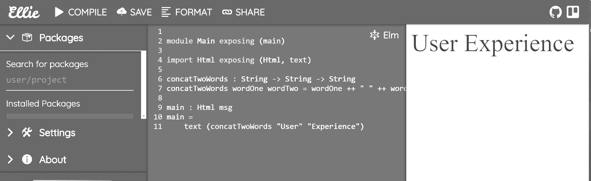

# 第六章：更深入地探索 Elm

欢迎来到第六章，*更深入地探索 Elm*。虽然上一章更侧重于实践方面，但这一章将涉及更多理论概念。

我们将涵盖的主题包括：

+   Elm 中的解构值

+   Elm 如何处理随机性？

+   Elm 中的命令

+   Elm 中的订阅

+   使用 `Html.program` 进行操作

完成这一章后，你将能够：

+   通过理解更高级的 Elm 概念来改进你的应用

+   发送命令来处理随机性

+   订阅事件

+   解构值并与之交互

让我们从 Elm 中解构值的一个非常重要的主题开始这一章。

# Elm 中的解构值

解构是 Elm 中从数据结构中提取值的一种优雅而有效的方法。解构也被称为模式匹配。语法简洁，对于初学者来说，可能会有些困惑，正是因为它如此简短。然而，一旦理解了，它感觉就像是从 Elm 数据结构中获取值的一种自然且实用的方法。

让我们通过一个 Elm 中解构元组的例子开始这一章。作为提醒，元组是一种类似于记录的数据结构。区别在于它通常更短，我们不需要关心存储在元组中的值的命名。如果你真的需要在你的数据结构中命名值，你需要使用记录。

# 使用 let-in 表达式在 Elm 中解构元组

让我们想象一场 400 米赛跑发生了。这场比赛涉及五位参赛者。我们将使用元组来存储所有参赛者的所有时间（以秒为单位）。让我们使用 Elm REPL 来存储这些时间：

```js
aTuple = (60,65,71,75,90)
```

REPL 将返回以下内容：

```js
(60,65,71,75,90) : ( number, number1, number2, number3, number4 )
```

现在我们有了时间，我们想要进行一些分析。然而，为了执行分析，我们首先需要知道如何提取这些值。

为了提取值，我们将使用一个`let-in`表达式。我们面临的第一项任务是计算所有赛跑者的总时间。我们将通过将所有单独的时间相加来完成这项任务，或者说，通过将元组中存储的所有值相加。这很简单：

```js
let \
 (a,b,c,d,e) = aTuple \
in \
 a + b + c + d + e
```

REPL 返回以下内容：

```js
271 : number
```

现在我们通过将结果除以`5`（因为有五个赛跑者）来计算平均时间：

```js
let \
 (a,b,c,d,e) = aTuple \
in \
 (a + b + c + d + e) / 5
```

这次，REPL 返回以下内容：

```js
72.2 : Float
```

我们是如何解构前面的元组的？为了理解前面代码中发生的事情，我们需要讨论这一行代码：

```js
(a,b,c,d,e) = aTuple \
```

上一行代码遵循了`let`关键字，正如之前所解释的，这允许我们在`let-in`表达式的`in`部分作用域内使用变量。

因此，我们将一个五元组（包含变量 `a`、`b`、`c`、`d` 和 `e`）与之前声明的特定元组进行模式匹配，并给它命名为 `aTuple`。换句话说，如果我们把 Elm REPL 当作一个人，那么前面的代码行就相当于我们说：“嘿 Elm REPL，使用 `aTuple` 中的值，并将这些值与字母 a、b、c、d 和 e 匹配，因为我想要对这些值进行一些计算”。

然后，在我们的 `let-in` 表达式的 `in` 部分中，我们只需按需执行计算。前面的例子展示了解构本质上是什么。

在下一个示例中，让我们看看如何轻松地处理 `aTuple` 中的一些值。我们将计算前三名运动员的平均时间。这真的很简单。沿着我们之前做的路线，我们只需这样做：

```js
let \
 (a,b,c,d,e) = aTuple \
in \
 (a+b+c) / 3
```

这就是 Elm REPL 返回的结果：

```js
65.33333333333333 : Float
```

最后，让我们计算最后一名到达终点线和第一名冲过终点的运动员之间的时间差。我们将进行另一个简单的计算：

```js
let \
 (a,b,c,d,e) = aTuple \
in \
 e-a
```

Elm REPL 将返回以下结果：

```js
30 : number
```

太好了，一切如预期工作。现在，让我们想象一个类似的元组解构用法。这次，我们将使用一个字符串的五元组。目标是像之前一样，只解构元组中的某些值：

```js
aTupleOfStrings = ("Hello", "Big", "Wild", "Funny", "World")
```

接下来，让我们在 REPL 中打印出 "Hello World"：

```js
let \
 (a, b) = aTupleOfStrings
in \
 a ++ e
```

不幸的是，这不会像我们想象的那样工作。错误是自解释的：

```js
-- TYPE MISMATCH --------------------------------------------- repl-temp-000.elm

`aTupleOfStrings` is being used in an unexpected way.

5| (a,e) = aTupleOfStrings
 ^^^^^^^^^^^^^^^
Based on its definition, `aTupleOfStrings` has this type:

 ( String, String, String, String, String )

But you are trying to use it as:

 ( a, b )
```

这提出了一个问题。虽然我们已经从计算比赛时间的例子中知道，我们可以使用一对一映射和临时变量来匹配元组中的所有值，但这种方法可能并不总是最有效的。为什么？

因为有时我们可能需要在 let 表达式中分配更长、更具有表达性的变量名，以满足编译器的要求。然后，一旦我们不再收到错误，我们就永远不会真正使用这些变量名。这是不切实际的。现实情况下，我们不可能总是能够输入单字母的临时变量，同时还能轻松理解我们的程序。

幸运的是，解决方案很简单——当我们解构元组时，如果我们不关心其中的一些值，我们可以使用下划线字符来表示它。实际上，我们告诉 Elm REPL 的就是——不要注意这些值。让我们重写之前的例子，使其使用下划线工作：

```js
let \
 (a,_,_,_,e) = aTupleOfStrings \
in \
 a ++ e
```

Elm REPL 以以下方式响应：

```js
''HelloWorld'' : String
```

让我们用更有意义的东西替换单字母变量：

```js
let \
 (greeting,_,_,_,planetDescription) = aTupleOfStrings \
in \
 greeting ++ planetDescription
```

Elm REPL 仍然会返回相同的结果。

# 使用 case-of 表达式在 Elm 中解构元组

在本节中，我们将使用 `case-of` 表达式解构元组。为了看到元组解构的效果，我们必须使用 Ellie 应用程序而不是 Elm REPL。首先，让我们在 Ellie 应用程序中设置以下基本示例：

```js
module Main exposing (main)

import Html exposing (Html, text)

greeting = ("Hello", "World")

main : Html msg
main =
    case greeting of 
        ("Hello", "World") ->
            text "Tuple contained: Hello, World!"

        ("Hello", _) ->
            text "Tuple contained: Hello "

        (_, "World") ->
            text "Tuple contained: World!"

        (_, _) ->
            text "There were neither 'Hello' nor 'World' in the greeting Tuple"
```

前面的代码所做的事情应该很容易理解——使用问候变量中的值，主函数将使用 case-of 表达式进行模式匹配，并根据从元组中解构的值返回文本。

首先，我们在问候的双元组中的两个 `Strings` 上检查字面匹配。然后，我们只检查第一个 `String` 的字面匹配。接下来，我们只检查 `"World"` 的匹配——我们的问候双元组中的第二个 `String`。最后，我们通过使用以下模式匹配所有其他可能的案例：

```js
(_, _) ->
```

现在让我们用各种组合测试我们的应用程序。首先，我们将使用原始代码。在 Ellie 应用程序中按下编译按钮将在屏幕上打印以下文本：

```js
Tuple had: Hello, World!
```

让我们改变问候元组，使其看起来如下：

```js
greeting = ("Howdy", "World")
```

现在，编译 Ellie 应用程序，你应该会得到以下内容：

```js
Tuple had: World!
```

最后，让我们尝试将问候语改为以下内容：

```js
greeting = ("Howdy", "Earth")
```

编译后，Ellie 应用程序将生成以下输出：

```js
There were neither 'Hello' nor 'World' in the greeting Tuple
```

在下一节中，我们将使用我们新发现的元组解构知识，并将其应用于 FizzBuzz 应用程序的改进版本。

# 使用 case-of 表达式内部的元组解构构建 FizzBuzz 应用程序

让我们重新审视我们的 FizzBuzz 问题。这次我们可以使用我们的取模运算作为 `case` 表达式的条件。代码如下：

```js
module Main exposing (main)

import Html exposing (..)

n = 100
modulusTest = (n % 3, n % 5)

main : Html msg
main = 
  text <| let fizzBuzz n = 
              case modulusTest of
                (0, 0) -> "fizzBuzz"
                (0, _) -> "fizz"
                (_, 0) -> "buzz"
                (_,_) -> toString n
          in fizzBuzz n
```

为了使前面的代码简洁，我们将 `n` 的值设为单个固定的数字 100。请随意通过替换该值以不同的数字测试应用程序。

上述代码应该很容易理解——我们将 `modulusTest` 设置为一个包含 `n % 5` 和 `n % 3` 计算的元组。然后在 `main` 中，我们对 let-in 表达式使用 `text` 函数。`<|` 是向后函数应用操作符。它将评估为右侧的值，并将其作为参数传递给其左侧的任何内容——在这种情况下，是一个 `text` 函数。本质上，它用于替代括号。换句话说，我们本来可以像下面这样编写 `main` 函数：

```js
main = 
  text (let fizzBuzz n = 
              case modulusTest of
                (0, 0) -> "fizzBuzz"
                (0, _) -> "buzz"
                (_, 0) -> "fizz"
                (_,_) -> toString n
        in fizzBuzz n)
```

它将做与前面代码片段之前使用的代码完全相同的事情。最后，我们的 case 表达式将 `modulusTest` 中执行的计算返回的值与适当的值进行模式匹配。这种设置的优点是现在很容易检查不同的数字。例如，我们可以打印出三和七，如下所示：

```js
module Main exposing (main)

import Html exposing (..)

n = 70
modulusTest = (n % 3, n % 7)

main : Html msg
main = 
  text (let fizzBuzz n = 
              case modulusTest of
                (0, 0) -> "Divisible by 21, seven, and three"
                (0, _) -> "Divisible by three"
                (_, 0) -> "Divisible by seven"
                (_,_) -> toString n
        in fizzBuzz n)
```

现在让我们看看如何在元组内部解构元组。

# 使用 let-in 表达式解构嵌套元组

让我们在 Elm REPL 中尝试这个：

```js
nestedTuples = (1, 2, 3, (5, 10, 15, (100, 50, 0)))
```

REPL 将返回以下内容：

```js
(1,2,3,(5,10,15,(100,50,0)))
 : ( number
 , number1
 , number2
 , ( number3, number4, number5, ( number6, number7, number8 ) )
      )
```

接下来，让我们从最内层的元组中解构 `i` 的值：

```js
let \
 (a, b, c, (d, e, f, (g, h, i))) = nestedTuples \
in \
 i
```

REPL 返回以下内容：

```js
0 : number
```

注意，我们甚至不需要声明 `nestedTuples` 变量。相反，我们可以在 let-in 语句中即时解构值。例如，让我们使用 Ellie 应用程序来编译以下代码：

```js
module Main exposing (main)

import Html exposing (..)

main : Html msg
main = 
  text (toString (
              let 
                  (a,b,c,(d,e,f,(g,h,i))) = (1, 2, 3, (5, 10, 15, (100, 50, 0)))
              in
                  i
              ))
```

最后，我们可以在适当的时候使用下划线，如下所示：

```js
module Main exposing (main)

import Html exposing (..)

main : Html msg
main = 
  text (toString (
              let 
                  (_,_,c,(_,_,f,(_,_,i))) = (1, 2, 3, (5, 10, 15, (100, 50, 0)))
              in
                  i
              ))
```

通过这种方式，我们结束了关于元组解构的讨论。接下来，我们将探讨记录解构。

# 使用 let-in 表达式在 Elm 中解构记录

Elm 中的记录解构类似于元组。让我们用记录而不是元组重写我们的比赛时间示例。在 Ellie 应用程序中编译以下应用程序：

```js
module Main exposing (main)

import Html exposing (..)

raceTimes = { first = 60, second = 65, third = 71, fourth = 75, fifth = 90 }

averageRunnerTime record =
    let 
        {first, second, third, fourth, fifth} = record
    in
        (first + second + third + fourth + fifth) / 5

main : Html msg
main = 
  text (toString (
              averageRunnerTime raceTimes
              ))
```

编译完成后，屏幕上应显示以下文本：

```js
72.2
```

在前面的应用程序中使用的代码基本上与我们用于解构元组的示例中使用的代码相同。区别在于 Elm 中记录的工作方式——由于它们*必须*有命名值，我们在解构记录中的值时*必须*使用这些名称。

# 在 Elm 中动态解构记录

在解构记录时，我们甚至不需要使用下划线字符。由于记录中的所有值都有名称，只需使用该名称即可从记录中提取值。以我们之前的比赛时间示例为例，让我们将存储这些时间的记录放入 Elm REPL 中：

```js
raceTimes = { first = 60, second = 65, third = 71, fourth = 75, fifth = 90 }
```

REPL 返回以下内容：

```js
{ first = 60, second = 65, third = 71, fourth = 75, fifth = 90 }
 : { fifth : number
 , first : number1
 , fourth : number2
 , second : number3
 , third : number4
 }
```

接下来，让我们看看如何提取第五名运动员的时间：

```js
{ fifth } = raceTimes
```

REPL 返回以下内容：

```js
90 : number
```

让我们使用 Ellie 应用程序来解构第五名运动员的时间：

```js
module Main exposing (main)

import Html exposing (..)

extractorFunction { fifth } =
    fifth

raceTimes = { first = 60, second = 65, third = 71, fourth = 75, fifth = 90 }
fifth = raceTimes

main : Html msg
main = 
  text (toString (
              extractorFunction raceTimes
              ))
```

但为什么我们需要使用我们的自定义 `extactorFunction`？我们不能没有它吗？让我们试试这个：

```js
module Main exposing (main)

import Html exposing (..)

raceTimes = { first = 60, second = 65, third = 71, fourth = 75, fifth = 90 }
fifth = raceTimes

main : Html msg
main = 
  text (toString (
              fifth
              ))
```

编译后，Ellie 应用程序将在屏幕上打印以下内容：

```js
{ first = 60, second = 65, third = 71, fourth = 75, fifth = 90 }
```

如果我们真的想不使用提取函数来做这件事，我们可以这样做：

```js
module Main exposing (main)

import Html exposing (..)

raceTimes = { first = 60, second = 65, third = 71, fourth = 75, fifth = 90 }
fifth = raceTimes

main : Html msg
main = 
  text (toString (
              raceTimes.fifth
              ))
```

编译后，Ellie 应用程序将在屏幕上打印出预期的 `90` 值。最后，让我们解构并只使用两个值。我们将从有错误的代码开始，这将抛出错误。代码如下所示：

```js
module Main exposing (main)

import Html exposing (..)

extractorFunction { first, fifth } =
    first, fifth

raceTimes = { first = 60, second = 65, third = 71, fourth = 75, fifth = 90 }
{first, fifth} = raceTimes

main : Html msg
main = 
  text (toString (
              extractorFunction raceTimes
              ))
```

编译前面的代码时，将会抛出以下错误：

```js
SYNTAX PROBLEM
Line 6, Column 10
I am looking for one of the following things:

"'"
a field access like .name
an expression
an infix operator like (+)
end of input
more letters in this name
whitespace
```

为什么？给自己一些时间思考。这将是一个有用的发现。对于急于求成的读者，以下是相应的代码：

```js
module Main exposing (main)

import Html exposing (..)

extractorFunction { first, fifth } =
    (first, fifth)

raceTimes = { first = 60, second = 65, third = 71, fourth = 75, fifth = 90 }
{first, fifth} = raceTimes

main : Html msg
main = 
  text (toString (
              extractorFunction raceTimes
              ))
```

错误是由于我们最初给 Elm 编译器提供了一个令人困惑的表达式，它根本不知道如何处理它。让我们再次看看有问题的代码：

```js
extractorFunction { first, fifth } =
    first, fifth
```

编译器看到：一个值，一个逗号，然后是一个值，它不知道如何从这个代码行返回一个单一值。我们之前已经看到一种解决这个错误的方法；通过将记录中的值提取到元组中。

另一种方法是将这些值作为字符串打印出来，如下所示：

```js
module Main exposing (main)

import Html exposing (..)

raceTimes = { first = 60, second = 65, third = 71, fourth = 75, fifth = 90 }

main : Html msg
main = 
  text <|
      toString (raceTimes.first)
      ++ ", " 
      ++ toString (raceTimes.fifth)
```

通过这种方式，我们完成了 Elm 中解构值的讨论。接下来，我们将探讨 Elm 处理随机性的方法。

# 在 Elm 中处理随机性

如前所述，Elm 中的值是不可变的。函数是纯函数；它们不允许任何副作用。当特定的值传入时，函数将对其操作，并始终返回另一个特定的值。

这提出了一个问题——我们该如何处理随机性？例如，我们如何生成随机数？或者，更确切地说，我们如何执行任何涉及副作用的事情？我们通过*让函数返回命令*来实现这一点。

# Elm 中的命令

使用命令，你是在告诉 Elm 运行时做一些你被禁止做的事情，因为这样做会破坏保证的概念。因此，从函数返回的命令只是一个静态的、不可变的价值。这个值做什么？它只是*命名*了期望的结果。它不会告诉 Elm 如何实现它。它只是 Elm 运行时需要完成的一个或多个事情的名字。

例如，由于保证的概念指出，对于纯函数的每个输入，我们都应该收到相同类型的输出，因此我们不能让一个函数返回一个随机数，因为这样做会破坏保证的概念。为了使前面的场景成为可能，我们需要向 Elm 运行时发送一个命令，*请求它*给我们一个随机数。

因此，一旦 Elm 运行时收到命令，例如请求一个随机数，*它将返回一条消息*。然后我们可以使用这条消息在更新函数中，正如在第二章，“构建你的第一个 Elm 应用”中解释的那样。

本节对 Elm 命令的基本介绍的目标是，关于我们将要引入的新代码没有歧义，或者换句话说，我们至少对每段代码的作用有一些了解。接下来，我们将探讨订阅，以及它们如何融入 Elm 架构。

# Elm 中的订阅

命令允许我们告诉 Elm 运行时执行一些随机的事情，而不会破坏 Elm 的保证。

然而，假设我们想让 Elm 运行时告诉我们外部世界发生了一些变化（即我们无法直接控制在我们应用中的任何东西）。我们不能用命令控制外部世界的变化——因为*我们不是这些变化的来源*。

正因为如此，订阅才存在。它们允许我们监听诸如鼠标移动、键盘按键、时间变化等等的事情。使用命令，*我们指示 Elm 运行时执行随机的事情*；使用订阅，*Elm 运行时会告诉我们正在执行随机的事情*。

例如，我们想要跟踪键盘按钮被按下时的情况。我们的应用将订阅这些键盘按键。一旦按下特定的键盘按钮，Elm 运行时会发送一条消息，在我们的更新函数中，我们指定当接收到此类消息时应该如何处理。

现在我们已经熟悉了 Elm 中的命令和订阅，我们可以看看它们如何用来扩展我们当前对 Elm 架构的概念。

# 通过添加效果改进 Elm 架构

在我们了解 Elm 的命令之前，我们通常使用 `beginnerProgram` 函数来实现 Elm 架构：

```js
main =
  Html.beginnerProgram
    { model = model
    , view = view
    , update = update
    }
```

然而，仅使用 `beginnerProgram`，我们无法处理命令或订阅。实际上，我们的 `beginnerProgram` 函数只是 `Html.program` 函数的稀释版。

换句话说，使用 `Html.program`，我们有能力扩展我们的 Elm 架构，以便我们保持 Elm 的保证，同时仍然处理随机性，即副作用，无论这些副作用的来源如何。

因此，而不是使用 `Html.beginnerProgram`（就像我们之前做的那样），让我们看看我们如何设置主函数，使其使用 `Html.program`：

```js
main =
    Html.program
        { init = init
        , view = view
        , update = update
        , subscriptions = subscriptions
        }
```

代码的变化很小，但我们的 Elm 程序的能力大大增强。这结束了我们对 Elm 中处理随机性的简要介绍。在下一节中，我们将探讨 Elm 中一个非常有用的概念：部分应用。

# 理解部分应用

假设我们有一个接受两个参数的函数。这个函数非常简单——它只是接受两个 `Strings` 并将它们连接起来，中间加上一个空格。

函数签名将如下所示：

```js
concatTwoWords wordOne wordTwo = wordOne ++ " " ++ wordTwo
```

当我们调用函数时，我们可能会传递两个单词，如下所示：

```js
concatTwoWords "User" "Experience"
```

前面的函数将评估为以下内容：

```js
"User Experience"
```

现在我们将其实现为一个可以运行在 Ellie 应用程序中的小程序：

```js
module Main exposing (main)

import Html exposing (Html, text)

concatTwoWords : String -> String -> String
concatTwoWords wordOne wordTwo = wordOne ++ " " ++ wordTwo

main : Html msg
main =
    text (concatTwoWords "User" "Experience")
```

编译后，Ellie 应用程序将在右侧预览窗格中显示“用户体验”字样：



注意，我们还在函数定义之前添加了类型注解。类型注解如下：

```js
concatTwoWords : String -> String -> String
```

观察类型注解，我们可以这样说，我们的 `concatTwoWords` 函数接受两个字符串并返回一个字符串。毕竟，类型注解看起来就是这样。如果我们只向我们的 `concatTWoWords` 函数传递一个参数会发生什么？让我们试一试。在 Ellie 应用程序中运行以下代码：

```js
module Main exposing (main)

import Html exposing (Html, text)

concatTwoWords : String -> String -> String
concatTwoWords wordOne wordTwo = wordOne ++ " " ++ wordTwo

main : Html msg
main =
    text (concatTwoWords "User")
```

这次我们得到了一个 `Type Mismatch` 错误，内容如下：

```js
The argument to function text is causing a mismatch.

Function text is expecting the argument to be:

String
But it is:

String -> String
Hint: It looks like a function needs 1 more argument.
```

因此，显然，如果我们的函数期望两个参数，我们不能只传递一个参数并称之为结束，因为我们刚刚看到，这将导致编译器抛出错误。

而我们能够做的是一个小巧的技巧。我们可以定义一个新的函数。我们将定义的这个新函数将存储只传递一个 `String` 给 `concatTwoWords` 的结果。换句话说，它将存储 `concatTwoWords` 函数的部分应用结果。

由于没有更好的名字，我们将给这个新函数命名为 `partiallyApply`，并定义如下：

```js
partiallyApply = concatTwoWords wordOne
```

我们在这里所做的是，我们通过只传递一个参数来*部分应用*我们的 `concatTwoWords` 函数。然后，我们将结果存储在另一个我们称之为 `partiallyApply` 的函数中。我们仍然可以向我们的 `partiallyApply` 函数传递一个参数，然后我们将它存储在 `partiallyApplyAgain` 函数中，如下所示：

```js
partiallyApplyAgain = partiallyApply wordTwo
```

准备在 Ellie 应用程序中运行的更新后的代码现在如下所示：

```js
module Main exposing (main)

import Html exposing (Html, text)

wordOne = "User"
wordTwo = "Experience"

concatTwoWords : String -> String -> String
concatTwoWords wordOne wordTwo = wordOne ++ " " ++ wordTwo

partiallyApply = concatTwoWords wordOne
partiallyApplyAgain = partiallyApply wordTwo

main : Html msg
main =
    text (partiallyApplyAgain)
```

运行前面的代码将在 Ellie 应用右侧面板上显示单词`用户体验`。

# 摘要

在本章中，我们介绍了一些重要主题，包括：

+   Elm 中的值解构

+   Elm 如何处理随机性？

+   理解部分应用

+   通过使用 `Html.program` 向我们的应用引入效果

在下一章中，我们将开始构建一个功能齐全的天气应用，该应用将连接到远程 API 以获取天气信息。
