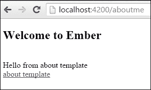
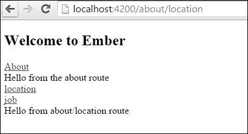
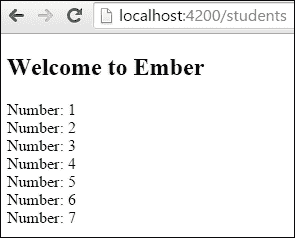
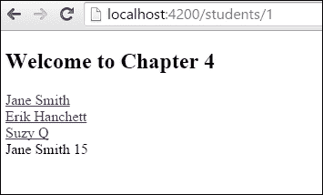
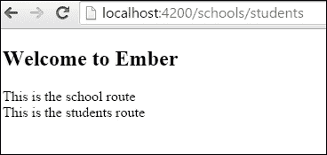
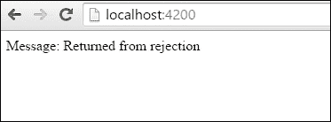
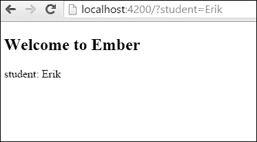
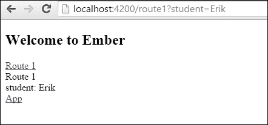

# 第四章：Ember 路由器

在本章中，我们将介绍以下食谱：

+   定义应用程序路由

+   设置路由模型

+   在路由中处理动态段

+   使用模板定义路由

+   使用路由进行重定向

+   使用异步路由

+   加载和错误处理

+   使用查询参数

# 简介

Ember 中的路由器负责在用户执行操作时更改应用程序的状态。这可能包括用户更改 URL 或在应用程序中点击后退按钮。无论执行什么操作，路由处理程序都负责。它获取当前 URL 并将其映射到正确的路由，以便向用户显示。

路由处理程序负责渲染模板、加载模型以及从一个路由到另一个路由的重定向和过渡。它们还可以处理模型变化时发生的行为。

# 定义应用程序路由

当加载应用程序时，路由器会查看 URL 并将其与路由匹配。我们将介绍一些关于它是如何工作的基础知识。

## 如何操作...

路由图用于定义 URL 映射。让我们看看如何使用`this.route`添加新路由。

1.  在新应用程序中，打开`app`文件夹中的`router.js`文件。首先，我们将创建一个名为`about`的新路由：

    ```js
    // app/router.js
    import Ember from 'ember';
    import config from './config/environment';

    var Router = Ember.Router.extend({
      location: config.locationType
    });

    Router.map(function() {
      this.route('about');
    });

    export default Router;
    ```

    上一段代码中的`Router.map`处理程序的程序路由。`this.route`创建`about`路由。默认情况下，路由的名称将与路径相同。例如，`about`路由路径将位于`/about`。我们可以使用`path`来具体设置路径。

1.  我们不希望所有请求都发送到`/about`，让我们更改路径，使它们发送到`/me`：

    ```js
    // app/router.js
    …
    this.route('about',{ path: '/aboutme' });
    …
    ```

    新的路由`about`现在将被映射到 URL `/aboutme`。

1.  为了测试这一点，我们可以创建一个新的模板并在应用程序路由中添加一个`link-to`助手。首先，我们将创建模板：

    ```js
    $ ember g template about

    ```

    Ember CLI 为我们创建的模板。这将创建`app/templates`文件夹中的`about.hbs`文件。

1.  将`link-to`助手添加到`application.hbs`文件中：

    ```js
    // app/templates/about.hbs 
    <h2 id="title">Welcome to Ember</h2>

    {{outlet}}

    {{#link-to 'about'}}about template{{/link-to}}
    ```

    代码在主应用程序模板中创建了一个指向`about`模板的新链接。

1.  向我们刚刚创建的`about`模板添加一条新消息：

    ```js
    // app/templates/about.hbs
    <br>Hello from the about route!<br>
    ```

    当我们导航到这个新路由时，将只显示此文本。

1.  我们现在可以运行服务器并检查输出。运行`ember server`并点击**about 模板**链接。about 路由将加载，如下所示：

    ### 小贴士

    **应用程序路由**

    当您的应用程序首次启动时，应用程序路由将被加载。就像任何其他路由一样，应用程序模板将默认加载。应用程序路由是免费提供的，不需要添加到`app/router.js`文件中。`{{outlet}}`将用于渲染所有其他路由。在这里放置页眉、页脚和其他装饰性内容是个好主意。

### 在您的应用程序中使用嵌套路由

有时，您可能需要多个级别的路由。您可能需要在其他模板中包含模板。这可以通过嵌套路由来实现。

1.  假设我们有一个 `about` 路由，其中嵌套了 `location` 和 `job` 路由：

    ```js
    // app/router.js
    import Ember from 'ember';
    import config from './config/environment';

    var Router = Ember.Router.extend({
      location: config.locationType
    });

    Router.map(function() {
      this.route('about', function() {
        this.route('location');
        this.route('job');
      });
    });

    export default Router;
    ```

1.  路由 `map` 有一个最高级别的路由称为 `about`。在这个路由之下是 `location` 和 `job`。创建 `location` 和 `job` 所需的两个模板：

    ```js
    $ ember g template about/location
    $ ember g template about/job
    $ ember g template about

    ```

    这将在 `app/templates/about` 文件夹中创建正确的 `location.hbs` 和 `job.hbs` 文件，以及在 `app/templates` 文件夹中的 `about.hbs` 文件。

1.  为了能够访问嵌套路由，我们需要编辑 `about.hbs` 并为 `location` 和 `job` 嵌套路由添加 `outlet`：

    ```js
    // app/templates/about.hbs
    <br>Hello from the about route<br>
    {{#link-to 'about.location'}}location{{/link-to}}<br>
    {{#link-to 'about.job'}}job{{/link-to}}
    <br>{{outlet}}<br>
    ```

    注意 `link-to` 辅助函数如何路由到 `about.location`。您可以使用点符号来链接嵌套路由。`location` 和 `job` 嵌套路由将在 `{{outlet}}` 中渲染。

1.  为了使事情更有趣，我们将更新 `job` 和 `location` 路由模板：

    ```js
    // app/templates/about/location.hbs
    Hello from about/location route

    // app/templates/about/job.hbs
    Hi from the about/job route
    ```

1.  最后，我们将在应用程序路由中添加一个 `link-to` 辅助函数：

    ```js
    // app/templates/application.hbs
    <br>
    <br>

    {{#link-to 'about'}}Hello{{/link-to}}
    {{outlet}}
    ```

    `link-to` 辅助函数将路由到 `about`。这将渲染在 `outlet` 中。

1.  运行 `ember server` 后，您将可以点击链接并在路由间切换。它应该看起来与以下图片相似：

    如果我们点击 **工作** 链接，URL 将更改为 `http://localhost:4200/about/job`。然后 `about` 模板中的 `{{outlet}}` 将显示 `job` 模板信息。

### 添加通配符

您可以在路由中使用通配符。这允许您创建匹配多个段的 URL。让我们为任何未找到的 URL 创建一个通配符。

1.  在一个新项目中，更新 `app` 文件夹中的 `router.js` 文件：

    ```js
    // app/router.js
    import Ember from 'ember';
    import config from './config/environment';

    var Router = Ember.Router.extend({
      location: config.locationType
    });

    Router.map(function() {
        this.route('page-not-found', {path: '/*wildcard' });
    });

    export default Router;
    ```

    `/*wildcard` 路径将捕获所有未定义的路由并将它们路由到 `page-not-found`。

1.  创建一个新的 `page-not-found` 模板：

    ```js
    $ ember g template page-not-found

    // app/templates/page-not-found
    <br>Not Found</br>

    ```

    当用户导航到匹配 `/*` 且没有现有路由匹配的 URL 时，此路由将在 `application.hbs` 的 `outlet` 中渲染。

### 向我们的关于应用程序添加动态段

路由的一个重要责任是加载模型。在这个例子中，我们将在路由中创建一个简单的动态段，列出关于路由的多个工作。

1.  在一个新项目中，编辑 `router.js` 文件并添加以下代码：

    ```js
    // app/router.js
    import Ember from 'ember';
    import config from './config/environment';

    var Router = Ember.Router.extend({
      location: config.locationType
    });

    Router.map(function() {
        this.route('about', function(){
            this.route('location', {path: '/about/:location_id'});
        });
    });

    export default Router;
    ```

1.  查看输出，我们可以看到路由图显示了 `about` 路由及其下方的嵌套 `location` 路由。`location` 路由是一个以 `:` 开头的动态段，后面跟着一个标识符。`:location_id` 标识符将从 `location` 模型检索模型信息。

    例如，如果用户导航到 `/about/5`，则路由将设置 `location_id` 为 `5`，以便加载具有 `5` ID 的 `location` 模型。我们将在下一节中更详细地介绍 `about` 路由。

    ### 注意

    **索引路由**

    在嵌套的每一层，包括应用层，Ember.js 都会自动创建一个名为 **index** 的路由。你不需要在 `router.js` 中映射它。类似于应用路由，它已经存在了。索引路由将自动在其父模板的出口处渲染。例如，如果你在 `app/templates` 文件夹中创建了一个 `index.hbs` 文件，它将自动在 `application.hbs` 出口处渲染。创建路由时请记住这一点。

## 它是如何工作的...

Ember.js 中的路由定义在 `app/router.js` 文件中。路由映射用于定义每个路由，并告诉 Ember 应用程序应使用 URL 中的哪个路径。按照惯例，每个路由都有一个同名的模板。通配符和动态段可以使路由更加灵活，以便它们可以加载特定数据。

# 设置路由模型

有时，你需要从模型中检索数据以供模板使用。路由负责加载适当的模型。本教程将介绍如何进行此操作。

## 如何操作...

1.  在一个新应用中，打开 `router.js` 文件并添加一个新的路由。我们将把这个路由称为 `students`：

    ```js
    // app/router.js
    import Ember from 'ember';
    import config from './config/environment';

    var Router = Ember.Router.extend({
      location: config.locationType
    });

    Router.map(function() {
      this.route('students');
    });

    export default Router;
    ```

    `students` 路由将从 `students` 路由处理程序中检索数据。

1.  生成 `students` 路由。这将创建 `students` 路由处理程序和模板：

    ```js
    $ ember g route students

    ```

1.  在 `students.js` 文件中，添加一个新的模型，该模型返回一个 JavaScript 对象：

    ```js
    // app/routes/students.js
    import Ember from 'ember';

    export default Ember.Route.extend({
        model() {
          return [1,2,3,4,5,6,7];
        }
    });
    ```

    `model` 钩子通常返回一个 Ember Data 记录。然而，它也可以返回任何承诺对象、纯 JavaScript 对象或数组。Ember 将等待数据加载或承诺解决后再渲染模板。

    在我们的示例中，为了简化，我们返回了一个数组。

1.  在模板中创建一个简单的 `each` 循环来显示 `model` 中的数据：

    ```js
    // app/templates/students.hbs
    {{#each model as |number|}}
        Number: {{number}}<br>
    {{/each}}
    ```

    `each` 循环将显示数组中的每个 `number`。模型数据是从我们之前创建的路由返回的。

1.  运行 `ember server` 并在 `http://localhost:4200/students` 路由上加载。渲染后，它将看起来像以下图片：

## 它是如何工作的...

路由的一个重要任务是加载模型。模型是代表应用程序可能向用户展示的数据的对象。路由可以返回 Ember Data 记录、数组或对象。

# 处理路由内的动态段

使用动态段和动态模型是路由的一个重要方面。以下教程将介绍如何实现这一点。

## 准备工作

在我们开始我们的食谱之前，我们需要设置一个名为**Ember CLI Mirage**的插件。Ember 插件，也称为**附加组件**，使得在应用程序之间共享通用代码变得容易。Ember CLI Mirage 插件使得创建模拟服务器变得容易，这样我们就可以开发、测试和原型化我们的数据。在本章中，我们不会过多地介绍这个附加组件。如果您想了解更多信息，您可以在[`github.com/samselikoff/ember-cli-mirage`](https://github.com/samselikoff/ember-cli-mirage)下载。

在这个例子中，我们将使用**Ember Data 的 RESTAdapter**，而不是新的**JSON API**适配器。

1.  在一个新项目中，在`application`文件夹中运行以下安装命令：

    ```js
    $ ember install ember-cli-mirage@0.1.11

    ```

    这将安装 Ember CLI Mirage `0.1.11`版本、Bower 和`npm`包到应用程序中。我们将使用这个版本在本书的所有示例中。

1.  在`app/mirage`文件夹中的`config.js`文件中打开。添加几个新的路由：

    ```js
    // app/mirage/config.js
    export default function() {

    this.get('/students');
    this.get('/students/:id');
    }
    ```

    第一个模拟路由`/students`将返回我们 Mirage 内存数据库中的所有学生数据。第二个模拟路由`/students/:id`将只返回与 URL 中的 ID 匹配的数据。这将在我们尝试使用模型动态段时使用。

1.  为`students`创建一组新的固定数据。在`app/mirage/fixtures`目录中创建一个名为`students.js`的新文件：

    ```js
    // app/mirage/fixtures/students.js
    export default [
      {id: 1, name: 'Jane Smith', age: 15},
      {id: 2, name: 'Erik Hanchett', age: 14},
      {id: 3, name: 'Suzy Q', age: 17}
    ];
    ```

    这个文件名`students.js`与路由匹配，并将用于在 Mirage 内存数据库中加载数据。请注意，Mirage 还支持工厂。工厂是一个功能强大的特性，使得加载大量虚假数据变得极其容易。工厂也可以用于测试用例。

    为了简单起见，我们只使用固定数据。

1.  为我们的应用程序加载一个新的场景。更新`app/mirage/scenarios/default.js`文件：

    ```js
    // app/mirage/scenarios/default.js
    export default function( server ) {

        server.loadFixtures();
    }
    ```

    `scenarios`文件夹中的`default.js`文件用于在开发中初始化数据库。`server.loadFixtures()`方法加载所有固定数据，以便它可以被`/students`路由访问。

## 如何做到这一点...

我们模型中的数据可能永远不会改变。另一方面，这些数据可能会根据与用户的交互多次更改。这个食谱将介绍如何使用动态段与您的路由一起使用并从模型返回数据。

1.  首先创建一个名为`students`的新资源。然后生成一个名为`application`的适配器，最后创建一个路由：

    ```js
    $ ember g resource students
    $ ember g adapter application
    $ ember g route application

    ```

    这将生成本食谱所需的路线、适配器和模板文件。请注意，通过生成`application`路由，您将被提示覆盖`application.hbs`文件。当发生这种情况时，您可以选择*n*，即不覆盖。

1.  在`router.js`文件中更新新的动态段路由：

    ```js
    // app/router.js
    import Ember from 'ember';
    import config from './config/environment';

    var Router = Ember.Router.extend({
      location: config.locationType
    });

    Router.map(function() {
      this.route('students',  {path: '/students/:student_id'});
    });

    export default Router;
    ```

    这个新的路由路径为`/students/:student_id`。这个路由将从 URL 中提取`:student_id`并将其作为第一个参数传递给模型钩子。

    例如，假设我们有一个学生列表，并且我们希望能够通过访问 `/students/1` 和 `/students/2` 来访问每个学生的数据。每个 URL 都将返回该学生的数据。

1.  更新 `app/adapters` 文件夹中的 `application.js` 文件：

    ```js
    import DS from 'ember-data';

    export default DS.RESTAdapter.extend({
    });
    ```

    这将创建一个新的 `RESTAdapter`，Ember 将用于此示例。这将在模型章节中更详细地介绍。

1.  编辑 `app/models` 文件夹中的 `students.js` 文件。此文件是我们的模型，将用于从我们之前创建的 Mirage 模拟服务器检索数据：

    ```js
     // app/models/student.js
    import DS from 'ember-data';

    export default DS.Model.extend({
        name: DS.attr('string'),
        age: DS.attr('number')

    });
    ```

    这创建了一个具有两个属性 `name` 和 `age` 的新模型。模型文件定义了数据将如何看起来。我们将在 *第七章*，*Ember 模型和 Ember Data* 中更详细地介绍这一点。现在，我们将从模拟服务器检索这些数据。

1.  更新 `app/routes` 文件夹中的 `students.js` 文件。添加 Ember Data 的 `findRecord` 方法：

    ```js
    // app/routes/students.js
    import Ember from 'ember';

    export default Ember.Route.extend({
        model(param) {
          return this.store.findRecord('student',param.student_id);
        }
    });
    ```

    此处的 `model` 钩子有一个参数，即 `param`。`param` 参数是 `student_id`，它从路由的 URL 中传递过来。Ember Data 有一个 `findRecord` 方法，它接受两个参数。第一个参数是模型名称，第二个是 ID。

    此模型将返回传递给它的 ID 的学生记录。我们现在可以在模板中使用它。

1.  编辑 `app/templates` 文件夹中的 `students.hbs` 文件。添加模型信息：

    ```js
    // app/templates/students.hbs
    {{model.name}}
    {{model.age}}
    ```

    `{{model.name}}` 和 `{{model.age}}` 属性将检索从路由传递到模板的模型信息。

    到目前为止，我们应该能够运行 `ember server` 并在访问 `http://localhost:4200/students/1` 时看到数据。为了使事情变得简单一些，我们将继续创建一个新的路由处理器用于主应用程序路由。

1.  编辑 `app/routes` 文件夹中的 `application.js` 文件：

    ```js
    // app/routes/application.js
    import Ember from 'ember';

    export default Ember.Route.extend({
        model() {
          return this.store.findAll('student');
        }
    });
    ```

    ### 注意事项

    **多个模型**

    有时，你可能想在一条路由中使用多个模型。这可以通过使用 `Ember.RSVP.hash` 来实现。该 hash 接收返回承诺的参数。当所有参数都解析完成后，`Ember.RSVP.hash` 才会解析。在模型中，它可能看起来像这样：`return Ember.RSVP.hash({ students: this.store.findAll('student'), books: this.store.findAll('book')})`。每个模型之间用逗号分隔。

    这将允许我们的应用程序从我们的学生模型中检索所有记录。

1.  打开 `app/templates` 文件夹中的 `application.hbs` 文件。我们将添加一个 `each` 迭代器，它将链接到每个学生的信息：

    ```js
    // app/templates/application.hbs
    <h2 id="title">Welcome to Chapter 4</h2>

    {{#each model as |student|}}
        {{#link-to 'students' student.id}}{{student.name}}{{/link-to}}<br>
    {{/each}}

    {{outlet}} 
    ```

    在此模板中，我们正在迭代 `student` 模型中的所有记录。我们使用每个学生的名字作为链接到我们的动态段。`student.id` 参数传递给 `link-to` 辅助函数。

1.  启动服务器后，你会看到一个学生列表以及每个学生信息的链接。点击学生的名字后，`student.hbs` 模板将加载并显示学生的信息。它看起来像以下图片：

## 它是如何工作的...

动态模型允许数据根据用户操作而变化。这些数据将取决于`router.js`文件中设置的动态段。该段在`router`文件中定义，并从 URL 传递给模型钩子作为其第一个参数。Ember Data 使用`findRecord`方法查找正确的记录并将其返回到模板，以便可以使用。

# 使用模板定义路由

路由处理器的另一个任务是渲染适当的模板。以下是一个关于这一点的示例。

## 如何操作...

在这个示例中，我们将创建一些嵌套路由并检查它们在哪里渲染。

1.  在一个新项目中，创建一个新的`students`和`schools`路由：

    ```js
    $ ember g route schools
    $ ember g route schools/students

    ```

    这将创建嵌套的`students`和`schools`路由。

1.  让我们看看`router.js`文件：

    ```js
    // app/router.js
    import Ember from 'ember';
    import config from './config/environment';

    var Router = Ember.Router.extend({
      location: config.locationType
    });

    Router.map(function() {
      this.route('schools', {}, function() {
        this.route('students', {});
      });
    });

    export default Router;
    ```

    生成的命令已经创建了我们需要的路由。`schools`路由有一个嵌套的路由，称为`students`。

    根据约定，路由将渲染与名称相同的模板。因此，`schools`路由将渲染到`schools.hbs`文件，而`students`路由将渲染到`schools/students.hbs`文件。

1.  更新`schools.hbs`文件：

    ```js
    // app/templates/schools.hbs
    This is the school route<br>
    {{outlet}}
    ```

    `{{outlet}}`将在`schools`文件夹中渲染`students.hbs`文件。每个模板都将渲染到其父路由模板的`{{outlet}}`中。

1.  更新`app/templates/schools`文件夹中的`students.hbs`文件：

    ```js
    // app/templates/schools/students.hbs
    This is the students route<br>
    {{outlet}}
    ```

1.  运行`ember server`，你应该看到这个结果：

1.  通过访问`http://localhost:4200/schools/students`，将显示两个模板。应用程序`{{outlet}}`渲染学校模板。学校模板的`{{outlet}}`渲染学生模板。

1.  如果需要，您可以更改路由的渲染位置。您不必在具有相同名称的模板中渲染，而是可以使用路由处理器中的`renderTemplate()`方法将其设置为任何内容：

    ```js
    // app/routes/school.js
    import Ember from 'ember';

    export default Ember.Route.extend({
      renderTemplate() {
        this.render('anotherSchool');
      }
    });
    ```

    学校路由现在将渲染到`anotherSchool`模板。

## 它是如何工作的...

默认情况下，路由将根据路由的名称渲染模板。Ember 通过约定来实现这一点。另一方面，在路由处理器中使用`renderTemplate`可以改变这个默认设置。所有这些都是在 Ember API 的底层完成的。

# 使用路由进行重定向

路由的一个重要特性是重定向。这个示例将介绍如何使用`transitionTo`方法。

## 如何操作...

在我们的路由处理器中，我们有特殊的钩子，称为`beforeModel`和`afterModel`。我们可以使用这些钩子在模型加载前或加载后执行操作。`transitionTo`方法可以用来将应用程序重定向到不同的路由。

1.  在一个新应用中，创建一个新的`students`路由：

    ```js
    $ ember g route students

    ```

    这将生成`students`路由和模板文件。

1.  为了简化，我们将让路由处理器返回一个简单的数字数组：

    ```js
    // app/routes/students.js
    import Ember from 'ember';

    export default Ember.Route.extend({
        model() {
          return [1,2,3,4,5,6,7,8,9];
        }
    });
    ```

1.  再次编辑`routes/students.js`文件。这次，我们将添加一个 before 钩子和一个过渡到它：

    ```js
    // app/routes/students.js
    …
    beforeModel(){
      this.transitionTo('teachers');
    }
    ```

    `transitionTo` 方法将从一条路由重定向到另一条路由。此选项将在模型加载之前进行重定向并切换到教师的路由。

1.  我们也可以使用 `afterModel()` 钩子在模型加载后进行转换：

    ```js
    // app/routes/students.js
    …
    afterModel(){
      this.transitionTo('teachers');
    }
    ```

    这将在切换到新路由之前等待模型完全加载。如果需要，您可以在切换之前检查已加载的路由。

    ### 小贴士

    **重定向**

    当转换到嵌套路由时，使用 `redirect` 方法而不是 `afterModel` 或 `beforeModel` 钩子是个好主意。这将防止在重定向后再次触发 `beforeModel`、`afterModel` 和模型。在处理嵌套路由中的 `transitionTo` 时，请记住这一点。

## 它是如何工作的...

`afterModel` 和 `beforeModel` 钩子在模型加载之后或之前触发。`transitionTo` 方法用于从一条路由重定向到另一条路由。它可以在路由处理程序或应用程序的任何其他地方使用。

# 处理异步路由

路由器的一个更高级功能是处理异步逻辑。以下食谱使用承诺解释了这个概念。

## 如何操作...

在路由中，Ember 大量使用承诺。承诺是表示最终值的对象。我们可以在我们的模型中使用承诺。

1.  为应用路由创建一个新的路由器：

    ```js
    $ ember g route application

    ```

    如果提示覆盖模板，请输入 `Y`。这将生成默认应用路由的路由器文件。

1.  在 `app/router` 文件夹中的 `application.js` 文件中添加一个新的模型：

    ```js
    // app/router/application.js
    import Ember from 'ember';

    export default Ember.Route.extend({
        model() {
          return  new Ember.RSVP.Promise(function(resolve) {
            resolve({message: 'Resolved'});
          });
        } ,
        setupController(controller, model){
          this._super(controller, model);
          console.log(model.message);
        }
    });
    ```

    在路由器中，我们创建了一个新的模型。这个模型将可用于我们的应用程序模板。在这个模型中，我们返回 `Ember.RSVP.Promise`，这是 Ember 处理承诺的方式。它可以解决或拒绝。为了简单起见，我们让它返回一个消息。

    `setupController` 钩子用于设置当前路由的控制器。由于我们正在覆盖 `setupController`，它也会覆盖其默认行为。因此，我们必须在它上面调用 `super`。否则，它可能会影响其正常行为。我们可以使用 `console.log` 将模型消息输出到控制台。

    ### 小贴士

    **异步路由**

    在转换过程中，模型钩子在路由器中触发。如果在转换过程中模型返回一个数组，它将立即返回。另一方面，如果模型返回一个承诺，它必须等待这个承诺得到解决或拒绝。路由器将任何定义了 `then` 方法的对象视为承诺。在承诺解决后，转换将从它离开的地方继续。可以链式多个承诺，因此下一个承诺或模型必须在转换完成之前得到解决。

1.  让我们再次编辑应用路由器并将其设置为拒绝：

    ```js
    // app/routes/application.js
    import Ember from 'ember';

    export default Ember.Route.extend({
        model() {
          return Ember.RSVP.Promise.reject('error');
        },
        setupController(controller, model)
           this._super(controller, model);
           console.log(model.message);
        },
        actions: {
          error(reason){
            console.log(reason);
          }
        }
    });
    ```

    在前面的代码中，模型返回一个拒绝的承诺。如*加载和错误处理*配方中所述，有一个名为`error`的事件。这个事件仅在模型中发生错误时才会触发。然后我们可以将错误记录到控制台。

1.  我们可以通过编辑`app/templates`文件夹中的`application.hbs`文件来测试这一点：

    ```js
    // app/templates/application.hbs
    {{outlet}}

    Message: {{model.message}}
    ```

    如果承诺没有拒绝，将显示模型消息。如果模型拒绝，则不会显示任何内容；路由停止加载，控制台将显示**错误**信息。

    错误事件向上冒泡。在这种情况下，我们已经在应用程序路由上，并且无法进一步冒泡。如果我们处于另一个路由，我们可以返回 true，那么错误就会冒泡到应用程序错误事件。

1.  再次编辑`app/router`文件夹中的`application.js`文件。让我们处理拒绝：

    ```js
    // app/routers/application.js
    import Ember from 'ember';

    export default Ember.Route.extend({
        model() {
          return new Ember.RSVP.Promise(function(resolve,reject) {
            reject('error');
          }).then(null, function() {
            return {message: 'Returned from rejection};
          });
        },
        setupController(controller, model){
          this._super(controller, model);
          console.log(model.message);
        },
        actions: {
          error(reason){
            console.log(reason);
          }
        }

    });
    ```

    在前面的代码中，`RSVP`承诺拒绝。然而，我们仍然在最后链式返回一个消息。这样，转换就不会停止，并且会继续。

1.  运行`ember server`并打开一个网页。您应该看到这条消息：

    这条消息显示**从拒绝返回**，因为我们处理了承诺拒绝回调并仍然返回了一个消息。

## 它是如何工作的...

承诺是 Ember 处理异步逻辑的一种方式。承诺是一个表示最终值的对象。承诺可以拒绝或满足，即解决一个值。要检索值或处理拒绝，可以使用`then`方法，它可以接受两个不同的回调。第一个是用于满足，第二个是用于拒绝。例如，您可能使用拒绝来重试或返回不同的数据。

# 加载和错误处理

当路由正在加载或发生错误时，我们有能力让用户知道正在发生什么。这个配方将介绍如何做到这一点的基础知识。

## 如何做...

1.  在一个新项目中，创建一个新的`students`路由：

    ```js
    $ ember g route students

    ```

    `ember generate`命令将为`students`路由创建所有必要的文件。

1.  在`app/routes`文件夹中编辑`students.js`文件。添加一个新的模型返回：

    ```js
    // app/routes/students.js
    import Ember from 'ember';

    export default Ember.Route.extend({
        model(){
          return new Ember.RSVP.Promise(function (resolve, reject) {
            Ember.run.later((function() {
              resolve( [1,2,3,4,5,6,7,8,9]);
            }), 2000);
          });
        }
    });
    ```

    在我们的路由文件中，我们返回一个 Ember `RSVP`承诺。这个承诺解决为一个简单的数组，将被返回。`Ember.run.later`是 Ember 的一个内置方法，它是 Ember 运行循环的一部分。它类似于 JavaScript 的`setTimeout()`。在这种情况下，我们设置了 2,000 毫秒的超时，以便我们可以模拟如果模型加载缓慢可能会发生的情况。两秒钟后，解决将返回数组。

1.  在`app/templates`文件夹中添加一个加载子状态模板：

    ```js
     // app/templates/students-loading.hbs
    <h1> Loading! Please wait! </h1>
    ```

    这个子状态将在学生路由加载时被加载。通过添加一个带有路由名和结尾破折号加载的模板来创建一个加载子状态。例如，在我们的示例中，我们调用`students-loading.hbs`子状态。加载子状态的应用程序将是`application-loading.hbs`。

1.  作为子状态的替代，我们可以在路由中使用加载事件。如果`beforeModel`、`model`和`afterModel`钩子不能立即解决，将触发加载事件。添加一个新的加载动作，在模型加载时显示弹窗，并过渡到应用程序路由：

    ```js
    // app/routes/students.js
    …
        },
        actions: {
          loading(transition, originRoute) {
            alert('Sorry this page is taking so long to load!');
            this.transitionTo('application');
          }
        }
    …
    ```

    当路由加载时，将触发弹窗。

1.  导航到`http://localhost:4200/students`，当模型加载时，你会看到弹窗。

### 创建错误子状态

错误子状态会在遇到错误时发生。它与加载子状态非常相似。

1.  在一个新的应用程序中，创建一个`teachers`路由：

    ```js
    $ ember g route teachers

    ```

    这将为`teachers`路由创建所有必要的文件。

1.  编辑`app/routes`文件夹中的`teachers.js`文件。添加一个新的`Ember.RSVP.Promise`并拒绝：

    ```js
    // app/routes/teachers.js
    import Ember from 'ember';

    export default Ember.Route.extend({
        model(){
          return new Ember.RSVP.Promise(function (resolve, reject) {
            reject('error');
          });
        }
    ```

    在这个例子中，我们返回一个新的`Ember.RSVP.Promise`，它将拒绝。这将导致错误发生。

1.  在`app/templates`文件夹中创建一个新的`teachers-error.hbs`文件。当`teachers`路由发生错误时，将显示此文件：

    ```js
    // app/templates/teachers-error.hbs
    <h1>Error Loading!</h1>
    ```

    错误子状态，就像加载子状态一样，必须以带有结尾破折号的路由名命名。模板将在错误发生时显示，不需要执行任何其他逻辑。

1.  或者，您也可以在路由中使用错误事件来显示错误并重定向到不同的路由：

    ```js
    // app/routes/teachers.js
    …
       },
        actions: {
          error(error, transition) {
            alert('Sorry this page is taking so long to load!');
            this.transitionTo('application');
          }
        }
    ```

    使用错误事件只是处理错误的一种方式。我们当然可以创建一个错误路由来过渡到。

## 它是如何工作的...

Ember 路由具有内置的方法和事件来处理错误和加载。在加载数据时，模型钩子正在等待查询完成。在此期间，将立即和同步地过渡到一个以破折号加载结尾的模板。URL 不会受到影响。查询完成后，加载路由将退出，并继续原始路由。

在处理错误时，将加载错误模板。再次强调，URL 不会切换到错误路由。错误将作为模型传递给错误状态。

# 使用查询参数

查询参数允许您使用 URL 来表示应用程序状态。在这些菜谱中，我们将以几种不同的方式使用查询参数来展示其工作原理。

## 如何做到这一点...

查询参数是可选的关键字值对。它们将出现在 URL 中?的右侧。

1.  在一个新的项目中，生成一个新的`application`控制器：

    ```js
    $ ember g controller application

    ```

    `application`控制器将在`app/controllers`文件夹中生成。

1.  更新应用程序控制器，为`student`添加一个新的`queryParams`：

    ```js
    / app/controllers/application.js
    import Ember from 'ember';

    export default Ember.Controller.extend({
        queryParams: ['student'],
        student: null
    });
    ```

    这将在 URL 中的`student`查询参数和控制器中的`student`属性之间建立绑定。如果任一发生变化，另一个也会发生变化。

    如果`student`属性被设置为任何非 null 的值，则`student`属性将有一个默认值。这一点很重要，因为查询参数值会被转换为与默认值相同的数据类型。换句话说，如果学生属性默认为数字*1*，而你将 URL 更改为`/?student=2`，属性将被设置为数字`2`，而不是字符串`"2"`。此外，请记住，默认值不会在 URL 中序列化。

1.  更新`app/templates`文件夹中的`application.hbs`文件。我们将添加`student`属性以进行测试：

    ```js
    // app/templates/application.hbs
    <h2 id="title">Welcome to Ember</h2>

    {{outlet}}
    student: {{student}}
    ```

    这是一个非常简单的模板，它只是显示控制器中的`student`信息。

1.  启动 Ember 服务器并尝试更改 URL。导航到`http://localhost:4200?students=Erik`。模板将更新以显示新的学生信息：

URL 中问号`?`之后的任何内容都可以用于查询参数。每个参数由一个与号`&`分隔。在这种情况下，学生属性被设置为 Erik。这将在模板中更新。

### 添加带有查询参数的`link-to`辅助器

重要的是要意识到我们可以使用`link-to`辅助器传递查询参数。

1.  在一个新项目中，创建一个新的`application.js`控制器：

    ```js
    $ ember g controller application

    ```

    这将生成我们可以用于查询参数的`application`控制器。

1.  编辑`application`控制器并添加一个新的查询参数：

    ```js
    // app/controllers/application.js
    import Ember from 'ember';

    export default Ember.Controller.extend({
        queryParams: ['student'],
        student: null
    });
    ```

    在这个例子中，我们创建了一个简单的名为`student`的查询参数。

1.  更新`app/templates`文件夹中的`application.hbs`文件。添加`student`属性和带有查询参数的新`link-to`辅助器：

    ```js
    // app/templates/application.hbs
    <h2 id="title">Welcome to Ember</h2>

    {{outlet}}
    student: {{student}}<br>
    {{#link-to 'application' (query-params student='Jane')}}Jane Query{{/link-to}}
    ```

    您可以通过将查询参数用括号括起来并使用`query-params`子表达式辅助器来将其添加到`link-to`中。子表达式之后是键值对。在这种情况下，我们有一个`student`键。

1.  启动 Ember 服务器并点击**Jane Query**链接。应该出现以下页面：

    ### 小贴士

    **使用带有查询参数的`transitionTo`**

    当使用`transitionTo`方法转换路由时，可以使用查询参数。您可以将查询参数作为对象键`queryParmams`的最后一个参数添加。例如，如果您需要转换到应用程序路由并需要传递学生查询参数，它可能看起来像这样：

    `this.transitionTo('application', { queryParams: { student: 'Erik' }});`

### 重置控制器的查询参数

默认情况下，查询参数是粘性的。换句话说，当你进入和离开路由时，它们会被保留。它们也会保留路由中加载的模型。

您可以通过几种方式来覆盖这种行为。一种方式是将默认查询参数传递给`link-to`辅助函数或使用`transitionTo`。另一种方式是使用`Route.resetController`钩子。

1.  创建一个新的项目并生成一个名为`route1`的新路由：

    ```js
    $ ember g route route1
    $ ember g controller route1

    ```

    这将创建一个新的路由和控制器`route1`。

1.  编辑`app/controllers`文件夹中的`route1.js`文件：

    ```js
    // app/controllers/route1.js
    import Ember from 'ember';

    export default Ember.Controller.extend({
        queryParams: ['student'],
        student: null,
    });
    ```

    就像我们之前的例子一样，我们使用了一个简单的查询参数`student`。

1.  编辑`app/routes`文件夹中的`route1.js`文件。向路由添加一个新的`resetController`钩子：

    ```js
    // app/routes/route1.js
    import Ember from 'ember';

    export default Ember.Route.extend({
        resetController: function (controller, isExiting, transition) {
            this._super(controller,isExiting,transition);
            if (isExiting) {
              controller.set('student', null);
            }
        }
    });
    ```

    在这个路由中，我们使用`resetController`钩子。这将在有人退出或从路由转换时触发。和之前一样，我们必须调用 super，这样我们就不阻止默认行为。`isExiting`参数只有在路由的模型发生变化时才会为 false，否则它将触发。

    `controller.set`方法是我们访问学生属性的一种方式。我们将它设置为 null，这样当我们离开`route1`时，它就不会被保留。

1.  编辑`app/templates`文件夹中的`application.hbs`文件。将`link-to`辅助函数添加到新的`route1`路由中：

    ```js
    // app/templates/application.hbs
    <h2 id="title">Welcome to Ember</h2>
    {{#link-to 'route1'}}Route 1{{/link-to}}<br>
    {{outlet}}
    ```

    这个模板非常简单。我们只是创建了一个指向新的`route1`的链接。

1.  编辑`app/templates`文件夹中的`route1.hbs`文件。添加`student`属性和一个返回主`application`路由的链接：

    ```js
    Route 1<br>
    student: {{student}}<br>
    {{#link-to 'application'}}App{{/link-to}}<br>
    ```

    这个模板显示了我们可以通过查询参数设置的`student`属性。然后它有一个返回主`application`路由的链接。

1.  运行`ember server`并加载应用程序。输入 URL，`http://localhost:4200/route1?student=Erik`。这将显示带有学生查询参数的`route1`。如果您点击应用程序链接，它将带您回到主应用程序。如果您再次点击**Route 1**链接，它将不会保留查询参数并重置。它看起来像以下图片：

## 它是如何工作的...

查询参数是出现在应用程序 URL 中?右侧的键值对。它们通过在 URL 中序列化数据来定义额外的应用程序状态。它们在路由驱动控制器中设置。我们可以使用`transitionTo`和`link-to`辅助函数轻松地导航到它们。
