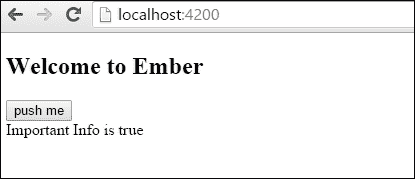
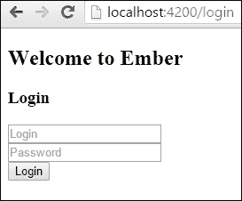
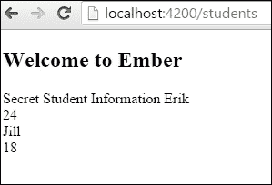
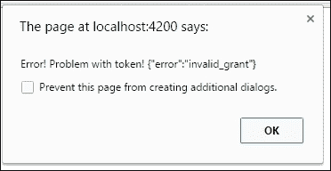
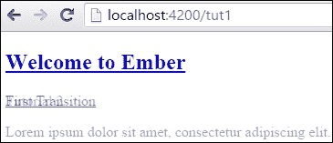
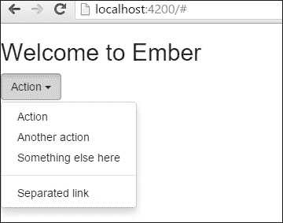
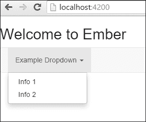

# 第九章. 使用 Ember.js 的实际任务

在本章中，我们将涵盖以下食谱：

+   使用服务与组件

+   管理基本认证

+   使用 **OAuth2** 与 Ember Simple Auth

+   使用 Liquid Fire 创建过渡

+   与 HTML5 拖放一起工作

+   使用 Ember.js 学习 Bootstrap

# 简介

在开发 web 应用程序时，你可能会遇到一些棘手的情况。你可能需要设置认证或动画或添加过渡。你可能需要弄清楚如何在你的应用程序中使用 Bootstrap。这些场景经常发生。

在本章中，我们将介绍一些更常见的实际任务和一些你可以用来使使用 Ember.js 的工作更轻松的食谱。

# 使用服务与组件

在 Ember.js 中，一个服务是一个单例对象，它持有状态。换句话说，它可以在 Ember 应用程序中共享并且不会改变。例如，会话数据、与服务器通信的 API 和 **WebSockets** 是很好的服务候选者。

在这个食谱中，我们将创建并将一个服务注入到组件中。

### 小贴士

**依赖注入**

服务和依赖注入密不可分。**依赖注入**（**DI**）发生在我们将对象在实例化过程中注入到其他对象中时。这意味着我们取一个服务并将其注入到我们的路由、控制器和组件中。这是一个重要的框架概念，不应过度使用。注入过多的服务会破坏关注点分离的设计原则。

## 如何操作...

1.  在一个新应用程序中，生成以下文件：

    ```js
    $ ember g service start
    $ ember g component comp-info
    $ ember g initializer init

    ```

    这些文件将被用来创建我们的应用程序。该服务将包含一个属性和一个返回数据的方法。

1.  开始编辑 `start.js` 服务：

    ```js
    // app/services/start.js
    import Ember from 'ember';

    export default Ember.Service.extend({
        isOn: false,
        importantInfo(){
          return "Important Info is " + this.get('isOn');
        }
    });
    ```

    这是 `services` 文件。它有一个 `isOn` 属性和一个名为 `importantInfo` 的方法，该方法返回一个字符串。在这个例子中，我们想在我们的组件 `comp-info` 中访问这些信息，以便它可以被显示。

1.  编辑组件 `comp-info.js` 文件并添加一个新的动作，该动作使用 `start` 服务的信息：

    ```js
    // app/components/comp-info.js
    import Ember from 'ember';

    export default Ember.Component.extend({
        start: Ember.inject.service(),
        message: null,
        actions: {
          pressMe() {
            this.start.toggleProperty('isOn');
            this.set('message',this.start.importantInfo());
            console.log(this.start.isOn);
          }
        }

    });
    ```

    在组件中，最重要的是 `start` 属性。我们可以使用 `Ember.inject.service()` 将 `start` 服务注入到组件中。按照惯例，属性的名称必须与注入的服务名称匹配。在我们的例子中，`start` 服务将被注入。

    `pressMe` 动作切换 `start` 服务的 `isOn` 属性。然后我们在 `message` 属性中 `set` 从 `importantInfo` 方法返回的文本，以便可以在模板中显示。

1.  向组件的模板信息中添加 `button`：

    ```js
    // app/templates/components/comp-info.hbs
    <button {{action "pressMe"}}>push me</button><br>
    {{message}}
    ```

    在组件中，我们只是给按钮添加了一个动作并显示了一条消息。

1.  将 `comp-info` 组件添加到应用程序模板文件中：

    ```js
    <h2 id="title">Welcome to Ember</h2>

    {{outlet}}
    {{comp-info}}
    ```

    现在模板将显示刚刚创建的组件。

1.  启动 Ember 服务器，它将如下所示：

    按下按钮将切换`isOn`属性。正如您从本例中可以看到的，组件通过服务访问了信息并将其显示到模板中。

1.  创建一个`initializer`，将服务注入到所有组件中：

    ```js
    // app/initializer/init
    export function initialize(app) {
        app.inject('component', 'start', 'service:start');
    }

    export default {
        name: 'init',
        initialize
    };
    ```

    Ember.js 初始化器在应用程序启动时创建。这是一个预加载数据或设置应用程序状态的不错的地方。在`initialize`函数中的`app`参数也被称为`Ember.Application`。它作为依赖声明的注册表。可以注册和注入到应用程序中的工厂（类）。`service:start`是我们之前创建的`start`服务的键。一旦注册了工厂，它就可以在应用程序的任何地方注入。由于`start`服务已经创建，因此不需要注册它。

    `app.inject`接受三个参数。第一个是要注入的类型。第二个是服务的`name`，即`start`。最后，创建`service:start`工厂。

1.  更新组件，使其不再注入`start`服务，因为它已经通过依赖注入可用：

    ```js
    // app/components/comp-info.js
    …
    export default Ember.Component.extend({
        //start: Ember.inject.service(),
        message: null,
    …
    ```

    `start`服务已被注释掉，因此不再可用。组件的其他部分保持不变，因为仍然可以使用`this.get('start')`检索服务。这是由于我们在初始化器中将它注入到了所有组件中。

1.  再次运行服务器，加载的模板将保持相同，并且具有相同的功能。

## 它是如何工作的...

服务是长期存在的 Ember 对象，可以在应用程序的不同部分使用。它们与会话、WebSockets、地理位置、日志记录等一起使用时很好。可以使用`Ember.inject.service`将它们提供给应用程序的其他部分，这是一个可以检索服务并使其可用的方法。

DI 可以用来将服务注入到 Ember 应用程序的许多不同部分。Ember 的架构使用由`Ember.Application`注册的工厂。我们可以使用`Application.inject`方法将服务注入到所有路由、组件和控制台中。

# 管理基本认证

在任何实际的 Ember 应用程序中，在某个时候，您将需要处理认证。例如，用户可能需要向服务器发送他们的凭据以识别自己，或者认证用户可能需要访问应用程序的保护部分。

认证的一个重要方面是基于登录用户保护信息。这可以通过使用令牌创建会话来完成。在本食谱中，我们将使用 Express 服务器创建一个简单的基于令牌的认证。这将帮助我们理解基础知识。在下一节中，我们将介绍使用 OAuth2 与 Ember Simple Auth。

## 如何操作...

1.  在一个新应用程序中，生成以下文件：

    ```js
    $ ember g service session
    $ ember g adapter application
    $ ember g controller login
    $ ember g model student name:string age:number
    $ ember g route login
    $ ember g route students
    $ ember g template index
    $ ember g server index
    $ npm install body-parser –save-dev

    ```

    这将生成我们应用程序所需的所有脚手架。`students` 路径将被保护。它将只在用户认证后从服务器获取信息。

    `ember g server index` 命令将为我们生成一个 node Express 模拟服务器。在前面的章节中，我们使用 Ember CLI Mirage 来进行所有模拟测试。由 Ember 生成的 Express 服务器并不那么强大。然而，它将更容易设置我们的模拟服务器和认证示例。请注意，当将 Ember 应用程序部署到生产环境时，Ember 服务器将不会包含在内。然而，当运行 `ember serve` 命令时，它将自动启动。

1.  创建一个名为 session 的新服务，该服务将处理我们的认证并跟踪已认证的用户：

    ```js
    // app/services/session.js
    import Ember from 'ember';

    export default Ember.Service.extend({
        token: null,
        authenticate(log, pass) {
          return Ember.$.ajax({
            method: 'POST',
            url: '/token',
            data: { username: log, password: pass}
          }).then((info)=>{
            this.set('token',info.access_token);
          });
        }

    });
    ```

    此服务将被注入到我们的登录控制器中。这将跟踪已认证的用户并向服务器发送 Ajax 请求。`authenticate` 方法接受登录名和密码。这些值将使用 HTTP `POST` 方法发送到 `/token`。如果登录信息正确，将返回并保存令牌。如果不正确，将返回错误。我们将在登录控制器中稍后处理此错误。

    将使用 `token` 属性来跟踪用户是否已认证。

1.  更新 Express 服务器 `index.js` 文件。为 `token` 添加一个路由：

    ```js
    // server/index.js
    /*jshint node:true*/

    const bodyParser = require('body-parser');

    module.exports = function(app) {
        app.post('/token', function(req, res) {

          if (req.body.username === 'erik' && req.body.password === 'password') {
            res.send({ access_token: "secretcode" });
          } else {
            res.status(400).send({ error: "invalid_grant" });
          }

        });
    };
    ```

    这是我们的 node Express 服务器。它将在我们启动 Ember 服务器时运行。当向服务器发送 HTTP `POST` `/token` 请求时，它将检查正文 `username` 和 `password`。对于此示例，我们将直接将它们硬编码为 `'erik'` 和 `'secretcode'`。如果这些匹配，它将返回 `access_token`。如果不匹配，它将返回无效消息。

    访问令牌将被保存在 session 服务中。我们可以使用此令牌来认证对服务器的未来请求。

1.  更新 `application.js` 文件。添加一个新的授权头：

    ```js
    // app/adapters/application.js
    import DS from 'ember-data';
    import Ember from 'ember';

    export default DS.RESTAdapter.extend({
        namespace: 'api',
        session: Ember.inject.service(),
        headers: Ember.computed('session.token',function(){
          return {
            'Authorization': `Bearer ${this.get('session.token')}`
          };
        })
    });
    ```

    在我们的应用程序中，访问学生路由将触发对服务器的请求。服务器只会对已认证的用户做出响应。服务器期望每个 Ember Data 请求都带有授权 bearer 头。我们可以使用 `headers` `computed` 属性，并返回来自服务的 `Authorization: Bearer` 头和密钥令牌。使用 Ember Data 向服务器发送的每个请求都将发送此头。

1.  更新 Express 服务器索引信息，以便在令牌匹配时将信息返回给应用程序：

    ```js
    // app/server/index.js
    …
        app.use(bodyParser.urlencoded({ extended: true }));

        app.get('/api/students', function (req, res) {

          if (req.headers.authorization !== "Bearer secretcode") {
            return res.status(401).send('Unauthorized');
          }

          return res.status(200).send({
            students: [
              { id: 1, name: 'Erik', age: 24 },
              { id: 2, name: 'Suze', age: 32 },
              { id: 3, name: 'Jill', age: 18 }
            ]

          });
        });
    …
    ```

    在 `app.post` 之上，你可以为 `students` 路径添加 `app.get`。每当 Ember 进入 `/students` 路径时，它将触发这个 HTTP GET 请求。服务器将检查请求头是否包含密钥代码。如果匹配，它将返回 `students` 路径的正确 JSON 数据。如果不匹配，它将返回 401 错误。

1.  验证学生路由和模型信息：

    ```js
    // app/models/student.js
    import DS from 'ember-data';

    export default DS.Model.extend({
        name: DS.attr('string'),
        age: DS.attr('number')
    });
    ```

1.  之前，我们使用两个属性 `name` 和 `age` 生成此文件：

    ```js
    // app/routes/students.js
    import Ember from 'ember';

    export default Ember.Route.extend({
        model() {
          return this.store.findAll('student');
        }
    });
    ```

1.  学生路由将向 `/students` 发送一个 HTTP GET 请求以检索学生模型。由于我们定义应用程序使用 REST 适配器，Ember 将期望数据以 REST 格式：

    ```js
    // app/templates/students.hbs
    Secret Student Information
    {{#each model as |student|}}
        {{student.name}}<br>
        {{student.age}}<br>
    {{/each}}
    ```

    学生模板使用 `each` 辅助函数遍历从服务器返回的模型。它显示每个 `name` 和 `age`。

1.  将登录用户名和属性信息添加到登录模板中：

    ```js
    // app/templates/login.hbs
    <h3>Login</h3>

    {{input value=loginName placeholder='Login'}}<br>
    {{input value=password placeholder='Password' type='password'}}<br>
    <button {{action 'authenticate'}}>Login</button>
    ```

    此模板使用 `input` 辅助函数为 `loginName` 和 `password` 属性。按钮触发 `authenticate` 动作。

1.  更新登录控制器以处理 `authenticate` 动作：

    ```js
    // app/controllers/login.js
    import Ember from 'ember';

    export default Ember.Controller.extend({
        loginName: null,
        password: null,
        session: Ember.inject.service(),
        actions: {
          authenticate(){
            this.get('session').authenticate(this.get('loginName'), this.get('password')).then( ()=>{
              alert('Great you are logged in!');
              this.transitionToRoute('students');
            },(err)=>{
              alert('Error! Problem with token! '+ err.responseText);
            });
          }
        }
    });
    ```

    控制器有几个属性。它检索会话信息服务并使用 `authenticate` 方法将登录信息发送到服务器。`authenticate` 方法返回一个承诺。如果成功，应用程序将过渡到 `students` 路由。如果不成功，将在警告框中显示错误。在此示例中，我们使用了 ES6 箭头函数。`()=>` 箭头函数比使用函数表达式要短一些，并且它还词法绑定此变量。

1.  在索引中添加一个链接以登录：

    ```js
    // app/templates/index.hbs
    Welcome to my app! Login {{#link-to 'login'}}here{{/link-to}}
    ```

    这只是一个简单的登录路由链接。

1.  启动服务器并导航到登录路由。您将看到以下图像：

1.  要登录，请输入用户名 `'erik'` 和密码 `'password'`。点击 `登录` 后，将带有用户名和密码信息的 HTTP POST 请求发送到服务器。我们之前设置的 Express 服务器将响应令牌，会话服务将保存它。然后，应用程序将过渡到学生路由。以下屏幕将显示：

1.  当此路由加载时，将向 `/students` 发送一个 HTTP GET 请求。Express 服务器将检查以确保授权载体头包含正确的密钥代码。然后，它将响应 Ember 将显示的 JSON 数据。

1.  如果用户名或密码不匹配，将显示以下警告框：

## 它是如何工作的...

基于令牌的认证要求客户端向服务器发送凭据。如果授权，服务器随后将发送一个令牌，客户端将其保存并用于随后的服务器请求。如果令牌不存在，服务器可能不会向客户端返回数据。

此配方是使用认证的简单示例。它缺少适当的错误处理和会话持久性。尽管如此，它为您提供了认证是如何工作的一个想法。

# 使用 OAuth2 和 Ember Simple Auth

OAuth2 为网络应用程序指定了授权流程。我们可以使用它与 Ember 保护我们的应用程序，并只为授权用户提供数据。在此配方中，我们将查看如何使用 OAuth2 与 **Ember Simple Auth**（**ESA**），这是一个强大的 Ember 扩展。

ESA 将处理我们的客户端会话和认证，并将请求发送到服务器。它非常可定制和可扩展。尽管它可能很复杂，就像我们上一个食谱一样，我们将创建一个只能由授权用户访问的保护学生路由。

## 准备工作

为了本例的目的，我们需要一个 OAuth2 服务器。设置 OAuth2 服务器超出了本食谱的范围。有多个 OAuth2 库可供使用来设置一个服务器。我推荐以下：

+   **Rails**: [`github.com/doorkeeper-gem/doorkeeper`](https://github.com/doorkeeper-gem/doorkeeper)

+   **Express**: [`github.com/thomseddon/node-oauth2-server`](https://github.com/thomseddon/node-oauth2-server)

## 如何操作...

1.  在一个新的 Ember 应用程序中，运行生成器命令以创建所需的文件：

    ```js
    $ ember g adapter application
    $ ember g component login-comp
    $ ember g controller login
    $ ember g controller students
    $ ember g model student name:string age:number
    $ ember g route students
    $ ember g route application
    $ ember g route login
    $ ember g template index
    $ ember install ember-simple-auth

    ```

    这将生成我们开始应用程序所需的脚手架。最后一个命令安装了 ESA 的插件。

1.  我们将首先设置 Ember Simple Auth 认证器和授权器以支持 OAuth2。我们需要设置它，以便用户可以与服务器进行认证。在`app`文件夹中创建两个新的目录，分别命名为`authenticators`和`authorizers`。

1.  在`authenticators`目录中添加一个名为`oauth2-custom.js`的新文件，并在`authorizers`文件夹中添加`application.js`。添加以下代码：

    ```js
    // app/authenticators/oauth2-custom.js
    import Authenticator from 'ember-simple-auth/authenticators/oauth2-password-grant';
    import Ember from 'ember';

    export default Authenticator.extend({
        makeRequest(url, data) {

          var client_id = '123';
          var client_secret = 'secret';
          data.grant_type = 'password';

          return Ember.$.ajax({
            url: this.serverTokenEndpoint,
            type: 'POST',
            data: data,
            dataType: 'json',
            contentType: 'application/x-www-form-urlencoded',
            crossDomain: true,
            headers: {
              Authorization: "Basic " + btoa(client_id + ":" + client_secret)
            }
          });
        }
    });
    ```

    当用户登录时，ESA 会使用`authenticators`文件。如果需要，我们可以覆盖认证器中的任何内容。`makeRequest`方法用于向服务器发送消息。默认情况下，ESA 将使用包含用户名和密码的表单字段的 HTTP `POST`请求发送到`/token`。

1.  不幸的是，许多 OAuth2 服务器在首次使用服务器进行认证时需要名为`Authorization` `Basic`的头部，其中包含秘密客户端 ID 和客户端密钥。为了解决这个问题，我们可以通过我们的自定义 Ajax 请求扩展`makeRequest`方法。这将在我们登录时使用：

    ```js
    // app/authorizers/application.js
    import OAuth2Bearer from 'ember-simple-auth/authorizers/oauth2-bearer';

    export default OAuth2Bearer.extend();
    ```

    `authorizers`文件由 ESA 使用，以告诉我们使用哪种类型的认证。在本例中，我们使用`OAuth2Bearer.extend()`定义的 Oauth2。

1.  更新适配器并将 ESA 数据适配器混入添加到`adapters`文件夹中的`application.js`文件：

    ```js
    // app/adapters/application.js
    import DS from 'ember-data';

    import DataAdapterMixin from 'ember-simple-auth/mixins/data-adapter-mixin';

    export default DS.RESTAdapter.extend(DataAdapterMixin, {
        namespace: 'api',
        authorizer: 'authorizer:application'
    });
    ```

    适配器告诉 Ember 将所有请求发送到`/api`命名空间。ESA 的`DataAdapterMixin`用于定义应用程序将使用的授权器。在这种情况下，所有 Ember Data 请求都将使用我们之前定义的 OAuth2 应用程序授权器。换句话说，任何使用 Ember Data 发送到服务器的请求，如果存在，都将包含会话数据令牌。

1.  让我们更新我们的`login-comp`组件模板：

    ```js
    // app/templates/components/login-comp.hbs
    <h2>Login page</h2>

    <form {{action 'authenticate' on='submit'}}>
        {{input value=login placeholder='Login'}}<br>
        {{input value=password placeholder='Password' type='password'}}<br>
        <button type="submit">Login</button>
    </form>
    ```

    这将提交`login`和`password`到我们在组件中设置的`authenticate`操作。

1.  更新登录页面组件的`authenticate`操作：

    ```js
    // app/components/login-comp.js
    import Ember from 'ember';

    export default Ember.Component.extend({

        auth: Ember.inject.service('session'),
        login: null,
        password: null,
        actions: {
          authenticate() {
            this.get('auth').authenticate('authenticator:oauth2-custom', this.get('login'),this.get('password')).then(() => {
              alert('Thanks for logging in!');
              this.get('transition')();
              }, () => {
                alert('Wrong user name or password!');
              });
             }
          }

    });
    ```

    由于我们使用欧空局（ESA），我们可以访问一个 `session` 服务。这个 `session` 服务有一个 `authenticate` 方法，它使用我们之前创建的 `authenticator`。在上面的代码中，我们使用 `this.get()` 方法从我们的模板中获取 `login` 和 `password`。然后我们在我们的服务上调用 `authenticate` 方法，并传入我们的 `authenticator`。

    如果服务器返回成功消息，那么我们调用 `transition` 方法，这是一个传递给组件的方法。如果不成功，则弹出一个警告框告诉用户他们的登录不成功。

1.  将登录页面组件添加到登录模板中，并更新登录控制器：

    ```js
    // app/templates/login.hbs
    {{login-comp transition=(action 'loggedIn')}}
    ```

    这调用登录组件并传入父级动作 `loggedIn`：

    ```js
    // app/controllers/login.js
    import Ember from 'ember';

    export default Ember.Controller.extend({
        actions: {
          loggedIn(){
            this.transitionToRoute('students');
          }
        }
    });
    ```

    这个动作将应用过渡到 `students` 路由。它仅在成功登录时触发。它也是传递给登录页面组件的动作的名称。

1.  更新学生控制器、路由和模板：

    ```js
    // app/templates/students.hbs
    <h2>Students</h2>
    {{#each model as |student|}}
        <h3>Student: {{student.name}} </h3>
        <h3>Age: {{student.age}} </h3>
    {{/each}}

    <button {{action 'logout'}}>Log Out</button>
    ```

    模板使用 `each` 辅助函数显示来自服务器的信息。一个 `logout` 按钮动作将用户登出：

    ```js
    // app/controllers/students.js
    import Ember from 'ember';

    export default Ember.Controller.extend({
        auth: Ember.inject.service('session'),
        actions: {
          logout(){
            this.get('auth').invalidate();
          }
        }
    });
    ```

1.  `logout` 动作使会话无效。使会话无效将吊销令牌，使其不再可用：

    ```js
    // app/routes/students.js
    import Ember from 'ember';
    import AuthenticatedRouteMixin from 'ember-simple-auth/mixins/authenticated-route-mixin';

    export default Ember.Route.extend(AuthenticatedRouteMixin,{
        model(){
          return this.store.findAll('student');
        }
    });
    ```

    这个路由返回 `student` 模型的所有信息。你会注意到添加了 `AuthenticatedRouteMixin`。这告诉 Ember 只有在服务器认证后，这个路由才是可用的。如果没有认证，它将路由回应用。

1.  将应用程序混合添加到应用程序路由：

    ```js
    // app/routes/application.js
    import Ember from 'ember';

    import ApplicationRouteMixin from 'ember-simple-auth/mixins/application-route-mixin';

    export default Ember.Route.extend(ApplicationRouteMixin);
    ```

    欧空局（ESA）的 `ApplicationRouteMixin` 将捕获任何错误并过渡到登录路由。

1.  使用链接到索引模板中的登录路由：

    ```js
    // app/templates/index.hbs
    Hello! Want to login? Click {{#link-to 'login'}}here!{{/link-to}}
    ```

    `link-to` 辅助函数链接到 `login` 路由。

1.  启动 Ember 服务器和 OAuth2 服务器：

    ```js
    $ ember serve –-proxy http://localhost:3000

    ```

    `--proxy` 参数告诉 Ember 将所有服务器请求代理到 `localhost` 的 `3000` 端口。在这个例子中，我们将假设 OAuth2 服务器正在你的本地机器上的 `3000` 端口上运行。

    成功登录看起来像这样：

    

    然后，它将重定向到学生路由。这个路由将向服务器发送一个带有正确令牌的授权携带请求。它将接收学生数据，以便将其显示给用户：

    

    如果未登录就访问此路由，将导致重定向到登录页面。

## 它是如何工作的...

Ember Simple Auth 插件管理会话、身份验证、授权、持久化和与服务器的通信。它有一个内置的会话服务，这使得管理变得容易。

OAuth2 是在 Web 应用中进行身份验证时的一种流类型的规范。由于 Ember 是单页应用，应用端的安全性不高。它必须依赖于服务器来进行身份验证和管理令牌。ESA 通过处理与服务器发送和通信所需的所有工作来实现这一点。

# 使用 Liquid Fire 创建过渡

**Ember Liquid Fire** 是一个处理动画和转换的 Ember 插件。它是一种工具包，将责任分割为模板标题、转换映射和转换。

在这个菜谱中，我们将创建几个转换来查看这个插件是如何工作的。

## 如何做到这一点...

1.  在一个新的 Ember 应用程序中，生成以下文件：

    ```js
    $ ember g route tut1
    $ ember g route tut2
    $ ember g template index
    $ ember install liquid-fire

    ```

    这将为 `tut1` 和 `tut2` 路由生成脚手架，并安装 `liquid-fire` 插件。

1.  在 `app` 文件夹的根目录中创建一个新的 `transitions.js` 文件。添加一些转换：

    ```js
    // app/transitions.js
    export default function(){
        this.transition(
          this.fromRoute('tut1'),
          this.toRoute('tut2'),
          this.use('toRight'),
          this.reverse('toLeft')

        );
        this.transition(
          this.fromRoute('index'),
          this.toRoute('tut1'),
          this.use('crossFade'),
          this.reverse('fade',{duration: 500})

        );

    }
    ```

    Liquid Fire 需要一个转换映射文件。有多个预定义的转换可供使用：

    +   `toLeft`

    +   `toRight`

    +   `toUp`

    +   `toDown`

    +   `crossFade`

    +   `fade`

    每一个都表现得像您预期的那样。`toLeft` 转换将创建一个从左到右移动页面的转换动画。`toRight` 转换则正好相反。如果需要，您也可以创建自己的动画。

    这个映射告诉我们从一条路由移动到另一条路由时应该使用哪些转换。

1.  使用 Liquid Fire 输出更新应用程序模板：

    ```js
    // app/templates/application.hbs
    {{#link-to 'application'}}<h2 id="title">Welcome to Ember</h2>{{/link-to}}
    {{liquid-outlet}}
    ```

    要使用 Liquid Fire 转换，我们必须使用 `liquid-outlet`。这用于在路由之间进行转换。以下是所有可用的模板助手：

    +   `{{#liquid-outlet}}`：在路由之间进行转换

    +   `{{#liquid-with}}`：在单个路由中在模型或上下文之间进行转换

    +   `{{#liquid-bind}}`：这更新到简单的绑定值

    +   `{{#liquid-if}}`：在 `#if` 语句中在 true 和 false 分支之间切换

    +   `{{#liquid-spacer}}`：这提供了一个平滑增长/缩小的容器，当包含的 **文档对象模型** (**DOM**) 发生变化时，它会进行动画处理

1.  在索引模板文件中，添加一个链接到 `tut1` 路由：

    ```js
    // app/templates/index.hbs
    {{#link-to 'tut1'}}First Transition{{/link-to}}<br>
    {{liquid-outlet}}
    ```

    `link-to` 助手转换到 `tut1` 路由。当渲染时，液体输出将显示 `tut1` 路由。

1.  更新 `tut1` 和 `tut2` 路由模板：

    ```js
    // app/templates/tut1.hbs
    {{#link-to 'tut2'}}Tutorial 2{{/link-to}}<br>
    <div class="demo">
        <p>
        Lorem ipsum dolor sit amet, consectetur adipiscing elit.In non aliquet quam. Vivamus egestas mi sapien, augue.
        </p>
    </div>

    {{liquid-outlet}}
    ```

    所有这些只是有一个链接到第二个路由 `tut2`：

    ```js
    // app/templates/tut2
    {{#link-to 'tut1'}}Tutorial 1{{/link-to}}<br>

    <div class='demo'>
    <p>
    Quisque molestie libero vel tortor viverra. Quisque eu posuere sem. Aenean ut arcu quam. Morbi orci dui, dictum ut libero in, venenatis tempor nulla. Nullam convallis mauris ante, sed venenatis augue auctor in. Morbi a mi a sapien dictum interdum. Quisque faucibus malesuada risus eget pretium. Ut elementum sapien ut nunc eleifend, at dapibus enim dignissim.
    </p>
    </div>
    {{liquid-outlet}}
    ```

    这有一个链接回到 `tut1`。

1.  运行服务器，您将在点击链接时看到转换：

    这是在转换过程中使用交叉淡入从应用程序路由到 `tut1` 路由时的样子。

## 它是如何工作的...

Liquid Fire 是 Ember 的一个多功能插件，它为 Ember 带来了生命力和动画。它使用简单的转换映射和模板助手来简化操作。在底层，Liquid Fire 使用许多技巧来实现这些动画。它是可扩展的，因此您可以创建自己的转换。

# 使用 HTML5 拖放

拖放是 HTML5 标准的一部分。它允许用户在 DOM 中抓取对象并将它们拖放到不同的位置。如果浏览器支持，任何元素都可以被拖放。大多数现代浏览器都支持。

在这个菜谱中，我们将看到一个例子，将 IMG 文件拖动到屏幕上的拖放区域。

## 如何做到这一点...

1.  在一个新的应用程序中，生成以下文件：

    ```js
    $ ember g component drag-drop-zone
    $ ember g component drag-drop

    ```

    `drag-drop-zone`组件将代表每个项目将被放置的区域。`drag-drop`组件将是将被放置的项目。

1.  编辑`drag-drop-zone.js`文件：

    ```js
    // app/components/drag-drop-zone.js
    import Ember from 'ember';

    export default Ember.Component.extend({
        classNames: ['draggable-dropzone'],
        classNameBindings: ['dragClass'],
        dragClass: 'deactivated',
        dragLeave(event) {
          event.preventDefault();
          return this.set('dragClass', 'deactivated');
        },
        dragOver(event) {
          event.preventDefault();
          return this.set('dragClass', 'activated');
        },
        drop(event) {
          var data;
          this.set('dragClass', 'deactivated');
          data = event.dataTransfer.getData('text/data');
          event.target.appendChild(document.getElementById(data));
        }

    });
    ```

    此组件附加了一些特殊事件。Ember 内置了`dragLeave`、`dragOver`和`drop`事件。每当项目被拖到组件上时，这些事件都会触发。记住，所有组件都以`div`标签的形式渲染。我们可以使用`classNames`属性添加更多类。

    `classNameBindings`属性允许将类添加到组件中，就像它们是属性一样。换句话说，`dragClass`可以在组件中动态设置。我们将使用它来改变当项目被拖过时`drop`区域的颜色。当项目被放置时，将触发`drop`事件。

1.  更新拖放组件：

    ```js
    // app/components/drag-drop.js
    import Ember from 'ember';

    export default Ember.Component.extend({
        tagName: 'img',
        classNames: ['draggable-item'],
        attributeBindings: ['draggable','src'],
        draggable: 'true',
        src: 'http://www.programwitherik.com/content/images/2015/02/eriksmall3-1.png ',
        dragStart(event){
          event.dataTransfer.setData('text/data', event.target.id);
        }
    });
    ```

    如前所述，通常，组件以`div`标签的形式渲染。然而，我们可以使用`tagName`属性来改变这一点。在`drag-drop`组件中，我们正在创建一个`image`标签。在 Ember 中可用`dragStart`事件。在这个例子中，我们将数据设置为目标 ID。

    要在 HTML5 中拖动项目，必须在标签上有一个`draggable`属性。它也必须设置为`true`。我们将使用`attributeBindings`来实现这一点。

1.  更新`app.css`文件：

    ```js
    // app/styles/app.css
    .draggable-dropzone {
        border: 1px solid black;
        width: 200px;
        height:200px;

    }

    .activated {
        border: 4px solid red;
    }
    ```

    这是一些基本的`css`，它为`drop`区域创建了一个边框，并在项目即将被放置时将颜色改为`red`。

1.  最后一步是将组件添加到应用程序模板文件中：

    ```js
    // app/templates/application.hbs
    <h2 id="title">Welcome to Ember</h2>

    <br>
    {{drag-drop-zone}}

    <br>
    <br>
    <br>
    {{drag-drop}}
    {{outlet}}
    ```

    这将渲染两个组件到应用程序模板中。

1.  渲染页面，您将看到图片和`dropzone`：

    您可以将图片拖入框中：

    

    在项目放置之前，框会变成红色，在放置后恢复为黑色。

## 它是如何工作的...

HTML5 标准允许拖放元素。Ember 在组件和控制器中提供了几个内置事件，我们可以使用这些事件来捕获事件以允许拖放。`dragLeave`、`dragOver`、`drop`和`dragStart`方法都可以用来捕获事件。

# 使用 Ember.js 学习 Bootstrap

Bootstrap，以前称为 Twitter Bootstrap，是一个流行的、免费的、开源的工具集合，用于创建网站和应用。它包含多个模板，用于排版、表单、按钮和导航。

您可以使用 Bootstrap 创建漂亮且简单的用户界面。在这个菜谱中，我们将使用它来创建一个下拉菜单。

## 如何操作...

1.  在一个新的 Ember 应用程序中，使用 Bower 安装 Bootstrap 的最新版本：

    ```js
    $ bower install bootstrap --save-dev 

    ```

    这使用 Bower 的前端包管理器来安装 Bootstrap。它将被保存为`bower.json`文件中的开发依赖项。

1.  更新`ember-cli-build.js`文件并添加 Ember Bootstrap 库：

    ```js
    // ember-cli-build.js
    /* global require, module */
    var EmberApp = require('ember-cli/lib/broccoli/ember-app');

    module.exports = function(defaults) {
        var app = new EmberApp(defaults, {
          // Add options here
        });

        app.import('bower_components/bootstrap/dist/js/bootstrap.js');
        app.import('bower_components/bootstrap/dist/css/bootstrap.css');
        return app.toTree();
    };
    ```

    `app.import`语句将资产路径作为第一个也是唯一的参数。这对于非 AMD 资产是标准的。一旦加载，我们就可以在应用程序的任何地方使用 Bootstrap。

1.  将下拉按钮添加到应用程序模板中：

    ```js
    // app/templates/application.hbs
    <h2 id="title">Welcome to Ember</h2>

    {{outlet}}

    <!-- Single button -->
    <div class="btn-group">
    <button type="button" class="btn btn-default dropdown-toggle" data-toggle="dropdown" aria-haspopup="true" aria-expanded="false">
    Action <span class="caret"></span>
    </button>
    <ul class="dropdown-menu">
    <li><a href="#">Action</a></li>
    <li><a href="#">Another action</a></li>
    <li><a href="#">Something else here</a></li>
    <li role="separator" class="divider"></li>
    <li><a href="#">Separated link</a></li>
    </ul>
    </div>
    ```

    这将添加一个下拉按钮。

1.  启动服务器，你将看到渲染后的按钮：

    点击按钮后，菜单将会显示。

1.  让我们安装 Bootstrap Ember 附加组件，并在 `ember-cli-build.js` 文件中取消注释 `app.imports`：

    ```js
    $ ember install ember-bootstrap

    ```

    Ember Bootstrap 是一个附加组件，它包含了项目中所有的正常 `css` 和图标资产。它还包括一组本地的 Ember 组件。它不使用 Bootstrap JavaScript 文件：

    ```js
    // ember-cli-build.js
    …
    //app.import('bower_components/bootstrap/dist/js/bootstrap.js');
    //app.import('bower_components/bootstrap/dist/css/bootstrap.css');
    …
    ```

    由于我们正在使用附加组件，我们必须在 `Bootstrap` 文件中取消注释。它们已经被包含在内。

1.  使用新的 Ember Bootstrap 组件更新应用程序模板文件：

    ```js
    // app/templates/application.hbs
    <h2 id="title">Welcome to Ember</h2>

    <nav class="navbar navbar-default navbar-static">
        <div class="container-fluid">
          <ul class="nav navbar-nav">
            {{#bs-dropdown tagName="li"}}
            {{#bs-dropdown-toggle}}Example Dropdown <span class="caret"></span>{{/bs-dropdown-toggle}}
              {{#bs-dropdown-menu}}
                <li>{{#link-to "info1"}}Info 1{{/link-to}}</li>
                <li>{{#link-to "info2"}}Info 2{{/link-to}}</li>
              {{/bs-dropdown-menu}}
            {{/bs-dropdown}}
          </ul>
        </div>
    </nav>

    {{outlet}}
    ```

    所有 Ember Bootstrap 组件都以 `bs` 开头。`{{bs-dropdown}}` 组件创建一个下拉菜单，显示用户链接。

    使用 Ember Bootstrap 可能会比使用 Bower 安装 Bootstrap 更干净、更简单。

1.  加载服务器，你将看到以下图片：

    这是在使用 Ember Bootstrap 创建菜单。

## 它是如何工作的...

Bootstrap 是一套多功能的工具集，可以帮助你快速设计前端。Ember 使用名为 Broccoli 的库来接受资产。Broccoli 是一个资产管道——它帮助构建应用程序。`app.import` 语句用于将 AMD 和非 AMD 资产引入应用程序。

另一方面，Ember Bootstrap 库也可以使用。它内置了易于使用的组件，使得添加按钮和菜单变得简单。
